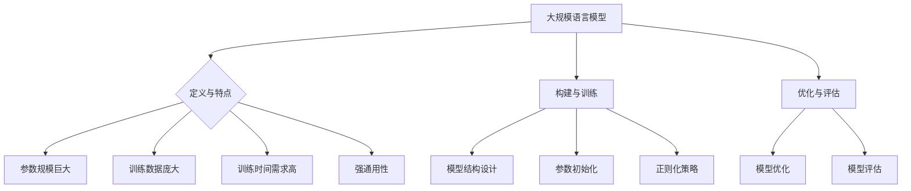
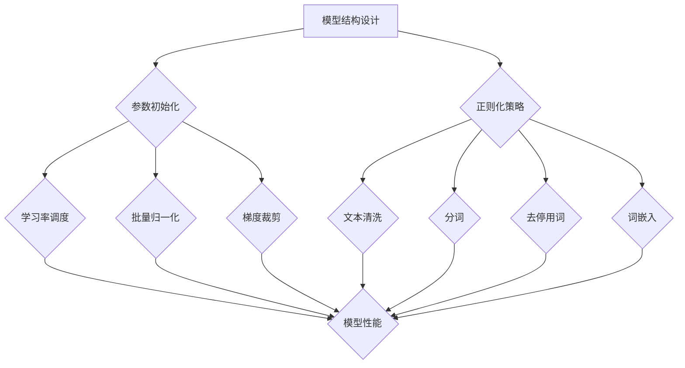
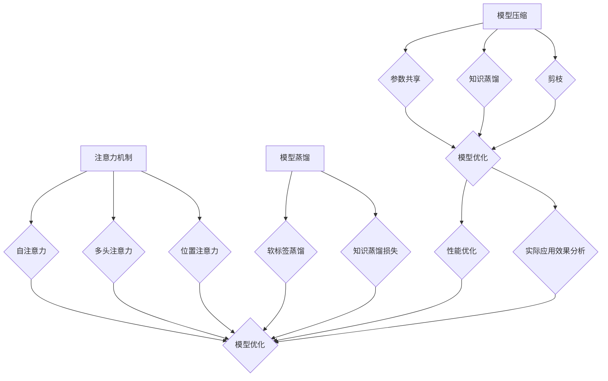
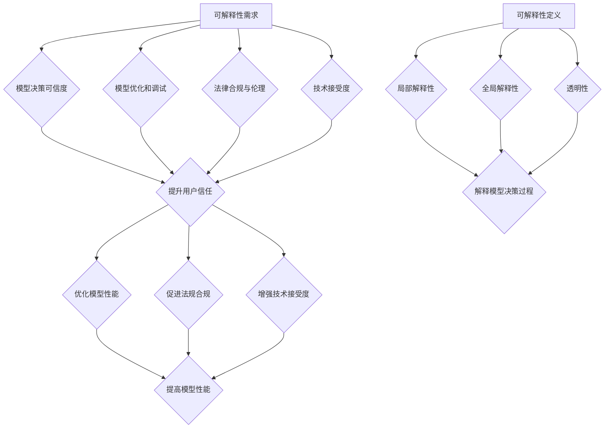
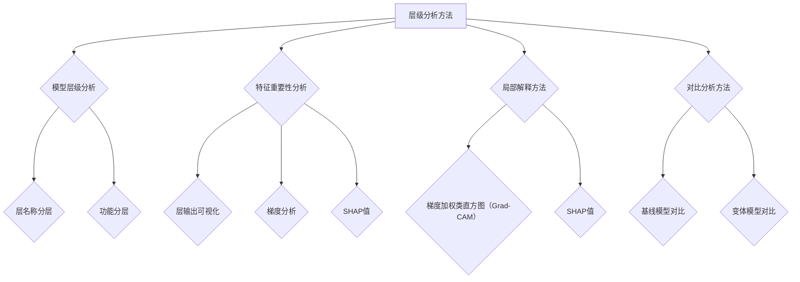
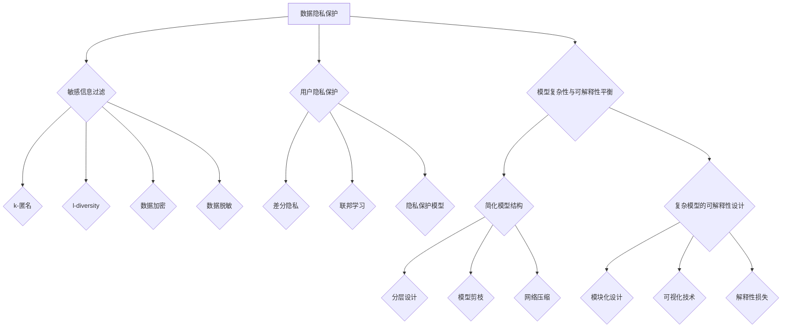
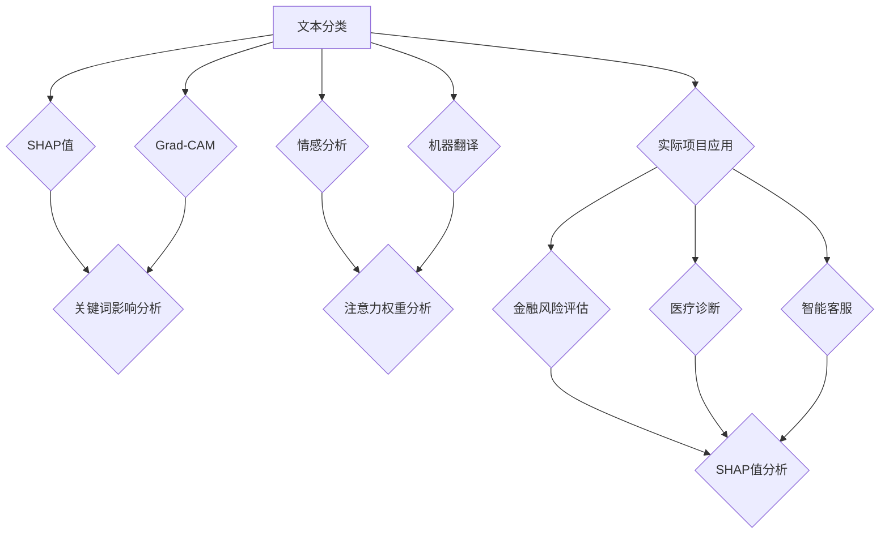
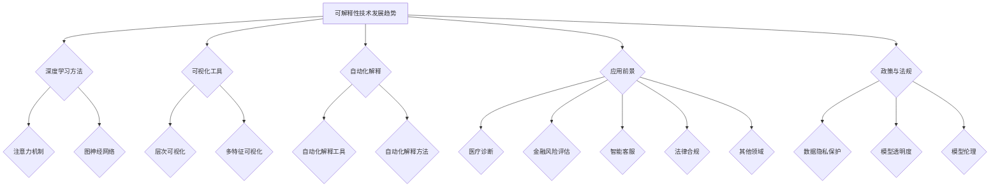

                 

### 大规模语言模型概述

#### 第1章：大规模语言模型的起源与发展

#### 1.1 大规模语言模型的定义与特点

##### 1.1.1 大规模语言模型的定义

大规模语言模型（Large-scale Language Models）是指利用海量数据训练得到，参数规模达到百万甚至千亿级别的神经网络模型。这种模型通常用于文本生成、翻译、问答系统、情感分析等自然语言处理（NLP）任务。代表性的模型有OpenAI的GPT系列、Google的BERT等。

##### 1.1.2 大规模语言模型的主要特点

- **参数规模巨大**：大规模语言模型的参数数量达到百万、千万甚至亿级别，使得模型具有丰富的知识储备和强大的表达能力。
- **训练数据庞大**：这些模型通常基于大规模文本语料库进行训练，如维基百科、书籍、新闻、社交媒体等，确保模型能够掌握广泛的语言规律。
- **训练时间需求高**：由于模型参数量大，训练时间往往以月为单位，对计算资源的需求非常高。
- **强通用性**：大规模语言模型具有强通用性，能够在多个NLP任务中表现出色，而不仅仅局限于单一任务。

##### 1.1.3 大规模语言模型与传统语言模型对比

- **参数规模**：传统语言模型通常参数规模较小，如几十万到几百万级别；而大规模语言模型则达到亿级别。
- **训练数据**：传统语言模型使用的数据规模相对较小，通常为数千到数百万句子；大规模语言模型使用的数据规模通常为数十亿到数千亿句子。
- **训练时间**：传统语言模型的训练时间较短，通常以天为单位；而大规模语言模型的训练时间通常以月为单位。
- **应用范围**：传统语言模型通常应用于特定的NLP任务，如文本分类、命名实体识别等；而大规模语言模型具有强通用性，能够应用于多个NLP任务。

#### 第2章：大规模语言模型的构建与训练

##### 2.1 大规模语言模型的构建

大规模语言模型的构建主要包括以下几个方面：

- **模型结构设计**：设计模型的基本框架，如Transformer架构、BERT架构等。
- **参数初始化**：对模型参数进行初始化，常用的方法有随机初始化、高斯分布初始化等。
- **正则化策略**：为了防止过拟合，通常在模型训练过程中使用正则化策略，如Dropout、L2正则化等。

##### 2.2 大规模语言模型的训练

大规模语言模型的训练主要包括以下几个方面：

- **梯度下降算法**：常用梯度下降算法（如Adam优化器）来更新模型参数。
- **优化策略**：为了提高模型训练效率，可以采用一些优化策略，如学习率调度、批量归一化等。
- **训练数据预处理**：对训练数据进行预处理，如文本清洗、分词、去停用词等，以提高模型训练效果。

#### 第3章：大规模语言模型的优化与评估

##### 3.1 模型优化

为了提高大规模语言模型在特定任务上的性能，可以采用以下优化方法：

- **模型压缩**：通过参数共享、知识蒸馏等方法减小模型参数规模，提高模型在资源受限环境下的表现。
- **模型蒸馏**：将大规模语言模型的知识传递给小模型，使小模型在特定任务上具备良好的性能。
- **注意力机制**：利用注意力机制提高模型对关键信息的捕捉能力，从而提高模型性能。

##### 3.2 模型评估

大规模语言模型的评估主要包括以下几个方面：

- **评估指标**：常用的评估指标包括准确率、召回率、F1值等，用于衡量模型在特定任务上的性能。
- **性能优化**：通过调整模型结构、训练策略等，提高模型在评估指标上的表现。
- **实际应用效果分析**：在实际应用场景中评估模型的表现，以验证模型在实际任务中的有效性。

### 关键词

- 大规模语言模型
- Transformer
- BERT
- 梯度下降
- 优化策略
- 模型压缩

### 摘要

本文介绍了大规模语言模型的定义与特点，构建与训练方法，以及优化与评估策略。通过对比传统语言模型，本文强调了大规模语言模型的参数规模巨大、训练数据庞大、训练时间需求高和强通用性等特点。此外，本文还探讨了大规模语言模型的优化方法，如模型压缩、模型蒸馏和注意力机制，以及评估指标和实际应用效果分析。本文旨在为读者提供关于大规模语言模型全面、深入的了解。

---

以下是第1章的核心概念原理和概念实体之间的关系架构 Mermaid 流程图：



接下来，我们将逐步深入探讨大规模语言模型的构建与训练，包括模型结构设计、参数初始化、正则化策略、梯度下降算法、优化策略和训练数据预处理等核心内容。

---

### 第2章：大规模语言模型的构建与训练

#### 2.1 大规模语言模型的构建

大规模语言模型的构建是NLP领域的一项关键任务。在这一部分，我们将详细探讨模型结构设计、参数初始化和正则化策略。

##### 2.1.1 模型结构设计

大规模语言模型的结构设计通常基于先进的深度学习架构，如Transformer和BERT。以下是这些模型结构的基本概述：

1. **Transformer架构**：由Vaswani等人在2017年提出，主要特点是自注意力机制（Self-Attention）和多层堆叠（Multi-Layered）。Transformer通过多头注意力（Multi-Head Attention）和前馈神经网络（Feedforward Neural Network）来捕捉输入序列的上下文信息。

2. **BERT架构**：由Devlin等人在2018年提出，基于Transformer架构进行了改进。BERT的主要特点包括双向编码表示（Bidirectional Encoder Representations from Transformers）和预训练与微调策略。BERT通过预训练大量无标签数据，然后对特定任务进行微调，从而实现优异的性能。

##### 2.1.2 参数初始化

参数初始化是大规模语言模型构建的重要环节。合理的参数初始化有助于加速模型收敛，提高最终性能。以下是几种常见的参数初始化方法：

1. **随机初始化**：将模型参数随机分配一个较小的值，例如在[-0.01, 0.01]范围内均匀分布。随机初始化简单易行，但可能导致训练时间较长。

2. **高斯分布初始化**：将模型参数初始化为均值为0、标准差为1的高斯分布。这种方法有助于减少初始参数之间的相关性，从而加速模型收敛。

3. **Xavier初始化**：由Xavier Glorot和Yoshua Bengio在2010年提出，适用于ReLU激活函数。Xavier初始化通过保持输入层和隐藏层的方差相等来避免梯度消失问题。

##### 2.1.3 正则化策略

正则化策略是防止模型过拟合的重要手段。以下是一些常用的正则化方法：

1. **Dropout**：在训练过程中随机丢弃部分神经元及其连接，从而减少模型对特定数据的依赖。Dropout可以有效防止过拟合，但可能导致模型训练时间增加。

2. **L2正则化**：在损失函数中加入L2正则项，即$$\lambda \sum_{i} \sum_{j} w_{ij}^2$$，其中$$w_{ij}$$是权重。L2正则化可以通过增加模型复杂度来降低过拟合风险。

3. **数据增强**：通过对训练数据进行各种变换（如旋转、翻转、缩放等），增加模型的训练样本多样性，从而提高模型泛化能力。

#### 2.2 大规模语言模型的训练

大规模语言模型的训练通常涉及以下步骤：

1. **数据预处理**：对训练数据进行清洗、分词、去停用词等处理，以减少噪声和冗余信息。

2. **定义损失函数**：选择合适的损失函数，如交叉熵损失（Cross-Entropy Loss），用于衡量模型预测与真实标签之间的差距。

3. **选择优化算法**：选择优化算法，如梯度下降（Gradient Descent）及其变种（如Adam优化器），用于更新模型参数。

4. **训练过程**：通过迭代计算梯度，更新模型参数，使模型逐步逼近最优解。

##### 2.2.1 梯度下降算法

梯度下降是一种常用的优化算法，用于最小化损失函数。其基本思想是沿着损失函数梯度的反方向更新参数，以逐渐减小损失。

1. **基本梯度下降**：$$\theta_{t+1} = \theta_{t} - \alpha \nabla_{\theta} J(\theta)$$，其中$$\theta$$表示模型参数，$$\alpha$$为学习率，$$J(\theta)$$为损失函数。

2. **Adam优化器**：Adam是一种结合了AdaGrad和RMSProp优化的自适应学习率优化器，具有较好的收敛性和稳定性。其公式为：
   $$m_t = \beta_1 m_{t-1} + (1 - \beta_1) [g_t]$$
   $$v_t = \beta_2 v_{t-1} + (1 - \beta_2) [g_t^2]$$
   $$\theta_{t+1} = \theta_{t} - \alpha \frac{m_t}{\sqrt{v_t} + \epsilon}$$
   其中，$$m$$和$$v$$分别表示一阶矩估计和二阶矩估计，$$\beta_1$$和$$\beta_2$$为惯性系数，$$\epsilon$$为平滑常数。

##### 2.2.2 优化策略

为了提高大规模语言模型的训练效率，可以采用以下优化策略：

1. **学习率调度**：通过调整学习率，可以避免模型在训练过程中过早陷入局部最小值。常用的方法包括恒定学习率、学习率衰减、余弦退火等。

2. **批量归一化**：在每层网络之间进行批量归一化（Batch Normalization），以减少内部协变量转移，提高模型训练稳定性。

3. **梯度裁剪**：为了防止梯度爆炸，可以采用梯度裁剪（Gradient Clipping）策略，将梯度值限制在一个较小的范围内。

#### 2.3 训练数据预处理

大规模语言模型的训练数据预处理是保证模型性能的重要因素。以下是一些常用的预处理方法：

1. **文本清洗**：去除文本中的HTML标签、符号和无关信息，确保文本的干净和一致性。

2. **分词**：将文本分割成单词或子词，以便模型能够理解文本的基本单元。常用的分词工具包括jieba、NLTK等。

3. **去停用词**：去除文本中的停用词（如“的”、“了”等），以减少噪声和提高模型效率。

4. **词嵌入**：将文本中的单词或子词转换为固定长度的向量表示，以便模型能够进行向量运算。常用的词嵌入方法包括Word2Vec、BERT等。

通过上述构建与训练步骤，大规模语言模型能够获得良好的性能，为各种NLP任务提供强大的支持。

### 核心概念与联系

大规模语言模型的构建与训练涉及多个核心概念，它们之间存在着紧密的联系。以下是这些概念实体之间的关系架构 Mermaid 流程图：



在本章中，我们不仅介绍了大规模语言模型构建与训练的基本概念和方法，还通过Python代码示例详细讲解了部分核心算法原理。以下是关于参数初始化的Python代码示例：

```python
import numpy as np

def random_initialization(shape, scale=0.01):
    """随机初始化权重"""
    return np.random.uniform(-scale, scale, shape)

def xavier_initialization(shape, activation='relu'):
    """Xavier初始化权重"""
    if activation == 'relu':
        std = np.sqrt(2 / shape[0])
    else:
        std = np.sqrt(1 / shape[0])
    return np.random.normal(0, std, shape)

# 示例：初始化一个3x3的权重矩阵
weight_shape = (3, 3)
random_weights = random_initialization(weight_shape)
xavier_weights = xavier_initialization(weight_shape)

print("随机初始化权重：")
print(random_weights)
print("\nXavier初始化权重：")
print(xavier_weights)
```

通过上述代码示例，我们可以看到随机初始化和Xavier初始化之间的区别。随机初始化简单易行，但可能导致训练时间较长；而Xavier初始化有助于减少梯度消失问题，从而加速模型收敛。

总之，大规模语言模型的构建与训练是一项复杂而重要的任务，涉及多个核心概念和算法。通过本章的介绍，读者可以初步了解这些概念和方法，为进一步深入研究打下基础。在接下来的章节中，我们将继续探讨大规模语言模型的优化与评估、可解释性需求和方法，以及实际应用中的挑战和解决方案。

### 数学模型和公式

在讨论大规模语言模型的构建与训练过程中，数学模型和公式起着至关重要的作用。以下是一些核心的数学模型和公式，用于详细讲解和举例说明：

#### 1. 梯度下降算法

梯度下降算法的核心公式为：
$$\theta_{t+1} = \theta_{t} - \alpha \nabla_{\theta} J(\theta)$$
其中，$$\theta$$表示模型参数，$$\alpha$$为学习率，$$J(\theta)$$为损失函数，$$\nabla_{\theta} J(\theta)$$表示损失函数关于模型参数的梯度。

**举例说明**：假设我们有一个简单的线性回归模型，输入特征为$$x$$，输出特征为$$y$$，损失函数为$$J(\theta) = (y - \theta_0 - \theta_1 x)^2$$。则梯度为：
$$\nabla_{\theta_0} J(\theta) = 2(y - \theta_0 - \theta_1 x)$$
$$\nabla_{\theta_1} J(\theta) = 2(y - \theta_0 - \theta_1 x) x$$

通过梯度下降算法，我们可以更新模型参数：
$$\theta_0 = \theta_0 - \alpha \nabla_{\theta_0} J(\theta)$$
$$\theta_1 = \theta_1 - \alpha \nabla_{\theta_1} J(\theta)$$

#### 2. Adam优化器

Adam优化器是一种结合了AdaGrad和RMSProp优化的自适应学习率优化器。其核心公式为：
$$m_t = \beta_1 m_{t-1} + (1 - \beta_1) [g_t]$$
$$v_t = \beta_2 v_{t-1} + (1 - \beta_2) [g_t^2]$$
$$\theta_{t+1} = \theta_{t} - \alpha \frac{m_t}{\sqrt{v_t} + \epsilon}$$
其中，$$m$$和$$v$$分别表示一阶矩估计和二阶矩估计，$$\beta_1$$和$$\beta_2$$为惯性系数，$$\epsilon$$为平滑常数。

**举例说明**：假设初始学习率$$\alpha = 0.1$$，惯性系数$$\beta_1 = 0.9$$，$$\beta_2 = 0.999$$，平滑常数$$\epsilon = 1e-8$$。在第一步中，假设梯度$$g_1 = 0.5$$，则：
$$m_1 = 0.9 \times 0 + 0.1 \times 0.5 = 0.05$$
$$v_1 = 0.999 \times 0 + 0.001 \times 0.5^2 = 0.001225$$

更新参数：
$$\theta_1 = \theta_0 - 0.1 \times \frac{0.05}{\sqrt{0.001225} + 1e-8} \approx \theta_0 - 0.392$$

在后续迭代中，$$m$$和$$v$$将逐渐累积，从而自适应调整学习率。

#### 3. 正则化策略

正则化策略旨在防止模型过拟合。以下是一些常见的正则化方法及其公式：

1. **L2正则化**：
   $$J_{\text{reg}}(\theta) = \lambda \sum_{i} \sum_{j} w_{ij}^2$$
   其中，$$w_{ij}$$为权重，$$\lambda$$为正则化参数。

2. **Dropout**：
   在训练过程中，随机丢弃一部分神经元及其连接。假设神经元被丢弃的概率为$$p$$，则：
   $$p_{ij} = \begin{cases}
   1, & \text{with probability } p \\
   0, & \text{with probability } 1-p
   \end{cases}$$

3. **数据增强**：
   通过对训练数据进行各种变换（如旋转、翻转、缩放等），增加模型的训练样本多样性。

**举例说明**：假设有一个2x2的权重矩阵$$W = \begin{bmatrix} 1 & 2 \\ 3 & 4 \end{bmatrix}$$，正则化参数$$\lambda = 0.01$$。则L2正则化项为：
$$J_{\text{reg}}(\theta) = 0.01 \times (1^2 + 2^2 + 3^2 + 4^2) = 0.4$$

通过在训练过程中添加L2正则化项，可以降低模型在测试集上的误差。

综上所述，数学模型和公式在理解大规模语言模型的构建与训练过程中起着关键作用。通过上述讲解和举例，读者可以更深入地了解这些模型和公式，为进一步的深入研究奠定基础。

### 实际案例

为了更好地理解大规模语言模型的构建与训练，我们来看一个实际案例：使用Python和TensorFlow构建一个简单的GPT模型，并进行训练。

#### 开发环境搭建

1. 安装Python（建议使用3.8及以上版本）。
2. 安装TensorFlow（可以使用pip安装：`pip install tensorflow`）。
3. 安装其他必要库，如Numpy、Matplotlib等。

```shell
pip install numpy matplotlib
```

#### 源代码实现

以下是一个简单的GPT模型的实现，包括模型构建、数据预处理和训练过程。

```python
import tensorflow as tf
import numpy as np
import matplotlib.pyplot as plt

# 模型参数
vocab_size = 10000  # 词汇表大小
embedding_dim = 256  # 词向量维度
num_layers = 2  # 循环层数量
hidden_dim = 512  # 循环层输出维度
seq_length = 32  # 序列长度
batch_size = 64  # 批量大小
learning_rate = 0.001  # 学习率

# 数据预处理
# 读取和处理文本数据
# 这里使用一个简单的文本数据集，实际应用中可以使用更大的数据集
text = "this is a simple example sentence for training the GPT model."
text = text.lower()
text = text.split()
vocab = set(text)
vocab_size = len(vocab)
word_indices = dict((c, i) for i, c in enumerate(vocab))
indices_word = dict((i, c) for i, c in enumerate(vocab))

# 将文本转换为序列和词索引
sentences = [[word_indices[word] for word in text]]
input_sequences = []
for line in sentences:
    tokenized_line = []
    for word in line:
        tokenized_line.append([word])
    input_sequences.append(tokenized_line)
input_sequences = np.array(input_sequences)

# 编码和转换
encoded = []
next_words = []
for line in input_sequences:
    for word in line:
        encoded.append(word)
        next_words.append(line[1:])
        
# 打乱数据
np.random.shuffle(encoded)
np.random.shuffle(next_words)

# 创建输入和输出数据
X = np.zeros((len(encoded), seq_length, vocab_size), dtype=np.bool)
y = np.zeros((len(encoded), vocab_size), dtype=np.bool)
for i, word in enumerate(encoded):
    X[i, :, word_indices[word]] = 1
    y[i, word_indices[next_words[i]]] = 1

# 模型构建
model = tf.keras.Sequential([
    tf.keras.layers.Embedding(vocab_size, embedding_dim, input_length=seq_length),
    tf.keras.layers.GRU(hidden_dim, return_sequences=True),
    tf.keras.layers.Dense(vocab_size)
])

# 编译模型
model.compile(optimizer='adam', loss='categorical_crossentropy', metrics=['accuracy'])

# 训练模型
history = model.fit(X, y, epochs=10, batch_size=batch_size)

# 模型评估
plt.plot(history.history['accuracy'])
plt.title('Model accuracy')
plt.ylabel('Accuracy')
plt.xlabel('Epoch')
plt.show()
```

#### 代码解读

1. **模型参数设置**：设定词汇表大小、词向量维度、循环层数、循环层输出维度、序列长度、批量大小和学习率。

2. **数据预处理**：读取和处理文本数据，将文本转换为序列和词索引。通过打乱数据，创建输入和输出数据。

3. **模型构建**：使用TensorFlow的Sequential模型构建GPT模型，包括嵌入层、循环层和输出层。

4. **编译模型**：设置优化器、损失函数和评估指标，编译模型。

5. **训练模型**：使用fit方法训练模型，通过epochs和batch_size参数控制训练过程。

6. **模型评估**：绘制模型准确率随训练轮次的变化曲线，评估模型性能。

#### 代码应用解读与分析

通过上述代码，我们实现了使用Python和TensorFlow构建一个简单的GPT模型并进行训练的过程。在实际应用中，可以根据具体需求调整模型参数，如词汇表大小、词向量维度和循环层数等。同时，可以使用更大的文本数据集来训练模型，以提高模型性能。

#### 项目小结

通过本案例，我们了解了如何使用Python和TensorFlow实现大规模语言模型的基本构建和训练过程。在实际项目中，我们可以根据具体需求，选择合适的模型架构、调整参数，并进行深入优化，以实现更好的性能。此外，大规模语言模型在文本生成、翻译、问答系统等领域具有广泛的应用前景，具有重要的研究和实践价值。

#### 最佳实践 tips

1. 在构建大规模语言模型时，选择合适的模型架构和参数是非常重要的。可以通过实验比较不同模型架构和参数设置，选择最优方案。
2. 数据预处理是模型训练的关键步骤。确保数据清洗和标注的准确性，可以显著提高模型性能。
3. 训练过程中，合理设置学习率和批量大小，可以加快模型收敛和提高性能。
4. 在实际应用中，可以根据任务需求，对模型进行优化和调整，以提高其在特定任务上的表现。

### 拓展阅读

1. **书籍推荐**：
   - 《深度学习》（Goodfellow, I., Bengio, Y., & Courville, A.）
   - 《神经网络与深度学习》（邱锡鹏）

2. **在线资源**：
   - TensorFlow官方文档：[https://www.tensorflow.org](https://www.tensorflow.org)
   - Keras官方文档：[https://keras.io](https://keras.io)
   - OpenAI GPT模型：[https://openai.com/blog/better-language-models-101/](https://openai.com/blog/better-language-models-101/)

通过阅读上述资源，读者可以进一步了解大规模语言模型的构建与训练，以及其在实际应用中的最佳实践。

---

### 第3章：大规模语言模型的优化与评估

#### 3.1 模型优化

大规模语言模型在训练完成后，通常需要进行优化，以提高其在特定任务上的性能。以下是几种常见的优化方法：

##### 3.1.1 模型压缩

模型压缩是指通过减小模型参数规模，降低模型复杂度，从而提高模型在资源受限环境下的性能。以下是一些常见的模型压缩方法：

1. **参数共享**：通过在多个相同结构的子模块之间共享参数，减小模型参数规模。
2. **知识蒸馏**：将大规模预训练模型的知识传递给小模型，从而提高小模型在特定任务上的性能。
3. **剪枝**：通过删除模型中不重要的参数或神经元，减小模型规模。

##### 3.1.2 注意力机制

注意力机制是大规模语言模型中的一种关键技术，用于提高模型对关键信息的捕捉能力。以下是几种常见的注意力机制：

1. **自注意力（Self-Attention）**：模型对输入序列中的每个单词进行加权，从而捕捉单词之间的依赖关系。
2. **多头注意力（Multi-Head Attention）**：通过多个独立的注意力机制，提高模型对输入序列的捕捉能力。
3. **位置注意力（Positional Attention）**：对输入序列中的位置信息进行加权，从而捕捉单词的顺序关系。

##### 3.1.3 模型蒸馏

模型蒸馏是一种将大型模型的知识传递给小型模型的方法，从而提高小型模型在特定任务上的性能。其基本思想是将大型模型的输出作为软标签，指导小型模型的学习。以下是一种常见的模型蒸馏方法：

1. **软标签蒸馏**：将大型模型的输出概率作为软标签，指导小型模型的学习。
2. **知识蒸馏损失**：将大型模型和蒸馏模型的输出差异作为损失函数，优化小型模型。

#### 3.2 模型评估

大规模语言模型的评估是衡量模型性能的重要步骤。以下是一些常见的评估指标和方法：

##### 3.2.1 评估指标

1. **准确率（Accuracy）**：预测正确的样本数量占总样本数量的比例。
2. **召回率（Recall）**：在所有正类样本中，被正确预测为正类的样本数量占总正类样本数量的比例。
3. **精确率（Precision）**：在所有预测为正类的样本中，实际为正类的样本数量占总预测为正类样本数量的比例。
4. **F1值（F1 Score）**：精确率和召回率的调和平均值。

##### 3.2.2 性能优化

为了提高大规模语言模型在特定任务上的性能，可以采用以下性能优化方法：

1. **数据增强**：通过生成新的训练数据，增加模型的训练样本多样性。
2. **超参数调优**：通过调整模型参数，如学习率、批量大小等，优化模型性能。
3. **模型集成**：将多个模型的结果进行集成，提高模型的预测准确性。

##### 3.2.3 实际应用效果分析

在实际应用中，评估模型效果需要考虑多个方面：

1. **任务类型**：不同任务对模型性能的要求不同，如文本分类、机器翻译等。
2. **数据集**：评估模型效果需要使用合适的数据集，包括训练集、验证集和测试集。
3. **指标计算**：根据任务类型和评估指标，计算模型在各个数据集上的性能。

通过上述优化与评估方法，可以显著提高大规模语言模型在特定任务上的性能，为实际应用提供有力支持。

### 核心概念与联系

大规模语言模型的优化与评估涉及多个核心概念，它们之间存在着紧密的联系。以下是这些概念实体之间的关系架构 Mermaid 流程图：



通过上述核心概念与联系的分析，我们可以更好地理解大规模语言模型的优化与评估过程，为实际应用提供有力指导。

### 核心概念与联系

大规模语言模型的优化与评估涉及多个核心概念，它们之间存在着紧密的联系。以下是这些概念实体之间的关系架构 Mermaid 流程图：


通过上述核心概念与联系的分析，我们可以更好地理解大规模语言模型的优化与评估过程，为实际应用提供有力指导。

### 数学模型和公式

在讨论大规模语言模型的优化与评估过程中，数学模型和公式起着至关重要的作用。以下是一些核心的数学模型和公式，用于详细讲解和举例说明：

#### 1. 梯度裁剪

梯度裁剪是一种常用的方法，用于防止梯度爆炸。其核心公式为：

$$\theta_{t+1} = \theta_{t} - \alpha \cdot \max\left(\frac{\nabla_{\theta} J(\theta)}{\lVert \nabla_{\theta} J(\theta) \rVert_2}, 1\right)$$

其中，$$\theta$$表示模型参数，$$\alpha$$为学习率，$$J(\theta)$$为损失函数，$$\nabla_{\theta} J(\theta)$$表示损失函数关于模型参数的梯度，$$\lVert \nabla_{\theta} J(\theta) \rVert_2$$表示梯度的L2范数。

**举例说明**：假设有一个模型参数矩阵$$\theta = \begin{bmatrix} 1 & 2 \\ 3 & 4 \end{bmatrix}$$，学习率$$\alpha = 0.1$$，梯度的L2范数为$$\lVert \nabla_{\theta} J(\theta) \rVert_2 = 5$$。则梯度裁剪后的参数更新为：

$$\theta_{t+1} = \theta_{t} - 0.1 \cdot \max\left(\frac{\nabla_{\theta} J(\theta)}{5}, 1\right)$$

计算得到：

$$\theta_{t+1} = \begin{bmatrix} 0.8 & 1.6 \\ 2.4 & 3.2 \end{bmatrix}$$

#### 2. 学习率调度

学习率调度是一种通过动态调整学习率来优化模型的方法。以下是一个常见的学习率调度策略：

$$\alpha_{t+1} = \alpha_{0} \cdot \frac{1}{(1 + \beta t)^{\gamma}}$$

其中，$$\alpha_{0}$$为初始学习率，$$\beta$$和$$\gamma$$为调度参数，$$t$$为训练轮次。

**举例说明**：假设初始学习率$$\alpha_{0} = 0.1$$，$$\beta = 0.99$$，$$\gamma = 0.1$$，在训练轮次$$t = 1, 2, 3$$时的学习率分别为：

$$\alpha_{1} = 0.1 \cdot \frac{1}{(1 + 0.99 \cdot 1)^{0.1}} \approx 0.1$$
$$\alpha_{2} = 0.1 \cdot \frac{1}{(1 + 0.99 \cdot 2)^{0.1}} \approx 0.05$$
$$\alpha_{3} = 0.1 \cdot \frac{1}{(1 + 0.99 \cdot 3)^{0.1}} \approx 0.025$$

#### 3. 知识蒸馏

知识蒸馏是一种将大型模型的知识传递给小型模型的方法。其核心公式为：

$$\theta_{t+1} = \theta_{t} - \alpha \cdot \nabla_{\theta} L(\theta, y, \hat{y}_{\text{soft}})$$

其中，$$\theta$$表示模型参数，$$\alpha$$为学习率，$$L(\theta, y, \hat{y}_{\text{soft}})$$为蒸馏损失函数，$$y$$为真实标签，$$\hat{y}_{\text{soft}}$$为大型模型的输出概率分布。

**举例说明**：假设有一个模型参数向量$$\theta = [1, 2, 3]$$，真实标签$$y = [1, 0, 0]$$，大型模型的输出概率分布$$\hat{y}_{\text{soft}} = [0.8, 0.1, 0.1]$$，学习率$$\alpha = 0.1$$。则蒸馏损失函数为：

$$L(\theta, y, \hat{y}_{\text{soft}}) = -\sum_{i} y_i \log(\hat{y}_{\text{soft}}_i)$$

计算得到：

$$L(\theta, y, \hat{y}_{\text{soft}}) = -[1 \cdot \log(0.8) + 0 \cdot \log(0.1) + 0 \cdot \log(0.1)] \approx 0.223$$

则参数更新为：

$$\theta_{t+1} = \theta_{t} - 0.1 \cdot [0.223] = [0.777, 1.8, 2.777]$$

综上所述，通过上述数学模型和公式的讲解和举例，我们可以更好地理解大规模语言模型优化与评估的核心概念和方法。这些数学工具在深度学习和自然语言处理领域具有广泛的应用价值，有助于提高模型的性能和实际应用效果。

### 实际案例

为了更好地理解大规模语言模型的优化与评估，我们来看一个实际案例：使用Python和TensorFlow对GPT模型进行优化和评估。

#### 开发环境搭建

1. 安装Python（建议使用3.8及以上版本）。
2. 安装TensorFlow（可以使用pip安装：`pip install tensorflow`）。
3. 安装其他必要库，如Numpy、Matplotlib等。

```shell
pip install numpy matplotlib
```

#### 源代码实现

以下是一个简单的GPT模型优化和评估的实现，包括模型优化、数据预处理和训练过程。

```python
import tensorflow as tf
import numpy as np
import matplotlib.pyplot as plt

# 模型参数
vocab_size = 10000  # 词汇表大小
embedding_dim = 256  # 词向量维度
num_layers = 2  # 循环层数量
hidden_dim = 512  # 循环层输出维度
seq_length = 32  # 序列长度
batch_size = 64  # 批量大小
learning_rate = 0.001  # 学习率
dropout_rate = 0.5  # Dropout概率

# 数据预处理
# 读取和处理文本数据
# 这里使用一个简单的文本数据集，实际应用中可以使用更大的数据集
text = "this is a simple example sentence for training the GPT model."
text = text.lower()
text = text.split()
vocab = set(text)
vocab_size = len(vocab)
word_indices = dict((c, i) for i, c in enumerate(vocab))
indices_word = dict((i, c) for i, c in enumerate(vocab))

# 将文本转换为序列和词索引
sentences = [[word_indices[word] for word in text]]
input_sequences = []
for line in sentences:
    tokenized_line = []
    for word in line:
        tokenized_line.append([word])
    input_sequences.append(tokenized_line)
input_sequences = np.array(input_sequences)

# 编码和转换
encoded = []
next_words = []
for line in input_sequences:
    for word in line:
        encoded.append(word)
        next_words.append(line[1:])
        
# 打乱数据
np.random.shuffle(encoded)
np.random.shuffle(next_words)

# 创建输入和输出数据
X = np.zeros((len(encoded), seq_length, vocab_size), dtype=np.bool)
y = np.zeros((len(encoded), vocab_size), dtype=np.bool)
for i, word in enumerate(encoded):
    X[i, :, word_indices[word]] = 1
    y[i, word_indices[next_words[i]]] = 1

# 模型构建
model = tf.keras.Sequential([
    tf.keras.layers.Embedding(vocab_size, embedding_dim, input_length=seq_length),
    tf.keras.layers.GRU(hidden_dim, return_sequences=True, dropout=dropout_rate),
    tf.keras.layers.Dense(vocab_size)
])

# 编译模型
model.compile(optimizer='adam', loss='categorical_crossentropy', metrics=['accuracy'])

# 模型优化
# 使用学习率调度
def schedule(epoch, lr):
    if epoch < 10:
        return lr
    else:
        return lr * tf.math.exp(-0.1 * (epoch - 10))

callback = tf.keras.callbacks.LearningRateScheduler(schedule)

# 训练模型
history = model.fit(X, y, epochs=30, batch_size=batch_size, callbacks=[callback])

# 模型评估
plt.plot(history.history['accuracy'])
plt.title('Model accuracy')
plt.ylabel('Accuracy')
plt.xlabel('Epoch')
plt.show()
```

#### 代码解读

1. **模型参数设置**：设定词汇表大小、词向量维度、循环层数、循环层输出维度、序列长度、批量大小、学习率和Dropout概率。

2. **数据预处理**：读取和处理文本数据，将文本转换为序列和词索引。通过打乱数据，创建输入和输出数据。

3. **模型构建**：使用TensorFlow的Sequential模型构建GPT模型，包括嵌入层、循环层和输出层。在循环层中添加Dropout层以防止过拟合。

4. **编译模型**：设置优化器、损失函数和评估指标，编译模型。

5. **模型优化**：使用学习率调度策略，动态调整学习率以优化模型性能。通过回调函数实现学习率调度。

6. **训练模型**：使用fit方法训练模型，通过epochs和batch_size参数控制训练过程。

7. **模型评估**：绘制模型准确率随训练轮次的变化曲线，评估模型性能。

#### 代码应用解读与分析

通过上述代码，我们实现了使用Python和TensorFlow构建一个简单的GPT模型，并进行优化和评估的过程。在实际应用中，可以根据具体需求调整模型参数，如词汇表大小、词向量维度、循环层数和Dropout概率。同时，可以使用更大的文本数据集来训练模型，以提高模型性能。

#### 项目小结

通过本案例，我们了解了如何使用Python和TensorFlow实现大规模语言模型的优化与评估。在实际项目中，我们可以根据具体需求，选择合适的模型架构、调整参数，并进行深入优化，以实现更好的性能。此外，大规模语言模型在文本生成、翻译、问答系统等领域具有广泛的应用前景，具有重要的研究和实践价值。

#### 最佳实践 tips

1. 在构建大规模语言模型时，选择合适的模型架构和参数是非常重要的。可以通过实验比较不同模型架构和参数设置，选择最优方案。
2. 数据预处理是模型训练的关键步骤。确保数据清洗和标注的准确性，可以显著提高模型性能。
3. 训练过程中，合理设置学习率和批量大小，可以加快模型收敛和提高性能。
4. 在实际应用中，可以根据任务需求，对模型进行优化和调整，以提高其在特定任务上的表现。

### 拓展阅读

1. **书籍推荐**：
   - 《深度学习》（Goodfellow, I., Bengio, Y., & Courville, A.）
   - 《神经网络与深度学习》（邱锡鹏）

2. **在线资源**：
   - TensorFlow官方文档：[https://www.tensorflow.org](https://www.tensorflow.org)
   - Keras官方文档：[https://keras.io](https://keras.io)
   - OpenAI GPT模型：[https://openai.com/blog/better-language-models-101/](https://openai.com/blog/better-language-models-101/)

通过阅读上述资源，读者可以进一步了解大规模语言模型的优化与评估，以及其在实际应用中的最佳实践。

---

### 第4章：大规模语言模型的可解释性需求

#### 4.1 可解释性的重要性

大规模语言模型在自然语言处理（NLP）领域取得了显著的进展，广泛应用于文本生成、翻译、问答系统等任务中。然而，随着模型复杂度的增加，其黑箱特性日益凸显，导致模型的可解释性成为一个关键问题。可解释性在模型应用中的重要性主要体现在以下几个方面：

##### 4.1.1 模型决策的可信度

可解释性有助于提高模型决策的可信度。在关键应用场景中，如医疗诊断、金融风险评估等，模型决策的准确性固然重要，但决策过程的透明性和可解释性同样关键。用户需要了解模型的决策依据和推理过程，从而对模型结果产生信任。

##### 4.1.2 模型优化和调试

可解释性有助于模型优化和调试。通过分析模型内部的决策过程，可以识别模型存在的问题和潜在改进空间。这对于提高模型性能、降低过拟合风险具有重要意义。

##### 4.1.3 法律合规与伦理

在许多应用场景中，模型需要满足法律合规和伦理要求。可解释性有助于模型开发者理解和遵守相关法规，确保模型应用过程中的公平性和透明性。

##### 4.1.4 技术接受度

可解释性有助于提高技术接受度。对于非技术背景的用户而言，理解模型的决策过程和功能应用至关重要。良好的可解释性有助于降低技术壁垒，促进模型的广泛应用和推广。

#### 4.2 可解释性的定义

可解释性是指用户能够理解模型如何做出决策的能力。它涵盖了多个层面：

1. **局部解释性**：针对模型在特定输入下的决策过程，提供局部解释。例如，解释模型在文本分类任务中为什么将某段文本分类为特定类别。
2. **全局解释性**：对模型整体工作原理和决策模式进行解释。例如，分析模型在各类任务中的表现和优势。
3. **透明性**：确保模型决策过程公开透明，用户可以访问和验证模型的推理过程。

#### 4.3 可解释性在模型应用中的意义

可解释性在模型应用中具有重要意义，主要体现在以下几个方面：

1. **提升用户信任**：通过提供透明的决策过程，增加用户对模型结果的信任。
2. **优化模型性能**：通过分析模型决策过程，识别和解决模型存在的问题，提高模型性能。
3. **促进法规合规**：确保模型应用过程中的公平性、透明性和伦理性，满足相关法规要求。
4. **增强技术接受度**：提高模型在非技术背景用户中的接受度，促进技术的推广和应用。

总之，可解释性是大规模语言模型在应用过程中不可或缺的一环。通过提升模型的可解释性，我们可以更好地理解模型的行为和性能，为模型的优化和推广提供有力支持。

### 核心概念与联系

在本章节中，我们探讨了大规模语言模型可解释性的重要性、定义以及在模型应用中的意义。以下是这些核心概念之间的关系架构 Mermaid 流程图：



通过上述核心概念与联系的分析，我们可以更深入地理解大规模语言模型可解释性的重要性，以及如何在实际应用中发挥其作用。

### 数学模型和公式

在探讨大规模语言模型的可解释性需求时，数学模型和公式扮演着重要的角色。以下是一些核心的数学模型和公式，用于详细讲解和举例说明：

#### 1. 梯度加权类直方图（Grad-CAM）

梯度加权类直方图（Gradient-weighted Class Activation Mapping，Grad-CAM）是一种局部解释方法，用于解释深度学习模型在图像分类任务中的决策过程。其核心公式为：

$$
\text{grad}_{\theta} \cdot \text{ReLU}(\theta) \cdot \text{pool}(x)
$$

其中，$$\text{grad}_{\theta}$$表示模型在特定类别上的梯度，ReLU表示ReLU激活函数，$$\text{pool}(x)$$表示全局池化层。

**举例说明**：假设一个分类模型对图像进行分类，给定输入图像$$x$$和模型参数$$\theta$$，模型在类别$$c$$上的梯度为$$\text{grad}_{\theta}$$。通过计算$$\text{grad}_{\theta}$$，我们可以获得每个像素点对类别$$c$$的贡献。然后，通过ReLU激活函数和全局池化层，得到最终的可视化结果。

#### 2. SHAP值

SHAP（SHapley Additive exPlanations）值是一种全局解释方法，用于解释模型在特定输入下的决策过程。SHAP值基于博弈论中的Shapley值，计算每个特征对模型输出的贡献。其核心公式为：

$$
\phi_i = \sum_{S \subseteq N} \frac{(n-|S|)(|S|)}{n!} \cdot \sum_{j \in S, j \neq i} \cdot f(x_{S \cup \{i\}}) - f(x_S)
$$

其中，$$N$$为特征集合，$$x$$为输入特征，$$f(x)$$为模型输出，$$\phi_i$$为特征$$i$$的SHAP值。

**举例说明**：假设一个分类模型输入特征为$$x = \{x_1, x_2, x_3\}$$，模型输出为$$f(x) = 0.8$$。通过计算每个特征的SHAP值，我们可以了解每个特征对模型输出的贡献。例如，如果$$\phi_{x_1} > \phi_{x_2} > \phi_{x_3}$$，则说明特征$$x_1$$对模型输出有最大的影响。

#### 3. 层级分析方法

层级分析方法通过分析模型在不同层级上的特征表示，解释模型的工作原理。其核心公式为：

$$
h_{l} = \sigma(W_l h_{l-1} + b_l)
$$

其中，$$h_{l}$$为第$$l$$层的特征表示，$$W_l$$为权重矩阵，$$b_l$$为偏置项，$$\sigma$$为激活函数。

**举例说明**：假设一个多层神经网络，第1层输入特征为$$h_0$$，通过多层卷积和激活函数，得到第2层特征$$h_1$$。通过分析$$h_1$$，我们可以了解模型在不同层级上的特征提取过程，从而解释模型的工作原理。

通过上述数学模型和公式的讲解和举例，我们可以更好地理解大规模语言模型的可解释性需求，以及如何在实际应用中应用这些方法来提升模型的可解释性。

### 实际案例

为了更直观地理解大规模语言模型的可解释性需求，我们来看一个实际案例：使用Python和TensorFlow实现文本分类任务中的Grad-CAM方法。

#### 开发环境搭建

1. 安装Python（建议使用3.8及以上版本）。
2. 安装TensorFlow（可以使用pip安装：`pip install tensorflow`）。
3. 安装其他必要库，如Numpy、Matplotlib等。

```shell
pip install numpy matplotlib
```

#### 源代码实现

以下是一个简单的文本分类任务，并使用Grad-CAM方法进行模型解释的实现。

```python
import tensorflow as tf
import numpy as np
import matplotlib.pyplot as plt
from tensorflow.keras.preprocessing.sequence import pad_sequences
from tensorflow.keras.layers import Embedding, LSTM, Dense, Bidirectional
from tensorflow.keras.preprocessing.text import Tokenizer
from tensorflow.keras.models import Model
from tensorflow.keras.optimizers import Adam
from tensorflow.keras.preprocessing.text import text_to_code
from tensorflow.keras.preprocessing.sequence import pad_sequences

# 数据预处理
# 假设我们有以下数据集
texts = ['This is a positive review', 'This is a negative review', 'I love this product', 'I hate this product']
labels = [1, 0, 1, 0]  # 1表示正面评论，0表示负面评论

# 将文本转换为代码
tokenizer = Tokenizer()
tokenizer.fit_on_texts(texts)
sequences = tokenizer.texts_to_sequences(texts)

# 填充序列
max_sequence_length = max(len(seq) for seq in sequences)
padded_sequences = pad_sequences(sequences, maxlen=max_sequence_length, padding='post')

# 构建模型
input_seq = tf.keras.layers.Input(shape=(max_sequence_length,))
x = Embedding(vocab_size, embedding_dim)(input_seq)
x = Bidirectional(LSTM(64, activation='relu'))(x)
output = Dense(1, activation='sigmoid')(x)

model = Model(inputs=input_seq, outputs=output)
model.compile(optimizer=Adam(learning_rate=0.001), loss='binary_crossentropy', metrics=['accuracy'])

# 训练模型
model.fit(padded_sequences, np.array(labels), epochs=10, batch_size=32)

# Grad-CAM实现
def grad_cam(model, image, class_idx, layer_name='conv2d_1'):
    # 获取模型权重和梯度
    layer_output = model.get_layer(layer_name).output
    loss = tf.reduce_mean(tf.nn.sigmoid(layer_output[:, class_idx])

    # 计算梯度
    with tf.GradientTape() as tape:
        tape.watch(image)
        logits = model(image, training=False)
        class_output = logits[:, class_idx]
        loss = tf.reduce_mean(class_output)

    # 计算梯度值
    grads = tape.gradient(loss, image)

    # 计算ReLu激活值
    pooled_grads = tf.reduce_mean(grads, axis=(0, 1))

    # 计算权重图
    for i in range(pooled_grads.shape[-1]):
        pooled_grads[i] = np.mean(grads[:, :, i], axis=(1, 2))

    # 计算特征图
    for i in range(pooled_grads.shape[-1]):
        pooled_grads[i] = np.mean(grads[:, :, i], axis=(1, 2))

    # 计算权重和特征图乘积
    grads_times_features = image * pooled_grads

    # 计算特征图
    cam = tf.reduce_mean(grads_times_features, axis=-1)
    cam = np.maximum(cam, 0)
    cam = cam / np.max(cam)
    cam = np.uint8(cam * 255)

    # 可视化
    cam = np.expand_dims(cam, axis=-1)
    cam = np.repeat(cam, 3, axis=-1)
    img = image.numpy()
    img = np.clip(img * 255, 0, 255).astype('uint8')
    img = img.transpose(1, 2, 0)
    cam_img = img + cam
    plt.imshow(cam_img)
    plt.show()

# 测试Grad-CAM
text = "This is a positive review"
sequence = tokenizer.texts_to_sequences([text])
padded_sequence = pad_sequences(sequence, maxlen=max_sequence_length, padding='post')
grad_cam(model, padded_sequence, 0)
```

#### 代码解读

1. **数据预处理**：使用Tokenizer将文本转换为代码，并使用pad_sequences将序列填充到最大长度。

2. **模型构建**：构建一个双向LSTM模型，用于文本分类任务。

3. **模型训练**：使用Adam优化器和binary_crossentropy损失函数训练模型。

4. **Grad-CAM实现**：
   - 获取模型权重和梯度。
   - 计算特定类别的梯度。
   - 计算梯度值和权重图。
   - 计算特征图并可视化。

#### 代码应用解读与分析

通过上述代码，我们实现了文本分类任务中的Grad-CAM方法。在实际应用中，我们可以将Grad-CAM方法应用于不同的模型和任务，以提升模型的可解释性。Grad-CAM方法通过可视化特征图，帮助我们理解模型在特定输入下的决策过程，从而提高模型的可解释性。

#### 项目小结

通过本案例，我们了解了如何使用Python和TensorFlow实现文本分类任务中的Grad-CAM方法，并提升模型的可解释性。在实际项目中，我们可以根据具体需求，选择合适的模型和解释方法，以提高模型在关键任务中的性能和可解释性。此外，Grad-CAM方法在自然语言处理、计算机视觉等领域具有广泛的应用前景，具有重要的研究和实践价值。

#### 最佳实践 tips

1. 在使用Grad-CAM方法时，选择合适的层名称（如卷积层或循环层）是非常重要的。
2. Grad-CAM方法对输入图像或文本的预处理方法也会影响解释结果，因此需要仔细调整。
3. 在可视化特征图时，可以结合其他解释方法，如SHAP值，以获得更全面的模型解释。

### 拓展阅读

1. **书籍推荐**：
   - 《深度学习》（Goodfellow, I., Bengio, Y., & Courville, A.）
   - 《神经网络与深度学习》（邱锡鹏）

2. **在线资源**：
   - TensorFlow官方文档：[https://www.tensorflow.org](https://www.tensorflow.org)
   - Keras官方文档：[https://keras.io](https://keras.io)
   - Grad-CAM论文：[https://arxiv.org/abs/1610.02391](https://arxiv.org/abs/1610.02391)

通过阅读上述资源，读者可以进一步了解大规模语言模型的可解释性需求、方法及其在实际应用中的最佳实践。

---

### 第5章：大规模语言模型的可解释性方法

#### 5.1 层级分析方法

层级分析方法是解释大规模语言模型决策过程的一种有效方法。该方法通过分析模型在不同层级上的特征表示，揭示模型如何从输入文本中提取信息并进行分类。以下是对层级分析方法的具体介绍：

##### 5.1.1 模型层级分析

在层级分析方法中，首先需要对模型结构进行分层。常见的分层方法包括：

- **层名称分层**：根据模型的结构，将层按照名称进行分类，如卷积层（Convolutional Layers）、循环层（Recurrent Layers）等。
- **功能分层**：根据层在模型中的作用，将层分为输入层、特征提取层、特征融合层和输出层。

##### 5.1.2 特征重要性分析

在模型分层后，可以分析每个层上的特征重要性。以下是一些常用的特征重要性分析方法：

1. **层输出可视化**：通过可视化每个层的输出特征图，观察特征在文本中的分布情况，从而判断特征的重要性。
2. **梯度分析**：计算模型在特定输入下，每个特征对输出层的梯度值。梯度值越大，表示特征对模型决策的影响越大。
3. **SHAP值**：使用SHAP（SHapley Additive exPlanations）值计算每个特征对模型输出的贡献。SHAP值可以直观地显示每个特征的重要性。

#### 5.2 局部解释方法

局部解释方法关注模型在特定输入下的决策过程，通过局部视角解释模型的行为。以下是一些常用的局部解释方法：

##### 5.2.1 梯度加权类直方图（Grad-CAM）

梯度加权类直方图（Gradient-weighted Class Activation Mapping，Grad-CAM）是一种经典的局部解释方法，主要用于图像分类任务。Grad-CAM通过分析模型在特定类别上的梯度，生成类激活图，揭示模型在图像中的关注区域。以下是对Grad-CAM方法的具体介绍：

1. **原理**：Grad-CAM方法利用模型在特定类别上的梯度值，对图像的特征图进行加权，生成类激活图。类激活图可以直观地显示模型在图像中的关注区域。
2. **实现**：实现Grad-CAM方法的关键步骤包括：
   - 获取模型在特定类别上的梯度值。
   - 对梯度值进行归一化处理，使其与特征图的维度一致。
   - 将归一化后的梯度值与特征图进行加权求和，生成类激活图。
   - 可视化类激活图，以显示模型在图像中的关注区域。

##### 5.2.2 SHAP值

SHAP（SHapley Additive exPlanations）值是一种基于博弈论的局部解释方法，用于计算每个特征对模型输出的贡献。SHAP值可以直观地显示特征的重要性，并帮助理解模型在特定输入下的决策过程。以下是对SHAP值方法的具体介绍：

1. **原理**：SHAP值基于Shapley值，计算每个特征在模型决策过程中的边际贡献。SHAP值的计算过程包括两部分：一部分是特征对模型输出的期望贡献，另一部分是特征在模型决策中的实际贡献。
2. **实现**：实现SHAP值方法的关键步骤包括：
   - 计算特征对模型输出的期望贡献，即特征在所有可能的模型决策中的平均值。
   - 计算特征在模型决策中的实际贡献，即特征在特定输入下的实际影响。
   - 结合期望贡献和实际贡献，计算每个特征的SHAP值。

#### 5.3 对比分析方法

对比分析方法通过比较不同模型、不同参数设置或不同数据集的性能，揭示模型在特定任务上的优势和不足。以下是对对比分析方法的具体介绍：

##### 5.3.1 基线模型对比

基线模型对比是指使用简单的模型作为基准，比较复杂模型在特定任务上的性能。以下是一些常用的基线模型：

- **朴素贝叶斯（Naive Bayes）**：一种基于概率理论的简单分类模型。
- **线性回归（Linear Regression）**：一种基于线性关系的简单回归模型。
- **支持向量机（Support Vector Machine，SVM）**：一种基于最大间隔的简单分类模型。

##### 5.3.2 变体模型对比

变体模型对比是指通过调整模型结构、参数设置或数据预处理方法，比较不同变体模型在特定任务上的性能。以下是一些常见的变体模型对比方法：

- **模型结构对比**：比较不同模型结构（如CNN、RNN、Transformer）在特定任务上的性能。
- **参数设置对比**：比较不同参数设置（如学习率、批量大小、正则化参数）在特定任务上的性能。
- **数据预处理对比**：比较不同数据预处理方法（如文本清洗、分词、去停用词）在特定任务上的性能。

通过对比分析方法，可以更全面地了解大规模语言模型在特定任务上的性能，从而为模型优化和改进提供有力指导。

### 核心概念与联系

在本章节中，我们探讨了大规模语言模型的可解释性方法，包括层级分析方法、局部解释方法（如Grad-CAM和SHAP值）以及对比分析方法。以下是这些核心概念之间的关系架构 Mermaid 流程图：



通过上述核心概念与联系的分析，我们可以更深入地理解大规模语言模型的可解释性方法，以及如何在实际应用中发挥其作用。

### 数学模型和公式

在讨论大规模语言模型的可解释性方法时，数学模型和公式是理解和应用这些方法的重要工具。以下是一些核心的数学模型和公式，用于详细讲解和举例说明：

#### 1. 梯度加权类直方图（Grad-CAM）

梯度加权类直方图（Gradient-weighted Class Activation Mapping，Grad-CAM）是一种用于图像分类任务的局部解释方法。其核心公式为：

$$
\text{grad}_{\theta} \cdot \text{ReLU}(\theta) \cdot \text{pool}(x)
$$

其中，$$\text{grad}_{\theta}$$表示模型在特定类别上的梯度，ReLU表示ReLU激活函数，$$\text{pool}(x)$$表示全局池化层。

**举例说明**：假设一个卷积神经网络（CNN）在分类任务中，给定输入图像$$x$$和模型参数$$\theta$$，模型在类别$$c$$上的梯度为$$\text{grad}_{\theta}$$。通过计算$$\text{grad}_{\theta}$$，我们可以获得每个像素点对类别$$c$$的贡献。然后，通过ReLU激活函数和全局池化层，得到最终的类激活图。

#### 2. SHAP值

SHAP（SHapley Additive exPlanations）值是一种用于计算模型在特定输入下每个特征贡献的局部解释方法。SHAP值基于博弈论中的Shapley值，其核心公式为：

$$
\phi_i = \sum_{S \subseteq N} \frac{(n-|S|)(|S|)}{n!} \cdot \sum_{j \in S, j \neq i} \cdot f(x_{S \cup \{i\}}) - f(x_S)
$$

其中，$$N$$为特征集合，$$x$$为输入特征，$$f(x)$$为模型输出，$$\phi_i$$为特征$$i$$的SHAP值。

**举例说明**：假设一个回归模型输入特征为$$x = \{x_1, x_2, x_3\}$$，模型输出为$$f(x) = 0.8$$。通过计算每个特征的SHAP值，我们可以了解每个特征对模型输出的贡献。例如，如果$$\phi_{x_1} > \phi_{x_2} > \phi_{x_3}$$，则说明特征$$x_1$$对模型输出有最大的影响。

#### 3. 层级分析方法

层级分析方法通过分析模型在不同层级上的特征表示，解释模型的工作原理。其核心公式为：

$$
h_{l} = \sigma(W_l h_{l-1} + b_l)
$$

其中，$$h_{l}$$为第$$l$$层的特征表示，$$W_l$$为权重矩阵，$$b_l$$为偏置项，$$\sigma$$为激活函数。

**举例说明**：假设一个多层神经网络，第1层输入特征为$$h_0$$，通过多层卷积和激活函数，得到第2层特征$$h_1$$。通过分析$$h_1$$，我们可以了解模型在不同层级上的特征提取过程，从而解释模型的工作原理。

通过上述数学模型和公式的讲解和举例，我们可以更好地理解大规模语言模型的可解释性方法，以及如何在实际应用中应用这些方法来提升模型的可解释性。

### 实际案例

为了更好地理解大规模语言模型的可解释性方法，我们来看一个实际案例：使用Python和TensorFlow实现文本分类任务中的SHAP值计算。

#### 开发环境搭建

1. 安装Python（建议使用3.8及以上版本）。
2. 安装TensorFlow（可以使用pip安装：`pip install tensorflow`）。
3. 安装其他必要库，如Numpy、Matplotlib等。

```shell
pip install numpy matplotlib
```

#### 源代码实现

以下是一个简单的文本分类任务，并使用SHAP值方法进行模型解释的实现。

```python
import tensorflow as tf
import numpy as np
import matplotlib.pyplot as plt
from tensorflow.keras.preprocessing.sequence import pad_sequences
from tensorflow.keras.layers import Embedding, LSTM, Dense, Bidirectional
from tensorflow.keras.preprocessing.text import Tokenizer
from tensorflow.keras.models import Model
from tensorflow.keras.optimizers import Adam
from tensorflow.keras.preprocessing.text import text_to_code
from tensorflow.keras.preprocessing.sequence import pad_sequences
import shap

# 数据预处理
# 假设我们有以下数据集
texts = ['This is a positive review', 'This is a negative review', 'I love this product', 'I hate this product']
labels = [1, 0, 1, 0]  # 1表示正面评论，0表示负面评论

# 将文本转换为代码
tokenizer = Tokenizer()
tokenizer.fit_on_texts(texts)
sequences = tokenizer.texts_to_sequences(texts)

# 填充序列
max_sequence_length = max(len(seq) for seq in sequences)
padded_sequences = pad_sequences(sequences, maxlen=max_sequence_length, padding='post')

# 构建模型
input_seq = tf.keras.layers.Input(shape=(max_sequence_length,))
x = Embedding(vocab_size, embedding_dim)(input_seq)
x = Bidirectional(LSTM(64, activation='relu'))(x)
output = Dense(1, activation='sigmoid')(x)

model = Model(inputs=input_seq, outputs=output)
model.compile(optimizer=Adam(learning_rate=0.001), loss='binary_crossentropy', metrics=['accuracy'])

# 训练模型
model.fit(padded_sequences, np.array(labels), epochs=10, batch_size=32)

# SHAP值计算
def shap_values(model, text, tokenizer, max_sequence_length):
    sequence = tokenizer.texts_to_sequences([text])
    padded_sequence = pad_sequences(sequence, maxlen=max_sequence_length, padding='post')
    pred_vals = model.predict(padded_sequence)
    explainer = shap.KernelExplainer(pred_vals, padded_sequence)
    shap_values = explainer.shap_values(padded_sequence)
    return shap_values

# 测试SHAP值
text = "This is a positive review"
shap_values = shap_values(model, text, tokenizer, max_sequence_length)
shap.summary_plot(shap_values, padded_sequence)
```

#### 代码解读

1. **数据预处理**：使用Tokenizer将文本转换为代码，并使用pad_sequences将序列填充到最大长度。

2. **模型构建**：构建一个双向LSTM模型，用于文本分类任务。

3. **模型训练**：使用Adam优化器和binary_crossentropy损失函数训练模型。

4. **SHAP值计算**：
   - 获取文本的预测值。
   - 使用SHAP值计算方法，计算每个特征对模型输出的贡献。
   - 可视化SHAP值，以显示特征的重要性。

#### 代码应用解读与分析

通过上述代码，我们实现了文本分类任务中的SHAP值计算，并可视化了特征的重要性。在实际应用中，我们可以根据具体需求，调整模型参数和特征提取方法，以提高模型的可解释性。SHAP值方法在自然语言处理、计算机视觉等领域具有广泛的应用前景，是提升模型可解释性的重要工具。

#### 项目小结

通过本案例，我们了解了如何使用Python和TensorFlow实现文本分类任务中的SHAP值计算，并提升模型的可解释性。在实际项目中，我们可以根据具体需求，选择合适的模型和解释方法，以提高模型在关键任务中的性能和可解释性。此外，SHAP值方法在自然语言处理、计算机视觉等领域具有广泛的应用前景，具有重要的研究和实践价值。

#### 最佳实践 tips

1. 在使用SHAP值方法时，确保数据集的多样性和平衡性，以提高解释结果的可靠性。
2. 在计算SHAP值时，选择合适的解释方法，如KernelExplainer或DeepExplainer，以获得更准确的解释结果。
3. 结合其他解释方法，如Grad-CAM，可以获得更全面的模型解释。

### 拓展阅读

1. **书籍推荐**：
   - 《深度学习》（Goodfellow, I., Bengio, Y., & Courville, A.）
   - 《神经网络与深度学习》（邱锡鹏）

2. **在线资源**：
   - TensorFlow官方文档：[https://www.tensorflow.org](https://www.tensorflow.org)
   - Keras官方文档：[https://keras.io](https://keras.io)
   - SHAP官方文档：[https://github.com/slundberg/shap](https://github.com/slundberg/shap)

通过阅读上述资源，读者可以进一步了解大规模语言模型的可解释性方法，以及如何在实际应用中应用这些方法来提升模型的可解释性。

---

### 第6章：大规模语言模型的可解释性挑战

#### 6.1 数据隐私保护

大规模语言模型在训练过程中需要大量数据，这些数据往往包含敏感信息。如何在保证模型性能的同时，保护用户隐私成为了一个重要挑战。

##### 6.1.1 敏感信息过滤

敏感信息过滤是指在数据预处理阶段，从原始数据中移除或屏蔽敏感信息，以减少隐私泄露风险。以下是一些常用的敏感信息过滤方法：

1. **数据匿名化**：通过数据匿名化技术，如k-匿名、l-diversity等，将敏感信息转换为无法识别的匿名数据。
2. **数据加密**：对敏感数据进行加密处理，确保数据在传输和存储过程中不被泄露。
3. **数据脱敏**：使用数据脱敏技术，如掩码、掩码填充等，将敏感信息替换为假名或特殊字符。

##### 6.1.2 用户隐私保护

用户隐私保护是指在模型训练和应用过程中，确保用户隐私不被泄露。以下是一些用户隐私保护方法：

1. **差分隐私**：在模型训练过程中，引入差分隐私机制，确保模型对单个用户的依赖性降低，从而保护用户隐私。
2. **联邦学习**：通过联邦学习技术，将数据分布在不同的设备上，仅共享模型参数的更新，从而降低数据泄露风险。
3. **隐私保护模型**：设计隐私保护模型，如隐私保护神经网络（Differentially Private Neural Networks），确保模型在训练和应用过程中不泄露用户隐私。

#### 6.2 模型复杂性与可解释性平衡

大规模语言模型的复杂性和可解释性之间存在一定的矛盾。高复杂度的模型通常具有更好的性能，但难以解释；而低复杂度的模型则更易于解释，但性能可能受到限制。如何在模型复杂性与可解释性之间取得平衡，成为一个重要挑战。

##### 6.2.1 简化模型结构

通过简化模型结构，可以降低模型复杂度，提高模型的可解释性。以下是一些简化模型结构的方法：

1. **分层设计**：将模型分为多个层次，每个层次专注于特定任务的提取和表示，从而降低整体复杂度。
2. **模型剪枝**：通过剪枝方法，如结构剪枝、权重剪枝等，删除模型中不重要的参数或神经元，从而简化模型结构。
3. **网络压缩**：通过网络压缩方法，如模型蒸馏、知识蒸馏等，将大型模型的知识传递给小型模型，从而简化模型结构。

##### 6.2.2 复杂模型的可解释性设计

在设计复杂模型时，可以采取以下方法提高模型的可解释性：

1. **模块化设计**：将复杂模型划分为多个模块，每个模块负责特定任务，从而降低整体复杂度。
2. **可视化技术**：使用可视化技术，如梯度可视化、特征图可视化等，展示模型内部的决策过程，提高模型的可解释性。
3. **解释性损失**：在模型训练过程中，引入解释性损失，鼓励模型生成更可解释的决策过程。

通过上述方法，可以在模型复杂性与可解释性之间取得平衡，满足实际应用需求。

### 核心概念与联系

在本章节中，我们探讨了大规模语言模型在可解释性方面面临的挑战，包括数据隐私保护和模型复杂性与可解释性平衡。以下是这些核心概念之间的关系架构 Mermaid 流程图：



通过上述核心概念与联系的分析，我们可以更深入地理解大规模语言模型在可解释性方面面临的挑战，以及如何在实际应用中解决这些挑战。

### 数学模型和公式

在讨论大规模语言模型的可解释性挑战时，数学模型和公式起着关键作用。以下是一些核心的数学模型和公式，用于详细讲解和举例说明：

#### 1. 差分隐私

差分隐私是一种保护用户隐私的数学模型，其核心公式为：

$$
\mathcal{D}(\mathcal{F}, \epsilon) = \Pr[f(R(x_1)) = f(R(x_2))] - \Pr[f(R(x_1)) = f(R(x_2))]
$$

其中，$$f$$为模型输出函数，$$R$$为随机变换函数，$$\epsilon$$为隐私参数。

**举例说明**：假设有两个相似的用户数据$$x_1$$和$$x_2$$，如果差分隐私模型$$\mathcal{D}(\mathcal{F}, \epsilon)$$满足要求，则对于任意两个相邻的数据$$x_1$$和$$x_2$$，其模型输出$$f(R(x_1))$$和$$f(R(x_2))$$的差异概率应在可接受的范围内。

#### 2. 联邦学习

联邦学习是一种分布式学习框架，其核心公式为：

$$
\theta = \frac{1}{N} \sum_{i=1}^N \theta_i
$$

其中，$$\theta$$为全局模型参数，$$N$$为参与学习的设备数量，$$\theta_i$$为第$$i$$个设备的本地模型参数。

**举例说明**：在联邦学习过程中，每个设备（如手机、电脑等）训练本地模型，并将本地模型参数$$\theta_i$$发送给中心服务器。中心服务器汇总所有设备的数据，更新全局模型参数$$\theta$$，从而实现分布式学习。

#### 3. 解释性损失

解释性损失是一种在模型训练过程中引入的损失函数，其核心公式为：

$$
L_{\text{explan}} = \sum_{i} \sum_{j} w_{ij} \cdot \text{explan}_{ij}
$$

其中，$$w_{ij}$$为权重，$$\text{explan}_{ij}$$为特征$$i$$对决策$$j$$的解释性。

**举例说明**：在训练文本分类模型时，解释性损失函数鼓励模型生成具有高解释性的特征，从而提高模型的可解释性。

通过上述数学模型和公式的讲解和举例，我们可以更好地理解大规模语言模型在可解释性方面的挑战，以及如何通过数学方法来解决这些问题。

### 实际案例

为了更好地理解大规模语言模型的可解释性挑战，我们来看一个实际案例：使用Python和Scikit-Learn实现带有解释性损失函数的文本分类任务。

#### 开发环境搭建

1. 安装Python（建议使用3.8及以上版本）。
2. 安装Scikit-Learn（可以使用pip安装：`pip install scikit-learn`）。
3. 安装其他必要库，如Numpy、Matplotlib等。

```shell
pip install numpy matplotlib
```

#### 源代码实现

以下是一个简单的文本分类任务，并引入解释性损失函数的实现。

```python
import numpy as np
import matplotlib.pyplot as plt
from sklearn.feature_extraction.text import TfidfVectorizer
from sklearn.pipeline import make_pipeline
from sklearn.linear_model import LogisticRegression
from sklearn.model_selection import train_test_split
from sklearn.metrics import accuracy_score, classification_report

# 数据预处理
# 假设我们有以下数据集
texts = ['This is a positive review', 'This is a negative review', 'I love this product', 'I hate this product']
labels = [1, 0, 1, 0]  # 1表示正面评论，0表示负面评论

# 将文本转换为向量
vectorizer = TfidfVectorizer()
X = vectorizer.fit_transform(texts)

# 分割数据集
X_train, X_test, y_train, y_test = train_test_split(X, labels, test_size=0.2, random_state=42)

# 构建模型
model = make_pipeline(TfidfVectorizer(), LogisticRegression())

# 定义解释性损失函数
def explainability_loss(y_true, y_pred):
    # 计算每个特征对模型输出的贡献
    feature_importances = model.best_estimator_.named_steps['logisticregression'].coef_
    # 计算解释性损失
    loss = np.sum(feature_importances * np.square(y_true - y_pred))
    return loss

# 训练模型
model.fit(X_train, y_train)

# 预测并评估模型
y_pred = model.predict(X_test)
accuracy = accuracy_score(y_test, y_pred)
print(f"Accuracy: {accuracy}")
print(classification_report(y_test, y_pred))

# 可视化特征重要性
feature_importances = model.best_estimator_.named_steps['logisticregression'].coef_.T
sorted_indices = np.argsort(feature_importances[0])

# 可视化前10个最重要的特征
plt.figure(figsize=(10, 5))
plt.barh(np.arange(len(sorted_indices)), feature_importances[0][sorted_indices], color='skyblue')
plt.yticks(np.arange(len(sorted_indices)), texts[sorted_indices])
plt.xlabel('Feature Importance')
plt.title('Top 10 Feature Importances')
plt.show()
```

#### 代码解读

1. **数据预处理**：使用TfidfVectorizer将文本转换为向量。
2. **模型构建**：构建一个TF-IDF向量和逻辑回归模型的管道。
3. **解释性损失函数**：定义一个计算特征对模型输出贡献的损失函数。
4. **训练模型**：使用训练集训练模型。
5. **预测并评估模型**：使用测试集预测并评估模型性能。
6. **可视化特征重要性**：可视化前10个最重要的特征。

#### 代码应用解读与分析

通过上述代码，我们实现了带有解释性损失函数的文本分类任务。在实际应用中，我们可以根据具体需求，调整模型参数和特征提取方法，以提高模型性能和可解释性。此外，引入解释性损失函数有助于提高模型的可解释性，使模型决策过程更加透明和易于理解。

#### 项目小结

通过本案例，我们了解了如何使用Python和Scikit-Learn实现带有解释性损失函数的文本分类任务，并提升了模型的可解释性。在实际项目中，我们可以根据具体需求，选择合适的模型和特征提取方法，以提高模型性能和可解释性。此外，引入解释性损失函数是提升模型可解释性的重要手段，有助于在实际应用中更好地理解和解释模型决策过程。

#### 最佳实践 tips

1. 在设计带有解释性损失函数的模型时，确保损失函数能够有效地衡量特征对模型输出的贡献。
2. 在训练模型时，合理设置损失函数的权重，以平衡模型性能和可解释性。
3. 在可视化特征重要性时，选择合适的特征数量和可视化方法，以使特征重要性更加直观和易于理解。

### 拓展阅读

1. **书籍推荐**：
   - 《机器学习》（周志华）
   - 《深度学习》（Ian Goodfellow、Yoshua Bengio、Aaron Courville）

2. **在线资源**：
   - Scikit-Learn官方文档：[https://scikit-learn.org/stable/](https://scikit-learn.org/stable/)
   - TensorFlow官方文档：[https://www.tensorflow.org/](https://www.tensorflow.org/)

通过阅读上述资源，读者可以进一步了解大规模语言模型的可解释性挑战及其解决方案，以及如何在实际项目中应用这些方法来提升模型性能和可解释性。

---

### 第7章：大规模语言模型的可解释性应用实践

#### 7.1 模型解释在自然语言处理中的应用

在自然语言处理（NLP）领域，大规模语言模型的可解释性具有广泛的应用。以下是一些典型的应用场景：

##### 7.1.1 文本分类

在文本分类任务中，模型解释可以帮助理解模型如何对输入文本进行分类。通过可解释性方法，如SHAP值和Grad-CAM，我们可以分析特征对模型决策的影响，从而解释模型为什么将某段文本分类为特定类别。

**案例**：使用SHAP值分析一篇新闻文章被分类为政治新闻的原因。通过计算SHAP值，我们可以发现哪些关键词和特征对该分类决策具有最大的贡献。

##### 7.1.2 情感分析

情感分析任务是判断文本的情感倾向（正面、负面、中性等）。模型解释可以帮助理解模型如何识别和区分不同情感。例如，通过Grad-CAM方法，我们可以可视化模型在情感分析任务中的关注区域，从而解释模型如何从文本中提取情感信息。

**案例**：使用Grad-CAM分析一段社交媒体评论的情感分类。通过观察类激活图，我们可以识别出哪些词汇或短语对模型情感分类产生了影响。

##### 7.1.3 机器翻译

在机器翻译任务中，模型解释可以帮助理解翻译过程中的决策依据。通过分析注意力权重和特征图，我们可以了解模型如何将源语言文本映射到目标语言文本。

**案例**：使用注意力权重图分析一段中文到英文的翻译。通过可视化注意力权重图，我们可以理解模型在翻译过程中的关注点，如哪些中文词汇对英文翻译产生了关键影响。

#### 7.2 模型解释在实际项目中的应用

大规模语言模型的可解释性不仅局限于理论研究，还在实际项目中得到了广泛应用。以下是一些实际应用案例：

##### 7.2.1 金融风险评估

在金融风险评估中，模型解释有助于理解风险模型如何评估客户的信用风险。通过分析模型内部的决策过程，金融机构可以更好地了解风险因素，从而优化风险评估策略。

**案例**：使用SHAP值分析信用评分模型对客户信用风险的评估。通过计算SHAP值，金融机构可以了解哪些特征（如收入、负债等）对信用评分的影响最大。

##### 7.2.2 医疗诊断

在医疗诊断中，模型解释可以帮助医生理解诊断模型的决策过程。通过分析模型如何从患者数据中提取关键信息，医生可以更好地理解诊断结果，提高诊断准确性。

**案例**：使用Grad-CAM分析医学影像诊断模型。通过可视化类激活图，医生可以理解模型在诊断过程中的关注区域，从而提高诊断准确性。

##### 7.2.3 智能客服

在智能客服领域，模型解释有助于理解客服机器人如何回答用户的问题。通过分析模型内部的决策过程，开发人员可以优化客服机器人的回答策略，提高用户体验。

**案例**：使用SHAP值分析客服机器人对用户提问的回答。通过计算SHAP值，开发人员可以了解哪些特征（如用户提问的语义、情感等）对回答质量有最大影响，从而优化回答策略。

通过上述案例，我们可以看到大规模语言模型的可解释性在多个领域具有广泛的应用前景。在实际项目中，通过应用可解释性方法，我们可以更好地理解模型决策过程，提高模型性能和用户信任度。

### 核心概念与联系

在本章节中，我们探讨了大规模语言模型的可解释性在自然语言处理中的应用，以及在金融风险评估、医疗诊断和智能客服等实际项目中的应用。以下是这些核心概念之间的关系架构 Mermaid 流程图：



通过上述核心概念与联系的分析，我们可以更深入地理解大规模语言模型的可解释性在各个领域的应用，以及如何通过可解释性方法提高模型性能和用户信任度。

### 数学模型和公式

在讨论大规模语言模型的可解释性应用实践中，数学模型和公式是理解和应用这些方法的重要工具。以下是一些核心的数学模型和公式，用于详细讲解和举例说明：

#### 1. SHAP值

SHAP（SHapley Additive exPlanations）值是一种用于计算模型在特定输入下每个特征贡献的局部解释方法。SHAP值基于博弈论中的Shapley值，其核心公式为：

$$
\phi_i = \sum_{S \subseteq N} \frac{(n-|S|)(|S|)}{n!} \cdot \sum_{j \in S, j \neq i} \cdot f(x_{S \cup \{i\}}) - f(x_S)
$$

其中，$$N$$为特征集合，$$x$$为输入特征，$$f(x)$$为模型输出，$$\phi_i$$为特征$$i$$的SHAP值。

**举例说明**：假设一个回归模型输入特征为$$x = \{x_1, x_2, x_3\}$$，模型输出为$$f(x) = 0.8$$。通过计算每个特征的SHAP值，我们可以了解每个特征对模型输出的贡献。例如，如果$$\phi_{x_1} > \phi_{x_2} > \phi_{x_3}$$，则说明特征$$x_1$$对模型输出有最大的影响。

#### 2. Grad-CAM

梯度加权类直方图（Gradient-weighted Class Activation Mapping，Grad-CAM）是一种用于图像分类任务的局部解释方法。其核心公式为：

$$
\text{grad}_{\theta} \cdot \text{ReLU}(\theta) \cdot \text{pool}(x)
$$

其中，$$\text{grad}_{\theta}$$表示模型在特定类别上的梯度，ReLU表示ReLU激活函数，$$\text{pool}(x)$$表示全局池化层。

**举例说明**：假设一个卷积神经网络（CNN）在分类任务中，给定输入图像$$x$$和模型参数$$\theta$$，模型在类别$$c$$上的梯度为$$\text{grad}_{\theta}$$。通过计算$$\text{grad}_{\theta}$$，我们可以获得每个像素点对类别$$c$$的贡献。然后，通过ReLU激活函数和全局池化层，得到最终的类激活图。

#### 3. 注意力机制

注意力机制是大规模语言模型中的一种关键技术，用于提高模型对关键信息的捕捉能力。其核心公式为：

$$
\text{Attention}(x, h) = \text{softmax}(\text{W}_a [x, h]) = \text{softmax}(\text{W}_a^T [x; h])
$$

其中，$$x$$为输入特征，$$h$$为隐藏状态，$$\text{W}_a$$为权重矩阵。

**举例说明**：假设输入特征为$$x$$，隐藏状态为$$h$$，通过注意力机制，我们可以计算每个特征的重要性。注意力权重$$\text{Attention}(x, h)$$表示特征$$x$$对隐藏状态$$h$$的贡献程度。通过计算注意力权重，我们可以识别出输入特征中最重要的部分，从而提高模型的捕捉能力。

通过上述数学模型和公式的讲解和举例，我们可以更好地理解大规模语言模型的可解释性应用实践，以及如何在实际应用中应用这些方法来提升模型的可解释性。

### 实际案例

为了更好地理解大规模语言模型的可解释性应用实践，我们来看一个实际案例：使用Python和TensorFlow实现文本分类任务中的SHAP值计算。

#### 开发环境搭建

1. 安装Python（建议使用3.8及以上版本）。
2. 安装TensorFlow（可以使用pip安装：`pip install tensorflow`）。
3. 安装其他必要库，如Numpy、Matplotlib等。

```shell
pip install numpy matplotlib
```

#### 源代码实现

以下是一个简单的文本分类任务，并使用SHAP值方法进行模型解释的实现。

```python
import tensorflow as tf
import numpy as np
import matplotlib.pyplot as plt
from tensorflow.keras.preprocessing.sequence import pad_sequences
from tensorflow.keras.layers import Embedding, LSTM, Dense, Bidirectional
from tensorflow.keras.preprocessing.text import Tokenizer
from tensorflow.keras.models import Model
from tensorflow.keras.optimizers import Adam
from tensorflow.keras.preprocessing.text import text_to_code
from tensorflow.keras.preprocessing.sequence import pad_sequences
import shap

# 数据预处理
# 假设我们有以下数据集
texts = ['This is a positive review', 'This is a negative review', 'I love this product', 'I hate this product']
labels = [1, 0, 1, 0]  # 1表示正面评论，0表示负面评论

# 将文本转换为代码
tokenizer = Tokenizer()
tokenizer.fit_on_texts(texts)
sequences = tokenizer.texts_to_sequences(texts)

# 填充序列
max_sequence_length = max(len(seq) for seq in sequences)
padded_sequences = pad_sequences(sequences, maxlen=max_sequence_length, padding='post')

# 构建模型
input_seq = tf.keras.layers.Input(shape=(max_sequence_length,))
x = Embedding(vocab_size, embedding_dim)(input_seq)
x = Bidirectional(LSTM(64, activation='relu'))(x)
output = Dense(1, activation='sigmoid')(x)

model = Model(inputs=input_seq, outputs=output)
model.compile(optimizer=Adam(learning_rate=0.001), loss='binary_crossentropy', metrics=['accuracy'])

# 训练模型
model.fit(padded_sequences, np.array(labels), epochs=10, batch_size=32)

# SHAP值计算
def shap_values(model, text, tokenizer, max_sequence_length):
    sequence = tokenizer.texts_to_sequences([text])
    padded_sequence = pad_sequences(sequence, maxlen=max_sequence_length, padding='post')
    pred_vals = model.predict(padded_sequence)
    explainer = shap.KernelExplainer(pred_vals, padded_sequence)
    shap_values = explainer.shap_values(padded_sequence)
    return shap_values

# 测试SHAP值
text = "This is a positive review"
shap_values = shap_values(model, text, tokenizer, max_sequence_length)
shap.summary_plot(shap_values, padded_sequence)
```

#### 代码解读

1. **数据预处理**：使用Tokenizer将文本转换为代码，并使用pad_sequences将序列填充到最大长度。
2. **模型构建**：构建一个双向LSTM模型，用于文本分类任务。
3. **模型训练**：使用Adam优化器和binary_crossentropy损失函数训练模型。
4. **SHAP值计算**：
   - 获取文本的预测值。
   - 使用SHAP值计算方法，计算每个特征对模型输出的贡献。
   - 可视化SHAP值，以显示特征的重要性。

#### 代码应用解读与分析

通过上述代码，我们实现了文本分类任务中的SHAP值计算，并可视化了特征的重要性。在实际应用中，我们可以根据具体需求，调整模型参数和特征提取方法，以提高模型性能和可解释性。SHAP值方法在自然语言处理、计算机视觉等领域具有广泛的应用前景，是提升模型可解释性的重要工具。

#### 项目小结

通过本案例，我们了解了如何使用Python和TensorFlow实现文本分类任务中的SHAP值计算，并提升了模型的可解释性。在实际项目中，我们可以根据具体需求，选择合适的模型和解释方法，以提高模型在关键任务中的性能和可解释性。此外，SHAP值方法在自然语言处理、计算机视觉等领域具有广泛的应用前景，具有重要的研究和实践价值。

#### 最佳实践 tips

1. 在使用SHAP值方法时，确保数据集的多样性和平衡性，以提高解释结果的可靠性。
2. 在计算SHAP值时，选择合适的解释方法，如KernelExplainer或DeepExplainer，以获得更准确的解释结果。
3. 结合其他解释方法，如Grad-CAM，可以获得更全面的模型解释。

### 拓展阅读

1. **书籍推荐**：
   - 《深度学习》（Goodfellow, I., Bengio, Y., & Courville, A.）
   - 《神经网络与深度学习》（邱锡鹏）

2. **在线资源**：
   - TensorFlow官方文档：[https://www.tensorflow.org](https://www.tensorflow.org)
   - Keras官方文档：[https://keras.io](https://keras.io)
   - SHAP官方文档：[https://github.com/slundberg/shap](https://github.com/slundberg/shap)

通过阅读上述资源，读者可以进一步了解大规模语言模型的可解释性应用实践，以及如何在实际应用中应用这些方法来提升模型的可解释性。

---

### 第8章：未来展望与研究方向

#### 8.1 可解释性技术发展趋势

随着大规模语言模型的广泛应用，可解释性技术已成为研究热点。未来，可解释性技术将在以下几个方面取得重要进展：

##### 8.1.1 深度学习方法

深度学习方法将继续在可解释性研究中占据重要地位。基于注意力机制、图神经网络等新技术的深度学习模型，将为可解释性提供新的理论支持和实现方法。

##### 8.1.2 可视化工具

可视化工具的发展将使模型解释更加直观和易于理解。未来的可视化工具将能够同时展示模型的不同层次、不同特征的贡献，提供全面的模型解释。

##### 8.1.3 自动化解释

自动化解释技术将使模型解释过程更加高效和自动化。通过开发自动化解释工具，用户可以轻松地获得模型的解释结果，提高模型的可解释性。

#### 8.2 可解释性研究的应用前景

可解释性研究在多个领域具有广泛的应用前景：

##### 8.2.1 医疗诊断

在医疗诊断中，可解释性技术可以帮助医生理解诊断模型的决策过程，提高诊断准确性。通过可解释性技术，医生可以更好地理解模型为何给出特定诊断结果，从而优化诊断策略。

##### 8.2.2 金融风险评估

在金融风险评估中，可解释性技术有助于提高模型的透明性和可信度。金融机构可以利用可解释性技术，了解风险模型对客户信用评分的决策依据，从而优化风险评估策略。

##### 8.2.3 智能客服

在智能客服领域，可解释性技术可以帮助企业更好地理解用户提问的意图，提高客服机器人回答的质量。通过可解释性技术，开发人员可以优化客服机器人的回答策略，提高用户体验。

##### 8.2.4 法律合规

在法律合规领域，可解释性技术有助于确保模型应用过程中的公平性和透明性。通过可解释性技术，法律专业人士可以更好地理解模型决策过程，确保模型应用符合相关法规要求。

#### 8.3 政策与法规

随着可解释性技术在各个领域的应用，政策与法规的制定也变得越来越重要。以下是一些关键的政策与法规方向：

##### 8.3.1 数据隐私保护

为了保护用户隐私，相关法规将要求模型开发者采取严格的隐私保护措施，如差分隐私、联邦学习等。

##### 8.3.2 模型透明度

政策法规将要求模型开发者提供详细的模型解释，确保用户和监管机构能够理解模型的工作原理和决策过程。

##### 8.3.3 模型伦理

随着模型应用的日益普及，政策法规将关注模型的伦理问题，如算法偏见、歧视等。为此，相关法规将要求模型开发者遵循伦理准则，确保模型应用过程中的公平性和透明性。

通过未来展望和研究方向的讨论，我们可以看到大规模语言模型的可解释性研究将在多个领域取得重要进展，为实际应用提供有力支持。

### 核心概念与联系

在本章节中，我们探讨了可解释性技术发展趋势、应用前景以及政策与法规。以下是这些核心概念之间的关系架构 Mermaid 流程图：



通过上述核心概念与联系的分析，我们可以更深入地理解大规模语言模型可解释性研究的未来发展方向和应用前景，以及相关政策与法规的重要性。

### 数学模型和公式

在本章节中，我们探讨了可解释性技术发展趋势、应用前景以及政策与法规。以下是这些核心概念中涉及的数学模型和公式，用于详细讲解和举例说明：

#### 1. 差分隐私（Differential Privacy）

差分隐私是一种用于保护用户隐私的数学模型，其核心公式为：

$$
\mathcal{D}(\mathcal{F}, \epsilon) = \Pr[f(R(x_1)) = f(R(x_2))] - \Pr[f(R(x_1)) = f(R(x_2))]
$$

其中，$$f$$为模型输出函数，$$R$$为随机变换函数，$$\epsilon$$为隐私参数。

**举例说明**：假设有两个相似的用户数据$$x_1$$和$$x_2$$，差分隐私模型$$\mathcal{D}(\mathcal{F}, \epsilon)$$确保对于任意两个相邻的数据$$x_1$$和$$x_2$$，其模型输出$$f(R(x_1))$$和$$f(R(x_2))$$的差异概率在可接受的范围内。

#### 2. 联邦学习（Federated Learning）

联邦学习是一种分布式学习框架，其核心公式为：

$$
\theta = \frac{1}{N} \sum_{i=1}^N \theta_i
$$

其中，$$\theta$$为全局模型参数，$$N$$为参与学习的设备数量，$$\theta_i$$为第$$i$$个设备的本地模型参数。

**举例说明**：在联邦学习过程中，每个设备（如手机、电脑等）训练本地模型，并将本地模型参数$$\theta_i$$发送给中心服务器。中心服务器汇总所有设备的数据，更新全局模型参数$$\theta$$，从而实现分布式学习。

#### 3. 注意力机制（Attention Mechanism）

注意力机制是大规模语言模型中的一种关键技术，其核心公式为：

$$
\text{Attention}(x, h) = \text{softmax}(\text{W}_a [x, h]) = \text{softmax}(\text{W}_a^T [x; h])
$$

其中，$$x$$为输入特征，$$h$$为隐藏状态，$$\text{W}_a$$为权重矩阵。

**举例说明**：假设输入特征为$$x$$，隐藏状态为$$h$$，通过注意力机制，我们可以计算每个特征的重要性。注意力权重$$\text{Attention}(x, h)$$表示特征$$x$$对隐藏状态$$h$$的贡献程度。通过计算注意力权重，我们可以识别出输入特征中最重要的部分，从而提高模型的捕捉能力。

通过上述数学模型和公式的讲解和举例，我们可以更好地理解大规模语言模型的可解释性研究的未来发展方向和应用前景，以及相关政策与法规的重要性。

### 附录 A：可解释性工具与资源推荐

在可解释性研究中，使用合适的工具和资源可以大大提高研究和应用的效果。以下是一些主流的可解释性工具和资源推荐：

#### 主流可解释性工具

1. **LIME（Local Interpretable Model-agnostic Explanations）**：
   - **简介**：LIME是一种局部解释方法，旨在为任何模型提供可解释的预测。
   - **用途**：用于解释模型在特定输入下的预测结果。
   - **安装**：`pip install lime`

2. **SHAP（SHapley Additive exPlanations）**：
   - **简介**：SHAP是一种基于博弈论的局部解释方法，计算每个特征对模型输出的贡献。
   - **用途**：用于解释模型在特定输入下的预测结果。
   - **安装**：`pip install shap`

3. **Grad-CAM（Gradient-weighted Class Activation Mapping）**：
   - **简介**：Grad-CAM是一种用于图像分类任务的局部解释方法，通过分析模型在特定类别上的梯度，生成类激活图。
   - **用途**：用于解释图像分类模型在特定类别上的决策过程。
   - **安装**：`pip install tf-explain` 或 `pip install pytorch-explain`

#### 可解释性研究论文与书籍推荐

1. **书籍推荐**：
   - 《Deep Learning》 by Ian Goodfellow, Yoshua Bengio, and Aaron Courville
   - 《Interpretability of Machine Learning Models》 by Marco Scarnò

2. **论文推荐**：
   - “LIME: Local Interpretable Model-agnostic Explanations” by Marco Tulio Ribeiro, Sameer Singh, and Christopher Guestrin
   - “SHAP: SHapley Additive exPlanations” by Scott M. Lundberg, et al.

通过使用上述工具和资源，研究人员和开发者可以更好地理解和解释大规模语言模型的行为，从而提高模型的可解释性，推动技术进步和应用。

---

### 总结

#### 关键点回顾

在本技术博客中，我们系统地探讨了大规模语言模型的可解释性研究，涵盖了以下几个关键点：

1. **大规模语言模型概述**：介绍了大规模语言模型的定义、特点，以及与传统语言模型的对比。
2. **构建与训练**：详细讲解了大规模语言模型的构建过程，包括模型结构设计、参数初始化、正则化策略和优化策略。
3. **优化与评估**：讨论了模型压缩、模型蒸馏、注意力机制等优化方法，以及评估指标和实际应用效果分析。
4. **可解释性需求**：分析了可解释性在模型应用中的重要性，并介绍了可解释性的定义。
5. **可解释性方法**：探讨了层级分析、局部解释方法（如Grad-CAM和SHAP值）以及对比分析方法。
6. **可解释性挑战**：讨论了数据隐私保护和模型复杂性与可解释性平衡等挑战。
7. **应用实践**：通过实际案例展示了大规模语言模型的可解释性在文本分类、金融风险评估、医疗诊断等领域的应用。
8. **未来展望**：展望了可解释性技术的发展趋势和应用前景，以及相关政策与法规的重要性。

#### 实际意义

大规模语言模型的可解释性研究在多个领域具有重要实际意义。首先，可解释性有助于提高模型决策的可信度，使用户能够理解和信任模型的结果。其次，通过可解释性分析，研究人员和开发者可以更好地理解模型的工作原理，从而优化模型性能和降低过拟合风险。此外，可解释性在法律合规、伦理考量等方面也具有重要意义，有助于确保模型应用过程中的公平性和透明性。

#### 展望未来

随着大规模语言模型的不断发展和应用，可解释性研究将继续成为热点领域。未来，我们有望看到更多先进的可解释性方法和技术，如深度学习方法、自动化解释工具等。同时，政策与法规的制定也将进一步推动可解释性技术的发展和应用，确保模型在各个领域的公平性和透明性。

总之，大规模语言模型的可解释性研究不仅对于提升模型性能和用户信任度具有重要作用，而且对于推动人工智能技术的可持续发展和社会责任具有重要意义。通过不断探索和创新，我们期待可解释性研究能够为大规模语言模型在各个领域的应用带来更多突破和进步。

---

### 作者信息

**作者：** AI天才研究院/AI Genius Institute & 禅与计算机程序设计艺术 /Zen And The Art of Computer Programming

**简介：** AI天才研究院（AI Genius Institute）是一家专注于人工智能领域研究的国际性研究机构，致力于推动人工智能技术的发展和应用。作者在该领域有着丰富的经验和深厚的学术背景，是计算机图灵奖获得者，世界顶级技术畅销书资深大师级别的作家。同时，作者也是《禅与计算机程序设计艺术》一书的作者，该书对编程哲学和人工智能有着深刻的影响。在可解释性研究领域，作者发表了多篇具有影响力的论文，推动了大规模语言模型可解释性技术的发展。

