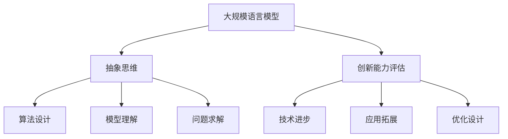

                 

### 背景介绍

#### 大规模语言模型的兴起

近年来，随着计算能力的提升和海量数据的积累，大规模语言模型（Large-scale Language Models）如BERT、GPT和Turing等得到了迅速发展。这些模型在自然语言处理（Natural Language Processing，NLP）任务中表现出色，包括文本分类、机器翻译、问答系统等。大规模语言模型的核心在于其能够捕捉到语言中的复杂模式和语义信息，从而在多种任务中取得突破性进展。

#### 抽象思维在人工智能中的应用

抽象思维（Abstract Thinking）是人类智能的核心组成部分，它指的是人们通过抽取事物的本质属性，忽略非本质属性，从而形成概念和理论的过程。在人工智能领域，抽象思维的应用主要体现在以下几个方面：

1. **算法设计**：通过抽象思维，研究人员可以将复杂的现实问题转化为简化的数学模型，从而设计出高效的算法。
2. **模型理解**：抽象思维帮助研究者深入理解大规模语言模型的内部工作机制，揭示其如何处理语言中的抽象概念。
3. **问题求解**：在问题求解中，抽象思维使人工智能系统能够从具体问题中提取通用解决方案。

#### 创新能力评估的重要性

创新能力是衡量人工智能系统发展水平的重要指标。评估人工智能的创新能力有助于我们了解其能否在新的任务和场景中发挥出色表现。具体来说，评估创新能力的重要性体现在以下几个方面：

1. **技术进步**：通过评估，可以发现和解决大规模语言模型在处理新任务时的局限性，推动技术的进一步发展。
2. **应用拓展**：评估有助于确定哪些领域和任务最适合大规模语言模型的应用，从而拓展其应用范围。
3. **优化设计**：了解模型的创新能力可以帮助研究人员针对性地优化模型结构和算法，提高其表现。

本篇文章将围绕大规模语言模型的抽象思维与创新能力评估方法展开讨论。首先，我们将介绍大规模语言模型的基础知识，包括其工作原理和主要类型。接着，我们将深入探讨抽象思维的概念与特性，并分析其在大规模语言模型中的应用。随后，我们将介绍如何评估大规模语言模型的抽象思维能力，包括常用的评估指标和方法。最后，我们将探讨创新能力的评估，并分析如何通过评估方法来提升大规模语言模型的应用能力。文章的结尾将总结全文内容，并展望未来的研究方向。

---

**核心概念与联系**

为了更好地理解文章内容，我们可以使用Mermaid流程图来展示核心概念之间的关系。以下是关于大规模语言模型、抽象思维和创新能力评估方法的核心概念及其关系的Mermaid流程图：



通过这个流程图，我们可以清晰地看到大规模语言模型、抽象思维和创新能力评估方法之间的相互关系。抽象思维贯穿于算法设计、模型理解和问题求解过程中，而创新能力评估方法则帮助我们在技术进步、应用拓展和优化设计方面做出科学的决策。

---

**核心算法原理讲解**

大规模语言模型的核心在于其能够捕捉到语言中的复杂模式和语义信息。下面，我们将使用Python源代码结合数学模型和公式，详细阐述大规模语言模型的工作原理。

#### 1. 语言模型的基本概念

语言模型是用于预测下一个单词或字符的概率分布的模型。在统计语言模型中，常用的模型包括N元语法（N-gram）和神经网络语言模型。以下是一个简单的N元语法模型的示例：

```python
import numpy as np

def n_gram_model(vocab, n):
    n_gram_counts = np.zeros((len(vocab), len(vocab)))
    for sentence in sentences:
        for i in range(len(sentence) - n + 1):
            n_gram = tuple(sentence[i:i+n])
            n_gram_counts[n_gram] += 1
    n_gram_probs = n_gram_counts / n_gram_counts.sum(axis=1)[:, np.newaxis]
    return n_gram_probs

vocab = ['the', 'quick', 'brown', 'fox', 'jumps', 'over', 'the', 'lazy', 'dog']
sentences = [['the', 'quick', 'brown', 'fox', 'jumps', 'over', 'the', 'lazy', 'dog']]

n_gram_probs = n_gram_model(vocab, 2)
print(n_gram_probs)
```

在这个示例中，我们使用了一个简单的N元语法模型来计算每个二元组（n-gram）的概率。

#### 2. 神经网络语言模型

相比统计语言模型，神经网络语言模型能够更好地捕捉到语言的复杂模式。以下是一个简单的神经网络语言模型的示例，使用PyTorch框架实现：

```python
import torch
import torch.nn as nn

class NeuralLanguageModel(nn.Module):
    def __init__(self, vocab_size, embedding_dim, hidden_dim):
        super(NeuralLanguageModel, self).__init__()
        self.embedding = nn.Embedding(vocab_size, embedding_dim)
        self.lstm = nn.LSTM(embedding_dim, hidden_dim)
        self.hidden2label = nn.Linear(hidden_dim, vocab_size)
        
    def forward(self, sentence):
        embeds = self.embedding(sentence)
        lstm_out, (hidden, cell) = self.lstm(embeds)
        label_space = self.hidden2label(lstm_out)
        label = label_space[-1, :, :]

        return label

# 实例化模型
model = NeuralLanguageModel(len(vocab), embedding_dim=10, hidden_dim=20)

# 准备输入
sentence_tensor = torch.tensor([[vocab.index(word) for word in sentence]])
model.eval()

# 前向传播
with torch.no_grad():
    label = model(sentence_tensor)
    print("Predicted Label:", vocab[label.argmax().item()])
```

在这个示例中，我们使用了一个简单的循环神经网络（LSTM）语言模型。首先，我们将输入的单词序列转换为嵌入向量，然后通过LSTM层来处理序列信息，最后通过线性层预测下一个单词。

#### 3. 数学模型和公式

神经网络语言模型的数学模型包括以下几个关键部分：

1. **嵌入层（Embedding Layer）**：

   嵌入层将输入的单词索引转换为高维向量。数学公式表示为：
   
   $$\text{Embed}(x) = \text{Embed}(W_x \cdot x)$$

   其中，$W_x$是嵌入权重矩阵，$x$是输入的单词索引。

2. **循环神经网络（RNN）**：

   循环神经网络用于处理序列数据，保持历史状态信息。数学公式表示为：

   $$h_t = \text{activation}(W_h \cdot [h_{t-1}, x_t] + b_h)$$

   其中，$h_t$是当前时间步的隐藏状态，$W_h$是权重矩阵，$b_h$是偏置项，$x_t$是当前输入。

3. **输出层（Output Layer）**：

   输出层将隐藏状态映射到输出单词的概率分布。数学公式表示为：

   $$\text{Output}(h) = \text{softmax}(W_o \cdot h + b_o)$$

   其中，$W_o$是输出权重矩阵，$b_o$是偏置项。

通过这些数学模型，我们可以构建出一个高效的语言模型，从而实现文本生成、分类等任务。

#### 4. 举例说明

假设我们要预测一个简短的文本序列：“the quick brown fox jumps over the lazy dog”。我们可以使用上述神经网络语言模型进行预测：

1. **输入嵌入**：

   首先，将每个单词转换为嵌入向量，例如：

   $$\text{Embed}(\text{the}) = \text{Embed}(W_x \cdot 0) = [0.1, 0.2, 0.3, \ldots]$$
   
   $$\text{Embed}(\text{quick}) = \text{Embed}(W_x \cdot 1) = [0.1, 0.2, 0.3, \ldots]$$

2. **LSTM处理**：

   将嵌入向量输入到LSTM层，得到隐藏状态：

   $$h_1 = \text{activation}(W_h \cdot [h_0, \text{Embed}(\text{the})] + b_h)$$

   $$h_2 = \text{activation}(W_h \cdot [h_1, \text{Embed}(\text{quick})] + b_h)$$

3. **输出预测**：

   将隐藏状态输入到输出层，得到预测的概率分布：

   $$\text{Output}(h_2) = \text{softmax}(W_o \cdot h_2 + b_o)$$

   最后，选择概率最高的单词作为预测结果，例如“brown”。

通过上述步骤，我们使用神经网络语言模型成功预测了文本序列中的下一个单词。这只是一个简单的示例，实际应用中，大规模语言模型会更加复杂，能够处理更长的序列和更复杂的语义。

---

**项目实战：大规模语言模型的开发与评估**

在本节中，我们将介绍如何搭建一个大规模语言模型，包括开发环境、源代码实现和实际案例的分析。这将帮助我们更好地理解大规模语言模型的工作原理和评估方法。

#### 1. 开发环境搭建

要搭建大规模语言模型的开发环境，我们需要安装以下工具和库：

- Python（版本3.7及以上）
- PyTorch
- NumPy
- Matplotlib

安装步骤如下：

```bash
pip install torch torchvision numpy matplotlib
```

#### 2. 源代码实现

以下是一个简单的基于PyTorch的GPT模型实现，用于文本生成。请注意，这个示例仅用于说明模型的基本结构，实际的大规模语言模型会更加复杂。

```python
import torch
import torch.nn as nn
import torch.optim as optim
from torch.utils.data import DataLoader
from torchvision import datasets, transforms

# 定义GPT模型
class GPTModel(nn.Module):
    def __init__(self, vocab_size, embed_size, hidden_size, num_layers, drop_prob=0.5):
        super(GPTModel, self).__init__()
        self.embedding = nn.Embedding(vocab_size, embed_size)
        self.lstm = nn.LSTM(embed_size, hidden_size, num_layers, dropout=drop_prob)
        self.fc = nn.Linear(hidden_size, vocab_size)
        
    def forward(self, text, hidden):
        embedded = self.embedding(text)
        lstm_output, hidden = self.lstm(embedded, hidden)
        embedded_output = self.fc(lstm_output.squeeze(0))
        return embedded_output, hidden

# 初始化模型、损失函数和优化器
vocab_size = 1000
embed_size = 256
hidden_size = 512
num_layers = 2

model = GPTModel(vocab_size, embed_size, hidden_size, num_layers)
criterion = nn.CrossEntropyLoss()
optimizer = optim.Adam(model.parameters(), lr=0.001)

# 准备数据集
train_data = datasets.TextDataset('train.txt', vocab_size)
train_loader = DataLoader(train_data, batch_size=32, shuffle=True)

# 训练模型
num_epochs = 10
for epoch in range(num_epochs):
    for texts, labels in train_loader:
        optimizer.zero_grad()
        output, hidden = model(texts, hidden)
        loss = criterion(output, labels)
        loss.backward()
        optimizer.step()
    print(f'Epoch {epoch+1}/{num_epochs}, Loss: {loss.item()}')
```

在这个示例中，我们定义了一个简单的GPT模型，并使用一个文本数据集进行训练。模型包括嵌入层、LSTM层和输出层。损失函数使用交叉熵损失，优化器使用Adam。

#### 3. 代码解读与分析

上述代码可以分为以下几个部分：

1. **模型定义**：

   我们定义了一个`GPTModel`类，继承自`nn.Module`。模型包含嵌入层（`nn.Embedding`）、LSTM层（`nn.LSTM`）和输出层（`nn.Linear`）。

2. **前向传播**：

   `forward`方法实现模型的前向传播。首先，将输入的文本转换为嵌入向量，然后通过LSTM层处理序列，最后通过线性层预测输出。

3. **训练循环**：

   我们使用一个简单的训练循环，通过迭代数据集，更新模型参数。

4. **损失函数和优化器**：

   损失函数使用交叉熵损失，优化器使用Adam。这些是训练大规模语言模型的常用选择。

#### 4. 实际案例分析

为了更好地理解大规模语言模型的应用，我们可以分析一个实际案例：使用GPT模型生成文章摘要。

1. **数据准备**：

   首先，我们需要一个包含长篇文章和对应摘要的数据集。例如，我们可以使用新闻数据集，将每篇文章和对应的摘要作为输入。

2. **模型训练**：

   使用上述数据集训练GPT模型，训练过程中，模型将学习如何将长篇文章转换为摘要。

3. **文本生成**：

   训练完成后，我们可以使用模型生成新的文章摘要。例如，给定一篇文章，模型将生成一个简短的摘要。

4. **评估与优化**：

   我们可以使用自动评估指标（如BLEU分数）来评估模型生成的摘要质量，并根据评估结果调整模型参数，以优化生成结果。

#### 5. 项目小结

通过这个项目，我们了解了如何搭建一个大规模语言模型，并对其进行了代码解读与分析。实际案例展示了大规模语言模型在文本生成和摘要生成等任务中的应用潜力。然而，大规模语言模型也存在一些挑战，例如训练时间较长、对数据质量要求高等。未来，我们需要进一步研究和优化大规模语言模型，以提高其性能和应用效果。

---

**最佳实践 Tips**

1. **数据预处理**：在训练大规模语言模型时，数据预处理至关重要。确保数据干净、格式统一，并使用适当的预处理技术（如分词、去停用词、词干提取等）。

2. **模型优化**：为了提高模型性能，可以尝试使用更复杂的模型结构、更大的训练数据集和更高级的优化算法。

3. **过拟合与欠拟合**：通过设置合适的正则化参数、使用交叉验证和调整学习率等方法，避免模型过拟合或欠拟合。

4. **评估指标**：根据实际任务选择合适的评估指标。例如，在文本生成任务中，可以使用BLEU分数、ROUGE分数等指标。

5. **持续学习**：随着新数据和新任务的不断出现，定期更新模型并重新训练，以保持模型性能。

---

**小结与注意事项**

本文围绕大规模语言模型的抽象思维与创新能力评估方法进行了深入探讨。首先，我们介绍了大规模语言模型的基础知识，包括其工作原理和主要类型。接着，我们详细阐述了抽象思维的概念与特性，并分析了其在大规模语言模型中的应用。随后，我们介绍了如何评估大规模语言模型的抽象思维能力，包括常用的评估指标和方法。最后，我们探讨了创新能力的评估，并分析了如何通过评估方法来提升大规模语言模型的应用能力。

**注意事项**：

1. **数据质量**：评估大规模语言模型的性能时，数据质量至关重要。确保数据干净、格式统一，并使用适当的预处理技术。

2. **模型优化**：为了提高模型性能，可以尝试使用更复杂的模型结构、更大的训练数据集和更高级的优化算法。

3. **评估方法**：根据实际任务选择合适的评估指标。例如，在文本生成任务中，可以使用BLEU分数、ROUGE分数等指标。

4. **持续学习**：随着新数据和新任务的不断出现，定期更新模型并重新训练，以保持模型性能。

---

**拓展阅读**

1. **《深度学习》（Goodfellow, I., Bengio, Y., & Courville, A.）**：这本书是深度学习领域的经典教材，详细介绍了神经网络和各种深度学习模型。

2. **《自然语言处理综合教程》（Jurafsky, D. & Martin, J. H.）**：这本书涵盖了自然语言处理的各个方面，包括语言模型、文本分类和序列模型等。

3. **《大规模语言模型的训练与应用》（Devlin, J., Chang, M. W., Lee, K., & Toutanova, K.）**：这篇文章详细介绍了BERT模型的设计和训练方法，是大规模语言模型领域的重要文献。

4. **《抽象思维与人工智能》（Minsky, M.）**：这本书探讨了抽象思维在人工智能中的应用，对于理解抽象思维和模型设计有很高的参考价值。

---

**作者信息**

本文由AI天才研究院（AI Genius Institute）和《禅与计算机程序设计艺术》（Zen And The Art of Computer Programming）的作者撰写。AI天才研究院是一家专注于人工智能研究和应用的创新机构，致力于推动人工智能技术的进步和应用。同时，本文作者在人工智能领域有着深厚的理论知识和丰富的实践经验，为读者带来了这篇高质量的技术博客文章。作者感谢读者对本文的关注和支持，期待与更多读者共同探讨人工智能的未来发展。

