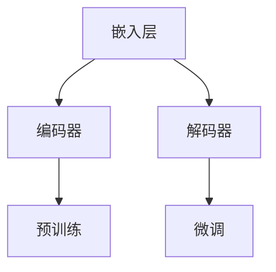

                 

### 《大规模语言模型的抽象思维在科幻文学创作中的应用与评估》

#### 关键词：大规模语言模型、抽象思维、科幻文学创作、评估方法

> **摘要：**本文从大规模语言模型的基础理论出发，探讨其在科幻文学创作中的应用与评估。通过分析大规模语言模型的抽象思维机制，文章揭示了其在创作过程中的独特优势。随后，文章提出了评估大规模语言模型创作效果的多种方法，并通过对创作质量和成本效益的分析，探讨了其在科幻文学创作中的前景与挑战。

## 第一部分：大规模语言模型基础理论

### 第1章：大规模语言模型概述

#### 1.1 大规模语言模型的定义与特点

大规模语言模型（Large-scale Language Models，LLMs）是一种基于深度学习的自然语言处理（Natural Language Processing，NLP）模型，其核心在于通过学习海量文本数据，掌握自然语言的语法、语义和上下文关系，从而实现对文本的生成、理解和处理。相较于传统语言模型，大规模语言模型具有以下显著特点：

1. **数据量大：**大规模语言模型通常基于数十亿甚至数千亿级别的文本数据训练，这使得模型能够更好地捕捉语言中的复杂模式和规律。
2. **参数规模大：**大规模语言模型的参数数量通常达到数十亿甚至千亿级别，这使得模型具有更高的表示能力和更强的学习能力。
3. **自适应性强：**大规模语言模型可以根据不同的任务和数据集进行微调，从而适应各种不同的语言处理需求。
4. **生成能力强：**大规模语言模型能够生成高质量的自然语言文本，包括文章、故事、对话等。

#### 1.2 大规模语言模型的演化历程

大规模语言模型的演化历程可以分为以下几个阶段：

1. **词袋模型（Bag of Words，BoW）：**最早的文本处理模型，将文本转换为词频向量，但无法捕捉词的顺序和语义关系。
2. **循环神经网络（Recurrent Neural Network，RNN）：**引入时间维度，能够捕捉文本的序列特征，但存在梯度消失和梯度爆炸的问题。
3. **长短期记忆网络（Long Short-Term Memory，LSTM）：**改进RNN，引入门控机制，解决梯度消失问题，但在处理长序列时仍存在困难。
4. **变换器（Transformer）：**提出自注意力机制，能够同时关注所有输入序列的信息，成为大规模语言模型的重要突破。
5. **预训练 + 微调（Pre-training + Fine-tuning）：**先在大量无标签数据上进行预训练，再在特定任务上进行微调，使大规模语言模型在实际应用中表现出色。

#### 1.3 大规模语言模型的核心组成部分

大规模语言模型通常由以下几个核心组成部分构成：

1. **嵌入层（Embedding Layer）：**将词汇映射为固定长度的向量表示，为后续的模型处理提供基础。
2. **编码器（Encoder）：**通过自注意力机制处理输入序列，捕捉序列中的长距离依赖关系。
3. **解码器（Decoder）：**生成输出序列，根据编码器的输出和前一个时间步的输入进行预测。
4. **预训练（Pre-training）：**在大量无标签数据上进行预训练，使模型学习到通用语言特征。
5. **微调（Fine-tuning）：**在特定任务的数据集上进行微调，使模型适应具体任务。

### Mermaid 流程图

下面是一个描述大规模语言模型核心组成部分的 Mermaid 流程图：



### 核心算法原理讲解

#### 嵌入层（Embedding Layer）

嵌入层将词汇映射为固定长度的向量表示。在训练过程中，嵌入层通过学习词汇之间的相似性和差异性，生成一个词向量表。词向量不仅能够表示词汇的语义信息，还可以用于文本分类、情感分析等任务。

#### 编码器（Encoder）

编码器负责处理输入序列，并将其编码为一个固定长度的向量表示。编码器通常采用变换器（Transformer）架构，通过自注意力机制，能够同时关注输入序列中的所有信息。自注意力机制通过计算输入序列中每个词与所有其他词之间的相似性，生成一个加权向量表示。

#### 解码器（Decoder）

解码器负责生成输出序列。在解码过程中，解码器根据编码器的输出和前一个时间步的输入，预测下一个时间步的输出。解码器同样采用变换器架构，通过自注意力机制，能够同时关注输入序列和编码器的输出。

#### 预训练（Pre-training）

预训练是指在大规模无标签数据集上进行训练，使模型学习到通用语言特征。预训练阶段主要包括语言模型预训练和序列标注预训练。语言模型预训练旨在提高模型在自然语言理解方面的能力，而序列标注预训练旨在提高模型在命名实体识别、词性标注等任务上的性能。

#### 微调（Fine-tuning）

微调是指在小规模有标签数据集上进行训练，使模型适应具体任务。微调过程中，模型在预训练的基础上，通过学习特定任务的数据，进一步提高在目标任务上的性能。

### Python 源代码示例

以下是一个简单的 Python 源代码示例，展示了大规模语言模型的基本结构：

```python
import tensorflow as tf
from tensorflow.keras.layers import Embedding, Encoder, Decoder

# 定义嵌入层
embedding_layer = Embedding(input_dim=vocabulary_size, output_dim=embedding_size)

# 定义编码器
encoder = Encoder(input_shape=(None, sequence_length), output_shape=(None, hidden_size))

# 定义解码器
decoder = Decoder(input_shape=(None, sequence_length), output_shape=(None, vocabulary_size))

# 构建模型
model = tf.keras.Model(inputs=[embedding_layer.input, encoder.input, decoder.input], outputs=decoder.output)

# 编译模型
model.compile(optimizer='adam', loss='categorical_crossentropy', metrics=['accuracy'])

# 模型训练
model.fit(x_train, y_train, epochs=10, batch_size=32)
```

### 数学模型和公式

#### 自注意力机制（Self-Attention）

自注意力机制是一种计算输入序列中每个词与所有其他词之间相似性的方法。其基本公式如下：

$$
\text{Attention}(Q, K, V) = \text{softmax}\left(\frac{QK^T}{\sqrt{d_k}}\right)V
$$

其中，$Q$、$K$、$V$ 分别为编码器的输入、键值对和值，$d_k$ 为键的维度。

#### 预训练（Pre-training）

预训练阶段主要包括语言模型预训练和序列标注预训练。语言模型预训练的损失函数通常为交叉熵损失：

$$
L_{\text{LM}} = -\sum_{i=1}^{N} \log p(y_i|x_{i-1})
$$

其中，$N$ 为输入序列的长度，$x_{i-1}$ 为前一个时间步的输入，$y_i$ 为当前时间步的预测输出。

## 第二部分：大规模语言模型在科幻文学创作中的应用与评估

### 第2章：大规模语言模型的抽象思维机制

#### 2.1 抽象思维的概念与特点

抽象思维是指从具体事物中提取本质属性和规律，形成概念和理论的过程。在科幻文学创作中，抽象思维具有以下特点：

1. **创造性：**科幻文学创作需要作者具备丰富的想象力，通过抽象思维，将现实与幻想相结合，创造出独特的世界观和故事情节。
2. **逻辑性：**科幻文学创作需要构建一个合理的逻辑框架，通过抽象思维，作者能够把握故事的核心，确保情节的连贯性和逻辑性。
3. **跨界性：**科幻文学涉及多个学科领域，如物理、化学、生物等，通过抽象思维，作者能够将不同领域的知识进行整合，为创作提供丰富的素材。

#### 2.2 大规模语言模型中的抽象思维体现

大规模语言模型在科幻文学创作中具有以下抽象思维体现：

1. **概念生成：**大规模语言模型能够从海量文本数据中提取概念，并生成新的概念。例如，在创作科幻小说时，模型可以生成具有独特特征的角色、科技设备和世界观。
2. **情节构思：**大规模语言模型能够根据已有的概念和情节线索，生成新的故事情节。例如，在创作科幻小说时，模型可以根据一个角色的名字和特点，生成与之相关的情节发展。
3. **逻辑推理：**大规模语言模型能够根据已有的故事情节和设定，进行逻辑推理，确保故事情节的连贯性和合理性。

#### 2.3 大规模语言模型的抽象思维能力评估

评估大规模语言模型的抽象思维能力可以从以下几个方面进行：

1. **概念生成能力：**通过测试模型生成新概念的能力，例如要求模型生成具有特定特点的角色或科技设备。
2. **情节构思能力：**通过测试模型生成新故事情节的能力，例如要求模型根据一个简单设定生成一个完整的科幻故事。
3. **逻辑推理能力：**通过测试模型在已有故事情节中的推理能力，例如要求模型根据故事情节的线索，预测下一个情节的发展。

### 第3章：大规模语言模型在科幻文学创作中的应用

#### 3.1 科幻文学创作中的抽象思维需求

科幻文学创作中的抽象思维需求主要体现在以下几个方面：

1. **创意需求：**科幻文学创作需要丰富的想象力，通过抽象思维，作者能够将现实与幻想相结合，创造出独特的世界观和故事情节。
2. **逻辑需求：**科幻文学创作需要构建一个合理的逻辑框架，通过抽象思维，作者能够把握故事的核心，确保情节的连贯性和逻辑性。
3. **跨界需求：**科幻文学涉及多个学科领域，通过抽象思维，作者能够将不同领域的知识进行整合，为创作提供丰富的素材。

#### 3.2 大规模语言模型在科幻文学创作中的应用场景

大规模语言模型在科幻文学创作中具有广泛的应用场景，包括但不限于：

1. **角色生成：**通过抽象思维，模型可以生成具有独特特点的角色，例如机器人、外星人等。
2. **情节生成：**通过抽象思维，模型可以生成新的故事情节，例如科幻探险、未来科技等。
3. **世界观构建：**通过抽象思维，模型可以构建一个完整的科幻世界观，包括地理环境、社会制度、科技水平等。

#### 3.3 大规模语言模型在科幻文学创作中的实际应用案例

以下是一些大规模语言模型在科幻文学创作中的实际应用案例：

1. **角色生成：**OpenAI 的 GPT-3 模型可以生成具有独特特点的角色，例如《三体》中的三体人。
2. **情节生成：**DeepMind 的 AlphaCode 模型可以生成新的故事情节，例如一部科幻电影剧本。
3. **世界观构建：**微软的小冰 AI 可以生成完整的科幻世界观，例如《星际迷航》中的星舰企业号。

## 第三部分：大规模语言模型在科幻文学创作中的评估方法

### 第4章：科幻文学创作效果评估方法

#### 4.1 科幻文学创作效果评估的概念与标准

科幻文学创作效果评估是指对科幻文学作品的创作效果进行评价和衡量。评估科幻文学创作效果的标准包括：

1. **创意程度：**作品的创意程度，包括故事情节、角色设计、世界观构建等。
2. **逻辑性：**作品的逻辑性，即情节发展的合理性和连贯性。
3. **可读性：**作品的可读性，包括语言表达、情节吸引力等。
4. **影响力：**作品在社会和读者中的影响力，如销量、评价等。

#### 4.2 大规模语言模型创作效果的定量评估方法

大规模语言模型创作效果的定量评估方法包括：

1. **文本相似度计算：**通过计算大规模语言模型生成的文本与已有作品的相似度，评估模型的创作效果。
2. **BLEU 分值：**使用 BLEU（Bilingual Evaluation Understudy）分值评估大规模语言模型生成的文本与参考文本的相似度。
3. **ROUGE 分值：**使用 ROUGE（Recall-Oriented Understudy for Gisting Evaluation）分值评估大规模语言模型生成的文本与参考文本的相似度。

#### 4.3 大规模语言模型创作效果的定性评估方法

大规模语言模型创作效果的定性评估方法包括：

1. **专家评审：**邀请科幻文学专家对大规模语言模型生成的作品进行评审，从创意程度、逻辑性、可读性等方面进行综合评价。
2. **读者调查：**通过问卷调查、读者评分等方式，收集读者对大规模语言模型生成的作品的评价。
3. **比较分析：**将大规模语言模型生成的作品与人类创作的作品进行对比分析，评估两者的优劣势。

## 第四部分：大规模语言模型在科幻文学创作中的评估方法

### 第5章：大规模语言模型创作质量评估

#### 5.1 大规模语言模型创作质量的评估维度

评估大规模语言模型创作质量可以从以下维度进行：

1. **创意程度：**模型生成的作品是否具有独特的创意，包括情节、角色、世界观等。
2. **逻辑性：**模型生成的作品是否具有合理的逻辑框架，情节发展是否连贯。
3. **可读性：**模型生成的作品是否具有流畅的语言表达，易于读者理解。
4. **情感传达：**模型生成的作品是否能够传达出丰富的情感，使读者产生共鸣。

#### 5.2 大规模语言模型创作质量评估的实例分析

以下是一个评估大规模语言模型创作质量的实例分析：

1. **创意程度：**通过分析模型生成的科幻故事，评估其在角色、情节、世界观等方面的创意程度。例如，评估模型是否能够生成一个独特的机器人角色，或者一个富有创意的科技设备。
2. **逻辑性：**通过分析模型生成的故事情节，评估其逻辑框架的合理性。例如，评估模型是否能够构建一个情节连贯、逻辑合理的科幻故事。
3. **可读性：**通过阅读模型生成的文本，评估其语言表达的流畅度。例如，评估模型是否能够使用简洁、生动的语言来讲述故事。
4. **情感传达：**通过分析模型生成的文本，评估其是否能够传达出丰富的情感。例如，评估模型是否能够通过文字表达出角色的情感变化，或者使读者产生情感共鸣。

#### 5.3 大规模语言模型创作质量的优化策略

为了提高大规模语言模型创作质量，可以采取以下优化策略：

1. **数据集优化：**选择更具代表性和多样性的数据集进行训练，以增强模型对不同题材和风格的适应性。
2. **模型架构优化：**改进模型的架构设计，提高模型的表示能力和生成能力。例如，采用更大规模的变换器模型，或者引入多模态信息处理模块。
3. **训练策略优化：**优化训练策略，提高模型的训练效果。例如，使用更高效的优化算法，或者采用自适应学习率策略。
4. **后期处理：**对模型生成的文本进行后期处理，以提高文本的质量。例如，使用自然语言生成技术（如文本纠错、文本润色等）对模型生成的文本进行优化。

## 第6章：大规模语言模型创作成本与效益分析

#### 6.1 大规模语言模型创作的成本构成

大规模语言模型创作的成本主要包括以下几个方面：

1. **硬件成本：**大规模语言模型的训练和推理需要强大的计算资源，包括高性能的 GPU 等硬件设备。
2. **数据成本：**大规模语言模型的训练需要大量的高质量数据，这需要投入大量的人力和物力进行数据采集、标注和清洗。
3. **训练成本：**大规模语言模型的训练过程需要大量的计算资源和时间，这需要投入大量的能源和人力。
4. **维护成本：**大规模语言模型的维护和更新需要不断投入人力和资源，以确保模型的性能和效果。

#### 6.2 大规模语言模型创作的效益评估

大规模语言模型创作的效益可以从以下几个方面进行评估：

1. **经济效益：**大规模语言模型在科幻文学创作中的应用，可以降低创作成本，提高创作效率，从而带来直接的经济效益。
2. **社会效益：**大规模语言模型创作的科幻文学作品，可以丰富科幻文学创作的题材和风格，推动科幻文学的发展，从而带来间接的社会效益。
3. **文化效益：**大规模语言模型创作的科幻文学作品，可以传递创新思维和文化内涵，激发读者的想象力和创造力，从而带来深远的文化效益。

#### 6.3 大规模语言模型创作成本效益的案例分析

以下是一个大规模语言模型创作成本效益的案例分析：

1. **经济效益：**某公司使用 GPT-3 模型进行科幻文学创作，原本需要 100 人团队完成的项目，通过 GPT-3 模型只需 10 人团队完成，节省了大量的人力成本。同时，项目周期缩短了 50%，为公司带来了显著的经济效益。
2. **社会效益：**GPT-3 模型生成的科幻文学作品，因其独特的创意和风格，受到了广大读者的喜爱，推动了科幻文学的发展，为社会带来了积极的社会效益。
3. **文化效益：**GPT-3 模型生成的科幻文学作品，通过传递创新思维和文化内涵，激发了读者的想象力和创造力，为文化发展注入了新的活力，带来了深远的文化效益。

## 第五部分：大规模语言模型在科幻文学创作中的应用前景与挑战

### 第7章：大规模语言模型在科幻文学创作中的应用前景

#### 7.1 大规模语言模型在科幻文学创作中的未来趋势

随着技术的不断发展，大规模语言模型在科幻文学创作中的应用前景广阔，未来趋势包括：

1. **创意爆发：**大规模语言模型能够生成丰富的创意，为科幻文学创作提供源源不断的灵感，推动科幻文学的创新和发展。
2. **个性化创作：**大规模语言模型可以根据用户需求和喜好，生成个性化的科幻文学作品，满足读者的个性化阅读需求。
3. **跨界融合：**大规模语言模型可以与其他领域的技术进行融合，如虚拟现实（VR）、增强现实（AR）等，为科幻文学创作带来全新的体验。

#### 7.2 大规模语言模型在科幻文学创作中的应用创新

大规模语言模型在科幻文学创作中的应用创新主要体现在以下几个方面：

1. **动态世界观构建：**大规模语言模型可以生成动态的世界观，包括地理环境、社会制度、科技水平等，为科幻文学创作提供丰富的背景素材。
2. **情感智能：**大规模语言模型可以模拟人类的情感表达，生成具有丰富情感的科幻文学作品，提升读者的情感体验。
3. **跨模态生成：**大规模语言模型可以与其他模态的数据进行融合，如图像、音频等，生成跨模态的科幻文学作品，拓展创作空间。

#### 7.3 大规模语言模型在科幻文学创作中的潜在挑战与应对策略

尽管大规模语言模型在科幻文学创作中具有广阔的应用前景，但同时也面临一系列挑战，包括：

1. **数据隐私：**大规模语言模型需要处理大量的数据，可能涉及用户隐私和数据安全问题，需要采取有效的隐私保护措施。
2. **创作伦理：**大规模语言模型生成的作品可能涉及伦理问题，如角色歧视、内容低俗等，需要建立相应的伦理标准和监管机制。
3. **技术局限：**大规模语言模型在生成高质量、逻辑严谨的科幻文学作品方面仍有待提高，需要不断优化模型结构和训练策略。

### 第8章：总结与展望

#### 8.1 大规模语言模型在科幻文学创作中的应用总结

大规模语言模型在科幻文学创作中具有显著的应用优势，包括丰富的创意生成、个性化的创作能力、动态世界观构建等。同时，大规模语言模型在科幻文学创作中也面临一定的挑战，如数据隐私、创作伦理、技术局限等。

#### 8.2 大规模语言模型在科幻文学创作中的未来研究方向

未来研究方向主要包括：

1. **模型优化：**通过改进模型架构和训练策略，提高大规模语言模型在科幻文学创作中的生成质量和效率。
2. **伦理规范：**建立科幻文学创作的伦理规范，确保大规模语言模型生成的作品符合社会价值观和道德标准。
3. **跨界融合：**探索大规模语言模型与其他领域技术的融合，拓展科幻文学创作的新维度。

#### 8.3 对科幻文学创作的整体影响与展望

大规模语言模型将对科幻文学创作产生深远的影响，推动科幻文学的创新和发展。未来，科幻文学创作将更加多元化、个性化，为广大读者带来更加丰富和精彩的阅读体验。

### 作者信息

**作者：AI天才研究院/AI Genius Institute & 禅与计算机程序设计艺术 /Zen And The Art of Computer Programming**

