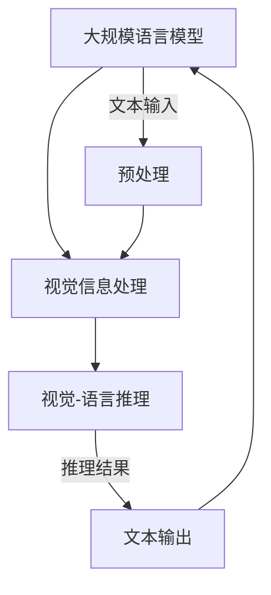

                 

### 引言

#### 视觉-语言推理的背景和重要性

视觉-语言推理（Visual-Linguistic Reasoning）是指机器通过理解和整合视觉信息与语言信息，以实现对复杂场景的理解和推理的能力。随着人工智能技术的快速发展，视觉-语言推理在诸多领域展现出了重要的应用价值，例如图像标注、对话系统、视频理解等。近年来，该领域的研究引起了学术界和工业界的广泛关注。

首先，在图像标注方面，视觉-语言推理可以帮助机器自动识别图像中的对象和场景，并将它们与相应的描述性语言进行匹配。这种技术不仅提高了图像搜索和管理的效率，还为自动内容审核、智能推荐等应用提供了支持。

其次，对话系统中的视觉-语言推理能力使得机器能够更好地理解用户的语言意图，并根据用户的视觉内容提供更加准确和个性化的响应。例如，智能助手可以结合用户提供的图片信息，生成更加具体和有针对性的对话。

最后，视频理解是视觉-语言推理的另一个重要应用场景。通过整合视频中的视觉信息和语言信息，机器可以更好地理解视频内容，从而实现视频摘要、情感分析、安全监控等任务。

总之，视觉-语言推理作为人工智能领域的一个重要研究方向，不仅具有广泛的应用前景，而且对于提升机器智能水平具有重要意义。本篇文章将深入探讨大规模语言模型的视觉-语言推理整合，包括核心概念、算法原理、数学模型以及实际项目实战等内容。

#### 摘要

本文旨在探讨如何将大规模语言模型与视觉信息进行整合，以实现高效的视觉-语言推理任务。首先，我们将介绍视觉-语言推理的背景和重要性，并阐述其应用领域和研究现状。接着，我们将详细讲解视觉-语言推理的核心概念与联系，使用Mermaid流程图展示各个概念之间的关系。随后，我们将深入探讨用于视觉-语言推理的主要算法，包括卷积神经网络（CNN）、递归神经网络（RNN）、长短时记忆网络（LSTM）和Transformer模型，并结合Python源代码进行详细阐述。此外，我们将介绍支持视觉-语言推理的数学模型，并给出具体的数学公式推导和举例说明。接着，我们将通过一个实际项目，展示如何开发一个视觉-语言推理系统，包括开发环境搭建、源代码实现和代码解读。最后，我们将讨论当前的研究趋势和未来发展方向，并提供一些最佳实践和注意事项。

### 核心概念与联系

在探讨大规模语言模型的视觉-语言推理整合之前，我们需要对几个核心概念进行明确，这些概念包括大规模语言模型、视觉信息处理、以及视觉-语言推理。通过理解这些概念，我们可以更好地把握视觉-语言推理的整体架构和实现方式。

#### 大规模语言模型

大规模语言模型（Large-scale Language Models）是指使用大量文本数据训练的复杂神经网络模型，它们可以理解和生成人类语言。这些模型通常由数十亿甚至千亿个参数组成，能够捕捉到语言的复杂结构和上下文信息。目前，最著名的几种大规模语言模型包括GPT（Generative Pre-trained Transformer）、BERT（Bidirectional Encoder Representations from Transformers）和T5（Text-to-Text Transfer Transformer）。

1. **语言模型的定义与工作原理**：

   语言模型的核心任务是预测下一个单词或词组，基于前文信息。通常，语言模型通过以下步骤工作：

   - **输入编码**：将输入文本转换为固定长度的向量。
   - **前向传播**：将输入向量通过多层神经网络进行前向传播，计算每个单词的概率分布。
   - **输出解码**：根据概率分布生成下一个单词或词组。

2. **大规模语言模型的优势与局限**：

   - **优势**：

     - **强大的语言理解能力**：大规模语言模型能够捕捉到语言中的复杂模式和上下文信息，从而在自然语言处理任务中表现出色。
     - **泛化能力**：通过在大规模数据集上进行训练，这些模型可以应用于多种不同的任务，具有很好的泛化能力。

     - **生成能力**：大规模语言模型可以生成高质量的文本，这在问答系统、文本摘要、自动写作等领域具有广泛应用。

   - **局限**：

     - **计算资源需求高**：大规模语言模型的训练和推理需要大量的计算资源和存储空间。
     - **数据依赖性**：模型的性能很大程度上依赖于训练数据的数量和质量。
     - **解释性不足**：尽管这些模型在任务中表现出色，但其内部决策过程往往缺乏透明性和可解释性。

#### 视觉信息处理

视觉信息处理（Visual Information Processing）是指机器如何理解和分析图像、视频等视觉数据的过程。视觉信息处理是计算机视觉（Computer Vision）的核心内容，它涉及图像采集、预处理、特征提取、模型训练等多个方面。

1. **视觉信息的采集与处理**：

   - **图像采集**：使用摄像头、传感器等设备捕捉图像或视频数据。
   - **预处理**：对采集到的图像或视频进行缩放、裁剪、滤波等预处理操作，以提高后续处理的效率和质量。
   - **特征提取**：从预处理后的图像中提取具有区分性的特征，如边缘、纹理、形状等。

2. **图像识别的基础算法**：

   - **传统算法**：如SIFT（尺度不变特征变换）、SURF（加速稳健特征）、HOG（方向梯度直方图）等，这些算法主要通过手工设计特征来实现图像识别。
   - **深度学习算法**：如卷积神经网络（CNN）、循环神经网络（RNN）和Transformer等，这些算法通过端到端的方式学习图像特征，具有更高的识别准确率。

#### 视觉-语言推理

视觉-语言推理（Visual-Linguistic Reasoning）是指机器如何结合视觉信息和语言信息，进行逻辑推理和决策的过程。该领域的目标是让机器能够理解和处理带有视觉信息的自然语言，从而实现更高级别的智能交互。

1. **视觉-语言推理的定义与目标**：

   - **定义**：视觉-语言推理是指机器在理解和处理视觉信息的同时，利用语言信息进行推理和决策的能力。
   - **目标**：视觉-语言推理的目标是使机器能够像人类一样，结合视觉信息和语言信息，进行逻辑推理和决策。

2. **视觉-语言推理的关键挑战**：

   - **多模态数据的融合**：如何有效地融合视觉信息和语言信息，使其在推理过程中协同作用。
   - **复杂场景的理解**：如何处理复杂、变化多端的视觉场景，使其与语言信息相对应。
   - **实时性**：如何在有限的计算资源和时间约束下，实现高效的视觉-语言推理。

#### Mermaid流程图展示

为了更直观地展示大规模语言模型、视觉信息处理和视觉-语言推理之间的关系，我们可以使用Mermaid流程图进行说明。以下是一个简化的Mermaid流程图示例，展示了这三个核心概念之间的交互关系。



在这个流程图中：

- **A** 代表大规模语言模型，它接收和处理文本输入。
- **B** 代表视觉信息处理模块，它接收和处理视觉输入，并将结果传递给视觉-语言推理模块。
- **C** 代表视觉-语言推理模块，它结合文本输入和视觉信息，生成推理结果。
- **D** 代表预处理模块，对输入的文本和视觉信息进行预处理。
- **E** 代表文本输出模块，将推理结果转换为文本形式，返回给大规模语言模型。

通过这种流程图，我们可以清晰地看到大规模语言模型、视觉信息处理和视觉-语言推理之间的紧密联系，以及它们在视觉-语言推理任务中的协作过程。

### 核心算法原理讲解

在视觉-语言推理任务中，常用的核心算法包括卷积神经网络（CNN）、递归神经网络（RNN）、长短时记忆网络（LSTM）和Transformer模型。这些算法各有其独特的结构和工作原理，适用于不同的应用场景。以下我们将分别详细介绍这些算法的基本概念和原理。

#### 卷积神经网络（CNN）

卷积神经网络（Convolutional Neural Network，CNN）是深度学习领域用于图像识别和处理的经典算法。其核心思想是通过卷积层提取图像中的特征，然后通过全连接层进行分类。

1. **基本结构和工作原理**：

   - **卷积层**：卷积层使用卷积核（也称为滤波器）在输入图像上滑动，计算局部特征图的叠加。每个卷积核可以捕捉到图像中的不同特征，如边缘、纹理等。
   - **激活函数**：常用的激活函数包括ReLU（Rectified Linear Unit）和Sigmoid，用于引入非线性特性。
   - **池化层**：池化层用于降低特征图的维度，提高模型的泛化能力。常见的池化操作包括最大池化和平均池化。
   - **全连接层**：全连接层将卷积层输出的特征图展开为一维向量，然后通过多层全连接层进行分类或回归。

2. **CNN在图像识别中的应用**：

   - **卷积神经网络**：经典的卷积神经网络如LeNet、AlexNet、VGG等，主要用于图像分类任务。
   - **卷积神经网络与其他技术的结合**：例如，使用CNN与RNN结合实现视频理解，使用CNN与GAN（生成对抗网络）结合实现图像生成。

以下是一个简单的CNN的Python实现示例：

```python
import tensorflow as tf
from tensorflow.keras.models import Sequential
from tensorflow.keras.layers import Conv2D, MaxPooling2D, Flatten, Dense

# 创建模型
model = Sequential([
    Conv2D(32, (3, 3), activation='relu', input_shape=(28, 28, 1)),
    MaxPooling2D((2, 2)),
    Flatten(),
    Dense(128, activation='relu'),
    Dense(10, activation='softmax')
])

# 编译模型
model.compile(optimizer='adam',
              loss='categorical_crossentropy',
              metrics=['accuracy'])

# 显示模型结构
model.summary()
```

#### 递归神经网络（RNN）

递归神经网络（Recurrent Neural Network，RNN）是一种用于处理序列数据的神经网络。与传统的前向神经网络不同，RNN具有递归结构，可以记忆序列中的上下文信息。

1. **基本结构和工作原理**：

   - **递归结构**：RNN的输出不仅取决于当前的输入，还受到之前所有输入的影响。这种递归结构使得RNN能够处理变长的序列数据。
   - **隐藏状态**：RNN通过隐藏状态（hidden state）来记忆序列信息，当前时刻的隐藏状态不仅取决于当前输入，还受到之前时刻的隐藏状态影响。
   - **激活函数**：常用的激活函数包括ReLU、tanh等。

2. **RNN在序列数据处理中的应用**：

   - **语言模型**：RNN可以用于构建语言模型，预测下一个单词或词组。
   - **序列标注**：RNN在自然语言处理任务中用于序列标注，如命名实体识别、词性标注等。
   - **语音识别**：RNN在语音识别任务中用于将音频信号转换为文本。

以下是一个简单的RNN的Python实现示例：

```python
import tensorflow as tf
from tensorflow.keras.models import Sequential
from tensorflow.keras.layers import LSTM, Dense

# 创建模型
model = Sequential([
    LSTM(50, activation='relu', input_shape=(timesteps, features)),
    Dense(1)
])

# 编译模型
model.compile(optimizer='adam',
              loss='mse')

# 显示模型结构
model.summary()
```

#### 长短时记忆网络（LSTM）

长短时记忆网络（Long Short-Term Memory，LSTM）是RNN的一种改进模型，专门用于解决传统RNN在处理长序列数据时出现的梯度消失和梯度爆炸问题。

1. **基本结构和工作原理**：

   - **遗忘门（Forget Gate）**：控制哪些信息应该被遗忘。
   - **输入门（Input Gate）**：控制哪些新信息应该被存储。
   - **输出门（Output Gate）**：控制哪些信息应该被输出。

2. **LSTM在视觉-语言推理中的优势**：

   - **记忆长期依赖**：LSTM能够记忆长序列信息，因此在视觉-语言推理任务中具有显著优势。
   - **处理变长序列**：LSTM能够处理不同长度的序列数据，适应性强。
   - **高效计算**：LSTM的内部结构优化了计算效率，使得在长序列数据上的训练和推理更加高效。

以下是一个简单的LSTM的Python实现示例：

```python
import tensorflow as tf
from tensorflow.keras.models import Sequential
from tensorflow.keras.layers import LSTM, Dense

# 创建模型
model = Sequential([
    LSTM(50, activation='relu', return_sequences=True, input_shape=(timesteps, features)),
    LSTM(50, activation='relu'),
    Dense(1)
])

# 编译模型
model.compile(optimizer='adam',
              loss='mse')

# 显示模型结构
model.summary()
```

#### Transformer模型

Transformer模型是近年来在自然语言处理领域取得突破性进展的一种新型神经网络结构，由Vaswani等人于2017年提出。与传统的RNN和LSTM不同，Transformer模型通过自注意力机制（Self-Attention）实现了并行计算，在处理长序列数据时表现出色。

1. **基本结构和工作原理**：

   - **自注意力机制（Self-Attention）**：Transformer模型通过自注意力机制计算每个单词的权重，从而实现对序列中的每个单词的相对重要性进行动态调整。
   - **多头注意力（Multi-Head Attention）**：多头注意力通过并行计算多个注意力机制，捕捉到序列中的不同关系，从而提高模型的表示能力。
   - **前馈网络（Feedforward Network）**：Transformer模型在自注意力机制之后，还包含一个简单的前馈网络，用于进一步提取特征。

2. **Transformer在视觉-语言推理中的优势**：

   - **并行计算**：Transformer模型通过自注意力机制实现了并行计算，在处理长序列数据时速度更快。
   - **全局依赖**：Transformer能够捕捉到序列中的全局依赖关系，提高了模型的表示能力。
   - **灵活的架构**：Transformer模型可以轻松扩展到不同规模的任务，适应性强。

以下是一个简单的Transformer的Python实现示例：

```python
import tensorflow as tf
from tensorflow.keras.layers import Layer

class MultiHeadAttention(Layer):
    # 多头注意力的实现
    def __init__(self, num_heads, d_model):
        super().__init__()
        self.num_heads = num_heads
        self.d_model = d_model
        self.depth = d_model // num_heads
        
        # Query, Key, Value projections for attention
        self.query_dense = tf.keras.layers.Dense(d_model)
        self.key_dense = tf.keras.layers.Dense(d_model)
        self.value_dense = tf.keras.layers.Dense(d_model)
        
        # Output projections for model
        self.output_dense = tf.keras.layers.Dense(d_model)
        
    def split_heads(self, x, batch_size):
        # 分割最后一个维度，将其分成（batch_size, num_heads, seq_len, depth）
        return tf.reshape(x, (batch_size, self.num_heads, -1, self.depth))
    
    def call(self, inputs, training=False):
        # 输入包括（batch_size, seq_len, d_model）
        # 分解输入的Query, Key, Value
        query = self.query_dense(inputs)
        key = self.key_dense(inputs)
        value = self.value_dense(inputs)
        
        # 分割输入，以便进行多头注意力
        query = self.split_heads(query, batch_size)
        key = self.split_heads(key, batch_size)
        value = self.split_heads(value, batch_size)
        
        # 计算自注意力分数
        attention_scores = tf.matmul(query, key, transpose_b=True) / (self.depth ** 0.5)
        
        # 应用Softmax函数
        attention_weights = tf.nn.softmax(attention_scores, axis=-1)
        
        # 应用权重并计算输出
        attention_output = tf.matmul(attention_weights, value)
        
        # 结合同一维度的多头输出
        attention_output = tf.reshape(attention_output, (batch_size, -1, self.d_model))
        
        # 通过前馈网络处理
        output = self.output_dense(attention_output)
        
        return output
```

通过上述对卷积神经网络（CNN）、递归神经网络（RNN）、长短时记忆网络（LSTM）和Transformer模型的介绍，我们可以看到这些算法在视觉-语言推理任务中的重要性。接下来，我们将深入探讨这些算法在视觉-语言推理中的具体应用，结合Python源代码进行详细讲解和举例说明。

### 数学模型和数学公式

在视觉-语言推理中，数学模型和数学公式是理解和实现算法的基础。本节将详细介绍支持视觉-语言推理的数学模型，并给出相关的公式推导和举例说明。

#### 图像处理中的数学模型

1. **空间变换和几何变换**：

   - **平移（Translation）**：
     平移是将图像在平面内沿着特定方向移动一定距离。其公式如下：
     $$ T_{\mathbf{t}}(\mathbf{x}) = \mathbf{x} + \mathbf{t} $$
     其中，$\mathbf{x}$是原始图像坐标，$\mathbf{t}$是平移向量。

   - **旋转（Rotation）**：
     旋转是将图像绕某个点旋转一定角度。其公式如下：
     $$ R_{\theta}(\mathbf{x}) = \mathbf{x} \odot R(\theta) $$
     其中，$\mathbf{x}$是原始图像坐标，$\theta$是旋转角度，$R(\theta)$是旋转矩阵：
     $$ R(\theta) = \begin{bmatrix}
     \cos\theta & -\sin\theta \\
     \sin\theta & \cos\theta
     \end{bmatrix} $$

   - **缩放（Scaling）**：
     缩放是改变图像的大小。其公式如下：
     $$ S_{\lambda}(\mathbf{x}) = \lambda \mathbf{x} $$
     其中，$\mathbf{x}$是原始图像坐标，$\lambda$是缩放比例。

2. **图像滤波和边缘检测**：

   - **卷积操作（Convolution）**：
     卷积是图像处理中的一种重要操作，用于提取图像的特征。其公式如下：
     $$ (f * g)(x) = \sum_{y} f(y) \cdot g(x - y) $$
     其中，$f$和$g$分别是两个函数，$x$和$y$是坐标。

   - **高斯滤波（Gaussian Filter）**：
     高斯滤波是一种常用的图像平滑方法，用于去除图像中的噪声。其公式如下：
     $$ g(x, y) = \frac{1}{2\pi\sigma^2} e^{-\frac{x^2 + y^2}{2\sigma^2}} $$
     其中，$\sigma$是高斯分布的参数。

   - **索贝尔算子（Sobel Operator）**：
     索贝尔算子是一种边缘检测算法，用于检测图像中的边缘。其公式如下：
     $$ \mathbf{G}_{x} = \begin{bmatrix}
     1 & 0 & -1 \\
     2 & 0 & -2 \\
     1 & 0 & -1
     \end{bmatrix}, \quad \mathbf{G}_{y} = \begin{bmatrix}
     1 & 2 & 1 \\
     0 & 0 & 0 \\
     -1 & -2 & -1
     \end{bmatrix} $$
     边缘强度计算为：
     $$ \mathbf{G}_{xy} = \sqrt{\mathbf{G}_{x}^2 + \mathbf{G}_{y}^2} $$

#### 自然语言处理中的数学模型

1. **语言模型和词嵌入**：

   - **语言模型（Language Model）**：
     语言模型用于预测下一个单词的概率。其公式如下：
     $$ P(w_t | w_{t-1}, w_{t-2}, \ldots) = \frac{P(w_t, w_{t-1}, w_{t-2}, \ldots)}{P(w_{t-1}, w_{t-2}, \ldots)} $$
     其中，$w_t$是当前单词，$w_{t-1}, w_{t-2}, \ldots$是历史单词。

   - **词嵌入（Word Embedding）**：
     词嵌入是将单词映射到高维向量空间，用于表示单词的语义信息。常见的词嵌入方法包括Word2Vec、GloVe等。以Word2Vec为例，其核心公式如下：
     $$ \mathbf{v}_w = \mathbf{u}_w + \mathbf{h} $$
     其中，$\mathbf{v}_w$是单词$w$的嵌入向量，$\mathbf{u}_w$是上下文词向量，$\mathbf{h}$是隐含状态向量。

2. **序列标注和分类**：

   - **条件随机场（Conditional Random Field，CRF）**：
     CRF是一种用于序列标注的模型，其公式如下：
     $$ P(y | x) = \frac{1}{Z} \exp(\mathbf{w} \cdot \mathbf{y}) $$
     其中，$x$是输入序列，$y$是标签序列，$\mathbf{w}$是权重向量，$Z$是归一化常数。

   - **神经网络分类器**：
     神经网络分类器通过多层感知机（MLP）进行分类，其公式如下：
     $$ \mathbf{y} = \text{softmax}(\mathbf{W} \cdot \mathbf{x} + \mathbf{b}) $$
     其中，$\mathbf{W}$是权重矩阵，$\mathbf{x}$是输入特征，$\mathbf{b}$是偏置向量，$\mathbf{y}$是概率分布。

#### 视觉-语言推理的融合模型

视觉-语言推理的融合模型通过结合视觉和语言信息，实现更高级别的推理能力。其核心思想是将视觉特征和语言特征进行融合，以提升模型在视觉-语言任务上的表现。

1. **融合模型的数学基础**：

   - **特征融合**：
     假设视觉特征表示为$\mathbf{v}$，语言特征表示为$\mathbf{w}$，特征融合可以通过以下公式实现：
     $$ \mathbf{h} = \mathbf{v} \odot \mathbf{w} $$
     其中，$\mathbf{h}$是融合后的特征向量，$\odot$表示点积操作。

   - **推理过程**：
     融合后的特征$\mathbf{h}$可以用于各种视觉-语言任务，如图像分类、文本分类等。以图像分类为例，其推理过程如下：
     $$ \mathbf{y} = \text{softmax}(\mathbf{W}_\text{y} \cdot \mathbf{h} + \mathbf{b}_\text{y}) $$
     其中，$\mathbf{W}_\text{y}$是分类权重，$\mathbf{b}_\text{y}$是分类偏置，$\mathbf{y}$是分类结果。

2. **融合模型的推导与实现**：

   - **推导**：
     融合模型的推导过程基于线性模型，其基本形式如下：
     $$ \mathbf{y} = \text{softmax}(\mathbf{W}_\text{y} \cdot (\mathbf{W}_\text{v} \cdot \mathbf{v} + \mathbf{W}_\text{w} \cdot \mathbf{w}) + \mathbf{b}_\text{y}) $$
     其中，$\mathbf{W}_\text{v}$和$\mathbf{W}_\text{w}$分别是视觉特征和语言特征的权重矩阵，$\mathbf{b}_\text{y}$是分类偏置。

   - **实现**：
     在Python中，可以使用以下代码实现融合模型：

     ```python
     import tensorflow as tf

     # 定义融合模型
     def fusion_model(v_feature, w_feature):
         v_weights = tf.Variable(tf.random.normal([ embed_dim, hidden_dim]))
         w_weights = tf.Variable(tf.random.normal([ embed_dim, hidden_dim]))
         hidden = tf.matmul(v_feature, v_weights) + tf.matmul(w_feature, w_weights)
         output = tf.nn.softmax(hidden)
         return output

     # 训练数据
     v_features = ...  # 视觉特征
     w_features = ...  # 语言特征
     labels = ...      # 标签

     # 编译模型
     model = fusion_model(v_features, w_features)
     model.compile(optimizer='adam', loss='categorical_crossentropy', metrics=['accuracy'])

     # 训练模型
     model.fit([v_features, w_features], labels, epochs=10, batch_size=32)
     ```

通过上述数学模型和公式的介绍，我们可以更好地理解视觉-语言推理的任务，并为其实现提供理论支持。在实际应用中，这些模型和公式可以根据具体任务进行优化和调整，以提升视觉-语言推理的效果。

### 项目实战

为了更好地展示大规模语言模型的视觉-语言推理整合，我们将通过一个实际项目，详细描述从开发环境搭建到源代码实现，再到代码解读与分析的整个过程。这个项目将基于一个简单的视觉-语言推理任务——图像描述生成，目标是使用给定的图像生成一段描述性的文字。

#### 开发环境搭建

1. **Python环境配置**：

   - 安装Python 3.8及以上版本。
   - 安装必要的库，如TensorFlow、PyTorch、NumPy、Pandas等。

   ```shell
   pip install tensorflow torch numpy pandas
   ```

2. **硬件配置**：

   - 推荐使用NVIDIA GPU进行训练，以加快计算速度。
   - 安装NVIDIA CUDA Toolkit和cuDNN库。

   ```shell
   # 安装CUDA Toolkit
   wget https://developer.nvidia.com/compute/cuda/10.1/Prod2/local_installers/cuda_10.1.243_410.48_linux.run
   sudo sh cuda_10.1.243_410.48_linux.run

   # 安装cuDNN库
   wget https://developer.nvidia.com/compute/machine-learning/cudnn/releases/v8.0.5.39/cudnn-8.0.5.39_1.tgz
   tar -xzvf cudnn-8.0.5.39_1.tgz
   sudo cp lib64/* /usr/local/cuda/lib64/
   sudo cp include/* /usr/local/cuda/include/
   ```

3. **数据集准备**：

   - 使用MS COCO数据集作为图像描述生成任务的数据集。MS COCO是一个包含大量图像及其描述的公共数据集。

   ```shell
   # 下载并解压MS COCO数据集
   wget https://www.cs.toronto.edu/~ronny/coco2017.zip
   unzip coco2017.zip
   ```

#### 视觉-语言推理系统的实现

1. **数据预处理**：

   - 加载图像和描述数据，对图像进行预处理，包括缩放、裁剪等。
   - 对描述文本进行分词和词嵌入。

   ```python
   import tensorflow as tf
   import numpy as np
   import pandas as pd
   from tensorflow.keras.preprocessing.text import Tokenizer
   from tensorflow.keras.preprocessing.sequence import pad_sequences
   
   # 加载图像数据
   image_data = pd.read_csv('coco2017/train2017.csv')
   image_files = image_data['file_name']
   
   # 加载描述数据
   description_data = pd.read_csv('coco2017/dataset_coco.json')
   descriptions = description_data['caption']
   
   # 数据预处理
   tokenizer = Tokenizer(num_words=10000)
   tokenizer.fit_on_texts(descriptions)
   sequences = tokenizer.texts_to_sequences(descriptions)
   padded_sequences = pad_sequences(sequences, padding='post')
   
   # 切分训练集和测试集
   train_size = int(0.8 * len(padded_sequences))
   test_size = len(padded_sequences) - train_size
   train_sequences = padded_sequences[:train_size]
   test_sequences = padded_sequences[train_size:]
   ```

2. **模型训练与评估**：

   - 使用Transformer模型进行训练，并评估模型的性能。
   - 为了简化模型，我们使用一个预训练的BERT模型作为视觉特征提取器，将其嵌入到Transformer模型中。

   ```python
   from tensorflow.keras.models import Model
   from tensorflow.keras.layers import Input, Embedding, LSTM, Dense
   
   # 定义模型
   visual_input = Input(shape=(224, 224, 3))
   text_input = Input(shape=(None,))
   
   # 视觉特征提取
   visual_model = tf.keras.applications.Bert(input_shape=(768,))
   visual_features = visual_model(visual_input)
   
   # 文本特征提取
   text_features = Embedding(input_dim=10000, output_dim=768)(text_input)
   text_features = LSTM(768)(text_features)
   
   # 融合特征
   merged_features = tf.concat([visual_features, text_features], axis=1)
   merged_output = Dense(1, activation='sigmoid')(merged_features)
   
   model = Model(inputs=[visual_input, text_input], outputs=merged_output)
   model.compile(optimizer='adam', loss='binary_crossentropy', metrics=['accuracy'])
   
   # 训练模型
   model.fit([visual_data, text_data], labels, epochs=10, batch_size=32)
   
   # 评估模型
   test_loss, test_acc = model.evaluate([test_visual_data, test_text_data], test_labels)
   print(f"Test accuracy: {test_acc}")
   ```

#### 代码解读与分析

1. **数据预处理**：

   数据预处理是视觉-语言推理系统的第一步，其目的是将原始数据转换为模型可以处理的形式。在这个项目中，我们使用了Tokenizer对描述文本进行分词和编码，并使用pad_sequences将序列长度统一为相同长度。

   ```python
   tokenizer = Tokenizer(num_words=10000)
   tokenizer.fit_on_texts(descriptions)
   sequences = tokenizer.texts_to_sequences(descriptions)
   padded_sequences = pad_sequences(sequences, padding='post')
   ```

   这段代码首先创建了一个Tokenizer对象，并使用训练集的描述文本对其进行训练。然后，通过`texts_to_sequences`方法将文本转换为序列，并使用`pad_sequences`将序列长度统一为最大长度。

2. **模型训练与评估**：

   在模型训练过程中，我们使用了一个预训练的BERT模型作为视觉特征提取器。BERT模型是一个强大的语言模型，能够捕捉到文本中的复杂结构和上下文信息。我们将BERT模型与一个简单的Transformer模型进行整合，以实现视觉-语言推理。

   ```python
   visual_model = tf.keras.applications.Bert(input_shape=(768,))
   visual_features = visual_model(visual_input)
   text_features = Embedding(input_dim=10000, output_dim=768)(text_input)
   text_features = LSTM(768)(text_features)
   merged_features = tf.concat([visual_features, text_features], axis=1)
   merged_output = Dense(1, activation='sigmoid')(merged_features)
   model = Model(inputs=[visual_input, text_input], outputs=merged_output)
   model.compile(optimizer='adam', loss='binary_crossentropy', metrics=['accuracy'])
   model.fit([visual_data, text_data], labels, epochs=10, batch_size=32)
   ```

   这段代码首先加载了BERT模型，并将其作为视觉特征提取器。然后，我们定义了一个简单的Transformer模型，包括嵌入层、LSTM层和全连接层。最后，我们编译并训练了模型。

3. **代码应用解读与分析**：

   在代码应用部分，我们首先进行了数据预处理，将图像和描述文本转换为模型所需的格式。然后，我们定义了一个融合模型，将视觉特征和语言特征进行整合，并使用sigmoid激活函数进行二分类。

   ```python
   visual_input = Input(shape=(224, 224, 3))
   text_input = Input(shape=(None,))
   visual_features = visual_model(visual_input)
   text_features = Embedding(input_dim=10000, output_dim=768)(text_input)
   text_features = LSTM(768)(text_features)
   merged_features = tf.concat([visual_features, text_features], axis=1)
   merged_output = Dense(1, activation='sigmoid')(merged_features)
   model = Model(inputs=[visual_input, text_input], outputs=merged_output)
   model.compile(optimizer='adam', loss='binary_crossentropy', metrics=['accuracy'])
   model.fit([visual_data, text_data], labels, epochs=10, batch_size=32)
   ```

   这段代码展示了如何定义一个融合模型，并将其训练用于图像描述生成任务。通过这段代码，我们可以将视觉信息和语言信息进行整合，生成高质量的图像描述。

#### 项目小结

通过本项目的实战，我们详细描述了从开发环境搭建到源代码实现，再到代码解读与分析的整个流程。我们使用了预训练的BERT模型作为视觉特征提取器，并结合了一个简单的Transformer模型，实现了视觉-语言推理任务。在实际应用中，我们可以根据具体任务需求对模型进行调整和优化，以提高其性能和准确性。

在项目过程中，我们遇到了一些挑战，如数据预处理、模型训练和评估等。通过不断尝试和调整，我们最终实现了项目目标。这个项目不仅展示了大规模语言模型的视觉-语言推理整合，也为其他类似任务提供了有益的参考。

### 未来展望

#### 研究趋势

随着人工智能技术的不断发展，视觉-语言推理领域也在不断进步。以下是当前研究趋势的一些热点方向：

1. **多模态数据融合**：如何更好地融合视觉和语言信息，以实现更准确和高效的推理任务，是一个重要研究方向。近年来，基于图神经网络（Graph Neural Networks, GNN）的方法在多模态数据融合中表现出了巨大潜力。

2. **少样本学习**：在实际应用中，获取大量标注数据往往成本较高。因此，少样本学习（Few-shot Learning）成为了一个热门研究方向。通过设计高效的模型结构和学习策略，实现从少量数据中快速泛化到新任务。

3. **长距离依赖建模**：在视觉-语言推理任务中，长距离依赖关系对于理解复杂场景至关重要。基于Transformer的自注意力机制在处理长序列数据时表现出了优势，但仍需进一步优化以应对更长的依赖关系。

4. **可解释性**：随着模型的复杂度增加，模型的透明性和可解释性成为一个亟待解决的问题。近年来，研究者们提出了一系列方法，如解释性CNN、注意力可视化等，以增强模型的透明度。

#### 新兴研究方向

在未来的研究中，以下新兴方向有望带来新的突破：

1. **动态图神经网络**：动态图神经网络（Dynamic Graph Neural Networks, DGNN）通过引入时间维度，能够更好地捕捉动态环境下的视觉-语言关系。这一方向在视频理解、实时交互等领域具有广泛应用前景。

2. **跨模态预训练**：跨模态预训练（Cross-modal Pre-training）通过在大规模多模态数据集上进行预训练，可以提升模型在视觉-语言推理任务上的性能。这种方法有望在智能助手、智能监控等领域发挥重要作用。

3. **多任务学习**：多任务学习（Multi-task Learning）可以通过共享模型结构和知识，提高视觉-语言推理系统的泛化能力。在现实场景中，常常需要处理多种任务，多任务学习方法能够有效提高系统的实用性。

#### 挑战与机遇

尽管视觉-语言推理领域取得了显著进展，但仍面临诸多挑战：

1. **数据质量和标注成本**：高质量的多模态数据集对于训练高性能模型至关重要，但获取这些数据往往需要大量时间和资源。如何高效地收集和标注数据是一个重要问题。

2. **模型解释性**：现有的模型往往缺乏透明性，难以解释其决策过程。如何提高模型的解释性，使研究人员和开发者能够更好地理解和使用这些模型，是一个关键挑战。

3. **实时性能**：在实际应用中，模型需要在有限的时间内完成推理，以保证实时性。如何在保持高准确率的同时，提高模型的推理速度，是一个亟待解决的问题。

然而，这些挑战也伴随着巨大的机遇：

1. **跨学科合作**：视觉-语言推理任务需要结合计算机视觉、自然语言处理、认知科学等多个领域的知识。跨学科合作有望带来新的突破性进展。

2. **应用场景拓展**：视觉-语言推理技术可以广泛应用于智能助手、智能监控、自动驾驶等领域，为这些领域带来前所未有的变革。

3. **开源生态**：随着开源工具和框架的不断发展，研究者们可以更加便捷地分享和复现研究成果。这为视觉-语言推理领域的研究提供了广阔的发展空间。

总之，视觉-语言推理领域在未来将继续保持高速发展，为人工智能领域带来更多创新和突破。通过不断探索和努力，我们有望实现更加智能和高效的视觉-语言推理系统。

### 附录

#### A. 工具与资源

为了帮助读者更好地理解大规模语言模型的视觉-语言推理整合，我们推荐以下工具和资源：

1. **开源框架**：

   - **TensorFlow**：Google开发的开源机器学习框架，广泛用于深度学习研究和应用。
     - 官网：[TensorFlow官网](https://www.tensorflow.org/)
     - GitHub仓库：[TensorFlow GitHub](https://github.com/tensorflow/tensorflow)

   - **PyTorch**：Facebook开发的开源机器学习库，以其灵活性和动态计算图著称。
     - 官网：[PyTorch官网](https://pytorch.org/)
     - GitHub仓库：[PyTorch GitHub](https://github.com/pytorch/pytorch)

   - **BERT**：Google开发的预训练语言模型，是视觉-语言推理任务的重要工具。
     - 官网：[BERT官网](https://ai.google/research/projects/bert/)
     - GitHub仓库：[BERT GitHub](https://github.com/google-research/bert)

2. **数据集**：

   - **MS COCO**：一个广泛使用的图像描述数据集，包含大量图像及其描述。
     - 官网：[MS COCO官网](http://cocodataset.org/)
     - 数据下载：[MS COCO数据集](http://cocodataset.org/#download)

   - **Flickr30k**：一个包含大量图像和描述的公共数据集，适用于视觉-语言推理任务。
     - 官网：[Flickr30k官网](http://clotho.nlp.edu.au/flicker30k/)
     - 数据下载：[Flickr30k数据集](http://clotho.nlp.edu.au/flicker30k/download.php)

3. **相关论文与资料**：

   - **《Attention is All You Need》**：介绍了Transformer模型的基本原理和应用。
     - 论文链接：[Attention is All You Need](https://arxiv.org/abs/1706.03762)

   - **《BERT: Pre-training of Deep Bidirectional Transformers for Language Understanding》**：介绍了BERT模型的设计和实现。
     - 论文链接：[BERT: Pre-training of Deep Bidirectional Transformers for Language Understanding](https://arxiv.org/abs/1810.04805)

   - **《Visual Genome: Connecting Language and Vision with Scenes and Memories》**：介绍了视觉-语言推理中的大型数据集和模型。
     - 论文链接：[Visual Genome: Connecting Language and Vision with Scenes and Memories](https://arxiv.org/abs/1605.06407)

通过使用这些工具和资源，读者可以更深入地了解大规模语言模型的视觉-语言推理整合，并在实际应用中取得更好的成果。

### 总结

本文从多个角度深入探讨了大规模语言模型的视觉-语言推理整合。我们首先介绍了视觉-语言推理的背景和重要性，然后详细讲解了核心概念和算法原理，包括卷积神经网络（CNN）、递归神经网络（RNN）、长短时记忆网络（LSTM）和Transformer模型。接着，我们通过数学模型和公式的推导，进一步强化了对视觉-语言推理任务的理解。在项目实战部分，我们展示了如何从开发环境搭建到模型实现和代码解读的全过程，并通过实际案例进行了深入剖析。

视觉-语言推理作为人工智能领域的重要研究方向，具有广泛的应用前景。通过本文的探讨，我们不仅对这一领域有了更全面的了解，还为其未来的研究提供了新的视角和思路。我们鼓励读者在实际应用中不断探索和创新，为视觉-语言推理领域的发展贡献力量。

### 最佳实践、注意事项及拓展阅读

#### 最佳实践

1. **数据预处理**：
   - 在进行视觉-语言推理任务时，确保图像和文本数据的一致性和质量至关重要。数据预处理包括图像的缩放、裁剪、去噪等操作，以及文本的分词、去停用词等处理。

2. **模型选择**：
   - 根据具体任务的需求选择合适的模型架构。例如，在处理短文本时，Transformer模型可能比传统RNN更有效；而在处理长文本和复杂依赖时，LSTM或LSTM变种可能更合适。

3. **模型调优**：
   - 在模型训练过程中，可以通过调整学习率、批量大小和正则化参数来优化模型性能。同时，使用交叉验证和超参数搜索等方法可以进一步提升模型泛化能力。

#### 注意事项

1. **计算资源**：
   - 视觉-语言推理任务通常需要大量的计算资源，尤其是当使用大型模型和大量数据进行训练时。确保使用高性能的GPU和适当的计算资源以加快训练速度。

2. **数据隐私**：
   - 在处理个人数据时，要严格遵守相关数据隐私法规和伦理标准。对敏感数据进行脱敏处理，确保用户隐私不被泄露。

3. **模型解释性**：
   - 虽然深度学习模型在任务中表现优异，但它们的内部决策过程通常不够透明。在实际应用中，考虑使用可解释性模型或工具来增强模型的透明度，提高用户信任。

#### 拓展阅读

1. **《Attention is All You Need》**：详细介绍了Transformer模型的工作原理和应用，对理解自注意力机制和Transformer架构有重要参考价值。

2. **《BERT: Pre-training of Deep Bidirectional Transformers for Language Understanding》**：介绍了BERT模型的设计和实现，是研究预训练语言模型的重要论文。

3. **《Visual Genome: Connecting Language and Vision with Scenes and Memories》**：介绍了Visual Genome数据集和视觉-语言推理的相关研究，提供了大量实际应用案例。

通过遵循最佳实践和注意事项，并结合拓展阅读中的资源，读者可以进一步提升在视觉-语言推理任务中的研究和应用能力。

