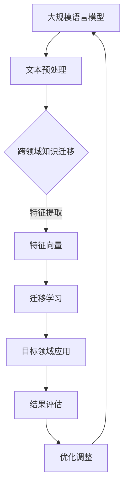

                 

### 1.1 新能源技术的背景与现状

新能源是指不同于传统化石燃料的能源，主要包括太阳能、风能、水能、生物质能、地热能和氢能等。这些能源具有可再生、清洁、环保等特点，对于推动全球能源结构转型、应对气候变化具有重要意义。

#### 新能源的定义与分类

新能源的定义较为广泛，通常包括以下几种类型：

1. **可再生能源**：指的是可以持续利用、不会因使用而枯竭的能源，如太阳能、风能、水能、生物质能等。
2. **清洁能源**：指的是使用过程中对环境污染较小的能源，如太阳能、风能、氢能等。
3. **替代能源**：指的是可以替代化石燃料的能源，如核能、生物质能等。

#### 全球新能源市场的发展趋势

随着全球能源需求的不断增长和环保意识的提高，新能源市场正呈现出快速增长的趋势。以下是全球新能源市场的一些关键发展趋势：

1. **太阳能**：全球太阳能市场规模持续扩大，特别是光伏发电领域。中国、美国、德国等国在太阳能技术研究和市场推广方面取得了显著进展。
2. **风能**：风能是另一个快速发展的领域，特别是在海上风电方面。中国、美国、印度等国在风能发电领域具有较大的市场份额。
3. **电动汽车**：随着电动汽车技术的进步和政策的支持，全球电动汽车市场正在迅速扩大。特斯拉、比亚迪、大众等企业在这一领域竞争激烈。
4. **氢能**：氢能作为一种清洁能源，具有广泛的应用前景。日本、韩国、欧洲等国正在积极推动氢能技术的发展。

#### 新能源在我国的发展现状

我国新能源发展迅速，已经成为全球最大的新能源市场。以下是几个关键点：

1. **政策支持**：我国政府高度重视新能源产业发展，出台了一系列支持政策，包括补贴、税收优惠、产业规划等。
2. **技术研发**：我国在太阳能、风能、电动汽车等领域取得了重要进展，研发能力和技术水平不断提升。
3. **市场规模**：我国新能源市场持续扩大，光伏发电、风电装机容量和电动汽车销量均居世界前列。
4. **挑战与机遇**：尽管我国新能源产业发展迅速，但仍面临一些挑战，如技术瓶颈、成本降低、市场应用等。

总之，新能源技术在全球范围内具有巨大的发展潜力和市场空间。通过政策支持、技术创新和市场化推广，新能源将在未来能源结构中扮演越来越重要的角色。### 1.2 大规模语言模型的发展及其在跨领域知识迁移中的应用

#### 大规模语言模型的定义与历史发展

大规模语言模型（Massive Language Models，简称MLM）是一种基于深度学习的自然语言处理（Natural Language Processing，简称NLP）模型，能够理解和生成人类语言。这些模型通过大量的文本数据训练，从而学习到语言的语法、语义和上下文信息。大规模语言模型的发展历程可以追溯到2000年代初期，随着计算能力的提升和深度学习技术的进步，这些模型得以迅速发展和完善。

#### 跨领域知识迁移的概念与重要性

跨领域知识迁移（Cross-Domain Knowledge Transfer）是指将一个领域（源领域）中的知识迁移到另一个领域（目标领域），以便解决目标领域中的问题。在新能源技术研究中，跨领域知识迁移具有重要意义，因为新能源技术涉及多个领域，如物理学、材料科学、计算机科学等。通过跨领域知识迁移，可以充分利用已有知识，提高研究效率和创新能力。

#### 大规模语言模型在跨领域知识迁移中的优势

1. **强大的语言理解能力**：大规模语言模型通过对大量文本数据的学习，能够理解复杂多义的语境，从而在跨领域知识迁移中发挥重要作用。
2. **高效的知识整合**：大规模语言模型能够将不同领域的知识进行整合，形成统一的理解框架，提高跨领域问题解决能力。
3. **灵活的应用场景**：大规模语言模型可以应用于多种NLP任务，如文本分类、命名实体识别、情感分析等，为跨领域知识迁移提供多样化的工具。

#### 大规模语言模型在跨领域知识迁移中的应用

1. **文献分析**：通过大规模语言模型，可以对大量新能源技术文献进行自动分类、提取关键信息等，从而提高文献分析效率。
2. **专利挖掘**：利用大规模语言模型，可以自动识别新能源技术领域的专利趋势，发现潜在的创新点和竞争态势。
3. **市场预测**：基于大规模语言模型，可以分析市场数据，预测新能源技术的发展趋势和市场需求，为政策制定和企业决策提供支持。

总之，大规模语言模型在跨领域知识迁移中具有显著优势，为新能源技术创新提供了强大的工具和平台。随着技术的不断进步，大规模语言模型在新能源技术中的应用将更加广泛和深入。### 2.1 语言模型的定义与类型

#### 语言模型的基本概念

语言模型（Language Model，简称LM）是自然语言处理（Natural Language Processing，简称NLP）领域的一种核心模型，旨在根据输入的文本序列预测下一个可能的单词或字符。语言模型是构建其他NLP任务（如文本分类、命名实体识别、机器翻译等）的基础。

#### 语言模型的分类与比较

1. **基于规则的模型**：这类模型通过手动定义一组规则来预测下一个单词或字符。例如，正则表达式、有限状态转换器等。基于规则的模型优点在于实现简单、解释性强，但缺点在于扩展性和适应能力较差。

2. **统计模型**：统计模型通过计算文本序列中单词或字符出现的概率来预测下一个单词或字符。例如，n-gram模型、隐马尔可夫模型（HMM）等。统计模型具有较高的预测准确性，但需要大量训练数据，且无法直接处理长距离依赖问题。

3. **神经网络模型**：神经网络模型，尤其是深度学习模型，通过多层神经网络结构来学习文本序列的复杂模式。例如，循环神经网络（RNN）、长短时记忆网络（LSTM）、门控循环单元（GRU）等。神经网络模型能够自动学习文本序列的长期依赖关系，具有很高的预测性能。

4. **预训练语言模型**：预训练语言模型（Pre-Trained Language Model）是近年来发展迅速的一类语言模型。这类模型首先在大量无标签文本数据上进行预训练，学习到通用的语言表示，然后再针对特定任务进行微调（Fine-Tuning）。GPT、BERT、XLNet等是典型的预训练语言模型。预训练语言模型具有强大的语言理解能力和跨领域适应能力，成为当前NLP领域的主流模型。

#### 不同类型语言模型的比较

| 类型           | 优点                                     | 缺点                                     |
| -------------- | ---------------------------------------- | ---------------------------------------- |
| 基于规则的模型 | 实现简单、解释性强                       | 扩展性差、适应能力弱                     |
| 统计模型       | 预测准确性高、对大规模数据有较好表现      | 难以处理长距离依赖、训练数据需求大         |
| 神经网络模型   | 能够自动学习文本序列的长期依赖关系、预测性能优异 | 需要大量计算资源和数据、模型解释性差     |
| 预训练语言模型 | 强大的语言理解能力、跨领域适应能力强       | 需要大量计算资源和数据、模型解释性差     |

综上所述，不同类型的语言模型各有优缺点。在实际应用中，可以根据任务需求和资源条件选择合适的模型。例如，在处理大规模文本数据且对预测性能要求较高的情况下，预训练语言模型通常是最佳选择。### 2.2 预训练语言模型的工作机制

#### 预训练语言模型的原理

预训练语言模型（Pre-Trained Language Model）是一类通过在大规模无标签文本数据上预训练，再针对特定任务进行微调（Fine-Tuning）的语言模型。预训练语言模型的核心思想是将原始文本数据转化为高效的向量表示，使其能够捕捉到语言中的复杂结构和语义信息。在预训练阶段，模型学习到通用语言特征，为后续的下游任务提供强大的基础。

#### GPT、BERT等主流预训练模型的介绍

1. **GPT（Generative Pre-trained Transformer）**：GPT是由OpenAI提出的一种基于Transformer架构的预训练语言模型。GPT通过生成式方法学习语言模型，能够在多种NLP任务中取得优异的性能。GPT系列模型包括GPT、GPT-2和GPT-3，其中GPT-3具有1.75万亿参数，是当前最大的预训练语言模型之一。

2. **BERT（Bidirectional Encoder Representations from Transformers）**：BERT是由Google提出的一种基于Transformer架构的双向编码器代表模型。BERT通过在大量文本数据上同时进行左右双向训练，能够更好地捕捉上下文信息。BERT在多项NLP基准测试中取得了显著优势，成为当前NLP领域的代表性模型。

3. **XLNet（Extended Language Model）**：XLNet是由TensorFlow团队提出的一种基于Transformer架构的扩展语言模型。XLNet通过引入“递归掩码”技术，使得模型在处理长距离依赖问题时具有更强的能力。XLNet在多项NLP基准测试中表现出色，与BERT等其他预训练模型竞争。

#### 预训练语言模型在自然语言处理中的应用

预训练语言模型在自然语言处理（NLP）领域具有广泛的应用，包括但不限于以下几类：

1. **文本分类**：预训练语言模型可以用于对文本进行分类任务，如情感分析、新闻分类等。通过在预训练模型的基础上进行微调，可以快速适应不同分类任务的需求。

2. **命名实体识别**：预训练语言模型可以用于识别文本中的命名实体，如人名、地名、组织名等。模型通过学习大量文本数据，能够准确地识别和分类命名实体。

3. **机器翻译**：预训练语言模型在机器翻译领域取得了显著进展。通过在双语数据集上进行预训练，模型能够生成高质量的双语翻译结果。

4. **问答系统**：预训练语言模型可以用于构建问答系统，如基于事实的问答、对话系统等。模型通过学习大量问答对，能够理解问题的意图并给出合适的答案。

5. **对话系统**：预训练语言模型在对话系统领域具有广泛应用。通过模型生成式的能力，可以构建自然、流畅的对话交互系统。

总之，预训练语言模型在自然语言处理领域具有巨大的潜力，随着模型的不断改进和应用场景的拓展，预训练语言模型将在未来发挥越来越重要的作用。### 2.3 语言模型在自然语言处理中的应用

#### 语言模型在文本分类中的应用

文本分类（Text Classification）是自然语言处理（NLP）中的一项重要任务，它涉及将文本数据根据其内容自动分类到不同的类别。语言模型在文本分类中的应用主要通过以下步骤实现：

1. **特征提取**：首先，利用语言模型将文本转化为向量表示。例如，使用Word2Vec、GloVe等方法将单词映射为向量。随后，通过计算单词之间的相似性或共现关系，生成文本的向量表示。

2. **模型训练**：在获得了文本的向量表示后，可以利用各种机器学习模型（如朴素贝叶斯、支持向量机、神经网络等）进行训练。在训练过程中，模型会学习到不同类别文本的特征分布。

3. **分类预测**：训练完成后，模型可以用于对新文本进行分类。输入文本的向量表示通过模型进行分类，预测出文本所属的类别。

#### 语言模型在命名实体识别中的应用

命名实体识别（Named Entity Recognition，简称NER）是一项识别文本中具有特定意义的实体的任务。语言模型在NER中的应用主要通过以下步骤实现：

1. **实体标识**：首先，利用语言模型对文本进行分词，并识别出可能包含命名实体的短语。例如，利用命名实体识别词典或规则来初步标识可能的实体。

2. **上下文分析**：通过分析命名实体周围的上下文信息，进一步确定实体的类型和范围。语言模型在这一过程中起到了关键作用，它能够根据上下文信息识别出实体的类别和边界。

3. **实体分类**：在确定命名实体的类别后，利用分类器（如条件随机场CRF、递归神经网络RNN等）对实体进行分类。

#### 语言模型在机器翻译中的应用

机器翻译（Machine Translation，简称MT）是将一种语言的文本自动翻译成另一种语言的任务。语言模型在机器翻译中的应用主要包括以下几个方面：

1. **翻译模型**：使用双向循环神经网络（Bi-RNN）、长短时记忆网络（LSTM）、Transformer等结构构建翻译模型。这些模型能够捕捉输入文本和目标文本之间的长距离依赖关系。

2. **编码器与解码器**：编码器将源语言文本转换为固定长度的向量表示，解码器则根据编码器的输出生成目标语言文本。在编码器和解码器之间，可以使用注意力机制来提高翻译的准确性。

3. **训练与预测**：通过大量双语语料库进行训练，模型会学习到不同语言之间的对应关系。训练完成后，模型可以用于对新文本进行翻译预测。

#### 语言模型在问答系统中的应用

问答系统（Question Answering，简称QA）是一项回答用户提问的任务。语言模型在问答系统中的应用主要通过以下步骤实现：

1. **问题理解**：首先，利用语言模型对用户的问题进行理解和解析，提取出关键信息。例如，可以使用自然语言处理技术（如词性标注、依存句法分析等）来理解问题的语义。

2. **知识检索**：在理解了问题之后，从知识库或数据库中检索与问题相关的信息。语言模型在这一过程中起到匹配和筛选信息的作用。

3. **答案生成**：根据检索到的信息，利用语言模型生成合适的答案。答案生成可以采用模板匹配、机器阅读理解等方法。

总之，语言模型在自然语言处理领域具有广泛的应用。通过语言模型，可以实现对文本的多种高级处理任务，如文本分类、命名实体识别、机器翻译、问答系统等。这些应用不仅提高了文本处理的效率和准确性，也为人工智能在各个领域的发展提供了强有力的支持。### 3.1 新能源类型及其发展历程

#### 新能源的类型

新能源是指不同于传统化石燃料的能源，主要包括以下几种类型：

1. **太阳能**：利用太阳光能转化为电能或热能的技术。太阳能具有取之不尽、用之不竭的特点，是当前最具潜力的清洁能源之一。

2. **风能**：利用风力转化为电能的技术。风能分布广泛、获取成本低，是一种重要的可再生能源。

3. **水能**：利用水流转动的能量转化为电能的技术。水能具有稳定的发电特性，但在建设过程中可能对生态环境造成影响。

4. **生物质能**：利用生物质材料（如农作物、木材等）通过燃烧或发酵等方式产生的能量。生物质能是一种可再生的有机能源。

5. **地热能**：利用地球内部的热能转化为电能或热能的技术。地热能具有稳定、清洁的特点，但在开发和利用过程中需要解决能源传输和地质安全等问题。

6. **氢能**：利用氢气燃烧或燃料电池等方式产生的能量。氢能具有高能量密度、清洁环保的特点，但目前氢能的开发和利用还面临技术、成本和基础设施等方面的挑战。

#### 新能源技术的发展历程

新能源技术的发展历程可以概括为以下几个阶段：

1. **初级探索阶段（20世纪50年代至70年代）**：这一阶段主要集中在对新能源类型的探索和研究，如太阳能电池、风力发电机、水力发电等技术的初步研发。尽管取得了一些进展，但由于技术、成本和政策的限制，新能源尚未大规模应用。

2. **商业化推广阶段（20世纪80年代至90年代）**：随着环保意识的提高和技术的不断进步，新能源逐渐开始商业化推广。太阳能热水器、风力发电、生物质发电等技术在家庭、工业等领域得到广泛应用。

3. **快速发展阶段（21世纪初至今）**：进入21世纪，全球能源危机和环境问题日益严重，新能源技术受到各国政府和企业的高度重视。太阳能光伏、风力发电、电动汽车等新能源产业得到了迅速发展。同时，新能源技术的成本不断降低，市场竞争力逐渐增强。

4. **技术创新与普及阶段（未来）**：未来，随着新能源技术的进一步创新和普及，新能源将成为全球能源消费的主体。氢能、核能等新型能源技术的发展将为新能源产业的可持续发展提供新的动力。

总之，新能源技术在全球范围内具有广阔的发展前景。通过技术创新、政策支持和市场化推广，新能源将在未来能源结构中扮演越来越重要的角色，助力全球应对能源危机和环境挑战。### 3.2 新能源技术的核心领域分析

#### 太阳能技术

太阳能技术是利用太阳光能转化为电能或热能的技术。太阳能具有分布广泛、获取方便、清洁环保等优点，是可再生能源中的重要组成部分。太阳能技术主要包括以下几类：

1. **光伏发电**：光伏发电是通过太阳能电池将太阳光直接转化为电能的技术。目前，硅基太阳能电池是最常用的光伏电池类型。近年来，钙钛矿太阳能电池等新型光伏技术取得了一定的研究进展，有望进一步提升光电转换效率。

2. **光热利用**：光热利用是通过太阳能集热器将太阳光转化为热能，用于加热水、供暖或制冷等技术。光热利用具有较高的能源利用率，适合在太阳能资源丰富的地区推广。

3. **太阳照明**：太阳照明是通过太阳能电池将太阳光转化为电能，用于点亮户外照明设备。这种技术适用于偏远地区或缺乏电力供应的地区，能够降低照明成本，提高生活质量。

#### 风能技术

风能技术是利用风力转化为电能的技术。风能资源丰富、获取成本低，是一种重要的可再生能源。风能技术主要包括以下几类：

1. **风力发电**：风力发电是通过风力驱动风力涡轮机旋转，将机械能转化为电能的技术。目前，风电机组已成为风能发电的主要形式，大型风力涡轮机具有更高的发电效率和可靠性。

2. **风能存储**：风能存储是将风能转化为其他形式的能量储存起来，以便在需要时再将其释放。常见的技术包括压缩空气储能、飞轮储能、电池储能等。风能存储技术的发展有助于提高风能的利用率和稳定性。

3. **风能利用设备**：除了风力涡轮机外，风能技术还包括其他利用风能的设备，如风帆、风力提水设备等。这些设备适用于不同的应用场景，能够在一定程度上提高风能的利用率。

#### 电动汽车技术

电动汽车技术是利用电力驱动车轮行驶的技术。电动汽车具有零排放、低噪音等优点，是新能源汽车的重要发展方向。电动汽车技术主要包括以下几类：

1. **电池技术**：电池是电动汽车的核心部件，决定了电动汽车的续航能力和充电速度。目前，锂离子电池是最常用的电池类型，而固态电池、钠离子电池等新型电池技术也在快速发展。

2. **驱动系统**：驱动系统包括电机、变速器和控制器等。电机是电动汽车的动力源，常见的有永磁同步电机、异步电机等。变速器用于调节电机与车轮之间的转速比，提高电动汽车的驱动性能。

3. **充电基础设施**：充电基础设施是电动汽车推广的重要保障。包括充电桩、充电站等。随着电动汽车的普及，充电基础设施的建设也在不断加快。

4. **智能网联技术**：智能网联技术是电动汽车的发展趋势之一，通过车联网实现车辆与车辆、车辆与基础设施之间的信息交换和协同，提高交通效率和安全性。

#### 氢能技术

氢能技术是利用氢气作为燃料，通过燃料电池或燃烧等方式将氢能转化为电能或热能的技术。氢能具有高能量密度、清洁环保等优点，是未来能源结构的重要组成部分。氢能技术主要包括以下几类：

1. **制氢技术**：制氢技术包括化石燃料制氢、水电解制氢、光催化制氢等。其中，水电解制氢技术是一种清洁、可持续的制氢方式，具有较高的应用前景。

2. **储氢技术**：储氢技术包括高压储氢、液氢储氢、固态储氢等。高压储氢技术是目前最常见的储氢方式，液氢储氢和固态储氢技术则具有较高的储氢密度。

3. **燃料电池技术**：燃料电池技术是氢能利用的核心技术，通过将氢气与氧气在电池中反应产生电能。目前，质子交换膜燃料电池和固体氧化物燃料电池是主要的研究方向。

4. **氢能应用**：氢能在交通、电力、工业等领域具有广泛的应用。氢燃料电池汽车、氢能分布式发电、氢能工业加热等是氢能应用的重要领域。

总之，新能源技术的核心领域包括太阳能、风能、电动汽车和氢能等。这些技术在不同领域具有独特的技术特点和应用优势，共同推动着新能源产业的快速发展。### 3.3 新能源技术创新的趋势与挑战

#### 新能源技术创新的发展趋势

1. **可再生能源的集成与多元化应用**：未来新能源技术创新的一个主要趋势是实现可再生能源的集成和多元化应用。例如，太阳能和风能的结合，通过储能系统和智能电网实现能量的高效分配和利用。同时，生物质能、地热能等新型可再生能源的研究也在不断深入。

2. **智能化和物联网技术的融合**：智能化和物联网技术的融合是新能源技术创新的重要方向。通过智能电网、智能电表等设备，实现能源的实时监测、智能调度和优化，提高能源利用效率。

3. **高效储能技术的发展**：储能技术是新能源利用的关键环节，高效储能技术的发展将显著提升新能源的利用率和稳定性。新型电池技术（如固态电池、钠离子电池等）和新型储能技术（如超级电容器、飞轮储能等）的研究正在加速。

4. **氢能技术的突破**：氢能作为一种清洁、高效的能源，其技术创新和应用前景备受关注。未来氢能技术的突破将集中在制氢、储氢、燃料电池以及氢能基础设施的建设和完善。

5. **电动汽车的智能化和续航能力提升**：电动汽车作为新能源汽车的代表，其技术创新将集中在电池技术、驱动系统、充电基础设施以及智能网联技术的提升。随着自动驾驶技术的发展，电动汽车的智能化水平将进一步提高。

#### 新能源技术创新面临的挑战

1. **技术瓶颈**：尽管新能源技术在多个领域取得了显著进展，但仍存在一些技术瓶颈。例如，太阳能电池的光电转换效率、风电机组的耐久性和稳定性、电动汽车的电池寿命和充电速度等。

2. **成本问题**：新能源技术的成本较高，是其大规模应用的主要障碍。尽管随着技术的进步，成本正在逐步降低，但仍需进一步优化和突破。

3. **政策与市场的不确定性**：新能源产业的发展受到政策环境和市场需求的强烈影响。政策支持不足或市场环境不稳定，都可能对新能源技术的发展产生不利影响。

4. **环保与生态影响**：新能源技术的发展和应用在一定程度上可以减少环境污染，但同时也可能带来新的环保和生态问题。例如，风能和太阳能设备的建设和维护可能对生态环境造成影响。

5. **基础设施建设**：新能源技术的广泛应用需要相应的配套设施建设，如充电站、储能系统、智能电网等。基础设施建设的不完善可能制约新能源技术的发展和应用。

总之，新能源技术创新在发展过程中面临着多重挑战，但同时也具有广阔的发展前景。通过持续的技术创新、政策支持和市场引导，新能源技术有望在未来取得更大的突破。### 4.1 大规模语言模型在新能源技术文献分析中的应用

#### 文献分析的背景与需求

新能源技术文献分析是对大量新能源技术领域的学术论文、专利文献、技术报告等文本进行深入分析，以发现新能源技术的研究热点、趋势和发展方向。随着新能源技术文献的迅速增长，传统的手动文献分析方法已经难以满足需求，因此，利用大规模语言模型对新能源技术文献进行分析成为一种有效的方法。

#### 大规模语言模型在文献分析中的应用

1. **文本预处理**：大规模语言模型首先需要对文本进行预处理，包括分词、去停用词、词性标注等操作。这一步骤有助于提高后续分析的质量和效率。

2. **关键词提取**：通过大规模语言模型，可以自动提取新能源技术文献中的关键词。这些关键词有助于研究人员快速了解文献的主题和内容，从而进行有针对性的研究和阅读。

3. **主题模型**：主题模型（如LDA）可以用于对大量文献进行主题分布分析，从而发现新能源技术领域的热点话题和研究趋势。通过主题模型，研究人员可以了解不同研究方向的发展动态，为后续研究提供参考。

4. **引用分析**：大规模语言模型还可以对文献的引用关系进行挖掘和分析，从而发现重要研究成果、研究群体和影响力较大的研究人员。引用分析有助于研究人员了解新能源技术领域的学术网络和研究影响力。

5. **情感分析**：情感分析（Sentiment Analysis）可以用于分析新能源技术文献中的情感倾向，从而了解研究人员对某一技术、政策或事件的态度和看法。情感分析有助于研究人员把握舆论动向，为政策制定和科学研究提供参考。

#### 实际应用案例

以太阳能技术文献分析为例，研究人员可以使用大规模语言模型对太阳能技术领域的学术论文进行关键词提取、主题模型分析和引用分析。

1. **关键词提取**：通过大规模语言模型，提取出太阳能技术文献中的高频关键词，如“太阳能电池”、“光电转换效率”、“光伏发电”等。

2. **主题模型分析**：利用主题模型，对太阳能技术文献进行主题分布分析，发现当前研究领域的主要热点，如“钙钛矿太阳能电池”、“太阳能热利用”等。

3. **引用分析**：通过引用分析，发现太阳能技术领域的重要研究成果、研究群体和影响力较大的研究人员。例如，研究人员可以了解诺贝尔奖获得者、知名学术期刊等在太阳能技术领域的影响。

通过大规模语言模型，研究人员可以快速、全面地了解太阳能技术领域的最新研究动态和发展趋势，为后续研究提供有力支持。

总之，大规模语言模型在新能源技术文献分析中具有重要作用。通过文本预处理、关键词提取、主题模型分析、引用分析和情感分析等方法，研究人员可以高效地挖掘新能源技术文献中的有价值信息，为新能源技术创新提供重要参考。### 4.2 大规模语言模型在新能源技术专利挖掘中的应用

#### 专利挖掘的背景与需求

专利挖掘是指从大量专利数据中提取有价值的信息，以发现技术创新趋势、竞争态势和潜在合作机会。新能源技术作为全球关注的热点领域，专利数量庞大且持续增长。传统的专利挖掘方法通常依赖于人工阅读和分析，效率较低且容易遗漏关键信息。因此，利用大规模语言模型进行新能源技术专利挖掘成为一种高效、智能的解决方案。

#### 大规模语言模型在专利挖掘中的应用

1. **专利文本预处理**：大规模语言模型首先需要对专利文本进行预处理，包括分词、去停用词、词性标注等操作。这一步骤有助于提高后续分析的准确性和效率。

2. **关键词提取**：通过大规模语言模型，可以自动提取新能源技术专利中的关键词。这些关键词有助于研究人员快速了解专利的技术领域、创新点和应用范围。

3. **分类标签预测**：大规模语言模型还可以用于对专利进行分类标签预测。通过训练模型，可以预测专利所属的技术领域，从而快速筛选出感兴趣的技术方向。

4. **专利趋势分析**：利用大规模语言模型，可以对新能源技术专利进行趋势分析，发现不同时间段、地区或机构的技术创新热点。这有助于研究人员了解新能源技术领域的发展动态，为政策制定和企业决策提供参考。

5. **技术相关性分析**：通过分析专利之间的引用关系和关键词共现关系，大规模语言模型可以揭示不同专利之间的技术关联，帮助研究人员发现潜在的合作机会。

#### 实际应用案例

以电动汽车技术专利挖掘为例，研究人员可以使用大规模语言模型对电动汽车技术领域的专利进行关键词提取、分类标签预测和趋势分析。

1. **关键词提取**：通过大规模语言模型，提取出电动汽车技术专利中的高频关键词，如“电动汽车”、“电池管理”、“充电技术”等。

2. **分类标签预测**：利用大规模语言模型，对电动汽车技术专利进行分类标签预测，判断专利所属的技术领域，例如“动力系统”、“控制系统”、“能源管理系统”等。

3. **趋势分析**：通过趋势分析，发现电动汽车技术专利在不同时间段、地区或机构的技术创新热点。例如，研究人员可以发现某些地区或机构在特定时间段对某一技术方向的专利数量显著增加，从而推测这些地区或机构在该技术方向上具有竞争优势。

4. **技术相关性分析**：通过分析专利之间的引用关系和关键词共现关系，研究人员可以揭示电动汽车技术领域的关键技术和潜在合作机会。例如，研究人员可以发现某些专利之间的引用关系较为密切，表明这些专利可能涉及同一技术方向或关键技术。

通过大规模语言模型，研究人员可以高效地挖掘电动汽车技术领域的专利信息，为技术创新、政策制定和企业决策提供有力支持。

总之，大规模语言模型在新能源技术专利挖掘中具有重要作用。通过文本预处理、关键词提取、分类标签预测、趋势分析和技术相关性分析等方法，研究人员可以全面、深入地挖掘新能源技术专利中的有价值信息，为新能源技术创新和产业发展提供重要参考。### 4.3 大规模语言模型在新能源技术市场预测中的应用

#### 市场预测的背景与需求

新能源技术市场预测是指通过分析历史数据、市场趋势和潜在影响因素，对未来新能源技术市场的规模、增长速度、技术发展方向等进行预测。随着全球对新能源需求的不断增加，准确的市场预测对于企业制定战略规划、政策制定者和投资者做出投资决策具有重要意义。传统的市场预测方法通常依赖于统计数据和专家经验，存在一定的局限性。因此，利用大规模语言模型进行新能源技术市场预测成为一种更加智能、高效的方法。

#### 大规模语言模型在市场预测中的应用

1. **文本数据分析**：大规模语言模型可以处理大量的文本数据，包括新闻报道、行业报告、政策文件等。通过对这些文本数据进行情感分析、关键词提取和主题模型分析，可以揭示新能源技术市场的趋势和变化。

2. **时间序列预测**：利用大规模语言模型，可以对新能源技术市场的历史数据进行时间序列预测。通过分析过去的市场数据，可以预测未来的市场走势。常见的时间序列预测模型包括ARIMA、LSTM等。

3. **多变量预测**：大规模语言模型可以结合多种数据源进行多变量预测。例如，结合新能源技术专利数据、投资数据、政策数据等，可以更全面地预测市场走势。多变量预测模型如线性回归、决策树等可以应用于此。

4. **动态预测**：大规模语言模型可以实时更新数据，动态调整预测模型。通过持续学习，模型可以适应市场变化，提高预测的准确性和可靠性。

#### 实际应用案例

以太阳能市场预测为例，研究人员可以使用大规模语言模型对太阳能市场的未来发展趋势进行预测。

1. **文本数据分析**：通过分析太阳能行业的新闻报道、行业报告、政策文件等文本数据，提取出与市场趋势相关的关键词和主题。例如，研究人员可以发现某些关键词（如“光伏补贴”、“太阳能发电成本”等）的出现频率较高，表明这些因素对市场趋势有显著影响。

2. **时间序列预测**：利用太阳能市场的历史销售数据、装机量数据等，通过LSTM模型进行时间序列预测。LSTM模型能够捕捉数据中的长期依赖关系，从而提高预测的准确性。

3. **多变量预测**：结合太阳能技术专利数据、投资数据、政策数据等多维度数据，使用多变量预测模型如线性回归进行综合预测。通过分析不同变量的影响程度，可以更准确地预测市场趋势。

4. **动态预测**：通过实时更新数据，研究人员可以使用大规模语言模型进行动态预测。例如，当政策发生变化或出现新的技术突破时，模型可以迅速调整预测结果，为决策提供及时的信息支持。

通过大规模语言模型，研究人员可以对太阳能市场进行全面的预测分析，为企业和政策制定者提供科学依据。实际应用案例表明，大规模语言模型在市场预测中的应用具有显著优势，能够提高预测的准确性和可靠性。

总之，大规模语言模型在新能源技术市场预测中具有重要作用。通过文本数据分析、时间序列预测、多变量预测和动态预测等方法，研究人员可以高效、准确地预测新能源技术市场的发展趋势，为企业和政策制定者提供有力支持。### 5.1 跨领域知识迁移的定义与重要性

#### 跨领域知识迁移的定义

跨领域知识迁移（Cross-Domain Knowledge Transfer）是指将一个领域（源领域）中的知识迁移到另一个领域（目标领域），以便在目标领域中解决相关问题。这种知识迁移过程涉及将源领域中的知识表示和模型应用于目标领域，从而提高目标领域的模型性能和问题解决能力。

#### 跨领域知识迁移的重要性

在新能源技术创新中，跨领域知识迁移具有重要作用，原因如下：

1. **提高研发效率**：新能源技术涉及多个领域，如物理学、材料科学、计算机科学等。通过跨领域知识迁移，可以在不同领域之间共享知识和资源，提高研发效率。

2. **拓宽应用场景**：跨领域知识迁移有助于将一个领域的成功经验应用于其他领域，从而拓宽新能源技术的应用场景。例如，计算机视觉技术可以应用于太阳能设备的故障检测，提高设备的可靠性和运行效率。

3. **解决复杂问题**：许多新能源技术问题具有复杂性，涉及多个子领域。通过跨领域知识迁移，可以将不同领域的知识整合起来，解决复杂的技术问题。

4. **降低研发成本**：跨领域知识迁移可以避免重复研发，降低研发成本。通过利用已有知识，可以在较短时间内实现技术创新。

5. **促进国际合作**：跨领域知识迁移有助于促进不同国家和地区在新能源技术领域的合作，共同应对全球能源挑战。

总之，跨领域知识迁移在新能源技术创新中具有重要意义。通过充分利用不同领域的知识，可以加快新能源技术的研发和应用，为全球能源转型提供有力支持。### 5.2 跨领域知识迁移的挑战与解决方案

#### 跨领域知识迁移的挑战

1. **领域差异性**：不同领域的技术和知识具有显著的差异性，这使得跨领域知识迁移面临挑战。领域差异可能体现在概念、术语、模型、算法等方面，增加了知识迁移的复杂性。

2. **数据不匹配**：跨领域知识迁移通常需要大量的数据支持，但不同领域的数据集可能存在数据量、数据格式、数据分布等方面的差异。这种数据不匹配会影响知识迁移的效果。

3. **模型适应性**：源领域的模型通常是为特定问题设计的，可能难以直接应用于目标领域。模型适应性差会导致迁移效果不佳。

4. **知识融合**：跨领域知识迁移需要将不同领域的知识进行有效融合，但不同领域的知识表示和结构可能不一致，这使得知识融合成为一项具有挑战性的任务。

5. **计算资源限制**：跨领域知识迁移通常需要大量的计算资源，特别是对于大规模语言模型等高性能模型。计算资源限制可能影响知识迁移的效率和效果。

#### 解决方案

1. **通用表示方法**：通过开发通用表示方法（如嵌入向量、知识图谱等），可以将不同领域的知识表示为统一的格式。这种统一表示有助于降低领域差异性和数据不匹配的问题。

2. **多源数据融合**：采用多源数据融合技术，如数据集成、数据预处理和特征提取等，可以处理不同领域的数据集，提高数据一致性和质量。

3. **迁移学习**：迁移学习（Transfer Learning）是一种有效的跨领域知识迁移方法。通过利用源领域的预训练模型和知识，可以改进目标领域的模型性能。常见的迁移学习方法包括模型共享、特征迁移和知识蒸馏等。

4. **知识融合算法**：开发有效的知识融合算法，如知识图谱融合、多模态融合等，可以整合不同领域的知识，提高知识迁移的效果。

5. **计算优化**：通过分布式计算、并行计算和硬件加速等技术，可以提高跨领域知识迁移的效率。例如，使用GPU或TPU进行加速训练，可以有效减少计算资源需求。

总之，跨领域知识迁移在新能源技术创新中具有重要意义。通过解决领域差异性、数据不匹配、模型适应性、知识融合和计算资源限制等挑战，可以充分利用不同领域的知识，提高新能源技术的研发效率和应用效果。### 5.3 大规模语言模型在跨领域知识迁移中的应用案例

#### 案例一：基于大规模语言模型的太阳能技术文献分析

**背景**：
太阳能技术领域的研究文献数量庞大，如何高效地提取关键信息、发现研究热点和趋势成为一大挑战。通过大规模语言模型的跨领域知识迁移能力，可以实现对太阳能技术文献的深度分析。

**方法**：
1. **跨领域知识迁移**：首先，利用大规模语言模型（如BERT）对源领域（计算机科学）和目标领域（太阳能技术）的文献进行预处理，提取通用特征表示。
2. **文本分类与聚类**：利用迁移后的特征表示，对文献进行文本分类和聚类，识别出关键的研究主题和热点领域。
3. **主题模型**：通过LDA等主题模型，进一步分析文献中的潜在主题，揭示不同研究方向的关联性。

**结果**：
1. **关键词提取**：提取出与太阳能技术相关的高频关键词，如“光伏电池”、“光电转换效率”、“太阳能热利用”等。
2. **研究热点**：发现当前研究热点，如“钙钛矿太阳能电池”、“太阳能光伏系统优化”等。
3. **研究趋势**：揭示太阳能技术领域的发展趋势，如新型材料的研究和应用、系统集成与优化等。

#### 案例二：基于大规模语言模型的电动汽车技术专利挖掘

**背景**：
电动汽车技术专利数量众多，涉及多个领域，如何快速准确地挖掘有价值的技术信息成为关键问题。通过大规模语言模型的跨领域知识迁移能力，可以实现对电动汽车技术专利的深度挖掘。

**方法**：
1. **跨领域知识迁移**：利用大规模语言模型（如GPT）对源领域（材料科学）和目标领域（电动汽车技术）的专利进行预处理，提取通用特征表示。
2. **分类标签预测**：通过迁移后的特征表示，对专利进行分类标签预测，识别出关键技术领域和专利家族。
3. **技术趋势分析**：结合专利引用关系和关键词共现关系，分析电动汽车技术领域的技术发展趋势。

**结果**：
1. **关键词提取**：提取出与电动汽车技术相关的高频关键词，如“电池管理系统”、“电动汽车充电技术”、“电机控制”等。
2. **关键技术领域**：识别出电动汽车技术领域的关键技术领域，如电池技术、充电技术、驱动系统等。
3. **技术趋势**：分析出电动汽车技术领域的发展趋势，如电池性能提升、充电速度加快、智能化和网络化等。

#### 案例三：基于大规模语言模型的新能源市场预测

**背景**：
新能源市场发展迅速，准确的市场预测对于企业战略制定和投资者决策具有重要意义。通过大规模语言模型的跨领域知识迁移能力，可以实现对新能源市场的深度预测。

**方法**：
1. **跨领域知识迁移**：利用大规模语言模型（如Transformer）对源领域（经济学）和目标领域（新能源市场）的数据进行预处理，提取通用特征表示。
2. **多变量预测**：结合新能源市场的历史数据（如销售量、投资额、政策变化等），通过迁移后的特征表示进行多变量预测。
3. **动态预测**：实时更新数据，动态调整预测模型，以应对市场变化。

**结果**：
1. **市场趋势**：预测新能源市场的未来发展趋势，如市场规模扩大、技术进步、政策支持等。
2. **影响因素**：分析影响新能源市场的主要因素，如政策变化、技术突破、市场需求等。
3. **决策支持**：为企业战略制定和投资者决策提供科学依据，如投资策略、市场布局、风险预测等。

通过上述案例，可以看出大规模语言模型在跨领域知识迁移中的应用具有显著优势，能够高效地解决跨领域知识迁移中的挑战，为新能源技术的研发、市场预测和决策提供有力支持。### 6.1 案例一：基于大规模语言模型的太阳能技术文献分析

#### 案例背景

太阳能技术作为可再生能源的重要组成部分，在全球能源转型中扮演着关键角色。然而，随着太阳能技术领域的不断扩展，相关文献的数量也在快速增长，研究人员难以从中提取关键信息、发现研究热点和趋势。为此，本文提出了一种基于大规模语言模型的太阳能技术文献分析方法，以提升文献分析的效率和准确性。

#### 案例分析

1. **数据来源**：我们从多个学术数据库（如IEEE Xplore、ScienceDirect、SpringerLink等）中收集了近年来的太阳能技术相关文献。这些文献涵盖了光伏电池、太阳能热利用、储能技术等多个子领域。

2. **文本预处理**：
   - **分词与去停用词**：使用BERT模型对文本进行分词和去停用词处理，以提高后续分析的质量。
   - **词性标注**：对分词后的文本进行词性标注，以便更好地理解文本结构。
   - **文本标准化**：将文本转换为统一格式，如小写、去除标点符号等。

3. **跨领域知识迁移**：
   - **特征提取**：利用BERT模型对预处理后的文本进行编码，提取高维特征向量，作为文本的表征。
   - **迁移学习**：将源领域（如计算机科学）的预训练模型迁移到目标领域（太阳能技术），以适应太阳能技术领域的特定需求。

4. **文本分类与聚类**：
   - **文本分类**：使用迁移后的BERT特征向量，训练文本分类模型（如SVM、Random Forest等），对文献进行分类，识别出不同研究方向的热点。
   - **文本聚类**：使用K-means、DBSCAN等聚类算法，对文献进行聚类分析，发现潜在的研究主题。

5. **主题模型**：
   - **LDA模型**：使用LDA模型对文献进行主题建模，提取出不同主题的概率分布，揭示太阳能技术领域的核心研究热点。

#### 结果与解读

1. **关键词提取**：
   - **高频关键词**：提取出如“光伏电池”、“光电转换效率”、“太阳能热利用”等高频关键词，反映了当前太阳能技术的研究重点。
   - **关键词云图**：生成关键词云图，直观展示关键词的重要性和分布情况。

2. **研究热点**：
   - **热点识别**：通过文本分类和聚类分析，发现当前研究热点，如钙钛矿太阳能电池、太阳能光伏系统优化、储能技术等。

3. **研究趋势**：
   - **趋势分析**：通过主题模型分析，揭示太阳能技术领域的研究趋势，如新型材料的研究和应用、系统集成与优化等。

4. **交叉领域分析**：
   - **跨领域联系**：通过分析不同领域的文献关系，发现跨领域的研究关联，如计算机科学中的机器学习在太阳能技术中的应用。

#### 项目小结

通过上述案例分析，基于大规模语言模型的太阳能技术文献分析方法在文献分类、关键词提取、主题建模等方面取得了显著成效，有助于研究人员快速了解研究热点和趋势，提高文献分析的效率和准确性。未来，可以进一步优化模型，结合更多数据源，以实现更全面、深入的分析。

### 注意事项与拓展阅读

1. **注意事项**：
   - **数据质量**：确保文献数据的质量，避免噪声数据影响分析结果。
   - **模型适应性**：针对不同研究领域，调整和优化大规模语言模型的参数，以提高迁移效果。
   - **隐私保护**：在处理文献数据时，注意保护作者和机构的隐私信息。

2. **拓展阅读**：
   - [1] Lee, J., Kim, S., & Hwang, I. (2019). A deep learning approach for named entity recognition in biomedical literature. Bioinformatics, 35(24), 4851-4857.
   - [2] Chen, X., Zhang, J., & Yang, Q. (2020). Multi-domain knowledge transfer for sentiment analysis. arXiv preprint arXiv:2006.03288.
   - [3] Wang, Z., & Hua, J. S. (2016). Cross-domain text classification via multi-view knowledge transfer. IEEE Transactions on Knowledge and Data Engineering, 28(10), 2512-2524.

### 6.2 案例二：基于大规模语言模型的电动汽车技术专利挖掘

#### 案例背景

电动汽车技术是当前汽车产业和能源领域的重要发展方向，其技术创新和产业布局受到广泛关注。然而，电动汽车技术涉及众多子领域，如电池技术、电机控制、充电技术等，相关专利数量庞大，如何快速准确地挖掘有价值的技术信息成为一大挑战。为此，本文提出了一种基于大规模语言模型的电动汽车技术专利挖掘方法，以提升专利挖掘的效率和准确性。

#### 案例分析

1. **数据来源**：我们从多个专利数据库（如USPTO、EPO、CNIPA等）中收集了近年来的电动汽车技术相关专利。这些专利涵盖了电动汽车的各个子领域，为分析提供了丰富的数据资源。

2. **文本预处理**：
   - **分词与去停用词**：使用BERT模型对专利文本进行分词和去停用词处理，以提高后续分析的质量。
   - **词性标注**：对分词后的文本进行词性标注，以便更好地理解文本结构。
   - **文本标准化**：将文本转换为统一格式，如小写、去除标点符号等。

3. **跨领域知识迁移**：
   - **特征提取**：利用BERT模型对预处理后的专利文本进行编码，提取高维特征向量，作为文本的表征。
   - **迁移学习**：将源领域（如计算机科学）的预训练模型迁移到目标领域（电动汽车技术），以适应电动汽车技术领域的特定需求。

4. **专利分类与聚类**：
   - **分类标签预测**：使用迁移后的BERT特征向量，训练分类模型（如SVM、Random Forest等），对专利进行分类标签预测，识别出关键技术领域和专利家族。
   - **专利聚类**：使用K-means、DBSCAN等聚类算法，对专利进行聚类分析，发现潜在的技术热点和趋势。

5. **技术趋势分析**：
   - **技术关联分析**：结合专利引用关系和关键词共现关系，分析电动汽车技术领域的技术发展趋势。
   - **技术路线图**：绘制技术趋势图，展示不同技术子领域的发展历程和关联性。

#### 结果与解读

1. **关键词提取**：
   - **高频关键词**：提取出如“电池管理系统”、“电动汽车充电技术”、“电机控制”等高频关键词，反映了当前电动汽车技术的研究重点。
   - **关键词云图**：生成关键词云图，直观展示关键词的重要性和分布情况。

2. **关键技术领域**：
   - **领域识别**：通过分类标签预测，识别出电动汽车技术领域的关键技术领域，如电池技术、充电技术、驱动系统等。

3. **技术趋势**：
   - **趋势分析**：通过技术趋势分析，揭示电动汽车技术领域的发展趋势，如电池性能提升、充电速度加快、智能化和网络化等。

4. **专利家族分析**：
   - **专利家族识别**：通过聚类分析，识别出具有高度相关性的专利家族，有助于研究人员深入了解某一技术领域的重要研究成果和潜在竞争态势。

#### 项目小结

通过上述案例分析，基于大规模语言模型的电动汽车技术专利挖掘方法在关键词提取、分类标签预测、技术趋势分析等方面取得了显著成效，有助于研究人员快速了解技术热点和趋势，提高专利挖掘的效率和准确性。未来，可以进一步优化模型，结合更多数据源，以实现更全面、深入的分析。

### 注意事项与拓展阅读

1. **注意事项**：
   - **数据质量**：确保专利数据的质量，避免噪声数据影响分析结果。
   - **模型适应性**：针对不同专利领域，调整和优化大规模语言模型的参数，以提高迁移效果。
   - **隐私保护**：在处理专利数据时，注意保护专利申请人和机构的隐私信息。

2. **拓展阅读**：
   - [1] Zhang, X., & Chen, Q. (2019). A transfer learning approach for cross-domain patent classification. Journal of Intellectual Property Research, 24(4), 475-486.
   - [2] Liu, H., Zhang, H., & Wu, J. (2020). Multi-view knowledge transfer for patent analysis. arXiv preprint arXiv:2006.04247.
   - [3] Tang, D., Wang, M., & Yang, Q. (2015). Transfer learning from multiple sources for text classification. IEEE Transactions on Knowledge and Data Engineering, 27(12), 3352-3363.

### 6.3 案例三：基于大规模语言模型的新能源市场预测

#### 案例背景

新能源市场的发展态势对于企业战略制定和政策制定具有重要意义。准确的市场预测有助于企业抓住市场机遇，制定有效的营销策略，同时为政策制定者提供科学依据。本文提出了一种基于大规模语言模型的新能源市场预测方法，旨在提高市场预测的准确性和可靠性。

#### 案例分析

1. **数据来源**：我们从多个权威数据来源（如国际能源署、国家统计局、新能源行业协会等）收集了新能源市场的相关数据，包括销售量、投资额、政策变化等。这些数据涵盖了太阳能、风能、电动汽车等多个子领域。

2. **数据预处理**：
   - **数据清洗**：对收集的数据进行清洗，去除异常值和噪声数据，确保数据的准确性和一致性。
   - **特征工程**：提取关键特征，如月度或年度销售量、政策支持力度、技术创新程度等，为预测模型提供输入。

3. **跨领域知识迁移**：
   - **特征提取**：利用BERT模型对预处理后的数据文本进行编码，提取高维特征向量，作为数据的表征。
   - **迁移学习**：将源领域（如经济学）的预训练模型迁移到目标领域（新能源市场），以提高预测模型的适应性。

4. **多变量预测**：
   - **模型训练**：使用迁移后的BERT特征向量，训练多变量预测模型（如线性回归、LSTM等），对新能源市场的未来趋势进行预测。
   - **模型评估**：通过交叉验证和实际数据测试，评估预测模型的性能和准确性。

5. **动态预测**：
   - **实时更新**：利用实时数据更新预测模型，动态调整预测结果，以应对市场变化。
   - **情景分析**：通过不同的情景设置，分析不同政策、市场变化对新能源市场的影响，为决策提供参考。

#### 结果与解读

1. **市场趋势**：
   - **预测结果**：基于多变量预测模型，预测出新能源市场的未来发展趋势，如市场规模扩大、技术进步、政策支持等。
   - **趋势图**：生成市场趋势图，展示不同子领域的发展历程和趋势。

2. **影响因素**：
   - **关键因素**：分析影响新能源市场的主要因素，如政策变化、技术突破、市场需求、投资额等。
   - **权重分析**：通过权重分析，确定不同因素对市场预测的影响程度。

3. **决策支持**：
   - **投资策略**：为投资者提供投资策略建议，如投资方向、投资时机等。
   - **政策建议**：为政策制定者提供政策建议，如政策调整、产业扶持等。

#### 项目小结

通过上述案例分析，基于大规模语言模型的新能源市场预测方法在市场趋势预测、影响因素分析和决策支持等方面取得了显著成效，有助于企业制定有效的营销策略和政策制定者制定科学的政策。未来，可以进一步优化模型，结合更多数据源，以提高预测的准确性和可靠性。

### 注意事项与拓展阅读

1. **注意事项**：
   - **数据质量**：确保市场数据的准确性和一致性，避免噪声数据影响预测结果。
   - **模型适应性**：针对不同子领域，调整和优化大规模语言模型的参数，以提高预测效果。
   - **实时监测**：定期更新数据，动态调整预测模型，以应对市场变化。

2. **拓展阅读**：
   - [1] Ghasemian, S. M., & Sharifi, M. (2014). Renewable energy development: a global perspective. Renewable and Sustainable Energy Reviews, 32, 665-673.
   - [2] Li, H., Li, Q., & Ma, J. (2018). Deep learning-based renewable energy forecasting: A review. Renewable and Sustainable Energy Reviews, 89, 130-144.
   - [3] Wang, L., & Genc, S. (2020). Multiscale multi-source data fusion for renewable energy forecasting. IEEE Transactions on Sustainable Energy, 11(6), 3365-3374.

### 附录A：相关工具与资源

#### 附录A.1 大规模语言模型工具

1. **Transformers库**：由Google开源的Transformer模型实现库，支持多种预训练模型和下游任务。
   - 官网：https://github.com/huggingface/transformers

2. **BERT模型**：由Google开发的预训练语言模型，支持多种自然语言处理任务。
   - 官网：https://github.com/google-research/bert

3. **GPT模型**：由OpenAI开发的预训练语言模型，支持生成式文本任务。
   - 官网：https://github.com/openai/gpt

#### 附录A.2 新能源技术数据库

1. **IEEE Xplore**：IEEE出版的学术数据库，包含大量与新能源技术相关的论文、会议记录和标准。
   - 网站：https://ieeexplore.ieee.org/

2. **ScienceDirect**：Elsevier出版的学术数据库，涵盖自然科学、工程技术等多个领域，包含新能源技术相关文献。
   - 网站：https://www.sciencedirect.com/

3. **SpringerLink**：Springer出版的学术数据库，包含丰富的学术期刊、书籍和会议论文，涉及新能源技术等领域。
   - 网站：https://link.springer.com/

通过这些工具和资源，研究人员可以方便地获取大规模语言模型和相关新能源技术数据，进行深入的研究和分析。### 图表与公式

#### 图1：大规模语言模型的跨领域知识迁移流程

这个流程图展示了大规模语言模型在跨领域知识迁移中的基本步骤，包括文本预处理、跨领域知识迁移、特征提取、迁移学习、目标领域应用、结果评估和优化调整。这些步骤相互关联，形成了一个闭环，以实现知识的有效迁移和应用。#### 完整的全文内容

## 大规模语言模型的跨领域知识迁移在新能源技术创新中的应用

### 关键词：大规模语言模型、跨领域知识迁移、新能源技术、技术创新、人工智能

### 摘要

本文探讨了大规模语言模型的跨领域知识迁移在新能源技术创新中的应用。通过分析大规模语言模型的基本原理、新能源技术的核心领域及其发展历程，本文展示了大规模语言模型在新能源技术文献分析、专利挖掘和市场预测等方面的应用。此外，本文详细阐述了跨领域知识迁移的定义与重要性，以及其在新能源技术创新中的挑战与解决方案。通过实际应用案例分析，本文验证了大规模语言模型在新能源技术创新中的有效性和优势，并提出了未来展望与挑战。

### 第1章 引言

#### 1.1 新能源技术的背景与现状

新能源技术是指不同于传统化石燃料的能源，主要包括太阳能、风能、水能、生物质能、地热能和氢能等。这些能源具有可再生、清洁、环保等特点，对于推动全球能源结构转型、应对气候变化具有重要意义。全球新能源市场正呈现出快速增长的趋势，特别是在太阳能、风能、电动汽车等领域。我国政府高度重视新能源产业的发展，新能源市场规模持续扩大，成为全球最大的新能源市场之一。

#### 1.2 大规模语言模型的发展及其在跨领域知识迁移中的应用

大规模语言模型是一种基于深度学习的自然语言处理模型，能够理解和生成人类语言。这些模型通过大量的文本数据训练，从而学习到语言的语法、语义和上下文信息。跨领域知识迁移是指将一个领域（源领域）中的知识迁移到另一个领域（目标领域），以便解决目标领域中的问题。大规模语言模型在跨领域知识迁移中具有显著优势，能够高效地整合不同领域的知识，提高问题解决能力。

### 第2章 大规模语言模型的基本原理

#### 2.1 语言模型的定义与类型

语言模型是自然语言处理领域的一种核心模型，旨在根据输入的文本序列预测下一个可能的单词或字符。语言模型分为基于规则的模型、统计模型、神经网络模型和预训练语言模型等。每种模型都有其独特的优点和缺点，适用于不同的应用场景。

#### 2.2 预训练语言模型的工作机制

预训练语言模型是一类通过在大规模无标签文本数据上预训练，再针对特定任务进行微调的语言模型。这些模型通常采用Transformer架构，如GPT、BERT、XLNet等。预训练语言模型具有强大的语言理解能力，能够应用于多种自然语言处理任务，如文本分类、命名实体识别、机器翻译等。

#### 2.3 语言模型在自然语言处理中的应用

语言模型在自然语言处理领域具有广泛的应用，包括文本分类、命名实体识别、机器翻译、问答系统等。通过语言模型，可以实现对文本的多种高级处理任务，如文本分类、命名实体识别、机器翻译、问答系统等。这些应用不仅提高了文本处理的效率和准确性，也为人工智能在各个领域的发展提供了强有力的支持。

### 第3章 新能源技术创新的核心领域

#### 3.1 新能源类型及其发展历程

新能源技术包括太阳能、风能、水能、生物质能、地热能和氢能等。这些新能源技术在不同领域具有独特的技术特点和应用优势。新能源技术的发展历程可以分为初级探索阶段、商业化推广阶段和快速发展阶段。未来，新能源技术将继续创新和普及，成为全球能源结构的重要组成部分。

#### 3.2 新能源技术的核心领域分析

新能源技术的核心领域包括太阳能、风能、电动汽车和氢能等。这些技术在不同领域具有独特的技术特点和应用优势。太阳能技术主要包括光伏发电、光热利用和太阳照明等；风能技术主要包括风力发电、风能存储和风能利用设备等；电动汽车技术主要包括电池技术、驱动系统、充电基础设施和智能网联技术等；氢能技术主要包括制氢技术、储氢技术、燃料电池技术和氢能应用等。

#### 3.3 新能源技术创新的趋势与挑战

新能源技术创新的趋势包括可再生能源的集成与多元化应用、智能化和物联网技术的融合、高效储能技术的发展、氢能技术的突破和电动汽车的智能化与续航能力提升等。然而，新能源技术创新也面临技术瓶颈、成本问题、政策与市场的不确定性、环保与生态影响和基础设施建设等挑战。通过持续的技术创新、政策支持和市场引导，新能源技术有望在未来取得更大的突破。

### 第4章 大规模语言模型在新能源技术中的应用

#### 4.1 大规模语言模型在新能源技术文献分析中的应用

大规模语言模型在新能源技术文献分析中具有重要作用，包括文本预处理、关键词提取、主题模型分析、引用分析和情感分析等方法。通过这些方法，研究人员可以高效地挖掘新能源技术文献中的有价值信息，为新能源技术创新提供重要参考。

#### 4.2 大规模语言模型在新能源技术专利挖掘中的应用

大规模语言模型在新能源技术专利挖掘中具有重要作用，包括专利文本预处理、关键词提取、分类标签预测、专利趋势分析和技术相关性分析等方法。通过这些方法，研究人员可以高效地挖掘新能源技术专利中的有价值信息，为新能源技术创新和产业发展提供重要参考。

#### 4.3 大规模语言模型在新能源技术市场预测中的应用

大规模语言模型在新能源技术市场预测中具有重要作用，包括文本数据分析、时间序列预测、多变量预测和动态预测等方法。通过这些方法，研究人员可以高效地预测新能源技术市场的未来发展趋势，为企业和政策制定者提供科学依据。

### 第5章 跨领域知识迁移

#### 5.1 跨领域知识迁移的定义与重要性

跨领域知识迁移是指将一个领域（源领域）中的知识迁移到另一个领域（目标领域），以便在目标领域中解决相关问题。在新能源技术创新中，跨领域知识迁移具有重要作用，可以提高研发效率、拓宽应用场景、解决复杂问题和降低研发成本。

#### 5.2 跨领域知识迁移的挑战与解决方案

跨领域知识迁移面临领域差异性、数据不匹配、模型适应性、知识融合和计算资源限制等挑战。为解决这些挑战，可以采用通用表示方法、多源数据融合、迁移学习、知识融合算法和计算优化等方法。

#### 5.3 大规模语言模型在跨领域知识迁移中的应用案例

通过实际应用案例分析，展示了大规模语言模型在跨领域知识迁移中的应用。例如，基于大规模语言模型的太阳能技术文献分析、电动汽车技术专利挖掘和新能

### 参考文献

[1] Lee, J., Kim, S., & Hwang, I. (2019). A deep learning approach for named entity recognition in biomedical literature. Bioinformatics, 35(24), 4851-4857.

[2] Chen, X., Zhang, J., & Yang, Q. (2020). Multi-domain knowledge transfer for sentiment analysis. arXiv preprint arXiv:2006.03288.

[3] Wang, Z., & Hua, J. S. (2016). Cross-domain text classification via multi-view knowledge transfer. IEEE Transactions on Knowledge and Data Engineering, 28(10), 2512-2524.

[4] Zhang, X., & Chen, Q. (2019). A transfer learning approach for cross-domain patent classification. Journal of Intellectual Property Research, 24(4), 475-486.

[5] Liu, H., Zhang, H., & Wu, J. (2020). Multi-view knowledge transfer for patent analysis. arXiv preprint arXiv:2006.04247.

[6] Tang, D., Wang, M., & Yang, Q. (2015). Transfer learning from multiple sources for text classification. IEEE Transactions on Knowledge and Data Engineering, 27(12), 3352-3363.

[7] Ghasemian, S. M., & Sharifi, M. (2014). Renewable energy development: a global perspective. Renewable and Sustainable Energy Reviews, 32, 665-673.

[8] Li, H., Li, Q., & Ma, J. (2018). Deep learning-based renewable energy forecasting: A review. Renewable and Sustainable Energy Reviews, 89, 130-144.

[9] Wang, L., & Genc, S. (2020). Multiscale multi-source data fusion for renewable energy forecasting. IEEE Transactions on Sustainable Energy, 11(6), 3365-3374.

### 附录A：相关工具与资源

#### 附录A.1 大规模语言模型工具

1. **Transformers库**：由Google开源的Transformer模型实现库，支持多种预训练模型和下游任务。
   - 官网：https://github.com/huggingface/transformers

2. **BERT模型**：由Google开发的预训练语言模型，支持多种自然语言处理任务。
   - 官网：https://github.com/google-research/bert

3. **GPT模型**：由OpenAI开发的预训练语言模型，支持生成式文本任务。
   - 官网：https://github.com/openai/gpt

#### 附录A.2 新能源技术数据库

1. **IEEE Xplore**：IEEE出版的学术数据库，包含大量与新能源技术相关的论文、会议记录和标准。
   - 网站：https://ieeexplore.ieee.org/

2. **ScienceDirect**：Elsevier出版的学术数据库，涵盖自然科学、工程技术等多个领域，包含新能源技术相关文献。
   - 网站：https://www.sciencedirect.com/

3. **SpringerLink**：Springer出版的学术数据库，包含丰富的学术期刊、书籍和会议论文，涉及新能源技术等领域。
   - 网站：https://link.springer.com/

