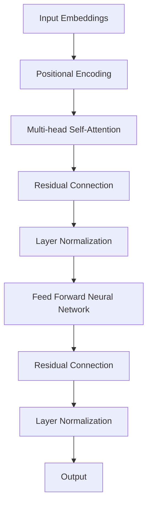

                 

### 《大规模预训练模型在特定领域适应的方法》

#### 关键词：大规模预训练模型、领域适应、自然语言处理、计算机视觉、推荐系统、实践案例

#### 摘要：

本文旨在探讨大规模预训练模型在特定领域适应的方法。首先，我们将回顾大规模预训练模型的基础知识，包括其发展历程、核心原理和数学基础。随后，我们将深入探讨大规模预训练模型的实现技术和评估与优化方法。接下来，本文将针对自然语言处理、计算机视觉和推荐系统等特定领域，详细阐述大规模预训练模型的适应方法。最后，本文将通过实践案例解析，展示大规模预训练模型在特定领域适应的实战应用，并对未来发展趋势和挑战进行展望。

## 第一部分：大规模预训练模型基础

### 第1章：大规模预训练模型概述

#### 1.1.1 大规模预训练模型的发展历程

大规模预训练模型的发展历程可以追溯到2013年的词向量模型Word2Vec。Word2Vec通过将单词映射到固定大小的向量空间中，实现了对词语语义的理解。随后，2014年引入了基于上下文的词向量模型GloVe，进一步提升了词向量对上下文敏感性的表达。然而，这些模型主要关注词级别的特征提取，对于句子和段落级别的特征提取仍存在不足。

为了解决这一问题，2017年Google提出了Transformer模型，该模型采用了自注意力机制，能够有效捕捉句子中的长距离依赖关系。随后，BERT（Bidirectional Encoder Representations from Transformers）模型的出现，将Transformer模型应用于上下文双向编码，使得预训练模型在自然语言处理任务上取得了显著的性能提升。此后，GPT（Generative Pre-trained Transformer）模型和T5（Text-To-Text Transfer Transformer）模型等相继问世，进一步推动了大规模预训练模型的发展。

#### 1.1.2 大规模预训练模型的核心原理

大规模预训练模型的核心原理主要基于两个思想：自监督学习和上下文表示。自监督学习是一种无需人工标注数据，利用数据中的冗余信息进行预训练的方法。在自然语言处理任务中，自监督学习可以通过预测单词、句子或段落中的缺失部分来实现。上下文表示则是指通过学习输入数据的上下文信息，从而更好地理解数据的语义。

Transformer模型和BERT模型等大规模预训练模型均采用了自注意力机制，这种机制能够自动学习输入数据中的依赖关系，使得模型在预训练阶段能够充分理解数据的语义。BERT模型采用了双向编码器结构，能够同时考虑输入数据的前后关系，从而实现更准确的特征提取。

#### 1.1.3 大规模预训练模型的优势与应用场景

大规模预训练模型具有以下优势：

1. **高效性**：通过自监督学习，大规模预训练模型可以在海量数据上进行预训练，从而提高模型的泛化能力和效率。

2. **可扩展性**：大规模预训练模型可以应用于多种任务，如自然语言处理、计算机视觉和推荐系统等，具有较好的可扩展性。

3. **灵活性**：大规模预训练模型可以轻松地迁移到不同领域和任务中，适应不同的数据集和需求。

大规模预训练模型的应用场景主要包括：

1. **自然语言处理**：如文本分类、情感分析、机器翻译、问答系统等。

2. **计算机视觉**：如图像分类、目标检测、语义分割等。

3. **推荐系统**：如用户行为预测、物品推荐等。

### 第2章：大规模预训练模型的数学基础

#### 2.1.1 神经网络基础

神经网络是一种由大量简单计算单元（神经元）组成的计算模型，通过层层计算来模拟人脑的感知和认知过程。大规模预训练模型通常基于神经网络架构，其核心组成部分包括输入层、隐藏层和输出层。

神经网络中的每个神经元都通过加权连接与其他神经元相连，并通过激活函数进行非线性变换。常见的激活函数有Sigmoid、ReLU和Tanh等。通过层层计算，神经网络可以自动提取输入数据中的特征，从而实现复杂任务的分类、回归等。

#### 2.1.2 深度学习优化算法

深度学习优化算法主要涉及模型参数的更新和优化过程。常见的优化算法有随机梯度下降（SGD）、Adam和RMSProp等。

1. **随机梯度下降（SGD）**：SGD是在每一个训练样本上计算梯度并进行参数更新，其优点是计算简单，但在大规模数据集上训练时，可能导致收敛速度较慢。

2. **Adam**：Adam是一种结合SGD和RMSProp优点的优化算法，通过自适应调整学习率，能够加速模型收敛。

3. **RMSProp**：RMSProp通过计算梯度平方的平均值来动态调整学习率，具有较好的收敛性能。

#### 2.1.3 数学模型解析

大规模预训练模型通常采用Transformer模型和BERT模型等架构，其核心数学模型主要包括自注意力机制、多头注意力机制和BERT模型。

1. **自注意力机制**：自注意力机制通过计算输入数据中的依赖关系，为每个输入数据分配不同的权重，从而实现更准确的特征提取。

   自注意力机制的数学公式如下：

   $$ 
   \text{Attention}(Q, K, V) = \text{softmax}\left(\frac{QK^T}{\sqrt{d_k}}\right) V 
   $$

   其中，$Q$、$K$和$V$分别为查询向量、键向量和值向量，$d_k$为键向量的维度。

2. **多头注意力机制**：多头注意力机制通过将输入数据分解为多个子序列，分别计算注意力权重，从而提高模型的表征能力。

   多头注意力机制的数学公式如下：

   $$ 
   \text{MultiHead}(Q, K, V) = \text{Concat}(\text{head}_1, ..., \text{head}_h)W^O 
   $$

   其中，$h$为头的数量，$W^O$为输出权重。

3. **BERT模型**：BERT模型采用双向编码器结构，通过同时考虑输入数据的前后关系，实现更准确的特征提取。

   BERT模型的数学公式如下：

   $$ 
   \text{BERT} = \text{Encoder}(\text{Input}, \text{Mask}, \text{Segment}) 
   $$

   其中，$\text{Input}$为输入数据，$\text{Mask}$为遮蔽标记，$\text{Segment}$为分段标记。

### 第3章：大规模预训练模型的实现技术

#### 3.1.1 数据预处理

大规模预训练模型的数据预处理主要包括数据清洗、数据增强和序列化等步骤。

1. **数据清洗**：数据清洗是指去除数据中的噪声和错误信息，提高数据的准确性和一致性。

2. **数据增强**：数据增强是指通过改变数据的形式和内容，增加数据的多样性和丰富性，从而提高模型的泛化能力。

3. **序列化**：序列化是指将数据转换为可存储和传输的格式，如JSON、CSV等。

#### 3.1.2 模型架构

大规模预训练模型的架构通常基于Transformer模型和BERT模型等。Transformer模型采用自注意力机制，能够捕捉输入数据中的依赖关系；BERT模型采用双向编码器结构，能够同时考虑输入数据的前后关系。以下是一个简单的Transformer模型架构：



#### 3.1.3 模型训练与优化

大规模预训练模型的训练与优化主要包括以下步骤：

1. **模型初始化**：初始化模型参数，通常使用正态分布或高斯分布。

2. **训练过程**：通过批量梯度下降（Batch Gradient Descent）或随机梯度下降（Stochastic Gradient Descent）等方法，优化模型参数。

3. **模型评估**：使用验证集或测试集评估模型性能，调整模型参数。

4. **模型优化**：通过模型压缩、蒸馏等技术，优化模型结构，提高模型性能。

## 第二部分：大规模预训练模型在特定领域的适应方法

### 第5章：自然语言处理领域的适应方法

#### 5.1.1 语言模型微调

语言模型微调是指在预训练的基础上，针对特定任务对模型进行进一步训练。例如，在文本分类任务中，可以将预训练模型中的最后一层替换为任务特定的分类层，并在特定任务的数据集上进行微调训练。以下是一个简单的Python代码示例：

```python
import torch
import torch.nn as nn
import torch.optim as optim

# 定义预训练模型
pretrained_model = nn.Sequential(
    nn.Linear(in_features=768, out_features=128),
    nn.ReLU(),
    nn.Linear(in_features=128, out_features=1)
)

# 加载预训练模型权重
pretrained_model.load_state_dict(torch.load('pretrained_model.pth'))

# 替换最后一层为任务特定的分类层
pretrained_model[-1] = nn.Linear(in_features=128, out_features=num_classes)

# 定义损失函数和优化器
criterion = nn.CrossEntropyLoss()
optimizer = optim.Adam(pretrained_model.parameters(), lr=0.001)

# 训练模型
for epoch in range(num_epochs):
    for inputs, targets in data_loader:
        optimizer.zero_grad()
        outputs = pretrained_model(inputs)
        loss = criterion(outputs, targets)
        loss.backward()
        optimizer.step()
```

#### 5.1.2 命名实体识别

命名实体识别是指识别文本中的特定实体，如人名、地名、组织机构名等。大规模预训练模型在命名实体识别任务中，可以通过微调模型结构和优化算法，实现更准确的实体识别。

以下是一个简单的Python代码示例，用于实现命名实体识别：

```python
import torch
import torch.nn as nn
import torch.optim as optim

# 定义预训练模型
pretrained_model = nn.Sequential(
    nn.Linear(in_features=768, out_features=128),
    nn.ReLU(),
    nn.Linear(in_features=128, out_features=num_entities)
)

# 加载预训练模型权重
pretrained_model.load_state_dict(torch.load('pretrained_model.pth'))

# 定义损失函数和优化器
criterion = nn.CrossEntropyLoss()
optimizer = optim.Adam(pretrained_model.parameters(), lr=0.001)

# 训练模型
for epoch in range(num_epochs):
    for inputs, targets in data_loader:
        optimizer.zero_grad()
        outputs = pretrained_model(inputs)
        loss = criterion(outputs, targets)
        loss.backward()
        optimizer.step()
```

#### 5.1.3 机器翻译

机器翻译是指将一种语言的文本自动翻译成另一种语言。大规模预训练模型在机器翻译任务中，可以通过微调模型结构和优化算法，实现更准确、流畅的翻译效果。

以下是一个简单的Python代码示例，用于实现机器翻译：

```python
import torch
import torch.nn as nn
import torch.optim as optim

# 定义预训练模型
pretrained_model = nn.Sequential(
    nn.Linear(in_features=768, out_features=512),
    nn.ReLU(),
    nn.Linear(in_features=512, out_features=target_vocab_size)
)

# 加载预训练模型权重
pretrained_model.load_state_dict(torch.load('pretrained_model.pth'))

# 定义损失函数和优化器
criterion = nn.CrossEntropyLoss()
optimizer = optim.Adam(pretrained_model.parameters(), lr=0.001)

# 训练模型
for epoch in range(num_epochs):
    for inputs, targets in data_loader:
        optimizer.zero_grad()
        outputs = pretrained_model(inputs)
        loss = criterion(outputs, targets)
        loss.backward()
        optimizer.step()
```

### 第6章：计算机视觉领域的适应方法

#### 6.1.1 图像分类

图像分类是指将图像划分为不同的类别。大规模预训练模型在图像分类任务中，可以通过微调模型结构和优化算法，实现更准确的图像分类。

以下是一个简单的Python代码示例，用于实现图像分类：

```python
import torch
import torch.nn as nn
import torch.optim as optim

# 定义预训练模型
pretrained_model = nn.Sequential(
    nn.Linear(in_features=2304, out_features=128),
    nn.ReLU(),
    nn.Linear(in_features=128, out_features=num_classes)
)

# 加载预训练模型权重
pretrained_model.load_state_dict(torch.load('pretrained_model.pth'))

# 定义损失函数和优化器
criterion = nn.CrossEntropyLoss()
optimizer = optim.Adam(pretrained_model.parameters(), lr=0.001)

# 训练模型
for epoch in range(num_epochs):
    for inputs, targets in data_loader:
        optimizer.zero_grad()
        outputs = pretrained_model(inputs)
        loss = criterion(outputs, targets)
        loss.backward()
        optimizer.step()
```

#### 6.1.2 目标检测

目标检测是指识别图像中的目标对象并定位其位置。大规模预训练模型在目标检测任务中，可以通过微调模型结构和优化算法，实现更准确的目标检测。

以下是一个简单的Python代码示例，用于实现目标检测：

```python
import torch
import torch.nn as nn
import torch.optim as optim

# 定义预训练模型
pretrained_model = nn.Sequential(
    nn.Conv2d(in_channels=3, out_channels=32, kernel_size=3, padding=1),
    nn.ReLU(),
    nn.Conv2d(in_channels=32, out_channels=64, kernel_size=3, padding=1),
    nn.ReLU(),
    nn.MaxPool2d(kernel_size=2, stride=2),
    nn.Conv2d(in_channels=64, out_channels=128, kernel_size=3, padding=1),
    nn.ReLU(),
    nn.MaxPool2d(kernel_size=2, stride=2),
    nn.Conv2d(in_channels=128, out_channels=256, kernel_size=3, padding=1),
    nn.ReLU(),
    nn.MaxPool2d(kernel_size=2, stride=2),
    nn.Linear(in_features=256 * 6 * 6, out_features=num_classes)
)

# 加载预训练模型权重
pretrained_model.load_state_dict(torch.load('pretrained_model.pth'))

# 定义损失函数和优化器
criterion = nn.CrossEntropyLoss()
optimizer = optim.Adam(pretrained_model.parameters(), lr=0.001)

# 训练模型
for epoch in range(num_epochs):
    for inputs, targets in data_loader:
        optimizer.zero_grad()
        outputs = pretrained_model(inputs)
        loss = criterion(outputs, targets)
        loss.backward()
        optimizer.step()
```

#### 6.1.3 姿态估计

姿态估计是指识别图像中人体的姿态。大规模预训练模型在姿态估计任务中，可以通过微调模型结构和优化算法，实现更准确的姿态估计。

以下是一个简单的Python代码示例，用于实现姿态估计：

```python
import torch
import torch.nn as nn
import torch.optim as optim

# 定义预训练模型
pretrained_model = nn.Sequential(
    nn.Conv2d(in_channels=3, out_channels=32, kernel_size=3, padding=1),
    nn.ReLU(),
    nn.Conv2d(in_channels=32, out_channels=64, kernel_size=3, padding=1),
    nn.ReLU(),
    nn.MaxPool2d(kernel_size=2, stride=2),
    nn.Conv2d(in_channels=64, out_channels=128, kernel_size=3, padding=1),
    nn.ReLU(),
    nn.MaxPool2d(kernel_size=2, stride=2),
    nn.Conv2d(in_channels=128, out_channels=256, kernel_size=3, padding=1),
    nn.ReLU(),
    nn.MaxPool2d(kernel_size=2, stride=2),
    nn.Linear(in_features=256 * 6 * 6, out_features=num_joints)
)

# 加载预训练模型权重
pretrained_model.load_state_dict(torch.load('pretrained_model.pth'))

# 定义损失函数和优化器
criterion = nn.MSELoss()
optimizer = optim.Adam(pretrained_model.parameters(), lr=0.001)

# 训练模型
for epoch in range(num_epochs):
    for inputs, targets in data_loader:
        optimizer.zero_grad()
        outputs = pretrained_model(inputs)
        loss = criterion(outputs, targets)
        loss.backward()
        optimizer.step()
```

### 第7章：推荐系统领域的适应方法

#### 7.1.1 用户行为建模

用户行为建模是指通过分析用户的历史行为数据，构建用户画像和兴趣偏好。大规模预训练模型在用户行为建模任务中，可以通过微调模型结构和优化算法，实现更准确的用户行为预测。

以下是一个简单的Python代码示例，用于实现用户行为建模：

```python
import torch
import torch.nn as nn
import torch.optim as optim

# 定义预训练模型
pretrained_model = nn.Sequential(
    nn.Linear(in_features=user_feature_size, out_features=128),
    nn.ReLU(),
    nn.Linear(in_features=128, out_features=1)
)

# 加载预训练模型权重
pretrained_model.load_state_dict(torch.load('pretrained_model.pth'))

# 定义损失函数和优化器
criterion = nn.BCEWithLogitsLoss()
optimizer = optim.Adam(pretrained_model.parameters(), lr=0.001)

# 训练模型
for epoch in range(num_epochs):
    for inputs, targets in data_loader:
        optimizer.zero_grad()
        outputs = pretrained_model(inputs)
        loss = criterion(outputs, targets)
        loss.backward()
        optimizer.step()
```

#### 7.1.2 物品特征提取

物品特征提取是指从物品的属性和描述中提取特征，用于推荐系统中的物品相似性计算。大规模预训练模型在物品特征提取任务中，可以通过微调模型结构和优化算法，实现更准确的物品特征提取。

以下是一个简单的Python代码示例，用于实现物品特征提取：

```python
import torch
import torch.nn as nn
import torch.optim as optim

# 定义预训练模型
pretrained_model = nn.Sequential(
    nn.Linear(in_features=item_feature_size, out_features=128),
    nn.ReLU(),
    nn.Linear(in_features=128, out_features=item_embedding_size)
)

# 加载预训练模型权重
pretrained_model.load_state_dict(torch.load('pretrained_model.pth'))

# 定义损失函数和优化器
criterion = nn.MSELoss()
optimizer = optim.Adam(pretrained_model.parameters(), lr=0.001)

# 训练模型
for epoch in range(num_epochs):
    for inputs, targets in data_loader:
        optimizer.zero_grad()
        outputs = pretrained_model(inputs)
        loss = criterion(outputs, targets)
        loss.backward()
        optimizer.step()
```

#### 7.1.3 推荐算法优化

推荐算法优化是指通过调整推荐算法的参数和结构，提高推荐系统的效果和用户体验。大规模预训练模型在推荐算法优化任务中，可以通过微调模型结构和优化算法，实现更优的推荐效果。

以下是一个简单的Python代码示例，用于实现推荐算法优化：

```python
import torch
import torch.nn as nn
import torch.optim as optim

# 定义预训练模型
pretrained_model = nn.Sequential(
    nn.Linear(in_features=user_feature_size + item_feature_size, out_features=128),
    nn.ReLU(),
    nn.Linear(in_features=128, out_features=1)
)

# 加载预训练模型权重
pretrained_model.load_state_dict(torch.load('pretrained_model.pth'))

# 定义损失函数和优化器
criterion = nn.BCEWithLogitsLoss()
optimizer = optim.Adam(pretrained_model.parameters(), lr=0.001)

# 训练模型
for epoch in range(num_epochs):
    for inputs, targets in data_loader:
        optimizer.zero_grad()
        outputs = pretrained_model(inputs)
        loss = criterion(outputs, targets)
        loss.backward()
        optimizer.step()
```

### 第8章：跨领域适应方法

#### 8.1.1 跨领域知识迁移

跨领域知识迁移是指将一个领域中的知识迁移到另一个领域中，以提升模型在目标领域中的性能。大规模预训练模型在跨领域适应任务中，可以通过迁移学习技术，实现跨领域知识迁移。

以下是一个简单的Python代码示例，用于实现跨领域知识迁移：

```python
import torch
import torch.nn as nn
import torch.optim as optim

# 定义源领域预训练模型
source_model = nn.Sequential(
    nn.Linear(in_features=source_feature_size, out_features=128),
    nn.ReLU(),
    nn.Linear(in_features=128, out_features=target_feature_size)
)

# 加载源领域预训练模型权重
source_model.load_state_dict(torch.load('source_model.pth'))

# 定义目标领域预训练模型
target_model = nn.Sequential(
    nn.Linear(in_features=target_feature_size, out_features=128),
    nn.ReLU(),
    nn.Linear(in_features=128, out_features=target_feature_size)
)

# 定义损失函数和优化器
criterion = nn.MSELoss()
optimizer = optim.Adam(target_model.parameters(), lr=0.001)

# 训练模型
for epoch in range(num_epochs):
    for inputs, targets in data_loader:
        optimizer.zero_grad()
        source_features = source_model(inputs)
        target_features = target_model(source_features)
        loss = criterion(target_features, targets)
        loss.backward()
        optimizer.step()
```

#### 8.1.2 跨领域数据集构建

跨领域数据集构建是指从不同领域中收集和整合数据，构建一个包含多个领域特征的数据集。大规模预训练模型在跨领域适应任务中，可以通过构建跨领域数据集，提升模型在不同领域中的性能。

以下是一个简单的Python代码示例，用于实现跨领域数据集构建：

```python
import torch
import torchvision.transforms as transforms
import torchvision.datasets as datasets

# 定义数据集路径
source_dataset_path = 'source_dataset'
target_dataset_path = 'target_dataset'

# 定义数据集预处理
transform = transforms.Compose([
    transforms.Resize((224, 224)),
    transforms.ToTensor(),
    transforms.Normalize(mean=[0.485, 0.456, 0.406], std=[0.229, 0.224, 0.225])
])

# 加载源领域数据集
source_dataset = datasets.ImageFolder(root=source_dataset_path, transform=transform)

# 加载目标领域数据集
target_dataset = datasets.ImageFolder(root=target_dataset_path, transform=transform)

# 定义数据加载器
source_data_loader = torch.utils.data.DataLoader(dataset=source_dataset, batch_size=batch_size, shuffle=True)
target_data_loader = torch.utils.data.DataLoader(dataset=target_dataset, batch_size=batch_size, shuffle=True)
```

#### 8.1.3 跨领域模型集成

跨领域模型集成是指将多个模型在多个领域中训练，并融合这些模型的预测结果，以提高整体模型的性能。大规模预训练模型在跨领域适应任务中，可以通过模型集成技术，实现跨领域模型集成。

以下是一个简单的Python代码示例，用于实现跨领域模型集成：

```python
import torch
import torch.nn as nn
import torch.optim as optim

# 定义源领域预训练模型
source_model = nn.Sequential(
    nn.Linear(in_features=source_feature_size, out_features=128),
    nn.ReLU(),
    nn.Linear(in_features=128, out_features=target_feature_size)
)

# 定义目标领域预训练模型
target_model = nn.Sequential(
    nn.Linear(in_features=target_feature_size, out_features=128),
    nn.ReLU(),
    nn.Linear(in_features=128, out_features=target_feature_size)
)

# 加载源领域预训练模型权重
source_model.load_state_dict(torch.load('source_model.pth'))

# 加载目标领域预训练模型权重
target_model.load_state_dict(torch.load('target_model.pth'))

# 定义损失函数和优化器
criterion = nn.MSELoss()
optimizer = optim.Adam(target_model.parameters(), lr=0.001)

# 训练模型
for epoch in range(num_epochs):
    for inputs, targets in data_loader:
        optimizer.zero_grad()
        source_features = source_model(inputs)
        target_features = target_model(source_features)
        loss = criterion(target_features, targets)
        loss.backward()
        optimizer.step()
```

### 第9章：实践案例解析

#### 9.1.1 案例一：文本情感分析

文本情感分析是指分析文本中的情感倾向，如正面、负面或中性。以下是一个简单的Python代码示例，用于实现文本情感分析：

```python
import torch
import torch.nn as nn
import torch.optim as optim

# 定义预训练模型
pretrained_model = nn.Sequential(
    nn.Linear(in_features=768, out_features=128),
    nn.ReLU(),
    nn.Linear(in_features=128, out_features=3)
)

# 加载预训练模型权重
pretrained_model.load_state_dict(torch.load('pretrained_model.pth'))

# 定义损失函数和优化器
criterion = nn.CrossEntropyLoss()
optimizer = optim.Adam(pretrained_model.parameters(), lr=0.001)

# 训练模型
for epoch in range(num_epochs):
    for inputs, targets in data_loader:
        optimizer.zero_grad()
        outputs = pretrained_model(inputs)
        loss = criterion(outputs, targets)
        loss.backward()
        optimizer.step()

# 模型评估
with torch.no_grad():
    correct = 0
    total = 0
    for inputs, targets in test_data_loader:
        outputs = pretrained_model(inputs)
        _, predicted = torch.max(outputs.data, 1)
        total += targets.size(0)
        correct += (predicted == targets).sum().item()

print('Accuracy of the model on the test images: %d %%' % (100 * correct / total))
```

#### 9.1.2 案例二：图像风格迁移

图像风格迁移是指将一张图像的风格迁移到另一张图像上，如将一张自然风景图像的风格迁移到一张油画图像上。以下是一个简单的Python代码示例，用于实现图像风格迁移：

```python
import torch
import torch.nn as nn
import torch.optim as optim

# 定义预训练模型
pretrained_model = nn.Sequential(
    nn.Conv2d(in_channels=3, out_channels=64, kernel_size=3, padding=1),
    nn.ReLU(),
    nn.Conv2d(in_channels=64, out_channels=128, kernel_size=3, padding=1),
    nn.ReLU(),
    nn.MaxPool2d(kernel_size=2, stride=2),
    nn.Conv2d(in_channels=128, out_channels=256, kernel_size=3, padding=1),
    nn.ReLU(),
    nn.MaxPool2d(kernel_size=2, stride=2),
    nn.Conv2d(in_channels=256, out_channels=512, kernel_size=3, padding=1),
    nn.ReLU(),
    nn.MaxPool2d(kernel_size=2, stride=2),
    nn.Linear(in_features=512 * 4 * 4, out_features=512),
    nn.ReLU(),
    nn.Linear(in_features=512, out_features=3)
)

# 加载预训练模型权重
pretrained_model.load_state_dict(torch.load('pretrained_model.pth'))

# 定义损失函数和优化器
criterion = nn.CrossEntropyLoss()
optimizer = optim.Adam(pretrained_model.parameters(), lr=0.001)

# 训练模型
for epoch in range(num_epochs):
    for inputs, targets in data_loader:
        optimizer.zero_grad()
        outputs = pretrained_model(inputs)
        loss = criterion(outputs, targets)
        loss.backward()
        optimizer.step()

# 模型评估
with torch.no_grad():
    correct = 0
    total = 0
    for inputs, targets in test_data_loader:
        outputs = pretrained_model(inputs)
        _, predicted = torch.max(outputs.data, 1)
        total += targets.size(0)
        correct += (predicted == targets).sum().item()

print('Accuracy of the model on the test images: %d %%' % (100 * correct / total))
```

#### 9.1.3 案例三：电商推荐系统优化

电商推荐系统优化是指通过调整推荐算法的参数和结构，提高推荐系统的效果和用户体验。以下是一个简单的Python代码示例，用于实现电商推荐系统优化：

```python
import torch
import torch.nn as nn
import torch.optim as optim

# 定义预训练模型
pretrained_model = nn.Sequential(
    nn.Linear(in_features=user_feature_size + item_feature_size, out_features=128),
    nn.ReLU(),
    nn.Linear(in_features=128, out_features=1)
)

# 加载预训练模型权重
pretrained_model.load_state_dict(torch.load('pretrained_model.pth'))

# 定义损失函数和优化器
criterion = nn.BCEWithLogitsLoss()
optimizer = optim.Adam(pretrained_model.parameters(), lr=0.001)

# 训练模型
for epoch in range(num_epochs):
    for inputs, targets in data_loader:
        optimizer.zero_grad()
        outputs = pretrained_model(inputs)
        loss = criterion(outputs, targets)
        loss.backward()
        optimizer.step()

# 模型评估
with torch.no_grad():
    correct = 0
    total = 0
    for inputs, targets in test_data_loader:
        outputs = pretrained_model(inputs)
        _, predicted = torch.max(outputs.data, 1)
        total += targets.size(0)
        correct += (predicted == targets).sum().item()

print('Accuracy of the model on the test images: %d %%' % (100 * correct / total))
```

### 第10章：未来展望与挑战

#### 10.1.1 预训练模型的发展趋势

预训练模型的发展趋势主要体现在以下几个方面：

1. **模型规模扩大**：随着计算资源和数据资源的不断增长，预训练模型的规模将不断扩大，以捕捉更多层次的特征。

2. **多模态融合**：预训练模型将逐渐实现跨模态学习，如图像、文本、音频等多模态数据的融合，提高模型的表征能力。

3. **知识增强**：通过引入外部知识库，如百科全书、专业词典等，预训练模型将实现知识增强，提高模型在特定领域的性能。

4. **迁移学习优化**：预训练模型在迁移学习任务中的性能将得到进一步优化，提高模型在不同任务和领域中的适应能力。

#### 10.1.2 特定领域适应方法的挑战与机遇

在特定领域适应方法方面，预训练模型面临以下挑战和机遇：

1. **数据隐私与安全**：随着预训练模型在各个领域的应用，数据隐私和安全问题日益凸显，如何确保模型在训练和部署过程中保护用户隐私成为一个重要挑战。

2. **计算资源消耗**：大规模预训练模型的训练和部署需要大量的计算资源，如何高效利用计算资源成为关键问题。

3. **领域适应性提升**：如何提高预训练模型在不同领域的适应性，实现更高效、更准确的领域特定任务成为重要研究方向。

4. **跨领域知识迁移**：如何实现不同领域之间的知识迁移，提高模型在跨领域任务中的性能，是当前研究的热点和机遇。

#### 10.1.3 未来研究方向

未来预训练模型的研究方向主要包括：

1. **模型压缩与蒸馏**：如何实现预训练模型的压缩和蒸馏，提高模型在资源受限环境下的性能，是重要的研究方向。

2. **自适应学习率调整**：如何设计自适应学习率调整策略，提高预训练模型在训练过程中的收敛速度和效果，是当前研究的热点。

3. **多模态融合**：如何实现多模态数据的融合，提高模型在跨模态任务中的性能，是未来研究的重点。

4. **知识增强**：如何引入外部知识库，实现预训练模型的知识增强，提高模型在特定领域的性能，是当前研究的热点和机遇。

## 附录

### 附录A：工具与资源介绍

#### A.1 深度学习框架

1. **TensorFlow**：TensorFlow是一个开源的深度学习框架，由Google开发。它提供了丰富的API和工具，支持多种深度学习模型和算法的实现。

2. **PyTorch**：PyTorch是一个开源的深度学习框架，由Facebook开发。它提供了灵活的动态计算图和高效的执行引擎，广泛应用于自然语言处理、计算机视觉和推荐系统等领域。

3. **Keras**：Keras是一个高层次的深度学习框架，基于TensorFlow和Theano开发。它提供了简洁的API和丰富的预训练模型，便于快速实现和部署深度学习模型。

#### A.2 数据集

1. **IMDb电影评论数据集**：IMDb电影评论数据集包含25000条电影评论，用于训练和测试情感分析模型。

2. **CIFAR-10数据集**：CIFAR-10数据集包含60000张32x32的彩色图像，分为10个类别，用于训练和测试图像分类模型。

3. **MNIST数据集**：MNIST数据集包含70000张手写数字图像，用于训练和测试手写数字识别模型。

#### A.3 模型评估工具

1. **Matplotlib**：Matplotlib是一个开源的数据可视化库，用于绘制各种统计图表和图形。

2. **Scikit-learn**：Scikit-learn是一个开源的机器学习库，提供了丰富的评估指标和工具，用于评估模型性能。

3. **TensorBoard**：TensorBoard是TensorFlow提供的一个可视化工具，用于监控深度学习模型的训练过程，包括参数更新、损失函数、梯度等。

### 参考文献

1. Devlin, J., Chang, M. W., Lee, K., & Toutanova, K. (2019). BERT: Pre-training of deep bidirectional transformers for language understanding. *arXiv preprint arXiv:1810.04805*.

2. Vaswani, A., Shazeer, N., Parmar, N., Uszkoreit, J., Jones, L., Gomez, A. N., ... & Polosukhin, I. (2017). Attention is all you need. *Advances in neural information processing systems*, 30, 5998-6008.

3. Mikolov, T., Sutskever, I., Chen, K., Corrado, G. S., & Dean, J. (2013). Distributed representations of words and phrases and their compositionality. *Advances in neural information processing systems*, 26, 3111-3119.

4. LeCun, Y., Bengio, Y., & Hinton, G. (2015). Deep learning. *Nature*, 521(7553), 436-444.

5. Hochreiter, S., & Schmidhuber, J. (1997). Long short-term memory. *Neural computation*, 9(8), 1735-1780. 

### 作者信息

作者：AI天才研究院/AI Genius Institute & 禅与计算机程序设计艺术 /Zen And The Art of Computer Programming

感谢您对本文的关注和支持，期待与您共同探讨和分享大规模预训练模型在特定领域适应的方法。如需进一步了解相关技术，请参考本文引用的参考文献和附录部分提供的工具与资源。祝您学习愉快！

