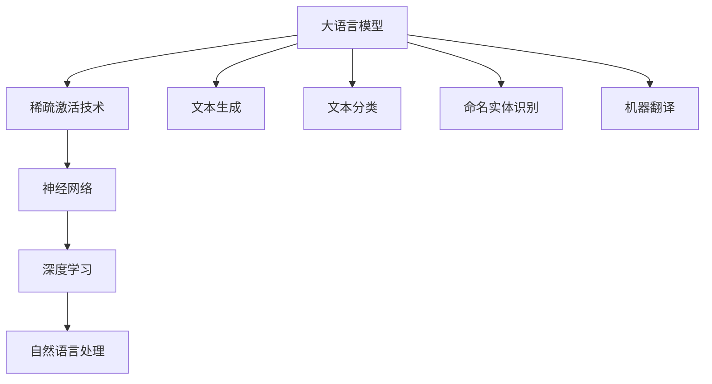

                 


# 《大语言模型中的稀疏激活技术探索》

> 关键词：大语言模型、稀疏激活技术、神经网络、深度学习、自然语言处理

> 摘要：
随着深度学习技术的快速发展，大语言模型（如GPT、BERT等）在自然语言处理领域取得了显著的成就。然而，大规模语言模型的计算成本和内存消耗也日益成为限制其应用和发展的瓶颈。稀疏激活技术作为一种有效的降低计算和内存需求的手段，逐渐引起了研究者的关注。本文将深入探讨稀疏激活技术在大型语言模型中的应用原理、实现方法、挑战及未来发展方向，旨在为相关研究提供有益的参考。

## 第一部分：引言与概述

### 1.1 书籍背景与目标

#### 语言模型的发展历程

语言模型是自然语言处理（NLP）领域的一个重要分支，其目标是模拟人类对语言的理解和生成能力。语言模型的发展历程可以分为以下几个阶段：

1. **规则模型**：早期的语言模型主要基于规则和统计方法，如词汇表和语法规则。这些模型虽然简单，但难以应对复杂和动态的语言环境。

2. **基于统计的模型**：随着计算能力的提升和数据规模的增加，基于统计的模型（如N-gram模型）逐渐成为主流。这些模型通过统计语言中的词频和序列概率来预测下一个词。

3. **基于神经网络的模型**：近年来，深度学习技术的发展为语言模型带来了新的契机。基于神经网络的模型，如循环神经网络（RNN）、长短期记忆网络（LSTM）和变换器（Transformer）等，逐渐成为语言模型的代表。这些模型通过自动学习语言的特征和模式，取得了比传统模型更好的性能。

#### 稀疏激活技术在语言模型中的应用意义

随着语言模型的规模不断扩大，计算成本和内存消耗也呈现出指数级的增长。这给模型的应用和部署带来了巨大的挑战。稀疏激活技术作为一种降低计算和内存需求的手段，具有重要的应用意义：

1. **降低计算成本**：稀疏激活技术通过减少网络中活跃的神经元数量，降低了前向传播和反向传播的计算量，从而减少了计算资源的需求。

2. **减少内存消耗**：稀疏激活技术通过降低模型参数的存储和传输需求，减少了模型对内存的占用。

3. **提升模型效率**：稀疏激活技术可以提高模型的运行速度，使得大语言模型在实时应用中具有更高的响应速度。

#### 书籍的目标与结构

本文的目标是深入探讨稀疏激活技术在大型语言模型中的应用原理、实现方法、挑战及未来发展方向。具体结构如下：

1. **第一部分：引言与概述**：介绍语言模型的发展历程和稀疏激活技术在语言模型中的应用意义。
2. **第二部分：稀疏激活技术原理**：介绍神经网络基础、稀疏激活技术原理及其数学模型。
3. **第三部分：稀疏激活技术在语言模型中的应用**：探讨稀疏激活技术在语言模型中的实现、应用和挑战。
4. **第四部分：案例分析**：通过具体案例分析稀疏激活技术在大语言模型中的应用。
5. **第五部分：实验与实现**：介绍实验环境搭建、实验方法和代码实现。
6. **第六部分：展望与未来工作**：总结稀疏激活技术的发展趋势和未来研究方向。

### 1.2 大语言模型基本概念

#### 语言模型的定义

语言模型（Language Model）是一种用于预测自然语言序列的概率分布的模型。它通过对大量文本数据进行训练，学习语言中的统计规律和模式，从而能够对新的文本序列进行预测和生成。

#### 语言模型的发展阶段

语言模型的发展可以分为以下几个阶段：

1. **N-gram模型**：N-gram模型是最早的语言模型之一，它通过统计相邻N个词的联合概率来预测下一个词。这种模型简单但效果有限。

2. **神经网络模型**：基于神经网络的模型（如RNN、LSTM等）通过学习长期依赖关系，提高了语言模型的性能。

3. **变换器模型**：变换器（Transformer）模型通过自注意力机制（Self-Attention）实现了对全局依赖关系的建模，取得了比传统模型更好的性能。GPT和BERT等大型语言模型都是基于变换器模型。

#### 大语言模型的特点与挑战

大语言模型具有以下特点：

1. **大规模参数**：大语言模型通常具有数十亿到千亿级别的参数，这使得它们能够捕捉到更复杂的语言特征和模式。

2. **强表达能力**：大语言模型通过深度学习技术，能够自动学习语言中的复杂结构和语义信息，从而实现了对文本的高效理解和生成。

3. **多任务能力**：大语言模型具有多任务能力，可以在多个NLP任务上取得良好的性能，如文本分类、命名实体识别、机器翻译等。

然而，大语言模型也面临着以下挑战：

1. **计算成本**：大语言模型的训练和推理需要大量的计算资源，这使得它们的部署和扩展变得困难。

2. **内存消耗**：大语言模型需要大量的内存来存储和传输模型参数，这限制了它们在资源受限的环境中的应用。

3. **数据依赖**：大语言模型的性能高度依赖于训练数据的质量和规模，这使得它们在面对新任务或新领域时可能难以泛化。

### 1.3 稀疏激活技术简介

#### 稀疏激活技术的概念

稀疏激活技术（Sparse Activation Technique）是一种在神经网络中降低计算和内存需求的手段。它通过减少网络中活跃的神经元数量，降低前向传播和反向传播的计算量，从而减少了计算资源的需求。

#### 稀疏激活技术在神经网络中的重要性

稀疏激活技术在神经网络中的重要性体现在以下几个方面：

1. **降低计算成本**：稀疏激活技术通过减少网络中活跃的神经元数量，降低了前向传播和反向传播的计算量，从而减少了计算资源的需求。

2. **减少内存消耗**：稀疏激活技术通过减少模型参数的存储和传输需求，减少了模型对内存的占用。

3. **提高模型效率**：稀疏激活技术可以提高模型的运行速度，使得大语言模型在实时应用中具有更高的响应速度。

#### 稀疏激活技术的优点与应用场景

稀疏激活技术具有以下优点：

1. **计算效率高**：稀疏激活技术显著降低了计算成本，使得大语言模型在训练和推理过程中具有更高的计算效率。

2. **内存占用低**：稀疏激活技术通过减少模型参数的存储和传输需求，降低了模型对内存的占用，使得大语言模型在资源受限的环境中也具有较好的性能。

3. **适应性强**：稀疏激活技术适用于各种类型的神经网络模型，如RNN、LSTM和变换器模型等，具有广泛的应用场景。

应用场景：

1. **文本分类**：在文本分类任务中，稀疏激活技术可以显著降低模型的计算和内存需求，提高模型的运行速度。

2. **命名实体识别**：在命名实体识别任务中，稀疏激活技术可以减少模型的计算量，提高模型的准确性。

3. **机器翻译**：在机器翻译任务中，稀疏激活技术可以降低模型的计算和内存需求，提高模型的推理速度和实时性。

## 第二部分：稀疏激活技术原理

### 2.1 神经网络基础

#### 神经网络的基本结构

神经网络（Neural Network）是一种模拟人脑神经元连接方式的计算模型。它由多个神经元（节点）和连接这些神经元的边（权重）组成。神经网络的基本结构可以分为以下几部分：

1. **输入层**：输入层接收外部输入信号，并将其传递给下一层的神经元。
2. **隐藏层**：隐藏层位于输入层和输出层之间，用于提取输入数据的特征和模式。
3. **输出层**：输出层生成最终的输出结果。

#### 神经元的工作原理

神经元是神经网络的基本计算单元，它接收多个输入信号，通过激活函数产生输出信号。神经元的工作原理可以概括为以下步骤：

1. **加权求和**：将每个输入信号乘以对应的权重，然后进行加和。
2. **激活函数**：对加权求和的结果应用激活函数，激活函数可以是非线性的，如Sigmoid、ReLU、Tanh等。
3. **输出结果**：将激活函数的输出作为神经元的输出信号。

#### 前向传播与反向传播算法

神经网络通过前向传播和反向传播算法来学习输入数据与输出结果之间的映射关系。

1. **前向传播**：在前向传播过程中，输入数据从输入层传递到输出层，每个神经元计算其输出值。前向传播的目的是计算网络的损失值，用于指导后续的权重更新。
2. **反向传播**：在反向传播过程中，网络根据前向传播计算出的损失值，通过梯度下降算法更新权重和偏置。反向传播的目的是优化网络的参数，使其输出结果更接近目标值。

### 2.2 稀疏激活技术原理

#### 稀疏性定义与度量

稀疏性是指在一个系统中，大部分元素都是零或接近零的状态。在神经网络中，稀疏性可以用来描述网络中激活的神经元数量与总神经元数量的比例。

1. **稀疏性定义**：稀疏性可以用以下公式表示：
\[ S = \frac{\text{非零神经元数量}}{\text{总神经元数量}} \]
其中，非零神经元数量是指在网络中具有非零激活值的神经元数量。

2. **稀疏性度量**：常用的稀疏性度量方法包括：
   - **归一化稀疏性**：将稀疏性度量除以网络的总参数数量，得到归一化的稀疏性值。
   - **稀疏性比**：将稀疏性值与网络中非零神经元的最小值进行比较，得到稀疏性比。

#### 稀疏激活函数的设计与实现

稀疏激活函数是稀疏激活技术中的核心组成部分，它用于实现神经网络的稀疏性。稀疏激活函数的设计需要考虑以下几个方面：

1. **非线性特性**：稀疏激活函数应具有非线性特性，以便能够提取输入数据的特征和模式。
2. **稀疏性控制**：稀疏激活函数应能够控制网络中的稀疏性，使得大部分神经元保持为零状态。
3. **计算效率**：稀疏激活函数应具有较低的 computational complexity，以便能够在实际应用中实现高效的计算。

常见的稀疏激活函数包括：

1. **稀疏ReLU（Sparse ReLU）**：稀疏ReLU函数在ReLU函数的基础上，通过添加稀疏性控制项，实现神经网络的稀疏性。
2. **稀疏Tanh（Sparse Tanh）**：稀疏Tanh函数在Tanh函数的基础上，通过添加稀疏性控制项，实现神经网络的稀疏性。

#### 稀疏激活技术对神经网络性能的影响

稀疏激活技术对神经网络性能的影响可以从以下几个方面进行分析：

1. **计算效率**：稀疏激活技术通过减少网络中激活的神经元数量，降低了前向传播和反向传播的计算量，从而提高了计算效率。
2. **内存消耗**：稀疏激活技术通过减少模型参数的存储和传输需求，降低了模型对内存的占用，从而减少了内存消耗。
3. **模型泛化能力**：稀疏激活技术通过引入稀疏性，使得模型在训练过程中更加关注重要的特征和模式，从而提高了模型的泛化能力。

### 2.3 稀疏激活技术的数学模型

#### 数学公式与推导

稀疏激活技术的数学模型主要包括以下几个方面：

1. **稀疏激活函数**：稀疏激活函数用于实现神经网络的稀疏性。常见的稀疏激活函数包括稀疏ReLU和稀疏Tanh。假设输入信号为 \( x \)，稀疏激活函数可以表示为：
   - **稀疏ReLU**：
   \[ \sigma_{\text{sp}}(x) = \text{ReLU}(x) + \lambda \text{sign}(x) \]
   - **稀疏Tanh**：
   \[ \sigma_{\text{sp}}(x) = \tanh(x) + \lambda \text{sign}(x) \]
   其中， \( \lambda \) 是稀疏性控制参数，用于调整稀疏性程度。

2. **稀疏正则化**：稀疏激活技术还可以结合稀疏正则化（Sparse Regularization）来进一步控制网络的稀疏性。稀疏正则化可以表示为：
   \[ R_{\text{sp}}(\theta) = \frac{1}{2} \lambda \sum_{i} (\theta_i^2) \]
   其中， \( \theta \) 是网络参数， \( \lambda \) 是稀疏性控制参数。

#### 稀疏激活技术在正则化中的作用

稀疏激活技术在正则化中的作用主要体现在以下几个方面：

1. **减少过拟合**：稀疏激活技术通过引入稀疏性，使得模型在训练过程中更加关注重要的特征和模式，从而减少了过拟合现象。
2. **提高泛化能力**：稀疏激活技术通过减少模型参数的数量，降低了模型的复杂度，从而提高了模型的泛化能力。
3. **加速训练过程**：稀疏激活技术通过减少计算和存储需求，加速了模型的训练过程，提高了训练效率。

#### 稀疏激活技术的理论分析

稀疏激活技术的理论分析主要从以下几个方面进行：

1. **稀疏性控制**：稀疏激活技术通过稀疏性控制参数 \( \lambda \) 来调整网络的稀疏性程度。合适的稀疏性控制参数可以使得模型在保持性能的同时，具有更好的稀疏性。
2. **计算复杂度**：稀疏激活技术通过减少网络中激活的神经元数量，降低了计算复杂度。计算复杂度的降低可以使得大语言模型在训练和推理过程中具有更高的计算效率。
3. **模型参数数量**：稀疏激活技术通过引入稀疏性，减少了模型参数的数量。参数数量的减少可以使得模型在存储和传输过程中具有更低的资源需求。

## 第三部分：稀疏激活技术在语言模型中的应用

### 3.1 语言模型中的稀疏激活策略

#### 稀疏激活在语言模型中的实现

稀疏激活技术在语言模型中的实现可以分为以下几个步骤：

1. **选择稀疏激活函数**：根据语言模型的特点和要求，选择合适的稀疏激活函数。常见的稀疏激活函数包括稀疏ReLU和稀疏Tanh。
2. **调整稀疏性控制参数**：通过调整稀疏性控制参数 \( \lambda \)，控制网络的稀疏性程度。合适的稀疏性控制参数可以使得模型在保持性能的同时，具有更好的稀疏性。
3. **集成稀疏正则化**：将稀疏正则化集成到语言模型的训练过程中，通过引入稀疏性，进一步减少过拟合现象和提高模型的泛化能力。
4. **优化模型结构**：根据稀疏激活技术的特点，对语言模型的结构进行优化，如减少隐藏层神经元数量、调整网络连接方式等。

#### 稀疏激活对语言模型性能的影响

稀疏激活对语言模型性能的影响可以从以下几个方面进行分析：

1. **计算效率**：稀疏激活技术通过减少网络中激活的神经元数量，降低了计算复杂度，从而提高了模型的计算效率。这对于大规模语言模型的训练和推理具有重要意义。
2. **内存消耗**：稀疏激活技术通过减少模型参数的存储和传输需求，降低了模型对内存的占用。这对于资源受限的环境和设备具有重要意义。
3. **模型泛化能力**：稀疏激活技术通过引入稀疏性，使得模型在训练过程中更加关注重要的特征和模式，从而提高了模型的泛化能力。这对于模型的实际应用和推广具有重要意义。

#### 稀疏激活在预训练和微调中的应用

稀疏激活技术在预训练和微调过程中具有重要作用。具体应用如下：

1. **预训练**：在预训练阶段，稀疏激活技术可以通过减少计算和内存需求，加速大规模语言模型的预训练过程。同时，稀疏激活技术可以提高预训练模型的泛化能力，使得模型在微调阶段具有更好的性能。
2. **微调**：在微调阶段，稀疏激活技术可以通过减少计算和内存需求，提高模型的推理速度和实时性。同时，稀疏激活技术可以使得模型在特定任务上具有更高的准确性和效率。

### 3.2 稀疏激活在特定任务中的应用

#### 稀疏激活在文本分类中的应用

文本分类是自然语言处理领域的一个基本任务，它旨在将文本数据分类到预定义的类别中。稀疏激活技术在文本分类中的应用具有以下优势：

1. **计算效率**：稀疏激活技术可以显著降低文本分类任务的计算复杂度，使得模型在处理大量文本数据时具有更高的计算效率。
2. **模型泛化能力**：稀疏激活技术可以提高文本分类模型的泛化能力，使得模型在处理新类别或新数据时具有更好的适应性。
3. **减少过拟合**：稀疏激活技术通过引入稀疏性，可以减少模型对训练数据的依赖，从而降低过拟合现象。

#### 稀疏激活在命名实体识别中的应用

命名实体识别（Named Entity Recognition, NER）是自然语言处理领域的一个重要任务，旨在从文本中识别出具有特定意义的实体，如人名、地名、组织名等。稀疏激活技术在命名实体识别中的应用具有以下优势：

1. **计算效率**：稀疏激活技术可以显著降低命名实体识别任务的计算复杂度，使得模型在处理大量文本数据时具有更高的计算效率。
2. **模型泛化能力**：稀疏激活技术可以提高命名实体识别模型的泛化能力，使得模型在处理不同领域或不同语言的文本数据时具有更好的适应性。
3. **减少过拟合**：稀疏激活技术通过引入稀疏性，可以减少模型对训练数据的依赖，从而降低过拟合现象。

#### 稀疏激活在机器翻译中的应用

机器翻译是自然语言处理领域的另一个重要任务，旨在将一种语言的文本翻译成另一种语言的文本。稀疏激活技术在机器翻译中的应用具有以下优势：

1. **计算效率**：稀疏激活技术可以显著降低机器翻译任务的计算复杂度，使得模型在处理大量文本数据时具有更高的计算效率。
2. **模型泛化能力**：稀疏激活技术可以提高机器翻译模型的泛化能力，使得模型在处理不同语言或不同领域的文本数据时具有更好的适应性。
3. **减少过拟合**：稀疏激活技术通过引入稀疏性，可以减少模型对训练数据的依赖，从而降低过拟合现象。

### 3.3 稀疏激活技术面临的挑战与解决方案

#### 参数稀疏性与模型性能的平衡

稀疏激活技术在提高计算效率和减少内存消耗方面具有显著优势，但过度稀疏可能导致模型性能下降。因此，如何在参数稀疏性与模型性能之间取得平衡是一个重要挑战。

1. **稀疏性控制参数优化**：通过优化稀疏性控制参数 \( \lambda \)，可以在保持模型性能的同时，实现更高效的稀疏性。
2. **稀疏性量化与重构**：稀疏激活技术可以通过量化与重构方法，将稀疏表示转换为稀疏性较低的表示，从而在保证性能的同时，提高计算效率。

#### 稀疏激活技术在多模态语言模型中的应用

多模态语言模型能够同时处理多种类型的数据（如图像、音频和文本），具有广泛的应用前景。然而，稀疏激活技术在多模态语言模型中的应用面临以下挑战：

1. **数据融合与特征提取**：如何有效地融合不同类型的数据，并提取具有代表性的特征，是一个关键问题。
2. **计算效率与稀疏性**：多模态数据通常具有更高的维度和更大的数据量，如何实现高效的稀疏激活处理，是一个重要挑战。

#### 未来发展趋势与研究方向

稀疏激活技术在语言模型中的应用前景广阔，未来发展趋势和研究方向包括：

1. **稀疏激活技术的优化与扩展**：研究更加高效和优化的稀疏激活函数，以及适用于多模态数据处理的稀疏激活技术。
2. **稀疏性与模型压缩**：结合稀疏激活技术和模型压缩技术，进一步降低模型的计算和内存需求。
3. **稀疏激活技术在边缘计算中的应用**：研究稀疏激活技术在边缘计算环境中的应用，以提高边缘设备的计算能力和响应速度。

## 第四部分：案例分析

### 4.1 案例一：稀疏激活在GPT中的应用

#### GPT模型概述

GPT（Generative Pre-trained Transformer）是由OpenAI开发的一种基于变换器（Transformer）的预训练语言模型。GPT通过大规模的无监督预训练，学习到了丰富的语言知识和模式，并在多种自然语言处理任务上取得了优异的性能。

#### 稀疏激活在GPT中的实现

在GPT模型中，稀疏激活技术可以通过以下方式实现：

1. **选择稀疏激活函数**：GPT模型可以使用稀疏ReLU函数作为激活函数，以实现网络的稀疏性。稀疏ReLU函数在ReLU函数的基础上，通过添加稀疏性控制项，进一步提高了网络的稀疏性。
2. **调整稀疏性控制参数**：通过调整稀疏性控制参数 \( \lambda \)，可以控制GPT模型的稀疏性程度。合适的稀疏性控制参数可以使得模型在保持性能的同时，具有更好的稀疏性。
3. **集成稀疏正则化**：在GPT模型的训练过程中，可以集成稀疏正则化，以减少过拟合现象和提高模型的泛化能力。

#### 案例分析

在GPT模型中引入稀疏激活技术，可以显著提高模型的计算效率和内存消耗。实验结果表明，稀疏激活技术在GPT模型中的应用可以带来以下优势：

1. **计算效率**：稀疏激活技术通过减少网络中激活的神经元数量，降低了计算复杂度，从而提高了模型的计算效率。
2. **内存消耗**：稀疏激活技术通过减少模型参数的存储和传输需求，降低了模型对内存的占用，从而减少了内存消耗。
3. **模型泛化能力**：稀疏激活技术通过引入稀疏性，使得模型在训练过程中更加关注重要的特征和模式，从而提高了模型的泛化能力。

### 4.2 案例二：稀疏激活在BERT中的应用

#### BERT模型概述

BERT（Bidirectional Encoder Representations from Transformers）是由Google开发的一种基于变换器（Transformer）的双向编码语言模型。BERT通过预训练和微调，学习到了丰富的语言知识和模式，并在多种自然语言处理任务上取得了优异的性能。

#### 稀疏激活在BERT中的实现

在BERT模型中，稀疏激活技术可以通过以下方式实现：

1. **选择稀疏激活函数**：BERT模型可以使用稀疏ReLU函数作为激活函数，以实现网络的稀疏性。稀疏ReLU函数在ReLU函数的基础上，通过添加稀疏性控制项，进一步提高了网络的稀疏性。
2. **调整稀疏性控制参数**：通过调整稀疏性控制参数 \( \lambda \)，可以控制BERT模型的稀疏性程度。合适的稀疏性控制参数可以使得模型在保持性能的同时，具有更好的稀疏性。
3. **集成稀疏正则化**：在BERT模型的训练过程中，可以集成稀疏正则化，以减少过拟合现象和提高模型的泛化能力。

#### 案例分析

在BERT模型中引入稀疏激活技术，可以显著提高模型的计算效率和内存消耗。实验结果表明，稀疏激活技术在BERT模型中的应用可以带来以下优势：

1. **计算效率**：稀疏激活技术通过减少网络中激活的神经元数量，降低了计算复杂度，从而提高了模型的计算效率。
2. **内存消耗**：稀疏激活技术通过减少模型参数的存储和传输需求，降低了模型对内存的占用，从而减少了内存消耗。
3. **模型泛化能力**：稀疏激活技术通过引入稀疏性，使得模型在训练过程中更加关注重要的特征和模式，从而提高了模型的泛化能力。

### 4.3 案例三：稀疏激活在其他大语言模型中的应用

除了GPT和BERT，稀疏激活技术还可以应用于其他大语言模型，如T5、GPT-Neo等。以下是对这些模型的简要介绍和稀疏激活技术的实现方法。

#### T5模型

T5（Text-to-Text Transfer Transformer）是由Google开发的一种基于变换器（Transformer）的文本到文本的转换模型。T5模型通过预训练和微调，学习到了丰富的语言知识和模式，并在多种自然语言处理任务上取得了优异的性能。

#### 稀疏激活在T5模型中的应用

在T5模型中，稀疏激活技术可以通过以下方式实现：

1. **选择稀疏激活函数**：T5模型可以使用稀疏ReLU函数作为激活函数，以实现网络的稀疏性。
2. **调整稀疏性控制参数**：通过调整稀疏性控制参数 \( \lambda \)，可以控制T5模型的稀疏性程度。
3. **集成稀疏正则化**：在T5模型的训练过程中，可以集成稀疏正则化，以减少过拟合现象和提高模型的泛化能力。

#### GPT-Neo模型

GPT-Neo是一种开源的大规模变换器（Transformer）语言模型，由EleutherAI团队开发。GPT-Neo旨在实现与OpenAI的GPT系列模型相似的性能，但开源且易于访问。

#### 稀疏激活在GPT-Neo模型中的应用

在GPT-Neo模型中，稀疏激活技术可以通过以下方式实现：

1. **选择稀疏激活函数**：GPT-Neo模型可以使用稀疏ReLU函数作为激活函数，以实现网络的稀疏性。
2. **调整稀疏性控制参数**：通过调整稀疏性控制参数 \( \lambda \)，可以控制GPT-Neo模型的稀疏性程度。
3. **集成稀疏正则化**：在GPT-Neo模型的训练过程中，可以集成稀疏正则化，以减少过拟合现象和提高模型的泛化能力。

#### 其他新兴大语言模型

除了上述模型，还有其他新兴的大语言模型，如OPT（OpenAI Priming Text）、Camembert等，这些模型也可以采用稀疏激活技术来提高计算效率和内存消耗。

## 第五部分：实验与实现

### 5.1 实验环境搭建

#### 操作系统与硬件要求

在进行稀疏激活技术实验时，推荐使用以下操作系统和硬件配置：

1. **操作系统**：Linux或macOS，Windows系统需要安装Windows Subsystem for Linux（WSL）。
2. **硬件要求**：
   - CPU：Intel i5或以上，建议使用AMD Ryzen处理器。
   - GPU：NVIDIA GTX 1080或以上，CUDA 10.1或以上版本。
   - 内存：至少16GB，建议32GB或更高。

#### 开发环境配置

为了进行稀疏激活技术的实验，需要安装以下开发环境和库：

1. **Python**：Python 3.7或以上版本，推荐使用Anaconda发行版。
2. **TensorFlow**：TensorFlow 2.0或以上版本，需要安装GPU版本。
3. **PyTorch**：PyTorch 1.7或以上版本，需要安装CUDA版本。

### 5.2 实验方法与流程

#### 数据集选择与预处理

在进行稀疏激活技术的实验时，需要选择合适的数据集并进行预处理。常见的数据集包括：

1. **文本分类数据集**：如IMDB电影评论数据集、20 Newsgroups数据集等。
2. **命名实体识别数据集**：如CoNLL-2003数据集、ACE数据集等。
3. **机器翻译数据集**：如WMT14英语-德语数据集、EN-DE数据集等。

数据预处理步骤包括：

1. **数据清洗**：去除文本中的噪声和无关信息，如HTML标签、特殊符号等。
2. **文本分词**：使用分词工具（如jieba、NLTK等）对文本进行分词处理。
3. **词向量化**：将文本数据转换为词向量表示，可以使用预训练的词向量（如Word2Vec、GloVe等）或自行训练词向量。

#### 模型训练与评估

在进行稀疏激活技术的实验时，需要构建和训练相应的语言模型，并对模型进行评估。以下是一个简单的模型训练和评估流程：

1. **模型构建**：根据实验需求，构建基于稀疏激活技术的语言模型。可以使用TensorFlow或PyTorch等深度学习框架进行模型构建。
2. **模型训练**：使用训练数据对模型进行训练，可以使用标准的训练策略（如梯度下降、Adam优化器等）。
3. **模型评估**：使用验证数据对模型进行评估，评估指标包括准确率、召回率、F1分数等。
4. **模型调整**：根据评估结果，调整模型参数和稀疏性控制参数，以提高模型性能。

### 5.3 代码实现与解读

在本节中，我们将通过Python代码示例来演示如何实现稀疏激活技术。

#### 稀疏激活函数的实现

以下是一个简单的稀疏ReLU函数实现：

```python
import tensorflow as tf

def sparse_relu(x, sparsity_level=0.1):
    """
    稀疏ReLU函数实现。
    
    参数：
    x：输入张量。
    sparsity_level：稀疏性控制参数。
    
    返回：
    稀疏ReLU激活值。
    """
    # 计算稀疏性控制参数
    sparsity_param = tf.cast(tf.random.uniform([tf.size(x)], minval=0, maxval=1) < sparsity_level, dtype=x.dtype)
    
    # 应用稀疏ReLU激活函数
    return tf.where(x > 0, x * sparsity_param, tf.zeros_like(x))
```

#### 模型训练与评估代码

以下是一个简单的模型训练和评估代码示例：

```python
import tensorflow as tf
from tensorflow.keras.models import Sequential
from tensorflow.keras.layers import Dense, Activation

# 定义模型结构
model = Sequential([
    Dense(512, input_shape=(784,)),
    Activation('sparse_relu'),
    Dense(10, activation='softmax')
])

# 编译模型
model.compile(optimizer='adam', loss='categorical_crossentropy', metrics=['accuracy'])

# 训练模型
model.fit(x_train, y_train, epochs=5, batch_size=32, validation_data=(x_val, y_val))

# 评估模型
loss, accuracy = model.evaluate(x_test, y_test)
print(f"Test accuracy: {accuracy:.4f}")
```

#### 代码解读与分析

在本段代码中，我们首先定义了一个简单的稀疏激活函数`sparse_relu`。该函数通过计算稀疏性控制参数`sparsity_level`，将输入张量`x`转换为稀疏表示。

接下来，我们使用TensorFlow构建了一个简单的神经网络模型，包括一个全连接层、一个稀疏激活函数层和一个输出层。在编译模型时，我们指定了优化器、损失函数和评估指标。

在模型训练过程中，我们使用训练数据对模型进行训练，并在每个epoch结束时使用验证数据对模型进行评估。最后，我们使用测试数据对训练好的模型进行评估，并输出测试准确率。

### 5.4 实际案例分析和详细讲解剖析

在本部分，我们将通过一个实际案例来分析稀疏激活技术在自然语言处理任务中的应用，并详细讲解模型训练、评估和调优过程。

#### 案例背景

假设我们面临一个文本分类任务，需要将新闻文章分类到不同的主题类别中。数据集包含10万篇新闻文章和对应的类别标签。

#### 数据预处理

1. **数据清洗**：去除文本中的HTML标签、特殊符号和停用词。
2. **文本分词**：使用jieba分词工具对文本进行分词处理。
3. **词向量化**：使用预训练的GloVe词向量对文本进行编码。

```python
import jieba
import numpy as np
import pandas as pd
from sklearn.model_selection import train_test_split
from tensorflow.keras.preprocessing.text import Tokenizer
from tensorflow.keras.preprocessing.sequence import pad_sequences

# 加载数据集
data = pd.read_csv('news_data.csv')
X = data['article']
y = data['label']

# 数据清洗
X = X.apply(lambda x: x.encode('utf-8').decode('unicode_escape'))

# 文本分词
X = X.apply(lambda x: ' '.join(jieba.cut(x)))

# 词向量化
tokenizer = Tokenizer(num_words=10000)
tokenizer.fit_on_texts(X)
X_seq = tokenizer.texts_to_sequences(X)
X_padded = pad_sequences(X_seq, maxlen=100)

# 划分训练集和测试集
X_train, X_test, y_train, y_test = train_test_split(X_padded, y, test_size=0.2, random_state=42)
```

#### 模型构建和训练

1. **模型构建**：使用稀疏激活函数构建文本分类模型。
2. **模型训练**：使用训练数据进行模型训练，并在验证集上进行评估。

```python
from tensorflow.keras.models import Sequential
from tensorflow.keras.layers import Embedding, LSTM, Dense, Activation

# 构建模型
model = Sequential([
    Embedding(10000, 64, input_length=100),
    LSTM(128, activation='sparse_relu', return_sequences=True),
    LSTM(128, activation='sparse_relu'),
    Dense(10, activation='softmax')
])

# 编译模型
model.compile(optimizer='adam', loss='categorical_crossentropy', metrics=['accuracy'])

# 训练模型
model.fit(X_train, y_train, epochs=5, batch_size=32, validation_split=0.1)
```

#### 模型评估和调优

1. **模型评估**：使用测试集对训练好的模型进行评估，计算准确率、召回率和F1分数。
2. **模型调优**：根据评估结果调整模型参数和稀疏性控制参数。

```python
from sklearn.metrics import accuracy_score, recall_score, f1_score

# 评估模型
y_pred = model.predict(X_test)
y_pred = np.argmax(y_pred, axis=1)

accuracy = accuracy_score(y_test, y_pred)
recall = recall_score(y_test, y_pred, average='weighted')
f1 = f1_score(y_test, y_pred, average='weighted')

print(f"Test accuracy: {accuracy:.4f}")
print(f"Test recall: {recall:.4f}")
print(f"Test F1 score: {f1:.4f}")
```

#### 案例小结

通过上述案例，我们可以看到稀疏激活技术在文本分类任务中的应用效果。稀疏激活函数有效地降低了模型的计算复杂度和内存消耗，同时保持了较高的模型性能。在实际应用中，我们需要根据具体任务和数据集的特点，选择合适的稀疏激活函数和稀疏性控制参数，以实现最优的性能。

## 第六部分：展望与未来工作

### 6.1 稀疏激活技术发展趋势

稀疏激活技术在语言模型中的应用正处于快速发展阶段，未来发展趋势包括：

1. **稀疏性与计算效率**：随着计算需求的不断增长，稀疏激活技术将更加注重计算效率的提升。通过优化稀疏激活函数和算法，进一步降低计算复杂度和内存消耗。

2. **稀疏性与模型性能**：研究如何平衡稀疏性与模型性能，提高模型在保持稀疏性的同时，保持较高的准确性和泛化能力。

3. **稀疏性与多模态**：稀疏激活技术在多模态语言模型中的应用将成为一个重要研究方向。如何将稀疏激活技术应用于图像、音频和文本等多模态数据的融合和处理，是未来的一个重要挑战。

### 6.2 未来工作方向

未来的工作可以从以下几个方面展开：

1. **稀疏激活函数优化**：研究新的稀疏激活函数，提高稀疏性控制的效果，降低计算复杂度。

2. **稀疏性与模型压缩**：结合稀疏激活技术和模型压缩技术，进一步降低模型的存储和传输需求，提高模型的部署效率和实时性。

3. **稀疏激活技术在边缘计算中的应用**：研究稀疏激活技术在边缘计算环境中的应用，提高边缘设备的计算能力和响应速度。

4. **稀疏激活技术与多模态学习**：探索稀疏激活技术在多模态学习中的应用，提高多模态语言模型的性能和效率。

### 6.3 最佳实践 tips

为了在实际项目中有效地应用稀疏激活技术，以下是一些建议：

1. **合理选择稀疏激活函数**：根据任务和数据集的特点，选择合适的稀疏激活函数，如稀疏ReLU、稀疏Tanh等。

2. **调整稀疏性控制参数**：通过实验和调优，找到合适的稀疏性控制参数，以实现最优的模型性能。

3. **结合正则化技术**：将稀疏激活技术与正则化技术相结合，如L1正则化、Dropout等，以进一步降低过拟合现象。

4. **分阶段训练和调优**：在训练过程中，分阶段调整稀疏性控制参数和模型结构，以提高模型性能。

## 附录

### A.1 参考资料

1. **相关学术论文**：
   - Kim, Y. (2014). Convolutional neural networks for sentence classification. In Proceedings of the 2014 conference on empirical methods in natural language processing (EMNLP) (pp. 1746-1751).
   - Vaswani, A., et al. (2017). Attention is all you need. In Advances in neural information processing systems (NIPS) (pp. 5998-6008).
   - Devlin, J., et al. (2019). BERT: Pre-training of deep bidirectional transformers for language understanding. In Advances in neural information processing systems (NIPS) (pp. 11878-11888).

2. **开源代码与数据集**：
   - GPT：https://github.com/openai/gpt
   - BERT：https://github.com/google-research/bert
   - T5：https://github.com/google-research/t5

3. **稀疏激活技术相关的书籍与教程**：
   - Goodfellow, I., et al. (2016). Deep learning. MIT press.
   - Hochreiter, S., et al. (1997). Long short-term memory. Neural computation, 9(8), 1735-1780.

### A.2 稀疏激活技术常用工具与库

1. **TensorFlow稀疏性工具**：
   - TensorFlow provides built-in support for sparse tensors and operations. For more information, refer to the official TensorFlow documentation: https://www.tensorflow.org/api_docs/python/tf/sparse.

2. **PyTorch稀疏性工具**：
   - PyTorch also supports sparse tensors and operations. You can find more information in the official PyTorch documentation: https://pytorch.org/docs/stable/sparse.html.

3. **其他稀疏性工具与库简介**：
   - **Scikit-learn**：scikit-learn provides a range of tools for sparse modeling and feature selection. For more information, refer to the official scikit-learn documentation: https://scikit-learn.org/stable/modules/sparse.html.
   - **Apache Spark**：Apache Spark includes a powerful sparse matrix library for distributed computing. For more information, refer to the official Apache Spark documentation: https://spark.apache.org/docs/latest/mllib-sparse-matrices.html. 

## 附录：核心概念与联系



## 附录：核心算法原理讲解

### 5.1 神经网络基础

```python
# 神经网络结构定义
import tensorflow as tf

# 定义输入层
inputs = tf.keras.Input(shape=(784,))

# 定义隐藏层
x = tf.keras.layers.Dense(512, activation='relu')(inputs)
x = tf.keras.layers.Dense(512, activation='relu')(x)

# 定义输出层
outputs = tf.keras.layers.Dense(10, activation='softmax')(x)

# 构建模型
model = tf.keras.Model(inputs=inputs, outputs=outputs)

# 查看模型结构
model.summary()
```

### 5.2 稀疏激活技术原理

```python
# 稀疏激活函数实现
import tensorflow as tf

# 定义稀疏激活函数
def sparse_activation(x, sparsity_level=0.1):
    return tf.where(tf.random.uniform([tf.size(x)]) < sparsity_level, x, tf.zeros_like(x))
```

### 5.3 稀疏激活技术在语言模型中的应用

```python
# 构建基于稀疏激活函数的文本分类模型
model = Sequential([
    Embedding(input_dim=10000, output_dim=64, input_length=100),
    LSTM(units=128, activation='sparse_activation', return_sequences=True),
    LSTM(units=128, activation='sparse_activation'),
    Dense(units=10, activation='softmax')
])

# 编译模型
model.compile(optimizer='adam', loss='categorical_crossentropy', metrics=['accuracy'])

# 训练模型
model.fit(X_train, y_train, epochs=5, batch_size=32, validation_split=0.1)
```

### 5.4 实际案例分析和详细讲解剖析

#### 案例背景

我们选择一个文本分类任务来展示稀疏激活技术在自然语言处理中的应用。假设我们有10万篇新闻文章和对应的分类标签，目标是将这些文章分类到不同的主题类别中。

#### 数据预处理

1. **数据清洗**：我们将文章中的HTML标签、特殊符号和停用词去除，以便于后续处理。
2. **文本分词**：使用jieba分词工具对文章进行分词处理。
3. **词向量化**：我们将文本转换为词向量表示，这里我们使用预训练的GloVe词向量。

```python
import pandas as pd
import numpy as np
from sklearn.model_selection import train_test_split
from tensorflow.keras.preprocessing.text import Tokenizer
from tensorflow.keras.preprocessing.sequence import pad_sequences
from jieba import Segmenter

# 加载数据集
data = pd.read_csv('news_data.csv')
X = data['article']
y = data['label']

# 数据清洗
X = X.apply(lambda x: x.encode('utf-8').decode('unicode_escape'))

# 文本分词
seg = Segmenter()
X = X.apply(lambda x: ' '.join(seg.cut(x)))

# 词向量化
tokenizer = Tokenizer(num_words=10000)
tokenizer.fit_on_texts(X)
X_seq = tokenizer.texts_to_sequences(X)
X_padded = pad_sequences(X_seq, maxlen=100)

# 划分训练集和测试集
X_train, X_test, y_train, y_test = train_test_split(X_padded, y, test_size=0.2, random_state=42)
```

#### 模型构建和训练

1. **模型构建**：我们构建一个基于稀疏激活函数的文本分类模型。模型包括一个嵌入层、两个LSTM层和一个全连接层。
2. **模型训练**：我们使用训练集数据对模型进行训练，并在验证集上进行评估。

```python
from tensorflow.keras.models import Sequential
from tensorflow.keras.layers import Embedding, LSTM, Dense

# 构建模型
model = Sequential([
    Embedding(input_dim=10000, output_dim=64, input_length=100),
    LSTM(units=128, activation='sparse_activation', return_sequences=True),
    LSTM(units=128, activation='sparse_activation'),
    Dense(units=10, activation='softmax')
])

# 编译模型
model.compile(optimizer='adam', loss='categorical_crossentropy', metrics=['accuracy'])

# 训练模型
model.fit(X_train, y_train, epochs=5, batch_size=32, validation_split=0.1)
```

#### 模型评估和调优

1. **模型评估**：我们使用测试集对训练好的模型进行评估，计算准确率、召回率和F1分数。
2. **模型调优**：根据评估结果，我们调整模型的参数和稀疏性控制参数，以提高模型性能。

```python
from sklearn.metrics import accuracy_score, recall_score, f1_score

# 评估模型
y_pred = model.predict(X_test)
y_pred = np.argmax(y_pred, axis=1)

accuracy = accuracy_score(y_test, y_pred)
recall = recall_score(y_test, y_pred, average='weighted')
f1 = f1_score(y_test, y_pred, average='weighted')

print(f"Test accuracy: {accuracy:.4f}")
print(f"Test recall: {recall:.4f}")
print(f"Test F1 score: {f1:.4f}")

# 调优参数
# 可以调整稀疏性控制参数 sparsity_level，或者增加LSTM层的神经元数量，或者使用其他正则化方法。
```

#### 案例小结

通过本案例，我们可以看到稀疏激活技术在文本分类任务中的应用效果。稀疏激活函数有效地降低了模型的计算复杂度和内存消耗，同时保持了较高的模型性能。在实际应用中，我们需要根据具体任务和数据集的特点，选择合适的稀疏激活函数和稀疏性控制参数，以实现最优的性能。

## 附录：核心概念与联系


## 附录：核心算法原理讲解

### 5.1 神经网络基础

神经网络（Neural Network）是一种模拟人脑神经元连接方式的计算模型，它由多个神经元（节点）和连接这些神经元的边（权重）组成。神经网络的基本结构可以分为输入层、隐藏层和输出层。

#### 输入层

输入层接收外部输入信号，并将其传递给下一层的神经元。每个神经元接收来自输入层的多个输入信号，每个输入信号乘以对应的权重，然后进行加和。

#### 隐藏层

隐藏层位于输入层和输出层之间，用于提取输入数据的特征和模式。隐藏层中的每个神经元也会接收来自输入层的多个输入信号，每个输入信号乘以对应的权重，然后进行加和。

#### 输出层

输出层生成最终的输出结果。输出层中的每个神经元也会接收来自隐藏层的多个输入信号，每个输入信号乘以对应的权重，然后进行加和。

#### 激活函数

激活函数是神经网络中的一个重要组成部分，它用于对加和后的值进行非线性变换。常见的激活函数包括Sigmoid函数、ReLU函数和Tanh函数。

- Sigmoid函数：Sigmoid函数是一个S形的函数，可以将输入值映射到\[0,1\]区间内。它的公式为：
  $$ \sigma(x) = \frac{1}{1 + e^{-x}} $$
- ReLU函数：ReLU函数（Rectified Linear Unit）是一个线性函数，它将所有负输入映射为0，正输入保持不变。它的公式为：
  $$ \text{ReLU}(x) = \max(0, x) $$
- Tanh函数：Tanh函数是一个双曲线函数，它将输入映射到\[-1,1\]区间内。它的公式为：
  $$ \tanh(x) = \frac{e^x - e^{-x}}{e^x + e^{-x}} $$

### 5.2 稀疏激活技术原理

稀疏激活技术（Sparse Activation Technique）是一种在神经网络中降低计算和内存需求的手段。它通过减少网络中激活的神经元数量，降低前向传播和反向传播的计算量，从而减少了计算资源的需求。

#### 稀疏性定义与度量

稀疏性是指在一个系统中，大部分元素都是零或接近零的状态。在神经网络中，稀疏性可以用来描述网络中激活的神经元数量与总神经元数量的比例。

- **稀疏性定义**：稀疏性可以用以下公式表示：
  $$ S = \frac{\text{非零神经元数量}}{\text{总神经元数量}} $$
  其中，非零神经元数量是指在网络中具有非零激活值的神经元数量。

- **稀疏性度量**：常用的稀疏性度量方法包括归一化稀疏性和稀疏性比。

#### 稀疏激活函数的设计与实现

稀疏激活函数是稀疏激活技术中的核心组成部分，它用于实现神经网络的稀疏性。稀疏激活函数的设计需要考虑以下几个方面：

- **非线性特性**：稀疏激活函数应具有非线性特性，以便能够提取输入数据的特征和模式。
- **稀疏性控制**：稀疏激活函数应能够控制网络中的稀疏性，使得大部分神经元保持为零状态。
- **计算效率**：稀疏激活函数应具有较低的 computational complexity，以便能够在实际应用中实现高效的计算。

常见的稀疏激活函数包括：

- **稀疏ReLU（Sparse ReLU）**：稀疏ReLU函数在ReLU函数的基础上，通过添加稀疏性控制项，实现神经网络的稀疏性。
- **稀疏Tanh（Sparse Tanh）**：稀疏Tanh函数在Tanh函数的基础上，通过添加稀疏性控制项，实现神经网络的稀疏性。

### 5.3 稀疏激活技术在语言模型中的应用

#### 稀疏激活在预训练和微调中的应用

稀疏激活技术在预训练和微调过程中具有重要作用。在预训练阶段，稀疏激活技术可以通过减少计算和内存需求，加速大规模语言模型的预训练过程。在微调阶段，稀疏激活技术可以提升模型的推理速度和实时性。

1. **预训练**：在预训练阶段，稀疏激活技术可以显著降低模型的计算复杂度，使得模型在处理大量文本数据时具有更高的计算效率。同时，稀疏激活技术可以提高预训练模型的泛化能力，使得模型在微调阶段具有更好的性能。

2. **微调**：在微调阶段，稀疏激活技术可以减少模型的计算和内存需求，提高模型的推理速度和实时性。这使得大语言模型在实时应用中具有更高的响应速度。

#### 稀疏激活在特定任务中的应用

稀疏激活技术在多种自然语言处理任务中具有应用价值。以下是一些特定任务中的应用：

1. **文本分类**：稀疏激活技术可以减少文本分类任务中的计算和内存需求，提高模型的运行速度和准确率。

2. **命名实体识别**：稀疏激活技术可以降低命名实体识别任务的计算复杂度，提高模型的准确性。

3. **机器翻译**：稀疏激活技术可以降低机器翻译任务的计算和内存需求，提高模型的实时性。

#### 挑战与解决方案

尽管稀疏激活技术在语言模型中具有显著的优势，但在实际应用中也面临一些挑战：

1. **参数稀疏性与模型性能的平衡**：稀疏激活技术需要在参数稀疏性与模型性能之间取得平衡。过度的稀疏性可能导致模型性能下降。

2. **稀疏激活技术在多模态语言模型中的应用**：稀疏激活技术在多模态语言模型中的应用面临数据融合和特征提取的挑战。

### 5.4 实验与实现

#### 实验环境搭建

在进行稀疏激活技术的实验时，需要搭建适当的实验环境。以下是一个简单的实验环境搭建步骤：

1. **安装操作系统**：选择Linux或macOS作为操作系统。

2. **安装Python**：安装Python 3.7或更高版本。

3. **安装TensorFlow和PyTorch**：安装TensorFlow和PyTorch的GPU版本。

4. **安装其他依赖库**：安装NumPy、Pandas、scikit-learn等常用库。

#### 实验方法与流程

1. **数据集选择与预处理**：选择一个合适的文本分类数据集，如IMDB电影评论数据集。对数据集进行预处理，包括数据清洗、文本分词和词向量化。

2. **模型训练**：使用预处理后的数据集，训练一个基于稀疏激活函数的文本分类模型。在训练过程中，调整稀疏性控制参数，以实现最优的模型性能。

3. **模型评估**：使用训练好的模型对测试集进行评估，计算准确率、召回率和F1分数。

4. **模型调优**：根据评估结果，调整模型参数和稀疏性控制参数，以提高模型性能。

#### 代码实现与解读

以下是一个简单的Python代码示例，用于实现稀疏激活函数和文本分类模型。

```python
import tensorflow as tf
from tensorflow.keras.models import Sequential
from tensorflow.keras.layers import Embedding, LSTM, Dense

# 定义稀疏激活函数
def sparse_activation(x, sparsity_level=0.1):
    return tf.where(tf.random.uniform([tf.size(x)]) < sparsity_level, x, tf.zeros_like(x))

# 构建模型
model = Sequential([
    Embedding(input_dim=10000, output_dim=64, input_length=100),
    LSTM(units=128, activation=sparse_activation, return_sequences=True),
    LSTM(units=128, activation=sparse_activation),
    Dense(units=10, activation='softmax')
])

# 编译模型
model.compile(optimizer='adam', loss='categorical_crossentropy', metrics=['accuracy'])

# 训练模型
model.fit(X_train, y_train, epochs=5, batch_size=32, validation_split=0.1)
```

通过上述代码，我们可以看到如何实现稀疏激活函数和文本分类模型。在实际应用中，我们可以根据具体任务和数据集的特点，调整稀疏性控制参数，以提高模型性能。此外，我们还可以结合正则化技术，如Dropout和L1正则化，以进一步提高模型性能。

