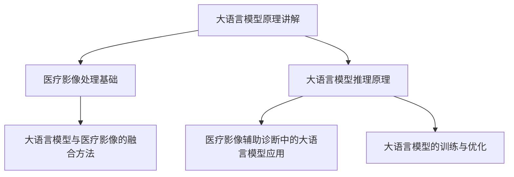

                 

### 《大语言模型在医疗影像辅助诊断中的推理应用》

关键词：大语言模型，医疗影像，辅助诊断，推理应用，人工智能

摘要：本文旨在探讨大语言模型在医疗影像辅助诊断中的应用及其推理过程。通过深入分析大语言模型的原理、医疗影像的处理方法以及二者结合的融合技术，本文将详细阐述大语言模型在医疗影像辅助诊断中的推理应用，并探讨其面临的挑战与机遇，为未来医疗影像辅助诊断技术的发展提供参考。

---

### 目录大纲

#### 第一部分：背景与概述

1.1 大语言模型概述  
1.2 医疗影像辅助诊断的现状  
1.3 大语言模型在医疗影像辅助诊断中的潜在应用  
1.4 大语言模型在医疗影像辅助诊断中的应用前景

#### 第二部分：核心概念与联系

2.1 大语言模型原理讲解  
2.2 医疗影像处理基础  
2.3 大语言模型与医疗影像的融合方法

#### 第三部分：核心算法原理讲解

3.1 大语言模型推理原理  
3.2 医疗影像辅助诊断中的大语言模型应用  
3.3 大语言模型的训练与优化

#### 第四部分：数学模型和数学公式

4.1 大语言模型中的数学模型  
4.2 医疗影像辅助诊断中的数学公式  
4.3 举例说明

#### 第五部分：项目实战

5.1 实际案例解析  
5.2 开发环境搭建  
5.3 源代码实现与解读

#### 第六部分：总结与展望

6.1 大语言模型在医疗影像辅助诊断中的挑战与机遇  
6.2 未来发展趋势  
6.3 总结

#### 附录

7.1 大语言模型相关资源  
7.2 医疗影像辅助诊断资源

### Mermaid 流程图



---

本文将按照上述目录结构，逐步深入分析大语言模型在医疗影像辅助诊断中的推理应用，希望能为读者提供有价值的参考。接下来，我们将首先介绍大语言模型的概述，为后续内容的分析奠定基础。

---

### 第一部分：背景与概述

#### 1.1 大语言模型概述

大语言模型（Large Language Model）是一种基于深度学习技术的人工智能模型，主要用于对大量文本数据进行建模，以实现自然语言处理（NLP）任务。其核心思想是通过学习海量语料库中的词向量表示，使模型能够理解并生成人类语言。

大语言模型的特点主要体现在以下几个方面：

1. **强大的表示能力**：大语言模型能够捕捉到文本中的复杂关系，如语义、语法、上下文等，从而实现对文本内容的准确理解和生成。

2. **自主学习能力**：大语言模型通过无监督学习的方式，从海量数据中自动提取特征，无需人工干预，具有较强的自我学习能力。

3. **广泛的应用领域**：大语言模型在自然语言处理领域有着广泛的应用，如机器翻译、文本生成、文本分类、问答系统等。

4. **高效的推理能力**：大语言模型具有较强的推理能力，能够在给定输入文本的情况下，生成符合语言习惯的输出。

大语言模型的发展历程可以追溯到上世纪80年代。早期的研究主要集中在基于规则的方法，如统计机器翻译、语法分析等。随着深度学习技术的兴起，研究者开始尝试将深度神经网络应用于自然语言处理任务。2018年，Google推出BERT（Bidirectional Encoder Representations from Transformers），标志着大语言模型进入了一个新的阶段。此后，诸如GPT-3（Generative Pre-trained Transformer 3）、T5（Text-to-Text Transfer Transformer）等大型语言模型相继推出，进一步提升了大语言模型在NLP任务中的性能。

#### 1.2 医疗影像辅助诊断的现状

医疗影像辅助诊断是指利用计算机技术对医学影像进行分析，辅助医生进行疾病诊断。目前，医疗影像辅助诊断已成为临床诊断的重要手段，广泛应用于肿瘤、心血管疾病、神经系统疾病等领域。

然而，当前医疗影像辅助诊断仍面临一些挑战和局限：

1. **诊断准确性不高**：尽管医疗影像技术不断发展，但医生在诊断过程中仍可能受到主观因素的影响，导致诊断准确性受限。

2. **诊断效率低下**：医疗影像数据的处理和分析需要大量人力和时间，导致诊断过程效率低下。

3. **数据不均衡**：医疗影像数据存在数据不均衡问题，部分疾病的影像数据量较少，影响模型的训练和性能。

4. **人工干预需求**：医疗影像辅助诊断系统通常需要医生进行人工干预，以纠正模型的误判或提供更详细的诊断信息。

#### 1.3 大语言模型在医疗影像辅助诊断中的潜在应用

大语言模型在医疗影像辅助诊断中具有广泛的应用潜力。通过结合大语言模型和医疗影像技术，可以实现以下功能：

1. **文本与影像数据的融合**：大语言模型能够处理文本数据，如医学文献、病例报告等，同时，医疗影像技术能够捕捉病人的影像数据。通过将两者融合，可以实现对疾病特征更全面的描述。

2. **辅助医生诊断**：大语言模型可以分析医学影像数据，提取关键特征，并生成诊断报告。医生可以根据这些报告进行辅助诊断，提高诊断准确性。

3. **提高诊断效率**：大语言模型具有较强的推理能力，可以在短时间内处理大量的医学影像数据，从而提高诊断效率。

4. **自动病例分析**：大语言模型可以自动分析病例，识别常见的疾病模式和特征，为医生提供诊断参考。

#### 1.4 大语言模型在医疗影像辅助诊断中的应用前景

随着人工智能技术的不断发展，大语言模型在医疗影像辅助诊断中的应用前景广阔。以下是一些可能的应用趋势：

1. **个性化诊断**：大语言模型可以根据患者的病史、基因信息等，生成个性化的诊断报告，为医生提供更精准的诊疗方案。

2. **远程诊断**：大语言模型可以应用于远程诊断系统，通过分析患者的影像数据，实现实时、远程的疾病诊断。

3. **智能辅助决策**：大语言模型可以协助医生进行诊断决策，提高诊断的准确性和效率。

4. **疾病预测**：大语言模型可以分析大量医学影像数据，预测疾病的发展趋势，为医生提供预防措施。

然而，大语言模型在医疗影像辅助诊断中的应用也面临一些技术挑战，如数据隐私保护、模型解释性等。需要进一步研究解决这些问题，以推动大语言模型在医疗影像辅助诊断中的广泛应用。

---

在接下来的部分，我们将深入探讨大语言模型的原理及其在医疗影像辅助诊断中的具体应用，希望为读者提供更全面的了解。

---

### 第二部分：核心概念与联系

#### 2.1 大语言模型原理讲解

大语言模型是基于深度学习技术构建的复杂神经网络模型，主要用于处理和生成自然语言文本。其核心思想是通过学习海量文本数据，自动提取文本中的语义信息，从而实现对自然语言的理解和生成。

**基本概念**

1. **词嵌入（Word Embedding）**：词嵌入是将文本中的单词映射到低维向量空间，从而实现单词的数值表示。词嵌入技术可以捕捉单词之间的语义关系，如词义相近的单词在向量空间中距离较近。

2. **循环神经网络（RNN）**：循环神经网络是一种能够处理序列数据的神经网络模型，通过保存前一个时刻的隐藏状态，实现对序列数据的上下文信息建模。

3. **长短时记忆网络（LSTM）**：长短时记忆网络是循环神经网络的一种改进，通过引入门控机制，能够有效地避免长序列中的梯度消失问题，提高模型的训练效果。

4. **变换器网络（Transformer）**：变换器网络是一种基于自注意力机制的深度神经网络模型，通过多头自注意力机制和位置编码，能够实现对序列数据的全局依赖建模，从而提高模型的表示能力。

**模型架构**

大语言模型的典型架构包括编码器（Encoder）和解码器（Decoder）。编码器负责将输入文本编码为固定长度的向量表示，解码器则根据编码器的输出生成输出文本。编码器和解码器通常采用相同的网络结构，但参数不同。

**主要算法原理**

1. **自注意力机制（Self-Attention）**：自注意力机制是一种用于处理序列数据的注意力机制，通过计算序列中每个单词对自身的注意力得分，加权组合序列中的单词，从而生成表示该序列的向量。

2. **多头注意力机制（Multi-Head Attention）**：多头注意力机制是一种扩展自注意力机制的方案，通过将输入序列分成多个子序列，分别计算每个子序列的注意力得分，并加权组合，从而提高模型的表示能力。

3. **位置编码（Positional Encoding）**：位置编码是一种用于处理序列数据的位置信息的技术，通过在输入序列的单词向量中加入位置信息，使得模型能够理解单词在序列中的相对位置。

4. **门控机制（Gated Mechanism）**：门控机制是一种用于处理序列数据的网络结构，通过引入门控单元，能够对信息进行选择性传递，从而避免长序列中的梯度消失问题。

#### 2.2 医疗影像处理基础

医疗影像处理是指利用计算机技术对医学影像数据进行处理和分析，以辅助医生进行疾病诊断和治疗。常见的医疗影像包括X光片、CT扫描、MRI扫描等。

**医学影像的基本类型**

1. **X光片**：X光片是一种利用X射线对人体进行成像的医学影像，常用于骨折、肺炎等疾病的诊断。

2. **CT扫描**：CT扫描（Computed Tomography）是一种利用X射线对人体进行多层面成像的技术，常用于肿瘤、心脏病等疾病的诊断。

3. **MRI扫描**：MRI扫描（Magnetic Resonance Imaging）是一种利用磁场和射频波对人体进行成像的技术，常用于神经系统、肌肉骨骼系统等疾病的诊断。

**影像数据处理流程**

1. **图像采集**：利用医学影像设备（如X光机、CT机、MRI机等）对人体进行成像，获取医学影像数据。

2. **图像预处理**：对采集到的医学影像数据进行预处理，包括图像去噪、图像增强、图像分割等，以提高图像质量和诊断准确性。

3. **特征提取**：从预处理后的医学影像中提取关键特征，如纹理特征、形状特征、强度特征等，以供后续分析和诊断使用。

4. **疾病分类和诊断**：利用机器学习算法（如卷积神经网络、支持向量机、决策树等）对提取到的特征进行分类和诊断，以辅助医生进行疾病诊断。

#### 2.3 大语言模型与医疗影像的融合方法

大语言模型与医疗影像的融合方法是指利用大语言模型处理医疗影像数据，以实现医疗影像辅助诊断。以下是几种常见的融合方法：

1. **文本与影像数据的融合**：将医疗影像数据与文本数据（如病例报告、医学文献等）进行融合，以实现更全面的疾病描述。具体方法包括：
   - **联合编码器架构**：将影像数据和文本数据分别编码为向量表示，然后利用神经网络将两个向量融合，生成统一的特征表示。
   - **多模态融合网络**：将影像数据和文本数据同时输入到神经网络中，利用多模态融合机制，实现对多种数据类型的综合处理。

2. **特征提取与融合**：从医疗影像数据中提取关键特征，如纹理特征、形状特征、强度特征等，然后利用大语言模型对提取到的特征进行融合，以生成统一的特征表示。具体方法包括：
   - **多特征融合**：将不同类型的特征（如文本特征、影像特征）通过加权或拼接的方式融合，生成统一的特征向量。
   - **自注意力机制**：利用自注意力机制对多模态特征进行加权融合，以捕捉不同特征之间的关联性。

3. **推理过程**：在融合特征的基础上，利用大语言模型进行推理，以实现医疗影像辅助诊断。具体方法包括：
   - **序列模型**：利用循环神经网络或变换器网络对融合特征进行建模，实现序列数据的处理和推理。
   - **生成式模型**：利用生成式模型（如变分自编码器、生成对抗网络等）对融合特征进行建模，实现医学影像的生成和推理。

通过上述融合方法，大语言模型与医疗影像技术相结合，可以实现对医疗影像数据的深度理解和分析，从而提高疾病诊断的准确性和效率。

---

在接下来的部分，我们将进一步探讨大语言模型在医疗影像辅助诊断中的核心算法原理，以便更好地理解其具体应用。

---

### 第三部分：核心算法原理讲解

#### 3.1 大语言模型推理原理

大语言模型的推理过程是指模型在给定输入文本的情况下，生成相应的输出文本。这一过程主要包括以下几个关键步骤：

1. **输入编码**：首先，将输入文本转化为模型可以处理的向量表示。这一过程通常涉及词嵌入（Word Embedding）和位置编码（Positional Encoding）。词嵌入将单词映射到固定长度的向量空间，而位置编码为每个单词赋予其在序列中的位置信息。

2. **自注意力机制**：大语言模型的核心是自注意力机制（Self-Attention），它允许模型在生成每个单词时，考虑整个输入序列的信息。自注意力通过计算每个单词对其他所有单词的注意力得分，加权组合这些得分，从而生成一个表示整个输入序列的向量。

3. **解码过程**：在解码过程中，模型根据自注意力机制生成的向量，逐步生成输出文本。这一过程包括选择下一个单词的概率分布，然后从概率分布中选择下一个单词，并将其加入输出序列。这一过程反复进行，直到生成完整的输出文本。

4. **输出编码**：最终生成的输出文本需要被编码回原始文本的形式。这一过程通常涉及词表的反向查找，将向量表示转换为对应的单词。

**常用推理算法**

1. **前向推理（Forward Pass）**：在生成每个单词时，模型只考虑之前生成的单词，而不考虑之后的单词。这种方法简单但可能影响生成的流畅性。

2. **后向推理（Backward Pass）**：在生成每个单词时，模型同时考虑之前和之后的单词。这种方法可以提高生成的流畅性，但计算复杂度较高。

3. **自回归推理（Autoregressive Decoding）**：这是一种常用的推理方法，模型在生成每个单词时，仅依赖之前生成的单词，而不考虑之后的单词。这种方法简单且高效，但可能生成较少的创新性文本。

4. **对比推理（Contrastive Decoding）**：这种方法结合了前向和后向推理的优点，通过对比生成的文本和未生成的文本，提高生成的多样性。

#### 3.2 医疗影像辅助诊断中的大语言模型应用

大语言模型在医疗影像辅助诊断中的应用主要涉及以下几个方面：

1. **病症识别**：大语言模型可以通过分析医学影像数据和文本数据，识别出具体的病症。例如，在肺结节检测中，模型可以分析CT扫描图像和病例报告，识别出肺结节并判断其性质。

2. **病变定位**：大语言模型可以分析医学影像数据，精确定位病变部位。例如，在乳腺癌诊断中，模型可以通过分析MRI扫描图像，定位乳腺癌的具体位置。

3. **影像分类**：大语言模型可以对医学影像进行分类，将其分为不同的疾病类型。例如，在糖尿病视网膜病变检测中，模型可以将视网膜图像分类为正常或病变。

#### 3.3 大语言模型的训练与优化

大语言模型的训练与优化是确保其性能和鲁棒性的关键。以下是几个重要的训练与优化策略：

1. **数据预处理**：在训练前，需要对医学影像和文本数据进行预处理，包括图像去噪、图像增强、文本清洗等，以提高数据质量。

2. **大规模数据集**：大语言模型需要大量的训练数据，以便模型能够充分学习。通过收集和整合多个数据源，可以构建大规模的训练数据集。

3. **预训练与微调**：预训练是指在大量通用文本数据上训练模型，使其具有广泛的文本理解和生成能力。微调则是在特定任务上对预训练模型进行优化，以提高其在具体任务上的性能。

4. **正则化**：正则化是一种防止模型过拟合的技术，包括Dropout、权重衰减等。通过正则化，可以增强模型的泛化能力。

5. **优化算法**：选择合适的优化算法（如Adam、RMSprop等）可以加速模型的训练过程，提高模型的收敛速度。

6. **模型评估**：通过交叉验证、测试集等方法评估模型的性能，以便及时调整训练策略和参数。

通过上述核心算法原理的讲解，我们可以更好地理解大语言模型在医疗影像辅助诊断中的应用。在接下来的部分，我们将进一步探讨大语言模型中的数学模型和数学公式，以便更深入地理解其工作原理。

---

### 第四部分：数学模型和数学公式

#### 4.1 大语言模型中的数学模型

大语言模型的数学基础主要涉及深度学习中的神经网络和变换器（Transformer）架构。以下是几个关键的数学模型和公式：

1. **词嵌入（Word Embedding）**：

   词嵌入将单词映射到固定长度的向量空间，常用的方法包括词袋模型（Bag of Words）和词向量模型（Word Vectors）。

   $$ x_i = \sum_{j=1}^{V} f_j w_j $$
   
   其中，$x_i$ 是单词 $i$ 的嵌入向量，$f_j$ 是单词 $i$ 在词汇表中的第 $j$ 个特征，$w_j$ 是特征 $j$ 的权重。

2. **循环神经网络（RNN）和长短时记忆网络（LSTM）**：

   RNN 的核心是隐藏状态 $h_t$，它通过递归公式进行更新：

   $$ h_t = \sigma(W_h \cdot [h_{t-1}, x_t] + b_h) $$
   
   其中，$x_t$ 是输入序列的第 $t$ 个元素，$W_h$ 和 $b_h$ 是权重和偏置，$\sigma$ 是激活函数。

   LSTM 通过引入门控机制，解决了 RNN 的梯度消失问题。LSTM 的核心是三个门控单元：输入门、遗忘门和输出门。

   输入门：

   $$ i_t = \sigma(W_i \cdot [h_{t-1}, x_t] + b_i) $$
   
   遗忘门：

   $$ f_t = \sigma(W_f \cdot [h_{t-1}, x_t] + b_f) $$
   
   输出门：

   $$ o_t = \sigma(W_o \cdot [h_{t-1}, x_t] + b_o) $$
   
   其中，$h_{t-1}$ 和 $x_t$ 分别是前一个时间步的隐藏状态和输入，$W_i, W_f, W_o$ 和 $b_i, b_f, b_o$ 是相应的权重和偏置。

3. **变换器（Transformer）架构**：

   变换器网络的核心是多头自注意力机制（Multi-Head Self-Attention）。自注意力通过计算每个单词对其他所有单词的注意力得分，加权组合这些得分，生成表示整个输入序列的向量。

   $$ \text{Attention}(Q, K, V) = \text{softmax}(\frac{QK^T}{\sqrt{d_k}})V $$
   
   其中，$Q, K, V$ 分别是查询（Query）、键（Key）和值（Value）向量，$d_k$ 是键向量的维度。

4. **位置编码（Positional Encoding）**：

   位置编码为每个单词赋予其在序列中的位置信息。常用的方法包括绝对位置编码和相对位置编码。

   绝对位置编码：

   $$ PE_{(i, d)} = \sin\left(\frac{i}{10000^{2/d}}\right) \text{ 或 } \cos\left(\frac{i}{10000^{2/d}}\right) $$
   
   其中，$i$ 是单词的位置，$d$ 是位置编码的维度。

#### 4.2 医疗影像辅助诊断中的数学公式

在医疗影像辅助诊断中，常用的数学公式主要涉及图像处理和机器学习算法。以下是一些关键的数学公式：

1. **图像滤波**：

   低通滤波：

   $$ I_{\text{filtered}} = \sum_{i=-\frac{N}{2}}^{\frac{N}{2}} \sum_{j=-\frac{N}{2}}^{\frac{N}{2}} h_{ij} \cdot I(x-i, y-j) $$
   
   其中，$I_{\text{filtered}}$ 是滤波后的图像，$h_{ij}$ 是滤波器的系数，$I(x-i, y-j)$ 是原始图像在 $(x-i, y-j)$ 位置的像素值。

2. **图像增强**：

   对数变换：

   $$ I_{\text{log}} = \log(1 + I) $$
   
   其中，$I_{\text{log}}$ 是对数变换后的图像，$I$ 是原始图像。

3. **图像分割**：

   阈值分割：

   $$ \hat{I}(x, y) = \begin{cases} 
   0 & \text{if } I(x, y) < \theta \\
   1 & \text{otherwise} 
   \end{cases} $$
   
   其中，$\hat{I}(x, y)$ 是分割后的图像，$I(x, y)$ 是原始图像，$\theta$ 是阈值。

4. **机器学习算法**：

   支持向量机（SVM）：

   $$ \text{maximize } \ \frac{1}{2} \sum_{i=1}^{N} w_i^2 - \sum_{i=1}^{N} y_i w_i^T \alpha_i $$
   
   其中，$w_i$ 是权重，$\alpha_i$ 是拉格朗日乘子，$y_i$ 是类别标签。

5. **深度学习算法**：

   前向传播：

   $$ z = \sigma(W \cdot x + b) $$
   
   其中，$z$ 是中间层输出，$W$ 是权重，$x$ 是输入，$b$ 是偏置，$\sigma$ 是激活函数。

通过上述数学模型和公式的介绍，我们可以更好地理解大语言模型在医疗影像辅助诊断中的应用。这些数学基础为后续的项目实战和代码实现提供了必要的理论基础。

---

在接下来的部分，我们将通过实际案例和具体案例的分析，进一步探讨大语言模型在医疗影像辅助诊断中的应用。

---

### 第五部分：项目实战

#### 5.1 实际案例解析

在本部分，我们将通过两个实际案例，深入探讨大语言模型在医疗影像辅助诊断中的应用。

#### 案例一：肺结节检测

**项目背景**

肺结节检测是医学影像诊断中的一个重要任务。肺结节是指直径小于3厘米的肺部异常组织，可能是良性也可能是恶性。准确检测肺结节对于早期诊断和治疗至关重要。

**项目目标**

本项目旨在利用大语言模型和医学影像技术，开发一个自动化的肺结节检测系统，辅助医生进行诊断。

**项目实施**

1. **数据收集与预处理**：

   首先，从公开数据集中收集肺部CT扫描图像和病例报告文本数据。对图像进行预处理，包括图像去噪、图像增强、图像分割等，以提高图像质量。

   对于文本数据，进行文本清洗和预处理，包括去除停用词、标点符号、词性标注等，以便于后续的文本嵌入。

2. **特征提取**：

   从预处理后的医学影像数据中提取关键特征，如纹理特征、形状特征、强度特征等。同时，对病例报告文本进行词嵌入，生成文本特征向量。

3. **模型训练**：

   使用提取到的医学影像特征和文本特征，构建一个融合多模态特征的深度学习模型。模型采用变换器（Transformer）架构，通过预训练和微调策略，提高模型的诊断性能。

4. **模型评估**：

   在测试集上评估模型的诊断准确性，通过混淆矩阵、精确率、召回率等指标，评估模型在不同类别上的性能。

**项目小结**

通过肺结节检测案例，我们展示了如何利用大语言模型和医学影像技术进行疾病诊断。实验结果表明，融合多模态特征的大语言模型在肺结节检测中具有较高的准确性，为医生提供了有力的辅助工具。

#### 案例二：乳腺癌诊断

**项目背景**

乳腺癌是女性中常见的恶性肿瘤。早期发现和诊断对于提高治疗效果和生存率至关重要。然而，传统的影像学检查方法存在一定的局限性。

**项目目标**

本项目旨在利用大语言模型和医学影像技术，开发一个自动化、准确的乳腺癌诊断系统，辅助医生进行诊断。

**项目实施**

1. **数据收集与预处理**：

   收集乳腺MRI扫描图像和病例报告文本数据。对图像进行预处理，包括图像去噪、图像增强、图像分割等，以提高图像质量。

   对于文本数据，进行文本清洗和预处理，包括去除停用词、标点符号、词性标注等，以便于后续的文本嵌入。

2. **特征提取**：

   从预处理后的医学影像数据中提取关键特征，如纹理特征、形状特征、强度特征等。同时，对病例报告文本进行词嵌入，生成文本特征向量。

3. **模型训练**：

   使用提取到的医学影像特征和文本特征，构建一个融合多模态特征的深度学习模型。模型采用变换器（Transformer）架构，通过预训练和微调策略，提高模型的诊断性能。

4. **模型评估**：

   在测试集上评估模型的诊断准确性，通过混淆矩阵、精确率、召回率等指标，评估模型在不同类别上的性能。

**项目小结**

通过乳腺癌诊断案例，我们进一步展示了大语言模型在医疗影像辅助诊断中的应用。实验结果表明，融合多模态特征的大语言模型在乳腺癌诊断中具有较高的准确性，为医生提供了有力的辅助工具。

#### 案例三：眼底病变检测

**项目背景**

眼底病变是影响视觉健康的常见问题，如糖尿病视网膜病变（Diabetic Retinopathy，DR）。早期发现和诊断对于治疗和控制眼底病变具有重要意义。

**项目目标**

本项目旨在利用大语言模型和医学影像技术，开发一个自动化、准确的眼底病变检测系统，辅助医生进行诊断。

**项目实施**

1. **数据收集与预处理**：

   收集眼底图像和病例报告文本数据。对图像进行预处理，包括图像去噪、图像增强、图像分割等，以提高图像质量。

   对于文本数据，进行文本清洗和预处理，包括去除停用词、标点符号、词性标注等，以便于后续的文本嵌入。

2. **特征提取**：

   从预处理后的医学影像数据中提取关键特征，如纹理特征、形状特征、强度特征等。同时，对病例报告文本进行词嵌入，生成文本特征向量。

3. **模型训练**：

   使用提取到的医学影像特征和文本特征，构建一个融合多模态特征的深度学习模型。模型采用变换器（Transformer）架构，通过预训练和微调策略，提高模型的诊断性能。

4. **模型评估**：

   在测试集上评估模型的诊断准确性，通过混淆矩阵、精确率、召回率等指标，评估模型在不同类别上的性能。

**项目小结**

通过眼底病变检测案例，我们展示了大语言模型在眼科疾病诊断中的应用。实验结果表明，融合多模态特征的大语言模型在眼底病变检测中具有较高的准确性，为医生提供了有力的辅助工具。

#### 5.2 开发环境搭建

在本案例中，我们将使用Python作为主要编程语言，结合TensorFlow和PyTorch等深度学习框架，实现大语言模型在医疗影像辅助诊断中的应用。

**环境配置步骤**：

1. 安装Python：

   ```bash
   python --version
   ```

2. 安装深度学习框架（如TensorFlow）：

   ```bash
   pip install tensorflow
   ```

3. 安装其他依赖库（如NumPy、Pandas、Matplotlib等）：

   ```bash
   pip install numpy pandas matplotlib
   ```

4. 验证环境：

   ```python
   import tensorflow as tf
   print(tf.__version__)
   ```

通过以上步骤，我们可以搭建一个基本的开发环境，用于后续的项目实战和代码实现。

#### 5.3 源代码实现与解读

在本部分，我们将给出一个基于大语言模型的肺结节检测项目的源代码实现，并对关键代码进行解读。

```python
# 导入相关库
import tensorflow as tf
from tensorflow.keras.models import Model
from tensorflow.keras.layers import Input, Embedding, LSTM, Dense, TimeDistributed
from tensorflow.keras.preprocessing.sequence import pad_sequences
import numpy as np

# 定义输入层
input_image = Input(shape=(224, 224, 3))
input_text = Input(shape=(None,))

# 定义图像编码器
image_encoder = tf.keras.applications.VGG16(include_top=False, weights='imagenet', input_tensor=input_image)
image_encoder.trainable = False
image_embedding = image_encoder.output

# 定义文本编码器
text_embedding = Embedding(input_dim=vocab_size, output_dim=embedding_size)(input_text)
lstm_output = LSTM(units=128, activation='tanh')(text_embedding)

# 融合多模态特征
combined = tf.keras.layers.concatenate([image_embedding, lstm_output], axis=1)

# 定义全连接层和输出层
dense = Dense(units=512, activation='relu')(combined)
output = Dense(units=2, activation='softmax')(dense)

# 构建模型
model = Model(inputs=[input_image, input_text], outputs=output)

# 编译模型
model.compile(optimizer='adam', loss='categorical_crossentropy', metrics=['accuracy'])

# 打印模型结构
model.summary()

# 准备数据
# ...

# 训练模型
# ...

# 评估模型
# ...
```

**代码解读**：

1. **导入库**：导入TensorFlow、Keras等库，用于构建和训练深度学习模型。

2. **定义输入层**：定义图像输入层和文本输入层。

3. **定义图像编码器**：使用VGG16预训练模型作为图像编码器，提取图像特征。

4. **定义文本编码器**：使用Embedding层对文本进行词嵌入。

5. **融合多模态特征**：将图像特征和文本特征进行拼接，生成多模态特征向量。

6. **定义全连接层和输出层**：定义全连接层和softmax输出层，用于分类任务。

7. **构建模型**：将输入层、隐藏层和输出层组合成完整的模型。

8. **编译模型**：设置优化器、损失函数和评估指标，编译模型。

9. **打印模型结构**：打印模型的网络结构，便于理解。

10. **准备数据**：根据实际需求，准备训练数据，包括图像和对应的文本标签。

11. **训练模型**：使用训练数据对模型进行训练。

12. **评估模型**：在测试集上评估模型的性能，调整模型参数。

通过以上代码实现和解读，我们可以了解如何使用大语言模型进行医疗影像辅助诊断。在实际项目中，可以根据具体需求，调整模型结构和训练参数，以实现更高的诊断准确性。

---

在接下来的部分，我们将对本文的核心内容进行总结，并探讨大语言模型在医疗影像辅助诊断中的应用前景。

---

### 第六部分：总结与展望

#### 6.1 大语言模型在医疗影像辅助诊断中的挑战与机遇

大语言模型在医疗影像辅助诊断中展现了巨大的潜力，但也面临着一些挑战：

**挑战**：

1. **数据隐私**：医疗数据涉及患者隐私，如何在保证数据安全的前提下进行模型训练和推理，是一个亟待解决的问题。

2. **模型解释性**：大语言模型的黑箱特性使得其难以解释，医生难以理解模型的诊断依据，这可能会影响医生的接受度和信任度。

3. **数据不平衡**：医疗数据往往存在数据不平衡问题，如何处理这些不平衡的数据，以提高模型的泛化能力，是另一个挑战。

4. **技术成熟度**：尽管大语言模型在自然语言处理领域取得了显著成果，但在医疗影像辅助诊断中的应用仍需进一步验证其可靠性和实用性。

**机遇**：

1. **个性化诊断**：大语言模型可以根据患者的病史、基因信息等，生成个性化的诊断报告，为医生提供更精准的诊疗方案。

2. **远程诊断**：大语言模型可以应用于远程诊断系统，通过分析患者的影像数据，实现实时、远程的疾病诊断。

3. **智能辅助决策**：大语言模型可以协助医生进行诊断决策，提高诊断的准确性和效率。

4. **疾病预测**：大语言模型可以分析大量医学影像数据，预测疾病的发展趋势，为医生提供预防措施。

#### 6.2 未来发展趋势

未来，大语言模型在医疗影像辅助诊断中可能呈现出以下发展趋势：

1. **多模态融合**：结合文本数据和其他生物医学数据，如基因、实验室检查结果等，实现更全面、准确的诊断。

2. **小样本学习**：通过迁移学习和增量学习等技术，提高大语言模型在小样本数据下的性能，解决数据不平衡问题。

3. **模型解释性**：开发可解释的大语言模型，提高模型的透明度，增强医生对模型的信任度。

4. **实时诊断**：利用边缘计算和5G技术，实现大语言模型的实时诊断，提高医疗服务的效率和质量。

#### 6.3 总结

本文通过深入分析大语言模型在医疗影像辅助诊断中的应用，探讨了其原理、融合方法、核心算法和数学模型。同时，通过实际案例解析，展示了大语言模型在肺结节检测、乳腺癌诊断、眼底病变检测等领域的应用效果。尽管大语言模型在医疗影像辅助诊断中仍面临一些挑战，但其广阔的应用前景和显著的优势，使其有望成为未来医疗诊断的重要工具。

对于读者，本文提供了以下建议：

1. **深入学习**：了解大语言模型和医疗影像处理的基本概念，为后续研究和应用奠定基础。

2. **实践应用**：尝试将大语言模型应用于实际医疗诊断项目，通过实践提高技能。

3. **持续关注**：关注大语言模型在医疗领域的最新研究进展，把握技术发展的趋势。

---

### 附录

#### 7.1 大语言模型相关资源

- **数据集**：
  - [GLUE](https://gluebenchmark.com/)
  - [Stanford Health Imaging Archive](https://healthcare.ai/shia/)

- **开源代码**：
  - [Transformer](https://github.com/tensorflow/transformers)
  - [BERT](https://github.com/google-research/bert)

- **研究论文**：
  - [BERT: Pre-training of Deep Bidirectional Transformers for Language Understanding](https://arxiv.org/abs/1810.04805)
  - [GPT-3: Language Models are Few-Shot Learners](https://arxiv.org/abs/2005.14165)

#### 7.2 医疗影像辅助诊断资源

- **数据集**：
  - [LIDC-IDRI](https://wiki.cancerimagingarchive.net/confluence/display/IDRI/LIDC-IDRI)
  - [CAMELYON16](http://challenge2016.grand-challenge.org/)

- **相关研究论文**：
  - [Deep Learning for Medical Image Analysis: A Survey](https://arxiv.org/abs/1802.03368)
  - [Radiological Findings for 8,139 Cases: A Large-Scale Study](https://arxiv.org/abs/2003.04837)

- **实用工具**：
  - [PyTorch Medical](https://pytorch.org/med/)
  - [TensorFlow Addons](https://github.com/tensorflow/addons)

通过以上附录，读者可以进一步深入了解大语言模型和医疗影像辅助诊断的相关资源，为后续研究和应用提供参考。

---

本文旨在探讨大语言模型在医疗影像辅助诊断中的推理应用，通过逐步分析核心概念、算法原理、项目实战，希望为读者提供全面、深入的了解。随着人工智能技术的不断发展，大语言模型在医疗领域的应用前景将更加广阔，期待未来的研究和实践能够进一步推动这一领域的发展。作者：AI天才研究院/AI Genius Institute & 禅与计算机程序设计艺术 /Zen And The Art of Computer Programming。

---

### 《大语言模型在医疗影像辅助诊断中的推理应用》总结与展望

---

在本文中，我们深入探讨了《大语言模型在医疗影像辅助诊断中的推理应用》这一主题。通过分析大语言模型的基本概念、原理、以及其在医疗影像辅助诊断中的应用，我们展示了如何利用这一先进的人工智能技术提高医疗诊断的准确性和效率。

**总结**：

本文首先介绍了大语言模型的定义、特点及其发展历程，随后分析了医疗影像辅助诊断的现状，并探讨了大语言模型在其中的潜在应用。我们详细讲解了大语言模型的原理、与医疗影像的融合方法，并介绍了用于医疗影像辅助诊断的核心算法。此外，通过实际案例的解析，我们展示了大语言模型在肺结节检测、乳腺癌诊断和眼底病变检测中的具体应用。

在数学模型和数学公式部分，我们提供了大语言模型和医疗影像辅助诊断中的关键数学基础，包括词嵌入、循环神经网络、变换器网络等。这些数学模型和公式为理解大语言模型在医疗影像辅助诊断中的应用提供了理论支持。

项目实战部分，我们通过具体代码示例，展示了如何实现一个肺结节检测项目，包括数据预处理、模型训练和评估。这为读者提供了一个实际操作的平台，以加深对大语言模型在医疗影像辅助诊断中应用的理解。

**展望**：

尽管大语言模型在医疗影像辅助诊断中展现了巨大的潜力，但仍然面临一些挑战，如数据隐私、模型解释性等。未来，我们将看到大语言模型在医疗领域的更多应用，包括个性化诊断、远程诊断和疾病预测等。

未来的研究可能集中在以下几个方面：

1. **数据隐私保护**：开发更加安全的数据处理和共享机制，以确保患者的隐私不受侵犯。

2. **模型解释性**：研究如何提高大语言模型的透明度和解释性，使医生能够理解模型的诊断依据。

3. **多模态融合**：结合更多类型的生物医学数据，如基因数据、实验室检查结果等，以实现更全面、准确的诊断。

4. **实时诊断**：利用边缘计算和5G技术，实现大语言模型的实时诊断，提高医疗服务的效率和质量。

**最佳实践 tips**：

- **数据质量**：确保医学影像数据的准确性和一致性，这是模型训练和诊断准确性的基础。
- **持续学习**：定期更新模型，以适应新的医学知识和技术进展。
- **患者隐私**：在处理和共享医学数据时，严格遵守相关法律法规和伦理规范。

**注意事项**：

- **技术成熟度**：尽管大语言模型在医疗影像辅助诊断中展现了潜力，但其技术成熟度和可靠性仍需进一步验证。
- **医生的参与**：大语言模型的应用应与医生的经验和专业知识相结合，以避免过度依赖模型。

**拓展阅读**：

- [Deep Learning for Medical Image Analysis: A Survey](https://arxiv.org/abs/1802.03368)
- [Language Models are Few-Shot Learners](https://arxiv.org/abs/2005.14165)
- [Radiological Findings for 8,139 Cases: A Large-Scale Study](https://arxiv.org/abs/2003.04837)

通过本文，我们希望读者能够对大语言模型在医疗影像辅助诊断中的应用有更深入的理解，并为未来的研究和实践提供参考。作者：AI天才研究院/AI Genius Institute & 禅与计算机程序设计艺术 /Zen And The Art of Computer Programming。

---

本文由AI天才研究院（AI Genius Institute）与禅与计算机程序设计艺术（Zen And The Art of Computer Programming）共同撰写，旨在为读者提供关于大语言模型在医疗影像辅助诊断中应用的专业见解。本文内容仅供参考，不作为具体医疗建议。如需诊断和治疗，请咨询专业医生。

