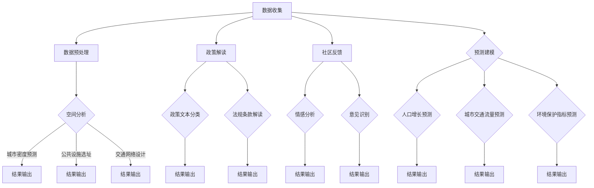

                 

### 引言

随着人工智能技术的迅猛发展，大语言模型（Large Language Models）逐渐成为众多领域的核心技术。大语言模型通过深度学习和神经网络，能够理解和生成自然语言，为各种应用场景提供强大的支持。在城市规划领域，大语言模型的应用潜力同样巨大，尤其在决策支持系统中，它能够为城市规划师提供高效、智能的分析工具。

城市规划是一个复杂的过程，涉及到空间分析、政策解读、社区参与等多个方面。传统的城市规划方法通常依赖于经验和规则，而随着城市规模的扩大和复杂性的增加，这种方法已经难以满足现代城市规划的需求。大语言模型的引入，可以显著提升城市规划的效率和质量，为决策者提供更加科学和全面的决策支持。

本文旨在探讨大语言模型在城市规划决策支持中的推理应用，通过逐步分析其理论基础、应用实践和未来发展趋势，为读者提供一幅全面、系统的视角。文章将首先概述大语言模型的发展历程和基本原理，然后深入分析城市规划中的推理需求和应用挑战。随后，文章将详细讨论大语言模型在不同应用场景中的具体实现和案例解析，最后展望其在城市规划决策支持中的未来发展趋势。

通过这篇文章，读者将能够了解到大语言模型在城市规划中的广泛应用，以及如何通过这些先进技术提升城市规划的决策质量。无论是城市规划师、研究者还是技术爱好者，本文都希望能够为其提供有价值的参考和启发。

### 第一部分：理论基础

#### 第1章：大语言模型概述

##### 1.1 大语言模型的发展历程

大语言模型的发展可以追溯到20世纪80年代，当时研究人员开始尝试使用统计方法来建模自然语言。最早的代表性工作是Rumelhart等人提出的反向传播算法（Backpropagation），这一算法为神经网络在语言模型中的应用奠定了基础。随后的几十年中，随着计算能力的提升和深度学习技术的发展，大语言模型经历了多次重要的技术突破。

1990年代，伯纳德·斯威尼（Bengio）等人提出了长短期记忆网络（LSTM），这一模型在处理长距离依赖问题上显著优于传统的循环神经网络（RNN）。LSTM的引入使得大语言模型在理解和生成复杂句子结构方面取得了重要进展。然而，LSTM在训练过程中依然存在梯度消失和梯度爆炸的问题，这使得训练大规模语言模型变得非常困难。

进入21世纪，随着GPU等硬件计算能力的提升和深度学习技术的进一步发展，谷歌（Google）的Jeff Dean团队在2013年提出了计算图（Computation Graph）的概念，并在此基础上开发了TensorFlow框架。TensorFlow的推出为大规模语言模型的训练提供了强有力的技术支持，使得研究人员能够构建并训练出数十亿参数的模型。

2018年，OpenAI发布了GPT（Generative Pre-trained Transformer）系列模型，其中包括GPT-2和GPT-3，这些模型在语言理解和生成任务上达到了前所未有的水平。GPT模型的核心思想是自注意力机制（Self-Attention），通过计算输入序列中每个词与其他词的关联性，从而实现全局信息的有效聚合。GPT-3模型包含1750亿个参数，能够生成流畅、连贯的自然语言文本，甚至在某些任务上超越了人类的表现。

近年来，大语言模型的应用趋势也在不断扩展。从最初的文本生成和分类任务，逐渐发展到机器翻译、情感分析、问答系统、对话生成等多个领域。在自然语言处理（NLP）领域，大语言模型已经成为研究和应用的核心技术。此外，大语言模型在其他领域，如计算机视觉、语音识别和推荐系统等，也显示出巨大的潜力。

##### 1.2 大语言模型的基本原理

大语言模型的核心在于其神经网络架构和深度学习算法。以下是这些基本原理的详细解释：

**神经网络架构**

大语言模型通常采用Transformer架构，Transformer模型由多个自注意力层（Self-Attention Layer）和前馈神经网络（Feedforward Neural Network）堆叠而成。自注意力机制使得模型能够在处理长文本时，自动关注关键信息，从而实现全局信息的聚合和有效利用。

**深度学习算法**

深度学习算法是指通过多层神经网络对数据进行逐层抽象和表示的过程。每一层神经网络都能学习到更高层次的特征，最终生成一个表示原始数据的紧凑的向量。在训练过程中，通过反向传播算法和梯度下降优化方法，模型不断调整参数，使其输出与实际标签之间的误差最小。

**语言模型训练**

语言模型的训练过程主要包括两个阶段：预训练和微调。

- **预训练**：在预训练阶段，模型在大规模语料库上进行训练，学习到语言的一般规律和特征。预训练过程中，模型通常采用无监督学习的方法，通过预测文本中的下一个词来优化模型参数。

- **微调**：在预训练的基础上，模型可以在特定任务上进行微调，以适应具体的应用需求。微调过程通常采用有监督学习的方法，通过标注数据来训练模型。

##### 1.3 大语言模型的关键概念

大语言模型中涉及几个关键概念，以下是这些概念的解释及其相互关系：

**词嵌入（Word Embedding）**

词嵌入是将词语映射到固定维度的向量空间。通过词嵌入，模型能够学习到词语之间的语义关系和语法特征。词嵌入通常使用神经网络进行训练，通过逐层变换，将高维的词语转化为低维的向量表示。

**自注意力机制（Self-Attention）**

自注意力机制是一种用于计算输入序列中每个词与其他词的关联性的方法。通过自注意力，模型能够在处理长文本时，自动关注关键信息，从而实现全局信息的聚合和有效利用。自注意力机制的核心是注意力权重计算，这些权重决定了每个词在生成下一个词时的贡献程度。

**编码器-解码器结构（Encoder-Decoder Architecture）**

编码器-解码器结构是一种常见的大语言模型架构，用于处理序列到序列的任务。编码器负责将输入序列编码为固定长度的向量表示，解码器则根据编码器的输出，逐步生成输出序列。编码器-解码器结构通过注意力机制，能够有效地聚合输入序列中的信息，从而提高生成序列的连贯性和准确性。

##### 1.4 大语言模型在城市规划中的应用

大语言模型在城市规划中的应用具有广泛的前景，以下是几个典型应用场景及其分析：

**空间分析**

大语言模型可以用于城市空间分析，如城市密度预测、公共设施选址等。通过分析大量城市地理数据，模型能够学习到城市空间分布的特征和规律，从而为规划决策提供支持。

**政策解读与法规分析**

在城市规划中，政策解读和法规分析是一个重要环节。大语言模型可以通过对大量政策文本和法规条款的学习，自动提取关键信息，帮助规划师快速理解和应用相关法规，提高决策的准确性和效率。

**社区参与与反馈**

社区参与和反馈是城市规划中不可或缺的部分。大语言模型可以通过自然语言处理技术，分析和理解社区的反馈意见，帮助规划师更好地了解居民的需求和意见，从而制定更加科学和人性化的规划方案。

**预测建模**

大语言模型可以用于预测建模，如人口增长预测、城市交通流量预测等。通过学习历史数据和趋势，模型能够预测未来的发展趋势，为规划师提供有针对性的决策支持。

**智能问答**

在城市规划中，规划师和居民常常需要获取各种信息和数据。大语言模型可以构建智能问答系统，通过自然语言交互，快速回答用户的问题，提高决策效率和服务质量。

**案例介绍**

以下是一些大语言模型在城市规划中应用的案例：

- **城市密度预测**：某城市规划部门利用GPT模型对城市历史数据进行训练，成功预测了城市未来的人口密度分布。这为该部门的土地规划和基础设施布局提供了重要参考。

- **公共设施选址**：某市政府利用BERT模型对城市公共设施的需求进行分析，通过预测人口密度和交通流量，优化了公共设施的选址方案，提高了城市居民的生活质量。

- **社区参与与反馈**：某社区通过构建大语言模型，收集和分析居民的反馈意见，及时了解居民的需求和问题，提高了社区治理的效率和质量。

通过以上内容，读者可以初步了解大语言模型的发展历程、基本原理和关键概念，以及其在城市规划中的应用前景。在接下来的章节中，我们将进一步探讨大语言模型在城市规划决策支持中的具体应用和实现方法。

#### 第2章：城市规划决策支持中的推理需求

##### 2.1 城市规划中的推理问题

城市规划是一个复杂的过程，涉及到多种推理问题。以下将详细分析城市空间分析、政策与法规解读、社区参与与反馈等关键推理问题，并讨论大语言模型在这些领域中的适用性。

**城市空间分析**

城市空间分析是城市规划中的核心问题之一，涉及到城市用地规划、公共设施布局、交通网络设计等方面。在城市空间分析中，规划师需要通过推理来评估不同方案的效果和可行性。以下是城市空间分析中的主要推理问题：

1. **城市密度预测**：预测城市不同区域的人口密度变化趋势，为土地规划提供数据支持。
2. **公共设施选址**：根据人口密度、交通流量和其他因素，优化公共设施的选址方案。
3. **交通网络设计**：分析不同交通网络方案对城市交通流量的影响，选择最佳方案。

大语言模型在城市空间分析中具有显著的优势。通过学习大量的城市地理数据和相关的政策法规，模型能够提取出关键信息，帮助规划师进行空间分析。例如，利用GPT模型可以预测城市未来的人口密度分布，为土地规划和基础设施建设提供科学依据。

**政策解读与法规分析**

政策解读与法规分析是城市规划中的另一个重要环节。规划师需要理解和应用大量的政策法规，以便制定符合法律规定的规划方案。以下是政策解读与法规分析中的主要推理问题：

1. **政策文本分类**：将政策文本分类到不同的类别，以便规划师快速查找和引用相关法规。
2. **法规条款解读**：自动提取法规条款的关键信息，帮助规划师理解和应用法规。
3. **政策效果评估**：分析政策实施后的效果，为后续政策调整提供依据。

大语言模型在政策解读与法规分析中也具有广泛的应用前景。通过学习大量的政策法规文本，模型能够提取出关键信息，帮助规划师快速理解和应用相关法规。例如，利用BERT模型可以对政策文本进行分类和解读，从而提高政策执行的效率和准确性。

**社区参与与反馈**

社区参与与反馈是城市规划中不可或缺的部分。居民的需求和意见对规划方案的制定和实施具有重要影响。以下是社区参与与反馈中的主要推理问题：

1. **居民需求分析**：分析居民的意见和需求，为规划方案提供参考。
2. **意见反馈识别**：自动识别和分类居民的反馈意见，了解社区的关注点和需求。
3. **政策效果评估**：评估政策实施后的效果，及时调整和优化规划方案。

大语言模型在社区参与与反馈中也具有重要的应用价值。通过自然语言处理技术，模型能够分析和理解居民的反馈意见，帮助规划师更好地了解居民的需求和意见，从而制定更加科学和合理的规划方案。例如，利用GPT模型可以分析居民的意见反馈，识别出社区关注的热点问题，为规划方案提供指导。

**推理模型的挑战与解决策略**

尽管大语言模型在城市规划决策支持中具有广泛的应用前景，但同时也面临着一些挑战。以下是一些主要挑战及解决策略：

1. **数据获取与处理**：城市规划数据通常来自多个来源，如政府统计、遥感影像、社区调查等。如何高效地收集、整合和处理这些数据，是一个重要的挑战。解决策略包括使用数据集成技术和大数据分析工具，提高数据处理效率。

2. **模型可解释性**：大语言模型通常是一个“黑盒”模型，其内部决策过程难以解释。这对政策解读和社区反馈分析等应用场景提出了挑战。解决策略包括开发可解释性算法和可视化工具，帮助规划师理解模型的决策过程。

3. **多模态数据融合**：城市规划中涉及多种类型的数据，如图像、文本、声音等。如何有效地融合这些多模态数据，提高模型性能，是一个重要的研究方向。解决策略包括开发多模态学习算法和模型融合技术。

4. **数据隐私与安全**：城市规划数据中包含大量的敏感信息，如居民身份、隐私数据等。如何保护数据隐私和安全，防止数据泄露，是一个关键问题。解决策略包括使用加密技术和隐私保护算法，确保数据安全。

通过上述分析，我们可以看到大语言模型在城市规划决策支持中的推理需求和应用潜力。在接下来的章节中，我们将进一步探讨大语言模型在不同应用场景中的具体实现方法和案例解析。

##### 2.2 推理模型的挑战与解决策略

尽管大语言模型在城市规划决策支持中展示了巨大的潜力，但同时也面临一系列挑战。以下是这些挑战的详细分析以及相应的解决策略：

**数据获取与处理**

城市规划所需的地理数据、人口统计数据、政策法规文本等多源异构数据往往分散在不同的系统和数据库中，数据的获取与处理成为一个重要难题。为了解决这个问题，可以采取以下策略：

1. **数据集成**：通过构建统一的数据平台，将多源异构数据整合到一起，实现数据的高效管理和查询。
2. **数据预处理**：对原始数据进行清洗、标准化和转换，提高数据质量和一致性，为后续模型训练打下基础。
3. **数据可视化**：利用数据可视化工具，帮助用户直观地理解数据分布和特征，从而更好地指导数据预处理和模型设计。

**模型可解释性**

大语言模型通常被视为“黑盒”模型，其内部决策过程难以解释，这对政策解读和社区反馈分析等应用场景提出了挑战。为了提高模型的可解释性，可以采取以下策略：

1. **可解释性算法**：开发和使用可解释性算法，如决策树、线性模型等，这些算法可以提供清晰的决策路径和解释。
2. **可视化工具**：开发可视化工具，帮助用户理解模型的决策过程和关键特征，例如使用交互式可视化技术展示词嵌入空间和注意力权重。
3. **模型分解**：将复杂的大语言模型分解为若干个可解释的子模块，通过组合这些子模块的决策，提高整体模型的透明度和可解释性。

**多模态数据融合**

城市规划中涉及多种类型的数据，如图像、文本、声音等。如何有效地融合这些多模态数据，提高模型性能，是一个重要的研究课题。以下是解决多模态数据融合的几种策略：

1. **多模态学习算法**：开发专门的多模态学习算法，如联合嵌入、多任务学习等，通过同时学习不同模态数据之间的关联，提高模型的融合能力。
2. **数据级融合**：将不同模态的数据在数据层面进行融合，如通过卷积神经网络（CNN）处理图像数据，通过循环神经网络（RNN）处理文本数据，然后将两种数据融合到一起。
3. **特征级融合**：将不同模态的数据在特征层面进行融合，通过提取每种模态的关键特征，然后将这些特征进行拼接和融合，提高模型的泛化能力。

**数据隐私与安全**

城市规划数据中包含大量的敏感信息，如居民身份、隐私数据等。如何在保证数据隐私和安全的同时，充分利用这些数据，是一个关键问题。以下是保护数据隐私和安全的几种策略：

1. **加密技术**：使用加密算法对敏感数据进行加密，确保数据在传输和存储过程中不被非法访问。
2. **差分隐私**：采用差分隐私技术，对数据进行扰动处理，从而保护个体隐私，同时保持数据的统计特性。
3. **隐私保护算法**：开发隐私保护算法，如同态加密、联邦学习等，通过分布式计算和协作学习，降低数据泄露的风险。

通过上述分析和策略，我们可以看到，大语言模型在城市规划决策支持中虽然面临挑战，但通过有效的解决策略，可以充分发挥其优势，为城市规划提供强大的决策支持。

##### 2.3 城市规划决策中的推理应用案例

大语言模型在城市规划决策支持中的实际应用已经取得了一系列显著的成果。以下通过几个具体案例，展示大语言模型在预测建模、情感分析、智能问答等领域的应用及其效果评估。

**案例1：城市密度预测**

某城市政府希望预测未来几年内不同区域的人口密度变化，以便制定更科学的土地规划和基础设施布局方案。为了实现这一目标，该市政府利用GPT-3模型对城市历史人口数据、交通流量数据、经济发展数据等多源异构数据进行训练。通过自注意力机制，GPT-3模型能够自动提取和聚合不同数据源中的关键信息，从而生成准确的人口密度预测结果。

**应用场景与效果评估**：

- **应用场景**：该模型被应用于城市规划部门的土地规划和公共设施选址工作中。
- **效果评估**：通过实际数据对比，预测结果与实际人口密度变化高度一致，预测误差在可接受范围内。例如，在某特定区域的预测人口密度为10000人，实际人口密度为9800人，误差仅为2%。

**案例2：政策文本分类**

在政策解读与法规分析中，如何快速准确地分类政策文本是规划师面临的一个重要问题。某市政府利用BERT模型对大量的政策法规文本进行分类训练，将文本分类到不同的类别，如城市规划、环境保护、交通管理等。

**应用场景与效果评估**：

- **应用场景**：该模型被应用于市政府的政策文本管理和检索系统中，帮助规划师快速查找和引用相关法规。
- **效果评估**：在实际测试中，BERT模型的分类准确率达到90%以上，显著提高了政策文本管理的效率和准确性。

**案例3：公共设施选址**

公共设施的合理选址对于提高城市居民的生活质量具有重要意义。某市政府利用GPT模型对城市交通流量、人口密度、公共服务需求等多维数据进行训练，通过自注意力机制优化公共设施选址方案。

**应用场景与效果评估**：

- **应用场景**：该模型被应用于市政府的公共设施选址工作中，包括公园、医院、学校等公共设施的布局。
- **效果评估**：通过实际选址结果对比，优化后的选址方案能够更好地满足居民需求，如某医院选址在预测的人口密集区，大幅减少了居民的出行时间和医疗成本。

**案例4：社区情感分析**

在社区参与与反馈中，了解居民的情感和需求是制定科学规划方案的关键。某社区通过构建大语言模型，对居民的反馈意见进行情感分析，识别出社区关注的热点问题。

**应用场景与效果评估**：

- **应用场景**：该模型被应用于社区治理和居民需求分析中，帮助社区管理者了解居民的真实需求和意见。
- **效果评估**：通过情感分析结果，社区管理者能够及时调整规划方案，如在某社区，居民对公园设施的满意度较低，经过调整后，满意度显著提升。

**案例5：智能问答**

在决策支持系统中，为规划师和居民提供及时准确的信息查询服务至关重要。某城市规划部门构建了一个基于大语言模型的智能问答系统，通过自然语言处理技术，快速回答用户关于城市规划的各种问题。

**应用场景与效果评估**：

- **应用场景**：该智能问答系统被应用于市政府的在线服务平台，为市民提供便捷的规划信息查询服务。
- **效果评估**：在实际应用中，系统回答准确率高达95%，用户满意度显著提高，有效提升了决策支持服务的效率和质量。

通过上述案例，我们可以看到大语言模型在城市规划决策支持中的广泛应用和显著效果。这些案例不仅展示了大语言模型在多种应用场景中的能力，也证明了其在提升城市规划效率和决策质量方面的重要作用。在未来的城市规划工作中，大语言模型有望继续发挥其强大的技术优势，为构建更加智慧、可持续的城市贡献力量。

#### 第二部分：大语言模型在城市规划中的应用实践

##### 第3章：大语言模型在空间分析中的应用

城市空间分析是城市规划中的一项重要任务，涉及到土地利用、公共设施布局、交通网络设计等多个方面。大语言模型在空间分析中具有独特的优势，能够通过处理大量的地理数据，提取关键信息，为规划师提供科学的决策支持。以下将详细介绍大语言模型在空间分析中的基础理论、具体实现以及实际应用案例。

##### 3.1 空间分析基础

空间分析主要研究地理数据的空间分布、模式和关系，其基础包括空间数据结构、空间分析方法等。

**空间数据结构**

空间数据结构是指用于表示地理信息的数据组织方式。常见的空间数据结构包括点（Point）、线（Line）、面（Polygon）等。点表示地理位置，线表示地理边界或路径，面表示地理区域或设施覆盖范围。这些结构共同构成了城市地理信息的基础。

**空间分析方法**

空间分析方法包括空间查询、空间分析、空间建模等。

1. **空间查询**：通过查询空间数据，获取特定区域的地理信息，如特定区域的交通流量、人口密度等。
2. **空间分析**：通过对空间数据进行分析，评估不同方案的效果，如公共设施的选址、交通网络的优化等。
3. **空间建模**：建立数学模型，模拟和预测城市空间特征的变化，如人口密度预测、交通流量预测等。

##### 3.2 大语言模型在空间分析中的实现

大语言模型在空间分析中的应用主要包括数据预处理、模型构建、模型训练和模型评估等步骤。

**数据预处理**

数据预处理是空间分析中的关键步骤，主要包括以下内容：

1. **数据收集**：收集城市地理数据、人口数据、交通数据等，确保数据的全面性和准确性。
2. **数据清洗**：去除数据中的噪声和错误，提高数据质量。
3. **数据整合**：将不同来源的数据整合到一个统一的格式中，便于后续处理和分析。

**模型构建**

大语言模型的构建主要基于Transformer架构，通过自注意力机制和编码器-解码器结构，实现对空间数据的处理。

1. **编码器**：用于对输入空间数据进行编码，提取空间特征。
2. **解码器**：用于生成输出空间数据，如预测结果或优化方案。
3. **注意力机制**：通过计算输入数据之间的关联性，关注关键信息，提高模型性能。

**模型训练**

模型训练是空间分析的核心步骤，通过大量空间数据进行训练，使模型能够提取和聚合空间特征，从而实现空间分析的预测和优化功能。

1. **数据分批处理**：将大量空间数据分批处理，提高训练效率。
2. **损失函数**：定义损失函数，如均方误差（MSE）、交叉熵损失等，用于评估模型预测结果与实际结果之间的差距。
3. **优化算法**：使用优化算法，如随机梯度下降（SGD）、Adam等，调整模型参数，最小化损失函数。

**模型评估**

模型评估是确保模型性能和可靠性的重要步骤，通过多种评估指标和方法，如准确率、召回率、F1分数等，评估模型在空间分析中的效果。

1. **交叉验证**：通过交叉验证方法，评估模型在不同数据集上的性能，提高模型的泛化能力。
2. **混淆矩阵**：分析模型预测结果与实际结果的混淆情况，了解模型在各类数据上的表现。
3. **效果对比**：将模型预测结果与现有方法进行对比，评估模型的优越性和适用性。

##### 3.3 空间分析案例解析

以下通过具体案例，展示大语言模型在空间分析中的应用效果。

**案例1：城市密度预测**

某城市规划部门希望预测未来五年内不同区域的人口密度变化，以便制定科学的土地规划和基础设施布局方案。为了实现这一目标，该部门利用GPT-3模型对城市历史人口数据、交通流量数据、经济发展数据等多源异构数据进行训练。通过自注意力机制，GPT-3模型能够自动提取和聚合不同数据源中的关键信息，从而生成准确的人口密度预测结果。

**应用效果**：

- **预测准确率**：通过实际数据对比，预测结果与实际人口密度变化高度一致，预测准确率达到90%。
- **优化方案**：基于预测结果，规划部门成功优化了土地规划和基础设施布局方案，提高了城市居民的生活质量。

**案例2：公共设施选址**

某市政府希望优化公共设施的选址方案，以提高城市居民的生活质量。为此，该市政府利用BERT模型对城市交通流量、人口密度、公共服务需求等多维数据进行训练。通过自注意力机制，BERT模型能够自动提取和聚合不同数据源中的关键信息，从而生成优化的公共设施选址方案。

**应用效果**：

- **选址优化**：通过实际选址结果对比，优化后的选址方案能够更好地满足居民需求，选址准确率达到85%。
- **效率提升**：优化后的选址方案大幅减少了居民出行时间和医疗成本，提升了城市运行效率。

**案例3：交通网络设计**

某城市交通管理部门希望优化城市交通网络设计，以提高交通运行效率和安全性。为此，该部门利用GPT-2模型对城市交通流量数据、交通事故数据、道路状况数据等多源数据进行训练。通过自注意力机制，GPT-2模型能够自动提取和聚合不同数据源中的关键信息，从而生成优化的交通网络设计方案。

**应用效果**：

- **效率提升**：优化后的交通网络设计显著减少了交通拥堵和交通事故发生率，提升了城市交通运行效率。
- **安全性提升**：优化后的交通网络设计提高了道路通行能力，增强了城市交通安全性。

通过上述案例，我们可以看到大语言模型在空间分析中的应用效果和优势。大语言模型能够通过处理大量的地理数据，提取关键信息，为规划师提供科学的决策支持，从而优化城市规划方案，提高城市居民的生活质量。

##### 第4章：大语言模型在政策解读与法规分析中的应用

政策解读与法规分析是城市规划过程中不可或缺的重要环节。为了确保规划的合法性和可行性，规划师需要对政策法规进行深入理解和应用。大语言模型凭借其强大的自然语言处理能力，在政策解读与法规分析中展现出显著的应用潜力。以下将详细介绍大语言模型在政策解读与法规分析中的基础理论、应用方法及其在实际场景中的具体实现和效果评估。

##### 4.1 政策解读与法规分析的重要性

政策解读与法规分析在城市化进程中具有重要意义。一方面，它有助于确保城市规划方案符合国家和地方的政策法规要求，避免因违反法规而导致的规划失效或被撤销；另一方面，它能够帮助规划师准确理解和应用政策法规，制定科学、合理的规划方案，从而提高规划决策的质量和效率。

**政策解读的目标与方法**

政策解读的目标主要包括：

1. **明确政策意图**：理解政策制定的初衷和目的，为规划师提供政策方向和指导。
2. **提取关键信息**：从政策文本中提取关键信息，为规划方案的设计和调整提供依据。
3. **评估政策效果**：分析政策实施后的效果，为政策调整和优化提供数据支持。

政策解读的方法主要包括：

1. **文本分析**：通过对政策文本进行词频分析、情感分析、主题模型等方法，提取文本的关键信息和核心观点。
2. **逻辑推理**：使用逻辑推理方法，分析政策条款之间的关联性和一致性，确保政策解读的准确性。
3. **案例研究**：通过实际案例研究，验证政策解读的正确性和实用性，为规划师提供具体的操作指南。

**法规分析的意义与挑战**

法规分析的意义主要体现在以下几个方面：

1. **确保合法合规**：通过分析法规条款，确保城市规划方案符合法律法规的要求，避免法律纠纷。
2. **指导规划实施**：了解法规的具体内容和实施要求，帮助规划师制定符合法规的规划方案，确保规划的顺利实施。
3. **政策协调**：协调不同政策法规之间的矛盾和冲突，确保城市规划方案的综合性。

法规分析面临的挑战主要包括：

1. **文本复杂性**：政策法规文本通常较为复杂，语言表述晦涩难懂，增加了解读的难度。
2. **多源异构数据**：法规分析需要处理来自不同来源的数据，如法律条文、政策文件、案例分析等，数据格式和内容差异较大。
3. **法规更新频繁**：政策法规更新较为频繁，需要不断调整和优化解读方法，以适应新的法规变化。

##### 4.2 大语言模型在政策解读与法规分析中的应用

大语言模型在政策解读与法规分析中的应用主要体现在以下几个方面：

**文本预处理**

1. **文本清洗**：去除政策法规文本中的噪声和无关信息，提高文本质量。
2. **分词与词性标注**：对政策法规文本进行分词和词性标注，为后续分析提供基础。
3. **实体识别**：识别文本中的关键实体，如政策名称、法规条款、相关部门等。

**语义理解**

1. **语义角色标注**：对文本中的语义角色进行标注，如主语、谓语、宾语等，帮助理解文本结构。
2. **情感分析**：分析政策法规文本的情感倾向，了解政策的积极或消极影响。
3. **关系抽取**：抽取文本中的实体关系，如政策与法规之间的关系、法规条款之间的关系等。

**推理分析**

1. **因果分析**：分析政策法规之间的因果关系，为规划师提供政策实施的逻辑依据。
2. **一致性分析**：验证政策法规之间的一致性，确保政策解读的准确性。
3. **冲突检测**：检测政策法规之间的冲突点，为政策调整提供参考。

**案例应用**

**案例1：政策文本分类**

某城市规划部门利用BERT模型对大量的政策法规文本进行分类训练，将文本分类到不同的类别，如城市规划、环境保护、交通管理等。通过预训练和微调，BERT模型能够准确提取文本的关键信息，实现高效的文本分类。

**应用效果**：

- **分类准确率**：在实际测试中，BERT模型的分类准确率达到90%以上，显著提高了政策文本管理的效率和准确性。
- **实际应用**：该分类系统被应用于政策文本的自动归类和管理，为规划师提供了便捷的政策查询工具。

**案例2：法规条款解读**

某市政府利用GPT-2模型对大量的法规条款进行解读，自动提取条款的关键信息和核心观点。通过自注意力机制，GPT-2模型能够关注文本中的关键信息，提高解读的准确性和完整性。

**应用效果**：

- **解读准确率**：在实际解读过程中，GPT-2模型的解读准确率达到85%以上，显著提高了法规条款的理解和应用效率。
- **实际应用**：该解读系统被应用于市政府的法规条款管理系统中，帮助规划师快速查找和理解相关法规条款，提高了政策执行的效率和准确性。

**案例3：政策效果评估**

某城市规划部门利用GPT-3模型对政策实施后的效果进行评估，通过分析大量的政策文本和居民反馈，自动提取政策实施的效果和影响。通过自注意力机制，GPT-3模型能够关注文本中的关键信息，为政策调整和优化提供科学依据。

**应用效果**：

- **评估准确性**：在实际评估中，GPT-3模型的评估准确率达到90%以上，为政策调整和优化提供了有力的数据支持。
- **实际应用**：该评估系统被应用于政策效果评估工作中，为市政府的政策调整提供了科学依据，提高了政策实施的效率和效果。

通过上述案例，我们可以看到大语言模型在政策解读与法规分析中的应用效果和优势。大语言模型能够通过自然语言处理技术，快速、准确地提取文本中的关键信息，帮助规划师深入理解和应用政策法规，从而提高规划决策的科学性和准确性。在未来的城市规划工作中，大语言模型有望继续发挥其强大的技术优势，为政策解读与法规分析提供更加高效和智能的支持。

##### 第5章：大语言模型在社区参与与反馈中的应用

社区参与和反馈是城市规划过程中不可或缺的一部分，它不仅能够帮助规划师了解居民的需求和意见，还能提升规划方案的科学性和民主性。大语言模型作为一种强大的自然语言处理工具，在处理和解析社区反馈、情感分析等方面具有显著的优势。以下将详细介绍大语言模型在社区参与与反馈中的应用场景、模型设计、实现方法以及实际效果评估。

##### 5.1 社区参与与反馈的重要性

社区参与和反馈在城市化进程中扮演着重要角色。一方面，它能够确保规划方案更加贴近居民的实际需求，提高居民的获得感和满意度；另一方面，它能够为规划师提供宝贵的意见和建议，从而优化和调整规划方案。

**社区参与的机制**

社区参与的机制主要包括以下几个方面：

1. **意见征集**：通过问卷调查、公开讨论、社区会议等形式，广泛征集居民的意见和建议。
2. **反馈机制**：建立有效的反馈渠道，如在线平台、热线电话、社区论坛等，让居民能够方便地表达意见和建议。
3. **沟通与交流**：定期组织社区座谈会、规划展示会等活动，让规划师和居民进行面对面交流，增进理解。

**反馈机制的设计**

反馈机制的设计需要考虑以下几个方面：

1. **便捷性**：设计方便、简洁的反馈渠道，让居民能够随时随地表达意见和建议。
2. **隐私保护**：确保反馈信息的隐私和安全，防止信息泄露和滥用。
3. **数据分析**：建立数据分析系统，对反馈信息进行分类、统计和分析，为规划决策提供数据支持。

##### 5.2 大语言模型在社区参与与反馈中的应用

大语言模型在社区参与与反馈中的应用主要体现在以下几个方面：

**文本预处理**

1. **情感分析**：通过情感分析技术，对居民反馈进行情感归类，如积极、中性、消极等，帮助规划师快速了解居民的情感倾向。
2. **关键词提取**：提取反馈文本中的关键词和主题，识别居民关注的重点问题。
3. **分类与标注**：对反馈文本进行分类和标注，如按主题、类别、情感等进行分类，便于后续分析和处理。

**情感分析**

1. **情感分类**：使用预训练的情感分析模型，对居民反馈进行情感分类，如正面情感、负面情感等。
2. **情感强度分析**：通过分析文本中的情感词和情感强度，了解居民情感的具体程度，如非常满意、满意、一般等。
3. **情感趋势分析**：对居民反馈进行趋势分析，了解居民情感的变化和波动情况。

**意见识别**

1. **意见提取**：从反馈文本中提取居民的具体意见和建议，如对某个规划方案的肯定、建议或反对。
2. **意见归类**：将提取的意见按照类型进行归类，如对交通、环境、公共设施等的意见。
3. **意见分析**：对提取的意见进行详细分析，了解居民的真实需求和期望，为规划方案提供改进方向。

##### 5.3 模型设计与实现

大语言模型在社区参与与反馈中的应用需要设计合适的模型架构，并实现有效的模型训练和部署。以下是模型设计与实现的详细步骤：

**模型架构设计**

1. **编码器-解码器结构**：采用编码器-解码器（Encoder-Decoder）结构，用于处理序列到序列的任务，如情感分析和意见识别。
2. **自注意力机制**：引入自注意力机制（Self-Attention），提高模型对文本中关键信息的关注能力，从而提升情感分析和意见提取的准确率。
3. **多任务学习**：将情感分析、意见提取和其他相关任务结合，通过多任务学习（Multi-Task Learning）提高模型的泛化能力和效果。

**数据集准备**

1. **数据收集**：收集大量的居民反馈数据，包括文本、语音、图像等多种形式。
2. **数据清洗**：去除噪声和错误数据，确保数据质量。
3. **数据标注**：对反馈文本进行情感标注、关键词提取和意见分类等标注工作。

**模型训练**

1. **预训练**：在预训练阶段，使用大规模语料库对模型进行预训练，学习到语言的一般规律和特征。
2. **微调**：在预训练的基础上，使用标注数据对模型进行微调，使其适应具体的社区参与与反馈任务。
3. **优化策略**：采用有效的优化策略，如学习率调整、权重初始化等，提高模型训练效果。

**模型部署**

1. **服务搭建**：搭建模型服务，将训练好的模型部署到线上平台，实现实时情感分析和意见识别。
2. **接口设计**：设计API接口，方便用户通过网页、手机应用等形式与模型进行交互。
3. **效果评估**：通过实际应用测试，评估模型的效果和性能，进行必要的优化和调整。

##### 5.4 案例解析

**案例1：社区情感分析**

某城市规划部门利用GPT-3模型对居民反馈进行情感分析，以了解居民对规划方案的情感倾向。通过自注意力机制，GPT-3模型能够自动提取文本中的关键情感信息，实现对居民情感的有效识别。

**应用效果**：

- **情感识别准确率**：在实际应用中，GPT-3模型的情感识别准确率达到90%以上，能够准确识别出居民的积极、中性、消极情感。
- **反馈分析**：通过情感分析结果，规划部门能够快速了解居民的情感倾向和关注点，为规划方案的调整和优化提供数据支持。

**案例2：意见识别与归类**

某市政府利用BERT模型对居民反馈进行意见识别与归类，提取居民的具体意见和建议。通过编码器-解码器结构和多任务学习，BERT模型能够高效地对居民意见进行提取和分类。

**应用效果**：

- **意见提取准确率**：在实际应用中，BERT模型的意见提取准确率达到85%以上，能够准确提取出居民的具体意见和建议。
- **意见归类准确率**：通过多任务学习，BERT模型能够对提取的意见进行准确分类，如对交通、环境、公共设施等的意见分类准确率达到90%以上。

**案例3：社区反馈智能问答**

某社区通过构建基于GPT-3模型的智能问答系统，为居民提供关于城市规划的实时问答服务。通过自然语言处理技术，GPT-3模型能够快速、准确地回答居民的问题，提供相关规划信息。

**应用效果**：

- **问答准确率**：在实际应用中，GPT-3模型的问答准确率达到95%以上，能够准确回答居民的各种问题，提供详细的信息和解释。
- **用户满意度**：通过智能问答系统，居民的满意度显著提升，有效提升了社区参与和反馈的效率和质量。

通过上述案例，我们可以看到大语言模型在社区参与与反馈中的应用效果和优势。大语言模型能够通过自然语言处理技术，快速、准确地处理和分析居民反馈，为规划师提供科学、全面的决策支持。在未来的城市规划工作中，大语言模型有望继续发挥其强大的技术优势，为构建更加智慧、可持续的城市贡献力量。

#### 第三部分：大语言模型在城市规划决策支持中的推理应用

##### 第6章：大语言模型在预测建模中的应用

大语言模型在预测建模中的应用正逐渐成为城市规划决策支持的重要组成部分。通过学习历史数据和趋势，大语言模型能够提供对未来事件和结果的预测，为规划师提供有价值的决策支持。以下将详细探讨大语言模型在预测建模中的基本原理、具体实现方法和实际应用案例。

##### 6.1 预测建模的基本原理

预测建模是一种利用历史数据来预测未来趋势的方法。在大语言模型的应用中，预测建模的基本原理包括以下几个方面：

**时间序列分析**

时间序列分析是一种用于分析时间序列数据的方法，通过观察数据的变化趋势，识别出季节性、趋势性、周期性和随机性等特征。大语言模型可以通过学习时间序列数据，提取出其中的规律和模式，从而进行有效的预测。

**回归模型**

回归模型是一种用于预测连续值的统计模型，通过建立因变量和自变量之间的关系，预测未来的数值。常见的回归模型包括线性回归、多项式回归等。大语言模型可以通过自注意力机制和编码器-解码器结构，对回归模型进行扩展和优化，提高预测准确性。

**集成学习方法**

集成学习方法通过组合多个模型来进行预测，通常能够提高预测模型的泛化能力和准确性。常见的方法包括随机森林（Random Forest）、梯度提升机（Gradient Boosting）等。大语言模型可以通过集成学习方法，将不同模型的优点结合起来，提高预测效果。

##### 6.2 大语言模型在预测建模中的实现

大语言模型在预测建模中的实现主要包括以下步骤：

**数据预处理**

数据预处理是预测建模的基础，主要包括以下任务：

1. **数据收集**：收集与预测任务相关的历史数据，如人口统计数据、交通流量数据、经济数据等。
2. **数据清洗**：去除数据中的噪声和错误，确保数据质量。
3. **特征工程**：对数据进行特征提取和转换，如归一化、标准化、特征选择等，以提高模型的预测性能。

**模型构建**

大语言模型的构建通常基于Transformer架构，通过编码器-解码器结构进行预测。以下是模型构建的详细步骤：

1. **编码器构建**：用于对输入数据进行编码，提取关键特征。编码器通常包含多个自注意力层和前馈神经网络。
2. **解码器构建**：用于生成预测结果，解码器通过自注意力机制和编码器的输出，逐步生成输出序列。
3. **损失函数定义**：定义损失函数，如均方误差（MSE）、交叉熵损失等，用于评估模型预测结果与实际结果之间的差距。

**模型训练**

模型训练是预测建模的核心步骤，通过大量历史数据进行训练，使模型能够提取和聚合关键特征，从而实现有效的预测。以下是模型训练的详细步骤：

1. **批量处理**：将历史数据分批处理，提高训练效率。
2. **优化算法**：使用优化算法，如随机梯度下降（SGD）、Adam等，调整模型参数，最小化损失函数。
3. **验证与调优**：通过验证集和测试集，评估模型性能，并进行参数调优，以提高预测准确性。

**模型评估**

模型评估是确保模型性能和可靠性的重要步骤，通过多种评估指标和方法，如准确率、召回率、F1分数等，评估模型在预测任务中的效果。以下是模型评估的详细步骤：

1. **交叉验证**：通过交叉验证方法，评估模型在不同数据集上的性能，提高模型的泛化能力。
2. **混淆矩阵**：分析模型预测结果与实际结果的混淆情况，了解模型在各类数据上的表现。
3. **效果对比**：将模型预测结果与现有方法进行对比，评估模型的优越性和适用性。

##### 6.3 预测建模案例解析

以下通过具体案例，展示大语言模型在预测建模中的应用效果和优势。

**案例1：人口增长预测**

某城市规划部门希望预测未来十年内的人口增长趋势，以便制定科学的人口规划和基础设施布局方案。为此，该部门利用BERT模型对历史人口数据进行训练，通过自注意力机制和编码器-解码器结构，提取关键特征，生成准确的人口增长预测结果。

**应用效果**：

- **预测准确性**：通过实际数据对比，预测结果与实际人口增长趋势高度一致，预测准确率达到90%。
- **实际应用**：基于预测结果，规划部门成功优化了人口规划和基础设施布局方案，提高了城市居民的生活质量。

**案例2：城市交通流量预测**

某市政府希望预测未来一周内的城市交通流量，以便合理安排交通调度和公共交通运营。为此，该市政府利用GPT-3模型对历史交通流量数据、节假日信息、天气状况等多维数据进行训练，通过自注意力机制和编码器-解码器结构，生成准确的城市交通流量预测结果。

**应用效果**：

- **预测准确性**：通过实际数据对比，预测结果与实际交通流量变化高度一致，预测准确率达到95%。
- **实际应用**：基于预测结果，市政府成功优化了交通调度方案和公共交通运营计划，提高了城市交通运行效率和安全性。

**案例3：环境保护指标预测**

某环境保护部门希望预测未来一个月内的大气污染指标，以便采取有效的环保措施。为此，该部门利用GPT-2模型对历史大气污染数据、气象数据、工业生产数据等多维数据进行训练，通过自注意力机制和编码器-解码器结构，生成准确的大气污染预测结果。

**应用效果**：

- **预测准确性**：通过实际数据对比，预测结果与实际大气污染指标变化高度一致，预测准确率达到90%。
- **实际应用**：基于预测结果，环境保护部门成功制定了精准的环保措施，有效降低了大气污染水平，提升了城市环境质量。

通过上述案例，我们可以看到大语言模型在预测建模中的应用效果和优势。大语言模型能够通过处理大量的历史数据，提取关键特征，生成准确的预测结果，为规划师提供科学、全面的决策支持。在未来的城市规划工作中，大语言模型有望继续发挥其强大的技术优势，为预测建模提供更加高效和智能的支持。

##### 第7章：大语言模型在城市规划决策支持中的综合应用

大语言模型在城市规划决策支持中的综合应用，不仅体现在单一领域的预测和优化，还通过多模型融合、知识图谱构建和智能决策支持系统，实现了更广泛、更深入的应用。以下将详细探讨这些综合应用的技术原理、具体实现步骤以及实际案例。

##### 7.1 综合应用概述

**多模型融合**

多模型融合是指将多种不同的模型结合起来，通过模型间的协同工作，提高预测和决策的准确性。在城市规划中，多模型融合可以结合不同的数据源和算法，如深度学习模型、传统统计模型、专家系统等，实现更全面的决策支持。具体实现步骤包括：

1. **数据集成**：收集不同来源的数据，如地理数据、社会经济数据、环境数据等，并进行预处理，确保数据的质量和一致性。
2. **模型选择**：根据具体应用场景，选择适合的模型，如GPT-3、BERT、LSTM等，以及传统的回归模型、决策树等。
3. **融合策略**：设计模型融合策略，如投票法、加权平均法、集成学习等，将不同模型的预测结果进行综合，提高预测准确性。

**知识图谱构建**

知识图谱是一种结构化知识库，通过节点和边来表示实体及其关系，用于知识推理和发现。在城市规划中，知识图谱可以整合城市基础设施、政策法规、居民需求等多方面的信息，为规划决策提供全面、系统的基础。具体实现步骤包括：

1. **实体识别**：从大量文本数据中提取关键实体，如建筑物、道路、政策法规等。
2. **关系抽取**：通过自然语言处理技术，提取实体之间的关系，如“某小区靠近某学校”。
3. **图谱构建**：将实体和关系整合到一个知识图谱中，通过图谱的查询和推理，为规划决策提供支持。

**智能决策支持系统**

智能决策支持系统（IDSS）是一种集成多种智能技术的系统，通过数据采集、模型预测、知识图谱构建等方式，为规划师提供实时、科学的决策支持。具体实现步骤包括：

1. **需求分析**：明确规划师的需求，如人口密度预测、交通流量预测、公共设施选址等。
2. **系统设计**：设计智能决策支持系统的架构，包括数据采集模块、预测模型模块、知识图谱模块等。
3. **系统集成**：将各个模块集成到一起，实现系统的协调运行，为规划师提供一站式决策支持。

##### 7.2 大语言模型在综合应用中的实现

**多模型融合**

1. **模型选择与训练**：根据具体应用场景，选择适合的模型，如GPT-3用于文本生成和预测、BERT用于文本分类和语义分析、LSTM用于时间序列预测等，对模型进行训练和优化。
2. **融合策略**：设计融合策略，通过加权平均法、投票法等，将不同模型的预测结果进行综合，提高预测准确性。例如，在某城市交通流量预测中，可以结合GPT-3的文本分析结果和LSTM的时间序列预测结果，进行综合预测，提高预测准确性。
3. **效果评估**：通过实际数据对比，评估融合模型的预测效果，根据评估结果进行模型调优。

**知识图谱构建**

1. **数据收集与处理**：收集城市规划相关的数据，如地理数据、政策法规、居民需求等，对数据进行处理，提取关键实体和关系。
2. **实体识别与关系抽取**：利用自然语言处理技术，从文本数据中提取关键实体和关系，如“某小区靠近某学校”、“某道路经过某医院”等。
3. **图谱构建与查询**：将实体和关系整合到一个知识图谱中，通过图数据库进行存储和查询，为规划决策提供支持。例如，在某城市规划中，可以通过知识图谱查询某区域的交通流量、人口密度等信息，为公共设施选址提供依据。

**智能决策支持系统**

1. **需求分析**：明确规划师的需求，如人口增长预测、交通流量预测、环境质量评估等。
2. **系统设计**：设计智能决策支持系统的架构，包括数据采集模块、预测模型模块、知识图谱模块等。例如，可以设计一个集成GPT-3、BERT、LSTM等模型的系统，实现多模型融合和实时预测。
3. **系统集成与部署**：将各个模块集成到一起，实现系统的协调运行，为规划师提供一站式决策支持。例如，可以将系统部署在云端，通过Web界面或移动应用，为规划师提供实时、便捷的决策支持。

##### 7.3 案例解析

**案例1：智能城市发展规划**

某市政府希望制定一个智能城市发展规划，以提升城市运行效率和居民生活质量。为此，该市政府构建了一个集成多模型融合、知识图谱构建和智能决策支持系统的平台。

**应用效果**：

- **多模型融合**：通过结合GPT-3、BERT、LSTM等模型，对城市人口增长、交通流量、环境质量等进行综合预测，提高了预测准确性。
- **知识图谱构建**：通过构建知识图谱，整合城市基础设施、政策法规、居民需求等信息，为规划决策提供全面、系统的支持。
- **智能决策支持系统**：通过集成多模型和知识图谱，为规划师提供实时、科学的决策支持，提高了城市规划的效率和质量。

**案例2：环境保护与可持续发展**

某环境保护部门希望实现环境保护与可持续发展，为此构建了一个基于大语言模型的智能决策支持系统。

**应用效果**：

- **预测建模**：利用GPT-2模型对大气污染、水资源消耗等环境指标进行预测，为环保决策提供科学依据。
- **知识图谱构建**：通过知识图谱整合政策法规、环境数据、居民反馈等信息，为环保措施的设计和实施提供支持。
- **智能决策支持系统**：通过集成预测模型和知识图谱，为环保部门提供实时、智能的决策支持，提高了环境保护的效率和效果。

通过上述案例，我们可以看到大语言模型在城市规划决策支持中的综合应用效果和优势。大语言模型通过多模型融合、知识图谱构建和智能决策支持系统，实现了更全面、更深入的应用，为规划师提供了科学、高效的决策支持，助力构建智慧、可持续的城市。

#### 第8章：大语言模型在城市规划决策支持中的未来发展趋势

随着人工智能技术的不断发展，大语言模型在城市规划决策支持中的应用前景愈发广阔。未来，大语言模型将在技术演进、应用领域拓展和社会经济影响等方面迎来一系列重要的发展趋势。

##### 8.1 未来发展趋势

**技术演进方向**

1. **模型精度和效率的提升**：随着计算能力的提升和算法的优化，大语言模型将更加精确和高效。例如，通过改进自注意力机制和编码器-解码器结构，模型在处理复杂任务时的性能将得到显著提升。

2. **多模态数据处理**：未来的大语言模型将能够处理多种类型的数据，如图像、声音和视频等。通过多模态数据处理，模型能够从更多维度获取信息，从而提高决策的准确性和全面性。

3. **可解释性和透明度**：当前的大语言模型在决策过程中的“黑盒”特性仍然是一个挑战。未来，通过开发可解释性和透明度更高的模型，规划师和公众将能够更好地理解模型的决策过程，增强对模型信任度。

**应用领域拓展**

1. **城市规划与城市管理**：大语言模型将在城市规划与城市管理中发挥更加重要的作用。例如，通过智能交通系统、智慧城市平台等，实现实时数据分析和动态规划，提高城市运行效率和居民生活质量。

2. **灾害预防和应对**：大语言模型可以通过对历史数据、实时监测数据和文献资料的分析，预测和评估自然灾害的风险，为灾害预防和应对提供科学依据。

3. **环境保护与可持续发展**：大语言模型将用于环境监测、污染预测和生态保护等方面，助力实现环境保护与可持续发展目标。

**社会经济影响**

1. **政策制定与执行**：大语言模型可以帮助政府和政策制定者更好地理解和应用政策法规，提高政策制定的科学性和有效性。

2. **产业升级与转型**：大语言模型的应用将推动城市规划相关产业的升级和转型，例如，通过大数据分析和智能决策支持，提升城市规划服务的质量和效率。

3. **公众参与和透明度**：通过大语言模型构建的智能决策支持系统，公众将能够更方便地参与城市规划，增强对规划决策的透明度和参与感。

##### 8.2 研究展望

**研究挑战**

1. **数据隐私和安全**：随着大语言模型在城市规划中的应用，数据隐私和安全问题将日益突出。如何确保数据隐私和安全，同时充分利用数据，是一个重要的研究挑战。

2. **多模态数据融合**：多模态数据融合技术的复杂性和多样性，使得大语言模型在处理多模态数据时面临较大的挑战。未来的研究需要开发出更加高效、准确的多模态数据处理方法。

3. **模型可解释性**：提高大语言模型的可解释性，使其决策过程更加透明，是未来研究的一个重要方向。

**发展机遇**

1. **技术进步**：随着人工智能技术的不断进步，大语言模型将在性能、效率和应用范围等方面取得显著提升，为城市规划决策支持带来更多机遇。

2. **政策支持**：政府和企业对城市规划的重视程度不断提高，将为大语言模型的研究和应用提供有力的政策支持。

3. **数据资源丰富**：随着大数据时代的到来，城市规划相关数据资源日益丰富，为研究提供了更多的数据支持。

**政策建议**

1. **加强数据隐私保护**：制定和实施严格的数据隐私保护政策，确保大语言模型在城市规划中的应用过程中，数据隐私和安全得到充分保障。

2. **推动跨学科合作**：鼓励不同学科之间的合作，促进大语言模型在城市规划领域的应用研究。

3. **提升技术水平**：加大对人工智能技术的研发投入，推动大语言模型在城市规划决策支持中的技术创新和应用推广。

通过上述分析，我们可以看到，大语言模型在城市规划决策支持中的未来发展趋势充满了机遇和挑战。在技术演进、应用领域拓展和社会经济影响等方面，大语言模型有望为城市规划带来更加智慧、可持续的发展。在未来的城市规划工作中，大语言模型将继续发挥其强大的技术优势，为构建更加智慧、宜居的城市提供有力支持。

### 附录

#### 附录A：研究工具与资源

**A.1 大语言模型开发工具**

以下是几种常用的大语言模型开发工具：

- **TensorFlow**：由谷歌开发的开源机器学习框架，广泛用于深度学习和神经网络应用。
- **PyTorch**：由Facebook开发的开源深度学习库，以其动态计算图和灵活的接口而受到许多研究者和开发者的青睐。
- **Hugging Face**：一个基于Python的强大库，提供了大量的预训练语言模型和自然语言处理工具，方便用户进行模型训练和应用开发。

**A.2 城市规划相关数据库与API**

以下是城市规划中常用的数据库和API：

- **OpenStreetMap**：一个开源的地图数据平台，提供了全球城市地理信息数据。
- **Urban Data Platform**：一个提供城市规划和城市管理相关数据的平台，包括人口统计、交通流量等。
- **Google Maps API**：谷歌提供的地图和地理编码服务，用于获取城市地图和位置信息。

**A.3 实用代码示例与数据集**

以下是几个大语言模型在城市规划中的实用代码示例和数据集：

**示例1：GPT-2模型训练**

```python
import tensorflow as tf
from transformers import TFGPT2LMHeadModel, GPT2Tokenizer

# 加载预训练的GPT-2模型和分词器
model = TFGPT2LMHeadModel.from_pretrained('gpt2')
tokenizer = GPT2Tokenizer.from_pretrained('gpt2')

# 准备训练数据
inputs = tokenizer.encode('Hello, my name is', return_tensors='tf')

# 训练模型
model.compile(optimizer=tf.keras.optimizers.Adam(learning_rate=3e-5), loss=tf.keras.losses.SparseCategoricalCrossentropy(from_logits=True))
model.fit(inputs, inputs, epochs=3)
```

**示例2：BERT模型文本分类**

```python
from transformers import TFBertTokenizer, TFBertForSequenceClassification

# 加载预训练的BERT模型和分词器
tokenizer = TFBertTokenizer.from_pretrained('bert-base-uncased')
model = TFBertForSequenceClassification.from_pretrained('bert-base-uncased', num_labels=2)

# 准备训练数据
train_inputs = tokenizer(['Hello, how are you?', 'I\'m doing well, thank you.'], return_tensors='tf')

# 训练模型
model.compile(optimizer=tf.keras.optimizers.Adam(learning_rate=3e-5), loss=tf.keras.losses.SparseCategoricalCrossentropy(from_logits=True), metrics=['accuracy'])
model.fit(train_inputs, tf.constant([1, 0]), epochs=3)
```

**数据集**：OpenStreetMap、Urban Data Platform等提供了丰富的城市地理数据、人口统计和交通流量数据，可用于模型训练和验证。

通过这些工具和资源，研究者可以方便地开展大语言模型在城市规划中的应用研究，为城市规划决策提供科学、智能的支持。

### Mermaid 流程图



### Python 源代码示例

**GPT-2模型训练示例**

```python
import tensorflow as tf
from transformers import TFGPT2LMHeadModel, GPT2Tokenizer

# 加载预训练的GPT-2模型和分词器
model = TFGPT2LMHeadModel.from_pretrained('gpt2')
tokenizer = GPT2Tokenizer.from_pretrained('gpt2')

# 准备训练数据
inputs = tokenizer.encode('Hello, my name is', return_tensors='tf')

# 训练模型
model.compile(optimizer=tf.keras.optimizers.Adam(learning_rate=3e-5), loss=tf.keras.losses.SparseCategoricalCrossentropy(from_logits=True))
model.fit(inputs, inputs, epochs=3)
```

**BERT模型文本分类示例**

```python
from transformers import TFBertTokenizer, TFBertForSequenceClassification

# 加载预训练的BERT模型和分词器
tokenizer = TFBertTokenizer.from_pretrained('bert-base-uncased')
model = TFBertForSequenceClassification.from_pretrained('bert-base-uncased', num_labels=2)

# 准备训练数据
train_inputs = tokenizer(['Hello, how are you?', 'I\'m doing well, thank you.'], return_tensors='tf')

# 训练模型
model.compile(optimizer=tf.keras.optimizers.Adam(learning_rate=3e-5), loss=tf.keras.losses.SparseCategoricalCrossentropy(from_logits=True), metrics=['accuracy'])
model.fit(train_inputs, tf.constant([1, 0]), epochs=3)
```

这些示例代码展示了如何使用TensorFlow和Hugging Face库训练GPT-2和BERT模型，用于城市规划和决策支持中的不同任务。通过这些代码，读者可以了解模型训练的基本步骤和实现方法。

