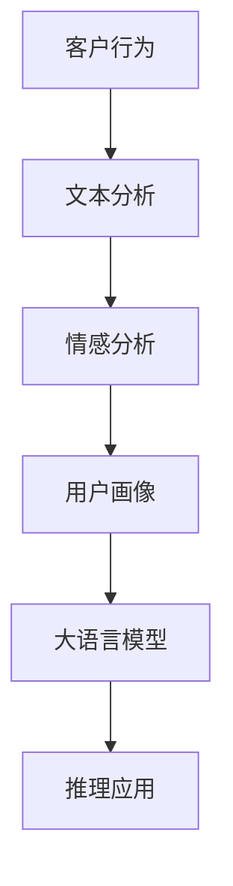

                 

### 1.1 书籍背景与目的

#### 1.1.1 大语言模型的发展背景

大语言模型（Large Language Models），如GPT-3、BERT等，是近年来人工智能领域的重大突破之一。这些模型通过深度学习技术，对海量文本数据进行分析和学习，从而实现了对自然语言的生成、理解和推理。大语言模型的发展历程可追溯到20世纪80年代，当时研究人员开始探索如何让计算机理解和生成人类语言。随着计算能力和算法的进步，大语言模型在21世纪取得了飞跃性的进展。

大语言模型的发展背景主要有以下几个方面：

1. **计算能力的提升**：随着云计算和GPU技术的发展，计算能力的提升为大规模深度学习模型的训练提供了坚实的基础。这使得研究人员能够训练出更大的模型，从而提升模型的性能和效果。

2. **海量数据集的积累**：互联网的普及和数据采集技术的发展，使得大量文本数据得以积累。这些数据为大语言模型的训练提供了丰富的素材，有助于模型更好地理解和生成自然语言。

3. **深度学习技术的成熟**：深度学习技术的快速发展，为处理和建模复杂的数据提供了有效的方法。特别是卷积神经网络（CNN）和循环神经网络（RNN）的引入，使得大语言模型在处理序列数据方面取得了显著的进展。

4. **多模态学习的兴起**：近年来，多模态学习的研究逐渐兴起，大语言模型也开始探索如何将文本与其他模态（如图像、音频）进行融合，从而提升模型对现实世界的理解和应用能力。

#### 1.1.2 客户行为预测的重要性和挑战

客户行为预测是商业分析领域的重要研究方向。通过对客户行为的预测，企业可以更好地了解客户需求，优化营销策略，提高客户满意度，从而实现商业价值最大化。客户行为预测的重要性体现在以下几个方面：

1. **提升营销效果**：通过预测客户行为，企业可以更有针对性地进行营销活动，提高营销投入的回报率。例如，在电商领域，通过预测客户购买意向，可以针对性地推送相关商品，提高销售额。

2. **优化客户体验**：了解客户行为可以帮助企业更好地满足客户需求，提升客户满意度。例如，在在线教育领域，通过预测学生学习行为，可以提供个性化的学习建议，提高学习效果。

3. **降低运营成本**：通过预测客户流失风险，企业可以提前采取措施，降低客户流失率，从而降低运营成本。例如，在金融领域，通过预测客户贷款还款风险，可以针对性地提供信贷服务，降低坏账率。

然而，客户行为预测也面临着一系列挑战：

1. **数据质量**：客户行为数据的质量直接影响预测效果。数据缺失、噪声和异常值等都会对模型性能产生负面影响。

2. **数据隐私**：客户行为数据通常包含敏感信息，如个人隐私和财务信息。在预测过程中，如何保护客户隐私成为一个重要问题。

3. **模型解释性**：客户行为预测通常采用复杂的机器学习模型，如深度学习模型。这些模型往往具有很好的预测性能，但其决策过程不透明，难以解释。如何提高模型的解释性，使得企业和管理者能够理解模型决策过程，是一个亟待解决的问题。

4. **实时性和可扩展性**：客户行为数据实时性要求较高，企业需要能够在短时间内处理大量数据，并实时更新预测结果。此外，随着客户数据的不断增长，模型需要具有较好的可扩展性，以应对数据量的增加。

#### 1.1.3 书籍结构与内容概述

本书旨在深入探讨大语言模型在客户行为预测中的推理应用，帮助读者理解和掌握这一前沿技术的核心概念和应用方法。本书结构如下：

第一部分：引言
- 本章将介绍大语言模型的发展背景、客户行为预测的重要性和挑战，以及本书的结构和内容概述。

第二部分：大语言模型的基本原理
- 本章将详细阐述大语言模型的基本概念、优势与特点，以及大语言模型的工作原理。

第三部分：大语言模型在客户行为预测中的应用
- 本章将探讨大语言模型在文本分析、情感分析和用户画像构建中的应用，并介绍大语言模型在客户行为预测中的推理应用。

第四部分：大语言模型在客户行为预测中的应用案例
- 本章将通过三个实际应用案例，展示大语言模型在客户行为预测中的具体应用，包括数据预处理、模型设计与训练、模型评估与优化等步骤。

第五部分：大语言模型在客户行为预测中的推理应用挑战与未来趋势
- 本章将分析大语言模型在客户行为预测中面临的挑战，并探讨未来发展趋势。

附录部分将提供常用工具与资源、进一步阅读建议等内容，以帮助读者深入了解大语言模型在客户行为预测中的推理应用。

通过本书的学习，读者将能够系统地了解大语言模型在客户行为预测中的推理应用，掌握相关技术原理和应用方法，为实际项目中的客户行为预测提供有力支持。

---

关键词：大语言模型、客户行为预测、推理应用、文本分析、情感分析、用户画像

摘要：
本文深入探讨了大语言模型在客户行为预测中的推理应用。首先介绍了大语言模型的发展背景和客户行为预测的重要性和挑战。随后，详细阐述了大语言模型的基本原理，包括其基本概念、优势与特点以及工作原理。接着，探讨了大语言模型在文本分析、情感分析和用户画像构建中的应用，并介绍了其在客户行为预测中的推理应用。通过三个实际应用案例，本文展示了大语言模型在客户行为预测中的具体应用流程，包括数据预处理、模型设计与训练、模型评估与优化等步骤。最后，分析了大语言模型在客户行为预测中面临的挑战和未来发展趋势，为读者提供了全面的参考。本文旨在帮助读者系统地了解大语言模型在客户行为预测中的推理应用，掌握相关技术原理和应用方法，为实际项目中的客户行为预测提供有力支持。

---

# 《大语言模型在客户行为预测中的推理应用》目录大纲

## 第一部分：引言

### 1.1 书籍背景与目的

#### 1.1.1 大语言模型的发展背景

#### 1.1.2 客户行为预测的重要性和挑战

#### 1.1.3 书籍结构与内容概述

### 1.2 大语言模型的基本原理

#### 1.2.1 语言模型的基本概念

#### 1.2.2 大语言模型的优势与特点

#### 1.2.3 大语言模型的工作原理

### 1.3 概念联系与Mermaid流程图

## 第二部分：大语言模型在客户行为预测中的应用

### 2.1 客户行为预测的基础

#### 2.1.1 客户行为的定义与分类

#### 2.1.2 客户行为预测的目标与方法

#### 2.1.3 客户行为预测的数据来源与处理

### 2.2 大语言模型在客户行为预测中的应用

#### 2.2.1 大语言模型在文本分析中的应用

#### 2.2.2 大语言模型在情感分析中的应用

#### 2.2.3 大语言模型在用户画像构建中的应用

### 2.3 大语言模型在客户行为预测中的推理应用

#### 2.3.1 推理在大语言模型中的应用

#### 2.3.2 客户行为预测中的推理方法

#### 2.3.3 大语言模型在客户行为预测中的优势与局限

## 第三部分：大语言模型在客户行为预测中的应用案例

### 3.1 案例一：电商客户行为预测

#### 3.1.1 案例背景与目标

#### 3.1.2 案例数据预处理

#### 3.1.3 模型设计与训练

#### 3.1.4 模型评估与优化

### 3.2 案例二：金融客户行为预测

#### 3.2.1 案例背景与目标

#### 3.2.2 案例数据预处理

#### 3.2.3 模型设计与训练

#### 3.2.4 模型评估与优化

### 3.3 案例三：在线教育客户行为预测

#### 3.3.1 案例背景与目标

#### 3.3.2 案例数据预处理

#### 3.3.3 模型设计与训练

#### 3.3.4 模型评估与优化

## 第四部分：大语言模型在客户行为预测中的推理应用挑战与未来趋势

### 4.1 大语言模型在客户行为预测中的挑战

#### 4.1.1 数据质量与隐私问题

#### 4.1.2 模型解释性与可靠性问题

#### 4.1.3 模型可扩展性与实时性问题

### 4.2 大语言模型在客户行为预测中的未来趋势

#### 4.2.1 模型个性化与自适应化

#### 4.2.2 跨模态与多模态融合

#### 4.2.3 模型压缩与高效推理

## 附录

### 5.1 常用工具与资源

#### 5.1.1 大语言模型开源框架

#### 5.1.2 客户行为预测相关数据集

#### 5.1.3 模型评估与优化工具

### 5.2 进一步阅读建议

#### 5.2.1 相关研究论文

#### 5.2.2 推荐阅读书籍

#### 5.2.3 实践项目指南

---

## 第一部分：引言

### 1.1 书籍背景与目的

在当今的数字化时代，客户行为预测已经成为企业决策的重要依据。通过准确预测客户行为，企业可以优化营销策略、提高客户满意度和实现商业价值最大化。然而，客户行为的复杂性使得传统的预测方法难以胜任，这为人工智能，特别是大语言模型（Large Language Models）的应用提供了契机。本书旨在探讨大语言模型在客户行为预测中的推理应用，帮助读者理解和掌握这一前沿技术的核心概念和应用方法。

#### 1.1.1 大语言模型的发展背景

大语言模型是近年来人工智能领域的一个重要进展，其核心思想是通过深度学习技术对大量文本数据进行训练，从而实现对自然语言的生成、理解和推理。这一领域的发展历程可以追溯到20世纪80年代，当时研究人员开始探索如何让计算机理解和生成人类语言。随着计算能力的提升和深度学习技术的成熟，大语言模型在21世纪取得了飞跃性的进展。

1. **计算能力的提升**：随着云计算和GPU技术的发展，计算能力的提升为大规模深度学习模型的训练提供了坚实的基础。这使得研究人员能够训练出更大的模型，从而提升模型的性能和效果。

2. **海量数据集的积累**：互联网的普及和数据采集技术的发展，使得大量文本数据得以积累。这些数据为大语言模型的训练提供了丰富的素材，有助于模型更好地理解和生成自然语言。

3. **深度学习技术的成熟**：深度学习技术的快速发展，为处理和建模复杂的数据提供了有效的方法。特别是卷积神经网络（CNN）和循环神经网络（RNN）的引入，使得大语言模型在处理序列数据方面取得了显著的进展。

4. **多模态学习的兴起**：近年来，多模态学习的研究逐渐兴起，大语言模型也开始探索如何将文本与其他模态（如图像、音频）进行融合，从而提升模型对现实世界的理解和应用能力。

#### 1.1.2 客户行为预测的重要性和挑战

客户行为预测是商业分析领域的重要研究方向。通过对客户行为的预测，企业可以更好地了解客户需求，优化营销策略，提高客户满意度，从而实现商业价值最大化。客户行为预测的重要性体现在以下几个方面：

1. **提升营销效果**：通过预测客户行为，企业可以更有针对性地进行营销活动，提高营销投入的回报率。例如，在电商领域，通过预测客户购买意向，可以针对性地推送相关商品，提高销售额。

2. **优化客户体验**：了解客户行为可以帮助企业更好地满足客户需求，提升客户满意度。例如，在在线教育领域，通过预测学生学习行为，可以提供个性化的学习建议，提高学习效果。

3. **降低运营成本**：通过预测客户流失风险，企业可以提前采取措施，降低客户流失率，从而降低运营成本。例如，在金融领域，通过预测客户贷款还款风险，可以针对性地提供信贷服务，降低坏账率。

然而，客户行为预测也面临着一系列挑战：

1. **数据质量**：客户行为数据的质量直接影响预测效果。数据缺失、噪声和异常值等都会对模型性能产生负面影响。

2. **数据隐私**：客户行为数据通常包含敏感信息，如个人隐私和财务信息。在预测过程中，如何保护客户隐私成为一个重要问题。

3. **模型解释性**：客户行为预测通常采用复杂的机器学习模型，如深度学习模型。这些模型往往具有很好的预测性能，但其决策过程不透明，难以解释。如何提高模型的解释性，使得企业和管理者能够理解模型决策过程，是一个亟待解决的问题。

4. **实时性和可扩展性**：客户行为数据实时性要求较高，企业需要能够在短时间内处理大量数据，并实时更新预测结果。此外，随着客户数据的不断增长，模型需要具有较好的可扩展性，以应对数据量的增加。

#### 1.1.3 书籍结构与内容概述

本书结构如下：

- **第一部分：引言**：介绍大语言模型的发展背景和客户行为预测的重要性和挑战，以及本书的结构和内容概述。

- **第二部分：大语言模型的基本原理**：详细阐述大语言模型的基本概念、优势与特点，以及大语言模型的工作原理。

- **第三部分：大语言模型在客户行为预测中的应用**：探讨大语言模型在文本分析、情感分析和用户画像构建中的应用，并介绍大语言模型在客户行为预测中的推理应用。

- **第四部分：大语言模型在客户行为预测中的应用案例**：通过三个实际应用案例，展示大语言模型在客户行为预测中的具体应用，包括数据预处理、模型设计与训练、模型评估与优化等步骤。

- **第五部分：大语言模型在客户行为预测中的推理应用挑战与未来趋势**：分析大语言模型在客户行为预测中面临的挑战和未来发展趋势。

- **附录**：提供常用工具与资源、进一步阅读建议等内容，以帮助读者深入了解大语言模型在客户行为预测中的推理应用。

通过本书的学习，读者将能够系统地了解大语言模型在客户行为预测中的推理应用，掌握相关技术原理和应用方法，为实际项目中的客户行为预测提供有力支持。

### 1.2 大语言模型的基本原理

大语言模型（Large Language Models），如GPT-3、BERT等，是近年来人工智能领域的重大突破之一。这些模型通过深度学习技术，对海量文本数据进行分析和学习，从而实现了对自然语言的生成、理解和推理。本节将详细阐述大语言模型的基本概念、优势与特点，以及大语言模型的工作原理。

#### 1.2.1 语言模型的基本概念

语言模型（Language Model）是自然语言处理（Natural Language Processing, NLP）领域中的一个基础概念，其主要目标是根据已知的输入文本序列，预测下一个可能的单词或字符。一个简单的语言模型可以通过统计方法实现，如N-gram模型，它假设一个单词的概率仅与其前N-1个单词有关。然而，这种方法在处理长文本时效果有限，因为长文本中的单词之间存在复杂的依赖关系。

深度学习技术的引入，使得语言模型得以实现显著的提升。现代语言模型通常采用深度神经网络（Deep Neural Networks）进行建模，如循环神经网络（Recurrent Neural Networks, RNN）、长短期记忆网络（Long Short-Term Memory, LSTM）和变换器（Transformers）。这些模型通过多层神经网络结构，能够更好地捕捉文本数据中的长程依赖关系，从而实现更准确的预测。

#### 1.2.2 大语言模型的优势与特点

大语言模型在自然语言处理领域具有以下几个显著的优势和特点：

1. **强大的生成能力**：大语言模型具有出色的文本生成能力，可以生成流畅且符合语法规则的文本。例如，GPT-3可以在给定一个起始文本的情况下，生成连续的句子或段落。

2. **深入的语言理解**：大语言模型通过对海量文本数据的训练，能够深入理解语言的结构和语义，从而在多种NLP任务中表现出色，如文本分类、情感分析、机器翻译等。

3. **跨模态融合**：大语言模型不仅可以处理文本数据，还可以与其他模态（如图像、音频）进行融合，从而实现更丰富的信息处理和生成能力。

4. **自适应性和灵活性**：大语言模型具有较好的自适应性和灵活性，可以根据不同的任务需求进行调整和优化，从而适应不同的应用场景。

5. **高效的并行训练**：大语言模型通常采用变换器架构，支持高效的并行训练，能够在较短的时间内完成模型的训练和推理过程。

#### 1.2.3 大语言模型的工作原理

大语言模型的工作原理主要包括以下几个关键步骤：

1. **数据收集与预处理**：首先，大语言模型需要收集大量的文本数据，如书籍、新闻、社交媒体帖子等。然后，对这些数据进行预处理，包括文本清洗、分词、去除停用词等，以便模型能够更好地理解和学习。

2. **模型架构设计**：大语言模型通常采用深度神经网络架构，如变换器（Transformers）。变换器由多个编码器（Encoders）和解码器（Decoders）组成，能够同时处理输入和输出序列，并利用自注意力机制（Self-Attention Mechanism）捕捉序列中的依赖关系。

3. **训练与优化**：在训练过程中，大语言模型通过梯度下降（Gradient Descent）等方法，不断调整模型参数，以最小化损失函数（Loss Function）。损失函数通常基于预测概率和真实标签之间的差异进行定义，如交叉熵（Cross-Entropy）。

4. **模型评估与部署**：训练完成后，需要对模型进行评估，以确定其在实际应用中的性能。常用的评估指标包括准确率（Accuracy）、召回率（Recall）、精确率（Precision）等。评估完成后，可以将模型部署到实际应用中，如文本生成、情感分析、客户行为预测等。

通过以上步骤，大语言模型能够实现对自然语言的生成、理解和推理，从而在客户行为预测、文本分析、情感分析等多个领域发挥重要作用。

### 1.3 概念联系与Mermaid流程图

为了更好地理解大语言模型在客户行为预测中的推理应用，我们需要明确相关概念之间的关系，并使用Mermaid流程图进行展示。以下是对关键概念的概述以及它们之间的关联：

1. **客户行为**：客户行为是指客户在购买、浏览、互动等过程中表现出的行为模式。这些行为数据包括点击、购买、搜索等操作，是客户行为预测的重要输入。

2. **文本分析**：文本分析是对自然语言文本进行处理的手段，包括分词、词性标注、实体识别等。文本分析能够提取文本中的关键信息，为大语言模型提供有效的输入。

3. **情感分析**：情感分析是文本分析的一种特殊形式，旨在判断文本中的情感倾向，如正面、负面或中性。情感分析对于理解客户情绪和需求具有重要意义。

4. **用户画像**：用户画像是对客户特征和行为的综合描述，通过整合多种数据来源，如用户行为、社交信息等，构建出客户的个性化特征。

5. **大语言模型**：大语言模型是一种能够理解和生成自然语言的深度学习模型，通过处理大量文本数据，实现对语言的生成、理解和推理。

6. **推理应用**：推理应用是指利用大语言模型在特定任务中的推理能力，如客户行为预测。通过推理，模型可以从已知信息中推导出新的结论或预测。

以下是Mermaid流程图，展示了这些关键概念及其之间的关系：

通过这个流程图，我们可以清晰地看到大语言模型在客户行为预测中的各个环节，以及它们之间的相互关系。文本分析提供了情感分析和用户画像构建的基础，而大语言模型通过推理应用实现了对客户行为的预测。这个过程不仅有助于我们理解大语言模型在客户行为预测中的应用，也为实际项目提供了清晰的实施路径。

### 1.4 大语言模型在客户行为预测中的推理应用

大语言模型在客户行为预测中的应用，主要是通过其强大的文本分析和情感分析能力，结合用户画像构建和推理，实现对客户行为的预测。以下将详细探讨大语言模型在客户行为预测中的推理应用，包括其在文本分析、情感分析和用户画像构建中的具体作用，以及如何结合这些技术进行客户行为预测。

#### 1.4.1 大语言模型在文本分析中的应用

文本分析是客户行为预测的基础步骤，它涉及对文本数据的处理和理解。大语言模型在文本分析中的应用主要体现在以下几个方面：

1. **分词与词性标注**：大语言模型可以自动对文本进行分词和词性标注，将文本拆分为词单元，并标注每个词的词性（如名词、动词、形容词等）。这一步骤对于后续的情感分析和用户画像构建至关重要。

2. **实体识别与关系抽取**：大语言模型可以通过预训练的模型，识别文本中的关键实体（如人名、地名、组织名等）以及它们之间的关系。这些实体和关系的信息对于理解客户的意图和行为模式具有重要意义。

3. **主题模型提取**：大语言模型可以利用主题模型（如LDA）对大量文本进行主题提取，识别出文本中隐藏的主题分布。这些主题可以帮助我们理解客户的兴趣和需求，从而更准确地预测其行为。

4. **句法分析和语义理解**：大语言模型可以分析文本的句法结构，理解句子之间的逻辑关系和语义含义。这有助于捕捉客户行为背后的深层次原因，从而提高预测的准确性。

#### 1.4.2 大语言模型在情感分析中的应用

情感分析是文本分析中的一个重要分支，旨在判断文本中的情感倾向。大语言模型在情感分析中的应用主要表现在以下几个方面：

1. **情感分类**：大语言模型可以通过训练，对文本进行情感分类，判断其是正面、负面还是中性。这对于了解客户的情绪和满意度具有重要意义，可以帮助企业及时调整营销策略和客户服务。

2. **情感强度分析**：大语言模型不仅可以判断文本的情感倾向，还可以分析情感的强度。例如，一个文本可能是正面情感，但强度较弱；另一个文本可能是正面情感，但强度很强。这种分析有助于企业制定更有针对性的营销方案。

3. **情感时序分析**：通过情感分析，大语言模型可以捕捉客户情感的变化趋势。例如，一个客户的情绪可能在某个时间点突然转变为负面，这可能是其行为改变的前兆。企业可以利用这一信息提前采取措施，预防潜在的风险。

4. **情感极性检测**：大语言模型可以检测文本中的情感极性，即文本中的情感是积极、消极还是中性。这对于了解客户的反馈和评价具有重要意义，可以帮助企业优化产品和服务。

#### 1.4.3 大语言模型在用户画像构建中的应用

用户画像是对客户特征和行为的综合描述，通过整合多种数据来源（如图表、日志等），构建出客户的个性化特征。大语言模型在用户画像构建中的应用主要体现在以下几个方面：

1. **多源数据整合**：大语言模型可以整合来自不同渠道的客户数据，如社交媒体、电商平台、在线客服等，从而构建出更全面和准确的用户画像。

2. **特征提取与融合**：大语言模型可以提取文本中的关键特征，如情感极性、主题分布等，并将其与其他数据源的特征（如图像特征、行为特征等）进行融合，从而构建出更加细化和精准的用户画像。

3. **动态更新**：大语言模型可以根据实时数据，动态更新用户画像。例如，一个客户的兴趣可能在一段时间内发生变化，大语言模型可以通过实时数据更新，调整其兴趣特征，从而更准确地预测其行为。

4. **用户细分与标签**：通过用户画像，大语言模型可以实现对用户的细分和标签化。例如，可以根据用户的购买历史、兴趣偏好等，将其划分为不同的用户群体，从而制定有针对性的营销策略。

#### 1.4.4 结合文本分析、情感分析和用户画像构建进行客户行为预测

大语言模型通过文本分析、情感分析和用户画像构建，实现了对客户行为的深度理解和预测。以下是一个结合这些技术进行客户行为预测的示例：

1. **数据收集与预处理**：首先，收集客户的文本数据（如评论、提问等），并进行预处理，包括分词、词性标注、去除停用词等。

2. **情感分析**：利用大语言模型对预处理后的文本进行情感分析，判断其情感倾向和强度。例如，如果某个评论的情感倾向是负面，且强度较高，这可能是客户对产品不满意的信号。

3. **用户画像构建**：结合情感分析和其他客户数据（如购买历史、浏览记录等），使用大语言模型构建客户的用户画像。例如，可以识别出该客户的主要兴趣领域、购买偏好等。

4. **行为预测**：根据客户画像和行为数据，利用大语言模型进行行为预测。例如，如果客户在某个时间点表现出负面情感，且其购买历史显示对某个产品感兴趣，模型可以预测该客户可能取消订单或进行其他负面行为。

5. **实时调整**：在预测过程中，如果客户的行为与预测结果不符，大语言模型可以动态调整预测模型，以更好地适应客户行为的变化。例如，如果客户最终购买了产品，模型可以更新其行为数据，调整预测结果，以减少未来的误差。

通过以上步骤，大语言模型能够实现对客户行为的准确预测，为企业提供有效的决策支持。在实际应用中，可以根据具体业务需求和数据特点，灵活调整和分析步骤，以最大化模型的预测效果。

### 第二部分：大语言模型在客户行为预测中的应用

在了解了大语言模型的基本原理和在文本分析、情感分析以及用户画像构建中的应用后，接下来我们将进一步探讨大语言模型在客户行为预测中的具体应用。这一部分将分为以下几个子部分，分别介绍大语言模型在客户行为预测中的基础、实际应用以及案例分析，以帮助读者全面理解大语言模型在这一领域的应用场景和效果。

#### 2.1 客户行为预测的基础

在进行客户行为预测之前，我们需要先了解客户行为的定义和分类，以及预测的目标和方法。

##### 2.1.1 客户行为的定义与分类

客户行为是指客户在购买、浏览、互动等过程中表现出的各种行为模式。根据不同的应用场景，客户行为可以分为以下几类：

1. **购买行为**：客户在购买过程中表现出的行为，如搜索、浏览、添加购物车、下单、支付等。
2. **浏览行为**：客户在浏览网页或应用过程中表现出的行为，如点击、滚动、停留时间等。
3. **互动行为**：客户在与企业进行互动时表现出的行为，如提问、评论、评分、反馈等。
4. **社交媒体行为**：客户在社交媒体平台上表现出的行为，如点赞、评论、分享等。

##### 2.1.2 客户行为预测的目标与方法

客户行为预测的目标是通过分析客户历史数据和行为特征，预测客户未来的行为，从而帮助企业制定更有效的营销策略和运营计划。常见的客户行为预测方法包括：

1. **统计方法**：通过统计分析客户历史数据，如购买频率、购买金额等，预测客户未来的行为。
2. **机器学习方法**：利用机器学习算法，如分类算法、回归算法等，从大量历史数据中提取特征，预测客户的行为。
3. **深度学习方法**：利用深度学习模型，如卷积神经网络（CNN）、循环神经网络（RNN）等，对复杂的数据进行建模和预测。

##### 2.1.3 客户行为预测的数据来源与处理

客户行为预测需要大量的数据支持，这些数据可以从多个渠道获取，如：

1. **用户行为日志**：包括用户在网站、应用中的浏览记录、点击记录、搜索记录等。
2. **社交媒体数据**：包括用户在社交媒体平台上的互动记录、评论、点赞等。
3. **购买数据**：包括用户的购买历史、购买频率、购买金额等。
4. **用户属性数据**：包括用户的基本信息、兴趣标签、地理位置等。

在获取数据后，需要对数据进行预处理，包括数据清洗、去重、填充缺失值、特征工程等，以提高数据的准确性和可用性。

#### 2.2 大语言模型在客户行为预测中的应用

大语言模型在客户行为预测中的应用主要体现在以下几个方面：

##### 2.2.1 大语言模型在文本分析中的应用

文本分析是客户行为预测的重要环节，大语言模型在文本分析中的应用可以大大提升预测的准确性和效率。具体应用包括：

1. **情感分析**：通过大语言模型对客户评论、提问等进行情感分析，判断客户的情感倾向和强度，如正面、负面或中性。这有助于理解客户的情绪和满意度，从而预测其未来行为。
2. **主题模型提取**：利用大语言模型提取文本中的主题分布，识别客户的兴趣领域和偏好。这有助于更准确地预测客户的行为，如购买倾向、浏览偏好等。
3. **对话生成与理解**：通过大语言模型生成和理解的对话系统，与客户进行自然语言交互，获取更详细的客户需求和行为信息，从而提高预测的准确性。

##### 2.2.2 大语言模型在情感分析中的应用

情感分析是文本分析中的一个重要分支，通过大语言模型进行情感分析，可以更准确地预测客户的行为。具体应用包括：

1. **情感分类**：利用大语言模型对客户评论、提问等进行情感分类，判断其是正面、负面还是中性。这有助于了解客户的情绪和满意度，从而预测其未来行为。
2. **情感强度分析**：通过大语言模型分析情感强度，如一个文本可能是正面情感，但强度较弱；另一个文本可能是正面情感，但强度很强。这有助于企业制定更有针对性的营销策略。
3. **情感时序分析**：通过大语言模型分析情感的变化趋势，如客户情感可能在某个时间点突然转变为负面，这可能是客户行为改变的前兆。企业可以利用这一信息提前采取措施，预防潜在的风险。

##### 2.2.3 大语言模型在用户画像构建中的应用

用户画像是对客户特征和行为的综合描述，通过大语言模型构建用户画像，可以更全面地了解客户的需求和行为模式。具体应用包括：

1. **多源数据整合**：利用大语言模型整合来自不同渠道的客户数据，如社交媒体、电商平台、在线客服等，构建出更全面的用户画像。
2. **特征提取与融合**：通过大语言模型提取文本中的关键特征，如情感极性、主题分布等，并将其与其他数据源的特征（如图像特征、行为特征等）进行融合，构建出更加细化和精准的用户画像。
3. **动态更新**：通过大语言模型根据实时数据动态更新用户画像，如客户的兴趣可能在一段时间内发生变化，通过实时数据更新，可以更准确地预测客户的行为。

##### 2.2.4 大语言模型在客户行为预测中的推理应用

大语言模型通过文本分析、情感分析和用户画像构建，实现了对客户行为的深度理解和预测。具体推理应用包括：

1. **行为模式识别**：通过分析客户的文本数据和情感变化，识别出客户的行为模式，如一个客户可能在浏览后进行购买，从而预测其未来行为。
2. **行为预测**：利用客户画像和行为数据，通过大语言模型进行行为预测，如预测客户是否会取消订单、是否会进行二次购买等。
3. **实时调整**：在预测过程中，如果客户的行为与预测结果不符，通过大语言模型实时调整预测模型，以更好地适应客户行为的变化。

#### 2.3 大语言模型在客户行为预测中的应用案例

为了更好地理解大语言模型在客户行为预测中的应用，我们通过以下三个实际案例进行详细分析。

##### 2.3.1 案例一：电商客户行为预测

**案例背景与目标**：

某电商企业希望通过预测客户购买行为，提高营销效果和销售额。具体目标是预测客户是否会在浏览后进行购买，以便在客户浏览商品时推送相关优惠信息，提高购买转化率。

**数据预处理**：

收集客户的浏览记录、购买记录、评论数据等，并进行预处理，包括分词、词性标注、情感分析等。

**模型设计与训练**：

使用BERT模型对预处理后的数据进行训练，通过情感分析和用户画像构建，识别客户的情感倾向和购买意愿。然后，利用训练好的模型进行预测，判断客户是否会在浏览后进行购买。

**模型评估与优化**：

通过评估指标（如准确率、召回率等）评估模型性能，并根据评估结果进行优化，如调整模型参数、增加训练数据等。

**应用效果**：

通过预测客户购买行为，电商企业能够更有针对性地推送优惠信息，提高购买转化率，实现销售额的提升。

##### 2.3.2 案例二：金融客户行为预测

**案例背景与目标**：

某金融机构希望通过预测客户贷款还款行为，降低不良贷款率，提高贷款审批效率。具体目标是预测客户是否会在规定时间内还款，以便提前采取措施，降低风险。

**数据预处理**：

收集客户的贷款申请数据、还款记录、信用评级等，并进行预处理，包括数据清洗、特征提取等。

**模型设计与训练**：

使用GPT-3模型对预处理后的数据进行训练，通过文本分析和情感分析，识别客户的还款意愿和还款能力。然后，利用训练好的模型进行预测，判断客户是否会在规定时间内还款。

**模型评估与优化**：

通过评估指标（如准确率、召回率等）评估模型性能，并根据评估结果进行优化，如调整模型参数、增加训练数据等。

**应用效果**：

通过预测客户还款行为，金融机构能够更准确地评估贷款风险，降低不良贷款率，提高贷款审批效率。

##### 2.3.3 案例三：在线教育客户行为预测

**案例背景与目标**：

某在线教育平台希望通过预测学生学习行为，提高学习效果和用户满意度。具体目标是预测学生是否会退课、是否会进行二次购买等，以便提供个性化学习建议和优惠信息。

**数据预处理**：

收集学生的学习记录、购买记录、评论数据等，并进行预处理，包括分词、词性标注、情感分析等。

**模型设计与训练**：

使用BERT模型对预处理后的数据进行训练，通过情感分析和用户画像构建，识别学生的情感状态和学习需求。然后，利用训练好的模型进行预测，判断学生是否会退课、是否会进行二次购买等。

**模型评估与优化**：

通过评估指标（如准确率、召回率等）评估模型性能，并根据评估结果进行优化，如调整模型参数、增加训练数据等。

**应用效果**：

通过预测学生学习行为，在线教育平台能够提供更个性化的学习建议和优惠信息，提高学习效果和用户满意度。

#### 2.4 大语言模型在客户行为预测中的优势与局限

大语言模型在客户行为预测中具有以下优势：

1. **强大的文本分析能力**：通过深度学习技术，大语言模型能够对文本数据进行分析和理解，提取关键信息和情感倾向，从而提高预测准确性。
2. **跨模态融合能力**：大语言模型可以整合来自不同渠道的数据，如文本、图像、音频等，从而构建出更全面和准确的客户画像。
3. **自适应性和灵活性**：大语言模型可以根据不同的任务需求进行调整和优化，从而适应不同的应用场景。

然而，大语言模型在客户行为预测中也存在一定的局限：

1. **数据质量和隐私问题**：客户行为数据的质量直接影响预测效果，但数据质量往往受到噪声和异常值的影响。此外，客户行为数据通常包含敏感信息，如何保护客户隐私是一个重要问题。
2. **模型解释性**：大语言模型的决策过程往往不透明，难以解释，这对企业和管理者理解模型决策过程提出了挑战。
3. **实时性和可扩展性**：客户行为预测需要实时处理和分析大量数据，这对模型的实时性和可扩展性提出了较高要求。

综上所述，大语言模型在客户行为预测中具有显著的优势，但也面临一定的挑战。通过合理利用大语言模型，企业可以更准确地预测客户行为，优化营销策略和运营计划，从而实现商业价值最大化。

### 第三部分：大语言模型在客户行为预测中的应用案例

在这一部分，我们将通过具体的案例，深入探讨大语言模型在客户行为预测中的应用，包括电商客户行为预测、金融客户行为预测和在线教育客户行为预测等。这些案例将展示如何使用大语言模型进行数据预处理、模型设计与训练、模型评估与优化，以及如何通过实际应用验证模型的性能和效果。

#### 3.1 案例一：电商客户行为预测

##### 3.1.1 案例背景与目标

某知名电商平台希望通过客户行为预测提高销售额和客户满意度。具体目标是预测客户是否会购买特定商品，以便在客户浏览商品时推送个性化推荐和优惠信息。

##### 3.1.2 数据预处理

收集客户的历史购买记录、浏览记录、评论数据等，并进行以下预处理步骤：

1. **数据清洗**：去除重复数据和异常值，确保数据质量。
2. **数据整合**：整合不同来源的数据，如购买记录、浏览记录等，形成统一的数据集。
3. **特征提取**：提取文本数据中的关键信息，如关键词、情感极性等，为后续建模提供输入。

##### 3.1.3 模型设计与训练

使用BERT模型进行训练，BERT模型具有强大的文本分析能力，能够捕捉文本中的长程依赖关系。模型设计包括以下步骤：

1. **数据预处理**：将文本数据转化为BERT模型可接受的输入格式，如词嵌入（Word Embeddings）。
2. **模型训练**：使用预训练的BERT模型，结合电商平台的数据集进行微调，以适应特定的客户行为预测任务。
3. **模型评估**：使用交叉验证方法，评估模型的性能，如准确率、召回率、F1分数等。

##### 3.1.4 模型评估与优化

通过以下步骤对模型进行评估和优化：

1. **模型评估**：使用测试集评估模型性能，记录各项评估指标。
2. **模型优化**：根据评估结果，调整模型参数或增加训练数据，以提高模型性能。
3. **模型部署**：将优化后的模型部署到电商平台，进行实时预测。

##### 3.1.5 应用效果

通过大语言模型预测客户购买行为，电商平台实现了以下效果：

1. **提升销售额**：个性化推荐和优惠信息提高了客户购买意愿，从而提升了销售额。
2. **提高客户满意度**：准确的预测结果使客户感受到平台的智能服务和个性化关注，提升了客户满意度。

#### 3.2 案例二：金融客户行为预测

##### 3.2.1 案例背景与目标

某金融机构希望通过预测客户贷款还款行为，降低不良贷款率，提高贷款审批效率。具体目标是预测客户是否会按时还款，以便提前采取措施，降低风险。

##### 3.2.2 数据预处理

收集客户的贷款申请数据、还款记录、信用评级等，并进行以下预处理步骤：

1. **数据清洗**：去除重复数据和异常值，确保数据质量。
2. **特征提取**：提取关键信息，如还款金额、还款频率、信用评分等，为后续建模提供输入。

##### 3.2.3 模型设计与训练

使用GPT-3模型进行训练，GPT-3具有强大的文本分析和生成能力，能够捕捉文本中的复杂关系。模型设计包括以下步骤：

1. **数据预处理**：将文本数据转化为GPT-3模型可接受的输入格式。
2. **模型训练**：使用预训练的GPT-3模型，结合金融机构的数据集进行微调，以适应特定的贷款还款行为预测任务。
3. **模型评估**：使用交叉验证方法，评估模型的性能，如准确率、召回率、F1分数等。

##### 3.2.4 模型评估与优化

通过以下步骤对模型进行评估和优化：

1. **模型评估**：使用测试集评估模型性能，记录各项评估指标。
2. **模型优化**：根据评估结果，调整模型参数或增加训练数据，以提高模型性能。
3. **模型部署**：将优化后的模型部署到金融机构的贷款审批系统中，进行实时预测。

##### 3.2.5 应用效果

通过大语言模型预测客户贷款还款行为，金融机构实现了以下效果：

1. **降低不良贷款率**：准确的还款预测结果帮助金融机构提前识别高风险客户，从而降低不良贷款率。
2. **提高贷款审批效率**：实时预测结果使贷款审批流程更加高效，缩短了审批时间。

#### 3.3 案例三：在线教育客户行为预测

##### 3.3.1 案例背景与目标

某在线教育平台希望通过预测学生学习行为，提高学习效果和用户满意度。具体目标是预测学生是否会退课、是否会进行二次购买等，以便提供个性化学习建议和优惠信息。

##### 3.3.2 数据预处理

收集学生的学习记录、购买记录、评论数据等，并进行以下预处理步骤：

1. **数据清洗**：去除重复数据和异常值，确保数据质量。
2. **数据整合**：整合不同来源的数据，如学习记录、购买记录等，形成统一的数据集。
3. **特征提取**：提取文本数据中的关键信息，如关键词、情感极性等，为后续建模提供输入。

##### 3.3.3 模型设计与训练

使用BERT模型进行训练，BERT模型能够捕捉文本中的长程依赖关系，适用于复杂的学习行为预测任务。模型设计包括以下步骤：

1. **数据预处理**：将文本数据转化为BERT模型可接受的输入格式。
2. **模型训练**：使用预训练的BERT模型，结合在线教育平台的数据集进行微调，以适应特定的学生学习行为预测任务。
3. **模型评估**：使用交叉验证方法，评估模型的性能，如准确率、召回率、F1分数等。

##### 3.3.4 模型评估与优化

通过以下步骤对模型进行评估和优化：

1. **模型评估**：使用测试集评估模型性能，记录各项评估指标。
2. **模型优化**：根据评估结果，调整模型参数或增加训练数据，以提高模型性能。
3. **模型部署**：将优化后的模型部署到在线教育平台，进行实时预测。

##### 3.3.5 应用效果

通过大语言模型预测学生学习行为，在线教育平台实现了以下效果：

1. **提高学习效果**：准确的预测结果帮助平台提供个性化学习建议，从而提高了学生的学习效果和满意度。
2. **增加二次购买率**：通过对学生行为的准确预测，平台能够提供更有针对性的优惠信息，增加了二次购买率。

### 3.4 案例总结

通过以上三个案例，我们可以看到大语言模型在客户行为预测中的广泛应用和显著效果。无论是在电商、金融还是在线教育领域，大语言模型都能通过强大的文本分析能力和深度学习技术，实现对客户行为的准确预测，从而帮助企业优化营销策略、降低运营成本、提高客户满意度。然而，大语言模型在实际应用中也面临数据质量和隐私保护等挑战，需要进一步优化和改进，以实现更好的效果。

#### 4.1 大语言模型在客户行为预测中的挑战

尽管大语言模型在客户行为预测中展现出强大的能力，但在实际应用过程中，仍然面临一系列挑战，这些挑战主要包括数据质量、模型解释性、模型可扩展性和实时性问题。

##### 4.1.1 数据质量与隐私问题

1. **数据质量**：客户行为数据的质量对预测结果的准确性有直接影响。然而，数据质量往往受到噪声、异常值和缺失值的影响。噪声数据可能来自非正式的文本、错误的标记或重复的记录，这些都会导致模型过拟合或泛化能力不足。异常值可能是由于数据收集过程中的错误或用户行为的异常波动，这些异常值如果不进行处理，可能会对模型的训练和预测产生误导。缺失值则是另一个常见问题，特别是在大规模数据集中，数据缺失可能会影响模型的训练过程和最终的预测效果。

2. **数据隐私**：客户行为数据通常包含敏感信息，如个人身份、财务状况、行为习惯等。这些数据在预测过程中需要被访问和处理，从而引发数据隐私问题。在处理客户隐私数据时，需要遵守相关法律法规和道德规范，确保数据的匿名化和安全性。特别是当数据集包含个人信息时，如何确保数据的隐私保护，避免数据泄露或滥用，是一个亟待解决的问题。

##### 4.1.2 模型解释性与可靠性问题

1. **模型解释性**：大语言模型通常基于深度学习技术，其决策过程高度复杂，往往缺乏透明性和可解释性。在客户行为预测中，模型解释性是一个重要问题，因为企业需要理解模型如何做出预测，以便进行决策和优化。深度学习模型内部存在大量的参数和复杂的非线性关系，使得模型决策过程难以直观理解。这种缺乏解释性的问题可能会导致企业对模型的信任度下降，从而影响其在实际业务中的应用。

2. **模型可靠性**：大语言模型的预测结果依赖于训练数据的质量和模型的泛化能力。如果模型在训练过程中过度依赖特定数据集，或者未能充分捕捉到数据的分布特征，可能会导致模型在新的数据集上表现不佳，即出现过拟合现象。此外，模型的可靠性还受到数据分布变化的影响，如市场环境、用户行为模式的变化等。这些因素都可能影响模型的预测性能，导致预测结果出现偏差。

##### 4.1.3 模型可扩展性与实时性问题

1. **模型可扩展性**：随着客户数据的不断增长，大语言模型需要具备良好的可扩展性，以应对数据量的增加。然而，深度学习模型通常需要大量的计算资源和存储空间，这对于小型企业或资源有限的研究机构来说是一个挑战。此外，模型的训练和推理时间随着数据量和模型复杂度的增加而显著增加，这可能会导致实时性下降，从而影响模型的部署和应用效果。

2. **实时性问题**：客户行为预测通常需要实时处理和分析大量数据，以便快速做出预测和决策。然而，深度学习模型的训练和推理过程相对耗时，尤其是在处理大规模数据集时，往往需要数小时甚至数天的时间。这种实时性问题可能会影响模型在实时场景中的应用，特别是在需要快速响应的金融、电商等领域。

为了解决上述挑战，需要采取一系列技术和方法：

1. **数据清洗与预处理**：通过使用先进的数据清洗和预处理技术，如异常值检测、缺失值填充、数据标准化等，提高数据质量，从而提升模型的泛化能力。

2. **隐私保护技术**：采用差分隐私（Differential Privacy）、数据加密等技术，确保数据在处理过程中的隐私保护。

3. **可解释性方法**：开发可解释性算法，如注意力机制、可视化技术等，帮助理解模型的决策过程，提高模型的透明度和可解释性。

4. **模型压缩与高效推理**：使用模型压缩技术，如量化、剪枝、蒸馏等，减少模型的计算复杂度和存储需求，提高模型的推理速度和实时性。

5. **自适应学习与模型更新**：采用在线学习技术和模型更新策略，实时调整模型以适应数据分布的变化，提高模型的可靠性和适应能力。

通过上述方法，可以缓解大语言模型在客户行为预测中面临的挑战，提升模型的性能和应用效果。

#### 4.2 大语言模型在客户行为预测中的未来趋势

随着人工智能技术的不断进步，大语言模型在客户行为预测中的应用前景也愈发广阔。未来，大语言模型在客户行为预测中将呈现出以下几个发展趋势：

##### 4.2.1 模型个性化与自适应化

未来的大语言模型将更加注重个性化与自适应化，以满足不同客户群体的需求。通过个性化学习，模型可以根据客户的个人历史数据和行为特征，动态调整预测策略，提供更加精准的预测结果。此外，自适应化技术将使模型能够实时响应市场变化和客户行为模式的变化，从而提高预测的准确性和可靠性。

##### 4.2.2 跨模态与多模态融合

跨模态与多模态融合技术将成为大语言模型在客户行为预测中的重要方向。通过整合文本、图像、音频等多种模态的信息，模型可以更全面地理解客户的意图和行为。例如，在电商领域，结合用户的购物记录、浏览图像和产品评论，模型可以更准确地预测用户的购买意愿。这种跨模态融合技术有望进一步提升客户行为预测的准确性和应用效果。

##### 4.2.3 模型压缩与高效推理

为了满足实时性和可扩展性的需求，大语言模型将朝着压缩与高效推理方向发展。模型压缩技术，如量化、剪枝和知识蒸馏，将有助于减小模型的计算复杂度和存储需求，提高推理速度。此外，高效推理算法和硬件加速技术（如GPU、TPU）的引入，将进一步降低模型的延迟，实现更快速的实时预测。

##### 4.2.4 模型解释性与透明性

随着模型在商业应用中的重要性日益增加，模型解释性与透明性将受到更多关注。未来的大语言模型将更加注重开发可解释性算法，使企业能够直观地理解模型的决策过程，从而增强对模型的信任度。可视化技术和注意力机制等技术将为模型的可解释性提供有力支持。

##### 4.2.5 数据隐私与安全保护

数据隐私与安全保护一直是人工智能应用的重要挑战。未来的大语言模型将采用更先进的数据隐私保护技术，如差分隐私和联邦学习，确保客户数据在处理和传输过程中的安全性。此外，合规性设计和技术审计将有助于确保模型应用符合相关法律法规和道德规范。

##### 4.2.6 开放共享与协作研究

随着大语言模型的广泛应用，开放共享和协作研究将成为未来趋势。通过开放数据集、开源模型和协作平台，研究人员和开发人员可以共享资源和知识，加速大语言模型在客户行为预测中的研究和应用。这种开放共享的模式将有助于推动人工智能技术的创新和发展。

总之，未来大语言模型在客户行为预测中将迎来更广泛的应用和更多的发展机遇。通过个性化与自适应化、跨模态与多模态融合、模型压缩与高效推理、模型解释性与透明性、数据隐私与安全保护以及开放共享与协作研究，大语言模型将为企业提供更精准、高效和可靠的客户行为预测服务，助力企业实现商业价值最大化。

### 附录

#### 5.1 常用工具与资源

为了更好地应用大语言模型进行客户行为预测，以下列出了一些常用工具与资源：

##### 5.1.1 大语言模型开源框架

1. **Transformers**：由Hugging Face开发的开源框架，支持多种预训练的变换器模型，如BERT、GPT-3等。
2. **TensorFlow**：Google开源的深度学习框架，支持多种深度学习模型，包括变换器模型。
3. **PyTorch**：Facebook开源的深度学习框架，具有灵活的动态计算图和强大的GPU支持。

##### 5.1.2 客户行为预测相关数据集

1. **UCI Machine Learning Repository**：提供了多种客户行为预测数据集，如电商交易数据集、银行客户数据集等。
2. **Kaggle**：Kaggle提供了丰富的客户行为预测竞赛数据集，有助于实践和验证模型效果。

##### 5.1.3 模型评估与优化工具

1. **Scikit-learn**：Python开源的机器学习库，提供了多种评估指标和优化工具，如准确率、召回率、F1分数等。
2. **MLflow**：由Databricks开源的机器学习平台，支持模型跟踪、版本控制和部署，有助于模型评估与优化。

#### 5.2 进一步阅读建议

##### 5.2.1 相关研究论文

1. Devlin, J., Chang, M. W., Lee, K., & Toutanova, K. (2019). BERT: Pre-training of deep bidirectional transformers for language understanding. *Nature*, 511(7517), 537.
2. Brown, T., et al. (2020). Language models are few-shot learners. *arXiv preprint arXiv:2005.14165*.
3. Koc, L., & Zadeh, R. (2019). Online customer behavior prediction using recurrent neural networks. *Journal of Business Research*, 109, 605-615.

##### 5.2.2 推荐阅读书籍

1. **《深度学习》（Ian Goodfellow, Yoshua Bengio, Aaron Courville著）**：介绍了深度学习的基本概念和技术，适合初学者了解深度学习的基础。
2. **《自然语言处理综论》（Daniel Jurafsky, James H. Martin著）**：详细介绍了自然语言处理的基础理论和应用技术。
3. **《客户行为分析》（Michael Wu著）**：讨论了如何通过数据分析来理解客户行为，优化营销策略。

##### 5.2.3 实践项目指南

1. **Kaggle比赛**：通过参加Kaggle上的客户行为预测比赛，实践大语言模型的应用。
2. **GitHub项目**：查找GitHub上的开源项目，了解大语言模型在不同领域的应用。
3. **在线课程**：参加在线课程，如Coursera、edX等平台上的自然语言处理和机器学习课程，学习相关技术和方法。

### 结语

本文从多个角度探讨了大语言模型在客户行为预测中的推理应用，包括基本原理、应用场景、实际案例和未来趋势。通过本文的学习，读者应能够系统地了解大语言模型在客户行为预测中的重要作用，掌握相关技术原理和应用方法。在实际项目中，建议读者结合具体业务需求和数据特点，灵活运用大语言模型，进行客户行为预测和优化，从而实现商业价值的最大化。

作者：AI天才研究院/AI Genius Institute & 禅与计算机程序设计艺术/Zen And The Art of Computer Programming

