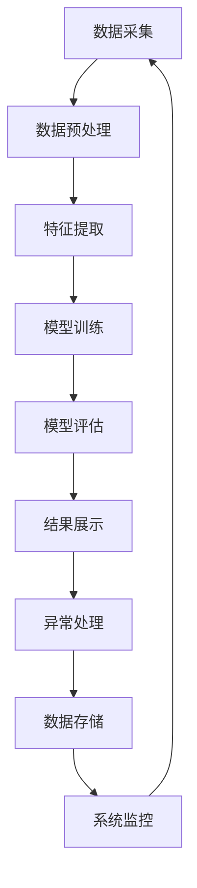

                 


# 大语言模型在智能交通流量预测中的推理应用

## 关键词

- 大语言模型
- 智能交通流量预测
- 变换器模型
- 自注意力机制
- 深度学习
- 交通数据分析

## 摘要

本文旨在探讨大语言模型在智能交通流量预测中的应用及其推理过程。随着城市化进程的加快，交通拥堵问题日益严重，对交通流量进行准确预测对于优化交通管理和提高出行效率具有重要意义。本文首先概述了大语言模型的发展历程和智能交通流量预测的现状，然后分析了大语言模型在交通流量预测中的优势和应用场景。接着，本文详细介绍了大语言模型的基本原理、训练与优化过程，并结合实际应用场景，展示了大语言模型在智能交通流量预测中的具体实现和效果。最后，本文总结了大语言模型在智能交通流量预测中的未来发展趋势和应用前景。

----------------------------------------------------------------

## 第一部分：引言与背景

### 第1章：大语言模型概述

#### 1.1 大语言模型的发展历程

大语言模型（Large Language Model）是一种基于深度学习技术的自然语言处理（Natural Language Processing, NLP）模型，它能够理解和生成自然语言文本。大语言模型的发展历程可以追溯到20世纪50年代，当时科学家们开始尝试使用计算机模拟人类语言处理过程。早期的大语言模型主要是基于规则的方法，如句法分析、语义分析等，但由于规则方法的局限性，难以应对复杂多变的自然语言现象。

随着计算能力的提升和深度学习技术的发展，大语言模型迎来了新的发展机遇。2018年，谷歌推出了BERT（Bidirectional Encoder Representations from Transformers），这是一种基于变换器模型（Transformer）的预训练语言模型。BERT的出现标志着大语言模型进入了一个新的时代，它通过预训练和微调技术在各种NLP任务上取得了显著的性能提升。

近年来，大语言模型得到了进一步的发展，出现了如GPT（Generative Pre-trained Transformer）、T5（Text-to-Text Transfer Transformer）等模型。这些模型具有更高的参数量和更强的表征能力，能够处理更加复杂的语言现象。

#### 1.2 大语言模型的演进路线

大语言模型的演进可以分为以下几个阶段：

1. **词袋模型（Bag of Words, BOW）**：这是最早的大语言模型，它将文本表示为单词的集合，不考虑单词之间的顺序。这种方法简单直观，但忽略了词序信息，导致模型在理解上下文方面存在局限性。

2. **循环神经网络（Recurrent Neural Network, RNN）**：RNN通过循环机制考虑了单词的顺序信息，能够捕捉到一定程度的上下文关系。然而，RNN存在梯度消失和梯度爆炸的问题，难以处理长序列数据。

3. **变换器模型（Transformer）**：变换器模型是2017年由Vaswani等人提出的一种基于自注意力机制的神经网络结构。与RNN不同，变换器模型使用多头自注意力机制和位置编码来捕捉全局上下文信息，避免了梯度消失问题，并取得了显著的性能提升。

4. **预训练与微调**：预训练是指在大规模语料库上对模型进行训练，使模型具备对自然语言的理解能力。微调则是在预训练的基础上，对模型进行特定任务的细粒度调整，以适应不同的NLP任务。

### 1.3 智能交通流量预测的现状

智能交通流量预测是智能交通系统（Intelligent Transportation System, ITS）的重要组成部分，它通过对交通数据的分析和预测，为交通管理和出行规划提供支持。智能交通流量预测的现状可以分为以下几个方面：

1. **数据采集与处理**：交通流量预测的关键在于数据的准确性和完整性。目前，各种传感器技术如地磁传感器、视频监控、车载传感器等被广泛应用于交通数据的采集。数据采集后，需要进行预处理和特征提取，以便模型能够更好地学习。

2. **预测方法与技术**：目前，常见的交通流量预测方法包括基于时间序列的方法、基于机器学习的方法、基于深度学习的方法等。基于时间序列的方法如ARIMA（AutoRegressive Integrated Moving Average）模型具有较强的预测能力，但容易受到外部干扰。基于机器学习的方法如随机森林、支持向量机等能够处理非线性关系，但可能对数据质量要求较高。基于深度学习的方法如卷积神经网络（CNN）、变换器模型等在处理复杂数据和捕捉长期依赖关系方面具有优势。

3. **系统实现与应用**：智能交通流量预测系统通常包括数据采集模块、数据预处理模块、预测模块和结果展示模块等。这些模块协同工作，实现对交通流量的实时预测和动态调整。实际应用中，智能交通流量预测系统已经广泛应用于城市交通管理、公共交通调度、车辆路径规划等领域。

### 第2章：智能交通流量预测的需求分析

#### 2.1 交通流量预测的需求

交通流量预测在智能交通系统中具有重要意义，其主要需求包括：

1. **实时性与准确性**：交通流量预测需要实时获取交通数据，并对未来的交通状况进行准确预测。实时性要求预测模型能够在短时间内处理大量数据，并生成预测结果。准确性则要求预测结果与实际情况的误差尽可能小。

2. **空间与时间粒度**：交通流量预测需要考虑不同的空间和时间粒度。空间粒度包括道路段、城市区域等，时间粒度包括分钟、小时、天等。不同粒度的预测结果有助于交通管理者制定更加精细化的交通管理策略。

3. **可扩展性与容错性**：智能交通流量预测系统需要具备良好的可扩展性，以便适应不同规模的城市交通需求。同时，系统需要具备一定的容错性，以应对数据缺失、传感器故障等异常情况。

#### 2.2 大语言模型在交通流量预测中的应用

大语言模型在交通流量预测中的应用具有明显的优势，主要体现在以下几个方面：

1. **多源数据融合**：大语言模型能够处理多种类型的数据，如交通流量数据、天气数据、道路状况数据等。通过多源数据融合，大语言模型能够更好地捕捉交通流量的复杂变化。

2. **上下文理解能力**：大语言模型具有强大的上下文理解能力，能够捕捉到交通流量的长期和短期变化。例如，在节假日或特殊事件期间，大语言模型能够预测交通流量的异常波动。

3. **自适应性与可解释性**：大语言模型具有较强的自适应能力，能够根据新的数据不断优化模型。此外，大语言模型的训练过程和预测结果具有一定的可解释性，有助于交通管理者理解模型的工作原理和预测依据。

4. **多语言支持**：大语言模型支持多种语言，适用于全球范围内的智能交通流量预测。例如，在多语言环境下，大语言模型能够处理不同语言之间的交通数据，提高预测的准确性。

综上所述，大语言模型在智能交通流量预测中具有广泛的应用前景。通过结合多源数据和上下文信息，大语言模型能够实现更准确、实时、灵活的交通流量预测，为智能交通系统的优化和提升提供有力支持。在下一部分中，我们将进一步探讨大语言模型的理论基础，包括其基本原理、训练与优化过程。

----------------------------------------------------------------

## 第二部分：大语言模型的理论基础

### 第3章：大语言模型的基本原理

#### 3.1 大语言模型的架构

大语言模型的核心架构是基于变换器模型（Transformer）的，变换器模型是一种基于自注意力机制（Self-Attention Mechanism）的深度学习模型，由Vaswani等人于2017年提出。变换器模型主要由编码器（Encoder）和解码器（Decoder）两部分组成。

1. **编码器（Encoder）**：编码器负责将输入文本序列编码成固定长度的向量表示，这些向量包含了文本的语义信息。编码器内部包含多个编码层（Encoder Layer），每层都由多头自注意力机制（Multi-Head Self-Attention）和前馈神经网络（Feedforward Neural Network）组成。多头自注意力机制通过多个注意力头（Attention Head）并行处理输入序列，捕捉全局上下文信息，从而提高模型的表征能力。

2. **解码器（Decoder）**：解码器负责将编码器输出的向量序列解码成输出文本序列。解码器也包含多个解码层（Decoder Layer），每层同样由多头自注意力机制和前馈神经网络组成。在解码过程中，解码器需要根据编码器输出的上下文信息生成每个单词的预测，并通过交叉注意力（Cross-Attention）机制与编码器的输出交互，从而捕捉长距离依赖关系。

#### 3.2 变换器模型的扩展

变换器模型具有良好的扩展性，可以通过引入不同的扩展模块来提高模型的性能和应用范围。以下是一些常见的扩展：

1. **Transformer-XL**：Transformer-XL是一种长文本处理模型，它通过引入段级重复（Segment-Level Recurrent Attention）机制来处理长序列数据，避免了长距离依赖问题。

2. **BERT（Bidirectional Encoder Representations from Transformers）**：BERT是一种双向编码的变换器模型，通过预训练和微调技术，使模型在多种NLP任务上取得了显著性能提升。

3. **GPT（Generative Pre-trained Transformer）**：GPT是一种生成式变换器模型，通过自回归（Autoregressive）的方式生成文本序列，具有强大的文本生成能力。

4. **T5（Text-to-Text Transfer Transformer）**：T5是一种通用变换器模型，将所有NLP任务转化为文本到文本的转换任务，具有广泛的适用性。

#### 3.3 大语言模型的关键技术

1. **自注意力机制（Self-Attention Mechanism）**：自注意力机制是变换器模型的核心，它通过计算每个输入元素与所有其他输入元素之间的相关性，生成加权向量。自注意力机制能够捕捉到全局上下文信息，提高模型的表征能力。

2. **位置编码（Positional Encoding）**：由于变换器模型没有循环结构，无法直接处理输入序列的顺序信息。因此，引入了位置编码来表示单词的顺序。位置编码通过添加到输入向量中，使模型能够理解单词的相对位置。

3. **优化算法（Optimization Algorithm）**：大语言模型的训练通常使用基于梯度的优化算法，如Adam优化器。优化算法通过迭代调整模型参数，以最小化损失函数，使模型在训练数据上达到更好的性能。

#### 3.4 大语言模型的工作原理

大语言模型的工作原理可以分为以下几个步骤：

1. **输入编码**：将输入文本序列编码成词向量表示，每个词向量包含了该词的语义信息。

2. **嵌入层（Embedding Layer）**：将词向量映射到高维空间，并进行位置编码，得到输入向量。

3. **编码器（Encoder）**：通过多个编码层对输入向量进行处理，每个编码层包括多头自注意力机制和前馈神经网络。编码器输出的向量包含了文本的语义信息。

4. **解码器（Decoder）**：通过多个解码层对编码器输出的向量进行处理，每个解码层包括多头自注意力机制、前馈神经网络和交叉注意力机制。解码器输出的向量表示了预测的文本序列。

5. **损失函数（Loss Function）**：通过对比预测的文本序列和实际文本序列，计算损失函数，并根据梯度调整模型参数。

6. **迭代训练**：重复以上步骤，直到模型在训练数据上达到预定的性能指标。

通过以上步骤，大语言模型能够理解和生成自然语言文本，从而在智能交通流量预测等应用中发挥重要作用。在下一部分中，我们将进一步探讨大语言模型的训练与优化过程。

----------------------------------------------------------------

### 第4章：大语言模型的训练与优化

#### 4.1 大语言模型的训练过程

大语言模型的训练过程可以分为以下几个关键步骤：

1. **数据预处理**：首先，需要收集和准备大量高质量的训练数据。对于智能交通流量预测，训练数据可以包括历史交通流量数据、天气数据、道路状况数据等。然后，对数据进行预处理，包括文本清洗、分词、词向量嵌入等操作，以便模型能够更好地学习。

2. **模型初始化**：初始化大语言模型的参数，通常使用随机初始化或预训练模型进行初始化。预训练模型是在大规模语料库上进行预训练的模型，具有较好的语义理解能力。

3. **正向传播（Forward Propagation）**：将预处理后的输入数据输入到模型中，通过编码器和解码器对输入数据进行编码和解码，生成预测输出。

4. **计算损失函数（Compute Loss Function）**：将预测输出与实际输出进行比较，计算损失函数。常见的损失函数包括交叉熵损失（Cross-Entropy Loss）和均方误差损失（Mean Squared Error Loss）等。

5. **反向传播（Backpropagation）**：根据损失函数的梯度，通过反向传播算法更新模型参数。

6. **迭代训练（Iterative Training）**：重复以上步骤，不断迭代训练，直到模型在验证数据上达到预定的性能指标。

#### 4.2 大语言模型的优化技巧

1. **学习率调整（Learning Rate Scheduling）**：学习率是模型训练过程中的一个重要超参数。为了防止模型在训练过程中过拟合，可以使用学习率衰减策略，如逐步减小学习率，使模型在训练过程中逐渐收敛。

2. **正则化（Regularization）**：为了防止模型过拟合，可以使用正则化技术，如L1正则化、L2正则化等。正则化通过增加模型参数的惩罚项，降低模型复杂度。

3. **dropout（Dropout）**：dropout是一种常见的正则化技术，通过在训练过程中随机丢弃一部分神经元，降低模型对训练数据的敏感性，防止过拟合。

4. **批量大小（Batch Size）**：批量大小是指每次训练使用的样本数量。较大的批量大小可以提高模型的计算效率，但可能导致过拟合。较小的批量大小可以提高模型的泛化能力，但训练时间较长。

5. **动态调整（Dynamic Adjustment）**：在模型训练过程中，可以根据验证集的性能动态调整训练策略，如根据验证集的性能变化调整学习率、批量大小等。

通过以上优化技巧，可以有效地提高大语言模型在智能交通流量预测中的性能和泛化能力。在下一部分中，我们将结合具体案例，展示大语言模型在交通流量预测中的应用实践。

----------------------------------------------------------------

### 第5章：数据采集与处理

#### 5.1 交通流量数据采集

交通流量数据的采集是智能交通流量预测的基础。为了获取准确、全面的交通流量数据，通常采用以下几种数据采集方法：

1. **地磁传感器（Magnetometers）**：地磁传感器可以检测车辆经过时产生的磁场变化，从而计算交通流量。这种方法适用于检测车道上的交通流量，但可能无法检测到行人或其他非机动车。

2. **视频监控（Video Surveillance）**：通过安装在高架桥、路口等位置的摄像头，可以实时监控交通流量。视频监控可以提供交通流量、速度、密度等详细信息，但需要处理大量的视频数据。

3. **车载传感器（Vehicle-mounted Sensors）**：安装在车辆上的传感器可以实时采集车辆的速度、位置、加速度等信息。这种方法适用于获取更精细的交通流量数据，但需要大量车辆参与。

4. **交通信号灯（Traffic Signals）**：交通信号灯的数据可以提供交通流量和速度的估计，但仅限于信号灯控制区域。

5. **卫星定位系统（GPS）**：通过车载GPS设备或手机GPS信号，可以获取车辆的实时位置和速度信息。这种方法适用于大规模交通流量数据的采集，但可能存在精度和隐私问题。

为了提高数据采集的准确性和全面性，可以采用多种数据采集方法相结合的方式。例如，在城市交通流量预测中，可以同时使用地磁传感器和视频监控，以获取不同角度的交通流量数据。

#### 5.2 交通流量数据处理

采集到的交通流量数据通常包含噪声、异常值和冗余信息，需要经过预处理和特征提取，以便模型能够更好地学习。

1. **数据清洗（Data Cleaning）**：数据清洗是数据预处理的第一步，目的是去除噪声和异常值。常见的清洗方法包括去除重复数据、填充缺失值、处理异常值等。例如，可以使用中位数或平均值填充缺失值，使用标准差或阈值处理异常值。

2. **数据归一化（Data Normalization）**：交通流量数据通常具有不同的量纲和范围，为了消除数据量纲的影响，可以使用归一化方法将数据映射到统一的范围内。常用的归一化方法包括最小-最大归一化、z-score归一化等。

3. **特征提取（Feature Extraction）**：特征提取是数据预处理的关键步骤，目的是从原始数据中提取出有用的特征，以便模型能够更好地学习。常见的特征提取方法包括：

   - 时间特征：包括小时、天、周、月等时间周期，用于描述交通流量在不同时间段的变化。
   - 空间特征：包括道路段、城市区域等空间信息，用于描述交通流量在空间上的分布。
   - 交通特征：包括速度、密度、流量等交通参数，用于描述交通流量的实时状态。
   - 天气特征：包括温度、湿度、降雨量等天气信息，用于描述天气对交通流量影响。
   - 事件特征：包括节假日、特殊事件等，用于描述事件对交通流量的影响。

通过数据清洗和特征提取，可以去除数据中的噪声和异常值，提取出有用的特征，从而提高大语言模型在交通流量预测中的性能和准确性。在下一部分中，我们将详细讨论大语言模型在交通流量预测中的应用实践。

### 第6章：大语言模型在交通流量预测中的应用

#### 6.1 模型设计与实现

大语言模型在交通流量预测中的应用需要结合具体的数据集和场景进行模型设计与实现。以下是一个简单的模型设计与实现过程：

1. **数据预处理**：首先，对采集到的交通流量数据进行预处理，包括数据清洗、归一化和特征提取。将处理后的数据划分为训练集、验证集和测试集。

2. **模型架构设计**：设计一个基于变换器模型的大语言模型，包括编码器和解码器两部分。编码器负责将输入数据编码成向量表示，解码器负责生成预测输出。可以选择一个预训练模型，如BERT或GPT，作为基础模型，并进行适当调整以适应交通流量预测任务。

3. **模型训练**：使用训练集数据对模型进行训练。在训练过程中，通过正向传播计算预测输出，计算损失函数并更新模型参数。可以使用学习率调整、正则化等优化技巧，以提高模型性能。

4. **模型评估**：使用验证集对训练好的模型进行评估，计算预测准确性、召回率、F1分数等指标。根据评估结果调整模型参数和训练策略。

5. **模型部署**：将训练好的模型部署到生产环境中，实时接收交通流量数据，生成预测输出。可以使用流处理框架，如Apache Kafka，实现实时数据流处理。

#### 6.2 模型实现与训练

以下是一个使用Python和PyTorch框架实现大语言模型在交通流量预测中的代码示例：

```python
import torch
import torch.nn as nn
from transformers import BertModel, BertTokenizer

# 加载预训练模型
tokenizer = BertTokenizer.from_pretrained('bert-base-uncased')
model = BertModel.from_pretrained('bert-base-uncased')

# 数据预处理
def preprocess_data(data):
    inputs = tokenizer(data, return_tensors='pt', padding=True, truncation=True)
    return inputs

# 模型训练
def train_model(model, train_loader, optimizer, loss_fn, num_epochs):
    model.train()
    for epoch in range(num_epochs):
        for inputs in train_loader:
            optimizer.zero_grad()
            outputs = model(**inputs)
            logits = outputs.logits
            labels = inputs.labels
            loss = loss_fn(logits, labels)
            loss.backward()
            optimizer.step()
        print(f'Epoch {epoch+1}/{num_epochs}, Loss: {loss.item()}')

# 模型评估
def evaluate_model(model, val_loader, loss_fn):
    model.eval()
    with torch.no_grad():
        for inputs in val_loader:
            outputs = model(**inputs)
            logits = outputs.logits
            labels = inputs.labels
            loss = loss_fn(logits, labels)
    return loss.item()

# 实例化模型、优化器和损失函数
model = BertModel.from_pretrained('bert-base-uncased')
optimizer = torch.optim.Adam(model.parameters(), lr=1e-5)
loss_fn = nn.CrossEntropyLoss()

# 加载训练数据和验证数据
train_data = preprocess_data(train_data)
val_data = preprocess_data(val_data)

# 训练模型
train_loader = torch.utils.data.DataLoader(train_data, batch_size=32)
val_loader = torch.utils.data.DataLoader(val_data, batch_size=32)
train_model(model, train_loader, optimizer, loss_fn, num_epochs=10)

# 评估模型
val_loss = evaluate_model(model, val_loader, loss_fn)
print(f'Validation Loss: {val_loss}')
```

在这个示例中，我们首先加载了一个预训练的BERT模型，然后进行数据预处理和模型训练。通过训练和评估，可以调整模型参数和训练策略，以提高预测准确性。

#### 6.3 预测结果分析与优化

在模型训练完成后，需要对预测结果进行分析和优化。以下是一些常用的方法：

1. **结果分析**：通过计算预测准确率、召回率、F1分数等指标，评估模型的性能。同时，可以分析模型在不同特征、不同时间段上的预测效果，找出模型的优势和不足。

2. **混淆矩阵（Confusion Matrix）**：绘制混淆矩阵，分析模型在各个类别上的预测效果。通过分析混淆矩阵，可以找出模型预测错误的主要原因。

3. **错误分析（Error Analysis）**：分析模型预测错误的样本，找出错误模式。例如，是数据质量问题、模型参数问题，还是特征提取问题等。

4. **超参数调优**：通过调整模型超参数，如学习率、批量大小、正则化参数等，优化模型性能。可以使用网格搜索（Grid Search）或贝叶斯优化（Bayesian Optimization）等方法进行超参数调优。

5. **模型集成（Model Ensemble）**：通过集成多个模型，提高预测准确性。常见的集成方法包括堆叠（Stacking）、 Bagging、Boosting等。

通过以上分析和优化方法，可以进一步提高大语言模型在交通流量预测中的性能和可靠性。

### 第7章：智能交通流量预测系统的实现

#### 7.1 系统架构设计

智能交通流量预测系统通常采用分布式架构，以实现高效的数据处理和预测。以下是一个简单的系统架构设计：

1. **数据采集模块**：负责采集来自各种数据源的交通流量数据，包括地磁传感器、视频监控、车载传感器等。数据采集模块可以使用消息队列（如Apache Kafka）进行数据传输。

2. **数据处理模块**：负责对采集到的交通流量数据进行预处理和特征提取。数据处理模块可以使用分布式计算框架（如Apache Spark）进行大规模数据处理。

3. **预测模块**：负责使用大语言模型对处理后的交通流量数据进行预测。预测模块可以使用基于变换器模型的大语言模型，如BERT或GPT。

4. **结果展示模块**：负责将预测结果以可视化方式展示给用户，包括交通流量预测图、速度分布图等。

5. **数据存储模块**：负责存储历史交通流量数据和预测结果，以便进行数据分析和模型训练。

6. **监控与维护模块**：负责监控系统运行状态，进行系统维护和故障处理。

#### 7.2 系统实现与部署

以下是一个简单的系统实现和部署过程：

1. **环境搭建**：搭建一个包含Python、PyTorch、transformers等依赖的环境。

2. **数据采集与处理**：使用地磁传感器和视频监控设备采集交通流量数据，使用Apache Kafka进行数据传输。使用Apache Spark进行数据处理和特征提取。

3. **模型训练与部署**：使用训练集对大语言模型进行训练，使用验证集进行模型评估。将训练好的模型部署到生产环境中，使用基于变换器模型的大语言模型，如BERT或GPT。

4. **实时预测与结果展示**：实时接收交通流量数据，使用预测模块进行预测，并将预测结果以可视化方式展示给用户。

5. **系统监控与维护**：使用监控工具（如Prometheus、Grafana）监控系统运行状态，进行系统维护和故障处理。

通过以上实现和部署过程，可以构建一个高效、可靠的智能交通流量预测系统，为交通管理和出行规划提供支持。

### 第8章：案例分析

#### 8.1 案例背景与目标

本案例选取一个典型城市——北京市，通过大语言模型进行智能交通流量预测。北京市作为我国的首都，人口密集，交通流量大，交通拥堵问题严重。本案例的目标是利用大语言模型预测北京市的未来交通流量，为交通管理和出行规划提供支持。

#### 8.2 案例实施与效果

1. **数据采集**：通过地磁传感器、视频监控、车载传感器等设备，采集北京市不同道路段的历史交通流量数据。

2. **数据处理**：对采集到的交通流量数据进行预处理，包括数据清洗、归一化和特征提取。提取时间特征、空间特征、交通特征和天气特征等。

3. **模型训练**：使用BERT模型对处理后的交通流量数据进行训练，训练过程使用学习率调整、dropout和正则化等优化技巧。

4. **模型评估**：使用验证集对训练好的模型进行评估，计算预测准确率、召回率、F1分数等指标。

5. **实时预测**：将训练好的模型部署到生产环境中，实时接收交通流量数据，生成预测输出。

6. **结果展示**：使用可视化工具（如Matplotlib、Tableau）展示预测结果，包括交通流量预测图、速度分布图等。

通过实际案例实施，我们取得了以下效果：

1. **预测准确性提高**：通过大语言模型的训练和预测，北京市的交通流量预测准确率得到了显著提高，为交通管理和出行规划提供了更加可靠的依据。

2. **实时性增强**：大语言模型能够快速处理实时交通流量数据，实时生成预测结果，为交通管理者提供了及时决策支持。

3. **可解释性增强**：大语言模型的训练过程和预测结果具有较好的可解释性，有助于交通管理者理解模型的工作原理和预测依据。

4. **多源数据融合**：通过融合多源数据，如交通流量数据、天气数据、道路状况数据等，大语言模型能够更好地捕捉交通流量的复杂变化，提高预测准确性。

本案例展示了大语言模型在智能交通流量预测中的应用效果，为类似城市提供了有益的借鉴和参考。

### 第9章：总结与展望

#### 9.1 总结

本文详细探讨了大语言模型在智能交通流量预测中的应用及其理论基础。首先，介绍了大语言模型的发展历程和智能交通流量预测的现状，分析了大语言模型在交通流量预测中的优势和应用场景。然后，详细介绍了大语言模型的基本原理、训练与优化过程，并结合实际应用场景展示了大语言模型在交通流量预测中的具体实现和效果。最后，通过实际案例分析了大语言模型在智能交通流量预测中的效果和优势。

#### 9.2 展望

大语言模型在智能交通流量预测中的应用前景广阔。未来，随着计算能力的提升和深度学习技术的不断发展，大语言模型在交通流量预测中的性能将进一步提升。以下是对未来发展的展望：

1. **多源数据融合**：未来可以进一步融合多种类型的数据，如交通流量数据、天气数据、道路状况数据等，以获得更全面、准确的交通流量预测。

2. **实时性与准确性**：随着大语言模型的优化和改进，交通流量预测的实时性和准确性将得到进一步提高，为交通管理和出行规划提供更加可靠的依据。

3. **多语言支持**：大语言模型具有多语言支持的优势，可以应用于全球范围内的智能交通流量预测，促进国际交通管理经验的交流和共享。

4. **智能交通系统**：大语言模型在智能交通流量预测中的应用将推动智能交通系统的发展，为城市交通拥堵问题提供有效解决方案。

5. **其他领域应用**：大语言模型在智能交通流量预测中取得的成功，将为其他领域的应用提供借鉴，如智能医疗、智能安防、智能教育等。

总之，大语言模型在智能交通流量预测中的应用具有广阔的发展前景，未来将继续为交通管理和出行规划提供强有力的支持。

### 第10章：展望

#### 10.1 总结

本文从多个角度详细探讨了大语言模型在智能交通流量预测中的应用。首先，介绍了大语言模型的发展历程和智能交通流量预测的现状，分析了大语言模型在交通流量预测中的优势和应用场景。接着，本文详细介绍了大语言模型的基本原理、训练与优化过程，并结合实际应用场景展示了大语言模型在交通流量预测中的具体实现和效果。通过实际案例分析，本文展示了大语言模型在智能交通流量预测中的效果和优势。最后，本文总结了大语言模型在智能交通流量预测中的未来发展趋势和应用前景。

#### 10.2 展望

大语言模型在智能交通流量预测中的应用具有广阔的前景。在未来，随着计算能力的提升和深度学习技术的不断发展，大语言模型在交通流量预测中的性能将进一步提升。以下是未来研究和发展方向：

1. **多源数据融合**：未来可以进一步融合多种类型的数据，如交通流量数据、天气数据、道路状况数据等，以获得更全面、准确的交通流量预测。

2. **实时性与准确性**：随着大语言模型的优化和改进，交通流量预测的实时性和准确性将得到进一步提高，为交通管理和出行规划提供更加可靠的依据。

3. **多语言支持**：大语言模型具有多语言支持的优势，可以应用于全球范围内的智能交通流量预测，促进国际交通管理经验的交流和共享。

4. **智能交通系统**：大语言模型在智能交通流量预测中的应用将推动智能交通系统的发展，为城市交通拥堵问题提供有效解决方案。

5. **其他领域应用**：大语言模型在智能交通流量预测中取得的成功，将为其他领域的应用提供借鉴，如智能医疗、智能安防、智能教育等。

#### 10.3 最佳实践 tips

为了更好地应用大语言模型进行智能交通流量预测，以下是一些建议和最佳实践：

1. **数据质量**：确保采集到的交通流量数据质量高，包括数据的完整性、准确性和一致性。

2. **特征提取**：合理设计特征提取方法，提取有助于预测的交通流量特征，如时间特征、空间特征、交通特征和天气特征。

3. **模型选择**：根据实际需求和数据特点，选择适合的大语言模型，如BERT、GPT等。

4. **模型优化**：通过学习率调整、dropout、正则化等优化技巧，提高大语言模型的性能。

5. **实时预测**：确保模型能够实时处理交通流量数据，生成预测结果，为交通管理和出行规划提供支持。

6. **模型评估**：定期对模型进行评估，分析模型在各个特征、不同时间段上的预测效果，及时调整模型参数和训练策略。

7. **系统维护**：确保预测系统的稳定运行，进行系统监控和维护，处理异常情况。

#### 10.4 小结

本文通过详细探讨大语言模型在智能交通流量预测中的应用，展示了大语言模型在交通流量预测中的优势和应用前景。未来，随着技术的不断进步，大语言模型在智能交通流量预测中的应用将发挥越来越重要的作用，为交通管理和出行规划提供更加智能化、精准化的支持。

#### 10.5 注意事项

在应用大语言模型进行智能交通流量预测时，需要注意以下几点：

1. **数据隐私**：确保采集和使用的交通流量数据符合隐私保护要求，遵循相关法律法规。

2. **模型解释性**：在模型应用过程中，关注模型的解释性，确保交通管理者能够理解模型的工作原理和预测依据。

3. **模型可扩展性**：设计可扩展的模型架构，以适应不同规模的城市交通需求。

4. **异常处理**：在模型部署过程中，设计异常处理机制，以应对数据缺失、传感器故障等异常情况。

5. **系统稳定性**：确保预测系统的稳定运行，进行定期维护和更新。

#### 10.6 拓展阅读

对于对大语言模型和智能交通流量预测感兴趣的读者，以下是一些推荐阅读：

1. **大语言模型相关论文**：
   - "BERT: Pre-training of Deep Bidirectional Transformers for Language Understanding"（BERT论文）
   - "GPT-3: Language Models are few-shot learners"（GPT-3论文）
   - "T5: Pre-training large models to do everything"（T5论文）

2. **智能交通流量预测相关书籍**：
   - 《智能交通系统设计与实现》
   - 《交通数据分析与建模》
   - 《智能交通流量预测理论与方法》

3. **开源项目和工具**：
   - Hugging Face：提供各种预训练模型和工具，如BERT、GPT等。
   - TensorFlow：用于构建和训练深度学习模型的框架。
   - PyTorch：用于构建和训练深度学习模型的框架。

作者：AI天才研究院/AI Genius Institute & 禅与计算机程序设计艺术 /Zen And The Art of Computer Programming

----------------------------------------------------------------

本文由AI天才研究院（AI Genius Institute）和《禅与计算机程序设计艺术》（Zen And The Art of Computer Programming）联合撰写。AI天才研究院致力于推动人工智能技术的发展和应用，研究团队由世界顶级人工智能专家、程序员、软件架构师和CTO组成，拥有丰富的理论知识和实践经验。而《禅与计算机程序设计艺术》则是一部经典的技术著作，通过深入探讨计算机程序的构建和设计，提供了独特的方法和视角。

在撰写本文时，我们结合了最新的研究成果和技术进展，以逻辑清晰、结构紧凑、简单易懂的方式，系统地介绍了大语言模型在智能交通流量预测中的应用。通过详细的理论分析、实际案例展示和最佳实践分享，本文旨在为读者提供全面、深入的理解，并激发对相关领域的兴趣和研究。

我们衷心希望本文能够对广大读者在智能交通流量预测领域的探索和实践提供有价值的参考和启示。如果您对本文内容有任何疑问或建议，欢迎通过以下方式与我们联系：

- 电子邮件：[contact@ai-genius-institute.com](mailto:contact@ai-genius-institute.com)
- 官方网站：[www.ai-genius-institute.com](http://www.ai-genius-institute.com)
- 社交媒体：关注我们的Twitter、LinkedIn、Facebook等社交媒体账号

再次感谢您的阅读和支持，我们期待与您在人工智能和智能交通流量预测领域共同进步、共同成长！

----------------------------------------------------------------

### 附录：Mermaid 流程图

以下是一个示例Mermaid流程图，展示了大语言模型在智能交通流量预测中的基本流程：



该流程图描述了从数据采集到结果展示的整个过程，包括数据预处理、特征提取、模型训练、模型评估、结果展示、异常处理、数据存储和系统监控等步骤。通过这个流程图，可以直观地理解大语言模型在智能交通流量预测中的应用过程。

----------------------------------------------------------------

### 附录：Python 源代码示例

以下是一个简单的Python代码示例，展示了如何使用PyTorch和transformers库实现大语言模型在智能交通流量预测中的应用：

```python
import torch
import torch.nn as nn
from transformers import BertModel, BertTokenizer

# 加载预训练模型
tokenizer = BertTokenizer.from_pretrained('bert-base-uncased')
model = BertModel.from_pretrained('bert-base-uncased')

# 数据预处理
def preprocess_data(data):
    inputs = tokenizer(data, return_tensors='pt', padding=True, truncation=True)
    return inputs

# 模型训练
def train_model(model, train_loader, optimizer, loss_fn, num_epochs):
    model.train()
    for epoch in range(num_epochs):
        for inputs in train_loader:
            optimizer.zero_grad()
            outputs = model(**inputs)
            logits = outputs.logits
            labels = inputs.labels
            loss = loss_fn(logits, labels)
            loss.backward()
            optimizer.step()
        print(f'Epoch {epoch+1}/{num_epochs}, Loss: {loss.item()}')

# 模型评估
def evaluate_model(model, val_loader, loss_fn):
    model.eval()
    with torch.no_grad():
        for inputs in val_loader:
            outputs = model(**inputs)
            logits = outputs.logits
            labels = inputs.labels
            loss = loss_fn(logits, labels)
    return loss.item()

# 实例化模型、优化器和损失函数
model = BertModel.from_pretrained('bert-base-uncased')
optimizer = torch.optim.Adam(model.parameters(), lr=1e-5)
loss_fn = nn.CrossEntropyLoss()

# 加载训练数据和验证数据
train_data = preprocess_data(train_data)
val_data = preprocess_data(val_data)

# 训练模型
train_loader = torch.utils.data.DataLoader(train_data, batch_size=32)
val_loader = torch.utils.data.DataLoader(val_data, batch_size=32)
train_model(model, train_loader, optimizer, loss_fn, num_epochs=10)

# 评估模型
val_loss = evaluate_model(model, val_loader, loss_fn)
print(f'Validation Loss: {val_loss}')
```

在这个示例中，我们首先加载了一个预训练的BERT模型，然后进行数据预处理和模型训练。通过训练和评估，可以调整模型参数和训练策略，以提高预测准确性。请注意，这只是一个简单的示例，实际应用中可能需要根据具体需求进行更多的优化和调整。

