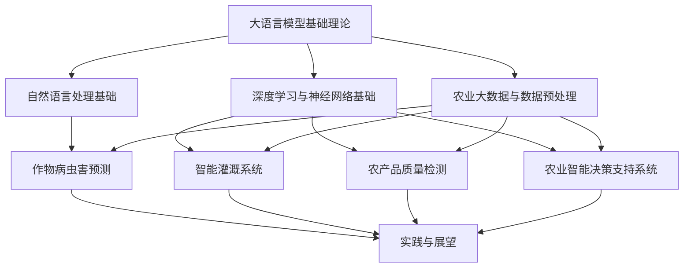

                 

**文章标题**：大语言模型在智能农业决策中的推理应用

**关键词**：大语言模型，智能农业，推理应用，深度学习，自然语言处理，农业大数据，数据预处理，病虫害预测，智能灌溉，农产品质量检测，决策支持系统

**摘要**：
随着人工智能技术的不断发展，大语言模型在智能农业领域展现出巨大的潜力。本文首先概述了大语言模型的基础理论，包括其发展历程、核心概念和应用前景。然后，详细介绍了自然语言处理和深度学习的基础知识，以及大语言模型在农业大数据、病虫害预测、智能灌溉、农产品质量检测和农业智能决策支持系统中的应用。最后，通过具体实践案例展示了大语言模型在智能农业决策中的推理应用，并对未来发展方向进行了展望。

----------------------------------------------------------------

**目录大纲**

----------------------------------------------------------------

# <此处是文章标题>

## <关键词>

### <摘要>

----------------------------------------------------------------

## 第一部分：大语言模型基础理论

### 第1章：大语言模型概述

#### 1.1 大语言模型的发展历程

#### 1.2 大语言模型的核心概念

#### 1.3 大语言模型在智能农业中的应用前景

### 第2章：自然语言处理基础

#### 2.1 语言模型与概率论

#### 2.2 词汇与语法分析

#### 2.3 词嵌入技术

### 第3章：深度学习与神经网络基础

#### 3.1 深度学习基本原理

#### 3.2 神经网络结构

#### 3.3 深度学习框架

## 第二部分：大语言模型在智能农业中的应用

### 第4章：农业大数据与数据预处理

#### 4.1 农业大数据的概念与特点

#### 4.2 数据预处理技术

#### 4.3 农业数据的特征提取

### 第5章：大语言模型在作物病虫害预测中的应用

#### 5.1 病害预测模型构建

#### 5.2 病害预测模型评估

#### 5.3 病害预测案例研究

### 第6章：大语言模型在智能灌溉系统中的应用

#### 6.1 智能灌溉系统概述

#### 6.2 模型构建与优化

#### 6.3 智能灌溉案例研究

### 第7章：大语言模型在农产品质量检测中的应用

#### 7.1 质量检测技术概述

#### 7.2 模型构建与优化

#### 7.3 质量检测案例研究

### 第8章：大语言模型在农业智能决策支持系统中的应用

#### 8.1 决策支持系统概述

#### 8.2 大语言模型在决策支持中的应用

#### 8.3 决策支持案例研究

## 第三部分：实践与展望

### 第9章：大语言模型在智能农业决策中的推理应用实践

#### 9.1 实践项目概述

#### 9.2 实践步骤与过程

#### 9.3 实践效果评估

### 第10章：大语言模型在智能农业决策中的未来展望

#### 10.1 潜在发展机会

#### 10.2 面临的挑战

#### 10.3 未来发展趋势

## 附录

### 附录A：常用深度学习框架简介

#### A.1 TensorFlow

#### A.2 PyTorch

#### A.3 其他深度学习框架简介

### 附录B：Python源代码与数据集

#### B.1 代码示例

#### B.2 数据集介绍

----------------------------------------------------------------

**Mermaid 流程图**

**数学模型与公式**

- 病害预测模型：

$$
\text{P}(B|A,\theta) = \frac{f(\theta, A, B)}{f(\theta, A)}
$$

- 智能灌溉系统模型：

$$
\text{I}(t) = \sum_{i=1}^{n} w_i \cdot \text{P}(I_i > T_i | \theta)
$$

----------------------------------------------------------------

现在，我们将按照上述大纲和结构，逐步展开对大语言模型在智能农业决策中的推理应用进行分析和探讨。让我们开始吧！

