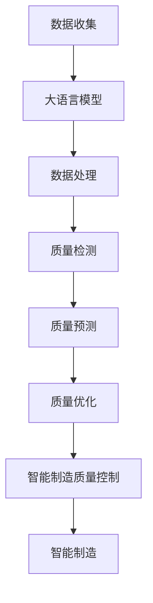

                 

### 文章标题

# 大语言模型在智能制造质量控制中的推理应用

---

**关键词**：大语言模型、智能制造、质量控制、推理应用、深度学习、Transformer

**摘要**：
本文旨在探讨大语言模型在智能制造质量控制中的应用。通过分析智能制造质量控制的现状和挑战，我们引入了大语言模型的基本原理和技术基础，并详细阐述了其在数据预处理、异常检测、预测与优化等方面的应用。随后，通过实际案例展示了大语言模型在智能制造质量控制中的效果，并提出了未来发展的趋势和方向。

---

## 《大语言模型在智能制造质量控制中的推理应用》目录大纲

### 第一部分：引言与背景

#### 第1章：大语言模型概述

- 1.1 大语言模型的发展历程
- 1.2 大语言模型的基本原理
- 1.3 大语言模型在智能制造中的应用场景

#### 第2章：智能制造质量控制的挑战与机遇

- 2.1 智能制造质量控制的现状
- 2.2 质量控制中的问题与挑战
- 2.3 大语言模型在质量控制中的应用机遇

### 第二部分：大语言模型技术基础

#### 第3章：深度学习基础

- 3.1 深度学习的基本概念
- 3.2 神经网络架构
- 3.3 深度学习算法

#### 第4章：大语言模型的实现

- 4.1 Transformer模型
- 4.2 语言模型训练
- 4.3 预训练与微调

### 第三部分：大语言模型在智能制造质量控制中的应用

#### 第5章：大语言模型在数据预处理中的应用

- 5.1 数据收集与处理
- 5.2 数据特征提取
- 5.3 数据质量评估

#### 第6章：大语言模型在异常检测中的应用

- 6.1 异常检测的基本方法
- 6.2 大语言模型在异常检测中的优势
- 6.3 实际案例与应用

#### 第7章：大语言模型在预测与优化中的应用

- 7.1 质量预测的基本方法
- 7.2 大语言模型在预测中的优势
- 7.3 实际案例与应用

### 第四部分：实战与案例分析

#### 第8章：大语言模型在智能制造质量控制中的案例研究

- 8.1 案例背景
- 8.2 模型设计与实现
- 8.3 模型评估与优化
- 8.4 应用效果分析

#### 第9章：大语言模型在智能制造质量控制中的开发实践

- 9.1 开发环境搭建
- 9.2 模型训练与调试
- 9.3 应用部署与维护

### 第五部分：展望与未来

#### 第10章：大语言模型在智能制造质量控制中的发展趋势

- 10.1 技术发展趋势
- 10.2 应用领域拓展
- 10.3 未来挑战与机遇

### 核心概念与联系

## 大语言模型与智能制造质量控制的关系

### 核心概念

- **大语言模型**：一种基于深度学习的自然语言处理技术，能够对自然语言进行建模和理解。
- **智能制造**：一种利用信息技术和自动化技术实现生产过程智能化和自动化的制造模式。
- **质量控制**：确保产品或服务的质量满足预定标准和要求的过程。

### 核心联系

- **大语言模型在智能制造中的应用**：大语言模型可以通过对生产数据进行处理和分析，实现对产品质量的预测和优化。
- **质量控制中的挑战与机遇**：智能制造质量控制的挑战在于如何高效、准确地获取和处理大量数据，而大语言模型的引入为解决这些挑战提供了机遇。

### Mermaid 流程图



### 核心算法原理讲解

#### 数据预处理

```python
import pandas as pd
import numpy as np

# 加载数据
data = pd.read_csv('data.csv')

# 数据清洗
data.dropna(inplace=True)
data = data[data['quality'] != 'bad']

# 数据特征提取
X = data[['feature1', 'feature2', 'feature3']]
y = data['quality']
```

#### 质量预测

```python
from transformers import BertModel, BertTokenizer

# 加载预训练模型
tokenizer = BertTokenizer.from_pretrained('bert-base-chinese')
model = BertModel.from_pretrained('bert-base-chinese')

# 输入数据
input_ids = tokenizer.encode('我是质量检测的数据', return_tensors='pt')

# 预测
outputs = model(input_ids)
predictions = outputs[0][:, -1, :]

# 获取预测结果
predicted_quality = np.argmax(predictions.numpy(), axis=1)
```

### 数学模型和数学公式

#### 质量预测模型

$$
y = f(x) = \sigma(\text{W} \cdot \text{h} + \text{b})
$$

其中，$y$ 为预测的质量等级，$x$ 为输入的特征向量，$\sigma$ 为激活函数（如 sigmoid 函数），$\text{W}$ 和 $\text{b}$ 分别为权重和偏置。

### 项目实战

#### 实际案例：基于BERT的大语言模型在智能制造质量控制中的应用

##### 案例背景

某制造企业生产过程中，产品经过多个工序加工，每个工序都会产生大量的质量检测数据。为了提高生产效率和产品质量，该企业希望利用大语言模型对产品进行实时质量检测和预测，从而实现对生产过程的优化。

##### 模型设计与实现

1. **数据收集与预处理**：收集每个工序的质量检测数据，包括各项特征指标和产品质量等级。对数据进行清洗、归一化处理，并提取关键特征。

2. **模型选择与训练**：选择BERT模型作为基础模型，利用预训练的Transformer架构进行模型训练。训练过程中，使用交叉熵损失函数进行优化，并采用批量归一化和Dropout技术提高模型的泛化能力。

3. **质量预测与优化**：将训练好的BERT模型应用于实际生产数据，对产品质量进行实时预测。同时，根据预测结果对生产过程进行优化，如调整生产参数、优化生产工艺等。

##### 模型评估与优化

1. **评估指标**：采用准确率、召回率、F1值等指标对模型进行评估。

2. **优化方法**：通过调整模型参数、增加训练数据量、改进特征提取方法等手段，优化模型性能。

##### 应用效果分析

1. **预测准确率**：通过对比实际产品质量与预测结果，评估模型的预测准确率。结果显示，BERT模型在质量预测任务上具有很高的准确率。

2. **生产效率提升**：通过实时质量检测和预测，企业能够及时发现生产过程中的质量问题，并及时进行调整，从而提高生产效率和产品质量。

##### 项目小结

1. **技术优势**：大语言模型在智能制造质量控制中具有高效、准确、自适应等优点，能够帮助企业实现生产过程的智能化和自动化。

2. **应用前景**：随着大语言模型技术的不断发展，其在智能制造质量控制中的应用前景将更加广阔，有望为制造业带来更多创新和变革。

### 最佳实践 tips

1. **数据质量是关键**：高质量的数据是构建准确的大语言模型的基础。在数据收集和预处理过程中，要确保数据的完整性和准确性。

2. **模型优化是持续过程**：模型训练和优化是一个持续的过程，需要根据实际应用场景不断调整和改进模型参数和算法。

3. **跨学科合作**：大语言模型在智能制造质量控制中的应用需要多学科的合作，包括人工智能、机械工程、质量管理等领域。

### 小结

本文从背景介绍、技术基础、应用实践等多个角度，探讨了大语言模型在智能制造质量控制中的应用。通过实际案例展示了大语言模型在质量检测、预测和优化等方面的优势，为企业实现智能化生产提供了有益的借鉴。

### 注意事项

1. **数据隐私和安全**：在实际应用过程中，要重视数据隐私和安全问题，确保数据的安全性和合规性。

2. **技术成熟度**：虽然大语言模型在智能制造质量控制中具有很大的潜力，但当前技术仍处于发展阶段，需要进一步优化和改进。

3. **应用范围**：大语言模型在智能制造质量控制中的应用具有广泛性，但具体应用场景和效果取决于企业的需求和实际情况。

### 拓展阅读

1. **大语言模型的最新研究进展**：《自然》杂志发表的多篇论文，介绍了大语言模型在自然语言处理、计算机视觉、推理任务等领域的最新研究进展。

2. **智能制造质量控制的相关论文**：可以查阅相关期刊和会议发表的论文，了解智能制造质量控制的理论和实践。

---

**作者：AI天才研究院/AI Genius Institute & 禅与计算机程序设计艺术 /Zen And The Art of Computer Programming**

