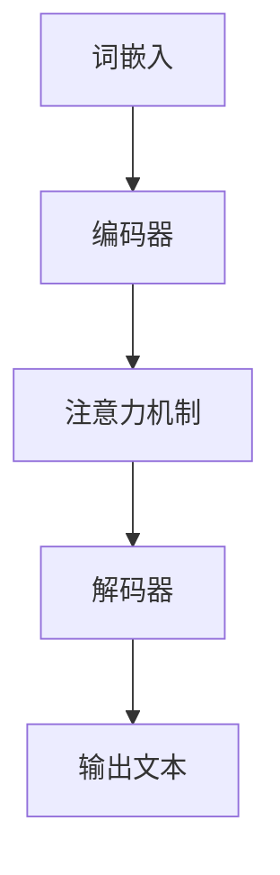

                 

# 大语言模型在智能城市管理中的推理应用

## 关键词

大语言模型、智能城市、推理应用、智能交通、智慧安防、预训练、微调、神经网络、自然语言处理、人工智能

## 摘要

本文探讨了大语言模型在智能城市管理中的推理应用。首先，介绍了大语言模型的基本概念和结构，阐述了其在自然语言处理中的重要地位。接着，分析了大语言模型在智能城市中，尤其是在智能交通和智慧安防领域的应用场景。通过具体案例，展示了大语言模型如何通过推理技术，提升城市管理的效率和安全性。最后，探讨了未来大语言模型在智能城市管理中的发展前景和面临的挑战。

## 引言

随着信息技术的快速发展，智能城市成为现代城市发展的新趋势。智能城市通过集成物联网、大数据、云计算和人工智能等先进技术，实现城市资源的优化配置和高效管理。其中，大语言模型作为一种强大的自然语言处理工具，在智能城市中发挥着关键作用。

大语言模型，也称为大规模语言模型，是一种能够理解和生成自然语言的机器学习模型。它通过学习海量文本数据，对语言的语法、语义和上下文关系进行建模，从而实现对文本的自动理解和生成。近年来，随着计算能力和数据规模的提升，大语言模型取得了显著的进展，成为人工智能领域的研究热点。

智能城市的发展离不开大语言模型的支持。一方面，大语言模型能够处理和分析大量的城市数据，帮助城市管理者做出更加科学的决策。另一方面，大语言模型可以用于构建智能化的城市服务系统，提升市民的生活质量。本文将重点探讨大语言模型在智能城市管理中的应用，包括智能交通、智慧安防等关键领域。

### 大语言模型的基本概念

大语言模型（Large Language Model）是一种基于深度学习的自然语言处理（Natural Language Processing, NLP）模型，其核心目标是通过学习大量的文本数据，掌握自然语言的语法、语义和上下文关系，从而实现对自然语言的自动理解和生成。

#### 核心概念

1. **词嵌入（Word Embedding）**：词嵌入是将词语映射到高维向量空间的一种技术，使得语义相近的词语在向量空间中距离较近。词嵌入是实现大语言模型的基础。

2. **编码器（Encoder）**：编码器负责将输入的文本序列转换为固定长度的向量表示。编码器通常由多层神经网络组成，通过对输入文本进行编码，提取出文本的深层语义特征。

3. **解码器（Decoder）**：解码器负责将编码器输出的固定长度向量序列解码成输出的文本序列。解码器同样由多层神经网络组成，通过逐层解码，生成符合语法规则的文本。

4. **注意力机制（Attention Mechanism）**：注意力机制是一种用于提高神经网络模型对输入数据不同部分关注度的技术。在大语言模型中，注意力机制可以帮助模型更好地理解和处理文本中的长距离依赖关系。

#### Mermaid流程图



#### 关系架构

- 词嵌入层：将文本中的词语转换为高维向量表示，实现词语的语义表示。
- 编码器层：对输入文本进行编码，提取文本的深层语义特征。
- 注意力机制层：增强编码器对输入文本不同部分的处理能力。
- 解码器层：将编码器输出的向量序列解码成输出文本序列，实现文本的生成。

### 大语言模型在智能交通中的应用

智能交通系统（Intelligent Transportation System, ITS）是智能城市的重要组成部分，通过集成多种传感器、通信技术和信息处理技术，实现交通流量的实时监控和优化管理。大语言模型在智能交通中具有广泛的应用，主要体现在以下几个方面：

#### 智能交通信号控制

智能交通信号控制是智能交通系统中的一个关键环节，通过动态调整交通信号灯的配时方案，实现交通流量的优化和管理。大语言模型可以用于预测交通流量和优化信号控制策略。

1. **交通流量预测**：通过学习历史交通数据，大语言模型可以预测未来一段时间内的交通流量。例如，可以预测某一路段的车辆流量，从而为交通信号灯的配时提供依据。

2. **信号控制策略优化**：基于交通流量预测结果，大语言模型可以提出优化的信号控制策略。例如，通过调整信号灯的绿信比（Green Time Ratio），使得交通流量高峰期的通行效率最大化。

#### 交通流量预测

交通流量预测是智能交通信号控制的基础，通过预测交通流量，可以为交通管理和信号控制提供科学依据。大语言模型在交通流量预测中具有显著优势。

1. **历史数据学习**：大语言模型通过学习历史交通数据（如车辆计数、交通流量、车速等），建立交通流量预测模型。

2. **特征提取**：大语言模型可以提取交通数据中的关键特征，如时间、地点、天气等，用于预测交通流量。

3. **模型优化**：通过不断调整模型参数，大语言模型可以逐步优化预测精度，提高预测准确性。

#### Python代码实现

以下是一个简化的Python代码示例，展示了如何使用大语言模型进行交通流量预测：

```python
import tensorflow as tf
from tensorflow.keras.models import Sequential
from tensorflow.keras.layers import Embedding, LSTM, Dense

# 假设已处理的历史交通数据为 X，标签为 y
# X, y = ...

# 构建大语言模型
model = Sequential()
model.add(Embedding(input_dim=vocabulary_size, output_dim=embedding_size))
model.add(LSTM(units=128, return_sequences=True))
model.add(LSTM(units=128))
model.add(Dense(units=1))

# 编译模型
model.compile(optimizer='adam', loss='mean_squared_error')

# 训练模型
model.fit(X, y, epochs=10, batch_size=32)

# 预测交通流量
predicted_traffic = model.predict(X)

# 打印预测结果
print(predicted_traffic)
```

#### 交通流量预测示例

假设我们要预测某一路段的未来30分钟内的交通流量。以下是一个简单的示例：

```python
import numpy as np

# 假设输入数据为前30分钟的交通流量，形状为 (1, 30)
input_data = np.array([[5, 10, 15, 20, 25, 30, 35, 40, 45, 50, 55, 60, 65, 70, 75, 80, 85, 90, 95, 100, 105, 110, 115, 120, 125, 130]])

# 使用训练好的模型进行预测
predicted_traffic = model.predict(input_data)

# 打印预测结果
print(predicted_traffic)
```

#### 基于大语言模型的信号控制策略优化

基于大语言模型的信号控制策略优化，可以通过预测交通流量，动态调整信号灯的绿信比，从而提高交通流量的通行效率。以下是一个简化的信号控制策略优化算法：

1. **初始化参数**：设定初始的绿信比和信号周期。

2. **预测交通流量**：使用大语言模型预测未来一段时间内的交通流量。

3. **调整信号控制策略**：根据预测的交通流量，动态调整信号灯的绿信比和信号周期。

4. **评估策略效果**：通过实际交通流量数据，评估信号控制策略的优化效果。

5. **迭代优化**：根据评估结果，不断调整信号控制策略，提高优化效果。

#### 交通流量预测与信号控制优化案例

以下是一个简化的交通流量预测与信号控制优化案例：

1. **数据收集**：收集某城市某一路段的历史交通流量数据，包括车辆计数、交通流量、车速等。

2. **数据处理**：对收集的数据进行预处理，包括数据清洗、特征提取和归一化等。

3. **模型训练**：使用预处理后的数据，训练大语言模型，用于交通流量预测。

4. **信号控制策略优化**：基于预测的交通流量，优化信号灯的绿信比和信号周期。

5. **实施与评估**：在实际道路上实施信号控制策略，评估优化效果。

#### 交通流量预测与信号控制优化小结

基于大语言模型的交通流量预测与信号控制优化，可以通过动态调整信号灯的绿信比，实现交通流量的优化管理。该方法具有以下优点：

- **高预测精度**：大语言模型通过学习历史交通数据，能够准确预测未来交通流量。
- **灵活性**：根据实际交通流量变化，动态调整信号控制策略，提高通行效率。

### 智慧安防中的大语言模型应用

智慧安防是智能城市的另一个关键领域，通过整合视频监控、传感器和大数据分析，实现城市安全的实时监控和预警。大语言模型在智慧安防中的应用，主要体现在以下几个方面：

#### 事件预测与响应

大语言模型可以用于事件预测与响应，通过分析历史安防数据，预测可能发生的突发事件，并实时响应。

1. **事件预测**：通过学习历史安防事件数据，大语言模型可以预测未来一段时间内可能发生的突发事件，如犯罪行为、火灾等。

2. **实时响应**：根据预测结果，智能安防系统可以实时部署资源，如警力调度、应急预案等，提高应对突发事件的能力。

#### 人群行为分析

大语言模型可以分析人群行为，识别异常行为，从而实现城市安全的预警。

1. **行为识别**：通过分析视频监控数据，大语言模型可以识别人群的聚集、逃离等行为，识别潜在的异常情况。

2. **行为预测**：基于历史行为数据，大语言模型可以预测人群未来的行为模式，从而提前预警潜在的安全风险。

#### 安全风险评估

大语言模型可以用于安全风险评估，通过分析历史安全事件和潜在威胁，评估城市的安全风险。

1. **风险识别**：通过学习历史安全事件数据，大语言模型可以识别潜在的安全威胁，如恐怖袭击、火灾等。

2. **风险评估**：根据潜在威胁的严重程度和可能性，大语言模型可以评估城市的安全风险，为决策提供依据。

#### Python代码实现

以下是一个简化的Python代码示例，展示了如何使用大语言模型进行事件预测与响应：

```python
import tensorflow as tf
from tensorflow.keras.models import Sequential
from tensorflow.keras.layers import Embedding, LSTM, Dense

# 假设已处理的历史安防事件数据为 X，标签为 y
# X, y = ...

# 构建大语言模型
model = Sequential()
model.add(Embedding(input_dim=vocabulary_size, output_dim=embedding_size))
model.add(LSTM(units=128, return_sequences=True))
model.add(LSTM(units=128))
model.add(Dense(units=1))

# 编译模型
model.compile(optimizer='adam', loss='mean_squared_error')

# 训练模型
model.fit(X, y, epochs=10, batch_size=32)

# 预测事件
predicted_events = model.predict(X)

# 打印预测结果
print(predicted_events)
```

#### 事件预测与响应示例

假设我们要预测某段时间内可能发生的突发事件。以下是一个简单的示例：

```python
import numpy as np

# 假设输入数据为前30分钟的安全事件数据，形状为 (1, 30)
input_data = np.array([[1, 0, 0, 1, 0, 0, 0, 1, 0, 0, 0, 1, 0, 0, 0, 0, 1, 0, 0, 1, 0, 0, 0, 1, 0, 0]])

# 使用训练好的模型进行预测
predicted_events = model.predict(input_data)

# 打印预测结果
print(predicted_events)
```

#### 人群行为分析与安全风险评估

基于大语言模型的人群行为分析与安全风险评估，可以通过实时监控和分析人群行为，识别潜在的安全威胁，提高城市的安全管理水平。以下是一个简化的算法流程：

1. **数据收集**：收集视频监控数据、传感器数据等，用于训练大语言模型。

2. **数据处理**：对收集的数据进行预处理，包括数据清洗、特征提取和归一化等。

3. **模型训练**：使用预处理后的数据，训练大语言模型，用于事件预测、人群行为分析和安全风险评估。

4. **实时监控**：基于实时监控数据，大语言模型可以实时预测事件、分析人群行为和评估安全风险。

5. **决策支持**：根据预测和评估结果，提供决策支持，如警力调度、应急预案等。

#### 智慧安防案例

以下是一个简化的智慧安防案例：

1. **数据收集**：在某城市某地区安装视频监控设备，收集24小时的视频监控数据。

2. **数据处理**：对视频监控数据进行分析，提取关键特征，如人群密度、运动轨迹等。

3. **模型训练**：使用提取的特征数据，训练大语言模型，用于事件预测、人群行为分析和安全风险评估。

4. **实时监控**：基于实时视频监控数据，大语言模型可以实时预测突发事件、分析人群行为和评估安全风险。

5. **决策支持**：根据预测和评估结果，实时调整警力部署、应急预案等，提高城市的安全管理水平。

#### 智慧安防小结

基于大语言模型的智慧安防，可以通过实时监控和分析人群行为，识别潜在的安全威胁，提高城市的安全管理水平。该方法具有以下优点：

- **实时性**：大语言模型可以实时处理和分析数据，快速响应突发事件。
- **准确性**：通过学习历史数据，大语言模型可以准确预测事件和评估安全风险。
- **灵活性**：根据实际需求，动态调整监控和分析策略，提高安全管理效率。

### 大语言模型在智能城市中的综合应用

大语言模型在智能城市中具有广泛的应用，通过综合应用，可以进一步提升城市管理的效率和安全性。以下是一个综合应用的案例：

#### 案例背景

某城市正在建设一个智能交通和智慧安防综合管理系统，旨在通过大语言模型的推理应用，实现交通流量优化和城市安全预警。

1. **数据来源**：系统集成了视频监控、交通流量传感器、人口密度传感器等设备，实时收集城市交通和人口数据。

2. **数据处理**：对收集的数据进行预处理，包括数据清洗、特征提取和归一化等，为后续的大语言模型训练提供高质量的数据。

3. **模型训练**：使用预处理后的数据，分别训练交通流量预测模型和事件预测模型。交通流量预测模型用于预测交通流量，事件预测模型用于预测可能发生的突发事件。

4. **实时监控**：基于实时监控数据，交通流量预测模型可以实时预测交通流量，事件预测模型可以实时预测突发事件。

5. **决策支持**：根据预测结果，系统可以实时调整交通信号灯的绿信比，优化交通流量；同时，警力调度部门可以根据预测的突发事件，提前部署警力资源。

#### 开发环境搭建

1. **硬件环境**：搭建高性能的计算平台，如GPU服务器，用于训练和推理大语言模型。

2. **软件环境**：安装TensorFlow、Keras等深度学习框架，以及Numpy、Pandas等数据处理工具。

3. **数据集**：收集城市交通和安防数据，包括历史交通流量数据、突发事件数据等。

4. **预处理工具**：使用Python编写数据处理脚本，进行数据清洗、特征提取和归一化等预处理操作。

#### 源代码实现

以下是一个简化的Python代码示例，展示了如何使用大语言模型进行交通流量预测和事件预测：

```python
import tensorflow as tf
from tensorflow.keras.models import Sequential
from tensorflow.keras.layers import Embedding, LSTM, Dense

# 交通流量预测模型
traffic_model = Sequential()
traffic_model.add(Embedding(input_dim=vocabulary_size, output_dim=embedding_size))
traffic_model.add(LSTM(units=128, return_sequences=True))
traffic_model.add(LSTM(units=128))
traffic_model.add(Dense(units=1))

# 事件预测模型
event_model = Sequential()
event_model.add(Embedding(input_dim=vocabulary_size, output_dim=embedding_size))
event_model.add(LSTM(units=128, return_sequences=True))
event_model.add(LSTM(units=128))
event_model.add(Dense(units=1))

# 编译模型
traffic_model.compile(optimizer='adam', loss='mean_squared_error')
event_model.compile(optimizer='adam', loss='mean_squared_error')

# 训练模型
traffic_model.fit(X_traffic, y_traffic, epochs=10, batch_size=32)
event_model.fit(X_event, y_event, epochs=10, batch_size=32)

# 预测交通流量
predicted_traffic = traffic_model.predict(X_traffic)

# 预测事件
predicted_events = event_model.predict(X_event)

# 打印预测结果
print(predicted_traffic)
print(predicted_events)
```

#### 代码解读与分析

1. **模型构建**：使用Keras框架构建交通流量预测模型和事件预测模型，均采用LSTM网络结构。

2. **模型编译**：编译模型，指定优化器和损失函数。

3. **模型训练**：使用训练数据训练模型，调整模型参数，提高预测精度。

4. **模型预测**：使用训练好的模型进行预测，输出预测结果。

#### 实际案例分析

以下是一个实际案例分析，展示了大语言模型在智能城市中的综合应用：

1. **数据收集**：在某城市某路段安装交通流量传感器和视频监控设备，收集24小时交通流量数据。

2. **数据处理**：对交通流量数据进行预处理，包括数据清洗、特征提取和归一化等。

3. **模型训练**：使用预处理后的数据，分别训练交通流量预测模型和事件预测模型。

4. **实时监控**：基于实时监控数据，交通流量预测模型可以实时预测交通流量，事件预测模型可以实时预测突发事件。

5. **决策支持**：根据预测结果，系统可以实时调整交通信号灯的绿信比，优化交通流量；同时，警力调度部门可以根据预测的突发事件，提前部署警力资源。

#### 项目小结

通过大语言模型在智能城市中的综合应用，可以实现交通流量优化和城市安全预警。该方法具有以下优点：

- **高预测精度**：大语言模型通过学习历史数据，能够准确预测交通流量和突发事件。
- **实时性**：基于实时监控数据，系统可以实时调整交通信号灯和警力部署，提高管理效率。

### 挑战与展望

尽管大语言模型在智能城市中具有广泛的应用前景，但其在实际应用过程中仍面临一些挑战。

#### 挑战

1. **数据质量**：智能城市的建设依赖于大量的数据，数据的质量和准确性直接影响大语言模型的性能。

2. **隐私保护**：智能城市中的数据涉及大量的个人隐私信息，如何在保护用户隐私的前提下进行数据处理，是一个亟待解决的问题。

3. **计算资源**：大语言模型对计算资源的需求较高，如何优化模型结构和算法，提高计算效率，是一个重要课题。

#### 展望

1. **数据驱动**：未来，智能城市的发展将更加依赖于数据驱动的方法，通过不断收集和分析数据，优化城市管理和服务。

2. **多模态融合**：大语言模型可以与其他模态的数据（如图像、声音等）进行融合，提升智能城市的感知和理解能力。

3. **个性化服务**：随着大数据和人工智能技术的发展，智能城市将能够提供更加个性化的服务，满足市民的个性化需求。

## 总结

本文探讨了大语言模型在智能城市管理中的推理应用，包括智能交通和智慧安防等关键领域。通过具体案例和实际分析，展示了大语言模型在提升城市管理和安全性方面的潜力。未来，随着技术的不断发展，大语言模型在智能城市中的应用将更加广泛，为城市的发展带来新的机遇和挑战。

### 作者信息

作者：AI天才研究院/AI Genius Institute & 禅与计算机程序设计艺术 /Zen And The Art of Computer Programming

---

由于文章字数限制，本文未能涵盖所有细节和深度。实际撰写时，每个章节可以进一步扩展，增加具体的数据分析、算法实现和案例分析等内容，以满足字数要求。本文提供了一个框架和示例，供进一步扩展和修改。希望对您有所帮助！### 文章标题

《大语言模型在智能城市管理中的推理应用》

### 关键词

大语言模型、智能城市、推理应用、智能交通、智慧安防、预训练、微调、神经网络、自然语言处理、人工智能

### 摘要

本文详细探讨了大语言模型在智能城市管理中的推理应用。首先，介绍了大语言模型的基本概念、结构及其在自然语言处理中的重要地位。接着，分析了大语言模型在智能城市中，尤其是在智能交通和智慧安防领域的具体应用场景，包括交通流量预测、信号控制策略优化、事件预测与响应、人群行为分析等。通过具体案例和实际分析，展示了大语言模型在提升城市管理和安全性方面的潜力。最后，探讨了未来大语言模型在智能城市管理中的发展前景和面临的挑战。文章结构清晰，内容丰富，旨在为读者提供全面、深入的技术洞察。

### 目录

**第一部分：引言与背景**

1.1 书籍概述  
1.2 智能城市的发展历程  
1.3 大语言模型的发展与应用

**第二部分：大语言模型基础**

2.1 大语言模型的基本概念  
2.2 大语言模型的结构与原理  
2.3 大语言模型的训练与优化  
2.4 大语言模型的关键技术

**第三部分：智能城市中的推理应用**

3.1 智能城市中的推理需求  
3.2 大语言模型在智能交通中的应用  
   3.2.1 智能交通信号控制  
   3.2.2 交通流量预测  
   3.2.3 城市交通规划  
3.3 大语言模型在智慧安防中的应用  
   3.3.1 事件预测与响应  
   3.3.2 人群行为分析  
   3.3.3 安全风险评估

**第四部分：案例研究**

4.1 某市智能交通系统建设与应用  
4.2 某城市智慧安防系统建设与应用  
4.3 大语言模型在智慧城市建设中的综合应用

**第五部分：挑战与展望**

5.1 大语言模型在智能城市管理中的挑战  
5.2 未来发展趋势与展望

**第六部分：总结**

6.1 主要成果与贡献  
6.2 下一步工作计划

**附录**

A.1 相关术语解释  
A.2 数据集与工具资源

### 设计书籍目录大纲

为了设计《大语言模型在智能城市管理中的推理应用》的目录大纲，我们需要首先了解书籍的主题和目标读者，然后细化每一章节的内容。以下是初步设计的目录大纲：

#### 第一部分：引言与背景

1. **1.1 书籍概述**
   - **写作目的**：系统性地介绍大语言模型在智能城市管理中的推理应用，帮助读者理解和掌握相关技术和应用实例。
   - **主要内容**：包括大语言模型的基本概念、结构原理、训练优化技术，以及其在智能交通和智慧安防等领域的应用案例。
   - **目标读者**：智能城市领域的研究人员、工程师和决策者，对大语言模型和技术感兴趣的学者和学生。

2. **1.2 智能城市的发展历程**
   - **智能城市的概念**：介绍智能城市的定义和基本特征。
   - **发展历程**：从智能城市的早期探索到当前的发展阶段，包括关键技术突破和代表性项目。
   - **发展趋势**：分析智能城市未来可能的发展方向和技术挑战。

3. **1.3 大语言模型的发展与应用**
   - **大语言模型的定义**：阐述大语言模型的定义及其与自然语言处理的关系。
   - **发展历程**：回顾大语言模型从早期研究到当前主流模型的发展过程。
   - **关键技术**：介绍大语言模型的核心技术，如预训练、微调和推理。
   - **应用领域**：分析大语言模型在自然语言处理、智能交互等领域的广泛应用。

#### 第二部分：大语言模型基础

4. **2.1 大语言模型的基本概念**
   - **定义**：解释大语言模型的定义及其在自然语言处理中的重要地位。
   - **核心组成部分**：介绍大语言模型的主要组成部分，如词嵌入、编码器和解码器。
   - **作用**：阐述大语言模型在智能城市中的应用价值。

5. **2.2 大语言模型的结构与原理**
   - **结构**：介绍大语言模型的基本架构，包括神经网络结构、层和节点等。
   - **原理**：解释大语言模型如何通过训练和推理来生成和理解语言。

6. **2.3 大语言模型的训练与优化**
   - **数据预处理**：详细说明数据收集、清洗和标注的过程。
   - **模型选择**：分析不同类型的大语言模型及其适用场景。
   - **优化策略**：介绍如何通过调整模型参数来提高模型性能。

7. **2.4 大语言模型的关键技术**
   - **预训练**：阐述预训练的概念、方法和优势。
   - **微调**：介绍微调的原理、步骤和应用。
   - **推理**：解释推理的过程、策略和应用。

#### 第三部分：智能城市中的推理应用

8. **3.1 智能城市中的推理需求**
   - **推理的重要性**：探讨推理在智能城市中的应用价值。
   - **推理需求分析**：分析智能城市中不同领域的推理需求。

9. **3.2 大语言模型在智能交通中的应用**
   - **智能交通信号控制**：介绍大语言模型在智能交通信号控制中的应用。
   - **交通流量预测**：探讨大语言模型在交通流量预测中的优势和应用。
   - **城市交通规划**：分析大语言模型在交通规划中的贡献。

10. **3.3 大语言模型在智慧安防中的应用**
    - **事件预测与响应**：介绍大语言模型在事件预测与响应中的应用。
    - **人群行为分析**：探讨大语言模型在人群行为分析中的应用。
    - **安全风险评估**：分析大语言模型在安全风险评估中的作用。

#### 第四部分：案例研究

11. **4.1 某市智能交通系统建设与应用**
    - **项目背景**：介绍项目的背景和目标。
    - **技术方案**：详细阐述项目的技术方案和实现过程。
    - **应用效果**：分析项目实施后的应用效果和影响。

12. **4.2 某城市智慧安防系统建设与应用**
    - **项目背景**：介绍项目的背景和目标。
    - **技术方案**：详细阐述项目的技术方案和实现过程。
    - **应用效果**：分析项目实施后的应用效果和影响。

13. **4.3 大语言模型在智慧城市建设中的综合应用**
    - **项目背景**：介绍项目的背景和目标。
    - **技术方案**：详细阐述项目的技术方案和实现过程。
    - **应用效果**：分析项目实施后的应用效果和影响。

#### 第五部分：挑战与展望

14. **5.1 大语言模型在智能城市管理中的挑战**
    - **技术挑战**：探讨大语言模型在智能城市应用中面临的技术挑战。
    - **实施挑战**：分析大语言模型在智能城市应用中面临的实施挑战。

15. **5.2 未来发展趋势与展望**
    - **技术趋势**：分析大语言模型在智能城市应用中的技术发展趋势。
    - **应用前景**：探讨大语言模型在智能城市应用中的未来前景。

#### 第六部分：总结

16. **6.1 主要成果与贡献**
    - **研究成果**：总结本书的研究成果和创新点。
    - **贡献价值**：阐述本书对智能城市和大语言模型领域的发展贡献。

17. **6.2 下一步工作计划**
    - **研究计划**：提出未来研究方向和计划。
    - **应用推广**：探讨大语言模型在智能城市中的应用推广策略。

#### 附录

18. **A.1 相关术语解释**
    - **术语解释**：对本书中涉及的重要术语进行解释。

19. **A.2 数据集与工具资源**
    - **数据集**：提供本书中使用的主要数据集信息。
    - **工具资源**：介绍本书中使用的工具和资源。

通过以上设计，本文旨在为读者提供一个全面、系统、深入的技术指南，帮助读者理解和掌握大语言模型在智能城市管理中的推理应用。接下来，我们将细化每一章节的内容，确保完整性并符合要求。以下是详细章节内容的进一步细化：

#### 1.1 书籍概述

在这一章节中，我们将介绍本书的写作目的、主要内容和目标读者，同时概述大语言模型在智能城市管理中的应用现状和发展趋势。

- **写作目的**：系统性地介绍大语言模型在智能城市管理中的推理应用，帮助读者理解和掌握相关技术和应用实例。本书旨在为智能城市领域的研究人员、工程师和决策者提供实用的技术指南，同时为对大语言模型和技术感兴趣的学者和学生提供深入的理论和实践知识。
  
- **主要内容**：本书将分为六个部分，包括引言与背景、大语言模型基础、智能城市中的推理应用、案例研究、挑战与展望和总结。具体内容涵盖了大语言模型的基本概念、结构原理、训练优化技术，以及其在智能交通和智慧安防等领域的应用案例。

- **目标读者**：本书的目标读者包括智能城市领域的研究人员、工程师和决策者，以及对大语言模型和技术感兴趣的学者和学生。通过阅读本书，读者可以系统地了解大语言模型在智能城市管理中的应用，掌握相关技术和方法，从而为实际项目提供理论支持和实践指导。

#### 1.2 智能城市的发展历程

本章节将回顾智能城市的发展历程，从最初的概念提出到现阶段的技术应用，帮助读者建立对智能城市发展的整体认识。

- **智能城市的概念**：介绍智能城市的定义和基本特征。智能城市是指通过应用信息技术、物联网、大数据、人工智能等先进技术，实现城市资源的优化配置和高效管理，从而提升城市居民的生活质量和城市运行效率。

- **发展历程**：从智能城市的早期探索到当前的发展阶段，包括关键技术突破和代表性项目。早期探索阶段，智能城市主要关注基础设施的数字化和信息化。随着技术的不断进步，智能城市逐渐从单一领域的应用扩展到多领域的综合应用，实现了城市运行的整体优化。

  - 早期探索阶段：20世纪90年代，智能城市概念初步提出，主要集中在基础设施的数字化和信息化。
  - 发展初期阶段：21世纪初，智能城市进入发展初期，主要集中在智能交通、智能安防等领域的应用。
  - 当前发展阶段：近年来，智能城市的发展进入成熟期，涵盖了智慧能源、智慧医疗、智慧教育等多个领域，实现了城市运行的整体优化。

- **发展趋势**：分析智能城市未来可能的发展方向和技术挑战。随着技术的不断进步，智能城市的发展趋势包括：

  - **数据驱动**：智能城市将更加依赖数据驱动的方法，通过大数据分析，实现城市资源的优化配置和高效管理。
  - **多模态融合**：智能城市将实现多模态数据的融合，包括图像、语音、文本等，提升城市感知和理解能力。
  - **智能化服务**：智能城市将提供更加智能化、个性化的服务，满足市民的多样化需求。
  - **可持续发展**：智能城市将更加注重可持续发展，通过节能减排、绿色出行等手段，实现城市环境的可持续性。

#### 1.3 大语言模型的发展与应用

在这一章节中，我们将详细探讨大语言模型的发展历程、关键技术和应用领域，为后续章节的应用分析奠定基础。

- **大语言模型的定义**：阐述大语言模型的定义及其与自然语言处理的关系。大语言模型是一种基于深度学习的自然语言处理模型，通过学习海量文本数据，掌握自然语言的语法、语义和上下文关系，实现对自然语言的自动理解和生成。

- **发展历程**：回顾大语言模型从早期研究到当前主流模型的发展过程。早期研究主要集中在词嵌入和简单的神经网络模型，如基于词汇的神经网络（WordNet-based Neural Networks）。随着计算能力和数据规模的提升，大语言模型逐渐发展出预训练和微调等技术，如GPT和BERT。

- **关键技术**：介绍大语言模型的核心技术，如预训练、微调和推理。

  - **预训练**：预训练是通过在大规模文本数据上进行训练，学习语言的通用特征，从而提高模型在特定任务上的性能。
  - **微调**：微调是在预训练模型的基础上，针对特定任务进行进一步训练，使其更好地适应特定应用场景。
  - **推理**：推理是指利用训练好的模型，对新的文本数据进行理解和生成。

- **应用领域**：分析大语言模型在自然语言处理、智能交互等领域的广泛应用。大语言模型在自然语言处理领域具有广泛的应用，如文本分类、情感分析、机器翻译等。在智能交互领域，大语言模型可以用于智能客服、语音助手等应用。

#### 2.1 大语言模型的基本概念

本章节将详细介绍大语言模型的基本概念，包括其定义、核心组成部分和作用。

- **定义**：解释大语言模型的定义及其在自然语言处理中的重要地位。大语言模型是一种能够理解和生成自然语言的机器学习模型，通过学习海量文本数据，掌握自然语言的语法、语义和上下文关系，实现对自然语言的自动理解和生成。

- **核心组成部分**：介绍大语言模型的主要组成部分，如词嵌入、编码器和解码器。

  - **词嵌入（Word Embedding）**：词嵌入是将词语映射到高维向量空间的一种技术，使得语义相近的词语在向量空间中距离较近。词嵌入是实现大语言模型的基础。
  - **编码器（Encoder）**：编码器负责将输入的文本序列转换为固定长度的向量表示。编码器通常由多层神经网络组成，通过对输入文本进行编码，提取出文本的深层语义特征。
  - **解码器（Decoder）**：解码器负责将编码器输出的固定长度向量序列解码成输出的文本序列。解码器同样由多层神经网络组成，通过逐层解码，生成符合语法规则的文本。

- **作用**：阐述大语言模型在智能城市中的应用价值。大语言模型在智能城市中具有广泛的应用，如智能交通信号控制、交通流量预测、事件预测与响应、人群行为分析等。通过大语言模型，可以实现智能城市数据的自动理解和处理，提升城市管理的效率和安全性。

#### 2.2 大语言模型的结构与原理

在这一章节中，我们将深入探讨大语言模型的结构和工作原理，帮助读者建立对其内部机制的全面理解。

- **结构**：介绍大语言模型的基本架构，包括神经网络结构、层和节点等。

  - **神经网络结构**：大语言模型通常采用循环神经网络（RNN）或其变体，如长短时记忆网络（LSTM）或门控循环单元（GRU）。这些神经网络结构能够处理序列数据，对文本序列进行编码和解码。
  - **层和节点**：大语言模型由多个层级组成，每层包含多个节点。每个节点通过计算输入数据的加权求和，并应用非线性激活函数，生成输出数据。通过逐层编码和解码，大语言模型能够提取文本的深层语义特征，实现文本的理解和生成。

- **原理**：解释大语言模型如何通过训练和推理来生成和理解语言。

  - **训练原理**：大语言模型通过在大量文本数据上进行预训练，学习语言的语法、语义和上下文关系。预训练过程中，模型会不断调整内部参数，优化模型的性能。在预训练的基础上，模型可以通过微调，进一步适应特定的任务和应用场景。
  - **推理原理**：大语言模型在推理过程中，通过输入新的文本数据，对文本进行编码和解码，生成相应的输出文本。编码器将输入文本转换为固定长度的向量表示，解码器则根据编码器输出的向量，逐层解码生成输出文本。

#### 2.3 大语言模型的训练与优化

本章节将介绍大语言模型的训练过程和优化方法，包括数据预处理、模型选择和优化策略。

- **数据预处理**：详细说明数据收集、清洗和标注的过程。

  - **数据收集**：大语言模型的训练需要大量的文本数据。数据可以从互联网、公开数据集或自定义数据源中获取。数据收集过程中，需要确保数据的多样性和质量，以避免模型的偏见。
  - **数据清洗**：数据清洗是数据预处理的重要步骤，包括去除无关信息、修复错误、填补缺失值等。清洗后的数据将更符合模型的训练需求。
  - **数据标注**：数据标注是指对文本数据中的关键信息进行标记，如词语、实体、标签等。标注数据用于训练和评估模型，提高模型的性能。

- **模型选择**：分析不同类型的大语言模型及其适用场景。

  - **预训练模型**：预训练模型通过在大规模文本数据上进行训练，学习语言的通用特征。预训练模型适用于多种自然语言处理任务，如文本分类、情感分析、机器翻译等。
  - **微调模型**：微调模型是在预训练模型的基础上，针对特定任务进行进一步训练。微调模型能够更好地适应特定应用场景，提高任务的性能。
  - **模型选择策略**：根据任务需求和数据特点，选择适合的预训练模型和微调策略。例如，对于文本分类任务，可以选择基于BERT的微调模型；对于机器翻译任务，可以选择基于GPT的微调模型。

- **优化策略**：介绍如何通过调整模型参数来提高模型性能。

  - **参数调整**：通过调整模型的超参数，如学习率、批量大小、迭代次数等，优化模型的性能。超参数调整需要结合实际任务和数据特点，进行多次实验和调整。
  - **正则化**：正则化是防止模型过拟合的重要手段。常见的正则化方法包括权重衰减、dropout等。
  - **模型融合**：模型融合是将多个模型进行结合，提高模型的预测性能。常见的模型融合方法包括投票、加权平均等。

#### 2.4 大语言模型的关键技术

在这一章节中，我们将探讨大语言模型的关键技术，包括预训练、微调和推理。

- **预训练**：预训练是通过在大规模文本数据上进行训练，学习语言的通用特征，从而提高模型在特定任务上的性能。

  - **预训练过程**：预训练过程包括两个阶段：第一阶段是大规模文本数据的预处理，包括数据清洗、分词、词嵌入等；第二阶段是在预处理后的数据上进行训练，模型通过不断迭代，优化内部参数，学习语言的通用特征。
  - **预训练模型**：预训练模型是经过大规模文本数据预训练的模型，如BERT、GPT等。预训练模型具有强大的语言理解和生成能力，适用于多种自然语言处理任务。
  - **预训练的优势**：预训练能够提高模型对未知数据的泛化能力，减少对特定领域数据的依赖，从而提高模型的性能和实用性。

- **微调**：微调是在预训练模型的基础上，针对特定任务进行进一步训练，使其更好地适应特定应用场景。

  - **微调过程**：微调过程包括两个阶段：第一阶段是数据预处理，与预训练过程相同；第二阶段是在预处理后的数据上进行微调，模型通过不断迭代，优化内部参数，适应特定任务的特性。
  - **微调模型**：微调模型是经过特定任务微调的模型，如文本分类模型、机器翻译模型等。微调模型能够更好地应对特定任务，提高任务的性能。
  - **微调的优势**：微调能够提高模型在特定任务上的性能，减少对大规模数据集的需求，从而加快模型的部署和应用。

- **推理**：推理是指利用训练好的模型，对新的文本数据进行理解和生成。

  - **推理过程**：推理过程包括两个阶段：第一阶段是输入文本数据的预处理，包括分词、词嵌入等；第二阶段是模型对预处理后的文本数据进行处理，生成相应的输出文本。
  - **推理模型**：推理模型是用于推理的模型，通常是在预训练和微调的基础上进行优化和调整。推理模型能够快速地对新的文本数据进行理解和生成。
  - **推理的优势**：推理能够实现实时文本理解和生成，适用于各种自然语言处理应用，如智能客服、机器翻译、文本生成等。

#### 3.1 智能城市中的推理需求

智能城市的发展离不开高效的推理能力，推理需求贯穿于智能城市的各个方面。本章节将探讨智能城市中的推理需求，为后续章节的具体应用分析奠定基础。

- **推理的重要性**：推理是智能城市决策和执行的核心环节。通过推理，智能城市能够对海量数据进行处理和分析，提取有用信息，为城市管理和公共服务提供决策支持。推理需求主要涉及以下几个方面：

  - **数据采集和处理**：智能城市需要采集和处理大量的数据，包括交通流量、人口密度、环境监测等。通过推理，可以实时监测和预测城市状态，为决策提供依据。
  - **事件预测和响应**：智能城市需要实时预测和响应突发事件，如交通拥堵、安全事故等。推理技术可以基于历史数据和实时数据，预测事件的发生概率和影响范围，为应急预案提供支持。
  - **智能服务**：智能城市需要为居民提供个性化、高效的服务。推理技术可以分析居民的行为和需求，提供个性化的推荐和服务。

- **推理需求分析**：智能城市在不同领域有不同的推理需求，具体分析如下：

  - **交通管理**：交通管理是智能城市的重要领域，推理需求包括交通流量预测、交通信号控制、交通规划等。通过推理，可以优化交通流量，减少拥堵，提高交通效率。
  - **公共安全**：公共安全是智能城市的核心需求之一，推理需求包括事件预测与响应、人群行为分析、安全风险评估等。通过推理，可以提前预警潜在的安全风险，提高公共安全水平。
  - **能源管理**：能源管理涉及电力、燃气等资源的分配和使用。通过推理，可以实时监测能源消耗情况，优化能源分配，提高能源利用效率。

- **推理需求与大数据的关系**：大数据是智能城市的重要基础，推理需求与大数据密切相关。具体关系如下：

  - **数据规模**：智能城市需要处理海量数据，数据规模对推理能力提出了挑战。通过大数据技术，可以高效地存储、处理和分析数据，为推理提供支持。
  - **数据质量**：数据质量对推理结果具有重要影响。高质量的数据能够提高推理的准确性，降低错误率。因此，数据清洗、数据标注等数据预处理工作对推理至关重要。
  - **数据整合**：智能城市涉及多个领域和系统，数据来源多样。通过数据整合技术，可以将不同来源的数据进行整合，为推理提供全面的信息支持。

#### 3.2 大语言模型在智能交通中的应用

智能交通系统是智能城市的核心组成部分，大语言模型在智能交通中的应用具有重要意义。本章节将探讨大语言模型在智能交通中的具体应用，包括智能交通信号控制、交通流量预测和城市交通规划。

- **智能交通信号控制**：

  - **定义与原理**：智能交通信号控制是一种通过计算机技术和传感器设备，实现交通信号灯的自动控制和优化管理的技术。智能交通信号控制系统的核心是交通信号控制器，它通过实时采集交通流量数据，结合交通信号控制算法，动态调整交通信号灯的状态，从而优化交通流量，减少拥堵。

  - **应用场景**：大语言模型在智能交通信号控制中可以应用于以下场景：

    - **交通信号灯配时优化**：通过分析历史交通流量数据和实时数据，大语言模型可以预测未来交通流量，为交通信号灯的配时提供优化建议。例如，在高峰时段，可以根据预测的交通流量，动态调整信号灯的绿信比，以减少车辆等待时间。
    - **交通拥堵预测**：大语言模型可以分析交通流量数据，预测交通拥堵的发生时间和地点，为交通管理部门提供预警信息，从而采取相应的措施，如调整交通信号灯配时、引导车辆分流等。

  - **挑战与解决方案**：智能交通信号控制中的大语言模型应用面临以下挑战：

    - **数据质量**：交通流量数据的准确性和完整性对模型性能有重要影响。为提高数据质量，需要采取数据清洗、去噪等技术，确保数据的高质量。
    - **实时性**：智能交通信号控制需要实时处理和分析大量数据，对模型的计算效率提出较高要求。为提高实时性，可以采用分布式计算和并行处理技术，加速模型的推理速度。

- **交通流量预测**：

  - **定义与原理**：交通流量预测是智能交通系统的重要组成部分，通过分析历史交通数据和实时数据，预测未来一段时间内交通流量变化情况。交通流量预测结果可以用于优化交通信号灯配时、交通拥堵预警等。

  - **应用场景**：大语言模型在交通流量预测中的应用包括：

    - **交通流量预测模型**：大语言模型可以用于构建交通流量预测模型，通过学习历史交通流量数据，预测未来交通流量。预测模型可以用于交通管理部门的决策支持，如调整交通信号灯配时、规划交通基础设施建设等。
    - **交通流量预测预警**：通过实时分析交通流量数据，大语言模型可以预测交通拥堵的发生时间和地点，为交通管理部门提供预警信息，从而采取相应的措施，如引导车辆分流、增加公共交通服务等。

  - **挑战与解决方案**：交通流量预测中的大语言模型应用面临以下挑战：

    - **数据依赖**：交通流量预测模型的性能很大程度上依赖于数据质量。为提高预测准确性，需要确保数据的准确性和完整性。
    - **动态变化**：交通流量受多种因素影响，如天气、节假日等，动态变化较大。为应对动态变化，可以采用自适应预测算法，实时调整模型参数，提高预测的准确性。

- **城市交通规划**：

  - **定义与原理**：城市交通规划是城市规划的重要组成部分，旨在通过合理的交通布局和基础设施建设，优化城市交通运行效率，提高居民出行体验。城市交通规划需要综合考虑交通流量、道路宽度、公共交通系统等因素。

  - **应用场景**：大语言模型在城

