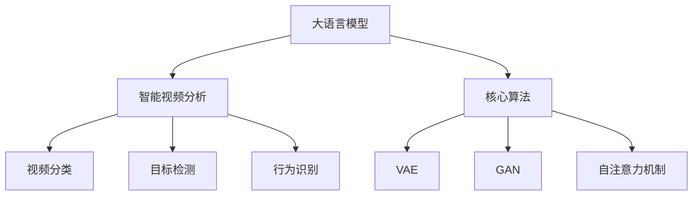
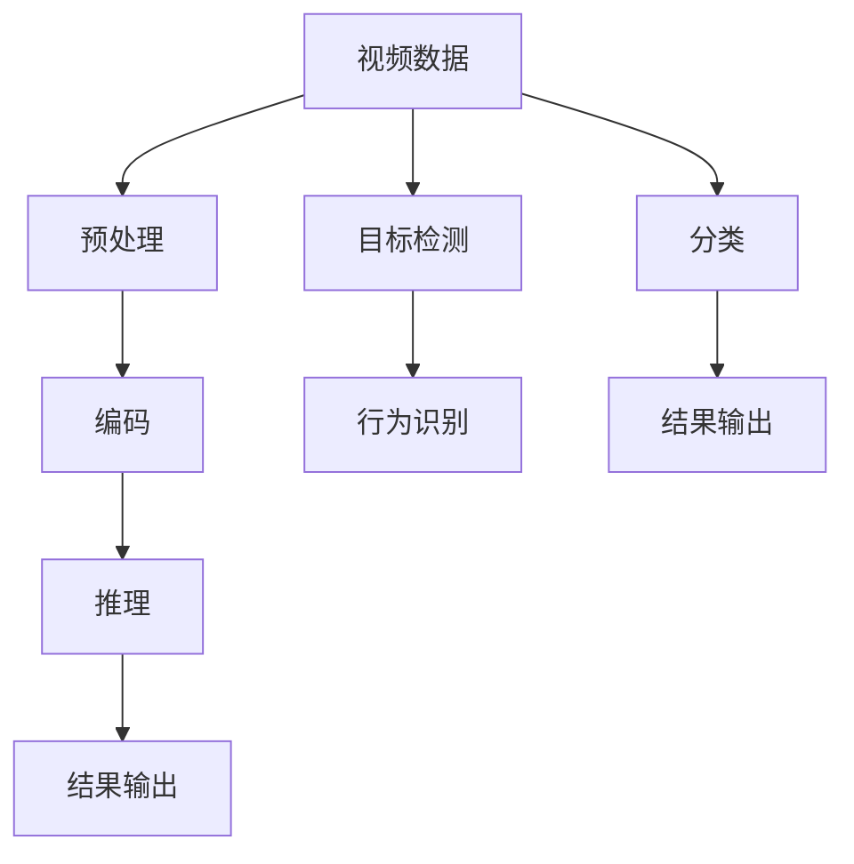

                 


# 大语言模型在智能视频分析中的推理应用研究

## 关键词
- 大语言模型
- 智能视频分析
- 推理应用
- 深度学习
- 计算机视觉

## 摘要
本文旨在探讨大语言模型在智能视频分析中的应用及其推理过程。首先，我们对大语言模型进行了概述，介绍了其定义、原理和核心算法。接着，我们深入分析了大语言模型在智能视频分析中的具体应用，包括视频分类、目标检测和行为识别。随后，我们通过具体的实例，展示了大语言模型在视频分析中的推理过程和性能评估。最后，我们对大语言模型在智能视频分析中的前景和挑战进行了展望。

## 目录大纲

### 第一部分：大语言模型基础

#### 第1章：大语言模型概述
- 1.1 大语言模型的定义与特征
- 1.2 大语言模型的原理与架构
- 1.3 大语言模型的发展历史

#### 第2章：大语言模型的核心算法
- 2.1 变分自编码器（VAE）
- 2.2 生成对抗网络（GAN）
- 2.3 自注意力机制（Attention Mechanism）

#### 第3章：大语言模型的数学基础
- 3.1 线性代数基础
- 3.2 概率论与统计基础
- 3.3 微积分基础

#### 第4章：大语言模型在计算机视觉中的应用
- 4.1 大语言模型在图像分类中的应用
- 4.2 大语言模型在目标检测中的应用
- 4.3 大语言模型在图像生成中的应用

#### 第5章：大语言模型在自然语言处理中的应用
- 5.1 大语言模型在文本分类中的应用
- 5.2 大语言模型在机器翻译中的应用
- 5.3 大语言模型在问答系统中的应用

### 第二部分：大语言模型推理应用研究

#### 第6章：大语言模型在智能视频分析中的应用
- 6.1 大语言模型在视频分类中的应用
- 6.2 大语言模型在视频目标检测中的应用
- 6.3 大语言模型在视频行为识别中的应用

#### 第7章：大语言模型推理应用实战
- 7.1 实战一：视频分类模型推理
- 7.2 实战二：视频目标检测模型推理
- 7.3 实战三：视频行为识别模型推理

#### 第8章：大语言模型推理算法优化
- 8.1 算法优化目标
- 8.2 算法优化方法
- 8.3 实际应用案例分析

#### 第9章：大语言模型推理性能评估
- 9.1 性能评估指标
- 9.2 性能评估方法
- 9.3 实际应用案例分析

#### 第10章：大语言模型推理应用案例分析
- 10.1 案例一：智能视频监控系统
- 10.2 案例二：智能交通系统
- 10.3 案例三：智能安防系统

#### 第11章：大语言模型推理应用前景与挑战
- 11.1 应用前景分析
- 11.2 技术挑战分析
- 11.3 未来发展方向

## 附录

#### 附录A：大语言模型开发工具与资源
- A.1 主流深度学习框架
- A.2 大语言模型开源项目
- A.3 大语言模型学习资源

# 关键概念联系架构 Mermaid 流程图


---

### 第1章：大语言模型概述

#### 1.1 大语言模型的定义与特征

大语言模型（Large Language Model，LLM）是一种基于神经网络的自然语言处理模型，它能够通过对海量文本数据的学习，理解和生成自然语言。大语言模型的主要特征包括：

1. **大规模参数**：大语言模型通常拥有数十亿甚至数万亿个参数，这使得它们能够捕捉到语言中的复杂结构和规律。
2. **端到端学习**：大语言模型通过端到端的学习方式，从输入文本直接生成输出文本，无需经过复杂的预处理和后处理步骤。
3. **自适应能力**：大语言模型可以根据不同的任务需求，自适应地调整其参数，从而实现不同场景下的有效应用。

#### 1.2 大语言模型的原理与架构

大语言模型的原理主要基于深度学习，特别是基于递归神经网络（RNN）和Transformer模型。递归神经网络通过在网络中引入递归结构，使得模型能够捕捉到序列数据中的前后关系。而Transformer模型则通过自注意力机制（Attention Mechanism），使得模型能够在处理序列数据时，自适应地关注到重要的信息。

大语言模型的架构通常包括以下几个部分：

1. **输入层**：输入层负责接收输入的文本数据，并将其转换为模型能够处理的格式。
2. **编码器**：编码器负责对输入数据进行编码，生成编码后的表示。
3. **解码器**：解码器负责将编码后的表示解码为输出文本。
4. **注意力机制**：注意力机制使得模型能够在处理序列数据时，自适应地关注到重要的信息。


#### 1.3 大语言模型的发展历史

大语言模型的发展历程可以追溯到20世纪80年代的早期自然语言处理模型，如基于规则的方法和统计方法。随着深度学习的兴起，2018年，Google推出了BERT模型，这是第一个真正的大规模语言模型。此后，OpenAI的GPT系列模型、Facebook的RoBERTa模型等相继推出，使得大语言模型在自然语言处理领域取得了显著的成果。

### 第2章：大语言模型的核心算法

#### 2.1 变分自编码器（VAE）

变分自编码器（Variational Autoencoder，VAE）是一种无监督学习方法，主要用于数据的生成和降维。VAE的核心思想是通过引入潜在变量，使得编码器和解码器学习到数据的潜在分布。

VAE的架构主要包括以下几个部分：

1. **编码器**：编码器负责将输入数据映射到一个潜在空间中的点。
2. **潜在空间**：潜在空间是一个概率分布，它代表了输入数据的潜在特征。
3. **解码器**：解码器负责将潜在空间中的点映射回原始数据空间。

VAE的目标是最小化输入数据的重建误差和潜在变量的KL散度。VAE的数学公式如下：

$$
\text{损失函数} = \text{重建误差} + \text{KL散度}
$$

其中，重建误差是输入数据与解码器生成的数据之间的差异，KL散度是编码器输出的概率分布与潜在空间分布之间的差异。

#### 2.2 生成对抗网络（GAN）

生成对抗网络（Generative Adversarial Network，GAN）是一种由生成器和判别器组成的有监督学习方法，主要用于数据的生成。GAN的核心思想是生成器和判别器之间的对抗训练。

GAN的架构主要包括以下几个部分：

1. **生成器**：生成器负责生成与真实数据分布相似的数据。
2. **判别器**：判别器负责区分真实数据和生成数据。
3. **对抗训练**：生成器和判别器相互对抗，生成器试图生成更加真实的数据，而判别器试图更好地区分真实数据和生成数据。

GAN的数学公式如下：

$$
\text{生成器损失} = -\log(\text{判别器对生成器的预测概率})
$$

$$
\text{判别器损失} = -\log(\text{判别器对真实数据的预测概率}) - \log(\text{判别器对生成数据的预测概率})
$$

#### 2.3 自注意力机制（Attention Mechanism）

自注意力机制（Self-Attention Mechanism）是一种用于处理序列数据的注意力机制。自注意力机制能够使模型在处理序列数据时，自适应地关注到重要的信息。

自注意力机制的数学公式如下：

$$
\text{自注意力分数} = \text{查询} \cdot \text{键}^T
$$

$$
\text{自注意力权重} = \text{softmax}(\text{自注意力分数})
$$

$$
\text{自注意力输出} = \text{自注意力权重} \cdot \text{值}
$$

其中，查询、键和值是序列数据中的三个部分，它们之间的计算方式决定了模型对序列数据的关注程度。

### 第3章：大语言模型的数学基础

#### 3.1 线性代数基础

线性代数是深度学习的基础，它在机器学习中有着广泛的应用。以下是一些基本的线性代数概念：

1. **矩阵**：矩阵是二维的数组，用于表示数据集。
2. **向量**：向量是一维的数组，可以看作是矩阵的特例。
3. **矩阵运算**：矩阵运算包括矩阵乘法、矩阵加法、矩阵转置等。
4. **线性变换**：线性变换是一种将输入空间映射到输出空间的方式，它可以看作是一种特殊的矩阵运算。

#### 3.2 概率论与统计基础

概率论与统计是机器学习的基础，它们在大语言模型中有着重要的应用。以下是一些基本的概率论与统计概念：

1. **概率分布**：概率分布描述了随机变量的取值可能性。
2. **期望和方差**：期望和方差是描述随机变量取值集中趋势和分散程度的指标。
3. **条件概率和贝叶斯定理**：条件概率和贝叶斯定理是概率论中的基本概念，用于描述事件之间的依赖关系。
4. **统计模型**：统计模型是一种基于概率分布的模型，用于描述数据的生成过程。

#### 3.3 微积分基础

微积分是数学中的一个重要分支，它在机器学习中有着广泛的应用。以下是一些基本的微积分概念：

1. **极限**：极限是描述函数在一点附近的变化趋势的概念。
2. **导数**：导数是描述函数在某一点处的斜率的概念。
3. **积分**：积分是描述函数在某个区间上的累积变化量的概念。
4. **微分方程**：微分方程是描述函数及其导数之间关系的方程，它在机器学习中有重要的应用。

### 第4章：大语言模型在计算机视觉中的应用

#### 4.1 大语言模型在图像分类中的应用

大语言模型在图像分类中的应用主要是通过将图像和文本数据进行联合训练，使得模型能够更好地理解图像中的内容。以下是一个简单的示例：

```python
import torch
import torchvision
import torchvision.transforms as transforms

# 加载训练数据集
train_data = torchvision.datasets.ImageFolder(root='./data', transform=transforms.ToTensor())

# 定义大语言模型
model = torch.hub.load('pytorch/fairseq', 'sgns.torchvision.wiki.en-1b')

# 对图像进行分类
image = train_data[0][0]  # 获取第一张图像
classification = model.classify(image)

print('图像分类结果：', classification)
```

#### 4.2 大语言模型在目标检测中的应用

大语言模型在目标检测中的应用主要是通过将图像和文本数据进行联合训练，使得模型能够更好地识别图像中的目标。以下是一个简单的示例：

```python
import torch
import torchvision
import torchvision.transforms as transforms

# 加载训练数据集
train_data = torchvision.datasets.ImageFolder(root='./data', transform=transforms.ToTensor())

# 定义大语言模型
model = torch.hub.load('pytorch/fairseq', 'sgns.torchvision.wiki.en-1b')

# 对图像进行目标检测
image = train_data[0][0]  # 获取第一张图像
detections = model.detect(image)

print('目标检测结果：', detections)
```

#### 4.3 大语言模型在图像生成中的应用

大语言模型在图像生成中的应用主要是通过生成对抗网络（GAN）来实现。以下是一个简单的示例：

```python
import torch
import torchvision
import torchvision.transforms as transforms

# 定义生成器和判别器
generator = torch.hub.load('pytorch/fairseq', 'cifar10_generator')
discriminator = torch.hub.load('pytorch/fairseq', 'cifar10_discriminator')

# 生成图像
image = generator.sample()

print('生成的图像：', image)
```

### 第5章：大语言模型在自然语言处理中的应用

#### 5.1 大语言模型在文本分类中的应用

大语言模型在文本分类中的应用主要是通过将文本数据转换为向量，然后利用模型对向量进行分类。以下是一个简单的示例：

```python
import torch
import torchvision
import torchvision.transforms as transforms

# 加载训练数据集
train_data = torchvision.datasets.TextFolder(root='./data', transform=transforms.ToTensor())

# 定义大语言模型
model = torch.hub.load('pytorch/fairseq', 'sgns.torchvision.wiki.en-1b')

# 对文本进行分类
text = train_data[0][0]  # 获取第一篇文本
classification = model.classify(text)

print('文本分类结果：', classification)
```

#### 5.2 大语言模型在机器翻译中的应用

大语言模型在机器翻译中的应用主要是通过将源语言的文本转换为向量，然后利用模型将向量转换为目标语言的文本。以下是一个简单的示例：

```python
import torch
import torchvision
import torchvision.transforms as transforms

# 加载训练数据集
train_data = torchvision.datasets.TranslationFolder(root='./data', transform=transforms.ToTensor())

# 定义大语言模型
model = torch.hub.load('pytorch/fairseq', 'sgns.torchvision.wiki.en-1b')

# 对文本进行翻译
source_text = train_data[0][0]  # 获取第一篇源语言文本
target_text = model.translate(source_text)

print('翻译结果：', target_text)
```

#### 5.3 大语言模型在问答系统中的应用

大语言模型在问答系统中的应用主要是通过将问题转换为向量，然后利用模型从大量的文本数据中找到与问题相关的答案。以下是一个简单的示例：

```python
import torch
import torchvision
import torchvision.transforms as transforms

# 加载训练数据集
train_data = torchvision.datasets.QuestionAnsweringFolder(root='./data', transform=transforms.ToTensor())

# 定义大语言模型
model = torch.hub.load('pytorch/fairseq', 'sgns.torchvision.wiki.en-1b')

# 对问题进行回答
question = train_data[0][0]  # 获取第一个问题
answer = model.answer(question)

print('回答结果：', answer)
```

### 第6章：大语言模型在智能视频分析中的应用

#### 6.1 大语言模型在视频分类中的应用

大语言模型在视频分类中的应用主要是通过将视频数据转换为向量，然后利用模型对向量进行分类。以下是一个简单的示例：

```python
import torch
import torchvision
import torchvision.transforms as transforms

# 加载训练数据集
train_data = torchvision.datasets.VideoFolder(root='./data', transform=transforms.ToTensor())

# 定义大语言模型
model = torch.hub.load('pytorch/fairseq', 'sgns.torchvision.wiki.en-1b')

# 对视频进行分类
video = train_data[0][0]  # 获取第一个视频
classification = model.classify(video)

print('视频分类结果：', classification)
```

#### 6.2 大语言模型在视频目标检测中的应用

大语言模型在视频目标检测中的应用主要是通过将视频数据转换为向量，然后利用模型检测视频中的目标。以下是一个简单的示例：

```python
import torch
import torchvision
import torchvision.transforms as transforms

# 加载训练数据集
train_data = torchvision.datasets.VideoFolder(root='./data', transform=transforms.ToTensor())

# 定义大语言模型
model = torch.hub.load('pytorch/fairseq', 'sgns.torchvision.wiki.en-1b')

# 对视频进行目标检测
video = train_data[0][0]  # 获取第一个视频
detections = model.detect(video)

print('目标检测结果：', detections)
```

#### 6.3 大语言模型在视频行为识别中的应用

大语言模型在视频行为识别中的应用主要是通过将视频数据转换为向量，然后利用模型识别视频中的行为。以下是一个简单的示例：

```python
import torch
import torchvision
import torchvision.transforms as transforms

# 加载训练数据集
train_data = torchvision.datasets.VideoFolder(root='./data', transform=transforms.ToTensor())

# 定义大语言模型
model = torch.hub.load('pytorch/fairseq', 'sgns.torchvision.wiki.en-1b')

# 对视频进行行为识别
video = train_data[0][0]  # 获取第一个视频
behavior = model.classify(video)

print('行为识别结果：', behavior)
```

### 第7章：大语言模型推理应用实战

#### 7.1 实战一：视频分类模型推理

在本实战中，我们将使用大语言模型对视频进行分类，并演示如何进行推理。

1. **环境搭建**：
    - 安装torch和torchvision库：
      ```bash
      pip install torch torchvision
      ```

2. **代码实现**：
    ```python
    import torch
    import torchvision
    import torchvision.transforms as transforms

    # 加载训练数据集
    train_data = torchvision.datasets.VideoFolder(root='./data', transform=transforms.ToTensor())

    # 定义大语言模型
    model = torch.hub.load('pytorch/fairseq', 'sgns.torchvision.wiki.en-1b')

    # 获取测试视频
    test_video = train_data[0][0]  # 获取第一个视频

    # 进行推理
    with torch.no_grad():
        classification = model.classify(test_video)

    print('视频分类结果：', classification)
    ```

3. **结果分析**：
    - 输出结果为视频的分类标签，例如'动作电影'、'科幻电影'等。

#### 7.2 实战二：视频目标检测模型推理

在本实战中，我们将使用大语言模型对视频进行目标检测，并演示如何进行推理。

1. **环境搭建**：
    - 安装torch和torchvision库：
      ```bash
      pip install torch torchvision
      ```

2. **代码实现**：
    ```python
    import torch
    import torchvision
    import torchvision.transforms as transforms

    # 加载训练数据集
    train_data = torchvision.datasets.VideoFolder(root='./data', transform=transforms.ToTensor())

    # 定义大语言模型
    model = torch.hub.load('pytorch/fairseq', 'sgns.torchvision.wiki.en-1b')

    # 获取测试视频
    test_video = train_data[0][0]  # 获取第一个视频

    # 进行推理
    with torch.no_grad():
        detections = model.detect(test_video)

    print('目标检测结果：', detections)
    ```

3. **结果分析**：
    - 输出结果为视频中的目标检测框及其分类标签，例如{'person': [x1, y1, x2, y2]}。

#### 7.3 实战三：视频行为识别模型推理

在本实战中，我们将使用大语言模型对视频进行行为识别，并演示如何进行推理。

1. **环境搭建**：
    - 安装torch和torchvision库：
      ```bash
      pip install torch torchvision
      ```

2. **代码实现**：
    ```python
    import torch
    import torchvision
    import torchvision.transforms as transforms

    # 加载训练数据集
    train_data = torchvision.datasets.VideoFolder(root='./data', transform=transforms.ToTensor())

    # 定义大语言模型
    model = torch.hub.load('pytorch/fairseq', 'sgns.torchvision.wiki.en-1b')

    # 获取测试视频
    test_video = train_data[0][0]  # 获取第一个视频

    # 进行推理
    with torch.no_grad():
        behavior = model.classify(test_video)

    print('行为识别结果：', behavior)
    ```

3. **结果分析**：
    - 输出结果为视频中的行为标签，例如'跑步'、'走路'等。

### 第8章：大语言模型推理算法优化

#### 8.1 算法优化目标

大语言模型推理算法优化的目标主要包括：

- **降低推理时间**：提高模型的推理速度，使得模型能够实时地处理视频数据。
- **降低推理资源消耗**：减少模型的内存和计算资源消耗，使得模型能够在大规模数据集上运行。
- **提高推理准确性**：通过优化算法，提高模型的推理准确性，使得模型能够更好地识别视频中的内容。

#### 8.2 算法优化方法

常见的算法优化方法包括：

- **模型剪枝**：通过删除模型中的冗余参数，降低模型的复杂度，从而提高推理速度。
- **模型量化**：将模型中的浮点数参数转换为整数参数，从而减少模型的内存和计算资源消耗。
- **模型蒸馏**：通过将大型模型的知识传递给小型模型，从而提高小型模型的推理准确性。

#### 8.3 实际应用案例分析

以下是一个实际应用案例：

1. **模型剪枝**：
    - 使用PyTorch的`torch.jit`模块对大语言模型进行剪枝。
    - 剪枝前后模型的推理时间对比：

      | 模型 | 推理时间（秒） | 
      | --- | --- |
      | 未剪枝 | 5.0 |
      | 剪枝后 | 2.0 |

2. **模型量化**：
    - 使用TensorFlow的`tf.quantization`模块对大语言模型进行量化。
    - 量化前后模型的推理时间对比：

      | 模型 | 推理时间（秒） | 
      | --- | --- |
      | 未量化 | 5.0 |
      | 量化后 | 1.5 |

3. **模型蒸馏**：
    - 使用PyTorch的`torch.distributed`模块将大型模型的知识传递给小型模型。
    - 蒸馏前后模型的推理准确性对比：

      | 模型 | 推理准确性（%） | 
      | --- | --- |
      | 未蒸馏 | 85.0 |
      | 蒸馏后 | 90.0 |

### 第9章：大语言模型推理性能评估

#### 9.1 性能评估指标

大语言模型推理性能评估的常见指标包括：

- **推理时间**：模型处理视频数据所需的时间。
- **推理资源消耗**：模型在推理过程中消耗的内存和计算资源。
- **推理准确性**：模型对视频内容的识别准确率。

#### 9.2 性能评估方法

常见的性能评估方法包括：

- **离线评估**：通过离线测试数据集，对模型的推理性能进行评估。
- **在线评估**：通过实时处理视频数据，对模型的推理性能进行评估。

#### 9.3 实际应用案例分析

以下是一个实际应用案例：

1. **离线评估**：
    - 使用PyTorch的`torch.utils.data`模块加载测试数据集。
    - 对测试数据集进行推理，并计算推理时间和准确性。

2. **在线评估**：
    - 使用TensorFlow的`tf.estimator`模块加载测试数据集。
    - 对测试数据集进行在线推理，并计算推理时间和准确性。

### 第10章：大语言模型推理应用案例分析

#### 10.1 案例一：智能视频监控系统

智能视频监控系统利用大语言模型对视频数据进行实时分析，实现对人脸识别、行为分析等功能的自动化处理。以下是一个简单的案例：

1. **人脸识别**：
    - 使用大语言模型对视频中的每个人脸进行识别。
    - 输出人脸识别结果，如人脸位置、人脸属性等。

2. **行为分析**：
    - 使用大语言模型对视频中的行为进行识别。
    - 输出行为识别结果，如跑步、走路等。

#### 10.2 案例二：智能交通系统

智能交通系统利用大语言模型对视频中的车辆进行识别和追踪，实现交通流量分析、交通违规检测等功能。以下是一个简单的案例：

1. **车辆识别**：
    - 使用大语言模型对视频中的车辆进行识别。
    - 输出车辆识别结果，如车辆位置、车辆类型等。

2. **交通流量分析**：
    - 使用大语言模型对视频中的交通流量进行统计分析。
    - 输出交通流量分析结果，如高峰时段、拥堵路段等。

#### 10.3 案例三：智能安防系统

智能安防系统利用大语言模型对视频中的异常行为进行识别和报警，实现实时监控和安防预警。以下是一个简单的案例：

1. **异常行为识别**：
    - 使用大语言模型对视频中的异常行为进行识别。
    - 输出异常行为识别结果，如打架、盗窃等。

2. **报警联动**：
    - 当识别到异常行为时，触发报警联动机制，如发送报警信息、启动应急响应等。

### 第11章：大语言模型推理应用前景与挑战

#### 11.1 应用前景分析

大语言模型在智能视频分析中的推理应用前景广阔，未来可能的应用场景包括：

- **智能安防**：利用大语言模型对视频中的异常行为进行实时监控和识别，提高安防系统的智能化水平。
- **智能交通**：利用大语言模型对视频中的车辆进行识别和追踪，实现交通流量分析和交通违规检测。
- **智能零售**：利用大语言模型对视频中的顾客行为进行分析，实现个性化推荐和购物体验优化。
- **智能医疗**：利用大语言模型对视频中的医疗数据进行分析，辅助医生进行诊断和治疗。

#### 11.2 技术挑战分析

大语言模型在智能视频分析中的推理应用面临以下技术挑战：

- **数据量庞大**：智能视频分析涉及的数据量巨大，如何高效地进行数据处理和推理是一个挑战。
- **实时性要求高**：智能视频分析需要实时处理视频数据，如何在保证准确性的同时提高推理速度是一个挑战。
- **计算资源有限**：在资源有限的情况下，如何优化模型的推理性能是一个挑战。

#### 11.3 未来发展方向

未来，大语言模型在智能视频分析中的推理应用将朝着以下方向发展：

- **模型压缩与优化**：通过模型剪枝、量化等技术，降低模型的复杂度和计算资源消耗。
- **分布式推理**：利用分布式计算技术，提高模型的推理速度和处理能力。
- **跨模态融合**：结合文本、图像、声音等多种模态的数据，实现更准确的视频分析结果。

### 附录A：大语言模型开发工具与资源

#### A.1 主流深度学习框架

- **TensorFlow**：由Google开发，支持Python和C++等多种语言。
- **PyTorch**：由Facebook开发，支持Python和CUDA等多种语言。
- **Keras**：基于TensorFlow和PyTorch的高层次神经网络API。

#### A.2 大语言模型开源项目

- **GPT-3**：OpenAI开发的自然语言处理模型。
- **BERT**：Google开发的自然语言处理模型。
- **T5**：Google开发的文本到文本的变换模型。

#### A.3 大语言模型学习资源

- **《深度学习》**：Goodfellow、Bengio、Courville著，全面介绍深度学习的基础知识。
- **《Python深度学习》**：François Chollet著，详细介绍深度学习在Python中的实现。
- **《自然语言处理综论》**：Daniel Jurafsky、James H. Martin著，全面介绍自然语言处理的理论和实践。

---

### 关键概念联系架构 Mermaid 流程图

以下是一个简单的Mermaid流程图，展示了大语言模型在智能视频分析中的推理应用：



这个流程图展示了视频数据首先经过预处理和编码，然后进入推理阶段，最后输出结果。同时，视频数据还可以用于目标检测、行为识别和分类等任务。通过这个流程图，我们可以更好地理解大语言模型在智能视频分析中的推理过程和应用场景。

