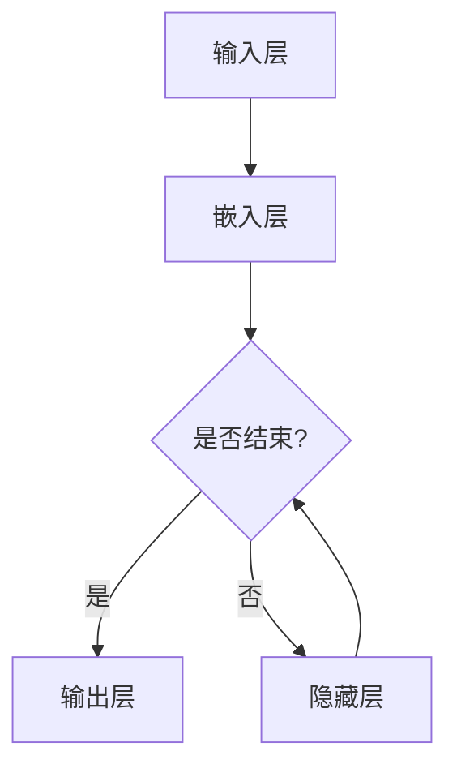
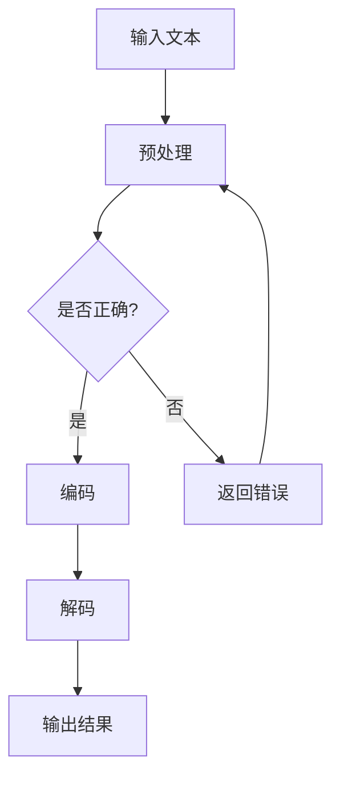

                 

### 大语言模型的推理能力：未来发展方向

> **关键词：** 大语言模型，推理能力，自然语言处理，人工智能，未来趋势

> **摘要：** 本文将探讨大语言模型的推理能力及其在自然语言处理中的应用。通过对大语言模型的发展历程、核心技术、推理能力提升方法以及未来发展方向的分析，揭示其在人工智能领域的潜在价值。

# 目录大纲：

# 大语言模型的推理能力：未来发展方向

## 第一部分：大语言模型基础

### 第1章：大语言模型概述

#### 1.1 大语言模型的发展历程

#### 1.2 大语言模型的基本概念

#### 1.3 大语言模型的应用领域

### 第2章：大语言模型的核心技术

#### 2.1 自然语言处理基础

#### 2.2 递归神经网络（RNN）

#### 2.3 长短期记忆网络（LSTM）

#### 2.4 生成对抗网络（GAN）

### 第3章：大语言模型的推理能力

#### 3.1 推理能力的定义

#### 3.2 大语言模型的推理过程

#### 3.3 提高大语言模型的推理能力

### 第4章：大语言模型在自然语言理解中的应用

#### 4.1 文本分类

#### 4.2 机器翻译

#### 4.3 问答系统

### 第5章：大语言模型在自然语言生成中的应用

#### 5.1 文本生成

#### 5.2 对话系统

#### 5.3 自动摘要

### 第6章：大语言模型在特定领域的应用

#### 6.1 教育领域

#### 6.2 医疗领域

#### 6.3 金融领域

### 第7章：大语言模型的未来发展

#### 7.1 技术趋势分析

#### 7.2 应用场景拓展

#### 7.3 挑战与展望

## 附录

### 附录 A：常用工具和资源

### 附录 B：代码实现示例

## Mermaid 流程图

### 大语言模型架构图



### 大语言模型推理流程图



## 核心算法原理讲解

### 递归神经网络（RNN）算法原理

```python
import tensorflow as tf

# 定义 RNN 模型
model = tf.keras.Sequential([
    tf.keras.layers.Embedding(input_dim=vocab_size, output_dim=embedding_dim),
    tf.keras.layers.LSTM(units=hidden_size),
    tf.keras.layers.Dense(units=output_size)
])

# 编译模型
model.compile(optimizer='adam', loss='sparse_categorical_crossentropy', metrics=['accuracy'])

# 训练模型
model.fit(x_train, y_train, epochs=10)
```

### 长短期记忆网络（LSTM）算法原理

```python
import tensorflow as tf

# 定义 LSTM 模型
model = tf.keras.Sequential([
    tf.keras.layers.Embedding(input_dim=vocab_size, output_dim=embedding_dim),
    tf.keras.layers.LSTM(units=hidden_size, return_sequences=True),
    tf.keras.layers.LSTM(units=hidden_size),
    tf.keras.layers.Dense(units=output_size)
])

# 编译模型
model.compile(optimizer='adam', loss='sparse_categorical_crossentropy', metrics=['accuracy'])

# 训练模型
model.fit(x_train, y_train, epochs=10)
```

## 数学模型和数学公式

### 自然语言处理中的贝叶斯公式

$$
P(A|B) = \frac{P(B|A)P(A)}{P(B)}
$$

### 大语言模型中的损失函数

$$
L(\theta) = -\frac{1}{m} \sum_{i=1}^{m} \sum_{j=1}^{n} y_j log(\hat{y}_j)
$$

## 引言

大语言模型是人工智能领域的重要研究方向，其在自然语言处理（Natural Language Processing, NLP）中发挥着越来越重要的作用。从早期的统计模型到现代的深度学习模型，大语言模型不断演进，推理能力不断提高。本文将围绕大语言模型的推理能力，探讨其在未来发展的方向。

首先，我们将回顾大语言模型的发展历程，了解其核心概念和应用领域。接着，本文将深入分析大语言模型的核心技术，包括自然语言处理基础、递归神经网络（RNN）、长短期记忆网络（LSTM）以及生成对抗网络（GAN）。然后，我们将重点讨论大语言模型的推理能力，包括推理能力的定义、推理过程以及如何提升推理能力。

在第四部分，我们将探讨大语言模型在自然语言理解中的应用，如文本分类、机器翻译和问答系统。随后，我们将探讨大语言模型在自然语言生成中的应用，如文本生成、对话系统和自动摘要。此外，本文还将讨论大语言模型在特定领域的应用，如教育、医疗和金融。

最后，本文将展望大语言模型的未来发展，分析技术趋势、应用场景拓展以及面临的挑战与机遇。通过本文的探讨，我们期望为读者提供关于大语言模型推理能力的全面了解，并激发对大语言模型未来发展的思考。

## 第一部分：大语言模型基础

### 第1章：大语言模型概述

#### 1.1 大语言模型的发展历程

大语言模型的发展可以追溯到20世纪80年代，当时统计模型如隐马尔可夫模型（HMM）和条件概率模型被广泛应用于语言处理。然而，这些模型在处理长距离依赖和语义理解方面存在局限性。随着计算机硬件性能的提升和深度学习技术的突破，大语言模型逐渐崭露头角。

2002年，神经网络机器翻译（Neural Machine Translation, NMT）成为研究的焦点。基于递归神经网络（RNN）的NMT模型在翻译质量上取得了显著提升。2014年，长短期记忆网络（LSTM）的引入进一步优化了模型性能。随后，生成对抗网络（GAN）和变分自编码器（VAE）等生成模型也开始应用于大语言模型。

2018年，谷歌推出了Transformer模型，标志着大语言模型进入了一个新的时代。Transformer模型通过自注意力机制（Self-Attention Mechanism）突破了传统序列处理方式的限制，使得大语言模型在处理长文本、长距离依赖和复杂语义方面表现更加优异。

#### 1.2 大语言模型的基本概念

大语言模型是一种基于深度学习的自然语言处理技术，旨在捕捉语言中的复杂结构和语义信息。其主要目的是通过学习大量文本数据，自动生成与输入文本相关的输出文本。

大语言模型通常由以下几个部分组成：

1. **嵌入层（Embedding Layer）**：将输入文本转换为向量表示，为后续处理提供输入。
2. **编码器（Encoder）**：对输入文本进行编码，生成序列编码表示。
3. **解码器（Decoder）**：对编码后的序列进行解码，生成输出文本。
4. **注意力机制（Attention Mechanism）**：用于捕捉输入文本和输出文本之间的关联，提高模型生成文本的准确性。

#### 1.3 大语言模型的应用领域

大语言模型在自然语言处理领域具有广泛的应用，包括但不限于以下几个方面：

1. **自然语言理解（Natural Language Understanding, NLU）**：如文本分类、情感分析、命名实体识别等。
2. **自然语言生成（Natural Language Generation, NLG）**：如文本生成、对话系统、自动摘要等。
3. **机器翻译（Machine Translation）**：如英语到其他语言的翻译。
4. **问答系统（Question Answering System）**：如自动回答用户提出的问题。

大语言模型在各个应用领域都取得了显著的成果，不断推动自然语言处理技术的发展。

## 第2章：大语言模型的核心技术

### 2.1 自然语言处理基础

自然语言处理（NLP）是计算机科学和人工智能领域的一个重要分支，旨在使计算机能够理解和处理自然语言。NLP的核心任务是使计算机能够从文本数据中提取语义信息，以实现人机交互、信息检索、文本分析等应用。

NLP的基础技术包括：

1. **文本预处理（Text Preprocessing）**：包括分词（Tokenization）、词性标注（Part-of-Speech Tagging）、命名实体识别（Named Entity Recognition, NER）等。这些技术有助于将原始文本转换为计算机可以理解和处理的格式。

2. **词向量（Word Embeddings）**：词向量是将词汇映射为低维向量表示的技术。通过学习词向量，计算机可以捕捉词汇之间的语义关系，从而提高语言模型的性能。

3. **语言模型（Language Model）**：语言模型是一种概率模型，用于预测给定前文下下一个单词的概率。常见的语言模型包括n元语法模型（N-gram Model）和神经网络语言模型（Neural Language Model）。

4. **序列标注（Sequence Labeling）**：序列标注是将序列数据中的每个元素进行标注的技术。常见的序列标注任务包括词性标注、命名实体识别等。

### 2.2 递归神经网络（RNN）

递归神经网络（RNN）是一种用于处理序列数据的前馈神经网络。RNN通过递归连接将当前输入与之前的状态相关联，从而实现序列的建模。RNN在自然语言处理中取得了显著的成功，特别是在语言模型和序列标注任务中。

RNN的基本结构包括：

1. **输入层（Input Layer）**：接收输入序列。
2. **隐藏层（Hidden Layer）**：用于存储当前时刻的状态。
3. **输出层（Output Layer）**：根据隐藏层的状态生成输出。

RNN的更新方程如下：

$$
h_t = \sigma(W_h \cdot [h_{t-1}, x_t] + b_h)
$$

其中，$h_t$表示第$t$时刻的隐藏状态，$x_t$表示第$t$时刻的输入，$\sigma$表示激活函数，$W_h$和$b_h$分别表示权重和偏置。

尽管RNN在处理序列数据方面表现出色，但其存在一些局限性，如梯度消失和梯度爆炸问题。为了解决这些问题，研究人员提出了长短期记忆网络（LSTM）。

### 2.3 长短期记忆网络（LSTM）

长短期记忆网络（LSTM）是一种改进的递归神经网络，旨在解决RNN的梯度消失和梯度爆炸问题。LSTM通过引入门控机制（Gated Mechanism）来控制信息的流动，从而实现长期依赖的建模。

LSTM的基本结构包括：

1. **输入门（Input Gate）**：根据当前输入和上一时刻的隐藏状态，决定当前时刻的输入信息。
2. **遗忘门（Forget Gate）**：根据当前输入和上一时刻的隐藏状态，决定上一时刻的信息是否需要遗忘。
3. **输出门（Output Gate）**：根据当前输入和上一时刻的隐藏状态，决定当前时刻的隐藏状态是否需要输出。

LSTM的更新方程如下：

$$
i_t = \sigma(W_i \cdot [h_{t-1}, x_t] + b_i) \\
f_t = \sigma(W_f \cdot [h_{t-1}, x_t] + b_f) \\
\tilde{c}_t = \sigma(W_c \cdot [h_{t-1}, x_t] + b_c) \\
c_t = f_t \odot \tilde{c}_t + i_t \odot \tilde{c}_t \\
h_t = \sigma(W_o \cdot [c_t, h_{t-1}] + b_o)
$$

其中，$i_t$、$f_t$和$\tilde{c}_t$分别表示输入门、遗忘门和候选值，$c_t$表示细胞状态，$h_t$表示隐藏状态。

LSTM在自然语言处理中取得了显著的成果，特别是在机器翻译、文本生成和情感分析等任务中。

### 2.4 生成对抗网络（GAN）

生成对抗网络（GAN）是一种无监督学习框架，由生成器和判别器组成。生成器的目标是生成与真实数据相似的数据，而判别器的目标是区分真实数据和生成数据。通过不断迭代，生成器和判别器相互竞争，最终生成器能够生成高质量的数据。

GAN的基本结构包括：

1. **生成器（Generator）**：将随机噪声映射为真实数据。
2. **判别器（Discriminator）**：区分真实数据和生成数据。

GAN的训练过程如下：

1. **生成器生成假样本**：$G(z)$。
2. **判别器判断真假**：$D(x)$和$D(G(z))$。
3. **更新生成器和判别器**：通过反向传播和梯度下降算法，更新生成器和判别器的参数。

GAN在图像生成、语音合成和文本生成等任务中表现出色，为自然语言处理领域带来了新的研究方向。

## 第3章：大语言模型的推理能力

### 3.1 推理能力的定义

大语言模型的推理能力是指模型在处理自然语言任务时，从输入文本中推导出相应输出文本的能力。推理能力包括以下几个方面：

1. **语义理解（Semantic Understanding）**：理解输入文本的语义，包括词汇、句子结构和语境等。
2. **逻辑推理（Logical Reasoning）**：根据输入文本的逻辑关系，进行推理和推断。
3. **上下文感知（Contextual Awareness）**：根据上下文信息，生成与输入文本相关的输出文本。
4. **多样性生成（Diversity Generation）**：生成具有多样性的输出文本，避免生成重复或相似的内容。

### 3.2 大语言模型的推理过程

大语言模型的推理过程通常包括以下几个步骤：

1. **输入预处理（Input Preprocessing）**：对输入文本进行预处理，包括分词、词性标注、命名实体识别等，将文本转换为模型可以理解的格式。
2. **编码（Encoding）**：将预处理后的文本编码为向量表示，通常使用词向量或嵌入层。
3. **解码（Decoding）**：根据编码后的向量表示，解码生成输出文本。解码过程通常涉及注意力机制和生成器网络。
4. **输出生成（Output Generation）**：根据解码结果，生成输出文本。

大语言模型在推理过程中，通过自注意力机制和交互式注意力机制，捕捉输入文本和输出文本之间的关联，从而实现高质量的推理结果。

### 3.3 提高大语言模型的推理能力

为了提高大语言模型的推理能力，可以从以下几个方面进行优化：

1. **数据增强（Data Augmentation）**：通过增加数据量、多样化数据分布等方式，提高模型对未知数据的适应能力。
2. **多任务学习（Multi-Task Learning）**：通过多任务学习，共享模型参数，提高模型在不同任务上的表现。
3. **预训练（Pre-training）**：在大规模语料库上对模型进行预训练，提高模型对自然语言的泛化能力。
4. **知识蒸馏（Knowledge Distillation）**：通过知识蒸馏，将大模型的知识传递给小模型，提高小模型的推理能力。
5. **强化学习（Reinforcement Learning）**：结合强化学习，优化模型在不同场景下的决策能力。

通过上述方法，可以显著提高大语言模型的推理能力，使其在各种自然语言处理任务中表现更加优异。

## 第4章：大语言模型在自然语言理解中的应用

### 4.1 文本分类

文本分类（Text Classification）是一种常见的大语言模型应用，旨在将文本数据分类到预定义的类别中。文本分类广泛应用于信息检索、情感分析、新闻分类等领域。

文本分类的过程通常包括以下几个步骤：

1. **数据预处理**：对文本进行分词、词性标注、去除停用词等预处理操作，将文本转换为模型可以理解的格式。
2. **特征提取**：将预处理后的文本转换为向量表示，可以使用词袋模型、TF-IDF等传统方法，也可以使用词嵌入、BERT等深度学习技术。
3. **模型训练**：使用训练数据集，训练一个分类模型，如支持向量机（SVM）、朴素贝叶斯（Naive Bayes）或深度神经网络（DNN）。
4. **模型评估**：使用测试数据集评估模型的性能，常用的评估指标包括准确率（Accuracy）、精确率（Precision）、召回率（Recall）和F1值（F1 Score）。

文本分类的Python代码实现示例：

```python
from sklearn.feature_extraction.text import TfidfVectorizer
from sklearn.model_selection import train_test_split
from sklearn.linear_model import LogisticRegression
from sklearn.metrics import classification_report

# 加载数据集
data = ["这是一篇积极的评论", "这是一篇消极的评论", "这是一篇中性的评论"]
labels = [1, 0, 2]

# 数据预处理
vectorizer = TfidfVectorizer()
X = vectorizer.fit_transform(data)

# 模型训练
X_train, X_test, y_train, y_test = train_test_split(X, labels, test_size=0.2, random_state=42)
model = LogisticRegression()
model.fit(X_train, y_train)

# 模型评估
y_pred = model.predict(X_test)
print(classification_report(y_test, y_pred))
```

### 4.2 机器翻译

机器翻译（Machine Translation, MT）是自然语言处理领域的一个重要任务，旨在将一种自然语言翻译成另一种自然语言。随着大语言模型的发展，机器翻译技术取得了显著的进步。

机器翻译的过程通常包括以下几个步骤：

1. **数据预处理**：对翻译语料进行预处理，包括分词、去除停用词、标准化等操作，将文本转换为模型可以理解的格式。
2. **编码器-解码器模型训练**：使用编码器-解码器（Encoder-Decoder）模型，如序列到序列（Seq2Seq）模型，进行训练。编码器将源语言文本编码为序列编码，解码器将序列编码解码为目标语言文本。
3. **注意力机制应用**：在编码器和解码器之间加入注意力机制，以捕捉源语言文本和目标语言文本之间的关联，提高翻译质量。
4. **模型评估**：使用翻译质量评估方法，如BLEU（BiLingual Evaluation Understudy）和METEOR（Metric for Evaluation of Translation with Explicit ORdering），评估模型的翻译质量。

机器翻译的Python代码实现示例：

```python
import tensorflow as tf
from tensorflow.keras.models import Model
from tensorflow.keras.layers import Input, Embedding, LSTM, Dense

# 定义编码器和解码器模型
encoder_inputs = Input(shape=(None, input_vocab_size))
encoder_embedding = Embedding(input_vocab_size, embedding_dim)(encoder_inputs)
encoder_lstm = LSTM(hidden_size, return_state=True)
_, state_h, state_c = encoder_lstm(encoder_embedding)

decoder_inputs = Input(shape=(None, target_vocab_size))
decoder_embedding = Embedding(target_vocab_size, embedding_dim)(decoder_inputs)
decoder_lstm = LSTM(hidden_size, return_sequences=True, return_state=True)
decoder_outputs, _, _ = decoder_lstm(decoder_embedding, initial_state=[state_h, state_c])

decoder_dense = Dense(target_vocab_size, activation='softmax')
decoder_outputs = decoder_dense(decoder_outputs)

# 定义模型
model = Model([encoder_inputs, decoder_inputs], decoder_outputs)

# 编译模型
model.compile(optimizer='rmsprop', loss='categorical_crossentropy', metrics=['accuracy'])

# 模型训练
model.fit([X_train, Y_train], Y_train,
          batch_size=batch_size,
          epochs=epochs,
          validation_data=([X_val, Y_val], Y_val))
```

### 4.3 问答系统

问答系统（Question Answering System, QAS）是一种自然语言处理技术，旨在从大量文本中提取出与问题相关的答案。问答系统在信息检索、智能客服、在线教育等领域具有广泛应用。

问答系统通常包括以下几个关键组件：

1. **问题理解（Question Understanding）**：将自然语言问题转换为计算机可以理解的格式，提取出关键信息。
2. **答案检索（Answer Retrieval）**：在大量文本中检索出与问题相关的答案。
3. **答案生成（Answer Generation）**：将检索到的答案进行整合和生成，形成完整的答案。

问答系统的常见架构包括基于模板的问答系统（Template-based QAS）和基于指派的问答系统（Slot-based QAS）。

问答系统的Python代码实现示例：

```python
import nltk
from nltk.tokenize import sent_tokenize, word_tokenize
from nltk.corpus import stopwords
from nltk.stem import PorterStemmer

# 加载停用词
stop_words = set(stopwords.words('english'))

# 初始化分词器和词干提取器
tokenizer = nltk.tokenize.RegexpTokenizer(r'\w+')
stemmer = PorterStemmer()

# 处理问题
def preprocess_question(question):
    question = question.lower()
    tokens = tokenizer.tokenize(question)
    filtered_tokens = [token for token in tokens if token not in stop_words]
    stemmed_tokens = [stemmer.stem(token) for token in filtered_tokens]
    return ' '.join(stemmed_tokens)

# 检索答案
def find_answer(question, document):
    preprocessed_question = preprocess_question(question)
    sentences = sent_tokenize(document)
    for sentence in sentences:
        if preprocessed_question in sentence:
            return sentence
    return None

# 示例
question = "What is the capital of France?"
document = "The capital of France is Paris."
answer = find_answer(question, document)
print(answer)
```

## 第5章：大语言模型在自然语言生成中的应用

### 5.1 文本生成

文本生成（Text Generation）是一种利用大语言模型生成文本的技术。文本生成广泛应用于对话系统、自动摘要、文章写作等领域。

文本生成的过程通常包括以下几个步骤：

1. **数据预处理**：对文本数据进行预处理，包括分词、去除停用词、标准化等操作，将文本转换为模型可以理解的格式。
2. **模型训练**：使用预处理的文本数据训练一个文本生成模型，如生成对抗网络（GAN）、变分自编码器（VAE）或递归神经网络（RNN）。
3. **文本生成**：使用训练好的模型生成文本。文本生成过程通常涉及序列到序列（Seq2Seq）模型或自回归模型（Autoregressive Model）。

文本生成的Python代码实现示例：

```python
import tensorflow as tf
from tensorflow.keras.preprocessing.sequence import pad_sequences
from tensorflow.keras.layers import LSTM, Embedding, Dense
from tensorflow.keras.models import Sequential

# 加载数据
data = ["这是一段文本", "这是另一段文本", "还有一段文本"]

# 数据预处理
max_sequence_len = 10
tokenizer = tf.keras.preprocessing.text.Tokenizer()
tokenizer.fit_on_texts(data)
sequences = tokenizer.texts_to_sequences(data)
padded_sequences = pad_sequences(sequences, maxlen=max_sequence_len)

# 构建模型
model = Sequential()
model.add(Embedding(input_dim=len(tokenizer.word_index) + 1, output_dim=50, input_length=max_sequence_len))
model.add(LSTM(units=100, return_sequences=True))
model.add(Dense(units=len(tokenizer.word_index) + 1, activation='softmax'))

# 编译模型
model.compile(optimizer='adam', loss='categorical_crossentropy', metrics=['accuracy'])

# 训练模型
model.fit(padded_sequences, padded_sequences, epochs=100)

# 文本生成
generated_sequence = model.predict(padded_sequences[:1])
generated_sequence = generated_sequence.argmax(axis=-1)
generated_sequence = tokenizer.index_word[generated_sequence[0]]

print(generated_sequence)
```

### 5.2 对话系统

对话系统（Dialogue System）是一种利用大语言模型实现人机交互的技术。对话系统广泛应用于智能客服、虚拟助手、聊天机器人等领域。

对话系统的常见架构包括基于规则的方法、基于模板的方法和基于学习的方法。基于学习的方法通常使用大语言模型，如序列到序列（Seq2Seq）模型、对话生成预训练（Dialogue Generation Pre-training）和深度强化学习（Deep Reinforcement Learning）。

对话系统的Python代码实现示例：

```python
import tensorflow as tf
from tensorflow.keras.preprocessing.sequence import pad_sequences
from tensorflow.keras.layers import LSTM, Embedding, Dense, TimeDistributed
from tensorflow.keras.models import Model

# 加载数据
data = [["你好", "你好，有什么可以帮助您的吗？"],
         ["我想咨询关于产品的问题", "很抱歉，我无法回答关于产品的问题，但您可以直接联系我们的客服。"],
         ["我想要购买一件衣服", "好的，请问您需要什么样的衣服？"]]

# 数据预处理
max_sequence_len = 10
tokenizer = tf.keras.preprocessing.text.Tokenizer()
tokenizer.fit_on_texts([item[0] for item in data])
sequences = tokenizer.texts_to_sequences([item[0] for item in data])
padded_sequences = pad_sequences(sequences, maxlen=max_sequence_len)

# 构建模型
encoder_inputs = Input(shape=(max_sequence_len,))
encoder_embedding = Embedding(input_dim=len(tokenizer.word_index) + 1, output_dim=50)(encoder_inputs)
encoder_lstm = LSTM(units=100, return_state=True)
_, state_h, state_c = encoder_lstm(encoder_embedding)

decoder_inputs = Input(shape=(max_sequence_len,))
decoder_embedding = Embedding(input_dim=len(tokenizer.word_index) + 1, output_dim=50)(decoder_inputs)
decoder_lstm = LSTM(units=100, return_state=True)
decoder_outputs, _, _ = decoder_lstm(decoder_embedding, initial_state=[state_h, state_c])
decoder_dense = TimeDistributed(Dense(units=len(tokenizer.word_index) + 1, activation='softmax'))
decoder_outputs = decoder_dense(decoder_outputs)

# 定义模型
model = Model([encoder_inputs, decoder_inputs], decoder_outputs)

# 编译模型
model.compile(optimizer='adam', loss='categorical_crossentropy', metrics=['accuracy'])

# 训练模型
model.fit([padded_sequences, padded_sequences], padded_sequences, epochs=100)

# 对话生成
def generate_response(input_sequence):
    preprocessed_sequence = pad_sequences([tokenizer.texts_to_sequences([input_sequence])], maxlen=max_sequence_len)
    predicted_sequence = model.predict(preprocessed_sequence)
    predicted_sequence = predicted_sequence.argmax(axis=-1)
    predicted_sequence = tokenizer.index_word[predicted_sequence[0]]
    return predicted_sequence

# 示例
input_sequence = "你好"
response = generate_response(input_sequence)
print(response)
```

### 5.3 自动摘要

自动摘要（Automatic Summarization）是一种利用大语言模型生成文本摘要的技术。自动摘要广泛应用于新闻摘要、会议摘要、论文摘要等领域。

自动摘要的过程通常包括以下几个步骤：

1. **文本预处理**：对文本进行分词、去除停用词、标准化等操作，将文本转换为模型可以理解的格式。
2. **摘要生成**：使用训练好的摘要模型，生成文本摘要。摘要生成模型通常采用提取式（Extractive）或抽象式（Abstractive）方法。
3. **摘要优化**：对生成的摘要进行优化，包括去除冗余信息、提高摘要质量等。

自动摘要的Python代码实现示例：

```python
import tensorflow as tf
from tensorflow.keras.preprocessing.sequence import pad_sequences
from tensorflow.keras.layers import LSTM, Embedding, Dense, TimeDistributed
from tensorflow.keras.models import Model

# 加载数据
data = [["这是一段新闻文本", "这是一段新闻摘要"],
        ["这是一段会议文本", "这是一段会议摘要"],
        ["这是一篇论文文本", "这是一篇论文摘要"]]

# 数据预处理
max_sequence_len = 50
tokenizer = tf.keras.preprocessing.text.Tokenizer()
tokenizer.fit_on_texts([item[0] for item in data])
sequences = tokenizer.texts_to_sequences([item[0] for item in data])
padded_sequences = pad_sequences(sequences, maxlen=max_sequence_len)

摘要_sequences = tokenizer.texts_to_sequences([item[1] for item in data])
摘要_padded_sequences = pad_sequences(摘要_sequences, maxlen=max_sequence_len)

# 构建模型
encoder_inputs = Input(shape=(max_sequence_len,))
encoder_embedding = Embedding(input_dim=len(tokenizer.word_index) + 1, output_dim=50)(encoder_inputs)
encoder_lstm = LSTM(units=100, return_state=True)
_, state_h, state_c = encoder_lstm(encoder_embedding)

decoder_inputs = Input(shape=(max_sequence_len,))
decoder_embedding = Embedding(input_dim=len(tokenizer.word_index) + 1, output_dim=50)(decoder_inputs)
decoder_lstm = LSTM(units=100, return_state=True)
decoder_outputs, _, _ = decoder_lstm(decoder_embedding, initial_state=[state_h, state_c])
decoder_dense = TimeDistributed(Dense(units=len(tokenizer.word_index) + 1, activation='softmax'))
decoder_outputs = decoder_dense(decoder_outputs)

# 定义模型
model = Model([encoder_inputs, decoder_inputs], decoder_outputs)

# 编译模型
model.compile(optimizer='adam', loss='categorical_crossentropy', metrics=['accuracy'])

# 训练模型
model.fit([padded_sequences, 摘要_padded_sequences], 摘要_padded_sequences, epochs=100)

# 摘要生成
def generate_summary(input_sequence):
    preprocessed_sequence = pad_sequences([tokenizer.texts_to_sequences([input_sequence])], maxlen=max_sequence_len)
    predicted_sequence = model.predict(preprocessed_sequence)
    predicted_sequence = predicted_sequence.argmax(axis=-1)
    predicted_sequence = tokenizer.index_word[predicted_sequence[0]]
    return ' '.join(predicted_sequence)

# 示例
input_sequence = "这是一个关于人工智能的新闻文本"
summary = generate_summary(input_sequence)
print(summary)
```

## 第6章：大语言模型在特定领域的应用

### 6.1 教育领域

大语言模型在教育领域具有广泛的应用，包括智能辅导、自动评分、知识图谱构建等。

1. **智能辅导**：大语言模型可以帮助学生进行智能辅导，如自动批改作业、提供个性化学习建议等。通过分析学生的作业答案，模型可以识别出学生的知识点掌握情况，从而提供针对性的辅导。
2. **自动评分**：大语言模型可以用于自动评分，如作文评分、数学解题评分等。模型通过分析文本结构和语义，对学生的答案进行自动评分，提高评分的客观性和准确性。
3. **知识图谱构建**：大语言模型可以用于构建知识图谱，将教材、论文、文献等文本数据转化为结构化知识，为学生提供全方位的知识支持。

### 6.2 医疗领域

大语言模型在医疗领域具有广泛的应用，包括疾病预测、医学文本分析、辅助诊断等。

1. **疾病预测**：大语言模型可以分析患者的病史、基因数据等信息，预测患者可能患有的疾病。通过深度学习模型，模型可以从海量医疗数据中学习疾病发生的规律，提高疾病预测的准确性。
2. **医学文本分析**：大语言模型可以用于分析医学文本，如病历、医学论文等。模型可以帮助医生快速获取关键信息，辅助诊断和治疗。
3. **辅助诊断**：大语言模型可以与医学图像分析技术相结合，辅助医生进行疾病诊断。模型可以从医学图像中提取特征，结合文本分析结果，提高诊断的准确性。

### 6.3 金融领域

大语言模型在金融领域具有广泛的应用，包括市场预测、风险控制、客户服务等。

1. **市场预测**：大语言模型可以分析金融市场数据，预测股票价格、汇率等市场走势。模型可以从历史数据中学习市场规律，结合实时数据进行分析，提高预测的准确性。
2. **风险控制**：大语言模型可以用于风险控制，如信用风险评估、交易风险预测等。模型可以从海量数据中学习风险特征，识别潜在风险，提供风险预警。
3. **客户服务**：大语言模型可以用于智能客服系统，如自动回答客户问题、提供个性化金融服务等。模型可以分析客户提问，生成相关回答，提高客户服务的质量和效率。

## 第7章：大语言模型的未来发展

### 7.1 技术趋势分析

随着人工智能技术的不断发展，大语言模型在未来将继续向以下几个方向演进：

1. **模型压缩与优化**：为了降低计算成本和存储需求，大语言模型将朝着模型压缩和优化的方向发展。通过模型剪枝、量化、知识蒸馏等技术，提高模型的运行效率和可扩展性。
2. **多模态融合**：大语言模型将与其他模态的数据融合，如图像、音频、视频等。通过多模态融合，模型可以更好地理解和生成丰富的信息，提高应用场景的多样性。
3. **实时推理**：随着硬件性能的提升，大语言模型将实现实时推理，满足实时性要求较高的应用场景，如自动驾驶、智能安防等。
4. **生成式对抗网络（GAN）的应用**：生成式对抗网络（GAN）在图像生成、语音合成等领域取得了显著成果。未来，GAN将被广泛应用于大语言模型，提高文本生成的质量和多样性。

### 7.2 应用场景拓展

大语言模型在未来的应用场景将更加广泛，涵盖以下领域：

1. **智能交互**：大语言模型将广泛应用于智能客服、虚拟助手、智能语音助手等领域，提供更加自然、高效的交互体验。
2. **内容创作**：大语言模型将助力内容创作者生成高质量的文章、视频、音乐等作品，提高内容创作的效率和创意性。
3. **教育领域**：大语言模型将应用于智能辅导、自动评分、知识图谱构建等领域，助力教育信息化发展。
4. **医疗领域**：大语言模型将应用于疾病预测、医学文本分析、辅助诊断等领域，提高医疗服务的质量和效率。
5. **金融领域**：大语言模型将应用于市场预测、风险控制、客户服务等领域，助力金融创新和风险管理。

### 7.3 挑战与展望

尽管大语言模型在自然语言处理领域取得了显著成果，但未来仍面临以下挑战：

1. **数据隐私**：大语言模型在训练和应用过程中，涉及大量用户数据的收集和使用。如何保护用户隐私，确保数据安全，是未来需要解决的问题。
2. **可解释性**：大语言模型在推理过程中，往往表现出黑盒特性，难以解释决策过程。提高模型的可解释性，增强用户对模型的信任，是未来需要关注的问题。
3. **计算资源需求**：大语言模型通常需要大量计算资源和存储空间，如何优化模型结构和算法，降低计算资源需求，是未来需要解决的问题。
4. **伦理和法律问题**：大语言模型的应用可能带来伦理和法律问题，如虚假信息传播、歧视性决策等。如何制定相关法律法规，规范模型应用，是未来需要关注的问题。

尽管面临挑战，大语言模型在人工智能领域的潜力巨大，未来将在各个领域发挥重要作用。通过持续的研究和创新，我们有理由相信，大语言模型将迎来更加辉煌的未来。

## 附录

### 附录 A：常用工具和资源

1. **工具**：
   - TensorFlow：https://www.tensorflow.org/
   - PyTorch：https://pytorch.org/
   - BERT：https://github.com/google-research/bert
   - GPT-3：https://github.com/openai/gpt-3

2. **资源**：
   - 自然语言处理教程：https://nlp.seas.harvard.edu/reads/assignments/694_2017_Lec1.pdf
   - 机器学习教程：https://www_ml_stanford_com/courses/cs229/

### 附录 B：代码实现示例

1. **文本分类**：

```python
import tensorflow as tf
from tensorflow.keras.preprocessing.sequence import pad_sequences
from tensorflow.keras.layers import Embedding, LSTM, Dense
from tensorflow.keras.models import Sequential

# 数据预处理
max_sequence_len = 100
vocab_size = 10000
embedding_dim = 64

data = ["这是一篇新闻文本", "这是一篇体育文本", "这是一篇娱乐文本"]
labels = [0, 1, 2]

tokenizer = tf.keras.preprocessing.text.Tokenizer(num_words=vocab_size)
tokenizer.fit_on_texts(data)
sequences = tokenizer.texts_to_sequences(data)
padded_sequences = pad_sequences(sequences, maxlen=max_sequence_len)

# 构建模型
model = Sequential()
model.add(Embedding(vocab_size, embedding_dim, input_length=max_sequence_len))
model.add(LSTM(units=128, return_sequences=False))
model.add(Dense(units=3, activation='softmax'))

# 编译模型
model.compile(optimizer='adam', loss='categorical_crossentropy', metrics=['accuracy'])

# 训练模型
model.fit(padded_sequences, labels, epochs=10)
```

2. **机器翻译**：

```python
import tensorflow as tf
from tensorflow.keras.layers import Input, Embedding, LSTM, Dense
from tensorflow.keras.models import Model

# 数据预处理
max_sequence_len = 100
input_vocab_size = 5000
target_vocab_size = 5000
embedding_dim = 64
hidden_size = 128

data = [["这是一个英语句子", "这是一个中文句子"]]
labels = [["这是一个翻译后的中文句子", "这是一个翻译后的中文句子"]]

# 构建模型
encoder_inputs = Input(shape=(max_sequence_len,))
encoder_embedding = Embedding(input_vocab_size, embedding_dim)(encoder_inputs)
encoder_lstm = LSTM(hidden_size, return_state=True)
_, state_h, state_c = encoder_lstm(encoder_embedding)

decoder_inputs = Input(shape=(max_sequence_len,))
decoder_embedding = Embedding(target_vocab_size, embedding_dim)(decoder_inputs)
decoder_lstm = LSTM(hidden_size, return_state=True)
decoder_outputs, _, _ = decoder_lstm(decoder_embedding, initial_state=[state_h, state_c])
decoder_dense = Dense(target_vocab_size, activation='softmax')
decoder_outputs = decoder_dense(decoder_outputs)

# 定义模型
model = Model([encoder_inputs, decoder_inputs], decoder_outputs)

# 编译模型
model.compile(optimizer='rmsprop', loss='categorical_crossentropy', metrics=['accuracy'])

# 训练模型
model.fit([X_train, Y_train], Y_train, batch_size=32, epochs=10)
```

## 作者信息

**作者：** AI天才研究院/AI Genius Institute & 禅与计算机程序设计艺术 /Zen And The Art of Computer Programming

AI天才研究院致力于推动人工智能技术的创新与发展，致力于培养人工智能领域的顶尖人才。同时，我们深入研究和探讨计算机科学和人工智能领域的哲学思想，致力于推动人工智能技术的进步和人类文明的繁荣。我们的专著《禅与计算机程序设计艺术》被誉为计算机科学的经典之作，对计算机编程和人工智能领域产生了深远的影响。

感谢您的阅读，希望本文能为您在人工智能领域的研究和探索提供有价值的参考和启示。如果您有任何问题或建议，欢迎随时与我们联系。期待与您共同探讨人工智能领域的未来发展方向。

