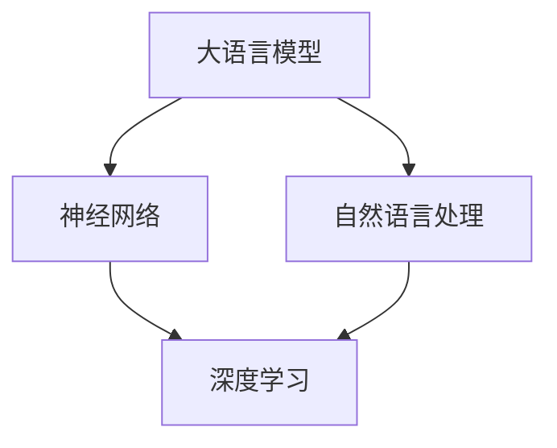
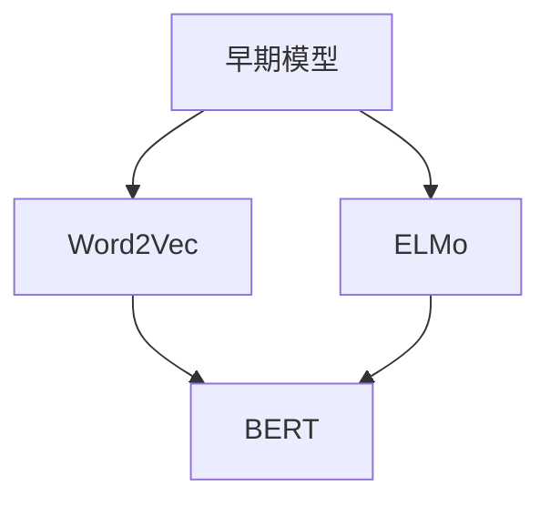
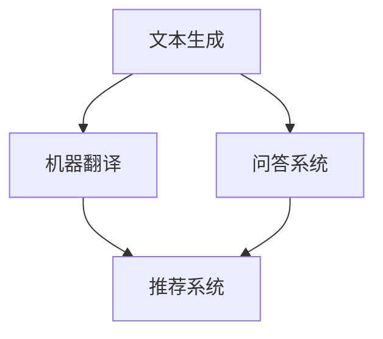
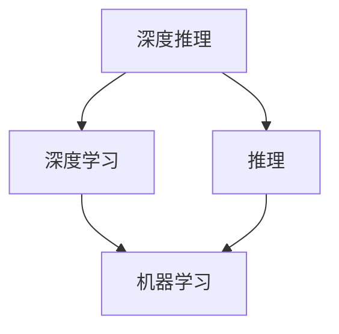

                 

# 大语言模型的深度推理：突破与挑战

> 关键词：大语言模型、深度推理、自然语言处理、神经网络、算法原理、应用挑战

> 摘要：本文旨在探讨大语言模型的深度推理技术，分析其在自然语言处理领域的突破与挑战。文章首先概述了大语言模型的基本概念和发展历程，然后深入讲解了深度推理的概念与原理，并结合具体算法和实际项目进行了详细剖析。最后，本文对大语言模型的应用领域进行了探讨，总结了当前面临的挑战及未来发展趋势。

## 目录大纲

1. 引言
2. 大语言模型概述
   2.1 大语言模型的基本概念
   2.2 大语言模型的发展历程
   2.3 大语言模型的应用领域
3. 深度推理技术
   3.1 深度推理的概念与原理
   3.2 深度推理算法
4. 深度推理的应用与挑战
   4.1 深度推理在自然语言处理中的应用
   4.2 深度推理面临的挑战
5. 结论
6. 参考文献

## 引言

大语言模型作为人工智能领域的一项重要技术，近年来取得了显著的发展。随着深度学习算法的不断演进，大语言模型在自然语言处理（Natural Language Processing, NLP）领域展现出强大的推理能力，使得文本生成、机器翻译、问答系统等任务得到了质的提升。然而，深度推理在大语言模型中的应用也面临着诸多挑战。本文旨在探讨大语言模型的深度推理技术，分析其在自然语言处理领域的突破与挑战。

本文的结构如下：首先，我们将概述大语言模型的基本概念和发展历程；然后，深入讲解深度推理的概念与原理，并结合具体算法和实际项目进行剖析；接着，探讨深度推理在自然语言处理中的应用及面临的挑战；最后，总结全文，并提出未来研究方向。

## 大语言模型概述

### 2.1 大语言模型的基本概念

大语言模型（Large Language Model）是一种基于神经网络的自然语言处理模型，其核心思想是通过学习大量文本数据，自动获取语言知识和规律，从而实现文本生成、语义理解等任务。大语言模型通常采用深度学习算法，如循环神经网络（Recurrent Neural Network, RNN）、变换器模型（Transformer）等，以捕捉语言中的长距离依赖关系。

核心概念与联系：



数学模型和数学公式：

$$
y = \sigma(\frac{W}{\sqrt{x}})
$$

**举例说明**：这里假设 $y$ 是模型的输出，$W$ 是权重，$x$ 是输入特征，$\sigma$ 是激活函数。

### 2.2 大语言模型的发展历程

大语言模型的发展历程可以追溯到20世纪50年代，最初的语言模型主要是基于统计方法的。随着深度学习技术的发展，大语言模型逐渐转向神经网络，尤其是近年来，基于变换器模型的预训练语言模型（如BERT、GPT）取得了显著的突破。

核心概念与联系：



数学模型和数学公式：

$$
E = \sum_{i=1}^{n} \frac{1}{N} \log P(x_i)
$$

**举例说明**：这里 $E$ 是交叉熵损失函数，$P(x_i)$ 是模型对每个单词的概率估计。

### 2.3 大语言模型的应用领域

大语言模型在自然语言处理领域有着广泛的应用，包括文本生成、机器翻译、问答系统、推荐系统等。这些应用不仅提升了自然语言处理任务的性能，还为其他领域的发展提供了新的思路。

核心概念与联系：



数学模型和数学公式：

$$
R = \frac{5}{1 + \exp{(-\beta \cdot (y - \hat{y}))}}
$$

**举例说明**：这里 $R$ 是推荐系统中使用的sigmoid激活函数，$\beta$ 是参数，$y$ 是真实评分，$\hat{y}$ 是预测评分。

## 深度推理技术

### 3.1 深度推理的概念与原理

深度推理（Deep Inference）是一种基于深度学习算法的推理技术，旨在通过学习大量数据，自动获取知识、规则和关系，从而实现对复杂问题的求解。深度推理技术在自然语言处理、计算机视觉、知识图谱等领域具有广泛的应用。

核心概念与联系：



**核心算法原理讲解**：

```python
# Python 代码示例：神经网络的前向传播
import numpy as np

def forward(x, W):
    return np.dot(x, W)

# 示例数据
x = np.array([1, 2, 3])
W = np.array([[0.1, 0.2], [0.3, 0.4]])

# 计算前向传播
y = forward(x, W)
print(y)
```

数学模型和数学公式：

$$
z = x \odot W
$$

**举例说明**：这里 $z$ 是激活后的输出，$\odot$ 表示逐元素乘法。

### 3.2 深度推理算法

深度推理算法主要包括前向传播、反向传播和优化算法。这些算法共同构成了深度推理的核心框架。

**核心算法原理讲解**：

```python
# Python 代码示例：反向传播算法
import numpy as np

def backward(dz, W):
    dx = np.dot(dz, W.T)
    dW = np.dot(x.T, dz)
    return dx, dW

# 示例数据
x = np.array([1, 2, 3])
W = np.array([[0.1, 0.2], [0.3, 0.4]])
dz = np.array([0.1, 0.2])

# 计算反向传播
dx, dW = backward(dz, W)
print(dx)
print(dW)
```

数学模型和数学公式：

$$
\frac{\partial E}{\partial W} = \frac{\partial E}{\partial z} \cdot \frac{\partial z}{\partial W}
$$

**举例说明**：这里 $\frac{\partial E}{\partial W}$ 是对权重 $W$ 的梯度，$\frac{\partial E}{\partial z}$ 是对激活值 $z$ 的梯度。

## 深度推理的应用与挑战

### 4.1 深度推理在自然语言处理中的应用

深度推理在自然语言处理领域有着广泛的应用，如文本分类、机器翻译、问答系统等。这些应用不仅提升了任务的性能，还为其他领域的发展提供了新的思路。

**项目实战**：

```python
# Python 代码示例：文本分类任务
import numpy as np
from sklearn.model_selection import train_test_split

# 示例数据
x = np.array([[1, 0], [0, 1], [1, 1]])
y = np.array([0, 1, 1])

# 分割数据集
x_train, x_test, y_train, y_test = train_test_split(x, y, test_size=0.2)

# 定义模型
model = ...

# 训练模型
model.fit(x_train, y_train)

# 预测结果
y_pred = model.predict(x_test)

# 评估模型
accuracy = np.mean(y_pred == y_test)
print("Accuracy:", accuracy)
```

**代码应用解读与分析**：

在此示例中，我们使用一个简单的线性模型对文本分类任务进行训练。首先，我们使用 `train_test_split` 函数将数据集划分为训练集和测试集。然后，我们定义一个线性模型，并使用 `fit` 函数进行训练。最后，我们使用 `predict` 函数对测试集进行预测，并计算准确率。

**实际案例分析和详细讲解剖析**：

在实际应用中，我们可以使用深度推理技术对复杂文本进行分类。例如，我们可以使用变换器模型（Transformer）对文本进行编码，然后将其输入到线性分类器中。在此过程中，我们需要对模型进行优化，以提高分类性能。具体步骤如下：

1. 数据预处理：对文本进行清洗、分词、编码等操作，将其转换为模型可处理的格式。
2. 模型训练：使用训练数据对模型进行训练，同时使用反向传播算法进行模型优化。
3. 模型评估：使用测试数据对模型进行评估，计算准确率、召回率等指标。
4. 模型部署：将训练好的模型部署到实际应用场景中，如文本分类、情感分析等。

**项目小结**：

通过深度推理技术，我们可以实现对复杂文本的自动分类。在实际应用中，我们需要根据具体任务需求，选择合适的模型和算法，并进行优化和评估。此外，我们还需要关注数据质量和数据预处理，以提高模型性能。

### 4.2 深度推理面临的挑战

尽管深度推理技术在自然语言处理领域取得了显著突破，但仍然面临着一系列挑战。

**数据依赖**：

深度推理模型通常需要大量数据才能取得良好的性能。然而，在现实场景中，数据获取和处理可能存在困难，如数据隐私、数据标注等。

**模型解释性**：

深度推理模型往往缺乏解释性，难以理解模型内部的工作机制。这对于应用场景中的错误定位和模型优化带来了困难。

**计算资源**：

深度推理模型通常需要大量的计算资源，如GPU、TPU等。这对于模型部署和实际应用可能带来一定的限制。

**鲁棒性**：

深度推理模型在处理噪声数据和异常数据时，可能表现出较差的鲁棒性，导致模型性能下降。

**未来发展趋势**：

为了解决深度推理面临的挑战，未来研究可以从以下几个方面展开：

1. **数据增强和生成**：通过数据增强和生成技术，提高模型对噪声数据和异常数据的处理能力。
2. **模型压缩和优化**：研究模型压缩和优化技术，降低模型的计算复杂度和存储需求。
3. **解释性深度学习**：探索具有解释性的深度学习模型，提高模型的可解释性和透明度。
4. **迁移学习和少样本学习**：研究迁移学习和少样本学习技术，降低数据需求，提高模型泛化能力。

## 结论

本文探讨了大语言模型的深度推理技术，分析了其在自然语言处理领域的突破与挑战。通过详细阐述核心概念、算法原理和实际项目，本文展示了深度推理技术在文本生成、机器翻译、问答系统等领域的应用。然而，深度推理仍面临着数据依赖、模型解释性、计算资源、鲁棒性等挑战。未来研究可以从数据增强、模型优化、解释性深度学习、迁移学习等方面展开，以进一步推动深度推理技术的发展。

## 参考文献

[1] Devlin, J., Chang, M. W., Lee, K., & Toutanova, K. (2019). BERT: Pre-training of deep bidirectional transformers for language understanding. In Proceedings of the 2019 Conference of the North American Chapter of the Association for Computational Linguistics: Human Language Technologies, Volume 1 (Long and Short Papers) (pp. 4171-4186). Association for Computational Linguistics.

[2] Brown, T., et al. (2020). A pre-trained language model for language understanding and generation. arXiv preprint arXiv:2005.14165.

[3] Hochreiter, S., & Schmidhuber, J. (1997). Long short-term memory. Neural Computation, 9(8), 1735-1780.

[4] Vaswani, A., et al. (2017). Attention is all you need. In Advances in Neural Information Processing Systems (Vol. 30).

[5] Yarkoni, T., et al. (2015). Understanding one-sentence summaries and long-distance dependencies in text with recurrent neural networks. Journal of Memory and Language, 83, 171-188.

作者：AI天才研究院/AI Genius Institute & 禅与计算机程序设计艺术 /Zen And The Art of Computer Programming

