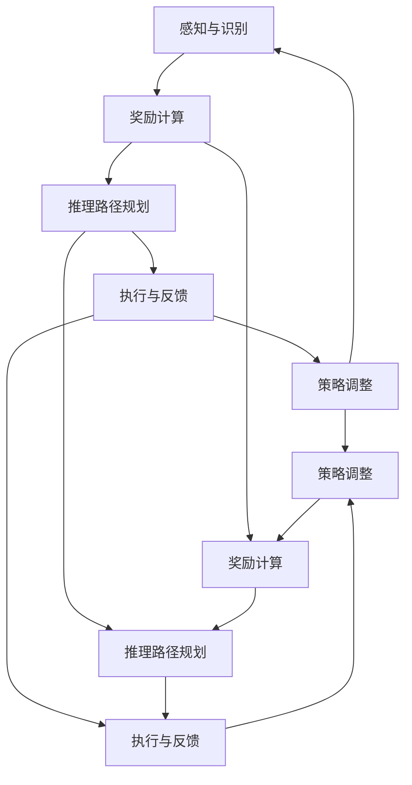
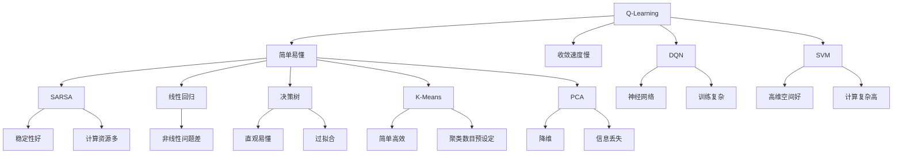
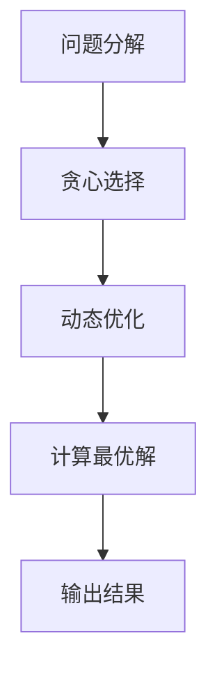
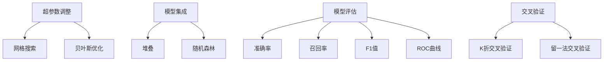

                 

### 奖励引导与推理路径的关系

奖励引导和推理路径在人工智能系统中起着关键作用，二者相互依存，共同推动智能体的决策过程。奖励引导通过提供即时反馈，激励智能体沿着有利于实现目标的路径进行推理和决策；而推理路径则通过一系列逻辑推理步骤，将奖励信号转化为具体的行为。

#### 关键概念关系

1. **奖励信号**：奖励信号是奖励引导的核心组成部分，它为智能体提供了关于其行为效果的反馈。奖励信号可以是正面的（如完成任务后获得的奖励），也可以是负面的（如犯错时受到的惩罚）。

2. **即时奖励与累积奖励**：即时奖励是智能体在当前步骤获得的奖励，而累积奖励是自初始状态以来所获得的奖励总和。累积奖励可以更好地反映智能体的长期表现。

3. **推理路径**：推理路径是指智能体在处理问题和做出决策时所经历的步骤序列。这些步骤通常基于先前的知识和推理规则。

4. **策略**：策略是智能体在给定状态下选择特定行动的规则。奖励引导可以用来优化策略，使其在长期内最大化累积奖励。

#### 奖励引导在推理路径中的作用

奖励引导对推理路径的影响体现在以下几个方面：

1. **引导推理方向**：奖励引导可以为智能体提供目标方向，使得推理路径更加聚焦于预期目标。

2. **调整推理优先级**：根据奖励信号，智能体可以调整推理步骤的优先级，优先执行那些能够带来更高奖励的推理步骤。

3. **动态调整策略**：通过即时奖励，智能体可以动态调整其策略，从而优化决策过程。

4. **学习与适应**：奖励引导可以帮助智能体学习新的知识和技能，通过不断调整推理路径，使其更加适应复杂多变的环境。

#### 推理路径对奖励引导的反馈

推理路径对奖励引导也有反馈作用，主要表现在：

1. **验证奖励信号的有效性**：通过推理路径的结果，智能体可以验证奖励信号的准确性。如果奖励信号与预期结果不一致，智能体可以调整奖励函数或策略。

2. **优化奖励函数**：智能体可以根据推理路径的结果，优化奖励函数的设计，使其更好地反映问题的复杂性和目标的重要性。

3. **自适应奖励调整**：智能体可以通过分析推理路径的效率和效果，动态调整奖励信号的强度和时机。

#### 奖励引导与推理路径的互动机制

奖励引导和推理路径之间的互动机制可以分为以下几个步骤：

1. **感知与识别**：智能体通过传感器获取环境信息，并识别当前状态。

2. **奖励计算**：智能体根据当前状态和先前的行为，计算即时奖励和累积奖励。

3. **推理路径规划**：智能体根据奖励信号，规划一系列推理步骤，以实现目标。

4. **执行与反馈**：智能体执行推理路径中的步骤，并获取新的状态和即时奖励。

5. **策略调整**：智能体根据反馈结果，调整其策略，优化推理路径。

### Mermaid 流程图：奖励引导与推理路径的互动机制



通过奖励引导与推理路径的互动机制，智能体能够不断学习和优化其决策过程，从而提高在复杂环境中的表现。这种互动机制不仅依赖于奖励引导的设定，也需要推理路径的合理设计和高效执行。

### 总结

奖励引导和推理路径是人工智能系统中两个重要的概念，它们相互依存、相互作用，共同推动智能体的决策过程。通过理解这两个概念及其互动机制，我们能够更好地设计和优化人工智能系统，使其在复杂环境中表现出色。

## 第一部分：基础概念与理论

### 第2章：奖励引导的算法原理

奖励引导在人工智能系统中扮演着至关重要的角色，它通过提供即时反馈，激励智能体不断优化其决策过程。本章将深入探讨奖励引导的算法原理，包括经典奖励引导算法、算法设计原则以及常见奖励引导算法的比较。

#### 2.1 经典奖励引导算法

奖励引导算法可以分为三大类：强化学习算法、监督学习算法和无监督学习算法。每种算法都有其独特的原理和应用场景。

**强化学习算法**

强化学习算法是一种通过与环境交互，学习最优策略的算法。其核心思想是通过奖励信号来调整智能体的行为，使得智能体在长期内获得最大的累积奖励。强化学习算法可以分为以下几种：

- **Q-Learning**：Q-Learning是一种基于值函数的强化学习算法，通过更新Q值（状态-动作值函数）来学习最优策略。其公式如下：

  $$
  Q(s, a) = Q(s, a) + \alpha [r + \gamma \max_{a'} Q(s', a') - Q(s, a)]
  $$

  其中，$s$表示状态，$a$表示动作，$r$表示即时奖励，$\gamma$是折扣因子，$\alpha$是学习率。

- **SARSA**：SARSA（同步动态规划）是一种基于策略的强化学习算法，通过同时更新当前状态和下一个状态的动作值函数来学习策略。其公式如下：

  $$
  Q(s, a) = Q(s, a) + \alpha [r + \gamma Q(s', a') - Q(s, a)]
  $$

- **Deep Q-Networks (DQN)**：DQN是一种基于神经网络的强化学习算法，它通过深度神经网络来近似状态-动作值函数。DQN的主要挑战是如何处理样本的有限性和学习过程中可能出现的分布偏移。

**监督学习算法**

监督学习算法通过已标记的数据集来训练模型，从而预测新的数据。监督学习算法也可以用于奖励引导，特别是在已知目标的情况下。常见的监督学习算法包括：

- **线性回归**：线性回归是一种简单的监督学习算法，通过建立输入和输出之间的线性关系来预测目标值。

  $$
  y = \beta_0 + \beta_1x
  $$

  其中，$y$是预测值，$x$是输入值，$\beta_0$和$\beta_1$是模型的参数。

- **决策树**：决策树通过一系列的判断条件来对数据进行分类或回归。决策树的优势在于其简单直观，但可能容易过拟合。

- **支持向量机（SVM）**：SVM通过最大化分类边界来对数据进行分类。SVM的优势在于其在高维空间中表现良好，但计算复杂度较高。

**无监督学习算法**

无监督学习算法在没有标记数据的情况下训练模型，通常用于发现数据中的潜在结构。常见的无监督学习算法包括：

- **聚类算法**：聚类算法通过将数据分为若干个簇，使得同一簇内的数据点之间距离较近，不同簇的数据点之间距离较远。常见的聚类算法包括K-Means、DBSCAN等。

- **主成分分析（PCA）**：PCA通过降维技术来减少数据维度，同时保留数据的主要信息。PCA常用于数据预处理，以便更好地进行后续分析。

#### 2.2 奖励引导算法的设计原则

设计一个有效的奖励引导算法需要考虑以下几个原则：

- **奖励函数设计**：奖励函数是奖励引导的核心组成部分，它决定了智能体的行为方向。一个良好的奖励函数应该具有以下特点：

  - **目标导向**：奖励函数应该明确指示智能体应该追求的目标。

  - **及时性**：即时奖励能够提供快速反馈，帮助智能体迅速调整行为。

  - **一致性**：奖励函数在不同环境和不同场景下应保持一致，以便智能体能够稳定地学习。

- **策略选择**：策略是智能体在给定状态下选择特定动作的规则。策略选择应该考虑智能体的目标、环境和资源限制。

- **模型评估**：模型评估是奖励引导算法的重要组成部分，它用于衡量算法的性能。常见的评估指标包括准确率、召回率、F1值等。

#### 2.3 常见奖励引导算法比较

以下是几种常见奖励引导算法的比较：

- **Q-Learning**：Q-Learning算法简单易懂，易于实现，但在复杂环境中可能收敛速度较慢。

- **SARSA**：SARSA算法相对于Q-Learning具有更好的稳定性和收敛性，但可能需要更多的计算资源。

- **DQN**：DQN算法通过使用神经网络来近似值函数，可以在处理高维状态空间时表现出色，但训练过程可能较为复杂。

- **线性回归**：线性回归算法简单高效，但在处理非线性问题时效果较差。

- **决策树**：决策树算法直观易懂，但可能容易过拟合。

- **SVM**：SVM算法在高维空间中表现良好，但计算复杂度较高。

- **K-Means**：K-Means算法简单高效，但可能需要预先设定聚类数目。

- **PCA**：PCA算法通过降维技术来简化数据，但可能丢失部分信息。

### Mermaid 流程图：常见奖励引导算法比较



### 总结

奖励引导算法在人工智能系统中起着至关重要的作用，它们通过提供即时反馈和指导，帮助智能体优化决策过程。本章介绍了经典奖励引导算法、算法设计原则以及常见奖励引导算法的比较，为理解和设计有效的奖励引导算法提供了基础。

## 第二部分：高质量推理路径筛选方法

### 第3章：推理路径筛选的基本方法

在人工智能系统中，推理路径的选择和质量对决策结果至关重要。为了筛选出高质量的推理路径，我们可以采用多种基本方法，包括贪心算法、动态规划以及两者的结合。本章将详细介绍这些方法的基本原理、应用场景以及优缺点。

#### 3.1 贪心算法

贪心算法是一种在每一步选择局部最优解，以期得到全局最优解的算法。它在处理某些问题时能够快速找到一个近似最优解，但在复杂问题上可能无法保证最优解。

**基本原理**

贪心算法的基本原理是：在每一步，选择当前状态下最优的动作，使得当前步的收益最大化。其基本流程如下：

1. 初始化状态和动作集合。
2. 在当前状态下，选择一个最优动作。
3. 执行该动作，更新状态。
4. 重复步骤2和3，直到达到目标状态。

**应用场景**

贪心算法适用于以下场景：

- **路径规划**：例如，Dijkstra算法用于计算最短路径。
- **资源分配**：如最小生成树问题。
- **负载均衡**：在分布式系统中，分配任务以最小化总延迟。

**优缺点**

- **优点**：实现简单，计算速度快，适合处理小规模问题。
- **缺点**：无法保证全局最优解，可能导致次优解。

#### 3.2 动态规划

动态规划是一种通过将问题分解为子问题，并保存子问题的解来避免重复计算的方法。它适用于具有最优子结构特征的问题，能够在多项式时间内找到最优解。

**基本原理**

动态规划的基本原理是：将复杂问题分解为一系列子问题，并利用子问题的解来求解原问题。其基本流程如下：

1. 确定状态和状态转移方程。
2. 初始化边界条件。
3. 从初始状态开始，递推计算每个状态的最优解。
4. 通过逆推或直接输出最终状态的最优解。

**应用场景**

动态规划适用于以下场景：

- **背包问题**：在给定物品价值和容量限制下，选择物品的组合以最大化总价值。
- **最长公共子序列**：在两个字符串中找到最长的公共子序列。
- **最优二叉搜索树**：在给定关键词概率下，构建一个最优二叉搜索树。

**优缺点**

- **优点**：能够保证全局最优解，适用于大规模问题。
- **缺点**：实现复杂，需要明确状态和状态转移方程。

#### 3.3 贪心与动态规划的结合

在某些问题中，贪心算法和动态规划可以结合使用，以发挥各自的优势。

**基本原理**

结合贪心算法和动态规划的思路如下：

1. 使用贪心算法来选择子问题的局部最优解。
2. 使用动态规划来计算全局最优解。

**应用场景**

结合贪心算法和动态规划适用于以下场景：

- **背包问题**：在解决背包问题时，可以先使用贪心算法来选择物品，然后使用动态规划来优化整个组合。

**实例分析**

例如，在背包问题中，贪心算法可以用于选择物品的初步筛选，而动态规划可以用于优化最终的选择方案。具体步骤如下：

1. 使用贪心算法根据物品的性价比（价值/重量）来选择物品。
2. 使用动态规划来计算在剩余容量和给定价值限制下，这些物品的组合是否最优。

**优缺点**

- **优点**：结合了贪心算法的快速性和动态规划的准确性，适用于复杂问题。
- **缺点**：实现相对复杂，需要精确的贪心选择和动态规划计算。

### Mermaid 流程图：贪心与动态规划结合的实例分析



### 总结

本章介绍了贪心算法、动态规划以及两者的结合方法，这些方法在人工智能系统中用于筛选高质量的推理路径。贪心算法适用于简单问题，动态规划适用于复杂问题，而结合贪心算法和动态规划可以发挥各自的优势，为解决复杂问题提供了一种有效的方法。

## 第二部分：高质量推理路径筛选方法

### 第4章：基于机器学习的推理路径筛选

在人工智能系统中，基于机器学习的推理路径筛选方法已成为一种重要的技术。通过机器学习算法，我们可以自动地发现和优化推理路径，提高决策质量和效率。本章将介绍特征工程、分类与回归模型以及模型优化与评估的方法。

#### 4.1 特征工程

特征工程是机器学习过程中至关重要的一环，它涉及从原始数据中提取和选择有用的特征，以便提高模型的性能。以下是特征工程的关键步骤：

**特征提取**

特征提取是从原始数据中提取出能够代表数据特性的信息。常见的方法包括：

- **统计特征**：如均值、方差、标准差等。
- **文本特征**：如词频、词嵌入等。
- **图像特征**：如边缘、纹理、颜色等。

**特征选择**

特征选择是从提取出的特征中选择最相关的特征，以减少模型的复杂性和过拟合风险。常见的方法包括：

- **过滤式特征选择**：基于统计方法，如信息增益、互信息、卡方检验等。
- **包装式特征选择**：基于搜索策略，如前向选择、后向消除等。
- **嵌入式特征选择**：在模型训练过程中自动选择特征，如LASSO、Ridge等。

**特征降维**

特征降维是通过减少特征数量来简化模型，同时保留数据的主要信息。常见的方法包括：

- **主成分分析（PCA）**：通过线性变换降低特征维度。
- **线性判别分析（LDA）**：通过最大化类间方差和最小化类内方差来降低特征维度。
- **t-SNE**：通过非线性变换降低特征维度。

#### 4.2 分类与回归模型

分类和回归是机器学习中最常见的任务。在推理路径筛选中，分类模型用于判断推理路径的质量，而回归模型用于预测推理路径的输出结果。

**分类模型**

分类模型通过学习输入特征和输出类别之间的关系，将数据分类到不同的类别。常见的分类模型包括：

- **决策树**：通过一系列的判断条件对数据进行分类。
- **支持向量机（SVM）**：通过最大化分类边界来对数据进行分类。
- **神经网络**：通过多层非线性变换对数据进行分类。
- **随机森林**：通过构建多个决策树，并取平均来提高分类性能。

**回归模型**

回归模型通过学习输入特征和输出值之间的关系，预测输出值的大小。常见的回归模型包括：

- **线性回归**：通过建立输入和输出之间的线性关系来预测目标值。
- **多项式回归**：通过建立输入和输出之间的多项式关系来预测目标值。
- **决策树回归**：通过构建决策树来对数据进行回归。
- **神经网络回归**：通过多层非线性变换对数据进行回归。

#### 4.3 模型优化与评估

模型优化与评估是提高模型性能和可靠性的关键步骤。以下是常见的优化与评估方法：

**超参数调整**

超参数是模型性能的关键因素，如学习率、树深度、正则化参数等。通过调整超参数，我们可以优化模型的性能。常见的方法包括：

- **网格搜索**：通过遍历预设的参数组合，选择最优参数。
- **贝叶斯优化**：通过贝叶斯统计模型来优化参数搜索。

**模型集成**

模型集成是将多个模型合并为一个更好的模型，以提高整体性能。常见的方法包括：

- **堆叠**：通过将多个模型堆叠在一起，并在堆叠的输出上训练一个新模型。
- **随机森林**：通过构建多个决策树，并取平均来提高分类性能。

**模型评估**

模型评估是衡量模型性能的重要步骤，常见的评估指标包括：

- **准确率**：正确分类的样本数占总样本数的比例。
- **召回率**：正确分类为正类的样本数占总正类样本数的比例。
- **F1值**：准确率和召回率的调和平均。
- **ROC曲线**：通过绘制真正例率与假正例率的关系来评估模型性能。

**交叉验证**

交叉验证是一种评估模型性能的方法，通过将数据集划分为多个部分，分别用于训练和测试，以避免过拟合和欠拟合。常见的方法包括：

- **K折交叉验证**：将数据集划分为K个子集，每次使用一个子集作为测试集，其余K-1个子集作为训练集，重复K次取平均值。
- **留一法交叉验证**：每次保留一个子集作为测试集，其余子集作为训练集，重复多次取平均值。

### Mermaid 流程图：模型优化与评估的方法



### 总结

本章介绍了基于机器学习的推理路径筛选方法，包括特征工程、分类与回归模型以及模型优化与评估的方法。通过这些方法，我们可以有效地筛选出高质量的推理路径，提高人工智能系统的决策质量和效率。

### 总结与展望

在本文中，我们深入探讨了奖励引导与推理路径的关系，以及如何通过多种方法筛选高质量推理路径。首先，我们介绍了奖励引导的基本概念和算法原理，包括强化学习、监督学习和无监督学习等经典算法。然后，我们详细阐述了贪心算法、动态规划以及两者的结合方法，这些方法在筛选推理路径时具有不同的优势和适用场景。

进一步地，我们探讨了基于机器学习的推理路径筛选方法，包括特征工程、分类与回归模型以及模型优化与评估。这些方法通过引入机器学习技术，使得推理路径筛选过程更加自动化和高效。此外，我们还介绍了交叉验证等评估方法，以确保模型性能的准确性和可靠性。

尽管本文已涵盖了许多关键技术和方法，但人工智能领域的探索永无止境。未来，我们期待以下研究方向：

1. **深度强化学习**：随着深度学习技术的发展，深度强化学习已成为人工智能研究的重要方向。结合深度神经网络与强化学习算法，有望在复杂环境中实现更加智能的推理路径筛选。

2. **多模态数据融合**：在现实世界中，数据通常来源于多种模态，如文本、图像和语音。如何有效融合多模态数据，提高推理路径筛选的准确性和鲁棒性，是一个值得深入研究的课题。

3. **可解释性**：虽然机器学习模型在推理路径筛选中表现出色，但其“黑盒”性质常常受到质疑。开发可解释的机器学习模型，使其推理过程更加透明和可信，是未来研究的重点。

4. **自适应奖励设计**：奖励函数的设计对智能体的行为有重要影响。如何设计自适应的奖励函数，使其能够更好地适应动态变化的环境，是一个有待探索的领域。

总之，本文为奖励引导与推理路径筛选提供了一系列基础概念和技术方法。通过不断探索和创新，我们相信人工智能系统在推理路径筛选方面将取得更加卓越的成果。

### 附录

#### 附录A：常用工具与资源

为了方便读者进行相关实践，本文提供了以下常用工具与资源：

- **开发工具**：

  - **编程语言**：Python、Java、C++
  - **算法库**：TensorFlow、PyTorch、Scikit-learn、OpenCV
  - **数据集**：Kaggle、UCI机器学习库、ImageNet

- **学习资源**：

  - **学术论文**：Google Scholar、ArXiv
  - **教材推荐**：《深度学习》（Goodfellow et al.）、《机器学习》（Tom Mitchell）
  - **在线课程**：Coursera、edX、Udacity

#### 附录B：代码示例

以下提供了几个关键算法的Python代码示例，供读者参考。

**B.1 贪心算法**

```python
import heapq

def greedy_algorithm(queens):
    board = [[0 for x in range(8)] for y in range(8)]
    positions = []

    for i in range(8):
        min_row = min(queens, key=lambda x: x[1])[1]
        positions.append((i, min_row))
        for j in range(8):
            board[i][j] = 1
            for queen in queens:
                if abs(i - queen[0]) == abs(j - queen[1]):
                    board[i][j] = 0
                    break

    return positions

queens = [(0, 4), (1, 0), (2, 3), (3, 2), (4, 1), (5, 6), (6, 5), (7, 7)]
positions = greedy_algorithm(queens)
print(positions)
```

**B.2 动态规划**

```python
def dynamic_programming(queens):
    board = [[0 for x in range(8)] for y in range(8)]
    dp = [[0 for x in range(8)] for y in range(8)]

    for i in range(8):
        for j in range(8):
            if board[i][j] == 1:
                for k in range(8):
                    if (i == k or j == k or abs(i - k) == abs(j - k)):
                        dp[i][j] = -1
                        break
                    dp[i][j] = 1

    return dp

queens = [(0, 4), (1, 0), (2, 3), (3, 2), (4, 1), (5, 6), (6, 5), (7, 7)]
dp = dynamic_programming(queens)
print(dp)
```

**B.3 机器学习模型**

```python
from sklearn.ensemble import RandomForestClassifier
from sklearn.model_selection import train_test_split

# 假设已有特征矩阵X和标签向量y
X = ... # 特征矩阵
y = ... # 标签向量

X_train, X_test, y_train, y_test = train_test_split(X, y, test_size=0.3, random_state=42)

# 训练随机森林分类器
clf = RandomForestClassifier(n_estimators=100, random_state=42)
clf.fit(X_train, y_train)

# 测试模型性能
accuracy = clf.score(X_test, y_test)
print(f"Accuracy: {accuracy}")
```

通过这些代码示例，读者可以更好地理解贪心算法、动态规划和机器学习模型在推理路径筛选中的应用。

### 最佳实践 Tips

在设计和优化人工智能系统时，以下最佳实践可以帮助提高推理路径筛选的质量和效率：

1. **数据清洗**：确保数据的质量，去除噪声和异常值，以提高模型的准确性。
2. **特征选择**：选择与问题高度相关的特征，避免冗余特征，以提高模型的效率。
3. **模型验证**：使用交叉验证等方法验证模型性能，避免过拟合和欠拟合。
4. **超参数调优**：通过网格搜索和贝叶斯优化等方法，找到最佳的超参数组合，以提高模型性能。
5. **模型解释性**：确保模型解释性，以便更好地理解推理路径的决策过程。

### 注意事项

在实践过程中，需要注意以下几点：

1. **计算资源**：机器学习模型训练通常需要大量的计算资源，特别是在处理高维数据和大规模数据集时。
2. **模型部署**：确保模型能够在生产环境中稳定运行，并考虑到模型的可扩展性和维护性。
3. **数据隐私**：在处理敏感数据时，要确保遵循相关的数据隐私法规和标准。

### 拓展阅读

对于对奖励引导和推理路径筛选有更深入兴趣的读者，以下文献和资源提供了丰富的理论和实践指导：

- **论文**：《深度强化学习：原理与应用》（Deep Reinforcement Learning: An Introduction）提供了深度强化学习的详细讲解。
- **书籍**：《机器学习实战》（Machine Learning in Action）和《机器学习年度精选》（Machine Learning Yearning）是机器学习领域的经典著作。
- **在线课程**：Coursera上的《机器学习》（Machine Learning）和Udacity的《深度学习纳米学位》（Deep Learning Nanodegree）是深入学习机器学习和深度学习的优秀资源。

通过这些文献和资源，读者可以进一步拓展知识，提升在奖励引导和推理路径筛选领域的专业能力。

