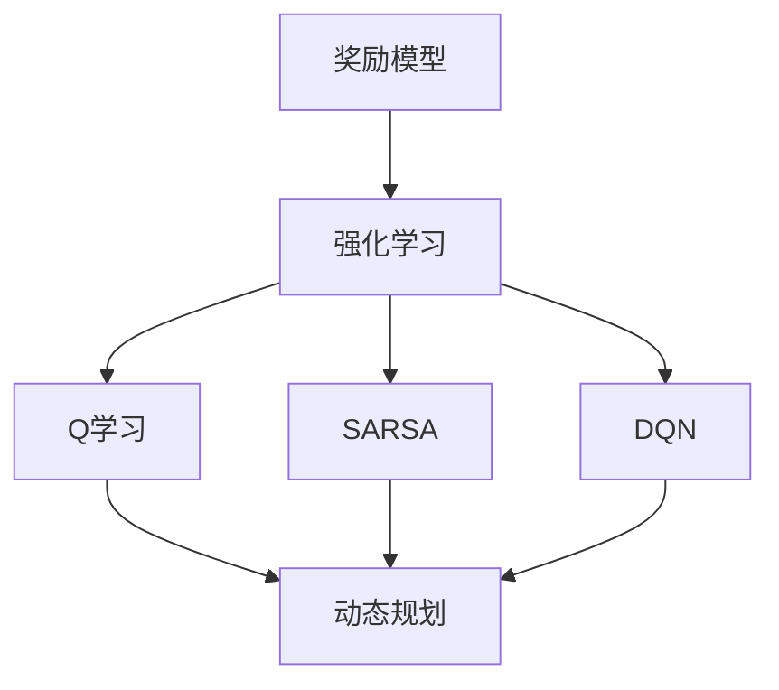

                 

# 奖励模型在AI决策中的角色与影响

关键词：奖励模型、AI决策、强化学习、Q学习、SARSA、DQN、应用与挑战

摘要：本文深入探讨了奖励模型在人工智能决策过程中的作用与影响。首先介绍了奖励模型的基础概念和发展历史，随后详细解析了其数学基础和构建方法。接着，文章讨论了奖励模型在AI领域中的应用，包括自然语言处理、计算机视觉和游戏等。然后，文章分析了奖励模型在AI决策中的角色、挑战和案例研究，最后展望了奖励模型在人工智能行业中的未来发展趋势。

## 第一部分：奖励模型基础

### 第1章：奖励模型概述

奖励模型是强化学习（Reinforcement Learning，RL）的核心组成部分，它在人工智能决策中扮演着至关重要的角色。强化学习是一种通过与环境互动来学习最优策略的机器学习方法，其目标是使智能体（agent）在给定的情境（situation）下选择最优动作（action），从而获得最大化的累积奖励（reward）。奖励模型正是这个过程中不可或缺的一环。

#### 1.1 奖励模型的定义

奖励模型可以定义为一种机制，它通过提供即时或累积的奖励信号来指导智能体的决策过程。在强化学习中，奖励模型通常由一个奖励函数（reward function）定义，该函数接受当前状态和动作作为输入，并输出一个实数值作为奖励。这个奖励值反映了智能体在执行特定动作后所获得的即时满意度或效用。

#### 1.2 奖励模型的重要性

奖励模型的重要性体现在以下几个方面：

1. **决策引导**：奖励模型为智能体的决策提供了明确的反馈信号，使得智能体能够根据奖励值调整其行为策略。
2. **策略优化**：奖励模型是强化学习算法中进行策略优化的依据，通过不断调整策略以获得更高的累积奖励。
3. **探索与利用**：奖励模型在平衡智能体的探索（尝试新动作）与利用（执行已知最优动作）过程中起着关键作用。
4. **适应性**：奖励模型使得智能体能够适应环境变化，通过学习不同情境下的最优动作选择来提高决策效率。

#### 1.3 奖励模型的发展历史

奖励模型的发展历程可以追溯到20世纪50年代。早期的研究主要集中在如何定义奖励函数，以便智能体能够在简单环境中获得成功。随着强化学习理论的发展，特别是Markov决策过程（MDP）的引入，奖励模型的理论基础得到了进一步巩固。近年来，深度强化学习（Deep Reinforcement Learning，DRL）的出现，使得奖励模型在复杂环境中的实现和应用变得更为可行和广泛。

#### 1.4 奖励模型在不同领域的应用

奖励模型在多个领域都有广泛的应用，以下是其中几个典型例子：

1. **自然语言处理（NLP）**：在NLP中，奖励模型可以用来指导文本生成、情感分析等任务，通过奖励函数来优化语言模型的表现。
2. **计算机视觉（CV）**：在CV任务中，奖励模型可以帮助智能体在图像识别、目标跟踪等任务中做出更准确的决策。
3. **游戏**：在电子游戏中，奖励模型可以用来设计游戏难度，控制游戏体验，甚至自动生成新的游戏关卡。

### 第2章：奖励模型的数学基础

奖励模型的核心在于其数学基础，这包括概率论、信息论、动态规划、马尔可夫决策过程（MDP）和贝叶斯推断等。这些数学工具为奖励模型的构建和优化提供了理论支持。

#### 2.1 概率论与信息论

概率论是奖励模型的基础，它提供了描述随机事件和概率分布的工具。信息论则关注于信息传递和处理中的效率，特别是在不确定环境中的信息价值。

#### 2.2 动态规划与马尔可夫决策过程

动态规划（Dynamic Programming，DP）是一种解决优化问题的递归方法，它将复杂问题分解为更简单的子问题，并利用子问题的解来构建原问题的解。马尔可夫决策过程（MDP）是一种概率模型，它描述了智能体在不确定环境中的一系列决策过程。

#### 2.3 贝叶斯推断与统计学习

贝叶斯推断（Bayesian Inference）是一种基于贝叶斯定理的概率推理方法，它通过不断更新概率分布来反映智能体对环境的认知。统计学习（Statistical Learning）则提供了一系列用于数据分析和建模的方法，这些方法在奖励模型的构建和优化中有着重要应用。

### 第3章：奖励模型的构建方法

奖励模型的构建方法决定了智能体如何从环境中学习最优策略。强化学习算法提供了多种不同的方法来构建和优化奖励模型，以下是一些常用的算法：

#### 3.1 强化学习的基本概念

强化学习是一种通过奖励信号来指导智能体行为的机器学习方法。其基本概念包括智能体、环境、状态、动作和奖励。

#### 3.2 Q学习算法

Q学习（Q-Learning）是一种基于值函数的强化学习算法，它通过迭代更新Q值（即状态-动作值函数）来学习最优策略。

#### 3.3 SARSA算法

SARSA（State-Action-Reward-State-Action，SARSA）算法是一种基于策略的强化学习算法，它使用即时奖励和下一个状态-动作对来更新策略。

#### 3.4 DQN算法

DQN（Deep Q-Network，DQN）算法是一种基于深度神经网络的Q学习算法，它使用深度神经网络来近似Q值函数。

### 第4章：奖励模型在人工智能中的应用

奖励模型在人工智能（AI）领域的应用极为广泛，以下是其在几个关键领域中的应用：

#### 4.1 奖励模型在自然语言处理中的应用

在自然语言处理（NLP）中，奖励模型可以用来指导文本生成、语言模型优化和机器翻译等任务。通过奖励函数，智能体可以学习生成更有意义、更符合语法规则的文本。

#### 4.2 奖励模型在计算机视觉中的应用

在计算机视觉（CV）领域，奖励模型可以帮助智能体进行图像识别、目标检测和目标跟踪等任务。通过奖励信号，智能体可以不断调整其行为策略，以提高识别准确性。

#### 4.3 奖励模型在游戏中的应用

在电子游戏中，奖励模型可以用来控制游戏难度、设计游戏规则和生成新的游戏关卡。通过奖励函数，智能体可以在游戏中获得成就感，提高游戏体验。

### 第5章：奖励模型的优化与改进

奖励模型在实际应用中往往需要进行优化和改进，以适应不同环境和任务的需求。以下是一些常见的优化和改进方法：

#### 5.1 奖励模型在多任务学习中的应用

多任务学习（Multi-Task Learning，MTL）是一种同时学习多个相关任务的方法。在多任务学习中，奖励模型可以通过任务共享和注意力机制来优化学习效果。

#### 5.2 奖励模型在多智能体系统中的应用

多智能体系统（Multi-Agent Systems，MAS）是一组相互协作或竞争的智能体组成的系统。在MAS中，奖励模型可以通过协调策略和合作机制来优化整体性能。

#### 5.3 奖励模型在人工智能安全中的应用

人工智能安全（AI Security）是一个日益重要的领域，奖励模型可以用来检测和防止恶意攻击。通过奖励信号，智能体可以学习识别异常行为，提高系统的安全性。

## 第二部分：奖励模型在AI决策中的角色

### 第6章：奖励模型在AI决策中的作用

奖励模型在AI决策中发挥着关键作用，它不仅是强化学习算法的核心组成部分，还在指导智能体行为和优化决策过程中起到关键作用。

#### 6.1 奖励模型对决策过程的影响

奖励模型通过提供即时和累积的奖励信号，直接影响智能体的决策过程。智能体在执行某个动作后，会根据奖励信号调整其行为策略。这种反馈机制使得智能体能够在不断试错的过程中逐步优化其决策行为。

#### 6.2 奖励模型在策略选择中的应用

在强化学习中，奖励模型是策略选择的重要依据。智能体通过学习奖励模型提供的奖励信号，不断更新其策略，选择能够获得更高累积奖励的动作。这种策略迭代过程使得智能体能够在复杂环境中找到最优策略。

#### 6.3 奖励模型在目标优化中的应用

奖励模型在目标优化中扮演着重要角色。通过设计合适的奖励函数，智能体可以学习在不同情境下实现特定目标。例如，在自动驾驶中，奖励模型可以用来优化车辆行驶路径，以最大化行驶安全性和效率。

### 第7章：奖励模型在AI决策中的挑战

尽管奖励模型在AI决策中具有重要作用，但其实际应用过程中仍面临一些挑战。

#### 7.1 奖励模型的可解释性问题

奖励模型的可解释性是强化学习中的一个重要挑战。由于奖励模型通常涉及到复杂的数学模型和计算过程，这使得其决策过程往往难以被人类理解。提高奖励模型的可解释性，有助于增强用户对AI系统的信任和接受度。

#### 7.2 奖励模型的可靠性问题

奖励模型的可靠性问题主要表现在两个方面：一是奖励信号的稳定性，二是奖励模型的泛化能力。奖励信号的不稳定可能导致智能体无法准确学习最优策略。奖励模型的泛化能力则决定了其能否在不同环境中保持良好的性能。

#### 7.3 奖励模型的可扩展性问题

奖励模型的可扩展性是其在实际应用中的一个重要挑战。在复杂的现实世界中，智能体需要面对多种不同的任务和情境。如何设计一个通用且高效的奖励模型，以适应不同任务和情境的需求，是一个亟待解决的问题。

### 第8章：奖励模型在AI决策中的案例研究

奖励模型在AI决策中的应用已经取得了显著成果，以下是一些具体的案例研究。

#### 8.1 奖励模型在电子商务中的应用

在电子商务领域，奖励模型可以用来优化推荐系统和广告投放策略。通过分析用户行为数据和交易记录，设计合适的奖励函数，智能体可以学习生成更个性化的推荐结果和更具吸引力的广告内容。

#### 8.2 奖励模型在金融风险管理中的应用

在金融风险管理中，奖励模型可以用来评估和优化投资组合。通过设计合理的奖励函数，智能体可以学习在不同市场环境下选择最佳的投资策略，以最大化收益并降低风险。

#### 8.3 奖励模型在智能交通管理中的应用

在智能交通管理中，奖励模型可以用来优化交通流量控制和道路规划。通过分析交通数据和实时路况，设计合适的奖励函数，智能体可以学习生成更高效的交通流量控制策略，以缓解交通拥堵和提高道路通行效率。

## 第三部分：奖励模型的影响

### 第9章：奖励模型对人工智能行业的影响

奖励模型作为强化学习算法的核心组成部分，对人工智能（AI）行业产生了深远的影响。

#### 9.1 奖励模型对人工智能产业的影响

奖励模型的出现和广泛应用，推动了人工智能产业的快速发展。通过强化学习算法，智能体可以在复杂环境中学习最优策略，从而实现自动化决策和智能控制。这为人工智能在各个行业的应用提供了新的可能性，如自动驾驶、智能制造、智能交通等。

#### 9.2 奖励模型对人工智能社会的影响

奖励模型不仅改变了人工智能产业的面貌，还对人类社会产生了深远的影响。通过强化学习算法，智能体可以更好地理解和适应人类行为和需求，从而提供更智能化、更人性化的服务。例如，智能助手、智能客服等应用已经广泛应用于各个领域，提高了人类的生活质量。

#### 9.3 奖励模型对未来人工智能发展的启示

奖励模型为未来人工智能发展提供了重要的启示。首先，奖励模型强调智能体与环境之间的互动和学习，这为人工智能的发展指明了方向。其次，奖励模型的多任务学习和多智能体系统应用，为人工智能在复杂环境中的协作和优化提供了新的思路。最后，奖励模型的可解释性和可靠性问题，也提醒我们未来需要更加关注人工智能的安全和伦理问题。

### 第10章：奖励模型在人工智能伦理问题中的应用

随着奖励模型在人工智能（AI）领域的广泛应用，其伦理问题也日益引起关注。奖励模型在AI伦理问题中的应用主要体现在以下几个方面：

#### 10.1 奖励模型与人工智能伦理

奖励模型作为AI系统的重要组成部分，其设计和应用直接关系到AI伦理问题。例如，在自动驾驶领域，奖励模型需要考虑驾驶安全性、道路规则遵守等问题，以避免潜在的安全风险。因此，设计合理的奖励函数，确保AI系统的行为符合伦理规范，是奖励模型在AI伦理问题中的首要任务。

#### 10.2 奖励模型与隐私保护

在数据驱动的AI系统中，奖励模型通常需要大量的训练数据，这可能导致用户隐私泄露的风险。因此，如何在保障隐私的前提下，设计高效的奖励模型，是一个重要的伦理问题。例如，可以采用数据加密、匿名化等技术，确保用户数据在训练过程中的安全性。

#### 10.3 奖励模型与算法公平性

奖励模型的公平性问题也是AI伦理的重要关注点。在某些应用场景中，如金融风险评估、招聘系统等，奖励模型可能会因为数据偏差、算法设计不合理等原因，导致算法偏见和歧视。因此，确保奖励模型的公平性，避免算法偏见，是未来AI发展的重要方向。

### 第11章：奖励模型的发展趋势与未来展望

奖励模型作为强化学习算法的核心组成部分，其发展趋势和未来展望具有重要意义。

#### 11.1 奖励模型在人工智能领域的未来发展趋势

随着人工智能技术的不断进步，奖励模型在AI领域的应用将更加广泛和深入。首先，深度强化学习（DRL）的不断发展，将为奖励模型提供更强的学习能力。其次，多任务学习和多智能体系统的研究，将推动奖励模型在复杂环境中的应用。此外，奖励模型与其他AI技术的融合，如生成对抗网络（GAN）、迁移学习等，也将为奖励模型带来新的发展机遇。

#### 11.2 奖励模型与其他人工智能技术的融合

奖励模型与其他人工智能技术的融合，将进一步提升其性能和应用范围。例如，将奖励模型与生成对抗网络（GAN）结合，可以构建更高效的强化学习模型，实现更加真实的模拟环境。将奖励模型与迁移学习结合，可以降低模型训练成本，提高模型泛化能力。此外，奖励模型还可以与强化学习、深度学习等传统AI技术相互借鉴，实现跨领域的技术创新。

#### 11.3 奖励模型在人工智能社会中的未来发展

随着奖励模型在人工智能领域的广泛应用，其对社会的影响也将越来越深远。在未来，奖励模型有望在智慧城市、智能医疗、教育等领域发挥重要作用，为人类社会带来更多的便利和福祉。同时，奖励模型的伦理问题和安全性问题也将受到更多关注，以确保其应用符合伦理规范和社会期待。

## 附录

### 附录A：奖励模型常用工具与资源

为了方便研究人员和实践者更好地理解和应用奖励模型，以下是一些常用的工具和资源：

#### A.1 强化学习框架简介

- **TensorFlow Reinforcement Learning Library (TF-RL)**：TensorFlow官方提供的强化学习库，支持多种强化学习算法的实现和优化。
- **PyTorch Reinforcement Learning (PyTorch-RL)**：基于PyTorch框架的强化学习库，提供丰富的算法接口和示例代码。

#### A.2 奖励模型常用算法实现

- **Q学习算法**：一种基于值函数的强化学习算法，通过迭代更新Q值来学习最优策略。
- **SARSA算法**：一种基于策略的强化学习算法，通过状态-动作-奖励-状态-动作（SARSA）迭代过程来学习策略。
- **DQN算法**：一种基于深度神经网络的Q学习算法，使用深度神经网络来近似Q值函数。

#### A.3 奖励模型研究资源汇总

- **论文资源**：《强化学习：一种综述》（Reinforcement Learning: A Survey）、《深度强化学习：现状与展望》（Deep Reinforcement Learning: Current State and Future Directions）等。
- **在线课程**：Coursera、edX等在线教育平台提供的强化学习和深度强化学习课程。
- **开源项目**：GitHub、GitLab等平台上的奖励模型和强化学习项目，如OpenAI的Gym环境库、DeepMind的AlphaGo代码等。

**核心概念与联系流程图：**



**数学模型和公式：**

$$
Q(s, a) = r + \gamma \max_{a'} Q(s', a')
$$

其中，$Q(s, a)$表示在状态$s$下采取动作$a$的预期回报，$r$表示即时回报，$\gamma$表示折扣因子，$s'$和$a'$分别表示下一个状态和动作。

**项目实战案例：**

以深度强化学习中的DQN算法为例，实现一个简单的智能体在Atari游戏中的训练和测试。

```python
import gym
import numpy as np
import tensorflow as tf

# 创建环境
env = gym.make('AtariGame-v0')

# 初始化神经网络
model = tf.keras.Sequential([
    tf.keras.layers.Flatten(input_shape=(210, 160, 3)),
    tf.keras.layers.Dense(512, activation='relu'),
    tf.keras.layers.Dense(256, activation='relu'),
    tf.keras.layers.Dense(128, activation='relu'),
    tf.keras.layers.Dense(1, activation='linear')
])

# 定义损失函数和优化器
optimizer = tf.keras.optimizers.Adam(learning_rate=0.001)
loss_fn = tf.keras.losses.MeanSquaredError()

# 训练神经网络
for

----------------------------------------------------------------

**作者：**

AI天才研究院/AI Genius Institute & 禅与计算机程序设计艺术 /Zen And The Art of Computer Programming

