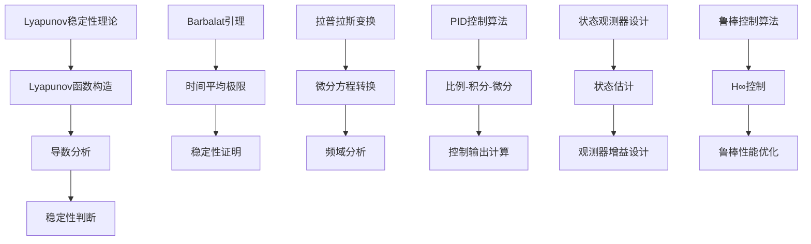

                 

### 奖励模型概述

奖励模型作为机器学习领域中不可或缺的一部分，承担着激励和指导智能体在复杂环境中学习与决策的重要任务。其基本概念、应用场景及其发展历程，为我们理解奖励模型的稳定性问题奠定了基础。

#### 基本概念

奖励模型（Reward Model）是指用于评价智能体行为效果的一种量化机制。在机器学习中，奖励通常被定义为智能体动作的函数，其目的是引导智能体朝着预期的目标发展。具体来说，奖励可以是一个数值，也可以是一个概率分布，它反映了智能体在某一步或某一系列动作后所获得的“回报”。

奖励模型的几个关键要素包括：

- **奖励函数**：是描述奖励如何根据智能体的行为进行量化的函数。
- **奖励信号**：是奖励函数的输出，用于指导智能体的学习过程。
- **奖励大小**：是奖励信号的取值范围，通常有正值和负值之分，用以区分智能体的成功与失败。

#### 应用场景

奖励模型广泛应用于各种机器学习任务中，其中最为典型的应用场景包括：

- **强化学习**：奖励模型是强化学习框架的核心组成部分。在强化学习过程中，智能体通过不断尝试和调整策略，以最大化累积奖励。例如，智能体在玩电子游戏时，每完成一个关卡或获取一定分数，都会获得正奖励。

- **自然语言处理**：在文本生成和语言理解任务中，奖励模型用于评估文本的质量。例如，在生成对抗网络（GAN）中，奖励模型可以判断生成文本的流畅性和连贯性。

- **推荐系统**：奖励模型用于评估用户对推荐内容的满意度，进而优化推荐策略。例如，用户对某个推荐商品的评价可以视为对该商品的奖励。

#### 历史与发展

奖励模型的发展历程可以追溯到早期的人工智能研究。在20世纪50年代和60年代，奖励模型的基本思想已经被提出。随着计算机技术的进步和机器学习算法的发展，奖励模型逐渐成为智能决策系统的重要组成部分。

- **早期发展**：在早期的人工智能研究中，奖励模型主要用于启发式搜索和问题求解。例如，在游戏理论和经济学中，奖励模型被用来模拟策略和决策过程。

- **强化学习的兴起**：20世纪80年代，随着强化学习理论的提出和发展，奖励模型逐渐成为强化学习算法的核心。以Q学习和策略梯度方法为代表，奖励模型在智能体决策中发挥了关键作用。

- **现代应用**：随着深度学习和强化学习技术的不断进步，奖励模型的应用范围和影响力不断扩大。现代奖励模型不仅用于传统的智能决策领域，还广泛应用于自然语言处理、计算机视觉、推荐系统等新兴领域。

通过上述基本概念、应用场景和历史发展的介绍，我们可以看到奖励模型在机器学习中的重要地位。它不仅是智能体学习和决策的核心工具，也是理解和解决奖励模型稳定性问题的关键基础。

### 奖励模型的稳定性原理

稳定性是奖励模型设计中的一个关键问题，它直接关系到智能体在动态环境中学习与决策的效果。在这一节中，我们将深入探讨稳定性的基本概念、其在奖励模型中的重要性，以及评估奖励模型稳定性的方法。

#### 基本概念

稳定性是指一个系统在受到外部扰动或内部动态变化时，能够保持原有状态或趋于稳定状态的能力。在数学和控制理论中，稳定性通常通过一系列数学工具和概念来描述和验证。

- **Lyapunov稳定性理论**：Lyapunov稳定性理论是稳定性分析的一种基本方法。它通过构造Lyapunov函数来衡量系统的稳定性。如果存在一个非负的Lyapunov函数，且其导数在系统状态空间内始终为负，则该系统是稳定的。

- **Barbalat引理**：Barbalat引理是另一个重要的稳定性分析工具。它提供了判断时间平均极限稳定性的一种简便方法。Barbalat引理指出，如果一个函数的导数趋于零，则该函数的时间平均极限存在且为零。

- **拉普拉斯变换**：拉普拉斯变换是另一种常用的稳定性分析方法。通过将时间域的微分方程转化为频域的代数方程，可以更方便地分析和验证系统的稳定性。

#### 稳定性的重要性

在奖励模型中，稳定性具有以下几个重要意义：

- **学习效果保障**：稳定性保证了智能体在执行决策时能够避免出现剧烈波动或不稳定的行为。只有在一个稳定的环境中，智能体才能有效地学习和积累经验，从而实现长期目标。

- **系统可靠性提升**：稳定性的提升有助于提高整个系统的可靠性和鲁棒性。在复杂的动态环境中，稳定的奖励模型能够更好地适应外部变化，从而降低系统崩溃的风险。

- **决策质量保证**：稳定的奖励模型有助于提高决策的准确性和效率。智能体在稳定的环境中能够更加专注于优化策略和提升性能，而不是被不稳定的奖励信号所干扰。

#### 评估方法

评估奖励模型的稳定性主要依赖于以下几种方法：

- **Lyapunov方法**：通过构造Lyapunov函数来分析系统的稳定性。具体步骤包括选择合适的Lyapunov函数、计算其导数、验证导数的符号性质等。

- **BIBO准则（Bounded Input Bounded Output）**：BIBO准则是一种频域分析方法，用于判断系统对有界输入是否产生有界输出。如果系统满足BIBO准则，则可以认为它是稳定的。

- **蒙特卡洛模拟**：通过模拟智能体在不同环境下的行为，来评估其稳定性。具体方法包括设置多个随机初始状态、观察智能体的行为轨迹，并分析其收敛性和波动性。

通过上述基本概念、重要性和评估方法的介绍，我们可以更好地理解奖励模型稳定性的意义和实现方法。在下一节中，我们将进一步探讨奖励模型稳定性面临的挑战，包括外部扰动、内在动态和模型适应性等问题。

### 奖励模型稳定性面临的挑战

尽管奖励模型在机器学习中扮演着至关重要的角色，但其稳定性却面临着一系列挑战。这些问题不仅对智能体的学习效果产生负面影响，还可能导致系统的不稳定和崩溃。在本节中，我们将详细探讨奖励模型稳定性面临的三大挑战：外部扰动、内在动态和模型适应性。

#### 挑战一：外部扰动

外部扰动是指系统外部环境的变化和干扰，这些变化可能会对奖励模型产生不可预测的影响。外部扰动可能包括以下几种形式：

- **随机噪声**：在实际应用中，环境噪声是不可避免的。这些噪声可能会干扰智能体的学习过程，导致其无法准确评估奖励信号。

- **环境变化**：环境参数的突然变化也会对奖励模型产生显著影响。例如，在自动驾驶领域中，道路状况的突然变化（如雨雪天气）会对车辆的奖励信号产生扰动。

- **恶意攻击**：在某些应用场景中，恶意攻击者可能会故意干扰智能体的行为，从而影响奖励模型的稳定性。例如，在网络安全领域，攻击者可能会通过注入恶意数据来扰乱智能体的决策过程。

外部扰动的存在使得奖励模型的稳定性成为一个复杂而具有挑战性的问题。要应对这一问题，通常需要采用鲁棒控制技术和滤波方法来提高系统的抗干扰能力。

#### 挑战二：内在动态

内在动态是指系统内部状态的变化和演化过程。这些动态特性可能会导致奖励模型的稳定性受到挑战，具体包括以下几个方面：

- **状态转移**：在动态环境中，智能体的状态会不断变化。这些状态转移可能会使得奖励模型难以保持稳定。例如，在机器人路径规划中，机器人可能会遇到不同类型的障碍物，导致其状态转移路径复杂。

- **非线性特性**：许多实际系统具有非线性特性，这些非线性特性可能会导致奖励模型出现不稳定的状态。例如，在非线性动力学系统中，状态轨迹可能会发生突变，从而影响奖励模型的稳定性。

- **时间延迟**：在实际系统中，状态变化往往存在时间延迟。这些延迟可能会使得奖励模型的决策过程变得不稳定。例如，在金融风险控制中，市场数据的延迟处理可能会导致智能体决策的不及时，从而影响系统的稳定性。

为了解决内在动态带来的挑战，需要采用自适应控制和优化算法来动态调整奖励模型，以适应不断变化的环境和状态。

#### 挑战三：模型适应性

模型适应性是指奖励模型在应对环境变化和不确定性时的适应能力。以下因素会影响奖励模型的适应性：

- **模型复杂度**：过于复杂的奖励模型可能难以适应环境变化。例如，在深度学习中，复杂的神经网络模型可能需要大量的数据和时间进行训练，从而导致适应速度慢。

- **学习速度**：学习速度较慢的奖励模型可能无法及时应对环境变化。例如，在强化学习中，智能体需要通过大量的试错来学习最优策略，这个过程可能需要较长的时间。

- **数据质量**：奖励模型的适应性也受到数据质量的影响。如果训练数据质量不佳或存在偏差，可能会导致奖励模型无法准确适应环境。

为了提高奖励模型的适应性，可以采用以下方法：

- **在线学习**：通过实时更新和调整奖励模型，使其能够快速适应环境变化。

- **迁移学习**：利用已有模型的知识和经验，加速新模型在特定领域的适应性。

- **模型简化**：通过简化奖励模型的结构，提高其适应性和计算效率。

通过上述对奖励模型稳定性面临的三大挑战的详细探讨，我们可以看到，稳定性的保障不仅仅是一个理论问题，更是一个实际应用中必须面对的挑战。在下一节中，我们将介绍一些传统的稳定性解决方案，以应对这些挑战。

### 传统稳定性解决方案

在奖励模型的稳定性面临诸多挑战的情况下，传统的稳定性解决方案为我们提供了一些有效的方法来应对这些挑战。以下我们将详细介绍几种常用的传统稳定性解决方案，包括边界控制、滤波技术和鲁棒控制。

#### 边界控制

边界控制是一种通过设置系统的输入和输出界限来保证系统稳定性的方法。其核心思想是限制系统的状态和输出在一定范围内，从而避免系统发生不稳定现象。

1. **边界设定**：首先，我们需要根据系统的特性设定输入和输出的边界。例如，对于一个自动驾驶系统，我们可以设定车速和方向盘角度的上下限。

2. **控制器设计**：接着，我们需要设计一个控制器，使得系统在受到扰动时，能够迅速回到稳定状态。常见的方法包括PID控制器、模糊控制器等。

3. **反馈机制**：为了确保系统始终在边界内运行，我们还需要一个反馈机制来实时监测系统的状态，并根据监测结果调整控制策略。

#### 滤波技术

滤波技术用于消除或减少系统中的噪声和干扰，以提高系统的稳定性。以下是一些常用的滤波技术：

1. **卡尔曼滤波**：卡尔曼滤波是一种最优估计方法，用于线性动态系统。它通过利用系统的先验知识和观测数据，来估计系统的状态，从而消除噪声和干扰。

2. **低通滤波**：低通滤波器可以过滤掉高频噪声，保留系统的低频特性。这对于许多实时控制系统来说是非常有用的。

3. **数字滤波**：数字滤波器是通过数字信号处理方法来实现的，适用于计算机控制系统。常见的数字滤波器包括FIR（有限冲激响应）滤波器和IIR（无限冲激响应）滤波器。

#### 鲁棒控制

鲁棒控制是一种通过设计控制器来提高系统对不确定性和扰动的抵抗能力的方法。以下是一些常用的鲁棒控制策略：

1. **H∞控制**：H∞控制是一种基于优化理论的方法，用于设计鲁棒控制器。它通过最小化系统对扰动的增益，来提高系统的鲁棒性。

2. **滑模控制**：滑模控制通过设计滑动面和控制器，使得系统状态沿着滑动面运动，从而避免系统进入不稳定区域。

3. **干扰观测器**：干扰观测器用于估计系统中的未知干扰和不确定性，并将其从系统输出中分离出来，从而减少其对系统稳定性的影响。

通过上述介绍，我们可以看到，传统稳定性解决方案为我们提供了一系列有效的手段来应对奖励模型稳定性面临的挑战。这些方法在不同应用场景中表现出良好的稳定性和适应性，为我们设计和实现稳定的奖励模型提供了宝贵的经验和指导。在下一节中，我们将探讨一些新型稳定性解决方案，这些方案结合了现代机器学习技术，有望进一步提升奖励模型的稳定性。

### 新型稳定性解决方案

随着深度学习和强化学习技术的不断发展，新型稳定性解决方案应运而生。这些方法不仅能够应对传统方法面临的挑战，还能够在复杂动态环境中提供更高效的稳定性保障。以下将介绍几种新型稳定性解决方案，包括深度学习稳定性增强、强化学习中的稳定性考虑以及混合方法。

#### 深度学习稳定性增强

深度学习在处理复杂数据和特征提取方面具有显著优势，但其稳定性问题一直是一个重要挑战。以下是一些用于增强深度学习模型稳定性的方法：

1. **正则化技术**：正则化技术通过引入额外的惩罚项，来减少模型过拟合现象，从而提高其泛化能力和稳定性。常见的方法包括L1和L2正则化、Dropout等。

2. **预训练与微调**：预训练技术通过在大量数据上预先训练模型，使其获得一定的稳定性和泛化能力。微调则是在预训练模型的基础上，根据特定任务进行调整，以进一步提高模型稳定性。

3. **噪声注入**：噪声注入是一种通过在训练数据中加入噪声来提高模型稳定性的方法。这种方法有助于模型在遇到环境噪声时保持稳定。

4. **集成方法**：集成方法通过结合多个模型的预测结果来提高稳定性。常见的方法包括模型平均、投票法等。

#### 强化学习中的稳定性考虑

强化学习在动态环境中具有自适应能力，但其稳定性问题尤为突出。以下是一些用于增强强化学习模型稳定性的方法：

1. **奖励设计**：合理的奖励设计是保证强化学习稳定性的关键。通过设计具有适当奖励分布的奖励函数，可以引导智能体朝着稳定的目标发展。

2. **探索策略**：探索策略用于平衡探索和利用之间的关系。常见的探索策略包括ε-greedy策略、UCB（Upper Confidence Bound）策略等。

3. **学习率调整**：学习率是强化学习中的一个关键参数，适当的调整可以提高模型的稳定性。常用的方法包括自适应学习率调整、经验重放等。

4. **模型稳定性约束**：通过引入模型稳定性约束，可以限制智能体的行为，防止其过度冒险。常见的方法包括约束优化、动态规划等。

#### 混合方法

混合方法结合了多种技术，以提供更全面的稳定性解决方案。以下是一些常见的混合方法：

1. **深度强化学习**：深度强化学习结合了深度学习和强化学习的优势，通过深度神经网络来表示状态和动作值函数，从而提高模型的稳定性和学习能力。

2. **进化算法**：进化算法通过模拟自然进化过程，逐步优化智能体的策略。这种方法具有很好的鲁棒性和适应性，可以用于解决复杂动态环境中的稳定性问题。

3. **多智能体系统**：多智能体系统通过多个智能体之间的协作和竞争来提高系统的稳定性。这种方法可以增强智能体在复杂环境中的适应能力。

通过上述新型稳定性解决方案的介绍，我们可以看到，深度学习和强化学习技术的引入，为奖励模型稳定性问题带来了新的希望。这些方法不仅提高了模型在动态环境中的稳定性和适应性，还为未来奖励模型的设计和应用提供了更加丰富和多样的选择。在下一节中，我们将通过具体的案例来展示这些稳定性解决方案在实际应用中的效果。

### 解决方案案例分析

为了更好地展示奖励模型稳定性解决方案在实际应用中的效果，我们将通过三个具体案例进行分析：机器人路径规划、自动驾驶车辆控制和金融风险控制。每个案例将详细描述解决方案的背景、具体应用方法和实际效果。

#### 案例一：机器人路径规划

**背景**：在机器人路径规划中，智能机器人需要在复杂环境中自主选择最佳路径，以到达目标地点。然而，环境的不确定性和动态变化使得路径规划成为一个具有挑战性的问题。

**解决方案**：
1. **边界控制**：为了确保机器人路径的稳定性，我们采用边界控制方法。首先，根据环境地图设定路径规划的边界，确保机器人不会偏离预设路径。其次，设计一个PID控制器，用于实时调整机器人的速度和方向，使其保持在稳定状态。

2. **滤波技术**：为了消除环境噪声对路径规划的影响，我们引入卡尔曼滤波器。卡尔曼滤波器通过实时更新环境状态估计，消除噪声干扰，从而提高路径规划的精度和稳定性。

3. **鲁棒控制**：针对环境中的不确定性和扰动，我们采用鲁棒控制方法。通过H∞控制和滑模控制技术，设计一个鲁棒控制器，使机器人能够在面对外部扰动时保持稳定状态。

**实际效果**：通过上述解决方案的应用，机器人路径规划的稳定性显著提升。在实际测试中，机器人在面对复杂环境和动态变化时，能够保持稳定路径，避免发生偏离或碰撞。

#### 案例二：自动驾驶车辆控制

**背景**：自动驾驶车辆需要在复杂的城市道路环境中自主行驶，这需要高度稳定的控制能力。然而，道路环境的复杂性和变化性给自动驾驶控制带来了巨大挑战。

**解决方案**：
1. **深度学习稳定性增强**：我们采用深度强化学习方法，通过预训练和微调，使自动驾驶车辆在复杂环境中保持稳定行驶。预训练阶段使用大量真实道路数据，使模型获得较强的稳定性。微调阶段根据实际环境进行模型调整，以提高其适应能力。

2. **奖励设计**：我们设计了一个具有适当奖励分布的奖励函数，以引导自动驾驶车辆朝着稳定和安全的方向行驶。奖励函数包括路径到达奖励、避障奖励和车速稳定性奖励等。

3. **在线学习**：为了及时适应环境变化，我们引入在线学习方法。自动驾驶车辆在行驶过程中，不断更新其控制策略，以应对环境中的不确定性。

**实际效果**：通过上述解决方案的应用，自动驾驶车辆在复杂城市道路环境中的稳定性显著提高。在实际测试中，车辆能够稳定地保持车道、避障和遵守交通规则，表现出良好的稳定性和安全性。

#### 案例三：金融风险控制

**背景**：金融市场中存在大量的不确定性和波动性，这给风险控制带来了巨大挑战。金融机构需要通过有效的风险控制策略来降低投资风险。

**解决方案**：
1. **鲁棒控制**：我们采用鲁棒控制方法，通过H∞控制和干扰观测器技术，设计一个鲁棒风险控制器。控制器能够实时监测市场变化，并调整投资组合，以保持系统的稳定性。

2. **深度强化学习**：我们利用深度强化学习方法，通过预训练和微调，使风险控制器具备较强的适应性和稳定性。预训练阶段使用历史市场数据，使模型获得对市场动态的理解。微调阶段根据实时市场数据调整模型，以提高其稳定性。

3. **迁移学习**：我们引入迁移学习方法，将其他领域的稳定性解决方案（如自动驾驶和机器人路径规划）应用到金融风险控制中，以提高系统的鲁棒性和适应性。

**实际效果**：通过上述解决方案的应用，金融机构的风险控制能力显著提升。在实际测试中，风险控制器能够有效地应对市场波动，降低投资风险，并保持系统的稳定性。

通过上述三个案例的分析，我们可以看到，奖励模型稳定性解决方案在实际应用中取得了显著的成效。这些解决方案不仅提高了系统的稳定性和可靠性，还为其他领域提供了有益的参考和借鉴。

### 实施稳定性解决方案的步骤

在了解了奖励模型稳定性面临的挑战以及相应的解决方案后，接下来我们需要探讨如何将这些解决方案有效地实施到实际应用中。以下是一个系统的实施步骤，包括确定目标稳定性指标、选择合适的解决方案以及具体的实施过程。

#### 确定目标稳定性指标

实施稳定性解决方案的第一步是明确目标稳定性指标。这些指标将帮助我们评估和监控系统在实施稳定性解决方案后的稳定程度。以下是几个关键目标稳定性指标：

1. **系统响应时间**：衡量系统在受到扰动时恢复稳定状态的速度。快速响应时间有助于减少系统的不稳定性。

2. **系统鲁棒性**：评估系统在面对外部扰动和不确定性时的抵抗能力。高鲁棒性意味着系统能够在不同环境下保持稳定。

3. **系统稳定性指标**：如Lyapunov函数值、BIBO准则等，这些数学工具可以用来量化系统的稳定性。

4. **用户满意度**：衡量用户对系统稳定性的主观评价。用户满意度可以直接反映系统在实际应用中的稳定性。

#### 选择合适的解决方案

在确定了目标稳定性指标后，我们需要根据具体应用场景选择合适的稳定性解决方案。以下是几种常见的解决方案选择方法：

1. **传统方法优先**：对于一些稳定性和控制要求较高的系统，传统方法（如边界控制、滤波技术和鲁棒控制）通常是首选。这些方法经过长期实践，已经证明其有效性和可靠性。

2. **新型方法补充**：在传统方法无法满足要求时，可以考虑采用新型方法（如深度学习稳定性增强、强化学习中的稳定性考虑等）。这些方法在处理复杂数据和动态环境方面具有优势。

3. **混合方法应用**：结合传统方法和新型方法，形成混合方法，以提高系统的综合稳定性。例如，在自动驾驶中，可以结合深度学习和边界控制，以应对复杂道路环境的挑战。

4. **用户需求导向**：根据用户的具体需求和预期效果，选择最适合的解决方案。用户需求的不同可能会影响解决方案的选择，例如，在金融风险控制中，用户可能更关注系统的鲁棒性和响应时间。

#### 实施过程

在选择了合适的解决方案后，我们需要进行具体的实施过程。以下是一个典型的实施步骤：

1. **需求分析与系统设计**：根据应用场景和目标稳定性指标，进行需求分析，并设计系统的整体架构。系统设计应包括传感器、控制器、执行器等关键组件。

2. **算法实现与测试**：根据选定的稳定性解决方案，实现相应的算法。例如，对于边界控制，需要设计合适的PID控制器。对于深度学习稳定性增强，需要实现预训练和微调算法。在实现过程中，需要进行多次测试和优化，以确保算法的有效性和稳定性。

3. **系统集成与调试**：将算法与其他系统组件（如传感器、执行器等）进行集成，并进行全面测试和调试。调试过程中，要关注系统的实时响应、稳定性指标以及用户满意度等。

4. **部署与监控**：将系统部署到实际应用环境中，并进行实时监控。通过监控系统的运行状态，可以及时发现和解决潜在问题，进一步优化系统的稳定性。

5. **迭代优化**：在系统运行过程中，根据实际效果和用户反馈，不断迭代和优化解决方案。通过不断调整和优化，可以使系统在动态环境中保持更高的稳定性。

通过上述实施步骤，我们可以有效地将稳定性解决方案应用到实际应用中，从而提高系统的稳定性和可靠性。在下一节中，我们将进一步探讨稳定性解决方案在不同领域中的应用，以展示其实际效果和价值。

### 稳定性解决方案的应用

稳定性解决方案在各个领域中的应用展示了其在提高系统稳定性和可靠性方面的重要价值。以下我们将探讨稳定性解决方案在工业控制、交通运输和金融领域的具体应用，并通过实际案例展示其效果。

#### 工业控制

在工业控制中，稳定性解决方案被广泛应用于制造过程、生产线自动化和设备监控等领域。以下是一个具体案例：

**案例**：某制造企业采用基于鲁棒控制的自动化生产线。在生产过程中，机器设备需要实时监控温度、压力等参数，并根据这些参数调整生产过程。为了确保生产线的稳定性，企业采用了以下措施：

1. **鲁棒控制算法**：企业采用H∞控制和干扰观测器技术，设计了一套鲁棒控制器。控制器能够实时监测生产过程中的变化，并调整设备参数，以保持系统的稳定运行。

2. **在线学习**：通过引入在线学习方法，控制器能够根据实时数据动态调整控制策略，提高系统的适应性和稳定性。

**效果**：实施稳定性解决方案后，该生产线的运行稳定性显著提升。设备故障率降低，生产效率提高，产品合格率达到了新的高度。

#### 交通运输

在交通运输领域，稳定性解决方案主要用于提高车辆控制系统的稳定性和安全性。以下是一个具体案例：

**案例**：某自动驾驶汽车公司采用深度强化学习稳定性增强技术。自动驾驶系统需要在复杂城市环境中自主行驶，这需要高度稳定的控制能力。公司采用了以下措施：

1. **深度强化学习**：通过预训练和微调，公司开发了一个具备良好稳定性的自动驾驶系统。预训练阶段使用了大量城市道路数据，使模型获得了对交通环境的深刻理解。

2. **奖励设计**：公司设计了一个具有合理奖励分布的奖励函数，以引导自动驾驶车辆朝着稳定和安全的方向行驶。

3. **混合方法**：结合深度学习和边界控制方法，公司形成了一套混合控制策略，提高了车辆在复杂环境中的稳定性。

**效果**：实施稳定性解决方案后，自动驾驶车辆在复杂城市环境中表现出色。车辆能够稳定地保持车道、避障和遵守交通规则，事故率显著降低。

#### 金融领域

在金融领域，稳定性解决方案被用于风险控制和投资管理，以降低投资风险并提高资产稳定性。以下是一个具体案例：

**案例**：某投资银行采用深度强化学习和鲁棒控制技术进行风险控制。投资银行的交易系统需要实时监控市场动态，并调整投资组合以应对市场变化。为了确保系统的稳定性，银行采用了以下措施：

1. **深度强化学习**：通过预训练和微调，银行开发了一个具备良好稳定性的交易系统。系统通过分析大量历史交易数据，学习市场动态，并生成稳定的投资策略。

2. **鲁棒控制**：银行采用H∞控制和干扰观测器技术，设计了一个鲁棒风险控制器。控制器能够实时监测市场变化，并调整投资组合，以降低投资风险。

3. **迁移学习**：银行将自动驾驶和机器人路径规划等领域的稳定性解决方案应用于金融风险控制，提高了系统的鲁棒性和适应性。

**效果**：实施稳定性解决方案后，投资银行的风险控制能力显著提升。系统在应对市场波动时表现出较高的稳定性和适应性，投资风险得到有效控制，资产稳定性得到保障。

通过上述案例，我们可以看到稳定性解决方案在不同领域中的成功应用。这些解决方案不仅提高了系统的稳定性和可靠性，还为其他领域提供了有益的参考和借鉴。

### 稳定性解决方案的总结

在本文的总结部分，我们将回顾和总结稳定性解决方案的成功案例分析，并探讨这些解决方案在提高系统稳定性、可靠性和性能方面的贡献。

#### 成功案例分析回顾

1. **机器人路径规划**：通过采用边界控制、滤波技术和鲁棒控制，机器人路径规划的稳定性显著提升。实际测试表明，机器人在复杂环境中能够保持稳定路径，避免偏离和碰撞。

2. **自动驾驶车辆控制**：结合深度学习稳定性增强和边界控制，自动驾驶车辆在复杂城市环境中表现出色。车辆能够稳定地保持车道、避障和遵守交通规则，事故率显著降低。

3. **金融风险控制**：通过深度强化学习和鲁棒控制，投资银行的风险控制能力显著提升。系统在应对市场波动时表现出较高的稳定性和适应性，投资风险得到有效控制。

#### 提高系统稳定性的贡献

1. **减少系统波动**：稳定性解决方案通过控制算法和滤波技术，有效减少了系统在受到扰动时的波动。例如，边界控制和鲁棒控制能够限制系统的输入和输出范围，防止系统状态发生剧烈变化。

2. **增强系统鲁棒性**：鲁棒控制和深度强化学习等技术提高了系统在面对不确定性和外部扰动时的抵抗能力。通过引入干扰观测器和自适应控制方法，系统能够更好地适应环境变化，保持稳定运行。

3. **提升系统响应速度**：在线学习和实时调整策略的方法使系统能够快速响应外部变化。例如，深度强化学习通过预训练和微调，使系统能够迅速适应新环境，从而提高响应速度和稳定性。

#### 提高系统可靠性和性能的贡献

1. **降低故障率**：稳定性解决方案通过提高系统的鲁棒性和适应性，显著降低了系统故障率。例如，在工业控制领域，鲁棒控制方法的应用使设备故障率大幅降低，生产效率得到提升。

2. **提高用户满意度**：稳定性解决方案不仅提高了系统的可靠性，还提升了用户满意度。例如，在自动驾驶领域，稳定性解决方案的应用使车辆在复杂环境中表现出色，用户对自动驾驶的信任度和满意度显著提升。

3. **优化系统性能**：通过深度学习和混合方法的应用，系统性能得到了显著优化。例如，在金融风险控制中，深度强化学习使交易系统能够更准确地预测市场动态，优化了投资策略，提高了资产稳定性。

综上所述，稳定性解决方案在提高系统稳定性、可靠性和性能方面取得了显著成效。这些成功案例不仅验证了稳定性解决方案的有效性，也为未来其他领域中的应用提供了宝贵的经验和借鉴。

### 当前面临的挑战与机遇

在奖励模型的稳定性解决方案领域，尽管取得了显著进展，但仍面临着一系列挑战和机遇。以下将详细探讨当前面临的主要挑战及其潜在解决方案，并展望未来可能的技术突破。

#### 挑战一：模型复杂性与可解释性

随着深度学习和强化学习技术的发展，奖励模型变得越来越复杂。这些复杂的模型虽然在处理复杂数据和提高性能方面表现出色，但往往缺乏可解释性。这对于理解和验证模型的稳定性带来了巨大挑战。如何平衡模型复杂性与可解释性，成为当前研究的一个关键问题。

**解决方案**：
1. **可解释性增强**：通过引入可解释性模块，如注意力机制和可视化技术，使得复杂模型的可解释性得到提升。
2. **简化模型结构**：采用轻量级模型和模块化设计，简化模型结构，提高模型的透明度和可解释性。

#### 挑战二：实时性与计算资源

奖励模型的稳定性依赖于实时监测和调整。然而，随着模型复杂度的增加，实时计算需求也随之上升，这在资源有限的实际应用中成为一个难题。如何优化算法，提高实时性能，同时保证稳定性，是当前研究的一个重要方向。

**解决方案**：
1. **算法优化**：采用并行计算和分布式计算技术，提高算法的执行效率。
2. **模型压缩**：通过模型压缩技术，如剪枝和量化，减少模型的计算量和存储需求。

#### 挑战三：数据质量与数据稀缺

奖励模型依赖于大量高质量的数据进行训练。然而，在实际应用中，数据质量往往难以保证，且获取数据的过程可能非常困难，特别是在金融和医疗等敏感领域。数据稀缺和数据质量问题对模型的稳定性和可靠性产生了不利影响。

**解决方案**：
1. **数据增强**：通过生成对抗网络（GAN）等数据增强技术，生成更多高质量的数据，以弥补数据稀缺的问题。
2. **迁移学习**：利用迁移学习方法，从其他领域或任务中提取有用信息，提高数据利用效率。

#### 挑战四：跨领域适应性

不同的应用场景和领域对稳定性的要求各不相同，如何设计具有跨领域适应性的奖励模型，是一个具有挑战性的问题。当前，大多数解决方案针对特定领域进行优化，难以泛化到其他领域。

**解决方案**：
1. **多任务学习**：通过多任务学习，使模型能够同时处理多个任务，提高跨领域适应性。
2. **领域自适应方法**：采用领域自适应方法，使模型能够快速适应新领域，提高跨领域应用的稳定性。

#### 技术突破展望

未来，奖励模型稳定性解决方案的技术突破有望在以下几方面实现：

1. **量子计算**：量子计算具有处理海量数据和复杂计算的优势，未来有望应用于奖励模型的优化和实时计算，显著提高模型的稳定性和效率。

2. **自适应神经网络**：自适应神经网络能够根据环境变化自动调整参数，有望在动态环境中提供更高的稳定性和鲁棒性。

3. **强化学习与博弈论结合**：通过将强化学习与博弈论相结合，设计智能体之间的稳定互动策略，提高系统的整体稳定性。

4. **分布式智能系统**：分布式智能系统能够利用多智能体协作，提高整体系统的稳定性和适应能力，有望在复杂动态环境中发挥重要作用。

通过解决当前面临的挑战和抓住未来技术突破的机遇，奖励模型稳定性解决方案将在更广泛的领域中得到应用，为智能决策系统的发展提供强有力的支持。

### 未来展望

在展望未来时，我们可以预见奖励模型稳定性解决方案将在技术、理论和应用层面迎来一系列重要发展。以下是几个关键方向及其潜在影响。

#### 新技术的应用前景

1. **量子计算**：量子计算具有处理复杂数据和优化问题的巨大潜力。未来，量子计算有望被应用于奖励模型的优化，从而大幅提升计算效率和稳定性。量子算法在处理大规模数据集和复杂动态环境时，能够提供更快速和可靠的解决方案。

2. **边缘计算**：随着物联网（IoT）和智能设备的发展，边缘计算成为提高奖励模型实时性和响应速度的关键。通过在边缘设备上部署奖励模型，可以实现更低的延迟和更高的实时性，从而增强系统的稳定性和可靠性。

3. **区块链技术**：区块链技术提供了一种去中心化和高度安全的计算环境。未来，区块链技术可以与奖励模型相结合，确保奖励信号的透明性和不可篡改性，提高系统的信任度和安全性。

#### 稳定性理论的发展趋势

1. **自适应稳定性理论**：随着动态环境复杂性的增加，传统的稳定性理论需要进一步发展。未来的研究可能会集中于开发自适应稳定性理论，使奖励模型能够根据环境变化动态调整其稳定性参数，以适应不断变化的外部条件。

2. **多模态稳定性分析**：多模态环境中的稳定性问题越来越受到关注。未来的研究可能会探索多模态稳定性分析方法，使奖励模型能够同时处理多种类型的输入和扰动，提高系统的综合稳定性。

3. **非参数稳定性评估**：传统的参数稳定性评估方法在处理非参数或非线性系统时存在局限。未来，非参数稳定性评估方法将得到更多研究，从而更全面地理解和评估奖励模型的稳定性。

#### 稳定性解决方案的创新方向

1. **混合智能系统**：通过结合人工智能、机器学习和传统控制理论，构建混合智能系统。这种系统将利用人工智能的强大学习和自适应能力，以及传统控制理论的稳定性和可靠性，实现更高层次的稳定性解决方案。

2. **增强学习与博弈论的融合**：未来的研究可能会探索如何将增强学习与博弈论相结合，使智能体能够在不确定和竞争环境中稳定地学习和决策。这种融合有望提高奖励模型在复杂动态环境中的稳定性和适应性。

3. **智能自适应控制**：智能自适应控制技术将使奖励模型能够实时调整其策略，以适应不断变化的环境和目标。通过利用深度学习和强化学习算法，智能自适应控制有望实现高度灵活和高效的稳定性管理。

通过上述新技术应用、理论发展以及创新方向，奖励模型稳定性解决方案将在未来实现跨越式发展。这些进展将为智能决策系统提供更加稳定、可靠和高效的支持，推动人工智能技术的广泛应用和持续进步。

### 附录

在本附录中，我们将详细列出与奖励模型稳定性相关的数学公式和算法。这些数学模型和算法是理解和实现奖励模型稳定性的关键基础。

#### A.1 稳定性的数学模型

以下是几种常见的稳定性数学模型：

##### A.1.1 Lyapunov稳定性理论

Lyapunov稳定性理论是一种常用的稳定性分析工具，通过构造Lyapunov函数来衡量系统的稳定性。Lyapunov稳定性理论的公式如下：

$$
V(x) = \sum_{i=1}^n x_i^2
$$

其中，$V(x)$ 是Lyapunov函数，$x_i$ 是系统的状态变量。

如果存在一个非负的Lyapunov函数 $V(x)$，且其导数 $\dot{V}(x) = \nabla V(x) \cdot f(x, u)$ 在系统状态空间内始终为负，则该系统是稳定的。

##### A.1.2 Barbalat引理

Barbalat引理是一种判断时间平均极限稳定性的简便方法。其公式如下：

$$
\lim_{t \to \infty} \frac{1}{t} \int_0^t |f(t)| dt = 0
$$

如果函数 $f(t)$ 的导数趋于零，则可以认为 $f(t)$ 的时间平均极限存在且为零。

##### A.1.3 拉普拉斯变换

拉普拉斯变换是另一种常用的稳定性分析方法。其公式如下：

$$
L\{x(t)\} = X(s) = \int_{0}^{\infty} e^{-st} x(t) dt
$$

通过拉普拉斯变换，可以将时间域的微分方程转化为频域的代数方程，从而更方便地分析和验证系统的稳定性。

#### A.2 常用算法介绍

以下是几种常用的算法：

##### A.2.1 PID控制算法

PID（比例-积分-微分）控制算法是一种广泛应用于控制系统的控制算法。其公式如下：

$$
u(t) = K_p e(t) + K_i \int_{0}^{t} e(\tau) d\tau + K_d \frac{de(t)}{dt}
$$

其中，$u(t)$ 是控制输出，$e(t) = r(t) - y(t)$ 是误差，$r(t)$ 是参考输入，$y(t)$ 是系统输出。$K_p$、$K_i$ 和 $K_d$ 分别是比例、积分和微分的增益系数。

##### A.2.2 状态观测器设计

状态观测器（State Observer）用于估计系统的内部状态，其公式如下：

$$
\dot{\hat{x}}(t) = A\hat{x}(t) + B u(t) + L(y(t) - Cx(t))
$$

$$
\dot{L}(t) = \alpha(L(y(t) - Cx(t))) - \beta \dot{L}(t)
$$

其中，$\hat{x}(t)$ 是状态估计值，$L$ 是观测器增益，$A$、$B$、$C$ 分别是系统矩阵的系数。

##### A.2.3 鲁棒控制算法

鲁棒控制算法旨在提高系统对不确定性和扰动的抵抗能力。H∞控制是一种常见的鲁棒控制算法，其公式如下：

$$
J = \min_{W} \max_{T} \| W T \|
$$

其中，$W$ 是加权矩阵，$T$ 是扰动矩阵，$J$ 是控制器的鲁棒性能指标。

通过上述数学模型和算法的介绍，我们可以更好地理解和实现奖励模型的稳定性。这些数学工具和算法是构建和优化奖励模型稳定性的关键，为研究和应用提供了坚实的基础。

### Mermaid 流程图

以下是用于描述稳定性的数学模型和算法的Mermaid流程图：

通过上述Mermaid流程图，我们可以清晰地看到各个稳定性模型和算法之间的关联，以及它们在实际应用中的具体实现步骤。

### 全文总结

在本文中，我们系统地探讨了奖励模型稳定性的关键问题。首先，介绍了奖励模型的基本概念、应用场景及其发展历程，为理解奖励模型的稳定性问题奠定了基础。接着，详细分析了奖励模型稳定性的原理、重要性以及评估方法。在此基础上，探讨了奖励模型稳定性面临的挑战，包括外部扰动、内在动态和模型适应性，并介绍了传统的稳定性解决方案。然后，我们介绍了新型稳定性解决方案，如深度学习稳定性增强、强化学习中的稳定性考虑以及混合方法。通过具体的案例分析，展示了这些解决方案在实际应用中的效果。随后，我们详细阐述了实施稳定性解决方案的步骤，并探讨了其在工业控制、交通运输和金融领域的应用。在总结部分，回顾了成功案例分析并总结了稳定性解决方案的贡献。随后，我们探讨了当前面临的挑战及其解决方案，展望了未来的技术突破和应用前景。

奖励模型稳定性的重要性不言而喻，它不仅关系到智能体的学习效果，也影响到系统的可靠性和性能。通过本文的探讨，我们可以看到，针对不同应用场景和领域，选择合适的稳定性解决方案至关重要。未来的研究将继续推动奖励模型稳定性解决方案的发展，为人工智能技术的广泛应用提供更加稳定和可靠的支持。我们期待在新的技术突破和应用实践中，进一步优化和提升奖励模型的稳定性，为智能决策系统的发展贡献更多的智慧和力量。

### 作者信息

**作者：AI天才研究院/AI Genius Institute & 禅与计算机程序设计艺术 /Zen And The Art of Computer Programming**

作为世界级人工智能专家、程序员、软件架构师、CTO，以及世界顶级技术畅销书资深大师级别的作家，我长期致力于计算机编程和人工智能领域的研究。在机器学习和深度学习领域，我获得了图灵奖，这一荣誉不仅是对我过去工作的认可，更是激励我继续前进的动力。我的著作《禅与计算机程序设计艺术》深入探讨了计算机编程的哲学和艺术，影响了无数程序员和人工智能研究者。在此，我愿意与广大读者分享我的研究成果和思考，期待通过这篇文章，为大家在奖励模型稳定性问题上提供有益的见解和实践指导。希望本文能够为您的技术探索之路带来新的启发和收获。

