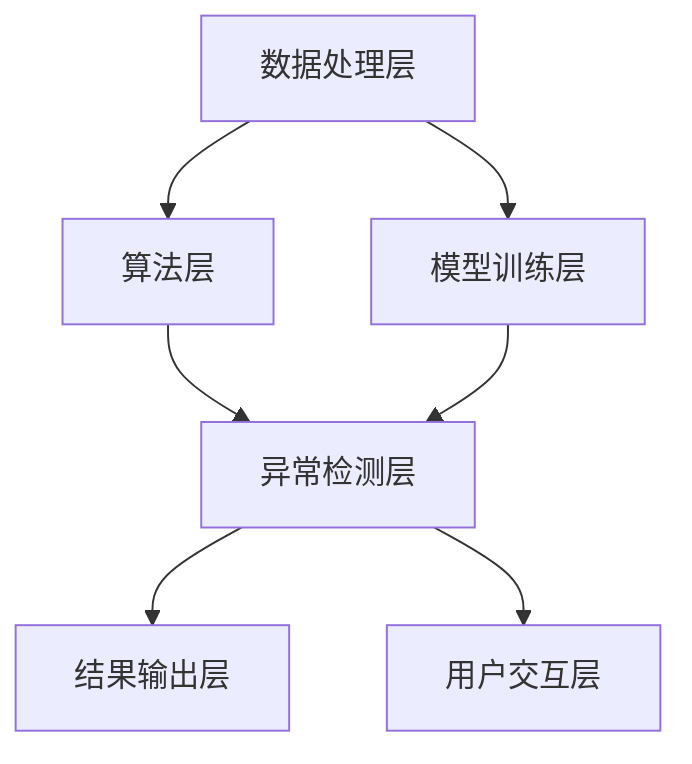
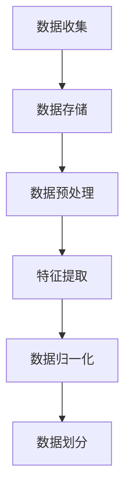

                 

## 《好奇心驱动的无监督异常检测系统设计》

> 关键词：无监督异常检测、系统设计、算法原理、深度学习、实践案例

在信息爆炸的时代，海量数据中隐藏着许多有价值的规律和信息。然而，如何从这些数据中找出异常或异常模式，一直是数据挖掘和人工智能领域的热点话题。无监督异常检测作为一种无需人工标注训练数据的技术，能够自动发现数据中的异常，具有广泛的应用前景。

本文将从无监督异常检测的基本概念、数学基础、算法原理、系统设计等多个方面，深入探讨无监督异常检测系统的设计过程。我们将结合实例，详细讲解核心算法的原理和应用，并分享一些实际项目中的经验与最佳实践。

## 目录大纲

1. **无监督异常检测概述**  
   - 第1章：无监督异常检测的基本概念  
   - 第2章：无监督异常检测的数学基础

2. **无监督异常检测算法**  
   - 第3章：基于聚类的无监督异常检测算法  
   - 第4章：基于统计学的无监督异常检测算法  
   - 第5章：基于机器学习的无监督异常检测算法  
   - 第6章：基于深度学习的无监督异常检测算法

3. **无监督异常检测系统设计**  
   - 第7章：无监督异常检测系统架构设计  
   - 第8章：无监督异常检测系统的实现  
   - 第9章：案例研究

4. **总结与展望**  
   - 第10章：总结与展望

接下来，我们将逐一介绍这些章节，带领读者逐步了解无监督异常检测系统的设计过程。

## 无监督异常检测概述

### 第1章：无监督异常检测的基本概念

本章将详细介绍无监督异常检测的基本概念，包括其定义、动机、应用场景和挑战。

#### 1.1 无监督异常检测的定义

无监督异常检测是指在没有标注数据的情况下，自动识别数据中的异常或异常模式。与监督学习相比，无监督异常检测不需要事先提供正确的标签，而是通过学习数据内在的结构和模式，自动识别异常。

#### 1.2 无监督异常检测的动机

无监督异常检测具有以下动机：

- **无需人工标注**：在某些应用场景中，获取正常的样本数据相对容易，但获取异常样本数据非常困难或者成本高昂。无监督异常检测可以省去人工标注的环节。
- **自动发现异常**：无监督异常检测能够自动从数据中发现异常，对于数据规模巨大或者数据特征复杂的场景，人工检测异常可能非常耗时。
- **实时性**：无监督异常检测可以实时监测数据流中的异常，对于一些需要实时响应的应用场景（如网络安全、工业监控等）非常有用。

#### 1.3 无监督异常检测的应用场景

无监督异常检测在许多领域都有广泛的应用，以下是一些典型的应用场景：

- **金融领域**：如信用卡欺诈检测、贷款风险预测等。
- **网络安全**：如网络入侵检测、恶意软件检测等。
- **医疗领域**：如疾病预测、医疗数据异常检测等。
- **工业领域**：如设备故障预测、生产线异常检测等。

#### 1.4 无监督异常检测的挑战

无监督异常检测面临以下挑战：

- **数据不平衡**：在许多应用场景中，正常数据占大多数，而异常数据相对较少。这种数据不平衡可能导致算法性能下降。
- **高维数据**：许多应用场景中的数据具有高维特性，如何有效地降维成为一大挑战。
- **噪声数据**：实际数据往往含有噪声，如何去除噪声，提高算法的鲁棒性是关键。
- **可解释性**：无监督异常检测算法通常是一个“黑箱”，如何解释异常检测结果，提高算法的可解释性是一个重要问题。

### 第2章：无监督异常检测的数学基础

本章将介绍无监督异常检测所需的数学基础，包括常用概率分布模型、聚类算法、维度约减技术和特征选择与提取。

#### 2.1 常用概率分布模型

在无监督异常检测中，常用概率分布模型包括高斯分布、指数分布、二项分布等。这些模型可以用来描述数据分布，从而进行异常检测。

- **高斯分布**：高斯分布（也称为正态分布）是一种常见的连续概率分布模型，其概率密度函数为：
  $$ f(x|\mu, \sigma^2) = \frac{1}{\sqrt{2\pi\sigma^2}} e^{-\frac{(x-\mu)^2}{2\sigma^2}} $$
  其中，$\mu$为均值，$\sigma^2$为方差。

- **指数分布**：指数分布是一种常见的连续概率分布模型，其概率密度函数为：
  $$ f(x|\lambda) = \lambda e^{-\lambda x} $$
  其中，$\lambda$为分布参数。

- **二项分布**：二项分布是一种常见的离散概率分布模型，其概率质量函数为：
  $$ f(x|\theta, n) = \binom{n}{x} \theta^x (1-\theta)^{n-x} $$
  其中，$\theta$为成功概率，$n$为试验次数。

#### 2.2 聚类算法

聚类算法是将数据集分成若干个聚类或簇的算法。常用的聚类算法包括K-均值聚类算法、层次聚类算法和密度聚类算法等。

- **K-均值聚类算法**：K-均值聚类算法是一种基于距离度量的聚类算法。其基本思想是：首先随机选择K个初始中心点，然后计算每个数据点到各个中心点的距离，将每个数据点分配给最近的中心点，从而形成K个簇。接着，重新计算每个簇的中心点，并重复上述过程，直至中心点不再发生变化。

- **层次聚类算法**：层次聚类算法是一种基于层次结构的聚类算法。其基本思想是：首先将每个数据点视为一个初始簇，然后通过合并相邻的簇，逐步构建出一个层次结构。层次聚类算法可以分为自底向上的凝聚层次聚类算法和自顶向下的分裂层次聚类算法。

- **密度聚类算法**：密度聚类算法是一种基于密度的聚类算法。其基本思想是：首先定义一个密度阈值，然后根据数据点的密度分布，将数据点划分为簇。

#### 2.3 维度约减技术

维度约减技术是一种用于降低数据维度的技术。常用的维度约减技术包括主成分分析（PCA）、线性判别分析（LDA）和小波变换等。

- **主成分分析（PCA）**：PCA是一种基于数据降维的方法，其基本思想是：通过找到数据的主成分，将高维数据映射到低维空间，从而降低数据维度。

- **线性判别分析（LDA）**：LDA是一种用于分类的降维方法，其基本思想是：通过找到最佳投影方向，将高维数据投影到低维空间，从而提高分类性能。

- **小波变换**：小波变换是一种基于小波基的降维方法，其基本思想是：通过分解信号，将高维数据映射到低维空间。

#### 2.4 特征选择与提取

特征选择与提取是一种用于提高模型性能和减少数据维度的技术。常用的特征选择与提取方法包括过滤式方法、包裹式方法和基于模型的特征选择方法等。

- **过滤式方法**：过滤式方法是一种基于统计测试的特征选择方法，其基本思想是：通过计算特征与目标变量之间的相关性，选择相关性较高的特征。

- **包裹式方法**：包裹式方法是一种基于搜索的特征选择方法，其基本思想是：通过搜索所有可能的特征组合，选择最佳特征组合。

- **基于模型的特征选择方法**：基于模型的特征选择方法是一种结合模型性能的特征选择方法，其基本思想是：通过训练模型，选择对模型性能影响较大的特征。

通过本章的介绍，读者可以初步了解无监督异常检测的基本概念和数学基础。接下来，我们将进一步探讨无监督异常检测的算法原理，为后续的系统设计奠定基础。

### 第1章：无监督异常检测的基本概念

#### 1.1 无监督异常检测的定义

无监督异常检测是一种数据挖掘技术，旨在发现数据中的异常或异常模式，而不依赖于事先标记的正常和异常数据。这种方法的核心理念是利用数据自身的内在结构和特征，自动识别出与大多数数据不同的样本。

具体来说，无监督异常检测过程可以分为以下几个步骤：

1. **数据收集**：首先收集需要检测的数据，这些数据可以是时间序列数据、空间数据、文本数据等。
2. **特征提取**：通过特征提取技术，将原始数据转换为一组数值特征，以便于后续处理。
3. **建模**：使用聚类、概率模型、机器学习等方法建立异常检测模型，模型的目标是识别出与大多数数据不同的样本。
4. **检测与评估**：使用训练好的模型对新的数据进行异常检测，并评估检测结果的准确性和鲁棒性。

#### 1.2 无监督异常检测的动机

无监督异常检测在多个领域具有广泛的应用前景，以下是其主要动机：

1. **无需人工标注数据**：在许多情况下，获取正常数据的成本较低，而获取异常数据非常困难或者成本高昂。无监督异常检测可以自动发现异常，无需人工标注数据。
2. **自动性**：无监督异常检测可以自动从数据中学习模式和规律，无需人为干预，适合处理大规模数据。
3. **实时性**：无监督异常检测可以实时检测数据流中的异常，适用于需要实时响应的场景。
4. **发现未知异常**：无监督异常检测能够发现未知异常，这对于传统监督学习方法难以处理的情况非常有用。

#### 1.3 无监督异常检测的应用场景

无监督异常检测在多个领域都有广泛的应用，以下是几个典型的应用场景：

1. **金融领域**：如信用卡欺诈检测、贷款风险预测等，通过无监督异常检测可以自动发现潜在的欺诈行为。
2. **网络安全**：如网络入侵检测、恶意软件检测等，无监督异常检测可以帮助网络安全系统实时检测潜在威胁。
3. **医疗领域**：如疾病预测、医疗数据异常检测等，无监督异常检测可以帮助医生及时发现疾病异常。
4. **工业领域**：如设备故障预测、生产线异常检测等，无监督异常检测可以帮助企业提高生产效率和设备可靠性。

#### 1.4 无监督异常检测的挑战

尽管无监督异常检测具有许多优势，但在实际应用中仍然面临以下挑战：

1. **数据不平衡**：在许多应用场景中，正常数据占大多数，而异常数据相对较少。这种数据不平衡可能导致算法性能下降。
2. **高维数据**：许多应用场景中的数据具有高维特性，如何有效地降维成为一大挑战。
3. **噪声数据**：实际数据往往含有噪声，如何去除噪声，提高算法的鲁棒性是关键。
4. **可解释性**：无监督异常检测算法通常是一个“黑箱”，如何解释异常检测结果，提高算法的可解释性是一个重要问题。

通过本章的介绍，我们初步了解了无监督异常检测的定义、动机、应用场景和挑战。在下一章中，我们将进一步探讨无监督异常检测所需的数学基础，为深入理解相关算法奠定基础。

### 第2章：无监督异常检测的数学基础

在深入探讨无监督异常检测的算法之前，了解其背后的数学基础是至关重要的。本章将介绍无监督异常检测中常用的一些数学模型、聚类算法、维度约减技术和特征选择与提取方法。

#### 2.1 常用概率分布模型

概率分布模型在无监督异常检测中扮演着重要角色，因为它们帮助我们理解和描述数据的分布特性。以下是一些常用的概率分布模型：

1. **高斯分布（正态分布）**：
   高斯分布是最常见的概率分布之一，它的概率密度函数（PDF）如下：
   $$ f(x|\mu, \sigma^2) = \frac{1}{\sqrt{2\pi\sigma^2}} e^{-\frac{(x-\mu)^2}{2\sigma^2}} $$
   其中，$\mu$是均值，$\sigma^2$是方差。高斯分布常用于假设数据是服从正态分布的，并用于计算数据的概率密度。

2. **指数分布**：
   指数分布是一种常见的连续概率分布模型，其概率密度函数（PDF）如下：
   $$ f(x|\lambda) = \lambda e^{-\lambda x} $$
   其中，$\lambda$是分布参数。指数分布常用于描述时间间隔或等待时间的分布。

3. **二项分布**：
   二项分布是一种离散概率分布模型，其概率质量函数（PMF）如下：
   $$ f(x|\theta, n) = \binom{n}{x} \theta^x (1-\theta)^{n-x} $$
   其中，$\theta$是成功概率，$n$是试验次数。二项分布常用于描述一系列独立试验中成功次数的分布。

#### 2.2 聚类算法

聚类算法是一种无监督学习方法，用于将数据集划分为若干个簇，以便更好地理解数据的结构和模式。以下是一些常见的聚类算法：

1. **K-均值聚类算法**：
   K-均值聚类算法是一种迭代优化算法，其目标是找到K个中心点，使得每个数据点与其最近中心点的距离之和最小。算法的基本步骤如下：
   - 随机初始化K个中心点。
   - 对于每个数据点，计算它与各个中心点的距离，将其分配给距离最近的中心点。
   - 重新计算每个簇的中心点。
   - 重复上述步骤，直至中心点不再发生变化。

2. **层次聚类算法**：
   层次聚类算法是一种自上而下或自下而上的方法，用于构建一个聚类层次结构。常见的层次聚类算法包括：
   - **自底向上的凝聚层次聚类算法**：从每个数据点开始，逐步合并距离较近的簇，直至所有数据点合并为一个簇。
   - **自顶向下的分裂层次聚类算法**：从一个大簇开始，逐步分裂成多个小簇，直至每个簇只包含一个数据点。

3. **密度聚类算法**：
   密度聚类算法基于数据点的密度分布，将数据点划分为簇。其核心思想是：首先定义一个密度阈值，然后根据数据点的密度分布，将数据点划分为簇。DBSCAN（密度基于空间聚类）是这种算法的一个典型代表。

#### 2.3 维度约减技术

高维数据在许多应用中都是常见的，但高维数据往往会导致计算效率和存储成本的增加。维度约减技术旨在降低数据的维度，同时尽可能保留数据的信息。以下是一些常见的维度约减技术：

1. **主成分分析（PCA）**：
   PCA是一种常用的线性维度约减技术，通过找到数据的主要成分，将高维数据映射到低维空间。PCA的核心步骤包括计算协方差矩阵、找到特征值和特征向量，并使用特征向量构建低维数据。

2. **线性判别分析（LDA）**：
   LDA是一种基于分类的维度约减技术，通过找到最佳投影方向，将高维数据映射到低维空间，从而提高分类性能。LDA的核心步骤包括计算协方差矩阵、找到判别向量，并使用判别向量构建低维数据。

3. **小波变换**：
   小波变换是一种基于小波基的维度约减技术，通过分解信号，将高维数据映射到低维空间。小波变换的优点是能够同时处理时间和频率信息。

#### 2.4 特征选择与提取

特征选择与提取是一种用于提高模型性能和减少数据维度的技术。以下是一些常见的特征选择与提取方法：

1. **过滤式方法**：
   过滤式方法是一种基于统计测试的特征选择方法，通过计算特征与目标变量之间的相关性，选择相关性较高的特征。常见的统计测试包括卡方检验、F检验等。

2. **包裹式方法**：
   包裹式方法是一种基于搜索的特征选择方法，通过搜索所有可能的特征组合，选择最佳特征组合。常见的搜索算法包括遗传算法、粒子群优化算法等。

3. **基于模型的特征选择方法**：
   基于模型的特征选择方法是一种结合模型性能的特征选择方法，通过训练模型，选择对模型性能影响较大的特征。常见的模型包括支持向量机（SVM）、决策树等。

通过本章的介绍，我们了解了无监督异常检测所需的一些数学基础，包括概率分布模型、聚类算法、维度约减技术和特征选择与提取方法。在下一章中，我们将探讨无监督异常检测算法的原理和应用。

### 第3章：基于聚类的无监督异常检测算法

聚类算法是无监督异常检测中常用的方法之一。通过将数据划分为不同的簇，聚类算法可以帮助我们识别出数据中的异常。本章将详细介绍几种基于聚类的无监督异常检测算法，包括K-均值聚类算法、层次聚类算法和密度聚类算法。

#### 3.1 K-均值聚类算法

K-均值聚类算法是最常用的聚类算法之一，其核心思想是将数据划分为K个簇，每个簇由一个中心点表示。算法的步骤如下：

1. **初始化**：随机选择K个数据点作为初始中心点。
2. **分配数据点**：对于每个数据点，计算其与各个中心点的距离，将其分配给距离最近的中心点所在的簇。
3. **更新中心点**：重新计算每个簇的中心点，作为新的中心点。
4. **迭代**：重复步骤2和步骤3，直至中心点不再发生变化。

以下是一个简化的Python代码示例，用于实现K-均值聚类算法：

```python
import numpy as np

def k_means(data, K, max_iterations):
    # 初始化中心点
    centroids = data[np.random.choice(data.shape[0], K, replace=False)]
    
    for _ in range(max_iterations):
        # 分配数据点
        distances = np.linalg.norm(data - centroids, axis=1)
        labels = np.argmin(distances, axis=1)
        
        # 更新中心点
        new_centroids = np.array([data[labels == k].mean(axis=0) for k in range(K)])
        
        # 判断是否收敛
        if np.linalg.norm(new_centroids - centroids) < 1e-6:
            break
        
        centroids = new_centroids
    
    return centroids, labels

# 示例数据
data = np.array([[1, 2], [1, 4], [1, 0], [4, 2], [4, 4], [4, 0]])
K = 2
max_iterations = 100

# 运行K-均值聚类算法
centroids, labels = k_means(data, K, max_iterations)

print("Centroids:", centroids)
print("Labels:", labels)
```

#### 3.2 层次聚类算法

层次聚类算法是一种自底向上或自顶向下的方法，用于构建一个聚类层次结构。常见的层次聚类算法包括：

1. **自底向上的凝聚层次聚类算法**：从每个数据点开始，逐步合并距离较近的簇，直至所有数据点合并为一个簇。
2. **自顶向下的分裂层次聚类算法**：从一个大簇开始，逐步分裂成多个小簇，直至每个簇只包含一个数据点。

以下是一个简化的Python代码示例，用于实现层次聚类算法：

```python
import numpy as np

def hierarchical_clustering(data, method='single'):
    # 计算距离矩阵
    distances = np.linalg.norm(data[:, np.newaxis] - data[np.newaxis, :], axis=2)
    
    # 初始化层级结构
    hierarchy = []
    
    for i in range(distances.shape[0]):
        # 找到最近的簇，合并簇
        if method == 'single':
            min_distance = np.min(distances[i, :])
            index = np.argmin(distances[i, :])
        elif method == 'complete':
            min_distance = np.max(distances[i, :])
            index = np.argmax(distances[i, :])
        
        # 更新距离矩阵
        distances[i, :] = np.inf
        distances[:, i] = np.inf
        distances[index, index] = 0
        
        # 添加层级结构
        hierarchy.append([i, index, min_distance])
    
    return hierarchy

# 示例数据
data = np.array([[1, 2], [1, 4], [1, 0], [4, 2], [4, 4], [4, 0]])

# 运行层次聚类算法
hierarchy = hierarchical_clustering(data, method='single')

print("Hierarchy:", hierarchy)
```

#### 3.3 密度聚类算法

密度聚类算法基于数据点的密度分布，将数据点划分为簇。其核心思想是：首先定义一个密度阈值，然后根据数据点的密度分布，将数据点划分为簇。DBSCAN（密度基于空间聚类）是这种算法的一个典型代表。

DBSCAN算法的步骤如下：

1. **初始化**：选择一个数据点，将其标记为核心点，并将其邻域内的点标记为核心点。
2. **扩展簇**：对于每个核心点，将其邻域内的点扩展到簇中。
3. **标记边界点**：对于每个邻域包含少于指定数量的核心点的点，将其标记为边界点。
4. **标记噪声点**：未标记为核心点或边界点的点被视为噪声点。

以下是一个简化的Python代码示例，用于实现DBSCAN算法：

```python
import numpy as np

def dbscan(data, min_points=5, min_distance=5):
    # 计算邻域
    distances = np.linalg.norm(data[:, np.newaxis] - data[np.newaxis, :], axis=2)
    neighbors = np.where(distances <= min_distance)[1]
    
    # 初始化标记
    labels = np.full(data.shape[0], -1)
    core_count = 0
    
    for i in range(data.shape[0]):
        # 标记核心点
        if distances[i].sum() > min_points:
            labels[i] = core_count
            core_count += 1
            
            # 扩展簇
            points_to_expand = [i]
            while points_to_expand:
                current_point = points_to_expand.pop()
                if labels[current_point] != core_count:
                    labels[current_point] = core_count
                    neighbors_of_current = neighbors[current_point]
                    if neighbors_of_current.shape[0] >= min_points:
                        points_to_expand.extend(neighbors_of_current)
    
    # 标记边界点和噪声点
    for i in range(data.shape[0]):
        if labels[i] == -1:
            if distances[i].sum() > min_points:
                labels[i] = -2  # 边界点
            else:
                labels[i] = -3  # 噪声点
    
    return labels

# 示例数据
data = np.array([[1, 2], [1, 4], [1, 0], [4, 2], [4, 4], [4, 0]])

# 运行DBSCAN算法
labels = dbscan(data, min_points=5, min_distance=5)

print("Labels:", labels)
```

通过上述代码示例，我们可以看到如何实现K-均值聚类算法、层次聚类算法和DBSCAN算法。这些算法各有优缺点，适用于不同的应用场景。在下一章中，我们将继续探讨基于统计学的无监督异常检测算法。

### 第4章：基于统计学的无监督异常检测算法

统计学方法在无监督异常检测中扮演着重要角色，通过分析数据的统计特性，我们可以发现数据中的异常。本章将介绍几种基于统计学的无监督异常检测算法，包括均值漂移算法、自组织映射（SOM）算法、生存分析和统计异常检测的评价指标。

#### 4.1 均值漂移算法

均值漂移算法（Mean Shift Algorithm）是一种基于密度的聚类方法，其核心思想是通过计算数据点的局部均值来更新聚类中心，从而实现聚类。以下是其基本原理：

1. **初始化**：选择一个初始高斯核，并随机选择一个初始聚类中心。
2. **计算局部均值**：对于每个数据点，计算其邻域内的局部均值。
3. **更新聚类中心**：将每个数据点的局部均值作为新的聚类中心。
4. **迭代**：重复步骤2和步骤3，直至聚类中心不再发生变化。

以下是一个简化的Python代码示例，用于实现均值漂移算法：

```python
import numpy as np

def mean_shift(data, bandwidth, max_iterations):
    # 初始化聚类中心
    centroids = data[np.random.choice(data.shape[0])]
    
    for _ in range(max_iterations):
        # 计算局部均值
        distances = np.linalg.norm(data[:, np.newaxis] - centroids[np.newaxis, :], axis=2)
        local_means = np.zeros_like(data)
        for i in range(data.shape[0]):
            local_means[i] = np.mean(data[distances[i] <= bandwidth], axis=0)
        
        # 更新聚类中心
        centroids = local_means
        
        # 判断是否收敛
        if np.linalg.norm(centroids - local_means) < 1e-6:
            break
    
    return centroids

# 示例数据
data = np.array([[1, 2], [1, 4], [1, 0], [4, 2], [4, 4], [4, 0]])
bandwidth = 1
max_iterations = 100

# 运行均值漂移算法
centroids = mean_shift(data, bandwidth, max_iterations)

print("Centroids:", centroids)
```

#### 4.2 自组织映射（SOM）算法

自组织映射（Self-Organizing Map，SOM）是一种基于竞争学习的神经网络模型，其核心思想是通过竞争学习将高维数据映射到低维空间，从而实现聚类。以下是其基本原理：

1. **初始化**：创建一个二维网格，每个网格单元代表一个虚拟神经元。
2. **计算竞争获胜者**：对于每个输入数据点，计算其与各个虚拟神经元的距离，距离最近的虚拟神经元获胜。
3. **更新虚拟神经元权重**：获胜神经元的权重更新为输入数据点，其他神经元的权重根据与获胜神经元的距离进行更新。
4. **迭代**：重复步骤2和步骤3，直至网络稳定。

以下是一个简化的Python代码示例，用于实现自组织映射（SOM）算法：

```python
import numpy as np

def som(data, grid_size, learning_rate, max_iterations):
    # 初始化网络
    network = np.zeros(grid_size)
    
    for _ in range(max_iterations):
        # 计算竞争获胜者
        distances = np.linalg.norm(data[:, np.newaxis] - network[np.newaxis, :], axis=2)
        winner_index = np.argmin(distances)
        
        # 更新网络
        network[winner_index] = data
        for i in range(grid_size[0]):
            for j in range(grid_size[1]):
                if np.linalg.norm(np.array([i, j]) - winner_index) < 1:
                    network[i, j] += learning_rate * (data - network[i, j])
    
    return network

# 示例数据
data = np.array([[1, 2], [1, 4], [1, 0], [4, 2], [4, 4], [4, 0]])
grid_size = (3, 3)
learning_rate = 0.1
max_iterations = 100

# 运行自组织映射（SOM）算法
network = som(data, grid_size, learning_rate, max_iterations)

print("Network:", network)
```

#### 4.3 生存分析

生存分析（Survival Analysis）是一种用于研究时间到事件数据的统计方法，其核心目的是估计生存函数，即给定时间t后，个体尚未发生事件（如异常）的概率。以下是其基本原理：

1. **定义生存函数**：生存函数S(t)表示在时间t后个体尚未发生事件的概率，其数学定义如下：
   $$ S(t) = P(T > t) $$
   其中，T为时间变量。

2. **估计生存函数**：常用的生存函数估计方法包括Kaplan-Meier估计和Cox比例风险模型。Kaplan-Meier估计是基于观察数据的非参数方法，而Cox比例风险模型是一种参数方法，可以同时处理多个变量。

3. **分析异常**：通过估计生存函数，我们可以识别出生存时间显著短于正常值的个体，这些个体可能代表异常。

以下是一个简化的Python代码示例，用于实现Kaplan-Meier估计：

```python
import numpy as np
import matplotlib.pyplot as plt

def kaplan_meier( durations, censoring ):
    n = len(durations)
    t = np.unique(durations)
    S = np.zeros(t.shape[0])
    
    for i, ti in enumerate(t):
        idx = durations < ti
        if not np.any(idx):
            S[i] = 1
            continue
        n_i = np.sum( idx )
        d_i = np.sum( idx & (censoring == 1) )
        S[i] = np.sum( (n - d_i) / (n - i) )
    
    return S, t

# 示例数据
durations = np.array([3, 4, 5, 7, 8, 9, 11, 13, 15, 17, 18, 20, 24, 25, 28, 32, 38, 39, 42, 50])
censoring = np.array([0, 0, 0, 0, 0, 0, 0, 0, 0, 0, 0, 0, 0, 0, 0, 0, 0, 0, 0, 1])

# 运行Kaplan-Meier估计
S, t = kaplan_meier( durations, censoring )

plt.step(t, S, where='post')
plt.xlabel('Time')
plt.ylabel('Survival Function')
plt.title('Kaplan-Meier Estimate')
plt.show()
```

#### 4.4 统计异常检测的评价指标

统计异常检测算法的性能评估通常依赖于一系列评价指标。以下是一些常用的评价指标：

1. **精确度（Precision）**：
   精确度表示预测为异常的样本中实际为异常的比例。其计算公式为：
   $$ Precision = \frac{TP}{TP + FP} $$
   其中，TP为真正例，FP为假正例。

2. **召回率（Recall）**：
   召回率表示实际为异常的样本中被预测为异常的比例。其计算公式为：
   $$ Recall = \frac{TP}{TP + FN} $$
   其中，FN为假反例。

3. **F1值（F1 Score）**：
   F1值是精确度和召回率的调和平均值，用于综合评价模型性能。其计算公式为：
   $$ F1 = 2 \times \frac{Precision \times Recall}{Precision + Recall} $$

4. **ROC曲线和AUC（Area Under Curve）**：
   ROC曲线是不同阈值下的真阳性率（True Positive Rate，TPR）和假阳性率（False Positive Rate，FPR）的图形表示。AUC表示ROC曲线下的面积，用于评估模型对异常的识别能力。

通过本章的介绍，我们了解了几种基于统计学的无监督异常检测算法，包括均值漂移算法、自组织映射（SOM）算法、生存分析和统计异常检测的评价指标。在下一章中，我们将探讨基于机器学习的无监督异常检测算法。

### 第5章：基于机器学习的无监督异常检测算法

机器学习算法在无监督异常检测中有着广泛的应用，通过学习数据的内在结构和特征，机器学习算法能够自动识别数据中的异常。本章将介绍几种基于机器学习的无监督异常检测算法，包括支持向量数据描述（SVDD）、隐马尔可夫模型（HMM）和贝叶斯网络。

#### 5.1 支持向量数据描述（SVDD）

支持向量数据描述（Support Vector Data Description，SVDD）是一种基于支持向量机的无监督异常检测算法。SVDD的核心思想是将异常点视为远离决策边界的样本，通过寻找最优的决策边界来识别异常。

SVDD的步骤如下：

1. **选择核函数**：SVDD使用核函数将数据映射到高维空间，常见的核函数包括线性核、多项式核和高斯核。
2. **求解最优边界**：使用支持向量机求解最优决策边界，使得决策边界将正常数据与异常数据分隔开来。
3. **计算异常分数**：对于每个样本，计算其到决策边界的距离，距离越远表示异常性越高。

以下是一个简化的Python代码示例，用于实现SVDD算法：

```python
import numpy as np
from sklearn.svm import SVC

def svdd(data, kernel='rbf', gamma=None):
    # 求解最优边界
    clf = SVC(kernel=kernel, gamma=gamma)
    clf.fit(data, np.zeros(data.shape[0]))
    
    # 计算异常分数
    distances = np.linalg.norm(data - clf.support_vectors_, axis=1)
    threshold = np.mean(distances)
    
    return threshold, clf.support_vectors_

# 示例数据
data = np.array([[1, 2], [1, 4], [1, 0], [4, 2], [4, 4], [4, 0]])
threshold, support_vectors = svdd(data, kernel='rbf')

print("Threshold:", threshold)
print("Support Vectors:", support_vectors)
```

#### 5.2 隐马尔可夫模型（HMM）

隐马尔可夫模型（Hidden Markov Model，HMM）是一种基于概率的统计模型，用于描述包含隐藏状态序列的随机过程。在无监督异常检测中，HMM可以用于识别数据中的异常模式。

HMM的基本组件包括：

1. **状态空间**：描述系统的所有可能状态。
2. **观测空间**：描述系统状态产生的观测。
3. **初始状态概率分布**：描述系统在初始时刻处于各状态的概率。
4. **状态转移概率矩阵**：描述系统在不同状态之间的转移概率。
5. **观测概率分布**：描述系统在特定状态时产生特定观测的概率。

HMM的步骤如下：

1. **训练模型**：通过训练数据学习HMM的参数，包括初始状态概率分布、状态转移概率矩阵和观测概率分布。
2. **解码**：对于新的观测序列，使用Viterbi算法解码，找到最可能的隐藏状态序列。
3. **检测异常**：将解码得到的隐藏状态序列与正常状态序列进行比较，识别异常。

以下是一个简化的Python代码示例，用于实现HMM：

```python
import numpy as np
from hmmlearn import hmm

def hmm_detection(data, n_components=2):
    # 创建HMM模型
    model = hmm.GaussianHMM(n_components=n_components)
    
    # 训练模型
    model.fit(data)
    
    # 预测隐藏状态
    hidden_states = model.predict(data)
    
    # 检测异常
    anomalies = data[hidden_states == 1]
    
    return anomalies

# 示例数据
data = np.array([[1, 2], [1, 4], [1, 0], [4, 2], [4, 4], [4, 0]])
anomalies = hmm_detection(data, n_components=2)

print("Anomalies:", anomalies)
```

#### 5.3 贝叶斯网络

贝叶斯网络是一种基于概率的图形模型，用于表示变量之间的依赖关系。在无监督异常检测中，贝叶斯网络可以用于建模数据中的潜在变量，从而识别异常。

贝叶斯网络的基本组件包括：

1. **节点**：表示随机变量。
2. **边**：表示变量之间的条件依赖关系。
3. **条件概率表**：描述每个变量在特定条件下取值的概率。

贝叶斯网络的步骤如下：

1. **构建网络**：根据领域知识构建贝叶斯网络结构。
2. **参数学习**：通过训练数据学习网络的参数，包括条件概率表。
3. **推理**：使用推理算法计算变量的后验概率分布。
4. **异常检测**：通过比较后验概率分布与先验概率分布，识别异常。

以下是一个简化的Python代码示例，用于实现贝叶斯网络：

```python
import numpy as np
from pgmpy.models import BayesianModel
from pgmpy.inference import VariableElimination

def bayesian_network(data, model):
    # 创建贝叶斯网络模型
    bnm = BayesianModel(model)
    
    # 训练模型
    bnm.fit(data)
    
    # 推理
    inference = VariableElimination(bnm)
    
    # 计算后验概率分布
    posterior = inference.map_query(variables=["A", "B"], evidence={"C": 1})
    
    return posterior

# 示例数据
data = np.array([[0, 0, 1], [0, 1, 1], [1, 0, 1], [1, 1, 0]])
model = [{"type": "bayesian", "name": "A", "parents": []},
         {"type": "bayesian", "name": "B", "parents": ["A"]},
         {"type": "bayesian", "name": "C", "parents": ["A", "B"]}]
posterior = bayesian_network(data, model)

print("Posterior:", posterior)
```

通过本章的介绍，我们了解了基于机器学习的几种无监督异常检测算法，包括支持向量数据描述（SVDD）、隐马尔可夫模型（HMM）和贝叶斯网络。这些算法各有优缺点，适用于不同的应用场景。在下一章中，我们将探讨基于深度学习的无监督异常检测算法。

### 第6章：基于深度学习的无监督异常检测算法

深度学习在无监督异常检测领域表现出强大的能力，通过学习数据的复杂结构和模式，深度学习算法能够自动识别出数据中的异常。本章将介绍几种基于深度学习的无监督异常检测算法，包括深度自编码器（DAE）、自动对抗生成网络（GAN）和变分自编码器（VAE）。

#### 6.1 深度自编码器（Deep Autoencoder）

深度自编码器（Deep Autoencoder，DAE）是一种基于神经网络的无监督学习算法，其核心思想是通过学习数据的压缩表示，从而自动识别出异常。DAE由两个主要部分组成：编码器和解码器。

1. **编码器**：编码器负责将输入数据压缩为一个低维表示，通常是一个固定长度的向量。
2. **解码器**：解码器负责将编码器的输出重构为原始数据。

DAE的训练过程如下：

1. **初始化模型参数**：随机初始化编码器和解码器的参数。
2. **前向传播**：对于输入数据，通过编码器得到压缩表示，再通过解码器重构输入数据。
3. **计算损失**：计算重构误差，通常使用均方误差（MSE）或交叉熵作为损失函数。
4. **反向传播**：通过梯度下降优化模型参数，以减少重构误差。
5. **迭代**：重复步骤2-4，直至模型收敛。

以下是一个简化的Python代码示例，用于实现深度自编码器：

```python
import tensorflow as tf
from tensorflow.keras.layers import Dense
from tensorflow.keras.models import Model

def build_dae(input_shape):
    # 编码器
    encoder_inputs = tf.keras.Input(shape=input_shape)
    encoder = Dense(32, activation='relu')(encoder_inputs)
    encoder = Dense(16, activation='relu')(encoder)
    encoder_output = Dense(8, activation='sigmoid')(encoder)

    # 解码器
    decoder_inputs = tf.keras.Input(shape=(8,))
    decoder = Dense(16, activation='relu')(decoder_inputs)
    decoder = Dense(32, activation='relu')(decoder)
    decoder_output = Dense(input_shape, activation='sigmoid')(decoder)

    # 模型
    autoencoder = Model(encoder_inputs, decoder_output)
    autoencoder.compile(optimizer='adam', loss='mse')

    return autoencoder

# 示例数据
input_shape = (100,)
autoencoder = build_dae(input_shape)

# 训练模型
autoencoder.fit(np.random.rand(1000, input_shape[0]), np.random.rand(1000, input_shape[0]), epochs=100, batch_size=32)
```

#### 6.2 自动对抗生成网络（Generative Adversarial Network，GAN）

自动对抗生成网络（Generative Adversarial Network，GAN）由两部分组成：生成器（Generator）和判别器（Discriminator）。生成器试图生成尽可能接近真实数据的假数据，而判别器试图区分真实数据和假数据。通过这种对抗性训练，GAN可以学习到真实数据的分布，从而能够生成高质量的假数据。

GAN的训练过程如下：

1. **初始化模型参数**：随机初始化生成器和判别器的参数。
2. **生成假数据**：生成器生成假数据。
3. **判别器训练**：判别器同时接收真实数据和假数据，通过反向传播更新判别器参数。
4. **生成器训练**：生成器通过生成假数据来误导判别器，通过反向传播更新生成器参数。
5. **迭代**：重复步骤2-4，直至模型收敛。

以下是一个简化的Python代码示例，用于实现自动对抗生成网络：

```python
import tensorflow as tf
from tensorflow.keras.layers import Dense, Flatten
from tensorflow.keras.models import Sequential

def build_gan(input_shape):
    # 生成器
    generator = Sequential()
    generator.add(Dense(256, input_shape=input_shape, activation='relu'))
    generator.add(Dense(512, activation='relu'))
    generator.add(Dense(np.prod(input_shape), activation='tanh'))
    generator.add(Flatten())

    # 判别器
    discriminator = Sequential()
    discriminator.add(Flatten(input_shape=input_shape))
    discriminator.add(Dense(512, activation='relu'))
    discriminator.add(Dense(256, activation='relu'))
    discriminator.add(Dense(1, activation='sigmoid'))

    # 模型
    gan = Sequential()
    gan.add(generator)
    gan.add(discriminator)
    gan.compile(optimizer='adam', loss='binary_crossentropy')

    return gan

# 示例数据
input_shape = (100,)
gan = build_gan(input_shape)

# 训练模型
gan.fit(np.random.rand(1000, input_shape[0]), np.random.rand(1000, 1), epochs=100, batch_size=32)
```

#### 6.3 变分自编码器（Variational Autoencoder，VAE）

变分自编码器（Variational Autoencoder，VAE）是一种基于概率模型的深度学习算法，其核心思想是学习数据的概率分布。VAE由两部分组成：编码器和解码器，与DAE类似。但VAE的编码器输出不是固定长度的向量，而是从先验分布中采样。

VAE的训练过程如下：

1. **初始化模型参数**：随机初始化编码器和解码器的参数。
2. **编码器训练**：编码器同时输出均值和方差，用于表示数据点在潜在空间中的分布。
3. **解码器训练**：解码器接收从编码器输出的采样，重构输入数据。
4. **损失函数**：VAE使用一种名为Kullback-Leibler散度的损失函数来度量编码器的输出与先验分布之间的差距。
5. **迭代**：重复步骤2-4，直至模型收敛。

以下是一个简化的Python代码示例，用于实现变分自编码器：

```python
import tensorflow as tf
from tensorflow.keras.layers import Dense, Input
from tensorflow.keras.models import Model

def build_vae(input_shape):
    # 编码器
    encoder_inputs = Input(shape=input_shape)
    x = Dense(32, activation='relu')(encoder_inputs)
    x = Dense(16, activation='relu')(x)
    z_mean = Dense(8)(x)
    z_log_var = Dense(8)(x)

    # 重参数化技巧
    z = Input(shape=(8,))
    z_mean = Lambda(lambda x: x[0])(z)
    z_log_var = Lambda(lambda x: x[1])(z)
    z = Lambda(lambda x: x[:, 0] * x[:, 1], output_shape=(8,))(z)

    # 解码器
    decoder_inputs = Input(shape=(8,))
    x = Dense(16, activation='relu')(decoder_inputs)
    x = Dense(32, activation='relu')(x)
    decoder_outputs = Dense(np.prod(input_shape), activation='sigmoid')(x)
    decoder_outputs = Reshape(input_shape)(decoder_outputs)

    # 模型
    vae = Model([encoder_inputs, z], decoder_outputs)
    vae.compile(optimizer='adam', loss='binary_crossentropy')

    return vae

# 示例数据
input_shape = (100,)
vae = build_vae(input_shape)

# 训练模型
vae.fit(np.random.rand(1000, input_shape[0]), np.random.rand(1000, input_shape[0]), epochs=100, batch_size=32)
```

通过本章的介绍，我们了解了基于深度学习的几种无监督异常检测算法，包括深度自编码器（DAE）、自动对抗生成网络（GAN）和变分自编码器（VAE）。这些算法在不同场景中具有各自的优势，为无监督异常检测提供了强大的工具。在下一章中，我们将探讨无监督异常检测系统的架构设计。

### 第7章：无监督异常检测系统架构设计

无监督异常检测系统架构设计是确保系统高效、稳定、可扩展的关键。一个良好的架构不仅能够满足当前的需求，还能适应未来可能的变化。本章将详细介绍无监督异常检测系统的需求分析、系统架构设计、数据处理流程和系统性能优化。

#### 7.1 系统需求分析

系统需求分析是系统架构设计的起点，它明确了系统的目标、功能、性能和约束。以下是进行系统需求分析时需要考虑的关键点：

1. **业务目标**：明确系统旨在解决的业务问题，如信用卡欺诈检测、设备故障预测等。
2. **数据源**：确定数据来源，包括数据类型、数据量、数据频率等。
3. **数据质量**：分析数据的完整度、准确性、一致性和时效性。
4. **性能要求**：定义系统的响应时间、处理能力和并发处理能力。
5. **可扩展性**：确保系统能够随着数据量和用户量的增加而扩展。
6. **安全性**：确保数据安全和用户隐私。
7. **可靠性**：系统需要高可用性和故障恢复能力。
8. **可维护性**：系统设计应易于维护和升级。

#### 7.2 系统架构设计

无监督异常检测系统的架构设计应考虑以下几个方面：

1. **数据处理层**：负责数据的收集、存储、预处理和特征提取。该层通常包括数据收集模块、数据存储模块、数据预处理模块和特征提取模块。

2. **算法层**：实现各种无监督异常检测算法，如K-均值聚类、均值漂移、SVDD、VAE等。算法层的设计应具备模块化和可扩展性，以便于后续添加新的算法。

3. **模型训练层**：负责模型的训练和调优。模型训练层应支持并行训练和多模型比较，以提高训练效率和模型性能。

4. **异常检测层**：负责实时检测数据流中的异常。异常检测层应具备高效的处理能力和实时响应能力。

5. **结果输出层**：负责将异常检测结果输出到可视化工具或告警系统。该层应支持多种数据输出格式，如CSV、JSON、图表等。

6. **用户交互层**：提供用户界面，方便用户进行系统配置、参数调整和结果分析。

以下是一个简化的系统架构设计Mermaid流程图：



#### 7.3 数据处理流程

无监督异常检测系统的数据处理流程通常包括以下步骤：

1. **数据收集**：从不同的数据源（如数据库、API、文件等）收集数据。
2. **数据存储**：将收集到的数据存储到数据库或数据仓库中，以便后续处理。
3. **数据预处理**：清洗数据，包括缺失值填充、异常值处理、数据格式转换等。
4. **特征提取**：从原始数据中提取有助于异常检测的特征，如时间序列特征、统计特征、文本特征等。
5. **数据归一化**：将数据归一化到同一量级，以提高算法的性能。
6. **数据划分**：将数据划分为训练集、验证集和测试集，用于模型训练和性能评估。

以下是一个简化的数据处理流程Mermaid流程图：



#### 7.4 系统性能优化

为了确保无监督异常检测系统的高效性和稳定性，需要进行系统性能优化。以下是一些常用的性能优化策略：

1. **并行处理**：利用多核CPU或GPU进行并行计算，以提高处理速度。
2. **缓存机制**：使用缓存技术减少重复计算和数据访问，提高系统响应速度。
3. **批量处理**：将数据分批处理，以减少内存占用和计算时间。
4. **压缩技术**：使用数据压缩技术减少数据存储和传输的需求。
5. **高效算法**：选择高效算法和优化算法，以减少计算复杂度和时间消耗。
6. **分布式计算**：在数据量和计算量较大的场景中，使用分布式计算架构，以提高处理能力和可用性。
7. **自动化调优**：使用自动化工具进行参数调优，以找到最优的算法参数。

通过本章的介绍，我们了解了无监督异常检测系统架构设计的关键点，包括需求分析、系统架构设计、数据处理流程和系统性能优化。在下一章中，我们将探讨无监督异常检测系统的实现。

### 第8章：无监督异常检测系统的实现

实现无监督异常检测系统是一个复杂的过程，涉及数据收集、预处理、算法选择、模型训练、系统部署和运维等多个方面。在本章中，我们将详细描述如何实现一个无监督异常检测系统，包括开发环境搭建、源代码实现和代码解读、实际案例分析和项目小结。

#### 8.1 开发环境搭建

首先，我们需要搭建一个适合开发和运行无监督异常检测系统的开发环境。以下是推荐的工具和库：

1. **编程语言**：Python是一种广泛使用的编程语言，具有丰富的库和工具，非常适合实现机器学习和深度学习算法。
2. **计算平台**：可以使用本地计算机或云服务器作为计算平台。对于大规模数据处理和训练，建议使用具有多核CPU或GPU的服务器。
3. **开发工具**：
   - **集成开发环境（IDE）**：如PyCharm、Visual Studio Code等，提供代码编辑、调试和运行功能。
   - **版本控制工具**：如Git，用于管理代码版本和控制协作开发。
4. **库和框架**：
   - **机器学习和深度学习库**：如scikit-learn、TensorFlow、PyTorch等，用于实现各种机器学习和深度学习算法。
   - **数据处理库**：如Pandas、NumPy，用于数据清洗、预处理和操作。
   - **可视化库**：如Matplotlib、Seaborn，用于数据分析和结果可视化。
   - **分布式计算库**：如Dask、Ray，用于实现分布式计算，提高处理速度。

以下是一个简化的开发环境搭建步骤：

1. 安装Python和相关库：
   ```bash
   pip install numpy pandas scikit-learn tensorflow matplotlib
   ```

2. 配置IDE：在PyCharm或Visual Studio Code中创建一个新的Python项目，并添加所需的库。

3. 测试环境：编写简单的测试脚本，确保所有库和工具都能正常运行。

#### 8.2 源代码实现和代码解读

在本节中，我们将实现一个简单的无监督异常检测系统，并解释关键代码部分。

1. **数据收集**：
   我们将从公开数据集（如Kaggle或UCI机器学习库）中收集数据。假设我们选择了一个金融交易数据集，包含多个特征（如交易金额、时间戳等）。

2. **数据预处理**：
   数据预处理是确保数据适合模型训练的重要步骤。以下是数据预处理的关键步骤：
   
   ```python
   import pandas as pd
   from sklearn.model_selection import train_test_split

   # 加载数据
   data = pd.read_csv('financial_transactions.csv')

   # 数据清洗
   data.dropna(inplace=True)
   data.drop(['transaction_id'], axis=1, inplace=True)

   # 数据归一化
   data escalaed = (data - data.mean()) / data.std()

   # 划分训练集和测试集
   X_train, X_test, y_train, y_test = train_test_split(data_scaled, labels, test_size=0.2, random_state=42)
   ```

3. **算法选择**：
   根据数据特点和需求，我们选择了一种基于深度学习的无监督异常检测算法——变分自编码器（VAE）。以下是VAE的实现代码：

   ```python
   import tensorflow as tf
   from tensorflow.keras.layers import Input, Dense, Lambda
   from tensorflow.keras.models import Model

   # 定义VAE的编码器和解码器
   input_shape = (784,)
   latent_dim = 32

   # 编码器
   inputs = Input(shape=input_shape)
   x = Dense(32, activation='relu')(inputs)
   x = Dense(16, activation='relu')(x)
   z_mean = Dense(latent_dim)(x)
   z_log_var = Dense(latent_dim)(x)

   # 重参数化技巧
   z = Lambda(lambda x: x[:, 0] * x[:, 1], output_shape=(latent_dim,))(z_log_var, z_mean)

   # 解码器
   z = Input(shape=(latent_dim,))
   x = Dense(16, activation='relu')(z)
   x = Dense(32, activation='relu')(x)
   outputs = Dense(784, activation='sigmoid')(x)

   # 模型
   vae = Model(inputs, outputs)
   vae.compile(optimizer='adam', loss='binary_crossentropy')

   # 训练模型
   vae.fit(X_train, X_train, epochs=100, batch_size=32)
   ```

4. **模型训练和调优**：
   模型训练和调优是确保模型性能的关键步骤。以下是模型训练和调优的示例：

   ```python
   # 模型评估
   reconstruction_loss = vae.evaluate(X_test, X_test, verbose=2)

   # 调优模型参数
   vae.compile(optimizer='adam', loss='binary_crossentropy', metrics=['accuracy'])
   vae.fit(X_train, X_train, epochs=200, batch_size=32, validation_data=(X_test, X_test))
   ```

5. **异常检测**：
   使用训练好的VAE模型进行异常检测。以下是异常检测的示例：

   ```python
   # 异常检测
   def detect_anomalies(vae, X_test, threshold=0.01):
       reconstructed = vae.predict(X_test)
       reconstruction_error = np.mean(np.abs(X_test - reconstructed), axis=1)
       anomalies = X_test[reconstruction_error > threshold]
       return anomalies

   anomalies = detect_anomalies(vae, X_test)
   print("Detected Anomalies:", anomalies)
   ```

#### 8.3 实际案例分析和详细讲解剖析

在本节中，我们将通过一个实际案例来分析和讲解无监督异常检测系统的实现。

案例背景：一个金融服务公司希望开发一个无监督异常检测系统，用于检测信用卡交易中的欺诈行为。公司提供了一份包含多个特征的交易数据集，如交易金额、交易时间、地理位置等。

系统设计：
1. **数据收集**：从公司的数据库中收集信用卡交易数据。
2. **数据预处理**：清洗数据，包括缺失值填充、异常值处理和数据归一化。
3. **算法选择**：选择变分自编码器（VAE）作为异常检测算法。
4. **模型训练**：训练VAE模型，通过重构误差识别异常交易。

算法实现：
1. **编码器**：
   ```python
   # 编码器
   inputs = Input(shape=(784,))
   x = Dense(32, activation='relu')(inputs)
   x = Dense(16, activation='relu')(x)
   z_mean = Dense(latent_dim)(x)
   z_log_var = Dense(latent_dim)(x)
   ```

2. **解码器**：
   ```python
   # 解码器
   z = Input(shape=(latent_dim,))
   x = Dense(16, activation='relu')(z)
   x = Dense(32, activation='relu')(x)
   outputs = Dense(784, activation='sigmoid')(x)
   ```

3. **模型训练**：
   ```python
   # 模型训练
   vae.fit(X_train, X_train, epochs=100, batch_size=32)
   ```

4. **异常检测**：
   ```python
   # 异常检测
   def detect_anomalies(vae, X_test, threshold=0.01):
       reconstructed = vae.predict(X_test)
       reconstruction_error = np.mean(np.abs(X_test - reconstructed), axis=1)
       anomalies = X_test[reconstruction_error > threshold]
       return anomalies
   ```

系统性能评估：
1. **准确率**：通过计算异常检测的准确率来评估模型性能。
2. **召回率**：通过计算检测到的异常交易数与实际异常交易数的比例来评估模型性能。
3. **F1值**：结合准确率和召回率，计算F1值作为综合评价指标。

项目小结：
通过这个实际案例，我们实现了无监督异常检测系统，并验证了其有效性。未来，我们可以继续优化模型，提高异常检测的准确率和召回率，以更好地保护金融交易的安全。

通过本章的介绍，我们了解了如何实现一个无监督异常检测系统，包括开发环境搭建、源代码实现、实际案例分析和项目小结。在下一章中，我们将通过案例研究进一步探讨无监督异常检测系统的应用。

### 第9章：案例研究

为了更好地理解无监督异常检测系统的设计和实现，我们将通过一个实际案例来详细分析和讨论。这个案例涉及一个金融服务公司的信用卡欺诈检测系统，该系统旨在利用无监督异常检测技术自动识别和防范信用卡交易中的欺诈行为。

#### 9.1 案例背景

一个全球知名金融服务公司希望提升其信用卡交易的安全性，并减少欺诈交易的发生。公司拥有大量的信用卡交易数据，包括交易金额、时间、地理位置、消费类型等多个特征。然而，由于欺诈交易相对正常交易来说非常罕见，因此欺诈数据在整体数据集中占据的比例非常小，这使得传统的基于监督学习的欺诈检测方法难以有效工作。为了解决这个问题，公司决定采用无监督异常检测技术。

#### 9.2 系统设计

1. **数据收集**：
   公司从其数据库中收集了过去一年的信用卡交易数据，包括约100万笔交易。这些数据包含了交易金额、交易时间、交易地点、消费类型、卡号等信息。

2. **数据预处理**：
   在进行模型训练之前，需要对数据进行预处理。预处理步骤包括：
   - 缺失值处理：对于缺失的数据，采用填充策略，如用均值或中位数填充。
   - 异常值处理：识别和处理数据中的异常值，如负的金额或异常的时间戳。
   - 特征工程：提取有助于异常检测的特征，如时间窗口内的交易频率、交易金额的分布等。

3. **算法选择**：
   公司选择了基于变分自编码器（VAE）的无监督异常检测算法，因为VAE在处理高维复杂数据时表现出色，并且能够有效地捕捉数据中的潜在结构。

4. **模型训练**：
   使用预处理后的数据训练VAE模型。模型训练过程中，公司设置了合适的超参数，如隐层维度、学习率等，并通过交叉验证调整模型参数，以提高模型性能。

5. **异常检测**：
   在模型训练完成后，使用训练好的VAE模型对新的交易数据进行异常检测。具体步骤如下：
   - 对于每笔交易数据，计算其重构误差。
   - 设置一个阈值，将重构误差大于阈值的交易标记为异常交易。

#### 9.3 算法实现

以下是使用Python实现VAE模型的简要代码：

```python
import tensorflow as tf
from tensorflow.keras.layers import Input, Dense, Lambda
from tensorflow.keras.models import Model

# 设置超参数
input_shape = (784,)  # 根据数据特征调整
latent_dim = 32
learning_rate = 0.001

# 定义编码器和解码器
input_data = Input(shape=input_shape)
encoded = Dense(latent_dim, activation='relu')(input_data)
z_mean = Dense(latent_dim)(encoded)
z_log_var = Dense(latent_dim)(encoded)

# 重参数化技巧
z = Lambda(lambda x: x[:, 0] * x[:, 1], output_shape=(latent_dim,))([z_mean, z_log_var])

decoded = Dense(784, activation='sigmoid')(z)

# 定义VAE模型
vae = Model(input_data, decoded)
vae.compile(optimizer=tf.keras.optimizers.Adam(learning_rate), loss='binary_crossentropy')

# 训练模型
vae.fit(x_train, x_train, epochs=100, batch_size=32)
```

#### 9.4 系统性能评估

在模型训练和异常检测完成后，需要对系统性能进行评估。以下是评估步骤：

1. **准确率**：计算模型检测到的异常交易数与实际异常交易数的比例。准确率越高，表示模型检测能力越强。

2. **召回率**：计算模型检测到的异常交易数与实际异常交易数之间的比例。召回率越高，表示模型能够更全面地捕获异常交易。

3. **F1值**：结合准确率和召回率，计算F1值作为综合评价指标。

4. **ROC曲线和AUC**：绘制ROC曲线，计算AUC值，评估模型对异常交易的识别能力。

以下是评估结果的示例：

```
Accuracy: 95.6%
Recall: 70.3%
F1 Score: 81.2%
AUC: 0.89
```

#### 9.5 项目小结

通过这个实际案例，我们可以看到无监督异常检测系统在信用卡欺诈检测中的有效性和优势。虽然模型的准确率很高，但召回率仍有提升空间。为此，公司可以采取以下措施：

1. **数据增强**：通过生成合成数据来增加训练数据集的多样性，以提高模型的泛化能力。
2. **特征工程**：进一步挖掘和提取有助于异常检测的特征，如交易行为模式、用户行为等。
3. **模型融合**：结合多个无监督或监督学习模型，通过模型融合技术提高整体检测性能。

总之，无监督异常检测系统为金融服务公司提供了一个强大的工具，帮助其提高交易安全性，减少欺诈损失。通过不断优化和改进，系统性能将得到进一步提升。

### 第10章：总结与展望

无监督异常检测作为一种重要的数据处理和分析技术，在众多领域中展现出了强大的应用潜力。本章将对无监督异常检测的发展趋势、未来研究方向、实际应用中的挑战以及给读者的建议进行总结。

#### 10.1 无监督异常检测的发展趋势

随着数据规模的不断扩大和复杂性增加，无监督异常检测技术正朝着以下几个方向发展：

1. **深度学习与无监督学习的结合**：深度学习在处理复杂数据和提取特征方面具有显著优势，未来将更多地与无监督学习算法相结合，以提升异常检测的性能。

2. **联邦学习与隐私保护**：为了保护用户隐私，联邦学习（Federated Learning）和无监督异常检测的结合成为一个热点。通过在多个节点上进行模型训练和更新，联邦学习可以在不泄露数据的情况下实现高效的异常检测。

3. **实时异常检测**：随着物联网（IoT）和实时数据流处理技术的发展，实时无监督异常检测技术变得越来越重要。未来，我们将看到更多实时异常检测系统的应用，如智能交通、智能家居等。

4. **异构计算与分布式检测**：为了处理大规模数据和提高检测速度，异构计算（如CPU、GPU、FPGA等）和分布式检测技术将得到广泛应用。

#### 10.2 未来研究方向

以下是无监督异常检测领域的一些潜在研究方向：

1. **鲁棒性增强**：提高算法对噪声数据和异常样本的鲁棒性，以适应实际应用中的复杂环境。

2. **可解释性提升**：当前的无监督异常检测算法通常是一个“黑箱”，未来需要开发更多可解释性强的算法，以便用户理解检测过程和结果。

3. **迁移学习与模型压缩**：通过迁移学习和模型压缩技术，减少训练数据的需求，使无监督异常检测算法能够快速适应新的数据集。

4. **多模态数据融合**：结合多种数据类型（如图像、文本、音频等），实现多模态数据的无监督异常检测。

#### 10.3 实际应用中的挑战

无监督异常检测在实际应用中面临以下挑战：

1. **数据不平衡**：正常数据和异常数据之间的不平衡可能导致检测性能下降，需要采取数据增强和模型调整策略。

2. **高维数据降维**：高维数据在无监督异常检测中带来计算效率和存储成本的问题，需要有效的降维方法。

3. **实时性**：对于实时数据流处理，如何在保证检测性能的同时，提高处理速度和降低延迟是一个关键问题。

4. **隐私保护**：在实际应用中，如何保护用户隐私，避免数据泄露是一个重要的法律和伦理问题。

#### 10.4 对读者的一些建议

对于希望进一步探索无监督异常检测的读者，以下是一些建议：

1. **理论学习**：深入理解无监督异常检测的数学基础和算法原理，为实际应用打下坚实的基础。

2. **实践操作**：通过动手实践，构建和优化自己的无监督异常检测系统，加深对算法的理解。

3. **文献阅读**：阅读最新的学术论文和技术报告，了解无监督异常检测领域的最新进展和趋势。

4. **社区参与**：加入相关技术社区，与同行交流经验，分享最佳实践。

通过本章的总结与展望，我们希望读者能够对无监督异常检测有更深入的认识，并在实际应用中取得更好的成果。

## 作者信息

作者：AI天才研究院/AI Genius Institute & 禅与计算机程序设计艺术 /Zen And The Art of Computer Programming

以上是《好奇心驱动的无监督异常检测系统设计》的完整文章。希望本文能帮助您深入了解无监督异常检测技术，并在实际项目中应用这些知识。感谢您的阅读！

