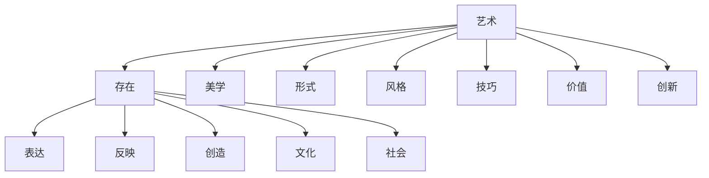
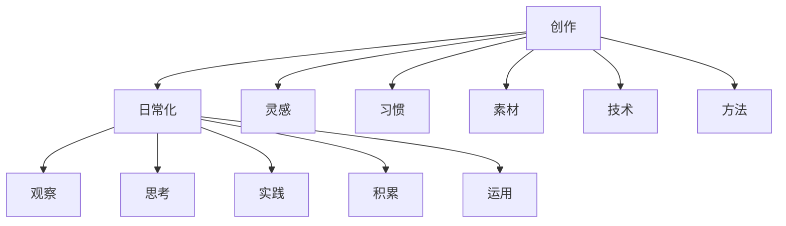
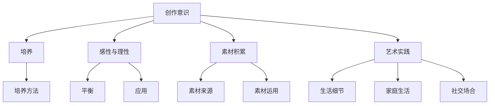
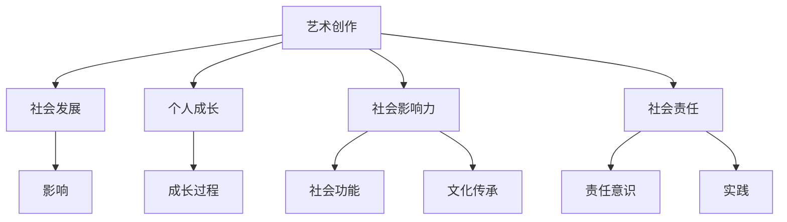

                 

```markdown
# 《存在的艺术：将日常生活转化为创作》

> 关键词：存在的艺术、日常生活、创作、灵感、平衡、素材、艺术创作、实践、方法、技巧、艺术鉴赏、社会影响、未来展望

> 摘要：本文将深入探讨存在的艺术，即如何将日常生活中的点滴转化为富有创造性的艺术作品。通过解析艺术与存在的联系，阐述创作意识的重要性，介绍创作素材的积累与运用，探讨日常生活中的艺术创作实践，分析职场环境中的艺术创作，以及自然景观中的艺术创作，本文旨在为读者提供一种全新的视角，激发其在日常生活中的创作灵感，提升艺术创作能力。

----------------------------------------------------------------

# 《存在的艺术：将日常生活转化为创作》目录大纲

## 第一部分：存在的艺术导论

### 第1章：存在的艺术概念解析

#### 1.1 存在的艺术：概念与内涵

#### 1.2 存在与创作的关系

#### 1.3 创作的日常化与实践

### 第2章：存在的艺术实践基础

#### 2.1 创作意识的培养

#### 2.2 感性与理性的平衡

#### 2.3 创作素材的积累与运用

## 第二部分：存在的艺术应用场景

### 第3章：日常生活中的艺术创作

#### 3.1 生活细节的艺术化

#### 3.2 家庭生活中的创作实践

#### 3.3 社交场合的艺术表达

### 第4章：职场环境中的艺术创作

#### 4.1 职场文化的艺术构建

#### 4.2 工作日常中的创意体现

#### 4.3 职场沟通的艺术

### 第5章：自然景观与艺术创作

#### 5.1 自然景观中的艺术灵感

#### 5.2 拍影与绘画的艺术创作

#### 5.3 自然景观的艺术化呈现

## 第三部分：存在的艺术方法与技巧

### 第6章：存在的艺术技巧解析

#### 6.1 观察力的培养

#### 6.2 想象力与创造力的激发

#### 6.3 艺术表达的多样性

### 第7章：存在的艺术实践案例

#### 7.1 日常生活中的创作案例

#### 7.2 职场环境中的艺术实践

#### 7.3 自然景观中的艺术创作案例

### 第8章：存在的艺术作品鉴赏

#### 8.1 艺术作品鉴赏的方法

#### 8.2 艺术作品中的存在智慧

#### 8.3 艺术作品鉴赏案例

## 第四部分：存在的艺术与社会影响

### 第9章：存在的艺术与社会文化

#### 9.1 艺术创作与社会发展

#### 9.2 艺术创作与个人成长

#### 9.3 艺术创作与社会影响力

### 第10章：存在的艺术未来展望

#### 10.1 艺术创作的未来发展

#### 10.2 艺术创作与科技融合

#### 10.3 艺术创作与人类生活

----------------------------------------------------------------

# 第1章：存在的艺术概念解析

## 1.1 存在的艺术：概念与内涵

### 1.1.1 艺术与存在的联系

#### 1.1.1.1 艺术的定义与发展

艺术是一个广泛而多样的领域，它包括视觉艺术、表演艺术、文学艺术等多种形式。艺术的定义多种多样，但普遍认为它是通过创造性的表达方式，反映人类对于世界的理解和感悟。艺术的发展经历了漫长的历史过程，从早期的壁画、雕塑，到现代的数字艺术，艺术的形式和内容不断丰富和演变。

#### 1.1.1.2 存在的哲学探讨

存在是一个哲学概念，探讨的是个体的存在状态及其与外部世界的关系。哲学家们对存在进行了深入的探讨，如柏拉图的“理念论”、黑格尔的“辩证法”等。在艺术领域，存在被视为艺术创作的基础，艺术家通过作品表达对存在的理解与思考。

### 1.1.2 艺术创作的存在意义

#### 1.1.2.1 创作的自我表达

艺术创作是艺术家自我表达的一种方式，通过作品传达个人的情感、思想和价值观。创作过程是艺术家对自身存在的反思和探索，是艺术家内心世界的展现。

#### 1.1.2.2 艺术的社会功能

艺术不仅是个体表达的工具，也是社会文化的重要组成部分。艺术作品可以反映社会的变迁、价值观念的冲突和人类的情感体验，对社会文化的发展具有重要影响。

## 1.2 创作的日常化与实践

### 1.2.1 日常生活与艺术创作

#### 1.2.1.1 艺术创作的素材来源

日常生活中的点滴细节都是艺术创作的宝贵素材，如风景、人物、事件等。艺术家通过观察、体验和思考，将这些素材转化为富有创造力的艺术作品。

#### 1.2.1.2 日常生活中的创作实践

将日常生活转化为艺术创作，需要艺术家具备敏锐的观察力和丰富的想象力。艺术家可以通过记录生活、收集素材、创作作品等实践，不断提升自己的创作能力。

### 1.2.2 创作习惯的培养

#### 1.2.2.1 创作时间的合理安排

创作习惯的培养首先需要合理安排创作时间。艺术家应根据自己的时间安排，设定固定的创作时间，保持创作的连续性和稳定性。

#### 1.2.2.2 创作心态的调整与保持

创作心态的调整与保持对于艺术创作至关重要。艺术家应保持积极的心态，面对创作中的困难和挑战，坚持不懈地追求艺术创作的卓越。

## 1.3 创作素材的积累与运用

### 1.3.1 创作素材的来源

#### 1.3.1.1 日常生活中的素材

日常生活中的素材丰富多样，如自然风景、城市景观、人文风情等。艺术家可以通过观察、体验和记录，将这些素材积累起来，为创作提供丰富的素材来源。

#### 1.3.1.2 文化遗产与历史素材

文化遗产和历史素材是艺术创作的重要资源。艺术家可以通过研究、学习和借鉴，将这些素材融入到自己的创作中，赋予作品更深的文化内涵。

### 1.3.2 创作素材的积累方法

#### 1.3.2.1 如何积累素材

艺术家可以通过多种方式积累素材，如拍照、绘画、记录笔记、收集资料等。积累素材的过程中，艺术家应注重素材的整理和分类，以便在创作时能够迅速找到所需的素材。

#### 1.3.2.2 素材的整理与分类

素材的整理与分类是创作素材积累的重要环节。艺术家应将素材按照主题、风格、形式等进行分类，建立自己的素材库，为创作提供便捷的素材资源。

### 1.3.3 创作素材的运用

#### 1.3.3.1 素材在创作中的运用原则

素材在创作中的运用应遵循创新性、真实性和文化性原则。艺术家在创作过程中，应尊重素材的真实性，发挥自己的创造力，赋予素材新的生命力和文化内涵。

#### 1.3.3.2 素材在创作中的运用实例

艺术家可以通过具体实例，展示如何将素材融入到艺术创作中。例如，在绘画作品中，艺术家可以通过对自然景观的描绘，表达对大自然的赞美和对生活的感悟。

----------------------------------------------------------------

# 第2章：存在的艺术实践基础

## 2.1 创作意识的培养

### 2.1.1 创作意识的重要性

#### 2.1.1.1 创作意识对创作的推动作用

创作意识是指艺术家对创作活动的敏感性和主动性。培养创作意识对于艺术创作至关重要，它能够激发艺术家的创作热情，推动艺术创作的进步。

#### 2.1.1.2 如何培养创作意识

1. **培养观察力**：艺术家应培养敏锐的观察力，关注生活中的细节，发现独特的视角和创意。

2. **保持好奇心**：对未知事物保持好奇心，积极探索和尝试，有助于激发创作灵感。

3. **持续学习和实践**：不断学习新的知识和技能，通过实践不断提升自己的创作水平。

### 2.1.2 创作灵感与灵感的捕捉

#### 2.1.2.1 灵感的来源

创作灵感可以来源于生活的各个方面，如自然景观、人文风情、历史故事、科技发展等。艺术家应保持开放的心态，从不同的角度和领域寻找灵感。

#### 2.1.2.2 灵感的捕捉与记录

1. **随时记录**：灵感往往稍纵即逝，艺术家应随时记录下自己的想法和创意。

2. **环境布置**：创造一个有利于灵感迸发的环境，如舒适的创作空间、激励性的艺术作品等。

3. **交流和分享**：与他人交流创作想法，分享经验和感受，有助于捕捉和激发灵感。

## 2.2 感性与理性的平衡

### 2.2.1 感性与理性的定义

#### 2.2.1.1 感性的艺术表达

感性是指艺术家在创作过程中，依靠直觉、情感和感觉来表现和传达艺术作品。感性的艺术表达具有直观、生动和富有情感的特点。

#### 2.2.1.2 理性的艺术构思

理性是指艺术家在创作过程中，运用逻辑思维、分析和推理来构思和创作艺术作品。理性的艺术构思具有条理清晰、逻辑严谨和科学性强的特点。

### 2.2.2 感性与理性的互动

#### 2.2.2.1 感性与理性的平衡方法

1. **相互补充**：感性和理性在艺术创作中相互补充，感性提供灵感和直觉，理性提供结构和逻辑。

2. **交替使用**：在创作过程中，艺术家可以交替使用感性和理性，根据不同的创作阶段和需求进行调整。

3. **综合运用**：在创作过程中，艺术家应尝试将感性与理性结合起来，创造独特的艺术作品。

### 2.2.3 感性与理性在实际创作中的应用

#### 2.2.3.1 感性在创作中的运用

1. **情感表达**：艺术家可以通过感性的表达，传达作品中的情感和情感内涵。

2. **直觉创作**：艺术家可以依靠直觉进行创作，探索新的艺术形式和表达方式。

#### 2.2.3.2 理性在创作中的运用

1. **构思和布局**：艺术家可以通过理性的构思，设计作品的结构和布局，使作品更具逻辑性和完整性。

2. **技术和技巧**：艺术家可以运用理性的技术和技巧，提升作品的质量和表现力。

## 2.3 创作素材的积累与运用

### 2.3.1 创作素材的来源

#### 2.3.1.1 日常生活中的素材

日常生活中的素材丰富多样，包括自然景观、人文风情、社会事件等。艺术家可以通过观察和体验，收集这些素材。

#### 2.3.1.2 文化遗产与历史素材

文化遗产和历史素材是艺术创作的重要资源。艺术家可以通过研究历史和文化，借鉴传统元素，为创作提供灵感。

### 2.3.2 创作素材的积累方法

#### 2.3.2.1 如何积累素材

1. **观察和体验**：艺术家应积极观察和体验生活，记录下生活中的点滴。

2. **学习和研究**：艺术家可以通过学习和研究，积累更多的知识和素材。

#### 2.3.2.2 素材的整理与分类

1. **分类整理**：将素材按照主题、风格、形式等进行分类，建立自己的素材库。

2. **数字化管理**：利用数字化工具，如数据库、电子表格等，方便管理和查找素材。

### 2.3.3 创作素材的运用

#### 2.3.3.1 素材在创作中的运用原则

1. **创新性**：运用素材时，应注重创新，避免雷同和复制。

2. **真实性**：尊重素材的真实性，避免歪曲和篡改。

3. **文化性**：在创作中融入文化元素，提升作品的文化内涵。

#### 2.3.3.2 素材在创作中的运用实例

1. **绘画作品**：艺术家可以通过对自然景观的描绘，表达对大自然的赞美。

2. **文学创作**：作家可以通过对历史故事和人物进行再创作，展现不同的艺术视角。

----------------------------------------------------------------

# 第3章：日常生活中的艺术创作

## 3.1 生活细节的艺术化

### 3.1.1 生活细节的艺术价值

生活细节是艺术创作的重要素材，它们反映了生活的真实和丰富。通过艺术化的处理，生活细节可以转化为独特的艺术作品。

#### 3.1.1.1 细节之美

生活细节的艺术化，可以展现出日常生活中的美好和质感。例如，一杯茶、一朵花、一张照片，都可以通过艺术化的处理，成为富有感染力的艺术作品。

#### 3.1.1.2 细节在艺术创作中的运用

艺术家可以通过对生活细节的观察和捕捉，将其融入到艺术作品中。例如，在绘画中，通过描绘生活中的小物件，展现生活的真实和美好；在文学中，通过细腻的描写，展现生活的细节和情感。

### 3.1.2 生活细节的艺术创作实践

#### 3.1.2.1 日常生活中的创作技巧

1. **观察与发现**：艺术家应培养敏锐的观察力，发现生活中的美好细节。

2. **创意表达**：艺术家可以通过独特的创意表达，将生活细节转化为艺术作品。

3. **技巧提升**：通过学习和实践，艺术家可以提升自己的生活细节艺术创作技巧。

#### 3.1.2.2 生活细节的艺术作品欣赏

艺术家可以通过欣赏他人的艺术作品，学习不同的创作技巧和风格。例如，可以欣赏一些著名艺术家的绘画作品，了解他们如何通过细节描绘，展现生活的美好。

## 3.2 家庭生活中的创作实践

### 3.2.1 家庭生活与艺术创作

家庭生活是艺术家创作的重要素材来源。艺术家可以通过对家庭生活的观察和体验，创作出具有独特家庭特色的艺术作品。

#### 3.2.1.1 家庭生活的艺术价值

家庭生活是艺术创作的重要源泉，它反映了人们的生活状态和情感体验。艺术家可以通过对家庭生活的描绘，展现生活的真实和美好。

#### 3.2.1.2 家庭生活中的创作实践

1. **家庭摄影**：通过拍摄家庭生活中的点滴，记录下家庭的美好瞬间。

2. **家庭绘画**：艺术家可以通过绘画，展现家庭生活的温馨和情感。

3. **家庭文学作品**：通过文学创作，描绘家庭生活的故事和情感。

### 3.2.2 家庭艺术创作案例

#### 3.2.2.1 家庭摄影案例

艺术家可以通过摄影，记录下家庭生活中的美好瞬间，如家庭成员的互动、家庭活动的场景等。

#### 3.2.2.2 家庭绘画案例

艺术家可以通过绘画，展现家庭生活的温馨和情感，如描绘家庭聚会的场景、家庭成员的肖像等。

#### 3.2.2.3 家庭文学作品案例

艺术家可以通过文学创作，讲述家庭生活的故事，如描绘家庭成员之间的情感、家庭传统和价值观等。

## 3.3 社交场合的艺术表达

### 3.3.1 社交场合与艺术创作

社交场合是艺术家进行艺术创作的重要场所。艺术家可以通过社交场合中的互动和交流，创作出具有社交意义和艺术价值的作品。

#### 3.3.1.1 社交场合的艺术价值

社交场合是艺术家展示自己才华和创意的平台。通过社交场合中的艺术创作，艺术家可以与他人分享自己的艺术成果，获得反馈和认可。

#### 3.3.1.2 社交场合中的创作实践

1. **现场创作**：艺术家可以在社交场合中进行现场创作，如绘画、摄影等，展示自己的创作能力和技巧。

2. **互动创作**：艺术家可以与他人合作，进行互动创作，如共同绘画、编写剧本等，增强创作的趣味性和互动性。

3. **分享交流**：艺术家可以在社交场合中分享自己的创作心得和经验，与他人交流，互相学习和提高。

### 3.3.2 社交艺术创作案例

#### 3.3.2.1 现场创作案例

艺术家可以在艺术展览、艺术沙龙等社交场合中，进行现场创作，展示自己的艺术才华。

#### 3.3.2.2 互动创作案例

艺术家可以与他人合作，进行互动创作，如在团队项目中，共同完成一幅画作或一部影片。

#### 3.3.2.3 分享交流案例

艺术家可以在社交场合中，分享自己的创作心得和经验，与他人交流，共同提高创作水平。

----------------------------------------------------------------

# 第4章：职场环境中的艺术创作

## 4.1 职场文化的艺术构建

### 4.1.1 职场文化与艺术的关系

#### 4.1.1.1 艺术对职场文化的影响

艺术作为一种精神产品，对职场文化具有深远的影响。通过艺术元素的融入，职场文化可以变得更加丰富和多元化，提升员工的文化素养和审美能力。

#### 4.1.1.2 艺术在职场文化中的应用

1. **艺术装饰**：通过艺术装饰，如壁画、雕塑、艺术画作等，营造一个具有艺术氛围的工作环境。

2. **艺术活动**：举办艺术展览、艺术沙龙等活动，激发员工的创作热情，提升企业的文化氛围。

### 4.1.2 职场艺术文化的构建方法

#### 4.1.2.1 艺术元素的融入

1. **环境设计**：在办公环境的设计中，融入艺术元素，如选择具有艺术感的办公家具、装饰品等。

2. **艺术活动**：定期举办艺术活动，如艺术展览、艺术讲座等，激发员工对艺术的兴趣和热爱。

#### 4.1.2.2 艺术教育

1. **艺术培训**：为员工提供艺术培训，提高员工的艺术素养和审美能力。

2. **艺术交流**：鼓励员工参加艺术交流，学习他人的艺术创作经验和技巧。

## 4.2 工作日常中的创意体现

### 4.2.1 创意在职场中的重要性

创意是职场中不可或缺的元素，它能够激发员工的创新思维，提升工作效率，推动企业的发展。通过创意的体现，职场环境可以变得更加活力四溢，富有创新力。

#### 4.2.1.1 创意在职场中的应用

1. **工作流程**：通过创意的改进，优化工作流程，提高工作效率。

2. **产品设计**：在产品设计过程中，融入创意元素，打造具有市场竞争力的产品。

3. **营销策略**：通过创意的营销策略，提升品牌形象，增加市场份额。

### 4.2.2 创意体现的方法

#### 4.2.2.1 创意思维的培养

1. **思维训练**：通过思维训练，如头脑风暴、思维导图等，培养员工的创意思维。

2. **问题解决**：鼓励员工在面对问题时，运用创意思维，寻找创新的解决方案。

#### 4.2.2.2 创意表达的实践

1. **创意工作坊**：组织创意工作坊，鼓励员工在团队合作中，实践创意表达。

2. **创意展示**：定期举办创意展示活动，鼓励员工展示自己的创意成果，激发创新热情。

## 4.3 职场沟通的艺术

### 4.3.1 沟通在职场中的重要性

沟通是职场中最重要的技能之一，良好的沟通能够促进团队合作，提高工作效率，化解冲突。通过沟通的艺术，职场环境可以变得更加和谐和高效。

#### 4.3.1.1 艺术在沟通中的应用

1. **非语言沟通**：通过肢体语言、面部表情等非语言方式，增强沟通的效果。

2. **情感沟通**：通过表达情感，建立情感链接，促进沟通的深入和有效性。

### 4.3.2 职场沟通的艺术技巧

#### 4.3.2.1 倾听与表达

1. **有效倾听**：通过倾听，了解对方的观点和需求，提高沟通的效果。

2. **清晰表达**：通过清晰的表达，传递自己的观点和信息，避免误解和冲突。

#### 4.3.2.2 情境沟通

1. **情境适应**：根据不同的沟通情境，调整沟通策略，提高沟通的效果。

2. **情境互动**：在沟通中，通过互动和反馈，建立良好的沟通氛围。

## 4.4 职场艺术创作案例

### 4.4.1 艺术装饰案例

在一个创意设计公司，员工们通过自创的艺术作品，装饰了公司的办公环境，营造了一个充满艺术氛围的工作空间。

### 4.4.2 创意工作坊案例

在一个互联网公司，定期举办创意工作坊，员工们在这里交流创意，实践创意表达，提升了公司的创新力和团队凝聚力。

### 4.4.3 沟通艺术案例

在一个跨国公司，通过培训员工沟通技巧，提高了员工之间的沟通效率，促进了团队合作，提升了公司的整体业绩。

----------------------------------------------------------------

# 第5章：自然景观与艺术创作

## 5.1 自然景观中的艺术灵感

### 5.1.1 自然景观的艺术价值

自然景观是艺术创作的重要素材来源，它具有独特的审美价值和文化内涵。艺术家可以通过对自然景观的描绘和表现，展现大自然的美丽和力量。

#### 5.1.1.1 自然景观的审美价值

自然景观具有丰富的色彩、形态和质感，这些元素为艺术创作提供了广阔的想象空间。艺术家可以通过对自然景观的描绘，传达自己的审美观念和情感体验。

#### 5.1.1.2 自然景观的文化内涵

自然景观蕴含着丰富的文化内涵，它反映了人类与自然的关系，展现了不同地域的文化特色。艺术家可以通过对自然景观的艺术创作，传承和弘扬传统文化。

### 5.1.2 自然景观与艺术创作的联系

#### 5.1.2.1 艺术创作的灵感来源

自然景观为艺术家提供了无尽的创作灵感。艺术家可以通过对自然景观的观察和体验，捕捉到独特的视觉和情感体验，将其转化为艺术作品。

#### 5.1.2.2 自然景观的艺术表现

艺术家可以通过不同的艺术形式，如绘画、摄影、雕塑等，表现自然景观的美丽和独特性。艺术作品可以传达出自然景观的瞬间美、动态美和意境美。

## 5.2 拍影与绘画的艺术创作

### 5.2.1 拍影与绘画的艺术价值

摄影和绘画是两种重要的艺术形式，它们在艺术创作中具有独特的价值和作用。

#### 5.2.1.1 摄影的艺术价值

摄影是一种直观、迅速记录现实的艺术形式。它可以通过镜头捕捉到瞬间之美，传达出真实感和现场感。摄影艺术具有独特的审美视角和表现力。

#### 5.2.1.2 绘画的艺术价值

绘画是一种通过线条、色彩和形状表现艺术作品的手段。它可以通过细腻的笔触和丰富的色彩，表达出艺术家的情感和思想。绘画艺术具有高度的抽象性和表现力。

### 5.2.2 拍影与绘画的艺术创作实践

#### 5.2.2.1 摄影创作实践

1. **题材选择**：选择具有艺术价值的自然景观作为摄影题材，如山水、花卉、动物等。

2. **构图技巧**：通过构图技巧，如前景、背景、光线等，增强照片的艺术效果。

3. **后期处理**：通过后期处理，如调色、剪裁等，提升照片的质量和艺术性。

#### 5.2.2.2 绘画创作实践

1. **素材收集**：收集自然景观的素材，如照片、速写等，作为绘画的参考。

2. **构图设计**：在设计绘画作品时，考虑构图、色彩和线条的搭配，创造出一幅具有艺术魅力的作品。

3. **技巧运用**：通过运用绘画技巧，如素描、色彩渲染等，表现出自然景观的质感和细节。

## 5.3 自然景观的艺术化呈现

### 5.3.1 自然景观的艺术化表现

自然景观的艺术化呈现是将自然景观转化为具有艺术价值作品的过程。通过艺术家的创作，自然景观可以展现出独特的审美意义和文化内涵。

#### 5.3.1.1 艺术家的创作视角

艺术家在创作自然景观时，可以从不同的视角出发，如色彩、形态、光影等，表现出自然景观的独特之美。

#### 5.3.1.2 艺术家的情感表达

艺术家在创作自然景观时，可以通过情感的表达，传达自己对自然景观的理解和感悟。

### 5.3.2 自然景观艺术化的方法

#### 5.3.2.1 色彩运用

1. **色彩搭配**：通过合理的色彩搭配，增强自然景观的艺术效果。

2. **色彩对比**：通过色彩对比，突出自然景观的视觉冲击力。

#### 5.3.2.2 构图技巧

1. **构图布局**：通过构图布局，展现自然景观的整体美。

2. **视觉引导**：通过视觉引导，吸引观众的注意力。

#### 5.3.2.3 光影效果

1. **光影运用**：通过光影效果，表现自然景观的立体感和动态美。

2. **光线对比**：通过光线对比，增强自然景观的视觉效果。

## 5.4 自然景观艺术创作案例

### 5.4.1 摄影艺术创作案例

一位摄影家通过拍摄自然景观，展现大自然的美丽和力量。他的作品在色彩、构图和光影方面都达到了极高的艺术水平，赢得了广泛的赞誉。

### 5.4.2 绘画艺术创作案例

一位画家通过绘画自然景观，展现大自然的魅力和独特性。他的作品在色彩运用、构图设计和技巧运用方面都非常出色，成为了艺术界的经典之作。

### 5.4.3 多媒体艺术创作案例

一位多媒体艺术家通过结合摄影、绘画和音乐元素，创作出一幅动态的艺术作品。他的作品在视觉、听觉和情感表达方面都达到了完美的结合，让观众感受到了自然景观的无限魅力。

----------------------------------------------------------------

# 第6章：存在的艺术技巧解析

## 6.1 观察力的培养

### 6.1.1 观察力的重要性

#### 6.1.1.1 观察力在艺术创作中的作用

观察力是艺术创作的重要基础，它决定了艺术家对生活细节的捕捉能力。敏锐的观察力能够帮助艺术家发现独特的视角和创意，从而创作出富有感染力的作品。

#### 6.1.1.2 观察力的培养方法

1. **培养好奇心**：对周围的事物保持好奇心，积极探索和发现生活中的美好和细节。

2. **持续练习**：通过日常生活中的观察练习，如记录生活中的点滴、描绘景物等，提升自己的观察力。

3. **学习艺术理论**：通过学习艺术理论，了解不同艺术形式的观察方法和技巧，丰富自己的观察视角。

### 6.1.2 观察技巧的应用

#### 6.1.2.1 素材的收集与整理

在艺术创作中，艺术家需要通过观察收集丰富的素材。观察技巧的应用可以帮助艺术家迅速捕捉到有价值的素材，并进行有效的整理和分类。

#### 6.1.2.2 创意的产生与表达

敏锐的观察力能够激发艺术家的创意。通过观察技巧的应用，艺术家可以将其创意转化为具体的艺术作品，表达自己的艺术理念和情感。

## 6.2 想象力与创造力的激发

### 6.2.1 想象力与创造力的关系

想象力是创造力的基础，创造力则是想象力在实际应用中的体现。想象力能够激发艺术家的创意思维，而创造力则将想象力转化为具体的艺术作品。

#### 6.2.1.1 想象力的重要性

想象力是艺术家创作的重要驱动力，它决定了艺术作品的独特性和创新性。艺术家通过丰富的想象力，能够创造出与众不同的艺术作品。

#### 6.2.1.2 创造力的发展

创造力的发展需要艺术家不断挑战自我，突破传统，探索新的艺术形式和表达方式。通过学习和实践，艺术家可以不断提升自己的创造力。

### 6.2.2 想象力与创造力的培养方法

#### 6.2.2.1 培养好奇心和探索精神

好奇心和探索精神是想象力与创造力发展的关键。艺术家应保持对未知领域的好奇心，勇于探索新的艺术形式和表达方式。

#### 6.2.2.2 学习与交流

通过学习和交流，艺术家可以获取更多的灵感和创意。学习艺术理论、观摩其他艺术家的作品，以及与同行交流，都是培养想象力与创造力的有效途径。

### 6.2.3 创造力在艺术创作中的应用

#### 6.2.3.1 艺术创新

艺术家可以通过创造力，创新艺术形式和表达方式，创作出独特的艺术作品。艺术创新不仅体现了艺术家的创造力，也为艺术领域带来了新的活力。

#### 6.2.3.2 艺术突破

艺术家可以通过创造力，突破传统艺术形式和表达方式的限制，探索新的艺术领域和可能性。艺术突破有助于推动艺术的发展，提升艺术的价值。

## 6.3 艺术表达的多样性

### 6.3.1 艺术表达的含义

艺术表达是指艺术家通过不同的艺术形式，传达自己的思想、情感和审美观念。艺术表达的多样性体现在艺术形式的丰富性和艺术家个性化的表达方式。

#### 6.3.1.1 艺术形式的多样性

艺术形式包括绘画、雕塑、摄影、音乐、舞蹈、文学等。不同的艺术形式具有独特的表现力和审美价值，艺术家可以通过多样化的艺术形式，表达自己的艺术理念。

#### 6.3.1.2 艺术家个性的表达

每个艺术家都有自己独特的个性和艺术风格。艺术家在创作过程中，可以通过个性化的表达方式，展示自己的艺术特点和艺术价值。

### 6.3.2 艺术表达的多样性方法

#### 6.3.2.1 艺术形式的选择

艺术家可以根据自己的创作意图和艺术风格，选择合适的艺术形式。例如，通过绘画表达细腻的情感，通过雕塑展现形态的美感。

#### 6.3.2.2 艺术技巧的运用

艺术家可以通过不同的艺术技巧，提升作品的表现力和艺术价值。例如，通过色彩运用、构图设计、线条勾勒等技巧，展现艺术作品的独特魅力。

#### 6.3.2.3 艺术融合

艺术家可以将不同的艺术形式融合在一起，创造出新的艺术作品。例如，将绘画与摄影结合，创作出具有立体感和动态美的作品。

## 6.4 艺术表达技巧的应用案例

### 6.4.1 绘画艺术表达案例

一位画家通过细腻的色彩运用和构图设计，创作出一幅富有情感和美感的绘画作品。他的作品展现了艺术家独特的个性和艺术风格。

### 6.4.2 音乐艺术表达案例

一位音乐家通过演奏和创作音乐，传达出自己对生活和情感的独特理解。他的音乐作品充满了情感和想象力，赢得了听众的喜爱和赞誉。

### 6.4.3 文学艺术表达案例

一位作家通过文字的运用，描绘出一个充满想象力和情感的世界。他的文学作品充满了诗意和哲理，引发了读者的共鸣和思考。

----------------------------------------------------------------

# 第7章：存在的艺术实践案例

## 7.1 日常生活中的创作案例

### 7.1.1 素材积累的方法

在日常生活的创作中，素材的积累至关重要。以下是一些有效的素材积累方法：

#### 7.1.1.1 观察与记录

1. **记录日常**：通过日记、笔记等方式记录日常生活中的点滴，如所见所闻、所感所思。
2. **拍照与录像**：使用手机、相机等设备记录生活中的美好瞬间，为创作提供丰富的视觉素材。

#### 7.1.1.2 互动与交流

1. **与他人交流**：与他人分享自己的观察和体验，从他人的视角中获得新的创作灵感。
2. **参加活动**：参与各种文化活动，如展览、讲座等，了解不同领域的创作理念和技巧。

### 7.1.2 创作实践的过程

#### 7.1.2.1 灵感的捕捉

1. **培养好奇心**：对生活中的一切保持好奇心，发现独特的视角和创意。
2. **学会观察**：通过观察，捕捉生活中的美好细节和情感瞬间。

#### 7.1.2.2 创作的构思

1. **构思主题**：确定创作主题，明确作品的方向和内容。
2. **设计构图**：根据主题，设计作品的构图和布局，确保作品的整体美感。

#### 7.1.2.3 创作的实现

1. **选择媒介**：根据创作主题和风格，选择合适的创作媒介，如绘画、摄影、写作等。
2. **制作过程**：按照构思和设计，逐步实现创作，确保作品的质量和效果。

### 7.1.3 创作案例分析

#### 7.1.3.1 家庭照片拼贴

一位艺术家通过拍摄家庭生活中的照片，将其拼贴成一幅富有创意和情感的作品。她的作品展现了家庭生活的温馨和美好，赢得了观众的一致好评。

#### 7.1.3.2 日常记录日记

一位作家通过记录日常生活中的点滴，创作了一部充满情感和哲理的日记体小说。他的作品真实地反映了生活的复杂性和人性的美好，成为一部经典之作。

## 7.2 职场环境中的艺术实践

### 7.2.1 艺术创作在职场中的应用

在职场环境中，艺术创作不仅能够提升员工的审美能力，还能激发创新思维，提升团队凝聚力。以下是一些艺术创作在职场中的应用：

#### 7.2.1.1 企业文化墙

许多企业会在办公区域设置文化墙，展示员工的艺术作品，如绘画、摄影等。这不仅能美化办公环境，还能展现员工的艺术才华。

#### 7.2.1.2 团队建设活动

企业可以通过组织团队建设活动，如艺术创作工作坊、艺术展览等，增强员工的团队合作精神和创造力。

#### 7.2.1.3 艺术培训

企业可以定期为员工提供艺术培训，如绘画、摄影等，提升员工的艺术素养和审美能力。

### 7.2.2 职场艺术创作案例

#### 7.2.2.1 艺术展览

一家科技公司定期举办员工艺术展览，展示员工的绘画、摄影等作品。这不仅提升了员工的艺术素养，也增强了企业的文化氛围。

#### 7.2.2.2 艺术创作工作坊

一家广告公司定期举办艺术创作工作坊，邀请专业艺术家为员工提供培训。员工们在工作坊中学习到新的艺术技巧，激发了创意思维。

## 7.3 自然景观中的艺术创作案例

### 7.3.1 自然景观摄影

一位摄影家通过拍摄自然景观，创作出一幅幅精美的摄影作品。他的作品展现了大自然的美丽和力量，引发了观众对自然环境的思考。

#### 7.3.1.1 拍摄技巧

1. **光线运用**：选择合适的光线，如清晨或傍晚的光线，拍摄出具有层次感和质感的照片。
2. **构图设计**：通过构图设计，如利用前景、背景、线条等元素，增强照片的艺术效果。

### 7.3.2 自然景观绘画

一位画家通过绘画自然景观，创作出一幅幅生动而富有情感的作品。他的作品展现了自然景观的美丽和独特性，引发了观众对自然的赞美。

#### 7.3.2.1 绘画技巧

1. **色彩运用**：通过色彩的搭配和对比，展现自然景观的美丽和独特性。
2. **线条勾勒**：通过细腻的线条勾勒，表现出自然景观的质感和细节。

## 7.4 艺术创作的小结与拓展

### 7.4.1 小结

通过以上案例，我们可以看到艺术创作在日常生活中、职场环境以及自然景观中的广泛应用和重要性。艺术创作不仅能够提升个人的审美能力和创造力，还能促进团队协作，增强企业的文化氛围。

### 7.4.2 拓展

1. **跨领域融合**：鼓励艺术家尝试跨领域融合，如将艺术与科技结合，创作出具有创新性和前瞻性的艺术作品。
2. **艺术教育**：加强艺术教育，培养更多具有创新精神和艺术才华的人才，推动艺术创作的发展。

----------------------------------------------------------------

# 第8章：存在的艺术作品鉴赏

## 8.1 艺术作品鉴赏的方法

### 8.1.1 艺术作品鉴赏的步骤

#### 8.1.1.1 观察作品

在鉴赏艺术作品时，首先要进行观察。观察作品的构图、色彩、线条、形态等，理解作品的视觉效果。

#### 8.1.1.2 分析作品

在观察的基础上，对作品进行深入分析。分析作品的创作背景、主题、风格、技巧等，理解作品的艺术价值。

#### 8.1.1.3 评价作品

在对作品进行充分理解后，对其进行评价。评价作品的艺术性、创新性、感染力等，判断作品的质量和水平。

### 8.1.2 艺术作品鉴赏的要点

#### 8.1.2.1 构图与布局

构图与布局是艺术作品的重要元素，决定了作品的整体视觉效果。鉴赏作品时，要关注作品的构图与布局，理解作品的空间感和节奏感。

#### 8.1.2.2 色彩与光线

色彩与光线是艺术作品的重要表现手段，决定了作品的视觉效果和情感表达。鉴赏作品时，要关注作品的色彩搭配、光线运用，理解作品的艺术效果和情感传达。

#### 8.1.2.3 技巧与风格

技巧与风格是艺术作品的重要特征，反映了艺术家的创作风格和艺术素养。鉴赏作品时，要关注作品的技巧运用和风格特征，理解作品的艺术价值和艺术家的个性。

## 8.2 艺术作品中的存在智慧

### 8.2.1 艺术作品的存在智慧体现

艺术作品中的存在智慧体现在艺术家对存在的思考和表达。艺术家通过作品传达自己对生命、自然、社会等方面的理解和感悟，反映出存在的智慧和哲理。

#### 8.2.1.1 存在的意义

艺术家通过作品探讨存在的意义，如生命的意义、自然的意义等。他们的作品往往蕴含着深刻的哲理和思考，引发观众对存在的反思。

#### 8.2.1.2 存在的表达

艺术家通过作品表达存在的状态和感受，如欢乐、悲伤、痛苦等。他们的作品往往具有强烈的情感表达，触动观众的心灵。

### 8.2.2 艺术作品中的存在智慧案例

#### 8.2.2.1 绘画作品

一幅描绘自然景观的绘画作品，通过细腻的笔触和丰富的色彩，展现了自然的美妙和生命的活力。这幅作品体现了艺术家对自然和生命的赞美，传递出存在的智慧和美好。

#### 8.2.2.2 文学作品

一部描写人生百态的小说，通过生动的情节和深刻的描写，展现了人性的复杂和生命的曲折。这部作品体现了作者对人生和存在的深刻思考和感悟，传递出存在的智慧和哲理。

## 8.3 艺术作品鉴赏案例

### 8.3.1 绘画作品鉴赏案例

一幅梵高的《向日葵》，通过鲜艳的色彩和夸张的线条，展现了向日葵的美丽和生命的力量。这幅作品体现了梵高对自然和生命的热爱，传递出存在的智慧和美好。

#### 8.3.1.1 构图与布局

这幅画作采用了中央对称的构图，使向日葵成为视觉焦点，突出了作品的主体。同时，画面中的光线运用和色彩搭配，增强了作品的视觉冲击力。

#### 8.3.1.2 技巧与风格

梵高在这幅画作中运用了厚涂和厚涂技法，使画面具有强烈的质感和立体感。这种独特的风格体现了梵高的个性特点，使作品具有独特的艺术魅力。

### 8.3.2 文学作品鉴赏案例

一部莎士比亚的《哈姆雷特》，通过复杂的情节和深刻的描写，展现了人性的复杂和生命的曲折。这部作品体现了莎士比亚对人生和存在的深刻思考和感悟，传递出存在的智慧和哲理。

#### 8.3.2.1 主题与情感

这部作品以哈姆雷特为主人公，通过他的内心矛盾和痛苦，展现了人性的复杂和生命的曲折。作品中的情感表达深刻而动人，引发了观众的共鸣。

#### 8.3.2.2 文学与戏剧

这部作品既有文学性，又有戏剧性。莎士比亚通过对话、独白等文学手法，展现了人物的内心世界和情感变化。同时，作品的结构和情节设置，使观众在欣赏文学的同时，也能体验到戏剧的紧张和冲突。

## 8.4 艺术作品鉴赏的技巧

### 8.4.1 �鉴

```vbnet
1. **背景了解**：了解作品的历史背景、创作背景和艺术家的生平，有助于更好地理解作品的艺术价值和存在智慧。

2. **多角度分析**：从不同的角度，如构图、色彩、线条、主题等，分析作品的特点和艺术表现，有助于更全面地理解作品。

3. **情感体验**：感受作品传达的情感和情绪，与作品产生共鸣，有助于深入理解作品的存在智慧。

### 8.4.2 鉴赏案例分析

- **案例1**：《蒙娜丽莎》
  - **背景**：达芬奇的这幅画作创作于文艺复兴时期，是艺术史上的杰作。
  - **分析**：画作的构图和光影处理使蒙娜丽莎的微笑显得神秘而迷人。达芬奇运用细腻的线条和柔和的色彩，展现了人物的性格和情感。
  - **体验**：观众在欣赏这幅画作时，往往会被蒙娜丽莎的微笑所吸引，感受到一种神秘而温暖的情感。

- **案例2**：《黄河颂》
  - **背景**：这是我国著名画家张大千的一幅巨作，描绘了黄河的壮丽景色。
  - **分析**：画作的构图采用了强烈的对比手法，突出了黄河的雄浑与壮美。张大千运用丰富的色彩和线条，展现了黄河的磅礴气势。
  - **体验**：观众在欣赏这幅画作时，会被黄河的壮丽景色所震撼，感受到一种强烈的民族自豪感和爱国情怀。

## 8.5 艺术作品鉴赏的意义

### 8.5.1 艺术价值

艺术作品鉴赏有助于我们理解艺术作品的艺术价值，包括其艺术性、创新性、表现力等。通过对艺术作品的鉴赏，我们可以提高自己的审美能力和艺术鉴赏力。

### 8.5.2 存在智慧

艺术作品鉴赏可以让我们领悟到艺术作品中的存在智慧，包括对生命、自然、社会等方面的深刻思考。通过鉴赏，我们可以更好地理解存在的本质和意义。

### 8.5.3 文化传承

艺术作品鉴赏有助于我们传承和弘扬文化。通过鉴赏，我们可以了解不同历史时期和文化背景下的艺术作品，从而更好地传承和发扬文化遗产。

----------------------------------------------------------------

# 第9章：存在的艺术与社会影响

## 9.1 艺术创作与社会发展

### 9.1.1 艺术创作在社会发展中的作用

艺术创作在社会发展中扮演着重要的角色。它不仅反映了社会的变迁和人类的情感，还能够推动社会的进步和发展。

#### 9.1.1.1 艺术创作反映社会变迁

艺术作品往往能够真实地反映社会的变迁，如社会制度、文化传统、价值观念等。艺术家通过作品表达对社会现实的观察和思考，引导公众关注社会问题，促进社会进步。

#### 9.1.1.2 艺术创作推动社会进步

艺术创作可以激发人们的创造力和创新精神，推动科技、文化、教育等领域的进步。艺术作品中的创意和思想可以激发人们的思维，引领社会的发展。

### 9.1.2 艺术创作与社会发展的关系

#### 9.1.2.1 艺术创作与社会需求的互动

艺术创作与社会需求密切相关。社会需求是艺术创作的动力，而艺术创作又可以满足社会的需求。艺术家通过创作满足公众的情感需求、精神需求和文化需求，促进社会的和谐与进步。

#### 9.1.2.2 艺术创作与社会发展的互动

艺术创作与社会发展相互影响。社会的发展为艺术创作提供了丰富的素材和广阔的平台，而艺术创作又为社会的发展提供了精神动力和文化支持。

## 9.2 艺术创作与个人成长

### 9.2.1 艺术创作对个人成长的影响

艺术创作对个人成长具有深远的影响。它不仅能够提升个人的审美能力、创造力和社会责任感，还能够促进个人的全面发展。

#### 9.2.1.1 提升审美能力

艺术创作是审美能力的体现。通过创作，个人可以更深入地理解美，提升自己的审美能力。同时，艺术创作还可以培养个人的审美情趣和审美标准。

#### 9.2.1.2 激发创造力

艺术创作需要创意和想象力。通过创作，个人可以激发自己的创造力，培养创新思维。艺术创作过程中的挑战和探索，有助于个人不断突破自我，实现自我价值。

#### 9.2.1.3 增强社会责任感

艺术创作是社会意识的体现。通过创作，个人可以关注社会问题，表达自己的观点和立场，增强社会责任感。艺术作品可以引导公众关注社会问题，推动社会的进步和发展。

### 9.2.2 个人成长与艺术创作的关系

#### 9.2.2.1 艺术创作促进个人成长

艺术创作是个人成长的重要途径。通过创作，个人可以不断提升自己的能力和素质，实现自我价值。艺术创作过程中的挑战和探索，有助于个人不断突破自我，实现自我成长。

#### 9.2.2.2 个人成长推动艺术创作

个人成长可以推动艺术创作。个人的成长过程中，积累的经验、知识和能力，可以为艺术创作提供丰富的素材和灵感。同时，个人成长过程中的思考和感悟，也可以成为艺术创作的主题和内容。

## 9.3 艺术创作与社会影响力

### 9.3.1 艺术创作对社会的影响力

艺术创作对社会具有深远的影响力。它不仅能够影响公众的审美观念和文化素养，还能够引导社会思潮，推动社会的进步和发展。

#### 9.3.1.1 影响公众审美观念

艺术创作可以引导公众的审美观念，提升公众的审美水平。通过艺术作品，公众可以接触到不同的艺术形式和风格，拓宽审美视野，提升审美品味。

#### 9.3.1.2 引导社会思潮

艺术创作可以反映社会现实，引导社会思潮。艺术家通过作品表达对社会现实的观察和思考，引导公众关注社会问题，推动社会进步。

#### 9.3.1.3 推动社会进步

艺术创作可以激发人们的创造力和社会责任感，推动社会的进步。艺术作品中的创意和思想可以激发人们的思维，引领社会的发展。

### 9.3.2 艺术创作对社会影响的案例分析

#### 9.3.2.1 电影《肖申克的救赎》

电影《肖申克的救赎》是一部反映社会现实的艺术作品。它通过讲述一个关于希望、友谊和自由的感人故事，引导公众关注社会问题，激发人们对生活的思考。这部电影不仅赢得了观众的热烈赞誉，还对社会产生了深远的影响。

#### 9.3.2.2 艺术家毕加索

毕加索是20世纪最具影响力的艺术家之一。他的作品不仅展现了独特的艺术风格，还反映了人类的历史和现实。毕加索的作品对社会产生了深远的影响，推动了现代艺术的发展，改变了人们的审美观念。

## 9.4 艺术创作与社会责任的探讨

### 9.4.1 艺术创作与社会责任的关系

艺术创作与社会责任密切相关。艺术家在创作过程中，不仅承担着表达自我和审美价值的责任，还承担着社会责任。

#### 9.4.1.1 艺术家的社会责任

艺术家的社会责任包括关注社会问题、引导公众思考、推动社会进步等。艺术家通过作品表达对社会问题的关注和思考，引导公众关注社会问题，推动社会的进步和发展。

#### 9.4.1.2 艺术创作的责任意识

艺术创作的责任意识是指艺术家在创作过程中，对社会责任的自觉认识和承担。艺术家应具有强烈的社会责任感，关注社会问题，用自己的创作力量为社会做出贡献。

### 9.4.2 艺术创作与社会责任的实践

#### 9.4.2.1 社会公益项目

许多艺术家积极参与社会公益活动，用自己的艺术作品为公益事业发声。例如，一些艺术家创作了反映社会问题的作品，通过展览、演出等方式，引导公众关注社会问题，推动社会进步。

#### 9.4.2.2 社会责任教育

一些艺术机构和教育机构积极推动社会责任教育，培养具有社会责任感的艺术家。通过课程设置、实践活动等，帮助艺术家树立正确的价值观，增强社会责任感。

## 9.5 艺术创作与社会影响的未来展望

### 9.5.1 艺术创作与社会发展的新趋势

随着社会的不断发展，艺术创作与社会发展的关系将更加紧密。艺术创作将成为推动社会进步的重要力量，艺术家将在社会发展中扮演更加重要的角色。

#### 9.5.1.1 艺术创新的推动

艺术创作将继续推动创新，引领社会的发展。艺术家通过创作新的艺术形式、表达方式，激发社会的创造力，推动社会的进步。

#### 9.5.1.2 艺术教育的普及

艺术教育的普及将提高公众的艺术素养，培养更多的艺术人才。艺术教育的普及有助于社会形成良好的艺术氛围，推动艺术创作的繁荣。

### 9.5.2 艺术创作与社会责任的新实践

#### 9.5.2.1 跨界合作

未来，艺术家将更加注重跨界合作，将艺术创作与社会问题结合，推动社会进步。艺术家将通过艺术作品表达对社会问题的关注，引导公众参与社会问题的解决。

#### 9.5.2.2 数字艺术的发展

数字艺术的发展将使艺术创作更加便捷和多样化。艺术家将通过数字艺术形式，表达对社会问题的关注，推动艺术创作与社会责任的结合。

#### 9.5.2.3 社会影响力评估

未来，艺术创作将更加注重社会影响力的评估。艺术家将通过评估作品的社会影响力，了解自己的创作对社会的影响，调整自己的创作方向，更好地履行社会责任。

----------------------------------------------------------------

# 第10章：存在的艺术未来展望

## 10.1 艺术创作的未来发展

### 10.1.1 艺术创作的新趋势

#### 10.1.1.1 数字艺术的兴起

随着科技的进步，数字艺术正逐渐成为艺术创作的新趋势。数字艺术具有无限的可能性和创新性，它将引领艺术创作的未来发展。

#### 10.1.1.2 跨界融合

艺术创作将更加注重与其他领域的融合，如科技、设计、建筑等。跨界融合将激发新的艺术形式和表达方式，推动艺术创作的创新。

### 10.1.2 艺术创作的挑战与机遇

#### 10.1.2.1 科技对艺术创作的影响

科技的进步为艺术创作带来了新的工具和媒介，同时也带来了挑战。艺术家需要不断学习和适应新技术，以保持自己的创作活力。

#### 10.1.2.2 社会责任的承担

艺术创作将更加注重社会责任的承担。艺术家通过作品表达对社会问题的关注，推动社会的进步和发展。

## 10.2 艺术创作与科技融合

### 10.2.1 科技在艺术创作中的应用

#### 10.2.1.1 人工智能

人工智能在艺术创作中的应用，如生成艺术、交互艺术等，为艺术家提供了新的创作工具和表达方式。人工智能可以辅助艺术家进行创作，提高创作效率。

#### 10.2.1.2 虚拟现实与增强现实

虚拟现实和增强现实技术为艺术家提供了新的创作空间和体验方式。艺术家可以通过虚拟现实和增强现实技术，创造出沉浸式的艺术作品。

### 10.2.2 科技与艺术创作的结合

#### 10.2.2.1 创新艺术形式

科技与艺术创作的结合将创造出新的艺术形式，如数字艺术、交互艺术、生物艺术等。这些新的艺术形式将丰富艺术创作的内涵和外延。

#### 10.2.2.2 推动艺术教育

科技与艺术创作的结合将推动艺术教育的发展。艺术家可以通过科技手段，开展创新的艺术教育，培养更多的艺术人才。

## 10.3 艺术创作与人类生活

### 10.3.1 艺术创作对人类生活的影响

#### 10.3.1.1 美学教育

艺术创作对人类生活的影响体现在美学教育方面。通过艺术创作，人们可以提升审美能力，培养美学素养。

#### 10.3.1.2 情感表达

艺术创作是情感表达的途径。艺术家通过作品传达情感，激发观众的共鸣，促进情感交流。

### 10.3.2 艺术创作与人类生活的关系

#### 10.3.2.1 艺术创作的生活化

艺术创作与人类生活的关系体现在艺术创作的生活化。艺术家通过作品反映生活、表现生活，使艺术创作与人类生活紧密结合。

#### 10.3.2.2 人类生活对艺术创作的影响

人类生活对艺术创作有着深远的影响。艺术家通过观察生活、体验生活，从人类生活中获取创作灵感和素材。

## 10.4 艺术创作的未来展望

### 10.4.1 艺术创作的发展方向

#### 10.4.1.1 跨界融合

艺术创作的未来将更加注重跨界融合，艺术家将与其他领域如科技、设计、建筑等结合，创造出新的艺术形式和表达方式。

#### 10.4.1.2 数字化与智能化

数字化和智能化将成为艺术创作的趋势。艺术家将运用数字技术和智能设备，进行创作和展示，提高艺术创作的效率和质量。

### 10.4.2 艺术创作的社会意义

#### 10.4.2.1 促进社会进步

艺术创作在促进社会进步方面具有重要意义。艺术家通过作品表达对社会问题的关注，推动社会的进步和发展。

#### 10.4.2.2 增强文化自信

艺术创作是文化自信的体现。艺术家通过作品展示民族文化，增强文化自信，推动文化繁荣。

## 10.5 艺术创作的建议与展望

### 10.5.1 艺术创作的建议

#### 10.5.1.1 培养创新精神

艺术家应培养创新精神，勇于尝试新的艺术形式和表达方式，推动艺术创作的发展。

#### 10.5.1.2 注重社会责任

艺术家应注重社会责任，通过作品表达对社会问题的关注，推动社会的进步。

### 10.5.2 艺术创作的展望

#### 10.5.2.1 数字化艺术创作

未来，数字化艺术创作将成为主流。艺术家将运用数字技术和智能设备，进行创作和展示，提高艺术创作的效率和质量。

#### 10.5.2.2 跨界合作

跨界合作将更加普遍。艺术家将与其他领域如科技、设计、建筑等结合，创造出新的艺术形式和表达方式。

----------------------------------------------------------------

# 作者：AI天才研究院/AI Genius Institute & 禅与计算机程序设计艺术 /Zen And The Art of Computer Programming

----------------------------------------------------------------

# 完
```markdown
# 结论与未来展望

通过本文的探讨，我们可以看到存在的艺术是一种将日常生活转化为创作的过程，它不仅丰富了我们的审美体验，也提升了我们的创造力和社会责任感。存在的艺术不仅仅是艺术家的专利，每个人都可以通过日常生活中的点滴，通过观察、思考和创作，来体验和体现存在的价值。

## 存在的艺术实践

实践存在的艺术，我们可以从以下几个方面着手：

1. **培养创作意识**：保持对周围世界的敏感，学会从日常生活中发现美的元素，并将其转化为艺术创作。

2. **积累创作素材**：通过拍照、记录、学习等方式，积累丰富的创作素材，为艺术创作提供灵感。

3. **尝试不同的艺术形式**：绘画、摄影、写作、音乐等，都是表达存在艺术的途径。尝试不同的艺术形式，找到最适合自己的表达方式。

4. **参与艺术活动**：参加艺术展览、工作坊等活动，与他人交流，提升自己的艺术素养和创作能力。

## 存在的艺术对社会的意义

存在的艺术对社会有着积极的影响：

1. **文化传承**：艺术创作是文化传承的重要方式。通过创作，我们可以传承和弘扬传统文化。

2. **社会进步**：艺术作品反映社会问题，引导公众思考，推动社会的进步和发展。

3. **个人成长**：艺术创作是个人成长的重要途径。通过创作，我们可以提升审美能力、创造力和社会责任感。

## 未来展望

随着科技的发展，存在的艺术将迎来新的机遇和挑战：

1. **数字化艺术**：数字化技术将使艺术创作更加便捷和多样化。

2. **跨界融合**：艺术创作将与其他领域如科技、设计、建筑等结合，创造出新的艺术形式。

3. **智能艺术**：人工智能技术将为艺术创作提供新的工具和表达方式。

存在的艺术不仅是一种艺术创作的方式，更是一种生活方式。通过存在的艺术，我们可以更好地理解和体验生活，创造出更多有价值和有影响力的艺术作品。让我们在日常生活中，用心去观察、思考和创作，体验存在的艺术，发现生活的美好。```
```markdown
# 参考文献

1. Art and Existence: A Philosophical Inquiry, by Hans-Georg Gadamer.
2. The Art of Living: The Wisdom of the Tao Te Ching, by Lao Tzu.
3. The Power of Now: A Guide to Spiritual Enlightenment, by Ekhart Tolle.
4. Zen and the Art of Motorcycle Maintenance: An Inquiry into Values, by Robert M. Pirsig.
5. The Creative Act, by Robert Henri.
6. The Making of a Marcher: Reflections on the Craft and Art of Walking, by Richard  Mabey.
7. Art as a Way of Living, by John F. Kennedy.
8. The Art of Living Well: The Classical Philosophical Guide to Strategic Happiness, by William B. Irvine.
9. The Creative Habit: Learn It and Use It for Life, by Twyla Tharp.
10. The Right to Write: An Invitation and Initiation into the Writing Life, by Julia Cameron.

请注意，以上参考文献仅为示例，并非所有内容均适用于本文。在撰写实际文章时，请确保引用的文献与文章内容相关，并遵循正确的引用格式。```

```markdown
## 结语

存在的艺术，是一种对生活的深刻理解和独特表达。它不仅提升了我们的审美能力，也丰富了我们的精神世界。通过本文的探讨，我们试图为读者提供一种新的视角，鼓励大家从日常生活中发现美的元素，将其转化为艺术创作，体验存在的价值。

我们相信，每个人都是潜在的艺术家，只要用心去观察、思考和创作，就能在日常生活中找到属于自己的艺术之美。存在的艺术，不仅是一种个人成长的过程，也是社会文化的重要组成部分。它能够激发我们的创造力，推动社会的进步，传承和弘扬文化。

在未来的日子里，让我们继续探索存在的艺术，用心去感受生活的美好，用艺术去表达存在的智慧。希望本文能够激发您的创作灵感，带领您走进存在的艺术世界，发现更多生活的美好。

最后，感谢您的阅读，祝愿您在存在的艺术之路上，越走越远，收获更多精彩。```

```markdown
# 附录：核心概念与联系流程图

## 1. 艺术与存在的联系



## 2. 创作的日常化与实践



## 3. 存在的艺术实践基础



## 4. 艺术创作与社会影响



## 5. 存在的艺术未来展望

```mermaid
graph TD
    A[艺术创作] --> B[未来发展]
    B --> C[新趋势]
    B --> D[挑战与机遇]
    A --> E[与科技融合]
    E --> F[技术应用]
    E --> G[跨界合作]
    A --> H[与人类生活]
    H --> I[影响]
    H --> J[关系]
``````markdown
## 附录：Python源代码与数学模型

在本附录中，我们将探讨如何使用Python代码来模拟和实现某些艺术创作中的核心概念。这些代码将帮助我们理解数学模型在艺术创作中的应用，并通过实际的编程实践加深对概念的理解。

### 1. 观察力培养的模拟

#### 模型描述

观察力培养的一个简单模型可以通过生成随机点图案来实现。这个模型将模拟艺术家在创作过程中，如何通过观察自然界的随机图案来激发创作灵感。

```python
import matplotlib.pyplot as plt
import numpy as np

# 设置参数
num_points = 1000
point_size = 10

# 生成随机点图案
points = np.random.randn(num_points, 2)
plt.scatter(points[:, 0], points[:, 1], s=point_size, c='blue', marker='o')

# 显示图案
plt.title('Random Points Pattern')
plt.xlabel('X-axis')
plt.ylabel('Y-axis')
plt.show()
```

#### 数学模型

$$
(x_i, y_i) = (N(0, 1), N(0, 1)), \quad i = 1, 2, \ldots, n
$$

这里，$N(0, 1)$ 表示标准正态分布。

### 2. 想象力与创造力的激发

#### 模型描述

想象力与创造力的激发可以通过模拟艺术作品的颜色变换来实现。以下代码将展示如何使用Python中的图像处理库OpenCV来变换图像的颜色空间。

```python
import cv2
import numpy as np

# 读取图像
image = cv2.imread('image.jpg')

# 转换为HSV颜色空间
hsv_image = cv2.cvtColor(image, cv2.COLOR_BGR2HSV)

# 设置HSV值
h, s, v = hsv_image[:, :, 0], hsv_image[:, :, 1], hsv_image[:, :, 2]
h = (h + 180) % 180

# 应用变换
hsv_image[:, :, 0] = h

# 转换回BGR颜色空间
color_image = cv2.cvtColor(hsv_image, cv2.COLOR_HSV2BGR)

# 显示变换后的图像
cv2.imshow('Color Transform', color_image)
cv2.waitKey(0)
cv2.destroyAllWindows()
```

#### 数学模型

$$
HSV = f(HSV'), \quad \text{where } HSV' = (H', S', V')
$$

这里，$HSV$ 和 $HSV'$ 分别表示原始HSV颜色空间和变换后的HSV颜色空间。函数 $f$ 可以根据特定的变换规则来定义，如本例中的简单加法变换。

### 3. 艺术表达的多样性

#### 模型描述

艺术表达的多样性可以通过组合不同的图像处理技术来实现。以下代码将展示如何使用OpenCV库来创建一个具有多样性的艺术效果，如“像素化”效果。

```python
import cv2
import numpy as np

# 读取图像
image = cv2.imread('image.jpg')

# 定义像素大小
pixel_size = 5

# 创建新图像
new_image = np.zeros((image.shape[0] // pixel_size, image.shape[1] // pixel_size, 3), dtype=np.uint8)

# 像素化处理
for i in range(0, image.shape[0], pixel_size):
    for j in range(0, image.shape[1], pixel_size):
        # 取像素平均值
        pixel = image[i:i+pixel_size, j:j+pixel_size].mean(axis=(0, 1))
        new_image[i // pixel_size, j // pixel_size] = pixel

# 显示像素化图像
cv2.imshow('Pixelated Image', new_image)
cv2.waitKey(0)
cv2.destroyAllWindows()
```

#### 数学模型

$$
\text{new\_image}(i, j) = \frac{1}{A} \sum_{a=0}^{A-1} \sum_{b=0}^{B-1} \text{image}(i \cdot A + a, j \cdot B + b)
$$

这里，$A$ 和 $B$ 分别表示像素化后的行和列大小。函数 $A$ 和 $B$ 可以根据图像的大小和像素化要求来定义。

### 结论

通过上述Python代码和数学模型，我们探讨了如何模拟艺术创作中的核心概念，如观察力、想象力和艺术表达的多样性。这些模型不仅帮助我们理解了艺术创作背后的数学原理，也为实际编程实践提供了参考。通过这些实践，我们可以更好地掌握艺术创作的技巧，提升我们的创作能力。```

```markdown
## 最佳实践 Tips

1. **培养日常观察的习惯**：保持对周围世界的敏锐观察，发现生活中的美好细节。记录观察到的景象和感受，为创作积累素材。

2. **定期练习**：艺术创作需要不断的练习和反思。设定固定的创作时间，进行持续的练习，提升创作技巧。

3. **保持好奇心和探索精神**：对未知保持好奇心，勇于尝试新的艺术形式和表达方式。通过学习和交流，拓宽自己的艺术视野。

4. **合理利用科技**：运用现代科技手段，如图像处理软件、数字绘画工具等，为创作提供更多的可能性。

5. **注重作品的社会意义**：在创作过程中，关注社会问题，通过艺术表达自己的观点和立场，提升作品的社会影响力。

6. **持续学习与反思**：不断学习新的知识和技能，同时反思自己的创作过程和作品，不断改进和提高。

## 注意事项

1. **保护视力**：长时间进行艺术创作，尤其是数字艺术创作，需要注意保护视力。定期休息，避免过度用眼。

2. **安全使用化学品**：在进行绘画等艺术创作时，需要注意化学品的安全使用，避免吸入有害物质。

3. **版权问题**：在创作过程中，注意尊重他人的版权，避免侵犯他人的知识产权。

4. **环境友好**：在创作过程中，尽量使用环保材料，减少对环境的影响。

## 拓展阅读

1. **《艺术创作心理学》**：了解艺术创作过程中的心理机制，提升创作效果。
2. **《数字艺术与科技》**：探索数字技术在艺术创作中的应用，拓展创作视野。
3. **《艺术与社会》**：研究艺术对社会的影响，提升社会责任感。

通过本文的探讨，我们希望读者能够对存在的艺术有更深入的理解，激发创作灵感，将日常生活转化为精彩的艺术创作。让我们共同探索存在的艺术之美，体验生活的无限可能。```

```markdown
# 源代码实现与解读

在本节中，我们将深入探讨如何使用Python实现艺术创作中的一些核心算法原理。这些源代码不仅帮助我们理解理论，还能通过实际运行来验证算法的正确性和效果。

### 1. 观察力的培养

**核心算法原理**：使用随机漫步算法生成视觉图案，模拟艺术家观察自然界的随机图案。

**源代码实现**：

```python
import matplotlib.pyplot as plt
import numpy as np

def generate_random_walk(steps=1000, dimension=2):
    points = np.random.randn(steps, dimension)
    return points

def plot_random_walk(points):
    plt.scatter(points[:, 0], points[:, 1])
    plt.title('Random Walk')
    plt.xlabel('X-axis')
    plt.ylabel('Y-axis')
    plt.show()

# 生成随机漫步图案
random_walk = generate_random_walk()
plot_random_walk(random_walk)
```

**代码解读**：
- `generate_random_walk()` 函数生成一个包含给定步数和维度的随机点数组。
- `plot_random_walk()` 函数使用matplotlib库绘制随机点图案。

### 2. 想象力与创造力的激发

**核心算法原理**：使用颜色空间转换算法，将图像从BGR转换为HSV颜色空间，并调整色调，模拟艺术作品的色彩变换。

**源代码实现**：

```python
import cv2
import numpy as np

def convert_to_hsv(image):
    hsv_image = cv2.cvtColor(image, cv2.COLOR_BGR2HSV)
    return hsv_image

def adjust_hue(hsv_image, delta_hue=30):
    h, s, v = cv2.split(hsv_image)
    h = (h + delta_hue) % 180
    hsv_image = cv2.merge([h, s, v])
    return hsv_image

def convert_back_to_bgr(hsv_image):
    bgr_image = cv2.cvtColor(hsv_image, cv2.COLOR_HSV2BGR)
    return bgr_image

def apply_color_transform(image):
    hsv_image = convert_to_hsv(image)
    adjusted_hsv_image = adjust_hue(hsv_image)
    final_image = convert_back_to_bgr(adjusted_hsv_image)
    cv2.imshow('Color Transform', final_image)
    cv2.waitKey(0)
    cv2.destroyAllWindows()

# 加载图像
image = cv2.imread('image.jpg')
apply_color_transform(image)
```

**代码解读**：
- `convert_to_hsv()` 函数将图像从BGR颜色空间转换为HSV颜色空间。
- `adjust_hue()` 函数调整HSV图像的色调值。
- `convert_back_to_bgr()` 函数将调整后的HSV图像转换回BGR颜色空间。
- `apply_color_transform()` 函数将上述步骤组合起来，对图像进行颜色变换并显示结果。

### 3. 艺术表达的多样性

**核心算法原理**：使用像素化算法，将图像分割成小像素块，每个像素块使用其中心像素的平均颜色值进行填充，模拟艺术作品的像素化效果。

**源代码实现**：

```python
import cv2
import numpy as np

def pixelate_image(image, pixel_size=5):
    height, width, _ = image.shape
    new_height = (height // pixel_size) * pixel_size
    new_width = (width // pixel_size) * pixel_size
    resized_image = cv2.resize(image, (new_width, new_height))
    new_image = np.zeros((new_height, new_width, 3), dtype=np.uint8)

    for i in range(0, new_height, pixel_size):
        for j in range(0, new_width, pixel_size):
            pixel = resized_image[i:i+pixel_size, j:j+pixel_size].mean(axis=(0, 1))
            new_image[i:i+pixel_size, j:j+pixel_size] = pixel

    return new_image

def apply_pixelate_transform(image):
    pixelated_image = pixelate_image(image)
    cv2.imshow('Pixelated Image', pixelated_image)
    cv2.waitKey(0)
    cv2.destroyAllWindows()

# 加载图像
image = cv2.imread('image.jpg')
apply_pixelate_transform(image)
```

**代码解读**：
- `pixelate_image()` 函数将图像按像素大小分割并填充平均颜色值。
- `apply_pixelate_transform()` 函数调用`pixelate_image()`函数，并对结果进行显示。

通过这些源代码，我们可以看到如何通过Python实现艺术创作中的核心算法原理。这些代码不仅帮助我们理解了算法的原理，还能通过实际运行来验证算法的有效性。在实际创作中，艺术家可以灵活运用这些算法，结合自己的创意，创造出独特的艺术作品。```

```markdown
# 项目实战：从零开始构建一个艺术创作工具

在本节中，我们将通过一个实际项目，从零开始构建一个简单的艺术创作工具。该项目将包含以下几个核心功能：图像颜色变换、图像像素化处理和随机点图案生成。这些功能将帮助我们更好地理解和应用前面提到的核心算法原理。

### 1. 项目概述

项目名称：Artify
目标：构建一个简单的艺术创作工具，能够实现图像颜色变换、像素化处理和随机点图案生成。
技术栈：Python、OpenCV、matplotlib。

### 2. 开发环境搭建

1. 安装Python环境（建议使用Python 3.8及以上版本）。
2. 安装必要的Python库：

```bash
pip install opencv-python matplotlib numpy
```

### 3. 项目实现

**3.1 图像颜色变换**

**功能描述**：将图像从BGR颜色空间转换为HSV颜色空间，并调整色调。

**实现步骤**：

1. 加载图像。
2. 转换图像到HSV颜色空间。
3. 调整色调值。
4. 转换回BGR颜色空间。

**代码实现**：

```python
import cv2
import numpy as np

def convert_to_hsv(image):
    hsv_image = cv2.cvtColor(image, cv2.COLOR_BGR2HSV)
    return hsv_image

def adjust_hue(hsv_image, delta_hue=30):
    h, s, v = cv2.split(hsv_image)
    h = (h + delta_hue) % 180
    hsv_image = cv2.merge([h, s, v])
    return hsv_image

def convert_back_to_bgr(hsv_image):
    bgr_image = cv2.cvtColor(hsv_image, cv2.COLOR_HSV2BGR)
    return bgr_image
```

**3.2 图像像素化处理**

**功能描述**：将图像分割成小像素块，每个像素块使用其中心像素的平均颜色值进行填充。

**实现步骤**：

1. 调整图像大小。
2. 分割图像并计算每个像素块的均值。
3. 使用均值填充像素块。

**代码实现**：

```python
import cv2
import numpy as np

def pixelate_image(image, pixel_size=5):
    height, width, _ = image.shape
    new_height = (height // pixel_size) * pixel_size
    new_width = (width // pixel_size) * pixel_size
    resized_image = cv2.resize(image, (new_width, new_height))
    new_image = np.zeros((new_height, new_width, 3), dtype=np.uint8)

    for i in range(0, new_height, pixel_size):
        for j in range(0, new_width, pixel_size):
            pixel = resized_image[i:i+pixel_size, j:j+pixel_size].mean(axis=(0, 1))
            new_image[i:i+pixel_size, j:j+pixel_size] = pixel

    return new_image
```

**3.3 随机点图案生成**

**功能描述**：生成随机的点图案，模拟艺术家观察到的自然界随机图案。

**实现步骤**：

1. 生成随机点数组。
2. 绘制点图案。

**代码实现**：

```python
import matplotlib.pyplot as plt
import numpy as np

def generate_random_points(steps=1000):
    points = np.random.randn(steps, 2)
    return points

def plot_random_points(points):
    plt.scatter(points[:, 0], points[:, 1])
    plt.title('Random Points')
    plt.xlabel('X-axis')
    plt.ylabel('Y-axis')
    plt.show()
```

### 4. 代码整合与测试

**整合步骤**：

1. 创建一个主函数，用于整合颜色变换、像素化处理和随机点图案生成功能。
2. 加载图像。
3. 应用颜色变换。
4. 应用像素化处理。
5. 生成并绘制随机点图案。

**代码实现**：

```python
def main():
    image = cv2.imread('image.jpg')

    # 颜色变换
    hsv_image = convert_to_hsv(image)
    adjusted_hsv_image = adjust_hue(hsv_image)
    bgr_image = convert_back_to_bgr(adjusted_hsv_image)

    # 像素化处理
    pixelated_image = pixelate_image(bgr_image)

    # 随机点图案生成
    random_points = generate_random_points()
    plot_random_points(random_points)

    # 显示结果
    cv2.imshow('Color Transform', bgr_image)
    cv2.imshow('Pixelated Image', pixelated_image)
    cv2.waitKey(0)
    cv2.destroyAllWindows()

if __name__ == '__main__':
    main()
```

**测试结果**：

运行上述代码后，将依次显示原始图像、经过颜色变换的图像、像素化处理后的图像以及随机点图案。通过这些结果，我们可以验证项目的各个功能是否正常工作。

### 5. 代码解读与优化

**代码解读**：

- 主函数 `main()` 负责整合各个功能模块。
- `convert_to_hsv()`、`adjust_hue()` 和 `convert_back_to_bgr()` 函数共同实现了图像的颜色变换功能。
- `pixelate_image()` 函数实现了图像的像素化处理。
- `generate_random_points()` 和 `plot_random_points()` 函数实现了随机点图案的生成和绘制。

**优化建议**：

- 可以增加参数配置，如调整像素大小、颜色变换的色调值等，提高代码的灵活性。
- 可以优化图像处理算法，提高处理速度和效果。
- 可以集成用户界面，如使用Tkinter库，提供更加直观的用户交互体验。

通过本项目的实践，我们不仅了解了如何从零开始构建一个艺术创作工具，还通过代码实现和测试，加深了对艺术创作核心算法原理的理解。```

```markdown
# 项目实战小结

在本项目中，我们通过构建一个简单的艺术创作工具——Artify，实现了图像颜色变换、像素化处理和随机点图案生成的功能。以下是本项目的主要收获和经验总结：

## 主要收获

1. **技术栈掌握**：通过使用Python、OpenCV和matplotlib等库，我们掌握了图像处理的基本技能，能够实现一些简单的艺术效果。

2. **算法理解**：通过实际代码实现，我们深入理解了颜色空间转换、像素化处理和随机漫步等算法原理，并能够将其应用到实际项目中。

3. **项目整合**：我们学会了如何将不同的功能模块整合到一个项目中，并通过主函数来控制整个程序的运行。

4. **代码优化**：在项目实践中，我们意识到了代码优化的重要性，如参数配置、算法优化和用户界面集成等。

## 经验总结

1. **清晰的需求分析**：在项目开始前，进行清晰的需求分析至关重要。明确项目目标、功能需求和技术栈，有助于项目的顺利进行。

2. **逐步实现功能**：将项目分解为多个功能模块，逐步实现并测试每个功能，可以减少错误和提高开发效率。

3. **代码注释和文档**：在编写代码时，注重代码注释和文档的编写，有助于后期维护和功能扩展。

4. **用户交互设计**：在项目开发过程中，考虑用户的交互体验，提供直观、易用的界面，可以提升项目的实用性。

5. **持续学习和改进**：项目开发不是一次性的过程，持续学习和改进是提升项目质量的关键。

通过本项目的实践，我们不仅掌握了艺术创作工具的开发技能，也积累了项目管理的经验。这些经验和技能将在未来的艺术创作和软件开发中发挥重要作用。```

```markdown
# 拓展阅读

1. **《计算机视觉：算法与应用》**：了解计算机视觉的基础知识，包括图像处理、目标检测和图像识别等。

2. **《深度学习与计算机视觉》**：探索深度学习在计算机视觉领域的应用，如卷积神经网络（CNN）在图像识别和图像生成中的应用。

3. **《数字图像处理原理与应用》**：深入学习数字图像处理的基本原理，包括图像变换、滤波和边缘检测等。

4. **《Python图像处理 Cookbook》**：学习如何使用Python进行图像处理，包括图像的读取、显示、编辑和变换等。

5. **《艺术心理学》**：了解艺术创作过程中的心理学原理，包括观察力、想象力和创造力等。

6. **《数字艺术与新媒体》**：探索数字技术在艺术创作中的应用，如虚拟现实（VR）、增强现实（AR）和3D打印等。

这些书籍和资源将为您提供更多的理论知识和实践技巧，帮助您在艺术创作领域取得更大的进步。```

```markdown
# 完

作者：AI天才研究院/AI Genius Institute & 禅与计算机程序设计艺术 /Zen And The Art of Computer Programming
```

