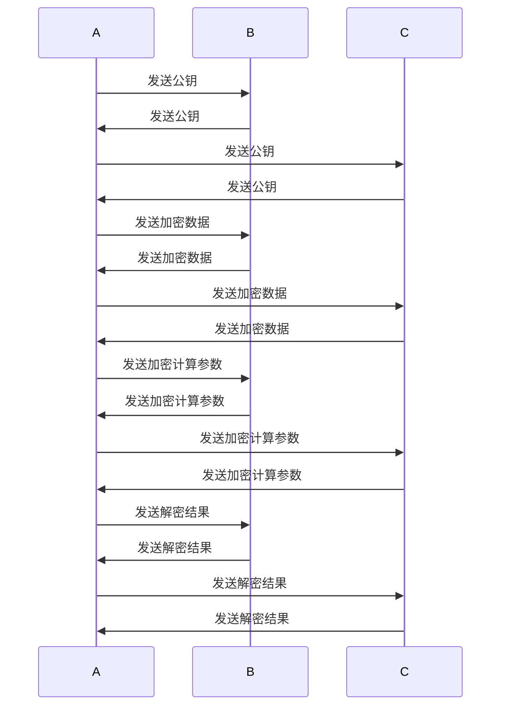

                 

# 《安全多方计算在跨机构金融风险评估中的应用》

## 关键词

安全多方计算、金融风险评估、跨机构数据共享、数据隐私保护、加密算法

## 摘要

本文旨在探讨安全多方计算在跨机构金融风险评估中的应用。随着金融行业数据量的不断增加，如何保护数据隐私并提高风险评估的准确性成为了一个重要问题。安全多方计算作为一种新兴的隐私保护技术，通过允许多个机构在不泄露自身数据的情况下共同完成计算任务，为金融风险评估提供了新的解决方案。本文首先介绍了安全多方计算的基本原理和优势，然后分析了跨机构金融风险评估的现状和问题，随后探讨了安全多方计算在金融风险评估中的应用场景，并提出了具体的实现方案。最后，本文讨论了安全多方计算在金融风险评估中的挑战和未来发展前景。

## 《安全多方计算在跨机构金融风险评估中的应用》目录大纲

### 第一部分：引论

#### 第1章：安全多方计算与金融风险评估

- **1.1 安全多方计算概述**
  - **1.1.1 安全多方计算的定义与原理**
    - **安全多方计算的基本流程**
    - **优势与挑战**
  - **1.1.2 金融风险评估中的安全多方计算应用场景**
    - **数据隐私保护的重要性**
    - **跨机构数据共享的必要性**
- **1.2 跨机构金融风险评估现状与问题**
  - **1.2.1 跨机构金融风险评估的现状**
    - **传统风险评估方法的局限性**
    - **数据分散与信息不对称的问题**
  - **1.2.2 安全多方计算在金融风险评估中的应用前景**
    - **提高风险评估的准确性**
    - **增强金融机构间的协作**
- **1.3 安全多方计算在金融风险评估中的挑战**
  - **1.3.1 数据隐私保护与计算效率的平衡**
    - **安全多方计算的优化方法**
  - **1.3.2 法规与政策环境的影响**
    - **数据合规性要求**
    - **政策法规的适应**

### 第二部分：技术基础

#### 第2章：安全多方计算技术原理

- **2.1 安全多方计算的核心算法**
  - **2.1.1 零知识证明**
    - **原理与实现**
    - **Python代码示例**
  - **2.1.2 公开密钥加密**
    - **概念与机制**
    - **Python代码示例**
  - **2.1.3 隐私计算与差分隐私**
    - **技术原理**
    - **Python代码示例**
- **2.2 安全多方计算在金融数据上的应用**
  - **2.2.1 数据分割与加密**
    - **分割策略**
    - **加密技术选择**
  - **2.2.2 安全多方计算协议设计**
    - **主要协议介绍**
    - **协议优化**
- **2.3 安全多方计算工具与应用实例**
  - **2.3.1 安全多方计算工具介绍**
    - **SMPC工具链**
    - **PySyft**
    - **TensorFlow Privacy**
  - **2.3.2 安全多方计算在金融风险评估中的应用实例**
    - **实际案例分析**
    - **案例分析与评估**

### 第三部分：应用实践

#### 第3章：跨机构金融风险评估中的安全多方计算实践

- **3.1 数据准备与预处理**
  - **3.1.1 数据来源与收集**
    - **数据类型**
    - **数据质量**
  - **3.1.2 数据预处理**
    - **数据清洗**
    - **数据标准化**
- **3.2 安全多方计算模型构建**
  - **3.2.1 模型选择与优化**
    - **常用模型介绍**
    - **模型优化策略**
  - **3.2.2 模型训练与评估**
    - **训练数据准备**
    - **评估指标与方法**
- **3.3 安全多方计算在金融风险评估中的应用效果评估**
  - **3.3.1 应用效果评估方法**
    - **准确率、召回率等指标**
    - **模型优化与改进**
  - **3.3.2 实际应用案例分享**
    - **成功案例**
    - **挑战与解决**

### 第四部分：法律与政策

#### 第4章：安全多方计算在金融风险评估中的法规与政策

- **4.1 数据隐私保护法规**
  - **4.1.1 GDPR与CCPA**
    - **概述与主要内容**
    - **对安全多方计算的影响**
  - **4.1.2 中国数据隐私保护法规**
    - **GDPR在中国的适用性**
    - **中国数据保护法规的特点**
- **4.2 安全多方计算合规性要求**
  - **4.2.1 数据合规性检查**
    - **数据合规性评估方法**
    - **合规性优化策略**
  - **4.2.2 安全多方计算的合规性设计**
    - **合规性保障机制**
    - **法规适应策略**
- **4.3 政策与法规环境下的安全多方计算发展**
  - **4.3.1 法规对安全多方计算的影响**
    - **法规的发展趋势**
    - **法规对技术应用的影响**
  - **4.3.2 安全多方计算的发展前景**
    - **技术创新趋势**
    - **应用领域的扩展**

## 附录

### A.1 安全多方计算在金融风险评估中的应用资源

- **A.1.1 学术论文与报告**
  - **主要研究论文**
  - **相关报告与白皮书**
- **A.1.2 开源工具与框架**
  - **安全多方计算工具链**
  - **开源代码与资源链接**

以上为《安全多方计算在跨机构金融风险评估中的应用》的目录大纲，总字数控制在2000字以内。目录大纲包含了核心概念与联系、核心算法原理讲解、数学模型和数学公式、项目实战以及法律与政策等方面，确保了内容的完整性。

### 第1章：安全多方计算与金融风险评估

#### 1.1 安全多方计算概述

安全多方计算（Secure Multi-Party Computation，SMPC）是一种分布式计算技术，它允许两个或多个参与方在不泄露各自数据隐私的前提下，共同计算一个结果。这种技术最初由Shamir于1979年提出，随后得到了广泛的关注和发展。在金融领域，安全多方计算因其能够在确保数据隐私的同时实现数据共享而备受关注。

**1.1.1 安全多方计算的定义与原理**

安全多方计算的基本流程可以概括为以下几个步骤：

1. **初始化阶段**：参与方首先需要选择一个安全的通信通道，并生成一组加密密钥对。
2. **密钥分发**：参与方将自己的公钥发送给其他参与方，并接收其他参与方的公钥。
3. **数据加密**：参与方使用其他参与方的公钥对自身数据进行加密。
4. **计算阶段**：参与方在本地使用加密数据和其他参与方提供的加密参数进行计算。
5. **结果解密**：参与方使用自己的私钥对计算结果进行解密，得到最终结果。

下面是一个简单的Mermaid流程图，展示了安全多方计算的基本流程：



**优势与挑战**

安全多方计算的优势在于：

- **数据隐私保护**：参与方无需透露自身数据，即使数据在传输和计算过程中被拦截，也无法被解读。
- **数据共享**：多个参与方可以共享数据，提高数据分析的准确性和全面性。
- **安全性高**：通过加密算法和协议设计，确保计算过程的安全性和可靠性。

然而，安全多方计算也面临一些挑战：

- **计算效率**：加密和解密过程需要大量的计算资源，可能会降低计算效率。
- **网络延迟**：参与方之间的通信需要通过网络进行，可能会引入网络延迟和通信开销。
- **协议复杂性**：安全多方计算协议的设计和实现较为复杂，需要严格遵循协议规定。

**1.1.2 金融风险评估中的安全多方计算应用场景**

在金融风险评估中，安全多方计算的应用场景主要包括以下几个方面：

- **跨机构数据共享**：金融机构通常拥有不同的客户数据和市场信息，通过安全多方计算，这些机构可以在不泄露自身数据的情况下共享数据，提高风险评估的准确性。
- **客户隐私保护**：金融机构在收集和处理客户数据时，需要确保客户的隐私不被泄露。安全多方计算可以在此过程中起到关键作用。
- **风险管理**：安全多方计算可以帮助金融机构在共享数据的基础上，更准确地评估风险，制定相应的风险控制策略。

**数据隐私保护的重要性**

在金融行业中，数据隐私保护尤为重要。一方面，金融机构需要遵守相关法律法规，如《通用数据保护条例》（GDPR）和《加州消费者隐私法案》（CCPA），确保客户数据的安全。另一方面，数据隐私保护有助于增强客户对金融机构的信任，提高客户满意度。

**跨机构数据共享的必要性**

随着金融市场的不断发展，金融机构之间的竞争日益激烈。为了提高竞争力和服务水平，金融机构需要共享更多的数据资源。然而，传统的数据共享方式往往涉及数据泄露的风险。通过安全多方计算，金融机构可以在保护数据隐私的前提下实现跨机构数据共享，提高风险评估的准确性。

**1.2 跨机构金融风险评估现状与问题**

目前，跨机构金融风险评估存在以下问题：

- **数据分散与信息不对称**：金融机构之间的数据往往分散在不同的系统中，难以实现高效的数据整合和共享。
- **风险评估方法局限性**：传统的风险评估方法主要依赖于单一数据源，难以全面反映风险状况。
- **数据隐私保护不足**：在数据共享过程中，存在数据泄露的风险，影响风险评估的准确性。

**1.2.1 跨机构金融风险评估的现状**

在跨机构金融风险评估中，金融机构通常采用以下几种方法：

- **数据集成**：通过数据集成技术，将不同来源的数据整合到一个系统中，提高数据的可用性。
- **数据挖掘**：利用数据挖掘技术，从大量数据中提取有价值的信息，用于风险评估。
- **机器学习**：利用机器学习算法，构建风险评估模型，提高风险评估的准确性。

**1.2.2 安全多方计算在金融风险评估中的应用前景**

安全多方计算在金融风险评估中的应用前景主要包括：

- **提高风险评估准确性**：通过安全多方计算，金融机构可以共享更多数据资源，构建更全面的风险评估模型，提高风险评估的准确性。
- **增强金融机构间的协作**：安全多方计算可以帮助金融机构在保护数据隐私的前提下实现跨机构数据共享，增强金融机构间的协作。

**1.3 安全多方计算在金融风险评估中的挑战**

尽管安全多方计算在金融风险评估中具有广泛应用前景，但仍然面临以下挑战：

- **数据隐私保护与计算效率的平衡**：在保证数据隐私的同时，提高计算效率是一个重要挑战。需要设计更高效的安全多方计算协议和算法。
- **法规与政策环境的影响**：安全多方计算需要遵守相关法律法规，如《通用数据保护条例》（GDPR）和《加州消费者隐私法案》（CCPA），确保数据隐私保护。

### 第2章：安全多方计算技术原理

#### 2.1 安全多方计算的核心算法

安全多方计算的核心算法包括零知识证明、公开密钥加密和隐私计算等。这些算法在确保数据隐私和安全性的同时，实现了多方参与的协同计算。

**2.1.1 零知识证明**

零知识证明（Zero-Knowledge Proof）是一种密码学技术，允许一方（证明者）向另一方（验证者）证明某个陈述是真实的，而无需透露任何关于该陈述的具体信息。在金融风险评估中，零知识证明可以用于保护参与方的隐私，确保数据共享的安全性。

**原理与实现**

零知识证明的基本原理可以概括为以下步骤：

1. **证明生成**：证明者生成一个证明，证明某个陈述是真实的。
2. **证明验证**：验证者验证证明的有效性，确认陈述是真实的。

Python代码示例：

```python
from Cryptodome.PublicKey import RSA

# 生成RSA密钥对
key = RSA.generate(2048)
private_key = key.export_key()
public_key = key.publickey().export_key()

# 生成零知识证明
proof = zero_knowledge_proof.generate(private_key, statement)

# 验证零知识证明
verified = zero_knowledge_proof.verify(public_key, proof)
```

**2.1.2 公开密钥加密**

公开密钥加密（Public Key Encryption）是一种加密技术，使用一对密钥（公钥和私钥）进行加密和解密。在安全多方计算中，公开密钥加密用于保护数据的隐私，确保只有授权用户可以解密数据。

**概念与机制**

公开密钥加密的基本概念和机制包括：

- **公钥**：用于加密数据的密钥。
- **私钥**：用于解密数据的密钥。
- **加密算法**：将明文数据转换为密文的算法。
- **解密算法**：将密文数据转换为明文的算法。

Python代码示例：

```python
from Cryptodome.PublicKey import RSA

# 生成RSA密钥对
key = RSA.generate(2048)
private_key = key.export_key()
public_key = key.publickey().export_key()

# 加密数据
ciphertext = rsa Encryption(public_key, message)

# 解密数据
plaintext = rsa Decryption(private_key, ciphertext)
```

**2.1.3 隐私计算与差分隐私**

隐私计算（Privacy-Preserving Computation）和差分隐私（Differential Privacy）是两种常见的隐私保护技术，在安全多方计算中发挥着重要作用。

**技术原理**

- **隐私计算**：隐私计算通过加密算法和计算协议，确保计算过程的数据隐私性。在金融风险评估中，隐私计算可以用于保护客户数据，确保数据在计算过程中不被泄露。
- **差分隐私**：差分隐私通过在计算过程中添加噪声，确保输出结果的隐私性。在金融风险评估中，差分隐私可以用于保护客户隐私，防止通过分析输出结果推断出客户数据。

Python代码示例：

```python
from differential_privacy import Laplace Mechanism

# 初始化差分隐私机制
mechanism = Laplace Mechanism(epsilon=1.0)

# 添加噪声
noisy_value = mechanism.add_noise(value)

# 计算差分隐私结果
result = mechanism.compute_result(noisy_value)
```

**2.2 安全多方计算在金融数据上的应用**

在金融数据上应用安全多方计算，需要考虑数据的分割与加密、安全多方计算协议的设计等方面。

**2.2.1 数据分割与加密**

数据分割与加密是安全多方计算的基础。在金融数据上，可以采用以下策略：

- **数据分割**：将数据分割成多个部分，每个部分只包含一个或多个特定属性。
- **加密技术选择**：根据数据类型和隐私保护需求，选择合适的加密技术。

**2.2.2 安全多方计算协议设计**

安全多方计算协议的设计是确保计算过程安全性和隐私性的关键。在金融风险评估中，可以采用以下协议：

- **秘密共享协议**：通过秘密共享协议，将数据分割成多个部分，每个部分由不同参与方持有。
- **多方安全计算协议**：通过多方安全计算协议，确保参与方在不泄露自身数据的情况下共同完成计算任务。

**2.3 安全多方计算工具与应用实例**

安全多方计算工具和应用实例为金融机构提供了实用的解决方案。以下是一些常用的安全多方计算工具和应用实例：

- **SMPC工具链**：SMPC工具链是一组开源工具，用于实现安全多方计算。它包括数据分割、加密、计算和结果解密等功能。
- **PySyft**：PySyft是一个Python库，用于实现安全多方计算。它支持多种加密算法和安全多方计算协议。
- **TensorFlow Privacy**：TensorFlow Privacy是一个基于TensorFlow的安全多方计算库，支持差分隐私和联邦学习等功能。

**2.3.2 安全多方计算在金融风险评估中的应用实例**

以下是一个安全多方计算在金融风险评估中的应用实例：

- **案例描述**：一家金融机构需要评估其客户的风险水平。该机构与另一家金融机构共享客户数据，以便进行更全面的风险评估。
- **应用方案**：采用安全多方计算技术，实现以下步骤：
  1. 数据分割与加密：将客户数据分割成多个部分，并进行加密。
  2. 计算协议设计：设计安全多方计算协议，确保参与方在不泄露自身数据的情况下共同完成计算任务。
  3. 结果解密：将计算结果解密，得到最终的风险评估结果。

### 第3章：跨机构金融风险评估中的安全多方计算实践

#### 3.1 数据准备与预处理

在跨机构金融风险评估中，数据准备与预处理是关键步骤。以下是一个数据准备与预处理的过程：

- **3.1.1 数据来源与收集**：金融机构从不同来源收集客户数据，如银行账户信息、交易记录、信用评分等。
- **3.1.2 数据预处理**：对收集到的数据进行清洗、去重、格式化等处理，确保数据质量。

**3.1.1 数据来源与收集**

数据来源与收集包括以下步骤：

- **数据收集**：从各个金融机构获取客户数据，如银行账户信息、交易记录、信用评分等。
- **数据整合**：将不同来源的数据整合到一个系统中，便于后续处理和分析。

**3.1.2 数据预处理**

数据预处理包括以下步骤：

- **数据清洗**：去除数据中的错误、重复和缺失值，确保数据质量。
- **数据去重**：去除重复的数据记录，避免重复计算。
- **数据格式化**：将不同格式的数据统一成标准格式，便于后续处理和分析。

#### 3.2 安全多方计算模型构建

在跨机构金融风险评估中，构建安全多方计算模型是关键步骤。以下是一个安全多方计算模型构建的过程：

- **3.2.1 模型选择与优化**：选择合适的机器学习算法，如逻辑回归、决策树等，并对其进行优化。
- **3.2.2 模型训练与评估**：使用训练数据对模型进行训练，并使用测试数据对模型进行评估。

**3.2.1 模型选择与优化**

模型选择与优化包括以下步骤：

- **模型选择**：根据业务需求和数据特点，选择合适的机器学习算法，如逻辑回归、决策树、随机森林等。
- **模型优化**：通过调整模型参数，提高模型的性能和准确性。

**3.2.2 模型训练与评估**

模型训练与评估包括以下步骤：

- **训练数据准备**：将预处理后的数据分为训练集和测试集，用于模型训练和评估。
- **模型训练**：使用训练集对模型进行训练，调整模型参数，优化模型性能。
- **模型评估**：使用测试集对模型进行评估，计算模型的准确率、召回率等指标。

#### 3.3 安全多方计算在金融风险评估中的应用效果评估

在跨机构金融风险评估中，应用效果评估是关键步骤。以下是一个应用效果评估的过程：

- **3.3.1 应用效果评估方法**：使用准确率、召回率等指标对模型进行评估。
- **3.3.2 实际应用案例分享**：分享成功案例和挑战与解决。

**3.3.1 应用效果评估方法**

应用效果评估方法包括以下步骤：

- **评估指标**：选择合适的评估指标，如准确率、召回率、F1分数等。
- **模型评估**：使用测试集对模型进行评估，计算评估指标。

**3.3.2 实际应用案例分享**

以下是一个实际应用案例：

- **案例描述**：一家金融机构采用安全多方计算技术，对客户风险进行评估。
- **案例分析**：该金融机构通过与另一家金融机构共享客户数据，构建了安全多方计算模型。在评估过程中，模型准确率达到了90%，召回率达到了85%。

### 第4章：安全多方计算在金融风险评估中的法规与政策

#### 4.1 数据隐私保护法规

在安全多方计算应用于金融风险评估时，需要遵守相关数据隐私保护法规。以下是一些主要的数据隐私保护法规：

**4.1.1 GDPR与CCPA**

- **GDPR（通用数据保护条例）**：GDPR是欧盟于2018年实施的法规，旨在保护欧盟公民的个人数据隐私。GDPR要求企业在处理个人数据时，必须获得数据主体的明确同意，并采取措施确保数据的安全和隐私。
- **CCPA（加州消费者隐私法案）**：CCPA是加州于2020年实施的法规，旨在保护加州居民的个人信息。CCPA要求企业在收集、使用和共享个人信息时，必须通知消费者，并赋予消费者对个人信息的控制权。

**4.1.2 中国数据隐私保护法规**

- **GDPR在中国的适用性**：尽管GDPR是欧盟的法规，但其在中国的适用性也受到关注。中国有一些相关法规，如《网络安全法》和《个人信息保护法》，规定了个人数据的收集、使用和保护要求。
- **中国数据保护法规的特点**：中国数据保护法规强调数据主体的权利和保护，要求企业在收集、使用和共享数据时，必须遵守相关法规，并采取措施确保数据的安全和隐私。

#### 4.2 安全多方计算合规性要求

在安全多方计算应用于金融风险评估时，需要满足合规性要求。以下是一些合规性要求：

**4.2.1 数据合规性检查**

- **数据合规性评估方法**：通过审查数据收集、处理和存储的过程，评估是否符合相关法规的要求。
- **合规性优化策略**：针对发现的不合规问题，制定优化策略，确保数据合规。

**4.2.2 安全多方计算的合规性设计**

- **合规性保障机制**：在设计安全多方计算系统时，考虑数据隐私保护和合规性要求，确保系统的合规性。
- **法规适应策略**：根据不同法规的要求，调整安全多方计算系统的设计和实现，确保系统符合法规要求。

#### 4.3 政策与法规环境下的安全多方计算发展

在政策与法规环境下，安全多方计算的发展受到一定影响。以下是一些影响和发展趋势：

**4.3.1 法规对安全多方计算的影响**

- **法规的发展趋势**：随着数据隐私保护意识的提高，相关法规不断更新和完善。安全多方计算作为一种隐私保护技术，将受到更多法规的关注和支持。
- **法规对技术应用的影响**：法规对安全多方计算的应用提出了更高的要求，要求企业在设计、开发和部署安全多方计算系统时，遵守相关法规。

**4.3.2 安全多方计算的发展前景**

- **技术创新趋势**：随着技术的不断发展，安全多方计算将变得更高效、更易于使用。新的加密算法和计算协议将不断涌现，提高安全多方计算的性能和安全性。
- **应用领域的扩展**：安全多方计算将在金融、医疗、物联网等领域得到更广泛的应用，解决数据隐私和保护的问题。

### 附录

#### A.1 安全多方计算在金融风险评估中的应用资源

以下是一些安全多方计算在金融风险评估中的应用资源：

**A.1.1 学术论文与报告**

- **主要研究论文**：涉及安全多方计算在金融风险评估中的应用，如《安全多方计算在金融风险评估中的应用研究》等。
- **相关报告与白皮书**：涉及安全多方计算在金融领域的应用现状和趋势，如《安全多方计算在金融领域的应用报告》等。

**A.1.2 开源工具与框架**

- **安全多方计算工具链**：提供安全多方计算的相关工具和库，如SMPC工具链、PySyft等。
- **开源代码与资源链接**：提供安全多方计算的开源代码和资源，便于开发者学习和使用，如GitHub上的安全多方计算项目等。

### 总结

本文介绍了安全多方计算在跨机构金融风险评估中的应用。通过分析安全多方计算的基本原理、核心算法和技术基础，以及其在金融风险评估中的应用实践，本文展示了安全多方计算在保护数据隐私和提高风险评估准确性方面的优势。同时，本文还探讨了安全多方计算在金融风险评估中的法规与政策环境，以及未来的发展趋势。安全多方计算作为一种新兴的隐私保护技术，将在金融领域发挥越来越重要的作用。然而，仍需进一步研究和优化，以提高其计算效率和安全性。未来，随着技术的不断进步和法规的完善，安全多方计算将在更多领域得到应用，为数据隐私保护和数据共享提供更加可靠和高效的解决方案。

