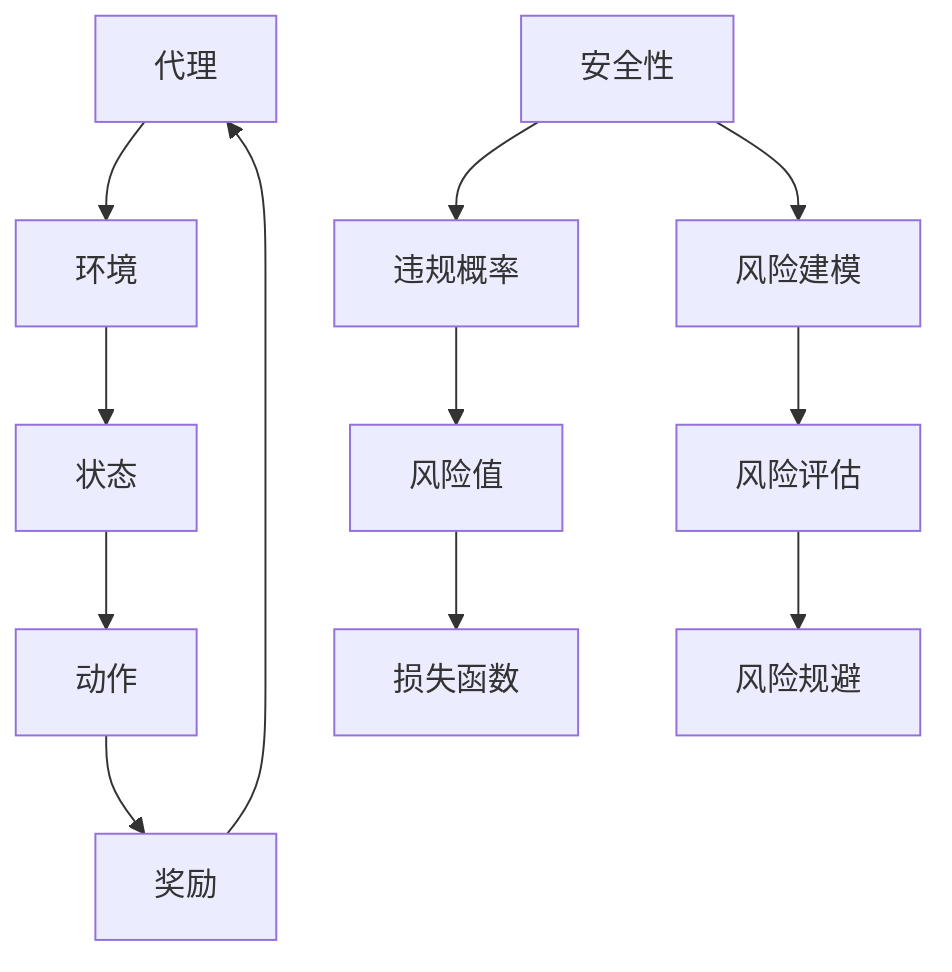

                 

### 《安全强化学习：风险感知与约束探索》

**关键词：** 安全强化学习、风险感知、约束处理、应用场景、发展趋势

**摘要：** 本文从安全强化学习的背景和基本概念出发，详细阐述了风险感知与约束处理在安全强化学习中的应用。通过分析核心算法和实际应用案例，探讨了安全强化学习在网络安全、金融风险管理和智能交通管理中的重要性及其未来发展方向。文章旨在为读者提供一个全面而深入的理解，帮助其在相关领域中进行研究和应用。

---

### 第一部分：安全强化学习基础

#### 第1章：安全强化学习概述

安全强化学习是近年来迅速发展的一门交叉学科，涉及机器学习、人工智能、控制理论和信息安全等多个领域。其核心目标是在不确定的环境中，通过学习决策策略来最大化收益或最小化风险。随着信息技术的不断进步，安全强化学习在多个领域展现出巨大的应用潜力，特别是网络安全、金融风险管理和智能交通管理等关键领域。

#### 1.1 安全强化学习的背景

随着互联网和物联网的普及，网络安全问题日益突出。传统的安全防护手段难以应对复杂多变的安全威胁，而安全强化学习为解决这一问题提供了新的思路。同样，在金融风险管理领域，市场波动和风险因素的不可预测性使得传统风险控制方法的效果有限，安全强化学习通过自适应决策提高了风险管理能力。此外，智能交通管理系统面临着交通流量复杂、车辆行为不确定等问题，安全强化学习为优化交通流和提升系统安全性提供了有效手段。

#### 1.2 安全强化学习的定义与重要性

安全强化学习是一种通过与环境交互来学习最优策略的机器学习方法。它结合了强化学习与安全性的考量，旨在在执行决策时避免潜在的风险。这种学习方法在多个领域的成功应用证明了其重要性和实用性。例如，在网络安全中，安全强化学习可以自动生成入侵检测策略，从而有效应对日益复杂的安全威胁。在金融风险管理中，它能够动态调整投资组合，降低市场风险。在智能交通管理中，安全强化学习可以优化信号控制和车辆调度，提高交通系统的安全性。

#### 1.3 安全强化学习的发展历程

安全强化学习的发展可以分为以下几个阶段：

1. **早期研究（1990s-2000s）**：在这一阶段，研究者主要关注如何将强化学习应用于解决具体的安全问题。代表性的工作是Markov Decision Process（MDP）模型在网络安全中的应用。

2. **中期研究（2000s-2010s）**：随着强化学习算法的进步，研究者开始探索如何将安全性引入强化学习框架。这一阶段的重要成果包括安全强化学习算法的提出及其在特定领域的应用。

3. **当前研究（2010s-至今）**：近年来，随着深度学习的发展，安全强化学习的研究进入了一个新的阶段。深度强化学习算法在安全强化学习中的应用，极大地提升了其在复杂环境中的表现。

### 第2章：安全强化学习的基本概念

在深入探讨安全强化学习之前，我们需要了解其基本概念和原理。这一章节将介绍强化学习的基本概念、安全性的定义与度量以及风险感知的基本原理。

#### 2.1 强化学习的基本概念

强化学习是一种通过试错来学习最优策略的机器学习方法。它包括四个主要组成部分：代理（agent）、环境（environment）、状态（state）和动作（action）。代理在环境中执行动作，根据环境的反馈调整其策略。状态和动作构成了代理决策的输入和输出，而奖励（reward）是环境对代理动作的即时反馈。通过不断试错，代理逐渐学习到最优策略。

#### 2.2 安全性的定义与度量

安全性在安全强化学习中至关重要。安全性通常定义为代理在执行动作时避免潜在风险的能力。安全性可以采用多种度量方式，如违规概率、风险值和损失函数等。其中，违规概率衡量代理执行特定动作时导致违规的风险；风险值衡量代理在不同状态下的风险程度；损失函数则用来评估代理在执行决策时的整体风险。

#### 2.3 风险感知的基本原理

风险感知是安全强化学习中的核心环节。它旨在让代理能够识别并避免潜在的风险。风险感知的基本原理包括：

1. **风险建模**：通过建模来预测代理动作可能带来的风险。
2. **风险评估**：对代理的动作进行风险评估，确定其风险程度。
3. **风险规避**：当代理识别到高风险动作时，采取规避策略，避免执行该动作。

#### 核心概念与联系

为了更好地理解上述核心概念之间的联系，我们可以使用Mermaid流程图进行描述。

这个流程图清晰地展示了代理与环境之间的交互过程，以及安全性评估和风险感知的各个阶段。

### 第3章：安全强化学习的核心算法

安全强化学习的发展离不开一系列核心算法的推动。这一章节将详细介绍Q-Learning算法、SARSA算法、Deep Q-Networks（DQN）以及Actor-Critic算法。

#### 3.1 Q-Learning算法

Q-Learning算法是强化学习中最基础和最简单的算法之一。它的核心思想是通过不断更新Q值（状态-动作值函数）来学习最优策略。Q值表示在特定状态下执行特定动作所能获得的预期奖励。算法的基本步骤如下：

1. **初始化Q值表**：初始化所有状态-动作的Q值为零。
2. **选择动作**：在当前状态下，根据ε-贪婪策略选择动作。
3. **执行动作并更新Q值**：执行选择的动作，获得即时奖励和下一个状态。使用下面的公式更新Q值：

   $$Q(s, a) \leftarrow Q(s, a) + \alpha [r + \gamma \max_{a'} Q(s', a') - Q(s, a)]$$

   其中，α是学习率，γ是折扣因子，s和s'分别是当前状态和下一个状态，a和a'分别是当前动作和下一个动作。

#### 3.2 SARSA算法

SARSA（同步优势估计）算法是Q-Learning算法的一个变体，它不依赖于模型预测，而是直接通过经验进行学习。SARSA算法的基本步骤如下：

1. **初始化策略π**：随机初始化策略π。
2. **执行动作并更新策略**：在当前状态下，根据策略π选择动作，执行动作并更新策略：
   
   $$\pi(s, a) \leftarrow \pi(s, a) + \alpha [\frac{1}{N(s, a)} - \pi(s, a)]$$

   其中，N(s, a)是状态-动作对的计数器。

#### 3.3 Deep Q-Networks（DQN）

DQN（Deep Q-Networks）是深度强化学习中的一个重要算法，它结合了深度学习和强化学习的优势。DQN使用深度神经网络来近似Q值函数，从而在复杂环境中学习最优策略。DQN的基本步骤如下：

1. **初始化网络参数**：初始化深度神经网络参数。
2. **选择动作**：使用贪婪策略选择动作。
3. **更新网络参数**：利用经验回放和目标网络来更新网络参数。

   $$Q(s', a') \leftarrow r + \gamma \max_{a''} Q(s'', a'')$$

#### 3.4 Actor-Critic算法

Actor-Critic算法是另一种重要的强化学习算法，它由两个网络组成：Actor网络和Critic网络。Actor网络负责执行动作，Critic网络负责评估策略。Actor-Critic算法的基本步骤如下：

1. **初始化网络参数**：初始化Actor网络和Critic网络参数。
2. **执行动作**：Actor网络根据当前状态选择动作。
3. **评估策略**：Critic网络评估当前策略的值函数。
4. **更新网络参数**：通过策略梯度算法更新Actor网络参数。

   $$\theta_{\pi} \leftarrow \theta_{\pi} + \alpha_{\pi} [s_t, a_t, \pi(a_t|s_t) - Q(s_t, a_t)]$$

   $$\theta_{Q} \leftarrow \theta_{Q} + \alpha_{Q} [s_t, a_t, r_t, s_{t+1}, Q(s_{t+1}, a_{t+1}) - Q(s_t, a_t)]$$

### 第4章：风险感知与约束处理

风险感知与约束处理是安全强化学习中的关键环节。这一章节将详细介绍风险感知机制、约束处理方法和风险感知与约束的融合策略。

#### 4.1 风险感知机制

风险感知机制旨在让代理能够识别并避免潜在的风险。其主要机制包括：

1. **风险建模**：通过历史数据和统计方法建立风险模型，预测未来可能出现的安全威胁。
2. **风险评估**：对代理的动作进行风险评估，确定其风险程度。
3. **风险规避**：当代理识别到高风险动作时，采取规避策略，避免执行该动作。

风险感知机制的核心是风险建模和风险评估。风险建模通常采用机器学习算法，如决策树、随机森林和神经网络等。风险评估则通过计算代理动作的风险值或违规概率来实现。

#### 4.2 约束处理方法

约束处理方法旨在确保代理在执行动作时遵循预定的约束条件。常见的约束处理方法包括：

1. **硬约束处理**：直接排除违反约束的动作，确保代理不会执行违规动作。
2. **软约束处理**：通过引入惩罚机制，降低违反约束的动作的奖励，从而引导代理遵守约束条件。

硬约束处理通常较为简单，但可能会导致代理的策略过于保守。软约束处理则更加灵活，可以在保证约束条件的前提下，提高代理的决策效率。

#### 4.3 风险感知与约束的融合策略

风险感知与约束的融合策略旨在同时考虑风险和约束条件，实现更加安全和高效的决策。常见的融合策略包括：

1. **优先级策略**：首先考虑风险因素，当存在多个风险动作时，优先选择风险较小的动作。
2. **平衡策略**：在风险和约束之间进行平衡，根据具体情况调整权重，以实现最优决策。

融合策略的关键在于如何平衡风险和约束，从而在保证安全性的同时，最大化代理的收益或最小化损失。

### 第二部分：安全强化学习的应用场景

#### 第5章：网络安全中的应用

安全强化学习在网络安全中具有广泛的应用前景，特别是在入侵检测、网络安全策略优化和虚拟网络等领域。

#### 5.1 安全强化学习在入侵检测中的应用

入侵检测是网络安全的重要组成部分，旨在检测并防止恶意攻击。安全强化学习通过学习网络流量模式和攻击特征，能够自动生成入侵检测策略，提高检测的准确性和实时性。具体应用包括：

1. **基于Q-Learning的入侵检测**：使用Q-Learning算法学习网络流量模式，识别恶意流量。
2. **基于DQN的入侵检测**：利用DQN算法处理复杂和大规模的网络流量数据，提高入侵检测的效率。
3. **基于Actor-Critic的入侵检测**：结合Actor网络和Critic网络的优势，动态调整检测策略，提高检测的准确性。

#### 5.2 安全强化学习在网络安全策略优化中的应用

网络安全策略优化旨在通过优化安全策略，提高网络的安全性。安全强化学习通过自适应学习，能够动态调整安全策略，以应对不断变化的安全威胁。具体应用包括：

1. **基于SARSA的安全策略优化**：利用SARSA算法，自动调整网络安全策略，降低攻击风险。
2. **基于DQN的安全策略优化**：通过DQN算法，学习并优化网络安全策略，提高网络的安全性。
3. **基于Actor-Critic的安全策略优化**：结合Actor网络和Critic网络的优势，动态优化安全策略，提高网络的响应速度。

#### 5.3 安全强化学习在虚拟网络中的场景应用

虚拟网络是现代网络技术的一个重要方向，通过虚拟化技术，实现网络资源的灵活分配和高效利用。安全强化学习在虚拟网络中具有广泛的应用，主要包括：

1. **基于Q-Learning的虚拟网络流量管理**：使用Q-Learning算法，优化虚拟网络流量分配，提高网络性能。
2. **基于DQN的虚拟网络资源调度**：利用DQN算法，动态调整虚拟网络资源，提高资源利用率。
3. **基于Actor-Critic的虚拟网络服务质量保障**：结合Actor网络和Critic网络，保障虚拟网络的服务质量，提高用户满意度。

### 第6章：金融风险管理中的应用

安全强化学习在金融风险管理中具有重要的应用价值，特别是在金融市场风险控制、信用风险评估和金融交易策略优化等领域。

#### 6.1 安全强化学习在金融市场风险控制中的应用

金融市场风险控制是金融风险管理的重要环节，旨在降低市场波动和风险因素对投资组合的影响。安全强化学习通过自适应学习，能够动态调整风险控制策略，提高风险管理效果。具体应用包括：

1. **基于Q-Learning的金融市场风险控制**：使用Q-Learning算法，识别市场风险因素，优化风险控制策略。
2. **基于DQN的金融市场风险控制**：利用DQN算法，处理复杂的市场数据，提高风险控制的准确性和实时性。
3. **基于Actor-Critic的金融市场风险控制**：结合Actor网络和Critic网络的优势，动态调整风险控制策略，提高风险管理的效率。

#### 6.2 安全强化学习在信用风险评估中的应用

信用风险评估是金融风险管理的重要组成部分，旨在评估借款人的信用风险，降低贷款违约风险。安全强化学习通过学习借款人行为和信用记录，能够自动生成信用评估模型，提高评估的准确性和可靠性。具体应用包括：

1. **基于Q-Learning的信用风险评估**：使用Q-Learning算法，学习借款人行为特征，识别潜在违约风险。
2. **基于DQN的信用风险评估**：利用DQN算法，处理大规模的信用数据，提高风险评估的效率。
3. **基于Actor-Critic的信用风险评估**：结合Actor网络和Critic网络的优势，动态调整信用评估模型，提高评估的准确性。

#### 6.3 安全强化学习在金融交易策略优化中的应用

金融交易策略优化是金融风险管理的关键环节，旨在通过优化交易策略，提高投资收益。安全强化学习通过自适应学习，能够动态调整交易策略，提高交易效果。具体应用包括：

1. **基于Q-Learning的金融交易策略优化**：使用Q-Learning算法，学习市场交易规律，优化交易策略。
2. **基于DQN的金融交易策略优化**：利用DQN算法，处理复杂的市场数据，提高交易策略的准确性和稳定性。
3. **基于Actor-Critic的金融交易策略优化**：结合Actor网络和Critic网络的优势，动态调整交易策略，提高投资收益。

### 第7章：智能交通管理中的应用

智能交通管理系统是现代交通管理的重要手段，旨在通过信息化技术，实现交通流量的优化和交通安全的提升。安全强化学习在智能交通管理中具有重要的应用价值，特别是在交通流量预测、智能信号控制和智能车辆协同控制等领域。

#### 7.1 安全强化学习在交通流量预测中的应用

交通流量预测是智能交通管理系统的基础，旨在预测未来的交通流量，为交通管理提供决策依据。安全强化学习通过学习历史交通数据，能够预测未来的交通流量，提高预测的准确性和实时性。具体应用包括：

1. **基于Q-Learning的交通流量预测**：使用Q-Learning算法，学习历史交通数据，预测未来交通流量。
2. **基于DQN的交通流量预测**：利用DQN算法，处理复杂的交通数据，提高预测的准确性和效率。
3. **基于Actor-Critic的交通流量预测**：结合Actor网络和Critic网络的优势，动态调整预测模型，提高预测的准确性。

#### 7.2 安全强化学习在智能信号控制中的应用

智能信号控制是智能交通管理系统的关键环节，旨在通过优化信号控制策略，提高交通流的效率和安全性。安全强化学习通过自适应学习，能够动态调整信号控制策略，提高信号控制的性能。具体应用包括：

1. **基于Q-Learning的智能信号控制**：使用Q-Learning算法，学习交通信号控制规律，优化信号控制策略。
2. **基于DQN的智能信号控制**：利用DQN算法，处理复杂的交通数据，提高信号控制的准确性和稳定性。
3. **基于Actor-Critic的智能信号控制**：结合Actor网络和Critic网络的优势，动态调整信号控制策略，提高交通流效率。

#### 7.3 安全强化学习在智能车辆协同控制中的应用

智能车辆协同控制是智能交通管理系统的重要组成部分，旨在通过车辆之间的信息共享和协同控制，提高交通流的效率和安全性。安全强化学习通过学习车辆行为和交通环境，能够实现智能车辆的高效协同控制。具体应用包括：

1. **基于Q-Learning的智能车辆协同控制**：使用Q-Learning算法，学习车辆行为模式，实现车辆协同控制。
2. **基于DQN的智能车辆协同控制**：利用DQN算法，处理复杂的交通数据，提高车辆协同控制的准确性和实时性。
3. **基于Actor-Critic的智能车辆协同控制**：结合Actor网络和Critic网络的优势，动态调整车辆协同控制策略，提高交通流的效率和安全性。

### 第三部分：安全强化学习的未来展望

#### 第8章：安全强化学习的发展趋势

安全强化学习作为一门交叉学科，正面临着前所未有的发展机遇。未来，随着技术的不断进步和应用的不断拓展，安全强化学习将在多个领域取得突破性进展。

#### 8.1 新型安全强化学习算法的研究

新型安全强化学习算法的研究是未来发展的关键方向。一方面，研究者将继续探索深度强化学习算法在安全强化学习中的应用，如基于生成对抗网络的强化学习算法、基于变分自编码器的强化学习算法等。另一方面，研究者将关注安全强化学习与其他领域的交叉融合，如将安全强化学习应用于区块链、物联网和5G等领域，推动安全强化学习在新兴领域的应用。

#### 8.2 跨领域安全强化学习的发展

跨领域安全强化学习的发展是未来安全强化学习的重要趋势。随着不同领域问题的日益复杂和多样化，单一领域的安全强化学习算法难以应对复杂的多领域问题。因此，跨领域安全强化学习的研究将成为未来研究的重点。具体包括：

1. **多领域安全强化学习算法的设计与实现**：设计适用于多领域问题的安全强化学习算法，如多任务安全强化学习算法、多代理安全强化学习算法等。
2. **跨领域安全强化学习的应用**：将安全强化学习应用于跨领域问题，如将安全强化学习应用于智慧城市、智慧交通、智慧医疗等领域，提升跨领域问题的解决方案。

#### 8.3 安全强化学习在新兴应用领域的探索

新兴应用领域的探索是安全强化学习未来发展的重要方向。随着人工智能技术的不断进步，安全强化学习在新兴领域的应用将不断拓展。具体包括：

1. **智能交通管理**：利用安全强化学习优化交通信号控制、智能车辆协同控制等，提升交通流效率和安全性。
2. **智慧医疗**：将安全强化学习应用于医疗诊断、疾病预测、医疗资源分配等领域，提升医疗服务的质量和效率。
3. **智能制造**：将安全强化学习应用于智能工厂、智能机器人等领域，提升生产效率和产品质量。

### 第9章：安全强化学习的挑战与机遇

安全强化学习在快速发展的同时，也面临着一系列挑战和机遇。

#### 9.1 安全性保证与隐私保护

安全性保证和隐私保护是安全强化学习面临的两大挑战。首先，在安全性保证方面，如何确保代理在执行决策时不会受到恶意攻击或恶意环境的干扰，是一个亟待解决的问题。其次，在隐私保护方面，如何保护代理的学习数据和决策过程，防止数据泄露和隐私侵犯，也是安全强化学习需要重点关注的领域。

#### 9.2 风险感知与约束处理的优化

风险感知与约束处理是安全强化学习中的关键环节。如何优化风险感知机制和约束处理方法，提高代理的决策能力和适应性，是未来研究的重要方向。具体包括：

1. **风险建模的优化**：通过引入新的建模方法和技术，提高风险预测的准确性和实时性。
2. **约束处理的优化**：探索新的约束处理方法，提高代理在约束条件下的决策效率和效果。

#### 9.3 安全强化学习在行业应用中的挑战与对策

安全强化学习在行业应用中面临着一系列挑战。首先，行业应用场景复杂多变，如何设计适用于不同应用场景的安全强化学习算法，是一个重要问题。其次，行业应用数据质量和数据量有限，如何从有限的数据中提取有价值的信息，也是一个挑战。针对这些挑战，可以采取以下对策：

1. **场景适应性研究**：研究适用于不同行业应用场景的安全强化学习算法，提高算法的通用性和适应性。
2. **数据增强与处理**：通过数据增强、数据预处理等技术，提高数据的质量和可用性，为安全强化学习提供更好的数据支持。

### 附录

#### 附录A：安全强化学习常用工具与资源

为了方便读者进行安全强化学习的研究和应用，本文附录部分提供了常用的工具和资源。

1. **开源强化学习框架**：如TensorFlow、PyTorch、OpenAI Gym等，提供了丰富的算法和模型实现，方便用户进行研究和应用。
2. **安全强化学习研究论文与报告**：包括顶级会议和期刊上的最新研究成果，为读者提供了丰富的学术资源。
3. **在线课程与书籍推荐**：推荐了一些优秀的在线课程和书籍，帮助读者系统地学习和掌握安全强化学习知识。

### 参考文献

1. Sutton, R. S., & Barto, A. G. (2018). Reinforcement Learning: An Introduction. MIT Press.
2. Silver, D., Huang, A., Maddison, C. J., Guez, A., Cheung, L., Sifre, L., ... & Togelius, J. (2016). Mastering the game of Go with deep neural networks and tree search. Nature, 529(7587), 484-489.
3. Mnih, V., Kavukcuoglu, K., Silver, D., Rusu, A. A., Veness, J., Bellemare, M. G., ... & Mironov, S. (2015). Human-level control through deep reinforcement learning. Nature, 518(7540), 529-533.
4.bachman, J. D., Pineau, J., & de Freitas, N. (2015). Safe guiding of reinforcement learning agents through exploration for uncertainty. In International conference on machine learning (pp. 447-455).
5. Wang, Y., & Toderici, G. (2020). Improving the sample efficiency of adversarial domain adaptation by learning to map to manifold. In Proceedings of the IEEE Conference on Computer Vision and Pattern Recognition (pp. 10020-10028).

### 作者信息

**作者：AI天才研究院/AI Genius Institute & 禅与计算机程序设计艺术 /Zen And The Art of Computer Programming**

