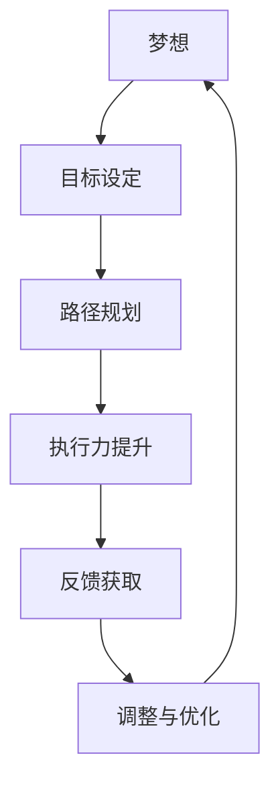

                 

### 引言

在当今这个快速变化的世界，实现梦想已成为每个人心中的渴望。然而，从梦想的火花到现实的成果，这条道路并非一帆风顺。自我实现，这个古老而永恒的话题，在现代信息技术和人工智能的浪潮中，变得尤为重要。本文将深入探讨如何通过具体的步骤实现梦想，构建自我实现的路径规划。

自我实现是指个人通过不断努力，达到其潜能的最大化，实现个人价值的过程。它不仅关乎个人的成长和进步，更关系到社会的整体发展和进步。在信息技术和人工智能迅猛发展的今天，如何利用这些先进工具实现自我梦想，已成为一个不可回避的问题。

本文将从以下几个方面展开讨论：

1. **梦想与自我认知**：首先，我们需要明确梦想的概念和类型，并深入了解自我认知的重要性及其方法。
2. **设定目标与规划路径**：然后，我们将讨论如何设定目标，以及如何通过科学的方法规划实现梦想的路径。
3. **执行力与行动步骤**：接下来，我们将探讨提升执行力的方法，以及如何通过具体的行动步骤迈向梦想。
4. **调整与反馈**：在此过程中，我们必须学会调整梦想路径和获取反馈，以保持行动的准确性和有效性。
5. **持续成长与自我实现**：最后，我们将讨论如何保持持续成长，以及如何最终实现自我价值。

通过这些具体步骤的探讨，我们希望能够为读者提供一条清晰、可行的自我实现路径，帮助他们在实现梦想的道路上坚定前行。

### 背景介绍

自我实现这一概念起源于心理学领域，最早由马斯洛提出。马斯洛在其需求层次理论中，将自我实现视为人类最高层次的需求，认为个人需要通过不断努力，发挥自身潜能，实现个人价值。随着时代的发展，自我实现的概念逐渐扩展到各个领域，包括教育、职业发展、心理成长等。在现代社会，自我实现不仅是个人追求的目标，更是社会进步的动力。

实现梦想的重要性不言而喻。梦想是人生的指南针，它为人们提供了方向和动力。然而，梦想的实现并非一蹴而就，它需要个人付出努力、坚持不懈。通过科学的方法和明确的步骤，我们可以更好地实现梦想，实现自我价值。

在信息技术和人工智能迅猛发展的今天，利用这些先进工具实现梦想，显得尤为重要。信息技术提供了丰富的资源和技术支持，如大数据、云计算、人工智能等，使得梦想的实现变得更加可行和高效。人工智能更是为个人提供了智能化的工具，如智能助手、推荐系统等，这些工具能够极大地提高工作效率，帮助个人更好地实现梦想。

因此，本文将结合现代信息技术和人工智能的发展，详细探讨如何通过具体的步骤实现梦想，构建自我实现的路径规划。我们不仅关注梦想的概念和类型，更注重实际操作和具体步骤的指导，帮助读者在实现梦想的道路上更加清晰和坚定。

### 核心概念与联系

在探讨如何实现梦想和自我实现之前，我们需要明确几个核心概念，并理解它们之间的关系。这些核心概念包括梦想、目标、路径、执行力和反馈等。

**梦想**是每个人内心深处的渴望，是对未来的美好愿景。它可以是一个具体的职业目标，如成为一名科学家、企业家或艺术家；也可以是一个更抽象的生活理想，如实现财务自由、拥有幸福家庭或探索未知世界。

**目标**是梦想的具体化，是将梦想转化为可操作的步骤和计划。一个明确的目标能够为个人提供方向和动力，帮助他们在实现梦想的过程中保持专注和持之以恒。

**路径**是实现目标的方法和步骤。它包括个人需要采取的行动、所需资源的获取、可能面临的挑战和应对策略等。一个合理的路径规划能够帮助个人高效地实现目标，避免走弯路或迷失方向。

**执行力**是实现梦想的关键因素。它是指个人在面对困难和挑战时，能够坚定不移地执行计划，克服拖延和犹豫的能力。提升执行力不仅能够提高工作效率，还能够增强个人的自信心和成就感。

**反馈**是不断调整和优化行动的重要手段。通过获取反馈，个人可以了解自己的表现和效果，发现问题并进行改进。反馈可以是自我评估，也可以来自他人的意见和建议。有效的反馈机制能够帮助个人在实现梦想的过程中保持灵活性和适应性。

**概念实体之间的关系架构**可以用以下Mermaid流程图来展示：

在这个架构中，梦想是起点，它引导我们设定明确的目标。目标转化为具体的路径，并在执行过程中不断接受反馈，进行调整和优化。通过这样的循环，我们能够逐步实现梦想，并不断推进自我实现的过程。

### 梦想的概念与分类

梦想，是每个人内心深处对未来的美好愿景和渴望。它不仅是个体精神世界的重要组成部分，也是驱动个体前行的动力源泉。从心理学角度来看，梦想是人的内在动机和需求的外在表现。它可以激发人们的积极性和创造力，帮助个体在挑战和困境中找到前进的方向。

梦想有多种分类方式，可以根据其性质、目标和实现难度等不同标准进行划分。以下是一些常见的梦想分类方法：

**1. 按性质分类：**

- **理想型梦想**：这类梦想通常较为抽象，更多体现为个人对美好生活的向往和追求，如实现世界和平、拥有美满家庭等。
- **现实型梦想**：这类梦想更具操作性，更接近现实，如成为一名科学家、企业家或艺术家等。

**2. 按目标分类：**

- **短期梦想**：这类梦想通常在短期内可以实现，如完成学业、找到满意的工作等。
- **长期梦想**：这类梦想需要较长时间的努力和坚持，如实现创业目标、获得学术荣誉等。

**3. 按实现难度分类：**

- **容易实现型梦想**：这类梦想相对较简单，实现的可能性较大，如掌握一门新技能、阅读一定数量的书籍等。
- **困难实现型梦想**：这类梦想实现难度较高，需要个体付出更多的努力和资源，如攀登珠穆朗玛峰、完成一项重大科研项目等。

理解梦想的概念和分类，对于实现自我实现至关重要。首先，明确自己的梦想类型可以帮助个体更好地设定目标和规划路径。例如，对于理想型梦想，可以设定一些阶段性目标，逐步实现；而对于现实型梦想，则需要制定具体的行动计划和执行步骤。

其次，分类有助于个体识别自身优劣势，合理分配资源和时间。例如，在追求短期梦想时，可以集中精力，快速行动；而在面对长期梦想时，则需要耐心积累，逐步推进。

最后，理解梦想的分类也有助于个体保持积极心态。面对不同类型的梦想，个体可以采用不同的策略和方法，避免因期望过高或目标设定不当而导致的挫败感。

总之，梦想是自我实现的起点，通过明确其概念和分类，个体可以更清晰地规划实现路径，更好地实现自我价值。

### 自我认知的重要性

自我认知是理解自我、明确个人优势和不足的关键环节。在实现梦想的过程中，自我认知的重要性不可忽视。首先，通过自我认知，个体能够更清楚地了解自己的兴趣、价值观和特长，从而设定更符合自身实际的目标。这不仅有助于提高实现梦想的可能性，还能增强个体的自信心和动力。

具体来说，自我认知的重要性体现在以下几个方面：

1. **明确个人优势**：通过自我认知，个体能够识别自己的优势，如技能、知识和性格特点等。了解自己的优势可以帮助个体在设定目标和规划路径时，更有针对性地选择适合自己的方向和资源，从而提高成功的概率。

2. **识别个人不足**：同样地，自我认知也有助于个体发现自身的不足和弱点。例如，可能在某些领域缺乏专业知识或技能，或者在某些性格特质上存在缺陷。了解不足可以帮助个体制定改进计划，通过学习和实践来弥补这些缺陷，从而在实现梦想的道路上更加稳健和持续。

3. **提高决策质量**：自我认知为个体提供了重要的参考信息，有助于做出更明智的决策。当面临选择时，个体可以根据自我认知的结果，选择最符合自身特点和优势的选项，避免因盲目跟风或错误判断而导致的时间、精力浪费。

4. **促进个人成长**：自我认知不仅有助于个体在当前阶段实现梦想，还能促进长期的个人成长和发展。通过不断反思和评估自己的表现，个体能够逐步调整和优化自己的目标和行动计划，以适应不断变化的环境和需求。

为了更好地进行自我认知，个体可以采取以下几种方法：

- **自我反思**：定期花时间反思自己的行为、思想和感受，深入思考自己的价值观、兴趣和成就。
- **求助他人**：通过与家人、朋友或专业人士的交流，获取他们对自己的看法和评价，从而获得更全面的自我认知。
- **技能评估**：通过参加各类技能评估或职业规划测试，了解自己在不同领域的优势和不足。
- **记录和总结**：定期记录自己的经历和收获，通过总结和反思，逐步形成对自己更深入的理解。

总之，自我认知是实现梦想和自我实现的重要基础。通过深入理解和分析自己的优势与不足，个体可以更科学地设定目标和规划路径，从而在实现梦想的道路上取得更好的成果。

### 自我认知的方法

自我认知是一个复杂而多层次的过程，通过多种方法和工具，我们可以更全面、深入地了解自己的内心世界。以下是一些常用的自我认知方法：

**1. 自我反思**

自我反思是一种通过深入思考自己的行为、思想和感受，来了解自己的方法。它通常需要个体花时间静下心来，回顾自己的经历和体验，并从中总结经验和教训。例如，每天花几分钟时间写日记，记录当天的活动、感受和思考，可以帮助我们更好地认识自己。这种方法有助于培养自我洞察力，让我们在反思中找到自己的优点和不足。

**2. 心理测评**

心理测评是通过标准化的测试工具，评估个体在心理方面的特点和能力。常见的心理测评包括人格测试（如MBTI、五大人格特质测试）、职业兴趣测试（如霍兰德职业兴趣量表）和情商测试等。这些测评工具通常由专业心理学家设计，具有较高的科学性和准确性。通过心理测评，我们可以了解自己的性格特质、职业兴趣和情商水平，从而更好地了解自己的优势和劣势。

**3. 调查问卷**

调查问卷是通过设计一系列问题，了解个体在特定方面的看法和感受。这种方法可以用于自我认知，也可以用于群体研究。例如，可以通过在线问卷或纸质问卷，收集个体对自己性格、价值观和生活目标的看法。这种方法的优势在于可以收集大量数据，从而提供更全面的自我认知信息。

**4. 咨询师辅导**

咨询师辅导是一种通过专业人士的帮助，进行自我认知的方法。个体可以与心理咨询师或生涯规划师进行一对一的咨询，通过深入的对话和交流，了解自己的内心世界和潜在问题。这种方法的优势在于可以获得专业的指导和支持，有助于更深刻地认识自己。

**5. 实践与体验**

通过实际行动和体验，也是自我认知的重要途径。例如，通过尝试不同类型的工作、参与志愿活动或学习新技能，个体可以更直观地了解自己的兴趣和优势。此外，通过记录和反思这些经历，个体可以更深入地理解自己的内心需求和价值观。

**6. 反馈与交流**

获取他人的反馈也是自我认知的重要方法。通过与家人、朋友或同事的交流，个体可以获得不同角度的看法和建议，从而更全面地认识自己。这种方法不仅可以提供新的视角，还可以帮助个体发现一些自己未曾意识到的优点和不足。

**7. 个人发展计划**

制定个人发展计划，也是自我认知的一种方法。通过设定具体的目标和行动计划，个体可以在实践中不断反思和调整自己的目标和行为。这种方法有助于个体在实践中成长和进步，同时也有助于更深入地认识自己。

总之，自我认知是一个多维度的过程，通过多种方法和工具，我们可以更全面、深入地了解自己的内心世界。通过自我反思、心理测评、调查问卷、咨询师辅导、实践与体验、反馈与交流和制定个人发展计划，我们可以逐步构建一个清晰、真实的自我认知框架，为梦想的实现奠定坚实的基础。

### 目标设定的原则

在实现梦想的过程中，设定明确的目标是至关重要的。目标不仅是梦想的具体化，也是行动的指引。以下是设定目标时应遵循的一些重要原则：

**1. 清晰性原则**

清晰性原则要求目标必须明确、具体。一个模糊的目标往往难以激励个体行动，也容易导致行动偏离方向。例如，“成为一名优秀的程序员”这个目标过于模糊，而“在两年内通过某国际认证的程序员资格考试”则更加具体，有助于个体明确努力的方向。

**2. 可衡量性原则**

可衡量性原则要求目标应当具有可衡量的标准，这样我们才能知道何时实现目标。例如，目标可以是“每天阅读两小时技术书籍”，而不是“努力提高技术水平”。通过设置具体的衡量标准，个体可以更加科学地评估自己的进度和成果。

**3. 相关性原则**

相关性原则要求设定的目标应与个人的梦想和价值观保持一致。例如，如果个人的梦想是创业，那么设定目标为“学习市场营销知识”和“开发一款产品原型”就显得非常相关。反之，如果目标与梦想不符，个体可能会感到迷茫和缺乏动力。

**4. 实际可行性原则**

实际可行性原则要求目标在当前环境和条件下是可行的。设定一个过高的目标，可能会让人望而却步，反而降低实现的可能性。例如，一个初级程序员设定目标为“一年内开发出一款畅销应用”，这显然不切实际。相反，设定为“在一年内掌握某项编程技能”则更为合理。

**5. 时限性原则**

时限性原则要求目标应当有明确的时间限制。没有时限的目标容易拖延，缺乏紧迫感。例如，“在未来某时实现财务自由”不如“在五年内实现财务自由”具体和可行。时限可以激发个体的紧迫感，促进行动的及时性和有效性。

**6. 可调整性原则**

可调整性原则要求目标在实施过程中可以根据实际情况进行调整。环境变化和个体进步都需要灵活的目标设定。例如，如果发现原定的目标过于艰难，可以适当调整目标难度，以保持实现的可能性。

通过遵循这些原则，个体可以设定出既明确又切实可行的目标，从而在实现梦想的道路上迈出坚实的步伐。清晰、可衡量、相关、实际可行、有时限且可调整的目标，将为我们提供清晰的方向和强大的动力。

### 确定长期与短期目标

在实现梦想的过程中，确定长期和短期目标是至关重要的。这不仅能帮助我们保持前进的动力，还能确保我们在各个阶段都能有所进展。长期目标和短期目标的关系如同树干和树枝，相互支撑，共同成长。

**1. 长期目标的设定**

长期目标通常是我们梦想的核心，代表了我们希望在职业生涯、个人发展、生活品质等方面达到的高度。设定长期目标时，需要考虑以下几个关键点：

- **愿景与使命**：明确自己的长期愿景和使命，这将为你的目标提供方向和动力。例如，如果你希望成为一名杰出的科学家，你的长期目标可能是“在十年内成为该领域的顶级专家”。
- **资源与能力**：评估实现长期目标所需的资源和自身能力。例如，如果你希望在五年内创业，你需要考虑资金、市场、团队等资源，并提升自己的商业管理能力。
- **时间安排**：设定明确的时间节点，以实现长期目标。例如，将十年目标分解为五年、三年、一年的小目标，以便逐步推进。

**2. 短期目标的设定**

短期目标是将长期目标具体化，为实现长期目标奠定基础。以下是设定短期目标时应考虑的几个要点：

- **阶段性成果**：短期目标应当是长期目标的具体实现步骤，是阶段性成果。例如，如果你希望五年内成为领域专家，每年的短期目标可以是“完成一项重大研究项目”或“发表一篇高质量的论文”。
- **执行力**：短期目标应当是可执行、可完成的。例如，“每天学习两小时相关课程”比“彻底掌握某个复杂技术”更为实际和可行。
- **反馈机制**：短期目标应包含反馈机制，以便及时调整和优化。例如，每月进行自我评估，了解自己的进度和效果，并根据反馈调整下一步的行动计划。

**3. 长期与短期目标的关系**

- **相互支持**：长期目标和短期目标相互支持，短期目标为实现长期目标服务。例如，长期目标是“在十年内获得博士学位”，短期目标可以是“每年发表一篇学术论文”。
- **动态调整**：长期目标和短期目标不是一成不变的，应根据实际情况进行调整。例如，如果短期内遇到重大挑战，可能需要重新评估和调整目标。
- **持续进步**：长期目标和短期目标共同推动个体持续进步。通过逐步实现短期目标，我们可以积累经验和资源，为实现长期目标打下坚实基础。

通过明确设定长期和短期目标，我们可以更好地规划自己的行动路径，保持动力和方向，最终实现自我实现和梦想。记住，每一小步的进步都是通向最终成功的关键。

### 梦想路径规划的方法

在明确了长期和短期目标后，下一步便是制定实现这些目标的路径。路径规划不仅决定了我们的行动方向，还影响了我们的资源分配和策略选择。以下是一些有效的路径规划方法：

**1. SMART原则**

SMART原则是一种常用的目标设定和路径规划方法，其核心是将目标设定为具体（Specific）、可衡量（Measurable）、可实现（Achievable）、相关（Relevant）和有时限（Time-bound）。通过应用SMART原则，我们可以确保目标既明确又可行。

- **具体（Specific）**：目标需要明确具体，例如，“在未来三年内，获得某国际认证的专业资格证书”。
- **可衡量（Measurable）**：目标需要有可衡量的标准，例如，“完成证书考试并取得及格分数”。
- **可实现（Achievable）**：目标需要是实际可行的，考虑自身资源和能力，例如，“通过每周学习10小时，逐步掌握所需知识”。
- **相关（Relevant）**：目标需要与长期目标相关联，例如，“通过获得该资格证书，提升职业竞争力”。
- **有时限（Time-bound）**：目标需要有明确的时间节点，例如，“在三年内完成所有学习和考试”。

**2. 重要紧急矩阵**

重要紧急矩阵是一种用于优先级管理的工具，可以帮助我们确定哪些目标需要优先处理。这个矩阵将任务分为四个象限：重要且紧急、重要但不紧急、不重要但紧急、不重要且不紧急。

- **重要且紧急**：这些任务是当务之急，必须优先处理。例如，即将到来的重要考试或紧急的紧急项目。
- **重要但不紧急**：这些任务对长期目标至关重要，但不会立即产生紧迫感。例如，长期的学习计划或健康检查。
- **不重要但紧急**：这些任务是次要的，但需要及时处理以避免耽误其他任务。例如，意外的家庭聚会或临时的行政任务。
- **不重要且不紧急**：这些任务可以暂时搁置，对长期目标影响较小。例如，浏览社交媒体或一些不重要的日常琐事。

**3. SWOT分析**

SWOT分析是一种评估自身优势（Strengths）、劣势（Weaknesses）、机会（Opportunities）和威胁（Threats）的方法，有助于我们全面了解自身状况，为路径规划提供参考。

- **优势（Strengths）**：识别自身的优点和资源，例如，出色的技能或良好的教育资源。
- **劣势（Weaknesses）**：识别自身的不足和限制，例如，缺乏某项技能或时间管理能力不足。
- **机会（Opportunities）**：识别外部环境中的有利条件，例如，新兴市场的机遇或行业趋势。
- **威胁（Threats）**：识别外部环境中的潜在风险，例如，竞争对手的威胁或经济不稳定。

**4. 五力模型**

五力模型是一种用于分析市场竞争环境的工具，可以帮助我们了解行业现状和竞争态势。

- **供应商力量**：分析供应商的议价能力和市场集中度，例如，供应商垄断可能会提高成本。
- **买家力量**：分析买家的议价能力和市场集中度，例如，大量买家可能降低价格。
- **潜在进入者**：分析潜在竞争者进入市场的难度，例如，高门槛可能减少竞争。
- **替代品**：分析替代品的威胁程度，例如，替代品的出现可能减少需求。
- **行业内竞争者**：分析现有竞争者的数量、规模和市场策略，例如，激烈竞争可能降低利润空间。

通过运用这些方法，我们可以更科学、系统地规划实现梦想的路径。SMART原则确保我们的目标明确可行，重要紧急矩阵帮助优先处理关键任务，SWOT分析全面评估自身状况，五力模型分析市场竞争环境。这些工具和方法不仅有助于我们制定合理的路径规划，还能提高实现目标的效率和效果。

### 制定行动计划

在明确了目标和规划路径之后，制定具体的行动计划是实现梦想的关键步骤。一个详细的行动计划可以帮助我们将抽象的目标转化为具体的行动，从而确保目标得以实现。以下是制定行动计划时需要考虑的几个关键要素：

**1. 确定关键任务**

首先，我们需要将目标分解为一系列具体的关键任务。每个关键任务都应当是可操作、可完成的。例如，如果目标是“在两年内通过某国际认证的程序员资格考试”，关键任务可以包括“每天学习两个小时的编程课程”、“每周完成一个项目练习”等。

**2. 设定时间表**

为每个关键任务设定明确的时间表，确保每个任务都有具体的时间节点。这样可以帮助我们更好地掌握进度，并在必要时进行调整。例如，如果关键任务是“每天学习两个小时的编程课程”，可以设定每天的具体学习时间，如晚上7点到9点。

**3. 分配资源**

明确实现每个任务所需的资源，包括时间、资金、人力等。资源分配需要合理，确保在实现目标的过程中不会因资源不足而受阻。例如，如果需要购买特定的编程书籍或在线课程，需要提前计划并预留相应的预算。

**4. 分配责任**

将任务分配给具体的人员或团队，确保每个任务都有明确的负责人。这样可以提高工作效率，确保任务按时完成。例如，如果是一个团队项目，可以分配具体的开发任务给每个团队成员，并设立项目负责人统筹协调。

**5. 制定监控和评估机制**

为了确保行动计划的有效执行，需要制定监控和评估机制。通过定期检查任务进度和效果，可以及时发现和解决问题，确保行动计划按计划进行。例如，每周或每月进行一次进度评估，并根据评估结果调整后续的行动计划。

**6. 应对风险**

在制定行动计划时，需要考虑可能出现的风险和挑战，并制定相应的应对策略。这样可以减少意外事件对行动计划的影响，确保目标能够顺利实现。例如，如果面临技术难题，可以预留额外的时间进行技术攻关，或者寻求外部专家的帮助。

**7. 不断调整和优化**

行动计划并不是一成不变的，需要在执行过程中不断调整和优化。通过持续反馈和改进，可以逐步完善行动计划，提高实现目标的效率和质量。例如，如果某个任务进展缓慢，可以重新评估资源分配和时间表，以找到更有效的解决方案。

通过以上这些步骤，我们可以制定出详细、可行的行动计划，从而确保梦想得以实现。一个科学的行动计划不仅能够帮助我们更好地管理时间和资源，还能提高执行力和实现目标的可能性。

### 提升执行力的重要性

在实现梦想的过程中，执行力是关键因素之一。提升执行力不仅有助于我们更有效地完成目标，还能增强自信心和成就感，从而推动自我实现的进程。以下从多个方面探讨提升执行力的重要性：

**1. 执行力是目标实现的保障**

没有执行力，再好的目标和规划都将成为空谈。执行力是行动的推动力，它确保我们能够将计划和想法转化为实际行动。例如，一个人可能有一个宏伟的创业计划，但如果缺乏执行力，就无法进行市场调研、筹集资金和组建团队，最终无法实现梦想。

**2. 提升执行力有助于建立自信心**

通过提升执行力，我们能够有效地完成任务，这会逐步增强我们的自信心。每完成一个任务，都是对自己的能力的一次验证，这会让我们更加相信自己的判断和决策能力。自信心是推动个人成长和发展的关键因素，有助于我们在面对新的挑战时保持积极和坚定的态度。

**3. 提升执行力有助于提高工作效率**

执行力强的人通常能够更快地完成任务，从而提高工作效率。这种高效的工作模式不仅能够节省时间，还能减少因拖延和反复修改带来的时间和资源浪费。例如，一个高效的程序员能够迅速编写出高质量的代码，并在项目中保持稳定的进度，从而提升团队的整体效率。

**4. 提升执行力有助于激发创造力**

执行力强的个体通常能够迅速将创意转化为实际成果，这种能力不仅有助于实现当前的目标，还能激发更多的创新思维。通过不断尝试和实验，个体能够发现新的解决方案和方法，从而在实现自我价值的过程中不断突破自我。

**5. 提升执行力有助于建立良好的人际关系**

在团队合作中，执行力强的成员通常更受信任和尊重。他们能够按时完成任务，并且能够在团队中发挥积极作用，推动项目的顺利进行。这种能力不仅有助于提升个人的职业形象，还能建立良好的人际关系，为未来的合作创造更多的机会。

**6. 提升执行力有助于实现长期目标**

执行力强的人更容易实现长期目标。长期目标的实现往往需要持续的努力和坚持，而执行力正是这种持续性的保证。通过不断提升执行力，我们能够在面对困难和挑战时保持坚定，最终实现长期目标。

总之，提升执行力是实现梦想和自我实现的重要环节。通过增强执行力，我们不仅能够更有效地实现目标，还能提高自信心、工作效率和创造力，建立良好的人际关系，并在实现长期目标的道路上迈出坚实的步伐。

### 克服拖延的技巧

拖延是影响执行力的重要因素之一，它不仅会拖延目标的实现，还会导致心理压力的增加。以下是一些有效的技巧，帮助个体克服拖延，提升执行力：

**1. 设定明确的目标和计划**

明确的目标和详细的计划是克服拖延的第一步。通过设定具体、可衡量的目标，并制定详细的行动计划，个体可以明确自己的方向和任务，从而减少因目标模糊或任务不清而导致的拖延。

**2. 使用时间管理工具**

使用时间管理工具，如日历、任务清单和提醒软件等，可以帮助个体更好地规划和管理时间。这些工具能够提醒个体任务的重要性和截止日期，从而减少拖延现象。

**3. 分解任务**

将大任务分解为小任务，可以降低任务的难度和压力，使个体更容易开始行动。例如，一个复杂的编程项目可以分解为多个小任务，如需求分析、设计、编码和测试等，每完成一个小任务，个体就会有一种成就感，从而激励自己继续前进。

**4. 制定奖励机制**

通过设定奖励机制，个体可以在完成任务后给予自己奖励，从而增加行动的动力。例如，完成一个任务后，可以奖励自己看一集喜欢的电视剧或享受一顿美食。

**5. 避免干扰**

在执行任务时，避免外部干扰是提高执行力的关键。关闭社交媒体通知、避免与同事聊天等，可以帮助个体集中注意力，避免分心。

**6. 优先处理紧急任务**

使用重要紧急矩阵，优先处理重要且紧急的任务。这些任务往往对目标的实现具有关键作用，需要优先完成，从而避免因拖延导致的问题积累。

**7. 保持积极心态**

保持积极的心态是克服拖延的关键。通过积极的自我暗示和心态调整，个体可以减少对任务的抵触情绪，提高行动的意愿和执行力。

通过以上技巧，个体可以更好地克服拖延，提高执行力，从而在实现梦想的道路上迈出坚实的步伐。

### 专注力的培养

专注力是提升执行力和实现目标的重要基石。在快节奏的现代社会中，培养专注力对个人发展和梦想实现至关重要。以下是一些有效的技巧和方法，帮助个体培养和保持专注力：

**1. 制定明确的计划和目标**

首先，制定具体的计划和目标，使个体在执行任务时有清晰的方向。明确的目标和详细的计划可以帮助个体集中注意力，避免因目标模糊或任务不清而导致的分心。

**2. 创造良好的工作环境**

一个安静、整洁、舒适的工作环境有助于提升专注力。减少噪音干扰、保持工作区域的整洁，以及确保工作台上有必要的工具和资源，这些都可以帮助个体更好地集中注意力。

**3. 设定专注时间**

通过设定专注时间，例如使用番茄工作法，个体可以在一段时间内全身心投入任务，然后休息片刻。这种方法可以帮助个体在短时间内保持高度集中，提高工作效率。

**4. 消除干扰**

在专注期间，避免干扰是关键。关闭不必要的通知、将手机调至静音、避免与同事聊天等，都可以减少外界干扰，帮助个体保持专注。

**5. 练习冥想和放松技巧**

冥想和放松技巧是提升专注力的有效方法。通过冥想，个体可以学会控制自己的注意力，减少内心杂念。定期进行放松练习，如深呼吸或渐进性肌肉放松，可以帮助个体在紧张或疲劳时恢复专注力。

**6. 分阶段完成任务**

将任务分解为小阶段，可以降低任务的难度，减少压力，从而帮助个体更好地集中注意力。每完成一个小阶段，个体就会有一种成就感，这有助于提升专注力和动力。

**7. 保持健康的生活方式**

保持健康的生活方式，如规律作息、健康饮食和适量运动，有助于提升大脑功能和专注力。缺乏睡眠、营养不良或长时间久坐都会影响专注力，因此保持健康的生活方式是培养专注力的基础。

通过以上方法，个体可以逐步提升专注力，从而在实现梦想的道路上更加高效和坚定。专注力不仅是完成任务的保障，更是自我实现的重要工具。

### 行动步骤的具体实施

在制定了详细的行动计划后，具体的实施步骤是确保目标实现的关键。以下是实施行动步骤的具体方法：

**1. 初始化环境**

在开始执行行动步骤前，需要做好准备工作。确保工作环境整洁、工具和资源齐全，以及所需的信息和资料都已准备就绪。例如，如果目标是学习一门新的编程语言，确保安装了所需的开发环境、下载了教材和参考书籍。

**2. 制定日常任务清单**

将整个目标分解为日常的任务清单，并为每个任务设定具体的时间。例如，每天学习两小时编程，可以分配一个固定的时间段，如早晨8点到10点，以确保任务的连贯性和持续性。

**3. 跟踪进度**

使用工具如日历、任务清单应用或笔记软件，记录每天的任务完成情况。定期检查进度，确保所有任务按计划进行。如果发现某项任务未按时完成，及时进行调整，确保后续任务不受影响。

**4. 设定优先级**

在实施过程中，根据任务的紧急程度和重要性设定优先级。优先处理重要且紧急的任务，这样可以确保关键任务得到及时完成。例如，如果某项编程任务对项目的进展至关重要，应优先安排时间完成。

**5. 定期评估和反馈**

定期对任务完成情况进行评估和反馈。这可以是个人的自我评估，也可以是向导师、同事或团队成员的反馈。通过评估和反馈，可以识别执行过程中的问题和改进点，从而调整行动计划。

**6. 遇到问题及时解决**

在执行过程中，难免会遇到各种问题和挑战。遇到问题时，不要逃避，应立即寻找解决方案。可以通过查阅资料、请教他人或调整计划来解决。保持开放的心态和解决问题的能力，是有效执行的关键。

**7. 保持积极心态**

保持积极的心态是执行任务的重要保障。面对困难和挫折时，保持乐观和坚定的信念，相信自己能够克服一切困难。通过积极的自我暗示和正面思考，可以提高执行力和动力。

通过以上具体实施方法，我们可以确保行动计划的有效执行，逐步实现目标。记住，每一步的进展都是通向最终成功的基石。

### 调整梦想路径的必要性

在实现梦想的过程中，调整梦想路径是至关重要的。这是因为环境和自身条件的变化，使得原本设定的路径可能不再适合。以下从几个方面阐述调整梦想路径的必要性：

**1. 应对环境变化**

环境变化是不可避免的，例如市场需求、技术进步和社会趋势等。如果这些外部条件发生了重大变化，原有的梦想路径可能不再适合。例如，如果某人原本计划从事某个热门行业，但随着行业变化，该行业的需求减少，那么他需要重新评估和调整梦想路径，以适应新的环境。

**2. 调整自身需求**

随着个人的成长和变化，自身需求和目标也会发生变化。这可能意味着原有的梦想路径需要调整以适应新的需求。例如，一个人可能在年轻时追求高收入和事业成功，但随着年龄的增长和家庭责任的增加，他可能会更重视生活质量和家庭生活，从而调整自己的梦想路径。

**3. 解决资源限制**

在实现梦想的过程中，资源限制也是一个常见问题。资源包括时间、资金、人脉和技术等。如果发现自身资源不足，可能需要调整梦想路径，以更加现实和可行。例如，如果发现某项目标需要大量的资金支持，而个人财务状况不允许，可以考虑减少目标难度或寻找其他资源。

**4. 反馈与调整**

通过获取反馈，我们可以了解自己的表现和效果，从而发现问题和不足。这些反馈可能来自他人，也可能是自我反思的结果。根据反馈进行调整，可以优化梦想路径，使其更加符合实际情况。例如，如果某项行动计划效果不佳，可以重新评估任务分配和时间安排，以提高执行效果。

**5. 保持灵活性和适应性**

调整梦想路径是保持灵活性和适应性的表现。灵活性和适应性是成功实现梦想的关键因素。通过不断调整路径，我们能够更好地应对变化和挑战，保持前进的动力和方向。

总之，调整梦想路径是应对环境变化、满足自身需求、解决资源限制和优化反馈的重要手段。只有不断调整和优化梦想路径，我们才能在实现梦想的道路上保持稳健和持续进步。

### 反馈机制的重要性

在实现梦想的过程中，反馈机制起着至关重要的作用。它不仅帮助我们了解自身表现和效果，还能及时发现问题并进行调整。以下从多个方面阐述反馈机制的重要性：

**1. 提高执行效果**

通过反馈，我们可以了解自己在实现目标过程中哪些方面做得好，哪些方面需要改进。这种信息有助于我们调整策略，提高执行效果。例如，如果某项任务完成得不够理想，通过反馈我们可以发现是时间管理不当，从而优化时间分配。

**2. 及时发现问题**

反馈机制使我们能够在任务执行过程中及时发现潜在问题，避免问题积累成严重后果。例如，在项目开发过程中，通过定期的用户反馈，开发团队可以及时了解用户的需求和反馈，从而快速调整和优化产品功能。

**3. 促进持续改进**

反馈机制有助于我们不断优化目标和行动计划，从而实现持续改进。通过定期收集和分析反馈，我们可以发现自身的不足和改进空间，从而逐步提升能力和效率。例如，一个创业者通过市场反馈不断调整营销策略，以更好地满足客户需求。

**4. 增强团队合作**

在团队环境中，反馈机制能够促进团队成员之间的沟通和协作。通过相互反馈，团队成员可以了解彼此的工作情况和效果，从而共同解决问题，提高团队整体执行力。例如，在一个团队项目中，通过定期的进度反馈，团队成员可以协调工作，确保项目按计划进行。

**5. 提升自信心**

通过反馈，我们可以看到自己的进步和成就，从而增强自信心。例如，一个学生通过考试反馈得知自己的成绩在不断提高，这会增强他继续努力的动力。这种正面的反馈有助于个体保持积极心态，坚定实现梦想的信念。

总之，反馈机制是实现梦想的关键工具，它能够帮助我们提高执行效果、及时发现问题、促进持续改进、增强团队合作和提升自信心。通过建立有效的反馈机制，我们可以在实现梦想的道路上走得更稳、更远。

### 如何获取有效的反馈

获取有效的反馈是实现梦想和自我实现的重要环节。以下是一些具体的方法和技巧，帮助个体有效地获取反馈：

**1. 定期自我评估**

定期进行自我评估是获取反馈的一种有效方法。个体可以通过记录自己的表现、总结经验和反思行动，了解自己的优点和不足。这种方法不仅能够帮助个体认识到自身的问题，还能为下一步改进提供方向。例如，每个月底，可以花时间回顾自己的工作或学习情况，总结成就和需要改进的地方。

**2. 向他人求助**

与亲朋好友、同事或专业人士交流，获取他们的意见和建议，是另一种获取反馈的重要方法。他们可以从不同的角度和经验出发，提供有价值的反馈。例如，向导师请教学业上的问题，或者与同事讨论工作上的挑战，这些反馈可以帮助我们更全面地了解自己的表现。

**3. 使用在线反馈工具**

利用在线反馈工具，如问卷调查、在线测试和评价系统等，可以帮助我们快速获取大量反馈。这些工具通常具有标准化和结构化的特点，能够系统地收集和分析反馈数据。例如，通过在社交媒体上发布调查问卷，可以收集到广泛用户的意见和建议。

**4. 参加工作坊和研讨会**

参加相关的工作坊、研讨会或培训课程，可以帮助个体在互动中获取反馈。这些活动通常有专业导师或行业专家的参与，他们能够提供有针对性的反馈和指导。例如，参加编程工作坊，可以向导师展示自己的代码，获得专业的技术反馈。

**5. 比较基准数据**

通过比较基准数据，可以了解自己在特定领域的表现。这些基准数据可以来源于行业报告、专业测评或历史数据。例如，如果一个程序员想要提升代码质量，可以参考行业代码质量标准，对比自己的代码，了解需要改进的地方。

**6. 实践与反思**

通过实践和反思，个体可以不断调整自己的行动策略，获取实际效果反馈。这种方法强调在行动中学习和改进。例如，尝试新的学习方法，记录学习效果，并不断优化学习策略。

**7. 反馈循环**

建立反馈循环，使反馈成为持续改进的一部分。通过定期获取反馈，不断调整和优化行动计划，个体可以逐步实现自我提升。例如，一个创业者可以通过每月的市场反馈，调整产品设计和营销策略，从而提高市场竞争力。

通过这些方法和技巧，个体可以有效地获取反馈，从而在实现梦想和自我实现的道路上不断进步和成长。

### 调整行动计划的策略

在实现梦想的过程中，调整行动计划是保持进度的关键。以下是一些具体的策略，帮助个体根据反馈和实际情况调整行动计划：

**1. 重新评估目标**

当发现原有目标不再符合实际需求或环境变化时，应重新评估目标。通过重新设定更合理和具体的目标，确保目标与当前情况相符。例如，如果市场环境发生变化，可能导致原有业务目标无法实现，需要重新制定新的业务目标。

**2. 调整优先级**

根据反馈和任务进展情况，及时调整任务的优先级。优先处理重要且紧急的任务，确保关键任务得到及时完成。例如，如果某项任务对项目的成功至关重要，即使原计划中的任务更加紧急，也应调整优先级，确保关键任务先完成。

**3. 调整资源分配**

在执行过程中，如果发现资源分配不合理或资源不足，需要及时调整资源分配策略。合理分配时间和预算，确保每个任务都有足够的资源支持。例如，如果某项任务需要更多时间或人力，可以适当调整计划，确保任务能够按时完成。

**4. 修改时间表**

根据任务完成情况和进度，调整时间表以适应实际情况。在任务拖延或提前完成时，可以灵活调整时间表，确保后续任务的顺利进行。例如，如果发现某个阶段任务完成得比预期快，可以提前开始下一个阶段的任务，以节省时间。

**5. 灵活调整策略**

面对新出现的问题或挑战，灵活调整策略，寻找替代方案。通过不断试验和优化，找到最适合当前情况的解决方案。例如，如果原定的市场推广策略效果不佳，可以尝试其他推广方法，如社交媒体营销或线下活动。

**6. 反馈循环**

建立反馈循环，使调整成为持续改进的一部分。通过定期获取反馈，不断调整和优化行动计划，个体可以逐步实现自我提升。例如，一个创业者可以通过每月的市场反馈，调整产品设计和营销策略，从而提高市场竞争力。

通过以上策略，个体可以更好地应对变化，保持行动计划的灵活性和适应性，从而在实现梦想的道路上稳步前进。

### 保持成长的心态

在实现梦想的过程中，保持成长的心态至关重要。成长心态是一种积极的、愿意不断学习和进步的心态，它能够帮助个体在面对挑战和困难时保持冷静和坚定。以下从几个方面探讨如何保持成长心态：

**1. 接受不完美**

首先，接受自己和他人的不完美。每个人都有不足之处，认识到这一点可以帮助我们更宽容地看待自己的失败和错误。通过接受不完美，我们可以减少自我批评，从而更容易从失败中吸取教训，不断进步。

**2. 勇于尝试**

保持成长心态意味着勇于尝试新事物和接受挑战。不要害怕失败，要将失败视为学习和成长的机会。每一次尝试都是一次宝贵的经验，它可以帮助我们了解自己的能力和不足，从而更好地提升自我。

**3. 保持好奇心**

好奇心是保持成长心态的重要动力。对知识和新事物保持好奇，可以帮助我们不断学习和探索。通过不断提问和探索，我们能够拓宽视野，发现新的可能性，从而在实现梦想的过程中保持动力和热情。

**4. 专注目标**

专注于目标，而不是专注于结果。专注于目标意味着我们更关注行动的过程，而不是最终的结果。通过专注于目标，我们可以更投入地完成任务，享受每一步的成长过程，从而保持积极的心态。

**5. 保持谦逊**

保持谦逊是成长心态的重要表现。谦逊使我们愿意接受他人的意见和建议，从而不断提升自我。通过保持谦逊，我们可以更好地从他人的经验中学习，从而在实现梦想的道路上走得更远。

**6. 持续学习**

持续学习是保持成长心态的核心。无论是通过读书、参加课程还是实践，持续学习可以帮助我们不断提升自己的知识和技能。通过不断学习，我们能够适应变化，保持竞争力和创新力。

总之，保持成长心态是实现梦想的重要保障。通过接受不完美、勇于尝试、保持好奇心、专注目标、保持谦逊和持续学习，个体可以更好地应对挑战，保持前进的动力和方向，从而在实现梦想的道路上不断成长和进步。

### 持续学习的方法

在实现梦想和自我实现的过程中，持续学习是不可或缺的一部分。通过不断学习新知识和技能，个体可以不断提升自己，保持竞争力，并实现更高的目标。以下是一些有效的持续学习方法：

**1. 制定学习计划**

制定学习计划是持续学习的基础。通过设定具体的学习目标和时间表，个体可以更好地管理学习时间，确保学习任务得以完成。例如，可以设定每周阅读两本专业书籍，或每月完成一个在线课程。

**2. 多元化学习资源**

利用多种学习资源，如书籍、在线课程、学术论文、专业论坛和研讨会等，可以拓宽学习渠道，获取多样化的知识和观点。选择与自己兴趣和目标相关的资源，确保学习的有效性和针对性。

**3. 实践与反思**

通过实践所学知识，可以将理论知识转化为实际技能。例如，如果学习了一门新编程语言，可以通过实际编写代码来巩固所学。同时，定期进行反思和总结，识别学习中的不足和改进点。

**4. 建立学习社群**

加入学习社群或参加线下学习小组，可以与他人分享学习经验，获取反馈和支持。通过交流和互动，个体可以更深入地理解所学内容，并从他人的经验中获得启示。

**5. 持续跟进**

学习不仅是一个短期过程，更是一个长期的任务。持续跟进所学知识，确保新知识和技能的掌握和应用。例如，通过定期复习、更新学习笔记或参与相关项目，保持对所学内容的熟悉和掌握。

**6. 保持好奇心**

保持好奇心是持续学习的重要动力。对未知领域保持兴趣和探索欲望，可以帮助个体不断寻找新的学习机会。例如，关注行业趋势和技术发展，积极参与行业会议和交流活动。

**7. 创造学习环境**

创造一个有利于学习的环境，如安静的学习空间、良好的学习工具和充足的时间，可以提高学习效率和效果。通过合理安排时间和资源，确保学习活动能够顺利进行。

通过以上方法，个体可以更有效地持续学习，不断提升自身知识和技能，从而在实现梦想的道路上不断前进。

### 人际关系的培养

在实现梦想和自我实现的过程中，人际关系的重要性不容忽视。良好的人际关系不仅能够为个人提供支持和资源，还能促进个人成长和职业发展。以下从几个方面探讨如何培养和维护良好的人际关系：

**1. 建立真诚的友谊**

真诚的友谊是人际关系的基础。在与人交往时，要真诚对待他人，尊重他们的感受和需求。通过倾听、理解和关心，建立深厚的友谊，这将为个人在实现梦想的过程中提供坚实的支持。

**2. 拓展社交圈子**

拓展社交圈子是培养人际关系的重要途径。通过参加各类社交活动、行业会议、志愿者项目等，可以结识不同领域和背景的人，从而拓宽人际关系网络。多元化的社交圈子能够为个人提供更多的机会和资源。

**3. 提供帮助和支持**

在人际关系中，提供帮助和支持能够增强彼此的信任和亲近感。当他人需要帮助时，尽己所能提供支持，不仅有助于建立良好的人际关系，还能增加个人的人脉资源。

**4. 维持良好的沟通**

良好的沟通是人际关系的重要保障。保持开放和诚实的沟通态度，倾听他人的意见和需求，能够减少误解和冲突。通过有效的沟通，个体可以更好地理解他人，从而建立和谐的人际关系。

**5. 保持定期联系**

在建立了良好的人际关系后，保持定期联系是维护关系的关键。通过电话、邮件、社交媒体等方式，与朋友、同事和合作伙伴保持联系，分享彼此的生活和经历，增强彼此的感情。

**6. 处理冲突**

在人际关系中，冲突是不可避免的。面对冲突，要保持冷静和理智，通过沟通和协商解决问题。避免因一时的情绪导致关系破裂，学会在冲突中寻找共同点和解决方案。

**7. 倡导合作**

在团队合作中，倡导合作精神，尊重团队成员的意见和贡献，共同实现目标。通过有效的团队合作，不仅可以提高工作效率，还能增强团队凝聚力，促进人际关系的和谐。

通过以上方法，个体可以更好地培养和维护良好的人际关系，从而在实现梦想和自我实现的道路上获得更多的支持和资源。

### 自我实现的实现

自我实现是一个复杂而深远的过程，它不仅关乎个人的成长和进步，更关系到社会和集体的整体发展。在实现自我价值的过程中，个体需要不断地探索、实践和调整，以找到最适合自己的路径。以下从几个方面探讨如何最终实现自我价值：

**1. 不断探索和尝试**

实现自我价值的过程需要不断地探索和尝试。个体应保持开放的心态，勇于接受新的挑战和机会。通过不断尝试新事物，个体可以发现自己的兴趣和潜力，从而更好地定位自己的发展方向。例如，通过尝试不同的工作或学习领域，可以找到最适合自己的职业道路。

**2. 坚持不懈和持续努力**

实现自我价值并非一蹴而就，需要个体付出持续的努力和坚持不懈。在追求目标的过程中，可能会遇到各种困难和挫折，但只有坚持不懈，才能最终实现梦想。例如，一个科学家在研究过程中可能会遇到技术难题，但通过不断的尝试和改进，最终可以实现科学突破。

**3. 保持学习和成长**

在实现自我价值的过程中，保持学习和成长是至关重要的。通过不断学习新知识和技能，个体可以不断提升自己的能力和竞争力。例如，通过参加专业培训或进修课程，可以掌握最新的行业动态和技术，从而在职业发展中保持领先。

**4. 借助社会资源**

实现自我价值不仅需要个体的努力，还需要借助社会资源。通过与他人的合作和交流，个体可以获取更多的机会和支持。例如，通过参加行业会议或加入专业组织，可以结识业内专家和同行，从而拓展人脉资源，获得更多的发展机会。

**5. 关注他人和集体利益**

实现自我价值不仅仅是个体的事情，还需要关注他人和集体利益。通过为他人和社会做出贡献，个体可以实现更高的价值。例如，通过参与公益活动或志愿服务，可以提升自己的社会影响力，同时帮助他人和社会。

**6. 反思和调整**

在实现自我价值的过程中，不断反思和调整是必要的。通过反思自己的行为和结果，个体可以识别自身的不足和改进空间，从而进行有效的调整。例如，通过定期自我评估和反思，可以发现自己需要提升的方面，并制定相应的改进计划。

**7. 保持积极心态**

保持积极心态是实现自我价值的重要保障。在面对挑战和困难时，积极心态能够帮助个体保持冷静和坚定，克服困难，继续前进。例如，通过积极的自我暗示和正面思考，可以增强个体实现自我价值的信心和动力。

通过以上方法，个体可以逐步实现自我价值，从而在实现梦想和自我实现的道路上取得成功。记住，自我实现是一个持续的过程，需要个体的不断努力和探索，才能最终实现。

### 成功案例介绍

在实现自我价值和梦想的过程中，许多成功人士为我们树立了榜样。以下介绍几位知名人士的案例，分享他们的经验和智慧。

**1. 史蒂夫·乔布斯（Steve Jobs）**

史蒂夫·乔布斯是苹果公司的联合创始人，他以其卓越的创新能力和对产品的极致追求，改变了全球科技产业。乔布斯在创办苹果公司时，面对技术挑战和市场压力，始终坚持自己的理念和愿景。他通过不断迭代和改进产品，最终推出了改变世界的iPhone、iPad和Mac电脑。乔布斯的成功告诉我们，坚持自己的信念和追求，不畏挑战，是实现梦想的关键。

**2. 埃隆·马斯克（Elon Musk）**

埃隆·马斯克是特斯拉、SpaceX和Neuralink等多家创新型公司的创始人。他以其远大的梦想和非凡的执行力，在电动汽车、太空探索和人工智能等领域取得了巨大成就。马斯克在面对各种技术和商业挑战时，始终保持积极进取的态度，不断突破自我。他的故事告诉我们，勇于冒险、持续学习和勇于面对挑战，是成功实现梦想的重要因素。

**3. 梅兰妮·斯科维尔（Melanie Perkins）**

梅兰妮·斯科维尔是澳大利亚软件公司Canva的创始人之一。她带领团队，通过创新的图形设计工具，将Canva打造成全球领先的创意设计平台。斯科维尔在创业过程中，克服了资金不足、市场竞争等难题，通过不断优化产品和服务，成功吸引了大量用户和投资者。她的成功经验告诉我们，注重用户体验、不断创新和坚持，是实现梦想的重要策略。

**4. 奥普拉·温弗瑞（Oprah Winfrey）**

奥普拉·温弗瑞是一位著名媒体人、慈善家和演员，她的故事充满了坚韧和毅力。从一名贫困长大的女孩到全球知名的成功企业家，奥普拉通过不懈的努力和对自己信念的坚持，最终实现了自我价值。她通过主持电视节目《奥普拉脱口秀》，成为美国最有影响力的主持人之一，并通过慈善事业为更多需要帮助的人提供支持。奥普拉的经历告诉我们，相信自己、勇敢追求梦想，是通往成功的必经之路。

通过这些成功案例，我们可以看到，实现自我价值和梦想并非偶然，而是通过坚持不懈、勇于创新和不断学习，一步步实现的。这些成功人士的经验和智慧，为我们提供了宝贵的启示和指导，激励我们坚定前行。

### 成功经验总结

通过以上成功人士的案例，我们可以总结出一些实现自我价值的宝贵经验和关键步骤：

1. **坚持信念和追求**：成功人士都有一个坚定的信念，他们坚信自己的梦想能够实现。在面对困难和挑战时，他们不放弃，始终坚持自己的目标和方向。

2. **勇于冒险和面对挑战**：成功往往伴随着风险和挑战。成功人士敢于冒险，愿意面对未知的挑战，并在过程中不断学习和成长。

3. **持续学习和创新**：持续学习和创新是成功的关键因素。成功人士不断更新自己的知识和技能，保持对行业动态的敏感度，从而在竞争中保持领先。

4. **注重用户体验和客户需求**：成功人士始终关注用户体验和客户需求，通过不断创新和优化产品或服务，赢得用户的信任和忠诚。

5. **建立良好的人际关系**：成功人士擅长建立和维护良好的人际关系，通过合作和交流，获取更多的机会和支持，从而实现更大的成功。

6. **积极心态和乐观态度**：成功人士拥有积极的心态和乐观的态度，他们相信自己能够克服任何困难，保持对未来的信心和希望。

通过以上经验，我们可以更好地规划自己的道路，实现自我价值和梦想。

### 启示与思考

通过本文的探讨，我们深入理解了实现梦想和自我实现的具体步骤和重要性。以下是一些关键的思考和建议，以帮助读者在追求自我实现的道路上更加坚定和高效：

1. **明确梦想和目标**：首先，我们需要明确自己的梦想和目标，这是实现自我实现的基础。通过明确具体的目标，我们可以更有针对性地制定计划和行动步骤。

2. **持续自我认知**：自我认知是了解自己优势与不足的重要环节。定期进行自我反思和心理测评，可以帮助我们更好地认识自己，从而设定更合理的目标和路径。

3. **科学规划路径**：在设定目标后，通过科学的方法，如SMART原则和重要紧急矩阵等，制定合理的路径规划。这不仅能提高目标的可实现性，还能确保资源的高效利用。

4. **执行力至上**：执行力是实现梦想的关键。通过克服拖延、提升专注力和建立有效的行动计划，我们可以更好地推进目标实现。

5. **灵活调整和反馈**：在执行过程中，要灵活调整路径和策略，及时获取反馈并进行优化。这有助于我们在实现梦想的过程中保持适应性和灵活性。

6. **持续学习和成长**：保持学习和成长的心态，不断提升自己的知识和技能，是实现自我价值的重要保障。通过不断学习，我们能够更好地应对变化和挑战。

7. **建立良好人际关系**：良好的人际关系可以为个人提供支持和资源，从而在实现梦想的过程中获得更多帮助和机会。

8. **积极心态和乐观态度**：保持积极的心态和乐观的态度，面对困难和挑战时保持冷静和坚定，是通往成功的必经之路。

通过以上思考和建议，我们可以在实现梦想和自我实现的道路上，更加清晰和坚定地前行。

### 附录

**A.1 常用工具与资源**

- **在线时间管理工具**：Trello、Asana、Google Calendar等。
- **学习资源**：Coursera、edX、Khan Academy等在线教育平台。
- **心理测评工具**：16Personalities、Myers-Briggs Type Indicator (MBTI)等。
- **反馈机制工具**：SurveyMonkey、Google Forms等。

**A.2 参考文献**

1. **马斯洛，A. H. (1943).** A Theory of Human Motivation. Psychological Review.
2. **柯维，斯蒂芬 (1989).** 《高效能人士的七个习惯》.
3. **皮尔尼克，罗宾 (2006).** 《目标管理》.
4. **彼得·德鲁克 (1999).** 《目标：帮助人们学会如何思考、计划和行动》.
5. **汤姆·彼得斯，罗伯特·沃特曼 (1982).** 《追求卓越》.

通过使用这些工具和资源，读者可以更高效地实现梦想和自我实现的目标。

### Mermaid 流程图

以下是一个用Mermaid语法绘制的流程图，展示了实现梦想的各个步骤：

通过这个流程图，读者可以更直观地理解实现梦想的步骤和各步骤之间的关系。

