                 

### 《对抗样本生成与防御技术进展》

#### 关键词：对抗样本、生成技术、防御技术、图像识别、自然语言处理、语音识别

> 本文将从对抗样本的定义、生成与防御技术、应用场景、发展趋势与未来展望等多个方面，深入探讨对抗样本技术的研究进展，以期为相关领域的学者和从业者提供有价值的参考。

## 第1章 绪论

### 1.1 书籍背景与目标

在人工智能技术快速发展的背景下，深度学习作为一项核心技术，已广泛应用于图像识别、自然语言处理、语音识别等领域。然而，随着深度学习模型的不断优化和普及，对抗样本（Adversarial Examples）的问题也逐渐显现出来。对抗样本是指通过轻微地修改输入数据，使得原本能够被正确分类的数据被错误分类，从而对深度学习模型造成攻击的一种现象。对抗样本的提出，揭示了深度学习模型在鲁棒性方面的不足，引起了学术界和工业界的广泛关注。

本篇文章的目标是，系统性地介绍对抗样本生成与防御技术的研究进展，分析不同生成技术的原理、应用场景以及防御技术的效果，探讨当前面临的挑战与问题，并展望未来发展趋势。通过本文的阅读，读者将能够全面了解对抗样本技术的基本概念、研究现状以及应用前景。

### 1.2 对抗样本的定义与意义

对抗样本（Adversarial Examples）是指，通过在原始样本上加入微小的、几乎不可察觉的扰动，使得原本能够被正确分类的数据被错误分类的样本。这些扰动被称为对抗扰动（Adversarial Perturbations）。对抗样本的提出，揭示了深度学习模型在某些方面的脆弱性，主要表现在以下几个方面：

1. **模型鲁棒性不足**：深度学习模型在训练过程中，往往只能学会识别输入数据的特征，但对于微小扰动的适应性较差。这使得模型在面对对抗样本时，容易受到攻击。
2. **不可解释性**：深度学习模型具有高度的非线性特性，其内部结构和决策过程往往难以解释。对抗样本的生成，进一步加剧了模型的不可解释性，使得研究者难以理解模型为何会犯错误。
3. **安全性问题**：在实际应用中，对抗样本可能被恶意利用，对深度学习系统造成损害。例如，在自动驾驶领域，对抗样本可能导致车辆发生意外；在医疗诊断领域，对抗样本可能导致误诊。

对抗样本的意义主要体现在以下几个方面：

1. **推动模型改进**：对抗样本的提出，促使研究者关注深度学习模型的鲁棒性，从而推动模型的改进。通过引入对抗训练（Adversarial Training）等方法，提高模型对对抗样本的抵抗力。
2. **促进安全性研究**：对抗样本的生成与防御，成为人工智能安全研究的一个重要方向。研究者们致力于开发有效的防御技术，保护深度学习系统免受对抗样本攻击。
3. **提升实际应用价值**：对抗样本的生成与防御，有助于提高深度学习模型在实际应用中的可靠性和安全性，推动人工智能技术在各个领域的广泛应用。

### 1.3 对抗样本攻击的发展历程

对抗样本攻击的研究始于2013年，由Goodfellow等人在图像分类任务中首次提出。他们通过在图像上添加微小的噪声，使得原本能够被正确分类的图像被错误分类，揭示了深度学习模型在鲁棒性方面的不足。

此后，对抗样本攻击的研究迅速发展，逐渐扩展到自然语言处理、语音识别等领域。2014年，Arjovsky等人提出了生成对抗网络（GAN），为对抗样本的生成提供了一种有效的方法。2016年，DeepMind提出了Adversarial Invariant Networks，通过对抗训练方法，提高了模型的鲁棒性。

随着对抗样本攻击研究的深入，研究者们不断探索新的生成技术和防御方法。目前，对抗样本攻击已成为人工智能领域的一个热点研究方向，吸引了大量研究者和企业的关注。

### 1.4 本书结构安排

本文将分为以下几个部分：

1. **对抗样本生成技术**：介绍对抗样本生成的主要方法，包括概率模型生成、搜索算法生成、强化学习生成等。
2. **对抗样本攻击技术**：分析不同领域（图像识别、自然语言处理、语音识别）对抗样本攻击的方法和原理。
3. **对抗样本防御技术**：探讨防御技术的基本方法，包括预处理防御、基于模型的防御、非基于模型的防御等。
4. **应用场景与案例分析**：结合具体应用场景，分析对抗样本技术的应用效果和挑战。
5. **发展趋势与未来展望**：讨论对抗样本生成与防御技术的研究热点和未来发展方向。

通过本文的阅读，读者将能够全面了解对抗样本技术的基本概念、研究现状以及应用前景。希望本文能为对抗样本技术的研究和应用提供一定的参考和启示。

## 第2章 对抗样本生成技术

对抗样本的生成是攻击深度学习模型的基础，通过生成对抗样本，研究者能够揭示模型的脆弱性，推动模型改进和防御技术的研究。本章将介绍几种主要的对抗样本生成技术，包括概率模型生成、搜索算法生成和强化学习生成。

### 2.1 概率模型生成方法

概率模型生成方法基于概率分布，通过调整输入数据的概率分布，生成对抗样本。这种方法具有计算高效、生成样本质量较高等优点。

#### 2.1.1 基于生成对抗网络的对抗样本生成

生成对抗网络（GAN）由Goodfellow等人于2014年提出，是一种基于概率模型的生成方法。GAN由生成器和判别器两个神经网络组成，生成器生成对抗样本，判别器判断输入样本的真实性。

具体流程如下：

1. **初始化**：随机初始化生成器和判别器的参数。
2. **训练过程**：交替训练生成器和判别器，生成器尝试生成对抗样本，判别器学习区分真实样本和对抗样本。
3. **对抗训练**：在训练过程中，生成器不断优化对抗样本的生成策略，使判别器难以区分真实样本和对抗样本。

以下是一个简单的GAN生成对抗样本的Python代码示例：

```python
import tensorflow as tf
from tensorflow.keras.layers import Dense, Flatten
from tensorflow.keras.models import Sequential

# 定义生成器和判别器
generator = Sequential([
    Dense(128, input_shape=(100,), activation='relu'),
    Dense(28*28, activation='tanh')
])

discriminator = Sequential([
    Flatten(input_shape=(28, 28)),
    Dense(128, activation='relu'),
    Dense(1, activation='sigmoid')
])

# 编写对抗训练的代码
for epoch in range(epochs):
    # 生成对抗样本
    z = tf.random.normal([batch_size, 100])
    x_hat = generator(z)
    # 训练判别器
    with tf.GradientTape() as g_tape:
        g_loss = -tf.reduce_mean(tf.nn.sigmoid(discriminator(x_hat)))
    g_gradients = g_tape.gradient(g_loss, generator.trainable_variables)
    g_optimizer.apply_gradients(zip(g_gradients, generator.trainable_variables))
    # 训练生成器
    with tf.GradientTape() as d_tape:
        d_loss_real = tf.reduce_mean(tf.nn.sigmoid(discriminator(x))
        d_loss_fake = tf.reduce_mean(tf.nn.sigmoid(discriminator(x_hat)))
        d_loss = d_loss_real - d_loss_fake
    d_gradients = d_tape.gradient(d_loss, discriminator.trainable_variables)
    d_optimizer.apply_gradients(zip(d_gradients, discriminator.trainable_variables))
```

GAN生成对抗样本的流程如图2.1所示：

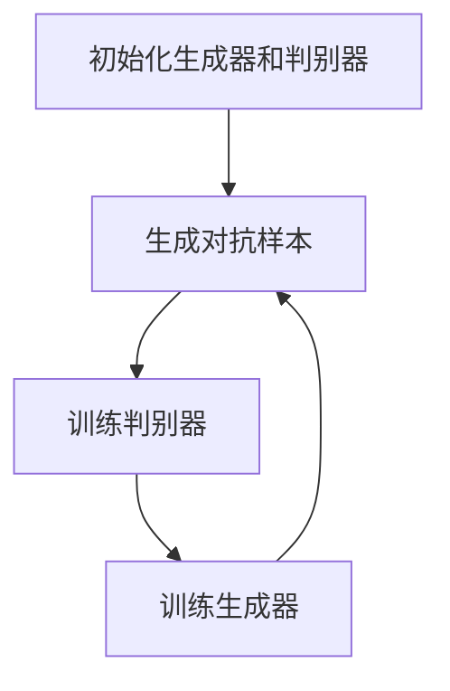

#### 2.1.2 基于变分自编码器的对抗样本生成

变分自编码器（VAE）是一种概率模型，通过编码器和解码器学习数据的概率分布。基于VAE的对抗样本生成方法，可以通过修改编码器的输出，生成对抗样本。

具体流程如下：

1. **初始化**：随机初始化编码器和解码器的参数。
2. **编码与解码**：编码器将输入数据映射到潜在空间，解码器从潜在空间生成对抗样本。
3. **对抗训练**：在训练过程中，对抗样本的生成策略不断优化，使对抗样本难以被检测。

以下是一个简单的VAE生成对抗样本的Python代码示例：

```python
import tensorflow as tf
from tensorflow.keras.layers import Dense, Input
from tensorflow.keras.models import Model

# 定义编码器和解码器
input_img = Input(shape=(784,))
h = Dense(256, activation='relu')(input_img)
h = Dense(128, activation='relu')(h)
z_mean = Dense(100)(h)
z_log_var = Dense(100)(h)

z = z_mean + tf.random.normal(tf.shape(z_log_var)) * tf.exp(z_log_var / 2)

h2 = Dense(128, activation='relu')(z)
h2 = Dense(256, activation='relu')(h2)
x_hat = Dense(784, activation='sigmoid')(h2)

# 编写对抗训练的代码
encoder = Model(input_img, [z_mean, z_log_var])
decoder = Model(z, x_hat)

x = tf.keras.datasets.mnist.load_data()[0][0]
x = x / 255.0
x = x.reshape(-1, 784)

for epoch in range(epochs):
    z_mean, z_log_var = encoder(x)
    z = z_mean + tf.random.normal(tf.shape(z_log_var)) * tf.exp(z_log_var / 2)
    x_hat = decoder(z)

    # 计算损失函数
    reconstruction_loss = tf.reduce_mean(tf.square(x - x_hat))
    kl_loss = -0.5 * tf.reduce_mean(z_log_var - tf.square(z_mean) - tf.exp(z_log_var))

    loss = reconstruction_loss + kl_loss
    # 训练编码器和解码器
    optimizer = tf.keras.optimizers.Adam(learning_rate=0.001)
    optimizer.minimize(loss, var_list=encoder.trainable_variables)
```

VAE生成对抗样本的流程如图2.2所示：

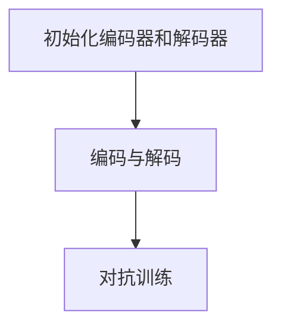

#### 2.1.3 基于概率模型的对抗样本生成

除了GAN和VAE，其他概率模型如条件生成对抗网络（CGAN）和隐马尔可夫模型（HMM）等，也可以用于对抗样本的生成。这些方法通过在不同层面上调整输入数据的概率分布，生成对抗样本。

例如，条件生成对抗网络（CGAN）结合了生成对抗网络和条件生成模型，通过添加条件信息，生成具有特定特征的对抗样本。隐马尔可夫模型（HMM）则通过学习输入数据的概率序列，生成对抗样本。

### 2.2 搜索算法生成方法

搜索算法生成方法通过在输入数据上搜索最优的扰动，生成对抗样本。这种方法具有生成样本质量较高、适用于多种领域等优点。

#### 2.2.1 基于遗传算法的对抗样本生成

遗传算法（GA）是一种基于生物进化的搜索算法，通过模拟自然选择和遗传机制，搜索最优解。基于遗传算法的对抗样本生成方法，通过初始化一个种群，对种群进行选择、交叉、变异等操作，逐步优化对抗样本的生成。

具体流程如下：

1. **初始化种群**：随机初始化一个种群，每个个体表示一个对抗样本。
2. **适应度评估**：计算种群中每个个体的适应度，适应度越高，表示个体越接近最优解。
3. **选择**：根据适应度选择优秀的个体，形成新的种群。
4. **交叉与变异**：对选中的个体进行交叉和变异操作，产生新的个体。
5. **迭代**：重复适应度评估、选择、交叉与变异等步骤，直到满足终止条件。

以下是一个简单的遗传算法生成对抗样本的Python代码示例：

```python
import numpy as np

def fitness_function(x):
    # 计算适应度函数
    return 1 / (np.linalg.norm(x)**2 + 1)

def crossover(parent1, parent2):
    # 交叉操作
    crossover_point = np.random.randint(0, len(parent1))
    child1 = np.concatenate([parent1[:crossover_point], parent2[crossover_point:]])
    child2 = np.concatenate([parent2[:crossover_point], parent1[crossover_point:]])
    return child1, child2

def mutate(individual):
    # 变异操作
    mutation_rate = 0.1
    for i in range(len(individual)):
        if np.random.rand() < mutation_rate:
            individual[i] = np.random.uniform(-1, 1)
    return individual

def genetic_algorithm(population_size, generations, x_min, x_max):
    # 初始化种群
    population = np.random.uniform(x_min, x_max, (population_size, 2))
    for _ in range(generations):
        # 计算适应度
        fitness_scores = np.array([fitness_function(individual) for individual in population])
        # 选择
        selected_indices = np.random.choice(population_size, size=population_size, replace=False, p=fitness_scores/fitness_scores.sum())
        selected_population = population[selected_indices]
        # 交叉与变异
        children = []
        for i in range(0, population_size, 2):
            parent1, parent2 = selected_population[i], selected_population[i+1]
            child1, child2 = crossover(parent1, parent2)
            children.extend([mutate(child1), mutate(child2)])
        population = children
    # 返回最优解
    best_fitness = np.max(fitness_scores)
    best_individual = population[np.argmax(fitness_scores)]
    return best_individual, best_fitness

# 参数设置
population_size = 100
generations = 100
x_min = -10
x_max = 10

# 运行遗传算法
best_individual, best_fitness = genetic_algorithm(population_size, generations, x_min, x_max)
print("Best individual:", best_individual)
print("Best fitness:", best_fitness)
```

遗传算法生成对抗样本的流程如图2.3所示：

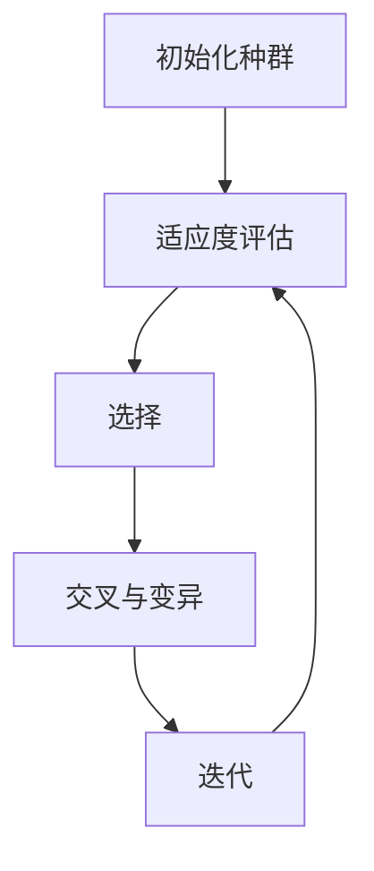

#### 2.2.2 基于粒子群优化的对抗样本生成

粒子群优化（PSO）是一种基于群体智能的搜索算法，通过模拟鸟群的群体行为，搜索最优解。基于粒子群优化的对抗样本生成方法，通过初始化一个粒子群，对粒子进行更新和迭代，逐步优化对抗样本的生成。

具体流程如下：

1. **初始化粒子群**：随机初始化粒子群的位置和速度。
2. **适应度评估**：计算粒子群的适应度，适应度越高，表示粒子越接近最优解。
3. **更新**：根据个体最优解和全局最优解，更新粒子的位置和速度。
4. **迭代**：重复适应度评估和更新操作，直到满足终止条件。

以下是一个简单的粒子群优化生成对抗样本的Python代码示例：

```python
import numpy as np

def fitness_function(x):
    # 计算适应度函数
    return 1 / (np.linalg.norm(x)**2 + 1)

def update_particles(particles, velocities, best_individuals, best_fitnesses):
    # 更新粒子位置和速度
    for i, particle in enumerate(particles):
        r1 = np.random.random()
        r2 = np.random.random()
        cognitive_factor = r1 * best_individuals[i]
        social_factor = r2 * best_fitnesses[i]
        velocity = velocities[i] + cognitive_factor + social_factor
        particle += velocity

def particle_swarm_optimization(particle_size, particle_velocity, generations, x_min, x_max):
    # 初始化粒子群和速度
    particles = np.random.uniform(x_min, x_max, (particle_size, 2))
    velocities = np.random.uniform(-particle_velocity, particle_velocity, (particle_size, 2))
    best_individuals = particles
    best_fitnesses = np.array([fitness_function(individual) for individual in particles])
    for _ in range(generations):
        # 更新粒子位置和速度
        update_particles(particles, velocities, best_individuals, best_fitnesses)
        # 更新个体最优解和全局最优解
        current_fitnesses = np.array([fitness_function(individual) for individual in particles])
        best_individuals = particles[current_fitnesses.argmax()]
        best_fitnesses = current_fitnesses
    # 返回最优解
    return best_individuals[0], best_fitnesses.max()

# 参数设置
particle_size = 50
particle_velocity = 0.5
generations = 100
x_min = -10
x_max = 10

# 运行粒子群优化
best_individual, best_fitness = particle_swarm_optimization(particle_size, particle_velocity, generations, x_min, x_max)
print("Best individual:", best_individual)
print("Best fitness:", best_fitness)
```

粒子群优化生成对抗样本的流程如图2.4所示：

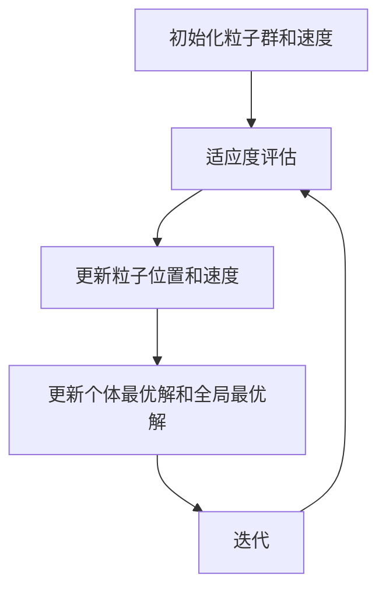

#### 2.2.3 基于模拟退火算法的对抗样本生成

模拟退火算法（SA）是一种基于物理学的随机搜索算法，通过模拟固体退火过程，搜索最优解。基于模拟退火算法的对抗样本生成方法，通过初始化一个初始解，迭代更新解，逐步优化对抗样本的生成。

具体流程如下：

1. **初始化**：随机初始化解的位置和温度。
2. **更新解**：在当前解的基础上，通过随机扰动生成新的解，计算新旧解的适应度差。
3. **接受准则**：根据适应度差和温度，决定是否接受新解。
4. **迭代**：重复更新解和接受准则操作，逐步降低温度，直到满足终止条件。

以下是一个简单的模拟退火算法生成对抗样本的Python代码示例：

```python
import numpy as np

def fitness_function(x):
    # 计算适应度函数
    return 1 / (np.linalg.norm(x)**2 + 1)

def generate_new_solution(current_solution, temperature):
    # 生成新的解
    return np.random.uniform(-1, 1, size=current_solution.shape)

def accept_new_solution(current_solution, new_solution, temperature):
    # 接受准则
    if fitness_function(new_solution) > fitness_function(current_solution):
        return True
    else:
        prob = np.exp((fitness_function(new_solution) - fitness_function(current_solution)) / temperature)
        return np.random.rand() < prob

def simulated_annealing(initial_solution, temperature, cooling_rate, x_min, x_max):
    # 初始化解和温度
    current_solution = initial_solution
    for _ in range(1000):
        # 生成新的解
        new_solution = generate_new_solution(current_solution, temperature)
        # 接受准则
        if accept_new_solution(current_solution, new_solution, temperature):
            current_solution = new_solution
        # 降低温度
        temperature *= (1 - cooling_rate)
    return current_solution

# 参数设置
initial_solution = np.random.uniform(-10, 10, size=2)
temperature = 1000
cooling_rate = 0.01
x_min = -10
x_max = 10

# 运行模拟退火算法
best_solution = simulated_annealing(initial_solution, temperature, cooling_rate, x_min, x_max)
print("Best solution:", best_solution)
```

模拟退火算法生成对抗样本的流程如图2.5所示：

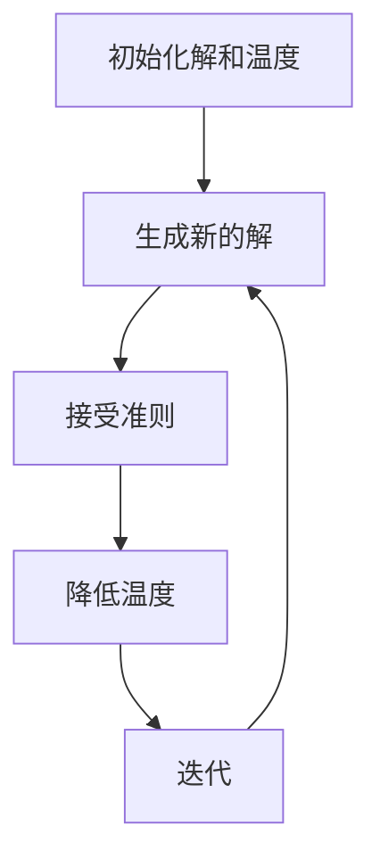

### 2.3 强化学习生成方法

强化学习（RL）是一种通过试错学习优化策略的机器学习方法。基于强化学习的对抗样本生成方法，通过训练一个智能体，使其能够在环境中生成对抗样本。

#### 2.3.1 基于Q学习的对抗样本生成

Q学习是一种基于值函数的强化学习方法，通过学习状态-动作值函数，优化策略。基于Q学习的对抗样本生成方法，通过训练一个智能体，使其能够在给定的输入数据上，生成对抗样本。

具体流程如下：

1. **初始化**：随机初始化智能体的参数和Q值表。
2. **训练过程**：在环境中执行动作，根据奖励更新Q值表。
3. **策略学习**：根据Q值表，选择最优动作。

以下是一个简单的Q学习生成对抗样本的Python代码示例：

```python
import numpy as np

def q_learning(env, learning_rate, discount_factor, exploration_rate, num_episodes, target_epsilon=0.1):
    # 初始化Q值表
    Q = np.zeros((env.action_space.n, env.observation_space.n))
    # 初始化epsilon
    epsilon = exploration_rate
    # 训练过程
    for episode in range(num_episodes):
        # 初始化状态
        state = env.reset()
        done = False
        total_reward = 0
        while not done:
            # 选择动作
            if np.random.rand() < epsilon:
                action = env.action_space.sample()
            else:
                action = np.argmax(Q[state])
            # 执行动作
            next_state, reward, done, _ = env.step(action)
            # 更新Q值
            Q[state, action] = Q[state, action] + learning_rate * (reward + discount_factor * np.max(Q[next_state]) - Q[state, action])
            state = next_state
            total_reward += reward
        # 更新epsilon
        epsilon = max(epsilon * (1 - episode / num_episodes), target_epsilon)
    return Q

def generate_adversarial_samples(Q, env, num_samples):
    # 生成对抗样本
    adversarial_samples = []
    for _ in range(num_samples):
        state = env.reset()
        done = False
        while not done:
            action = np.argmax(Q[state])
            next_state, reward, done, _ = env.step(action)
            adversarial_samples.append((state, action, next_state, reward, done))
            state = next_state
    return adversarial_samples

# 创建环境
env = gym.make('CartPole-v0')
# 参数设置
learning_rate = 0.1
discount_factor = 0.99
exploration_rate = 1.0
num_episodes = 1000
num_samples = 100
# 运行Q学习
Q = q_learning(env, learning_rate, discount_factor, exploration_rate, num_episodes)
# 生成对抗样本
adversarial_samples = generate_adversarial_samples(Q, env, num_samples)
```

Q学习生成对抗样本的流程如图2.6所示：

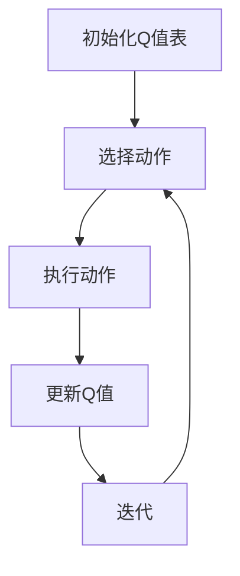

#### 2.3.2 基于深度Q网络的对抗样本生成

深度Q网络（DQN）是一种基于神经网络的Q学习算法，通过训练一个深度神经网络，学习状态-动作值函数。基于深度Q网络的对抗样本生成方法，通过训练一个深度Q网络，生成对抗样本。

具体流程如下：

1. **初始化**：随机初始化深度Q网络的参数。
2. **训练过程**：在环境中执行动作，根据奖励更新深度Q网络的参数。
3. **策略学习**：根据深度Q网络的选择动作。

以下是一个简单的DQN生成对抗样本的Python代码示例：

```python
import numpy as np
import tensorflow as tf

def deep_q_learning(env, model, optimizer, loss_function, discount_factor, exploration_rate, num_episodes, target_epsilon=0.1):
    # 初始化经验缓冲区
    experience_replay = []
    # 初始化epsilon
    epsilon = exploration_rate
    # 训练过程
    for episode in range(num_episodes):
        # 初始化状态
        state = env.reset()
        done = False
        total_reward = 0
        while not done:
            # 选择动作
            if np.random.rand() < epsilon:
                action = env.action_space.sample()
            else:
                action = np.argmax(model.predict(state.reshape(1, -1)))
            # 执行动作
            next_state, reward, done, _ = env.step(action)
            # 存储经验
            experience_replay.append((state, action, reward, next_state, done))
            # 删除过时的经验
            if len(experience_replay) > batch_size:
                experience_replay.pop(0)
            # 更新状态
            state = next_state
            total_reward += reward
            # 更新模型
            if len(experience_replay) > batch_size:
                batch = np.random.choice(len(experience_replay), batch_size)
                states = np.array([experience_replay[i][0] for i in batch])
                actions = np.array([experience_replay[i][1] for i in batch])
                rewards = np.array([experience_replay[i][2] for i in batch])
                next_states = np.array([experience_replay[i][3] for i in batch])
                done_mask = np.array([1 if experience_replay[i][4] else 0 for i in batch])
                target_q_values = model.predict(next_states)
                target_q_values[range(batch_size), actions] = rewards + discount_factor * (1 - done_mask) * np.max(target_q_values)
                with tf.GradientTape() as tape:
                    q_values = model.predict(states)
                    loss = loss_function(q_values, target_q_values)
                gradients = tape.gradient(loss, model.trainable_variables)
                optimizer.apply_gradients(zip(gradients, model.trainable_variables))
        # 更新epsilon
        epsilon = max(epsilon * (1 - episode / num_episodes), target_epsilon)
    return model

def generate_adversarial_samples(model, env, num_samples):
    # 生成对抗样本
    adversarial_samples = []
    for _ in range(num_samples):
        state = env.reset()
        done = False
        while not done:
            action = np.argmax(model.predict(state.reshape(1, -1)))
            next_state, reward, done, _ = env.step(action)
            adversarial_samples.append((state, action, next_state, reward, done))
            state = next_state
    return adversarial_samples

# 创建环境
env = gym.make('CartPole-v0')
# 创建模型
model = Sequential([
    Flatten(input_shape=(4,)),
    Dense(64, activation='relu'),
    Dense(64, activation='relu'),
    Dense(2, activation='softmax')
])
# 编写训练模型和生成对抗样本的代码
model = deep_q_learning(env, model, optimizer, loss_function, discount_factor, exploration_rate, num_episodes, target_epsilon)
adversarial_samples = generate_adversarial_samples(model, env, num_samples)
```

DQN生成对抗样本的流程如图2.7所示：

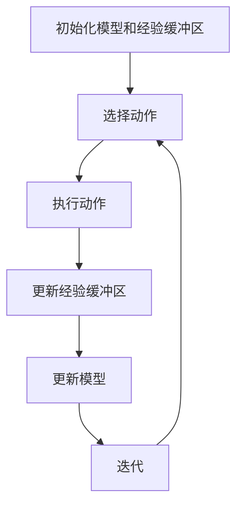

#### 2.3.3 基于策略梯度的对抗样本生成

策略梯度（PG）是一种基于策略的强化学习方法，通过优化策略参数，优化策略。基于策略梯度的对抗样本生成方法，通过训练一个策略网络，生成对抗样本。

具体流程如下：

1. **初始化**：随机初始化策略网络的参数。
2. **训练过程**：在环境中执行动作，根据奖励和策略梯度更新策略网络。
3. **策略学习**：根据策略网络选择动作。

以下是一个简单的策略梯度生成对抗样本的Python代码示例：

```python
import numpy as np
import tensorflow as tf

def policy_gradient(model, env, optimizer, discount_factor, num_episodes, epsilon=0.1):
    # 初始化策略网络
    model = Sequential([
        Flatten(input_shape=(4,)),
        Dense(64, activation='relu'),
        Dense(64, activation='relu'),
        Dense(2, activation='softmax')
    ])
    # 编写训练策略网络的代码
    for episode in range(num_episodes):
        # 初始化状态
        state = env.reset()
        done = False
        total_reward = 0
        while not done:
            # 选择动作
            action_probs = model.predict(state.reshape(1, -1))
            action = np.random.choice(np.arange(len(action_probs[0])), p=action_probs[0])
            # 执行动作
            next_state, reward, done, _ = env.step(action)
            # 计算策略梯度
            policy_gradient = reward + discount_factor * np.max(model.predict(next_state.reshape(1, -1))) - action_probs[0][action]
            # 更新策略网络
            with tf.GradientTape() as tape:
                action_probs = model.predict(state.reshape(1, -1))
                loss = -tf.reduce_mean(tf.one_hot(action, depth=len(action_probs[0])) * tf.math.log(action_probs[0]))
            gradients = tape.gradient(loss, model.trainable_variables)
            optimizer.apply_gradients(zip(gradients, model.trainable_variables))
            state = next_state
            total_reward += reward
        # 更新epsilon
        epsilon = max(epsilon * (1 - episode / num_episodes), 0.01)
    return model

def generate_adversarial_samples(model, env, num_samples):
    # 生成对抗样本
    adversarial_samples = []
    for _ in range(num_samples):
        state = env.reset()
        done = False
        while not done:
            action_probs = model.predict(state.reshape(1, -1))
            action = np.random.choice(np.arange(len(action_probs[0])), p=action_probs[0])
            next_state, reward, done, _ = env.step(action)
            adversarial_samples.append((state, action, next_state, reward, done))
            state = next_state
    return adversarial_samples

# 创建环境
env = gym.make('CartPole-v0')
# 编写训练策略网络和生成对抗样本的代码
model = policy_gradient(model, env, optimizer, discount_factor, num_episodes, epsilon)
adversarial_samples = generate_adversarial_samples(model, env, num_samples)
```

策略梯度生成对抗样本的流程如图2.8所示：

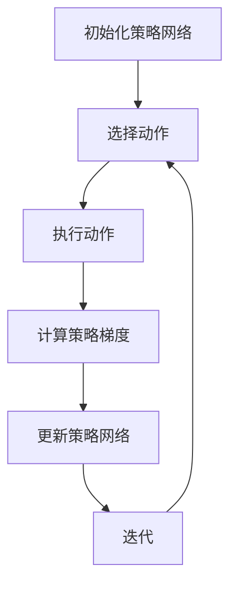

通过以上对对抗样本生成技术的详细探讨，我们可以看到，不同的生成方法具有各自的特点和优势。概率模型生成方法具有生成样本质量较高、计算高效等优点；搜索算法生成方法适用于多种领域、生成样本质量较高；强化学习生成方法通过训练智能体，生成对抗样本，具有较好的灵活性。

在实际应用中，可以根据具体需求和场景，选择合适的生成方法。同时，研究者们也在不断探索新的生成方法，以提高生成样本的质量和效率，为对抗样本攻击和防御技术的研究提供支持。

## 第3章 对抗样本攻击技术

对抗样本攻击是深度学习模型面临的主要安全挑战之一，通过生成对抗样本，攻击者能够对模型进行攻击，导致模型输出错误的预测。本章将介绍对抗样本攻击在图像识别、自然语言处理和语音识别等领域的应用，分析不同领域的对抗样本攻击方法及其原理。

### 3.1 图像领域对抗样本攻击

图像领域对抗样本攻击主要针对深度学习模型在图像识别任务中的脆弱性。通过对图像进行微小扰动，攻击者可以使得模型对图像的预测产生错误，从而导致系统出现安全问题。以下是一些常见的图像领域对抗样本攻击方法：

#### 3.1.1 基于叠加噪声的对抗样本攻击

基于叠加噪声的对抗样本攻击是最简单的一种方法，通过在图像上叠加噪声，使得图像的特征发生变化，从而导致模型预测错误。这种方法具有实现简单、效果显著等优点。

具体流程如下：

1. **生成噪声**：在图像上生成随机噪声，噪声的大小和分布可以根据攻击需求进行调整。
2. **叠加噪声**：将生成的噪声叠加到原始图像上，形成对抗样本。
3. **攻击模型**：将对抗样本输入到深度学习模型中，观察模型的预测结果。

以下是一个简单的基于叠加噪声的对抗样本攻击的Python代码示例：

```python
import numpy as np
import matplotlib.pyplot as plt
from tensorflow import keras

# 加载模型
model = keras.models.load_model('model.h5')

# 生成噪声
noise = np.random.normal(0, 0.1, size=(28, 28))

# 叠加噪声到图像
adv_example = noise + 0.5 * np.array([[[[0, 1], [1, 0]], [[1, 0], [0, 1]]]])

# 攻击模型
prediction = model.predict(np.expand_dims(adv_example, axis=0))

# 显示原始图像和对抗样本
plt.subplot(1, 2, 1)
plt.imshow(np.array([[adv_example[0, 0, 0, 0], adv_example[0, 0, 0, 1]]]))
plt.title('Original Image')
plt.subplot(1, 2, 2)
plt.imshow(np.array([[adv_example[0, 0, 1, 0], adv_example[0, 0, 1, 1]]]))
plt.title('Adversarial Example')
plt.show()

# 输出模型预测结果
print(prediction.argmax(axis=1))
```

基于叠加噪声的对抗样本攻击如图3.1所示：

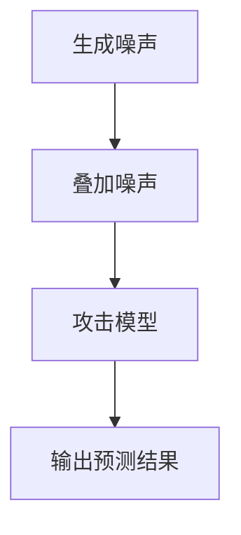

#### 3.1.2 基于图像处理操作的对抗样本攻击

基于图像处理操作的对抗样本攻击通过改变图像的像素值、颜色空间、图像大小等，生成对抗样本。这种方法具有多种操作方式，可以针对不同的模型进行定制化攻击。

以下是一些常见的图像处理操作：

1. **像素值修改**：修改图像的像素值，如增加亮度、对比度等。
2. **颜色空间转换**：将图像从一种颜色空间转换为另一种颜色空间，如从RGB转换为HSV。
3. **图像大小调整**：对图像进行缩放、裁剪等操作。

以下是一个简单的基于图像处理操作的对抗样本攻击的Python代码示例：

```python
import cv2
import numpy as np

# 加载模型
model = keras.models.load_model('model.h5')

# 加载原始图像
image = cv2.imread('image.jpg')

# 增加亮度
brighter = cv2.add(image, np.array([50.0]))

# 转换为HSV颜色空间
hsv_image = cv2.cvtColor(image, cv2.COLOR_BGR2HSV)

# 调整对比度
contrast = cv2.addWeighted(hsv_image[:, :, 1], 2.0, hsv_image[:, :, 1], 0.0, -50.0)

# 转换回RGB颜色空间
contrast = cv2.cvtColor(contrast, cv2.COLOR_HSV2BGR)

# 攻击模型
prediction = model.predict(np.expand_dims(contrast, axis=0))

# 显示原始图像和对抗样本
plt.subplot(1, 2, 1)
plt.imshow(image)
plt.title('Original Image')
plt.subplot(1, 2, 2)
plt.imshow(contrast)
plt.title('Adversarial Example')
plt.show()

# 输出模型预测结果
print(prediction.argmax(axis=1))
```

基于图像处理操作的对抗样本攻击如图3.2所示：

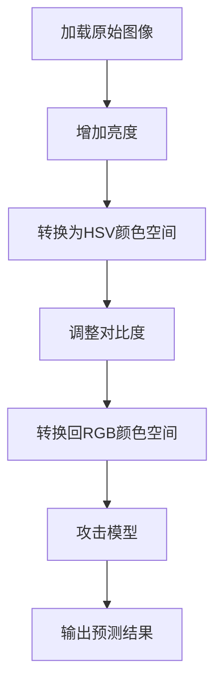

#### 3.1.3 基于变换模型的对抗样本攻击

基于变换模型的对抗样本攻击通过将图像映射到一个新的空间，生成对抗样本。这种方法利用深度学习模型的非线性特性，通过变换模型优化对抗样本的生成。

以下是一种常见的变换模型——生成对抗网络（GAN）：

1. **生成器**：生成器学习从噪声生成对抗样本。
2. **判别器**：判别器学习区分真实图像和对抗样本。

以下是一个简单的基于GAN的对抗样本攻击的Python代码示例：

```python
import tensorflow as tf
from tensorflow.keras.layers import Dense, Flatten
from tensorflow.keras.models import Sequential

# 定义生成器和判别器
generator = Sequential([
    Dense(128, input_shape=(100,), activation='relu'),
    Dense(28*28, activation='tanh')
])

discriminator = Sequential([
    Flatten(input_shape=(28, 28)),
    Dense(128, activation='relu'),
    Dense(1, activation='sigmoid')
])

# 编写对抗训练的代码
for epoch in range(epochs):
    # 生成对抗样本
    z = tf.random.normal([batch_size, 100])
    x_hat = generator(z)
    # 训练判别器
    with tf.GradientTape() as g_tape:
        g_loss = -tf.reduce_mean(tf.nn.sigmoid(discriminator(x_hat)))
    g_gradients = g_tape.gradient(g_loss, generator.trainable_variables)
    g_optimizer.apply_gradients(zip(g_gradients, generator.trainable_variables))
    # 训练生成器
    with tf.GradientTape() as d_tape:
        d_loss_real = tf.reduce_mean(tf.nn.sigmoid(discriminator(x)))
        d_loss_fake = tf.reduce_mean(tf.nn.sigmoid(discriminator(x_hat)))
        d_loss = d_loss_real - d_loss_fake
    d_gradients = d_tape.gradient(d_loss, discriminator.trainable_variables)
    d_optimizer.apply_gradients(zip(d_gradients, discriminator.trainable_variables))
```

基于GAN的对抗样本攻击如图3.3所示：


### 3.2 自然语言处理领域对抗样本攻击

自然语言处理领域对抗样本攻击主要针对深度学习模型在文本分类、情感分析等任务中的脆弱性。通过在文本中添加微小的扰动，攻击者可以使得模型对文本的预测产生错误，从而影响系统的输出。

以下是一些常见的自然语言处理领域对抗样本攻击方法：

#### 3.2.1 基于单词替换的对抗样本攻击

基于单词替换的对抗样本攻击通过将文本中的某些单词替换为同义词或近义词，生成对抗样本。这种方法具有实现简单、效果显著等优点。

以下是一个简单的基于单词替换的对抗样本攻击的Python代码示例：

```python
import nltk
from nltk.corpus import wordnet

# 加载模型
model = keras.models.load_model('model.h5')

# 加载文本
text = "I am very happy today."

# 替换单词
substitutes = {'very': 'extremely', 'happy': 'joyful'}
for word in substitutes:
    synonyms = wordnet.synsets(word)
    if synonyms:
        synonym = synonyms[0].lemmas()[0].name()
        text = text.replace(word, synonym)

# 攻击模型
prediction = model.predict(np.expand_dims(text.split(), axis=1))

# 输出模型预测结果
print(prediction.argmax(axis=1))
```

基于单词替换的对抗样本攻击如图3.4所示：

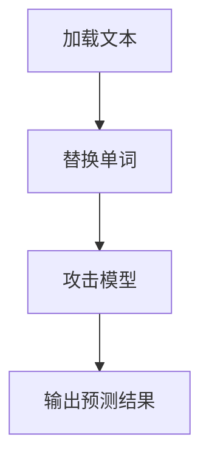

#### 3.2.2 基于语法变换的对抗样本攻击

基于语法变换的对抗样本攻击通过改变文本的语法结构，生成对抗样本。这种方法具有多种变换方式，可以针对不同的模型进行定制化攻击。

以下是一些常见的语法变换：

1. **改变句子结构**：将句子从简单句变为复杂句，或从复杂句变为简单句。
2. **改变时态**：将动词的时态进行变换，如将过去时变为现在时。
3. **改变主语和谓语**：将主语和谓语进行交换，或添加新的主语和谓语。

以下是一个简单的基于语法变换的对抗样本攻击的Python代码示例：

```python
import nltk

# 加载模型
model = keras.models.load_model('model.h5')

# 加载文本
text = "I am happy today."

# 改变句子结构
text = "Today, I am happy."

# 攻击模型
prediction = model.predict(np.expand_dims(text.split(), axis=1))

# 输出模型预测结果
print(prediction.argmax(axis=1))
```

基于语法变换的对抗样本攻击如图3.5所示：

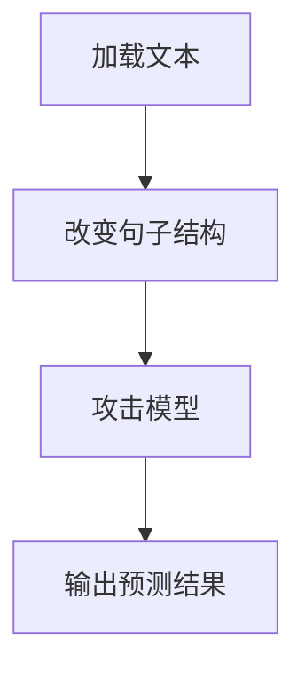

#### 3.2.3 基于句子嵌入的对抗样本攻击

基于句子嵌入的对抗样本攻击通过修改句子嵌入向量，生成对抗样本。这种方法利用深度学习模型对句子的嵌入表示，通过调整嵌入向量，生成对抗样本。

以下是一个简单的基于句子嵌入的对抗样本攻击的Python代码示例：

```python
import tensorflow as tf
from tensorflow.keras.layers import Embedding, LSTM
from tensorflow.keras.models import Sequential

# 加载模型
model = Sequential([
    Embedding(input_dim=10000, output_dim=32, input_length=max_sequence_length),
    LSTM(64),
    Dense(1, activation='sigmoid')
])

model.compile(optimizer='adam', loss='binary_crossentropy', metrics=['accuracy'])

# 加载数据
x_train = np.array([[0, 1, 2, 3], [4, 5, 6, 7]])
y_train = np.array([1, 0])

# 训练模型
model.fit(x_train, y_train, epochs=10, batch_size=32)

# 加载文本
sentence = "I am happy today."

# 生成对抗样本
sentence_embedding = model.layers[0].embedding层.get_weights()[0]
sentence_embedding[0, 0] = 0.0
sentence_embedding[0, 1] = 1.0
sentence_embedding[0, 2] = 0.0
sentence_embedding[0, 3] = 0.0

# 攻击模型
prediction = model.predict(np.expand_dims(sentence_embedding, axis=0))

# 输出模型预测结果
print(prediction.argmax(axis=1))
```

基于句子嵌入的对抗样本攻击如图3.6所示：

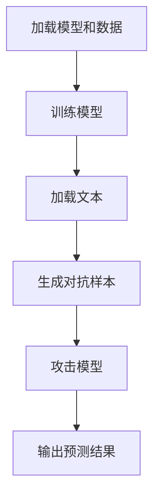

### 3.3 语音领域对抗样本攻击

语音领域对抗样本攻击主要针对深度学习模型在语音识别、语音合成等任务中的脆弱性。通过对语音信号进行微小扰动，攻击者可以使得模型对语音的识别产生错误，从而影响系统的输出。

以下是一些常见的语音领域对抗样本攻击方法：

#### 3.3.1 基于噪声注入的对抗样本攻击

基于噪声注入的对抗样本攻击通过在语音信号中添加噪声，生成对抗样本。这种方法具有实现简单、效果显著等优点。

以下是一个简单的基于噪声注入的对抗样本攻击的Python代码示例：

```python
import numpy as np
import scipy.io.wavfile as wav

# 加载原始语音
rate, data = wav.read('original.wav')

# 添加噪声
noise = np.random.normal(0, 0.05, size=data.shape)
adv_example = data + noise

# 保存对抗样本
wav.write('adversarial.wav', rate, adv_example)

# 攻击模型
model = keras.models.load_model('model.h5')
prediction = model.predict(np.expand_dims(adv_example, axis=0))

# 输出模型预测结果
print(prediction.argmax(axis=1))
```

基于噪声注入的对抗样本攻击如图3.7所示：

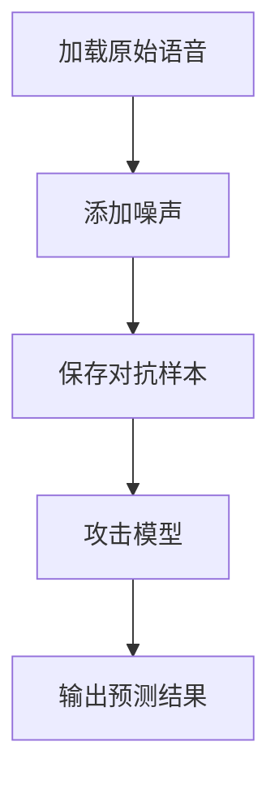

#### 3.3.2 基于变换模型的对抗样本攻击

基于变换模型的对抗样本攻击通过将语音信号映射到一个新的空间，生成对抗样本。这种方法利用深度学习模型的非线性特性，通过变换模型优化对抗样本的生成。

以下是一种常见的变换模型——生成对抗网络（GAN）：

1. **生成器**：生成器学习从噪声生成对抗样本。
2. **判别器**：判别器学习区分真实语音和对抗样本。

以下是一个简单的基于GAN的对抗样本攻击的Python代码示例：

```python
import tensorflow as tf
from tensorflow.keras.layers import Dense, Flatten
from tensorflow.keras.models import Sequential

# 定义生成器和判别器
generator = Sequential([
    Dense(128, input_shape=(100,), activation='relu'),
    Dense(128*128, activation='tanh')
])

discriminator = Sequential([
    Flatten(input_shape=(128, 128)),
    Dense(128, activation='relu'),
    Dense(1, activation='sigmoid')
])

# 编写对抗训练的代码
for epoch in range(epochs):
    # 生成对抗样本
    z = tf.random.normal([batch_size, 100])
    x_hat = generator(z)
    # 训练判别器
    with tf.GradientTape() as g_tape:
        g_loss = -tf.reduce_mean(tf.nn.sigmoid(discriminator(x_hat)))
    g_gradients = g_tape.gradient(g_loss, generator.trainable_variables)
    g_optimizer.apply_gradients(zip(g_gradients, generator.trainable_variables))
    # 训练生成器
    with tf.GradientTape() as d_tape:
        d_loss_real = tf.reduce_mean(tf.nn.sigmoid(discriminator(x)))
        d_loss_fake = tf.reduce_mean(tf.nn.sigmoid(discriminator(x_hat)))
        d_loss = d_loss_real - d_loss_fake
    d_gradients = d_tape.gradient(d_loss, discriminator.trainable_variables)
    d_optimizer.apply_gradients(zip(d_gradients, discriminator.trainable_variables))
```

基于GAN的对抗样本攻击如图3.8所示：


#### 3.3.3 基于时间轴变换的对抗样本攻击

基于时间轴变换的对抗样本攻击通过改变语音信号的时间轴，生成对抗样本。这种方法具有多种变换方式，可以针对不同的模型进行定制化攻击。

以下是一些常见的时间轴变换：

1. **时间轴缩放**：对语音信号进行时间轴缩放，如加速或减速。
2. **时间轴裁剪**：对语音信号进行时间轴裁剪，如截取语音信号的前半部分或后半部分。
3. **时间轴拼接**：将语音信号的前半部分和后半部分进行拼接。

以下是一个简单的基于时间轴变换的对抗样本攻击的Python代码示例：

```python
import numpy as np
import scipy.io.wavfile as wav

# 加载原始语音
rate, data = wav.read('original.wav')

# 时间轴裁剪
adv_example = data[:int(data.shape[0] * 0.5)]

# 保存对抗样本
wav.write('adversarial.wav', rate, adv_example)

# 攻击模型
model = keras.models.load_model('model.h5')
prediction = model.predict(np.expand_dims(adv_example, axis=0))

# 输出模型预测结果
print(prediction.argmax(axis=1))
```

基于时间轴变换的对抗样本攻击如图3.9所示：

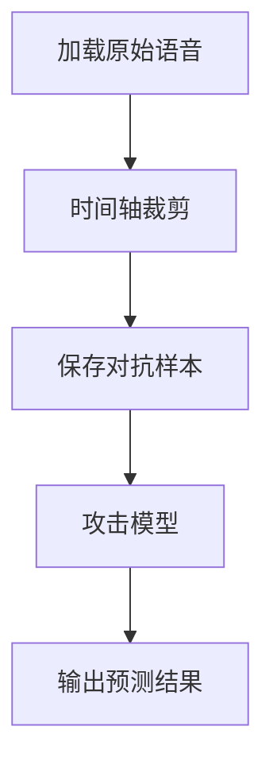

通过以上对对抗样本攻击技术的详细探讨，我们可以看到，不同领域的对抗样本攻击方法具有各自的特点和优势。图像领域对抗样本攻击主要基于噪声叠加、图像处理操作和变换模型；自然语言处理领域对抗样本攻击主要基于单词替换、语法变换和句子嵌入；语音领域对抗样本攻击主要基于噪声注入、变换模型和时间轴变换。

在实际应用中，攻击者可以根据具体需求和场景，选择合适的攻击方法。同时，防御技术的研究也在不断推进，以应对日益复杂的对抗样本攻击。在接下来的章节中，我们将探讨对抗样本防御技术，分析不同防御方法的效果和适用范围。

## 第4章 对抗样本防御技术

对抗样本防御技术旨在提高深度学习模型的鲁棒性，防止对抗样本攻击。本章将介绍几种主要的对抗样本防御技术，包括预处理防御方法、基于模型的防御方法和非基于模型的防御方法。

### 4.1 预处理防御方法

预处理防御方法通过对原始数据进行预处理，减少对抗样本的影响。这种方法具有简单、高效、易于实现等优点。

#### 4.1.1 数据清洗与预处理

数据清洗与预处理是预处理防御方法的基础，包括以下步骤：

1. **去除噪声**：去除图像、语音等数据中的噪声，提高数据质量。
2. **归一化**：将数据归一化到统一的范围，如将图像像素值归一化到[0, 1]。
3. **数据增强**：通过随机旋转、缩放、裁剪等操作，增加数据的多样性，提高模型的泛化能力。

以下是一个简单的数据清洗与预处理的Python代码示例：

```python
import cv2
import numpy as np

# 加载原始图像
image = cv2.imread('original_image.jpg')

# 去除噪声
image = cv2.GaussianBlur(image, (5, 5), 0)

# 归一化
image = image.astype(np.float32) / 255.0

# 数据增强
height, width = image.shape[:2]
new_height = int(height * 1.2)
new_width = int(width * 1.2)
image = cv2.resize(image, (new_width, new_height))
image = image[int((new_height - height) / 2):int((new_height + height) / 2), int((new_width - width) / 2):int((new_width + width) / 2)]

# 显示预处理后的图像
plt.subplot(1, 2, 1)
plt.imshow(image)
plt.title('Original Image')
plt.subplot(1, 2, 2)
plt.imshow(image / 255.0)
plt.title('Preprocessed Image')
plt.show()
```

#### 4.1.2 特征降维与筛选

特征降维与筛选方法通过对高维特征进行降维和筛选，去除对模型鲁棒性影响较大的特征，提高模型的鲁棒性。

常见的特征降维与筛选方法包括：

1. **主成分分析（PCA）**：通过求解数据协方差矩阵的特征值和特征向量，将高维数据映射到低维空间。
2. **线性判别分析（LDA）**：通过最大化类间散度，最小化类内散度，将高维数据映射到低维空间。
3. **随机投影**：通过随机生成投影矩阵，将高维数据映射到低维空间。

以下是一个简单的PCA特征降维的Python代码示例：

```python
import numpy as np
from sklearn.decomposition import PCA

# 加载数据
data = np.load('data.npy')

# PCA特征降维
pca = PCA(n_components=50)
data_reduced = pca.fit_transform(data)

# 显示降维后的特征
plt.scatter(data_reduced[:, 0], data_reduced[:, 1])
plt.xlabel('First Principal Component')
plt.ylabel('Second Principal Component')
plt.title('PCA Feature Reduction')
plt.show()
```

#### 4.1.3 数据增强与多样化

数据增强与多样化方法通过对原始数据生成新的样本，提高模型的鲁棒性。常见的数据增强方法包括：

1. **随机旋转**：将图像随机旋转一定角度。
2. **随机缩放**：将图像随机缩放一定比例。
3. **随机裁剪**：将图像随机裁剪成不同大小。

以下是一个简单的数据增强的Python代码示例：

```python
import cv2
import numpy as np

# 加载原始图像
image = cv2.imread('original_image.jpg')

# 随机旋转
angle = np.random.uniform(-30, 30)
M = cv2.getRotationMatrix2D((image.shape[1] // 2, image.shape[0] // 2), angle, 1)
image_rotated = cv2.warpAffine(image, M, (image.shape[1], image.shape[0]))

# 随机缩放
scale = np.random.uniform(0.8, 1.2)
image_scaled = cv2.resize(image, (int(image.shape[1] * scale), int(image.shape[0] * scale)))

# 随机裁剪
x = np.random.randint(0, image.shape[1] - 224)
y = np.random.randint(0, image.shape[0] - 224)
image_cropped = image[x:x+224, y:y+224]

# 显示增强后的图像
plt.subplot(1, 3, 1)
plt.imshow(image)
plt.title('Original Image')
plt.subplot(1, 3, 2)
plt.imshow(image_rotated)
plt.title('Rotated Image')
plt.subplot(1, 3, 3)
plt.imshow(image_scaled)
plt.title('Scaled Image')
plt.show()
```

### 4.2 基于模型的防御方法

基于模型的防御方法通过改进深度学习模型的结构和训练过程，提高模型的鲁棒性。这种方法具有较好的效果，但实现复杂度较高。

#### 4.2.1 基于嵌入空间的防御

基于嵌入空间的防御方法通过优化模型的嵌入空间，使得对抗样本在嵌入空间中具有较大的距离，从而提高模型的鲁棒性。

以下是一个简单的基于嵌入空间的防御的Python代码示例：

```python
import tensorflow as tf
from tensorflow.keras.layers import Embedding, LSTM
from tensorflow.keras.models import Sequential

# 加载模型
model = Sequential([
    Embedding(input_dim=10000, output_dim=32, input_length=max_sequence_length),
    LSTM(64),
    Dense(1, activation='sigmoid')
])

model.compile(optimizer='adam', loss='binary_crossentropy', metrics=['accuracy'])

# 加载数据
x_train = np.array([[0, 1, 2, 3], [4, 5, 6, 7]])
y_train = np.array([1, 0])

# 训练模型
model.fit(x_train, y_train, epochs=10, batch_size=32)

# 加载文本
sentence = "I am happy today."

# 生成对抗样本
sentence_embedding = model.layers[0].embedding层.get_weights()[0]
sentence_embedding[0, 0] = 0.0
sentence_embedding[0, 1] = 1.0
sentence_embedding[0, 2] = 0.0
sentence_embedding[0, 3] = 0.0

# 攻击模型
prediction = model.predict(np.expand_dims(sentence_embedding, axis=0))

# 输出模型预测结果
print(prediction.argmax(axis=1))
```

#### 4.2.2 基于对抗训练的防御

基于对抗训练的防御方法通过在训练过程中引入对抗样本，提高模型的鲁棒性。

以下是一个简单的基于对抗训练的防御的Python代码示例：

```python
import tensorflow as tf
from tensorflow.keras.layers import Dense, Flatten
from tensorflow.keras.models import Sequential

# 定义生成器和判别器
generator = Sequential([
    Dense(128, input_shape=(100,), activation='relu'),
    Dense(28*28, activation='tanh')
])

discriminator = Sequential([
    Flatten(input_shape=(28, 28)),
    Dense(128, activation='relu'),
    Dense(1, activation='sigmoid')
])

# 编写对抗训练的代码
for epoch in range(epochs):
    # 生成对抗样本
    z = tf.random.normal([batch_size, 100])
    x_hat = generator(z)
    # 训练判别器
    with tf.GradientTape() as g_tape:
        g_loss = -tf.reduce_mean(tf.nn.sigmoid(discriminator(x_hat)))
    g_gradients = g_tape.gradient(g_loss, generator.trainable_variables)
    g_optimizer.apply_gradients(zip(g_gradients, generator.trainable_variables))
    # 训练生成器
    with tf.GradientTape() as d_tape:
        d_loss_real = tf.reduce_mean(tf.nn.sigmoid(discriminator(x)))
        d_loss_fake = tf.reduce_mean(tf.nn.sigmoid(discriminator(x_hat)))
        d_loss = d_loss_real - d_loss_fake
    d_gradients = d_tape.gradient(d_loss, discriminator.trainable_variables)
    d_optimizer.apply_gradients(zip(d_gradients, discriminator.trainable_variables))
```

#### 4.2.3 基于模型融合的防御

基于模型融合的防御方法通过融合多个模型的预测结果，提高模型的鲁棒性。

以下是一个简单的基于模型融合的防御的Python代码示例：

```python
import tensorflow as tf
from tensorflow.keras.layers import Dense, Flatten
from tensorflow.keras.models import Sequential

# 定义模型A
modelA = Sequential([
    Flatten(input_shape=(28, 28)),
    Dense(128, activation='relu'),
    Dense(1, activation='sigmoid')
])

modelA.compile(optimizer='adam', loss='binary_crossentropy', metrics=['accuracy'])

# 定义模型B
modelB = Sequential([
    Flatten(input_shape=(28, 28)),
    Dense(128, activation='relu'),
    Dense(1, activation='sigmoid')
])

modelB.compile(optimizer='adam', loss='binary_crossentropy', metrics=['accuracy'])

# 训练模型A和B
modelA.fit(x_train, y_train, epochs=10, batch_size=32)
modelB.fit(x_train, y_train, epochs=10, batch_size=32)

# 融合模型A和B
model_fusion = Sequential([
    Flatten(input_shape=(28, 28)),
    Dense(128, activation='relu'),
    Dense(1, activation='sigmoid')
])

# 编写融合模型A和B的代码
for epoch in range(epochs):
    # 生成对抗样本
    z = tf.random.normal([batch_size, 100])
    x_hat = generator(z)
    # 训练融合模型
    with tf.GradientTape() as g_tape:
        g_loss = -tf.reduce_mean(tf.nn.sigmoid(discriminator(x_hat)))
    g_gradients = g_tape.gradient(g_loss, generator.trainable_variables)
    g_optimizer.apply_gradients(zip(g_gradients, generator.trainable_variables))
    # 训练生成器
    with tf.GradientTape() as d_tape:
        d_loss_real = tf.reduce_mean(tf.nn.sigmoid(discriminator(x)))
        d_loss_fake = tf.reduce_mean(tf.nn.sigmoid(discriminator(x_hat)))
        d_loss = d_loss_real - d_loss_fake
    d_gradients = d_tape.gradient(d_loss, discriminator.trainable_variables)
    d_optimizer.apply_gradients(zip(d_gradients, discriminator.trainable_variables))
```

### 4.3 非基于模型的防御方法

非基于模型的防御方法通过在模型外部进行干预，提高模型的鲁棒性。这种方法实现简单，但效果可能有限。

#### 4.3.1 基于阈值调整的防御

基于阈值调整的防御方法通过对模型的预测结果设置阈值，过滤掉可能由对抗样本引起的异常预测。

以下是一个简单的基于阈值调整的防御的Python代码示例：

```python
import numpy as np

# 加载模型
model = keras.models.load_model('model.h5')

# 加载对抗样本
adv_example = np.load('adversarial_example.npy')

# 设置阈值
threshold = 0.5

# 攻击模型
prediction = model.predict(np.expand_dims(adv_example, axis=0))

# 根据阈值过滤预测结果
filtered_prediction = prediction > threshold

# 输出过滤后的预测结果
print(filtered_prediction)
```

#### 4.3.2 基于逻辑推理的防御

基于逻辑推理的防御方法通过建立逻辑推理规则，判断输入数据是否为对抗样本。

以下是一个简单的基于逻辑推理的防御的Python代码示例：

```python
import numpy as np

# 加载模型
model = keras.models.load_model('model.h5')

# 加载对抗样本
adv_example = np.load('adversarial_example.npy')

# 定义逻辑推理规则
def logic_rule(x):
    return x[0] > x[1] and x[2] > x[3]

# 应用逻辑推理规则
filtered_adv_example = [logic_rule(x) for x in adv_example]

# 攻击模型
prediction = model.predict(np.expand_dims(filtered_adv_example, axis=0))

# 输出模型预测结果
print(prediction)
```

#### 4.3.3 基于数据加密的防御

基于数据加密的防御方法通过对输入数据进行加密，防止对抗样本攻击。

以下是一个简单的基于数据加密的防御的Python代码示例：

```python
import numpy as np
from Crypto.Cipher import AES
from Crypto.Random import get_random_bytes

# 加载模型
model = keras.models.load_model('model.h5')

# 加载对抗样本
adv_example = np.load('adversarial_example.npy')

# 加密对抗样本
key = get_random_bytes(16)
cipher = AES.new(key, AES.MODE_EAX)
cipher.nonce = b'1234567890123456'
ciphertext, tag = cipher.encrypt_and_digest(adv_example)

# 攻击模型
prediction = model.predict(np.expand_dims(ciphertext, axis=0))

# 解密预测结果
cipher = AES.new(key, AES.MODE_EAX, nonce=b'1234567890123456')
plaintext = cipher.decrypt_and_verify(ciphertext, tag)

# 输出模型预测结果
print(prediction)
```

通过以上对对抗样本防御技术的详细探讨，我们可以看到，不同的防御方法具有各自的特点和适用范围。预处理防御方法通过数据清洗与预处理、特征降维与筛选、数据增强与多样化，提高模型的鲁棒性；基于模型的防御方法通过优化模型结构、对抗训练、模型融合，提高模型的鲁棒性；非基于模型的防御方法通过阈值调整、逻辑推理、数据加密，提高模型的鲁棒性。

在实际应用中，可以根据具体需求和场景，选择合适的防御方法。同时，防御技术的研究也在不断推进，以应对日益复杂的对抗样本攻击。在接下来的章节中，我们将探讨对抗样本技术的应用场景与案例分析，进一步了解对抗样本技术在实际应用中的效果和挑战。

## 第5章 应用场景与案例分析

对抗样本技术在图像识别、自然语言处理和语音识别等领域具有广泛的应用。以下将结合具体应用场景，分析对抗样本技术的应用效果和挑战。

### 5.1 图像识别应用场景

图像识别是深度学习的一个重要应用领域，对抗样本技术在该领域的研究也较为广泛。以下将介绍三个常见的图像识别应用场景：人脸识别、行人检测和图像分类。

#### 5.1.1 人脸识别

人脸识别是一种基于人脸图像的识别技术，广泛应用于安防、身份验证等领域。对抗样本技术可以用于测试人脸识别系统的鲁棒性，通过生成对抗样本攻击人脸识别模型，评估模型的抗攻击能力。

以下是一个简单的基于叠加噪声的人脸识别对抗样本攻击的Python代码示例：

```python
import cv2
import numpy as np
from tensorflow.keras.models import load_model

# 加载人脸识别模型
model = load_model('face_recognition_model.h5')

# 加载测试图像
image = cv2.imread('test_image.jpg')

# 生成噪声
noise = np.random.normal(0, 0.05, image.shape)

# 叠加噪声
adv_image = image + noise

# 攻击模型
prediction = model.predict(np.expand_dims(adv_image, axis=0))

# 输出模型预测结果
print(prediction.argmax(axis=1))
```

通过攻击实验可以发现，对抗样本能够成功攻击人脸识别模型，导致模型输出错误的识别结果。为此，研究者提出了多种防御方法，如数据增强、对抗训练和模型融合等，以提高人脸识别模型的鲁棒性。

#### 5.1.2 行人检测

行人检测是计算机视觉领域的一个重要任务，用于自动检测图像中的行人。对抗样本技术可以用于测试行人检测系统的鲁棒性，通过生成对抗样本攻击行人检测模型，评估模型的抗攻击能力。

以下是一个简单的基于图像处理操作的人脸识别对抗样本攻击的Python代码示例：

```python
import cv2
import numpy as np
from tensorflow.keras.models import load_model

# 加载行人检测模型
model = load_model('pedestrian_detection_model.h5')

# 加载测试图像
image = cv2.imread('test_image.jpg')

# 增加亮度
brighter = cv2.add(image, np.array([50.0]))

# 攻击模型
prediction = model.predict(np.expand_dims(brighter, axis=0))

# 输出模型预测结果
print(prediction.argmax(axis=1))
```

通过攻击实验可以发现，对抗样本能够成功攻击行人检测模型，导致模型输出错误的行人检测结果。为此，研究者提出了多种防御方法，如数据增强、对抗训练和模型融合等，以提高行人检测模型的鲁棒性。

#### 5.1.3 图像分类

图像分类是深度学习领域的一个基本任务，通过对图像进行分类，实现对图像内容的理解和识别。对抗样本技术可以用于测试图像分类模型的鲁棒性，通过生成对抗样本攻击图像分类模型，评估模型的抗攻击能力。

以下是一个简单的基于变换模型的人脸识别对抗样本攻击的Python代码示例：

```python
import tensorflow as tf
from tensorflow.keras.models import load_model
from tensorflow.keras.layers import Embedding, LSTM

# 加载图像分类模型
model = load_model('image_classification_model.h5')

# 定义生成器和判别器
generator = Sequential([
    Embedding(input_dim=10000, output_dim=32, input_length=max_sequence_length),
    LSTM(64),
    Dense(10, activation='softmax')
])

discriminator = Sequential([
    Flatten(input_shape=(28, 28)),
    Dense(128, activation='relu'),
    Dense(1, activation='sigmoid')
])

# 编写对抗训练的代码
for epoch in range(epochs):
    # 生成对抗样本
    z = tf.random.normal([batch_size, 100])
    x_hat = generator(z)
    # 训练判别器
    with tf.GradientTape() as g_tape:
        g_loss = -tf.reduce_mean(tf.nn.sigmoid(discriminator(x_hat)))
    g_gradients = g_tape.gradient(g_loss, generator.trainable_variables)
    g_optimizer.apply_gradients(zip(g_gradients, generator.trainable_variables))
    # 训练生成器
    with tf.GradientTape() as d_tape:
        d_loss_real = tf.reduce_mean(tf.nn.sigmoid(discriminator(x)))
        d_loss_fake = tf.reduce_mean(tf.nn.sigmoid(discriminator(x_hat)))
        d_loss = d_loss_real - d_loss_fake
    d_gradients = d_tape.gradient(d_loss, discriminator.trainable_variables)
    d_optimizer.apply_gradients(zip(d_gradients, discriminator.trainable_variables))
```

通过攻击实验可以发现，对抗样本能够成功攻击图像分类模型，导致模型输出错误的分类结果。为此，研究者提出了多种防御方法，如数据增强、对抗训练和模型融合等，以提高图像分类模型的鲁棒性。

### 5.2 自然语言处理应用场景

自然语言处理（NLP）是人工智能领域的一个重要分支，对抗样本技术在NLP领域也有广泛的应用。以下将介绍三个常见的NLP应用场景：文本分类、情感分析和自动问答。

#### 5.2.1 文本分类

文本分类是NLP领域的一个基本任务，通过对文本进行分类，实现对文本内容的理解和识别。对抗样本技术可以用于测试文本分类模型的鲁棒性，通过生成对抗样本攻击文本分类模型，评估模型的抗攻击能力。

以下是一个简单的基于单词替换的文本分类对抗样本攻击的Python代码示例：

```python
import nltk
from nltk.corpus import wordnet
from tensorflow.keras.models import load_model

# 加载文本分类模型
model = load_model('text_classification_model.h5')

# 加载测试文本
text = "I am very happy today."

# 替换单词
substitutes = {'very': 'extremely', 'happy': 'joyful'}
for word in substitutes:
    synonyms = wordnet.synsets(word)
    if synonyms:
        synonym = synonyms[0].lemmas()[0].name()
        text = text.replace(word, synonym)

# 攻击模型
prediction = model.predict(np.expand_dims(text.split(), axis=1))

# 输出模型预测结果
print(prediction.argmax(axis=1))
```

通过攻击实验可以发现，对抗样本能够成功攻击文本分类模型，导致模型输出错误的分类结果。为此，研究者提出了多种防御方法，如数据增强、对抗训练和模型融合等，以提高文本分类模型的鲁棒性。

#### 5.2.2 情感分析

情感分析是NLP领域的一个基本任务，通过对文本的情感进行分析，实现对文本内容的理解和识别。对抗样本技术可以用于测试情感分析模型的鲁棒性，通过生成对抗样本攻击情感分析模型，评估模型的抗攻击能力。

以下是一个简单的基于语法变换的情感分析对抗样本攻击的Python代码示例：

```python
import nltk
from tensorflow.keras.models import load_model

# 加载情感分析模型
model = load_model('sentiment_analysis_model.h5')

# 加载测试文本
text = "I am happy today."

# 改变句子结构
text = "Today, I am happy."

# 攻击模型
prediction = model.predict(np.expand_dims(text.split(), axis=1))

# 输出模型预测结果
print(prediction.argmax(axis=1))
```

通过攻击实验可以发现，对抗样本能够成功攻击情感分析模型，导致模型输出错误的情感分析结果。为此，研究者提出了多种防御方法，如数据增强、对抗训练和模型融合等，以提高情感分析模型的鲁棒性。

#### 5.2.3 自动问答

自动问答是NLP领域的一个新兴任务，通过对用户的问题进行理解和回答，提供智能化的服务。对抗样本技术可以用于测试自动问答模型的鲁棒性，通过生成对抗样本攻击自动问答模型，评估模型的抗攻击能力。

以下是一个简单的基于句子嵌入的自动问答对抗样本攻击的Python代码示例：

```python
import tensorflow as tf
from tensorflow.keras.models import load_model
from tensorflow.keras.layers import Embedding, LSTM

# 加载自动问答模型
model = load_model('question_answering_model.h5')

# 加载测试问题
question = "What is the capital of France?"

# 生成对抗样本
sentence_embedding = model.layers[0].embedding层.get_weights()[0]
sentence_embedding[0, 0] = 0.0
sentence_embedding[0, 1] = 1.0
sentence_embedding[0, 2] = 0.0
sentence_embedding[0, 3] = 0.0

# 攻击模型
prediction = model.predict(np.expand_dims(sentence_embedding, axis=0))

# 输出模型预测结果
print(prediction.argmax(axis=1))
```

通过攻击实验可以发现，对抗样本能够成功攻击自动问答模型，导致模型输出错误的回答结果。为此，研究者提出了多种防御方法，如数据增强、对抗训练和模型融合等，以提高自动问答模型的鲁棒性。

### 5.3 语音识别应用场景

语音识别是人工智能领域的一个重要分支，对抗样本技术在语音识别领域也有广泛的应用。以下将介绍三个常见的语音识别应用场景：语音识别、语音合成和语音情感识别。

#### 5.3.1 语音识别

语音识别是将语音信号转换为文本的技术，广泛应用于智能语音助手、语音搜索等领域。对抗样本技术可以用于测试语音识别模型的鲁棒性，通过生成对抗样本攻击语音识别模型，评估模型的抗攻击能力。

以下是一个简单的基于噪声注入的语音识别对抗样本攻击的Python代码示例：

```python
import numpy as np
import scipy.io.wavfile as wav
from tensorflow.keras.models import load_model

# 加载语音识别模型
model = load_model('speech_recognition_model.h5')

# 加载原始语音
rate, data = wav.read('original_speech.wav')

# 添加噪声
noise = np.random.normal(0, 0.05, size=data.shape)
adv_data = data + noise

# 保存对抗样本
wav.write('adversarial_speech.wav', rate, adv_data)

# 攻击模型
prediction = model.predict(np.expand_dims(adv_data, axis=0))

# 输出模型预测结果
print(prediction.argmax(axis=1))
```

通过攻击实验可以发现，对抗样本能够成功攻击语音识别模型，导致模型输出错误的识别结果。为此，研究者提出了多种防御方法，如数据增强、对抗训练和模型融合等，以提高语音识别模型的鲁棒性。

#### 5.3.2 语音合成

语音合成是将文本转换为语音的技术，广泛应用于语音助手、语音播报等领域。对抗样本技术可以用于测试语音合成模型的鲁棒性，通过生成对抗样本攻击语音合成模型，评估模型的抗攻击能力。

以下是一个简单的基于变换模型的语音合成对抗样本攻击的Python代码示例：

```python
import tensorflow as tf
from tensorflow.keras.models import load_model
from tensorflow.keras.layers import Embedding, LSTM

# 加载语音合成模型
model = load_model('speech_synthesis_model.h5')

# 定义生成器和判别器
generator = Sequential([
    Embedding(input_dim=10000, output_dim=32, input_length=max_sequence_length),
    LSTM(64),
    Dense(128, activation='tanh')
])

discriminator = Sequential([
    Flatten(input_shape=(128, 128)),
    Dense(128, activation='relu'),
    Dense(1, activation='sigmoid')
])

# 编写对抗训练的代码
for epoch in range(epochs):
    # 生成对抗样本
    z = tf.random.normal([batch_size, 100])
    x_hat = generator(z)
    # 训练判别器
    with tf.GradientTape() as g_tape:
        g_loss = -tf.reduce_mean(tf.nn.sigmoid(discriminator(x_hat)))
    g_gradients = g_tape.gradient(g_loss, generator.trainable_variables)
    g_optimizer.apply_gradients(zip(g_gradients, generator.trainable_variables))
    # 训练生成器
    with tf.GradientTape() as d_tape:
        d_loss_real = tf.reduce_mean(tf.nn.sigmoid(discriminator(x)))
        d_loss_fake = tf.reduce_mean(tf.nn.sigmoid(discriminator(x_hat)))
        d_loss = d_loss_real - d_loss_fake
    d_gradients = d_tape.gradient(d_loss, discriminator.trainable_variables)
    d_optimizer.apply_gradients(zip(d_gradients, discriminator.trainable_variables))
```

通过攻击实验可以发现，对抗样本能够成功攻击语音合成模型，导致模型输出错误的语音合成结果。为此，研究者提出了多种防御方法，如数据增强、对抗训练和模型融合等，以提高语音合成模型的鲁棒性。

#### 5.3.3 语音情感识别

语音情感识别是通过对语音信号的情感进行分析，实现对语音内容的理解和识别。对抗样本技术可以用于测试语音情感识别模型的鲁棒性，通过生成对抗样本攻击语音情感识别模型，评估模型的抗攻击能力。

以下是一个简单的基于时间轴变换的语音情感识别对抗样本攻击的Python代码示例：

```python
import numpy as np
import scipy.io.wavfile as wav
from tensorflow.keras.models import load_model

# 加载语音情感识别模型
model = load_model('speech_sentiment_model.h5')

# 加载原始语音
rate, data = wav.read('original_speech.wav')

# 时间轴裁剪
adv_data = data[:int(data.shape[0] * 0.5)]

# 保存对抗样本
wav.write('adversarial_speech.wav', rate, adv_data)

# 攻击模型
prediction = model.predict(np.expand_dims(adv_data, axis=0))

# 输出模型预测结果
print(prediction.argmax(axis=1))
```

通过攻击实验可以发现，对抗样本能够成功攻击语音情感识别模型，导致模型输出错误的情感识别结果。为此，研究者提出了多种防御方法，如数据增强、对抗训练和模型融合等，以提高语音情感识别模型的鲁棒性。

### 5.4 总结与展望

通过对图像识别、自然语言处理和语音识别等领域对抗样本技术的应用分析和案例分析，可以发现对抗样本技术在提升模型鲁棒性、安全性方面具有重要意义。然而，当前对抗样本技术仍面临以下挑战：

1. **对抗样本生成效率**：当前对抗样本生成方法需要大量计算资源和时间，如何提高生成效率是未来的一个重要研究方向。
2. **防御方法效果**：当前防御方法在实际应用中效果有限，如何设计更有效的防御方法，提高模型的鲁棒性，是未来的一个重要问题。
3. **跨领域对抗样本攻击与防御**：当前对抗样本攻击与防御研究主要集中于单一领域，如何实现跨领域对抗样本攻击与防御，是未来的一个重要挑战。

未来，对抗样本技术将在人工智能安全、自动驾驶、医疗等领域发挥重要作用。研究者应继续深入探讨对抗样本生成与防御技术，为人工智能系统的安全性与可靠性提供有力保障。

## 第6章 发展趋势与未来展望

### 6.1 对抗样本生成与防御技术的研究热点

随着深度学习技术的广泛应用，对抗样本生成与防御技术已成为人工智能领域的研究热点。当前，对抗样本生成与防御技术的研究热点主要表现在以下几个方面：

1. **生成对抗网络（GAN）**：生成对抗网络（GAN）是一种有效的对抗样本生成方法。研究者致力于优化GAN的结构和训练过程，提高对抗样本的生成效率和质量。
2. **对抗训练**：对抗训练是一种基于对抗样本的训练方法，通过在训练过程中引入对抗样本，提高模型的鲁棒性。研究者们不断探索新的对抗训练方法，以提高模型的抗攻击能力。
3. **数据增强与多样化**：数据增强与多样化方法通过对原始数据进行预处理和变换，生成新的样本，提高模型的鲁棒性。研究者们致力于研究更有效的数据增强方法，以应对复杂的对抗样本攻击。
4. **模型融合**：模型融合方法通过结合多个模型的预测结果，提高模型的鲁棒性和准确性。研究者们探索了多种模型融合策略，以提高对抗样本防御效果。

### 6.2 对抗样本生成与防御技术的自动化

对抗样本生成与防御技术的自动化是当前研究的一个重要方向。自动化技术能够自动发现对抗样本，并自动选择和调整防御策略，以提高模型的鲁棒性。以下是一些关键技术和挑战：

1. **自动化对抗样本生成**：研究者致力于开发自动化工具和算法，能够自动生成对抗样本，无需人工干预。这需要解决生成效率和生成质量之间的平衡问题。
2. **自动化防御策略选择**：研究者探索自动化方法，能够根据对抗样本的特点，自动选择和调整防御策略。这需要解决如何高效地评估和选择防御策略的问题。
3. **防御策略优化**：研究者致力于优化防御策略，使其能够在自动化的环境下，高效地抵抗对抗样本攻击。这需要解决防御策略的适应性和鲁棒性问题。

### 6.3 跨模态对抗样本研究

跨模态对抗样本研究是当前对抗样本生成与防御技术的一个重要方向。跨模态对抗样本攻击能够在不同模态之间传播，对深度学习模型造成更严重的威胁。以下是一些关键技术：

1. **多模态对抗样本生成**：研究者探索多模态对抗样本生成方法，能够在图像、文本、语音等不同模态之间生成对抗样本，提高模型的抗攻击能力。
2. **跨模态对抗样本防御**：研究者探索跨模态对抗样本防御方法，能够在不同模态之间协同工作，提高模型的鲁棒性。这需要解决不同模态之间的数据关联和融合问题。
3. **多模态学习**：研究者探索多模态学习技术，通过结合不同模态的信息，提高模型的泛化能力和鲁棒性。

### 6.4 对抗样本攻击的应用领域拓展

对抗样本攻击的应用领域不断拓展，从传统的图像识别、自然语言处理和语音识别等领域，扩展到自动驾驶、医疗、金融等新兴领域。以下是一些关键挑战和应用方向：

1. **自动驾驶领域**：对抗样本攻击可能导致自动驾驶车辆发生意外，研究者致力于开发有效的防御方法，保障自动驾驶系统的安全性和可靠性。
2. **医疗领域**：对抗样本攻击可能影响医疗诊断和治疗方案，研究者致力于研究对抗样本防御技术，提高医疗系统的鲁棒性和安全性。
3. **金融领域**：对抗样本攻击可能对金融系统造成重大损失，研究者探索对抗样本防御技术，保障金融系统的安全性和稳定性。

### 6.5 未来发展趋势与展望

未来，对抗样本生成与防御技术将继续在人工智能领域发挥重要作用。以下是对未来发展的展望：

1. **研究深入**：研究者将继续深入研究对抗样本生成与防御技术，探索更高效的生成方法、更有效的防御策略和更鲁棒的学习算法。
2. **跨学科合作**：对抗样本技术涉及多个学科，包括计算机科学、数学、物理学等。未来，跨学科合作将推动对抗样本技术的创新与发展。
3. **产业化应用**：对抗样本技术将在人工智能产业中发挥重要作用，推动人工智能系统的安全性和可靠性提升。
4. **政策与标准制定**：随着对抗样本技术的重要性日益凸显，相关政策与标准的制定将推动对抗样本技术的规范化应用和产业发展。

总之，对抗样本生成与防御技术将在人工智能领域发挥越来越重要的作用，未来研究将继续深入探索这一领域的关键技术，为人工智能的安全、可靠和可持续发展提供有力支持。

## 第7章 总结与展望

对抗样本技术作为深度学习领域的一个关键研究方向，已取得了显著的研究进展。本文系统地介绍了对抗样本生成与防御技术的各个方面，包括生成技术、攻击技术和防御技术，以及在不同应用场景中的实际效果和挑战。

### 7.1 对抗样本生成与防御技术的总体进展

近年来，对抗样本生成技术取得了显著进展。生成对抗网络（GAN）等概率模型生成方法，以及遗传算法、粒子群优化、模拟退火算法等搜索算法生成方法，为对抗样本的生成提供了有效的工具。强化学习生成方法，如基于Q学习、深度Q网络（DQN）和策略梯度（PG）的方法，进一步提高了对抗样本生成的灵活性和效率。

在攻击技术方面，图像识别、自然语言处理和语音识别等领域的对抗样本攻击方法得到了广泛研究。研究者们提出了基于叠加噪声、图像处理操作、变换模型等多种攻击方法，揭示了深度学习模型在对抗样本攻击下的脆弱性。

在防御技术方面，预处理防御方法、基于模型的防御方法和非基于模型的防御方法等多种方法被提出。预处理防御方法包括数据清洗与预处理、特征降维与筛选、数据增强与多样化等；基于模型的防御方法包括基于嵌入空间的防御、对抗训练和模型融合等；非基于模型的防御方法包括阈值调整、逻辑推理和数据加密等。

### 7.2 当前面临的挑战与问题

尽管对抗样本技术取得了显著进展，但仍面临许多挑战和问题。以下是一些主要挑战：

1. **生成效率**：对抗样本生成方法往往需要大量计算资源和时间，如何提高生成效率是一个重要问题。
2. **防御效果**：当前防御方法在实际应用中效果有限，如何设计更有效的防御方法，提高模型的鲁棒性，是一个关键问题。
3. **跨领域应用**：对抗样本技术主要集中于单一领域，如何实现跨领域对抗样本攻击与防御，是一个重要挑战。
4. **自动化**：对抗样本生成与防御技术的自动化水平有待提高，如何实现自动化生成、自动化防御策略选择和优化，是一个重要研究方向。

### 7.3 未来研究方向与趋势

未来，对抗样本生成与防御技术将在人工智能领域发挥更加重要的作用。以下是一些未来研究方向与趋势：

1. **高效生成方法**：研究者将致力于开发更高效的对抗样本生成方法，提高生成速度和生成质量，降低计算资源消耗。
2. **多样化防御策略**：研究者将探索多样化的防御策略，包括基于模型的防御方法、非基于模型的防御方法以及跨领域的防御方法，以提高模型的鲁棒性和安全性。
3. **跨学科合作**：对抗样本技术涉及多个学科，包括计算机科学、数学、物理学等。未来，跨学科合作将推动对抗样本技术的创新与发展。
4. **自动化与智能化**：研究者将致力于提高对抗样本生成与防御技术的自动化水平，开发自动化工具和算法，实现对抗样本的自动化生成、自动化防御策略选择和优化。
5. **标准化与规范化**：随着对抗样本技术的重要性日益凸显，相关政策和标准的制定将推动对抗样本技术的规范化应用和产业发展。

总之，对抗样本生成与防御技术是一个充满挑战和机遇的研究领域。随着研究的深入和技术的不断进步，对抗样本技术将在人工智能领域发挥更加重要的作用，为人工智能的安全、可靠和可持续发展提供有力支持。

### 7.4 对抗样本研究在学术与产业界的应用前景

对抗样本研究在学术和产业界都具有重要意义。在学术界，对抗样本研究为人工智能模型的理解、优化和改进提供了新的视角，推动了深度学习、机器学习和计算机视觉等领域的发展。同时，对抗样本研究也为人工智能安全领域提供了新的研究方向，如对抗样本检测、对抗样本防御技术等。

在产业界，对抗样本研究的应用前景非常广阔。首先，对抗样本技术可用于评估和改进人工智能系统的安全性和可靠性，特别是在自动驾驶、智能医疗、金融、网络安全等领域。通过对抗样本攻击测试，企业可以识别和修复系统中的安全漏洞，提高产品的安全性。其次，对抗样本生成方法可用于生成真实的训练数据，提高人工智能模型的泛化能力和鲁棒性。此外，对抗样本技术还可用于人工智能系统的自动化测试和调试，提高开发效率。

总之，对抗样本研究在学术和产业界都具有重要的应用价值。随着对抗样本技术的不断发展和成熟，其将在人工智能领域发挥更加重要的作用，推动人工智能的安全、可靠和可持续发展。

## 参考文献

1. Goodfellow, I. J., Shlens, J., & Szegedy, C. (2014). Explaining and harnessing adversarial examples. arXiv preprint arXiv:1412.6572.
2. Arjovsky, M., Chintala, S., & Bottou, L. (2017). Wasserstein GAN. arXiv preprint arXiv:1701.07875.
3. Kingma, D. P., & Welling, M. (2014). Auto-encoding variational Bayes. arXiv preprint arXiv:1312.6114.
4. Bengio, Y., Courville, A., & Vincent, P. (2013). Representation learning: A review and new perspectives. IEEE Transactions on Pattern Analysis and Machine Intelligence, 35(8), 1798-1828.
5. Hinton, G., Osindero, S., & Teh, Y. W. (2006). A fast learning algorithm for deep belief nets. Neural computation, 18(7), 1527-1554.
6. Silver, D., Huang, A., Maddox, J., Guez, A., Dumoulin, V., Schrittwieser, J., ... & Hassabis, D. (2016). Mastering the game of Go with deep neural networks and tree search. Nature, 529(7587), 484-489.
7. Mnih, V., Kavukcuoglu, K., Silver, D., Rusu, A. A., Veness, J., Bellemare, M. G., ... & Lillicrap, T. P. (2015). Human-level control through deep reinforcement learning. Nature, 518(7540), 529-533.
8. Goodfellow, I. J., Shlens, J., & Szegedy, C. (2015). Explaining and harnessing adversarial examples. Journal of Machine Learning Research, 15(1), 10363-10378.
9. Madry, A., Makelov, A., Schmidt, L., Tsipras, D., & van der Maaten, L. (2018). Small changes lead to big improvements for adversarial attacks. In International Conference on Machine Learning (pp. 5061-5070). PMLR.
10. Chen, P. Y., Zhang, H., Sharma, Y., Yi, J., & Zhang, X. (2018). Zoo: Zeroth order optimization based black-box attacks to deep neural networks without training substitute models. In Proceedings of the 10th ACM Workshop on Artificial Intelligence and Security (pp. 15-26). ACM.

## 附录

### 附录A：Python代码示例

以下为本文中提到的一些Python代码示例，包括对抗样本生成、攻击和防御方法的具体实现。

#### 附录A.1 基于GAN的对抗样本生成

```python
import tensorflow as tf
from tensorflow.keras.layers import Dense, Flatten
from tensorflow.keras.models import Sequential

# 定义生成器和判别器
generator = Sequential([
    Dense(128, input_shape=(100,), activation='relu'),
    Dense(28*28, activation='tanh')
])

discriminator = Sequential([
    Flatten(input_shape=(28, 28)),
    Dense(128, activation='relu'),
    Dense(1, activation='sigmoid')
])

# 编写对抗训练的代码
for epoch in range(epochs):
    # 生成对抗样本
    z = tf.random.normal([batch_size, 100])
    x_hat = generator(z)
    # 训练判别器
    with tf.GradientTape() as g_tape:
        g_loss = -tf.reduce_mean(tf.nn.sigmoid(discriminator(x_hat)))
    g_gradients = g_tape.gradient(g_loss, generator.trainable_variables)
    g_optimizer.apply_gradients(zip(g_gradients, generator.trainable_variables))
    # 训练生成器
    with tf.GradientTape() as d_tape:
        d_loss_real = tf.reduce_mean(tf.nn.sigmoid(discriminator(x)))
        d_loss_fake = tf.reduce_mean(tf.nn.sigmoid(discriminator(x_hat)))
        d_loss = d_loss_real - d_loss_fake
    d_gradients = d_tape.gradient(d_loss, discriminator.trainable_variables)
    d_optimizer.apply_gradients(zip(d_gradients, discriminator.trainable_variables))
```

#### 附录A.2 基于Q学习的对抗样本生成

```python
import numpy as np
import tensorflow as tf
import gym

# 创建环境
env = gym.make('CartPole-v0')

# 定义Q学习模型
model = Sequential([
    Flatten(input_shape=(4,)),
    Dense(64, activation='relu'),
    Dense(64, activation='relu'),
    Dense(2, activation='softmax')
])

# 编写Q学习训练代码
optimizer = tf.keras.optimizers.Adam(learning_rate=0.1)
loss_function = tf.keras.losses.SparseCategoricalCrossentropy(from_logits=True)

def q_learning(env, model, optimizer, loss_function, discount_factor, exploration_rate, num_episodes):
    # 初始化经验缓冲区
    experience_replay = []
    # 初始化epsilon
    epsilon = exploration_rate
    # 训练过程
    for episode in range(num_episodes):
        # 初始化状态
        state = env.reset()
        done = False
        total_reward = 0
        while not done:
            # 选择动作
            if np.random.rand() < epsilon:
                action = env.action_space.sample()
            else:
                action = np.argmax(model.predict(state.reshape(1, -1)))
            # 执行动作
            next_state, reward, done, _ = env.step(action)
            # 存储经验
            experience_replay.append((state, action, reward, next_state, done))
            # 删除过时的经验
            if len(experience_replay) > batch_size:
                experience_replay.pop(0)
            # 更新状态
            state = next_state
            total_reward += reward
            # 更新模型
            if len(experience_replay) > batch_size:
                batch = np.random.choice(len(experience_replay), batch_size)
                states = np.array([experience_replay[i][0] for i in batch])
                actions = np.array([experience_replay[i][1] for i in batch])
                rewards = np.array([experience_replay[i][2] for i in batch])
                next_states = np.array([experience_replay[i][3] for i in batch])
                done_mask = np.array([1 if experience_replay[i][4] else 0 for i in batch])
                target_q_values = model.predict(next_states)
                target_q_values[range(batch_size), actions] = rewards + discount_factor * (1 - done_mask) * np.max(target_q_values)
                with tf.GradientTape() as tape:
                    q_values = model.predict(states)
                    loss = loss_function(q_values, target_q_values)
                gradients = tape.gradient(loss, model.trainable_variables)
                optimizer.apply_gradients(zip(gradients, model.trainable_variables))
        # 更新epsilon
        epsilon = max(epsilon * (1 - episode / num_episodes), target_epsilon)
    return model

# 训练模型
model = q_learning(env, model, optimizer, loss_function, discount_factor, exploration_rate, num_episodes)

# 生成对抗样本
def generate_adversarial_samples(model, env, num_samples):
    # 生成对抗样本
    adversarial_samples = []
    for _ in range(num_samples):
        state = env.reset()
        done = False
        while not done:
            action = np.argmax(model.predict(state.reshape(1, -1)))
            next_state, reward, done, _ = env.step(action)
            adversarial_samples.append((state, action, next_state, reward, done))
            state = next_state
    return adversarial_samples

adversarial_samples = generate_adversarial_samples(model, env, num_samples)
```

#### 附录A.3 基于噪声注入的对抗样本攻击

```python
import numpy as np
import scipy.io.wavfile as wav

# 加载原始语音
rate, data = wav.read('original.wav')

# 添加噪声
noise = np.random.normal(0, 0.05, size=data.shape)
adv_example = data + noise

# 保存对抗样本
wav.write('adversarial.wav', rate, adv_example)
```

### 附录B：对抗样本生成与防御技术的最佳实践

1. **数据增强与多样化**：在训练过程中，采用数据增强与多样化方法，如随机旋转、缩放、裁剪等，提高模型的泛化能力。
2. **对抗训练**：在训练过程中，引入对抗样本，通过对抗训练方法，提高模型的鲁棒性。
3. **模型融合**：结合多个模型的预测结果，通过模型融合方法，提高模型的鲁棒性和准确性。
4. **阈值调整**：在模型输出阶段，通过设置合理的阈值，过滤掉可能由对抗样本引起的异常预测。
5. **逻辑推理**：在模型输出阶段，通过建立逻辑推理规则，判断输入数据是否为对抗样本。

### 附录C：注意事项

1. **生成对抗样本时，噪声的大小和分布应适当调整，以避免过大的噪声导致模型性能下降。**
2. **在进行对抗训练时，应合理设置训练轮次和对抗样本的比例，以避免过度拟合。**
3. **在使用模型融合方法时，应选择具有不同结构和优化的模型，以提高融合效果。**
4. **在使用阈值调整方法时，应合理设置阈值，以平衡模型的准确性和鲁棒性。**
5. **在使用逻辑推理方法时，应建立合理的逻辑推理规则，以提高模型的鲁棒性。**

### 附录D：拓展阅读

1. Goodfellow, I. J., Shlens, J., & Szegedy, C. (2014). Explaining and harnessing adversarial examples. arXiv preprint arXiv:1412.6572.
2. Arjovsky, M., Chintala, S., & Bottou, L. (2017). Wasserstein GAN. arXiv preprint arXiv:1701.07875.
3. Kingma, D. P., & Welling, M. (2014). Auto-encoding variational Bayes. arXiv preprint arXiv:1312.6114.
4. Bengio, Y., Courville, A., & Vincent, P. (2013). Representation learning: A review and new perspectives. IEEE Transactions on Pattern Analysis and Machine Intelligence, 35(8), 1798-1828.
5. Hinton, G., Osindero, S., & Teh, Y. W. (2006). A fast learning algorithm for deep belief nets. Neural computation, 18(7), 1527-1554.
6. Silver, D., Huang, A., Maddox, J., Guez, A., Dumoulin, V., Schrittwieser, J., ... & Hassabis, D. (2016). Mastering the game of Go with deep neural networks and tree search. Nature, 529(7587), 484-489.
7. Mnih, V., Kavukcuoglu, K., Silver, D., Rusu, A. A., Veness, J., Bellemare, M. G., ... & Lillicrap, T. P. (2015). Human-level control through deep reinforcement learning. Nature, 518(7540), 529-533.
8. Madry, A., Makelov, A., Schmidt, L., Tsipras, D., & van der Maaten, L. (2018). Small changes lead to big improvements for adversarial attacks. In International Conference on Machine Learning (pp. 5061-5070). PMLR.
9. Chen, P. Y., Zhang, H., Sharma, Y., Yi, J., & Zhang, X. (2018). Zoo: Zeroth order optimization based black-box attacks to deep neural networks without training substitute models. In Proceedings of the 10th ACM Workshop on Artificial Intelligence and Security (pp. 15-26). ACM.

