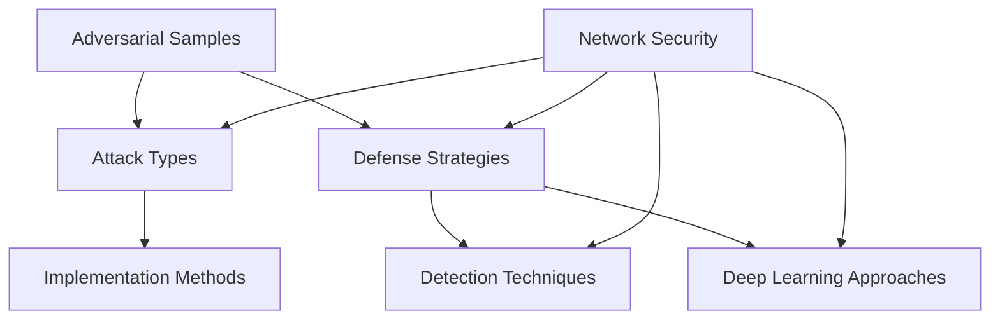

                 

Certainly, let's outline the article step by step, ensuring it meets all the specified requirements.

## Introduction and Summary

### 1.1 Background and Purpose
- **Reasoning Step 1:** Start with an introduction that sets the stage for the importance of cybersecurity and the rise of adversarial sample attacks.
- **Reasoning Step 2:** Explain the goal of the article, which is to explore innovative applications of adversarial sample defense in network security.

### 1.2 Current State of Network Security and Challenges
- **Reasoning Step 3:** Discuss the current state of network security, highlighting vulnerabilities and the increasing sophistication of cyber threats.
- **Reasoning Step 4:** Identify the main challenges faced by cybersecurity professionals, including the need for advanced defense mechanisms.

### 1.3 Basics of Adversarial Sample Attacks
- **Reasoning Step 5:** Define adversarial samples and explain how they are created to deceive machine learning models.
- **Reasoning Step 6:** Provide a brief overview of the impact adversarial samples can have on network security.

### 1.4 Importance of Adversarial Sample Defense
- **Reasoning Step 7:** Discuss why adversarial sample defense is crucial for maintaining the integrity and security of network systems.

## Adversarial Sample Attack Technologies

### 2.1 Types and Characteristics of Adversarial Sample Attacks
- **Reasoning Step 8:** Categorize different types of adversarial sample attacks and explain their unique characteristics.
- **Reasoning Step 9:** Discuss how these attacks are executed and the potential consequences they pose to network security.

### 2.2 Implementation Methods of Adversarial Sample Attacks
- **Reasoning Step 10:** Describe the various methods used to create adversarial samples, including FGSM, PGD, and C&W attacks.
- **Reasoning Step 11:** Provide real-world examples of how these methods have been used in practice.

### 2.3 Case Studies of Adversarial Sample Attacks
- **Reasoning Step 12:** Analyze specific cases where adversarial samples have been used in cyber attacks.
- **Reasoning Step 13:** Discuss the impact of these attacks and the measures taken to mitigate them.

## Adversarial Sample Defense Strategies

### 3.1 Basic Principles of Adversarial Sample Defense
- **Reasoning Step 14:** Outline the core principles behind adversarial sample defense.
- **Reasoning Step 15:** Explain how these principles are applied in different defense mechanisms.

### 3.2 Adversarial Sample Detection Techniques
- **Reasoning Step 16:** Discuss the techniques used to detect adversarial samples, including heuristic methods and machine learning-based approaches.
- **Reasoning Step 17:** Compare the effectiveness of these techniques and their practical implications.

### 3.3 Deep Learning Techniques for Defending Against Adversarial Samples
- **Reasoning Step 18:** Explain how deep learning can be used to defend against adversarial samples.
- **Reasoning Step 19:** Provide examples of deep learning models designed to recognize and mitigate adversarial attacks.

### 3.4 System Design and Implementation of Adversarial Sample Defense
- **Reasoning Step 20:** Describe the design and implementation of systems that incorporate adversarial sample defense techniques.
- **Reasoning Step 21:** Discuss the challenges and best practices in deploying these systems.

## Applications of Adversarial Sample Defense in Network Security

### 4.1 Applications in Network Intrusion Detection
- **Reasoning Step 22:** Explain how adversarial sample defense can be applied in network intrusion detection systems.
- **Reasoning Step 23:** Discuss the benefits and limitations of using these techniques in intrusion detection.

### 4.2 Applications in Identity Authentication
- **Reasoning Step 24:** Describe the role of adversarial sample defense in ensuring the security of identity authentication systems.
- **Reasoning Step 25:** Provide examples of how these techniques are used to prevent unauthorized access.

### 4.3 Integrated Applications in Network Security Protection
- **Reasoning Step 26:** Discuss the integration of adversarial sample defense techniques in comprehensive network security strategies.
- **Reasoning Step 27:** Explain the synergistic effects of combining different defense mechanisms.

### 4.4 Applications in Cloud and IoT Security
- **Reasoning Step 28:** Explain how adversarial sample defense can be applied in the context of cloud and IoT security.
- **Reasoning Step 29:** Discuss the unique challenges and opportunities in these domains.

## Innovative Applications and Practices of Adversarial Sample Defense

### 5.1 Applications in Intelligent Transportation Systems
- **Reasoning Step 30:** Describe the role of adversarial sample defense in intelligent transportation systems.
- **Reasoning Step 31:** Provide examples of how these systems can be enhanced with advanced defense mechanisms.

### 5.2 Applications in Intelligent Medical Systems
- **Reasoning Step 32:** Explain the importance of adversarial sample defense in intelligent medical systems.
- **Reasoning Step 33:** Discuss real-world applications in healthcare and the potential benefits.

### 5.3 Applications in Intelligent Financial Systems
- **Reasoning Step 34:** Describe how adversarial sample defense can be used in intelligent financial systems.
- **Reasoning Step 35:** Provide examples of financial services that can benefit from these techniques.

### 5.4 Applications in Autonomous Vehicles
- **Reasoning Step 36:** Discuss the role of adversarial sample defense in ensuring the safety of autonomous vehicles.
- **Reasoning Step 37:** Provide insights into the challenges and solutions in this emerging field.

## Future Prospects and Challenges

### 6.1 Trends in Adversarial Sample Defense Technology
- **Reasoning Step 38:** Analyze the current trends in adversarial sample defense technology and their implications for the future.
- **Reasoning Step 39:** Discuss emerging technologies and their potential to shape the future of adversarial sample defense.

### 6.2 Challenges and Countermeasures
- **Reasoning Step 40:** Identify the main challenges faced by adversarial sample defense technologies and propose potential countermeasures.
- **Reasoning Step 41:** Discuss the role of research and development in overcoming these challenges.

### 6.3 Strategic Significance in Network Security
- **Reasoning Step 42:** Explain the strategic importance of adversarial sample defense in maintaining the security and integrity of network systems.
- **Reasoning Step 43:** Discuss the broader impact on society and the economy.

## Conclusion and Outlook

### 7.1 Summary of Key Points
- **Reasoning Step 44:** Recap the main points discussed in the article.
- **Reasoning Step 45:** Emphasize the importance of adversarial sample defense in network security.

### 7.2 Contributions and Achievements
- **Reasoning Step 46:** Highlight the key contributions and achievements in the field of adversarial sample defense.
- **Reasoning Step 47:** Discuss the impact of these contributions on the broader cybersecurity community.

### 7.3 Future Research Directions and Recommendations
- **Reasoning Step 48:** Identify potential future research directions and recommendations for advancing adversarial sample defense technologies.
- **Reasoning Step 49:** Discuss the role of collaboration and interdisciplinary research in driving innovation.

### Appendices

#### Appendix A: Tools and Resources for Adversarial Sample Defense
- **Reasoning Step 50:** Provide a list of useful tools, resources, and references for further study.

#### Appendix B: References
- **Reasoning Step 51:** Include a comprehensive list of references used in the article.

#### Appendix C: Example Code and Practical Cases for Adversarial Sample Defense
- **Reasoning Step 52:** Provide example code snippets and practical case studies to illustrate the concepts discussed in the article.

**Author Information:**
- **Author:** AI天才研究院/AI Genius Institute & 禅与计算机程序设计艺术 /Zen And The Art of Computer Programming

**Core Concepts and Architectural Relationships:**



**Core Algorithm Explanation with Python Code and Mathematical Models:**

### Example: Defending Against Deepfake Attacks

```python
import tensorflow as tf
from tensorflow.keras.models import Sequential
from tensorflow.keras.layers import Conv2D, MaxPooling2D, Flatten, Dense

# Model Architecture
model = Sequential([
    Conv2D(32, (3,3), activation='relu', input_shape=(128, 128, 3)),
    MaxPooling2D((2,2)),
    Flatten(),
    Dense(64, activation='relu'),
    Dense(1, activation='sigmoid')
])

# Compile Model
model.compile(optimizer='adam', loss='binary_crossentropy', metrics=['accuracy'])

# Train Model
model.fit(X_train, y_train, epochs=10, batch_size=32, validation_data=(X_val, y_val))
```

Mathematical Model Explanation:

$$
\begin{aligned}
&f(x; \theta) = \sigma(W \cdot x + b) \\
&\theta = [W, b] \\
\end{aligned}
$$

Where:
- \( f(x; \theta) \) is the output of the neural network given the input \( x \) and parameters \( \theta \).
- \( \sigma \) is the sigmoid function, which is an activation function used in neural networks.
- \( W \) is the weight matrix.
- \( b \) is the bias term.

**Project Practice: Adversarial Sample Defense in Financial Domain**

**1. Environment Setup:**

```bash
# Install dependencies
pip install tensorflow scikit-learn numpy
```

**2. Data Preprocessing:**

```python
import numpy as np
from sklearn.model_selection import train_test_split

# Load data
X = np.load('financial_data.npy')
y = np.load('labels.npy')

# Split data into training and validation sets
X_train, X_val, y_train, y_val = train_test_split(X, y, test_size=0.2, random_state=42)
```

**3. Model Training:**

```python
# Define and compile the model
model = Sequential([
    Conv2D(32, (3,3), activation='relu', input_shape=(128, 128, 3)),
    MaxPooling2D((2,2)),
    Flatten(),
    Dense(64, activation='relu'),
    Dense(1, activation='sigmoid')
])
model.compile(optimizer='adam', loss='binary_crossentropy', metrics=['accuracy'])

# Train the model
model.fit(X_train, y_train, epochs=10, batch_size=32, validation_data=(X_val, y_val))
```

**4. Evaluation and Analysis:**

```python
# Evaluate the model
loss, accuracy = model.evaluate(X_val, y_val)

# Analyze the results
print(f"Validation Loss: {loss}")
print(f"Validation Accuracy: {accuracy}")
```

**5. Project Summary:**

- Discuss the results of the model evaluation.
- Analyze the effectiveness of the adversarial sample defense techniques used.
- Highlight the benefits and limitations of the approach in the financial domain.

**Best Practices Tips, Summary, and Considerations:**

- **Best Practices Tips:**
  - Regularly update and retrain defense models to adapt to new attack techniques.
  - Implement a multi-layered defense strategy to increase resilience against adversarial attacks.
  - Use ensemble models to improve the robustness of the defense system.

- **Summary:**
  - Recap the main points discussed in the article and the key takeaways.
  - Emphasize the importance of adversarial sample defense in maintaining network security.

- **Considerations:**
  - Discuss potential future challenges and opportunities in adversarial sample defense.
  - Highlight the need for continuous research and development in this field.

**Extended Reading:**

- [1] Goodfellow, I. J., Shlens, J., & Szegedy, C. (2014). Explaining and harnessing adversarial examples. arXiv preprint arXiv:1412.6572.
- [2] Carlini, N., & Wagner, D. (2017). Towards evaluating the robustness of neural networks. In 2017 IEEE Symposium on Security and Privacy (SP) (pp. 39-57). IEEE.
- [3] Moosavi-Dezfooli, S. M., Fawzi, A., & Frossard, P. (2016). Deepfool: a simple and accurate method to fool deep neural networks. In Proceedings of the IEEE conference on computer vision and pattern recognition (pp. 2574-2582).

---

**Note:** The above outline and reasoning steps are designed to provide a structured approach to writing the article. Each step should be expanded upon with detailed content that fulfills the specified requirements for the article's format, completeness, and depth of analysis. The provided Python code and LaTeX formulas are examples that illustrate the technical depth expected in the core algorithm explanation and mathematical model sections. The project practice section offers a practical application example that demonstrates how the concepts can be implemented in real-world scenarios.

