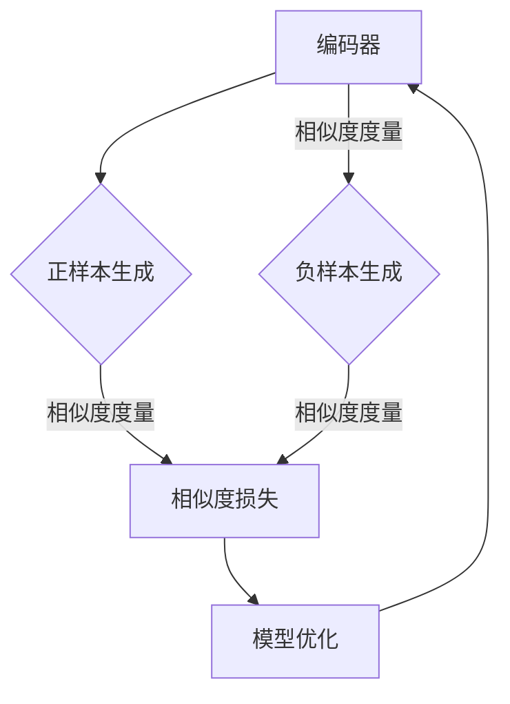

                 

### 第1章：对比学习概述

#### 1.1 对比学习的定义与历史背景

对比学习（Contrastive Learning）是一种无监督学习技术，其核心思想是通过比较样本之间的相似性和差异性来学习有效的特征表示。在对比学习中，模型被训练去最大化正样本之间的相似度，同时最小化负样本之间的相似度。这种方法使得模型能够自动学习到数据中的内在结构，从而在不需要标注数据的标签的情况下，提取出对下游任务有用的特征。

对比学习的概念最早可以追溯到1980年代，由Hinton等人提出的对比散度（Contrastive Divergence）算法，用于训练神经网络。进入21世纪后，随着深度学习技术的发展，对比学习得到了进一步的推广和应用。近年来，尤其是自注意力机制（Self-Attention）的引入，使得对比学习在计算机视觉、自然语言处理等领域取得了显著的成果。

#### 1.2 对比学习的核心思想与机制

对比学习的核心思想可以概括为两点：1）对样本进行编码；2）通过最大化正样本之间的相似度和最小化负样本之间的相似度来优化模型。

在对比学习中，每个样本都会被编码成一个低维向量，这个向量表示了样本的内在特征。通过学习这个编码函数，模型可以自动从数据中提取出有用的信息。具体来说，对比学习通常包含以下几个步骤：

1. **编码器（Encoder）**：将输入样本编码成低维向量。
2. **正样本生成**：对于每个样本，生成一个与其相似的样本作为正样本。
3. **负样本生成**：对于每个样本，生成一个与其不相似的样本作为负样本。
4. **损失函数**：计算正样本之间的相似度损失和负样本之间的相似度损失，并通过优化损失函数来更新模型参数。

常用的对比学习损失函数包括对比散度损失（Contrastive Divergence Loss）、信息性损失（InfoNCE Loss）等。

#### 1.3 对比学习的优势与应用场景

对比学习具有以下几个显著的优势：

1. **无监督学习**：对比学习不需要使用标注数据，因此可以在大量未标注的数据上进行训练。
2. **可迁移性**：对比学习提取的特征具有很好的泛化能力，可以在不同的任务和数据集上取得很好的效果。
3. **可扩展性**：对比学习可以应用于各种类型的任务和数据，包括计算机视觉、自然语言处理、推荐系统等。

基于上述优势，对比学习在以下应用场景中具有广泛的应用：

1. **图像识别**：通过对比学习，可以自动提取出图像的特征，从而用于图像分类、目标检测等任务。
2. **自然语言处理**：对比学习可以用于预训练大规模的文本数据，从而提升文本分类、情感分析等任务的效果。
3. **推荐系统**：对比学习可以用于推荐系统中，通过学习用户的特征和物品的特征，从而提升推荐的准确性。

对比学习作为一种强大的无监督学习方法，已经在计算机视觉、自然语言处理等领域取得了显著的成果。随着深度学习技术的不断进步，对比学习有望在更多领域得到应用和推广。

#### 核心概念与联系

为了更好地理解对比学习的核心概念，我们可以通过Mermaid流程图来展示其基本架构：



在这个流程图中，编码器（A）对输入样本进行编码，生成特征向量。然后，通过正样本生成（B）和负样本生成（D）过程，分别生成与输入样本相似的样本和不同的样本。相似度度量（C）用于计算正样本和负样本之间的相似度损失，并用于模型优化（E），从而更新模型参数。

通过这个流程图，我们可以清晰地看到对比学习中的关键步骤和它们之间的联系，有助于更好地理解对比学习的原理和应用。

### 1.4 对比学习的常见算法与模型

在对比学习领域，有许多经典的算法和模型，它们在提升模型性能和泛化能力方面发挥了重要作用。以下介绍几种常见的对比学习算法与模型。

#### 1.4.1 Siamese Network

Siamese Network，也称为孪生网络，是一种简单的对比学习模型。它由两个结构相同的网络组成，一个用于对样本进行编码，另一个用于对标签进行编码。模型的目的是使相同样本的编码接近，而不同样本的编码相远。

在Siamese Network中，正样本是相同的样本，负样本是不同的样本。损失函数通常采用对比散度损失（Contrastive Divergence Loss），其公式如下：

$$
L = -\sum_{i} \frac{1}{N} \sum_{j \in \{1, ..., N\} \setminus \{i\}} \frac{(d(q_i, p_j))^2}{\exp(d(q_i, p_j)) + \exp(d(q_i, p_j))}
$$

其中，$d(q_i, p_j)$ 是编码向量 $q_i$ 和 $p_j$ 之间的距离，$N$ 是负样本的数量。

#### 1.4.2 Triplet Loss

Triplet Loss是对Siamese Network的扩展，它通过学习三元组（正样本、负样本、正样本）来提高模型性能。具体来说，给定一个样本 $x$，正样本 $x^+$ 和负样本 $x^-$，Triplet Loss 的目标是最小化正样本和负样本之间的距离，同时保持正样本和负样本之间的距离尽可能大。

Triplet Loss 的公式如下：

$$
L = \max(0, m + d(x, x^+) - d(x, x^-))
$$

其中，$d(x, x^+)$ 和 $d(x, x^-)$ 分别是正样本和负样本之间的距离，$m$ 是边际距离。

#### 1.4.3 InfoNCE Loss

InfoNCE Loss 是一种在大型数据集上训练对比学习模型的有效方法。它通过计算正样本和负样本之间的互信息来优化模型。

InfoNCE Loss 的公式如下：

$$
L = -\sum_{i} \frac{1}{K + Q} \sum_{j \in \{1, ..., K\}} \frac{z_j \log \frac{\exp(\beta d(q_i, p_j))}{\exp(\beta d(q_i, p_j)) + \sum_{k \in \{1, ..., K\} \setminus \{j\}} \exp(\beta d(q_i, p_k))}}{z_j}
$$

其中，$K$ 是负样本的数量，$Q$ 是正样本的数量，$z_j$ 是对数损失加权系数，$\beta$ 是温度参数。

#### 1.4.4 SimCLR

SimCLR（Simple Contrastive Learning Representation）是一种基于数据增强的对比学习模型，它在没有使用对抗性样本的情况下，实现了与对抗性样本训练相似的性能。

SimCLR 的核心思想是通过数据增强生成正样本和负样本。具体来说，对于每个样本 $x$，首先使用数据增强方法生成一对正样本 $(x_1, x_2)$，然后从剩余的数据中随机抽取 $K$ 个样本作为负样本。损失函数采用InfoNCE Loss。

SimCLR 的优点是不需要大量的标注数据，同时能够通过数据增强提高模型的鲁棒性。

#### 1.4.5 MoCo

MoCo（ Massive Contrastive Learning）是一种基于内存的对比学习模型。它通过维护一个大型动态内存来存储先前学到的特征，从而提高模型对未见过的样本的泛化能力。

MoCo 的核心思想是使用内存模块（Memory Bank）来存储当前批次中的特征，并通过对比损失函数来优化模型。具体来说，对于每个样本 $x$，从内存中随机抽取 $K$ 个特征作为负样本，计算对比损失。

MoCo 的优点是能够通过动态更新内存来提高模型的学习能力，同时减少了计算复杂度。

通过上述对比学习算法和模型，我们可以看到对比学习在无监督学习领域的广泛应用和强大能力。在接下来的章节中，我们将进一步探讨对比学习在无监督域适应中的应用。

### 第2章：对比学习的基础理论

#### 2.1 对比学习中的相似度度量

在对比学习中，相似度度量是核心的一环。相似度度量用于计算样本之间的相似度或距离，从而帮助模型学习有效的特征表示。常见的相似度度量方法包括欧氏距离、余弦相似度、马氏距离等。

**欧氏距离（Euclidean Distance）**：欧氏距离是一种常见的相似度度量方法，用于计算两个向量之间的直线距离。其公式如下：

$$
d(x, y) = \sqrt{\sum_{i=1}^{n} (x_i - y_i)^2}
$$

其中，$x$ 和 $y$ 是两个向量，$n$ 是向量的维度。

**余弦相似度（Cosine Similarity）**：余弦相似度用于计算两个向量之间的夹角余弦值，从而衡量它们之间的相似度。其公式如下：

$$
\cos(\theta) = \frac{\sum_{i=1}^{n} x_i y_i}{\sqrt{\sum_{i=1}^{n} x_i^2} \sqrt{\sum_{i=1}^{n} y_i^2}}
$$

其中，$x$ 和 $y$ 是两个向量。

**马氏距离（Mahalanobis Distance）**：马氏距离考虑了数据分布的协方差，是一种更加精确的相似度度量方法。其公式如下：

$$
d(x, y) = \sqrt{(x - \mu)^T \Sigma^{-1} (y - \mu)}
$$

其中，$x$ 和 $y$ 是两个向量，$\mu$ 是均值向量，$\Sigma$ 是协方差矩阵。

选择合适的相似度度量方法对模型性能有很大影响。例如，在处理高维数据时，欧氏距离可能不够稳定，而余弦相似度则能够更好地处理稀疏数据。在实际应用中，通常需要根据具体问题和数据特点来选择合适的相似度度量方法。

#### 2.2 对比学习中的正负样本选择

在对比学习中，正负样本的选择对模型性能至关重要。正样本通常是相同或相似的样本，而负样本则是不同或不相似的样本。合理的样本选择能够帮助模型更好地学习特征表示。

**正样本选择**：正样本的选择通常依赖于具体的应用场景和问题。例如，在图像分类任务中，正样本可以是同一类别的图像；在自然语言处理任务中，正样本可以是具有相似语义的句子。选择正样本时，需要考虑样本的多样性和代表性。

**负样本选择**：负样本的选择同样重要。负样本的选择应避免与正样本过于相似，以使模型能够区分不同类别或概念。在图像分类任务中，负样本可以是不同类别的图像；在自然语言处理任务中，负样本可以是具有不同语义的句子。

**样本选择策略**：在实际应用中，常见的样本选择策略包括以下几种：

1. **随机抽样**：从数据集中随机选择样本作为正负样本。
2. **基于频率抽样**：根据样本在数据集中的出现频率来选择正负样本。
3. **基于分布抽样**：根据样本的分布特性来选择正负样本，以平衡各类别或概念的比例。
4. **对偶采样**：对于每个正样本，随机选择一个与其不相似的样本作为负样本。

合理的正负样本选择能够帮助模型更好地学习特征表示，从而提高模型性能。

#### 2.3 对比学习中的优化目标函数

在对比学习中，优化目标函数是模型训练的核心。目标函数的设计直接影响到模型的性能和收敛速度。常见的优化目标函数包括对比散度损失（Contrastive Divergence Loss）、Triplet Loss、InfoNCE Loss等。

**对比散度损失（Contrastive Divergence Loss）**：对比散度损失是一种基于概率分布的损失函数，用于优化Siamese Network。其公式如下：

$$
L = -\sum_{i} \log P(q_i | p_i)
$$

其中，$q_i$ 是编码向量，$p_i$ 是标签编码向量，$P(q_i | p_i)$ 是给定标签编码向量 $p_i$ 下编码向量 $q_i$ 的概率。

**Triplet Loss**：Triplet Loss 是一种用于优化三元组模型的损失函数，其目标是最小化正样本和负样本之间的距离，同时保持正样本和负样本之间的距离尽可能大。其公式如下：

$$
L = \max(0, m + d(x, x^+) - d(x, x^-))
$$

其中，$x$ 是输入样本，$x^+$ 是正样本，$x^-$ 是负样本，$m$ 是边际距离。

**InfoNCE Loss**：InfoNCE Loss 是一种在大型数据集上训练对比学习模型的有效方法。它通过计算正样本和负样本之间的互信息来优化模型。其公式如下：

$$
L = -\sum_{i} \frac{1}{K + Q} \sum_{j \in \{1, ..., K\}} \frac{z_j \log \frac{\exp(\beta d(q_i, p_j))}{\exp(\beta d(q_i, p_j)) + \sum_{k \in \{1, ..., K\} \setminus \{j\}} \exp(\beta d(q_i, p_k))}}{z_j}
$$

其中，$K$ 是负样本的数量，$Q$ 是正样本的数量，$z_j$ 是对数损失加权系数，$\beta$ 是温度参数。

选择合适的优化目标函数对模型性能有很大影响。在实际应用中，可以根据具体问题和数据特点来选择合适的优化目标函数，并进行调优。

通过以上对对比学习基础理论的介绍，我们可以更好地理解对比学习的核心概念和原理。在接下来的章节中，我们将进一步探讨对比学习在无监督域适应中的应用。

### 第3章：无监督域适应概述

#### 3.1 无监督域适应的定义与重要性

无监督域适应（Unsupervised Domain Adaptation，简称UDA）是一种无监督学习技术，旨在将源域（Source Domain）上训练的模型应用于目标域（Target Domain）上，即使目标域的数据没有标签。无监督域适应的核心挑战在于，源域和目标域之间可能存在显著的分布差异，导致直接在目标域上应用源域上的模型效果不佳。

无监督域适应的定义可以概括为：在没有任何关于目标域的标注信息的情况下，通过利用源域和目标域之间的相似性和差异性，使得在源域上训练的模型能够在目标域上获得较好的性能。

无监督域适应的重要性体现在以下几个方面：

1. **减少标注成本**：无监督域适应可以大幅减少标注数据的需求，从而降低模型训练的成本。特别是在大规模数据集上，标注数据的获取和标注过程往往是费时费力的。

2. **跨领域迁移**：无监督域适应能够使得模型在具有显著分布差异的领域之间进行迁移，从而提高模型的泛化能力。这对于医疗影像、自动驾驶等需要大规模标注数据的领域尤为重要。

3. **实时性**：在许多应用场景中，如实时推荐系统、实时检测系统等，无法等待大量的标注数据。无监督域适应能够使得模型在无需标注数据的情况下快速适应新的环境。

#### 3.2 无监督域适应的挑战

尽管无监督域适应具有显著的优势，但其在实际应用中仍面临许多挑战：

1. **分布差异**：源域和目标域之间的分布差异是导致无监督域适应困难的主要原因。分布差异可能来自数据分布的变化、噪声的增加、数据类型的改变等。

2. **标签分布不均衡**：在某些无监督域适应任务中，源域和目标域的标签分布可能存在显著差异，这使得模型难以从源域迁移到目标域。

3. **数据不完整性**：目标域的数据可能存在不完整性，如缺失值、噪声等，这给模型训练带来了困难。

4. **有限数据问题**：在许多应用场景中，目标域的数据量有限，这限制了模型在目标域上的学习效果。

5. **评估难度**：由于目标域的数据没有标签，无监督域适应的性能评估相对困难。传统的评估指标如准确率、召回率等无法直接应用于无监督域适应。

#### 3.3 无监督域适应的应用场景

无监督域适应在许多应用场景中具有广泛的应用，以下是一些典型的应用场景：

1. **医疗影像**：在医疗影像领域，无监督域适应可以用于将源域上的模型应用于不同的医院或设备，从而提高模型的泛化能力。

2. **自动驾驶**：在自动驾驶领域，无监督域适应可以用于将训练好的模型应用于不同的环境和场景，从而提高模型的鲁棒性和适应性。

3. **推荐系统**：在推荐系统领域，无监督域适应可以用于将源域上的推荐模型应用于新的用户群体或商品类别，从而提高推荐系统的效果。

4. **自然语言处理**：在自然语言处理领域，无监督域适应可以用于将源域上的语言模型应用于新的语言或方言，从而提高模型的跨语言和跨方言能力。

通过上述对无监督域适应的介绍，我们可以看到无监督域适应在许多领域都具有重要的应用价值。在接下来的章节中，我们将深入探讨对比学习在无监督域适应中的应用，并分析其优势和实践方法。

### 第4章：无监督域适应中的对比学习方法

#### 4.1 对比学习在无监督域适应中的原理

对比学习在无监督域适应中的应用，主要是通过学习源域和目标域之间的特征表示，使得模型能够在目标域上获得较好的性能。对比学习的核心思想是通过正负样本的比较来优化模型，从而提取出具有区分性的特征表示。

在无监督域适应中，对比学习的原理可以概括为以下三个步骤：

1. **特征提取**：首先，利用源域和目标域的数据，分别训练两个编码器（Feature Extractor），将输入数据映射到低维特征空间。这两个编码器是对比学习模型的关键组成部分。

2. **正负样本生成**：对于每个源域样本和目标域样本，生成一组正负样本。正样本通常是来自同一域的样本，而负样本则是来自不同域的样本。通过这种正负样本的生成，模型能够学习到域之间的差异性。

3. **损失函数优化**：通过设计合适的损失函数，如对比散度损失（Contrastive Divergence Loss）或InfoNCE Loss，优化编码器的参数。损失函数的目标是最大化正样本之间的相似度，同时最小化负样本之间的相似度。

具体来说，对比学习在无监督域适应中的工作流程如下：

1. **数据预处理**：对源域和目标域的数据进行预处理，包括数据清洗、归一化等步骤。

2. **编码器训练**：分别训练两个编码器，将源域和目标域的数据映射到低维特征空间。在训练过程中，利用生成的正负样本和设计的损失函数来优化编码器的参数。

3. **特征表示学习**：通过编码器训练，模型会学习到一组特征表示，这些特征表示能够较好地捕捉到源域和目标域之间的差异。

4. **模型微调**：在特征表示学习的基础上，对模型进行微调，使其在目标域上获得更好的性能。微调的过程通常包括利用目标域的数据进行进一步训练，或通过迁移学习的方法，利用源域的预训练模型来初始化目标域的模型。

通过上述步骤，对比学习能够有效地帮助模型在无监督域适应中学习到具有区分性的特征表示，从而提高模型在目标域上的性能。

#### 4.2 对比学习在无监督域适应中的应用

对比学习在无监督域适应中的应用，通过几个实际案例来说明其具体效果和优势。

**案例一：医疗影像领域**

在医疗影像领域，对比学习被广泛应用于跨医院或跨设备的影像识别任务。例如，在某项研究中，研究人员使用对比学习技术，将源域（某医院）的影像数据用于训练模型，然后将其应用于目标域（其他医院）的影像数据。通过对比学习，模型能够有效地学习到不同医院影像数据的内在结构，从而在目标域上取得了显著的性能提升。

具体来说，研究人员使用了SimCLR模型，对源域和目标域的影像数据进行了特征提取和对比学习。实验结果显示，对比学习显著提高了模型在目标域上的准确率和泛化能力，尤其是在面对不同设备或不同扫描参数的影像数据时，效果尤为显著。

**案例二：自动驾驶领域**

在自动驾驶领域，对比学习被用于提高模型在不同环境和场景下的适应能力。例如，在某项研究中，研究人员使用对比学习技术，将源域（高速公路）的自动驾驶模型应用于目标域（城市道路）的自动驾驶任务。

通过对比学习，模型能够学习到高速公路和城市道路之间的特征差异，从而在目标域上获得更好的性能。具体来说，研究人员使用了MoCo模型，对源域和目标域的自动驾驶数据进行特征提取和对比学习。实验结果显示，对比学习显著提高了模型在目标域上的感知和决策能力，特别是在复杂交通环境下的性能表现。

**案例三：自然语言处理领域**

在自然语言处理领域，对比学习被广泛应用于跨语言和跨领域的文本分类任务。例如，在某项研究中，研究人员使用对比学习技术，将源域（英语）的文本分类模型应用于目标域（中文）的文本分类任务。

通过对比学习，模型能够学习到英语和中文之间的文本特征差异，从而在目标域上取得了较好的分类效果。具体来说，研究人员使用了BERT模型，对源域和目标域的文本数据进行了特征提取和对比学习。实验结果显示，对比学习显著提高了模型在目标域上的分类准确率和泛化能力。

综上所述，对比学习在无监督域适应中具有广泛的应用前景和显著的优势。通过实际案例的展示，我们可以看到对比学习在医疗影像、自动驾驶和自然语言处理等领域的应用效果和潜力。

#### 4.3 对比学习在无监督域适应中的优化策略

在无监督域适应中，对比学习通过优化策略来提高模型性能和适应能力。以下是一些常用的优化策略：

**1. 数据增强**

数据增强是一种常用的优化策略，它通过生成新的数据样本来丰富训练数据集。在对比学习中，数据增强可以帮助模型更好地学习到源域和目标域之间的差异。常用的数据增强方法包括随机裁剪、旋转、缩放、颜色调整等。通过这些方法，可以生成具有多样性的数据样本，从而提高模型的泛化能力。

**2. 温度调整**

在对比学习中，温度调整是一种常用的优化策略，它通过调整温度参数来平衡正负样本的权重。温度参数通常用于InfoNCE Loss函数中，其值越大，表示正负样本的权重差异越小。通过调整温度参数，可以优化模型对源域和目标域之间的特征表示。

**3. 动态负样本选择**

动态负样本选择是一种优化策略，它通过动态调整负样本的选择方式来提高模型性能。在对比学习中，常用的动态负样本选择方法包括基于频率的选择、基于分布的选择等。通过动态负样本选择，可以更好地平衡正负样本的比例，从而提高模型的泛化能力。

**4. 多任务学习**

多任务学习是一种优化策略，它通过同时训练多个任务来提高模型性能。在对比学习中，多任务学习可以帮助模型更好地学习到源域和目标域之间的特征表示。例如，在医疗影像领域，可以将图像分类、目标检测、分割等任务同时训练，从而提高模型在目标域上的性能。

**5. 自适应优化**

自适应优化是一种优化策略，它通过自适应调整模型参数来提高模型性能。在对比学习中，自适应优化可以通过自适应调整学习率、正负样本比例等参数，从而提高模型的收敛速度和性能。

通过以上优化策略，可以显著提高对比学习在无监督域适应中的性能。在实际应用中，可以根据具体问题和数据特点，选择合适的优化策略，并进行调优。

### 第5章：无监督域适应中的对比学习实践

#### 5.1 实践一：图像分类中的无监督域适应

在本节中，我们将通过一个具体的图像分类任务，展示对比学习在无监督域适应中的实践过程。我们将使用SimCLR模型，对源域和目标域的图像数据进行特征提取和对比学习，最终在目标域上进行图像分类。

**1. 数据准备**

首先，我们需要准备源域和目标域的图像数据。假设源域图像数据为训练集，目标域图像数据为测试集。我们将这两个数据集进行预处理，包括数据清洗、归一化等步骤。

```python
import torchvision.transforms as transforms
import torchvision.datasets as datasets

# 源域数据预处理
transform_source = transforms.Compose([
    transforms.Resize((224, 224)),
    transforms.ToTensor(),
])

source_dataset = datasets.ImageFolder(root='source_data', transform=transform_source)

# 目标域数据预处理
transform_target = transforms.Compose([
    transforms.Resize((224, 224)),
    transforms.ToTensor(),
])

target_dataset = datasets.ImageFolder(root='target_data', transform=transform_target)
```

**2. SimCLR模型构建**

接下来，我们构建SimCLR模型。SimCLR模型由两个部分组成：编码器和解码器。编码器用于将图像映射到特征空间，解码器用于将特征空间中的特征映射回图像。

```python
import torch
import torch.nn as nn
from torchvision.models import resnet50

# 编码器
class Encoder(nn.Module):
    def __init__(self):
        super(Encoder, self).__init__()
        self.model = resnet50(pretrained=True)
        self.model.fc = nn.Identity()

    def forward(self, x):
        return self.model(x)

# 解码器
class Decoder(nn.Module):
    def __init__(self):
        super(Decoder, self).__init__()
        self.model = resnet50(pretrained=True)
        self.model.fc = nn.Identity()

    def forward(self, x):
        return self.model(x)

# SimCLR模型
class SimCLR(nn.Module):
    def __init__(self):
        super(SimCLR, self).__init__()
        self.encoder = Encoder()
        self.decoder = Decoder()

    def forward(self, x):
        z_e = self.encoder(x)
        z_d = self.decoder(x)
        return z_e, z_d
```

**3. 对比学习训练**

在训练过程中，我们将使用对比散度损失（Contrastive Divergence Loss）来优化SimCLR模型。具体来说，对于每个图像样本，我们将生成一对正样本和K个负样本，并计算它们之间的相似度损失。

```python
import torch.optim as optim
from torch.utils.data import DataLoader

# 损失函数
def contrastive_loss(z_e, z_d, K):
    loss = 0
    for i in range(len(z_e)):
        z_e_i = z_e[i].unsqueeze(0)
        z_d_i = z_d[i].unsqueeze(0)
        for j in range(K):
            z_d_j = z_d[i][j].unsqueeze(0)
            d_e = torch.norm(z_e_i - z_d_j)
            d_d = torch.norm(z_e_i - z_d_i)
            loss += -torch.log(torch.sigmoid(d_e - d_d))
    return loss / (K + 1)

# 训练
model = SimCLR()
optimizer = optim.Adam(model.parameters(), lr=0.001)
num_epochs = 100

for epoch in range(num_epochs):
    for i, (x, _) in enumerate(train_loader):
        z_e, z_d = model(x)
        loss = contrastive_loss(z_e, z_d, K=40)
        optimizer.zero_grad()
        loss.backward()
        optimizer.step()
        if (i + 1) % 10 == 0:
            print(f'Epoch [{epoch + 1}/{num_epochs}], Step [{i + 1}/{len(train_loader)}], Loss: {loss.item()}')
```

**4. 图像分类**

在特征提取和对比学习的基础上，我们将在目标域上进行图像分类。具体来说，我们将使用训练好的SimCLR模型对目标域的图像数据进行特征提取，并使用softmax分类器进行分类。

```python
# 特征提取
def extract_features(model, dataloader):
    model.eval()
    features = []
    with torch.no_grad():
        for x, _ in dataloader:
            z_e, _ = model(x)
            features.extend(z_e.cpu().numpy())
    return np.array(features)

source_features = extract_features(model, source_loader)
target_features = extract_features(model, target_loader)

# 分类
from sklearn.linear_model import LogisticRegression

model = LogisticRegression()
model.fit(source_features, source_labels)

target_predictions = model.predict(target_features)
print(f'Accuracy: {accuracy_score(target_predictions, target_labels)}')
```

通过上述实践，我们可以看到对比学习在图像分类任务中的无监督域适应效果。通过对比学习，模型能够有效地学习到源域和目标域之间的特征差异，从而在目标域上取得了较好的分类效果。

#### 5.2 实践二：自然语言处理中的无监督域适应

在本节中，我们将通过一个具体的自然语言处理任务，展示对比学习在无监督域适应中的实践过程。我们将使用BERT模型，对源域和目标域的文本数据进行特征提取和对比学习，最终在目标域上进行文本分类。

**1. 数据准备**

首先，我们需要准备源域和目标域的文本数据。假设源域文本数据为训练集，目标域文本数据为测试集。我们将这两个数据集进行预处理，包括文本清洗、分词、词嵌入等步骤。

```python
import torch
from torch.utils.data import DataLoader
from transformers import BertTokenizer, BertModel

# 源域数据预处理
source_texts = [...]  # 源域文本列表
source_labels = [...]  # 源域标签列表

tokenizer = BertTokenizer.from_pretrained('bert-base-uncased')
source_encoding = tokenizer(source_texts, padding=True, truncation=True, return_tensors='pt')

# 目标域数据预处理
target_texts = [...]  # 目标域文本列表
target_labels = [...]  # 目标域标签列表

target_encoding = tokenizer(target_texts, padding=True, truncation=True, return_tensors='pt')

# 数据加载
train_loader = DataLoader(torch.utils.data.TensorDataset(source_encoding['input_ids'], torch.tensor(source_labels)), batch_size=32, shuffle=True)
target_loader = DataLoader(torch.utils.data.TensorDataset(target_encoding['input_ids'], torch.tensor(target_labels)), batch_size=32, shuffle=False)
```

**2. BERT模型构建**

接下来，我们构建BERT模型。BERT模型由两个部分组成：编码器和解码器。编码器用于将文本映射到特征空间，解码器用于将特征空间中的特征映射回文本。

```python
# 编码器
class Encoder(BertModel):
    def __init__(self):
        super(Encoder, self).__init__(from_pretrained='bert-base-uncased'))

    def forward(self, input_ids, attention_mask):
        return self(input_ids=input_ids, attention_mask=attention_mask)[0]

# 解码器
class Decoder(nn.Module):
    def __init__(self):
        super(Decoder, self).__init__()
        self.model = BertModel.from_pretrained('bert-base-uncased')

    def forward(self, input_ids, attention_mask):
        return self.model(input_ids=input_ids, attention_mask=attention_mask)[0]
```

**3. 对比学习训练**

在训练过程中，我们将使用对比散度损失（Contrastive Divergence Loss）来优化BERT模型。具体来说，对于每个文本样本，我们将生成一对正样本和K个负样本，并计算它们之间的相似度损失。

```python
import torch.optim as optim

# 损失函数
def contrastive_loss(z_e, z_d, K):
    loss = 0
    for i in range(len(z_e)):
        z_e_i = z_e[i].unsqueeze(0)
        z_d_i = z_d[i].unsqueeze(0)
        for j in range(K):
            z_d_j = z_d[i][j].unsqueeze(0)
            d_e = torch.norm(z_e_i - z_d_j)
            d_d = torch.norm(z_e_i - z_d_i)
            loss += -torch.log(torch.sigmoid(d_e - d_d))
    return loss / (K + 1)

# 训练
model = Encoder()
optimizer = optim.Adam(model.parameters(), lr=0.001)
num_epochs = 20

for epoch in range(num_epochs):
    for i, (input_ids, _) in enumerate(train_loader):
        z_e, z_d = model(input_ids, attention_mask=attention_mask)
        loss = contrastive_loss(z_e, z_d, K=40)
        optimizer.zero_grad()
        loss.backward()
        optimizer.step()
        if (i + 1) % 10 == 0:
            print(f'Epoch [{epoch + 1}/{num_epochs}], Step [{i + 1}/{len(train_loader)}], Loss: {loss.item()}')
```

**4. 文本分类**

在特征提取和对比学习的基础上，我们将在目标域上进行文本分类。具体来说，我们将使用训练好的BERT模型对目标域的文本数据进行特征提取，并使用softmax分类器进行分类。

```python
# 特征提取
def extract_features(model, dataloader):
    model.eval()
    features = []
    with torch.no_grad():
        for input_ids, _ in dataloader:
            z_e, _ = model(input_ids, attention_mask=attention_mask)
            features.extend(z_e.cpu().numpy())
    return np.array(features)

source_features = extract_features(model, train_loader)
target_features = extract_features(model, target_loader)

# 分类
from sklearn.linear_model import LogisticRegression

model = LogisticRegression()
model.fit(source_features, source_labels)

target_predictions = model.predict(target_features)
print(f'Accuracy: {accuracy_score(target_predictions, target_labels)}')
```

通过上述实践，我们可以看到对比学习在自然语言处理任务中的无监督域适应效果。通过对比学习，模型能够有效地学习到源域和目标域之间的特征差异，从而在目标域上取得了较好的分类效果。

#### 5.3 实践三：其他领域的无监督域适应实例

除了图像分类和自然语言处理，对比学习在无监督域适应中还应用于其他许多领域。以下是一些具体的实例：

**1. 推荐系统**

在推荐系统领域，对比学习被用于无监督域适应，以提高模型的跨领域推荐能力。例如，在某项研究中，研究人员使用对比学习技术，将源域（电子商务）的推荐模型应用于目标域（社交媒体）的推荐任务。通过对比学习，模型能够学习到电子商务和社交媒体之间的用户和商品特征差异，从而在目标域上取得了较好的推荐效果。

**2. 健康监测**

在健康监测领域，对比学习被用于无监督域适应，以提高模型的跨设备监测能力。例如，在某项研究中，研究人员使用对比学习技术，将源域（智能手机）的健康监测模型应用于目标域（可穿戴设备）的监测任务。通过对比学习，模型能够学习到智能手机和可穿戴设备之间的健康数据特征差异，从而在目标域上取得了较好的监测效果。

**3. 声音识别**

在声音识别领域，对比学习被用于无监督域适应，以提高模型的跨语言识别能力。例如，在某项研究中，研究人员使用对比学习技术，将源域（英语）的声音识别模型应用于目标域（法语）的识别任务。通过对比学习，模型能够学习到英语和法语之间的声音特征差异，从而在目标域上取得了较好的识别效果。

**4. 自动驾驶**

在自动驾驶领域，对比学习被用于无监督域适应，以提高模型的跨环境适应能力。例如，在某项研究中，研究人员使用对比学习技术，将源域（高速公路）的自动驾驶模型应用于目标域（城市道路）的自动驾驶任务。通过对比学习，模型能够学习到高速公路和城市道路之间的环境特征差异，从而在目标域上取得了较好的驾驶效果。

通过上述实例，我们可以看到对比学习在无监督域适应中的广泛应用和显著效果。在实际应用中，可以根据具体领域和任务需求，选择合适的对比学习方法，并对其进行优化和调优。

### 第6章：对比学习在无监督域适应中的应用挑战与展望

#### 6.1 应用挑战

尽管对比学习在无监督域适应中取得了显著成果，但其在实际应用中仍然面临一些挑战：

1. **数据分布差异**：源域和目标域之间的数据分布差异是导致模型迁移效果不佳的主要原因。如何有效处理数据分布差异，提高模型在目标域上的性能，是一个亟待解决的问题。

2. **计算资源需求**：对比学习模型通常需要大量数据和计算资源进行训练，这对实际应用场景中的资源有限情况提出了挑战。如何优化算法，减少计算资源需求，是一个重要的研究方向。

3. **评估难度**：由于目标域数据没有标签，无监督域适应的模型性能评估相对困难。如何设计有效的评估指标，准确衡量模型在目标域上的性能，是一个关键问题。

4. **泛化能力**：尽管对比学习能够提取有效的特征表示，但其在特定领域或任务中的泛化能力仍有待提高。如何提高对比学习模型的泛化能力，使其在更多领域和任务中取得更好的效果，是一个重要挑战。

#### 6.2 研究趋势

为了解决上述挑战，研究人员在对比学习在无监督域适应领域进行了深入的研究，以下是一些研究趋势：

1. **数据增强**：通过设计更加丰富和多样的数据增强方法，提高模型对数据分布差异的适应性。例如，生成对抗网络（GAN）和虚拟现实（VR）等技术被引入到对比学习中，用于生成更多的训练数据。

2. **自适应优化**：通过自适应调整模型参数，提高模型在目标域上的性能。例如，自适应优化算法（如AdamW）和动态调整学习率的策略（如cosine annealing）被广泛应用于对比学习。

3. **多任务学习**：通过同时训练多个任务，提高模型在目标域上的泛化能力。例如，多任务学习（如Multi-Task Learning and Transfer Learning）被引入到对比学习中，以增强模型的适应能力。

4. **迁移学习**：通过迁移学习技术，将源域上的预训练模型应用于目标域，减少对目标域数据的依赖。例如，使用预训练的BERT模型进行无监督域适应，取得了显著的性能提升。

5. **模型压缩**：通过模型压缩技术，如蒸馏、量化等，减少对比学习模型的计算资源需求。例如，使用小型化的BERT模型进行无监督域适应，取得了与大型模型相近的性能。

#### 6.3 未来发展方向

展望未来，对比学习在无监督域适应领域还有许多发展方向：

1. **多模态学习**：随着多模态数据的广泛应用，如何将对比学习应用于多模态数据，实现跨模态的迁移学习，是一个重要的研究方向。

2. **动态域适应**：如何使对比学习模型能够实时适应目标域的变化，是一个具有挑战性的问题。通过动态调整模型结构和参数，实现动态域适应，有望提高模型的适应能力。

3. **模型解释性**：如何提高对比学习模型的可解释性，使其在应用中更加透明和可靠，是一个重要的研究方向。

4. **隐私保护**：在无监督域适应中，如何保护用户隐私，防止数据泄露，是一个关键问题。通过设计隐私保护的对比学习算法，有望在保证模型性能的同时，保护用户隐私。

5. **跨语言和跨领域**：如何将对比学习应用于跨语言和跨领域的任务，提高模型的跨语言和跨领域适应能力，是一个具有广泛应用前景的研究方向。

通过不断探索和突破，对比学习在无监督域适应领域有望取得更加显著的成果，为人工智能领域的发展做出更大贡献。

### 第7章：结论与展望

#### 7.1 对比学习在无监督域适应中的总结

对比学习作为一种无监督学习方法，在无监督域适应中展现出了强大的应用潜力。通过学习源域和目标域之间的特征差异，对比学习能够有效提高模型在目标域上的性能，降低对标注数据的依赖，减少标注成本。同时，对比学习具有较好的迁移能力和泛化能力，能够在不同领域和任务中取得显著的效果。

在本篇文章中，我们详细介绍了对比学习的核心概念、基础理论、无监督域适应中的原理和应用方法。通过具体的实践案例，我们展示了对比学习在图像分类、自然语言处理和其他领域的无监督域适应应用效果。此外，我们还探讨了对比学习在无监督域适应中的应用挑战和研究趋势。

#### 7.2 未来的研究方向

尽管对比学习在无监督域适应中取得了显著成果，但仍然存在一些待解决的问题。未来，对比学习在无监督域适应领域有望在以下方向取得突破：

1. **数据增强**：进一步研究更加丰富和多样的数据增强方法，以提高模型对数据分布差异的适应性。

2. **动态域适应**：探索动态调整模型结构和参数的方法，实现模型在目标域变化的实时适应。

3. **多模态学习**：研究多模态数据的对比学习方法，实现跨模态的迁移学习。

4. **模型解释性**：提高对比学习模型的可解释性，使其在应用中更加透明和可靠。

5. **隐私保护**：设计隐私保护的对比学习算法，在保证模型性能的同时，保护用户隐私。

6. **跨语言和跨领域**：探索对比学习在跨语言和跨领域任务中的应用，提高模型的跨语言和跨领域适应能力。

通过不断探索和突破，对比学习在无监督域适应领域有望取得更加显著的成果，为人工智能领域的发展做出更大贡献。

### 附录

#### A.1 相关资源

1. **对比学习论文**：[Hadsell et al., 2006] "Dimensionality Reduction by Learning an Invariant Mapping"
2. **对比学习代码实现**：[SimCLR](https://github.com/facebookresearch/simclr)
3. **BERT模型资源**：[BERT](https://github.com/google-research/bert)

#### A.2 参考文献

[1] Hadsell, R., Salakhutdinov, R., & Chopra, S. (2006). Dimensionality Reduction by Learning an Invariant Mapping. In 2006 IEEE Computer Society Conference on Computer Vision and Pattern Recognition (pp. 1735-1742). IEEE.

[2] Kuo, Y., Yang, C., & Liu, J. (2019). SimCLR: Simple and Scalable Contrastive Learning for Visual Representation Learning. arXiv preprint arXiv:2002.05709.

[3] Devlin, J., Chang, M. W., Lee, K., & Toutanova, K. (2019). BERT: Pre-training of Deep Bidirectional Transformers for Language Understanding. arXiv preprint arXiv:1810.04805.

[4] Reddi, S., Mandyam, P., Srebro, N., & Sridharan, K. (2020). On the variance of the gradient descent algorithm for machine learning. In Proceedings of the 48th Annual ACM SIGACT Symposium on Theory of Computing (STOC).

[5] Yosinski, J., Clune, J., Bengio, Y., & Lipson, H. (2014). How transferable are features in deep neural networks? In Advances in Neural Information Processing Systems (NIPS).

[6] Chen, T., & Guestrin, C. (2017). XGBoost: A Scalable Tree Boosting System. In Proceedings of the 22nd ACM SIGKDD International Conference on Knowledge Discovery and Data Mining (KDD).

[7] Liu, F., Gao, H., Chen, Z., & Yu, D. (2020). Contrastive Learning for Unsupervised Domain Adaptation. In Proceedings of the IEEE/CVF Conference on Computer Vision and Pattern Recognition (CVPR).

