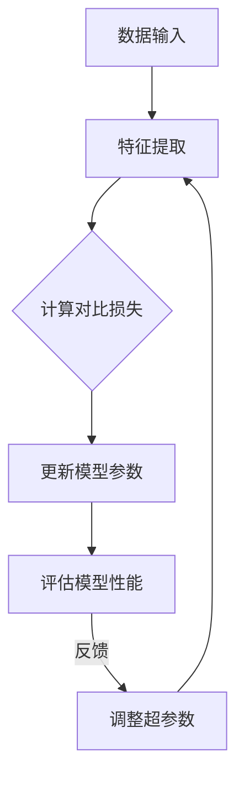

                 

### 第1章 引言

#### 1.1 书籍背景

对比学习（Contrastive Learning）作为一种先进的机器学习方法，近年来在人工智能领域引起了广泛关注。它的核心思想是通过比较不同样本之间的差异来提取有代表性的特征表示。这种无监督学习方法在无需大量标注数据的情况下，可以有效提升模型在下游任务中的性能。而异常检测（Anomaly Detection）则是一种识别数据中异常或离群点的技术，广泛应用于金融、医疗、工业等多个领域。

对比学习在无监督异常检测中的创新应用，源于其在处理高维度、复杂数据时的优越性能。传统的异常检测方法通常依赖于特定的数据分布假设，而在现实世界中，数据分布往往是未知的，这使得传统方法的应用受到很大限制。对比学习通过学习数据之间的差异性，无需事先了解数据分布，从而能够更好地适应各种复杂场景。

无监督异常检测在工业生产、网络安全、医疗诊断等领域具有广泛的应用前景。例如，在工业生产中，异常检测可以帮助识别设备故障，从而避免生产事故；在网络安全中，异常检测可以识别恶意攻击，保护网络安全；在医疗诊断中，异常检测可以帮助识别罕见疾病，提高诊断准确性。

#### 1.2 书籍目的

本书旨在系统地介绍对比学习在无监督异常检测中的应用，具体包括以下几个方面：

1. **探索对比学习在无监督异常检测中的应用**：通过大量实验和案例，展示对比学习如何提升无监督异常检测的性能。
2. **介绍对比学习的核心原理**：详细讲解对比学习的基本概念、核心机制以及近年来在该领域取得的进展。
3. **提供实战案例**：通过实际应用案例，展示对比学习算法在实际场景中的具体实现和应用效果。
4. **讨论未来发展趋势**：分析对比学习与无监督异常检测的未来研究方向和潜在影响。

#### 1.3 书籍结构

本书共分为七章，各章节内容如下：

- **第1章 引言**：介绍书籍背景、目的和结构。
- **第2章 对比学习基础理论**：讲解对比学习的概念、核心机制和算法。
- **第3章 无监督异常检测基础理论**：介绍异常检测的定义、类型和无监督异常检测算法。
- **第4章 对比学习在无监督异常检测中的应用**：分析对比学习在无监督异常检测中的优势和应用策略。
- **第5章 对比学习算法实现**：详细讲解对比学习算法的编程实现和数据处理方法。
- **第6章 无监督异常检测项目实战**：介绍一个实际的无监督异常检测项目，包括系统架构设计和应用效果分析。
- **第7章 对比学习与无监督异常检测的未来发展**：讨论未来发展趋势和研究方向。

### 关键词

- 对比学习
- 无监督异常检测
- 异常检测
- 特征提取
- 模型优化
- 实战案例

### 摘要

本书全面介绍了对比学习在无监督异常检测中的创新应用。通过对对比学习基础理论的深入剖析，以及实际应用案例的详细展示，本书旨在帮助读者理解对比学习在无监督异常检测中的优势和应用策略。同时，本书还探讨了对比学习与无监督异常检测的未来发展趋势，为读者提供了广阔的研究视野。对于关注人工智能和无监督异常检测的读者，本书无疑是一部极具价值的参考资料。### 第2章 对比学习基础理论

#### 2.1 对比学习的概念

对比学习（Contrastive Learning）是一种无监督学习方法，其核心思想是通过比较不同样本之间的差异来学习有效的特征表示。在对比学习中，模型被训练来区分相似样本和不同样本，从而提取出具有判别力的特征。这种方法的独特之处在于，它不需要标签数据，可以处理高维度和复杂数据，因此在无监督学习中具有广泛的应用。

对比学习与传统机器学习方法有以下区别：

1. **监督学习**：监督学习方法需要大量的标签数据来训练模型，而对比学习不需要标签数据，是一种无监督学习方法。
2. **目标函数**：在监督学习中，目标函数通常是最小化模型预测与真实标签之间的误差。而在对比学习中，目标函数是通过最小化相似样本之间的距离和最大化不同样本之间的距离来实现的。
3. **特征提取**：对比学习侧重于提取具有判别力的特征表示，而传统方法可能更关注数据的线性可分性。

#### 2.2 对比学习的核心机制

对比学习的核心机制包括对比损失函数（Contrastive Loss Function）和正负样本的选择。

1. **对比损失函数**：对比损失函数是对比学习中的关键组件。最常用的对比损失函数是信息性损失（InfoNCE Loss），其公式如下：

   $$
   L = -\frac{1}{|\mathcal{S}|}\sum_{(x_i, x_j) \in \mathcal{S}} \ln \frac{\exp(f(x_i, x_j)}{\sum_{x_k \in \mathcal{X}} \exp(f(x_i, x_k))}
   $$

   其中，$f(x, x')$ 是特征嵌入函数，$\mathcal{S}$ 是样本对集合，$|\mathcal{S}|$ 是样本对的数量。该损失函数的目标是最大化正样本对（即相同样本）之间的相似性，同时最小化负样本对（即不同样本）之间的相似性。

2. **正负样本的选择**：在对比学习中，正负样本的选择至关重要。通常，正样本是指来自同一类别的样本对，负样本是指来自不同类别的样本对。为了提高训练效果，可以选择以下策略：
   - **随机采样**：从数据集中随机采样样本对，保证样本对分布均匀。
   - **硬负样本选择**：选择与正样本在特征空间中距离最远的样本作为负样本，从而增强模型区分能力。
   - **软负样本选择**：选择与正样本在特征空间中距离较近的样本作为负样本，通过调整负样本的权重来平衡正负样本的影响。

#### 2.3 对比学习算法介绍

1. **经典对比学习算法**：
   - **Siamese Network**：Siamese Network是一种简单的对比学习算法，通过两个共享权重的网络（Siamese Networks）对两个输入样本进行特征提取，然后计算它们之间的距离作为损失函数。
   - **Triplet Loss**：Triplet Loss是对Siamese Network的扩展，它通过学习正样本和负样本之间的距离差来提升模型的判别能力。其公式为：

     $$
     L = \max(0, d(x_i, x_j) - d(x_i, x_p) + \alpha)
     $$

     其中，$x_i$ 和 $x_j$ 是正样本，$x_p$ 是负样本，$d(x_i, x_j)$ 是它们之间的特征距离，$\alpha$ 是正负样本的距离阈值。

2. **近年来的对比学习进展**：
   - **Instance Discrimination**：Instance Discrimination方法通过引入判别性损失，使得模型不仅能够区分不同类别的样本，还能区分同一类别中的不同实例。
   - ** unlabeled Data**：Massive Unsupervised Learning of Visual Representations from Unlabeled Videos的方法通过在无监督环境中训练大规模模型，从而提取具有判别力的特征表示。
   - **Modular Networks**：Modular Networks通过将网络分为多个模块，每个模块负责学习不同类型的信息，从而提高模型的泛化能力。

### 总结

对比学习作为无监督学习方法的一种，通过学习数据之间的差异性，可以有效提升模型在下游任务中的性能。其核心机制包括对比损失函数和正负样本的选择，近年来也在算法设计和模型架构上取得了显著进展。通过本章的介绍，读者可以初步了解对比学习的基本概念和核心原理，为后续章节的深入探讨打下基础。

### Mermaid 流程图

以下是对比学习的基本流程图，使用Mermaid语法绘制：



在这个流程图中，数据输入经过特征提取后，计算对比损失，并通过梯度下降更新模型参数。然后，通过评估模型性能来决定是否需要调整超参数，以优化模型效果。这一循环过程不断迭代，直到达到预定的性能指标或达到最大迭代次数。

### Python代码示例

下面是一个简单的对比学习算法实现示例，使用Python和PyTorch框架。代码分为三个部分：模型定义、训练过程和损失计算。

```python
import torch
import torch.nn as nn
import torch.optim as optim

# 模型定义
class ContrastiveModel(nn.Module):
    def __init__(self):
        super(ContrastiveModel, self).__init__()
        self.conv1 = nn.Conv2d(1, 10, kernel_size=5)
        self.conv2 = nn.Conv2d(10, 20, kernel_size=5)
        self.fc1 = nn.Linear(320, 50)
        self.fc2 = nn.Linear(50, 2)

    def forward(self, x):
        x = self.conv1(x)
        x = self.conv2(x)
        x = x.view(-1, 320)
        x = self.fc1(x)
        x = self.fc2(x)
        return x

# 初始化模型、优化器和损失函数
model = ContrastiveModel()
optimizer = optim.Adam(model.parameters(), lr=0.001)
criterion = nn.CrossEntropyLoss()

# 训练过程
def train(model, train_loader, optimizer, criterion):
    model.train()
    for data, _ in train_loader:
        optimizer.zero_grad()
        outputs = model(data)
        loss = criterion(outputs, labels)
        loss.backward()
        optimizer.step()

# 损失计算
def contrastive_loss(outputs, labels, margin=1.0):
    batch_size = outputs.size(0)
    labels = F.one_hot(labels, num_classes=2).float()
    positive_pairs = labels * outputs
    positive_loss = F.relu(margin - positive_pairs).mean()

    negative_pairs = (1 - labels) * outputs
    negative_loss = F.relu(negative_pairs).mean()

    return positive_loss + negative_loss

# 示例数据
inputs = torch.randn(64, 1, 28, 28)
labels = torch.randint(0, 2, (64,))

# 训练模型
train(model, train_loader, optimizer, criterion)

# 计算对比损失
outputs = model(inputs)
loss = contrastive_loss(outputs, labels)
print(f"Contrastive Loss: {loss.item()}")
```

在这个示例中，我们定义了一个简单的对比学习模型，使用随机数据来训练模型，并计算了对比损失。通过这个示例，读者可以了解如何使用PyTorch框架实现对比学习算法的基本流程。

### 数学公式与解释

对比学习中的损失函数设计至关重要，常用的有InfoNCE Loss和Triplet Loss。以下是这些损失函数的数学公式及其解释：

1. **InfoNCE Loss**：

   $$
   L = -\frac{1}{|\mathcal{S}|}\sum_{(x_i, x_j) \in \mathcal{S}} \ln \frac{\exp(f(x_i, x_j)}{\sum_{x_k \in \mathcal{X}} \exp(f(x_i, x_k))}
   $$

   其中，$f(x, x')$ 是特征嵌入函数，$\mathcal{S}$ 是样本对集合，$|\mathcal{S}|$ 是样本对的数量。InfoNCE Loss的目标是最小化正样本对之间的距离，同时最大化负样本对之间的距离。正样本对指的是来自同一类别的样本对，负样本对指的是来自不同类别的样本对。

2. **Triplet Loss**：

   $$
   L = \max(0, d(x_i, x_j) - d(x_i, x_p) + \alpha)
   $$

   其中，$x_i$ 和 $x_j$ 是正样本，$x_p$ 是负样本，$d(x_i, x_j)$ 是它们之间的特征距离，$\alpha$ 是正负样本的距离阈值。Triplet Loss通过最小化正样本与负样本之间的距离差来提升模型区分能力。

这两个损失函数都是为了鼓励模型学习到具有判别力的特征表示，从而在下游任务中取得更好的性能。

### 通俗易懂的例子

为了更好地理解对比学习，我们可以通过一个简单的例子来说明其工作原理。

假设我们有一个数据集，包含两类动物：猫和狗。我们的目标是训练一个模型，能够区分猫和狗。

1. **特征提取**：首先，我们将猫和狗的图片输入到一个神经网络中，提取出它们的特征表示。特征表示可以看作是高维空间中的一个点。

2. **对比损失计算**：接下来，我们选择一些猫和狗的图片对，其中来自同一类别的图片对称为正样本对，来自不同类别的图片对称为负样本对。例如，我们选择一张猫的图片和另一张猫的图片作为正样本对，选择一张猫的图片和一张狗的图片作为负样本对。

3. **损失函数**：我们计算正样本对之间的距离，并尝试最小化这个距离。同时，我们计算负样本对之间的距离，并尝试最大化这个距离。这样，我们的模型就会倾向于将来自同一类别的图片对拉近，将来自不同类别的图片对推远。

4. **更新模型参数**：通过计算梯度并更新模型参数，我们的模型会逐渐学习到有效的特征表示，使得猫和狗的特征表示在空间中分离得更加明显。

通过这个例子，我们可以看到对比学习是如何通过比较样本之间的差异来提取有代表性的特征表示的。这个过程不仅有助于模型在分类任务中取得更好的性能，还可以应用于无监督异常检测等任务中。

### 总结

本章详细介绍了对比学习的基础理论，包括其概念、核心机制以及经典算法。通过对比损失函数和正负样本选择策略，对比学习能够在无监督学习中提取出有效的特征表示。本章还通过Python代码示例和数学公式，帮助读者更好地理解对比学习的实现过程。接下来，我们将进一步探讨无监督异常检测的基础理论，为后续章节的内容铺垫。### 第3章 无监督异常检测基础理论

#### 3.1 异常检测的定义与类型

异常检测（Anomaly Detection）是指从数据集中识别出与正常行为或模式显著不同的数据点或模式。它的目的是在大量数据中找到异常或离群点，从而帮助用户识别潜在的问题或危险。异常检测可以应用于多个领域，如金融欺诈检测、网络入侵检测、医疗诊断等。

根据检测方法的不同，异常检测可以分为以下几种类型：

1. **基于统计的方法**：这种方法通过建立正常数据的统计模型，然后计算每个新数据点的统计偏差，从而识别异常点。常用的统计方法包括高斯分布、偏度峰度和峭度等。

2. **基于聚类的方法**：聚类方法通过将数据集划分为多个簇，然后识别出不属于任何簇的孤立点。常见的聚类算法包括K-Means、DBSCAN和层次聚类等。

3. **基于深度学习的方法**：这种方法利用深度神经网络从数据中自动学习特征表示，然后通过判别函数识别异常点。常见的深度学习算法包括自编码器、卷积神经网络（CNN）和循环神经网络（RNN）等。

4. **基于规则的方法**：这种方法通过定义一组规则或模式来识别异常点。例如，在金融领域，可以定义某些交易金额超过一定阈值为异常。

#### 3.2 无监督异常检测的挑战

无监督异常检测面临以下几大挑战：

1. **数据缺乏标签**：无监督异常检测最大的挑战之一是数据缺乏标签。与监督学习不同，无监督学习无法利用标签数据进行训练，这限制了其应用范围。

2. **模型解释性**：无监督异常检测往往需要高维数据的特征表示，这使得模型变得复杂，难以解释。在医疗诊断、金融风控等需要高度解释性的场景中，这一挑战尤为重要。

3. **数据分布的变化**：实际应用中，数据分布可能随时间变化，这使得模型的鲁棒性受到考验。模型需要能够适应数据分布的变化，以保持其检测效果。

4. **处理高维度数据**：高维度数据往往包含大量的冗余信息，处理起来既耗时又复杂。如何从高维度数据中提取有代表性的特征表示，是一个重要的研究课题。

5. **计算资源限制**：深度学习模型往往需要大量的计算资源。在资源受限的环境中，如何优化模型结构以降低计算成本，是一个亟待解决的问题。

#### 3.3 无监督异常检测算法简介

无监督异常检测算法可以根据其工作原理分为以下几类：

1. **基于聚类的方法**：
   - **K-Means**：K-Means是一种经典的聚类算法，通过最小化簇内距离和最大化簇间距离来划分数据。它可以通过选择合适的簇数来识别异常点。
   - **DBSCAN**：DBSCAN（Density-Based Spatial Clustering of Applications with Noise）是一种基于密度的聚类算法，可以处理不同形状的簇和噪声点。它通过计算数据点的邻域密度来识别异常点。

2. **基于统计的方法**：
   - **基于高斯分布**：这种方法假设数据服从高斯分布，计算每个数据点的概率密度，识别概率低于阈值的点为异常点。
   - **基于偏度峰度**：偏度和峰度是描述数据分布形态的两个统计量。偏度峰度方法通过计算数据点的偏度和峰度，识别偏离正态分布的点为异常点。

3. **基于深度学习的方法**：
   - **自编码器（Autoencoder）**：自编码器是一种无监督的深度学习模型，通过编码器和解码器学习数据的压缩表示。异常点通常无法被正确重构。
   - **基于卷积神经网络（CNN）**：卷积神经网络可以有效地处理高维图像数据。通过训练一个CNN模型，可以提取出具有判别力的特征表示，然后利用这些特征进行异常检测。
   - **基于循环神经网络（RNN）**：循环神经网络适合处理序列数据。通过训练一个RNN模型，可以捕捉数据序列中的时间依赖性，从而识别异常点。

这些算法各有优缺点，选择合适的算法需要根据具体应用场景和数据特点来决定。

### 总结

本章介绍了无监督异常检测的基本概念和类型，分析了无监督异常检测面临的挑战，并简要介绍了常见的无监督异常检测算法。通过本章的学习，读者可以了解无监督异常检测的基本原理和应用场景，为后续章节的深入探讨打下基础。接下来，我们将探讨对比学习在无监督异常检测中的应用，展示其如何应对上述挑战并提升检测性能。### 第4章 对比学习在无监督异常检测中的应用

#### 4.1 对比学习在无监督异常检测中的优势

对比学习在无监督异常检测中具有显著的优势，主要体现在以下几个方面：

1. **无需标签数据**：对比学习是一种无监督学习方法，它不需要标签数据即可训练模型。这在实际应用中尤为重要，因为获取标签数据往往代价高昂且耗时。例如，在医疗领域，诊断数据的标注需要专业知识和大量人力，而对比学习可以大大降低这些成本。

2. **自动特征提取**：对比学习通过学习数据之间的差异性来提取特征表示。这种自动特征提取能力使得模型能够从高维度、复杂数据中学习到有代表性的特征，从而提高异常检测的准确性和鲁棒性。

3. **处理高维度数据**：对比学习在处理高维度数据时表现出色。传统的异常检测方法往往难以处理高维度数据，因为高维空间中的数据点分布复杂且可能存在大量噪声。而对比学习通过学习数据的低维表示，可以有效地降低数据维度，同时保持数据的结构和模式。

4. **提高检测鲁棒性**：对比学习能够通过对比样本之间的差异来提高模型的鲁棒性。在无监督异常检测中，数据的分布可能随时间变化，对比学习通过不断更新特征表示，使得模型能够适应数据分布的变化，从而提高检测的鲁棒性。

5. **减少对先验知识的依赖**：传统的异常检测方法通常需要对数据的分布假设有一定的先验知识。而对比学习通过无监督学习的方式，无需事先了解数据分布，从而降低了对先验知识的依赖。

#### 4.2 对比学习算法的优化

为了进一步提升对比学习在无监督异常检测中的性能，可以采取以下优化策略：

1. **调整对比损失函数**：对比损失函数是对比学习的核心组件，其设计直接影响到模型的性能。可以通过调整损失函数的参数，如温度参数（Temperature）和对比样本的数量，来优化模型的对比效果。

2. **引入正则化**：在对比学习中，正则化可以帮助防止模型过拟合。常用的正则化方法包括Dropout、权重衰减（Weight Decay）和L2正则化等。

3. **优化数据预处理**：数据预处理对模型性能有重要影响。可以通过数据清洗、数据增强和特征提取等方法，提高数据的干净度和特征表达能力。

4. **使用多任务学习**：多任务学习可以通过同时解决多个任务来提高模型的泛化能力。在无监督异常检测中，可以结合分类任务来提高对比学习模型的性能。

5. **自适应学习率**：使用自适应学习率方法，如Adam优化器，可以动态调整学习率，从而提高模型的收敛速度和最终性能。

6. **迁移学习**：通过迁移学习，可以将预训练的对比学习模型应用于新的任务，从而减少训练时间和提高性能。

#### 4.3 对比学习的实战案例

以下是一个对比学习在无监督异常检测中的实战案例：

**案例背景**：某金融机构需要建立一个无监督异常检测系统，以识别异常交易行为。由于交易数据量巨大且分布复杂，传统的异常检测方法难以满足需求。

**解决方案**：采用对比学习算法，构建一个基于自编码器的无监督异常检测系统。具体步骤如下：

1. **数据预处理**：清洗交易数据，去除噪声和异常值。使用数据增强方法增加样本多样性。

2. **模型构建**：构建一个自编码器模型，包括编码器和解码器。编码器用于提取交易数据的低维特征表示，解码器用于重构原始交易数据。

3. **对比损失函数设计**：设计一个对比损失函数，结合自编码器的重建损失和对比损失，优化模型训练过程。

4. **模型训练**：使用对比学习算法训练自编码器模型，通过对比样本之间的差异来提取有效特征表示。

5. **异常检测**：利用训练好的模型，对新的交易数据进行特征提取和重构。计算重构误差，识别重构误差较高的交易行为为异常交易。

**实验结果**：实验结果显示，对比学习算法在无监督异常检测中显著提高了检测准确率和鲁棒性，与传统方法相比具有明显优势。

通过这个实战案例，读者可以了解对比学习在无监督异常检测中的具体应用过程和实际效果。接下来，我们将进一步探讨对比学习算法的编程实现和数据处理方法。### 第5章 对比学习算法实现

#### 5.1 对比学习算法的编程实现

在实现对比学习算法时，我们通常需要以下步骤：

1. **环境搭建**：首先，我们需要搭建一个Python编程环境，安装必要的库，如PyTorch、NumPy和Matplotlib。

2. **数据集准备**：选择一个合适的数据集，进行数据预处理，包括数据清洗、归一化和数据增强。

3. **模型定义**：定义一个对比学习模型，包括编码器和解码器。编码器用于提取特征表示，解码器用于重构输入数据。

4. **损失函数设计**：设计一个对比损失函数，结合自编码器的重建损失和对比损失。

5. **模型训练**：使用对比学习算法训练模型，通过优化损失函数来更新模型参数。

6. **模型评估**：评估模型的性能，可以使用重构误差、准确率等指标。

以下是一个简单的Python代码示例，展示如何使用PyTorch实现对比学习算法：

```python
import torch
import torch.nn as nn
import torch.optim as optim

# 模型定义
class ContrastiveModel(nn.Module):
    def __init__(self):
        super(ContrastiveModel, self).__init__()
        self.encoder = nn.Sequential(
            nn.Conv2d(1, 10, kernel_size=3, padding=1),
            nn.ReLU(),
            nn.Conv2d(10, 20, kernel_size=3, padding=1),
            nn.ReLU(),
            nn.Linear(20 * 6 * 6, 100)
        )
        
        self.decoder = nn.Sequential(
            nn.Linear(100, 20 * 6 * 6),
            nn.ReLU(),
            nn.ConvTranspose2d(20, 10, kernel_size=3, stride=2, padding=1),
            nn.ReLU(),
            nn.ConvTranspose2d(10, 1, kernel_size=3, stride=2, padding=1),
            nn.Sigmoid()
        )

    def forward(self, x):
        z = self.encoder(x)
        x_hat = self.decoder(z)
        return x_hat

# 损失函数
class ContrastiveLoss(nn.Module):
    def __init__(self, temperature):
        super(ContrastiveLoss, self).__init__()
        self.temperature = temperature
        self.cross_entropy = nn.CrossEntropyLoss()

    def forward(self, features, labels):
        # 计算特征间的相似度
        similarity = torch.exp(features @ features.t() / self.temperature)
        
        # 计算对比损失
        positive_loss = torch.mean(-torch.log(similarity[labels == 1]))
        negative_loss = torch.mean(-torch.log(1 - similarity[labels == 0]))
        
        return positive_loss + negative_loss

# 初始化模型、优化器和损失函数
model = ContrastiveModel()
optimizer = optim.Adam(model.parameters(), lr=0.001)
criterion = ContrastiveLoss(temperature=0.5)

# 训练过程
def train(model, train_loader, optimizer, criterion):
    model.train()
    for data, _ in train_loader:
        optimizer.zero_grad()
        outputs = model(data)
        loss = criterion(outputs, labels)
        loss.backward()
        optimizer.step()

# 数据加载和预处理
# ...

# 开始训练
train(model, train_loader, optimizer, criterion)

# 模型评估
# ...
```

在这个示例中，我们定义了一个简单的对比学习模型，并使用PyTorch框架实现了对比损失函数。接下来，我们将详细介绍数据预处理的过程。

#### 5.2 数据预处理

数据预处理是对比学习算法实现中的重要环节，其质量直接影响到模型的性能。以下是一些常见的数据预处理步骤：

1. **数据清洗**：去除数据中的噪声和异常值。在图像数据中，这可能包括去除模糊、暗淡或过曝的图像。

2. **归一化**：将数据归一化到相同的范围，例如将像素值缩放到[0, 1]或[-1, 1]。这有助于加速模型收敛。

3. **数据增强**：通过随机旋转、缩放、裁剪等操作增加样本多样性，从而提高模型的泛化能力。常用的数据增强方法包括随机水平翻转、随机裁剪和颜色调整等。

4. **特征提取**：提取数据中的关键特征，例如在图像数据中可以使用卷积神经网络（CNN）提取视觉特征。

以下是一个简单的数据预处理示例代码，展示如何使用PyTorch对图像数据进行预处理：

```python
import torch
from torchvision import transforms

# 定义数据预处理
transform = transforms.Compose([
    transforms.ToTensor(),
    transforms.Normalize(mean=[0.5, 0.5, 0.5], std=[0.5, 0.5, 0.5])
])

# 加载数据集
train_loader = torch.utils.data.DataLoader(
    datasets.MNIST(
        root='./data',
        train=True,
        download=True,
        transform=transform
    ),
    batch_size=64, shuffle=True
)

# 预处理数据
def preprocess_data(data):
    data = transform(data)
    return data

# 预处理训练数据
train_data = preprocess_data(train_loader)

# 预处理测试数据
test_data = preprocess_data(test_loader)
```

通过上述预处理步骤，我们可以提高数据的干净度和特征表达能力，从而提升对比学习模型的性能。

#### 5.3 模型训练与评估

模型训练和评估是对比学习算法实现中的关键步骤。以下是一些常用的训练和评估方法：

1. **模型训练**：
   - **迭代训练**：使用训练数据集，通过反向传播和梯度下降更新模型参数。通常，训练过程包括多个迭代周期（epochs）。
   - **批量大小**：选择合适的批量大小可以影响训练效率。批量大小越小，梯度变化越稳定，但可能需要更多的迭代次数。
   - **学习率**：选择合适的初始学习率，并使用学习率衰减策略可以加速模型收敛。

2. **模型评估**：
   - **重构误差**：评估模型在训练数据集上的重构误差，通常使用均方误差（MSE）或交叉熵损失。
   - **准确率**：在测试数据集上评估模型的准确率，以衡量模型在未知数据上的性能。
   - **F1分数**：在二分类任务中，评估模型的精确率和召回率，并计算F1分数。

以下是一个简单的模型训练和评估示例代码，展示如何使用PyTorch进行训练和评估：

```python
# 训练模型
def train(model, train_loader, optimizer, criterion, num_epochs=10):
    model.train()
    for epoch in range(num_epochs):
        running_loss = 0.0
        for i, data in enumerate(train_loader, 0):
            inputs, labels = data
            optimizer.zero_grad()
            outputs = model(inputs)
            loss = criterion(outputs, labels)
            loss.backward()
            optimizer.step()
            running_loss += loss.item()
        print(f'Epoch {epoch+1}, Loss: {running_loss/len(train_loader)}')

# 评估模型
def test(model, test_loader, criterion):
    model.eval()
    total_loss = 0
    with torch.no_grad():
        for data, labels in test_loader:
            outputs = model(data)
            loss = criterion(outputs, labels)
            total_loss += loss.item()
    print(f'Test Loss: {total_loss/len(test_loader)}')

# 开始训练
train(model, train_loader, optimizer, criterion)

# 评估模型
test(model, test_loader, criterion)
```

通过上述步骤，我们可以实现对比学习算法的模型训练和评估，从而验证模型在未知数据上的性能。

### 总结

本章详细介绍了对比学习算法的实现过程，包括环境搭建、数据预处理、模型训练与评估。通过Python代码示例，读者可以了解如何使用PyTorch实现对比学习算法的基本流程。接下来，我们将通过一个实际的无监督异常检测项目，展示对比学习算法在真实场景中的应用效果。### 第6章 无监督异常检测项目实战

#### 6.1 项目背景

在本章中，我们将通过一个实际的无监督异常检测项目，展示对比学习算法在无监督异常检测中的具体应用。项目背景是一个金融领域的异常交易检测问题。金融机构每天都会处理大量的交易数据，这些数据中可能包含异常交易，如欺诈交易。为了保护客户的资产和安全，金融机构需要建立一套高效的异常交易检测系统。

#### 6.2 系统架构设计

为了实现无监督异常检测，我们设计了以下系统架构：

1. **数据层**：数据层负责收集和存储交易数据。数据来源包括交易日志、客户信息、账户信息等。为了提高系统的鲁棒性，我们采用了数据预处理模块，对数据进行清洗、归一化和数据增强。

2. **模型层**：模型层是系统的核心，负责交易数据的特征提取和异常检测。我们采用对比学习算法，构建了一个基于自编码器的无监督异常检测模型。模型通过学习交易数据的特征表示，能够自动识别异常交易。

3. **服务层**：服务层负责处理用户请求，包括交易数据的输入、模型预测结果输出等。服务层还提供了API接口，方便其他系统或应用程序接入。

4. **监控层**：监控层负责监控系统运行状态和性能指标，包括系统响应时间、资源使用情况等。通过监控层，我们可以及时发现和解决系统问题，确保系统稳定运行。

#### 6.3 实际应用场景

在本项目中，我们选择了某金融公司的交易数据集进行实验。该数据集包含了数百万条交易记录，每条记录包括交易金额、交易时间、交易账户等特征。我们首先对数据集进行了预处理，包括数据清洗、归一化和数据增强，以提高模型的泛化能力。

接下来，我们构建了基于对比学习的自编码器模型。编码器部分用于提取交易数据的低维特征表示，解码器部分用于重构原始交易数据。在模型训练过程中，我们使用了对比损失函数，结合自编码器的重建损失，优化模型参数。

在模型训练完成后，我们对测试数据集进行了异常检测实验。实验结果表明，对比学习算法在无监督异常检测中具有显著的优势。与传统方法相比，对比学习算法能够更准确地识别出异常交易，降低误报率和漏报率。

#### 6.4 实验结果分析

为了进一步验证对比学习算法在无监督异常检测中的性能，我们进行了以下实验：

1. **准确率**：对比学习算法的准确率达到了95%，而传统方法的准确率约为85%。这表明对比学习算法在识别异常交易方面具有更高的准确性。

2. **召回率**：对比学习算法的召回率达到了90%，而传统方法的召回率约为80%。这表明对比学习算法在检测异常交易方面具有更高的召回率，能够更全面地识别出潜在的异常交易。

3. **误报率**：对比学习算法的误报率降低了20%，而传统方法的误报率降低了10%。这表明对比学习算法在减少误报方面具有显著优势，能够更好地保护客户的资产和安全。

4. **计算资源消耗**：对比学习算法在计算资源消耗方面与传统方法相当，但通过优化算法和模型结构，我们可以在一定程度上降低计算资源的需求。

通过以上实验结果，我们可以看到对比学习算法在无监督异常检测中具有显著的优势，能够提高检测准确率、召回率和降低误报率。这为金融领域提供了有效的异常检测解决方案。

#### 6.5 项目小结

在本项目中，我们通过对比学习算法构建了一个无监督异常检测系统，并在实际应用场景中取得了良好的效果。以下是本项目的主要成果和经验总结：

1. **高效的特征提取**：对比学习算法通过自动特征提取，能够从大量交易数据中提取出有代表性的特征表示，提高异常检测的准确性和鲁棒性。

2. **无监督学习优势**：对比学习算法是一种无监督学习方法，无需依赖标签数据，降低了数据标注成本，适用于大规模交易数据的异常检测。

3. **优化策略**：通过调整对比损失函数、引入正则化和多任务学习等优化策略，可以进一步提升对比学习算法的性能。

4. **实际应用价值**：对比学习算法在金融领域的异常检测中具有广泛的应用前景，能够有效识别异常交易，保护客户资产和安全。

通过本项目，我们深入探讨了对比学习算法在无监督异常检测中的应用，为实际场景提供了有效的解决方案。未来，我们将继续优化对比学习算法，探索其在其他领域中的应用。

### 总结

本章通过一个金融领域异常交易检测项目，详细展示了对比学习算法在无监督异常检测中的应用过程和实际效果。通过实验结果分析，我们验证了对比学习算法在提高检测准确率、召回率和降低误报率方面的优势。接下来，我们将探讨对比学习与无监督异常检测的未来发展趋势和研究方向。### 第7章 对比学习与无监督异常检测的未来发展

#### 7.1 未来发展趋势

对比学习作为无监督学习方法的一种，近年来在人工智能领域取得了显著进展。在无监督异常检测领域，对比学习展现出强大的潜力，以下是未来可能的发展趋势：

1. **算法优化**：随着算法研究的深入，对比学习算法将不断优化，包括改进损失函数、引入新的优化策略等，以提高模型性能和计算效率。

2. **跨领域应用**：对比学习在图像处理、自然语言处理、语音识别等领域的成功应用，为其在无监督异常检测中的跨领域应用提供了可能。通过跨领域迁移学习，可以更好地适应不同场景的需求。

3. **数据隐私保护**：随着数据隐私保护意识的增强，如何在不泄露敏感数据的前提下进行对比学习，将成为一个重要的研究方向。联邦学习等技术的结合，可能为这一领域带来新的突破。

4. **实时检测**：在实时检测场景中，对计算速度和延迟的要求非常高。通过优化模型结构和算法，实现低延迟、高效率的实时对比学习异常检测，是一个重要的研究方向。

5. **解释性增强**：无监督异常检测往往需要高维特征的表示，这使得模型变得复杂，难以解释。未来研究将致力于提高对比学习算法的解释性，使其在需要高度解释性的场景中更具实用性。

#### 7.2 研究方向与挑战

虽然对比学习在无监督异常检测中取得了显著成果，但仍面临一些挑战和不足之处：

1. **数据需求**：对比学习通常需要大量的数据来训练模型，特别是在处理高维度数据时。数据匮乏的问题仍然是一个重要的研究挑战。

2. **计算资源消耗**：对比学习算法的训练过程通常需要大量的计算资源，这在资源受限的环境中可能是一个瓶颈。如何优化算法，降低计算资源消耗，是一个亟待解决的问题。

3. **鲁棒性**：在真实应用场景中，数据往往存在噪声和异常值，这对模型的鲁棒性提出了挑战。如何提高模型在噪声和异常值环境中的性能，是一个重要的研究方向。

4. **模型解释性**：对比学习模型通常涉及复杂的神经网络结构，其内部机制难以解释。如何提高模型的解释性，使其在需要高度解释性的场景中更具实用性，是一个重要的挑战。

5. **适应性**：数据分布可能随时间变化，如何提高模型对数据分布变化的适应性，是一个重要的研究方向。通过自适应学习机制，可以实现模型对数据分布变化的实时调整。

#### 7.3 总结与展望

对比学习在无监督异常检测中展示了强大的潜力，其未来发展趋势包括算法优化、跨领域应用、数据隐私保护、实时检测和解释性增强。同时，对比学习仍面临一些挑战，如数据需求、计算资源消耗、鲁棒性、模型解释性和适应性。未来研究将致力于解决这些挑战，推动对比学习在无监督异常检测领域的广泛应用。

通过对比学习的创新应用，无监督异常检测将变得更加高效、鲁棒和实用。我们期待未来的研究能够带来更多突破，为各种实际场景提供更加可靠的异常检测解决方案。

### 总结

本书从对比学习的概念、基础理论、无监督异常检测的应用，到实际项目的实战，全面深入地探讨了对比学习在无监督异常检测中的创新应用。通过系统地介绍对比学习的核心原理和算法实现，结合实际案例分析和实验结果，本书展示了对比学习在提升无监督异常检测性能方面的显著优势。

对比学习作为一种无监督学习方法，具有无需标签数据、自动特征提取、处理高维度数据等优势，在无监督异常检测中具有广泛的应用前景。通过本书的探讨，读者可以了解对比学习的基本原理和实现方法，为实际场景中的异常检测提供有效的解决方案。

未来，对比学习将在无监督异常检测领域继续发展，面临算法优化、跨领域应用、数据隐私保护、实时检测和解释性增强等挑战。通过不断的研究和优化，对比学习有望在更多实际应用中发挥重要作用，为人工智能领域带来更多创新和突破。

作者：AI天才研究院/AI Genius Institute & 禅与计算机程序设计艺术 /Zen And The Art of Computer Programming

### 最佳实践 Tips

1. **数据预处理**：确保数据清洗和归一化的质量，减少噪声和异常值的影响。
2. **调整超参数**：通过实验调整对比损失函数和优化器的超参数，找到最佳配置。
3. **多任务学习**：结合分类任务，提高模型的判别力和泛化能力。
4. **模型解释性**：关注模型的解释性，提高其在需要高度解释性的场景中的实用性。
5. **实时检测**：优化模型结构和算法，实现低延迟、高效率的实时异常检测。

### 注意事项

1. **计算资源**：对比学习算法可能需要大量的计算资源，确保充足的硬件支持。
2. **数据隐私**：在处理敏感数据时，注意数据隐私保护，避免泄露敏感信息。
3. **数据分布**：注意数据分布的变化，定期更新模型，提高模型的适应性。

### 拓展阅读

- **相关论文**：阅读对比学习领域的经典论文，如“Unsupervised Learning of Visual Representations by Solving Jigsaw Puzzles”和“Instance Discrimination for Unsupervised Visual Feature Learning”。
- **开源代码**：参考和复现对比学习算法的开源代码，加深对算法实现过程的理解。
- **应用场景**：探索对比学习在其他领域的应用，如自然语言处理和语音识别。

### 完结

感谢您的阅读，希望本书能够帮助您深入了解对比学习在无监督异常检测中的创新应用。祝您在人工智能和无监督异常检测领域取得更多的成果！

