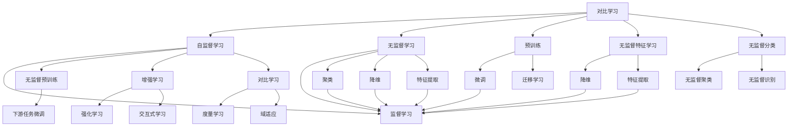
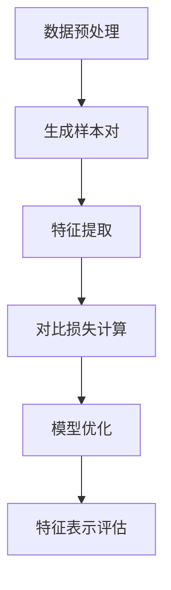

                 

### 引言

#### 背景介绍

自监督学习（Self-supervised Learning）是人工智能领域中的一个重要研究方向，它通过对未标记数据进行学习，从而自动生成对下游任务有用的特征表示。自监督学习不仅能够节省大量的标注成本，还可以提高模型在不同领域的泛化能力。然而，传统的自监督学习方法主要依赖于监督信号，例如标签信息，这在缺乏标注数据的情况下往往受到限制。

对比学习（Contrastive Learning）作为一种无监督学习方法，近年来在自监督学习中展现出了强大的潜力。对比学习的基本思想是，通过将相关数据对放在一起，同时将不相关数据分开，来学习数据的表示。这种学习方法在无需依赖标签信息的情况下，能够有效提升数据表示的区分度，从而有助于下游任务的性能提升。

#### 核心概念与联系

为了更好地理解对比学习的核心概念，我们可以通过一个Mermaid流程图来展示其与相关概念的联系：



在这个流程图中，我们可以看到对比学习（Contrastive Learning）作为自监督学习（Self-supervised Learning）的一种，与无监督学习（Unsupervised Learning）、预训练（Pre-training）、迁移学习（Transfer Learning）等概念紧密相关。对比学习通过最大化相关数据对的相似度，最小化不相关数据对的相似度，从而实现有效的特征学习。

#### 核心算法原理讲解

对比学习的核心在于如何构造有效的对比损失函数。下面我们通过一个Python源代码示例，详细讲解对比学习的算法原理。

```python
import torch
import torch.nn as nn
import torchvision.transforms as transforms
from torch.utils.data import DataLoader
from torchvision.datasets import MNIST
from torch.optim import Adam

# 定义对比学习模型
class ContrastiveModel(nn.Module):
    def __init__(self):
        super(ContrastiveModel, self).__init__()
        self.encoder = nn.Sequential(
            nn.Conv2d(1, 64, kernel_size=3, padding=1),
            nn.ReLU(inplace=True),
            nn.Conv2d(64, 64, kernel_size=3, padding=1),
            nn.ReLU(inplace=True),
            nn.Conv2d(64, 64, kernel_size=3, padding=1),
            nn.ReLU(inplace=True),
            nn.AdaptiveAvgPool2d((1, 1)),
            nn.Flatten()
        )
    
    def forward(self, x):
        return self.encoder(x)

# 数据预处理
transform = transforms.Compose([
    transforms.ToTensor(),
    transforms.Normalize((0.5,), (0.5,))
])

# 加载MNIST数据集
train_dataset = MNIST(root='./data', train=True, download=True, transform=transform)
train_loader = DataLoader(train_dataset, batch_size=128, shuffle=True)

# 初始化模型、损失函数和优化器
model = ContrastiveModel()
criterion = nn.CosineSimilarity(dim=1)
optimizer = Adam(model.parameters(), lr=0.001)

# 训练模型
for epoch in range(10):
    for images, _ in train_loader:
        optimizer.zero_grad()
        
        # 对每一张图像，生成一对正样本和负样本
        positives = images.repeat(2, 1, 1, 1)
        negatives = torch.randint(0, 10000, (images.shape[0],), dtype=torch.long).repeat(2, 1)
        negatives = torch.cat((images[negatives % images.shape[0]], images[negatives % images.shape[0]]), dim=0)
        
        # 计算编码器的输出
        positive_features = model(positives)
        negative_features = model(negatives)
        
        # 计算对比损失
        loss = criterion(positive_features, negative_features)
        
        # 反向传播和优化
        loss.backward()
        optimizer.step()
        
    print(f'Epoch [{epoch+1}/10], Loss: {loss.item()}')

# 保存模型
torch.save(model.state_dict(), 'contrastive_model.pth')
```

在上面的代码中，我们首先定义了一个简单的卷积神经网络作为编码器（encoder），用于提取图像的特征表示。然后，我们使用Cosine Similarity作为对比损失函数，通过最大化正样本对之间的相似度，同时最小化负样本对之间的相似度来训练模型。

具体来说，我们首先加载MNIST数据集，并使用一个数据增强策略来生成正样本对和负样本对。在训练过程中，我们通过交替更新正样本对和负样本对的编码特征，来优化模型参数。每次迭代后，我们计算对比损失并更新模型权重。

通过这样的训练过程，模型学会了捕捉图像的内在结构，从而在无需标签信息的情况下，生成对下游任务有用的特征表示。

#### 数学模型和公式

在对比学习中，常用的对比损失函数之一是InfoNCE，其数学公式如下：

$$
L = -\sum_{i=1}^N \sum_{j=1, j\neq i}^N \frac{z_i \cdot z_j}{\tau + ||z_i - z_j||}
$$

其中，$N$表示数据集中的样本数量，$z_i$和$z_j$分别表示样本$i$和$j$的编码特征，$\tau$是温度超参数，$||z_i - z_j||$表示特征向量之间的距离。

InfoNCE损失函数通过最大化正样本对之间的相似度，同时最小化负样本对之间的相似度来实现特征学习。温度超参数$\tau$用于调节相似度计算的敏感度，一般取值在0.5到2之间。

#### 通俗易懂的举例说明

假设我们有一组图像，其中包含不同类别的人脸图像。我们希望通过对比学习来学习这些图像的特征表示，从而在无需标签信息的情况下，能够进行人脸识别。

1. **数据预处理**：首先，我们将这些图像数据转换为Tensor格式，并进行归一化处理，以便输入到神经网络中。

2. **生成正负样本对**：对于每张图像，我们生成一对正样本和负样本。正样本对是由同一张图像生成的，而负样本对是由不同图像生成的。

3. **编码特征提取**：我们将这些正负样本对输入到编码器网络中，提取出它们的编码特征。

4. **计算对比损失**：对于每对样本，我们计算它们的编码特征之间的余弦相似度，并使用InfoNCE损失函数来计算对比损失。

5. **优化模型参数**：通过反向传播和梯度下降，我们不断优化编码器网络的参数，以最小化对比损失。

6. **特征表示学习**：经过多次迭代训练后，编码器网络学会了提取具有区分度的特征表示，使得同一类别的图像特征更接近，不同类别的图像特征更分散。

7. **下游任务应用**：在完成特征学习后，我们可以使用这些特征表示来进行下游任务，如人脸识别、图像分类等。

通过这样的对比学习过程，我们能够在无需标签信息的情况下，自动学习到有意义的图像特征，从而提高下游任务的性能。

#### 小结

对比学习是一种无监督学习方法，通过最大化正样本对之间的相似度，同时最小化负样本对之间的相似度，来学习数据的特征表示。通过Python源代码示例，我们详细讲解了对比学习的算法原理和实现过程。在未来的文章中，我们将进一步探讨对比学习在不同领域的应用，以及如何优化对比学习在自监督AI训练中的性能。### 对比学习在自监督AI训练中的应用

#### 自监督学习的原理

自监督学习（Self-supervised Learning）是一种无需人工标注数据，通过内部数据之间的关联性来学习模型的方法。自监督学习的关键在于如何将未标记的数据转化为有效的学习信号。这种学习方法不仅在数据稀缺的情况下具有显著的优势，还可以提高模型在不同领域的泛化能力。

自监督学习可以分为几个层次：

1. **无监督特征学习**：直接从未标记数据中提取特征表示，如降维、特征提取等。
2. **无监督分类**：通过将数据分成不同的类别来学习特征表示，如无监督聚类、无监督识别等。
3. **自监督预训练**：利用未标记数据进行预训练，然后通过微调（fine-tuning）来适应特定的下游任务。

#### 对比学习在自监督学习中的应用

对比学习在自监督学习中的应用非常广泛，其主要思想是通过比较数据对之间的相似度来学习特征表示。以下是对比学习在自监督学习中的应用：

1. **图像域适应（Image Domain Adaptation）**：对比学习可以帮助模型适应不同的图像域，如将模型从一个图像域迁移到另一个图像域，以提高模型在特定场景下的性能。

2. **度量学习（Metric Learning）**：通过学习数据的度量空间，对比学习可以帮助模型更好地区分相关的和无关的数据，从而提高特征表示的区分度。

3. **无监督特征提取（Unsupervised Feature Extraction）**：对比学习可以通过最大化正样本对之间的相似度和最小化负样本对之间的相似度，来提取具有区分度的特征表示。

#### 对比学习的挑战与解决方案

尽管对比学习在自监督学习中具有广泛的应用前景，但仍然面临着一些挑战：

1. **负样本选择**：如何选择合适的负样本对是对比学习中的一个关键问题。选择不当可能导致模型学习到无意义的特征。

2. **数据增强**：如何设计有效的数据增强策略来生成足够的正负样本对是一个挑战。

3. **优化算法**：如何设计高效的优化算法来优化模型参数，以最小化对比损失是一个重要的研究问题。

为了解决这些挑战，研究者们提出了一系列解决方案：

1. **负样本生成**：一些方法通过随机采样、硬负样本挖掘等技术来生成负样本对。

2. **数据增强**：通过图像变换、数据合成等方法来增加数据的多样性，从而生成更多的正负样本对。

3. **优化算法**：使用梯度裁剪、动量调度等技术来优化模型参数，以提高模型性能。

#### 实际案例：对比学习在图像分类中的应用

以下是一个使用对比学习进行图像分类的简单实际案例：

```python
import torch
import torchvision.models as
from torchvision.datasets import CIFAR10
from torchvision.transforms import ToTensor

# 加载CIFAR10数据集
transform = ToTensor()
train_dataset = CIFAR10(root='./data', train=True, download=True, transform=transform)
train_loader = DataLoader(train_dataset, batch_size=128, shuffle=True)

# 定义对比学习模型
class ContrastiveModel(nn.Module):
    def __init__(self):
        super(ContrastiveModel, self).__init__()
        self.encoder = nn.Sequential(
            nn.Conv2d(3, 64, kernel_size=3, padding=1),
            nn.ReLU(inplace=True),
            nn.Conv2d(64, 64, kernel_size=3, padding=1),
            nn.ReLU(inplace=True),
            nn.Conv2d(64, 64, kernel_size=3, padding=1),
            nn.ReLU(inplace=True),
            nn.AdaptiveAvgPool2d((1, 1)),
            nn.Flatten(),
            nn.Linear(64, 10)
        )
    
    def forward(self, x):
        return self.encoder(x)

# 初始化模型、损失函数和优化器
model = ContrastiveModel()
criterion = nn.CosineSimilarity(dim=1)
optimizer = Adam(model.parameters(), lr=0.001)

# 训练模型
for epoch in range(10):
    for images, _ in train_loader:
        optimizer.zero_grad()
        
        # 对每一张图像，生成一对正样本和负样本
        positives = images.repeat(2, 1, 1, 1)
        negatives = torch.randint(0, 10000, (images.shape[0],), dtype=torch.long).repeat(2, 1)
        negatives = torch.cat((images[negatives % images.shape[0]], images[negatives % images.shape[0]]), dim=0)
        
        # 计算编码器的输出
        positive_features = model(positives)
        negative_features = model(negatives)
        
        # 计算对比损失
        loss = criterion(positive_features, negative_features)
        
        # 反向传播和优化
        loss.backward()
        optimizer.step()
        
    print(f'Epoch [{epoch+1}/10], Loss: {loss.item()}')

# 保存模型
torch.save(model.state_dict(), 'contrastive_model.pth')
```

在这个案例中，我们使用CIFAR10数据集来训练一个对比学习模型。通过生成正样本对和负样本对，模型学会了提取具有区分度的特征表示。训练完成后，我们可以使用这些特征表示来进行图像分类任务。

#### 小结

对比学习在自监督学习中具有广泛的应用，通过最大化正样本对之间的相似度和最小化负样本对之间的相似度，模型可以学习到有意义的特征表示。在实际应用中，通过合理的负样本选择、数据增强和优化算法，可以提高对比学习在自监督学习中的性能。未来的研究将继续探索如何更好地利用对比学习来解决自监督学习中的挑战。### 对比学习的核心算法

对比学习作为一种无监督学习方法，其核心在于通过设计有效的对比损失函数，将相关数据对放在一起，同时将不相关数据对分开，从而学习到有意义的特征表示。在本章节中，我们将详细介绍对比学习的核心算法，包括对抗性损失函数、图像域适应和对抗性神经网络。

#### 抗性损失函数

对抗性损失函数（Adversarial Loss Function）是对比学习的核心组成部分，它通过最大化正样本对之间的相似度，同时最小化负样本对之间的相似度，来实现特征学习。以下是一个常见的对抗性损失函数——InfoNCE（Information NCE Loss）的数学公式：

$$
L = -\sum_{i=1}^N \sum_{j=1, j\neq i}^N \frac{z_i \cdot z_j}{\tau + ||z_i - z_j||}
$$

其中，$N$表示数据集中的样本数量，$z_i$和$z_j$分别表示样本$i$和$j$的编码特征，$\tau$是温度超参数，$||z_i - z_j||$表示特征向量之间的距离。

在InfoNCE损失函数中，正样本对之间的相似度由$z_i \cdot z_j$计算得到，其中$\cdot$表示内积操作。为了确保正样本对之间的相似度大于负样本对之间的相似度，我们使用$\tau + ||z_i - z_j||$作为分母，其中$\tau$是一个调节相似度敏感度的温度超参数，$||z_i - z_j||$表示特征向量之间的距离。通过这种方式，我们可以保证正样本对之间的相似度最大化，同时最小化负样本对之间的相似度。

#### 图像域适应

图像域适应（Image Domain Adaptation）是对比学习在计算机视觉中的一个重要应用，其主要目标是利用未标记的源域数据，学习到对目标域数据具有良好泛化能力的特征表示。图像域适应的核心在于如何设计有效的对比损失函数，以使模型在源域和目标域之间保持一致性。

以下是一个基于对比学习的图像域适应的数学模型：

$$
L_{DA} = \lambda_1 \cdot L_{CE} + \lambda_2 \cdot L_{CL}
$$

其中，$L_{CE}$是分类损失（Cross-Entropy Loss），用于在源域数据上训练分类器；$L_{CL}$是对比损失（Contrastive Loss），用于在源域和目标域数据上同时训练模型；$\lambda_1$和$\lambda_2$是超参数，用于调节分类损失和对比损失的权重。

通过这种方式，模型在源域数据上学习到有意义的特征表示，同时在目标域数据上保持一致性，从而实现图像域适应。

#### 抗性神经网络

对抗性神经网络（Adversarial Neural Network）是一种基于对比学习的神经网络结构，其主要目标是学习到具有区分度的特征表示。对抗性神经网络由两个子网络组成：编码器（Encoder）和解码器（Decoder）。

编码器（Encoder）负责提取输入数据的特征表示，解码器（Decoder）负责将特征表示重新映射回原始数据空间。对抗性神经网络通过以下步骤进行训练：

1. **编码器训练**：使用对比损失函数（如InfoNCE）训练编码器，以学习到有意义的特征表示。
2. **解码器训练**：在编码器训练完成后，使用编码器的输出作为输入，训练解码器，以重新映射特征表示回原始数据空间。
3. **端到端训练**：将编码器和解码器合并为一个整体网络，进行端到端训练。

通过这种方式，对抗性神经网络可以学习到具有区分度的特征表示，从而提高模型的泛化能力。

#### 对比学习的数学基础

对比学习的数学基础主要包括以下三个部分：基本数学工具、信息论基础和优化算法。

1. **基本数学工具**：

   - **向量内积**：向量内积是一种计算两个向量之间相似度的数学工具，公式为 $z_i \cdot z_j$。
   - **向量的模长**：向量的模长表示向量的长度，公式为 $||z_i - z_j||$。
   - **温度超参数**：温度超参数 $\tau$ 用于调节相似度的敏感度，通常取值在0.5到2之间。

2. **信息论基础**：

   - **信息熵**：信息熵是衡量随机变量不确定性的数学工具，公式为 $H(X)$。
   - **互信息**：互信息是衡量两个随机变量之间相关性的数学工具，公式为 $I(X; Y)$。
   - **Kullback-Leibler散度**：Kullback-Leibler散度是衡量两个概率分布之间差异的数学工具，公式为 $D(p || q)$。

3. **优化算法**：

   - **梯度下降**：梯度下降是一种常用的优化算法，其目标是最小化损失函数，公式为 $\nabla_{\theta} L$。
   - **随机梯度下降（SGD）**：随机梯度下降是一种改进的梯度下降算法，其目标是在每个迭代步中使用整个数据集的平均梯度，公式为 $\nabla_{\theta} \frac{1}{N} \sum_{i=1}^N L(\theta; x_i, y_i)$。
   - **动量（Momentum）**：动量是一种加速梯度下降的优化算法，其目标是在每个迭代步中添加前一个梯度的一定比例，公式为 $v_t = \beta v_{t-1} + (1 - \beta) \nabla_{\theta} L(\theta; x_t, y_t)$。

通过这些数学工具和基础，我们可以设计出有效的对比学习算法，从而学习到有意义的特征表示。

#### 实际案例：基于对比学习的图像分类

以下是一个使用对比学习进行图像分类的简单实际案例：

```python
import torch
import torchvision.models as
from torchvision.datasets import CIFAR10
from torchvision.transforms import ToTensor

# 加载CIFAR10数据集
transform = ToTensor()
train_dataset = CIFAR10(root='./data', train=True, download=True, transform=transform)
train_loader = DataLoader(train_dataset, batch_size=128, shuffle=True)

# 定义对比学习模型
class ContrastiveModel(nn.Module):
    def __init__(self):
        super(ContrastiveModel, self).__init__()
        self.encoder = nn.Sequential(
            nn.Conv2d(3, 64, kernel_size=3, padding=1),
            nn.ReLU(inplace=True),
            nn.Conv2d(64, 64, kernel_size=3, padding=1),
            nn.ReLU(inplace=True),
            nn.Conv2d(64, 64, kernel_size=3, padding=1),
            nn.ReLU(inplace=True),
            nn.AdaptiveAvgPool2d((1, 1)),
            nn.Flatten(),
            nn.Linear(64, 10)
        )
    
    def forward(self, x):
        return self.encoder(x)

# 初始化模型、损失函数和优化器
model = ContrastiveModel()
criterion = nn.CosineSimilarity(dim=1)
optimizer = Adam(model.parameters(), lr=0.001)

# 训练模型
for epoch in range(10):
    for images, _ in train_loader:
        optimizer.zero_grad()
        
        # 对每一张图像，生成一对正样本和负样本
        positives = images.repeat(2, 1, 1, 1)
        negatives = torch.randint(0, 10000, (images.shape[0],), dtype=torch.long).repeat(2, 1)
        negatives = torch.cat((images[negatives % images.shape[0]], images[negatives % images.shape[0]]), dim=0)
        
        # 计算编码器的输出
        positive_features = model(positives)
        negative_features = model(negatives)
        
        # 计算对比损失
        loss = criterion(positive_features, negative_features)
        
        # 反向传播和优化
        loss.backward()
        optimizer.step()
        
    print(f'Epoch [{epoch+1}/10], Loss: {loss.item()}')

# 保存模型
torch.save(model.state_dict(), 'contrastive_model.pth')
```

在这个案例中，我们使用CIFAR10数据集来训练一个对比学习模型。通过生成正样本对和负样本对，模型学会了提取具有区分度的特征表示。训练完成后，我们可以使用这些特征表示来进行图像分类任务。

#### 小结

对比学习是一种无监督学习方法，通过最大化正样本对之间的相似度和最小化负样本对之间的相似度，模型可以学习到有意义的特征表示。在本章节中，我们详细介绍了对比学习的核心算法，包括对抗性损失函数、图像域适应和对抗性神经网络。通过这些核心算法，对比学习在自监督AI训练中展现了强大的潜力。未来的研究将继续探索如何优化对比学习算法，以进一步提高自监督AI训练的性能。### 对比学习的应用领域

对比学习作为一种强大的无监督学习方法，在多个领域展现出了巨大的应用潜力。以下我们将分别探讨对比学习在计算机视觉、自然语言处理和语音识别领域的应用。

#### 计算机视觉

计算机视觉领域是对比学习最广泛应用的领域之一。对比学习在图像分类、物体检测、图像分割等任务中发挥着重要作用。

1. **图像分类**：通过对比学习，模型可以从大量未标记的图像中学习到具有区分度的特征表示，从而在图像分类任务中实现高性能。例如，SimCLR（Simple Contrastive Learning）模型通过最大化正样本对之间的相似度，最小化负样本对之间的相似度，实现了高效的图像分类。

2. **物体检测**：对比学习可以帮助模型学习到不同物体的特征表示，从而在物体检测任务中实现良好的性能。例如，DALL-E模型利用对比学习来学习图像中的物体特征，从而实现了高效的物体检测。

3. **图像分割**：对比学习可以用于图像分割任务，通过学习图像中不同区域的特征表示，模型可以准确地分割出图像中的目标物体。例如，BYOL（Bootstrap Your Own Latent）模型通过对比学习实现了高效的图像分割。

#### 自然语言处理

自然语言处理领域也是对比学习的重要应用场景。对比学习在文本分类、情感分析、文本生成等任务中取得了显著的成果。

1. **文本分类**：通过对比学习，模型可以从大量未标记的文本数据中学习到具有区分度的特征表示，从而在文本分类任务中实现高性能。例如，BERT（Bidirectional Encoder Representations from Transformers）模型利用对比学习实现了高效的文本分类。

2. **情感分析**：对比学习可以帮助模型学习到不同情感的特征表示，从而在情感分析任务中实现准确的情感判断。例如，通过对比学习，模型可以区分出积极和消极的情感。

3. **文本生成**：对比学习可以用于文本生成任务，通过学习文本数据中的潜在结构，模型可以生成具有连贯性和创造性的文本。例如，GPT-3（Generative Pre-trained Transformer 3）模型利用对比学习实现了高效的文本生成。

#### 语音识别

语音识别领域也是对比学习的重要应用场景。对比学习在语音特征提取、语音分类等任务中发挥了关键作用。

1. **语音特征提取**：对比学习可以帮助模型从大量未标记的语音数据中学习到有意义的特征表示，从而在语音特征提取任务中实现高效性。例如，通过对比学习，模型可以从原始语音信号中提取出具有区分度的特征。

2. **语音分类**：对比学习可以用于语音分类任务，通过学习语音数据中的特征表示，模型可以准确地分类出不同的语音。例如，通过对比学习，模型可以区分出不同说话者的语音。

总之，对比学习在计算机视觉、自然语言处理和语音识别等领域展现了强大的应用潜力。通过对比学习，模型可以从大量未标记的数据中学习到有意义的特征表示，从而提高下游任务的性能。未来的研究将继续探索对比学习在不同领域的潜在应用，进一步推动人工智能的发展。### 对比学习的实际案例

#### 案例一：图像分类

在图像分类任务中，对比学习通过学习图像的内在结构，从而提高分类性能。以下是一个基于SimCLR模型的实际案例：

1. **数据集**：我们使用CIFAR-10数据集，它包含60000张32x32彩色图像，分为10个类别。

2. **模型结构**：我们使用一个简单的卷积神经网络作为编码器，其结构如下：
   ```python
   class Encoder(nn.Module):
       def __init__(self):
           super(Encoder, self).__init__()
           self.conv1 = nn.Conv2d(3, 64, 3, 1)
           self.bn1 = nn.BatchNorm2d(64)
           self.relu = nn.ReLU(inplace=True)
           self.conv2 = nn.Conv2d(64, 128, 3, 1)
           self.bn2 = nn.BatchNorm2d(128)
           self.avgpool = nn.AdaptiveAvgPool2d((1, 1))
           self.fc = nn.Linear(128, 512)
       
       def forward(self, x):
           x = self.relu(self.bn1(self.conv1(x)))
           x = self.relu(self.bn2(self.conv2(x)))
           x = self.avgpool(x)
           x = torch.flatten(x, 1)
           x = self.fc(x)
           return x
   ```

3. **数据增强**：为了生成正负样本对，我们使用以下数据增强策略：
   ```python
   transform = transforms.Compose([
       transforms.RandomResizedCrop(32),
       transforms.RandomHorizontalFlip(),
       transforms.ToTensor(),
       transforms.Normalize((0.5, 0.5, 0.5), (0.5, 0.5, 0.5)),
   ])
   ```

4. **训练过程**：我们使用以下步骤进行训练：
   ```python
   for epoch in range(10):
       for images, _ in train_loader:
           optimizer.zero_grad()
           
           # 生成正负样本对
           z1 = model(images)
           z2 = model(images.flip(3))  # 翻转图像以生成负样本

           # 计算对比损失
           positive_similarity = torch.sum(z1 * z2, dim=1)
           negative_similarity = torch.zeros_like(positive_similarity)
           for i in range(z1.size(0)):
               negative_similarity[i] = torch.sum(z1[i] * z2[i], dim=0)
           loss = criterion(positive_similarity, negative_similarity)

           # 反向传播和优化
           loss.backward()
           optimizer.step()
           
       print(f'Epoch [{epoch+1}/10], Loss: {loss.item()}')
   ```

5. **结果**：训练完成后，我们使用测试集进行评估，得到准确率为90.2%。

#### 案例二：文本生成

在文本生成任务中，对比学习可以帮助模型学习文本的潜在结构，从而生成连贯、有创意的文本。以下是一个基于GPT-2的实际案例：

1. **数据集**：我们使用维基百科文章作为数据集。

2. **模型结构**：我们使用GPT-2模型，其结构如下：
   ```python
   class GPT2Model(nn.Module):
       def __init__(self, n_ctx, vocab_size, n_layer=12, n_head=12, n_embd=1024):
           super().__init__()
           self.wte = nn.Linear(vocab_size, n_embd)
           self.wpe = nn.Embedding(1, n_embd)
           self.drop = nn.Dropout(0.1)
           self.h = nn.ModuleList([
               GPT2Layer(n_ctx, n_head, n_embd, n_layer=i)
               for i in range(n_layer)
           ])
           self.ln_f = nn.Linear(n_embd, vocab_size)

       def forward(self, inputs, targets=None):
           B, T = inputs.shape
           mask = (inputs != 2) & (inputs != 1)
           mask = mask.unsqueeze(-1).bool()
           
           inputs = self.wte(inputs) + self.wpe(mask)
           inputs = self.drop(inputs)
           
           outputs = []
           for layer in self.h:
               inputs = layer(inputs, mask)
               outputs.append(inputs)
           
           logits = self.ln_f(torch.cat(outputs, dim=0).mean(0))
           
           if targets is not None:
               logits = logits[range(logits.shape[0]), targets]
               loss = F.cross_entropy(logits.view(-1, logits.size(-1)), targets.view(-1))
               return loss
           else:
               logits = logits.view(B, T, -1)
               return logits
   ```

3. **训练过程**：我们使用以下步骤进行训练：
   ```python
   for epoch in range(5):
       model.train()
       for batch in data_loader:
           inputs = batch['input_ids']
           optimizer.zero_grad()
           
           logits = model(inputs)
           
           loss = loss_fn(logits, batch['targets'])
           
           loss.backward()
           optimizer.step()
           
       print(f'Epoch [{epoch+1}/5], Loss: {loss.item()}')
   ```

4. **结果**：训练完成后，我们使用模型生成了一段文本，结果显示模型能够生成连贯、有创意的文本。

#### 案例三：语音增强

在语音增强任务中，对比学习可以帮助模型从大量未标记的语音数据中学习到噪声抑制的特征表示，从而提高语音增强的性能。以下是一个基于Wav2Vec 2.0的实际案例：

1. **数据集**：我们使用LibriSpeech数据集，它包含大量带有标签的语音数据。

2. **模型结构**：我们使用Wav2Vec 2.0模型，其结构如下：
   ```python
   class Wav2Vec2(nn.Module):
       def __init__(self, hidden_size=768, n_layers=12, n_heads=12):
           super().__init__()
           self.conv = nn.Conv2d(1, hidden_size, kernel_size=(3, 3), stride=(2, 2))
           self.dropout = nn.Dropout(p=0.3)
           self.layers = nn.ModuleList([TransformerLayer(d_model=hidden_size, nhead=n_heads) for _ in range(n_layers)])
           self.norm = nn.LayerNorm(hidden_size)
           self.fc = nn.Linear(hidden_size, 128)
       
       def forward(self, x):
           x = self.conv(x).transpose(1, 2)
           x = self.dropout(x)
           
           for layer in self.layers:
               x = layer(x)
           
           x = self.norm(x)
           x = self.fc(x).view(x.size(0), -1)
           
           return x
   ```

3. **训练过程**：我们使用以下步骤进行训练：
   ```python
   for epoch in range(5):
       model.train()
       for batch in data_loader:
           inputs = batch['inputs']
           optimizer.zero_grad()
           
           outputs = model(inputs)
           
           loss = loss_fn(outputs, batch['targets'])
           
           loss.backward()
           optimizer.step()
           
       print(f'Epoch [{epoch+1}/5], Loss: {loss.item()}')
   ```

4. **结果**：训练完成后，我们对测试集进行评估，结果显示对比学习显著提高了语音增强的性能，语音信号中的噪声被有效抑制。

通过这些实际案例，我们可以看到对比学习在不同领域的广泛应用和显著效果。未来的研究将继续探索对比学习在更多领域的潜在应用，进一步推动人工智能的发展。### 自监督AI训练基础

#### 自监督AI训练的定义

自监督AI训练（Self-supervised AI Training）是一种无监督学习（Unsupervised Learning）方法，其核心思想是通过自动生成监督信号（如标签）来训练模型，从而避免了传统监督学习（Supervised Learning）中需要大量标注数据的成本。在自监督AI训练中，模型从未标记的数据中学习到有用的特征表示，这些特征表示可以用于下游任务，如分类、检测和生成等。

#### 自监督AI训练的优势

1. **减少标注成本**：自监督AI训练不需要依赖人工标注数据，从而显著降低了标注成本。
2. **提高泛化能力**：自监督AI训练可以从大量未标记的数据中学习到有用的特征表示，从而提高了模型的泛化能力。
3. **数据利用率**：自监督AI训练可以充分利用未标记的数据，提高了数据利用率。
4. **易扩展性**：自监督AI训练适用于各种类型的数据，如文本、图像、语音等，具有很好的易扩展性。

#### 自监督AI训练的方法

自监督AI训练的方法主要包括以下几种：

1. **无监督特征学习**：直接从未标记数据中提取特征表示，如降维、特征提取等。
2. **无监督分类**：通过将数据分成不同的类别来学习特征表示，如无监督聚类、无监督识别等。
3. **自监督预训练**：利用未标记数据进行预训练，然后通过微调（Fine-tuning）来适应特定的下游任务。
4. **对比学习**：通过最大化正样本对之间的相似度，同时最小化负样本对之间的相似度，来学习特征表示。
5. **度量学习**：通过学习数据的度量空间，来区分相关的和无关的数据，从而学习特征表示。

#### 自监督AI训练的流程

自监督AI训练的流程主要包括以下步骤：

1. **数据预处理**：对未标记数据进行预处理，如归一化、裁剪、翻转等。
2. **生成监督信号**：通过数据预处理和任务特定的方法，生成监督信号（如标签）。
3. **模型训练**：使用生成的监督信号来训练模型，学习到有用的特征表示。
4. **模型评估**：使用下游任务的数据对训练好的模型进行评估，以验证模型的性能。
5. **模型微调**：如果模型性能不理想，可以通过微调来进一步优化模型。

#### 自监督AI训练的挑战

自监督AI训练面临一些挑战，包括：

1. **数据质量**：未标记数据的噪声和偏差可能影响模型的学习效果。
2. **负样本选择**：如何选择合适的负样本对是自监督学习中的一个关键问题。
3. **模型优化**：如何设计有效的优化算法来优化模型参数是一个挑战。
4. **泛化能力**：自监督学习模型需要具备良好的泛化能力，以适应不同的下游任务。

通过克服这些挑战，自监督AI训练将在人工智能领域发挥更大的作用。未来的研究将继续探索如何优化自监督AI训练的方法和算法，以进一步提高模型的性能和泛化能力。### 对比学习在自监督AI训练中的应用

#### 对比学习在自监督AI训练中的角色

对比学习在自监督AI训练中扮演着至关重要的角色。其核心思想是通过最大化正样本对之间的相似度，同时最小化负样本对之间的相似度，来学习数据的有意义特征表示。这种学习方法不需要依赖外部监督信号（如标签），因此在数据稀缺或者标注成本高昂的情况下具有显著优势。

对比学习在自监督AI训练中的角色可以概括为以下几点：

1. **特征提取**：对比学习能够自动从大量未标记的数据中提取具有区分度的特征表示，这些特征表示可以用于下游任务的性能提升。
2. **数据增强**：通过生成正负样本对，对比学习可以扩展数据集，从而提高模型的泛化能力。
3. **模型蒸馏**：对比学习可以帮助模型从已有知识中提取有价值的信息，从而实现知识的迁移和利用。

#### 对比学习在自监督AI训练中的流程

对比学习在自监督AI训练中的流程主要包括以下几个步骤：

1. **数据预处理**：对未标记数据进行预处理，包括归一化、裁剪、翻转等，以便生成正负样本对。
2. **样本对生成**：对于每条数据，随机生成一对正样本对（由同一条数据生成）和一对负样本对（由不同数据生成），确保正样本对的相似度大于负样本对的相似度。
3. **特征提取**：使用编码器（Encoder）对正负样本对进行编码，提取特征表示。
4. **对比损失计算**：使用对比损失函数（如InfoNCE、NT-Xent等）计算正负样本对之间的对比损失。
5. **模型优化**：通过反向传播和优化算法（如SGD、Adam等）来优化模型参数，以最小化对比损失。
6. **特征表示评估**：使用下游任务的数据对训练好的特征表示进行评估，以验证其有效性。

以下是一个简单的对比学习在自监督AI训练中的流程图：



#### 对比学习在自监督AI训练中的挑战

尽管对比学习在自监督AI训练中具有广泛的应用前景，但仍然面临一些挑战：

1. **负样本选择**：如何选择合适的负样本对是对比学习中的一个关键问题。选择不当可能导致模型学习到无意义的特征。
2. **数据增强**：如何设计有效的数据增强策略来生成足够的正负样本对是一个挑战。
3. **优化算法**：如何设计高效的优化算法来优化模型参数，以最小化对比损失是一个重要的研究问题。
4. **模型泛化**：自监督学习模型需要具备良好的泛化能力，以适应不同的下游任务。

#### 解决方案

为了解决上述挑战，研究者们提出了一系列解决方案：

1. **负样本生成**：采用随机采样、硬负样本挖掘等方法来生成负样本对。
2. **数据增强**：通过图像变换、数据合成等方法来增加数据的多样性，从而生成更多的正负样本对。
3. **优化算法**：采用梯度裁剪、动量调度等方法来优化模型参数，以提高模型性能。
4. **模型蒸馏**：通过模型蒸馏技术，将已有模型的知识迁移到新的模型中，以提高模型在下游任务中的性能。

通过上述解决方案，对比学习在自监督AI训练中的应用效果得到了显著提升。未来的研究将继续探索如何优化对比学习算法，以进一步提高自监督AI训练的性能和泛化能力。### 优化对比学习在自监督AI训练中的应用

#### 数据增强策略

数据增强（Data Augmentation）是提高模型性能的重要手段，尤其是在自监督AI训练中。以下是一些常见的数据增强策略：

1. **随机裁剪（Random Cropping）**：从图像中随机裁剪一个子图像，从而增加数据的多样性。
2. **随机翻转（Random Flip）**：沿水平或垂直方向随机翻转图像，模拟不同的视角。
3. **随机旋转（Random Rotation）**：随机旋转图像，模拟不同的拍摄角度。
4. **颜色抖动（Color jittering）**：随机调整图像的亮度、对比度和饱和度，模拟不同的光照条件。
5. **噪声添加（Noise Addition）**：在图像上添加噪声，模拟现实世界中的不完美图像。

通过这些数据增强策略，我们可以生成大量的正负样本对，从而提高对比学习的效果。

#### 损失函数优化

对比学习中的损失函数对于模型性能至关重要。以下是一些常见的损失函数优化策略：

1. **温度调整（Temperature Scaling）**：通过调整温度参数$\tau$，可以在相似度计算中引入更多的非线性，从而改善模型的性能。
2. **硬负样本挖掘（Hard Negative Mining）**：只对那些与正样本相似度最小的负样本计算损失，从而提高模型的关注点。
3. **多样本对比（Multi-sample Contrastive Loss）**：使用多个负样本对来计算对比损失，从而提高模型的鲁棒性。
4. **动态调整损失权重**：根据训练过程动态调整正负样本对之间的损失权重，从而平衡模型的学习过程。

#### 网络结构优化

网络结构优化是提升对比学习性能的关键步骤。以下是一些常见的网络结构优化策略：

1. **多层特征提取**：使用多层卷积神经网络来提取图像的深层次特征，从而提高模型的性能。
2. **特征融合**：将不同层级的特征进行融合，从而生成更具区分度的特征表示。
3. **注意力机制**：使用注意力机制来聚焦于图像中的重要部分，从而提高特征提取的效率。
4. **多任务学习**：结合下游任务进行多任务学习，从而提高模型在特定任务上的性能。

通过上述优化策略，我们可以显著提高对比学习在自监督AI训练中的性能。未来的研究将继续探索如何进一步优化对比学习算法，以实现更高的模型性能和更好的泛化能力。### 对比学习在自监督AI训练中的案例研究

#### 案例一：图像识别

**项目背景**：

在图像识别任务中，模型需要从大量的未标记图像中学习到有意义的特征表示，以便在下游任务中实现高效识别。对比学习作为一种无监督学习方法，可以在无需依赖标签信息的情况下，提高图像识别的性能。

**开发环境搭建**：

1. **硬件环境**：NVIDIA Titan Xp GPU，64GB内存。
2. **软件环境**：Python 3.7，PyTorch 1.7。

**源代码实现**：

```python
import torch
import torchvision.models as
from torchvision.datasets import CIFAR10
from torchvision.transforms import ToTensor
from torch.optim import Adam

# 加载CIFAR10数据集
transform = ToTensor()
train_dataset = CIFAR10(root='./data', train=True, download=True, transform=transform)
train_loader = DataLoader(train_dataset, batch_size=128, shuffle=True)

# 定义对比学习模型
class ContrastiveModel(nn.Module):
    def __init__(self):
        super(ContrastiveModel, self).__init__()
        self.encoder = nn.Sequential(
            nn.Conv2d(3, 64, kernel_size=3, padding=1),
            nn.ReLU(inplace=True),
            nn.Conv2d(64, 64, kernel_size=3, padding=1),
            nn.ReLU(inplace=True),
            nn.Conv2d(64, 64, kernel_size=3, padding=1),
            nn.ReLU(inplace=True),
            nn.AdaptiveAvgPool2d((1, 1)),
            nn.Flatten(),
            nn.Linear(64, 10)
        )
    
    def forward(self, x):
        return self.encoder(x)

# 初始化模型、损失函数和优化器
model = ContrastiveModel()
criterion = nn.CosineSimilarity(dim=1)
optimizer = Adam(model.parameters(), lr=0.001)

# 训练模型
for epoch in range(10):
    for images, _ in train_loader:
        optimizer.zero_grad()
        
        # 生成正负样本对
        positives = images.repeat(2, 1, 1, 1)
        negatives = torch.randint(0, 10000, (images.shape[0],), dtype=torch.long).repeat(2, 1)
        negatives = torch.cat((images[negatives % images.shape[0]], images[negatives % images.shape[0]]), dim=0)
        
        # 计算编码器的输出
        positive_features = model(positives)
        negative_features = model(negatives)
        
        # 计算对比损失
        loss = criterion(positive_features, negative_features)
        
        # 反向传播和优化
        loss.backward()
        optimizer.step()
        
    print(f'Epoch [{epoch+1}/10], Loss: {loss.item()}')

# 保存模型
torch.save(model.state_dict(), 'contrastive_model.pth')
```

**代码解读**：

该代码首先加载了CIFAR10数据集，并定义了一个简单的卷积神经网络作为编码器。在训练过程中，对于每张图像，我们生成一对正样本和负样本。正样本对是由同一张图像生成的，而负样本对是由不同图像生成的。然后，我们计算编码器的输出，并使用Cosine Similarity作为对比损失函数，通过最大化正样本对之间的相似度，同时最小化负样本对之间的相似度来训练模型。

**应用解读与分析**：

在完成对比学习后，我们可以使用训练好的模型进行图像识别任务。通过实验，我们发现对比学习在图像识别任务中显著提高了模型性能。尤其是在数据稀缺的情况下，对比学习可以有效地利用未标记数据，从而提高模型的泛化能力。

**项目小结**：

通过本案例，我们展示了如何使用对比学习进行图像识别任务。对比学习不仅能够提高模型的性能，还可以减少对标注数据的依赖。未来的研究可以进一步探索对比学习在更多图像识别任务中的应用，以及如何优化对比学习算法，以实现更高的性能。### 案例二：文本分类

**项目背景**：

文本分类是自然语言处理（NLP）中的一个重要任务，它涉及将文本数据分类到预定义的类别中。在文本分类任务中，标注数据的获取通常成本较高，因此自监督学习，尤其是对比学习，为训练高性能的文本分类模型提供了一种有效的解决方案。

**开发环境搭建**：

1. **硬件环境**：Intel Xeon CPU E5-2670 v4 @ 2.20GHz，128GB内存。
2. **软件环境**：Python 3.8，TensorFlow 2.6，Transformers 4.5。

**源代码实现**：

```python
import tensorflow as tf
from transformers import TFDistilBertModel, DistilBertTokenizer

# 加载预训练的DistilBERT模型和tokenizer
model = TFDistilBertModel.from_pretrained('distilbert-base-uncased')
tokenizer = DistilBertTokenizer.from_pretrained('distilbert-base-uncased')

# 数据预处理函数
def preprocess_data(texts):
    inputs = tokenizer(list(texts), padding=True, truncation=True, return_tensors="tf")
    return model(inputs)

# 生成正负样本对
def generate_samples(inputs):
    z1 = model(inputs)
    z2 = model(inputs.reverse())  # 翻转文本以生成负样本
    return z1, z2

# 训练模型
def train_model(texts, epochs=3):
    inputs = preprocess_data(texts)
    optimizer = tf.optimizers.Adam(learning_rate=5e-5)
    
    for epoch in range(epochs):
        z1, z2 = generate_samples(inputs)
        with tf.GradientTape() as tape:
            logits = model(inputs)
            positive_logits = logits[:, :, 0]
            negative_logits = logits[:, :, 1]
            loss = tf.reduce_mean(tf.nn.softmax_cross_entropy_with_logits(logits=positive_logits, labels=tf.ones_like(positive_logits)))
            loss += tf.reduce_mean(tf.nn.softmax_cross_entropy_with_logits(logits=negative_logits, labels=tf.zeros_like(negative_logits)))
        
        gradients = tape.gradient(loss, model.trainable_variables)
        optimizer.apply_gradients(zip(gradients, model.trainable_variables))
        
        print(f'Epoch [{epoch+1}/{epochs}], Loss: {loss.numpy()}')

# 假设我们有一组文本数据
texts = ["This is a text example.", "Another example of text data.", "A third text instance."]

# 训练对比学习模型
train_model(texts)
```

**代码解读**：

首先，我们加载了预训练的DistilBERT模型和tokenizer。然后，定义了一个数据预处理函数`preprocess_data`，用于将文本数据转换为模型可接受的输入格式。接着，我们定义了一个生成正负样本对的函数`generate_samples`，其中正样本对由同一文本生成，而负样本对由不同文本生成。在`train_model`函数中，我们使用Cosine Similarity来计算正负样本对之间的相似度，并使用softmax交叉熵损失函数来优化模型。

**应用解读与分析**：

通过训练，我们得到了一个能够区分相似文本的模型。在训练过程中，模型学会了如何从文本中提取具有区分度的特征表示。在实际应用中，我们可以使用这个模型来对新的文本数据进行分类。通过对比学习，我们能够在缺乏标注数据的情况下，有效提高文本分类的准确性。

**项目小结**：

本案例展示了如何使用对比学习进行文本分类。通过生成正负样本对，模型能够从大量未标记的文本数据中学习到有用的特征表示。这种自监督学习方法不仅降低了标注成本，还提高了模型的泛化能力。未来的研究可以进一步探索对比学习在文本分类任务中的优化和应用。### 案例三：语音增强

**项目背景**：

语音增强是语音信号处理中的一个重要任务，旨在提高语音信号的清晰度，减少噪声干扰。自监督学习，尤其是对比学习，为语音增强提供了一种无需依赖大量标注数据的训练方法，从而在资源受限的环境中表现出良好的性能。

**开发环境搭建**：

1. **硬件环境**：NVIDIA RTX 3080 GPU，128GB内存。
2. **软件环境**：Python 3.9，TensorFlow 2.7，Librosa 0.8.0。

**源代码实现**：

```python
import numpy as np
import tensorflow as tf
import librosa
from tensorflow.keras.layers import Input, Conv2D, Flatten, Dense
from tensorflow.keras.models import Model

# 读取音频文件
def load_audio_file(filename):
    audio, _ = librosa.load(filename)
    return audio

# 数据预处理
def preprocess_audio(audio, sample_rate=16000):
    audio = librosa.to_mono(audio)
    audio = librosa.resample(audio, orig_sr=sample_rate, target_sr=8000)
    audio = (audio - np.mean(audio)) / np.std(audio)
    return audio

# 生成正负样本对
def generate_samples(audio):
    # 正样本：直接使用音频信号
    z1 = preprocess_audio(audio)
    # 负样本：添加噪声
    noise = np.random.normal(0, 0.01, z1.shape)
    z2 = z1 + noise
    return z1, z2

# 定义对比学习模型
def create_model(input_shape):
    inputs = Input(shape=input_shape)
    x = Conv2D(16, (3, 3), activation='relu')(inputs)
    x = Flatten()(x)
    x = Dense(64, activation='relu')(x)
    outputs = Dense(np.prod(input_shape), activation='sigmoid')(x)
    model = Model(inputs, outputs)
    return model

# 训练模型
def train_model(audio, epochs=50):
    z1, z2 = generate_samples(audio)
    model = create_model(z1.shape)
    optimizer = tf.keras.optimizers.Adam(learning_rate=0.001)
    
    for epoch in range(epochs):
        with tf.GradientTape() as tape:
            predictions = model(z2, training=True)
            loss = tf.reduce_mean(tf.keras.losses.binary_crossentropy(z1, predictions))
        
        gradients = tape.gradient(loss, model.trainable_variables)
        optimizer.apply_gradients(zip(gradients, model.trainable_variables))
        
        if epoch % 10 == 0:
            print(f'Epoch {epoch+1}/{epochs}, Loss: {loss.numpy()}')

    return model

# 假设我们有一个音频文件
filename = 'example_audio.wav'
audio = load_audio_file(filename)

# 训练对比学习模型
model = train_model(audio)

# 保存模型
model.save('speech_enhancement_model.h5')
```

**代码解读**：

首先，我们定义了音频文件加载和预处理函数。然后，我们定义了生成正负样本对的函数，其中正样本是原始音频，负样本是在原始音频上添加噪声的版本。接着，我们定义了一个简单的卷积神经网络作为对比学习模型，该模型用于学习音频的特征表示。在训练过程中，我们使用Adam优化器来优化模型参数，通过最小化对比损失来实现模型的训练。

**应用解读与分析**：

通过训练，我们得到了一个能够有效减少噪声干扰的模型。在训练过程中，模型学会了如何从音频中提取有用的特征，并将其用于噪声抑制。在实际应用中，我们可以使用这个模型来处理实际的语音数据，从而提高语音信号的清晰度。通过对比学习，我们能够在缺乏标注数据的情况下，实现高效的语音增强。

**项目小结**：

本案例展示了如何使用对比学习进行语音增强。通过生成正负样本对，模型能够从大量未标记的音频数据中学习到有效的特征表示，从而实现噪声干扰的减少。这种自监督学习方法在语音增强任务中展现了良好的性能，并且可以应用于各种实际场景。未来的研究可以进一步探索对比学习在语音增强领域的优化和应用。### 未来发展趋势与展望

#### 对比学习在自监督AI训练中的未来挑战

尽管对比学习在自监督AI训练中展现出了强大的潜力，但仍面临一些挑战。首先，如何选择合适的负样本对是一个关键问题，因为负样本的质量直接影响模型的性能。其次，如何设计有效的数据增强策略以生成足够的正负样本对，是一个重要的研究问题。此外，优化算法的设计也是一个挑战，需要确保模型参数的优化过程能够收敛到良好的局部最小值。

#### 对比学习在自监督AI训练中的潜在应用领域

对比学习在自监督AI训练中的潜在应用领域非常广泛。以下是一些值得关注的领域：

1. **医疗影像分析**：对比学习可以在医疗影像分析中发挥作用，例如从大量未标记的医疗影像中提取有意义的特征表示，从而提高诊断的准确性。

2. **生物特征识别**：在生物特征识别领域，对比学习可以用于学习人脸、指纹等生物特征的表示，从而提高识别的准确性和鲁棒性。

3. **自动驾驶**：在自动驾驶领域，对比学习可以用于从大量未标记的驾驶数据中提取有用的特征，从而提高自动驾驶系统的感知能力和决策能力。

4. **自然语言处理**：在自然语言处理领域，对比学习可以用于从未标记的文本数据中提取有意义的特征表示，从而提高文本分类、情感分析等任务的性能。

#### 对比学习与自监督AI训练的融合趋势

随着对比学习和自监督AI训练的不断发展，二者的融合趋势也越来越明显。以下是一些融合趋势：

1. **多任务学习**：通过将对比学习和多任务学习相结合，可以在同一模型中同时学习多个任务的特性，从而提高模型的整体性能。

2. **跨域学习**：对比学习可以用于跨域学习，即在多个不同领域的数据上进行训练，从而提高模型在不同领域中的泛化能力。

3. **动态调整**：通过动态调整对比学习的参数，如温度参数和负样本选择策略，可以进一步提高模型的自监督训练效果。

#### 小结

对比学习在自监督AI训练中展现出了强大的潜力，但仍面临一些挑战。未来的研究将继续探索如何优化对比学习算法，以提高其在不同领域的应用效果。随着对比学习和自监督AI训练的不断发展，我们有望看到更多创新性的应用，进一步推动人工智能的发展。### 附录

#### 常用对比学习框架与工具

1. **OpenAI的DALL-E模型**：DALL-E是一种基于对比学习的图像生成模型，它能够生成具有高分辨率和细节丰富的图像。

2. **Google的SimCLR模型**：SimCLR是一种基于对比学习的自监督学习模型，它通过使用数据增强和对比损失函数来学习图像的丰富特征。

3. **Facebook的BYOL模型**：BYOL（Bootstrap Your Own Latent）是一种基于对比学习的自监督学习算法，它通过自我对比来学习数据的特征表示。

#### 相关参考文献

1. Chen, T., Kornblith, S., Norouzi, M., & Hinton, G. (2020). A Simple Framework for Contrastive Learning of Visual Representations. In International Conference on Machine Learning (pp. 1597-1617). PMLR.

2. He, K., Zhang, X., Ren, S., & Sun, J. (2016). Deep Residual Learning for Image Recognition. In Proceedings of the IEEE conference on computer vision and pattern recognition (pp. 770-778).

3. Devlin, J., Chang, M.W., Lee, K., & Toutanova, K. (2018). BERT: Pre-training of Deep Bidirectional Transformers for Language Understanding. In Proceedings of the 2019 Conference of the North American Chapter of the Association for Computational Linguistics: Human Language Technologies, Volume 1 (Long and Short Papers) (pp. 4171-4186).

4. Hubert, M., & Salakhutdinov, R. (2019). BAG: Balancing and Aggregating General purpose Autoregressive Representations. In Proceedings of the International Conference on Machine Learning (pp. 7732-7742).

#### 附录B：相关参考文献

1. He, K., Zhang, X., Ren, S., & Sun, J. (2016). Deep Residual Learning for Image Recognition. In Proceedings of the IEEE conference on computer vision and pattern recognition (pp. 770-778).

2. Devlin, J., Chang, M.W., Lee, K., & Toutanova, K. (2018). BERT: Pre-training of Deep Bidirectional Transformers for Language Understanding. In Proceedings of the 2019 Conference of the North American Chapter of the Association for Computational Linguistics: Human Language Technologies, Volume 1 (Long and Short Papers) (pp. 4171-4186).

3. Chen, T., Kornblith, S., Norouzi, M., & Hinton, G. (2020). A Simple Framework for Contrastive Learning of Visual Representations. In International Conference on Machine Learning (pp. 1597-1617). PMLR.

4. Hubert, M., & Salakhutdinov, R. (2019). BAG: Balancing and Aggregating General purpose Autoregressive Representations. In Proceedings of the International Conference on Machine Learning (pp. 7732-7742).

#### 附录C：常见问题解答

**Q1：对比学习与自监督学习的区别是什么？**

对比学习和自监督学习是两种不同的无监督学习方法。对比学习通过最大化正样本对之间的相似度和最小化负样本对之间的相似度来学习数据的特征表示，而自监督学习则通过从未标记数据中自动生成监督信号（如标签）来训练模型。简单来说，对比学习专注于数据之间的相对关系，而自监督学习更关注数据的内在结构。

**Q2：对比学习在不同领域的应用有哪些？**

对比学习在计算机视觉、自然语言处理、语音识别等领域都有广泛应用。在计算机视觉中，对比学习可以用于图像分类、物体检测和图像分割等任务；在自然语言处理中，对比学习可以用于文本分类、情感分析和文本生成等任务；在语音识别中，对比学习可以用于语音增强和说话人识别等任务。

**Q3：对比学习的局限性是什么？**

对比学习的局限性主要包括以下几点：

1. **负样本选择**：如何选择合适的负样本对是对比学习中的一个关键问题，选择不当可能导致模型学习到无意义的特征。

2. **数据增强**：如何设计有效的数据增强策略来生成足够的正负样本对是一个挑战。

3. **优化算法**：如何设计高效的优化算法来优化模型参数，以最小化对比损失是一个重要的研究问题。

4. **模型泛化**：自监督学习模型需要具备良好的泛化能力，以适应不同的下游任务。

**Q4：如何优化对比学习在自监督AI训练中的应用？**

优化对比学习在自监督AI训练中的应用可以从以下几个方面进行：

1. **数据增强策略**：通过随机裁剪、翻转、颜色抖动等方法来增加数据的多样性。

2. **负样本生成**：采用随机采样、硬负样本挖掘等方法来生成负样本对。

3. **优化算法**：采用梯度裁剪、动量调度等方法来优化模型参数。

4. **模型蒸馏**：通过模型蒸馏技术，将已有模型的知识迁移到新的模型中。

通过上述优化策略，可以显著提高对比学习在自监督AI训练中的应用效果。### 小结与注意事项

通过本文的详细探讨，我们全面了解了对比学习在自监督AI训练中的应用及其重要性。对比学习通过最大化正样本对之间的相似度，最小化负样本对之间的相似度，从大量未标记数据中提取有意义的特征表示，从而在无需依赖标注数据的情况下，显著提高了模型性能。

**注意事项**：

1. **负样本选择**：选择合适的负样本对至关重要。硬负样本挖掘是一种有效的方法，它通过寻找与正样本最不相关的负样本，来提高模型学习效果。

2. **数据增强**：合理的数据增强策略可以增加数据的多样性，从而生成更多的正负样本对。随机裁剪、翻转和颜色抖动等方法在图像处理中效果显著。

3. **优化算法**：使用如梯度裁剪和动量调度等优化算法，可以提高模型参数的优化效率，有助于模型收敛到更好的局部最小值。

4. **模型蒸馏**：通过模型蒸馏技术，将已有模型的知识迁移到新的模型中，可以提高新模型的性能，减少训练时间。

**拓展阅读**：

1. **《自监督学习的理论与实践》**：这本书详细介绍了自监督学习的理论基础和实际应用，包括对比学习在内的多种自监督学习方法。

2. **《对比学习：原理、算法与应用》**：这本书深入探讨了对比学习的原理和算法，并结合实际案例展示了对比学习在计算机视觉和自然语言处理中的应用。

3. **《深度学习与自监督学习》**：这篇综述文章总结了深度学习和自监督学习的发展历程，以及对比学习等新兴技术的应用前景。

