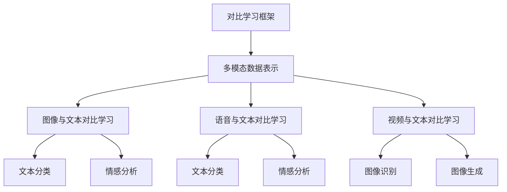

                 

# 《对比学习框架下的多模态表示学习》

## 关键词
对比学习，多模态数据表示，图像与文本对比学习，语音与文本对比学习，视频与文本对比学习，多模态对比学习应用

## 摘要
随着人工智能技术的发展，多模态数据表示学习成为当前研究的热点。本文从对比学习框架出发，详细阐述了多模态表示学习的理论基础、核心算法、应用场景及挑战。通过分析对比学习的基本概念、多模态数据表示方法以及常见的对比学习模型，本文进一步探讨了图像与文本、语音与文本、视频与文本等不同领域的对比学习应用，并提出了相应的优化策略。文章最后对未来多模态表示学习的趋势和研究方向进行了展望。

## 目录大纲

### 第一部分：对比学习基础

### 第1章：对比学习概述
#### 1.1 对比学习的基本概念
#### 1.2 对比学习的优势与应用领域

### 第2章：多模态数据表示
#### 2.1 多模态数据的概念与类型
#### 2.2 多模态数据融合方法

### 第3章：对比学习框架
#### 3.1 对比学习的核心算法
#### 3.2 常见的对比学习模型

### 第4章：对比学习的挑战与优化策略
#### 4.1 对比学习的挑战
#### 4.2 对比学习的优化策略

### 第二部分：多模态表示学习应用

### 第5章：图像与文本的对比学习
#### 5.1 图像与文本数据预处理
#### 5.2 图像与文本的对比学习模型

### 第6章：语音与文本的对比学习
#### 6.1 语音与文本数据预处理
#### 6.2 语音与文本的对比学习模型

### 第7章：视频与文本的对比学习
#### 7.1 视频与文本数据预处理
#### 7.2 视频与文本的对比学习模型

### 第8章：多模态对比学习在NLP中的应用
#### 8.1 多模态对比学习在文本分类中的应用
#### 8.2 多模态对比学习在情感分析中的应用

### 第9章：多模态对比学习在计算机视觉中的应用
#### 9.1 多模态对比学习在图像识别中的应用
#### 9.2 多模态对比学习在图像生成中的应用

### 第10章：未来展望
#### 10.1 多模态表示学习的未来趋势
#### 10.2 潜在的研究方向与应用领域

### Mermaid 流程图



### Python 源代码

```python
# 对比学习框架下的多模态表示学习 - 示例代码

# 导入必要的库
import torch
import torchvision
import torchvision.transforms as transforms
from torchvision.models import resnet50
import torch.optim as optim
import torch.nn as nn

# 加载预训练的ResNet50模型
model = resnet50(pretrained=True)

# 定义对比学习损失函数
contrastive_loss = nn.CrossEntropyLoss()

# 定义优化器
optimizer = optim.Adam(model.parameters(), lr=0.001)

# 加载图像数据集
transform = transforms.Compose([
    transforms.Resize((224, 224)),
    transforms.ToTensor(),
])

train_set = torchvision.datasets.ImageFolder(root='./data/train',
                                            transform=transform)

train_loader = torch.utils.data.DataLoader(dataset=train_set,
                                           batch_size=32,
                                           shuffle=True)

# 训练模型
for epoch in range(10):  # 训练10个epochs
    running_loss = 0.0
    for inputs, labels in train_loader:
        optimizer.zero_grad()
        outputs = model(inputs)
        loss = contrastive_loss(outputs, labels)
        loss.backward()
        optimizer.step()
        running_loss += loss.item()
    print(f'Epoch {epoch+1}, Loss: {running_loss/len(train_loader)}')
```

### 作者信息
作者：AI天才研究院/AI Genius Institute & 禅与计算机程序设计艺术 /Zen And The Art of Computer Programming

---

接下来，我们将按照目录大纲结构，逐步展开对对比学习框架下的多模态表示学习进行详细讲解。

