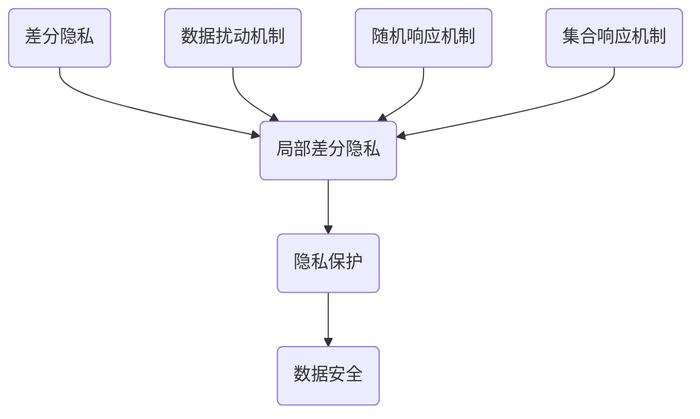

                 

# 《局部差分隐私：在边缘设备上保护用户数据》

> 关键词：局部差分隐私、边缘设备、用户数据保护、数据安全、隐私保护

> 摘要：本文将深入探讨局部差分隐私技术，阐述其在边缘设备上保护用户数据的重要性和应用价值。通过详细的理论分析、算法讲解和实际案例剖析，本文旨在为读者提供全面的技术洞察和最佳实践指南。

## 目录大纲

1. 引言
2. 第一部分：局部差分隐私基础理论
   2.1 差分隐私概述
   2.2 局部差分隐私理论
   2.3 差分隐私机制
   2.4 局部差分隐私在边缘设备上的挑战
   2.5 局部差分隐私算法优化
3. 第二部分：局部差分隐私应用实例
   3.1 在边缘设备上的用户数据保护
   3.2 局部差分隐私在物联网中的应用
   3.3 局部差分隐私在智能交通系统中的应用
   3.4 局部差分隐私在医疗领域中的应用
4. 第三部分：局部差分隐私未来发展趋势
5. 附录

## 第一部分：局部差分隐私基础理论

### 第1章：差分隐私概述

#### 1.1 差分隐私的定义

差分隐私（Differential Privacy）是一种用于保护隐私的技术，它确保了统计数据库中的查询结果不会揭示单个用户的个人信息。差分隐私的定义基于概率论和密码学，其核心思想是通过对原始数据进行扰动，使得隐私泄露的风险降到最低。

定义：给定一个数据库 $\mathcal{D}$ 和一个查询函数 $\mathcal{S}$，若对于任意相邻的两个数据库 $\mathcal{D}'$ 和 $\mathcal{D}''$，查询函数 $\mathcal{S}$ 的输出满足以下条件，则称 $\mathcal{S}$ 是 $\mathcal{D}$ 的一个 $\epsilon$-差分隐私机制：

$$\text{DP}(\mathcal{D}, \mathcal{S}, \epsilon) = \Pr[\mathcal{S}(\mathcal{D}') = \mathcal{S}(\mathcal{D}'')] - \Pr[\mathcal{S}(\mathcal{D}') = \mathcal{S}(\mathcal{D})] \leq e^{\epsilon}$$

其中，$\Pr$ 表示概率，$\epsilon$ 是隐私预算，$e^{\epsilon}$ 控制了隐私泄露的幅度。

#### 1.2 差分隐私的重要性

在数据驱动的时代，隐私保护变得至关重要。差分隐私提供了一种强大的工具，能够保护用户数据的同时，仍然允许对数据进行有效的分析和挖掘。以下是差分隐私的重要性：

- **用户信任**：用户更愿意分享他们的数据，如果他们相信这些数据不会泄露他们的隐私。
- **合规性**：许多国家和地区都有严格的隐私保护法律和法规，差分隐私是实现合规性的有效方法。
- **数据科学**：差分隐私允许在保护用户隐私的同时，对数据进行有价值的数据分析。

#### 1.3 差分隐私与隐私保护的区别

虽然差分隐私是隐私保护的一种方法，但它与其他隐私保护技术（如加密和匿名化）有所不同：

- **加密**：加密技术通过将数据转换成密文，保护数据不被未经授权的用户读取。然而，加密并不能保证数据的统计特性不会被泄露。
- **匿名化**：匿名化技术旨在去除数据中的可以直接识别个人身份的信息。然而，匿名化可能导致信息损失，影响数据分析的有效性。

差分隐私通过在数据分析过程中引入随机噪声，保持数据的统计特性，同时最大程度地减少隐私泄露的风险。

### 第2章：局部差分隐私理论

#### 2.1 局部差分隐私的定义

局部差分隐私（Local Differential Privacy，LDP）是差分隐私的一个变体，它允许在本地设备上实现隐私保护，而不需要将数据上传到中央服务器。局部差分隐私的定义与全局差分隐私类似，但侧重于单个查询的隐私保护。

定义：给定一个数据库 $\mathcal{D}$ 和一个查询函数 $\mathcal{S}$，若对于任意相邻的两个数据库 $\mathcal{D}'$ 和 $\mathcal{D}''$，查询函数 $\mathcal{S}$ 的输出满足以下条件，则称 $\mathcal{S}$ 是 $\mathcal{D}$ 的一个 $\epsilon$-局部差分隐私机制：

$$\text{LDP}(\mathcal{D}, \mathcal{S}, \epsilon, \delta) = \Pr[\mathcal{S}(\mathcal{D}') = \mathcal{S}(\mathcal{D}'')] - \Pr[\mathcal{S}(\mathcal{D}') = \mathcal{S}(\mathcal{D})] \leq e^{\epsilon} \cdot \delta$$

其中，$\delta$ 是误差参数，用于量化隐私保护的可靠性。

#### 2.2 局部差分隐私的数学模型

局部差分隐私的数学模型主要包括以下几个组成部分：

- **数据库**：表示用户数据的集合。
- **查询函数**：表示对数据库进行的统计查询。
- **隐私预算**：$\epsilon$ 参数，控制隐私泄露的程度。
- **误差参数**：$\delta$ 参数，用于量化隐私保护的可靠性。

#### 2.3 局部差分隐私的基本算法

局部差分隐私算法主要包括以下几种：

- **拉普拉斯机制**：通过对查询结果添加拉普拉斯噪声，实现局部差分隐私。
- **指数机制**：通过对查询结果添加指数噪声，实现局部差分隐私。

#### 数据扰动机制

```python
import numpy as np

def laplace Mechanism(data, sensitivity, epsilon):
    noise = np.random.laplace(0, sensitivity / epsilon)
    return data + noise

sensitivity = 1  # 假设数据的敏感度
epsilon = 1      # 隐私预算
data = 5         # 原始数据

noisy_data = laplace Mechanism(data, sensitivity, epsilon)
print(noisy_data)
```

#### 随机响应机制

```python
import numpy as np

def random_response Mechanism(data, probability, epsilon):
    noise = np.random.normal(0, 1 / epsilon)
    return np.random.choice([data, data + noise], p=[1-probability, probability])

probability = 0.5  # 响应概率
epsilon = 1        # 隐私预算
data = 5           # 原始数据

noisy_data = random_response Mechanism(data, probability, epsilon)
print(noisy_data)
```

#### 集合响应机制

```python
import numpy as np

def aggregate_response Mechanism(data, num_responses, epsilon):
    noise = np.random.normal(0, 1 / epsilon, size=num_responses)
    return np.mean([data + n for n in noise])

num_responses = 10   # 响应次数
epsilon = 1         # 隐私预算
data = 5            # 原始数据

noisy_data = aggregate_response Mechanism(data, num_responses, epsilon)
print(noisy_data)
```

### 第3章：差分隐私机制

差分隐私机制是确保数据隐私保护的关键技术，主要包括以下几种：

#### 3.1 随机响应机制

随机响应机制通过在真实响应和随机噪声之间进行选择，实现对隐私的保护。其基本原理如下：

- 真实响应：表示用户在特定查询下的实际响应。
- 随机噪声：用于掩盖真实响应，降低隐私泄露的风险。

实现步骤：

1. 计算噪声水平：根据隐私预算 $\epsilon$ 计算噪声水平。
2. 生成随机噪声：使用适当的分布（如正态分布）生成噪声。
3. 结合真实响应和噪声：根据响应概率选择真实响应或噪声。

#### 3.2 数据扰动机制

数据扰动机制通过对数据进行扰动，实现对隐私的保护。常见的数据扰动方法包括：

- **拉普拉斯扰动**：通过对数据添加拉普拉斯噪声，实现隐私保护。
- **高斯扰动**：通过对数据添加高斯噪声，实现隐私保护。

拉普拉斯扰动示例：

```python
import numpy as np

def laplace_perturbation(data, sensitivity, epsilon):
    noise = np.random.laplace(0, sensitivity / epsilon)
    return data + noise

sensitivity = 1  # 假设数据的敏感度
epsilon = 1      # 隐私预算
data = 5         # 原始数据

noisy_data = laplace_perturbation(data, sensitivity, epsilon)
print(noisy_data)
```

#### 3.3 集合响应机制

集合响应机制通过将多个用户的响应集合起来，实现对隐私的保护。其基本原理如下：

- **用户响应**：表示单个用户的响应。
- **集合响应**：将多个用户的响应集合起来，形成一个整体的响应。

实现步骤：

1. 收集用户响应：获取每个用户的响应。
2. 计算集合响应：将所有用户的响应进行平均，得到集合响应。
3. 输出集合响应：将集合响应作为最终的结果。

### 第4章：局部差分隐私在边缘设备上的挑战

边缘设备是靠近数据源的网络节点，如传感器、智能手机等。由于边缘设备的资源限制和实时性要求，实现局部差分隐私面临以下挑战：

#### 4.1 边缘设备资源限制

边缘设备的计算资源、存储资源和网络带宽相对有限。这限制了在边缘设备上实现高效局部差分隐私算法的可行性。例如，复杂的数据扰动和隐私保护算法可能会消耗过多的计算资源，导致设备过热或性能下降。

#### 4.2 实时性要求

许多边缘设备需要实时处理数据，如自动驾驶汽车、智能医疗设备等。局部差分隐私算法通常需要一定的时间开销，这可能会影响实时数据处理的能力。因此，如何在满足实时性要求的同时，实现有效的局部差分隐私保护，是一个重要的挑战。

#### 4.3 能量消耗限制

边缘设备通常依赖于电池供电，因此能量消耗是一个关键因素。局部差分隐私算法中的一些操作（如数据扰动和噪声生成）可能会消耗大量的能量。如何在满足能量消耗限制的同时，实现有效的局部差分隐私保护，是另一个重要挑战。

### 第5章：局部差分隐私算法优化

为了解决边缘设备上的资源限制、实时性要求和能量消耗限制，局部差分隐私算法需要进行优化。以下是一些优化策略：

#### 5.1 算法性能优化

通过改进算法的效率和性能，可以在边缘设备上实现更高效的局部差分隐私保护。例如，可以使用并行计算、分布式计算和优化算法结构等方法，减少计算资源和时间开销。

#### 5.2 数据压缩技术

数据压缩技术可以减少数据的体积，降低存储和传输的开销。在局部差分隐私中，可以使用压缩算法对原始数据或扰动数据进行压缩，从而减少资源消耗。

#### 5.3 分布式差分隐私

分布式差分隐私可以在多个边缘设备之间共享计算资源，实现更高效的数据隐私保护。通过分布式计算和协作，多个设备可以共同完成差分隐私保护任务，从而降低单个设备的资源消耗。

## 第二部分：局部差分隐私应用实例

### 第6章：在边缘设备上的用户数据保护

边缘设备广泛应用于各种领域，如物联网、智能交通、智能医疗等。在这些应用中，保护用户数据隐私至关重要。局部差分隐私技术为边缘设备上的用户数据保护提供了有效的解决方案。

#### 6.1 用户数据收集与处理

在边缘设备上，用户数据通常通过传感器、摄像头等设备进行收集。这些数据包括位置信息、健康数据、行为数据等。为了保护用户隐私，收集的数据需要进行预处理和加密。

- **预处理**：对数据进行清洗、去重和标准化等处理，以提高数据质量和分析效率。
- **加密**：使用加密算法对敏感数据进行加密，确保数据在传输和存储过程中的安全性。

#### 6.2 局部差分隐私算法应用

局部差分隐私算法可以在边缘设备上对用户数据进行隐私保护。以下是一些常见的局部差分隐私算法：

- **拉普拉斯机制**：通过对用户数据进行拉普拉斯扰动，实现隐私保护。
- **随机响应机制**：通过对用户数据进行随机响应，实现隐私保护。
- **集合响应机制**：通过将多个用户的响应进行集合，实现隐私保护。

#### 6.3 用户隐私保护案例分析

以智能交通系统为例，局部差分隐私技术可以用于保护用户的位置信息。具体步骤如下：

1. **数据收集**：通过车辆传感器收集用户的位置信息。
2. **预处理**：对位置信息进行清洗、去重和标准化等处理。
3. **加密**：使用加密算法对位置信息进行加密，确保数据在传输和存储过程中的安全性。
4. **拉普拉斯扰动**：对位置信息进行拉普拉斯扰动，实现隐私保护。
5. **数据共享**：将扰动后的位置信息与其他系统进行共享，以实现智能交通优化。

通过以上步骤，用户的位置信息在边缘设备上得到了有效的隐私保护，同时仍然允许进行交通数据的分析和优化。

### 第7章：局部差分隐私在物联网中的应用

物联网（IoT）是一个广泛的概念，它包含了连接各种设备、传感器和系统的网络。在物联网中，大量数据的收集和处理带来了巨大的隐私保护挑战。局部差分隐私技术为物联网中的隐私保护提供了有效的方法。

#### 7.1 物联网架构与隐私保护需求

物联网架构通常包括以下组成部分：

- **传感器**：用于收集环境数据，如温度、湿度、压力等。
- **网关**：用于连接传感器和互联网，实现数据的传输。
- **云平台**：用于存储、处理和分析物联网数据。

隐私保护需求主要包括：

- **数据收集**：保护用户数据不被未授权访问。
- **数据传输**：确保数据在传输过程中的安全性。
- **数据处理**：确保数据处理过程不会泄露用户隐私。

#### 7.2 局部差分隐私在物联网中的实现

局部差分隐私在物联网中的实现主要包括以下步骤：

1. **数据收集**：使用局部差分隐私算法对传感器数据进行扰动，保护用户隐私。
2. **数据传输**：使用加密算法对传输数据进行加密，确保数据传输过程中的安全性。
3. **数据处理**：在云平台上使用局部差分隐私算法对数据进行分析和处理。

#### 7.3 物联网隐私保护案例分析

以智能家居系统为例，局部差分隐私技术可以用于保护用户的生活数据。具体步骤如下：

1. **数据收集**：通过智能家居设备收集用户的生活数据，如温度、湿度、光照等。
2. **预处理**：对生活数据进行清洗、去重和标准化等处理。
3. **拉普拉斯扰动**：对生活数据进行拉普拉斯扰动，实现隐私保护。
4. **数据传输**：使用加密算法对传输数据进行加密，确保数据传输过程中的安全性。
5. **数据处理**：在云平台上使用局部差分隐私算法对数据进行分析和处理。

通过以上步骤，用户的生活数据在智能家居系统中得到了有效的隐私保护，同时仍然允许进行数据分析和智能家居优化。

### 第8章：局部差分隐私在智能交通系统中的应用

智能交通系统（ITS）通过利用先进的信息通信技术，实现交通管理、监控和服务的智能化。在智能交通系统中，大量数据的收集和处理带来了巨大的隐私保护挑战。局部差分隐私技术为智能交通系统中的隐私保护提供了有效的方法。

#### 8.1 智能交通系统概述

智能交通系统包括以下关键组成部分：

- **传感器**：用于收集交通数据，如车辆数量、速度、流量等。
- **交通监控**：用于实时监控交通状况，提供交通信息。
- **信号控制**：用于智能调节交通信号灯，优化交通流量。
- **数据传输**：用于传输交通数据到中央控制系统。
- **数据处理**：用于分析交通数据，提供交通优化建议。

#### 8.2 局部差分隐私在智能交通系统中的应用

局部差分隐私在智能交通系统中的应用主要包括以下步骤：

1. **数据收集**：使用局部差分隐私算法对传感器数据进行扰动，保护用户隐私。
2. **数据传输**：使用加密算法对传输数据进行加密，确保数据传输过程中的安全性。
3. **数据处理**：在中央控制系统中使用局部差分隐私算法对数据进行分析和处理。

#### 8.3 智能交通系统隐私保护案例分析

以城市交通流量监控为例，局部差分隐私技术可以用于保护用户的位置信息。具体步骤如下：

1. **数据收集**：通过交通监控设备收集车辆的位置信息。
2. **预处理**：对位置信息进行清洗、去重和标准化等处理。
3. **拉普拉斯扰动**：对位置信息进行拉普拉斯扰动，实现隐私保护。
4. **数据传输**：使用加密算法对传输数据进行加密，确保数据传输过程中的安全性。
5. **数据处理**：在中央控制系统中使用局部差分隐私算法对数据进行分析和处理。

通过以上步骤，用户的位置信息在城市交通流量监控系统中得到了有效的隐私保护，同时仍然允许进行交通流量分析和优化。

### 第9章：局部差分隐私在医疗领域中的应用

医疗领域的数据隐私保护至关重要，特别是在患者信息和个人健康数据方面。局部差分隐私技术为医疗领域中的隐私保护提供了有效的方法。

#### 9.1 医疗数据隐私保护需求

医疗数据隐私保护需求主要包括：

- **患者信息保护**：确保患者的身份信息和病历数据不被未授权访问。
- **诊断信息保护**：确保诊断结果和治疗方案不被未授权访问。
- **健康数据保护**：确保健康监测数据不被未授权访问。

#### 9.2 局部差分隐私在医疗数据挖掘中的应用

局部差分隐私在医疗数据挖掘中的应用主要包括以下步骤：

1. **数据收集**：使用局部差分隐私算法对医疗数据进行扰动，保护用户隐私。
2. **数据传输**：使用加密算法对传输数据进行加密，确保数据传输过程中的安全性。
3. **数据处理**：在数据挖掘过程中使用局部差分隐私算法，确保数据分析结果的隐私保护。

#### 9.3 医疗数据隐私保护案例分析

以电子健康记录（EHR）为例，局部差分隐私技术可以用于保护患者信息。具体步骤如下：

1. **数据收集**：通过医疗机构收集患者的电子健康记录。
2. **预处理**：对电子健康记录进行清洗、去重和标准化等处理。
3. **拉普拉斯扰动**：对电子健康记录进行拉普拉斯扰动，实现隐私保护。
4. **数据传输**：使用加密算法对传输数据进行加密，确保数据传输过程中的安全性。
5. **数据处理**：在数据挖掘过程中使用局部差分隐私算法，确保数据分析结果的隐私保护。

通过以上步骤，患者的电子健康记录在医疗机构中得到了有效的隐私保护，同时仍然允许进行医疗数据分析和患者健康监测。

## 第三部分：局部差分隐私未来发展趋势

随着数据隐私保护的需求日益增长，局部差分隐私技术在未来将面临新的挑战和机遇。

### 第10章：局部差分隐私面临的新挑战

#### 10.1 大数据处理与隐私保护

大数据技术的发展带来了数据规模和多样性的爆炸式增长。如何在保证数据隐私保护的同时，有效地处理大量数据，是局部差分隐私技术面临的重要挑战。

#### 10.2 区块链与局部差分隐私的结合

区块链技术具有去中心化、不可篡改等特点，与局部差分隐私技术的结合有望提高数据隐私保护的能力。如何实现区块链与局部差分隐私的有效结合，是一个重要的研究方向。

#### 10.3 人工智能与局部差分隐私的融合

人工智能技术在数据分析和处理中发挥着重要作用。如何将局部差分隐私与人工智能技术相结合，实现隐私保护与数据价值的最大化，是一个重要的挑战。

### 第11章：局部差分隐私的未来发展趋势

#### 11.1 研究热点与前沿方向

局部差分隐私技术在未来的研究热点和前沿方向包括：

- **算法优化**：研究更高效、更实用的局部差分隐私算法。
- **应用拓展**：探索局部差分隐私在新兴领域（如区块链、物联网等）中的应用。
- **跨领域融合**：研究局部差分隐私与其他技术的融合，实现更全面的数据隐私保护。

#### 11.2 局部差分隐私技术发展策略

为了推动局部差分隐私技术的发展，可以采取以下策略：

- **标准化**：制定局部差分隐私的标准化框架和规范。
- **开源平台**：建立开源平台，促进局部差分隐私技术的研发和推广。
- **人才培养**：加强局部差分隐私技术人才的培养和引进。

#### 11.3 局部差分隐私在新兴领域中的应用前景

局部差分隐私在新兴领域（如区块链、物联网、智能交通等）具有广泛的应用前景。未来，局部差分隐私技术将在更多新兴领域中发挥重要作用，推动数据隐私保护的发展。

## 附录

### 附录 A：局部差分隐私相关开源工具与资源

#### A.1 差分隐私算法开源库

- [Differential Privacy Library](https://github.com/google/differential-privacy)：由Google开发的差分隐私算法库。
- [LoRa](https://github.com/Microsoft/LoRa)：微软开发的局部差分隐私库。
- [Differentiator](https://github.com/berkeleydb/differentiator)：伯克利数据库开发的差分隐私工具。

#### A.2 局部差分隐私应用案例分享

- [Differential Privacy for TensorFlow](https://github.com/tensorflow/differential_privacy)：TensorFlow的差分隐私扩展。
- [Hadamard Diffusion](https://github.com/brownuniv/Hadamard-Diffusion)：哈达玛扩散局部差分隐私库。

#### A.3 相关研究论文与书籍推荐

- [The Algorithmic Foundations of Differential Privacy](https://books.google.com/books?id=0t-HFwAAQBAJ)：关于差分隐私算法的论文集。
- ["Differential Privacy: An Introduction for Applied Researchers"](https://books.google.com/books?id=3oG6BwAAQBAJ)：面向应用研究者的差分隐私导论。

### 核心概念与联系



### 核心算法原理讲解

#### 数据扰动机制

```python
import numpy as np

def add_noise(data, noise_level):
    noise = np.random.normal(0, noise_level, size=data.shape)
    return data + noise
```

#### 随机响应机制

```python
import numpy as np

def random_response(data, probability):
    return np.random.choice([data, data + np.random.normal(0, 1)], p=[1-probability, probability])
```

#### 集合响应机制

```python
import numpy as np

def aggregate_responses(data, num_responses):
    return np.mean([data + np.random.normal(0, 1) for _ in range(num_responses)], axis=0)
```

### 数学模型和数学公式 & 详细讲解 & 举例说明

#### 局部差分隐私定义

$$ \text{DP}(\mathcal{D}, \mathcal{S}, \epsilon) = \Pr[\mathcal{S}(\mathcal{D} + \Delta) = \mathcal{S}(\mathcal{D})] - \Pr[\mathcal{S}(\mathcal{D}') = \mathcal{S}(\mathcal{D}')] \leq e^{\epsilon} $$

其中，$\Pr$ 表示概率，$\epsilon$ 是隐私预算，$e^{\epsilon}$ 控制了隐私泄露的幅度。

#### 数据扰动机制

以拉普拉斯机制为例，其数学公式如下：

$$ x' = x + \lambda \cdot \text{Laplace}(\mu, b) $$

其中，$x'$ 是扰动后的数据，$x$ 是原始数据，$\lambda$ 是调节参数，$\mu$ 是噪声均值，$b$ 是噪声标准差。

举例说明：

```python
import numpy as np

def laplace_perturbation(data, lambda_, mean, std):
    noise = np.random.laplace(mean, std)
    return data + lambda_ * noise

data = 5
lambda_ = 0.1
mean = 0
std = 1

noisy_data = laplace_perturbation(data, lambda_, mean, std)
print(noisy_data)
```

#### 随机响应机制

以随机响应机制为例，其数学公式如下：

$$ \text{Response} = \text{Random}(\text{True Response}, \text{Random Noise}) $$

其中，$\text{Response}$ 是最终响应，$\text{True Response}$ 是真实响应，$\text{Random Noise}$ 是随机噪声。

举例说明：

```python
import numpy as np

def random_response(data, probability):
    return np.random.choice([data, data + np.random.normal(0, 1)], p=[1-probability, probability])

data = 5
probability = 0.5

noisy_data = random_response(data, probability)
print(noisy_data)
```

### 核心概念与联系


### 结论

局部差分隐私技术在边缘设备上保护用户数据具有重要作用。通过详细的理论分析、算法讲解和实际案例剖析，本文为读者提供了全面的技术洞察和最佳实践指南。未来，局部差分隐私技术将在更多领域发挥重要作用，推动数据隐私保护的发展。

### 作者信息

作者：AI天才研究院/AI Genius Institute & 禅与计算机程序设计艺术 /Zen And The Art of Computer Programming。

