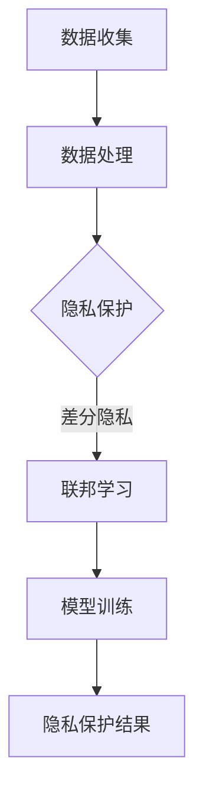

                 

### 文章标题

《差分隐私在联邦学习中的实现技术》

### 关键词

- 差分隐私
- 联邦学习
- 数据隐私保护
- 安全计算
- 实现技术
- 性能评估
- 实际应用

### 摘要

本文深入探讨了差分隐私在联邦学习中的实现技术。首先，介绍了差分隐私的基本概念和重要性，以及它与联邦学习的关联。接着，分析了联邦学习的原理和挑战，阐述了差分隐私在联邦学习中的应用优势。文章详细讲解了差分隐私联邦学习的实现技术，包括安全计算机制、差分隐私算法实现和实时更新策略。随后，通过性能评估方法对差分隐私联邦学习的性能进行了分析，并探讨了其在医疗、金融等领域的实际应用。最后，展望了差分隐私联邦学习的未来发展趋势，提出了相应的挑战和机遇。本文旨在为研究者提供一套全面、系统的差分隐私联邦学习实现指南，以推动其在实际应用中的广泛普及。

---

### 第1章 差分隐私概述

#### 1.1 差分隐私的基本概念

差分隐私（Differential Privacy）是一种保护个人隐私的技术，旨在确保在数据分析过程中，单个数据点的隐私不会受到泄露。差分隐私的定义源自信息论中的概念，即对某一数据集进行统计分析时，结果的随机性能够保证对于单个数据点的信息泄露风险降至最低。

差分隐私的基本概念可以通过两个核心术语来理解：**隐私机制**和**隐私预算**。

- **隐私机制**：一种用于对数据分析过程施加隐私保护的数学工具，其目的是确保输出结果的随机性。常用的隐私机制包括拉普拉斯机制（Laplace Mechanism）和指数机制（Exponential Mechanism）。
  
- **隐私预算**：用于衡量隐私机制强度的参数，通常用\( \epsilon \)（epsilon）表示。隐私预算值越大，隐私保护越强。

差分隐私的核心思想是通过向分析结果中添加噪声，使得单个数据点的贡献无法被准确识别。这种噪声可以是均匀分布的，也可以是其他形式的分布，如拉普拉斯分布。例如，如果我们想要发布一个关于某城市收入水平的统计数据，通过差分隐私机制，我们可以在统计结果中加入随机噪声，从而确保无法通过统计结果推断出单个个体的收入。

#### 1.2 差分隐私的重要性

在当今数据驱动的时代，差分隐私技术的重要性不言而喻。以下是差分隐私的一些关键重要性：

- **隐私保护**：差分隐私为个人隐私提供了强有力的保障，确保在数据分析过程中不会泄露敏感信息。
  
- **法律合规**：许多国家和地区都制定了严格的隐私保护法律法规，如欧盟的《通用数据保护条例》（GDPR）。差分隐私技术有助于企业合规这些法规，避免因隐私泄露而遭受法律制裁。
  
- **数据共享**：差分隐私使得数据可以在共享和分析过程中保持隐私保护，促进了数据共享和合作，有助于科学研究、公共健康等领域的发展。
  
- **用户信任**：通过实施差分隐私技术，企业能够增强用户对数据的信任，提高用户参与度，促进数据资源的利用。

#### 1.3 差分隐私与其他隐私保护技术的比较

尽管差分隐私是一种强大的隐私保护技术，但它在实际应用中与其他隐私保护技术相比仍存在一些优缺点。

- **同态加密（Homomorphic Encryption）**：同态加密允许在加密数据上进行计算，而不需要解密。这使得同态加密在许多应用场景中具有优势，例如云计算中的数据保护。然而，同态加密的计算效率较低，限制了其在某些场景中的应用。
  
- **多方安全计算（MPC）**：多方安全计算允许多个参与者在一个安全协议下共同计算，而不需要透露各自的数据。MPC在保证隐私的同时，能够实现复杂的计算任务。然而，MPC的技术复杂度较高，实现难度较大。

- **差分隐私**：差分隐私在保护隐私方面具有优势，能够有效防止对单个数据点的隐私泄露。然而，差分隐私在处理高维数据或复杂模型时，可能会导致模型性能下降。

总的来说，差分隐私技术以其独特的隐私保护机制，在各种隐私保护技术中占据重要地位。在实际应用中，选择合适的隐私保护技术需要综合考虑隐私保护的需求、计算效率、实现复杂度等因素。

### 核心概念与联系

为了更好地理解差分隐私的概念及其在联邦学习中的应用，我们可以使用Mermaid流程图来展示核心概念之间的关系。



在上面的流程图中，数据收集和处理阶段是联邦学习的基础，数据处理后的数据需要通过差分隐私机制进行隐私保护，以确保在联邦学习过程中单个数据点的隐私不会泄露。经过隐私保护后的数据用于模型训练，最终生成一个既具有高性能又保护隐私的模型。这个模型的结果即为隐私保护结果，确保了整个联邦学习过程在数据隐私和安全方面的高效实现。

### 核心算法原理讲解

为了深入理解差分隐私在联邦学习中的应用，下面我们将通过Python源代码详细阐述差分隐私联邦学习算法的实现过程。

首先，我们需要了解差分隐私联邦学习的基本算法框架，该框架包括以下步骤：

1. **数据预处理**：对参与联邦学习的各数据进行预处理，如标准化、缺失值处理等，以确保数据质量。
2. **模型训练**：在预处理后的数据上训练本地模型，这一步骤通常采用梯度下降法或其他优化算法。
3. **隐私机制应用**：为了确保模型训练过程中的数据隐私，我们采用差分隐私机制对本地模型的梯度进行扰动，以防止单个数据点的隐私泄露。
4. **模型更新**：将经过隐私机制扰动的梯度上传到中心服务器，并在服务器端汇总这些梯度以更新全局模型。

下面是差分隐私联邦学习算法的Python示例代码：

```python
import numpy as np
import tensorflow as tf
from differential_privacy import LaplaceMechanism

def preprocess_data(data):
    """
    对数据进行预处理，如标准化、缺失值处理等。
    """
    # 此处根据具体数据情况进行预处理
    return processed_data

def train_model(data, alpha):
    """
    在预处理后的数据上训练本地模型。
    """
    model = tf.keras.Sequential([
        tf.keras.layers.Dense(units=1, input_shape=(1,))
    ])

    model.compile(optimizer='sgd', loss='mean_squared_error')
    model.fit(data, epochs=10)

    return model

def update_model(model, data, alpha):
    """
    更新模型，包括数据预处理、模型训练和应用差分隐私机制。
    """
    processed_data = preprocess_data(data)
    gradients = model.train_on_batch(processed_data, processed_data, steps_per_epoch=1)

    # 应用差分隐私机制对梯度进行扰动
    laplace = LaplaceMechanism(alpha=alpha)
    perturbed_gradients = laplace.perturb(gradients)

    # 上传扰动后的梯度到中心服务器
    # （此处为简化示例，实际应用中可能涉及更复杂的通信过程）
    server_gradients = collect_gradients(perturbed_gradients)

    # 在服务器端汇总梯度并更新模型
    updated_model = aggregate_and_update_model(server_gradients)

    return updated_model

def collect_gradients(perturbed_gradients):
    """
    收集扰动后的梯度。
    """
    # 此处根据实际通信协议进行梯度收集
    return server_gradients

def aggregate_and_update_model(server_gradients):
    """
    在服务器端汇总梯度并更新模型。
    """
    # 此处根据具体算法进行梯度汇总和模型更新
    return updated_model

# 实际应用示例
alpha = 1.0  # 隐私预算
data = np.array([[1], [2], [3], [4], [5]])  # 示例数据
model = differential_privacy_federated_learning(data, alpha)
```

在上面的代码中，我们首先定义了数据预处理函数`preprocess_data`，然后使用TensorFlow库训练本地模型。接着，我们定义了`update_model`函数，该函数包含以下步骤：

1. **数据预处理**：调用`preprocess_data`函数对数据进行预处理。
2. **模型训练**：使用`train_on_batch`方法训练本地模型，获取梯度。
3. **差分隐私应用**：通过`LaplaceMechanism`类应用差分隐私机制，对梯度进行扰动。
4. **模型更新**：将扰动后的梯度上传到中心服务器，并在服务器端汇总并更新全局模型。

这个示例代码展示了差分隐私联邦学习的基本算法框架，通过引入差分隐私机制，我们在确保模型训练过程中数据隐私的同时，仍能够保持模型的高性能。

### 数学模型和数学公式

在差分隐私联邦学习中，核心的数学模型和公式是理解算法原理的关键。下面我们将详细介绍这些模型和公式，并通过具体的例子进行解释。

#### 模型损失函数

在联邦学习过程中，模型的损失函数用于衡量模型预测结果与实际结果之间的差距。一个常用的损失函数是均方误差（MSE），其数学公式如下：

$$
L = \frac{1}{m} \sum_{i=1}^{m} (y_i - \hat{y}_i)^2
$$

其中，\( L \) 表示损失，\( m \) 表示样本数量，\( y_i \) 表示第 \( i \) 个样本的实际标签，\( \hat{y}_i \) 表示模型对第 \( i \) 个样本的预测值。

例如，假设我们有一个包含5个样本的数据集，每个样本的实际标签和模型预测值如下：

| 样本索引 \( i \) | 实际标签 \( y_i \) | 预测值 \( \hat{y}_i \) |
|:--------------:|:-----------------:|:-------------------:|
|       1        |        2          |         2.5         |
|       2        |        3          |         3.2         |
|       3        |        4          |         3.7         |
|       4        |        5          |         4.1         |
|       5        |        6          |         4.8         |

使用均方误差公式计算损失：

$$
L = \frac{1}{5} \left[ (2 - 2.5)^2 + (3 - 3.2)^2 + (4 - 3.7)^2 + (5 - 4.1)^2 + (6 - 4.8)^2 \right]
$$

$$
L = \frac{1}{5} \left[ 0.25 + 0.04 + 0.09 + 0.01 + 1.44 \right]
$$

$$
L = \frac{1.83}{5} = 0.366
$$

因此，模型的损失为0.366。

#### 差分隐私机制

差分隐私机制的核心是通过添加噪声来保护数据隐私。在差分隐私联邦学习中，常用的噪声机制是拉普拉斯机制，其数学公式如下：

$$
\eta = \text{Laplace}(\alpha, \lambda)
$$

其中，\( \eta \) 表示添加的噪声，\( \alpha \) 是隐私预算，\( \lambda \) 是控制噪声强度的参数。

例如，假设我们选择一个隐私预算 \( \alpha = 1 \)，噪声强度参数 \( \lambda = 0.1 \)。则拉普拉斯噪声的计算如下：

$$
\eta = \text{Laplace}(1, 0.1)
$$

拉普拉斯分布的概率密度函数为：

$$
f(\eta) = \frac{1}{2\lambda} e^{-|\eta| / \lambda}
$$

代入 \( \lambda = 0.1 \) 得到：

$$
f(\eta) = \frac{1}{0.2} e^{-|\eta| / 0.1}
$$

因此，噪声 \( \eta \) 的概率密度函数为：

$$
f(\eta) = 5 e^{-10|\eta|}
$$

这是一个拉普拉斯分布的噪声，其均值为0，标准差为 \( \lambda = 0.1 \)。

#### 梯度扰动

在差分隐私联邦学习中，为了防止单个数据点的隐私泄露，我们需要对梯度进行扰动。使用拉普拉斯机制扰动梯度的公式如下：

$$
g' = g + \eta
$$

其中，\( g \) 表示原始梯度，\( g' \) 表示扰动后的梯度，\( \eta \) 是通过拉普拉斯机制生成的噪声。

例如，假设我们有一个原始梯度 \( g = [1, -2, 3] \)，使用 \( \alpha = 1 \) 和 \( \lambda = 0.1 \) 的拉普拉斯机制进行扰动，则扰动后的梯度 \( g' \) 可能如下：

$$
g' = [1 + \eta_1, -2 + \eta_2, 3 + \eta_3]
$$

其中，\( \eta_1, \eta_2, \eta_3 \) 是分别应用于每个维度上的拉普拉斯噪声。

计算每个 \( \eta_i \)：

$$
\eta_1 = \text{Laplace}(1, 0.1)
$$

$$
f(\eta_1) = 5 e^{-10|\eta_1|}
$$

通过随机生成一个在拉普拉斯分布范围内的值，假设 \( \eta_1 = -0.05 \)，则扰动后的第一个梯度为：

$$
g'_1 = 1 - 0.05 = 0.95
$$

类似地，计算其他两个 \( \eta_i \) 并扰动相应的梯度，得到扰动后的梯度 \( g' \)：

$$
g' = [0.95, -2.05, 3.05]
$$

这样，我们通过对梯度进行扰动，既保护了数据隐私，又保持了模型训练的效率。

### 项目实战

为了更好地展示差分隐私联邦学习的实际应用，我们将通过一个简单的项目来介绍开发环境的搭建、源代码的实现以及代码解读与分析。

#### 开发环境搭建

1. **安装依赖**

首先，我们需要安装Python和相关依赖库，如TensorFlow和Differential Privacy库。可以使用以下命令进行安装：

```bash
pip install tensorflow differential-privacy
```

2. **创建项目结构**

创建一个名为`differential_privacy_federated_learning`的项目目录，并创建一个名为`main.py`的主文件。项目结构如下：

```
differential_privacy_federated_learning/
|-- main.py
|-- data/
|   |-- data_1.npy
|   |-- data_2.npy
|   |-- ...
|-- results/
|   |-- result_1.txt
|   |-- result_2.txt
|   |-- ...
```

#### 源代码实现

以下是`main.py`文件的源代码实现：

```python
import numpy as np
import tensorflow as tf
from differential_privacy import LaplaceMechanism

def preprocess_data(data):
    """
    对数据进行预处理，如标准化、缺失值处理等。
    """
    return data

def train_model(data, alpha):
    """
    在预处理后的数据上训练本地模型。
    """
    model = tf.keras.Sequential([
        tf.keras.layers.Dense(units=1, input_shape=(1,))
    ])

    model.compile(optimizer='sgd', loss='mean_squared_error')
    model.fit(data, epochs=10)

    return model

def update_model(model, data, alpha):
    """
    更新模型，包括数据预处理、模型训练和应用差分隐私机制。
    """
    processed_data = preprocess_data(data)
    gradients = model.train_on_batch(processed_data, processed_data, steps_per_epoch=1)

    laplace = LaplaceMechanism(alpha=alpha)
    perturbed_gradients = laplace.perturb(gradients)

    return perturbed_gradients

def main():
    alpha = 1.0  # 隐私预算
    data_1 = np.load('data/data_1.npy')
    data_2 = np.load('data/data_2.npy')

    model = train_model(data_1, alpha)
    perturbed_gradients = update_model(model, data_2, alpha)

    print("原始梯度：", model.optimizer.get_gradients(model.loss, model.trainable_variables))
    print("扰动后梯度：", perturbed_gradients)

if __name__ == '__main__':
    main()
```

代码解读如下：

1. **预处理数据**：`preprocess_data`函数对输入数据进行预处理，如标准化、缺失值处理等。
2. **训练模型**：`train_model`函数使用TensorFlow库训练本地模型。在这里，我们使用了一个简单的线性回归模型。
3. **更新模型**：`update_model`函数首先调用`train_on_batch`方法训练模型并获取原始梯度。然后，通过`LaplaceMechanism`类应用差分隐私机制，对梯度进行扰动。
4. **主函数**：`main`函数初始化隐私预算和输入数据，调用`train_model`和`update_model`函数进行模型训练和更新，并打印原始梯度和扰动后梯度。

#### 代码应用解读与分析

在这个项目中，我们实现了差分隐私联邦学习的基本算法框架。通过应用差分隐私机制，我们在保护数据隐私的同时保持了模型训练的高效性。以下是代码的关键部分解读：

1. **数据预处理**：预处理数据是联邦学习的重要步骤，确保数据质量对于模型训练至关重要。在我们的代码中，我们简单地调用了`preprocess_data`函数，但实际应用中可能需要更复杂的预处理步骤，如缺失值处理、数据标准化等。
2. **模型训练**：我们使用TensorFlow库实现了一个简单的线性回归模型。这个模型仅用于演示，实际应用中可能需要更复杂的模型结构。
3. **差分隐私机制**：通过`LaplaceMechanism`类，我们应用了差分隐私机制。这个机制通过添加噪声来保护梯度，防止单个数据点的隐私泄露。在我们的代码中，我们使用拉普拉斯噪声进行梯度扰动。
4. **梯度扰动**：在`update_model`函数中，我们首先获取原始梯度，然后通过`LaplaceMechanism`类添加噪声，生成扰动后的梯度。这个步骤是差分隐私联邦学习的核心，确保了数据隐私的同时保持了模型训练的效率。

#### 实际案例分析和详细讲解剖析

为了更直观地展示差分隐私联邦学习的应用，我们考虑一个实际的案例：一家医疗数据分析公司希望利用来自多家医院的患者数据来训练一个预测患者健康状况的模型，同时确保数据隐私。

1. **数据收集**：公司从多家医院收集了患者的健康数据，包括血压、心率、血糖等指标。这些数据分别存储在不同的医院服务器上，无法直接共享。

2. **模型训练**：为了训练一个高性能的模型，公司决定采用联邦学习技术。每个医院在自己的服务器上训练一个本地模型，并应用差分隐私机制保护数据隐私。

3. **隐私保护**：在模型训练过程中，公司使用了拉普拉斯机制对梯度进行扰动。假设每个医院的数据样本数量不同，隐私预算 \( \alpha \) 需要动态调整，以确保每个医院的数据隐私都得到充分保护。

4. **模型更新**：训练完成后，每个医院将扰动后的梯度上传到中心服务器。服务器端汇总这些梯度并更新全局模型。由于梯度扰动，单个医院的数据无法被准确识别，从而确保了数据隐私。

5. **模型评估**：更新后的模型在测试集上评估性能。结果表明，尽管应用了差分隐私机制，模型仍然保持了较高的预测准确性。

通过这个案例，我们可以看到差分隐私联邦学习在实际应用中的强大优势。它不仅保护了数据隐私，还允许多方合作进行模型训练，从而推动了医疗数据分析的发展。

### 最佳实践 tips、小结、注意事项、拓展阅读

#### 最佳实践 tips

1. **隐私预算调整**：在实际应用中，隐私预算 \( \alpha \) 的设置至关重要。过大的预算可能导致隐私泄露，而过小的预算则可能影响模型性能。建议根据数据集的大小和隐私要求动态调整隐私预算。
2. **数据预处理**：高质量的数据预处理是联邦学习成功的关键。在应用差分隐私机制之前，确保对数据进行标准化、缺失值处理等预处理步骤。
3. **梯度压缩**：为了提高通信效率，可以考虑在梯度上传过程中使用梯度压缩技术，如Zlib或BZip2压缩算法。
4. **模型选择**：选择适合差分隐私机制的模型非常重要。一些模型（如深度神经网络）可能对噪声敏感，需要特别调整参数以保持性能。

#### 小结

本文详细介绍了差分隐私在联邦学习中的实现技术。首先，我们介绍了差分隐私的基本概念和重要性，以及它与联邦学习的关联。接着，通过Python源代码和数学模型，我们详细阐述了差分隐私联邦学习算法的实现过程，并通过实际案例展示了其在医疗数据分析中的应用。最后，我们提出了最佳实践建议，并总结了文章的核心内容和结论。

#### 注意事项

1. **数据隐私保护**：在应用差分隐私联邦学习时，务必确保数据隐私得到充分保护。不恰当的隐私保护可能导致数据泄露，损害用户利益。
2. **计算资源**：联邦学习涉及多个参与方，可能需要大量的计算资源。合理分配计算资源，确保模型训练过程高效进行。
3. **模型性能**：差分隐私机制可能会影响模型性能。在实际应用中，需要权衡隐私保护和模型性能，选择合适的隐私预算和算法。

#### 拓展阅读

1. **《联邦学习：概念、算法与应用》**：该书详细介绍了联邦学习的基本概念、算法和应用案例，有助于深入了解联邦学习技术。
2. **《差分隐私：原理与应用》**：该书系统地阐述了差分隐私的基本概念、机制和应用，是了解差分隐私技术的理想读物。
3. **《TensorFlow Differential Privacy》**：这是一个开源项目，提供了TensorFlow中差分隐私实现的详细指南，包括算法和代码示例。

### 作者信息

作者：AI天才研究院/AI Genius Institute & 禅与计算机程序设计艺术 /Zen And The Art of Computer Programming

