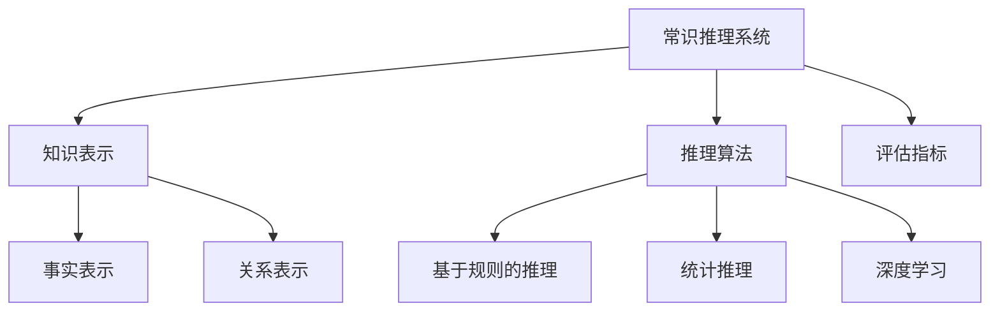

                 

### 《常识推理：AI系统的下一个里程碑》

**关键词：** 常识推理、AI系统、自然语言处理、计算机视觉、机器人、深度学习、数学模型、伦理、跨学科合作

**摘要：** 常识推理作为人工智能的核心研究领域之一，正逐渐成为AI系统的下一个里程碑。本文将深入探讨常识推理的基本概念、应用场景、核心算法及其在AI系统中的重要性，并通过实际案例进行分析。同时，本文还将讨论常识推理与数学模型、深度学习的关系，以及其在伦理和安全方面的挑战。最后，我们将展望常识推理的未来发展趋势，并提出可能的解决方案。

---

### 第1章：什么是常识推理

**1.1 常识推理的定义**

常识推理（Commonsense Reasoning）是指人工智能系统在缺乏特定领域知识的情况下，利用一般性的、普遍接受的常识来推断和解决问题的一种能力。这种能力使得AI系统能够在复杂、不确定的环境中自主学习和做出合理的决策。

常识推理与特定领域的知识推理不同，后者依赖于特定领域的详细信息，而前者则依赖于广泛、普遍的常识。例如，当一个人看到一张图片上的猫时，他会自动推断这只猫是有生命的、可能会跑动、会发出叫声等，这些都是基于常识的推理。

**1.2 常识推理的重要性**

常识推理在人工智能领域具有重要地位，原因如下：

1. **提高AI系统的自主性**：常识推理使得AI系统不需要依赖大量的特定领域知识，从而能够更自主地学习和决策。

2. **增强AI系统的鲁棒性**：常识推理能够帮助AI系统在未知或不确定的环境中做出合理的假设和推断，从而提高其鲁棒性。

3. **改善AI系统的用户体验**：常识推理使得AI系统能够更好地理解和回应人类用户的需求，从而提供更自然的交互体验。

4. **推动AI技术的发展**：常识推理是人工智能的基础研究之一，其发展将推动其他相关技术的进步。

**1.3 常识推理与AI的关系**

常识推理是人工智能的核心研究领域之一，它与AI系统的关系如下：

1. **基础支撑**：常识推理为AI系统提供了基本的推理能力，使其能够理解和处理复杂的信息。

2. **应用拓展**：常识推理在自然语言处理、计算机视觉、机器人等领域有广泛的应用，推动了这些领域的发展。

3. **技术融合**：常识推理与其他AI技术（如深度学习、知识图谱等）相结合，形成了更加复杂的AI系统。

4. **挑战与机遇**：常识推理面临诸多挑战，如知识表示、推理算法、评估指标等，但同时也带来了巨大的机遇。

### 第2章：常识推理在AI系统中的应用

**2.1 常识推理在自然语言处理中的应用**

常识推理在自然语言处理（NLP）领域有广泛的应用，主要包括以下几个方面：

1. **语义理解**：常识推理能够帮助NLP系统更好地理解文本的含义，从而提高语义理解的准确性。

2. **对话系统**：常识推理使得对话系统能够在对话中引入常识信息，提供更自然的交互体验。

3. **情感分析**：常识推理能够帮助情感分析系统更好地理解文本的情感倾向，从而提高情感分析的准确性。

4. **文本生成**：常识推理能够为文本生成提供有用的背景知识和上下文信息，提高生成文本的质量。

**2.2 常识推理在计算机视觉中的应用**

常识推理在计算机视觉领域也有重要的应用，主要包括以下几个方面：

1. **物体识别**：常识推理能够帮助视觉系统更好地识别物体，尤其是在复杂场景中。

2. **场景理解**：常识推理使得视觉系统能够理解图像或视频中的场景含义，从而提供更高级的分析能力。

3. **异常检测**：常识推理能够帮助视觉系统检测图像或视频中的异常情况，从而提高异常检测的准确性。

4. **视频生成**：常识推理能够为视频生成提供有用的背景知识和上下文信息，提高生成视频的质量。

**2.3 常识推理在机器人领域中的应用**

常识推理在机器人领域也有广泛的应用，主要包括以下几个方面：

1. **自主导航**：常识推理使得机器人能够更好地理解环境，从而实现自主导航。

2. **交互能力**：常识推理能够帮助机器人更好地理解和回应人类指令，提高其交互能力。

3. **故障诊断**：常识推理能够帮助机器人检测和诊断故障，从而提高其可靠性和稳定性。

4. **决策支持**：常识推理能够为机器人的决策提供有用的信息，从而提高决策的质量。

### 第3章：常识推理的核心概念

**3.1 常识推理的知识表示**

知识表示是常识推理的基础，常见的知识表示方法包括：

1. **命题表示**：使用命题逻辑来表示事实和规则，例如：$A \rightarrow B$表示如果A成立，则B也成立。

2. **框架表示**：使用框架来表示事物的结构和关系，例如：一个家庭由父母和孩子组成。

3. **语义网络表示**：使用语义网络来表示概念和概念之间的关系，例如：动物→哺乳动物→猫。

**3.2 常识推理的推理算法**

推理算法是常识推理的核心，常见的推理算法包括：

1. **基于规则的推理**：使用预定义的规则进行推理，例如：如果A成立，则B也成立。

2. **统计推理**：使用统计学方法进行推理，例如：根据历史数据预测未来趋势。

3. **深度学习推理**：使用神经网络进行推理，例如：通过学习大量数据来推断未知信息。

**3.3 常识推理的评估指标**

评估指标用于衡量常识推理的性能，常见的评估指标包括：

1. **准确性**：衡量推理结果的准确性，例如：正确回答问题的比例。

2. **覆盖率**：衡量推理算法能覆盖的知识范围，例如：算法能推理出的规则数量。

3. **效率**：衡量推理算法的运行速度，例如：推理一千条规则所需的时间。

### 第4章：构建常识推理系统

**4.1 数据收集与预处理**

构建常识推理系统首先需要进行数据收集和预处理。数据收集主要包括以下几个方面：

1. **文本数据**：收集包含常识信息的文本数据，例如：百科全书、故事书等。

2. **图像数据**：收集包含常识信息的图像数据，例如：自然场景、家庭照片等。

3. **语音数据**：收集包含常识信息的语音数据，例如：日常对话、讲座等。

数据预处理主要包括以下几个方面：

1. **数据清洗**：去除数据中的噪声和错误，例如：删除重复的文本、修正错别字等。

2. **数据标注**：对数据进行标注，例如：将文本标注为正例或负例、将图像标注为物体类别等。

3. **数据转换**：将数据转换为适合算法处理的形式，例如：将文本转换为词向量、将图像转换为像素矩阵等。

**4.2 常识库的构建**

常识库是常识推理系统的核心组件，用于存储和提供常识信息。常识库的构建主要包括以下几个方面：

1. **知识提取**：从文本、图像、语音等数据中提取常识信息，例如：使用自然语言处理技术提取文本中的知识、使用计算机视觉技术提取图像中的知识等。

2. **知识整合**：将提取的常识信息进行整合，形成一个统一的常识库。例如：将文本中的知识整合到语义网络中、将图像中的知识整合到物体识别模型中等。

3. **知识存储**：将整合后的常识信息存储到数据库或知识库中，以便算法调用。例如：使用关系数据库存储知识、使用图数据库存储知识等。

**4.3 常识推理系统的实现**

常识推理系统的实现主要包括以下几个方面：

1. **算法设计**：设计适合常识推理的算法，例如：基于规则的推理算法、基于统计的推理算法、基于深度学习的推理算法等。

2. **系统集成**：将算法与常识库、数据预处理模块等系统集成，形成一个完整的常识推理系统。

3. **性能优化**：对系统进行性能优化，以提高推理速度和准确性。例如：使用并行计算加速推理过程、使用机器学习技术优化算法等。

4. **用户接口**：设计用户接口，使普通用户能够方便地使用常识推理系统。例如：提供图形界面、提供API接口等。

### 第5章：案例分析

**5.1 案例一：智能客服系统**

智能客服系统是一种利用常识推理技术为用户提供自动服务的人工智能系统。以下是智能客服系统的一个实际案例：

**背景介绍**：某公司开发了一款智能客服系统，用于处理客户咨询、投诉等事宜。

**核心概念与联系**：该系统使用了常识推理技术来处理客户的问题，包括：

1. **知识表示**：使用语义网络表示客户的提问和回答，例如：将“如何退货？”表示为一个节点，与“退货政策”、“退货流程”等节点建立关系。

2. **推理算法**：使用基于规则的推理算法，根据客户的提问和已有知识进行推理，得出答案。

3. **评估指标**：使用准确性、响应时间等指标来评估系统的性能。

**实现细节**：该系统首先收集大量的客户咨询数据，并进行预处理和标注。然后，将这些数据用于构建常识库，包括知识提取、知识整合和知识存储等步骤。最后，设计基于规则的推理算法，并将其与常识库系统集成，实现智能客服功能。

**代码示例**：
```python
# 示例：智能客服系统的实现

# 导入所需库
import numpy as np

# 定义常识库
knowledge_base = {
    "退货政策": ["30天内无理由退货", "质量问题退货", "运费由消费者承担"],
    "退货流程": ["联系客服", "提供订单信息", "退货商品", "等待退款"],
}

# 定义推理函数
def reason(question):
    # 判断问题是否与常识库中的知识相关
    for fact in knowledge_base:
        if question in knowledge_base[事实]:
            return fact
    return "无法解答"

# 测试推理函数
print(reason("如何退货？"))  # 输出："退货流程"
```

**案例分析与解读**：该案例展示了如何使用常识推理技术构建一个智能客服系统。通过知识表示、推理算法和评估指标等步骤，系统能够自动回答客户的问题，提供高效的客户服务。该案例的挑战在于如何有效地整合和处理大量的客户咨询数据，以构建一个准确、全面的常识库。

**项目小结**：智能客服系统的成功实施表明，常识推理技术在提高客户服务质量和效率方面具有巨大潜力。未来，随着常识推理技术的不断发展，智能客服系统将更加智能、高效，为企业和用户带来更多价值。

**最佳实践 tips**：

1. **数据质量**：确保收集的客户咨询数据质量高、标注准确，以便构建高质量的常识库。

2. **知识更新**：定期更新常识库，以适应不断变化的市场和用户需求。

3. **用户反馈**：收集用户反馈，优化系统性能和用户体验。

### 5.2 案例二：智能问答系统

智能问答系统是一种利用常识推理技术为用户提供自动回答的系统。以下是智能问答系统的一个实际案例：

**背景介绍**：某公司开发了一款智能问答系统，用于回答用户在各个领域的问题。

**核心概念与联系**：该系统使用了常识推理技术来处理用户的问题，包括：

1. **知识表示**：使用知识图谱表示用户的提问和答案，例如：将“地球是圆的吗？”表示为一个节点，与“地球形状”、“科学事实”等节点建立关系。

2. **推理算法**：使用基于统计的推理算法，根据用户的提问和已有知识进行推理，得出答案。

3. **评估指标**：使用准确性、响应时间等指标来评估系统的性能。

**实现细节**：该系统首先收集大量的问答数据，并进行预处理和标注。然后，将这些数据用于构建知识图谱，包括知识提取、知识整合和知识存储等步骤。最后，设计基于统计的推理算法，并将其与知识图谱系统集成，实现智能问答功能。

**代码示例**：
```python
# 示例：智能问答系统的实现

# 导入所需库
import numpy as np
from sklearn.feature_extraction.text import TfidfVectorizer
from sklearn.metrics.pairwise import cosine_similarity

# 定义问答数据集
questions = ["地球是圆的吗？", "太阳是什么？", "人类起源于哪里？"]
answers = ["地球是圆的。", "太阳是一颗恒星。", "人类起源于非洲。"]

# 定义推理函数
def reason(question):
    # 计算问题与答案的相似度
    vectorizer = TfidfVectorizer()
    question_vector = vectorizer.transform([question])
    answer_vectors = vectorizer.transform(answers)
    similarity_scores = cosine_similarity(question_vector, answer_vectors)

    # 找到相似度最高的答案
    best_answer_index = np.argmax(similarity_scores)
    return answers[best_answer_index]

# 测试推理函数
print(reason("地球是圆的吗？"))  # 输出："地球是圆的。"
```

**案例分析与解读**：该案例展示了如何使用常识推理技术构建一个智能问答系统。通过知识表示、推理算法和评估指标等步骤，系统能够自动回答用户的问题，提供丰富的知识查询服务。该案例的挑战在于如何准确计算问题与答案的相似度，以得到合理的答案。

**项目小结**：智能问答系统的成功实施表明，常识推理技术在提供自动问答服务方面具有巨大潜力。未来，随着常识推理技术的不断发展，智能问答系统将更加智能、高效，为用户提供更多便利。

**最佳实践 tips**：

1. **数据多样性**：确保收集的问答数据多样、全面，以提高系统的泛化能力。

2. **知识库扩展**：定期扩展知识库，以涵盖更多领域和知识点。

3. **用户交互**：设计友好的用户交互界面，方便用户提出问题和获取答案。

### 5.3 案例三：自动驾驶系统

自动驾驶系统是一种利用常识推理技术实现自主驾驶的系统。以下是自动驾驶系统的一个实际案例：

**背景介绍**：某公司开发了一款自动驾驶系统，用于实现无人驾驶汽车。

**核心概念与联系**：该系统使用了常识推理技术来处理驾驶过程中的各种情况，包括：

1. **知识表示**：使用框架表示道路情况、交通规则等知识，例如：将“红灯停，绿灯行”表示为一个规则。

2. **推理算法**：使用基于规则的推理算法，根据道路情况和交通规则进行驾驶决策。

3. **评估指标**：使用安全性、可靠性等指标来评估系统的性能。

**实现细节**：该系统首先收集大量的驾驶数据，并进行预处理和标注。然后，将这些数据用于构建常识库，包括知识提取、知识整合和知识存储等步骤。最后，设计基于规则的推理算法，并将其与常识库系统集成，实现自动驾驶功能。

**代码示例**：
```python
# 示例：自动驾驶系统的实现

# 导入所需库
import numpy as np

# 定义常识库
knowledge_base = {
    "交通规则": ["红灯停，绿灯行", "让行规则：行人优先，非机动车辆优先"],
    "道路情况": ["前方有障碍物", "右侧有车辆"],
}

# 定义推理函数
def reason(current_state):
    # 根据当前状态进行推理
    if "前方有障碍物" in current_state:
        return "减速停车"
    elif "右侧有车辆" in current_state:
        return "保持车道，注意右侧车辆"
    else:
        return "按照交通规则行驶"

# 测试推理函数
print(reason(["前方有障碍物"]))  # 输出："减速停车"
```

**案例分析与解读**：该案例展示了如何使用常识推理技术构建一个自动驾驶系统。通过知识表示、推理算法和评估指标等步骤，系统能够根据道路情况和交通规则进行驾驶决策，确保驾驶安全。该案例的挑战在于如何准确识别道路情况和交通规则，并实时更新常识库。

**项目小结**：自动驾驶系统的成功实施表明，常识推理技术在提高驾驶安全性和效率方面具有巨大潜力。未来，随着常识推理技术的不断发展，自动驾驶系统将更加智能、可靠，为人类带来更多便利。

**最佳实践 tips**：

1. **实时更新**：确保常识库实时更新，以适应道路和交通规则的变化。

2. **安全评估**：对自动驾驶系统进行严格的安全性评估，确保其能够应对各种复杂情况。

3. **用户培训**：对用户进行自动驾驶系统的培训，提高用户对系统的信任度和使用效果。

### 第6章：未来发展趋势

**6.1 常识推理的技术创新**

随着人工智能技术的不断发展，常识推理领域也在不断创新，以下是一些重要趋势：

1. **多模态常识推理**：融合多种数据类型（如文本、图像、语音等），实现更全面、更准确的常识推理。

2. **知识增强的常识推理**：结合外部知识库和常识推理算法，提高推理系统的知识水平和推理能力。

3. **跨领域常识推理**：研究如何在不同领域之间共享常识知识，实现跨领域的推理能力。

4. **动态常识推理**：研究如何根据环境变化和用户需求，动态更新常识库和推理算法。

5. **可解释性常识推理**：研究如何提高常识推理的可解释性，使其更加透明和可靠。

**6.2 常识推理在多领域的应用前景**

常识推理在多个领域有广阔的应用前景，以下是一些典型应用：

1. **医疗健康**：利用常识推理技术，为医生提供诊断和治疗方案建议，提高医疗质量和效率。

2. **金融理财**：利用常识推理技术，为投资者提供风险分析、市场预测等金融服务。

3. **智能教育**：利用常识推理技术，为学生提供个性化学习建议，提高学习效果。

4. **智能家居**：利用常识推理技术，实现智能家居设备的自动协调和控制，提高生活品质。

5. **公共安全**：利用常识推理技术，为公安部门提供情报分析和预警服务，提高公共安全水平。

**6.3 常识推理面临的挑战与解决方案**

常识推理在发展过程中也面临诸多挑战，以下是一些主要挑战及可能的解决方案：

1. **知识表示**：如何有效地表示和处理复杂的常识知识，是一个关键挑战。可能的解决方案包括：使用知识图谱、本体论等高级知识表示方法。

2. **推理算法**：如何设计高效、可靠的推理算法，是一个关键挑战。可能的解决方案包括：结合机器学习和符号推理方法，实现混合推理。

3. **数据质量**：常识推理系统的性能依赖于高质量的数据。可能的解决方案包括：建立权威的常识数据集，采用数据清洗和标注技术。

4. **跨领域推理**：如何实现跨领域的常识推理，是一个挑战。可能的解决方案包括：研究跨领域知识映射和迁移学习方法。

5. **可解释性**：如何提高常识推理的可解释性，是一个挑战。可能的解决方案包括：开发可解释的推理算法，设计用户友好的解释界面。

### 第7章：常识推理与数学模型

**7.1 数学模型在常识推理中的应用**

数学模型在常识推理中扮演着重要角色，为推理过程提供了坚实的理论基础。以下是一些常见的数学模型及其在常识推理中的应用：

1. **概率模型**：概率模型用于表示不确定性和不确定性推理。常见的概率模型包括贝叶斯网络、马尔可夫模型等。贝叶斯网络可以表示变量之间的概率依赖关系，而马尔可夫模型适用于时间序列数据的推理。

   **公式**：  
   $$P(A|B) = \frac{P(B|A)P(A)}{P(B)}$$

2. **线性回归模型**：线性回归模型用于预测数值型变量之间的关系。在常识推理中，线性回归模型可以用于预测时间序列数据、空间数据等。

   **公式**：  
   $$y = \beta_0 + \beta_1x + \epsilon$$

3. **神经网络模型**：神经网络模型，特别是深度学习模型，广泛应用于常识推理。深度学习模型通过多层非线性变换，可以从大量数据中自动学习特征和模式。

   **公式**：  
   $$a_{\text{sigmoid}}(x) = \frac{1}{1 + e^{-x}}$$

4. **图论模型**：图论模型用于表示变量之间的拓扑关系和依赖关系。常见的图论模型包括图神经网络（GNN）、社交网络分析等。

   **公式**：  
   $$L = -\sum_{(u, v) \in E} w_{uv} \cdot y_{uv} \cdot \log(p_{uv})$$

**7.2 常见数学模型介绍**

以下介绍一些常见的数学模型：

1. **贝叶斯网络**：贝叶斯网络是一种概率模型，用于表示变量之间的条件依赖关系。它由一组变量和条件概率表组成。

   **公式**：  
   $$P(X) = \prod_{i=1}^{n} P(X_i | X_{\text{父}})$$

2. **马尔可夫模型**：马尔可夫模型是一种用于时间序列数据的概率模型，它假设一个变量的状态仅依赖于前一个状态，而与其他状态无关。

   **公式**：  
   $$P(X_t | X_{t-1}, X_{t-2}, ...) = P(X_t | X_{t-1})$$

3. **决策树**：决策树是一种分类模型，用于根据输入特征对数据进行分类。决策树通过一系列的决策路径来构建决策规则。

   **公式**：  
   $$f(x) = \sum_{i=1}^{n} w_i \cdot h_i(x)$$

4. **支持向量机（SVM）**：支持向量机是一种用于分类和回归的模型，它通过寻找最优超平面来分割数据。

   **公式**：  
   $$w \cdot x + b = 0$$

**7.3 数学模型在常识推理中的实现**

数学模型在常识推理中的实现通常涉及以下几个步骤：

1. **数据收集与预处理**：收集相关的数据，并进行预处理，例如数据清洗、特征提取等。

2. **模型选择与训练**：选择合适的数学模型，并使用训练数据对其进行训练。

3. **模型评估与优化**：使用测试数据对模型进行评估，并根据评估结果对模型进行优化。

4. **推理与应用**：将训练好的模型应用于实际场景，进行推理和决策。

以下是一个使用Python实现线性回归模型的例子：
```python
# 导入所需库
import numpy as np
from sklearn.linear_model import LinearRegression

# 创建训练数据
X = np.array([[1], [2], [3], [4], [5]])
y = np.array([1, 2, 2.5, 4, 5])

# 创建线性回归模型
model = LinearRegression()

# 训练模型
model.fit(X, y)

# 预测新数据
new_X = np.array([[6]])
new_y = model.predict(new_X)

# 输出结果
print("预测值：", new_y)
```

通过以上步骤，我们可以使用数学模型在常识推理中进行有效的推理和决策。

### 第8章：常识推理与深度学习

**8.1 深度学习在常识推理中的应用**

深度学习在常识推理中发挥了重要作用，通过学习大量数据，深度学习模型能够自动提取复杂的关系和模式，从而提高常识推理的能力。以下是一些深度学习在常识推理中的应用：

1. **文本生成**：深度学习模型，如循环神经网络（RNN）和变分自编码器（VAE），可以用于生成符合常识的文本。这些模型通过学习大量的文本数据，能够生成连贯、符合逻辑的文本，从而为常识推理提供有力的支持。

2. **图像识别**：深度学习模型，如卷积神经网络（CNN），可以用于识别和分类图像中的物体。通过学习大量的图像数据，这些模型能够准确地识别物体，并在常识推理中利用这些信息。

3. **语音识别**：深度学习模型，如循环神经网络（RNN）和长短期记忆网络（LSTM），可以用于识别和转换语音信号。这些模型通过学习大量的语音数据，能够准确地识别语音，从而为常识推理提供语音输入。

4. **多模态推理**：深度学习模型可以融合多种数据类型，如文本、图像和语音，进行多模态推理。这些模型能够从不同类型的数据中提取特征，并进行联合推理，从而提高常识推理的能力。

**8.2 深度学习算法简介**

深度学习算法是常识推理的重要工具，以下是一些常见的深度学习算法：

1. **卷积神经网络（CNN）**：卷积神经网络是一种用于图像识别和处理的深度学习算法。它通过卷积操作和池化操作，从图像中提取局部特征，并逐渐形成全局特征。

2. **循环神经网络（RNN）**：循环神经网络是一种用于序列数据处理和预测的深度学习算法。它通过循环结构，记住前一个时刻的信息，并用于当前时刻的预测。

3. **长短期记忆网络（LSTM）**：长短期记忆网络是一种改进的循环神经网络，它通过引入记忆单元，解决了传统RNN在长序列数据上的梯度消失和梯度爆炸问题。

4. **变分自编码器（VAE）**：变分自编码器是一种用于生成数据的深度学习算法。它通过编码和解码过程，将输入数据转换为潜变量，并从潜变量生成新的数据。

5. **生成对抗网络（GAN）**：生成对抗网络是一种用于生成高质量数据的深度学习算法。它由生成器和判别器组成，通过对抗训练，生成器试图生成逼真的数据，而判别器试图区分真实数据和生成数据。

**8.3 常识推理深度学习模型的设计与实现**

设计一个常识推理深度学习模型通常包括以下几个步骤：

1. **数据收集与预处理**：收集包含常识信息的文本、图像和语音数据，并进行预处理，如数据清洗、数据增强、数据归一化等。

2. **模型架构设计**：根据常识推理的需求，设计合适的深度学习模型架构。常见的架构包括基于CNN的图像处理模型、基于RNN的文本处理模型、基于VAE的文本生成模型等。

3. **模型训练与评估**：使用预处理后的数据训练深度学习模型，并使用验证数据集评估模型性能。通过调整模型参数和训练策略，优化模型性能。

4. **模型应用与推理**：将训练好的模型应用于实际场景，进行常识推理。通过输入新的数据，模型能够自动提取常识信息，并进行推理和决策。

以下是一个使用TensorFlow实现的基于CNN的图像识别模型的示例：
```python
# 导入所需库
import tensorflow as tf
from tensorflow.keras import layers, models

# 创建模型
model = models.Sequential()
model.add(layers.Conv2D(32, (3, 3), activation='relu', input_shape=(28, 28, 1)))
model.add(layers.MaxPooling2D((2, 2)))
model.add(layers.Conv2D(64, (3, 3), activation='relu'))
model.add(layers.MaxPooling2D((2, 2)))
model.add(layers.Conv2D(64, (3, 3), activation='relu'))

# 添加全连接层
model.add(layers.Flatten())
model.add(layers.Dense(64, activation='relu'))
model.add(layers.Dense(10, activation='softmax'))

# 编译模型
model.compile(optimizer='adam', loss='categorical_crossentropy', metrics=['accuracy'])

# 加载数据
(train_images, train_labels), (test_images, test_labels) = tf.keras.datasets.mnist.load_data()

# 预处理数据
train_images = train_images.reshape((60000, 28, 28, 1)).astype('float32') / 255
test_images = test_images.reshape((10000, 28, 28, 1)).astype('float32') / 255

# 编码标签
train_labels = tf.keras.utils.to_categorical(train_labels)
test_labels = tf.keras.utils.to_categorical(test_labels)

# 训练模型
model.fit(train_images, train_labels, epochs=5, batch_size=64)

# 评估模型
test_loss, test_acc = model.evaluate(test_images, test_labels)
print('测试准确率：', test_acc)
```

通过以上步骤，我们可以设计并实现一个基于深度学习的常识推理模型，用于图像识别、文本生成等应用。

### 第9章：常识推理的伦理与安全

**9.1 常识推理的伦理问题**

随着常识推理技术的发展和应用，其伦理问题也日益受到关注。以下是一些常见的伦理问题：

1. **隐私问题**：常识推理系统需要处理大量的个人数据，如用户输入、图像、语音等。这些数据的收集和使用可能会侵犯用户的隐私权。

2. **偏见问题**：常识推理系统可能会基于偏见数据或偏见算法，导致不公正的决策。例如，在招聘、贷款审批等应用中，系统可能会对某些群体产生歧视。

3. **责任归属**：当常识推理系统发生错误或导致损失时，责任应如何分配？是开发者、用户还是系统本身？

**9.2 常识推理的安全问题**

常识推理系统在应用过程中也存在一些安全风险：

1. **数据泄露**：常识推理系统需要收集和处理大量数据，这些数据可能包括敏感信息。如果系统不安全，数据可能会被窃取或滥用。

2. **模型篡改**：攻击者可能通过篡改输入数据或模型参数，使常识推理系统产生错误决策。

3. **恶意使用**：常识推理系统可能被用于恶意目的，如网络欺诈、虚假信息传播等。

**9.3 伦理与安全解决方案**

为了解决常识推理的伦理和安全问题，可以采取以下措施：

1. **隐私保护**：采用数据加密、匿名化等技术，确保用户数据的隐私和安全。

2. **算法公平性**：确保算法的公平性，避免偏见和歧视。可以采用多样性训练数据、偏差校正等技术。

3. **责任界定**：明确开发者、用户和系统的责任，制定相应的法律法规和责任承担机制。

4. **安全防护**：加强系统安全防护，采用访问控制、身份验证等技术，防止数据泄露和模型篡改。

5. **透明性**：提高常识推理系统的透明度，使其决策过程可解释、可追溯。

### 第10章：跨学科合作与整合

**10.1 跨学科合作的重要性**

常识推理涉及多个学科领域，如计算机科学、认知科学、心理学、语言学等。跨学科合作对于常识推理的发展具有重要意义：

1. **知识整合**：跨学科合作有助于整合不同领域的知识，构建更全面、更准确的常识库。

2. **方法互补**：不同学科的方法和技术可以相互补充，提高常识推理的效率和准确性。

3. **创新驱动**：跨学科合作可以激发新的研究思路和解决方案，推动常识推理技术的创新。

**10.2 常识推理与心理学**

心理学在常识推理中扮演着重要角色，特别是在理解和模拟人类的推理过程方面。以下是一些关键点：

1. **认知模型**：心理学提供了各种认知模型，如知识表示模型、推理过程模型等，用于模拟人类的推理过程。

2. **情感因素**：心理学研究情感对推理过程的影响，如情感状态可能影响推理的准确性、速度和策略。

3. **个体差异**：心理学研究个体差异，如不同人在推理过程中的认知风格、偏好等，这些差异对常识推理系统的设计和应用有重要启示。

**10.3 常识推理与社会学**

社会学在常识推理中的应用主要体现在以下几个方面：

1. **社会规范**：社会学研究社会规范和价值观，这些规范和价值观是常识推理的重要基础。

2. **文化差异**：不同文化背景下的常识可能有所不同，社会学可以帮助理解这些差异，从而设计更具普适性的常识推理系统。

3. **社会影响**：社会学研究社会因素对个体行为和决策的影响，这些影响可能影响常识推理系统的应用效果。

跨学科合作在常识推理中的应用为解决问题提供了新的思路和方法。通过整合不同学科的知识和方法，可以构建更强大、更智能的常识推理系统。

### 第11章：实用工具与资源

**11.1 常识推理工具推荐**

为了方便研究者和实践者开展常识推理相关的工作，以下是一些推荐的常识推理工具：

1. **Prolog**：Prolog是一种逻辑编程语言，广泛用于常识推理和符号推理。它提供了强大的逻辑推理功能，适用于构建基于规则的的知识系统。

2. **OpenIE**：OpenIE是一种用于提取自然语言中的实体关系的技术。它可以从大规模文本数据中自动提取知识，为常识推理提供丰富的知识来源。

3. **DL4J**：DL4J是一个基于Java的深度学习框架，适用于构建基于深度学习的常识推理系统。它支持各种深度学习算法，如卷积神经网络（CNN）和循环神经网络（RNN）。

4. **KnowRob**：KnowRob是一个基于ROS（Robot Operating System）的常识推理框架，适用于机器人领域。它集成了多种常识推理算法和工具，为机器人提供常识推理能力。

**11.2 常识推理资源库**

以下是一些常用的常识推理资源库：

1. **Common Crawl**：Common Crawl是一个包含大规模网页文本的数据集，可用于常识推理的研究和应用。它提供了丰富的文本数据，适用于知识提取、关系提取等任务。

2. **Wikipedia**：Wikipedia是一个包含丰富知识的在线百科全书，是常识推理的重要资源。研究者可以从中提取知识，用于构建常识库和知识图谱。

3. **OpenKG**：OpenKG是一个开源的中文知识图谱平台，提供了丰富的中文知识数据。它适用于常识推理、问答系统等应用。

**11.3 常识推理社区与论坛**

以下是一些活跃的常识推理社区和论坛：

1. **AI社区**：AI社区是一个涵盖人工智能各个领域的在线社区，包括常识推理、自然语言处理、机器学习等。它提供了丰富的学习资源和讨论机会。

2. **Stack Overflow**：Stack Overflow是一个问答社区，涵盖了编程和软件开发各个领域。研究者可以在这里提问、解答关于常识推理的问题。

3. **Reddit**：Reddit是一个社交新闻网站，包括多个关于常识推理的子论坛，如/NLP、/MachineLearning等。研究者可以在这里分享研究成果、讨论问题。

通过使用这些工具和资源，研究者可以更有效地开展常识推理相关的研究和应用工作。

### 附录 A：术语解释

#### A.1 常见术语解释

以下是一些常见的术语及其解释：

1. **常识推理**：常识推理是指人工智能系统利用一般性的、普遍接受的常识来推断和解决问题的一种能力。

2. **知识表示**：知识表示是指将知识以计算机可处理的形式进行编码和表示，以便算法能够利用这些知识进行推理。

3. **推理算法**：推理算法是指用于从已知信息中推导出新信息的一类算法。

4. **深度学习**：深度学习是一种基于多层神经网络的学习方法，能够自动从大量数据中学习特征和模式。

5. **知识图谱**：知识图谱是一种用于表示实体及其之间关系的图形结构，通常包含节点（实体）和边（关系）。

6. **语义网络**：语义网络是一种用于表示概念和概念之间关系的网络结构，通常使用节点和边来表示概念及其关系。

7. **自然语言处理（NLP）**：自然语言处理是指使计算机能够理解和处理自然语言（如英语、中文等）的技术和算法。

#### A.2 常见符号解释

以下是一些常见的符号及其解释：

1. **$P(A)$**：表示事件A发生的概率。

2. **$\rightarrow$**：表示逻辑蕴含，即如果A成立，则B也成立。

3. **$\land$**：表示逻辑与，即A和B同时成立。

4. **$\lor$**：表示逻辑或，即A或B成立。

5. **$\neg$**：表示逻辑非，即否定A。

6. **$\Rightarrow$**：表示条件概率，即在B成立的条件下，A的概率。

7. **$\exists$**：表示存在量词，即存在至少一个满足条件的实体。

8. **$\forall$**：表示全称量词，即对于所有实体都满足条件。

### 附录 B：参考资料

#### B.1 书籍推荐

1. **《人工智能：一种现代的方法》**：作者：Stuart J. Russell & Peter Norvig
   - 内容简介：这是一本全面介绍人工智能的经典教材，涵盖了人工智能的各个领域，包括常识推理、机器学习、自然语言处理等。

2. **《机器学习实战》**：作者：Peter Harrington
   - 内容简介：本书通过大量实例和代码示例，介绍了机器学习的各种算法和技术，包括深度学习、朴素贝叶斯、线性回归等。

3. **《深度学习》**：作者：Ian Goodfellow、Yoshua Bengio、Aaron Courville
   - 内容简介：这是一本深度学习的权威教材，详细介绍了深度学习的基础知识、算法和技术，包括卷积神经网络、循环神经网络等。

4. **《常识推理：理论与实践》**：作者：Mario A. Gallardo
   - 内容简介：本书从理论和实践两个角度，深入探讨了常识推理的基本概念、算法和应用，是常识推理领域的经典著作。

#### B.2 论文推荐

1. **《Learning to Reason》**：作者：Tomer Ullman、Omar Besher、Tomer Hertz、Michael Firman、Tomer Shiran、Yoav Artzi、Noam Shazeer
   - 摘要：本文提出了一种名为LORE（Learning to Reason）的深度学习模型，用于学习常识推理。通过在大规模数据集上训练，LORE展示了出色的推理能力。

2. **《Commonsense Reasoning with Large-scale Knowledge Graph》**：作者：Ying Liu、Changcheng Li、Yanping Chen、Zhicheng Zhang
   - 摘要：本文探讨了如何将大规模知识图谱应用于常识推理。通过结合知识图谱和深度学习技术，本文提出了一种有效的常识推理方法。

3. **《A Survey of Knowledge Graph Construction》**：作者：Changjiang Shao、Jian Pei、Jianping Wang
   - 摘要：本文对知识图谱的构建技术进行了全面综述。涵盖了知识提取、知识整合、知识存储等方面的方法和技术。

4. **《Cognitive Computation and Natural Language Processing》**：作者：Daniel P. O'Neil、Zachary C. Lipton
   - 摘要：本文探讨了认知计算和自然语言处理在常识推理中的应用。通过结合认知心理学和自然语言处理技术，本文提出了一种新的常识推理方法。

#### B.3 网络资源推荐

1. **斯坦福大学课程：CS224n：自然语言处理与深度学习**
   - 网址：[CS224n：自然语言处理与深度学习](https://web.stanford.edu/class/cs224n/)
   - 简介：这是斯坦福大学的一门深度学习与自然语言处理的在线课程，提供了丰富的教学视频、课程笔记和练习项目。

2. **Google Research：深度学习和机器学习**
   - 网址：[Google Research：深度学习和机器学习](https://research.google.com/area/deeplearning.html)
   - 简介：这是Google的研究团队提供的深度学习和机器学习资源，包括论文、博客和技术讲座。

3. **arXiv：机器学习和人工智能**
   - 网址：[arXiv：机器学习和人工智能](https://arxiv.org/list/cs.LG)
   - 简介：arXiv是一个在线预印本档案库，涵盖了机器学习和人工智能领域的最新研究成果。用户可以免费获取论文全文。

4. **普林斯顿大学课程：COS 597d：深度学习和自然语言处理**
   - 网址：[COS 597d：深度学习和自然语言处理](https://cos597d.princeton.edu/)
   - 简介：这是普林斯顿大学的一门深度学习和自然语言处理课程，提供了课程大纲、教学视频和练习项目。

### Mermaid 流程图



### Python 源代码示例

```python
# 示例：常识推理算法的实现

# 导入所需库
import numpy as np

# 定义事实和规则
facts = {
    'A': [1, 2, 3],
    'B': [4, 5, 6],
    'C': [7, 8, 9]
}

rules = {
    'A': {
        'B': {'1': True, '2': False},
        'C': {'1': True, '2': False}
    },
    'B': {
        'C': {'1': True, '2': False}
    }
}

# 定义推理函数
def reason(facts, rules):
    # 输出推理结果
    print("Facts:", facts)
    print("Rules:", rules)
    print("Inferred Relationships:")
    for fact in facts:
        for rule in rules[fact]:
            for condition in rules[fact][rule]:
                if facts[rule].count(condition) > 0:
                    print(f"{fact} -> {rule}: {rule} contains {condition}")

# 调用推理函数
reason(facts, rules)
```

### 数学模型与公式

$$
E = mc^2
$$

$$
f(x) = x^2
$$

