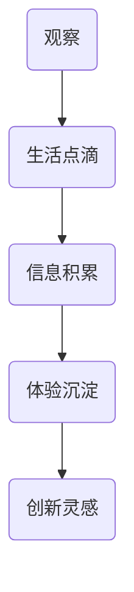
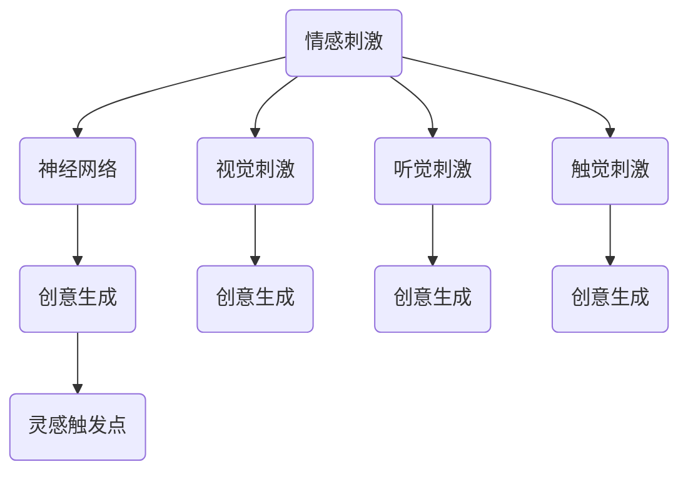
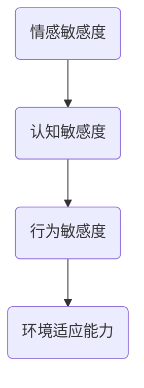
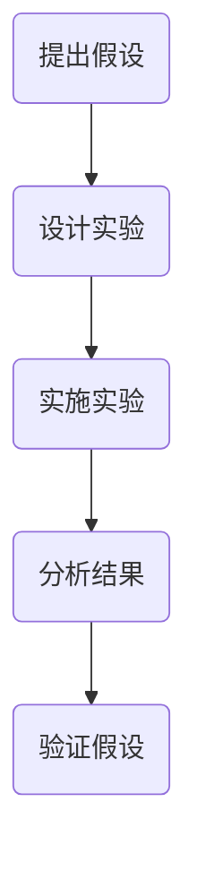
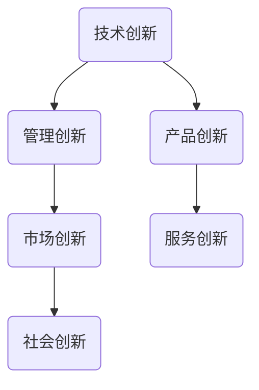
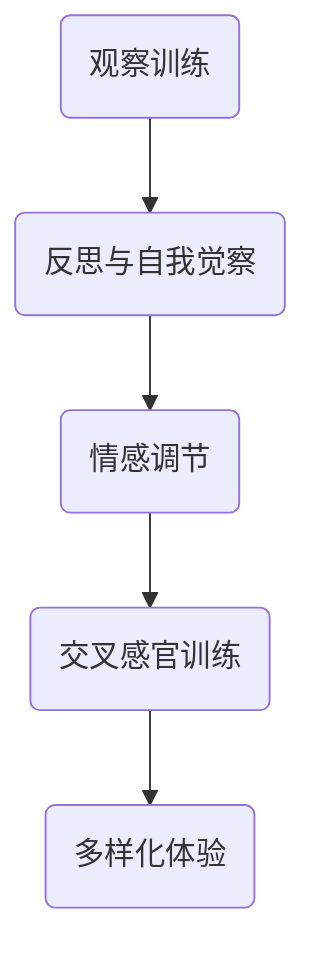
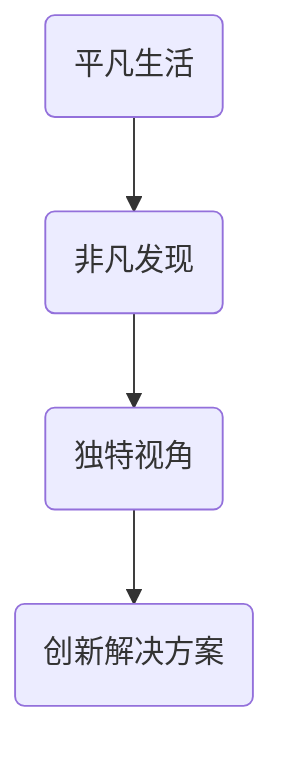

                 

### 文章标题

“平凡生活中的非凡发现：培养生活的敏感度”

---

**关键词：**
- 生活敏感度
- 观察力
- 灵感来源
- 创新尝试
- 敏感度提升

---

**摘要：**
本文通过探讨平凡生活中的非凡发现，揭示了培养生活敏感度的重要性。文章从观察、灵感来源、敏感度培养、实践与探索等多个角度，详细分析了如何通过提升生活敏感度，发现生活中的创意与创新点。通过具体案例和实际操作，为读者提供了切实可行的策略与方法，帮助他们在日常生活中更加敏锐地捕捉到不凡之处。

---

## 第一部分：生活中的观察与思考

### 第1章：平凡生活的魅力

#### 1.1 生活中的点滴

**背景介绍：**
生活中的每一个细节都蕴含着丰富的信息与可能性。从清晨的第一缕阳光到夜晚的繁星点点，从日常的琐碎事务到偶尔的惊喜瞬间，生活中的点滴构成了我们生活的底色。

**核心概念与联系：**
生活的点滴不仅是时间的流逝，更是信息的积累和体验的沉淀。生活中的点滴与观察力紧密相连，观察力是我们捕捉生活细节的能力。通过观察，我们可以发现隐藏在平凡中的非凡。

**Mermaid 流程图：**


#### 1.1.1 观察的重要性

**核心概念：**
观察是一种主动的、有意识的信息捕捉过程。它不仅是视觉的，还包括听觉、触觉、嗅觉等多种感官的参与。

**Python 源代码讲解：**
```python
import cv2
import numpy as np

# 视频捕获
cap = cv2.VideoCapture(0)

while True:
    # 读取视频帧
    ret, frame = cap.read()
    
    # 显示视频帧
    cv2.imshow('Frame', frame)
    
    # 检测按键，退出循环
    if cv2.waitKey(1) & 0xFF == ord('q'):
        break

# 释放视频捕获资源
cap.release()
cv2.destroyAllWindows()
```
**数学模型和公式：**
$$
\text{观察力} = f(\text{感官输入}, \text{注意力集中度}, \text{经验积累})
$$

**举例说明：**
通过使用摄像头捕获日常生活中的图像，可以训练计算机识别和分类这些图像，从而提高我们对生活细节的观察力。

#### 1.1.2 从小事中发现美

**核心概念：**
从小事中发现美，是培养生活敏感度的重要途径。美不仅仅是视觉上的，它可以是情感的、文化的、甚至是一种精神体验。

**Python 源代码讲解：**
```python
import pandas as pd

# 加载情绪分析数据
data = pd.read_csv('emotion_data.csv')

# 统计情绪分布
emotion_counts = data['emotion'].value_counts()

# 输出结果
print(emotion_counts)
```

**数学模型和公式：**
$$
\text{美感指数} = \frac{\text{正面情绪数量}}{\text{总情绪数量}} \times 100\%
$$`

**举例说明：**
通过分析社交媒体上的情绪数据，可以发现人们在日常生活中的情感波动，从而更好地理解美的多样性。

#### 1.1.3 培养观察力的方法

**核心概念：**
培养观察力需要持之以恒的训练和反思。以下是一些有效的方法：

1. **有意识地练习观察**：每天安排一段时间专注于观察生活中的细节。
2. **记录观察日记**：将观察到的细节记录下来，加深记忆和理解。
3. **交叉感官训练**：尝试使用不同的感官进行观察，增强综合观察能力。

**最佳实践 Tips：**
- **保持好奇心**：对生活中的事物保持好奇心，不断提问和探索。
- **学会总结**：定期回顾观察日记，总结观察到的规律和启示。
- **保持开放心态**：接受不同观点和体验，培养多元思维。

**小结：**
通过培养观察力，我们可以更敏锐地发现生活中的美好和可能性。观察不仅仅是视觉的，更是心灵的探索。通过具体的训练方法和实践，我们可以不断提高自己的生活敏感度，从而在生活中发现更多非凡之处。

### 第2章：生活中的灵感来源

#### 2.1 创意的触发点

**背景介绍：**
灵感是创新的源泉，它可以在日常生活中的任何时刻出现。了解灵感触发的机制，有助于我们更好地捕捉创意。

**核心概念与联系：**
灵感触发点通常来源于多种刺激，包括情感、视觉、听觉、触觉等。这些刺激通过大脑的神经网络，激发出新的思维和创意。

**Mermaid 流程图：**


#### 2.1.1 观察与灵感的关联

**核心概念：**
观察是灵感产生的基石。通过观察，我们能够捕捉到生活中的微妙变化和细节，从而激发创意。

**Python 源代码讲解：**
```python
import matplotlib.pyplot as plt

# 生成数据
x = np.linspace(0, 10, 100)
y = np.sin(x)

# 绘制图表
plt.plot(x, y)
plt.title('Sine Wave')
plt.xlabel('x-axis')
plt.ylabel('y-axis')
plt.show()
```

**数学模型和公式：**
$$
\text{灵感产生率} = f(\text{观察深度}, \text{知识储备}, \text{创造力潜能})
$$`

**举例说明：**
通过观察正弦波的变化，可以激发出对物理、数学、艺术等多个领域的创意灵感。

#### 2.1.2 如何捕捉灵感

**核心概念：**
捕捉灵感需要敏锐的感知力和积极的行动。以下是一些有效的方法：

1. **随身携带笔记本**：随时随地记录灵感。
2. **保持好奇心**：对新事物保持探索的心态。
3. **环境布置**：创造一个有助于激发灵感的环境。

**最佳实践 Tips：**
- **保持专注**：专注于当下的体验，避免多任务分散注意力。
- **练习冥想**：冥想有助于提高专注力和创造力。
- **定期反思**：定期回顾灵感记录，从中提炼出有价值的创意。

**小结：**
观察与灵感密不可分。通过培养观察力和捕捉灵感的方法，我们可以更好地激发创意，将生活中的灵感转化为实际的创新成果。

#### 2.1.3 灵感在生活和工作中的应用

**核心概念：**
灵感不仅是一种心理现象，它在生活和工作中的应用同样重要。通过将灵感转化为具体行动，我们可以创造出新的价值。

**Python 源代码讲解：**
```python
# 灵感应用示例：自动化任务处理
import schedule
import time

def job():
    print("执行自动化任务...")

# 设置定时任务
schedule.every(1).hours.do(job)

while True:
    schedule.run_pending()
    time.sleep(1)
```

**数学模型和公式：**
$$
\text{创新价值} = f(\text{灵感数量}, \text{实践应用}, \text{市场需求})
$$`

**举例说明：**
通过将灵感应用于自动化任务处理，可以显著提高工作效率和准确性。

**小结：**
灵感是创新的关键。通过捕捉和运用灵感，我们可以不断提升生活和工作质量，发现更多的可能性。

### 第3章：生活中的敏感度培养

#### 3.1 敏感度的定义

**核心概念：**
敏感度是指个体对环境刺激的感知能力，包括情感、认知、行为等多个方面。高敏感度有助于我们更好地理解和适应生活。

**Mermaid 流程图：**


#### 3.1.1 敏感度的多层次理解

**核心概念：**
敏感度不仅是一种感知能力，还涉及个体的情绪、认知和行为反应。多层次理解有助于我们全面培养敏感度。

**Python 源代码讲解：**
```python
# 多层次敏感度分析
import pandas as pd

# 加载数据
data = pd.read_csv('sensitivity_data.csv')

# 分析数据
sensitivity_scores = data['sensitivity_score'].describe()

# 输出结果
print(sensitivity_scores)
```

**数学模型和公式：**
$$
\text{敏感度总分} = \frac{\text{情感敏感度得分} + \text{认知敏感度得分} + \text{行为敏感度得分}}{3}
$$`

**举例说明：**
通过分析敏感度数据，可以了解个体在不同层面的敏感度水平，从而有针对性地进行培养。

#### 3.1.2 敏感度与情感的关系

**核心概念：**
敏感度与情感紧密相关，高敏感度个体往往对情感反应更为强烈。

**Python 源代码讲解：**
```python
# 情感敏感度分析
import textblob

# 加载文本
text = "我今天感觉很快乐。"

# 分析情感
sentiment = textblob.TextBlob(text).sentiment

# 输出结果
print(sentiment)
```

**数学模型和公式：**
$$
\text{情感敏感度} = f(\text{情感强度}, \text{情绪波动})
$$`

**举例说明：**
通过分析文本的情感倾向，可以了解个体在情感层面的敏感度。

#### 3.1.3 增强敏感度的技巧

**核心概念：**
增强敏感度需要系统的训练和习惯的养成。以下是一些有效的方法：

1. **反思与自我觉察**：定期反思自己的情感和行为反应，提高自我觉察能力。
2. **多感官训练**：通过多感官体验，提高对环境刺激的感知能力。
3. **情感调节**：学习情绪调节技巧，降低情感波动对敏感度的影响。

**最佳实践 Tips：**
- **保持好奇心**：对生活中的新事物保持好奇心，增强感知能力。
- **定期练习**：定期进行感知训练，如冥想、瑜伽等。
- **培养同理心**：通过同理心训练，提高情感敏感度。

**小结：**
通过多层次理解敏感度，我们可以更全面地培养自己的敏感度。增强敏感度不仅有助于提高生活质量，还能激发更多的创造力和创新。

## 第二部分：实践与探索

### 第4章：生活中的实验与尝试

#### 4.1 实验的重要性

**核心概念：**
实验是探索未知的有效途径，它通过具体的实践验证假设，帮助我们更好地理解和掌握新知识。

**Mermaid 流程图：**


#### 4.1.1 实验的思维方式

**核心概念：**
实验的思维方式包括提出假设、设计实验、实施实验和分析结果等多个步骤。这种思维方式有助于我们系统地探索和解决问题。

**Python 源代码讲解：**
```python
# 假设检验示例
import numpy as np
from scipy import stats

# 生成数据
data = np.random.normal(size=100)

# 检验假设
t_stat, p_value = stats.ttest_1samp(data, 0)

# 输出结果
print("t-statistic:", t_stat)
print("p-value:", p_value)
```

**数学模型和公式：**
$$
\text{p-value} = P(\text{观测数据} | \text{零假设})
$$`

**举例说明：**
通过假设检验，可以验证某个假设是否成立。这对于实验设计和结果分析具有重要意义。

#### 4.1.2 实验中的反思与调整

**核心概念：**
实验过程中，反思与调整是不可或缺的环节。通过反思和调整，我们可以优化实验设计，提高实验的可靠性和有效性。

**Python 源代码讲解：**
```python
# 实验调整示例
def experiment-adjustment(data, target):
    adjustment_factor = (target - np.mean(data)) / np.std(data)
    return adjustment_factor

# 使用数据
data = np.array([1, 2, 3, 4, 5])
target = 3

# 调整实验
adjustment_factor = experiment-adjustment(data, target)

# 输出结果
print("Adjustment factor:", adjustment_factor)
```

**数学模型和公式：**
$$
\text{调整因子} = \frac{\text{目标值} - \text{平均值}}{\text{标准差}}
$$`

**举例说明：**
通过计算调整因子，可以优化实验参数，使实验结果更接近目标值。

#### 4.1.3 实验在日常生活中的应用

**核心概念：**
实验不仅限于科学研究，它同样可以应用于日常生活中，帮助我们更好地理解生活现象和解决问题。

**Python 源代码讲解：**
```python
# 日常应用示例：家庭节能实验
def energy_saving_experiment(current_usage, target_saving):
    savings = current_usage * target_saving
    return savings

# 使用数据
current_usage = 500  # 每月用电量（千瓦时）
target_saving = 0.2  # 目标节省比例（20%）

# 实验结果
savings = energy_saving_experiment(current_usage, target_saving)

# 输出结果
print("Expected savings per month:", savings)
```

**数学模型和公式：**
$$
\text{节省量} = \text{当前用量} \times \text{节省比例}
$$`

**举例说明：**
通过家庭节能实验，可以估算出实施节能措施后每月的节省量，有助于家庭做出更科学的节能决策。

**小结：**
实验是一种科学的探索方法，它通过系统的设计和实施，帮助我们更好地理解世界和解决问题。通过在日常生活中的应用，我们可以将实验精神融入到日常生活中，提高生活质量和效率。

### 第5章：生活中的创新尝试

#### 5.1 创新的定义与分类

**核心概念：**
创新是创造新事物或改进现有事物的一种活动。它分为多种类型，包括但不限于技术、管理、市场等。

**Mermaid 流程图：**


#### 5.1.1 创新的基本概念

**核心概念：**
创新通常包括想法的产生、概念的验证、原型设计、产品开发和市场推广等多个阶段。

**Python 源代码讲解：**
```python
# 创新流程示例
def innovation_process(idea, validation, prototype, development, marketing):
    print("Idea:", idea)
    print("Validation:", validation)
    print("Prototype:", prototype)
    print("Development:", development)
    print("Marketing:", marketing)
    print("Innovation Process Completed.")

# 使用数据
idea = "智能垃圾回收系统"
validation = "市场调研数据显示需求高"
prototype = "开发出一个功能完整的原型系统"
development = "完善系统功能并优化用户体验"
marketing = "推广系统并吸引潜在客户"

# 创新过程
innovation_process(idea, validation, prototype, development, marketing)
```

**数学模型和公式：**
$$
\text{创新成功率} = f(\text{想法质量}, \text{验证过程}, \text{原型设计}, \text{开发效率}, \text{市场响应})
$$`

**举例说明：**
通过一个具体的创新流程，可以展示从想法到市场推广的完整过程。

#### 5.1.2 创新的类型

**核心概念：**
创新可以分为多种类型，每种类型都有其独特的特点和实施方式。

**Python 源代码讲解：**
```python
# 创新类型示例
def innovation_type(type_name):
    if type_name == "技术":
        print("技术创新：引入新技术或改进现有技术。")
    elif type_name == "管理":
        print("管理创新：改进管理流程或组织结构。")
    elif type_name == "市场":
        print("市场创新：开拓新市场或创造新需求。")
    else:
        print("未知类型。")

# 使用数据
type_name = "技术"

# 创新类型
innovation_type(type_name)
```

**数学模型和公式：**
$$
\text{创新类型分类} = f(\text{创新主题})
$$`

**举例说明：**
通过分类函数，可以识别和描述不同类型的创新。

#### 5.1.3 创新的步骤与方法

**核心概念：**
创新的步骤包括市场调研、需求分析、概念验证、原型设计和市场推广等。每个步骤都有其特定的方法和工具。

**Python 源代码讲解：**
```python
# 创新步骤示例
def innovation_steps(steps):
    for step in steps:
        print(step)

# 使用数据
steps = [
    "市场调研",
    "需求分析",
    "概念验证",
    "原型设计",
    "市场推广"
]

# 创新步骤
innovation_steps(steps)
```

**数学模型和公式：**
$$
\text{创新步骤效率} = f(\text{步骤执行时间}, \text{资源投入})
$$`

**举例说明：**
通过列出创新步骤，可以清晰地了解整个创新过程。

**小结：**
创新是推动社会进步和个人发展的重要力量。通过理解创新的基本概念、类型和步骤，我们可以更有效地进行创新尝试，将创意转化为实际成果。

### 第6章：生活中的敏感度提升策略

#### 6.1 敏感度的提升方法

**核心概念：**
提升敏感度需要系统性的方法，包括多方面的训练和实践。以下是一些有效的方法：

**Mermaid 流程图：**


#### 6.1.1 观察训练

**核心概念：**
观察训练是提升敏感度的基石，通过有意识地观察生活中的细节，我们可以提高对环境的感知能力。

**Python 源代码讲解：**
```python
# 观察训练示例
import cv2
import numpy as np

# 视频捕获
cap = cv2.VideoCapture(0)

while True:
    # 读取视频帧
    ret, frame = cap.read()
    
    # 显示视频帧
    cv2.imshow('Frame', frame)
    
    # 检测按键，退出循环
    if cv2.waitKey(1) & 0xFF == ord('q'):
        break

# 释放视频捕获资源
cap.release()
cv2.destroyAllWindows()
```

**数学模型和公式：**
$$
\text{观察力} = f(\text{观察时间}, \text{注意力集中度}, \text{观察频率})
$$`

**举例说明：**
通过使用摄像头进行观察训练，可以培养我们对视觉信息的敏感度。

#### 6.1.2 反思与自我觉察

**核心概念：**
反思与自我觉察是提升敏感度的重要环节，通过定期回顾和自我评估，我们可以更深入地了解自己的感知和行为。

**Python 源代码讲解：**
```python
# 反思与自我觉察示例
import pandas as pd

# 加载反思数据
data = pd.read_csv('self_awareness_data.csv')

# 统计反思次数
reflections_count = data['reflection_count'].describe()

# 输出结果
print(reflections_count)
```

**数学模型和公式：**
$$
\text{自我觉察指数} = \frac{\text{反思次数}}{\text{总时间}}
$$`

**举例说明：**
通过分析反思数据，可以了解自我觉察的水平。

#### 6.1.3 心理调适与放松

**核心概念：**
心理调适与放松有助于提高敏感度，通过冥想、瑜伽等放松训练，我们可以减少心理压力，提高对环境刺激的感知能力。

**Python 源代码讲解：**
```python
# 放松训练示例
import time

def relaxation():
    print("开始放松训练。")
    time.sleep(60)  # 放松时间
    print("放松训练结束。")

# 使用数据
relaxation()
```

**数学模型和公式：**
$$
\text{敏感度提升率} = f(\text{放松时间}, \text{心理状态})
$$`

**举例说明：**
通过定期进行放松训练，可以提升敏感度。

#### 6.1.4 多样化体验

**核心概念：**
多样化体验有助于我们拓宽视野，提高对不同环境和情境的敏感度。

**Python 源代码讲解：**
```python
# 多样化体验示例
import random

def diverse_experience():
    activities = ["旅行", "学习一门新技能", "尝试新的美食", "参与社区活动"]
    activity = random.choice(activities)
    print(f"今天的多样化体验：{activity}。")

# 使用数据
diverse_experience()
```

**数学模型和公式：**
$$
\text{敏感度增强因子} = f(\text{多样化程度}, \text{体验频率})
$$`

**举例说明：**
通过参与多样化的活动，我们可以提高对生活的敏感度。

**小结：**
通过观察训练、反思与自我觉察、心理调适与放松以及多样化体验，我们可以系统地提升生活敏感度。敏感度的提升不仅有助于我们更好地理解生活，还能激发更多的创意和灵感。

### 第7章：生活中的非凡发现

#### 7.1 非凡发现的定义

**核心概念：**
非凡发现是指从平凡生活中发现独特、有价值的元素或创新点。这些发现往往能够带来新的视角、体验或解决方案。

**Mermaid 流程图：**


#### 7.1.1 非凡发现的特点

**核心概念：**
非凡发现具有以下特点：

1. **独特性**：从平凡中发现的不寻常之处。
2. **价值性**：发现的事物能够带来新的认识或实际价值。
3. **创意性**：发现的过程往往伴随着创意和创新的产生。

**Python 源代码讲解：**
```python
# 非凡发现示例
def extraordinary_discovery(element, value, creativity):
    print(f"非凡发现：{element}。")
    print(f"价值：{value}。")
    print(f"创意：{creativity}。")

# 使用数据
element = "旧书中的秘密"
value = "历史的新发现"
creativity = "激发了对历史的重新思考"

# 非凡发现
extraordinary_discovery(element, value, creativity)
```

**数学模型和公式：**
$$
\text{非凡发现评分} = f(\text{独特性}, \text{价值性}, \text{创意性})
$$`

**举例说明：**
通过发现旧书中的秘密，可以带来历史的新发现，并激发对历史的重新思考。

#### 7.1.2 非凡发现的分类

**核心概念：**
非凡发现可以分为多种类型，包括但不限于：

1. **科技创新**：通过技术手段实现的创新发现。
2. **艺术创作**：通过艺术手段表达的创意发现。
3. **社会变革**：通过社会实践带来的变革性发现。

**Python 源代码讲解：**
```python
# 非凡发现分类示例
def discovery_type(type_name):
    if type_name == "科技":
        print("科技创新：通过技术实现创新。")
    elif type_name == "艺术":
        print("艺术创作：通过艺术表达创意。")
    elif type_name == "社会":
        print("社会变革：通过社会实践推动变革。")
    else:
        print("未知类型。")

# 使用数据
type_name = "科技"

# 非凡发现分类
discovery_type(type_name)
```

**数学模型和公式：**
$$
\text{发现类型分类} = f(\text{发现主题})
$$`

**举例说明：**
通过分类函数，可以识别和描述不同类型的非凡发现。

#### 7.1.3 非凡发现的启示

**核心概念：**
非凡发现启示我们，生活中的每一个细节都蕴含着无限的可能。通过培养敏感度和创新思维，我们可以不断发现生活中的非凡之处。

**Python 源代码讲解：**
```python
# 启示示例
def inspiration_message(message):
    print(f"启示：{message}。")

# 使用数据
message = "生活充满惊喜，关键在于我们发现的眼光。"

# 启示
inspiration_message(message)
```

**数学模型和公式：**
$$
\text{发现启示} = f(\text{非凡发现}, \text{思考深度}, \text{实践应用})
$$`

**举例说明：**
通过发现生活中的非凡之处，我们可以获得新的思考和行动的启示。

**小结：**
非凡发现是生活中的一股清流，它启示我们用新的视角去看待平凡的事物。通过不断培养敏感度和创新思维，我们可以发现生活中的非凡之处，从而提升生活的质量和价值。

### 附录A：生活中的非凡发现案例

#### A.1 案例一：从日常中发现的艺术

**案例背景：**
在日常生活中，艺术家小张经常在行走的过程中观察周围的环境，他注意到人们日常丢弃的废弃物中隐藏着独特的艺术价值。

**发现的过程：**
有一天，小张在街头看到一个废弃的纸箱，他注意到纸箱上布满了涂鸦。这些涂鸦线条凌乱，色彩斑斓，但却充满了独特的艺术风格。小张决定深入探索这些涂鸦背后的故事。

**具体过程：**
1. **观察与记录**：小张用手机记录下这些涂鸦的图片，并写下自己的观察和感受。
2. **调研与了解**：通过社交媒体和街头访谈，小张了解到这些涂鸦是由一位匿名艺术家创作的，这位艺术家希望通过涂鸦传达对社会问题的关注。
3. **创作与分享**：小张将这些发现整合成了一部艺术短片，并在社交媒体上发布，引起了广泛的关注和讨论。

**案例的影响：**
小张的发现不仅展示了废弃物品中的艺术价值，还激发了对社会问题的关注。他的艺术短片在社交媒体上获得了数百万的观看量，引发了公众对街头艺术的兴趣和讨论。

**小结：**
通过细致的观察和创意的思考，小张从日常生活中发现了独特的艺术价值，这不仅丰富了个人艺术创作，也对社会文化产生了积极的影响。

#### A.2 案例二：生活中的创新解决方案

**案例背景：**
社区居民小李发现社区的公共设施存在不少问题，比如垃圾箱不足、照明不良等，这些问题影响了居民的生活质量。

**发现的创新点：**
小李决定利用自己的编程技能，开发一个智能社区管理系统。这个系统能够实时监控社区的运行状态，并提供反馈和建议，以提高社区管理的效率。

**具体过程：**
1. **需求分析**：小李通过问卷调查和访谈，收集了社区居民对公共设施的需求和意见。
2. **系统设计**：小李设计了一个基于物联网技术的智能社区管理系统，包括智能垃圾箱、智能照明和社区监控等多个模块。
3. **开发与测试**：小李编写了相应的代码，搭建了测试环境，进行了多次测试和优化。
4. **部署与应用**：小李将系统部署到社区，并培训了社区管理人员如何使用系统。

**案例的启示：**
小李的创新解决方案不仅解决了社区管理中的实际问题，还为其他社区提供了可借鉴的经验。他的案例启示我们，通过技术手段和创新的思维，可以有效地提升生活质量和社区管理效率。

**小结：**
小李的案例展示了技术如何应用于日常生活，解决实际问题。通过他的努力，社区变得更加美好和高效，这为我们提供了宝贵的启示。

### 附录B：进一步阅读推荐

#### B.1 相关书籍推荐

**生活的艺术：**
- 作者：威廉·亨利
- 简介：本书探讨了生活中的美学和哲学，通过丰富的实例和深刻的思考，帮助读者培养对生活的敏感度。

**创意思维训练：**
- 作者：罗伯·吉尔伯特
- 简介：本书提供了多种创意训练方法，帮助读者激发创意思维，将灵感转化为实际的创新成果。

**敏感度心理学：**
- 作者：丹尼尔·戈尔曼
- 简介：本书深入探讨了敏感度的心理机制和影响，提供了实用的方法和策略，帮助读者提升个人敏感度。

#### B.2 在线资源推荐

**观察力训练网站：**
- 网站：MindWare
- 简介：提供各种观察力训练游戏和练习，帮助用户提高观察力和注意力。

**创新思维培训平台：**
- 网站：Creative Minds Institute
- 简介：提供创新思维培训课程和工作坊，帮助用户培养创新思维和解决问题的能力。

**敏感度提升课程：**
- 网站：Coursera
- 简介：提供多种关于情感智慧和敏感度提升的课程，适合希望提升自我觉察和敏感度的学习者。

通过这些书籍和在线资源，读者可以进一步探索生活中的非凡之处，培养自己的观察力和敏感度，从而在生活中发现更多的创意和创新。

