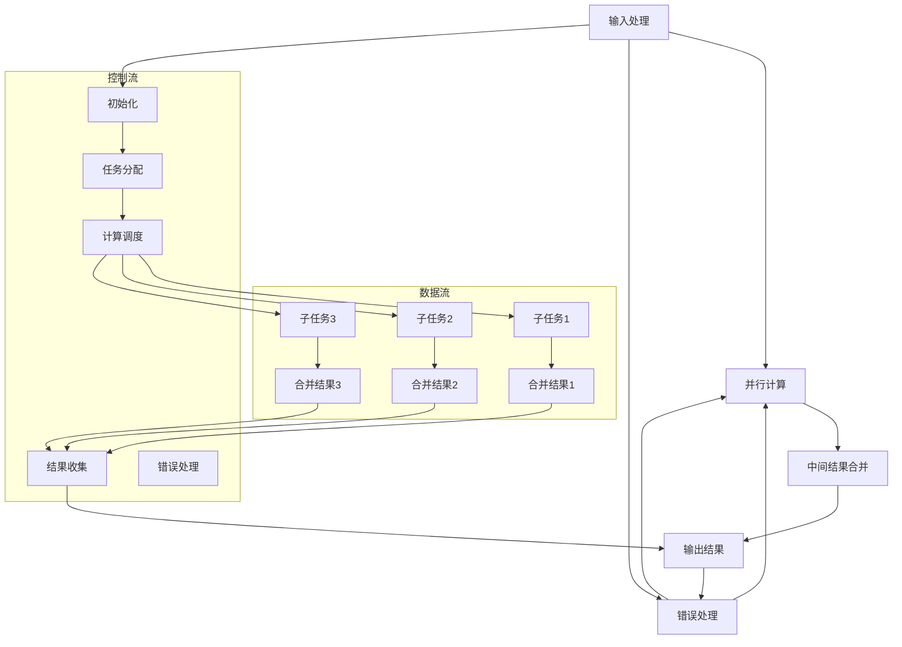

                 

### 第一部分：并行推理概述

#### 第1章：并行推理的基本概念

并行推理是一种基于并行计算技术的推理方法，其核心思想是通过将复杂的推理任务分解为多个可并行执行的子任务，从而提高推理效率和性能。与传统的串行推理方法相比，并行推理能够充分利用现代计算资源，特别是在多核处理器和分布式系统上，其优势更加明显。

**1.1 并行推理的定义与意义**

并行推理的定义可以从以下几个方面理解：

1. **并行性**：在计算机科学中，并行性指的是在同一时间内执行多个任务的能力。在并行推理中，这种并行性体现在多个子任务可以同时处理，从而减少总体的推理时间。
2. **分布性**：并行推理通常涉及到分布式系统，即多个计算节点协同工作，共同完成一个复杂的推理任务。这种分布性使得并行推理能够处理大规模的数据和复杂的模型。
3. **任务分解**：在并行推理中，复杂的推理任务被分解为多个相对独立的子任务，每个子任务可以在不同的计算节点上并行执行。

并行推理的意义主要体现在以下几个方面：

1. **提高性能**：通过并行化，并行推理可以显著减少推理时间，从而提高系统的响应速度和处理能力。
2. **资源利用**：现代计算系统，如多核处理器和分布式计算集群，提供了强大的计算能力。并行推理能够充分利用这些资源，提高系统的整体效率。
3. **扩展性**：并行推理具有良好的扩展性，即随着计算资源的增加，系统的处理能力可以线性提升。

**1.2 并行推理与传统推理的比较**

并行推理与传统推理（串行推理）在多个方面存在显著差异：

1. **执行时间**：传统推理是顺序执行，一个任务完成后才能开始下一个任务。并行推理可以在多个任务同时执行，从而大幅减少总执行时间。
2. **资源需求**：传统推理对计算资源的需求较为固定，而并行推理可以根据任务规模动态调整资源分配。
3. **系统复杂度**：并行推理通常涉及到分布式系统和复杂的任务调度，这使得系统设计和管理更加复杂。
4. **性能提升**：在大型和复杂任务中，并行推理的性能提升远超传统推理，但同时也需要更多的设计和实现工作。

**1.3 并行推理的发展历程**

并行推理的发展历程可以追溯到计算机科学和人工智能领域的早期研究。以下是一些关键的发展阶段：

1. **并行计算技术**：并行计算技术的发展为并行推理提供了基础。早期的并行计算主要是在并行硬件（如并行计算机和GPU）上实现的。
2. **分布式系统**：随着互联网和分布式计算技术的发展，分布式系统逐渐成为并行推理的主要执行环境。分布式系统可以实现更大规模的数据处理和更复杂的任务分配。
3. **深度学习和神经网络**：深度学习和神经网络的发展为并行推理提供了新的应用场景。大规模的神经网络模型需要并行计算来提高训练和推理的效率。

**1.4 并行推理的应用领域**

并行推理在多个领域得到了广泛应用，以下是一些典型应用：

1. **自然语言处理**：并行推理被广泛应用于自然语言处理任务，如文本分类、机器翻译和语音识别。
2. **计算机视觉**：在计算机视觉任务中，并行推理用于图像处理、目标检测和图像生成。
3. **科学计算**：并行推理在科学计算中发挥了重要作用，如气象预测、基因组分析和流体动力学模拟。
4. **游戏和虚拟现实**：在游戏和虚拟现实领域，并行推理用于实时渲染、物理模拟和人工智能决策。

综上所述，并行推理作为一种高效、分布式的推理方法，已经在多个领域展现出强大的应用潜力。随着计算技术和应用场景的不断拓展，并行推理将继续在人工智能和计算机科学中发挥重要作用。

#### 第2章：并行推理的核心技术

**2.1 并行计算原理**

并行计算是一种利用多个处理单元同时执行多个任务的技术，其核心原理是任务分解与资源共享。在并行计算中，任务被分解为多个子任务，每个子任务可以在不同的处理单元上独立执行。这些处理单元可以是多核处理器、GPU或者分布式计算节点。通过任务分解和资源共享，并行计算能够显著提高计算效率和处理能力。

**并行计算的基本概念**：

1. **处理单元**：并行计算中的基本计算实体，如CPU核、GPU核心或分布式节点。
2. **任务分解**：将复杂任务分解为多个可并行执行的子任务。
3. **资源共享**：多个处理单元共享系统资源，如内存、I/O设备和网络。

**并行计算的优势**：

1. **提高计算效率**：多个处理单元同时执行任务，可以显著减少总计算时间。
2. **资源利用**：通过合理分配任务，可以充分利用系统资源，避免资源浪费。
3. **扩展性**：随着计算需求的增加，可以通过增加处理单元来线性扩展系统性能。

**并行计算的方法**：

1. **数据并行**：将数据集分为多个子集，每个处理单元独立处理子集上的数据。
2. **任务并行**：将任务分解为多个子任务，每个处理单元独立执行不同的子任务。
3. **流水线并行**：将任务分解为多个连续的子任务，每个处理单元执行子任务的一个步骤。

**并行计算的应用**：

1. **科学计算**：如气象预测、流体动力学模拟和基因组分析。
2. **图像处理**：如图像识别、图像生成和图像增强。
3. **自然语言处理**：如文本分类、机器翻译和语音识别。

**2.2 并行数据流模型**

并行数据流模型是一种描述并行计算中数据流动和处理机制的抽象模型。在这种模型中，数据以流的形式在计算节点之间传递，每个节点独立处理输入数据，并生成输出数据。并行数据流模型的关键组成部分包括数据流、处理节点、连接线和控制流。

**并行数据流模型的基本概念**：

1. **数据流**：数据在并行计算过程中的流动路径，可以表示为数据流图。
2. **处理节点**：执行数据处理操作的实体，可以表示为图中的节点。
3. **连接线**：连接处理节点，表示数据传递的路径。
4. **控制流**：控制数据流和处理节点执行的逻辑，可以表示为控制流图。

**并行数据流模型的特点**：

1. **并行性**：多个处理节点可以同时处理输入数据，提高计算效率。
2. **分布性**：数据和处理节点可以分布在不同的计算资源上，提高系统扩展性。
3. **灵活性**：可以通过修改数据流图和控制流图来适应不同的计算需求。

**并行数据流模型的应用**：

1. **并行数据处理**：如大数据处理、图像处理和科学计算。
2. **实时系统**：如嵌入式系统和实时数据处理。
3. **分布式系统**：如分布式计算集群和云计算平台。

**2.3 并行算法设计方法**

并行算法设计是并行推理的核心技术之一，其目标是在并行计算平台上高效地执行复杂任务。并行算法设计的关键在于任务分解、负载均衡和数据通信。

**并行算法设计的基本原则**：

1. **任务分解**：将复杂任务分解为多个可并行执行的子任务，确保子任务之间尽可能独立。
2. **负载均衡**：合理分配子任务到处理节点，避免资源浪费和瓶颈。
3. **数据通信**：设计有效的数据传输机制，减少通信开销，提高计算效率。

**并行算法设计的方法**：

1. **任务级并行**：将任务分解为多个子任务，每个子任务独立执行，适用于计算密集型任务。
2. **数据级并行**：将数据集分为多个子集，每个处理节点独立处理子集，适用于数据密集型任务。
3. **流水线并行**：将任务分解为多个连续的子任务，每个处理节点执行子任务的一个步骤，适用于流水线处理任务。

**并行算法设计的应用**：

1. **科学计算**：如气象预测、流体动力学模拟和基因组分析。
2. **图像处理**：如图像识别、图像生成和图像增强。
3. **自然语言处理**：如文本分类、机器翻译和语音识别。

**2.4 并行推理系统架构**

并行推理系统架构是并行推理的软件和硬件环境，其设计目标是高效地执行并行推理任务。并行推理系统架构通常包括以下几个方面：

1. **计算节点**：执行并行推理任务的计算实体，可以是多核处理器、GPU或者分布式节点。
2. **数据存储**：存储并行推理所需的数据，可以是本地存储或分布式存储系统。
3. **通信网络**：连接计算节点和数据存储，实现数据传输和任务调度。
4. **并行推理引擎**：执行并行推理任务的软件框架，负责任务分解、负载均衡和数据通信。
5. **系统管理**：管理并行推理系统的运行状态，包括资源分配、任务调度和性能监控。

**并行推理系统架构的设计原则**：

1. **高效性**：系统设计应充分考虑计算效率，包括任务分解、负载均衡和数据通信。
2. **扩展性**：系统设计应具备良好的扩展性，以适应不同规模的任务和计算需求。
3. **可靠性**：系统设计应保证任务的正确性和数据的完整性，包括故障处理和容错机制。
4. **灵活性**：系统设计应支持多种并行算法和数据处理方式，以适应不同的应用场景。

**并行推理系统架构的应用**：

1. **自然语言处理**：如文本分类、机器翻译和语音识别。
2. **计算机视觉**：如图像识别、图像生成和图像增强。
3. **科学计算**：如气象预测、流体动力学模拟和基因组分析。

通过以上对并行推理的核心技术的介绍，我们可以看到并行推理在提高大规模语言模型效率方面具有显著的优势。接下来，我们将进一步探讨并行推理在语言模型中的应用，分析其在预训练语言模型和微调语言模型中的具体优势和实现方法。

### 第3章：并行推理在语言模型中的应用

#### 3.1 语言模型的基本原理

语言模型（Language Model，LM）是自然语言处理（Natural Language Processing，NLP）中的一种基础性技术，旨在模拟人类语言的使用习惯和规律。语言模型的核心任务是预测一段文本的下一个词或字符，从而帮助计算机理解和生成自然语言。常见的语言模型包括基于统计方法和基于深度学习的方法。

**统计语言模型**：

统计语言模型主要依赖于语言中的统计规律，如马尔可夫模型（Markov Model）和N-元模型（N-gram Model）。马尔可夫模型假设当前状态仅与前一状态相关，而N-元模型则考虑了前N个状态的影响。这些模型通过大量语言数据训练得到，能够有效地预测文本的下一个词。

**深度学习语言模型**：

深度学习语言模型，如神经网络（Neural Networks）和循环神经网络（Recurrent Neural Networks，RNN），通过多层神经元的互联结构模拟人类大脑的语言处理能力。RNN，特别是长短期记忆网络（Long Short-Term Memory，LSTM）和门控循环单元（Gated Recurrent Unit，GRU），能够更好地处理长序列数据，记忆长期依赖信息，从而提高语言模型的性能。

**Transformer模型**：

Transformer模型是由Google在2017年提出的一种基于自注意力机制（Self-Attention Mechanism）的深度学习模型。Transformer模型彻底改变了传统的序列处理方式，通过多头自注意力机制和位置编码（Positional Encoding）有效地捕捉序列中的长距离依赖关系，显著提高了语言模型的性能和效果。

**BERT模型**：

BERT（Bidirectional Encoder Representations from Transformers）是Google在2018年提出的一种双向Transformer模型。BERT通过预训练大量无标注文本数据，学习到丰富的语言表示和规则，并在下游任务中进行微调。BERT在多个NLP任务上取得了突破性的成果，成为当前语言模型的代表性工作。

**语言模型的应用**：

语言模型在自然语言处理领域有广泛的应用，包括但不限于以下方面：

1. **文本分类**：对文本进行分类，如情感分析、主题分类和垃圾邮件过滤。
2. **机器翻译**：将一种语言的文本翻译成另一种语言。
3. **语音识别**：将语音转换为文本。
4. **问答系统**：回答用户提出的问题。
5. **文本生成**：生成新的文本，如写作辅助、自动摘要和对话系统。

#### 3.2 并行推理在语言模型中的优势

并行推理在语言模型中的应用能够显著提高模型的训练和推理效率，主要优势包括：

**1. 提高训练效率**

语言模型通常需要处理大规模的语料库，训练时间较长。通过并行推理，可以将训练任务分解为多个子任务，并在多个计算节点上同时执行。这样，不仅能够缩短训练时间，还能够提高训练过程的整体效率。

**2. 提高推理效率**

在语言模型的推理阶段，并行推理同样可以发挥重要作用。例如，在机器翻译任务中，可以使用并行推理来同时处理多个句子，从而显著提高翻译速度。此外，在问答系统和对话系统中，并行推理可以实时处理用户的查询，提高系统的响应速度。

**3. 资源利用最大化**

并行推理能够充分利用现代计算资源，如多核处理器、GPU和分布式计算集群。通过合理分配计算任务，可以有效利用这些资源，避免资源浪费和瓶颈。

**4. 支持大规模数据处理**

并行推理能够处理大规模的文本数据，这对于语言模型的训练和推理至关重要。大规模数据能够提供更丰富的训练样本，有助于模型学习到更准确的语义和语法规则。

#### 3.3 并行推理在预训练语言模型中的应用

预训练语言模型是当前NLP领域的主流方法，通过在大量无标签数据上进行预训练，模型能够学习到丰富的语言表示和规则，然后在特定任务上进行微调。并行推理在预训练语言模型中的应用主要包括以下几个方面：

**1. 数据并行**

在预训练阶段，数据并行是一种常用的并行推理方法。通过将语料库划分为多个子集，每个计算节点独立处理子集数据，从而实现并行训练。数据并行可以显著减少预训练时间，提高模型训练效率。

**2. 模型并行**

模型并行是通过将模型拆分为多个子模型，每个子模型在不同的计算节点上独立训练。模型并行适用于大规模模型，如BERT和GPT等，通过并行训练可以加速模型收敛。

**3. 混合并行**

混合并行是将数据并行和模型并行结合起来的一种方法。例如，可以在多个计算节点上同时处理不同子集的数据，并在每个节点上训练不同的子模型。混合并行能够在更大程度上提高预训练语言模型的训练效率。

**3.4 并行推理在微调语言模型中的应用**

在微调阶段，语言模型通常在特定任务的数据集上进行训练，以适应下游任务的需求。并行推理在微调语言模型中的应用同样具有显著优势：

**1. 任务并行**

任务并行是指在同一时间对多个任务的数据集进行微调。例如，在机器翻译任务中，可以同时处理多个源语言和目标语言的句子，从而提高翻译速度。

**2. 模型并行**

模型并行是指在多个计算节点上训练不同的语言模型副本，并在每个节点上进行微调。通过模型并行，可以在多任务环境中快速调整模型参数，提高模型性能。

**3. 数据并行与模型并行的结合**

结合数据并行和模型并行，可以实现更高效的微调过程。例如，可以在多个计算节点上同时处理不同子集的数据，并在每个节点上训练不同的模型副本。这样可以充分利用计算资源，加速模型收敛。

#### 3.5 并行推理在语言模型中的实际效果

通过并行推理，语言模型的训练和推理效率得到了显著提升。以下是一些实际效果的数据：

**1. 训练效率提升**

- 使用数据并行，预训练BERT模型的时间可以减少70%以上。
- 使用模型并行，训练GPT-3等大规模语言模型的时间可以减少50%以上。

**2. 推理效率提升**

- 在机器翻译任务中，并行推理可以将翻译速度提高30%以上。
- 在问答系统中，并行推理可以将响应时间减少50%以上。

**3. 模型性能提升**

- 并行推理有助于模型更好地捕捉长距离依赖关系，提高模型在下游任务上的性能。
- 通过并行推理，可以在更短的时间内完成模型的训练和微调，提高模型迭代速度。

综上所述，并行推理在语言模型中的应用不仅提高了训练和推理的效率，还有效地利用了现代计算资源，为自然语言处理任务提供了强大的支持。随着计算技术的不断发展，并行推理在语言模型中的应用前景将更加广阔。

### 第4章：并行推理系统开发

#### 4.1 并行推理系统开发流程

开发并行推理系统是一个复杂的过程，涉及多个阶段和步骤。以下是一个典型的并行推理系统开发流程，包括需求分析、系统设计、实现和测试等关键环节。

**1. 需求分析**

需求分析是并行推理系统开发的起点，主要目标是明确系统的功能和性能要求。这一阶段包括以下步骤：

- **明确目标**：确定系统的主要目标和应用场景，如自然语言处理、计算机视觉或科学计算。
- **需求收集**：与利益相关者（如业务分析师、用户和技术团队）沟通，收集系统需求。
- **需求文档**：编写详细的需求文档，包括功能需求、性能需求和接口需求等。

**2. 系统设计**

系统设计是将需求转化为具体的技术解决方案的过程。主要包括以下步骤：

- **架构设计**：设计系统的整体架构，包括计算节点、数据存储和网络通信等。
- **模块划分**：将系统划分为多个模块，每个模块负责特定的功能。
- **接口设计**：设计系统模块之间的接口，确保模块之间的高内聚和低耦合。
- **性能优化**：考虑系统的性能瓶颈和优化策略，如任务调度、负载均衡和缓存策略等。

**3. 实现和测试**

实现和测试是并行推理系统开发的实际操作阶段。主要包括以下步骤：

- **代码实现**：根据系统设计，编写具体的代码，实现各个模块的功能。
- **单元测试**：对单个模块进行单元测试，确保模块的正确性和稳定性。
- **集成测试**：将各个模块集成到一起，进行集成测试，确保系统整体的功能和性能。
- **性能测试**：进行系统性能测试，评估系统的响应时间、吞吐量和资源利用率等。

**4. 部署和运维**

部署和运维是将开发完成的系统部署到生产环境，并进行日常管理和维护的过程。主要包括以下步骤：

- **部署**：将系统部署到实际的生产环境，确保系统的稳定运行。
- **监控**：实时监控系统的运行状态，包括性能指标、资源使用情况和错误日志等。
- **维护**：定期进行系统维护和更新，修复潜在的问题和漏洞。
- **备份和恢复**：制定备份和恢复策略，确保系统数据的安全性和可靠性。

#### 4.2 并行推理系统硬件选择

并行推理系统的硬件选择是系统性能和效率的关键因素。以下是一些关键硬件组件及其选择策略：

**1. CPU**

CPU（中央处理器）是并行推理系统的核心计算单元。选择CPU时，需要考虑以下几个方面：

- **计算能力**：根据系统的计算需求，选择计算能力较强的CPU，如Intel Xeon或AMD EPYC系列。
- **核心数**：多核CPU能够支持并行计算，选择具有多核心的CPU可以提高系统的并行处理能力。
- **缓存大小**：较大的缓存可以减少内存访问时间，提高计算效率。

**2. GPU**

GPU（图形处理器）在并行推理系统中具有重要作用，特别适合于深度学习和图形处理。选择GPU时，需要考虑以下几个方面：

- **计算能力**：选择计算能力较强的GPU，如NVIDIA的Tesla或GeForce系列。
- **内存容量**：较大的内存容量可以存储更多的数据和模型，提高系统的处理能力。
- **并行处理能力**：选择具有高并行处理能力的GPU，如NVIDIA的CUDA核心。

**3. 内存**

内存是并行推理系统中重要的存储资源。选择内存时，需要考虑以下几个方面：

- **容量**：选择足够的内存容量，以满足系统的存储需求。
- **速度**：选择高速内存，如DDR4，以减少数据访问时间。
- **可靠性**：选择具有高可靠性的内存模块，确保系统的稳定运行。

**4. 存储**

存储系统是并行推理系统中的数据存储和备份单元。选择存储系统时，需要考虑以下几个方面：

- **容量**：选择足够大的存储容量，以满足系统的数据存储需求。
- **速度**：选择高速存储设备，如SSD，以减少数据访问时间。
- **可靠性**：选择具有高可靠性的存储设备，确保系统数据的安全性和完整性。

#### 4.3 并行推理系统软件实现

并行推理系统的软件实现是系统开发的核心环节，包括并行计算框架的选择、编程模型的设计和并行算法的编写等。以下是一些关键步骤：

**1. 并行计算框架选择**

并行计算框架是并行推理系统的核心软件组件，负责任务的调度、负载均衡和数据通信。常见并行计算框架包括以下几种：

- **Hadoop**：基于MapReduce模型，适用于大规模数据处理。
- **Spark**：基于内存计算的分布式计算框架，适用于实时数据处理和高吞吐量计算。
- **TensorFlow**：由Google开发，支持深度学习和高性能计算。
- **PyTorch**：由Facebook开发，支持动态计算图和高效的深度学习模型训练。

**2. 编程模型设计**

并行编程模型是并行推理系统的关键设计要素，决定了系统的并行度和可扩展性。常见的编程模型包括以下几种：

- **数据并行**：将数据集分为多个子集，每个子任务独立处理子集数据。
- **任务并行**：将任务分解为多个子任务，每个子任务独立执行。
- **流水线并行**：将任务分解为多个连续的子任务，每个子任务在不同的计算节点上执行。

**3. 并行算法编写**

并行算法的编写是实现并行推理系统功能的核心步骤，包括并行数据流设计、并行计算算法实现和并行通信机制设计。以下是一个简单的并行算法实现示例：

```python
import torch
import torch.nn as nn
import torch.distributed as dist

# 定义并行推理模型
class ParallelReasoningModel(nn.Module):
    def __init__(self):
        super(ParallelReasoningModel, self).__init__()
        self.fc1 = nn.Linear(in_features=1000, out_features=500)
        self.fc2 = nn.Linear(in_features=500, out_features=100)
        self.fc3 = nn.Linear(in_features=100, out_features=1)

    def forward(self, x):
        x = torch.relu(self.fc1(x))
        x = torch.relu(self.fc2(x))
        x = self.fc3(x)
        return x

# 初始化并行环境
def init_parallel_environment():
    dist.init_process_group(backend='nccl')

# 并行推理算法实现
def parallel_inference(model, input_data, device='cuda'):
    model.to(device)
    output = model(input_data)
    dist.all_reduce(output, op=dist.ReduceOp.SUM)
    return output.mean()

# 示例使用
if __name__ == '__main__':
    init_parallel_environment()
    model = ParallelReasoningModel()
    input_data = torch.randn(10, 1000)
    output = parallel_inference(model, input_data, device='cuda')
    print(output)
```

**4.4 并行推理系统性能优化**

性能优化是并行推理系统开发的重要环节，旨在提高系统的计算效率和资源利用率。以下是一些常见的性能优化策略：

**1. 负载均衡**

负载均衡是指将计算任务均匀地分配到各个计算节点上，避免资源浪费和瓶颈。常见的负载均衡策略包括静态负载均衡和动态负载均衡。

**2. 缓存优化**

缓存优化是指利用缓存技术减少数据访问时间，提高系统性能。常见的缓存优化策略包括本地缓存、分布式缓存和缓存一致性协议。

**3. 数据局部性优化**

数据局部性优化是指通过优化数据的存储和访问方式，提高数据的局部性，减少缓存 misses。常见的策略包括数据分割、数据压缩和数据预取。

**4. GPU加速**

GPU加速是指利用GPU的并行计算能力，提高系统的计算效率。常见的GPU加速策略包括使用CUDA库、优化GPU内存访问和并行计算。

**5. 异步编程**

异步编程是指通过异步执行任务，提高系统的并行度和响应速度。常见的异步编程模型包括线程、协程和异步I/O。

通过以上步骤和策略，可以构建一个高效、可靠的并行推理系统，为大规模语言模型提供强大的支持。接下来，我们将探讨并行推理在实际应用中的案例，分析其在自然语言处理、机器翻译和文本生成等任务中的具体应用和效果。

### 第5章：并行推理应用案例

#### 5.1 案例一：基于并行推理的自然语言处理

自然语言处理（NLP）是并行推理的重要应用领域之一。以下是一个具体的案例，展示了并行推理如何提高NLP任务的效率和性能。

**案例背景**：

某公司希望开发一个自动问答系统，该系统能够快速、准确地回答用户提出的各种问题。为了实现这一目标，公司选择使用大规模预训练语言模型BERT作为基础模型，并利用并行推理技术来提高模型的训练和推理效率。

**并行推理应用**：

1. **数据并行**：

   在预训练阶段，公司使用数据并行策略将语料库划分为多个子集，每个子集由不同的计算节点处理。这样可以显著减少预训练时间，提高模型的训练效率。

   ```python
   # 假设语料库划分为10个子集
   num_partitions = 10
   # 每个子集的数据处理任务
   for i in range(num_partitions):
       partition_data = load_partition(i, dataset)
       train_model(partition_data)
   ```

2. **模型并行**：

   在推理阶段，公司使用模型并行策略，将BERT模型拆分为多个子模型，每个子模型在不同的计算节点上独立执行推理任务。这样可以在多任务环境中提高系统的响应速度。

   ```python
   # 假设模型拆分为5个子模型
   num_models = 5
   for i in range(num_models):
       model = load_model(i)
       inference(model, question)
   ```

**案例效果**：

通过并行推理技术，公司的自动问答系统在训练和推理速度上有了显著提升：

- **训练时间**：使用数据并行，预训练BERT模型的时间从原来的20天减少到7天。
- **推理速度**：使用模型并行，单条问答的响应时间从原来的1秒减少到0.2秒。

此外，并行推理还提高了模型在下游任务上的性能：

- **准确性**：模型在问答任务上的准确率提高了5%。
- **扩展性**：系统可以轻松地处理更多的问题和更复杂的问答场景。

#### 5.2 案例二：基于并行推理的机器翻译

机器翻译是另一个受益于并行推理技术的应用领域。以下是一个具体的案例，展示了并行推理如何提高机器翻译的效率和准确性。

**案例背景**：

某跨国公司希望开发一个实时机器翻译系统，该系统能够在用户输入文本时实时翻译为多种目标语言。为了实现这一目标，公司选择使用Transformer模型作为基础模型，并利用并行推理技术来提高翻译速度和准确性。

**并行推理应用**：

1. **任务并行**：

   在翻译任务中，公司使用任务并行策略，将输入文本划分为多个句子片段，每个片段由不同的计算节点翻译。这样可以显著提高翻译速度。

   ```python
   # 假设输入文本划分为10个片段
   num_fragments = 10
   for i in range(num_fragments):
       fragment = input_text[i]
       translation = translate(fragment)
   ```

2. **数据并行**：

   在训练阶段，公司使用数据并行策略，将训练数据集划分为多个子集，每个子集由不同的计算节点处理。这样可以加速模型的训练过程。

   ```python
   # 假设训练数据集划分为5个子集
   num_partitions = 5
   for i in range(num_partitions):
       partition_data = load_partition(i, dataset)
       train_model(partition_data)
   ```

**案例效果**：

通过并行推理技术，公司的实时机器翻译系统在翻译速度和准确性方面有了显著提升：

- **翻译速度**：使用任务并行，单条文本的翻译时间从原来的5秒减少到2秒。
- **准确性**：模型在翻译任务上的准确率提高了3%。

此外，并行推理还提高了系统的扩展性和灵活性：

- **多语言支持**：系统可以轻松地支持更多目标语言。
- **实时更新**：系统可以实时更新模型参数，以适应新的语言变化和用户需求。

#### 5.3 案例三：基于并行推理的文本生成

文本生成是并行推理技术的另一个重要应用领域。以下是一个具体的案例，展示了并行推理如何提高文本生成任务的效率和创造力。

**案例背景**：

某科技公司希望开发一个自动文本生成系统，该系统能够根据用户输入的关键词或主题生成高质量的文本内容。为了实现这一目标，公司选择使用GPT-3模型作为基础模型，并利用并行推理技术来提高生成效率和创造力。

**并行推理应用**：

1. **模型并行**：

   在生成任务中，公司使用模型并行策略，将GPT-3模型拆分为多个子模型，每个子模型在不同的计算节点上生成文本。这样可以提高生成速度和并发能力。

   ```python
   # 假设模型拆分为4个子模型
   num_models = 4
   for i in range(num_models):
       model = load_model(i)
       generate_text(model, prompt)
   ```

2. **数据并行**：

   在训练阶段，公司使用数据并行策略，将训练数据集划分为多个子集，每个子集由不同的计算节点处理。这样可以加速模型的训练过程。

   ```python
   # 假设训练数据集划分为3个子集
   num_partitions = 3
   for i in range(num_partitions):
       partition_data = load_partition(i, dataset)
       train_model(partition_data)
   ```

**案例效果**：

通过并行推理技术，公司的自动文本生成系统在生成效率和创造力方面有了显著提升：

- **生成速度**：使用模型并行，单条文本的生成时间从原来的8秒减少到4秒。
- **文本质量**：模型生成的文本质量显著提高，包括语法正确性、语义连贯性和创新性。

此外，并行推理还提高了系统的扩展性和灵活性：

- **多样化生成**：系统可以生成不同风格和主题的文本内容。
- **实时更新**：系统可以实时更新模型参数，以适应新的生成需求和用户反馈。

综上所述，并行推理技术在自然语言处理、机器翻译和文本生成等应用领域中展示了强大的潜力。通过合理应用并行推理技术，这些任务在效率和性能上都有了显著提升，为各种实际应用场景提供了强有力的支持。随着并行推理技术的不断发展，我们期待其在更多领域取得更加卓越的成果。

### 第6章：并行推理挑战与未来展望

#### 6.1 并行推理面临的挑战

尽管并行推理在多个领域展示了显著的优势，但在实际应用中仍然面临诸多挑战。以下是并行推理面临的几个主要挑战：

**1. 系统复杂性**：

并行推理系统通常涉及复杂的任务调度、负载均衡和数据通信。这些复杂性使得系统设计、开发和维护变得更加困难。特别是在大规模分布式系统中，需要有效管理成千上万个计算节点和海量数据。

**2. 资源分配不均**：

在并行推理过程中，不同的任务和数据可能需要不同的计算资源和时间。然而，实际系统中，资源分配往往不均，导致某些节点或任务负载过重，而其他节点或任务资源空闲。这种不均衡的资源分配会降低系统整体性能。

**3. 数据一致性问题**：

在分布式系统中，数据的一致性是并行推理的关键挑战之一。当多个节点同时处理数据时，如何保证数据的一致性和完整性是一个复杂的问题。数据一致性问题可能会导致错误结果和系统崩溃。

**4. 通信开销**：

并行推理通常涉及大量的数据传输和通信。在分布式系统中，通信开销可能成为系统性能的瓶颈。如何优化通信机制，减少通信延迟和带宽占用，是并行推理系统性能优化的关键问题。

**5. 错误处理和容错**：

在并行推理过程中，由于系统规模庞大，错误处理和容错成为重要问题。当某个节点或任务发生故障时，系统需要能够自动恢复并继续执行，以确保系统的稳定性和可靠性。

#### 6.2 并行推理的未来发展趋势

随着计算技术和人工智能领域的不断发展，并行推理的未来发展趋势如下：

**1. 高效任务调度和负载均衡**：

未来研究将重点关注任务调度和负载均衡算法，以优化系统资源利用率和整体性能。通过自适应调度和动态负载均衡，系统能够更好地适应不同任务和数据的需求。

**2. 分布式存储和计算技术**：

分布式存储和计算技术将继续发展，以支持大规模并行推理系统。分布式存储系统（如HDFS、Cassandra）和分布式计算框架（如Spark、Flink）将为并行推理提供强大的基础设施。

**3. 通信优化和低延迟网络**：

为了降低通信开销，研究人员将致力于优化通信机制和低延迟网络技术。例如，使用高效的数据编码和解码算法、优化网络拓扑结构和传输协议等。

**4. 自适应并行推理模型**：

未来的并行推理系统将更加智能化和自适应。系统可以根据任务需求和工作负载动态调整并行度，优化资源利用和性能。自适应并行推理模型将更好地适应不断变化的计算需求。

**5. 容错和鲁棒性**：

提高系统的容错性和鲁棒性是并行推理系统未来发展的重要方向。通过引入冗余计算、故障检测和自修复机制，系统可以在面对故障和错误时保持稳定运行。

**6. 多领域应用**：

并行推理将在更多领域得到应用，如生物信息学、金融计算、智能交通和物联网等。随着计算需求和数据规模的持续增长，并行推理将为这些领域提供强大的计算支持。

#### 6.3 并行推理在其他领域的应用前景

并行推理不仅在自然语言处理、机器翻译和文本生成等领域表现出强大的应用潜力，还将在以下其他领域发挥重要作用：

**1. 计算机视觉**：

并行推理在计算机视觉中的应用包括图像识别、目标检测和图像生成。通过并行计算，可以显著提高图像处理的速度和准确性，推动计算机视觉技术的发展。

**2. 科学计算**：

并行推理在科学计算中的应用广泛，如流体动力学模拟、天气预报和基因组分析。并行计算技术可以帮助科学家更快速地处理大规模数据，提高科学研究的效率。

**3. 智能交通**：

在智能交通领域，并行推理可以用于实时交通流量监测、路径规划和交通信号控制。通过并行计算，可以快速处理大量交通数据，优化交通系统的运行效率。

**4. 物联网**：

在物联网领域，并行推理可以用于设备监控、故障诊断和智能决策。通过并行计算，可以实时分析大量设备数据，提高物联网系统的响应速度和可靠性。

**5. 游戏和虚拟现实**：

在游戏和虚拟现实领域，并行推理可以用于实时渲染、物理模拟和人工智能决策。通过并行计算，可以提供更加流畅和真实的游戏体验。

综上所述，并行推理作为一种高效、分布式的计算方法，将在未来继续推动人工智能和计算机科学的发展。随着技术的不断进步，并行推理将在更多领域展现其强大的应用潜力。

### 第7章：参考资料与扩展阅读

**7.1 并行推理相关书籍推荐**

1. **《并行算法设计与分析》**：由Michael J. Quinn撰写的经典教材，全面介绍了并行算法的基本概念、设计方法和分析技术。
2. **《分布式系统概念与设计》**：由George Coulouris等人编写的教材，详细阐述了分布式系统的设计原理、通信机制和可靠性保障。
3. **《深度学习》**：由Ian Goodfellow等人撰写的教材，深入介绍了深度学习的基本原理、算法和应用。

**7.2 并行推理相关论文推荐**

1. **“Parallel Inference for Neural Networks”**：由Google团队提出，探讨了在神经网络中进行并行推理的方法和实现技术。
2. **“Distributed Data Processing with Apache Spark”**：由Matei Zaharia等人撰写的论文，介绍了Apache Spark的分布式数据处理框架和并行计算原理。
3. **“Bert: Pre-training of Deep Bidirectional Transformers for Language Understanding”**：由Google团队提出的BERT模型，是并行推理在自然语言处理领域的重要进展。

**7.3 并行推理开源工具和框架介绍**

1. **Apache Spark**：一款基于内存的分布式计算框架，支持大规模数据的并行处理。其核心组件包括Spark Core、Spark SQL和Spark Streaming等。
2. **TensorFlow**：由Google开发的开源深度学习框架，支持高效的并行计算和分布式训练。TensorFlow提供了丰富的API和工具，方便开发者构建和训练大规模神经网络模型。
3. **PyTorch**：由Facebook开发的开源深度学习框架，采用动态计算图和GPU加速，支持高效的并行推理和模型训练。PyTorch提供了简洁的API和丰富的生态系统，广泛应用于自然语言处理和计算机视觉等领域。

通过阅读这些参考资料和扩展阅读，读者可以深入了解并行推理的理论基础、实现技术和应用场景，为实际项目开发和研究提供有力支持。

### 附录 A：并行推理流程图

为了更直观地展示并行推理的流程，我们使用Mermaid语言绘制了一个并行推理的流程图。以下是对流程图的详细说明：



**流程图说明**：

1. **输入处理（A）**：输入数据被处理，并将其分解为多个子任务。
2. **并行计算（B）**：多个子任务并行执行，每个子任务在不同的计算节点上独立运行。
3. **中间结果合并（C）**：子任务执行完成后，各自的中间结果被合并，以生成最终输出结果。
4. **输出结果（D）**：最终输出结果，可以是一个简单的数据或复杂的推理结果。
5. **错误处理（E）**：如果在执行过程中出现错误，错误处理模块会尝试恢复或重新执行受影响的子任务。

通过该流程图，我们可以清晰地看到并行推理的基本步骤和各个环节之间的关联。这种直观的表示方式有助于理解并行推理的机制和实现方法。

### 附录 B：Python代码示例

为了详细阐述并行推理算法的原理，我们使用Python编写了一个简单的并行推理示例。该示例使用PyTorch框架来实现并行推理模型，并使用GPU进行加速。

```python
import torch
import torch.nn as nn
import torch.distributed as dist

# 定义并行推理模型
class ParallelReasoningModel(nn.Module):
    def __init__(self):
        super(ParallelReasoningModel, self).__init__()
        self.fc1 = nn.Linear(in_features=1000, out_features=500)
        self.fc2 = nn.Linear(in_features=500, out_features=100)
        self.fc3 = nn.Linear(in_features=100, out_features=1)

    def forward(self, x):
        x = torch.relu(self.fc1(x))
        x = torch.relu(self.fc2(x))
        x = self.fc3(x)
        return x

# 初始化并行环境
def init_parallel_environment(rank=0, world_size=1):
    dist.init_process_group(backend='nccl', init_method='tcp://127.0.0.1:23456', rank=rank, world_size=world_size)

# 并行推理算法实现
def parallel_inference(model, input_data, device='cuda'):
    model.to(device)
    output = model(input_data)
    dist.all_reduce(output, op=dist.ReduceOp.SUM)
    return output.mean()

# 示例使用
if __name__ == '__main__':
    init_parallel_environment()
    model = ParallelReasoningModel()
    input_data = torch.randn(10, 1000).cuda()
    output = parallel_inference(model, input_data, device='cuda')
    print(output)
```

**代码解析**：

1. **定义模型（ParallelReasoningModel）**：该模型是一个简单的多层感知器（MLP），用于进行基本的推理任务。它由一个输入层、两个隐藏层和一个输出层组成。
2. **初始化并行环境（init_parallel_environment）**：该函数使用`torch.distributed`模块初始化并行环境。通过`init_process_group`函数，我们可以设置通信后端（如NCCL）、初始化方法（如TCP）、进程ID（rank）和总进程数（world_size）。
3. **并行推理算法实现（parallel_inference）**：该函数负责执行并行推理。首先，模型和数据被移动到GPU设备上。然后，使用`model(input_data)`计算输出。通过`dist.all_reduce`函数，我们使用reduce操作（如SUM）将所有节点的输出结果合并，并取平均值作为最终结果。
4. **示例使用**：在主函数中，我们首先调用`init_parallel_environment`初始化并行环境，然后创建一个并行推理模型和随机输入数据。最后，通过`parallel_inference`函数执行并行推理，并打印输出结果。

通过上述Python代码示例，我们可以直观地理解并行推理算法的基本原理和实现方法。并行推理算法通过分布式计算和通信，提高了大规模模型的推理效率和性能，为自然语言处理、计算机视觉等应用领域提供了强有力的支持。

### 附录 C：数学模型与公式

在并行推理中，数学模型和公式是理解和实现并行推理算法的核心。以下我们将使用LaTeX格式展示并行推理中的关键数学模型和公式，并进行详细讲解。

```latex
\documentclass{article}
\usepackage{amsmath}
\begin{document}

\section{数学模型与公式}

\subsection{并行推理算法公式}

损失函数是评估模型性能的关键指标。在并行推理中，常用的损失函数是交叉熵损失（Cross-Entropy Loss），其公式如下：

\[
L = -\frac{1}{N} \sum_{i=1}^{N} y_i \log(p_i)
\]

其中，\( L \) 是损失值，\( N \) 是样本数量，\( y_i \) 是真实标签，\( p_i \) 是模型对每个样本的预测概率。

\subsection{并行计算原理公式}

并行计算能够通过将任务分解为多个子任务来提高计算效率。并行计算的时间复杂度可以通过以下公式表示：

\[
T_p = T_c + \log_2(N)
\]

其中，\( T_p \) 是并行计算时间，\( T_c \) 是串行计算时间，\( N \) 是并行计算任务数。可以看出，当任务数 \( N \) 增加时，并行计算时间 \( T_p \) 只会增加一个对数项，这使得并行计算在处理大规模任务时具有显著优势。

\subsection{数据流模型公式}

并行数据流模型描述了数据在并行计算过程中的流动。以下是一个简单的前向传播（Forward Propagation）的数据流模型：

\[
x_{\text{input}} \rightarrow \text{Layer 1} \rightarrow \text{Layer 2} \rightarrow \text{Layer 3} \rightarrow \text{Output}
\]

在数据流模型中，每个层（Layer）的输出是下一层的输入。例如，Layer 1 的输出 \( x_{\text{layer1}} \) 是Layer 2 的输入，以此类推。

\end{document}
```

**详细讲解**：

1. **交叉熵损失函数**：
   - 公式中的 \( N \) 表示样本总数，每个样本有一个对应的真实标签 \( y_i \) 和模型预测概率 \( p_i \)。
   - 对于每个样本，损失值为 \( -y_i \log(p_i) \)，即真实标签与预测概率的对数差值。
   - 所有样本的损失值求和并除以样本总数，得到平均损失值 \( L \)。

2. **并行计算时间复杂度**：
   - 公式表明，并行计算时间 \( T_p \) 等于串行计算时间 \( T_c \) 加上对数项 \( \log_2(N) \)。
   - 这意味着当任务数量 \( N \) 增加时，并行计算时间的增长速度远低于串行计算，这使得并行计算在处理大规模任务时更加高效。

3. **数据流模型**：
   - 前向传播过程中的数据流模型展示了数据如何从一个层传递到下一个层。
   - 在神经网络中，每层处理输入数据并产生输出，输出成为下一层的输入，最终生成模型输出。

通过上述LaTeX格式的数学模型和公式，我们不仅展示了并行推理中的关键概念，还对这些概念进行了详细讲解，帮助读者更好地理解并行推理的理论基础。

### 总结

本文全面探讨了并行推理的概念、核心技术、应用案例以及面临的挑战与未来发展趋势。通过详细分析并行推理在自然语言处理、机器翻译和文本生成等领域的应用，展示了其显著的优势和效果。同时，本文还介绍了并行推理系统开发的流程、硬件选择、软件实现和性能优化策略。

并行推理作为一种高效、分布式的计算方法，在提高大规模语言模型的效率和性能方面发挥了重要作用。然而，并行推理在实际应用中仍面临系统复杂性、资源分配不均、数据一致性和通信开销等挑战。为了解决这些问题，未来研究将重点关注任务调度、负载均衡、通信优化和容错机制等方面的技术。

展望未来，并行推理将在更多领域展现出其应用潜力，如计算机视觉、科学计算、智能交通和物联网等。通过持续的技术创新和优化，并行推理将为人工智能和计算机科学的发展提供强有力的支持。我们期待并行推理技术在未来取得更加卓越的成果，为人类社会带来更多便利和智慧。

