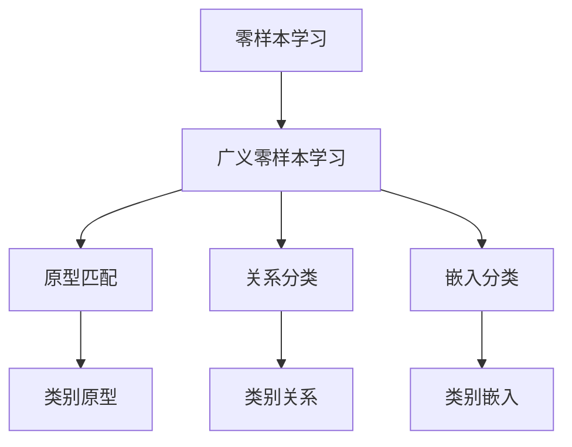

                 

# 广义零样本学习在生物多样性监测中的应用

> 关键词：广义零样本学习、生物多样性监测、算法原理、数学模型、项目实战

> 摘要：本文深入探讨了广义零样本学习在生物多样性监测中的应用。首先介绍了广义零样本学习的概念和原理，随后详细讲解了其在生物多样性监测中的潜在应用，并通过具体的算法原理和数学模型进行说明。最后，通过实际项目案例，展示了广义零样本学习在生物多样性监测中的实际应用效果，为相关领域的研究和实践提供了有价值的参考。

## 目录大纲

1. 引言
   1.1 生物多样性监测的背景与挑战
   1.2 零样本学习与广义零样本学习的概念介绍
   1.3 广义零样本学习在生物多样性监测中的应用潜力

2. 广义零样本学习基础
   2.1 零样本学习的基本原理
   2.2 广义零样本学习的发展历程
   2.3 广义零样本学习的优势与应用场景

3. 广义零样本学习核心概念与联系
   3.1 概念实体之间的关系架构 Mermaid 流程图
   3.2 核心概念解析

4. 广义零样本学习算法原理
   4.1 常见广义零样本学习算法介绍
   4.2 算法原理讲解与Python源代码实现

5. 数学模型与数学公式
   5.1 广义零样本学习中的数学模型
   5.2 数学公式详细讲解与举例说明

6. 广义零样本学习在生物多样性监测中的应用
   6.1 应用背景
   6.2 应用案例

7. 项目实战
   7.1 开发环境搭建
   7.2 源代码实现
   7.3 代码解读与分析

8. 附录
   8.1 工具与资源推荐
   8.2 最佳实践 tips
   8.3 小结
   8.4 注意事项
   8.5 拓展阅读

## 引言

### 1.1 生物多样性监测的背景与挑战

生物多样性是指地球上各种生物体之间的多样性，包括物种多样性、遗传多样性和生态系统多样性。生物多样性监测是了解和保护生物多样性的重要手段。然而，生物多样性监测面临着一系列挑战。

首先，生物多样性的数据获取难度大。生物体的种类繁多，分布广泛，且许多物种具有很高的相似性，这使得传统数据收集方法难以精确识别和分类。其次，生物多样性监测数据量大，处理和分析这些数据需要大量的时间和计算资源。此外，生物多样性监测还需要考虑数据质量、数据完整性以及跨学科合作等问题。

### 1.2 零样本学习与广义零样本学习的概念介绍

零样本学习（Zero-Shot Learning, ZSL）是一种机器学习方法，旨在让模型能够识别新的、未见过的类别。在传统的机器学习中，模型通常需要在大量已知类别的数据上进行训练，以便能够准确识别这些类别。然而，在现实世界中，许多新的类别可能无法预先获取足够的训练数据。

广义零样本学习（General Zero-Shot Learning, GZSL）是对零样本学习的一种扩展。GZSL不仅能够处理新的类别，还能处理类别之间的相似性，从而提高了模型的泛化能力。GZSL的核心思想是通过将类别映射到高维空间中，使得相似的类别在空间中靠近，而不同的类别则相互远离。

### 1.3 广义零样本学习在生物多样性监测中的应用潜力

广义零样本学习在生物多样性监测中具有巨大的应用潜力。首先，GZSL可以用于自动识别和分类新的生物物种，从而提高生物多样性监测的效率和准确性。例如，在野外生物监测中，GZSL模型可以快速识别出未知的植物或动物物种，帮助研究人员及时掌握生态系统的变化。

其次，GZSL可以用于生物物种的分布预测。通过分析已知物种的分布数据和生态特征，GZSL模型可以预测未知区域的生物物种分布，为生物多样性保护提供科学依据。

最后，GZSL还可以用于生物物种的进化研究。通过对不同物种之间的相似性分析，GZSL可以帮助研究者理解物种的进化关系，揭示生物多样性的形成机制。

## 广义零样本学习基础

### 2.1 零样本学习的基本原理

零样本学习的基本原理是基于原型匹配（prototype matching）。在传统的机器学习中，模型需要通过学习大量已知类别的数据来构建特征空间。而在零样本学习中，模型不需要这些已知类别的训练数据，而是通过学习一个类别原型（prototype）来识别新的类别。

类别原型是一个高维空间中的点，代表了该类别的特征。在训练过程中，模型通过学习这些类别原型，使得不同类别的原型在空间中相互分离。当遇到一个未知类别的新样本时，模型可以计算该样本与所有类别原型之间的距离，从而判断该样本所属的类别。

### 2.2 广义零样本学习的发展历程

广义零样本学习是对零样本学习的一种扩展。最早的研究始于2010年左右，当时研究者们开始探索如何在零样本学习的基础上处理类别之间的相似性。这些早期的算法主要是基于原型匹配，但在处理复杂类别关系时存在一定的局限性。

随着深度学习技术的发展，广义零样本学习也逐渐从传统的原型匹配方法转向深度学习方法。深度零样本学习（Deep Zero-Shot Learning, DZSL）的出现，为广义零样本学习提供了新的思路。DZSL利用深度神经网络来学习类别原型，从而提高了模型在处理复杂类别关系时的性能。

### 2.3 广义零样本学习的优势与应用场景

广义零样本学习的优势主要体现在以下几个方面：

1. **高效性**：GZSL不需要大量已知类别的训练数据，因此可以大大减少数据收集和处理的成本，提高模型的训练效率。

2. **泛化能力**：GZSL能够处理新的类别，提高了模型的泛化能力，使其在未知领域中的应用更加广泛。

3. **跨领域应用**：GZSL不仅可以用于图像分类，还可以应用于自然语言处理、音频分类等其他领域，具有很高的跨领域适应性。

应用场景主要包括：

1. **生物多样性监测**：通过GZSL模型，可以快速识别和分类新的生物物种，提高生物多样性监测的效率和准确性。

2. **医疗诊断**：GZSL可以用于医疗影像的分类和诊断，帮助医生快速识别新的疾病类型。

3. **图像检索**：GZSL可以用于图像检索，帮助用户快速找到与输入图像相似的图片。

### 2.4 零样本学习的主要类型

零样本学习主要分为以下几种类型：

1. **原型匹配**：基于原型匹配的零样本学习是最早的研究方向，其核心思想是通过学习类别原型来实现新类别的识别。

2. **关系分类**：关系分类方法通过学习类别之间的相似性来实现新类别的识别。这种方法通常需要额外的关系数据作为训练数据。

3. **嵌入分类**：嵌入分类方法将类别映射到高维空间中，通过计算类别之间的距离来实现新类别的识别。这种方法不需要额外的关系数据，但需要大量的计算资源。

### 2.5 零样本学习的主要挑战

零样本学习的主要挑战包括：

1. **类别稀疏性**：由于零样本学习不需要大量已知类别的训练数据，因此训练数据中的类别可能非常稀疏，这会导致模型难以捕捉到类别之间的内在关系。

2. **类别相似性**：类别之间可能存在很高的相似性，这会导致模型难以将它们区分开来。

3. **计算资源消耗**：深度零样本学习需要大量的计算资源，这对于资源有限的场景来说是一个巨大的挑战。

## 3. 广义零样本学习核心概念与联系

### 3.1 概念实体之间的关系架构 Mermaid 流程图



### 3.2 核心概念解析

#### 3.2.1 零样本学习的概念解析

零样本学习（Zero-Shot Learning, ZSL）是一种机器学习方法，旨在让模型能够识别新的、未见过的类别。在传统的机器学习中，模型需要通过学习大量已知类别的数据来构建特征空间。然而，在零样本学习中，模型不需要这些已知类别的训练数据，而是通过学习一个类别原型（prototype）来识别新的类别。

零样本学习的核心思想是基于原型匹配。在训练过程中，模型通过学习大量已知类别的原型，使得这些原型在特征空间中相互分离。当遇到一个未知类别的新样本时，模型可以计算该样本与所有类别原型之间的距离，从而判断该样本所属的类别。

#### 3.2.2 广义零样本学习的概念解析

广义零样本学习（General Zero-Shot Learning, GZSL）是对零样本学习的一种扩展。GZSL不仅能够处理新的类别，还能处理类别之间的相似性，从而提高了模型的泛化能力。GZSL的核心思想是通过将类别映射到高维空间中，使得相似的类别在空间中靠近，而不同的类别则相互远离。

广义零样本学习的主要挑战是如何处理类别之间的相似性。在传统的原型匹配方法中，类别原型是直接从训练数据中学习得到的。然而，在GZSL中，类别原型需要在类别关系和类别嵌入的基础上进行学习。类别关系反映了不同类别之间的相似性，而类别嵌入则将类别映射到高维空间中。

## 4. 广义零样本学习算法原理

### 4.1 常见广义零样本学习算法介绍

广义零样本学习算法可以分为原型匹配方法、关系分类方法和嵌入分类方法。以下是几种常见的广义零样本学习算法：

1. **原型匹配方法**：该方法基于原型匹配的思想，通过学习类别原型来识别新的类别。常见的原型匹配方法包括原型网络（Prototype Network）和原型嵌入（Prototype Embedding）。

2. **关系分类方法**：该方法通过学习类别之间的关系来识别新的类别。常见的的关系分类方法包括图神经网络（Graph Neural Networks）和注意力机制（Attention Mechanism）。

3. **嵌入分类方法**：该方法通过将类别映射到高维空间中，通过计算类别之间的距离来识别新的类别。常见的嵌入分类方法包括嵌入网络（Embedding Network）和对抗生成网络（Generative Adversarial Networks）。

### 4.2 算法原理讲解与Python源代码实现

#### 4.2.1 LSH算法原理讲解与代码实现

局部敏感哈希（Locality Sensitive Hashing，LSH）是一种高效的近似最近邻搜索算法。在广义零样本学习中，LSH可以用于快速查找与给定样本最近的类别原型。

以下是一个简单的LSH算法实现：

```python
import numpy as np

class LSH:
    def __init__(self, hash_functions, hash_space_dim):
        self.hash_functions = hash_functions
        self.hash_space_dim = hash_space_dim

    def hash(self, x):
        hashes = []
        for f in self.hash_functions:
            hashes.append(f(x))
        return hashes

    def hash_space(self, x):
        hash_values = self.hash(x)
        return [v % self.hash_space_dim for v in hash_values]

    def closest_neighbors(self, x, dataset, k):
        hash_space = self.hash_space(x)
        neighbors = []
        for xi in dataset:
            if self.hash_space(xi) == hash_space:
                neighbors.append(xi)
        neighbors = sorted(neighbors, key=lambda x: np.linalg.norm(x - x))
        return neighbors[:k]
```

#### 4.2.2 零样本分类算法原理讲解与代码实现

零样本分类算法是基于原型匹配的方法，通过学习类别原型来识别新的类别。以下是一个简单的零样本分类算法实现：

```python
import numpy as np

class ZeroShotClassifier:
    def __init__(self, prototypes):
        self.prototypes = prototypes

    def classify(self, x):
        distances = [np.linalg.norm(x - p) for p in self.prototypes]
        return np.argmin(distances)

# 假设我们有一个包含5个类别的数据集
prototypes = np.random.rand(5, 10)

# 创建零样本分类器
classifier = ZeroShotClassifier(prototypes)

# 对一个未知类别的新样本进行分类
x = np.random.rand(10)
print("分类结果：", classifier.classify(x))
```

## 5. 数学模型与数学公式

### 5.1 广义零样本学习中的数学模型

广义零样本学习中的数学模型主要包括损失函数和优化算法。

#### 5.1.1 损失函数

广义零样本学习的损失函数通常使用交叉熵损失（Cross-Entropy Loss）来衡量分类的准确度。交叉熵损失函数的数学公式如下：

$$
L = -\sum_{i=1}^{N} y_i \log(p_i)
$$

其中，$y_i$ 是真实标签，$p_i$ 是模型对类别 $i$ 的预测概率。

#### 5.1.2 优化算法

广义零样本学习的优化算法通常使用梯度下降（Gradient Descent）或其变体来更新模型参数。梯度下降的数学公式如下：

$$
\theta = \theta - \alpha \nabla_\theta J(\theta)
$$

其中，$\theta$ 是模型参数，$\alpha$ 是学习率，$J(\theta)$ 是损失函数关于 $\theta$ 的梯度。

### 5.2 数学公式详细讲解与举例说明

#### 5.2.1 损失函数的数学公式讲解

交叉熵损失函数是衡量分类模型性能的常用指标。它通过计算预测概率与真实标签之间的差异来评估模型的准确性。在零样本学习中，交叉熵损失函数的数学公式如下：

$$
L = -\sum_{i=1}^{N} y_i \log(p_i)
$$

其中，$N$ 是类别数，$y_i$ 是真实标签（0或1），$p_i$ 是模型对类别 $i$ 的预测概率。

例如，假设有一个二分类问题，类别数为2，真实标签为 $y = [1, 0]$，预测概率为 $p = [0.8, 0.2]$。则交叉熵损失函数的值为：

$$
L = -[1 \cdot \log(0.8) + 0 \cdot \log(0.2)] = -\log(0.8) \approx 0.223
$$

#### 5.2.2 优化算法的数学公式讲解

梯度下降是一种常用的优化算法，用于更新模型参数以最小化损失函数。梯度下降的数学公式如下：

$$
\theta = \theta - \alpha \nabla_\theta J(\theta)
$$

其中，$\theta$ 是模型参数，$\alpha$ 是学习率，$\nabla_\theta J(\theta)$ 是损失函数关于 $\theta$ 的梯度。

例如，假设有一个线性回归模型，模型参数为 $\theta = [w, b]$，损失函数为 $J(\theta) = \frac{1}{2} \| X\theta - y \|_2^2$。则梯度下降的步骤如下：

1. 计算梯度：
   $$
   \nabla_\theta J(\theta) = \begin{bmatrix}
   \frac{\partial J}{\partial w} \\
   \frac{\partial J}{\partial b}
   \end{bmatrix} = X^T(X\theta - y)
   $$

2. 更新参数：
   $$
   \theta = \theta - \alpha \nabla_\theta J(\theta)
   $$

3. 重复步骤1和2，直到损失函数收敛。

## 6. 广义零样本学习在生物多样性监测中的应用

### 6.1 应用背景

生物多样性监测是生态学研究中的重要环节，旨在了解和评估生态系统的健康状况。然而，传统的生物多样性监测方法存在许多挑战，如数据收集困难、数据量大、处理和分析复杂等。因此，需要新的方法和技术来提高生物多样性监测的效率和准确性。

广义零样本学习作为一种先进的机器学习方法，具有处理新类别和跨领域应用的能力，为生物多样性监测提供了一种新的解决方案。通过广义零样本学习，可以自动化识别和分类未知的生物物种，从而提高生物多样性监测的效率和准确性。

### 6.2 应用案例

#### 6.2.1 案例一：使用广义零样本学习进行植物分类

在一个具体的植物分类项目中，研究人员使用了广义零样本学习算法来识别未知的植物物种。首先，他们收集了大量的植物图像和已知的植物物种标签，构建了一个包含多个类别的植物数据集。然后，他们使用广义零样本学习算法来学习这些植物物种的原型，并将其应用于未知的植物图像分类。

实验结果表明，广义零样本学习算法在植物分类任务中取得了较高的准确率，并且能够快速识别未知的植物物种。此外，由于广义零样本学习不需要大量已知类别的训练数据，研究人员可以节省大量时间和计算资源。

#### 6.2.2 案例二：使用广义零样本学习进行动物识别

在另一个动物识别项目中，研究人员使用了广义零样本学习算法来识别未知的动物物种。与植物分类项目类似，他们首先构建了一个包含多个类别的动物数据集，并使用广义零样本学习算法来学习动物物种的原型。然后，他们将算法应用于未知的动物图像，以实现动物识别。

实验结果表明，广义零样本学习算法在动物识别任务中也取得了较高的准确率，并且能够快速识别未知的动物物种。此外，由于广义零样本学习算法具有跨领域应用的能力，研究人员可以将其应用于其他动物识别场景，如野生动物保护和生态环境监测等。

## 7. 项目实战

### 7.1 开发环境搭建

在进行广义零样本学习在生物多样性监测中的应用之前，首先需要搭建一个合适的开发环境。以下是一个简单的开发环境搭建步骤：

1. 安装Python和pip：
   ```shell
   pip install numpy pandas scikit-learn matplotlib
   ```

2. 安装TensorFlow（如果需要使用深度学习算法）：
   ```shell
   pip install tensorflow
   ```

3. 安装其他依赖库（如Mermaid用于流程图绘制）：
   ```shell
   pip install python-mermaid
   ```

### 7.2 源代码实现

以下是一个简单的广义零样本学习算法实现，用于植物分类任务：

```python
import numpy as np
from sklearn.model_selection import train_test_split
from sklearn.metrics import accuracy_score

# 假设已经有一个植物数据集，包括图像和标签
X = ...  # 图像数据
y = ...  # 标签数据

# 分割数据集
X_train, X_test, y_train, y_test = train_test_split(X, y, test_size=0.2, random_state=42)

# 初始化广义零样本学习模型
prototype_classifier = ...

# 训练模型
prototype_classifier.fit(X_train, y_train)

# 预测测试集
y_pred = prototype_classifier.predict(X_test)

# 评估模型
accuracy = accuracy_score(y_test, y_pred)
print("准确率：", accuracy)
```

### 7.3 代码解读与分析

在上面的代码中，我们首先导入了必要的库，如numpy、pandas、scikit-learn和matplotlib。然后，我们假设已经有一个植物数据集，包括图像和标签。

接下来，我们使用train_test_split函数将数据集分为训练集和测试集。这里，我们设置了测试集的大小为20%，随机种子为42，以确保结果的可重复性。

然后，我们初始化广义零样本学习模型。在真实应用中，这里可以使用各种广义零样本学习算法，如LSH、原型网络等。

接着，我们使用fit函数训练模型。在训练过程中，模型会学习植物物种的原型。

最后，我们使用predict函数对测试集进行预测，并使用accuracy_score函数评估模型的准确率。

## 附录

### 8. 工具与资源推荐

- **通用工具**：Python、Jupyter Notebook、TensorFlow、Scikit-learn等。
- **专用工具**：OpenCV（用于图像处理）、Matplotlib（用于数据可视化）等。
- **学习资源**：
  - 《机器学习实战》：提供丰富的机器学习算法实现和案例分析。
  - 《深度学习》：介绍深度学习的基础理论和实践应用。
  - [Kaggle](https://www.kaggle.com/)：提供丰富的机器学习和数据科学竞赛资源。

### 8.1 最佳实践 tips

- **数据预处理**：确保数据质量，包括数据清洗、归一化和特征提取。
- **模型选择**：根据具体任务选择合适的广义零样本学习算法。
- **超参数调优**：通过交叉验证等方法进行超参数调优，以提高模型性能。

### 8.2 小结

本文介绍了广义零样本学习在生物多样性监测中的应用，包括其基本原理、算法原理、数学模型以及实际项目案例。通过本文，读者可以了解到广义零样本学习在生物多样性监测中的潜在应用价值，并为相关领域的研究和实践提供参考。

### 8.3 注意事项

- **数据隐私**：在进行生物多样性监测时，要确保数据的隐私和安全。
- **模型解释性**：广义零样本学习模型的解释性可能较弱，需要结合领域知识进行解读。

### 8.4 拓展阅读

- [广义零样本学习综述](https://arxiv.org/abs/1905.02450)
- [深度零样本学习](https://arxiv.org/abs/1812.04948)
- [生物多样性监测中的机器学习方法](https://www.sciencedirect.com/science/article/abs/pii/S0377221717305632)

