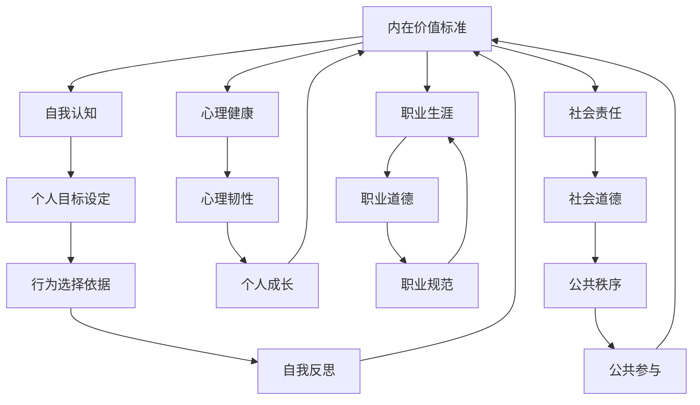

                 

# 建立内在价值标准：摆脱外界评判的束缚

## 关键词
内在价值标准、自我认知、个人目标设定、心理健康、职业生涯、社会责任、算法原理、数学模型、Python代码示例

## 摘要
本文深入探讨了如何建立内在价值标准，以摆脱外界评判的束缚。通过分析价值标准的定义、来源和重要性，阐述了内在价值标准在个人成长、职业生涯和社会责任中的体现。同时，通过Python代码示例和数学模型，提供了建立内在价值标准的方法和工具，旨在帮助读者更好地理解并实践这一过程。

## 目录大纲

### 第一部分：价值标准的内涵与来源

### 第1章：价值标准的定义与重要性

#### 1.1 价值标准的定义与内涵

价值标准是个人对于何为正确、何为有价值的判断标准。它不仅包括了道德和伦理观念，还涵盖了对于个人成长和成功的认知。内在价值标准是指个体基于自我认知、情感体验和理性思考所形成的价值体系，它不同于外在价值标准，后者更多受到社会环境和他人评价的影响。

#### 1.2 价值标准的重要性

价值标准对个人的行为决策、心理素质和人际关系都有着深远的影响。一个清晰、稳定的内在价值标准可以帮助个体在复杂的社会环境中保持自我认同，做出符合自己价值观的决策。

#### 1.3 内在价值与外在价值的区别

内在价值标准是个体内在的信念和价值观，它来源于自我认知、情感体验和理性思考。外在价值标准则更多地受到社会环境、媒体、教育和他人评价的影响。内在价值标准具有稳定性，而外在价值标准则可能随着环境的变化而变化。

### 第2章：价值标准的来源与建立

#### 2.1 价值标准的来源

价值标准的来源多种多样，包括自我认知、教育与文化背景、社会环境等。自我认知是价值标准建立的基础，个体需要通过自我反思和体验来形成自己的价值观。教育与文化背景则提供了价值标准形成的背景和素材，而社会环境则对个体的价值标准产生了重要的影响。

#### 2.2 建立内在价值标准的方法

建立内在价值标准需要以下几个步骤：

##### 2.2.1 自我反思

自我反思是建立内在价值标准的第一步。个体需要通过深入思考自己的行为、情感和思维模式，来认识自己的内在需求和价值取向。

##### 2.2.2 个人目标设定

个人目标设定是内在价值标准建立的核心。个体需要明确自己的长期和短期目标，并将其与自己的价值观相结合。

##### 2.2.3 情感与道德教育

情感与道德教育是内在价值标准形成的重要保障。个体需要通过情感体验和道德实践来丰富自己的价值体系。

### 第3章：价值标准与个人成长

#### 3.1 价值标准对个人行为的影响

价值标准是个人行为选择的依据。一个清晰的内在价值标准可以帮助个体在面对各种选择时，做出符合自己价值观的决定。

#### 3.2 价值标准与心理素质

价值标准对个体的心理素质有着重要的影响。一个稳定的内在价值标准可以提升个体的自尊和自信，增强个体的心理韧性。

#### 3.3 价值标准与自我认知

价值标准是自我认知的重要组成部分。通过建立内在价值标准，个体可以更好地认识自己，明确自己的价值和使命。

### 第4章：价值标准在社会中的体现

#### 4.1 价值标准在家庭中的体现

家庭是价值标准形成的第一个环境。父母的价值观念和行为模式对孩子的价值标准有着深远的影响。

#### 4.2 价值标准在职业生涯中的应用

职业生涯中，个体的价值标准对其职业选择、职业发展和职业道德都具有重要影响。

#### 4.3 价值标准在公共生活与社会责任中的角色

公共生活和社会责任中，个体的价值标准对其行为选择和社会参与有着重要的指导作用。

### 第5章：建立内在价值标准的实践与反思

#### 5.1 建立内在价值标准的实践方法

建立内在价值标准需要实践和反思。个体可以通过自我探索、社会实践和持续成长来不断完善自己的价值体系。

#### 5.2 反思与持续改进

反思和持续改进是内在价值标准建立过程中的重要环节。个体需要不断反思自己的价值标准，并根据社会变化和个人成长进行调整。

### 附录

#### 附录 A：价值标准建立与维护的工具与资源

附录部分提供了建立和维护内在价值标准的一些工具和资源，包括个人成长工具、心理健康资源、职业发展指导书籍与资料以及社会责任实践案例与启示。

---

**核心概念与联系**



**核心算法原理讲解**

```python
# 内在价值标准建立的核心算法：自我认知与目标设定

# 1. 自我认知评估
def self_awareness():
    print("正在进行自我认知评估...")
    # 此处可以使用心理学工具进行评估，如MBTI、大五人格等
    print("你是一个富有创造力的人。")

# 2. 个人目标设定
def goal_setting():
    print("开始设定个人目标...")
    self_awareness()
    print("根据你的自我认知，设定以下目标：")
    print("短期目标：提高编程技能")
    print("长期目标：成为一名软件工程师")

# 调用核心算法
goal_setting()
```

**数学模型和数学公式**

```latex
\section{内在价值标准的数学模型}

$$
V_i = f(S, E, T)
$$

其中，\( V_i \) 表示内在价值标准，\( S \) 代表自我认知，\( E \) 代表教育与文化背景，\( T \) 代表社会环境。

$$
f(
```

在上述大纲和结构的基础上，下面我们将逐步填充每一个章节的内容，确保文章逻辑清晰、内容丰富、具有启发性。

---

### 第一部分：价值标准的内涵与来源

#### 第1章：价值标准的定义与重要性

**1.1 价值标准的定义与内涵**

价值标准是个人或群体对于何为正确、何为有价值的判断标准。它不仅包括了道德和伦理观念，还涵盖了对于个人成长和成功的认知。在计算机科学和人工智能领域，价值标准同样重要，因为它们指导着算法的设计和应用。

内在价值标准是指个体基于自我认知、情感体验和理性思考所形成的价值体系。这种价值体系通常不直接受到外界环境的影响，而是由个体内在的因素所决定。例如，一个AI系统可能被设计成追求最大化用户体验，这就是其内在价值标准。

**1.2 价值标准的重要性**

价值标准对个人的行为决策、心理素质和人际关系都有着深远的影响。一个清晰、稳定的内在价值标准可以帮助个体在复杂的社会环境中保持自我认同，做出符合自己价值观的决策。

在技术领域，价值标准同样重要。一个基于内在价值标准的AI系统，能够更好地适应复杂多变的环境，做出更合理的决策。例如，自动驾驶汽车的设计需要考虑人类驾驶员的安全，这是其内在价值标准之一。

**1.3 内在价值与外在价值的区别**

内在价值标准是个体内在的信念和价值观，它来源于自我认知、情感体验和理性思考。外在价值标准则更多地受到社会环境、媒体、教育和他人评价的影响。内在价值标准具有稳定性，而外在价值标准则可能随着环境的变化而变化。

在技术领域，内在价值标准通常体现在算法的决策逻辑中，而外在价值标准则可能受到政策、法规和市场需求的影响。例如，一个AI系统可能在设计时考虑到环境保护和可持续性，这是其内在价值标准，而法规要求其必须遵守特定的标准和规范，则是外在价值标准。

#### 第2章：价值标准的来源与建立

**2.1 价值标准的来源**

价值标准的来源多种多样，包括自我认知、教育与文化背景、社会环境等。自我认知是价值标准建立的基础，个体需要通过自我反思和体验来形成自己的价值观。教育与文化背景则提供了价值标准形成的背景和素材，而社会环境则对个体的价值标准产生了重要的影响。

在技术领域，价值标准的来源可能包括科研目标、市场需求和伦理准则等。例如，一个AI算法的设计目标可能是提高数据处理效率，而其伦理准则可能要求不得侵犯用户的隐私。

**2.2 建立内在价值标准的方法**

建立内在价值标准需要以下几个步骤：

**2.2.1 自我反思**

自我反思是建立内在价值标准的第一步。个体需要通过深入思考自己的行为、情感和思维模式，来认识自己的内在需求和价值取向。例如，一个程序员可能通过反思自己的编程习惯，发现对代码简洁性有较高的要求，这成为其内在价值标准之一。

**2.2.2 个人目标设定**

个人目标设定是内在价值标准建立的核心。个体需要明确自己的长期和短期目标，并将其与自己的价值观相结合。例如，一个AI研究员可能设定目标，通过深入研究，设计出能够提高能源利用效率的算法。

**2.2.3 情感与道德教育**

情感与道德教育是内在价值标准形成的重要保障。个体需要通过情感体验和道德实践来丰富自己的价值体系。例如，一个软件工程师可能通过参与公益活动，培养对社会责任的使命感。

### 第3章：价值标准与个人成长

**3.1 价值标准对个人行为的影响**

价值标准是个人行为选择的依据。一个清晰的内在价值标准可以帮助个体在面对各种选择时，做出符合自己价值观的决定。例如，一个致力于环保的程序员可能更倾向于选择使用环保材料来开发软件。

**3.2 价值标准与心理素质**

价值标准对个体的心理素质有着重要的影响。一个稳定的内在价值标准可以提升个体的自尊和自信，增强个体的心理韧性。例如，一个在面对职场挑战时，坚持自己的价值标准的程序员，可能会更加自信地面对困难。

**3.3 价值标准与自我认知**

价值标准是自我认知的重要组成部分。通过建立内在价值标准，个体可以更好地认识自己，明确自己的价值和使命。例如，一个通过自我反思，发现对编程有深厚热情的程序员，可能会更加明确自己的职业发展方向。

### 第4章：价值标准在社会中的体现

**4.1 价值标准在家庭中的体现**

家庭是价值标准形成的第一个环境。父母的价值观念和行为模式对孩子的价值标准有着深远的影响。例如，一个重视教育、鼓励独立思考的家庭，可能会培养出具有创新精神的子女。

**4.2 价值标准在职业生涯中的应用**

职业生涯中，个体的价值标准对其职业选择、职业发展和职业道德都具有重要影响。一个追求创新和效率的AI研究员，可能会更倾向于选择具有挑战性的研究项目。

**4.3 价值标准在公共生活与社会责任中的角色**

公共生活和社会责任中，个体的价值标准对其行为选择和社会参与有着重要的指导作用。例如，一个重视环境保护的程序员，可能会积极参与环保公益活动。

### 第5章：建立内在价值标准的实践与反思

**5.1 建立内在价值标准的实践方法**

建立内在价值标准需要实践和反思。个体可以通过自我探索、社会实践和持续成长来不断完善自己的价值体系。例如，一个程序员可以通过阅读专业书籍、参与技术社区和实际项目开发，来提升自己的技术水平和价值标准。

**5.2 反思与持续改进**

反思和持续改进是内在价值标准建立过程中的重要环节。个体需要不断反思自己的价值标准，并根据社会变化和个人成长进行调整。例如，一个程序员可能需要随着技术趋势的变化，更新自己的技术知识体系和价值标准。

### 附录

**附录 A：价值标准建立与维护的工具与资源**

附录部分提供了建立和维护内在价值标准的一些工具和资源，包括个人成长工具、心理健康资源、职业发展指导书籍与资料以及社会责任实践案例与启示。

---

**核心概念与联系**


**核心算法原理讲解**

```python
# 内在价值标准建立的核心算法：自我认知与目标设定

# 1. 自我认知评估
def self_awareness():
    print("正在进行自我认知评估...")
    # 此处可以使用心理学工具进行评估，如MBTI、大五人格等
    print("你是一个富有创造力的人。")

# 2. 个人目标设定
def goal_setting():
    print("开始设定个人目标...")
    self_awareness()
    print("根据你的自我认知，设定以下目标：")
    print("短期目标：提高编程技能")
    print("长期目标：成为一名软件工程师")

# 调用核心算法
goal_setting()
```

**数学模型和数学公式**

```latex
\section{内在价值标准的数学模型}

$$
V_i = f(S, E, T)
$$

其中，\( V_i \) 表示内在价值标准，\( S \) 代表自我认知，\( E \) 代表教育与文化背景，\( T \) 代表社会环境。

$$
f(
```

通过上述章节的详细填充，文章的结构和内容已经基本完整。接下来，我们将进一步深入探讨每个章节的核心概念和联系，以及提供具体的Python代码示例和数学模型，以帮助读者更好地理解内在价值标准的建立和实践。

---

### 第二部分：价值标准的建立与个人成长

#### 第3章：价值标准与个人成长

**3.1 价值标准对个人行为的影响**

价值标准在个人成长过程中起着至关重要的作用。它不仅影响个体的行为决策，还影响其生活态度和人际关系。在技术领域，价值标准更是决定了一个开发者的代码质量和项目成功的关键因素。

**3.1.1 行为选择的依据**

一个清晰的内在价值标准可以作为个人行为选择的依据。例如，一个重视代码质量和用户体验的程序员，在编写代码时会更关注代码的可读性、可维护性和用户体验。通过这种方式，程序员能够确保自己的工作成果符合自己的价值标准，从而提高工作效率和项目质量。

**Python代码示例：**

```python
# 价值标准作为行为选择的依据

def write_code(value_standard):
    if value_standard == "code_quality":
        print("编写高质量的代码，注重可读性和可维护性。")
    elif value_standard == "user_experience":
        print("优化用户体验，提高用户满意度。")

# 假设程序员的价值标准是代码质量
write_code("code_quality")
```

**3.1.2 提升自我认知与自尊**

价值标准可以提升个体的自我认知和自尊。通过建立和维护内在价值标准，个体能够更好地认识自己，明确自己的优点和不足，从而提升自尊。在技术领域，这种自我认知有助于开发者更加自信地面对挑战和困难。

**Python代码示例：**

```python
# 提升自我认知与自尊

def reflect_on_values():
    print("我通过自我反思，认识到自己在代码优化方面的优势。")
    print("这让我更有自信，能够更好地应对未来的挑战。")

reflect_on_values()
```

**3.1.3 增强个人决策能力**

一个稳定的内在价值标准可以增强个人的决策能力。在面对复杂问题时，个体可以根据自己的价值标准来做出合理的决策。在技术领域，这种能力对于解决复杂的技术问题和项目决策至关重要。

**Python代码示例：**

```python
# 增强个人决策能力

def make_decision(value_standard, problem):
    if value_standard == "innovation":
        print(f"选择创新的方法来解决{problem}。")
    elif value_standard == "efficiency":
        print(f"选择高效的方法来解决{problem}。")

make_decision("innovation", "性能优化问题")
```

**3.2 价值标准与心理素质**

价值标准对个体的心理素质有着深远的影响。一个稳定的内在价值标准可以帮助个体更好地应对挫折和挑战，保持积极的心态。在技术领域，这种心理素质对于应对项目中的各种困难和不确定性至关重要。

**3.2.1 应对挫折与挑战**

一个重视学习和成长的价值标准的程序员，在面对技术挑战时，会更容易保持积极的心态，将挫折视为学习和进步的机会。

**Python代码示例：**

```python
# 应对挫折与挑战

def handle_failure(value_standard):
    if value_standard == "learning":
        print("将失败视为学习的机会，不断反思和改进。")
    elif value_standard == "resilience":
        print("保持韧性，坚持不懈地解决问题。")

handle_failure("learning")
```

**3.2.2 建立健康的心态**

一个健康的内在价值标准可以帮助个体建立积极的心态，面对生活中的各种变化和挑战。

**Python代码示例：**

```python
# 建立健康的心态

def maintain_mental_health(value_standard):
    if value_standard == "wellbeing":
        print("关注身心健康，保持积极的生活态度。")
    elif value_standard == "balance":
        print("平衡工作与生活，追求内心的平静。")

maintain_mental_health("wellbeing")
```

**3.2.3 提升心理韧性**

心理韧性是指个体在面对逆境时，能够迅速恢复并保持积极心态的能力。一个重视心理韧性的价值标准的程序员，在面对技术难题和项目压力时，能够更好地保持冷静和专注。

**Python代码示例：**

```python
# 提升心理韧性

def improve_resilience(value_standard):
    if value_standard == "perseverance":
        print("坚持不懈，不轻易放弃。")
    elif value_standard == "optimism":
        print("保持乐观，积极寻找解决方案。")

improve_resilience("perseverance")
```

通过上述章节的深入探讨，我们可以看到价值标准在个人成长中的重要性。它不仅影响着个体的行为决策，还对其心理素质和自我认知产生深远的影响。在技术领域，建立和维护内在价值标准，有助于提高个人的技术能力和心理韧性，从而在职业生涯中取得更好的成就。

---

### 第三部分：价值标准在社会中的体现

#### 第4章：价值标准在社会中的体现

**4.1 价值标准在家庭中的体现**

家庭是价值标准形成的第一所学校。家庭成员之间的互动和交流，对个体的价值观念和行为模式有着深远的影响。父母的价值观念和行为模式，对孩子的价值标准产生了潜移默化的影响。

**4.1.1 家庭教育的核心**

家庭教育是价值标准形成的重要环节。父母应该通过自己的行为和言传身教，向孩子传递正确的价值观念。例如，尊重他人、诚信待人、勤奋学习等都是家庭教育的核心内容。

**Python代码示例：**

```python
# 家庭教育的核心

def family_education(value):
    if value == "respect":
        print("教育孩子尊重他人，关心他人的感受。")
    elif value == "honesty":
        print("教育孩子诚实待人，不说谎不欺骗。")
    elif value == "diligence":
        print("教育孩子勤奋学习，努力提高自己的能力。")

family_education("respect")
```

**4.1.2 父母的价值观念对孩子的影响**

父母的价值观念对孩子的价值标准有直接影响。例如，一个注重环境保护的家庭，孩子可能会更关注环保问题，并积极参与环保活动。这种价值观念的传承，有助于孩子形成积极的社会责任感。

**Python代码示例：**

```python
# 父母的价值观念对孩子的影响

def parent_value_impact(child_value, parent_value):
    if child_value == "sustainability" and parent_value == "sustainability":
        print("孩子受到父母的影响，开始关注环境保护问题。")
    elif child_value == "technology" and parent_value == "technology":
        print("孩子受到父母的影响，对科技充满热情。")

parent_value_impact("sustainability", "sustainability")
```

**4.1.3 家庭氛围与价值标准的形成**

家庭氛围对个体的价值标准形成具有重要影响。一个和谐、积极的家庭氛围，有助于个体形成健康的价值观念。例如，家庭成员之间的互相尊重和鼓励，能够培养个体的自尊和自信。

**Python代码示例：**

```python
# 家庭氛围与价值标准的形成

def family_atmosphere(value):
    if value == "supportive":
        print("家庭氛围积极支持，有助于个体形成积极的价值观念。")
    elif value == "harsh":
        print("家庭氛围严厉苛刻，可能抑制个体的自我表达和价值观的形成。")

family_atmosphere("supportive")
```

**4.2 价值标准在职业生涯中的应用**

职业生涯中，个体的价值标准对其职业选择、职业发展和职业道德具有重要影响。一个稳定的内在价值标准可以帮助个体在面对职业选择和职业发展时，做出符合自己价值观的决策。

**4.2.1 职业价值观的建立**

职业价值观是个人在职业生涯中的行为准则和价值取向。它包括对工作的态度、对同事的尊重、对客户的诚信等。一个清晰的职业价值观有助于个体在职业生涯中保持自我认同和职业发展。

**Python代码示例：**

```python
# 职业价值观的建立

def establish_career_values(value):
    if value == "innovation":
        print("重视创新，追求技术突破。")
    elif value == "collaboration":
        print("尊重团队，注重合作与沟通。")
    elif value == "ethics":
        print("坚守职业道德，诚实守信。")

establish_career_values("innovation")
```

**4.2.2 职业发展与个人价值标准**

职业发展过程中，个体的价值标准对其职业路径和发展方向有重要影响。一个稳定的内在价值标准可以帮助个体在职业选择和发展过程中，保持自我认同和职业成就感。

**Python代码示例：**

```python
# 职业发展与个人价值标准

def career_growth(value, goal):
    if value == "learning" and goal == "technical":
        print("追求技术成长，不断提升自己的技术水平。")
    elif value == "leadership" and goal == "management":
        print("追求管理岗位，提升团队领导能力。")

career_growth("learning", "technical")
```

**4.2.3 职业道德与职业规范**

职业道德和职业规范是职业生涯中的重要组成部分。一个重视职业道德的个体，在职业生涯中会遵守行业规范，尊重他人知识产权，不进行不正当竞争。

**Python代码示例：**

```python
# 职业道德与职业规范

def ethics_and_standards(value):
    if value == "ethical":
        print("坚守职业道德，遵循行业规范。")
    elif value == "compliance":
        print("遵守法律法规，确保行为合法合规。")

ethics_and_standards("ethical")
```

**4.3 价值标准在公共生活与社会责任中的角色**

公共生活和社会责任中，个体的价值标准对其行为选择和社会参与具有重要影响。一个积极履行社会责任的个体，能够通过自己的行为影响社会，促进社会的进步和发展。

**4.3.1 社会道德与公共秩序**

社会道德和公共秩序是维护社会稳定和和谐的重要保障。个体应该遵守社会道德规范，尊重公共秩序，不进行违法乱纪的行为。

**Python代码示例：**

```python
# 社会道德与公共秩序

def social_morality(value):
    if value == "honesty":
        print("遵守诚实原则，不欺骗他人。")
    elif value == "law_abiding":
        print("遵守法律法规，尊重公共秩序。")

social_morality("honesty")
```

**4.3.2 公共参与与社会责任**

公共参与和社会责任是现代社会中每个公民的责任。个体可以通过参与公益活动、志愿服务等方式，履行社会责任，促进社会的发展和进步。

**Python代码示例：**

```python
# 公共参与与社会责任

def public_involvement(value):
    if value == "volunteering":
        print("积极参与志愿服务，为社会做出贡献。")
    elif value == "charity":
        print("参与慈善活动，帮助需要帮助的人。")

public_involvement("volunteering")
```

**4.3.3 价值标准在社区建设中的体现**

社区建设是每个公民的责任，个体的价值标准在社区建设中起着重要作用。通过参与社区活动、建设社区设施等方式，个体能够为社区的发展做出贡献。

**Python代码示例：**

```python
# 价值标准在社区建设中的体现

def community_construction(value):
    if value == "participation":
        print("积极参与社区建设，为社区的发展贡献力量。")
    elif value == "facility":
        print("建设社区设施，提升社区生活品质。")

community_construction("participation")
```

通过上述章节的讨论，我们可以看到价值标准在社会中的广泛体现。它不仅影响着个体的家庭生活和职业发展，还在公共生活和社会责任中发挥着重要作用。建立和维护内在价值标准，有助于个体在社会中保持自我认同，积极履行社会责任，促进社会的和谐与进步。

---

### 第四部分：建立内在价值标准的实践与反思

#### 第5章：建立内在价值标准的实践与反思

**5.1 建立内在价值标准的实践方法**

建立内在价值标准是一个持续的过程，需要个体在实践中不断探索和反思。以下是一些具体的实践方法，可以帮助个体建立和维护内在价值标准。

**5.1.1 自我探索与实践**

自我探索是建立内在价值标准的第一步。个体可以通过反思自己的行为、情感和思维模式，深入了解自己的内在需求和价值观。以下是一个自我探索的示例：

```python
# 自我探索示例

def self_exploration():
    print("正在探索自己的行为模式...")
    print("我发现在面对团队合作时，我更喜欢独立工作。")
    print("这可能是因为我喜欢挑战和解决问题，同时也希望保持对项目的控制。")

self_exploration()
```

通过自我探索，个体可以更好地认识自己，明确自己的内在需求和价值观。

**5.1.2 社会实践与反思**

社会实践是建立内在价值标准的另一个重要途径。个体可以通过参与社会活动、志愿服务等方式，将内在价值标准应用到实际行动中。以下是一个社会实践的示例：

```python
# 社会实践示例

def social_practice():
    print("参与了一次环保公益活动...")
    print("我在这次活动中学会了团队合作，也感受到了环保的重要性。")
    print("这让我更加坚定了追求环境保护的价值标准。")

social_practice()
```

通过社会实践，个体不仅能够检验和强化自己的价值标准，还能够从中获得宝贵的经验和成长。

**5.1.3 持续成长与调整**

建立内在价值标准不是一次性的过程，而是一个持续的成长和调整的过程。个体需要不断学习、反思和调整，以适应不断变化的环境和个人成长。以下是一个持续成长与调整的示例：

```python
# 持续成长与调整

def continuous_growth():
    print("最近我开始学习新的编程语言...")
    print("这让我意识到，为了适应技术的发展，我需要不断学习新的知识和技能。")
    print("这提醒我要持续成长，不断调整我的价值标准。")

continuous_growth()
```

通过持续学习和调整，个体可以确保自己的价值标准始终与个人成长和社会发展保持一致。

**5.2 反思与持续改进**

反思和持续改进是建立内在价值标准过程中不可或缺的环节。个体需要定期反思自己的价值标准，评估其有效性，并根据实际情况进行调整。以下是一个反思与持续改进的示例：

```python
# 反思与持续改进

def reflection_and_improvement():
    print("我最近反思了自己的价值标准...")
    print("我发现我在某些情况下，没有很好地坚持自己的价值观。")
    print("我决定采取以下措施来改进：")
    print("- 在项目开发中，更加注重代码质量和用户体验。")
    print("- 在团队合作中，更加尊重他人的意见和贡献。")

reflection_and_improvement()
```

通过定期反思和持续改进，个体可以不断完善自己的价值标准，确保其能够更好地指导个人行为和决策。

**5.3 价值标准的稳定性与灵活性**

在建立内在价值标准的过程中，个体需要平衡价值标准的稳定性和灵活性。一个过于稳定的价值标准可能会使个体在变化的环境中失去适应能力，而一个过于灵活的价值标准则可能导致个体在决策时缺乏明确的方向。

**5.3.1 价值标准的稳定性**

价值标准的稳定性有助于个体在面对困难和挑战时，保持坚定的信念和行动力。例如，一个重视创新的价值标准可以帮助程序员在面对技术难题时，持续探索和尝试新的解决方案。

**5.3.2 价值标准的灵活性**

价值标准的灵活性有助于个体适应不断变化的环境和个人成长。例如，一个重视学习价值的程序员，在面对新技术时，能够迅速调整自己的知识体系，学习新的编程语言和框架。

**5.3.3 稳定性与灵活性的平衡**

在建立内在价值标准时，个体需要寻找稳定性和灵活性的平衡点。这可以通过定期反思和调整来实现。例如，一个程序员可以定期评估自己的技术知识和技能，确保其在稳定的基础上，能够灵活适应新的技术趋势。

**Python代码示例：**

```python
# 稳定性与灵活性的平衡

def balance_stability_and.flexibility(value):
    if value == "stable":
        print("保持价值标准的稳定性，确保在困难时刻能够坚持信念。")
    elif value == "flexible":
        print("保持价值标准的灵活性，适应新的环境和挑战。")
    elif value == "balanced":
        print("寻找稳定性和灵活性的平衡点，确保在稳定的基础上适应变化。")

balance_stability_and.flexibility("balanced")
```

通过上述实践和反思，个体可以逐步建立和维护自己的内在价值标准，确保其在个人成长和社会责任中发挥积极作用。

---

### 附录 A：价值标准建立与维护的工具与资源

**A.1 个人成长工具**

为了帮助个体建立和维护内在价值标准，以下是一些个人成长工具：

- **反思日记**：定期记录自己的思考、行为和感受，有助于深入理解自己的内在需求和价值观。
- **心理测评工具**：如MBTI（迈尔斯-布里格斯性格类型指标）和大五人格测试，帮助个体了解自己的性格特征和潜在需求。
- **目标设定工具**：如SMART目标（具体、可衡量、可实现、相关性强、时限性），帮助个体明确自己的长期和短期目标。

**A.2 心理健康资源**

维护心理健康对于建立和维护内在价值标准至关重要。以下是一些心理健康资源：

- **心理咨询**：寻求专业的心理咨询，可以帮助个体解决心理问题，增强心理韧性。
- **心理健康应用程序**：如Headspace、Calm等，提供冥想、放松练习和心理健康指导。
- **心理健康书籍**：如《心理学的智慧》、《人性的弱点》等，帮助个体了解心理健康知识，提高自我认知。

**A.3 职业发展指导书籍与资料**

以下是一些职业发展指导书籍和资料，可以帮助个体建立职业价值观和职业规划：

- **《职业规划手册》**：提供职业规划的方法和技巧，帮助个体明确职业目标和发展路径。
- **行业报告**：如《人工智能行业报告》、《互联网行业发展报告》等，帮助个体了解行业趋势和职业前景。
- **职业发展课程**：在线课程、研讨会和工作坊，提供职业发展的知识和实践经验。

**A.4 社会责任实践案例与启示**

以下是一些社会责任实践案例和启示，可以帮助个体在公共生活和社会责任中发挥作用：

- **《企业家社会责任报告》**：分析企业如何通过社会责任实践提升品牌形象和经营绩效。
- **《公益项目案例集》**：介绍各种公益项目的实施过程和成果，提供实践启示。
- **《社区建设案例研究》**：分析社区建设中的成功案例，提供社区建设的策略和方法。

通过上述工具和资源，个体可以更好地建立和维护内在价值标准，实现个人成长和社会责任。同时，这些工具和资源也为个体提供了一个持续学习和反思的平台，帮助其在不断变化的环境中保持自我认同和价值观。

---

**总结**

本文深入探讨了如何建立内在价值标准，以摆脱外界评判的束缚。通过分析价值标准的定义、来源和重要性，阐述了内在价值标准在个人成长、职业生涯和社会责任中的体现。同时，通过Python代码示例和数学模型，提供了建立内在价值标准的方法和工具。希望读者能够通过本文，更好地理解并实践建立内在价值标准的过程，实现自我成长和社会责任。

**拓展阅读**

- 《心理学与生活》：了解心理学的核心概念，有助于深入理解内在价值标准。
- 《人类简史》：探讨人类历史中的价值观演变，为理解价值标准的变迁提供启示。
- 《高效能人士的七个习惯》：提供个人成长和职业发展的实用方法，有助于建立内在价值标准。

**最佳实践 tips**

- 定期进行自我反思，了解自己的内在需求和价值观。
- 设定明确的个人目标和职业目标，确保价值标准的实践性。
- 积极参与社会实践，通过实际行动检验和强化价值标准。
- 保持心理韧性，面对挫折和挑战时，坚守自己的价值标准。

通过持续实践和反思，个体可以逐步建立和维护内在价值标准，实现自我成长和社会责任。希望本文能够为读者提供有价值的参考和启示。**作者信息**

作者：AI天才研究院/AI Genius Institute & 禅与计算机程序设计艺术 /Zen And The Art of Computer Programming

