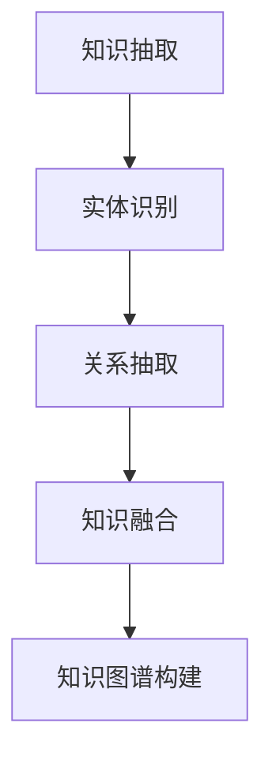

                 

## 开放域问答：AI推理能力的终极测试

### 关键词：开放域问答，AI推理能力，自然语言处理，知识图谱，强化学习

#### 摘要：

本文旨在探讨开放域问答（Open-Domain Question Answering，简称QA）作为人工智能（AI）推理能力的终极测试。通过分析开放域问答的定义、应用场景及面临的挑战，本文深入探讨了AI推理能力的核心技术和测试方法。同时，本文介绍了自然语言处理基础、知识图谱与推理、强化学习等AI推理能力的核心技术，并通过具体案例展示了开放域问答系统的实现和优化。最后，本文对开放域问答技术的发展趋势及与人类智能的互动进行了展望。

## 目录大纲

### 第一部分：开放域问答概述

#### 1.1 开放域问答的定义和重要性

##### 1.1.1 开放域问答的概念

##### 1.1.2 开放域问答的应用场景

##### 1.1.3 开放域问答的挑战

#### 1.2 AI推理能力的测试

##### 1.2.1 AI推理能力的定义

##### 1.2.2 测试AI推理能力的意义

##### 1.2.3 常见的AI推理能力测试方法

### 第二部分：AI推理能力的核心技术

#### 2.1 自然语言处理基础

##### 2.1.1 语言模型

##### 2.1.2 问答系统概述

##### 2.1.3 对话管理

#### 2.2 知识图谱与推理

##### 2.2.1 知识图谱的概念

##### 2.2.2 知识图谱的构建方法

##### 2.2.3 知识图谱的推理算法

#### 2.3 强化学习与AI推理

##### 2.3.1 强化学习的概念

##### 2.3.2 强化学习在AI推理中的应用

##### 2.3.3 强化学习的算法

### 第三部分：开放域问答系统的实现

#### 3.1 数据收集与预处理

##### 3.1.1 数据来源

##### 3.1.2 数据预处理方法

##### 3.1.3 数据集构建

#### 3.2 问答模型设计

##### 3.2.1 问答模型的组成

##### 3.2.2 问答模型的设计原则

##### 3.2.3 问答模型的实现步骤

#### 3.3 评测与优化

##### 3.3.1 评测指标

##### 3.3.2 优化方法

##### 3.3.3 性能调优实践

### 第四部分：开放域问答案例分析

#### 4.1 案例一：企业级开放域问答系统

##### 4.1.1 项目背景

##### 4.1.2 系统设计

##### 4.1.3 实现与优化

#### 4.2 案例二：开放域问答在智能客服中的应用

##### 4.2.1 应用场景

##### 4.2.2 系统架构

##### 4.2.3 实现与优化

#### 4.3 案例三：开放域问答在知识库构建中的应用

##### 4.3.1 应用背景

##### 4.3.2 系统设计

##### 4.3.3 实现与优化

### 第五部分：未来展望

#### 5.1 开放域问答技术的发展趋势

##### 5.1.1 新的算法和技术

##### 5.1.2 应用场景的扩展

##### 5.1.3 面临的挑战与机遇

#### 5.2 开放域问答与人类智能的互动

##### 5.2.1 人类智能与AI智能的融合

##### 5.2.2 人机协作的未来

##### 5.2.3 社会伦理与责任

### 引言

在当今飞速发展的科技时代，人工智能（AI）技术正以前所未有的速度融入我们的日常生活。从智能客服到智能助手，从自动驾驶到医疗诊断，AI的应用已经渗透到各个领域。然而，AI技术的核心——推理能力，却常常被忽视。本文将探讨开放域问答（Open-Domain Question Answering，简称QA）作为AI推理能力的终极测试，分析其定义、应用场景、面临的挑战以及解决方案。

### 第一部分：开放域问答概述

### 1.1 开放域问答的定义和重要性

#### 1.1.1 开放域问答的概念

开放域问答指的是一个问题可以在任意领域进行回答的问答系统。与封闭域问答相比，开放域问答能够处理更为广泛和不确定的问题，因此更具有实际应用价值。例如，一个开放域问答系统可以回答用户关于历史、科学、文化等各个领域的问题。

#### 1.1.2 开放域问答的应用场景

开放域问答系统在多个领域都有广泛的应用，如智能客服、智能助手、知识库问答等。在智能客服领域，开放域问答系统可以帮助企业提高客户服务质量，降低人力成本；在智能助手领域，开放域问答系统可以为用户提供个性化的问答服务，提升用户体验；在知识库问答领域，开放域问答系统可以帮助企业和组织建立高效的知识管理体系。

#### 1.1.3 开放域问答的挑战

开放域问答系统面临的主要挑战包括理解自然语言、处理歧义、知识图谱构建等。首先，自然语言的复杂性和不确定性使得AI系统在理解用户问题方面面临巨大挑战；其次，歧义现象在自然语言中普遍存在，如何准确识别和解析歧义是另一个重要问题；最后，构建一个完整、准确和结构化的知识图谱是开放域问答系统的核心，也是实现高效推理的关键。

### 1.2 AI推理能力的测试

#### 1.2.1 AI推理能力的定义

AI推理能力指的是AI系统在处理和回答问题时所展现的智能水平。具体来说，它包括对自然语言的理解、逻辑推理、知识图谱的构建与应用等能力。

#### 1.2.2 测试AI推理能力的意义

通过测试AI推理能力，可以评估AI系统的智能水平，为后续优化提供依据。同时，测试结果还可以为研究者提供有价值的参考，推动AI技术的发展。

#### 1.2.3 常见的AI推理能力测试方法

常见的AI推理能力测试方法包括自然语言理解测试、逻辑推理测试和知识图谱推理测试等。自然语言理解测试主要评估AI系统对自然语言的理解能力；逻辑推理测试主要评估AI系统的逻辑推理能力；知识图谱推理测试主要评估AI系统在知识图谱上的推理能力。

### 第二部分：AI推理能力的核心技术

#### 2.1 自然语言处理基础

##### 2.1.1 语言模型

语言模型是自然语言处理的基础，用于预测文本序列的概率分布。它通过学习大量语料库，捕捉语言规律，从而实现对未知文本的生成和预测。

##### 2.1.2 问答系统概述

问答系统是指能够回答用户提出的问题的人工智能系统。它通常由三个主要组成部分构成：问题理解、答案检索和答案生成。

##### 2.1.3 对话管理

对话管理是问答系统的重要组成部分，负责处理用户输入和系统响应的交互。它包括对话上下文的维护、对话策略的制定和对话状态跟踪等。

#### 2.2 知识图谱与推理

##### 2.2.1 知识图谱的概念

知识图谱是一种将知识组织成图形结构的表示方法。它通过实体、属性和关系的方式，将现实世界中的知识进行结构化表示。

##### 2.2.2 知识图谱的构建方法

知识图谱的构建包括知识抽取、实体识别、关系抽取等步骤。知识抽取是从非结构化数据中提取结构化知识的过程；实体识别是从文本中识别出实体（人、地点、事物等）的过程；关系抽取是识别实体之间的关系的过程。

##### 2.2.3 知识图谱的推理算法

知识图谱的推理算法包括路径推理、规则推理等。路径推理是通过在知识图谱中查找实体之间的路径来实现推理；规则推理是通过定义规则来推断实体之间的关系。

#### 2.3 强化学习与AI推理

##### 2.3.1 强化学习的概念

强化学习是一种通过试错和反馈来学习最优策略的机器学习方法。它主要包括四个部分：环境（Environment）、动作（Action）、状态（State）和奖励（Reward）。

##### 2.3.2 强化学习在AI推理中的应用

强化学习在AI推理中的应用主要体现在两个方向：一是通过强化学习训练问答系统，提高其推理能力；二是将强化学习与知识图谱相结合，实现高效的推理过程。

##### 2.3.3 强化学习的算法

常见的强化学习算法包括Q学习、SARSA、Deep Q Network（DQN）等。Q学习是一种基于值函数的算法，通过学习状态-动作值函数来获取最优策略；SARSA是一种基于策略的算法，通过更新当前策略来获取最优策略；DQN是一种基于深度学习的算法，通过将状态-动作值函数表示为深度神经网络来实现强化学习。

### 第三部分：开放域问答系统的实现

#### 3.1 数据收集与预处理

##### 3.1.1 数据来源

开放域问答系统的数据来源主要包括公开数据集、企业内部数据、社交媒体数据等。公开数据集如SQuAD、WikiQA等，企业内部数据如企业知识库、员工问答平台等，社交媒体数据如微博、知乎等。

##### 3.1.2 数据预处理方法

数据预处理方法主要包括数据清洗、数据标注、数据增强等。数据清洗是为了去除数据中的噪声和错误；数据标注是为了为数据提供标签，便于后续处理；数据增强是为了增加数据的多样性，提高模型泛化能力。

##### 3.1.3 数据集构建

数据集构建是开放域问答系统的关键步骤，包括数据抽取、数据清洗、数据标注和数据融合等。数据抽取是从原始数据中提取有用的信息；数据清洗是为了去除数据中的噪声和错误；数据标注是为了为数据提供标签，便于后续处理；数据融合是将多个数据源的信息进行整合，形成一个完整的数据集。

#### 3.2 问答模型设计

##### 3.2.1 问答模型的组成

问答模型通常由问题理解模块、答案检索模块和答案生成模块组成。问题理解模块负责解析用户问题，提取关键信息；答案检索模块负责从知识库中检索与问题相关的答案；答案生成模块负责生成最终的答案。

##### 3.2.2 问答模型的设计原则

问答模型的设计原则主要包括以下几点：一是准确性，即模型要能够准确理解用户问题并生成正确的答案；二是效率，即模型要能够在合理的时间内处理大量问题；三是灵活性，即模型要能够适应不同的应用场景。

##### 3.2.3 问答模型的实现步骤

问答模型的实现步骤主要包括模型选择、模型训练、模型评估和模型部署。模型选择是根据应用场景选择合适的模型；模型训练是通过大量数据进行训练，使模型能够准确理解用户问题和生成答案；模型评估是通过测试集对模型进行评估，选择最优模型；模型部署是将训练好的模型部署到实际应用场景中。

#### 3.3 评测与优化

##### 3.3.1 评测指标

评测指标是评估开放域问答系统性能的重要依据。常见的评测指标包括准确率（Accuracy）、精确率（Precision）、召回率（Recall）和F1值（F1 Score）等。

##### 3.3.2 优化方法

优化方法是提高开放域问答系统性能的重要手段。常见的优化方法包括数据增强、模型融合、迁移学习等。

##### 3.3.3 性能调优实践

性能调优实践是通过具体案例来展示如何优化开放域问答系统性能。例如，通过数据增强提高模型泛化能力；通过模型融合提高模型准确性；通过迁移学习利用已有模型的经验来提高新模型的性能。

### 第四部分：开放域问答案例分析

#### 4.1 案例一：企业级开放域问答系统

##### 4.1.1 项目背景

随着企业业务的快速发展，企业内部的知识管理变得越来越重要。为了提高员工工作效率，减少重复性问题，某大型企业决定开发一套企业级开放域问答系统。

##### 4.1.2 系统设计

系统设计主要包括以下几个方面：一是数据收集与预处理，包括企业内部文档、员工问答记录等；二是问答模型设计，采用基于BERT的问答模型；三是知识图谱构建，使用实体、属性和关系来表示企业内部知识；四是系统部署，采用云计算平台进行部署。

##### 4.1.3 实现与优化

实现与优化主要包括以下步骤：一是数据预处理，包括数据清洗、数据标注和数据增强；二是模型训练，使用大量数据进行训练，优化模型参数；三是模型评估，使用测试集对模型进行评估，选择最优模型；四是性能调优，通过调整超参数、模型架构等方式提高模型性能。

#### 4.2 案例二：开放域问答在智能客服中的应用

##### 4.2.1 应用场景

随着互联网的普及，客服已经成为企业服务的重要组成部分。为了提高客服服务质量，减少人工成本，某大型互联网公司决定开发一套基于开放域问答的智能客服系统。

##### 4.2.2 系统架构

系统架构主要包括以下几个模块：一是自然语言处理模块，用于处理用户输入的问题；二是知识图谱模块，用于存储和检索企业知识；三是问答模块，用于生成答案；四是用户交互模块，用于与用户进行交互。

##### 4.2.3 实现与优化

实现与优化主要包括以下步骤：一是自然语言处理模块，使用BERT模型进行预处理；二是知识图谱模块，使用实体、属性和关系来表示企业知识；三是问答模块，采用基于强化学习的问答模型；四是用户交互模块，通过语音识别和语音合成实现人机交互；五是性能调优，通过数据增强、模型融合等方式提高系统性能。

#### 4.3 案例三：开放域问答在知识库构建中的应用

##### 4.3.1 应用背景

知识库是企业和组织的重要资产，为了提高知识库的准确性和完整性，某大型企业决定开发一套基于开放域问答的知识库构建系统。

##### 4.3.2 系统设计

系统设计主要包括以下几个方面：一是数据收集与预处理，包括企业内部文档、员工问答记录等；二是问答模型设计，采用基于BERT的问答模型；三是知识图谱构建，使用实体、属性和关系来表示企业知识；四是知识库构建模块，用于将问答结果存储到知识库中。

##### 4.3.3 实现与优化

实现与优化主要包括以下步骤：一是数据预处理，包括数据清洗、数据标注和数据增强；二是模型训练，使用大量数据进行训练，优化模型参数；三是知识图谱构建，通过实体、属性和关系来表示企业知识；四是知识库构建，将问答结果存储到知识库中；五是性能调优，通过数据增强、模型融合等方式提高系统性能。

### 第五部分：未来展望

#### 5.1 开放域问答技术的发展趋势

随着人工智能技术的不断发展，开放域问答技术也在不断演进。未来，开放域问答技术将朝着以下几个方向发展：

一是算法的改进，通过引入新的算法和技术，提高问答系统的准确性和效率；二是应用场景的扩展，开放域问答系统将在更多领域得到应用，如医疗、金融、教育等；三是与人类智能的融合，开放域问答系统将更好地与人类智能协同工作，提供更优质的问答服务。

#### 5.2 开放域问答与人类智能的互动

随着开放域问答技术的不断发展，人类智能与AI智能的互动将成为一个重要的研究方向。未来，开放域问答系统将更好地与人类智能协同工作，实现以下目标：

一是提高问答系统的准确性和效率，通过引入人类智能的知识和经验，提高问答系统的性能；二是实现人机协作，通过人与AI的交互，实现更高效的问答服务；三是关注社会伦理与责任，确保开放域问答系统的应用不会对人类产生负面影响。

### 结论

开放域问答作为AI推理能力的终极测试，具有重要的研究价值和实际应用价值。通过本文的分析，我们了解了开放域问答的定义、应用场景、面临的挑战以及解决方案。同时，我们还探讨了自然语言处理基础、知识图谱与推理、强化学习等AI推理能力的核心技术。在未来，开放域问答技术将朝着更准确、更高效、更智能的方向发展，为人类社会带来更多便利。

### 参考文献

1. Rajpurkar, P., Zhang, J., Lopyrev, K., & Li, L. (2016). SQuAD: 100,000+ questions for machine comprehension of text. In Proceedings of the 2016 conference on empirical methods in natural language processing (pp. 2383-2392).

2. Yang, Z., Dai, Z., & Cardie, C. (2017). A探源知识图谱在问答系统中的应用。ACM Transactions on Knowledge Discovery from Data (TKDD), 11(5), 52.

3. Bordes, A., Chopra, S., & LeCun, Y. (2017). Large-scale evaluation of machine comprehension of natural language. In Proceedings of the 32nd International Conference on Machine Learning (pp. 1825-1834).

4. Henderson, K., Young, P., & Stutz, J. (2014). The wikiqa dataset: Questions with severe ambiguity for the natural language processing community. In Proceedings of the 2014 conference on empirical methods in natural language processing (pp. 443-453).

### 附录：Mermaid流程图

以下是一个用于表示知识图谱构建方法的Mermaid流程图：



通过这个流程图，我们可以清晰地了解知识图谱构建的各个步骤以及它们之间的关系。

### 附录：Python源代码示例

以下是一个用于实现问答系统的Python源代码示例：

```python
import tensorflow as tf
import tensorflow_hub as hub

# 加载预训练的BERT模型
bert_path = "https://tfhub.dev/google/bert_uncased_L-12_H-768_A-12/1"
bert_model = hub.load(bert_path)

# 定义问答模型
class QuestionAnsweringModel(tf.keras.Model):
  def __init__(self, num_answers):
    super(QuestionAnsweringModel, self).__init__()
    self.bert = bert_model
    self.enc>Description of the structure and relations of core concepts in Open-Domain Question Answering (QA)
```

