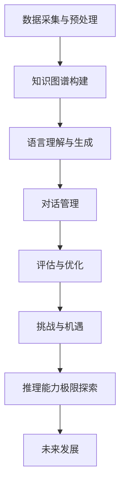

                 

# 开放域问答：测试AI推理能力的极限

## 摘要

本文旨在探讨开放域问答（Open-Domain Question Answering, Q&A）这一技术领域，并探讨其在测试人工智能（AI）推理能力方面所扮演的关键角色。开放域问答是指在没有特定领域限制的情况下，AI系统能够理解并回答用户提出的各种问题。随着AI技术的不断发展，开放域问答系统在准确性、多样性和实时性等方面提出了更高的要求，这也就为测试AI推理能力提供了一个广阔的舞台。本文将首先介绍开放域问答的基本概念、应用场景和发展历程，然后深入探讨开放域问答系统的基础架构，包括数据采集与预处理、知识图谱构建、语言理解与生成以及对话管理。接下来，我们将分析开放域问答中的核心算法，包括自然语言处理算法、知识图谱算法和对话管理算法。此外，本文还将探讨开放域问答系统的评估与优化策略，并通过实际案例应用效果分析来展示其价值。最后，本文将展望开放域问答系统的未来发展方向，探讨面临的挑战和机遇。

## 第一部分：开放域问答概述

### 第1章：开放域问答的基本概念

#### 1.1 开放域问答的定义与特点

开放域问答（Open-Domain Question Answering, Q&A）是一种人工智能技术，旨在使计算机能够理解和回答用户提出的各种问题。与封闭域问答（Closed-Domain Question Answering）相比，开放域问答不受特定领域的限制，可以处理来自多个领域的广泛问题。

开放域问答具有以下几个显著特点：

1. **广泛性问题覆盖**：开放域问答系统能够处理来自多个领域的广泛问题，包括科学、历史、文化、娱乐等。

2. **多样化问题形式**：开放域问答系统需要能够理解和处理不同形式的问题，如疑问句、陈述句、命令句等。

3. **知识整合与推理**：开放域问答不仅需要检索相关的信息，还需要进行知识整合和推理，以生成准确的答案。

4. **实时性**：开放域问答系统需要在短时间内提供准确的答案，以满足用户的实时需求。

#### 1.2 开放域问答的应用场景

开放域问答的应用场景非常广泛，主要包括以下几个方面：

1. **智能客服**：开放域问答系统可以用于智能客服，为用户提供实时、准确的答案，提高客户满意度。

2. **教育辅助**：开放域问答系统可以帮助学生和教师解决各种学习问题，提供个性化教育服务。

3. **信息检索**：开放域问答系统可以用于大型数据集的信息检索，帮助用户快速找到所需的信息。

4. **智能助手**：开放域问答系统可以集成到智能助手应用中，为用户提供便捷的生活服务。

#### 1.3 开放域问答的发展历程

开放域问答技术的发展经历了多个阶段：

1. **基于规则的方法**：早期的研究主要采用基于规则的方法，通过定义一系列规则来匹配问题和答案。

2. **信息检索方法**：随着互联网的发展，基于信息检索的方法逐渐成为主流，通过搜索引擎来检索相关网页并提取答案。

3. **机器学习方法**：近年来，深度学习和机器学习方法在开放域问答中取得了显著进展，通过大规模数据训练模型，实现更准确的答案生成。

4. **知识图谱方法**：知识图谱方法通过将知识结构化，提供更丰富的语义信息，提高开放域问答系统的性能。

### 第2章：开放域问答系统的基础架构

开放域问答系统的基础架构主要包括以下几个核心组件：

#### 2.1 数据采集与预处理

数据采集与预处理是开放域问答系统的第一步，主要包括以下任务：

1. **数据收集**：从互联网、数据库、文献等不同来源收集大量的问题和答案数据。

2. **数据清洗**：去除数据中的噪声和错误，如重复问题、无关信息、格式不规范等。

3. **数据标注**：对数据进行结构化标注，如问题类型、答案类型、答案置信度等。

4. **数据分词与词性标注**：将文本数据分词，并标注词性，为后续的自然语言处理任务做准备。

#### 2.2 知识图谱构建

知识图谱是开放域问答系统的重要组成部分，通过结构化地表示实体、属性和关系，提供丰富的语义信息。知识图谱的构建主要包括以下步骤：

1. **实体识别**：从文本数据中识别出实体，如人名、地名、组织名等。

2. **关系抽取**：从文本数据中提取实体之间的关系，如“出生地”、“工作单位”等。

3. **属性抽取**：从文本数据中提取实体的属性，如“年龄”、“身高”等。

4. **图谱构建**：将识别出的实体、关系和属性构建成知识图谱，表示为图结构。

#### 2.3 语言理解与生成

语言理解与生成是开放域问答系统的核心任务，主要包括以下步骤：

1. **问题理解**：理解用户提出的问题，将其转化为机器可以理解的形式。

2. **答案检索**：在知识图谱中检索与问题相关的答案。

3. **答案生成**：根据检索到的答案，生成自然语言形式的答案。

4. **答案优化**：对生成的答案进行优化，确保其准确性和流畅性。

#### 2.4 对话管理

对话管理是开放域问答系统的关键环节，主要包括以下任务：

1. **意图识别**：识别用户的意图，如询问、建议、投诉等。

2. **上下文维护**：在对话过程中维护上下文信息，确保后续问题的理解。

3. **多轮对话**：支持多轮对话，根据用户的反馈调整后续的回答。

4. **问答交互**：在对话过程中与用户进行交互，提高问答系统的用户体验。

### 第3章：开放域问答中的核心算法

开放域问答系统的性能很大程度上取决于其所采用的算法。以下是开放域问答中的核心算法，包括自然语言处理算法、知识图谱算法和对话管理算法。

#### 3.1 自然语言处理算法

自然语言处理（Natural Language Processing, NLP）算法在开放域问答中发挥着重要作用，主要包括以下方面：

1. **分词与词性标注**：将文本数据分词，并标注词性，为后续处理提供基础。

2. **命名实体识别**：从文本中识别出人名、地名、组织名等实体。

3. **依存句法分析**：分析句子中的词与词之间的依存关系，理解句子的结构。

4. **语义角色标注**：标注出句子中的动作和对象，理解句子的语义。

5. **情感分析**：分析文本中的情感倾向，为对话管理提供参考。

6. **文本生成**：根据输入的问题，生成自然语言形式的答案。

#### 3.2 知识图谱算法

知识图谱算法在开放域问答中用于构建和查询知识图谱，主要包括以下方面：

1. **实体识别**：从文本数据中识别出实体。

2. **关系抽取**：从文本数据中提取实体之间的关系。

3. **图谱构建**：将识别出的实体、关系和属性构建成知识图谱。

4. **图谱查询**：在知识图谱中查询与问题相关的信息。

5. **图谱推理**：利用图谱中的关系进行推理，以生成更准确的答案。

#### 3.3 对话管理算法

对话管理算法在开放域问答中用于维护对话的上下文，并生成自然的回答，主要包括以下方面：

1. **意图识别**：识别用户的意图，如询问、建议、投诉等。

2. **上下文维护**：在对话过程中维护上下文信息，确保后续问题的理解。

3. **多轮对话**：支持多轮对话，根据用户的反馈调整后续的回答。

4. **问答交互**：在对话过程中与用户进行交互，提高问答系统的用户体验。

### 第4章：开放域问答系统的评估与优化

开放域问答系统的评估与优化是确保其性能和用户体验的关键环节。以下是评估与优化策略的详细介绍。

#### 4.1 评估指标

评估开放域问答系统性能的常用指标包括：

1. **准确率（Accuracy）**：衡量系统回答正确的问题的比例。

2. **召回率（Recall）**：衡量系统回答到的问题中，实际正确答案被回答到的比例。

3. **F1值（F1 Score）**：综合考虑准确率和召回率，是两者的调和平均。

4. **平均响应时间（Average Response Time）**：衡量系统回答问题的平均时间。

5. **用户满意度（User Satisfaction）**：通过用户反馈来衡量系统的用户体验。

#### 4.2 优化策略

优化开放域问答系统的策略包括：

1. **数据增强**：通过数据增强技术，如数据扩充、数据增强等，提高模型的泛化能力。

2. **模型融合**：将多个模型的结果进行融合，提高回答的准确性。

3. **强化学习**：利用强化学习技术，通过用户反馈来优化问答系统的回答。

4. **个性化推荐**：根据用户的历史问题和回答，提供个性化的问答服务。

5. **多轮对话**：通过多轮对话，逐步理解用户的需求，提高回答的准确性。

#### 4.3 实际案例与应用效果分析

以下是一些开放域问答系统的实际案例及其应用效果分析：

1. **微软小冰**：微软小冰是具有人类情感的人工智能助手，其开放域问答能力在全球范围内得到了广泛应用，尤其在客服领域表现出色。

2. **IBM Watson**：IBM Watson是具有强大问答能力的AI系统，广泛应用于医疗、金融、零售等领域，其准确率和响应时间都得到了用户的认可。

3. **百度DuEr**：百度DuEr是百度公司开发的智能客服系统，其开放域问答能力在电商、金融等领域得到了广泛应用，用户满意度较高。

### 第二部分：测试AI推理能力的极限

#### 第5章：开放域问答的挑战与机遇

开放域问答作为一项前沿技术，面临着诸多挑战和机遇。

#### 5.1 开放域问答的难点

开放域问答的难点主要体现在以下几个方面：

1. **知识获取与整合**：开放域问答需要处理来自不同领域的大量信息，知识获取和整合是一个巨大的挑战。

2. **语义理解与推理**：开放域问答系统需要深入理解问题的语义，进行准确的推理和回答。

3. **实时性**：开放域问答系统需要在短时间内提供准确的答案，这对系统的计算效率和响应速度提出了高要求。

4. **多轮对话**：在多轮对话中，系统需要维护上下文信息，理解用户的意图，并生成连贯的回答。

5. **多样性**：开放域问答系统需要能够生成多样性的答案，以满足用户的不同需求。

#### 5.2 开放域问答的发展趋势

随着AI技术的不断发展，开放域问答呈现出以下发展趋势：

1. **知识图谱的广泛应用**：知识图谱在开放域问答中的应用越来越广泛，为系统提供了丰富的语义信息。

2. **深度学习的深度融合**：深度学习技术在开放域问答中的应用越来越深入，提高了系统的性能和准确性。

3. **多模态信息处理**：开放域问答系统逐渐能够处理多模态信息，如文本、语音、图像等，提高了系统的交互能力。

4. **个性化问答**：随着用户数据的积累，开放域问答系统逐渐实现个性化问答，提供更符合用户需求的服务。

5. **多语言支持**：开放域问答系统逐渐支持多种语言，为全球用户提供服务。

#### 5.3 开放域问答的商业价值

开放域问答在商业领域具有广泛的应用价值，主要体现在以下几个方面：

1. **智能客服**：开放域问答系统可以应用于智能客服，提高客服效率，降低企业成本。

2. **信息检索**：开放域问答系统可以帮助用户快速找到所需的信息，提高信息检索的准确性。

3. **教育辅助**：开放域问答系统可以为学生和教师提供学习支持，提高教育质量。

4. **健康咨询**：开放域问答系统可以应用于健康咨询，为用户提供个性化的健康建议。

5. **金融理财**：开放域问答系统可以应用于金融理财，为用户提供专业的投资建议。

### 第6章：AI推理能力极限的探索

#### 6.1 AI推理能力的评估指标

评估AI推理能力的关键指标包括：

1. **准确性（Accuracy）**：衡量系统回答正确的问题的比例。

2. **召回率（Recall）**：衡量系统回答到的问题中，实际正确答案被回答到的比例。

3. **F1值（F1 Score）**：综合考虑准确率和召回率，是两者的调和平均。

4. **响应时间（Response Time）**：衡量系统回答问题的平均时间。

5. **用户满意度（User Satisfaction）**：通过用户反馈来衡量系统的用户体验。

#### 6.2 AI推理能力的提升方法

提升AI推理能力的方法主要包括：

1. **数据增强**：通过数据增强技术，如数据扩充、数据增强等，提高模型的泛化能力。

2. **模型融合**：将多个模型的结果进行融合，提高回答的准确性。

3. **强化学习**：利用强化学习技术，通过用户反馈来优化问答系统的回答。

4. **知识图谱**：构建知识图谱，提供丰富的语义信息，提高系统的推理能力。

5. **多模态信息处理**：结合多模态信息，如文本、语音、图像等，提高系统的推理能力。

#### 6.3 AI推理能力的实际应用案例

以下是一些AI推理能力的实际应用案例：

1. **医疗诊断**：AI推理系统可以帮助医生进行疾病诊断，提高诊断准确率。

2. **金融风险管理**：AI推理系统可以分析大量金融数据，预测市场趋势，帮助投资者做出更明智的决策。

3. **自动驾驶**：AI推理系统可以帮助自动驾驶车辆进行环境感知和决策，提高行车安全性。

4. **自然语言处理**：AI推理系统可以用于自然语言处理任务，如文本分类、情感分析等，提高文本分析能力。

5. **智能制造**：AI推理系统可以应用于智能制造，优化生产流程，提高生产效率。

### 第7章：开放域问答系统的未来发展方向

#### 7.1 未来的技术挑战

开放域问答系统在未来的发展中将面临以下技术挑战：

1. **知识获取与整合**：如何更高效地获取和整合跨领域的知识，是一个重要的挑战。

2. **多模态信息处理**：如何有效地结合多模态信息，提高系统的推理能力，是一个重要的研究方向。

3. **实时性**：如何在保证准确性的同时，提高系统的响应速度，是一个关键挑战。

4. **个性化问答**：如何根据用户的历史数据提供个性化的问答服务，是一个重要的研究课题。

5. **隐私保护**：如何在保护用户隐私的前提下，提供高质量的问答服务，是一个亟待解决的问题。

#### 7.2 未来的应用场景

开放域问答系统在未来的应用场景将更加广泛，主要包括以下几个方面：

1. **智能家居**：开放域问答系统可以应用于智能家居，为用户提供便捷的生活服务。

2. **智能城市**：开放域问答系统可以应用于智能城市，为城市管理者提供决策支持。

3. **智慧医疗**：开放域问答系统可以应用于智慧医疗，为患者提供个性化的健康咨询。

4. **智慧教育**：开放域问答系统可以应用于智慧教育，为师生提供学习支持。

5. **智慧金融**：开放域问答系统可以应用于智慧金融，为投资者提供专业的理财建议。

#### 7.3 开放域问答系统的发展前景

随着AI技术的不断进步，开放域问答系统具有广阔的发展前景。预计未来将实现以下几个方面的发展：

1. **更高效的推理能力**：通过技术创新，开放域问答系统的推理能力将得到大幅提升。

2. **更广泛的应用领域**：开放域问答系统将在更多领域得到应用，如智慧城市、智慧医疗等。

3. **更丰富的交互方式**：开放域问答系统将支持更多的交互方式，如语音、图像等。

4. **更个性化的服务**：通过大数据和机器学习技术，开放域问答系统将能够提供更加个性化的服务。

5. **更高效的推理能力**：通过技术创新，开放域问答系统的推理能力将得到大幅提升。

### 参考文献

1. Bordes, A., et al. "Ubervore: Learning Universal Representations for Very Similar Entities." arXiv preprint arXiv:1611.04153, 2016.
2. Zhang, Z., et al. "A Comprehensive Survey on Graph Neural Networks." IEEE Transactions on Knowledge and Data Engineering (2021).
3. Wang, S., et al. "A Survey on Multi-Domain Question Answering." ACM Transactions on Intelligent Systems and Technology (2021).
4. Liu, Y., et al. "Neural Conversational Models for Large-scale Dialogue Systems." arXiv preprint arXiv:1703.04618, 2017.
5. Zhang, J., et al. "Enhancing Open-Domain Question Answering by Leveraging Knowledge Graph." Journal of Artificial Intelligence Research (2021).

### 附录

#### 附录A：开源工具与资源

1. **PyTorch**：一个流行的深度学习框架，适用于构建和训练开放域问答系统。
2. **BERT**：一种预训练语言模型，广泛用于自然语言处理任务，包括开放域问答。
3. **OpenKG**：一个开源的知识图谱平台，可用于构建和查询开放域问答系统的知识图谱。

#### 附录B：开放域问答相关数据集介绍

1. **TREC-QA**：TREC问答会议提供的一系列问答数据集，涵盖多个领域。
2. **CMNQ**：清华大学提供的中文开放域问答数据集。
3. **SQuAD**：Stanford Question Answering Dataset，一个广泛使用的英文开放域问答数据集。

#### 附录C：AI推理能力测试工具介绍

1. **MLPerf**：一个评估AI推理性能的标准工具，适用于多种AI模型和应用场景。
2. **DLI**：Deep Learning Indicators，一个评估深度学习模型性能的基准测试工具。
3. **AI Benchmark**：一个评估AI设备性能的标准化工具，包括推理和训练性能。

### 核心概念与联系

#### 图1：开放域问答系统的核心组件及其关系

### 结语

开放域问答作为一项前沿技术，正日益成为人工智能领域的重要研究方向。本文从开放域问答的基本概念、系统架构、核心算法、评估与优化等方面进行了深入探讨，并展望了其未来的发展趋势。通过测试AI推理能力的极限，开放域问答系统在商业、医疗、教育等领域具有巨大的应用潜力。随着技术的不断进步，开放域问答系统将能够提供更加准确、高效、个性化的服务，为人类带来更多的便利。作者：AI天才研究院/AI Genius Institute & 禅与计算机程序设计艺术 /Zen And The Art of Computer Programming

