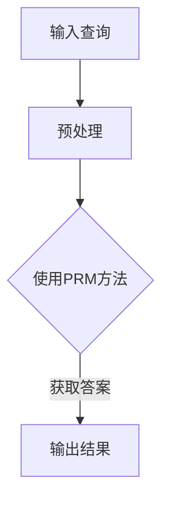
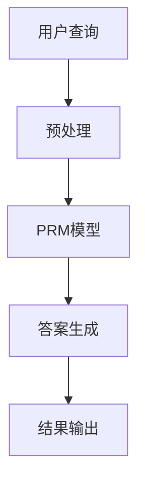

                 

### 《开放式搜索问答中PRM方法的应用探索》

#### 关键词：开放式搜索问答，PRM方法，信息检索，问答系统，语义理解，应用前景

> 摘要：本文深入探讨了开放式搜索问答领域中的PRM方法，介绍了其定义、原理、优势和在不同领域的应用。通过详细阐述PRM方法在信息检索、问答系统和语义理解中的具体应用，本文分析了其在开放式搜索问答中的实现与优化策略，并给出了实际案例和前景展望。

---

### 目录大纲

#### 第一部分：开放式搜索问答概述

#### 第1章：开放式搜索问答的基础知识

##### 1.1 开放式搜索问答的定义

##### 1.2 开放式搜索问答的发展历程

##### 1.3 开放式搜索问答的关键挑战

#### 第2章：PRM方法介绍

##### 2.1 PRM方法的定义

##### 2.2 PRM方法的原理与优势

##### 2.3 PRM方法在不同领域的应用

#### 第二部分：PRM方法在开放式搜索问答中的应用

#### 第3章：PRM方法在信息检索中的应用

##### 3.1 PRM方法在信息检索中的工作流程

##### 3.2 PRM方法在信息检索中的优势

##### 3.3 PRM方法在信息检索中的实际应用案例

#### 第4章：PRM方法在问答系统中的应用

##### 4.1 PRM方法在问答系统中的工作流程

##### 4.2 PRM方法在问答系统中的优势

##### 4.3 PRM方法在问答系统中的实际应用案例

#### 第5章：PRM方法在语义理解中的应用

##### 5.1 PRM方法在语义理解中的工作流程

##### 5.2 PRM方法在语义理解中的优势

##### 5.3 PRM方法在语义理解中的实际应用案例

#### 第三部分：PRM方法在开放式搜索问答中的实现与优化

#### 第6章：PRM方法在开放式搜索问答中的实现

##### 6.1 开放式搜索问答系统的架构设计

##### 6.2 PRM方法的实现步骤

##### 6.3 开放式搜索问答系统的性能优化

#### 第7章：PRM方法在开放式搜索问答中的优化策略

##### 7.1 数据预处理与特征提取

##### 7.2 模型训练与优化

##### 7.3 评估与调优

#### 第四部分：案例分析与应用前景

#### 第8章：开放式搜索问答中PRM方法的应用案例

##### 8.1 案例一：基于PRM方法的个性化搜索服务

##### 8.2 案例二：基于PRM方法的智能客服系统

##### 8.3 案例三：基于PRM方法的语义搜索与推荐系统

#### 第9章：开放式搜索问答中PRM方法的应用前景

##### 9.1 开放式搜索问答的发展趋势

##### 9.2 PRM方法在开放式搜索问答中的应用前景

##### 9.3 未来研究方向与挑战

#### 附录

##### 附录A：相关资源与工具

###### A.1 开放式搜索问答相关的开源工具

###### A.2 PRM方法相关的算法库与框架

###### A.3 开放式搜索问答与PRM方法相关的学术资源与论文

##### 图形展示

###### 图形1：开放式搜索问答中PRM方法的工作流程

###### 图形2：PRM方法在开放式搜索问答中的应用架构

---

### 文章正文部分内容将在接下来的章节中详细展开。敬请期待！

