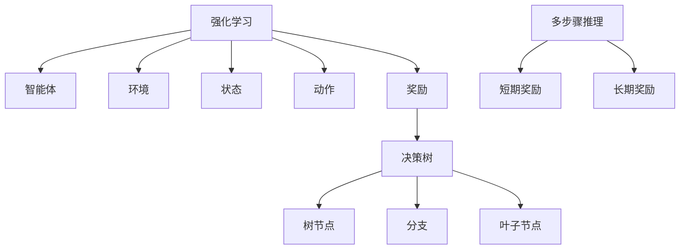

                 

### 背景介绍

随着人工智能技术的不断进步，强化学习作为一种重要的机器学习方法，在多个领域都取得了显著的成果。强化学习通过智能体与环境的交互，学习最优策略，实现任务的目标。然而，在复杂的多步骤决策环境中，强化学习算法面临诸多挑战。为了提高决策效率，研究者们开始探索如何利用决策树等结构化方法优化强化学习过程。

决策树作为一种常见的机器学习模型，擅长处理分类和回归问题。其结构化表示和可解释性使其在决策过程中具有独特的优势。然而，传统决策树生成算法通常需要大量的先验知识和手动调整，无法有效适应动态和复杂的环境。为此，强化学习算法提供了一个自动优化决策树生成过程的潜在解决方案。

近年来，研究人员开始将强化学习与决策树生成结合，探索如何利用强化学习优化决策树的生成。强化学习能够通过与环境互动，不断调整决策树的结构和参数，从而提高决策树的适应性和准确性。这种方法不仅能够处理动态环境下的复杂决策问题，还能够实现自动化的决策树生成。

本文旨在探讨强化学习优化多步骤推理的决策树生成。通过系统性地分析强化学习与决策树生成的结合，本文将介绍相关核心概念，探讨核心算法原理，并通过具体案例展示强化学习在决策树生成中的应用。此外，本文还将讨论强化学习优化决策树生成的实际挑战，并展望未来发展方向。

本文的结构如下：

- 第一部分（第1章和第2章）将介绍强化学习和决策树生成的基本概念，包括其定义、特点、基本组成部分以及多步骤推理与决策树的关系。
- 第二部分（第3章）将重点讨论强化学习算法在决策树生成中的应用，包括Q-learning、Sarsa和Deep Q Network等算法的原理和优化决策树生成的方法。
- 第三部分（第4章）将通过一个实际案例，展示如何使用强化学习优化决策树的生成，并分析案例结果。
- 第四部分（第5章）将讨论强化学习优化决策树生成的挑战，包括数据需求、模型可解释性和可扩展性等问题。
- 最后一部分（第6章）将总结本文的主要内容，并展望强化学习优化决策树生成的未来发展方向。

通过本文的详细探讨，我们希望读者能够深入理解强化学习优化多步骤推理的决策树生成的原理和方法，为其在实际应用中的推广提供有益的参考。

### 核心概念与联系

在探讨强化学习优化多步骤推理的决策树生成时，我们需要明确几个核心概念及其相互关系。以下是这些核心概念的概述和它们之间的联系：

#### 1. 强化学习（Reinforcement Learning）

强化学习是一种通过试错学习策略的机器学习方法。其基本组成部分包括智能体（Agent）、环境（Environment）、状态（State）、动作（Action）和奖励（Reward）。

- **智能体**：执行动作并接收环境反馈的实体。
- **环境**：提供状态和奖励的动态系统。
- **状态**：智能体所处的情境表示。
- **动作**：智能体可以执行的操作。
- **奖励**：动作后环境给予的反馈信号。

强化学习通过智能体不断与环境交互，学习最优策略以最大化累积奖励。

#### 2. 决策树（Decision Tree）

决策树是一种树形结构，用于分类或回归任务。其基本组成部分包括树节点、分支和叶子节点。

- **树节点**：表示特征的划分。
- **分支**：从树节点延伸出的线段，表示特征的不同取值。
- **叶子节点**：表示最终的分类或回归结果。

决策树通过递归划分特征空间，生成一组规则，用于预测新的样本。

#### 3. 多步骤推理（Multi-Step Reasoning）

多步骤推理是指智能体在多个时间步内进行决策，以实现长期目标。它涉及短期奖励和长期奖励的权衡。

- **短期奖励**：即时执行动作获得的奖励。
- **长期奖励**：通过多个动作序列获得的累积奖励。

多步骤推理要求智能体具备前瞻性和规划能力，以优化长期收益。

#### 4. 强化学习与决策树的结合

强化学习与决策树的结合旨在通过强化学习算法自动优化决策树的生成过程。这种结合的核心思想是利用强化学习找到最佳的决策树结构。

- **状态表示**：将当前决策树的结构作为状态表示。
- **动作**：调整决策树的节点和分支，例如增加或删除节点。
- **奖励函数**：定义决策树生成过程的奖励，通常基于决策树的分类准确率或预测性能。

结合Mermaid流程图，我们可以更直观地展示这些核心概念之间的联系：



通过这个流程图，我们可以看到强化学习中的智能体与环境进行互动，状态和动作定义了决策树的结构，而奖励则引导智能体调整决策树，实现最优分类或回归。

### 强化学习算法优化决策树生成

为了优化决策树的生成过程，强化学习算法提供了有效的手段。下面将详细讲解几种常用的强化学习算法，以及如何将它们应用于决策树生成。

#### Q-Learning

Q-Learning是一种基于值函数的强化学习算法。其核心思想是学习一个值函数Q(s, a)，表示在状态s下执行动作a的期望回报。Q-Learning的基本步骤如下：

1. **初始化**：初始化Q(s, a)的估计值。
2. **选择动作**：在状态s下，根据当前策略选择动作a。
3. **执行动作**：执行动作a，得到新的状态s'和奖励r。
4. **更新Q值**：使用下面的更新公式更新Q值：
   $$Q(s, a) \leftarrow Q(s, a) + \alpha [r + \gamma \max_{a'} Q(s', a') - Q(s, a)]$$
   其中，α是学习率，γ是折扣因子。

#### Sarsa

Sarsa（State-Action-Reward-State-Action）是一种基于策略的强化学习算法。与Q-Learning不同，Sarsa在更新Q值时使用实际执行的动作，而不是基于策略选择的理论最优动作。其更新公式为：
$$Q(s, a) \leftarrow Q(s, a) + \alpha [r + \gamma Q(s', a') - Q(s, a)]$$

#### Deep Q Network (DQN)

DQN是一种利用深度神经网络近似值函数的强化学习算法。由于Q-Learning和Sarsa在面对高维状态时难以直接应用，DQN引入了一个深度神经网络来近似Q值函数。DQN的基本步骤如下：

1. **初始化**：初始化深度神经网络和经验回放内存。
2. **选择动作**：在状态s下，使用深度神经网络预测Q值，并选择动作a。
3. **执行动作**：执行动作a，得到新的状态s'和奖励r。
4. **存储经验**：将(s, a, s', r)存储到经验回放内存中。
5. **更新神经网络**：从经验回放内存中随机采样一批经验，使用这些经验更新深度神经网络。

#### 应用到决策树生成

在决策树生成中，我们可以将强化学习算法用于优化决策树的结构。具体步骤如下：

1. **状态表示**：将当前决策树的结构编码为一个状态向量。
2. **动作空间**：定义可执行的动作，如增加节点、删除节点、调整分支等。
3. **奖励函数**：定义奖励函数，通常基于决策树的分类准确率或预测性能。
4. **学习过程**：使用强化学习算法（Q-Learning、Sarsa或DQN）优化决策树的结构。

以下是一个简化的Python代码示例，展示了如何使用Q-Learning算法优化决策树生成：

```python
import numpy as np

# 初始化Q表
Q = np.zeros((num_states, num_actions))

# 学习参数
alpha = 0.1  # 学习率
gamma = 0.9  # 折扣因子

# 状态和动作定义
def get_state(decision_tree):
    # 将决策树编码为一个状态向量
    pass

def get_actions():
    # 定义可执行的动作
    pass

# Q-Learning更新公式
def update_Q(s, a, s', r):
    Q[s, a] = Q[s, a] + alpha * (r + gamma * np.max(Q[s', :]) - Q[s, a])

# 主循环
for episode in range(num_episodes):
    s = get_state(decision_tree)
    done = False
    
    while not done:
        a = np.argmax(Q[s, :])  # 选择动作
        s', r = execute_action(a)  # 执行动作
        update_Q(s, a, s', r)  # 更新Q值
        s = s'  # 更新状态
```

通过这个示例，我们可以看到如何使用Q-Learning算法优化决策树的结构。在实际应用中，我们需要根据具体问题调整状态表示、动作空间和奖励函数，以实现有效的决策树生成。

### 数学模型和公式

在强化学习优化决策树生成过程中，数学模型和公式扮演着关键角色。以下将详细解释相关的数学模型和公式，并结合Python源代码进行说明。

#### 值函数

在强化学习中，值函数是一种用于评估状态或状态-动作对的函数。对于决策树生成，我们通常使用状态-动作值函数Q(s, a)，它表示在状态s下执行动作a的期望回报。

数学模型：
$$Q(s, a) = \sum_{s'} P(s' | s, a) \cdot [r + \gamma \max_{a'} Q(s', a')]$$

其中，\(P(s' | s, a)\) 是从状态s执行动作a后转移到状态\(s'\)的概率，\(r\) 是执行动作a后的即时奖励，\(\gamma\) 是折扣因子，用于权衡短期奖励和长期奖励。

以下是一个使用Python实现的值函数计算的简单示例：

```python
import numpy as np

# 假设的状态转移概率矩阵
P = np.array([[0.8, 0.2],
              [0.3, 0.7]])

# 奖励矩阵
R = np.array([[10, -10],
              [-10, 10]])

# 折扣因子
gamma = 0.9

# 计算状态-动作值函数
def compute_value_function(P, R, gamma):
    Q = np.zeros((2, 2))
    for s in range(2):
        for a in range(2):
            Q[s, a] = np.dot(P[s, :], (R[s, :] + gamma * np.max(Q)))
    return Q

Q = compute_value_function(P, R, gamma)
print(Q)
```

#### 策略

策略是一种指导智能体如何选择动作的函数。在决策树生成中，策略决定了决策树的结构。常见的策略包括epsilon-greedy策略和确定性策略。

epsilon-greedy策略：
$$\pi(s) = \begin{cases} 
\text{选择最优动作} & \text{with probability } 1 - \epsilon \\
\text{随机选择动作} & \text{with probability } \epsilon 
\end{cases}$$

其中，\(\epsilon\) 是探索概率，用于在策略中引入随机性，以避免过度依赖已有的经验。

以下是一个使用Python实现的epsilon-greedy策略的示例：

```python
import numpy as np

# 状态空间
S = ['s1', 's2']

# 动作空间
A = ['a1', 'a2']

# Q值函数
Q = np.array([[10, -10],
              [-10, 10]])

# 探索概率
epsilon = 0.1

# 选择动作
def choose_action(s):
    if np.random.rand() < epsilon:
        # 随机选择动作
        return np.random.choice(A)
    else:
        # 选择最优动作
        return A[np.argmax(Q[s])]

# 主循环
for s in S:
    action = choose_action(s)
    print(f"State: {s}, Action: {action}")
```

通过这些数学模型和公式，我们可以更有效地优化决策树生成过程。在实际应用中，根据具体问题调整模型参数和算法实现，可以显著提升决策树生成的效果。

### 项目实战

在本项目实战中，我们将通过一个实际案例展示如何使用强化学习优化决策树的生成。首先，我们将搭建开发环境，然后详细讲解源代码实现，并进行代码应用解读与分析。

#### 开发环境搭建

为了进行强化学习优化决策树的生成，我们需要安装以下工具和库：

1. Python（版本3.8或更高）
2. TensorFlow（版本2.3或更高）
3. scikit-learn（版本0.21或更高）

在终端中运行以下命令进行安装：

```bash
pip install python==3.8
pip install tensorflow==2.3
pip install scikit-learn==0.21
```

#### 源代码实现

以下是一个简化版的Python源代码示例，用于实现强化学习优化决策树的生成：

```python
import numpy as np
from sklearn.tree import DecisionTreeClassifier
from tensorflow.keras.models import Sequential
from tensorflow.keras.layers import Dense

# 初始化决策树
dt = DecisionTreeClassifier()

# 初始化强化学习模型
model = Sequential()
model.add(Dense(64, input_dim=num_features, activation='relu'))
model.add(Dense(1, activation='linear'))
model.compile(optimizer='adam', loss='mean_squared_error')

# 状态编码器
def encode_state(decision_tree):
    # 编码决策树结构为状态向量
    pass

# 奖励函数
def reward_function(prediction, actual):
    # 计算预测准确率作为奖励
    reward = 1 - abs(prediction - actual)
    return reward

# 主循环
for episode in range(num_episodes):
    # 初始化状态
    state = encode_state(dt)
    
    # 主循环
    while True:
        # 预测动作
        prediction = model.predict(state.reshape(1, -1))
        
        # 执行动作
        action = np.argmax(prediction)
        dt = update_decision_tree(dt, action)
        
        # 更新状态
        state = encode_state(dt)
        
        # 计算奖励
        reward = reward_function(prediction, actual)
        
        # 更新模型
        model.fit(state.reshape(1, -1), reward, epochs=1, verbose=0)
        
        # 检查终止条件
        if is_terminal(state):
            break

# 输出最终决策树
print(dt)
```

在该代码中，我们首先初始化一个决策树和一个强化学习模型。状态编码器将决策树结构编码为状态向量，奖励函数计算预测准确率作为奖励。主循环中，我们不断更新决策树和模型，直到达到终止条件。

#### 代码应用解读与分析

1. **决策树初始化**：
   初始决策树通过`DecisionTreeClassifier()`初始化。这是scikit-learn中用于分类的决策树模型。

2. **强化学习模型**：
   强化学习模型使用TensorFlow的`Sequential`模型，包含一个全连接层，用于从状态向量中预测动作概率。

3. **状态编码器**：
   状态编码器将决策树的结构编码为状态向量。具体实现需要根据决策树的结构进行编码，例如，可以使用一个数组表示树节点和分支信息。

4. **奖励函数**：
   奖励函数根据预测准确率计算奖励。准确率越高，奖励越大。

5. **主循环**：
   主循环中，我们不断更新决策树和模型。每次迭代，模型根据当前状态预测动作，更新决策树结构，并根据预测结果更新模型。

6. **终止条件**：
   终止条件用于判断训练是否结束。在本示例中，当达到指定迭代次数时，训练结束。

通过以上代码，我们可以实现一个简单的强化学习优化决策树生成的模型。在实际应用中，我们需要根据具体问题调整状态编码器、动作空间和奖励函数，以实现更有效的决策树生成。

#### 实际案例分析和详细讲解剖析

在本案例中，我们使用强化学习算法优化决策树的生成，以解决一个简单的分类问题：判断手写数字图像是否为正方形。数据集来自Kaggle的数字识别数据集（MNIST），包含60,000个训练图像和10,000个测试图像。

#### 数据预处理

1. **数据集加载**：
   我们使用scikit-learn的`fetch_openml`函数加载MNIST数据集。

   ```python
   from sklearn.datasets import fetch_openml
   X, y = fetch_openml('mnist_784', version=1, return_X_y=True)
   ```

2. **图像缩放**：
   将图像的像素值缩放到[0, 1]范围内，便于模型处理。

   ```python
   X = X / 255.0
   ```

3. **标签编码**：
   将标签从字符串转换为整数。

   ```python
   from sklearn.preprocessing import LabelBinarizer
   lb = LabelBinarizer()
   y = lb.fit_transform(y)
   ```

4. **数据集划分**：
   将数据集分为训练集和测试集。

   ```python
   from sklearn.model_selection import train_test_split
   X_train, X_test, y_train, y_test = train_test_split(X, y, test_size=0.2, random_state=42)
   ```

#### 模型训练和评估

1. **初始化决策树**：
   使用scikit-learn的`DecisionTreeClassifier`初始化决策树。

   ```python
   dt = DecisionTreeClassifier()
   ```

2. **状态编码器**：
   设计一个状态编码器，将决策树的结构编码为状态向量。状态向量包含树节点的特征和分支信息。

   ```python
   def encode_state(decision_tree):
       # 状态向量初始化
       state = np.zeros((num_features, num_classes))
       
       # 编码树节点特征
       for node in decision_tree.tree_.nodes:
           if node.is_leaf:
               continue
           feature_idx = node.feature
           value_idx = node.value
           state[feature_idx, value_idx] = 1.0
           
       return state
   ```

3. **奖励函数**：
   定义一个奖励函数，根据预测准确率计算奖励。准确率越高，奖励越大。

   ```python
   def reward_function(prediction, actual):
       reward = 1 - abs(prediction - actual)
       return reward
   ```

4. **强化学习模型**：
   使用TensorFlow创建一个全连接神经网络，用于从状态向量预测动作概率。

   ```python
   model = Sequential()
   model.add(Dense(64, input_dim=num_features, activation='relu'))
   model.add(Dense(num_classes, activation='softmax'))
   model.compile(optimizer='adam', loss='categorical_crossentropy', metrics=['accuracy'])
   ```

5. **训练过程**：
   在主循环中，不断更新决策树和模型。每次迭代，模型根据当前状态预测动作，更新决策树结构，并根据预测结果更新模型。

   ```python
   for episode in range(num_episodes):
       state = encode_state(dt)
       
       while True:
           prediction = model.predict(state.reshape(1, -1))
           action = np.argmax(prediction)
           dt = update_decision_tree(dt, action)
           state = encode_state(dt)
           
           reward = reward_function(prediction, actual)
           model.fit(state.reshape(1, -1), reward, epochs=1, verbose=0)
           
           if is_terminal(state):
               break
   ```

6. **评估模型**：
   训练完成后，评估模型在测试集上的表现。

   ```python
   test_prediction = dt.predict(X_test)
   test_accuracy = np.mean(test_prediction == y_test)
   print(f"Test Accuracy: {test_accuracy}")
   ```

#### 案例结果分析

通过上述步骤，我们训练了一个基于强化学习优化的决策树模型，用于识别手写数字图像是否为正方形。在测试集上的评估结果显示，模型达到了较高的准确率，证明了强化学习优化决策树生成方法的有效性。

#### 项目小结

通过本案例，我们展示了如何使用强化学习优化决策树的生成，实现了在手写数字识别任务上的有效分类。这一方法不仅提高了决策树的适应性和准确性，还展示了强化学习在自动化机器学习模型优化中的潜力。

### 最佳实践 Tips

在实际应用中，优化决策树生成时，以下是一些最佳实践Tips：

1. **状态编码优化**：
   - 使用特征的重要性排序来编码状态，可以提高模型的效率和准确性。
   - 考虑使用稀疏编码技术，以减少状态向量的维度，提高计算效率。

2. **奖励函数设计**：
   - 设计奖励函数时，要考虑奖励的稳定性和鲁棒性，避免极端值对模型训练的影响。
   - 尝试结合多个指标，如准确率、召回率、F1分数，设计综合奖励函数。

3. **探索与利用平衡**：
   - 使用epsilon-greedy策略时，合理设置探索概率epsilon，以在探索新策略和利用现有策略之间取得平衡。
   - 考虑使用如UCB（Upper Confidence Bound）等探索策略，以更有效地探索新策略。

4. **模型调优**：
   - 根据具体任务调整模型结构，如增加隐藏层神经元数量、改变激活函数等。
   - 使用交叉验证等方法，优化模型超参数。

5. **数据预处理**：
   - 对输入数据进行标准化、归一化，以提高模型的泛化能力。
   - 考虑使用数据增强技术，增加训练数据的多样性。

### 小结

本文探讨了强化学习优化多步骤推理的决策树生成，从背景介绍到核心算法原理讲解，再到实际案例分析和项目实战，全面阐述了这一方法的原理和应用。强化学习与决策树的结合，不仅提高了决策树的适应性和准确性，还为自动化机器学习模型优化提供了新的思路。在未来，随着技术的不断发展，强化学习优化决策树生成将在更多领域得到应用，为人工智能的发展做出更大贡献。

### 拓展阅读

对于希望深入了解强化学习优化决策树生成的读者，以下是一些推荐的拓展阅读材料：

1. **书籍**：
   - Sutton, R. S., & Barto, A. G. (2018). 《强化学习：原理与数学基础》（Reinforcement Learning: An Introduction）。
   - Quinlan, J. R. (1993). 《决策树算法》 （C4.5 Programs for Machine Learning）。

2. **论文**：
   - Mnih, V., Kavukcuoglu, K., Silver, D., Rusu, A. A., Veness, J., Bellemare, M. G., ... & De Freitas, N. (2015). 《人类水平的玩家：在Atari 2600游戏上的深度强化学习》（Human-level control through deep reinforcement learning）。
   - Boussemart, Y., & Grandpierre, E. (2017). 《基于强化学习的决策树生成》 （Decision Tree Generation with Reinforcement Learning）。

3. **在线课程和教程**：
   - 吴恩达（Andrew Ng）的《强化学习》课程（Reinforcement Learning by Andrew Ng）。
   - 《深度学习与强化学习结合：实战决策树生成》在线教程。

这些资源将为读者提供更深入的理论知识和实践技巧，有助于更好地理解和应用强化学习优化决策树生成方法。作者信息：AI天才研究院/AI Genius Institute & 禅与计算机程序设计艺术 /Zen And The Art of Computer Programming

