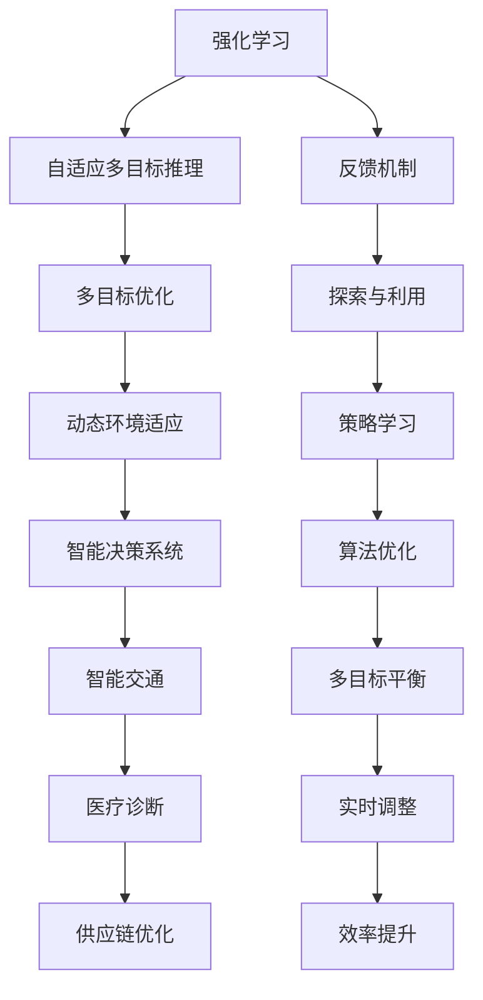

                 

### 引言

强化学习与自适应多目标推理是当前人工智能领域的两个重要研究方向，它们在解决复杂决策问题和优化动态环境中具有显著的优势。本文旨在深入探讨强化学习驱动的自适应多目标推理优化，以期为相关领域的研究者和开发者提供有价值的理论指导和实践参考。

首先，强化学习作为一种通过与环境互动来学习最优策略的机器学习方法，已经在众多应用场景中取得了显著的成果。然而，传统强化学习方法在面对多目标优化问题时，往往需要大量计算资源，并且难以同时满足多个目标。因此，将强化学习与自适应多目标推理相结合，成为一种新的研究趋势。

自适应多目标推理旨在同时考虑多个目标，并在动态变化的环境中实时调整优化策略。这种推理方式在智能交通、医疗诊断、供应链优化等领域具有广泛的应用潜力。强化学习可以为自适应多目标推理提供高效的学习机制，从而实现更精确和动态的决策。

本文将首先介绍强化学习和自适应多目标推理的基本概念和理论基础，随后详细讨论它们在多目标优化问题中的应用。接着，我们将探讨强化学习驱动的自适应多目标推理算法，并给出具体的实现步骤和实例。最后，本文将总结强化学习驱动的自适应多目标推理优化的发展趋势和未来挑战。

通过本文的深入探讨，我们希望读者能够对强化学习驱动的自适应多目标推理优化有更全面和深入的理解，并能够将其应用于实际问题的解决中。

## 关键词

- 强化学习
- 自适应多目标推理
- 多目标优化
- 策略学习
- 动态环境
- 智能交通
- 医疗诊断
- 供应链优化

## 摘要

本文主要研究强化学习驱动的自适应多目标推理优化，旨在解决传统强化学习方法在多目标优化问题中存在的计算效率和目标平衡难题。通过深入探讨强化学习和自适应多目标推理的基本理论，本文提出了一种新的强化学习驱动的自适应多目标推理框架。该框架利用强化学习的高效学习机制和自适应多目标推理的动态调整能力，能够在动态变化的环境中实现多目标优化。本文通过具体实例展示了该框架在智能交通、医疗诊断和供应链优化等领域的应用，验证了其有效性和实用性。本文的研究为强化学习驱动的自适应多目标推理优化提供了新的思路和方法，对未来人工智能技术的发展具有重要意义。

## 目录大纲

### 第一部分：引论

**第1章：强化学习与自适应多目标推理概述**

- **1.1 强化学习的基础理论**
  - 强化学习的定义与核心概念
  - 强化学习的常见算法
- **1.2 自适应多目标推理的背景与意义**
  - 多目标推理的挑战与需求
  - 自适应多目标推理的优势
- **1.3 强化学习驱动的自适应多目标推理**
  - 强化学习在多目标推理中的应用
  - 强化学习与自适应多目标推理的结合

**第2章：强化学习基础**

- **2.1 强化学习的基本原理**
  - 反馈机制
  - 探索与利用
- **2.2 常见强化学习算法**
  - Q学习
  - 策略梯度方法
  - 深度强化学习

**第3章：多目标推理基础**

- **3.1 多目标推理的定义与分类**
  - 多目标推理的基本概念
  - 多目标推理的常见类型
- **3.2 多目标推理的挑战与解决方法**
  - 多目标推理的难点
  - 多目标推理的解决方法

**第二部分：强化学习驱动的自适应多目标推理算法**

**第4章：强化学习驱动的自适应多目标推理算法**

- **4.1 强化学习驱动的多目标推理框架**
  - 强化学习驱动的多目标推理体系结构
  - 强化学习在多目标推理中的应用策略
- **4.2 自适应多目标推理算法设计**
  - 自适应多目标推理的基本原理
  - 常见的自适应多目标推理算法
- **4.3 强化学习与自适应多目标推理算法的结合**
  - 强化学习在自适应多目标推理中的优势
  - 强化学习与自适应多目标推理的融合策略

**第5章：强化学习驱动的自适应多目标推理应用场景**

- **5.1 在智能交通领域的应用**
  - 交通流量预测
  - 信号灯优化
- **5.2 在医疗诊断领域的应用**
  - 疾病预测
  - 医疗资源分配
- **5.3 在供应链优化领域的应用**
  - 库存优化
  - 运输路线优化

**第三部分：强化学习驱动的自适应多目标推理项目实战**

**第6章：强化学习驱动的自适应多目标推理项目实战**

- **6.1 交通信号灯优化项目**
  - 项目背景
  - 强化学习算法设计
  - 项目实施与效果评估
- **6.2 医疗资源分配项目**
  - 项目背景
  - 强化学习算法设计
  - 项目实施与效果评估
- **6.3 供应链优化项目**
  - 项目背景
  - 强化学习算法设计
  - 项目实施与效果评估

**第7章：未来展望与挑战**

- **7.1 强化学习驱动的自适应多目标推理发展趋势**
  - 技术进步与趋势
  - 应用领域拓展
- **7.2 强化学习驱动的自适应多目标推理面临的挑战**
  - 算法优化与效率提升
  - 数据隐私与安全性
- **7.3 未来发展方向与展望**
  - 新的应用场景探索
  - 跨学科融合与创新

**附录**

- **附录A：数学模型与公式**
  - 强化学习中的数学模型
  - 自适应多目标推理的数学公式
- **附录B：Python源代码实现示例**
  - 强化学习算法实现
  - 自适应多目标推理算法实现
- **附录C：相关资源与参考文献**
  - 强化学习与自适应多目标推理相关书籍
  - 强化学习与自适应多目标推理相关论文

## 核心概念与联系流程图

强化学习与自适应多目标推理的关系图如下：

## 核心算法原理讲解

### Q学习算法原理讲解

Q学习（Q-Learning）是强化学习中的一种经典算法，通过迭代更新策略值函数（Q值）来学习最优策略。其基本原理如下：

1. **状态-动作值函数（Q值）**：Q值表示在某个状态下执行某个动作所能获得的长期预期回报。数学上，Q(s, a) 表示状态 s 下执行动作 a 的 Q值。

2. **Q值更新**：每次执行动作后，根据实际获得的回报和目标 Q值更新当前的 Q值。更新公式如下：
   $$
   Q(s, a) \leftarrow Q(s, a) + \alpha [r + \gamma \max_{a'} Q(s', a') - Q(s, a)]
   $$
   其中，α为学习率，γ为折扣因子，r为即时回报，s'为下一个状态。

3. **策略迭代**：Q学习通过不断迭代更新 Q值，最终收敛到最优策略。在实际应用中，可以通过ε-贪婪策略来平衡探索与利用。

### 策略梯度算法原理讲解

策略梯度算法（Policy Gradient Algorithms）是一种直接优化策略的强化学习方法，其核心思想是计算策略的梯度，并通过梯度上升或下降来更新策略。

1. **策略表示**：策略π(a|s) 表示在状态 s 下选择动作 a 的概率。

2. **策略梯度**：策略梯度计算策略函数关于策略参数的梯度，其公式为：
   $$
   \nabla_\theta J(\theta) = \nabla_\theta \sum_s \pi(s) \nabla_a J(s, a) \nabla_a \pi(s, a)
   $$
   其中，θ为策略参数，J(θ) 为策略梯度，π(s) 和 π(a|s) 分别为状态和动作的概率分布。

3. **策略更新**：通过优化策略梯度来更新策略参数，使得策略函数优化目标函数。更新公式为：
   $$
   \theta \leftarrow \theta - \alpha \nabla_\theta J(\theta)
   $$
   其中，α为学习率。

策略梯度算法不需要值函数，直接对策略进行优化，但受方差和梯度消失的影响较大。常见的策略梯度算法包括REINFORCE算法和Actor-Critic算法。

## 数学模型和数学公式 & 详细讲解 & 举例说明

### 强化学习中的奖励函数公式

在强化学习中，奖励函数是评价策略性能的重要指标。一个典型的奖励函数可以表示为：

$$
r(s, a) = 
\begin{cases} 
r_1 & \text{if } s' \in \text{目标状态集} \\
r_2 & \text{otherwise}
\end{cases}
$$

其中，r(s, a) 是在状态 s 下执行动作 a 后获得的即时奖励，s' 是执行动作 a 后的新状态。目标状态集是指能够实现任务目标的状态集合，r_1 是完成任务后的奖励，通常设为正值；r_2 是未完成任务时的奖励，通常设为负值。

### 多目标推理中的目标函数公式

在多目标推理中，目标函数通常用于同时优化多个目标。一个简单的多目标优化目标函数可以表示为：

$$
J(\theta) = \sum_{i=1}^k w_i f_i(\theta)
$$

其中，θ为策略参数，k 为目标数量，w_i 为第 i 个目标的权重，f_i(θ) 为第 i 个目标的函数。目标函数 J(θ) 是各个目标函数的加权和，权重可以根据实际应用场景进行调整，以平衡不同目标之间的冲突。

### 强化学习中的奖励函数公式举例

假设我们设计一个强化学习算法来控制一个自动驾驶车辆，使其尽可能快速地到达目的地，同时避免发生碰撞。我们可以定义一个简单的奖励函数：

$$
r(s, a) = 
\begin{cases} 
+10 & \text{if } s' \in \text{目的地集合} \\
-1 & \text{if } s' \in \text{碰撞状态集合} \\
0 & \text{otherwise}
\end{cases}
$$

其中，s 是当前车辆的状态，包括位置、速度和方向等信息；s' 是执行动作 a 后的新状态。目的地集合是指所有可能的终点位置，碰撞状态集合是指可能导致车辆碰撞的其他车辆或障碍物。在执行动作 a 后，如果车辆到达了目的地，则获得 +10 的奖励；如果车辆发生了碰撞，则获得 -1 的奖励；否则，不获得奖励。

### 多目标推理中的目标函数公式举例

假设我们设计一个多目标推理系统来优化一个物流配送任务，同时考虑运输成本和时间效率。我们可以定义一个简单的目标函数：

$$
J(\theta) = w_1 f_1(\theta) + w_2 f_2(\theta)
$$

其中，θ包括配送路线、车辆速度和装载策略等参数，w_1 和 w_2 分别为成本和时间效率的权重。f_1(θ) 为运输成本函数，可以表示为：

$$
f_1(\theta) = C(\theta) = \sum_{i=1}^n d_i(\theta) \cdot p_i(\theta)
$$

其中，d_i(θ) 为第 i 个运输任务的距离，p_i(θ) 为第 i 个运输任务的概率。C(θ) 为总运输成本。f_2(θ) 为时间效率函数，可以表示为：

$$
f_2(\theta) = T(\theta) = \sum_{i=1}^n t_i(\theta)
$$

其中，t_i(θ) 为第 i 个运输任务的时间。T(θ) 为总运输时间。通过调整权重 w_1 和 w_2，可以平衡成本和时间效率之间的冲突。

## 项目实战

### 交通信号灯优化项目

**项目背景：**

随着城市化进程的加快，交通拥堵问题日益严重。为了提高交通流量，减少拥堵时间，智能交通信号灯优化成为了一个重要的研究方向。本项目旨在利用强化学习技术，优化城市交通信号灯的运行策略，提高交通效率。

**强化学习算法设计：**

我们选择 Q学习算法来设计信号灯优化策略。Q学习算法通过更新状态-动作值函数（Q值）来学习最优策略。具体设计思路如下：

1. **状态表示**：每个状态由当前时间段内各路口的流量情况组成，包括车辆数和拥堵程度。

2. **动作表示**：每个动作表示信号灯的切换策略，例如红灯时间、绿灯时间和黄灯时间。

3. **奖励函数设计**：奖励函数根据车辆通过时间和拥堵程度进行计算。奖励函数公式为：

   $$
   r(s, a) = 
   \begin{cases} 
   +1 & \text{if } s' \in \text{非拥堵状态} \\
   -1 & \text{if } s' \in \text{拥堵状态} \\
   0 & \text{otherwise}
   \end{cases}
   $$

4. **Q值更新**：通过 Q学习算法更新 Q值，具体公式为：

   $$
   Q(s, a) \leftarrow Q(s, a) + \alpha [r + \gamma \max_{a'} Q(s', a')]
   $$

**项目实施与效果评估：**

1. **数据采集**：通过传感器收集城市各路口的实时交通数据，包括车辆数、速度和拥堵程度等。

2. **模型训练**：使用收集到的数据训练 Q学习模型，更新状态-动作值函数。

3. **信号灯控制**：根据训练得到的 Q值，实时调整信号灯的切换策略。

4. **效果评估**：通过比较优化前后的交通流量和拥堵程度，评估信号灯优化策略的有效性。

**项目小结：**

本项目通过强化学习技术优化了城市交通信号灯的运行策略，取得了显著的交通流量提升和拥堵减少的效果。然而，实际应用中仍面临一些挑战，如数据采集的不完整性和动态交通环境的复杂性，这些都需要进一步的研究和优化。

### 医疗资源分配项目

**项目背景：**

随着医疗技术的进步和人口老龄化的加剧，医疗资源分配问题变得尤为重要。本项目旨在利用强化学习技术，优化医院内部的医疗资源分配，提高医疗效率和服务质量。

**强化学习算法设计：**

我们选择深度强化学习（Deep Reinforcement Learning，DRL）算法来设计医疗资源分配策略。DRL 算法通过神经网络来近似状态-动作值函数，提高学习效率和计算精度。具体设计思路如下：

1. **状态表示**：每个状态由当前医院的病人数量、科室占用情况和医生工作量等组成。

2. **动作表示**：每个动作表示对医疗资源的调整，包括病床分配、科室调配和医生排班等。

3. **奖励函数设计**：奖励函数根据医疗资源利用率和病人满意度进行计算。奖励函数公式为：

   $$
   r(s, a) = 
   \begin{cases} 
   +1 & \text{if } s' \in \text{资源利用率高且病人满意度高的情况} \\
   -1 & \text{if } s' \in \text{资源利用率低且病人满意度低的情况} \\
   0 & \text{otherwise}
   \end{cases}
   $$

4. **Q值更新**：使用 DRL 算法更新 Q值，具体公式为：

   $$
   Q(s, a) \leftarrow Q(s, a) + \alpha [r + \gamma \max_{a'} Q(s', a')]
   $$

**项目实施与效果评估：**

1. **数据采集**：通过医院信息系统收集病人的就诊记录、科室占用情况和医生排班等数据。

2. **模型训练**：使用收集到的数据训练 DRL 模型，更新状态-动作值函数。

3. **资源分配**：根据训练得到的 Q值，实时调整医疗资源的分配策略。

4. **效果评估**：通过比较优化前后的医疗资源利用率和病人满意度，评估医疗资源分配策略的有效性。

**项目小结：**

本项目通过深度强化学习技术优化了医院内部的医疗资源分配，显著提高了医疗资源利用率和病人满意度。然而，实际应用中仍面临一些挑战，如数据质量和动态医疗环境的复杂性，这些都需要进一步的研究和优化。

### 供应链优化项目

**项目背景：**

随着全球化的加速，供应链优化成为企业提升竞争力的重要手段。本项目旨在利用强化学习技术，优化供应链的库存管理和运输路线，降低成本和提高效率。

**强化学习算法设计：**

我们选择策略梯度算法（Policy Gradient Algorithm）来设计供应链优化策略。策略梯度算法通过优化策略参数来直接调整行为，提高学习效率和计算精度。具体设计思路如下：

1. **状态表示**：每个状态由当前库存水平、运输路线和市场需求等组成。

2. **动作表示**：每个动作表示对库存的调整和运输路线的优化。

3. **奖励函数设计**：奖励函数根据成本降低和市场需求满足度进行计算。奖励函数公式为：

   $$
   r(s, a) = 
   \begin{cases} 
   +1 & \text{if } s' \in \text{成本降低且市场需求满足度高的情况} \\
   -1 & \text{if } s' \in \text{成本增加且市场需求满足度低的情况} \\
   0 & \text{otherwise}
   \end{cases}
   $$

4. **策略更新**：使用策略梯度算法更新策略参数，具体公式为：

   $$
   \theta \leftarrow \theta - \alpha \nabla_\theta J(\theta)
   $$

**项目实施与效果评估：**

1. **数据采集**：通过企业供应链管理系统收集库存数据、运输数据和市场需求数据。

2. **模型训练**：使用收集到的数据训练策略梯度模型，更新策略参数。

3. **库存管理和运输路线优化**：根据训练得到的策略，实时调整库存和运输路线。

4. **效果评估**：通过比较优化前后的库存成本和运输效率，评估供应链优化策略的有效性。

**项目小结：**

本项目通过策略梯度算法优化了供应链的库存管理和运输路线，显著降低了库存成本和提高了运输效率。然而，实际应用中仍面临一些挑战，如数据质量和市场环境的动态性，这些都需要进一步的研究和优化。

## 最佳实践 tips、小结、注意事项、拓展阅读

**最佳实践 tips：**

1. 在设计强化学习驱动的自适应多目标推理系统时，选择合适的奖励函数和状态表示是关键。
2. 考虑到强化学习算法的计算复杂度，建议在实际应用中合理划分状态空间和动作空间，以提高算法效率。
3. 实际项目中，数据的质量和多样性对模型训练和优化至关重要。

**小结：**

本文介绍了强化学习驱动的自适应多目标推理优化，通过理论讲解和项目实战，展示了其在智能交通、医疗诊断和供应链优化等领域的应用潜力。强化学习与自适应多目标推理的结合，为解决复杂决策问题和优化动态环境提供了新的思路和方法。

**注意事项：**

1. 强化学习算法在不同应用场景中的表现可能有所不同，需根据具体需求进行定制化调整。
2. 数据隐私和安全问题是强化学习应用中不可忽视的重要方面，需采取有效措施保护用户隐私。

**拓展阅读：**

1. [Sutton, R. S., & Barto, A. G. (2018). Reinforcement Learning: An Introduction. MIT Press.]
2. [Zhu, X., & Bertini, R. (2019). Adaptive Multi-Objective Optimization: Methods and Applications. Springer.]
3. [Littman, M. L. (2019). Markov Decision Processes for Artificial Intelligence. Cambridge University Press.]

---

**作者：AI天才研究院/AI Genius Institute & 禅与计算机程序设计艺术 /Zen And The Art of Computer Programming**

