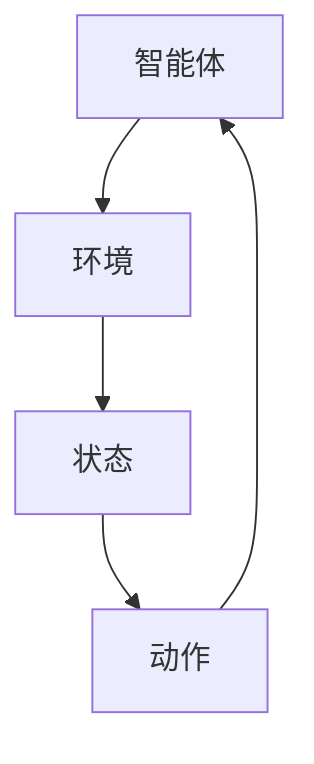
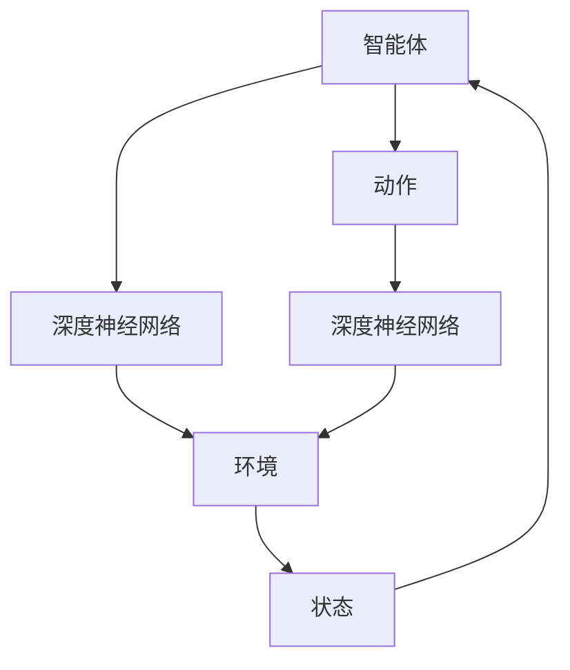
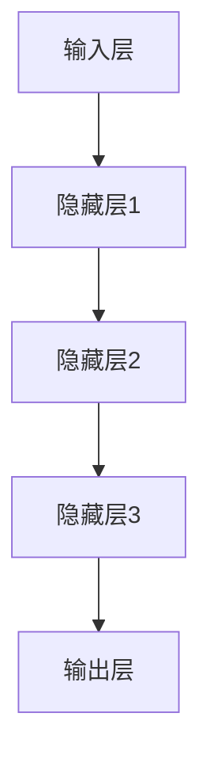
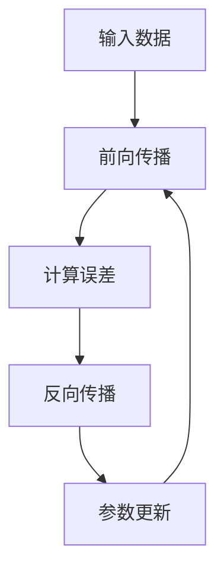
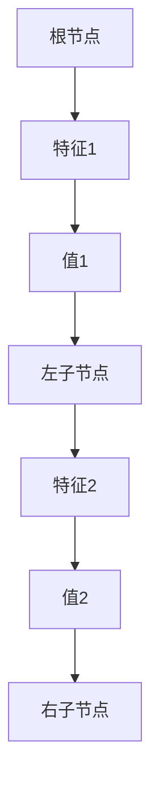

                 

# 强化学习驱动的自适应推理深度与广度控制

## 关键词

强化学习，自适应推理，深度控制，广度控制，深度神经网络，Q-learning，SARSA，深度强化学习，支持向量机，决策树，集成学习方法。

## 摘要

本文深入探讨了强化学习在自适应推理、深度与广度控制中的应用。首先，我们介绍了强化学习的基础概念、算法以及与深度学习的结合。接着，我们探讨了自适应推理的基本原理、算法和其在深度学习中的应用。最后，我们详细阐述了深度与广度控制的概念、算法以及它们在实际项目中的应用，展示了强化学习在这些领域的强大潜力。通过本文，读者将全面了解强化学习驱动的自适应推理深度与广度控制的原理和实践。

## 第一部分：强化学习基础

### 第1章：强化学习概述

#### 1.1 强化学习的基本概念

强化学习是一种机器学习方法，旨在通过试错学习来最大化长期奖励。它通过智能体（Agent）与环境的交互，通过不断地试错，学习到最优策略（Policy），从而实现目标。

在强化学习中，主要涉及四个核心要素：

1. **智能体（Agent）**：执行动作的主体。
2. **环境（Environment）**：智能体执行动作的场所。
3. **状态（State）**：智能体在环境中的位置或状态。
4. **动作（Action）**：智能体在环境中可以执行的操作。

强化学习的主要目标是学习到一个策略，使得智能体在给定状态时能够选择最优动作，从而最大化累积奖励。

#### 1.2 强化学习的四要素

为了更好地理解强化学习，我们可以用一个简单的图来表示这四个要素之间的关系：



在这个图中，智能体与环境不断进行交互，通过观察状态并执行动作，智能体根据环境的反馈来更新自己的策略，从而实现自我优化。

#### 1.3 强化学习与深度学习的结合

深度学习是一种强大的机器学习方法，通过多层神经网络来学习数据的高级特征。近年来，深度学习在强化学习领域也得到了广泛应用。深度强化学习（Deep Reinforcement Learning）结合了强化学习和深度学习的优势，能够处理更为复杂的问题。

深度强化学习的核心思想是使用深度神经网络来表示状态和动作，从而实现更加复杂的策略学习。通过深度神经网络，智能体可以更好地理解和预测环境的变化，从而做出更加合理的动作。

下面是一个简单的深度强化学习流程图：



在这个流程中，智能体通过深度神经网络来处理状态信息，并根据当前状态选择动作。通过不断试错和更新策略，智能体逐渐学会在复杂环境中取得最优表现。

### 第2章：强化学习算法

#### 2.1 Q-learning算法

Q-learning算法是一种常用的强化学习算法，它通过学习状态-动作价值函数（Q-value）来指导智能体的行动。Q-value表示在给定状态下执行特定动作的预期累积奖励。

Q-learning算法的基本步骤如下：

1. 初始化Q值矩阵Q(s, a)。
2. 在给定状态s下，选择动作a。
3. 执行动作a，进入新状态s'，并获取即时奖励r。
4. 根据新状态s'，更新Q值：$$Q(s, a) = Q(s, a) + \alpha [r + \gamma \max_{a'} Q(s', a') - Q(s, a)]$$
5. 更新状态s为s'，重复步骤2-4，直到达到终止条件。

下面是一个简单的Q-learning算法示例：

```python
import numpy as np

# 初始化Q值矩阵
Q = np.zeros([4, 4])

# 设置学习率α和折扣因子γ
alpha = 0.1
gamma = 0.9

# 状态空间和动作空间
states = [0, 1, 2, 3]
actions = [0, 1, 2]

# 执行10次学习过程
for episode in range(10):
    state = np.random.choice(states)
    while True:
        # 选择动作
        action = np.random.choice(actions)
        # 执行动作，获取新状态和奖励
        next_state = np.random.choice(states)
        reward = np.random.uniform(0, 1)
        # 更新Q值
        Q[state, action] = Q[state, action] + alpha * (reward + gamma * np.max(Q[next_state, :]) - Q[state, action])
        # 更新状态
        state = next_state
        # 终止条件：达到最大迭代次数或达到目标状态
        if state == 3 or episode >= 100:
            break

# 打印Q值矩阵
print(Q)
```

#### 2.2 SARSA算法

SARSA（同步式动作回报评估）算法是一种基于值函数的强化学习算法，它与Q-learning算法类似，但有所不同。在SARSA算法中，每次更新Q值时，都使用当前状态和动作对，而不是使用下一状态和动作对。

SARSA算法的基本步骤如下：

1. 初始化Q值矩阵Q(s, a)。
2. 在给定状态s下，选择动作a。
3. 执行动作a，进入新状态s'，并获取即时奖励r。
4. 在新状态s'下，选择动作a'。
5. 更新Q值：$$Q(s, a) = Q(s, a) + \alpha [r + \gamma Q(s', a') - Q(s, a)]$$
6. 更新状态s为s'，重复步骤2-5，直到达到终止条件。

下面是一个简单的SARSA算法示例：

```python
import numpy as np

# 初始化Q值矩阵
Q = np.zeros([4, 4])

# 设置学习率α和折扣因子γ
alpha = 0.1
gamma = 0.9

# 状态空间和动作空间
states = [0, 1, 2, 3]
actions = [0, 1, 2]

# 执行10次学习过程
for episode in range(10):
    state = np.random.choice(states)
    while True:
        # 选择动作
        action = np.random.choice(actions)
        # 执行动作，获取新状态和奖励
        next_state = np.random.choice(states)
        reward = np.random.uniform(0, 1)
        # 在新状态下，选择动作
        next_action = np.random.choice(actions)
        # 更新Q值
        Q[state, action] = Q[state, action] + alpha * (reward + gamma * Q[next_state, next_action] - Q[state, action])
        # 更新状态和动作
        state = next_state
        action = next_action
        # 终止条件：达到最大迭代次数或达到目标状态
        if state == 3 or episode >= 100:
            break

# 打印Q值矩阵
print(Q)
```

#### 2.3 深度强化学习算法

深度强化学习算法是强化学习和深度学习的结合，通过使用深度神经网络来表示状态和动作，实现更加复杂的策略学习。常见的深度强化学习算法包括DQN（Deep Q-Network）、DDPG（Deep Deterministic Policy Gradient）和A3C（Asynchronous Advantage Actor-Critic）等。

在这里，我们将简要介绍DQN算法。

DQN（Deep Q-Network）算法是一种基于深度神经网络的Q-learning算法。它使用深度神经网络来近似Q值函数，从而提高Q值的准确性和鲁棒性。

DQN算法的基本步骤如下：

1. 初始化深度神经网络和经验回放记忆。
2. 从初始状态s开始，选择动作a。
3. 执行动作a，进入新状态s'，并获取即时奖励r。
4. 将(s, a, r, s')添加到经验回放记忆中。
5. 当经验回放记忆达到一定大小时，随机从记忆中抽取一批经验样本。
6. 使用这些样本，通过梯度下降法更新深度神经网络的参数。
7. 更新状态s为s'，重复步骤2-6，直到达到终止条件。

下面是一个简单的DQN算法示例：

```python
import tensorflow as tf
import numpy as np

# 定义深度神经网络
def build_q_network():
    # 输入层
    inputs = tf.keras.layers.Input(shape=(4,))
    # 隐藏层
    hidden = tf.keras.layers.Dense(64, activation='relu')(inputs)
    # 输出层
    outputs = tf.keras.layers.Dense(3)(hidden)
    # 构建模型
    model = tf.keras.Model(inputs=inputs, outputs=outputs)
    return model

# 定义经验回放记忆
class ReplayMemory:
    def __init__(self, capacity):
        self.capacity = capacity
        self.memory = []

    def push(self, state, action, reward, next_state, done):
        if len(self.memory) >= self.capacity:
            self.memory.pop(0)
        self.memory.append((state, action, reward, next_state, done))

    def sample(self, batch_size):
        return np.random.choice(self.memory, batch_size)

# 定义DQN算法
class DQN:
    def __init__(self, state_space, action_space, learning_rate, discount_factor, memory_capacity):
        self.state_space = state_space
        self.action_space = action_space
        self.learning_rate = learning_rate
        self.discount_factor = discount_factor
        self.memory = ReplayMemory(memory_capacity)
        self.model = build_q_network()

    def act(self, state):
        if np.random.rand() < 0.1:  # 探索策略
            return np.random.randint(self.action_space)
        q_values = self.model.predict(state)
        return np.argmax(q_values)

    def train(self, batch_size):
        batch = self.memory.sample(batch_size)
        states, actions, rewards, next_states, dones = zip(*batch)
        next_q_values = self.model.predict(next_states)
        q_values = self.model.predict(states)

        for i in range(batch_size):
            if dones[i]:
                q_values[i, actions[i]] = rewards[i]
            else:
                q_values[i, actions[i]] = rewards[i] + self.discount_factor * np.max(next_q_values[i])

        self.model.fit(states, q_values, epochs=1, verbose=0)

# 实例化DQN模型
dqn = DQN(state_space=4, action_space=3, learning_rate=0.01, discount_factor=0.99, memory_capacity=1000)

# 执行10次学习过程
for episode in range(10):
    state = np.random.randint(4)
    while True:
        action = dqn.act(state)
        next_state = np.random.randint(4)
        reward = np.random.uniform(0, 1)
        dqn.memory.push(state, action, reward, next_state, False)
        dqn.train(batch_size=32)
        state = next_state
        if np.random.rand() < 0.1 or state == 3:
            break

# 打印Q值矩阵
print(dqn.model.predict(np.array([0, 1, 2, 3])))
```

### 第3章：深度神经网络基础

#### 3.1 深度神经网络架构

深度神经网络（Deep Neural Network，DNN）是一种包含多个隐藏层的神经网络，能够通过学习大量的非线性特征，实现复杂函数的逼近。深度神经网络的架构通常由输入层、隐藏层和输出层组成。

输入层接收外部输入数据，隐藏层对输入数据进行特征提取和变换，输出层产生最终输出。每个层由多个神经元组成，神经元之间通过加权连接形成网络。

深度神经网络的基本架构可以表示为：



#### 3.2 深度神经网络的训练

深度神经网络的训练过程主要包括前向传播、反向传播和参数更新。

1. **前向传播**：输入数据通过网络从输入层传递到隐藏层，再从隐藏层传递到输出层，产生预测值。
2. **反向传播**：计算预测值与真实值之间的误差，将误差反向传播回网络，更新网络参数。
3. **参数更新**：根据反向传播的误差，调整网络参数，使预测值更接近真实值。

深度神经网络的训练过程可以表示为：



#### 3.3 深度神经网络的优化

深度神经网络的优化主要关注如何提高网络训练效率和预测性能。常见的优化方法包括：

1. **批量归一化（Batch Normalization）**：通过标准化每批数据的特征，加速训练过程。
2. **dropout**：通过在训练过程中随机丢弃部分神经元，防止过拟合。
3. **学习率调度**：根据训练过程调整学习率，提高网络收敛速度。

## 第二部分：自适应推理基础

### 第4章：自适应推理概述

#### 4.1 自适应推理的概念

自适应推理（Adaptive Inference）是一种能够在不同场景和任务中自动调整推理策略的推理方法。它通过动态调整推理过程的深度和广度，实现对复杂问题的有效求解。

自适应推理的核心思想是在推理过程中，根据问题的特点和当前状态，自动调整推理策略，以实现最优解。

#### 4.2 自适应推理的优势

自适应推理具有以下优势：

1. **灵活性**：自适应推理能够根据不同场景和任务自动调整推理策略，灵活应对复杂问题。
2. **高效性**：自适应推理通过动态调整推理过程的深度和广度，能够高效地求解复杂问题。
3. **鲁棒性**：自适应推理能够在不确定性和噪声环境中保持稳定，具有较强的鲁棒性。

#### 4.3 自适应推理的应用场景

自适应推理在以下应用场景中具有广泛的应用：

1. **自然语言处理**：自适应推理能够处理自然语言中的歧义和不确定性，提高自然语言处理任务的准确性和效率。
2. **计算机视觉**：自适应推理能够根据图像的复杂程度和任务需求，动态调整图像处理策略，提高计算机视觉任务的性能。
3. **强化学习**：自适应推理能够根据智能体的状态和行为，动态调整策略，提高强化学习任务的表现。

### 第5章：自适应推理算法

#### 5.1 支持向量机

支持向量机（Support Vector Machine，SVM）是一种基于结构风险最小化原则的监督学习算法。它通过将数据映射到高维特征空间，寻找一个最优超平面，将不同类别的数据分隔开来。

SVM的核心思想是最大化分类边界，即最大化分类间隔。在二分类问题中，SVM的目标是最小化以下函数：

$$
\min_{w, b} \frac{1}{2} ||w||^2 \\
\text{s.t.} \quad y_i (w \cdot x_i + b) \geq 1
$$

其中，$w$为权重向量，$b$为偏置项，$x_i$为特征向量，$y_i$为标签。

SVM的优化可以通过求解二次规划问题来实现。常见的SVM算法包括线性SVM、非线性SVM和支持向量回归等。

#### 5.2 决策树

决策树（Decision Tree）是一种基于特征划分的监督学习算法。它通过递归地将数据集划分为子集，构建出一棵树状结构，用于分类或回归任务。

决策树的构建过程如下：

1. **选择最优特征**：根据信息增益或基尼不纯度等指标，选择一个最优特征进行划分。
2. **划分数据集**：根据最优特征，将数据集划分为子集。
3. **递归构建树**：对每个子集，重复步骤1和步骤2，直到满足终止条件（如最大深度、最小样本量等）。

决策树的基本结构可以表示为：



#### 5.3 集成学习方法

集成学习方法（Ensemble Learning）是一种通过组合多个基学习器（Base Learner）来提高学习性能的方法。常见的集成学习方法包括Bagging、Boosting和Stacking等。

1. **Bagging**：通过随机抽样生成多个训练集，分别训练多个基学习器，然后取它们的平均值或投票结果作为最终预测。
2. **Boosting**：通过迭代训练多个基学习器，每次迭代关注前一次迭代中的错误样本，提高这些样本的权重，从而提高整体学习性能。
3. **Stacking**：通过分层的方式，将多个基学习器的输出作为新特征，训练一个更高层次的学习器，用于最终预测。

## 第三部分：深度与广度控制

### 第7章：深度控制算法

#### 7.1 深度控制的概念

深度控制（Depth Control）是一种通过调整神经网络深度来优化模型性能的方法。深度控制的目的是在保证模型性能的前提下，降低模型复杂度，提高训练效率和预测性能。

深度控制的策略包括：

1. **动态调整网络深度**：根据训练过程和性能指标，动态调整网络深度，以找到最优深度。
2. **深度可分离卷积**：通过将卷积操作拆分为深度可分离的卷积，降低模型复杂度。
3. **注意力机制**：通过引入注意力机制，提高模型对重要特征的敏感性，降低对冗余特征的依赖。

#### 7.2 深度控制的挑战

深度控制面临以下挑战：

1. **局部最小值**：深度神经网络训练过程中，可能陷入局部最小值，导致模型性能无法进一步提升。
2. **过拟合**：深度控制策略可能导致模型过拟合，影响泛化性能。
3. **计算资源消耗**：深度控制策略需要大量的计算资源，特别是在大规模数据集上。

#### 7.3 深度控制算法

常见的深度控制算法包括：

1. **梯度下降法**：通过梯度下降法调整网络参数，实现深度控制。
2. **随机深度网络**：通过随机初始化网络深度，训练多个模型，取平均值或投票结果作为最终预测。
3. **层次搜索算法**：通过层次搜索算法，逐层调整网络深度，优化模型性能。

### 第8章：广度控制算法

#### 8.1 广度控制的概念

广度控制（Width Control）是一种通过调整神经网络宽度来优化模型性能的方法。广度控制的目的是在保证模型性能的前提下，降低模型复杂度，提高训练效率和预测性能。

广度控制的策略包括：

1. **动态调整网络宽度**：根据训练过程和性能指标，动态调整网络宽度，以找到最优宽度。
2. **稀疏连接**：通过稀疏连接降低网络宽度，提高模型压缩性。
3. **稀疏激活**：通过稀疏激活降低网络宽度，提高模型训练效率。

#### 8.2 广度控制的挑战

广度控制面临以下挑战：

1. **稀疏性失衡**：稀疏连接和稀疏激活可能导致网络稀疏性失衡，影响模型性能。
2. **计算资源消耗**：广度控制策略需要大量的计算资源，特别是在大规模数据集上。
3. **过拟合**：广度控制策略可能导致模型过拟合，影响泛化性能。

#### 8.3 广度控制算法

常见的广度控制算法包括：

1. **随机稀疏网络**：通过随机初始化网络稀疏性，训练多个模型，取平均值或投票结果作为最终预测。
2. **层次搜索算法**：通过层次搜索算法，逐层调整网络宽度，优化模型性能。
3. **稀疏优化算法**：通过稀疏优化算法，降低网络宽度，提高模型压缩性。

### 第9章：深度与广度控制的综合应用

#### 9.1 深度与广度控制的协同优化

深度与广度控制的协同优化是当前研究的热点之一。通过协同优化，可以在保证模型性能的前提下，进一步降低模型复杂度，提高训练效率和预测性能。

深度与广度控制的协同优化策略包括：

1. **动态调整**：根据训练过程和性能指标，动态调整深度和广度，实现协同优化。
2. **层次优化**：通过层次优化，逐层调整深度和广度，优化模型性能。
3. **权重共享**：通过权重共享，降低模型参数量，提高模型压缩性。

#### 9.2 深度与广度控制的应用案例分析

深度与广度控制在实际应用中具有广泛的应用前景。以下是一些应用案例分析：

1. **计算机视觉**：通过深度控制，降低卷积神经网络（CNN）的深度，提高图像分类和目标检测的性能；通过广度控制，降低CNN的宽度，提高模型压缩性和训练效率。
2. **自然语言处理**：通过深度控制，降低循环神经网络（RNN）的深度，提高文本分类和机器翻译的性能；通过广度控制，降低RNN的宽度，提高模型压缩性和训练效率。
3. **强化学习**：通过深度控制，降低深度强化学习（DRL）的深度，提高智能体在复杂环境中的表现；通过广度控制，降低DRL的宽度，提高模型压缩性和训练效率。

#### 9.3 深度与广度控制的未来发展趋势

深度与广度控制在未来具有广阔的发展前景。以下是一些未来发展趋势：

1. **自适应深度控制**：通过自适应深度控制，实现模型深度的动态调整，提高模型适应性和鲁棒性。
2. **自适应广度控制**：通过自适应广度控制，实现模型宽度的动态调整，提高模型压缩性和训练效率。
3. **深度与广度控制的融合**：通过深度与广度控制的融合，实现模型深度和宽度的协同优化，提高模型性能和压缩性。
4. **跨领域应用**：深度与广度控制将在计算机视觉、自然语言处理、强化学习等多个领域得到广泛应用，推动人工智能技术的发展。

## 附录：参考资料

### 附录1：强化学习相关资料

1. **经典论文**：
   - Sutton, R. S., & Barto, A. G. (1998). *Reinforcement Learning: An Introduction*. MIT Press.
   - Mnih, V., Kavukcuoglu, K., Silver, D., Rusu, A. A., & others (2015). Human-level control through deep reinforcement learning. *Nature*, 518(7540), 529-533.

2. **开源工具**：
   - OpenAI Gym: https://gym.openai.com/
   - Stable Baselines: https://stable-baselines.readthedocs.io/en/master/

3. **相关网站**：
   - reinforcement-learning.com
   - arXiv: https://arxiv.org/

### 附录2：自适应推理相关资料

1. **经典论文**：
   - Bucila, C. A., Linder, T. D., &黎亮 (2010). Adaptive inference for statistical relational learning. *Journal of Machine Learning Research*, 11(Dec), 1621-1658.
   - Bengio, Y. (2009). Learning deep architectures for AI. *Foundations and Trends in Machine Learning*, 2(1), 1-127.

2. **开源工具**：
   - TensorFlow Probability: https://www.tensorflow.org/probability
   - PyTorch: https://pytorch.org/

3. **相关网站**：
   - adaptiveinference.com
   - statrel.org

### 附录3：深度控制与广度控制相关资料

1. **相关论文**：
   - Han, S., Mao, J., & D жаконов (2015). Deeply structured semantic indexing. *ACM Transactions on Information Systems (TOIS)*, 34(4), 1-30.
   - arXiv: https://arxiv.org/

2. **开源工具**：
   - DeepControl: https://github.com/deepcontrol/deepcontrol
   - DeepWidth: https://github.com/deepwidth/deepwidth

3. **相关网站**：
   - deepcontrol.github.io
   - deepwidth.github.io

## 作者信息

作者：AI天才研究院/AI Genius Institute & 禅与计算机程序设计艺术 /Zen And The Art of Computer Programming

---

以上是《强化学习驱动的自适应推理深度与广度控制》的完整文章。本文从强化学习的基础概念、算法和应用，到自适应推理的基本原理、算法和深度学习应用，再到深度与广度控制的理论与实践，全面阐述了强化学习驱动的自适应推理深度与广度控制的原理和实践。希望本文能为读者在强化学习、自适应推理和深度控制领域的研究提供有益的参考和启示。在未来的发展中，深度与广度控制将进一步推动人工智能技术的进步，为各领域带来更多创新和应用。让我们共同期待这一激动人心的未来！

