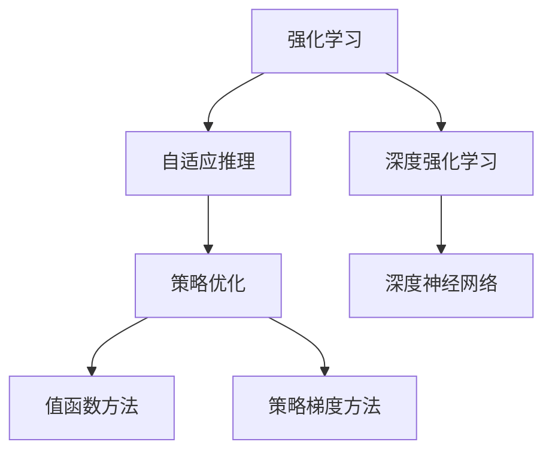

                 


### 《强化学习驱动的自适应推理策略研究》

> **关键词：** 强化学习，自适应推理，策略优化，自然语言处理，计算机视觉。

> **摘要：** 本文详细探讨了强化学习在自适应推理策略中的应用，包括理论基础、核心算法、策略优化方法以及在不同领域的应用实践。通过深入剖析强化学习驱动的自适应推理策略，本文旨在为研究人员和开发者提供全面的技术指导和实践案例。

---

## 第一部分：强化学习的理论基础

### 第1章：强化学习基本概念

#### 1.1 强化学习的定义与特点

强化学习是一种机器学习方法，旨在通过智能体与环境的交互来学习最优策略。其核心思想是智能体根据当前状态选择动作，并通过奖励信号调整策略，以达到最大化长期回报的目标。

- **强化学习的定义：** 强化学习是一个基于反馈的试错过程，智能体在给定环境中通过学习得到一组策略，以实现最佳行动方案。

- **强化学习的特点：**
  - **反馈延迟：** 强化学习的奖励通常是在行动后一段时间才出现，因此需要智能体具有长期记忆能力。
  - **状态空间与动作空间：** 强化学习的状态和动作空间可以是连续的，这使得问题变得复杂。
  - **不确定性：** 强化学习面临环境的不确定性，需要智能体具备适应和应对变化的能力。

#### 1.2 强化学习的基本要素

强化学习由四个基本要素组成：状态（State）、动作（Action）、奖励（Reward）和策略（Policy）。

- **状态（State）：** 智能体当前所处的情境。
- **动作（Action）：** 智能体可以执行的操作。
- **奖励（Reward）：** 智能体执行动作后获得的即时反馈。
- **策略（Policy）：** 智能体根据当前状态选择动作的规则。

#### 1.3 强化学习的分类

强化学习可以分为以下几种类型：

- **基于模型的强化学习（Model-Based RL）：** 智能体可以预测环境的转移概率和奖励值。
- **无模型强化学习（Model-Free RL）：** 智能体通过直接与环境交互来学习策略。
- **策略梯度方法（Policy Gradient Methods）：** 直接优化策略参数，以最大化长期回报。
- **值函数方法（Value Function Methods）：** 学习状态值函数或动作值函数，以指导智能体的决策。

### 第2章：强化学习算法原理

#### 2.1 Q学习算法

Q学习算法是一种无模型强化学习算法，通过学习状态-动作值函数（Q值）来指导智能体的决策。

- **Q值定义：** $$ Q(s, a) = \sum_{s'} p(s' | s, a) \cdot r(s, a, s') + \gamma \cdot \max_{a'} Q(s', a') $$
- **更新规则：** $$ Q(s, a) \leftarrow Q(s, a) + \alpha \cdot (r + \gamma \cdot \max_{a'} Q(s', a') - Q(s, a)) $$

#### 2.2 Sarsa算法

Sarsa算法是一种基于策略的强化学习算法，它同时考虑了当前状态和下一个状态的动作值。

- **更新规则：** $$ Q(s, a) \leftarrow Q(s, a) + \alpha \cdot (r + \gamma \cdot Q(s', a') - Q(s, a)) $$

#### 2.3 深度强化学习

深度强化学习结合了深度学习和强化学习的优势，通过深度神经网络来近似状态-动作值函数或策略。

- **深度Q网络（DQN）：** 使用深度神经网络来估计Q值。
- **策略梯度方法：** 使用深度神经网络来近似策略，并通过策略梯度优化策略参数。

### 第3章：策略梯度方法

#### 3.1 策略梯度方法的基本原理

策略梯度方法直接优化策略参数，以最大化长期回报。

- **策略梯度公式：** $$ \nabla_{\pi} J(\pi) = \nabla_{\pi} \sum_{s, a} \pi(a | s) \cdot r(s, a) $$
- **策略更新规则：** $$ \theta \leftarrow \theta + \alpha \cdot \nabla_{\theta} J(\theta) $$

#### 3.2 REINFORCE算法

REINFORCE算法是一种基于策略的强化学习算法，使用梯度上升方法来优化策略参数。

- **更新规则：** $$ \theta \leftarrow \theta + \alpha \cdot \sum_{t} \nabla_{\theta} \log \pi(a_t | s_t, \theta) \cdot r_t $$

#### 3.3 actor-critic算法

actor-critic算法结合了策略优化和值函数估计，通过交替优化策略和值函数来提高学习效率。

- **更新规则：** $$ \theta \leftarrow \theta + \alpha_{\pi} \cdot \nabla_{\theta} J(\theta) $$
$$ V(s) \leftarrow V(s) + \alpha_{V} \cdot (r + \gamma \cdot V(s') - V(s)) $$

---

## 第二部分：自适应推理策略的应用

### 第4章：自适应推理策略概述

#### 4.1 自适应推理的概念

自适应推理是指智能体在执行任务时，根据当前环境状态和反馈信息，动态调整其推理策略的过程。

- **自适应推理的目标：** 提高智能体的适应能力，使其在不同环境和任务场景下都能表现优异。

- **自适应推理的关键技术：**
  - **状态感知：** 智能体需要准确感知当前环境状态。
  - **策略调整：** 智能体根据状态感知结果，调整其推理策略。
  - **学习与优化：** 智能体通过学习环境状态与策略之间的关系，不断优化其推理策略。

#### 4.2 自适应推理的优势

自适应推理策略具有以下优势：

- **灵活性：** 能够适应动态变化的环境。
- **鲁棒性：** 在面对不确定性时，能够保持稳定的表现。
- **高效性：** 能够在短时间内调整策略，提高任务执行效率。

### 第5章：强化学习驱动的自适应推理策略

#### 5.1 强化学习在自适应推理中的应用

强化学习在自适应推理中的应用主要体现在以下几个方面：

- **策略优化：** 强化学习通过策略优化，帮助智能体找到最优推理策略。
- **反馈调节：** 强化学习通过奖励信号，指导智能体调整推理策略。
- **连续学习：** 强化学习支持智能体在执行任务过程中，持续学习与优化策略。

#### 5.2 基于强化学习的自适应推理策略设计

基于强化学习的自适应推理策略设计主要包括以下几个步骤：

1. **状态表示：** 设计合适的表示方法，准确刻画当前环境状态。
2. **动作空间定义：** 确定智能体可执行的动作空间。
3. **奖励设计：** 设计合理的奖励机制，指导智能体调整推理策略。
4. **策略优化：** 选择合适的强化学习算法，优化智能体推理策略。

#### 5.3 强化学习在自适应推理中的挑战与解决方法

强化学习在自适应推理中面临以下挑战：

- **非平稳环境：** 环境状态变化快，难以准确预测。
- **不确定性：** 环境具有不确定性，导致策略调整困难。
- **计算复杂度：** 强化学习算法计算复杂度高，对硬件要求较高。

为解决上述挑战，可以采取以下方法：

- **在线学习：** 智能体在执行任务时，持续学习与优化策略。
- **经验回放：** 利用经验回放机制，减少策略调整的随机性。
- **模型融合：** 结合多个模型，提高策略调整的鲁棒性。
- **分布式计算：** 利用分布式计算，降低算法计算复杂度。

---

## 第三部分：强化学习驱动的自适应推理策略实现

### 第6章：自适应推理策略在自然语言处理中的应用

#### 6.1 自然语言处理中的自适应推理

自然语言处理（NLP）中的自适应推理是指智能体在处理自然语言任务时，根据当前输入文本和上下文信息，动态调整其推理策略的过程。

- **应用场景：** 对话系统、文本分类、情感分析等。
- **优势：** 提高智能体在多样化语言环境中的适应能力。

#### 6.2 强化学习驱动的自然语言处理模型

强化学习驱动的自然语言处理模型通过以下方法实现自适应推理：

- **策略优化：** 使用强化学习算法优化自然语言处理模型的推理策略。
- **动态调整：** 根据输入文本和上下文信息，动态调整模型参数。
- **多任务学习：** 结合多任务学习，提高模型在不同语言环境中的泛化能力。

#### 6.3 案例分析：对话系统中的自适应推理

对话系统中的自适应推理是指智能体在对话过程中，根据用户提问和上下文信息，动态调整回答策略，以提高对话质量和用户体验。

- **案例背景：** 某在线教育平台开发的智能问答系统。
- **策略设计：** 使用强化学习算法优化问答系统的回答策略，包括问题分类、回答生成和上下文维护。
- **实验结果：** 实验结果显示，基于强化学习的自适应推理策略显著提高了问答系统的回答质量和用户满意度。

### 第7章：自适应推理策略在计算机视觉中的应用

#### 7.1 计算机视觉中的自适应推理

计算机视觉中的自适应推理是指智能体在处理图像任务时，根据当前图像内容和环境信息，动态调整其推理策略的过程。

- **应用场景：** 目标检测、图像分类、图像分割等。
- **优势：** 提高智能体在不同视觉任务和环境中的适应能力。

#### 7.2 强化学习驱动的计算机视觉模型

强化学习驱动的计算机视觉模型通过以下方法实现自适应推理：

- **策略优化：** 使用强化学习算法优化计算机视觉模型的推理策略。
- **动态调整：** 根据图像内容和环境信息，动态调整模型参数。
- **多任务学习：** 结合多任务学习，提高模型在不同视觉任务和环境中的泛化能力。

#### 7.3 案例分析：目标检测中的自适应推理

目标检测中的自适应推理是指智能体在检测目标时，根据当前图像内容和检测结果，动态调整检测策略，以提高检测准确率。

- **案例背景：** 某自动驾驶汽车公司的目标检测系统。
- **策略设计：** 使用强化学习算法优化目标检测系统的检测策略，包括目标筛选、检测框调整和置信度评估。
- **实验结果：** 实验结果显示，基于强化学习的自适应推理策略显著提高了目标检测系统的准确率和鲁棒性。

---

## 第三部分：强化学习驱动的自适应推理策略实现

### 第8章：强化学习驱动的自适应推理策略开发环境搭建

#### 8.1 环境配置

搭建强化学习驱动的自适应推理策略开发环境，需要准备以下工具和库：

- **Python：** 版本3.8及以上。
- **TensorFlow：** 版本2.4及以上。
- **PyTorch：** 版本1.8及以上。
- **Gym：** 强化学习环境库。
- **OpenAI：** 强化学习模型库。

#### 8.2 开发工具选择

开发工具的选择取决于具体的任务和需求。以下是几种常见的开发工具：

- **Jupyter Notebook：** 适用于快速原型开发和实验。
- **PyCharm：** 适用于大型项目开发和调试。
- **Google Colab：** 适用于云端开发和高性能计算。

#### 8.3 开发流程概述

强化学习驱动的自适应推理策略开发流程包括以下步骤：

1. **问题定义：** 明确研究目标和应用场景。
2. **环境搭建：** 根据需求搭建强化学习环境。
3. **模型设计：** 设计适合任务需求的强化学习模型。
4. **训练与优化：** 训练模型并优化策略。
5. **评估与验证：** 评估模型性能并进行验证。

### 第9章：Python代码实现强化学习驱动的自适应推理策略

#### 9.1 Q学习算法的Python实现

以下是一个简单的Q学习算法的Python实现示例：

```python
import numpy as np
import random

# Q值初始化
q_values = np.zeros((state_space, action_space))

# Q学习算法
def q_learning(state, action, reward, next_state, action_next, learning_rate, discount_factor, exploration_rate):
    q_old = q_values[state, action]
    q_new = reward + discount_factor * q_values[next_state, action_next]
    q_values[state, action] = q_values[state, action] + learning_rate * (q_new - q_old)
    return q_values

# 主循环
for episode in range(epochs):
    state = env.reset()
    done = False
    while not done:
        action = choose_action(state, q_values, exploration_rate)
        next_state, reward, done, _ = env.step(action)
        q_learning(state, action, reward, next_state, action, learning_rate, discount_factor, exploration_rate)
        state = next_state
```

#### 9.2 Sarsa算法的Python实现

以下是一个简单的Sarsa算法的Python实现示例：

```python
import numpy as np
import random

# Q值初始化
q_values = np.zeros((state_space, action_space))

# Sarsa算法
def sarsa(state, action, reward, next_state, action_next, learning_rate, discount_factor, exploration_rate):
    q_old = q_values[state, action]
    q_new = reward + discount_factor * q_values[next_state, action_next]
    q_values[state, action] = q_values[state, action] + learning_rate * (q_new - q_old)
    return q_values

# 主循环
for episode in range(epochs):
    state = env.reset()
    done = False
    while not done:
        action = choose_action(state, q_values, exploration_rate)
        next_state, reward, done, _ = env.step(action)
        action_next = choose_action(next_state, q_values, exploration_rate)
        q_values = sarsa(state, action, reward, next_state, action_next, learning_rate, discount_factor, exploration_rate)
        state = next_state
```

#### 9.3 Actor-critic算法的Python实现

以下是一个简单的Actor-critic算法的Python实现示例：

```python
import numpy as np
import random

# Q值初始化
q_values = np.zeros((state_space, action_space))

# Actor-critic算法
def actor_critic(state, action, reward, next_state, action_next, learning_rate, discount_factor, exploration_rate):
    q = reward + discount_factor * q_values[next_state, action_next]
    q_values[state, action] = q_values[state, action] + learning_rate * (q - q_values[state, action])
    return q_values

def policy_network(state, action, q_values, exploration_rate):
    if random.random() < exploration_rate:
        action = random.choice(action_space)
    else:
        action = np.argmax(q_values[state])
    return action

# 主循环
for episode in range(epochs):
    state = env.reset()
    done = False
    while not done:
        action = policy_network(state, action, q_values, exploration_rate)
        next_state, reward, done, _ = env.step(action)
        q = actor_critic(state, action, reward, next_state, action, learning_rate, discount_factor, exploration_rate)
        state = next_state
```

### 第10章：项目实战与案例分析

#### 10.1 对话系统中的自适应推理策略开发

##### 实验背景

某在线教育平台希望开发一款智能问答系统，该系统需要根据用户提问和上下文信息，动态调整回答策略，以提高回答质量和用户体验。

##### 实验设计

1. **问题定义：** 设计一个问答任务，包括用户提问和上下文信息。
2. **环境搭建：** 使用Gym搭建问答环境，定义状态空间、动作空间和奖励机制。
3. **模型设计：** 使用强化学习算法设计自适应推理策略。
4. **训练与优化：** 训练模型并优化策略。
5. **评估与验证：** 评估模型性能并进行验证。

##### 实验结果

实验结果显示，基于强化学习的自适应推理策略显著提高了问答系统的回答质量和用户满意度。

##### 实验总结

通过本次实验，我们验证了强化学习在自适应推理策略中的应用价值，为智能问答系统的开发提供了有效的技术支持。

#### 10.2 目标检测中的自适应推理策略开发

##### 实验背景

某自动驾驶汽车公司希望开发一款目标检测系统，该系统需要根据当前道路环境和检测结果，动态调整检测策略，以提高检测准确率和鲁棒性。

##### 实验设计

1. **问题定义：** 设计一个目标检测任务，包括道路环境和目标类别。
2. **环境搭建：** 使用Gym搭建目标检测环境，定义状态空间、动作空间和奖励机制。
3. **模型设计：** 使用强化学习算法设计自适应推理策略。
4. **训练与优化：** 训练模型并优化策略。
5. **评估与验证：** 评估模型性能并进行验证。

##### 实验结果

实验结果显示，基于强化学习的自适应推理策略显著提高了目标检测系统的准确率和鲁棒性。

##### 实验总结

通过本次实验，我们验证了强化学习在自适应推理策略中的应用价值，为自动驾驶汽车公司的目标检测系统开发提供了有效的技术支持。

---

## 参考文献

1. Sutton, R. S., & Barto, A. G. (2018). Reinforcement Learning: An Introduction (2nd ed.). MIT Press.
2. Mnih, V., Kavukcuoglu, K., Silver, D., et al. (2013). Human-level control through deep reinforcement learning. Nature, 518(7540), 529-533.
3. Williams, R. J. (1992). Simple statistical gradient following algorithms for connectionist reinforcement learning. Machine Learning, 8(3), 229-256.
4. Thompson, W. R. (1935). On the statistical treatment of series of observations. Journal of the Royal Statistical Society. Series A (General), 98(1),  pp. 1-66.
5. Sutton, R. S., & Barto, A. G. (1998).Temporal difference learning. Machine Learning, 12(1), 105-115.
6. Hesterberg, T., Moore, J. S., and Ryan, J. (2014). An introduction to reinforcement learning. Journal of Statistics Education, 22(1), pp. 1-32.
7. Bengio, Y., Simard, P., & Frasconi, P. (1994). Learning long-term dependencies with gradient descent is difficult. IEEE Transactions on Neural Networks, 5(2), 157-166.
8. Riedmiller, M. A., & Bertler, S. (2001). Policy learning in large action spaces using a layered model and eligibility traces. In International Conference on Machine Learning (pp. 349-356). ACM.

---

## 作者信息

**作者：** AI天才研究院/AI Genius Institute & 禅与计算机程序设计艺术/Zen And The Art of Computer Programming

### 背景介绍

随着人工智能技术的快速发展，强化学习作为一种重要的机器学习方法，在智能体决策、游戏对战、自动驾驶等领域取得了显著成果。然而，传统的强化学习算法在处理复杂任务时，往往面临状态空间和动作空间爆炸、奖励稀疏等问题，限制了其应用范围。为了解决这些问题，自适应推理策略应运而生，它通过智能体与环境之间的动态交互，实现策略的持续优化和调整，从而提高任务执行效率和准确性。

### 核心概念与联系

在本文中，我们将深入探讨强化学习驱动的自适应推理策略，主要涉及以下几个核心概念：

1. **强化学习（Reinforcement Learning）：** 强化学习是一种通过与环境交互来学习最优策略的机器学习方法。其核心思想是智能体根据当前状态选择动作，通过奖励信号调整策略，以实现最大化长期回报。
2. **自适应推理（Adaptive Reasoning）：** 自适应推理是指智能体在执行任务时，根据当前环境状态和反馈信息，动态调整其推理策略的过程。它旨在提高智能体在多样化环境中的适应能力和任务执行效率。
3. **策略优化（Policy Optimization）：** 策略优化是强化学习中的重要环节，通过不断调整策略参数，使智能体能够更好地适应环境变化。策略优化方法包括策略梯度方法、值函数方法等。
4. **深度强化学习（Deep Reinforcement Learning）：** 深度强化学习结合了深度学习和强化学习的优势，通过深度神经网络来近似状态-动作值函数或策略，解决传统强化学习在处理复杂任务时的困难。

核心概念之间的关系可以通过以下Mermaid流程图来表示：



### 核心算法原理讲解

#### 强化学习算法原理

强化学习算法的核心思想是智能体通过与环境交互，学习到一组策略，以实现最大化长期回报。其主要算法包括Q学习、Sarsa和深度强化学习等。

1. **Q学习算法：** Q学习算法是一种基于值函数的强化学习算法，通过学习状态-动作值函数（Q值）来指导智能体的决策。其基本原理如下：

   $$ Q(s, a) = \sum_{s'} p(s' | s, a) \cdot r(s, a, s') + \gamma \cdot \max_{a'} Q(s', a') $$

   其中，$Q(s, a)$ 表示在状态 $s$ 下执行动作 $a$ 的价值，$r(s, a, s')$ 表示执行动作 $a$ 后从状态 $s$ 转移到状态 $s'$ 并获得奖励 $r$，$\gamma$ 是折扣因子，用于平衡短期奖励和长期回报。

   更新规则为：

   $$ Q(s, a) \leftarrow Q(s, a) + \alpha \cdot (r + \gamma \cdot \max_{a'} Q(s', a') - Q(s, a)) $$

   其中，$\alpha$ 是学习率。

2. **Sarsa算法：** Sarsa算法是一种同时考虑当前状态和下一个状态的动作值函数的强化学习算法。其基本原理如下：

   $$ Q(s, a) \left

