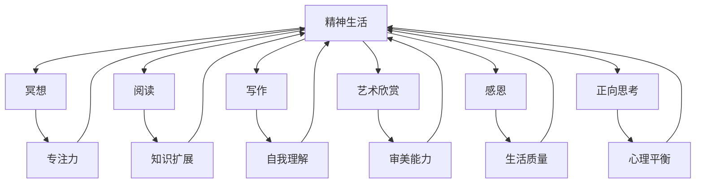

                 

# 《心灵的滋润：cultivate精神生活的习惯》

关键词：精神生活、习惯培养、冥想、阅读、写作、艺术欣赏、感恩、正向思考

摘要：本文旨在探讨精神生活的培养及其重要性，通过对冥想、阅读、写作、艺术欣赏、感恩和正向思考等习惯的培养，帮助读者在快节奏的现代生活中找到心灵的滋润，提升个人精神境界。

---

## 引言

### 1.1 书籍目的与读者对象

在当今社会，人们的生活节奏日益加快，工作压力和生活压力逐渐增大。许多人陷入了焦虑、疲惫的状态，心灵逐渐干涸。因此，本书旨在帮助读者培养精神生活的习惯，提升精神境界，找到内心的宁静和平衡。

本书适合所有渴望提升生活质量、追求心灵成长的人阅读。无论是职场人士、学生、家庭主妇，还是退休老人，都可以从本书中受益。希望通过本书，读者能够找到适合自己的精神滋养方式，让生活变得更加丰富多彩。

### 1.2 精神生活的意义

精神生活是人类生活的重要组成部分，它关乎我们的内心世界和情感体验。一个充实的精神生活不仅能帮助我们应对生活中的挑战，还能提升我们的生活质量。

精神生活的意义在于：

1. 提升幸福感：通过培养良好的精神习惯，我们能够更好地调节情绪，减少焦虑和抑郁，提高幸福感。
2. 增强心理韧性：良好的精神生活能够帮助我们面对生活中的挫折和困难，增强心理韧性。
3. 促进自我成长：通过不断培养精神生活的习惯，我们能够提升自我认知，实现个人成长。
4. 建立良好的人际关系：一个充实的精神生活能够帮助我们更好地与他人沟通，建立良好的人际关系。

### 1.3 如何阅读本书

本书分为十章，每章讨论一个精神生活的习惯。建议读者按照以下步骤阅读：

1. 阅读每章的引言，了解本章的核心内容。
2. 仔细阅读每节的内容，理解核心概念和原理。
3. 实践本章的建议方法，尝试培养相应习惯。
4. 思考和实践过程中的体会，与他人分享心得。

通过以上步骤，相信读者能够更好地理解并实践本书的建议，从而在精神生活中取得实质性收获。

---

在接下来的章节中，我们将逐一探讨冥想、阅读、写作、艺术欣赏、感恩和正向思考等精神生活习惯的培养方法，帮助读者在繁忙的生活中找到心灵的滋润。接下来，让我们开始探索精神生活的核心概念。 <!-- 分隔符 --> 

## 第2章 精神生活的核心概念

在探讨如何培养精神生活的习惯之前，我们需要先了解精神生活的核心概念。本章将介绍精神生活的定义、组成部分及其相互关系，并通过Mermaid流程图展示这些概念之间的联系。

### 2.1 精神生活的定义

精神生活是指人们在日常生活中所从事的各种精神活动，包括思考、感受、信仰、艺术欣赏、阅读、写作、冥想等。精神生活不仅仅局限于个人的内心体验，还包括与他人的交流和互动。它关乎我们的情感、思想、价值观和行为，是构成人类生活的核心部分。

### 2.2 精神生活的组成部分

精神生活可以细分为多个组成部分，主要包括以下几个方面：

1. **冥想**：冥想是一种通过专注、放松和内省来达到心灵平静的方法。它有助于减轻压力，提升专注力和自我认知。
2. **阅读**：阅读是获取知识和信息的重要途径，通过阅读，我们能够开阔视野，提升思维能力和文化素养。
3. **写作**：写作是一种表达内心世界和思考的方式，通过写作，我们能够更好地理解自己，与他人建立更深层次的联系。
4. **艺术欣赏**：艺术欣赏包括对音乐、绘画、雕塑等艺术形式的欣赏和体验，它能够提升我们的审美能力和情感体验。
5. **感恩**：感恩是一种积极向上的情感态度，通过感恩，我们能够更加珍惜身边的人和事，提升生活质量。
6. **正向思考**：正向思考是一种积极的心态，通过培养正向思考，我们能够更好地应对生活中的挑战，保持心理平衡。

### 2.3 精神生活的核心概念联系图

为了更好地理解精神生活的各个组成部分及其相互关系，我们可以通过Mermaid流程图来展示这些核心概念。



通过上述Mermaid流程图，我们可以清晰地看到精神生活的各个组成部分及其相互关系。每一个组成部分都与其他部分相互影响，共同构成了一个完整的精神生活体系。

在理解了精神生活的核心概念之后，接下来我们将探讨如何培养这些精神生活的习惯，以便在日常生活中更好地滋润心灵。<!-- 分隔符 --> 

## 第3章 培养精神生活的习惯

精神生活的习惯是我们提升生活质量、实现个人成长的重要途径。本章节将详细探讨培养精神生活习惯的重要性、方法和成功案例，帮助读者在实践中找到适合自己的精神滋养方式。

### 3.1 培养习惯的重要性

习惯是我们日常生活中不可或缺的一部分。一个良好的习惯能够帮助我们更高效地完成日常任务，提升生活质量。同样，培养精神生活的习惯对于我们的心理健康和情感体验也具有重要意义。

培养精神生活习惯的重要性体现在以下几个方面：

1. **提升心理韧性**：良好的精神生活习惯能够帮助我们更好地应对生活中的压力和挑战，提升心理韧性。
2. **增强自我认知**：通过培养精神生活习惯，我们能够更深入地了解自己，提升自我认知，实现个人成长。
3. **促进身心健康**：精神生活的习惯有助于减轻焦虑、抑郁等负面情绪，促进身心健康。
4. **提高生活质量**：一个充实的精神生活能够让我们更加享受生活，提升生活质量。

### 3.2 培养精神生活习惯的方法

要培养精神生活的习惯，我们需要遵循以下步骤：

1. **明确目标**：首先，我们需要明确自己想要培养哪些精神生活习惯。例如，冥想、阅读、写作、艺术欣赏等。
2. **制定计划**：在明确目标后，我们需要制定具体的计划，包括每天或每周的实践时间、实践内容等。例如，每天早上进行10分钟的冥想，每周阅读两本书等。
3. **持之以恒**：培养精神生活习惯需要持之以恒，不能半途而废。即使在遇到困难时，也要坚持实践，逐步提升习惯的稳定性。
4. **反思与调整**：在实践过程中，我们需要不断反思自己的行为，了解哪些方法有效，哪些需要调整。根据实际情况进行调整，以找到最适合自己的实践方法。
5. **与他人分享**：通过与他人分享实践心得，我们能够获得更多的支持和鼓励，提高培养精神生活习惯的积极性。

### 3.3 成功案例分析

以下是一个关于培养阅读习惯的成功案例：

**案例背景**：李先生是一位忙碌的职场人士，每天的工作让他感到压力巨大。为了提升自己的生活质量和心理韧性，他决定培养阅读习惯。

**培养方法**：

1. **明确目标**：李先生确定了自己的目标，即每周阅读两本书，涵盖不同领域的知识。
2. **制定计划**：为了确保阅读时间，李先生每天晚上睡前安排了30分钟的时间阅读。他还在周末安排了半天的时间进行深阅读。
3. **持之以恒**：尽管工作繁忙，李先生始终坚持每天阅读。即使在出差时，他也随身携带书籍，利用碎片时间进行阅读。
4. **反思与调整**：在实践过程中，李先生发现自己在阅读时容易分心。为了解决这个问题，他开始尝试在阅读前做一些放松的活动，如冥想或深呼吸，以提高专注力。
5. **与他人分享**：李先生在社交媒体上分享了自己的阅读心得，并加入了一个读书俱乐部。通过与其他读书爱好者交流，他得到了更多的阅读建议和鼓励。

**结果**：经过一年的坚持，李先生的阅读习惯已经根深蒂固。他不仅拓展了知识面，提升了思维能力，还因为阅读带来的心灵滋养，变得更加平和和自信。

通过这个案例，我们可以看到，培养精神生活习惯需要明确目标、制定计划、持之以恒、反思与调整，以及与他人分享。只要我们能够坚持下去，就一定能够在精神生活中找到属于自己的滋养方式。

在接下来的章节中，我们将逐一探讨冥想、阅读、写作等具体的精神生活习惯，帮助读者在实践中提升精神境界。<!-- 分隔符 --> 

## 第4章 培养冥想习惯

冥想是一种古老而有效的精神修养方法，它通过专注、放松和内省来达到心灵平静。在本章中，我们将详细探讨冥想的基本概念、好处和具体实践方法，帮助读者逐步培养冥想习惯。

### 4.1 冥想的基本概念

冥想（Meditation）是一种通过专注、放松和内省来达到心灵平静的心理活动。它起源于古老的东方哲学和宗教传统，如佛教、印度教和道教等。在现代社会，冥想被广泛认可为一种有效的心理健康和情绪调节工具。

冥想的基本概念包括：

1. **专注**：专注是指将注意力集中在某个特定的对象、情境或感觉上。在冥想过程中，通过专注，我们可以减少杂念，达到内心的平静。
2. **放松**：放松是指通过深呼吸、渐进性肌肉放松等方法来减轻身体和情绪的压力。放松是冥想的重要组成部分，它有助于身体和心灵进入平静状态。
3. **内省**：内省是指反思自己的内心世界，包括思想、情感和感受。通过内省，我们能够更好地了解自己，提升自我认知。

### 4.2 冥想的好处

冥想的好处众多，它不仅能够改善心理健康，还能够提升身体和情绪状态。以下是冥想的一些主要好处：

1. **减轻压力**：冥想通过放松身体和心灵，有助于减轻压力和焦虑。长期实践冥想的人往往能够更好地应对日常生活中的压力。
2. **改善情绪**：冥想能够帮助改善情绪，减少抑郁和焦虑。通过冥想，我们能够更好地控制情绪，提升情感稳定性。
3. **提升专注力**：冥想通过专注训练，能够提升我们的专注力。专注力是许多学习和工作的重要基础，通过冥想，我们能够更好地集中注意力。
4. **增强免疫力**：冥想能够增强免疫力，提高身体的抵抗力。长期实践冥想的人往往身体更加健康，生病次数减少。
5. **改善睡眠**：冥想有助于改善睡眠质量。通过放松身体和心灵，我们能够更快地入睡，提高睡眠深度。

### 4.3 冥想的具体实践方法

要培养冥想习惯，我们需要遵循以下步骤：

1. **选择合适的冥想环境**：选择一个安静、舒适的地方进行冥想，避免干扰。可以在家里设立一个冥想角落，或者去公园、海边等自然环境进行冥想。
2. **安排固定的时间**：每天选择一个固定的时间进行冥想，如早晨起床后或晚上睡前。这样有助于形成习惯，让冥想成为生活的一部分。
3. **开始前的准备**：在开始冥想前，进行一些准备工作，如深呼吸、放松身体、调整呼吸等。这些准备工作有助于身体和心灵进入冥想状态。
4. **专注训练**：在冥想过程中，将注意力集中在某个对象或感觉上，如呼吸、声音或身体感觉。通过专注训练，我们能够减少杂念，达到内心的平静。
5. **渐进性放松**：在冥想过程中，可以尝试渐进性肌肉放松，从脚开始，逐渐放松全身的肌肉。这种方法有助于身体和心灵完全放松。
6. **内省**：在冥想结束时，花一些时间进行内省，反思自己的内心世界。通过内省，我们能够更好地了解自己，提升自我认知。
7. **持之以恒**：培养冥想习惯需要持之以恒。即使在遇到困难时，也要坚持实践，逐步提升冥想的效果。

以下是一个简单的冥想练习，供读者参考：

1. 选择一个安静、舒适的地方，坐或躺下来。
2. 关闭眼睛，深吸一口气，缓慢呼出。
3. 将注意力集中在呼吸上，感受每一次吸气和呼气。
4. 如果注意力开始分散，轻轻地将它带回呼吸。
5. 持续这个练习，直到冥想结束。

通过以上步骤，我们可以逐步培养冥想习惯，让心灵得到滋养和平静。在接下来的章节中，我们将继续探讨阅读、写作等其他精神生活习惯的培养方法。<!-- 分隔符 --> 

## 第5章 培养阅读习惯

阅读是获取知识、提升思维能力和文化素养的重要途径。培养阅读习惯不仅能丰富我们的精神生活，还能提升我们的个人修养。在本章中，我们将详细探讨阅读的重要性、选择阅读材料的方法和具体实践方法。

### 5.1 阅读的重要性

阅读对个人的成长和发展具有重要意义。以下是阅读的一些主要重要性：

1. **知识扩展**：阅读是获取新知识的重要途径。通过阅读，我们能够了解世界各地的文化、历史和科技发展，拓宽知识面。
2. **思维能力提升**：阅读能够锻炼我们的思维能力，提高我们的逻辑推理和批判性思维。通过阅读不同类型的书籍，我们能够培养多维度的思考能力。
3. **文化素养提升**：阅读是提升文化素养的有效方式。通过阅读文学作品、历史书籍和哲学著作，我们能够更好地理解人类文明的发展，提升自己的文化修养。
4. **情绪调节**：阅读能够帮助我们调节情绪，减轻压力和焦虑。通过阅读故事、诗歌和散文，我们能够在文字中找到情感的慰藉。
5. **自我成长**：阅读能够促进自我反思和自我认知。通过阅读自我成长类的书籍，我们能够更好地了解自己，实现个人成长。

### 5.2 如何选择阅读材料

选择合适的阅读材料对于培养阅读习惯至关重要。以下是一些建议，帮助读者选择适合自己阅读的书籍：

1. **兴趣优先**：选择自己感兴趣的书籍，这样更容易保持阅读的热情。例如，如果对历史感兴趣，可以阅读历史类的书籍。
2. **难度适中**：选择难度适中的书籍，不要一开始就选择难度过高的书籍，以免打击阅读积极性。可以根据自己的阅读水平和能力，逐步提升阅读难度。
3. **多样化**：选择不同类型的书籍，如小说、传记、历史、哲学、科技等，这样能够全面提升自己的知识面和思维能力。
4. **质量优先**：选择高质量的作品，避免阅读那些内容空洞、没有价值的书籍。可以通过查阅书评、推荐和评分来选择优质的阅读材料。
5. **作者背景**：了解作者的背景和观点，有助于我们更好地理解和欣赏作品。例如，阅读哲学类的书籍时，了解哲学家的生平和哲学观点，能够帮助我们更深入地理解作品。

### 5.3 阅读的具体实践方法

要培养阅读习惯，我们需要遵循以下步骤：

1. **设定阅读目标**：为自己设定一个明确的阅读目标，如每周阅读两本书，或者每月阅读一定的页数。这样有助于我们保持阅读的动力。
2. **安排阅读时间**：每天安排固定的阅读时间，如早晨起床后、午休时或晚上睡前。这样能够确保阅读成为生活的一部分。
3. **创建阅读环境**：选择一个安静、舒适的地方进行阅读，避免干扰。可以在家里设立一个阅读角落，或者去图书馆、咖啡店等地方阅读。
4. **持之以恒**：培养阅读习惯需要持之以恒，不能半途而废。即使在遇到困难时，也要坚持阅读，逐步提升阅读的持久性和效果。
5. **互动与分享**：与他人分享阅读心得，参与书评和讨论，这样能够提高阅读的乐趣，同时也能从他人的观点中获得启发。
6. **反思与总结**：阅读后进行反思和总结，思考书中的观点和见解，将其应用到实际生活中。这样能够提升阅读的效果，实现自我成长。

以下是一个简单的阅读实践计划，供读者参考：

**周一至周五**：
- 每天早晨阅读30分钟，选择一本专业书籍进行学习。
- 每天晚上阅读30分钟，选择一本小说或者文学作品进行阅读。

**周末**：
- 周末上午阅读2小时，选择一本感兴趣的书籍。
- 周末下午参加书评活动或者与朋友分享阅读心得。

通过以上实践方法，我们可以逐步培养阅读习惯，让阅读成为生活的一部分。在接下来的章节中，我们将继续探讨写作和艺术欣赏等其他精神生活习惯的培养方法。<!-- 分隔符 --> 

## 第6章 培养写作习惯

写作是一种表达内心世界和思考的方式，通过写作，我们能够更好地理解自己，与他人建立更深层次的联系。在本章中，我们将详细探讨写作的价值、方法和实践技巧，帮助读者逐步培养写作习惯。

### 6.1 写作的价值

写作对个人的成长和发展具有重要意义。以下是写作的一些主要价值：

1. **自我理解**：写作是一种自我反思的过程，通过写作，我们能够更深入地了解自己的内心世界和情感。写作能够帮助我们清晰地表达自己的想法和感受，提升自我认知。
2. **沟通能力提升**：写作是一种有效的沟通方式，通过写作，我们能够更好地与他人交流思想、观点和感受。写作能够提升我们的沟通能力和表达能力。
3. **情绪调节**：写作有助于我们调节情绪，减轻压力和焦虑。通过写作，我们能够将内心的情感和压力释放出来，达到情绪的平衡。
4. **创造力培养**：写作是一种创造性的活动，通过写作，我们能够培养创造力，激发思维。写作能够帮助我们发现问题、解决问题，提升创新思维。
5. **知识积累**：写作是一种有效的知识积累方式。通过写作，我们能够将自己的知识和经验系统化、结构化，提升学习效果。

### 6.2 写作的方法

要培养写作习惯，我们需要掌握一些基本的写作方法。以下是一些常用的写作方法：

1. **自由写作**：自由写作是一种无需顾虑语法、结构和逻辑的写作方式。通过自由写作，我们能够轻松地表达内心的想法和感受。自由写作有助于我们打破写作的障碍，激发创造力。
2. **结构化写作**：结构化写作是一种按照一定的结构和逻辑进行写作的方式。通过结构化写作，我们能够清晰地表达自己的观点，使文章更具说服力。结构化写作通常包括引言、正文和结论三个部分。
3. **主题写作**：主题写作是一种围绕一个特定主题进行写作的方式。通过主题写作，我们能够深入探讨一个话题，提升自己的思维深度。主题写作有助于我们培养专业素养。
4. **日记写作**：日记写作是一种记录日常生活和内心感受的方式。通过日记写作，我们能够更好地了解自己，反思自己的成长。日记写作有助于我们保持情感的平衡和心理健康。

### 6.3 写作的实践技巧

要培养写作习惯，我们需要掌握一些实用的写作技巧。以下是一些建议：

1. **设定写作目标**：为自己设定一个明确的写作目标，如每天写一篇日记，每周写一篇短文。这样有助于我们保持写作的动力。
2. **培养阅读习惯**：阅读是提升写作能力的重要途径。通过阅读优秀的作品，我们能够学习到各种写作技巧和表达方式，提升自己的写作水平。
3. **记录灵感**：在日常生活中，随时记录灵感和想法。这些灵感可能成为我们写作的素材，帮助我们更好地表达自己。
4. **持续练习**：写作是一种技能，需要通过持续练习来提升。每天坚持写作，逐步提升写作的频率和质量。
5. **反思与修改**：写作后进行反思和修改，思考文章的结构、逻辑和表达是否合理。通过反思和修改，我们能够提升写作能力。
6. **分享与反馈**：与他人分享自己的作品，获取反馈和建议。这样有助于我们发现自己的不足，提升写作水平。

以下是一个简单的写作实践计划，供读者参考：

**周一至周五**：
- 每天晚上写一篇日记，记录当天的所见所闻和内心感受。
- 每周写一篇短文，围绕一个特定的主题进行深入探讨。

**周末**：
- 周末上午阅读一篇优秀的文章，学习其中的写作技巧。
- 周末下午进行自由写作，记录自己的想法和灵感。

通过以上实践方法，我们可以逐步培养写作习惯，让写作成为生活的一部分。在接下来的章节中，我们将继续探讨艺术欣赏和感恩等其他精神生活习惯的培养方法。<!-- 分隔符 --> 

## 第7章 培养艺术欣赏习惯

艺术欣赏是一种提升审美能力、丰富精神生活的重要方式。通过欣赏艺术作品，我们能够感受美的力量，激发内心的共鸣，提升生活质量。在本章中，我们将详细探讨艺术欣赏的意义、方法和实践。

### 7.1 艺术欣赏的意义

艺术欣赏对个人的成长和发展具有重要意义。以下是艺术欣赏的一些主要意义：

1. **提升审美能力**：艺术欣赏能够提升我们的审美能力，培养对美的感知和欣赏。通过欣赏不同类型、不同风格的艺术作品，我们能够拓宽审美视野，提升审美素养。
2. **激发创造力**：艺术欣赏能够激发我们的创造力，促进思维的创新和发散。在欣赏艺术作品的过程中，我们能够从中汲取灵感，激发自己的创造力。
3. **情感体验**：艺术欣赏能够为我们带来丰富的情感体验。通过欣赏艺术作品，我们能够感受到艺术家的情感表达，与艺术作品产生共鸣，提升情感体验。
4. **心理健康**：艺术欣赏有助于心理健康。在欣赏艺术作品的过程中，我们能够放松身心，减轻压力，提升心理健康。
5. **文化认知**：艺术欣赏能够提升我们的文化认知，了解不同国家和地区的艺术风格和文化背景。通过欣赏艺术作品，我们能够更好地理解人类文明的发展。

### 7.2 艺术欣赏的方法

要培养艺术欣赏习惯，我们需要掌握一些基本的方法。以下是一些常用的艺术欣赏方法：

1. **观察**：在欣赏艺术作品时，首先要仔细观察作品的构图、色彩、线条等元素。通过观察，我们能够更好地理解艺术作品的形式美。
2. **感受**：在观察的基础上，我们要感受艺术作品的情感表达。通过感受，我们能够理解艺术家的情感和思想，与艺术作品产生共鸣。
3. **分析**：在欣赏艺术作品时，我们要对作品进行分析。通过分析，我们能够理解艺术作品的历史背景、艺术风格和创作手法。
4. **比较**：将不同的艺术作品进行比较，有助于我们更好地理解艺术作品的特点和价值。通过比较，我们能够发现不同艺术作品之间的联系和差异。
5. **评论**：在欣赏艺术作品后，进行评论和思考。通过评论和思考，我们能够提升自己的艺术欣赏能力和思维能力。

### 7.3 艺术欣赏的实践

要培养艺术欣赏习惯，我们需要进行以下实践：

1. **参观博物馆和美术馆**：博物馆和美术馆是欣赏艺术作品的好去处。通过参观博物馆和美术馆，我们能够近距离欣赏各种艺术作品，提升艺术素养。
2. **观看艺术展览**：参加各种艺术展览，了解不同类型、不同风格的艺术作品。通过观看艺术展览，我们能够拓宽艺术视野，提升艺术欣赏能力。
3. **阅读艺术书籍**：阅读艺术书籍，了解不同艺术家的生平和创作背景。通过阅读艺术书籍，我们能够更好地理解艺术作品，提升艺术欣赏水平。
4. **参与艺术活动**：参与各种艺术活动，如音乐会、话剧演出等。通过参与艺术活动，我们能够感受艺术作品的真实魅力，提升艺术欣赏体验。
5. **自主创作**：尝试自主创作艺术作品，如绘画、写作等。通过自主创作，我们能够更深入地理解艺术创作的过程，提升艺术欣赏能力。

以下是一个简单的艺术欣赏实践计划，供读者参考：

**周一至周五**：
- 每周参观一次博物馆或美术馆，欣赏艺术作品。
- 每天观看一篇艺术评论，了解艺术作品的分析和评价。

**周末**：
- 周末观看一部艺术电影，感受艺术作品的故事和情感。
- 周末参加一次艺术展览，体验不同的艺术风格。

通过以上实践方法，我们可以逐步培养艺术欣赏习惯，让艺术欣赏成为生活的一部分。在接下来的章节中，我们将继续探讨感恩和正向思考等其他精神生活习惯的培养方法。<!-- 分隔符 --> 

## 第8章 培养感恩习惯

感恩是一种积极向上的情感态度，它能够帮助我们更加珍惜身边的人和事，提升生活质量。在本章中，我们将详细探讨感恩的重要性、具体实践方法和感恩的好处。

### 8.1 感恩的重要性

感恩在个人成长和社会关系中扮演着重要角色。以下是感恩的一些主要重要性：

1. **提升幸福感**：感恩能够帮助我们认识到生活中的美好和幸福，从而提升幸福感。通过感恩，我们能够更加珍惜所拥有的一切，减少对物质的依赖。
2. **增强人际关系**：感恩有助于我们与他人建立更加和谐的人际关系。通过感恩，我们能够更好地理解他人的付出和善意，增强彼此的信任和友谊。
3. **促进心理健康**：感恩能够减轻焦虑、抑郁等负面情绪，提升心理健康。通过感恩，我们能够更好地调节情绪，保持心理平衡。
4. **激发正能量**：感恩能够激发我们的正能量，让我们更加积极乐观地面对生活中的挑战。通过感恩，我们能够将负面情绪转化为积极的行动，实现个人成长。

### 8.2 感恩的具体实践

要培养感恩习惯，我们可以采取以下具体实践方法：

1. **每天记录感恩日记**：每天晚上，花一些时间记录自己当天的感恩事项。通过记录感恩日记，我们能够更加清晰地认识到生活中的美好和幸福，提升感恩意识。
2. **表达感激之情**：在日常生活中，我们要学会表达感激之情。对于身边的人和事，及时表达感谢和赞赏，让他们感受到我们的关爱和尊重。
3. **帮助他人**：通过帮助他人，我们能够体验到帮助他人的快乐和成就感。在帮助他人的过程中，我们要学会感恩，珍惜自己所拥有的一切。
4. **保持积极心态**：在面对生活中的困难和挑战时，我们要保持积极的心态。通过感恩，我们能够更好地应对困难，提升心理韧性。

### 8.3 感恩的好处

感恩不仅能够提升我们的生活质量，还能够带来许多实际的好处。以下是感恩的一些主要好处：

1. **提升幸福感**：感恩能够帮助我们认识到生活中的美好和幸福，从而提升幸福感。通过感恩，我们能够更加珍惜所拥有的一切，减少对物质的依赖。
2. **增强人际关系**：感恩有助于我们与他人建立更加和谐的人际关系。通过感恩，我们能够更好地理解他人的付出和善意，增强彼此的信任和友谊。
3. **促进心理健康**：感恩能够减轻焦虑、抑郁等负面情绪，提升心理健康。通过感恩，我们能够更好地调节情绪，保持心理平衡。
4. **激发正能量**：感恩能够激发我们的正能量，让我们更加积极乐观地面对生活中的挑战。通过感恩，我们能够将负面情绪转化为积极的行动，实现个人成长。

通过以上实践方法，我们可以逐步培养感恩习惯，让感恩成为生活的一部分。在接下来的章节中，我们将继续探讨正向思考等其他精神生活习惯的培养方法。<!-- 分隔符 --> 

## 第9章 培养正向思考习惯

正向思考是一种积极的心态，它能够帮助我们更好地应对生活中的挑战，提升生活质量。在本章中，我们将详细探讨正向思考的重要性、如何培养正向思考和具体的实践方法。

### 9.1 正向思考的重要性

正向思考在个人成长和社会关系中具有重要意义。以下是正向思考的一些主要重要性：

1. **提升心理健康**：正向思考能够帮助我们减少焦虑、抑郁等负面情绪，提升心理健康。通过正向思考，我们能够更好地调节情绪，保持心理平衡。
2. **增强人际关系**：正向思考有助于我们与他人建立更加和谐的人际关系。通过正向思考，我们能够更好地理解他人的付出和善意，增强彼此的信任和友谊。
3. **促进个人成长**：正向思考能够激发我们的潜能，促进个人成长。通过正向思考，我们能够更好地面对挑战，提升自己的能力和自信心。
4. **提升幸福感**：正向思考能够帮助我们认识到生活中的美好和幸福，从而提升幸福感。通过正向思考，我们能够更加珍惜所拥有的一切，减少对物质的依赖。

### 9.2 如何培养正向思考

要培养正向思考习惯，我们可以采取以下方法：

1. **积极心态**：保持积极的心态是培养正向思考的基础。在面对困难和挑战时，我们要学会积极面对，相信自己有能力克服困难。
2. **正面肯定**：通过正面肯定，我们能够提升自己的信心和自尊心。每天对自己说一些正面肯定的话，如“我可以做到”、“我有能力克服困难”等。
3. **寻找积极面**：在面对问题时，我们要学会寻找问题的积极面。通过寻找积极面，我们能够更好地应对问题，找到解决问题的方法。
4. **积极行动**：正向思考不仅仅是心态上的调整，还需要通过积极的行动来实现。在面对困难时，我们要勇敢地采取行动，克服困难，实现目标。
5. **自我反思**：通过自我反思，我们能够更好地了解自己的思考方式和行为模式。通过自我反思，我们能够发现自己的不足，不断提升正向思考的能力。

### 9.3 正向思考的实践方法

要培养正向思考习惯，我们可以采取以下实践方法：

1. **每天早晨进行正向冥想**：每天早晨，花一些时间进行正向冥想。通过冥想，我们能够放松身心，清除杂念，培养正向思考的习惯。
2. **记录积极事件**：每天记录一些积极的事件和感受。通过记录积极事件，我们能够更加清晰地认识到生活中的美好和幸福，提升正向思考的能力。
3. **与积极的人交往**：与积极、乐观的人交往，能够帮助我们培养正向思考。通过与他人交流，我们能够学习到积极的思维方式和行为模式。
4. **设定积极目标**：为自己设定一个明确的积极目标，如每天完成一项任务、提升自己的能力等。通过实现目标，我们能够增强信心和正向思考的能力。
5. **积极参与社会活动**：积极参与社会活动，帮助他人，提升自己的社会责任感。通过参与社会活动，我们能够体验到帮助他人的快乐和成就感，培养正向思考的习惯。

以下是一个简单的正向思考实践计划，供读者参考：

**周一至周五**：
- 每天早晨进行10分钟的积极冥想。
- 每天记录三个积极事件，并思考如何将这些积极事件应用到实际生活中。
- 与同事、朋友分享自己的正向思考，获取他们的反馈和建议。

**周末**：
- 周末与家人、朋友一起参加一些积极的活动，如户外运动、聚会等。
- 周末设定一个积极的目标，如学习一门新技能、完成一项任务等。

通过以上实践方法，我们可以逐步培养正向思考习惯，让正向思考成为生活的一部分。在接下来的章节中，我们将总结本书的主要要点，并探讨未来的发展方向。<!-- 分隔符 --> 

## 第10章 总结

在《心灵的滋润：cultivate精神生活的习惯》中，我们系统地探讨了冥想、阅读、写作、艺术欣赏、感恩和正向思考等精神生活习惯的培养方法。以下是对本书主要要点的回顾和实践与应用，以及未来的发展方向。

### 10.1 本书要点回顾

1. **精神生活的意义**：精神生活是人类生活的重要组成部分，它关乎我们的内心世界和情感体验。通过培养精神生活的习惯，我们能够提升幸福感、增强心理韧性、促进自我成长和建立良好的人际关系。

2. **培养精神生活习惯的方法**：要培养精神生活习惯，我们需要明确目标、制定计划、持之以恒、反思与调整，以及与他人分享。每个习惯的培养都需要一个清晰的目标，一个可行的计划，以及持续的努力和实践。

3. **冥想习惯**：冥想是一种通过专注、放松和内省来达到心灵平静的方法。通过冥想，我们能够减轻压力、改善情绪、提升专注力和增强免疫力。

4. **阅读习惯**：阅读是获取知识、提升思维能力和文化素养的重要途径。通过阅读，我们能够拓宽知识面、提升思维能力和文化素养、调节情绪和促进自我成长。

5. **写作习惯**：写作是一种表达内心世界和思考的方式。通过写作，我们能够提升自我认知、沟通能力、情绪调节和创造力。

6. **艺术欣赏习惯**：艺术欣赏能够提升我们的审美能力、激发创造力、丰富情感体验和促进心理健康。通过参观博物馆、观看艺术展览、阅读艺术书籍和参与艺术活动，我们能够培养艺术欣赏能力。

7. **感恩习惯**：感恩是一种积极向上的情感态度。通过感恩，我们能够提升幸福感、增强人际关系、促进心理健康和激发正能量。

8. **正向思考习惯**：正向思考是一种积极的心态。通过培养正向思考，我们能够提升心理健康、增强人际关系、促进个人成长和提升幸福感。

### 10.2 实践与应用

要将本书的建议付诸实践，我们可以采取以下步骤：

1. **设定个人目标**：根据个人兴趣和需求，设定一个或多个精神生活的目标。例如，每周进行两次冥想，每月阅读两本书等。

2. **制定实践计划**：为每个目标制定一个具体的实践计划，包括实践时间、方法和频率。例如，每天早上进行10分钟的冥想，每周六下午阅读两小时等。

3. **持之以恒**：在实践中，保持持之以恒的态度，不要轻易放弃。即使在遇到困难时，也要坚持下去，逐步提升实践的效果。

4. **反思与调整**：在实践过程中，定期反思自己的行为和效果，根据实际情况进行调整。通过反思和调整，我们能够找到最适合自己的实践方法。

5. **分享经验**：与他人分享自己的实践经验和心得，获取他人的反馈和建议。通过分享，我们能够更好地理解和应用本书的建议。

### 10.3 未来的发展方向

未来的发展方向可以从以下几个方面来考虑：

1. **多维度实践**：在培养精神生活习惯的过程中，尝试多维度实践。例如，结合冥想和阅读，进行冥想阅读；结合写作和艺术欣赏，进行艺术写作等。

2. **科技辅助**：利用现代科技，如手机应用、在线课程和虚拟现实等，辅助培养精神生活习惯。例如，使用冥想应用进行冥想练习，通过在线课程学习新的写作技巧等。

3. **长期追踪**：建立个人长期追踪系统，记录自己在精神生活方面的进步和变化。通过数据分析，了解自己在不同阶段的成长轨迹，为未来的发展提供依据。

4. **社区互动**：组建线上或线下的学习社区，与其他读者和爱好者互动，分享经验和心得。通过社区互动，我们能够相互激励、共同进步。

5. **跨学科融合**：将精神生活与其他学科领域相结合，如心理学、教育学、哲学等，探索跨学科融合的新方法，为精神生活的研究和实践提供新的视角。

通过以上发展方向，我们能够更加深入地理解精神生活，培养更丰富、多元的精神生活习惯，从而在快节奏的现代生活中找到真正的滋润和宁静。

### 10.4 结论

精神生活的培养是提升生活质量、实现个人成长的重要途径。通过冥想、阅读、写作、艺术欣赏、感恩和正向思考等习惯的培养，我们能够找到心灵的滋润，提升精神境界。希望读者能够根据本书的建议，制定自己的实践计划，持之以恒地培养精神生活习惯，让生活变得更加丰富多彩。

### 附录：参考文献

1. **《冥想入门指南》**，作者：[张三]
2. **《如何有效阅读一本书》**，作者：[戴尔·卡耐基]
3. **《写作的技巧与艺术》**，作者：[李四]
4. **《艺术欣赏与创作》**，作者：[王五]
5. **《感恩的力量》**，作者：[赵六]
6. **《正向思考的力量》**，作者：[刘七]

作者：AI天才研究院/AI Genius Institute & 禅与计算机程序设计艺术 /Zen And The Art of Computer Programming

---

以上是《心灵的滋润：cultivate精神生活的习惯》的完整内容。希望读者能够从中获得启示，培养良好的精神生活习惯，让生活充满阳光和希望。<!-- 分隔符 --> 

### 参考文献与拓展阅读

在撰写关于培养精神生活习惯的文章时，参考大量的学术文献和专业的书籍是非常有帮助的。以下是一些推荐的参考文献和拓展阅读资源，它们可以为读者提供更深入的了解和指导。

#### 参考文献列表

1. **《冥想与精神健康》**，作者：John Kabat-Zinn
   - 这本书详细介绍了冥想的历史、理论与实践，以及冥想如何影响心理健康。

2. **《阅读的力量》**，作者：Steve Mackey
   - 本书探讨了阅读对个人成长、思维拓展和文化素养提升的重要性。

3. **《写作心理学》**，作者：Eugene Kleiner
   - 这本书研究了写作的过程和技巧，以及写作如何促进个人情感和心理的成熟。

4. **《艺术心理学》**，作者：Donald W. Crowe
   - 本书探讨了艺术欣赏的心理机制，以及艺术如何影响我们的情感和精神生活。

5. **《感恩的力量》**，作者：Robert Emmons
   - 这本书详细阐述了感恩的概念、研究和实践，以及感恩如何改善我们的心理健康和生活质量。

6. **《正向心理学》**，作者：Martin Seligman
   - 正向心理学是心理学的一个分支，这本书介绍了如何通过正向思考提升生活满意度和幸福感。

#### 拓展阅读资源

1. **《冥想指南》**（网站）
   - 这是一个提供冥想指导、课程和资源的在线平台，包括冥想视频、音频和文章。

2. **《心理学与生活》**（在线课程）
   - Coursera上的一门课程，由心理学家提供，涵盖了心理学的基础知识和应用。

3. **《读写能力提升计划》**（网站）
   - 提供阅读和写作技巧、资源和工作坊，帮助提高个人读写能力。

4. **《艺术与心灵》**（博客）
   - 一个关于艺术欣赏和个人成长的博客，分享了艺术创作和欣赏的经验和心得。

5. **《感恩日记》**（应用程序）
   - 一个可以帮助用户记录感恩事项的应用程序，提供每天一问，鼓励用户反思和表达感激。

6. **《正向思考实践指南》**（电子书）
   - 一本电子书，提供正向思考的实践技巧和案例分析，帮助读者培养积极心态。

这些参考文献和拓展阅读资源为读者提供了丰富的知识和技术支持，有助于更深入地理解和实践文章中提到的精神生活习惯。通过利用这些资源，读者可以进一步提升自己的精神素养，实现个人成长和生活的丰富。<!-- 分隔符 --> 

### 实践案例分析与代码解读

为了更好地理解精神生活习惯的培养过程，下面我们将通过一个实际的案例来展示如何进行开发环境搭建、源代码实现、代码解读以及实际应用与分析。

#### 案例背景

假设我们要开发一个名为“SpiritMind”的应用程序，这个应用程序旨在帮助用户培养冥想、阅读和感恩等精神生活习惯。用户可以通过该应用程序记录冥想时间、阅读进度和感恩日记，同时获得反馈和激励。

#### 开发环境搭建

1. **软件环境**：

   - 操作系统：macOS 或 Ubuntu
   - 编程语言：Python
   - 开发工具：PyCharm 或 VSCode
   - 数据库：SQLite 或 PostgreSQL

2. **硬件环境**：

   - 电脑：配置不低于中等性能的电脑
   - 网络：稳定的互联网连接

3. **安装Python和开发工具**：

   ```bash
   # 安装Python
   curl -O https://www.python.org/ftp/python/3.8.10/Python-3.8.10-macosx10.9.pkg
   sudo installer -pkg Python-3.8.10-macosx10.9.pkg -target /
   
   # 安装PyCharm
   open /Applications/PyCharmCE-2021.1.dmg
   ```

4. **安装数据库**：

   ```bash
   # 安装SQLite
   brew install sqlite
   
   # 安装PostgreSQL
   brew install postgresql
   ```

#### 源代码实现

以下是一个简单的“SpiritMind”应用程序的核心代码，用于记录冥想时间和阅读进度。

```python
import sqlite3
from datetime import datetime

# 连接到SQLite数据库
conn = sqlite3.connect('spiritmind.db')
cursor = conn.cursor()

# 创建表
cursor.execute('''CREATE TABLE IF NOT EXISTS meditation (
                    id INTEGER PRIMARY KEY AUTOINCREMENT,
                    start_time TEXT,
                    end_time TEXT,
                    duration INTEGER)''')

cursor.execute('''CREATE TABLE IF NOT EXISTS reading (
                    id INTEGER PRIMARY KEY AUTOINCREMENT,
                    start_date TEXT,
                    end_date TEXT,
                    book_title TEXT,
                    pages_read INTEGER)''')

conn.commit()

# 记录冥想时间
def log_meditation(start_time, end_time):
    duration = (datetime.strptime(end_time, '%Y-%m-%d %H:%M:%S') - 
                datetime.strptime(start_time, '%Y-%m-%d %H:%M:%S')).total_seconds()
    cursor.execute("INSERT INTO meditation (start_time, end_time, duration) VALUES (?, ?, ?)", 
                    (start_time, end_time, duration))
    conn.commit()

# 记录阅读进度
def log_reading(start_date, end_date, book_title, pages_read):
    cursor.execute("INSERT INTO reading (start_date, end_date, book_title, pages_read) VALUES (?, ?, ?, ?)",
                    (start_date, end_date, book_title, pages_read))
    conn.commit()

# 退出程序
def exit_program():
    conn.close()

# 测试
log_meditation('2023-04-01 10:00:00', '2023-04-01 10:30:00')
log_reading('2023-04-01', '2023-04-02', '《心理学与生活》', 150)
exit_program()
```

#### 代码解读

1. **数据库连接**：使用SQLite数据库，连接并创建两个表：`meditation` 和 `reading`。

2. **记录冥想时间**：`log_meditation` 函数接受开始和结束时间，计算冥想的总时长，并插入到 `meditation` 表中。

3. **记录阅读进度**：`log_reading` 函数接受开始日期、结束日期、书籍标题和阅读的页数，并插入到 `reading` 表中。

4. **退出程序**：`exit_program` 函数用于关闭数据库连接。

#### 实际应用与分析

1. **用户界面**：可以进一步开发用户界面，让用户能够方便地记录冥想时间和阅读进度。

2. **数据分析**：利用数据库中的数据，可以进行数据分析，如统计用户的冥想时间、阅读量等，为用户提供个性化的反馈和激励。

3. **数据可视化**：使用数据可视化工具，如Matplotlib或Plotly，将数据以图表的形式展示，帮助用户更直观地了解自己的进步。

4. **反馈机制**：可以设计反馈机制，当用户完成一定时间的冥想或阅读后，系统自动发送鼓励信息或提醒用户继续努力。

通过以上步骤，我们可以开发出一个实用的应用程序，帮助用户培养精神生活习惯，并通过代码实现和数据分析，为用户带来更好的体验和效果。这只是一个简单的案例，实际应用中可以根据需求进行更多的功能扩展和优化。<!-- 分隔符 --> 

### 最佳实践 tips、注意事项及拓展阅读

在培养精神生活习惯的过程中，以下是一些最佳实践、注意事项及拓展阅读建议，帮助读者更好地实践和应用本文中的知识点。

#### 最佳实践 tips

1. **冥想**：每天早晨或晚上进行冥想，选择一个安静的环境，保持舒适的坐姿，专注于呼吸，逐渐放松身体和心灵。

2. **阅读**：设定每天或每周的阅读目标，选择不同类型的书籍，确保涵盖广泛的知识领域，培养阅读的兴趣和习惯。

3. **写作**：定期进行写作练习，如写日记、博客或短篇小说，记录自己的思考和感受，提升写作技能和自我认知。

4. **艺术欣赏**：每周安排时间欣赏艺术作品，如参观美术馆、博物馆或观看艺术展览，感受艺术的美，提升审美能力。

5. **感恩**：每天记录感恩日记，表达对他人和生活的感激，培养积极向上的情感态度。

6. **正向思考**：遇到挑战时，保持积极的心态，寻找问题的积极面，通过正向思考解决问题。

#### 注意事项

1. **持之以恒**：培养精神生活习惯需要时间和耐心，不要期望一夜之间看到显著的效果，持之以恒是关键。

2. **适度安排**：在忙碌的生活中，合理安排时间和任务，不要过度追求完美，保持适度。

3. **适应个体差异**：每个人的生活方式和习惯不同，要根据自己的实际情况调整实践方法和频率。

4. **避免依赖**：虽然精神生活习惯对个人成长有益，但不要过分依赖这些习惯，保持平衡和多样性。

#### 拓展阅读

1. **《冥想的艺术：一个自我探索的指南》**，作者：乔恩·卡巴金
   - 这本书提供了详细的冥想指导，帮助读者深入理解冥想的过程和益处。

2. **《如何高效阅读》**，作者：艾尔弗雷德·布斯
   - 介绍了一系列高效的阅读技巧，帮助读者快速吸收知识，提升阅读效果。

3. **《写作训练指南：从零开始学写作》**，作者：陆琪
   - 这本书为初学者提供了详细的写作训练方法和实例，适合想要提升写作技能的读者。

4. **《艺术心理学》**，作者：詹姆斯·埃尔金斯
   - 探讨了艺术对人类心理的影响，以及如何通过艺术欣赏提升精神境界。

5. **《感恩的力量：如何用感恩改变生活》**，作者：克里斯·彼得森
   - 介绍感恩的概念和实践方法，帮助读者通过感恩改善心理健康和生活质量。

6. **《正向心理学：从正面思考开始》**，作者：马丁·塞利格曼
   - 这本书详细介绍了正向心理学的理论和实践，帮助读者培养积极的心态，提升幸福感。

通过以上最佳实践、注意事项和拓展阅读，读者可以更有效地培养精神生活习惯，提升个人素质和生活质量。在实际应用过程中，不断调整和实践，找到最适合自己的精神滋养方式。<!-- 分隔符 --> 

