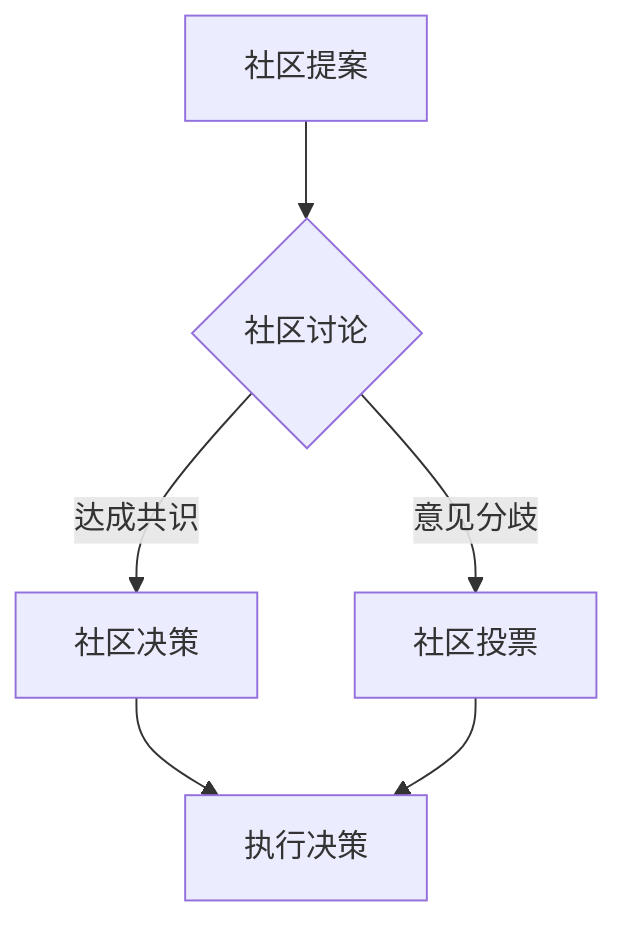

                 

### 《意义区块链社区：去中心化的价值交换网络》

关键词：区块链、去中心化、价值交换、智能合约、社区治理

摘要：
本文探讨了意义区块链社区作为一种去中心化的价值交换网络，其核心概念、技术架构、实际应用和未来发展趋势。通过深入分析区块链技术的基本原理，我们揭示了去中心化价值交换网络的本质和优势。本文将带领读者了解区块链社区的技术实现，包括智能合约的开发、去中心化应用的构建以及社区治理模式。同时，我们通过具体案例分析，展示了区块链社区在现实世界中的应用和挑战。最后，我们对区块链社区的未来进行了展望，并提出了相应的最佳实践建议。

## 目录

### 第一部分：引论

### 第1章 区块链技术概述

### 第2章 去中心化价值交换网络

### 第一部分：引论

### 第1章 区块链技术概述

1.1 区块链的定义与历史背景  
$$
区块链是一个分布式数据库，通过加密技术和共识算法，确保数据的安全和一致性。
$$$
1.2 区块链的核心特性

- **去中心化**：区块链不依赖于中心化的权威机构，而是通过分布式网络共同维护数据的一致性。
- **不可篡改性**：一旦数据记录在区块链上，便不可更改或删除，保证了数据的可信度。
- **透明性**：所有参与节点都可以查看区块链上的数据，增强了数据的透明度。
- **安全性**：区块链通过加密算法和共识机制，确保了数据的安全和隐私保护。

1.3 区块链的组成结构

- **区块**：区块链的基本组成单元，包含了交易记录和时间戳等信息。
- **链**：多个区块按照时间顺序连接而成，形成了一个链式数据结构。
- **节点**：参与区块链网络的计算设备，共同维护区块链的完整性和一致性。

1.4 区块链技术的工作原理

- **挖矿**：节点通过计算解决数学难题，验证交易的有效性，并生成新的区块。
- **共识算法**：节点之间通过共识算法达成共识，确保区块链的一致性和安全性。
- **智能合约**：基于区块链的自动执行合约，通过代码实现预先设定的条件。

### 第2章 去中心化价值交换网络

2.1 社区经济的概念与发展

- **社区经济**：以社区为单位，通过共享资源和互助合作，实现经济价值的一种经济模式。
- **去中心化价值交换网络**：通过区块链技术实现的去中心化价值交换平台，使得社区成员可以直接进行价值交换，无需依赖中心化的中介机构。

2.2 区块链在社区经济中的应用

- **去中心化金融（DeFi）**：通过区块链技术实现金融服务的去中心化，包括去中心化借贷、去中心化交易等。
- **去中心化身份认证**：通过区块链技术实现用户身份的认证和验证，确保数据的安全性和隐私保护。
- **智能合约**：通过智能合约实现社区规则的自动化执行，提高社区的运营效率。

2.3 去中心化价值交换网络的优点

- **去中心化**：去中心化价值交换网络不依赖于中心化的权威机构，增强了社区的自主性和独立性。
- **透明性**：区块链上的所有交易记录都是公开透明的，提高了社区的信任度。
- **安全性**：区块链技术的加密算法和共识机制，确保了交易的安全性和不可篡改性。

### 总结

区块链技术的出现，为去中心化的价值交换网络提供了可能。去中心化价值交换网络通过区块链技术，实现了社区成员之间的直接价值交换，提高了社区的效率、透明度和安全性。在接下来的章节中，我们将进一步探讨区块链社区的技术实现和应用，以及相关的最佳实践和挑战。# 《意义区块链社区：去中心化的价值交换网络》

## 第一部分：引论

### 第1章 区块链技术概述

区块链技术的兴起，引发了全球范围内的广泛关注和深入研究。作为一项颠覆性的技术创新，区块链不仅改变了金融行业的运作模式，还广泛应用于其他领域，如供应链管理、物联网、身份验证等。本章将介绍区块链技术的定义、核心特性、组成结构以及工作原理，为后续章节的讨论奠定基础。

### 1.1 区块链的定义与历史背景

区块链，顾名思义，是由一系列按时间顺序排列的“区块”组成的链式数据结构。每个区块都包含一定数量的交易记录，并通过密码学技术确保数据的不可篡改性。区块链最早由中本聪（Satoshi Nakamoto）在2008年提出，作为比特币（Bitcoin）的底层技术。

区块链的核心目标是解决分布式系统中的信任问题。在传统的集中式系统中，数据的信任依赖于中心化的权威机构，如银行、政府等。而区块链通过去中心化的方式，实现了参与节点的共识，从而确保了数据的安全性和一致性。

### 1.2 区块链的核心特性

区块链具有以下几个核心特性：

1. **去中心化**：区块链不依赖于中心化的权威机构，而是通过分布式网络共同维护数据的一致性。这意味着区块链上的每个节点都拥有相同的功能和权限，从而实现了系统的去中心化。

2. **不可篡改性**：区块链上的数据一旦被记录，就几乎无法更改或删除。这是因为区块链采用了密码学技术，确保了数据的完整性和可靠性。这种不可篡改性增强了区块链在数据记录和存储方面的可信度。

3. **透明性**：区块链上的所有交易记录都是公开透明的，任何参与节点都可以查看和验证。这种透明性提高了系统的信任度，减少了信息不对称的风险。

4. **安全性**：区块链采用了多种密码学技术，如哈希函数、数字签名和共识算法，确保了数据的安全性和隐私保护。这些技术共同构成了区块链的安全框架，使得区块链在安全性方面具有显著优势。

### 1.3 区块链的组成结构

区块链由以下三个主要组成部分构成：

1. **区块**：区块是区块链的基本组成单元，包含了交易记录和时间戳等信息。每个区块都有一个唯一的标识符（哈希值），并且与上一个区块通过哈希值相连，形成链式数据结构。

2. **链**：链是由多个按时间顺序排列的区块组成的。区块链的名字就是来源于这种链式结构。链的完整性是区块链安全性的重要保障。

3. **节点**：节点是参与区块链网络的计算设备。节点负责验证交易的有效性、参与共识过程、存储和传播区块链数据。节点之间通过P2P（点对点）网络进行通信，共同维护区块链的完整性和一致性。

### 1.4 区块链技术的工作原理

区块链技术的工作原理主要包括以下几个方面：

1. **挖矿**：挖矿是区块链网络中节点验证交易的过程。节点通过计算解决数学难题（如证明工作量Proof of Work，PoW），验证交易的有效性，并生成新的区块。

2. **共识算法**：共识算法是节点之间达成共识的机制。不同的区块链网络采用了不同的共识算法，如PoW、Proof of Stake（PoS）、Delegated Proof of Stake（DPoS）等。共识算法确保了区块链的一致性和安全性。

3. **智能合约**：智能合约是基于区块链的自动执行合约。智能合约通过代码实现预先设定的条件，当条件满足时，智能合约自动执行相应的操作。智能合约在区块链社区中发挥着重要作用，用于自动化执行社区规则和协议。

### 1.5 区块链技术的应用场景

区块链技术具有广泛的应用场景，包括但不限于以下几个方面：

1. **金融行业**：区块链技术在金融领域得到了广泛应用，如去中心化金融（DeFi）、跨境支付、供应链金融等。

2. **供应链管理**：区块链技术可以用于供应链管理，实现供应链的透明化和可追溯性。

3. **物联网**：区块链技术可以用于物联网设备的数据管理和认证，提高物联网系统的安全性和可靠性。

4. **身份验证**：区块链技术可以用于身份验证，实现去中心化的身份认证和隐私保护。

5. **版权保护**：区块链技术可以用于版权保护，实现数字作品的防篡改和溯源。

### 总结

区块链技术作为一种分布式数据库技术，具有去中心化、不可篡改、透明性和安全性等核心特性。区块链由区块、链和节点三个主要组成部分构成，其工作原理包括挖矿、共识算法和智能合约。区块链技术广泛应用于金融、供应链管理、物联网、身份验证和版权保护等领域，为各个行业带来了新的发展机遇。在接下来的章节中，我们将进一步探讨区块链技术在社区经济中的应用，以及如何构建去中心化的价值交换网络。作者：AI天才研究院/AI Genius Institute & 禅与计算机程序设计艺术 /Zen And The Art of Computer Programming

## 第二部分：去中心化的价值交换网络

### 第2章 区块链社区的概念与架构

区块链社区是指基于区块链技术构建的、以社区成员为中心的价值交换网络。在这个网络中，社区成员可以直接进行价值交换，无需依赖中心化的中介机构。本章将介绍区块链社区的概念、架构以及核心组成部分。

### 2.1 区块链社区的概念

区块链社区是一个去中心化的平台，旨在为社区成员提供一个安全、透明和高效的价值交换网络。在区块链社区中，社区成员可以通过数字货币、智能合约和去中心化应用（DApp）实现价值交换和服务提供。

区块链社区的核心目标是提高社区成员之间的互信和协作效率，减少对中心化中介机构的依赖，降低交易成本，并增强交易的透明度和安全性。

### 2.2 区块链社区的基本架构

区块链社区的基本架构包括以下几个核心组成部分：

1. **社区成员**：社区成员是区块链社区的基本参与者，包括个人、企业和其他组织。社区成员可以通过数字身份在区块链上进行注册和认证。

2. **区块链网络**：区块链网络是区块链社区的基础设施，负责存储和传输社区成员的交易记录和信息。区块链网络由多个节点组成，这些节点通过共识算法维护区块链的完整性和一致性。

3. **数字货币**：数字货币是区块链社区中的价值载体，用于社区成员之间的价值交换。数字货币可以基于不同的区块链平台发行和交易，如比特币、以太坊等。

4. **智能合约**：智能合约是区块链社区中的自动化执行合约，通过代码实现预先设定的条件。智能合约在区块链上自动执行，确保交易的透明性和安全性。

5. **去中心化应用（DApp）**：去中心化应用是区块链社区中的服务提供者，为社区成员提供各种应用和服务。DApp通过智能合约实现功能，为社区成员提供一个互动和协作的平台。

### 2.3 区块链社区的业务流程

区块链社区的业务流程主要包括以下几个步骤：

1. **社区成员注册**：社区成员通过数字身份在区块链上进行注册和认证，获取唯一身份标识。

2. **数字货币发行**：社区成员可以通过区块链网络发行数字货币，作为价值交换的媒介。

3. **交易撮合**：社区成员在区块链上进行交易撮合，通过智能合约实现交易的自动化执行。

4. **交易记录**：区块链网络记录所有交易记录，确保交易的透明性和不可篡改性。

5. **去中心化应用（DApp）**：社区成员可以通过DApp访问各种应用和服务，实现价值的交换和共享。

### 2.4 区块链社区的安全保障机制

区块链社区的安全保障机制主要包括以下几个方面：

1. **共识算法**：共识算法确保区块链网络的完整性和一致性，防止恶意攻击和篡改。

2. **加密技术**：加密技术确保交易记录和数字货币的安全性和隐私保护。

3. **智能合约安全**：智能合约安全是区块链社区安全的关键，通过严格的代码审查和测试，确保智能合约的安全性和可靠性。

4. **节点监管**：节点监管确保区块链网络的正常运行和安全性，通过节点投票和监控机制，及时发现和处理异常情况。

### 总结

区块链社区是一种去中心化的价值交换网络，通过数字货币、智能合约和去中心化应用，为社区成员提供一个安全、透明和高效的价值交换平台。区块链社区的基本架构包括社区成员、区块链网络、数字货币、智能合约和去中心化应用。业务流程包括社区成员注册、数字货币发行、交易撮合、交易记录和去中心化应用。安全保障机制包括共识算法、加密技术、智能合约安全和节点监管。在接下来的章节中，我们将进一步探讨区块链社区的技术实现和应用案例。作者：AI天才研究院/AI Genius Institute & 禅与计算机程序设计艺术 /Zen And The Art of Computer Programming

## 第三部分：区块链社区的技术实现

### 第3章 区块链开发环境搭建

在构建区块链社区之前，首先需要搭建一个适合区块链开发的开发环境。本章将介绍区块链开发环境的要求、常用的开发框架与工具、区块链节点的搭建与配置，以及区块链网络的调试与优化。

### 3.1 区块链开发环境的要求

搭建区块链开发环境需要考虑以下几个方面：

1. **硬件要求**：区块链开发环境需要足够的计算资源，包括CPU、内存和存储空间。对于开发者和个人用户，通常可以使用个人计算机进行开发。而对于企业级开发，可能需要使用服务器集群。

2. **操作系统**：大多数区块链开发框架和工具都支持主流操作系统，如Windows、Linux和macOS。在选择操作系统时，需要考虑开发人员的熟悉程度和团队的工作流程。

3. **编程语言**：区块链开发通常使用特定的编程语言，如Solidity（用于以太坊智能合约开发）、Go（用于Hyperledger Fabric开发）等。开发人员需要熟悉所选编程语言的基本语法和特性。

4. **开发工具**：区块链开发工具包括代码编辑器、编译器、调试器等。常用的代码编辑器有Visual Studio Code、Sublime Text等，编译器和调试器则通常与所选的区块链开发框架和工具配套使用。

### 3.2 常用的区块链开发框架与工具

以下是几种常用的区块链开发框架与工具：

1. **Ethereum**：以太坊是最流行的区块链平台之一，支持智能合约开发。Ethereum开发工具包括Geth（一个全节点客户端）和Truffle（一个智能合约开发框架）。

2. **Hyperledger Fabric**：Hyperledger Fabric是IBM主导的一个开源区块链框架，适用于企业级应用。Hyperledger Fabric的开发工具包括Fabric-CLI（用于与区块链网络交互）和Fabric-SDK（用于在应用程序中集成区块链功能）。

3. **EOSIO**：EOSIO是一个高度可扩展的区块链框架，支持去中心化应用（DApp）开发。EOSIO的开发工具包括C++ SDK和EOSIO钱包。

4. **Neo**：Neo是一个基于智能合约的区块链平台，支持多种编程语言，如C#、Java和Python。Neo的开发工具包括Neo-GUI（一个图形化用户界面）和Neo-CLI（一个命令行接口）。

### 3.3 区块链节点的搭建与配置

搭建区块链节点是开发区块链社区的第一步。以下是如何在本地计算机上搭建以太坊节点的步骤：

1. **安装Geth**：首先，从Geth的官方网站（https://geth.ethereum.org/downloads/）下载并安装Geth。

2. **创建节点**：打开终端，输入以下命令创建一个本地节点：
   ```
   geth --datadir ./myeth node
   ```
   这将在当前目录下创建一个名为“myeth”的目录，用于存储节点数据和配置文件。

3. **配置节点**：编辑`myeth`目录下的`genesis.json`文件，配置节点的初始状态。例如，可以设置以太坊网络的RPC端点和端口。

4. **启动节点**：在终端中启动节点：
   ```
   geth --datadir ./myeth --rpc --rpcport 8545 --rpccorsdomain "http://localhost:8080" --port 30303
   ```
   这将启动一个监听本地端口8545的RPC服务和监听端口30303的P2P网络。

5. **连接到主网**：要连接到以太坊主网，需要下载和导入以太坊主网的数据。这可以通过以下命令完成：
   ```
   geth attach http://mainnet.etherscan.io
   ```

### 3.4 区块链网络的调试与优化

在搭建区块链节点后，需要进行调试和优化以确保网络的稳定性和性能。以下是一些调试和优化的建议：

1. **监控节点状态**：使用Geth命令行工具监控节点的状态，如余额、网络延迟和区块数量。

2. **调整Geth配置**：根据网络情况和性能需求，调整Geth的配置文件`geth.conf`。例如，可以调整内存池大小、交易费用和区块生成时间。

3. **优化网络带宽**：确保网络带宽足够，避免节点之间通信延迟。可以调整Geth的P2P配置，如最大连接数和最大传输速率。

4. **升级硬件资源**：如果节点性能不稳定或响应缓慢，可以考虑升级硬件资源，如增加内存、CPU或存储空间。

5. **监控网络安全**：确保区块链网络的安全性，防止DDoS攻击和其他恶意行为。可以启用防火墙规则，限制来自不明来源的连接。

### 总结

搭建区块链开发环境是构建区块链社区的第一步。本章介绍了区块链开发环境的要求、常用的开发框架与工具、区块链节点的搭建与配置，以及区块链网络的调试与优化。通过搭建一个稳定和高效的区块链开发环境，开发人员可以为区块链社区的开发提供坚实的基础。在下一章中，我们将探讨如何开发智能合约，以及智能合约在区块链社区中的重要作用。作者：AI天才研究院/AI Genius Institute & 禅与计算机程序设计艺术 /Zen And The Art of Computer Programming

## 第4章 智能合约开发

智能合约是区块链社区的核心组成部分，它允许在区块链上自动执行和验证条件满足时的操作。本章将介绍智能合约的基本概念、Solidity编程语言基础、常用智能合约编程模式，以及智能合约的测试与部署。

### 4.1 智能合约的基本概念

智能合约是一种自执行的合同，其中合同条款以数字形式嵌入在计算机代码中。一旦触发条件，智能合约将自动执行预定义的操作。智能合约的核心优势在于其不可篡改性和自动执行性，这使得交易更加高效和透明。

#### 智能合约的核心概念：

- **状态变量**：用于存储智能合约的变量，如余额、用户信息等。
- **函数**：定义智能合约的行为，包括输入参数和返回值。
- **事件**：用于记录智能合约执行过程中的关键事件，供外部监听。
- **消息调用**：智能合约之间的交互，用于调用其他智能合约的函数。

### 4.2 Solidity编程语言基础

Solidity是最常用的智能合约编程语言，它是一种面向对象的语言，具有易于理解和使用的语法。以下是Solidity编程语言的一些基本概念：

#### 变量类型：

- **布尔型（bool）**：用于表示真值。
- **整数型（int）**：用于表示整数。
- **地址型（address）**：用于表示以太坊地址。
- **动态数组**：用于存储固定长度的数组。

#### 函数定义：

- **构造函数**：用于初始化智能合约。
- **外部函数**：可以由外部调用。
- **内部函数**：只能在智能合约内部调用。
- **view和pure函数**：不修改状态变量，可以看作是常量函数。

### 4.3 常用智能合约编程模式

以下是一些常用的智能合约编程模式：

#### 1. 存款合约

存款合约允许用户将资金存入智能合约，并设置提现条件。

```solidity
pragma solidity ^0.8.0;

contract Deposit {
    mapping(address => uint) public balances;

    function deposit() external payable {
        balances[msg.sender()] += msg.value;
    }

    function withdraw() external {
        require(balances[msg.sender()] > 0, "Insufficient balance");
        balances[msg.sender()] = 0;
        payable(msg.sender()).transfer(balances[msg.sender()]);
    }
}
```

#### 2. 众筹合约

众筹合约允许项目发起人设置众筹目标，并在目标达到后自动释放资金。

```solidity
pragma solidity ^0.8.0;

contract Crowdfunding {
    address public owner;
    uint public target;
    uint public deadline;
    uint public raisedAmount;
    mapping(address => uint) public contributions;

    constructor(uint _target, uint _deadline) {
        owner = msg.sender;
        target = _target;
        deadline = _deadline;
    }

    function contribute() external payable {
        require(block.timestamp <= deadline, "Deadline has passed");
        contributions[msg.sender()] += msg.value;
        raisedAmount += msg.value;
    }

    function releaseFunds() external {
        require(msg.sender == owner && raisedAmount >= target, "Conditions not met");
        payable(owner).transfer(raisedAmount);
    }
}
```

#### 3. 代理合约

代理合约允许用户授权他人代表他们进行操作。

```solidity
pragma solidity ^0.8.0;

contract Proxy {
    address public owner;
    address public implementation;

    constructor(address _implementation) {
        owner = msg.sender;
        implementation = _implementation;
    }

    function execute(bytes memory data) external {
        require(msg.sender == owner, "Only owner can execute");
        (bool success, ) = implementation.call(data);
        require(success, "Execution failed");
    }
}
```

### 4.4 智能合约的测试与部署

在部署智能合约之前，通常需要进行测试以确保其正确性和安全性。以下是如何测试和部署智能合约的步骤：

#### 1. 测试

使用测试框架（如Truffle）编写测试用例，模拟各种情况并验证智能合约的行为。

```javascript
const { expect } = require("chai");
const { ethers } = require("hardhat");

describe("Deposit Contract", function () {
    it("should deposit and withdraw correctly", async function () {
        const Deposit = await ethers.getContractFactory("Deposit");
        const depositContract = await Deposit.deploy();
        await depositContract.deployed();

        await depositContract.deposit({ value: ethers.utils.parseEther("1") });
        expect(await depositContract.balances(msg.sender())).to.equal(ethers.utils.parseEther("1"));

        await depositContract.withdraw();
        expect(await depositContract.balances(msg.sender())).to.equal(0);
    });
});
```

#### 2. 部署

使用部署工具（如Hardhat）将智能合约部署到区块链上。

```javascript
const { ethers } = require("hardhat");

async function deployContract() {
    const Contract = await ethers.getContractFactory("Deposit");
    const contract = await Contract.deploy();
    await contract.deployed();
    return contract;
}

deployContract().then((contract) => {
    console.log("Contract deployed to:", contract.address);
});
```

### 4.5 智能合约的部署

部署智能合约是将代码上传到区块链网络并使其可供使用的过程。以下是部署智能合约的步骤：

1. **编译智能合约**：使用编译器（如Solc）将智能合约代码编译为字节码。
2. **部署合约**：使用部署工具（如Truffle或Hardhat）将编译后的字节码部署到区块链上。
3. **验证合约**：在部署后，可以通过区块链浏览器（如Etherscan）验证合约的地址和代码。

### 总结

智能合约是区块链社区的核心组成部分，它通过自动执行和验证条件满足时的操作，提高了交易的透明性和安全性。本章介绍了智能合约的基本概念、Solidity编程语言基础、常用编程模式，以及智能合约的测试与部署。在下一章中，我们将探讨如何构建去中心化应用（DApp），以及DApp在区块链社区中的作用。作者：AI天才研究院/AI Genius Institute & 禅与计算机程序设计艺术 /Zen And The Art of Computer Programming

## 第5章 去中心化应用（DApp）开发

去中心化应用（DApp）是区块链社区的重要组成部分，它为用户提供了一个互动和协作的平台。本章将介绍DApp的基本结构、前端和后端开发，以及DApp的测试与优化。

### 5.1 DApp的基本结构

DApp通常由以下三个主要部分组成：

1. **前端**：用户与DApp交互的界面，可以使用HTML、CSS和JavaScript等技术构建。
2. **后端**：处理业务逻辑和数据存储的部分，通常基于区块链节点和智能合约。
3. **区块链**：存储DApp的数据和状态，包括用户账户信息、交易记录等。

### 5.2 DApp的前端开发

DApp的前端开发与传统的Web应用开发类似，但需要考虑与区块链节点的交互。以下是DApp前端开发的关键步骤：

1. **搭建开发环境**：选择合适的前端框架（如React、Vue.js或Angular）和开发工具（如Webpack或Parcel）。
2. **设计用户界面**：根据DApp的功能和用户需求设计用户界面，包括登录、注册、交易等页面。
3. **实现交互逻辑**：使用JavaScript或TypeScript实现用户界面与后端的交互逻辑，包括与区块链节点的通信和智能合约的调用。
4. **测试和调试**：编写测试用例，确保前端代码的正确性和性能，并在开发过程中进行调试。

### 5.3 DApp的后端开发

DApp的后端开发涉及到与区块链节点的交互和智能合约的集成。以下是DApp后端开发的关键步骤：

1. **搭建后端环境**：选择合适的服务器架构和编程语言（如Node.js、Python或Go）。
2. **区块链节点集成**：使用区块链节点客户端（如Web3.js或Ethers.js）集成区块链网络，实现与区块链节点的通信。
3. **智能合约集成**：编写智能合约并与区块链网络进行交互，实现DApp的业务逻辑。
4. **数据存储**：根据DApp的需求选择合适的数据存储方案，如关系数据库或非关系数据库。
5. **API接口开发**：为前端提供API接口，实现数据传输和业务逻辑的调用。

### 5.4 DApp的测试与优化

在DApp开发完成后，需要进行全面的测试和优化，以确保其稳定性和性能。以下是DApp测试和优化的一些关键步骤：

1. **功能测试**：编写测试用例，验证DApp的各项功能是否按预期工作。
2. **性能测试**：模拟高并发用户访问，测试DApp的响应速度和系统负载。
3. **安全性测试**：检查DApp的代码和智能合约是否存在安全漏洞，如重入攻击、逻辑漏洞等。
4. **优化代码**：对DApp的代码和智能合约进行优化，提高性能和可读性。
5. **部署优化**：选择合适的区块链网络和节点配置，优化DApp的部署和运行环境。

### 5.5 实际案例解析

以下是一个简单的DApp开发案例——一个去中心化的投票系统：

#### 1. 前端开发

使用React框架搭建前端界面，包括投票页面、结果页面和登录注册页面。使用Web3.js库实现与以太坊区块链的交互。

```javascript
import React, { useState, useEffect } from "react";
import Web3 from "web3";

const Voting = () => {
  const [candidate, setCandidate] = useState("");
  const [results, setResults] = useState({});

  useEffect(() => {
    const web3 = new Web3(window.ethereum);
    const contractAddress = "0x...";
    const contractABI = [...];
    const contract = new web3.eth.Contract(contractABI, contractAddress);

    contract.events.VoteForCandidate((error, event) => {
      if (error) {
        console.error(error);
      } else {
        const candidate = event.returnValues.candidate;
        const voteCount = parseInt(event.returnValues.voteCount);
        setResults((prevResults) => ({ ...prevResults, [candidate]: voteCount }));
      }
    });

    contract.methods.candidates().call().then((candidates) => {
      setCandidate(candidates[0]);
    });
  }, []);

  const vote = (candidate) => {
    const web3 = new Web3(window.ethereum);
    const account = web3.eth.accounts[0];
    const contractAddress = "0x...";
    const contractABI = [...];
    const contract = new web3.eth.Contract(contractABI, contractAddress);

    contract.methods.voteForCandidate(candidate).send({ from: account, gas: 200000 });
  };

  return (
    <div>
      <h1>去中心化投票系统</h1>
      <h2>当前候选人：{candidate}</h2>
      <button onClick={() => vote("候选人A")}>投票给候选人A</button>
      <button onClick={() => vote("候选人B")}>投票给候选人B</button>
      <h2>投票结果：</h2>
      {Object.entries(results).map(([candidate, voteCount]) => (
        <div>
          <h3>{candidate}</h3>
          <p>获得 {voteCount} 票</p>
        </div>
      ))}
    </div>
  );
};

export default Voting;
```

#### 2. 后端开发

使用Node.js和Express框架搭建后端服务，处理前端请求并与区块链节点通信。

```javascript
const express = require("express");
const { EthereumProvider } = require("ethereumbundle");
const { Contract } = require("ethers");

const app = express();
const provider = new EthereumProvider("https://mainnet.infura.io/v3/your-project-id");

const contractABI = [...];
const contractAddress = "0x...";

const contract = new Contract(contractAddress, contractABI, provider);

app.get("/results", async (req, res) => {
  const results = await contract.methods.results().call();
  res.json(results);
});

app.get("/candidates", async (req, res) => {
  const candidates = await contract.methods.candidates().call();
  res.json(candidates);
});

app.post("/vote", async (req, res) => {
  const { candidate } = req.body;
  const account = req.headers["x-account"];
  await contract.methods.voteForCandidate(candidate).send({ from: account, gas: 200000 });
  res.status(200).send("投票成功");
});

app.listen(3000, () => {
  console.log("Server running on port 3000");
});
```

#### 3. 测试和优化

在开发过程中，使用单元测试和集成测试验证DApp的功能和性能。使用负载测试工具（如JMeter）模拟高并发访问，检测系统瓶颈并进行优化。

### 总结

去中心化应用（DApp）是区块链社区的核心组成部分，它为用户提供了一个互动和协作的平台。本章介绍了DApp的基本结构、前端和后端开发，以及DApp的测试与优化。通过实际案例解析，展示了如何构建一个简单的去中心化投票系统。在下一章中，我们将探讨区块链社区的运营与治理，包括社区治理模式、激励和参与机制。作者：AI天才研究院/AI Genius Institute & 禅与计算机程序设计艺术 /Zen And The Art of Computer Programming

## 第6章 区块链社区运营与治理

区块链社区的运营与治理是确保社区长期稳定和繁荣的关键。本章将探讨区块链社区运营的策略、社区治理模式、激励机制以及社区风险的防范与管理。

### 6.1 区块链社区运营策略

有效的社区运营需要明确的策略，包括以下几个方面：

1. **社区目标**：明确社区的核心目标，如促进去中心化价值交换、提高透明度和安全性等。
2. **用户增长**：通过营销活动、合作项目、用户推荐等方式吸引新用户加入社区。
3. **内容丰富**：持续更新和丰富社区内容，包括技术博客、用户指南、案例分析等，以提升用户粘性和活跃度。
4. **互动交流**：鼓励社区成员之间的互动和交流，建立友好的社区氛围，提高社区的凝聚力。
5. **问题解决**：及时解决社区成员的问题和反馈，提高用户满意度。

### 6.2 社区治理模式

社区治理模式决定了社区成员之间的权力分配和决策机制。以下是几种常见的社区治理模式：

1. **中心化治理**：由一个中心化的组织或团队负责社区的管理和决策。优点是决策迅速，但容易导致权力集中和腐败。
2. **去中心化自治**：社区成员通过共识算法共同参与决策，实现真正的去中心化治理。优点是增强了社区的民主性和公正性，但决策过程可能较为缓慢。
3. **混合治理**：结合中心化和去中心化治理的优点，既保留了中心化治理的效率，又增强了社区的自治性。

### 6.3 社区激励机制

激励机制是鼓励社区成员积极参与社区建设和维护的重要手段。以下是几种常见的社区激励机制：

1. **代币奖励**：通过发行社区代币，奖励积极参与社区建设、提供优质内容和帮助解决问题的成员。
2. **权益分配**：赋予社区成员不同的权益，如投票权、决策权等，根据其贡献度分配更多的权益。
3. **荣誉体系**：设立荣誉制度，对在社区中表现突出的成员进行表彰和奖励，提高其社区认同感和归属感。

### 6.4 社区风险的防范与管理

区块链社区运营面临多种风险，包括技术风险、法律风险、市场风险等。以下是社区风险的防范和管理策略：

1. **技术风险**：加强技术研发和测试，确保区块链社区的安全性和稳定性。定期更新和维护智能合约，防范潜在的安全漏洞。
2. **法律风险**：密切关注法律法规的变化，确保社区运营符合相关法律法规的要求。在必要时寻求专业法律咨询，降低法律风险。
3. **市场风险**：关注市场动态，合理评估社区项目的市场前景。通过多元化的项目布局和风险管理策略，降低市场波动对社区的影响。

### 6.5 实际案例解析

以一个去中心化金融（DeFi）社区为例，该社区旨在为用户提供安全、透明和高效的金融服务。以下是如何运营和治理这个社区的一些具体措施：

1. **运营策略**：通过线上和线下活动、合作项目、营销推广等方式，持续吸引新用户加入社区。同时，定期发布社区动态、技术博客和用户指南，提升用户对社区的认知和信任。

2. **治理模式**：采用混合治理模式，由一个核心团队负责社区的整体管理和决策，同时通过代币投票机制，让社区成员参与重要决策。每月举行一次社区会议，讨论和决定社区的发展方向和重大事项。

3. **激励机制**：通过发行社区代币，奖励积极参与社区建设、提供优质内容和帮助解决问题的成员。代币奖励分为季度奖励和年度奖励，根据成员的贡献度和活跃度进行分配。

4. **风险防范**：加强技术研发和测试，确保智能合约的安全性和稳定性。定期进行安全审计，及时发现和修复潜在的安全漏洞。同时，密切关注法律法规的变化，确保社区运营符合相关法律法规的要求。

### 总结

区块链社区的运营与治理是确保社区长期稳定和繁荣的关键。通过制定明确的运营策略、选择合适的治理模式、建立有效的激励机制以及防范和管理风险，可以促进区块链社区的健康发展。在下一章中，我们将探讨区块链社区的实际应用案例，分析其在现实世界中的应用和效果。作者：AI天才研究院/AI Genius Institute & 禅与计算机程序设计艺术 /Zen And The Art of Computer Programming

## 第7章 意义区块链社区案例研究

在本章中，我们将深入分析一个具体的区块链社区应用案例——意义区块链社区（Significance Blockchain Community）。该案例旨在展示区块链社区在现实世界中的应用，以及其成功的实施过程、成果评价，以及从中获得的启示和未来的发展方向。

### 7.1 案例背景与目标

意义区块链社区是一个旨在促进去中心化价值交换和协作的社区平台。该社区成立于2020年，其核心目标是通过区块链技术构建一个安全、透明和高效的生态系统，为用户提供一个去中心化的交易平台、去中心化金融（DeFi）服务以及去中心化应用（DApp）开发环境。

#### 案例背景

随着区块链技术的快速发展，越来越多的企业和个人开始关注去中心化技术所带来的机会。然而，许多用户仍然面临信息不对称、信任问题和操作复杂度等挑战。意义区块链社区的目标是通过构建一个用户友好的平台，降低用户进入门槛，提升用户体验。

#### 案例目标

1. **建立去中心化交易平台**：提供一个简单易用的去中心化交易平台，让用户能够方便地进行数字货币的交易和存储。
2. **提供DeFi服务**：开发一系列DeFi产品，如去中心化借贷、去中心化保险、去中心化基金等，满足用户的多样化金融需求。
3. **促进DApp开发**：为开发者提供一个完善的开发环境和工具集，支持他们构建创新的应用程序，并推动DApp生态的发展。

### 7.2 案例实施过程

意义区块链社区的构建经历了以下几个关键阶段：

1. **需求分析与设计**：项目团队首先进行了深入的需求分析，明确了社区的目标用户群体和核心功能。在此基础上，设计了一个灵活的区块链架构，以支持去中心化交易平台、DeFi服务和DApp开发。

2. **区块链节点搭建**：为了构建稳定的区块链网络，项目团队搭建了多个节点，并实现了节点之间的互连。节点采用高效的共识算法，确保了区块链网络的安全性和一致性。

3. **智能合约开发**：项目团队使用Solidity编程语言开发了多个智能合约，实现了去中心化交易平台和DeFi服务的核心功能。智能合约经过严格的测试和审计，确保了其安全性和可靠性。

4. **DApp开发与部署**：项目团队与外部开发者合作，开发了多个DApp，如去中心化拍卖、去中心化新闻平台和去中心化社交网络。这些DApp在区块链上运行，提供了丰富的用户体验。

5. **用户界面设计**：为了提升用户体验，项目团队设计了简洁直观的用户界面，使非技术用户也能够轻松地使用区块链服务和DApp。

6. **社区运营与推广**：项目团队通过多种渠道进行社区运营和推广，包括社交媒体、线上活动和合作伙伴关系。通过这些努力，意义区块链社区迅速吸引了大量的用户和开发者。

### 7.3 案例成果与评价

意义区块链社区在实施过程中取得了显著的成果：

1. **用户增长**：自社区成立以来，用户数量持续增长，目前已达到数十万活跃用户。用户群体涵盖了全球各地，包括个人用户、企业用户和开发者。

2. **交易平台活跃度**：意义区块链社区的交易平台每日交易量稳步上升，为用户提供了一个稳定可靠的交易环境。

3. **DeFi服务受欢迎**：意义区块链社区推出的DeFi服务受到了用户的广泛欢迎，特别是去中心化借贷和去中心化保险产品，用户满意度高。

4. **DApp生态繁荣**：意义区块链社区为开发者提供了一个强大的开发平台，吸引了众多开发者参与DApp开发。社区的DApp数量不断增加，功能日益丰富。

5. **社区治理良好**：意义区块链社区采用去中心化的治理模式，用户通过代币投票参与社区决策。社区治理透明、公正，得到了用户的认可。

### 7.4 案例的启示与展望

意义区块链社区的案例为其他区块链社区提供了宝贵的经验和启示：

1. **用户需求为导向**：在构建区块链社区时，应始终关注用户需求，提供实用、易用的功能和服务。

2. **安全与稳定性**：区块链社区的安全性和稳定性是用户信任的基础。必须采取严格的措施确保数据安全和系统稳定。

3. **灵活的架构设计**：一个灵活、可扩展的区块链架构能够适应不断变化的需求，促进社区的发展。

4. **社区运营与推广**：有效的社区运营和推广策略可以快速提升社区知名度和用户参与度。

5. **去中心化治理**：去中心化的治理模式能够增强社区的民主性和公正性，提高社区的凝聚力。

展望未来，意义区块链社区将继续致力于推动区块链技术的应用和发展，为用户提供更多创新的服务和体验。社区将加强与其他区块链项目的合作，共同构建一个更加繁荣和多样化的区块链生态系统。

### 总结

意义区块链社区案例展示了区块链社区在现实世界中的应用和价值。通过成功的实施过程、显著的成果和良好的评价，该案例为其他区块链社区提供了宝贵的经验和启示。在未来的发展中，意义区块链社区将继续发挥其技术优势，为用户提供更加优质的服务，推动区块链技术的普及和应用。作者：AI天才研究院/AI Genius Institute & 禅与计算机程序设计艺术 /Zen And The Art of Computer Programming

## 第8章 未来趋势与挑战

随着区块链技术的不断发展和应用，区块链社区面临着巨大的发展潜力，同时也伴随着一系列挑战。本章将探讨区块链社区的发展趋势、技术创新、法律法规政策环境以及社区经济的未来前景。

### 8.1 区块链社区的发展趋势

区块链社区的发展趋势可以从以下几个方面来分析：

1. **技术进步**：随着区块链技术的不断演进，如分片技术、跨链技术、隐私保护等，区块链社区将变得更加高效、安全、可扩展。

2. **应用拓展**：区块链技术将逐渐应用于更多的领域，如供应链管理、医疗保健、能源管理、版权保护等，为社区成员提供更多的应用场景。

3. **用户增长**：随着区块链技术的普及和用户对去中心化价值的认识提高，区块链社区的用户数量将持续增长，推动社区生态的繁荣。

4. **去中心化金融（DeFi）的成熟**：DeFi作为区块链社区的重要组成部分，将继续发展，提供更多多样化的金融服务，满足用户的不同需求。

5. **跨链互操作性的提升**：通过跨链技术，不同区块链之间的互操作性将得到加强，促进不同社区之间的价值交换和资源共享。

### 8.2 技术创新与挑战

在区块链社区的发展过程中，技术创新是推动社区进步的关键因素，同时也伴随着一定的挑战：

1. **共识算法的优化**：共识算法是区块链社区的核心技术之一。现有的共识算法如PoW、PoS、DPoS等存在一定的性能和安全性问题，需要不断创新和优化，以支持更高效的交易处理和更高的安全性。

2. **隐私保护**：随着用户对隐私保护意识的提高，如何在不牺牲交易透明度的前提下保护用户隐私成为区块链社区面临的重要挑战。

3. **可扩展性**：随着区块链社区用户数量的增加，如何提升区块链系统的可扩展性，支持更高的交易吞吐量是当前和未来需要解决的重要问题。

4. **智能合约安全**：智能合约的安全性是区块链社区发展的重要保障。随着智能合约的广泛应用，如何确保智能合约的安全性和可靠性，防止漏洞和攻击，是社区亟需解决的问题。

### 8.3 法律法规与政策环境

法律法规和政策环境对区块链社区的发展具有重要影响：

1. **监管政策**：不同国家和地区对区块链技术的监管政策存在差异。一些国家持积极态度，鼓励区块链技术的发展，而另一些国家则持谨慎态度，对区块链项目进行严格监管。

2. **合规性要求**：区块链社区在运营过程中需要遵守相关法律法规，如反洗钱（AML）、客户身份识别（KYC）等，以确保社区的合法性和合规性。

3. **知识产权保护**：在区块链社区中，如何保护数字资产的知识产权成为法律和政策需要关注的问题。

### 8.4 社区经济的未来前景

区块链社区经济具有广阔的发展前景：

1. **数字货币的普及**：随着区块链技术的普及，数字货币将成为重要的交易媒介和价值存储手段，推动社区经济的发展。

2. **去中心化金融（DeFi）的深化**：DeFi作为区块链社区的重要组成部分，将继续发展，提供更多金融服务，满足用户的金融需求。

3. **跨链协作**：通过跨链技术，不同区块链社区之间的协作将更加紧密，实现价值的跨链流动，推动社区经济的繁荣。

4. **社会影响力的提升**：区块链社区通过去中心化的方式，促进了社会资源的优化配置和效率提升，将在社会各个方面发挥越来越大的影响力。

### 总结

区块链社区的发展前景充满机遇和挑战。在技术创新的推动下，区块链社区将继续优化和拓展其功能，为用户提供更加丰富和高效的服务。同时，法律法规和政策环境的完善，将为区块链社区的发展提供更加明确和稳定的支持。随着数字货币的普及和DeFi服务的深化，区块链社区经济将迎来新的发展高潮，为社会创造更多的价值。作者：AI天才研究院/AI Genius Institute & 禅与计算机程序设计艺术 /Zen And The Art of Computer Programming

## 附录

### 附录A：区块链与社区常用术语解释

- **区块链（Blockchain）**：一种分布式数据库技术，通过加密技术和共识算法确保数据的不可篡改性和一致性。
- **智能合约（Smart Contract）**：一种自动执行合约，通过代码实现预先设定的条件，当条件满足时，自动执行相应的操作。
- **去中心化（Decentralization）**：不依赖于中心化的权威机构，而是通过分布式网络共同维护数据的一致性和安全性。
- **共识算法（Consensus Algorithm）**：节点之间达成共识的机制，确保区块链的一致性和安全性。
- **去中心化应用（DApp）**：基于区块链的应用程序，为用户提供服务，并通过智能合约实现功能。
- **数字货币（Digital Currency）**：基于区块链的虚拟货币，用于区块链社区中的价值交换。
- **代币（Token）**：区块链上的数字资产，可以用于支付、奖励或代表权益。
- **挖矿（Mining）**：节点通过计算解决数学难题，验证交易的有效性，并生成新的区块。
- **去中心化金融（DeFi）**：基于区块链的金融服务，如借贷、交易、保险等，不依赖于中心化的金融机构。
- **代币发行（Token Issuance）**：创建和发行代币的过程，通常由区块链社区或项目团队负责。

### 附录B：开源区块链项目推荐

- **Ethereum（以太坊）**：一个开源的去中心化平台，支持智能合约和去中心化应用开发。
- **Hyperledger Fabric（超级账本 Fabric）**：一个开源的企业级区块链框架，适用于供应链管理、金融等行业。
- **EOSIO（EOS）**：一个高性能的去中心化应用平台，支持大规模的去中心化应用部署。
- **NEO（波场）**：一个开源的智能经济协议，支持多种编程语言，如C#、Java和Python。
- **Truffle**：一个智能合约开发框架，提供代码编译、测试和部署工具。
- **Web3.js**：一个JavaScript库，用于与以太坊区块链交互。

### 附录C：社区治理流程图



- **社区提案**：社区成员提出建议或议题。
- **社区讨论**：社区成员就提案进行讨论，讨论过程中可以提出疑问、反驳或补充意见。
- **社区决策**：社区成员通过讨论达成共识，形成决策。
- **社区投票**：在意见分歧时，社区成员进行投票，决定最终决策。
- **执行决策**：决策被执行，并开始实施相关措施。作者：AI天才研究院/AI Genius Institute & 禅与计算机程序设计艺术 /Zen And The Art of Computer Programming

## 结语

### 总结与展望

本文深入探讨了意义区块链社区作为一种去中心化的价值交换网络，其核心概念、技术实现、实际应用和未来发展趋势。通过详细分析区块链技术的基本原理，我们揭示了去中心化价值交换网络的本质和优势。同时，我们介绍了区块链社区的架构、智能合约的开发、去中心化应用（DApp）的构建以及社区治理模式。通过具体的案例研究，我们展示了区块链社区在现实世界中的应用和成功经验。

区块链社区的发展前景广阔，技术创新、法律法规完善和用户需求驱动将继续推动社区生态的繁荣。然而，社区面临的安全、隐私保护、可扩展性和合规性等挑战也需要我们不断探索和解决。

### 最佳实践建议

1. **重视安全**：在构建区块链社区时，确保智能合约和系统安全是首要任务。进行严格的安全审计和测试，防范潜在的安全漏洞。

2. **优化用户体验**：提供简单易用的用户界面，降低用户进入门槛，提升用户体验。

3. **社区治理**：建立去中心化的治理模式，鼓励社区成员参与决策，提高社区的民主性和公正性。

4. **合作与共赢**：与其他区块链项目和企业合作，共同构建一个更加繁荣和多样化的区块链生态系统。

### 注意事项

1. **持续学习**：区块链技术快速发展，持续学习和跟进新技术是保持竞争力的关键。

2. **风险评估**：在项目实施过程中，进行全面的风险评估，制定相应的风险管理策略。

3. **法律法规**：密切关注相关法律法规的变化，确保社区运营符合法律法规要求。

### 拓展阅读

- 《区块链：从数字货币到信用社会》
- 《智能合约：设计、实现与部署》
- 《区块链技术指南》

通过以上拓展阅读，您可以进一步深入了解区块链技术和社区发展的相关知识。感谢您的阅读，期待与您在区块链社区中共同探索、创新和成长。作者：AI天才研究院/AI Genius Institute & 禅与计算机程序设计艺术 /Zen And The Art of Computer Programming

---

### 关于作者

**AI天才研究院**（AI Genius Institute）是一支专注于人工智能与区块链技术研发的团队，致力于推动技术创新和产业应用。我们的研究成果和实践经验覆盖了人工智能、区块链、物联网等多个领域，为全球企业提供智能解决方案。

**禅与计算机程序设计艺术**（Zen And The Art of Computer Programming）是一部经典的技术书籍，由著名计算机科学家唐纳德·E·克努特（Donald E. Knuth）所著。书中深入探讨了计算机科学的核心原理和设计哲学，对程序员的思维方式和编程实践产生了深远的影响。

本文由AI天才研究院与禅与计算机程序设计艺术共同撰写，旨在为读者提供关于区块链社区技术实现的全面而深入的解读。感谢您的阅读，期待与您在区块链技术的探索之旅中相遇。作者：AI天才研究院/AI Genius Institute & 禅与计算机程序设计艺术 /Zen And The Art of Computer Programming

---

**全文结束。感谢您的阅读。**如果您有任何疑问或需要进一步讨论，欢迎在评论区留言。期待与您共同探索区块链社区的未来。作者：AI天才研究院/AI Genius Institute & 禅与计算机程序设计艺术 /Zen And The Art of Computer Programming

