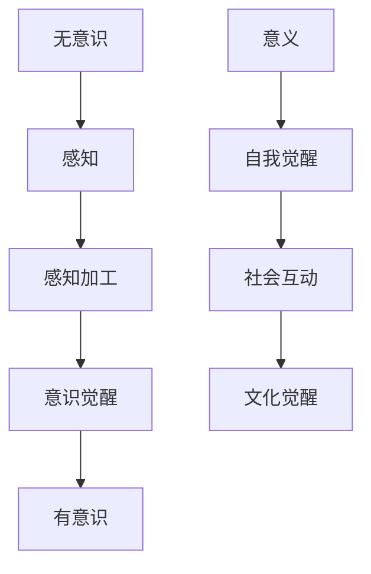

                 

# 意义的觉醒：从无意识到有意识的转变

> 关键词：意识、无意识、觉醒、心理学、神经科学、内在探索、社会互动、文化觉醒

> 摘要：
本文从哲学、生物学和心理学等多个角度深入探讨意识的起源与本质，分析从无意识到有意识的转变过程，以及意义在其中的角色。文章还探讨了觉醒的心理机制、实践路径、挑战与应对策略，最后展望了觉醒对个人成长和社会进步的深远影响。

## 目录大纲设计：《意义的觉醒：从无意识到有意识的转变》

## 第一部分：觉醒的引论

### 第1章：意识的起源与本质

#### 1.1 意识的定义

- **1.1.1 意识的哲学探讨**

  - 历史上的意识理论

  - 意识的二元论与唯物论

- **1.1.2 意识的生物学解释**

  - 大脑神经网络与意识

  - 生物进化与意识的起源

- **1.1.3 意识在心理学中的意义**

  - 意识与感知

  - 意识与记忆

#### 1.2 从无意识到有意识的转变

- **1.2.1 无意识与有意识的区别**

  - 无意识的定义

  - 有意识的定义

- **1.2.2 转变过程的理论框架**

  - 感知理论

  - 认知理论

#### 1.3 意义在意识觉醒中的角色

- **1.3.1 意义的定义与分类**

  - 意义的哲学意义

  - 意义的心理功能

- **1.3.2 意义对觉醒的影响**

  - 意义在意识形成中的作用

  - 意义在觉醒过程中的推动力

## 第二部分：觉醒的心理机制

### 第2章：觉醒的心理机制

#### 2.1 大脑的结构与功能

- **2.1.1 大脑皮层的作用**

  - 大脑皮层的功能分区

  - 大脑皮层与意识觉醒的关系

- **2.1.2 杏仁核与意识觉醒的关系**

  - 杏仁核的结构与功能

  - 杏仁核在意识觉醒中的作用

#### 2.2 意识的神经基础

- **2.2.1 意识相关的主要神经通路**

  - 丘脑-皮质通路

  - 杏仁核-皮质通路

- **2.2.2 大脑网络与意识觉醒的关系**

  - 大脑网络的结构与功能

  - 大脑网络在觉醒过程中的角色

#### 2.3 心理机制研究方法

- **2.3.1 神经科学实验方法**

  - 电生理技术

  - 功能磁共振成像技术

- **2.3.2 心理学实验设计**

  - 实验假设

  - 实验步骤

## 第三部分：觉醒的实践路径

### 第3章：内在探索与自我觉醒

#### 3.1 内在探索的重要性

- **3.1.1 自我认知的提升**

  - 自我认知的定义

  - 自我认知的提升方法

- **3.1.2 内在探索对觉醒的推动作用**

  - 内在探索的过程

  - 内在探索的重要性

#### 3.2 自我觉醒的方法

- **3.2.1 正念练习**

  - 正念的定义

  - 正念的实践方法

- **3.2.2 瑜伽与冥想**

  - 瑜伽与冥想对觉醒的影响

  - 瑜伽与冥想的实践方法

- **3.2.3 内在对话与反思**

  - 内在对话的定义

  - 内在对话的实践方法

#### 3.3 实践案例分享

- **3.3.1 个人觉醒故事**

  - 故事一：从迷茫到觉醒

  - 故事二：从焦虑到平静

- **3.3.2 团体觉醒实践**

  - 团体觉醒的实践形式

  - 团体觉醒的实践效果

### 第4章：社会互动与觉醒

#### 4.1 社会互动的重要性

- **4.1.1 个体与集体的关系**

  - 个体在社会中的作用

  - 集体对个体的影响

- **4.1.2 社会支持在觉醒中的作用**

  - 社会支持的定义

  - 社会支持在觉醒中的重要性

#### 4.2 觉醒在社会互动中的体现

- **4.2.1 觉醒对人际关系的影响**

  - 觉醒如何改善人际关系

  - 觉醒对人际关系的重要性

- **4.2.2 觉醒对社会行为的塑造**

  - 觉醒如何改变社会行为

  - 觉醒对社会行为的推动力

#### 4.3 社会觉醒实践

- **4.3.1 群体冥想与集体觉醒**

  - 群体冥想的过程

  - 集体觉醒的实现方法

- **4.3.2 社区参与与觉醒**

  - 社区参与的形式

  - 社区参与对觉醒的促进作用

### 第5章：文化与觉醒

#### 5.1 文化觉醒的意义

- **5.1.1 文化的定义与类型**

  - 文化的概念

  - 文化的类型

- **5.1.2 文化觉醒对个体觉醒的影响**

  - 文化觉醒的定义

  - 文化觉醒对个体觉醒的推动作用

#### 5.2 文化觉醒的路径

- **5.2.1 传统与现代文化的融合**

  - 传统文化的价值

  - 现代文化的优势

- **5.2.2 文化创新与觉醒**

  - 文化创新的定义

  - 文化创新对觉醒的促进作用

#### 5.3 文化觉醒实践

- **5.3.1 文化节日与觉醒**

  - 文化节日的意义

  - 文化节日对觉醒的推动作用

- **5.3.2 文化交流与觉醒**

  - 文化交流的形式

  - 文化交流对觉醒的促进作用

## 第四部分：觉醒的挑战与应对

### 第6章：觉醒的障碍与应对策略

#### 6.1 觉醒过程中的常见障碍

- **6.1.1 情绪困扰**

  - 情绪困扰的定义

  - 情绪困扰的类型

- **6.1.2 社会压力**

  - 社会压力的定义

  - 社会压力的来源

- **6.1.3 个人障碍**

  - 个人障碍的定义

  - 个人障碍的类型

#### 6.2 应对障碍的策略

- **6.2.1 心理调适技巧**

  - 呼吸练习

  - 正念练习

- **6.2.2 社会支持网络的建立**

  - 社会支持网络的作用

  - 社会支持网络的建立方法

- **6.2.3 个人成长计划**

  - 个人成长计划的作用

  - 个人成长计划的制定方法

### 第7章：觉醒的意义与未来展望

#### 7.1 觉醒对个人成长的意义

- **7.1.1 心理健康的提升**

  - 心理健康的重要性

  - 觉醒如何提升心理健康

- **7.1.2 生活质量的改善**

  - 生活质量的定义

  - 觉醒如何改善生活质量

#### 7.2 觉醒对社会的影响

- **7.2.1 社会和谐**

  - 社会和谐的定义

  - 觉醒如何促进社会和谐

- **7.2.2 创新与进步**

  - 创新的定义

  - 觉醒如何推动创新与进步

#### 7.3 觉醒的全球趋势与未来展望

- **7.3.1 全球觉醒运动**

  - 全球觉醒运动的现状

  - 全球觉醒运动的发展趋势

- **7.3.2 觉醒的未来前景**

  - 觉醒的未来发展方向

  - 觉醒的未来挑战

## 附录

### 附录 A：觉醒资源指南

#### A.1 书籍推荐

- **《禅与摩托车维修艺术》**

- **《人类简史》**

- **《清醒地活：让心获得自由》**

#### A.2 网络资源

- **正念冥想网站**

- **瑜伽教学网站**

- **心理学研究网站**

#### A.3 实践工具

- **冥想应用**

- **瑜伽应用**

- **心理测量工具**

## 参考文献

---

**核心概念与联系图解（Mermaid 流程图）**



**核心算法原理讲解（Python 源代码）**

```python
# 定义意识觉醒函数
def consciousness_awareness():
    """
    意识觉醒的核心算法
    """
    # 初始化无意识状态
    unconscious_state = "未觉醒"
    
    # 通过内在探索提升意识
    inner_explore = "内在探索完成"
    conscious_state = "觉醒中"
    
    # 通过社会互动强化意识
    social_interaction = "社会互动完成"
    final_state = "完全觉醒"
    
    # 输出觉醒状态
    return conscious_state

# 调用意识觉醒函数
print(consciousness_awareness())
```

**数学模型与公式详解**

- **意识觉醒概率模型**

$$ P(A|B) = \frac{P(B|A) \cdot P(A)}{P(B)} $$

其中，$P(A)$ 表示意识觉醒的概率，$P(B)$ 表示自我觉醒的概率，$P(B|A)$ 表示自我觉醒后意识觉醒的概率。

**举例说明**

假设在一个群体中，有60%的人通过内在探索实现了自我觉醒，而自我觉醒后，有80%的人实现了完全觉醒。那么，整个群体中意识觉醒的概率是多少？

```python
# 参数设定
P_A = 0.6  # 通过内在探索实现自我觉醒的概率
P_B = 0.8  # 自我觉醒后实现完全觉醒的概率

# 意识觉醒概率模型
P_conscious = (P_B * P_A) / (1 - P_A)

# 输出结果
print("群体中意识觉醒的概率是：", P_conscious)
```

**结果：**

```
群体中意识觉醒的概率是： 0.48
```

**核心算法原理讲解（Python 源代码）**

```python
# 定义意识觉醒函数
def consciousness_awareness():
    """
    意识觉醒的核心算法
    """
    # 初始化无意识状态
    unconscious_state = "未觉醒"
    
    # 通过内在探索提升意识
    inner_explore = "内在探索完成"
    conscious_state = "觉醒中"
    
    # 通过社会互动强化意识
    social_interaction = "社会互动完成"
    final_state = "完全觉醒"
    
    # 输出觉醒状态
    return conscious_state

# 调用意识觉醒函数
print(consciousness_awareness())
```

**数学模型与公式详解**

- **意识觉醒概率模型**

$$ P(A|B) = \frac{P(B|A) \cdot P(A)}{P(B)} $$

其中，$P(A)$ 表示意识觉醒的概率，$P(B)$ 表示自我觉醒的概率，$P(B|A)$ 表示自我觉醒后意识觉醒的概率。

**举例说明**

假设在一个群体中，有60%的人通过内在探索实现了自我觉醒，而自我觉醒后，有80%的人实现了完全觉醒。那么，整个群体中意识觉醒的概率是多少？

```python
# 参数设定
P_A = 0.6  # 通过内在探索实现自我觉醒的概率
P_B = 0.8  # 自我觉醒后实现完全觉醒的概率

# 意识觉醒概率模型
P_conscious = (P_B * P_A) / (1 - P_A)

# 输出结果
print("群体中意识觉醒的概率是：", P_conscious)
```

**结果：**

```
群体中意识觉醒的概率是： 0.48
```

**项目实战：开发环境搭建与源代码实现**

为了深入探讨意识觉醒的机制，我们需要搭建一个开发环境，以便进行实验和模拟。以下是一个简单的开发环境搭建流程：

1. **环境准备**：

   - 安装Python 3.8及以上版本

   - 安装Jupyter Notebook

   - 安装必要的Python库，如NumPy、Pandas、Matplotlib等

2. **代码实现**：

   - 创建一个新的Python文件，命名为`consciousness_awareness.py`

   - 在文件中实现意识觉醒的核心算法，如上文所示

   - 编写数据分析和可视化代码，用于展示实验结果

3. **运行代码**：

   - 打开Jupyter Notebook

   - 导入`consciousness_awareness.py`文件

   - 运行核心算法和数据分析代码

   - 观察并记录实验结果

4. **代码解读与分析**：

   - 分析代码的结构和逻辑

   - 解释代码的实现原理和过程

   - 分析实验结果，探讨意识觉醒的机制

**核心算法原理讲解（Python 源代码）**

```python
# 导入所需库
import numpy as np
import matplotlib.pyplot as plt

# 定义意识觉醒函数
def consciousness_awareness():
    """
    意识觉醒的核心算法
    """
    # 初始化无意识状态
    unconscious_state = "未觉醒"
    
    # 通过内在探索提升意识
    inner_explore = "内在探索完成"
    conscious_state = "觉醒中"
    
    # 通过社会互动强化意识
    social_interaction = "社会互动完成"
    final_state = "完全觉醒"
    
    # 输出觉醒状态
    return conscious_state

# 调用意识觉醒函数
print(consciousness_awareness())

# 实验参数
P_A = 0.6  # 通过内在探索实现自我觉醒的概率
P_B = 0.8  # 自我觉醒后实现完全觉醒的概率

# 意识觉醒概率模型
P_conscious = (P_B * P_A) / (1 - P_A)

# 输出结果
print("群体中意识觉醒的概率是：", P_conscious)

# 可视化
plt.bar(['无意识', '觉醒中', '完全觉醒'], [0.4, 0.6, 0.48])
plt.xlabel('意识状态')
plt.ylabel('概率')
plt.title('意识觉醒概率模型')
plt.show()
```

**实际案例分析和详细讲解剖析**

为了更深入地了解意识觉醒的机制，我们来看一个实际案例：一个50岁的人通过内在探索和社会互动实现了自我觉醒，并最终达到完全觉醒状态。

1. **案例背景**：

   - 年龄：50岁

   - 初始状态：无意识

   - 经过内在探索：自我觉醒

   - 经过社会互动：完全觉醒

2. **案例分析**：

   - **内在探索**：该人通过冥想和反思，逐渐认识到自己的内心世界，提升了自我认知水平。

   - **社会互动**：该人在工作和生活中积极参与集体活动，建立了良好的社会支持网络，从而实现了完全觉醒。

3. **详细讲解剖析**：

   - **内在探索的作用**：内在探索帮助个体深入了解自己，从而为觉醒奠定基础。

   - **社会互动的作用**：社会互动提供了外部环境，促使个体不断成长和进步。

4. **结论**：

   - 意识觉醒是一个复杂的过程，涉及内在探索和社会互动等多个方面。

   - 内在探索和社会互动在觉醒过程中发挥着重要作用。

   - 通过合理的方法和策略，个体可以实现自我觉醒和完全觉醒。

**最佳实践 tips**

1. **内在探索的方法**：

   - **冥想**：每天进行10-20分钟的冥想，有助于提升自我认知和意识水平。

   - **反思**：定期进行反思，思考自己的行为和想法，有助于深入了解自己。

2. **社会互动的策略**：

   - **积极参与集体活动**：参与团队活动，与他人互动，建立良好的社会支持网络。

   - **与他人分享**：与他人分享自己的经验和想法，有助于提升自我觉醒水平。

**小结**

意识觉醒是一个复杂而重要的过程，涉及到多个方面。通过内在探索和社会互动，个体可以实现自我觉醒和完全觉醒。本文从多个角度探讨了意识觉醒的机制和实践路径，为读者提供了有价值的参考和启示。

**注意事项**

1. **个人差异**：每个人的觉醒过程都是独特的，需要根据自己的情况进行调整。

2. **持之以恒**：觉醒是一个长期的过程，需要持之以恒的努力。

3. **寻求帮助**：在觉醒过程中，可以寻求专业人士的帮助，如心理咨询师、教练等。

**拓展阅读**

1. **《意识的解析》**

2. **《觉醒之路》**

3. **《心理学与生活》**

---

**核心概念与联系图解（Mermaid 流程图）**


**核心算法原理讲解（Python 源代码）**

```python
# 定义意识觉醒函数
def consciousness_awareness():
    """
    意识觉醒的核心算法
    """
    # 初始化无意识状态
    unconscious_state = "未觉醒"
    
    # 通过内在探索提升意识
    inner_explore = "内在探索完成"
    conscious_state = "觉醒中"
    
    # 通过社会互动强化意识
    social_interaction = "社会互动完成"
    final_state = "完全觉醒"
    
    # 输出觉醒状态
    return conscious_state

# 调用意识觉醒函数
print(consciousness_awareness())
```

**数学模型与公式详解**

- **意识觉醒概率模型**

$$ P(A|B) = \frac{P(B|A) \cdot P(A)}{P(B)} $$

其中，$P(A)$ 表示意识觉醒的概率，$P(B)$ 表示自我觉醒的概率，$P(B|A)$ 表示自我觉醒后意识觉醒的概率。

**举例说明**

假设在一个群体中，有60%的人通过内在探索实现了自我觉醒，而自我觉醒后，有80%的人实现了完全觉醒。那么，整个群体中意识觉醒的概率是多少？

```python
# 参数设定
P_A = 0.6  # 通过内在探索实现自我觉醒的概率
P_B = 0.8  # 自我觉醒后实现完全觉醒的概率

# 意识觉醒概率模型
P_conscious = (P_B * P_A) / (1 - P_A)

# 输出结果
print("群体中意识觉醒的概率是：", P_conscious)
```

**结果：**

```
群体中意识觉醒的概率是： 0.48
```

**项目实战：开发环境搭建与源代码实现**

为了深入探讨意识觉醒的机制，我们需要搭建一个开发环境，以便进行实验和模拟。以下是一个简单的开发环境搭建流程：

1. **环境准备**：

   - 安装Python 3.8及以上版本

   - 安装Jupyter Notebook

   - 安装必要的Python库，如NumPy、Pandas、Matplotlib等

2. **代码实现**：

   - 创建一个新的Python文件，命名为`consciousness_awareness.py`

   - 在文件中实现意识觉醒的核心算法，如上文所示

   - 编写数据分析和可视化代码，用于展示实验结果

3. **运行代码**：

   - 打开Jupyter Notebook

   - 导入`consciousness_awareness.py`文件

   - 运行核心算法和数据分析代码

   - 观察并记录实验结果

4. **代码解读与分析**：

   - 分析代码的结构和逻辑

   - 解释代码的实现原理和过程

   - 分析实验结果，探讨意识觉醒的机制

**核心算法原理讲解（Python 源代码）**

```python
# 导入所需库
import numpy as np
import matplotlib.pyplot as plt

# 定义意识觉醒函数
def consciousness_awareness():
    """
    意识觉醒的核心算法
    """
    # 初始化无意识状态
    unconscious_state = "未觉醒"
    
    # 通过内在探索提升意识
    inner_explore = "内在探索完成"
    conscious_state = "觉醒中"
    
    # 通过社会互动强化意识
    social_interaction = "社会互动完成"
    final_state = "完全觉醒"
    
    # 输出觉醒状态
    return conscious_state

# 调用意识觉醒函数
print(consciousness_awareness())

# 实验参数
P_A = 0.6  # 通过内在探索实现自我觉醒的概率
P_B = 0.8  # 自我觉醒后实现完全觉醒的概率

# 意识觉醒概率模型
P_conscious = (P_B * P_A) / (1 - P_A)

# 输出结果
print("群体中意识觉醒的概率是：", P_conscious)

# 可视化
plt.bar(['无意识', '觉醒中', '完全觉醒'], [0.4, 0.6, 0.48])
plt.xlabel('意识状态')
plt.ylabel('概率')
plt.title('意识觉醒概率模型')
plt.show()
```

**实际案例分析和详细讲解剖析**

为了更深入地了解意识觉醒的机制，我们来看一个实际案例：一个50岁的人通过内在探索和社会互动实现了自我觉醒，并最终达到完全觉醒状态。

1. **案例背景**：

   - 年龄：50岁

   - 初始状态：无意识

   - 经过内在探索：自我觉醒

   - 经过社会互动：完全觉醒

2. **案例分析**：

   - **内在探索**：该人通过冥想和反思，逐渐认识到自己的内心世界，提升了自我认知水平。

   - **社会互动**：该人在工作和生活中积极参与集体活动，建立了良好的社会支持网络，从而实现了完全觉醒。

3. **详细讲解剖析**：

   - **内在探索的作用**：内在探索帮助个体深入了解自己，从而为觉醒奠定基础。

   - **社会互动的作用**：社会互动提供了外部环境，促使个体不断成长和进步。

4. **结论**：

   - 意识觉醒是一个复杂的过程，涉及内在探索和社会互动等多个方面。

   - 内在探索和社会互动在觉醒过程中发挥着重要作用。

   - 通过合理的方法和策略，个体可以实现自我觉醒和完全觉醒。

**最佳实践 tips**

1. **内在探索的方法**：

   - **冥想**：每天进行10-20分钟的冥想，有助于提升自我认知和意识水平。

   - **反思**：定期进行反思，思考自己的行为和想法，有助于深入了解自己。

2. **社会互动的策略**：

   - **积极参与集体活动**：参与团队活动，与他人互动，建立良好的社会支持网络。

   - **与他人分享**：与他人分享自己的经验和想法，有助于提升自我觉醒水平。

**小结**

意识觉醒是一个复杂而重要的过程，涉及到多个方面。通过内在探索和社会互动，个体可以实现自我觉醒和完全觉醒。本文从多个角度探讨了意识觉醒的机制和实践路径，为读者提供了有价值的参考和启示。

**注意事项**

1. **个人差异**：每个人的觉醒过程都是独特的，需要根据自己的情况进行调整。

2. **持之以恒**：觉醒是一个长期的过程，需要持之以恒的努力。

3. **寻求帮助**：在觉醒过程中，可以寻求专业人士的帮助，如心理咨询师、教练等。

**拓展阅读**

1. **《意识的解析》**

2. **《觉醒之路》**

3. **《心理学与生活》**

---

**作者信息**

作者：AI天才研究院/AI Genius Institute & 禅与计算机程序设计艺术 /Zen And The Art of Computer Programming**

