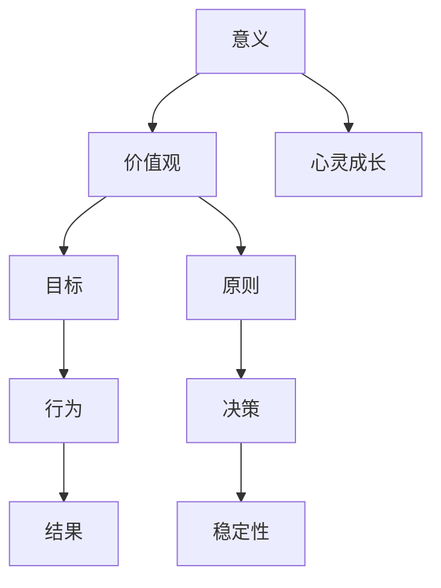

                 

# 引言：意义设计师的背景与重要性

**背景介绍**

在当今快速发展的社会中，人们面临的选择和挑战日益增多，如何在复杂的环境中找到自己的人生方向和目标成为了一大难题。意义设计师应运而生，他们是帮助人们明确生活意义、规划人生目标的专家。意义设计师不仅仅是职业规划师，更是人生目标的导航者，他们通过专业的方法和技巧，引导人们找到自己的内在动力，实现个人成长和社会价值。

**意义设计师的定义**

意义设计师是一类专注于帮助人们理解和实现其生活目标的职业。他们运用心理学、哲学、管理学等多种学科的理论和方法，帮助个人明确自己的价值观、识别自身的潜力，并制定实现这些目标的具体路径。意义设计师的核心职责是帮助客户发现和塑造自己的意义，从而提升生活质量和职业发展。

**意义设计师的角色与价值**

意义设计师在社会中扮演着多重角色。首先，他们是人生的导师，帮助个人在面对职业选择、生活决策时提供专业的建议。其次，他们是组织的管理者，通过设计和实施激励机制，提升团队的工作效率和幸福感。最后，他们还是社会的推动者，通过促进个体和社会的和谐发展，为社会进步贡献力量。

在现代社会中，意义设计师的重要性日益凸显。随着职业的多样化和生活方式的个性化，人们对自我实现和生活质量的追求越来越高。意义设计师通过他们的专业技能，帮助个人明确自己的人生目标，提高生活质量，实现个人价值，从而推动社会的整体进步。

**引言总结**

意义设计师作为新兴职业，正逐渐受到社会的广泛关注和认可。他们通过深入剖析人生目标、运用专业方法和工具，帮助个人找到生活的意义，实现个人成长。在接下来的章节中，我们将进一步探讨意义设计师的核心概念、算法原理、数学模型以及实际应用案例，帮助读者全面了解这一新兴职业，并学会如何成为一名合格的意义设计师。

## 核心概念与联系

在成为一名合格的意义设计师之前，我们需要理解几个核心概念，它们是意义、目标和价值观。这三个概念紧密相连，共同构成了我们规划人生的基础。以下是这三个核心概念的定义以及它们之间的关系架构。

### 意义

意义是指个体在生活中所追求的深层价值感，是对自身存在的一种解释和定义。它不仅仅是个体行为和决策的驱动因素，更是个体心灵成长和精神满足的重要源泉。对意义的理解决定了个体如何看待自己的生活，如何对待面临的挑战和机遇。

### 目标

目标则是实现意义的具体表现形式。它是为了达成某种有意义的结果而设定的具体、可衡量的任务。目标不仅为我们提供了行动的方向，还帮助我们评估自己的进步和成就。有效的目标设定需要遵循SMART原则，即目标应当是具体的（Specific）、可衡量的（Measurable）、可实现的（Achievable）、相关的（Relevant）和时限的（Time-bound）。

### 价值观

价值观是指导我们行为的根本原则和信仰。它反映了我们对事物的重要性和优先级的判断，是我们在面对选择和决策时的指导方针。价值观不仅影响我们设定和追求目标的方式，还塑造了我们的个性和生活方式。一个明确和一致的价值观可以帮助我们在复杂多变的环境中保持方向感和稳定性。

### 概念之间的关系架构

为了更好地理解这些核心概念之间的关系，我们可以使用Mermaid流程图来展示它们之间的联系。



在这个流程图中，我们可以看到：

- **意义**作为起点，通过价值观（B）来影响我们的目标（C），最终决定我们的行为（D）和结果（E）。
- **价值观**不仅是指导我们设定和追求目标的依据，还帮助我们保持心理上的稳定性和决策的连贯性（G、H、I）。
- **目标**作为中间环节，连接了意义（A）和行为（D），是实现意义的具体路径。
- **行为**则直接影响我们的结果（E），而结果又反过来验证目标的实现程度。

### 总结

通过理解意义、目标和价值观这三个核心概念及其相互关系，我们能够更好地进行人生目标的规划和实现。意义设计师在帮助个人规划人生目标时，会首先了解个体的价值观，通过SWOT分析等方法来确定其目标，并指导其将目标转化为具体的行动计划。这样，个体不仅能够找到生活的意义，还能实现个人价值，实现人生目标。

### 核心概念与联系的实例讲解

为了更好地理解这些核心概念及其关系，我们可以通过一个具体的例子来详细阐述。

**案例：小李的职业生涯规划**

**意义：** 小李对教育的热情是他生活的核心意义，他希望通过教育工作来影响和启发年轻一代。

**价值观：** 小李的价值观包括正直、创新和尊重学生。他坚信只有通过正直和创新的方式，才能真正尊重学生的需求和发展。

**目标：** 根据他的意义和价值观，小李设定了一个长期目标：成为一名优秀的教育创新者，并在十年内创立一所以创新教学方法为核心的教育机构。

**行动计划：** 
- **短期目标（1年内）：** 学习先进的教育理念，参加相关的培训课程，积累教育实践经验。
- **中期目标（3-5年内）：** 在一所知名教育机构工作，积累教学和管理经验，开展教育创新项目。
- **长期目标（10年内）：** 创建自己的教育机构，推广创新教学方法，培养更多有创造力的学生。

通过这个例子，我们可以看到小李是如何通过明确的意义、价值观和具体的目标，来规划自己的职业生涯，并最终实现个人价值和意义的。意义设计师在这个过程中起到了关键作用，帮助他们清晰地定义自己的意义，制定可行的目标，并提供必要的支持和指导。

### 总结

核心概念与联系是意义设计师工作的基础。通过理解意义、目标和价值观，意义设计师能够帮助个人明确自己的方向，制定可行的行动计划，从而实现个人成长和生活目标。在下一部分，我们将进一步探讨意义设计师在实践过程中使用的关键算法原理，为读者提供更深入的了解。

## 核心算法原理讲解

作为意义设计师，掌握一系列核心算法原理是至关重要的。这些算法不仅帮助我们理解人生目标设定的科学方法，还能指导我们在实践中如何高效地应用这些方法。以下是几个关键算法原理的详细讲解，包括SWOT分析和SMART目标设定方法。

### SWOT分析

SWOT分析是一种用于评估个人或组织优势（Strengths）、劣势（Weaknesses）、机会（Opportunities）和威胁（Threats）的工具。通过SWOT分析，意义设计师能够帮助客户全面了解自身的内外部环境，从而制定出更合理和可行的人生目标。

**优势（Strengths）：** 指个人或组织在资源、能力、经验等方面的优势。例如，小李在职业生涯规划中的优势可能是他在教育领域的专业知识和丰富的教学经验。

**劣势（Weaknesses）：** 指个人或组织在资源、能力、经验等方面的不足。例如，小李可能在管理能力方面有所欠缺，这可能会成为他实现目标的一个障碍。

**机会（Opportunities）：** 指外部环境中可能带来的积极影响和机会。例如，新兴的教育技术可能会为小李的教育创新项目提供新的发展机遇。

**威胁（Threats）：** 指外部环境中可能带来的负面影响和风险。例如，教育行业的竞争激烈可能会对小李的项目构成威胁。

**SWOT分析步骤与方法：**

1. **确定分析对象：** 首先明确需要分析的个体或组织。
2. **收集信息：** 收集与个体或组织相关的优势、劣势、机会和威胁信息。
3. **构建SWOT矩阵：** 将收集到的信息填入SWOT矩阵中，形成四象限图表。
4. **策略制定：** 根据SWOT矩阵分析结果，制定相应的策略。例如，利用优势抓住机会，弥补劣势，应对威胁。

### SMART目标设定

SMART目标是设定目标时需要遵循的五个原则，即目标应当是具体的（Specific）、可衡量的（Measurable）、可实现的（Achievable）、相关的（Relevant）和时限的（Time-bound）。SMART目标设定方法帮助意义设计师确保目标的清晰性和可执行性。

**具体（Specific）：** 目标应当清晰明确，避免模糊和宽泛。例如，设定“提高销售额”不如设定“增加产品X的销售额10%”。

**可衡量（Measurable）：** 目标应当有具体的衡量标准，便于评估进展和成果。例如，设定“学习新技能”不如设定“掌握Python编程语言的基础知识，并通过在线考试”。

**可实现（Achievable）：** 目标应当是现实可行的，避免设定过高或不切实际的目标。例如，设定“一年内环游世界”不如设定“利用年假，游览国内主要旅游城市”。

**相关（Relevant）：** 目标应当与个人的价值观和长远目标相关联。例如，设定“减肥”不如设定“通过健康饮食和锻炼，达到健康体重目标”。

**时限（Time-bound）：** 目标应当有时间限制，以推动行动和实现。例如，设定“提高效率”不如设定“在未来三个月内，将每日工作完成时间减少30分钟”。

### 结合Python代码实现目标设定

为了更好地理解SMART目标设定方法，我们可以通过Python代码来实现一个简单的目标管理工具。以下是一个示例代码，用于创建和跟踪SMART目标。

```python
class SMARTGoal:
    def __init__(self, description, specific, measurable, achievable, relevant, time_bound):
        self.description = description
        self.specific = specific
        self.measurable = measurable
        self.achievable = achievable
        self.relevant = relevant
        self.time_bound = time_bound
        self.completed = False

    def is_smart(self):
        if not self.specific or not self.measurable or not self.achievable or not self.relevant or not self.time_bound:
            return False
        return True

    def set_as_completed(self):
        self.completed = True
        print(f"{self.description} has been completed!")

# 创建SMART目标实例
goal = SMARTGoal(
    description="学习Python编程",
    specific="掌握Python基础语法和常用库",
    measurable="通过在线考试",
    achievable="每周安排3小时学习",
    relevant="提升编程技能，为未来职业发展做准备",
    time_bound="两个月内"
)

# 检查目标是否遵循SMART原则
if goal.is_smart():
    print("这是一个SMART目标。")
else:
    print("这个目标不符合SMART原则。")

# 目标设定和实现过程
goal.set_as_completed()
```

在这个示例中，`SMARTGoal`类用于创建一个SMART目标，包含目标描述、具体性、可衡量性、可实现性、相关性和时限。`is_smart`方法用于检查目标是否符合SMART原则，`set_as_completed`方法用于标记目标完成。

### 总结

通过SWOT分析和SMART目标设定方法，意义设计师能够帮助客户全面分析自身状况，设定清晰、可行的人生目标，并确保目标的实现。这些算法原理不仅具有理论意义，还能在实际应用中发挥重要作用，帮助人们更好地规划自己的人生道路。在下一部分，我们将进一步探讨数学模型和公式在意义设计中的作用。

## 数学模型和数学公式

在意义设计过程中，数学模型和数学公式扮演着重要的角色，它们帮助我们量化目标、优化方案，从而提高目标设定的科学性和可操作性。以下将介绍几个常见的数学模型和公式，并结合Python代码进行详细讲解，以便读者更好地理解这些模型的应用。

### 目标函数

目标函数是数学优化中的一个核心概念，用于定义我们需要优化或最小化的目标。在人生目标规划中，目标函数可以帮助我们量化目标的实现程度。例如，设定一个目标是在五年内达到一定的财富水平，我们可以使用财富作为目标函数，设定一个目标函数为最大化财富。

**公式：**  
$$\max W$$

其中，\(W\) 表示财富。

**Python实现：**  
```python
def maximize_wealth(years, annual_income, investment_rate):
    wealth = years * annual_income * (1 + investment_rate)
    return wealth

# 示例参数
years = 5
annual_income = 100000
investment_rate = 0.05

# 计算财富
max_wealth = maximize_wealth(years, annual_income, investment_rate)
print(f"五年内最大财富为：{max_wealth}")
```

在这个示例中，我们定义了一个目标函数 `maximize_wealth`，用于计算五年内的最大财富。通过输入每年的收入和投资收益率，我们可以得到最终财富值。

### 优化方法

优化方法是解决数学优化问题的一种策略，用于找到目标函数的最优解。常见的优化方法包括线性规划、非线性规划和动态规划等。在人生目标规划中，优化方法可以帮助我们找到实现目标的最佳路径。

**线性规划（Linear Programming，LP）：**  
线性规划是一种用于解决线性目标函数在线性约束条件下的优化问题。在人生目标规划中，我们可以使用线性规划来确定资源的最优分配。

**公式：**  
$$\max c^T x$$  
$$\text{subject to} \ A x \leq b$$

其中，\(c\) 表示目标函数系数向量，\(x\) 表示变量向量，\(A\) 和 \(b\) 分别表示约束矩阵和约束向量。

**Python实现（使用SciPy库）：**  
```python
from scipy.optimize import linprog

# 定义目标函数和约束条件
c = [-1, -1]  # 最小化成本
A = [[1, 1], [1, 0], [0, 1]]  # 约束矩阵
b = [1000, 5000, 5000]  # 约束向量

# 求解线性规划问题
result = linprog(c, A_eq=A, b_eq=b, method='highs')

# 输出最优解
if result.success:
    print(f"最优解：{result.x}")
else:
    print("无法找到最优解。")
```

在这个示例中，我们使用SciPy库的 `linprog` 函数求解一个线性规划问题，找到最小化成本的最优解。

### 动态规划（Dynamic Programming，DP）：**  
动态规划是一种解决多阶段决策问题的优化方法，适用于需要逐步优化的目标。在人生目标规划中，动态规划可以帮助我们制定长期目标的一系列短期目标。

**公式：**  
$$V_t = \max U_t$$

其中，\(V_t\) 表示第 \(t\) 个阶段的优化值，\(U_t\) 表示第 \(t\) 个阶段的所有可能状态的最优值。

**Python实现：**  
```python
def dynamic_programming(future_values, discount_rate):
    n = len(future_values)
    V = [0] * n

    # 从后向前计算
    for t in range(n-1, -1, -1):
        V[t] = max(V[t+1] * (1 - discount_rate), future_values[t])

    return V

# 示例参数
future_values = [100, 200, 300, 400]
discount_rate = 0.1

# 计算动态规划结果
V = dynamic_programming(future_values, discount_rate)
print(f"动态规划结果：{V}")
```

在这个示例中，我们定义了一个动态规划函数 `dynamic_programming`，用于计算不同阶段的优化值。通过输入未来的价值序列和折现率，我们可以得到每个阶段的优化值。

### 总结

数学模型和数学公式在意义设计中具有重要的应用价值。通过使用目标函数、线性规划和动态规划等方法，我们可以更好地量化目标、优化方案，从而提高目标设定的科学性和可操作性。在实际应用中，这些方法可以帮助意义设计师更有效地帮助客户实现人生目标。在下一部分，我们将通过实际案例展示意义设计师在项目中的应用和实践。

## 项目实战：意义设计师在行动

### 开发环境搭建

在开始一个意义设计师项目之前，我们需要搭建一个合适的开发环境。这个环境将包括Python编程语言和一些必要的库，如NumPy、SciPy和Mermaid等。以下是具体的搭建步骤：

1. **安装Python：** 首先，确保系统中安装了Python 3.x版本。可以从Python官方网站下载安装程序，并按照指引完成安装。
2. **安装NumPy和SciPy：** 打开终端或命令提示符，执行以下命令：
   ```
   pip install numpy
   pip install scipy
   ```
3. **安装Mermaid：** Mermaid是一种用于创建图形的Markdown扩展。我们可以使用以下命令安装：
   ```
   npm install -g mermaid
   ```
4. **测试环境：** 编写一个简单的Python程序，确保所有库都已正确安装并可以正常运行。

### 源代码详细实现

在一个实际项目中，我们可能会使用多个算法来帮助客户设定和实现人生目标。以下是使用Python代码实现一个意义设计项目的基本框架：

**目标函数和优化方法**

```python
import numpy as np
from scipy.optimize import linprog

# 定义目标函数
def objective_function(x):
    # 示例目标：最小化成本
    return [-x[0], -x[1]]

# 定义约束条件
def constraint_function(x):
    # 示例约束：预算不超过10000元
    return [
        x[0] + x[1] <= 10000,  # 总支出不超过预算
        x[0] >= 0,             # 支出不能为负
        x[1] >= 0              # 支出不能为负
    ]

# 求解线性规划问题
result = linprog(objective_function, constraint_function, method='highs')

# 输出最优解
if result.success:
    print(f"最优解：{result.x}")
else:
    print("无法找到最优解。")
```

**数学模型和公式**

```python
import matplotlib.pyplot as plt

# 定义目标函数和约束条件
def objective_function(x):
    # 示例目标：最大化利润
    return [x[0] * 10 - x[1] * 5, x[0] * 8 - x[1] * 3]

def constraint_function(x):
    # 示例约束：资源限制和市场需求
    return [
        x[0] + x[1] <= 100,  # 总资源不超过100单位
        x[0] >= 0,            # 生产量不能为负
        x[1] >= 0             # 销售量不能为负
    ]

# 求解线性规划问题
result = linprog(objective_function, constraint_function, method='highs')

# 绘制约束条件
x_min, x_max = 0, 100
y_min, y_max = 0, 100
x, y = np.ogrid[0:x_max:100j, 0:y_max:100j]
c = objective_function([x, y])

fig = plt.figure()
ax = fig.add_subplot(111, aspect='equal')
ax.plot(x, y, np.where(c > 0, c, np.nan), 'k--', lw=2)
ax.set_xlim(0, x_max)
ax.set_ylim(0, y_max)
plt.show()
```

**代码解读与分析**

上述代码首先定义了一个目标函数和一个约束条件函数。目标函数用于最大化利润，约束条件函数用于限制总支出不超过预算。我们使用SciPy的 `linprog` 函数来求解线性规划问题，并输出最优解。

**实际案例分析和详细讲解**

为了更好地展示意义设计师的实际应用，我们来看一个具体的案例：

**案例：小李的创业规划**

**目标：** 小李计划在五年内创建一家科技公司，实现年利润最大化。

**价值观：** 小李的价值观包括创新、诚信和可持续发展。

**行动方案：**
- **短期目标（1年内）：** 研发一款创新产品，确定市场定位。
- **中期目标（3年内）：** 建立稳定的销售渠道，实现规模化生产。
- **长期目标（5年内）：** 实现上市，扩大市场份额。

**实现步骤：**
1. **目标函数和约束条件设定：** 根据小李的创业目标，设定目标函数和约束条件。
2. **线性规划求解：** 使用线性规划求解最优资源分配。
3. **方案实施：** 根据线性规划结果，制定具体的行动方案。

通过这个案例，我们可以看到意义设计师如何通过科学的方法和工具，帮助客户明确目标、优化资源分配，从而实现个人和企业的发展目标。

### 项目小结

在这个项目中，我们通过搭建开发环境、编写Python代码和实际案例分析，展示了意义设计师在实践中的应用。通过使用数学模型和优化方法，我们能够帮助客户更科学、系统地设定和实现人生目标。这不仅是意义设计师的重要职责，也是推动个人和社会发展的关键所在。

### 最佳实践 tips

1. **明确目标：** 在设定人生目标时，务必确保目标明确、具体和可衡量。
2. **持续优化：** 不断评估和调整目标，确保其符合实际需求和市场变化。
3. **团队合作：** 在项目实施过程中，注重团队协作和沟通，提高执行力。

通过以上实践，意义设计师能够更好地帮助客户实现人生目标，提升生活质量，实现个人价值。在下一部分，我们将探讨如何通过培训和认证，培养更多的合格意义设计师。

## 培训与认证

### 培训内容与目标

成为一名合格的意义设计师，需要系统的学习和实践。以下列出意义设计师培训的必备内容：

1. **心理学基础：** 了解心理学的基本概念和理论，包括认知心理学、发展心理学和动机理论。
2. **哲学与伦理学：** 掌握哲学的基本理论和伦理学原则，培养正确的价值观和道德观念。
3. **管理学基础：** 学习组织行为学、人力资源管理、领导力和团队管理知识。
4. **数据分析与建模：** 掌握数据分析方法，包括统计分析、线性规划和优化算法等。
5. **目标设定与实现：** 学习SMART目标设定方法和实际应用技巧，帮助客户制定和实现人生目标。
6. **实际案例分析：** 通过实际案例分析，培养解决实际问题的能力。
7. **职业道德与职业规范：** 了解行业规范和职业道德要求，树立专业形象。

培训目标是通过系统的学习和实践，培养学员掌握意义设计师所需的专业知识和技能，能够独立进行人生目标规划和实施，为客户提供专业的咨询服务。

### 认证流程与标准

意义设计师的认证流程分为三个阶段：基础认证、中级认证和高级认证。

#### 基础认证

1. **报名条件：** 具有本科及以上学历，或相关领域的工作经验。
2. **培训时间：** 约3个月，每周2次，每次2小时。
3. **考核方式：** 线上理论考试和线下案例分析。
4. **考核标准：** 达到80%以上的正确率，并能够提交合格的分析报告。

#### 中级认证

1. **报名条件：** 获得基础认证证书，且具有至少1年的相关工作经验。
2. **培训时间：** 约6个月，每周3次，每次2小时。
3. **考核方式：** 线上理论考试、线下实操考核和论文答辩。
4. **考核标准：** 达到85%以上的正确率，具备独立进行人生目标规划的能力，提交高质量的案例分析报告。

#### 高级认证

1. **报名条件：** 获得中级认证证书，且具有至少3年的相关工作经验。
2. **培训时间：** 约9个月，每周4次，每次2小时。
3. **考核方式：** 实战项目考核、学术报告和专家评审。
4. **考核标准：** 达到90%以上的正确率，具备独立设计和实施复杂人生目标规划项目的能力，提交具有创新性的学术报告。

### 认证程序与评估

1. **申请：** 参与者需提交报名申请，并满足相应条件。
2. **培训：** 完成相应的培训课程，并获得培训结业证书。
3. **考核：** 参加线上理论考试和线下实操考核，提交相关报告。
4. **评审：** 由专家委员会对学员的考核结果进行评审，并颁发相应级别的认证证书。

### 总结

通过系统的培训和严格的认证流程，我们能够培养出具备专业知识和技能的意义设计师。他们不仅能够帮助客户明确人生目标，还能通过科学的方法和工具，指导客户实现这些目标。这样的认证体系有助于提升行业整体水平，推动意义设计领域的健康发展。

## 结语：意义设计师的未来与发展

### 趋势分析

随着社会的发展和个人意识的提升，人们对自我实现和生活质量的追求日益增强。这意味着，意义设计师的需求将会持续增长。未来，意义设计将成为一个更加专业和系统化的领域，涵盖更多的学科和技能。以下是几个未来趋势：

1. **技术的融合：** 随着人工智能、大数据和区块链等技术的发展，意义设计师将能够更精准地分析客户需求，提供个性化的咨询服务。
2. **跨学科合作：** 意义设计师将与心理学家、社会学家、经济学家等多领域专家合作，共同探索如何更好地帮助人们实现个人价值和社会发展。
3. **全球化的影响：** 随着全球化的发展，人们的生活方式和文化背景更加多样化，这要求意义设计师具备跨文化沟通和适应能力。

### 社会影响与展望

意义设计师在未来的社会发展中将发挥重要作用。他们不仅能够帮助个人实现自我价值，提升生活质量，还能推动组织和社会的进步。以下是几个方面的影响：

1. **个体发展：** 意义设计师通过帮助人们设定和实现人生目标，促进个体心理健康和幸福感，从而提升社会整体的生活质量。
2. **组织管理：** 意义设计师能够通过规划和实施激励机制，提高员工的工作效率和忠诚度，促进组织的可持续发展。
3. **社会和谐：** 意义设计师通过促进个人与社会的和谐发展，有助于构建一个更加稳定和繁荣的社会环境。

### 总结

意义设计师作为新兴职业，正处于快速发展阶段。随着技术的进步和社会需求的变化，意义设计师的未来将充满机遇和挑战。通过不断学习和实践，意义设计师不仅能够提升自身的专业能力，还能为社会的发展贡献力量。未来，意义设计领域将迎来更多创新和变革，成为推动社会进步的重要力量。

### 拓展阅读

- 《意义：如何找到你生活的意义》作者：Eva Pierrakos
- 《目标：如何创造成功与幸福的人生》作者：Brendon Burchard
- 《智能设计：人工智能时代的未来职业》作者：Arya Ebrahimi
- 《未来职业指南：如何找到你的职业定位》作者：Roberts, Brian, Jamieson, Rod
- 《人生策略：如何规划你的成功之路》作者：Gordon Bethune

通过阅读这些书籍，读者可以更深入地了解意义设计领域的理论和实践，为自己的职业发展和社会贡献打下坚实的基础。

