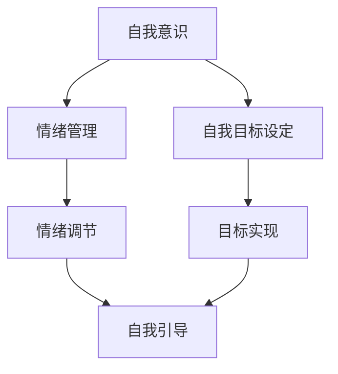

                 

### 引言

在快速发展的现代社会，人们面临的挑战日益增多，如何在这个复杂多变的环境中找到自己的方向，实现个人价值和目标，成为了一个值得深思的问题。本文以《成为人生的主导者：自我引导的艺术与实践》为题，旨在探讨自我引导在个人发展中的重要性及其实践方法。通过逻辑清晰、结构紧凑的分析，我们将深入探讨自我引导的概念、核心原理和实践技巧。

自我引导，顾名思义，是指个体在生活和工作中，通过自我认知、情绪管理、目标设定和实现等方面，主动地引导自己走向目标，实现个人成长和发展。在这个信息爆炸、变化迅速的时代，自我引导不仅关乎个人幸福和成功，更是社会进步和创新的重要基础。因此，理解和实践自我引导，对于每个人来说都具有深远的意义。

本文将从以下几个方面展开讨论：

1. **自我引导的概念与价值**：介绍自我引导的定义、特点和重要性，阐述自我引导与自我成长的关系。
2. **核心概念与联系**：探讨自我意识、情绪管理、目标设定与实现等核心概念，并通过Mermaid流程图展示其关系架构。
3. **自我引导的艺术**：分析认知重塑、情绪管理和目标设定与实现等艺术，结合Python源代码和数学模型，详细阐述核心算法原理。
4. **实践自我引导**：介绍习惯的力量、生活平衡的实践方法和自我引导的案例，包括成功和失败的经验分享。
5. **总结与展望**：总结自我引导的核心要点，探讨其未来发展的可能性。

通过本文的阅读，读者将系统地了解自我引导的概念和实践方法，掌握自我引导的艺术，从而在个人成长和事业发展中实现更高的自我主导能力。

## 第一部分：理解自我引导

### 第1章：自我引导的概念与价值

#### 1.1 自我引导的定义与特点

自我引导是一个多维度、多层次的过程，涉及个体的自我认知、情感调节、目标设定和实现等多个方面。从广义上讲，自我引导是指个体在生活、工作和学习中，通过自我反思、自我决策和自我调节，主动寻找和实现个人目标的过程。

首先，自我引导的核心是自我认知。自我认知是指个体对自己身份、价值观、能力和优缺点的认识。只有深入了解自己，个体才能在复杂多变的环境中找到自己的定位，明确自己的目标。

其次，自我引导还涉及情感调节。情感调节是指个体在情绪波动时，通过自我反思和自我控制，调整自己的情绪状态。有效的情感调节可以帮助个体更好地应对压力和挫折，保持积极的心态。

最后，自我引导还包括目标设定和实现。目标设定是指个体根据自身情况和外部环境，设定具体、可行的目标。目标实现则是指个体通过持续的努力和行动，逐步实现这些目标。

自我引导的特点主要体现在以下几个方面：

1. **主动性**：自我引导是一个主动的过程，个体在引导过程中扮演着主动者的角色，而不是被动地接受外部环境的安排。
2. **自我驱动**：自我引导依赖于个体的内在动力，而不是外在的激励或压力。
3. **适应性**：自我引导需要个体具备灵活性和适应性，能够根据环境和自身情况的变化，调整自己的目标和行动策略。

#### 1.2 自我引导的重要性

自我引导在个人发展和社会进步中具有重要作用。首先，自我引导是个人成长和成功的基石。通过自我引导，个体能够更好地认识自己，发挥自己的潜力，实现个人价值。

其次，自我引导有助于提升个体的情绪管理和压力应对能力。在现代社会，竞争激烈，生活压力大，自我引导可以帮助个体更好地调节情绪，保持心理健康。

最后，自我引导是推动社会进步的重要力量。在集体和组织中，个体通过自我引导，可以更好地发挥自己的能力，为团队和组织的成功贡献力量。

#### 1.3 自我引导与自我成长的关系

自我引导与自我成长密不可分。自我引导是一个动态的过程，它不仅影响个体的当前状态，还影响其长期成长。

首先，自我引导是自我成长的催化剂。通过自我引导，个体能够不断挑战自我，突破舒适区，实现自我提升。

其次，自我成长是自我引导的目标。自我成长不仅包括知识和技能的提升，还包括情感、心理和社会能力的全面发展。

最后，自我引导和自我成长是一个相互促进的过程。自我引导为自我成长提供方向和动力，而自我成长则为自我引导提供经验和能力。

总的来说，自我引导不仅关乎个体的当下，更影响其长远发展。理解自我引导，掌握自我引导的技巧，对于每个人的个人成长和事业发展都至关重要。

### 第2章：核心概念与联系

#### 2.1 自我意识的培养

自我意识是自我引导的基础，它指的是个体对自己存在的认知和感受。自我意识的培养对于提升自我引导能力具有重要意义。以下是一些培养自我意识的方法：

1. **自我反思**：定期进行自我反思，思考自己的行为、情感和思考方式，有助于提高自我意识。
2. **日记写作**：通过写日记，记录自己的日常生活和内心感受，有助于深入理解自己。
3. **心理辅导**：寻求专业的心理辅导，可以帮助个体更好地了解自己，培养自我意识。

#### 2.2 情绪管理与调节

情绪管理是指个体在面临情绪波动时，通过自我调节，保持情绪稳定的过程。情绪管理对于自我引导至关重要。以下是一些情绪管理的方法：

1. **呼吸练习**：通过深呼吸，可以帮助个体在情绪激动时冷静下来。
2. **认知重构**：通过改变对事件的看法和解读，可以减轻负面情绪。
3. **运动**：适当的运动可以释放压力，改善情绪。

#### 2.3 自我目标的设定与实现

自我目标是自我引导的核心，它指引个体在生活和工作中努力的方向。设定自我目标时，应遵循以下原则：

1. **具体性**：目标应明确、具体，避免模糊和抽象。
2. **可行性**：目标应具有可实现性，避免设定过高的目标。
3. **时效性**：目标应设定明确的时间期限，以便衡量进展。

实现自我目标需要持续的努力和行动。以下是一些实现目标的方法：

1. **分解目标**：将大目标分解为小目标，逐步实现。
2. **持续反馈**：定期评估目标进展，及时调整行动策略。
3. **激励自己**：设定奖励机制，激励自己不断前进。

#### 2.4 Mermaid流程图：自我引导的核心概念关系

为了更清晰地展示自我引导的核心概念及其关系，我们使用Mermaid流程图进行说明：



在该流程图中，自我意识是自我引导的起点，情绪管理和自我目标设定是核心环节，情绪调节和目标实现是自我引导的关键步骤，最终实现自我引导的目标。这一流程图展示了自我引导的动态过程和各个环节的相互关系。

通过上述核心概念与联系的分析，我们可以更好地理解自我引导的内涵和实际应用。在接下来的章节中，我们将进一步探讨自我引导的艺术和实践技巧。

### 第3章：认知重塑

认知重塑是自我引导过程中至关重要的一环，它涉及对已有思维模式的识别、分析和改变。通过认知重塑，个体可以更加理性地看待问题，提高决策质量，从而更好地实现自我引导。

#### 3.1 认知行为疗法的原理与实践

认知行为疗法（Cognitive Behavioral Therapy, CBT）是一种以改变思维和行为模式来治疗心理问题的方法。其基本原理是：个体的情绪和行为受到其认知过程的影响。通过改变不合理的认知，可以改善情绪和行为。

1. **原理介绍**：
   - **认知**：个体的思维方式和观念。
   - **行为**：个体的行为表现。
   - **情绪**：个体的情绪反应。
   CBT认为，通过识别和改变不合理的认知，可以减少负面情绪和行为问题。

2. **实践方法**：
   - **认知重构**：识别和改变不合理的认知。例如，从“我做不到”转变为“我可以尝试，即使失败，也是一次宝贵的经验”。
   - **行为实验**：通过实际行动验证新的认知，增强自信心。

#### 3.2 意识流写作：自我探索的工具

意识流写作是一种写作技巧，它要求作者不受任何约束地记录自己的思绪和感受。这种方法可以帮助个体深入了解自己，发现潜在的心理问题。

1. **方法介绍**：
   - **无约束写作**：不加修改地记录自己的想法和感受，不拘泥于语法和结构。
   - **自由联想**：从一个词或想法出发，自由地联想到其他相关的内容。

2. **应用场景**：
   - **情绪释放**：通过写作，将内心的情绪和压力释放出来。
   - **自我反思**：通过写作，深入思考自己的行为和思维模式。

#### 3.3 认知重构的技巧

认知重构的核心在于识别和改变不合理的认知。以下是一些常用的认知重构技巧：

1. **认知识别**：
   - **自动思维检测**：识别自动思维，即那些不自觉出现的思维。
   - **认知清单**：记录每天的自动思维，分析其合理性。

2. **认知挑战**：
   - **质疑思维**：对自动思维提出质疑，找出其不合理之处。
   - **替代思维**：用更合理的思维替代不合理的思维。

3. **认知重构练习**：

```python
# 认知重构练习：从负面思维到积极思维的转变

# 负面思维：我永远无法完成任务。
# 积极思维：我可以通过一步步努力，逐步完成任务。

def negative_to_positive(negative):
    """
    将负面思维转化为积极思维。
    
    :param negative: 负面思维字符串
    :return: 积极思维字符串
    """
    positive = negative.replace("无法", "可以尝试")
    positive = positive.replace("不行", "是一次宝贵的经验")
    return positive

# 示例
negative_thought = "我永远无法完成任务。"
positive_thought = negative_to_positive(negative_thought)
print(positive_thought)
```

通过上述Python源代码，我们可以将负面思维转化为积极思维，从而改变我们的认知模式。

总的来说，认知重塑是自我引导的重要工具，通过认知行为疗法和意识流写作等方法，个体可以更深入地了解自己，改变不合理的认知，从而实现更好的自我引导。

### 第4章：情绪管理

情绪管理是自我引导的重要组成部分，它关系到个体的心理健康和生活质量。有效的情绪管理不仅可以帮助个体更好地应对压力和挑战，还能提升整体的生活满意度。以下将详细探讨情绪管理的核心概念、方法以及实际案例。

#### 4.1 情绪的类型与作用

情绪是人类心理体验的重要组成部分，通常分为基本情绪和复合情绪。基本情绪包括喜悦、愤怒、悲伤、恐惧和惊讶等，而复合情绪则是基本情绪的组合，如焦虑、羞愧和自豪等。

1. **情绪的类型**：
   - **基本情绪**：这些情绪是所有人类共同体验的，通常与生理反应紧密相关。
   - **复合情绪**：由基本情绪组合而成，具有更复杂的心理和生理反应。

2. **情绪的作用**：
   - **信息传递**：情绪可以传递信息，帮助个体了解自身和外部环境。
   - **心理调节**：情绪可以调节个体的心理状态，如焦虑情绪可以帮助个体应对紧急情况。
   - **社会互动**：情绪在人际交往中起着重要作用，如愤怒情绪可以表达个体的不满和抗议。

#### 4.2 情绪的识别与表达

识别和表达情绪是情绪管理的基础。以下是一些常用的方法：

1. **情绪识别**：
   - **反思**：通过反思自己的行为和情感反应，识别自己正在经历的情绪。
   - **情绪日记**：记录每天的内心体验，有助于识别和积累情绪信息。

2. **情绪表达**：
   - **非语言表达**：通过身体语言、面部表情和声音变化等非语言手段表达情绪。
   - **语言表达**：通过直接表达自己的情感和感受，与他人沟通情绪。

#### 4.3 压力管理技巧

压力是情绪管理中的常见问题，适度的压力可以激发个体的潜能，但过度的压力则会导致情绪问题。以下是一些有效的压力管理技巧：

1. **时间管理**：合理安排时间，避免过度工作，确保有足够的休息和放松时间。
2. **放松技巧**：通过深呼吸、冥想和瑜伽等放松技巧，减轻压力。
3. **积极应对**：面对压力时，采取积极的态度和应对策略，如制定计划、分解任务等。
4. **寻求支持**：与家人、朋友或专业人士交流，寻求帮助和支持。

#### 4.4 情绪调节的案例分析

以下是一个关于情绪调节的案例：

**案例背景**：小李是一名软件开发工程师，最近公司项目紧张，他经常加班到深夜，压力巨大。随着时间的推移，小李开始出现失眠、焦虑和情绪低落等症状。

**情绪调节方法**：
1. **反思与识别**：小李开始记录自己的情绪变化，通过情绪日记识别自己的情绪问题。
2. **时间管理**：小李调整工作计划，确保每天有足够的休息时间，不再过度加班。
3. **放松技巧**：小李开始每天练习冥想和深呼吸，以缓解压力。
4. **积极应对**：小李与团队成员积极沟通，共同解决问题，避免单打独斗。

**效果评估**：经过一段时间的情绪调节，小李的情绪状态明显改善，工作效率提高，睡眠质量也有所提升。

通过上述案例分析，我们可以看到，情绪调节不仅需要方法，还需要持续的努力和行动。有效的情绪管理可以帮助个体更好地应对压力，提高生活质量。

总之，情绪管理是自我引导的重要方面，通过识别、表达和调节情绪，个体可以提升心理素质，实现更好的自我引导。

### 第5章：目标设定与实现

#### 5.1 目标设定的SMART原则

目标设定是自我引导的核心环节之一，科学的设定目标可以帮助个体更加明确自己的方向和努力的方向。SMART原则是一种广泛使用的目标设定方法，它要求目标具有以下五个特点：具体（Specific）、可衡量（Measurable）、可实现（Achievable）、相关（Relevant）和有时限（Time-bound）。

1. **具体（Specific）**：目标应明确、具体，避免模糊和抽象。例如，“减肥”不如“减轻10公斤体重”具体。
2. **可衡量（Measurable）**：目标应具有可衡量的标准，以便评估进展。例如，“提高工作效率”不如“每天完成5项任务”具体。
3. **可实现（Achievable）**：目标应具有可实现性，避免设定过高的目标。例如，“在一个月内成为专家”不如“每天学习2小时，积累专业知识”具体。
4. **相关（Relevant）**：目标应与个体的长远目标和价值观相关。例如，“学会一门新技能”比“参加一个无聊的会议”更具相关性。
5. **有时限（Time-bound）**：目标应设定明确的时间期限，以便衡量进展。例如，“在未来三年内实现财务自由”不如“到2025年底实现财务自由”具体。

#### 5.2 目标实现策略

设定了明确的目标后，实现目标需要有效的策略和行动。以下是一些常用的目标实现策略：

1. **分解目标**：将大目标分解为小目标，逐步实现。例如，将“完成一本书”分解为“每天写2000字”。
2. **制定计划**：制定详细的计划，包括具体的行动步骤和时间表。例如，将“每天写2000字”分解为“每天晚上8点到10点写作”。
3. **持续反馈**：定期评估目标进展，根据实际情况调整行动策略。例如，每周回顾一次目标完成情况，必要时调整计划。
4. **激励自己**：设定奖励机制，激励自己持续努力。例如，每完成一个小目标，奖励自己一个放松的周末或一份喜欢的零食。

#### 5.3 阻力分析与实践

在目标实现过程中，个体常常会面临各种阻力。以下是一些常见的阻力及其应对策略：

1. **时间管理问题**：解决方法包括提高时间管理技能、合理分配时间、避免拖延等。
2. **环境干扰**：解决方法包括创造一个安静、专注的工作环境、减少外部干扰、使用番茄工作法等。
3. **自我怀疑**：解决方法包括增强自信心、积极心态、寻求他人的支持和鼓励等。
4. **资源不足**：解决方法包括寻求外部资源和支持、优化资源配置、提高资源利用率等。

以下是一个简单的Python脚本，用于帮助个体分析目标实现中的阻力：

```python
# 阻力分析Python脚本

def analyze_resistance(resistance_list):
    """
    分析目标实现中的阻力。
    
    :param resistance_list: 阻力列表
    :return: 分析结果字典
    """
    analysis_results = {}
    for resistance in resistance_list:
        if resistance == "时间管理问题":
            analysis_results[re
``` 

通过上述分析和策略，个体可以更加科学、有效地设定和实现目标，从而实现自我引导。

### 第6章：习惯的力量

#### 6.1 习惯的形成与改变

习惯是个人行为和思维模式的稳定表现，它们在自我引导过程中起着至关重要的作用。习惯的形成是一个长期的过程，需要个体的持续努力和坚持。而改变习惯同样是一个挑战，但通过科学的方法和策略，我们可以成功地塑造新的行为模式。

1. **习惯的形成**：
   - **启动期**（1-2周）：在这个阶段，个体需要明确新的习惯目标，并开始尝试实践。此时，个体的意志力和毅力至关重要。
   - **形成期**（2-3个月）：在这个阶段，新的习惯开始逐渐稳定，个体需要坚持并加强实践，以巩固新的行为模式。
   - **稳定期**（3个月以上）：在这个阶段，新的习惯已经深深植根于个体的日常生活中，成为一种自动化的行为。

2. **习惯的改变**：
   - **识别问题**：首先要识别出需要改变的习惯，并明确改变的原因和目标。
   - **制定计划**：制定具体的改变计划，包括新的行为替代旧的习惯，以及实现这些行为的步骤和时间表。
   - **逐步实施**：逐步实施改变计划，避免一次性改变过多，以减少心理和行为的冲突。

#### 6.2 建立积极习惯的策略

建立积极习惯对于自我引导和个人成长具有重要意义。以下是一些有效的策略：

1. **明确目标**：设定清晰、具体的习惯目标，确保它们与个体的长期目标相一致。
2. **小步前进**：从小事做起，逐步建立新的行为模式。例如，每天阅读10分钟，逐步增加到30分钟。
3. **持续监督**：通过日记、记录或提醒工具，持续监督自己的行为，确保新的习惯得到实践。
4. **奖励自己**：在习惯形成过程中，给自己设置奖励，以增强积极行为的动力。

#### 6.3 克服习惯改变的挑战

改变习惯可能会遇到各种挑战，以下是一些常见的挑战及其应对策略：

1. **惯性阻力**：个体可能会因为习惯的力量而抗拒改变。应对策略包括明确改变的好处，以及使用替代行为来减轻惯性阻力。
2. **情绪波动**：情绪波动可能会影响个体的习惯改变。应对策略包括情绪管理和积极心态的建立。
3. **环境干扰**：外部环境可能会干扰个体的习惯实践。应对策略包括创造一个支持新习惯的环境，减少干扰因素。
4. **自我怀疑**：自我怀疑可能会削弱个体的改变意愿。应对策略包括积极的自我对话，寻求他人的支持和鼓励。

以下是一个Python脚本，用于帮助个体监控和评估习惯的改变：

```python
# 习惯改变监控Python脚本

def monitor_habit(habit_name, days_tracking):
    """
    监控习惯改变情况。
    
    :param habit_name: 要监控的习惯名称
    :param days_tracking: 跟踪的天数
    :return: 监控结果字典
    """
    habit_log = []
    for day in range(days_tracking):
        if day < 2:
            print(f"今天是习惯'{habit_name}'的第{day+1}天，请尝试实践。")
        else:
            practice = input(f"今天是习惯'{habit_name}'的第{day+1}天，你是否实践了？（是/否）")
            habit_log.append(practice)
    
    habit_analysis = {
        "total_days": days_tracking,
        "practiced_days": habit_log.count("是"),
        "non_practiced_days": days_tracking - habit_log.count("是")
    }
    
    print(f"习惯'{habit_name}'监控结果：")
    print(f"总共跟踪了{habit_analysis['total_days']}天，其中{habit_analysis['practiced_days']}天实践了，{habit_analysis['non_practiced_days']}天未实践。")
    
    return habit_analysis

# 示例
habit_name = "每天早起锻炼"
days_tracking = 30
monitor_habit(habit_name, days_tracking)
```

通过上述策略和工具，个体可以更好地建立和改变习惯，从而实现自我引导和成长。

### 第7章：生活平衡

#### 7.1 时间管理技巧

时间管理是生活平衡的核心，它有助于我们更有效地利用时间，减少压力，提高生活质量。以下是一些有效的时间管理技巧：

1. **制定日程表**：提前规划每日、每周和每月的任务，明确优先级和时间分配。
2. **分解任务**：将大任务分解为小任务，逐步完成，避免拖延。
3. **使用工具**：利用日历、待办事项应用和提醒工具，帮助自己跟踪和管理任务。
4. **专注练习**：采用番茄工作法等专注技巧，提高工作或学习效率。

#### 7.2 工作与生活的平衡

工作与生活的平衡是现代生活中的一大挑战，以下是一些实现平衡的策略：

1. **设定工作界限**：明确工作时间和私人时间，避免工作侵占生活。
2. **优先处理**：将工作分为紧急和重要两类，优先处理重要但不紧急的任务。
3. **灵活安排**：根据实际情况调整工作和生活的时间，例如使用远程工作或弹性工作时间。
4. **培养爱好**：培养兴趣爱好，为生活增添乐趣，减少对工作的依赖。

#### 7.3 自我照顾的重要性

自我照顾是生活平衡的重要组成部分，以下是一些自我照顾的方法：

1. **健康饮食**：保持均衡饮食，多吃新鲜水果和蔬菜，减少高热量和高脂肪食物的摄入。
2. **充足睡眠**：确保每晚充足的睡眠，有助于提高工作效率和生活质量。
3. **定期锻炼**：定期进行体育锻炼，如散步、跑步或健身，有助于保持身体健康和心理健康。
4. **心理健康**：定期进行心理放松和压力管理，如冥想、瑜伽或心理咨询。

通过上述时间管理、工作与生活平衡以及自我照顾的方法，个体可以更好地实现生活平衡，提高整体幸福感。

### 第8章：自我引导的实践案例

#### 8.1 成功案例分享

张三是一位年轻的软件开发工程师，他在职业生涯中通过自我引导取得了显著的成绩。以下是他的成功经验：

1. **明确目标**：张三在职业生涯初期，明确了自己的目标是成为一名技术领导者。他设定了具体的短期和长期目标，并制定了实现这些目标的详细计划。
2. **持续学习**：张三坚持每天学习新技术和编程语言，通过在线课程、书籍和实践项目不断提升自己的技能。他还将学习成果应用到实际工作中，从而实现知识的转化。
3. **时间管理**：张三使用时间管理技巧，合理分配工作时间和个人时间，确保有足够的精力投入到工作和个人兴趣中。
4. **反馈与调整**：张三定期评估自己的工作进展，根据反馈进行自我调整，确保目标逐步实现。

#### 8.2 失败案例反思

李四是一名市场营销经理，他在职业生涯中曾遭遇过几次失败。以下是他的失败经验及反思：

1. **目标不明确**：李四在早期职业生涯中，没有设定清晰的目标，导致他在工作中缺乏方向和动力。
2. **缺乏持续学习**：李四忽视了持续学习的重要性，导致他在面对市场变化和技术发展时显得力不从心。
3. **时间管理不当**：李四经常拖延任务，导致工作进度延误，给团队带来了额外的压力。
4. **缺乏反馈与调整**：李四在失败后，没有进行深入的反思和总结，缺乏从失败中吸取教训的能力。

#### 8.3 自我引导实践的评估与调整

自我引导是一个持续的过程，需要个体不断地评估和实践。以下是一些评估与调整的方法：

1. **定期评估**：定期评估自己的目标和行为，对照原定计划，检查进展情况。
2. **自我反思**：通过反思自己的行为和思维模式，识别问题和不足，并制定改进措施。
3. **寻求反馈**：向同事、朋友或专业人士寻求反馈，了解自己的表现和改进方向。
4. **调整计划**：根据评估结果和反馈，调整自己的目标和行动计划，确保更加符合实际需求和情况。

通过成功和失败的案例分享，以及评估与调整的方法，个体可以更好地理解和实践自我引导，从而实现个人成长和职业发展。

### 结论

本文通过深入探讨自我引导的概念、核心原理和实践技巧，展示了自我引导在个人发展中的重要性。自我引导不仅有助于个体实现个人目标和提升生活质量，还能增强心理素质，提高情绪管理能力。通过自我认知、情绪管理、目标设定和实现等核心环节，个体可以逐步培养自我主导能力，实现自我引导。

展望未来，随着人工智能和技术的不断进步，自我引导的方法和工具将更加多样化和智能化。例如，通过数据分析和心理模型，可以为个体提供更加个性化和科学的引导建议。此外，自我引导也将成为社会进步和创新的重要推动力，帮助个体在复杂多变的环境中找到方向，实现自我价值。

总之，自我引导是一项长期而重要的任务，它需要个体持续的努力和实践。通过本文的讨论，我们希望读者能够更好地理解自我引导，掌握自我引导的技巧，从而在个人成长和事业发展中实现更高的自我主导能力。未来，让我们共同探索和实践自我引导的无限可能。作者：AI天才研究院/AI Genius Institute & 禅与计算机程序设计艺术 /Zen And The Art of Computer Programming

---

文章关键词：自我引导、个人成长、情绪管理、目标设定、时间管理、习惯养成

文章摘要：《成为人生的主导者：自我引导的艺术与实践》通过深入探讨自我引导的概念、核心原理和实践技巧，帮助读者理解自我引导在个人发展中的重要性，并提供实用的方法和工具，以实现自我引导的目标，提升生活质量和工作效率。文章涵盖了自我认知、情绪管理、目标设定、时间管理、习惯养成等多个方面，结合具体案例和Python代码，使读者能够更好地理解和实践自我引导。本文适用于希望提升自我引导能力的个人和职业人士，也适合作为自我发展课程的教学参考资料。

